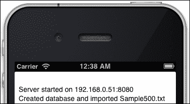
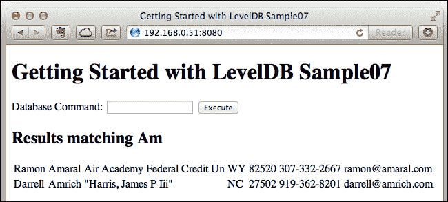

# 第七章。使用 REPL 和命令行进行调试

本章暂时放下对数据库 API 的编程，通过查看两个不同的支持工具以及如何在您的 iOS 应用中包含一个调试 web 服务器来休息。这个服务器可以用于任何应用，以提供补充正常用户界面的额外访问。能够导出数据是大多数数据库开发者期望的重要功能——SQL 系统通常有在服务器上执行原始 SQL 的方法。包含服务器比使用工具要麻烦，但它们不能在设备上的数据上运行；只能在 OS X（包括您的模拟器工作目录中的数据）上运行。

# 构建和运行 LevelDB 导出工具

标准的 LevelDB 源代码分发包括一个导出工具，但它不是通过默认的 `Makefile` 构建的。这个导出工具让您可以看到您表内容的原始副本。在您为给定设置构建了 LevelDB 之后，您可以使用以下命令构建导出：

```swift
make leveldbutil

```

如果您使用 `CXXFlags` 设置构建了 LevelDB，那么您需要使用相同的设置构建 `util` 并在 `LDFlags` 中重复它们以确保 LevelDB 构建。单个命令行看起来如下（没有换行）：

```swift
CXXFLAGS="-std=c++11 -stdlib=libc++" LDFLAGS=
 "-std=c++11 -stdlib=libc++" make leveldbutil

```

正如您已经看到的，LevelDB 数据库在文件夹内创建了许多文件。这些文件的作用在 第十章 *调整和关键策略* 中进一步解释。

根据您对数据库的操作，它可能没有生成任何 `.sst` 文件。我们的一些快速操作，仅添加少量记录，只会创建 `.log` 文件。`Sample06x` 使用 50,000 条记录，以每批 1,000 条的方式写入，因此它保证了写入多个 `.sst` 文件，给我们一个更有趣的导出。您将在下一章中更详细地讨论 `Sample06x`，但现在它有两个关键类型，以 `N~` 和 `P~` 开头，它们在我们的代码中以交替的顺序添加。

伴随的代码包含 `leveldbutil` 构建日志以及运行它的几个日志。对于大型 `Sample06x` 的一个高度省略的日志在文件 `log of dump` `testLeveldb06x.txt` 中，显示了在 OS X 上运行 `Sample06x` 创建的数据库文件夹上运行的工具。

我们将要查看的第一个文件是 `MANIFEST` 文件，它显示了写入遍历是如何分批的，以及使用了特殊的比较器（下一章中解释）。目前您对比较器的关注主要是，导出工具忽略了它们，但其他工具如 lev（见以下代码）无法使用自定义比较器打开数据库。因此，使用 `leveldbutil` 检查 `MANIFEST` 文件让您可以检查这一点作为失败点，如果您有其他程序在打开时出错。

```swift
$ ./leveldbutil dump /tmp/testLeveldb06x/MANIFEST-000002 
$ ./leveldbutil dump /tmp/testLeveldb06x/*.log
$ ./leveldbutil dump /tmp/testLeveldb06x/000005.sst 
$ ./leveldbutil dump /tmp/testLeveldb06x/000007.sst

```

下一个文件是日志文件——只有一个活动日志文件，因此您可以使用`*.log`作为此处所示命令。日志包含最后一批写入的记录，从输入文件的 42001 行开始。

日志随后显示了两个`.sst`文件的省略输出，这两个文件是排序表。LevelDB 处理创建这些不可变存储，只留下`.log`文件中的最近条目。注意这两个表有一个看似交织的键集。

# 安装 Node.js 和 lev 实用工具

流行的 node 环境提供了一个服务器端或命令行环境，用于运行 JavaScript 程序，同时也支持控制台甚至桌面程序（使用`AppJS`等打包器）。为 node 创建的许多库中包括 LevelUP 和 LevelDOWN。LevelDOWN 是 LevelDB C++绑定的简单包装器，提供了映射到 JavaScript 函数的标准 LevelDB API。LevelUP 最初是 LevelDOWN 的高级接口，但现在也是一个抽象层，允许使用提供 LevelDB 函数的其他后端。

来自[`github.com/hij1nx/lev`](https://github.com/hij1nx/lev)的**lev**实用工具提供了一个命令行和 GUI，可以直接使用这些库与 LevelDB 数据库进行工作。它安装了 LevelUP 和 LevelDOWN。我们只关心将 lev 作为一个实用工具使用，而不关心其实现方式。Node.js 的安装器可以从[`nodejs.org/`](http://nodejs.org/)获取，是一个简单的 GUI 安装器，将 node 和**npm**（Node 包管理器）放入`/usr/local/bin`。您还需要从[`www.python.org/download/releases/2.7.5/`](http://www.python.org/download/releases/2.7.5/)安装 Python 2.7，以便构建 LevelDown（讽刺的是，是的，Python 用于脚本构建 JavaScript 工具的 C++绑定）。

伴随的`使用 node 包管理器安装 lev 的日志.txt`详细显示了这些包的安装过程，包括如果您未升级 OS X 中的默认 Python 版本时发生的错误。安装由单个命令触发，自动下载、构建和安装以下包：

```swift
$sudo npm install –g lev
$lev /tmp/testLeveldb06 --start "World" --end "You" --keys
"Worlds\tTrudy"
"Wubbel\tBuster"
"Wyrosdick\tMerle"
"Youtsey\tLynda"

```

一旦安装了 lev，它就提供了命令行导出键、删除记录和添加新记录的功能。请参阅`dump testLeveldb06x.txt 的日志`以获取更多示例。

## 在您的 iOS 应用内添加 REPL 进行调试

**REPL**这个术语在脚本语言中常用，意味着**读取-评估-打印-循环**。REPL 通常接受命令并打印其结果，然后循环接受下一个命令。它就像终端命令行，但嵌入在应用中。

`Sample07`代码提供了一个包含小型 Web 服务器并为数据库操作提供 REPL 的 iPhone 应用的示例。该应用可以在模拟器和设备上运行。以下截图显示了它在模拟器上的运行，因此显示的 IP 地址是运行模拟器的 OS X 开发系统的地址：



在模拟器中进行调试时的状态报告，显示用于浏览设备的地址

一旦你正在运行应用程序，你可以打开一个网页浏览器并输入此地址，**192.168.0.51:8080**，如前一张截图所示。你可以从任何设备连接多个浏览器到服务器——使用 iPad 在 iPhone 或 iPod Touch 上查询数据库！网络服务器完全在后台运行，因此你的正常应用程序行为可以继续。这使得它成为一个可以插入任何应用程序的调试工具（警告：如果包含在分布式应用程序中，这将是一个安全漏洞，除非你添加了身份验证）。

REPL 的第一个版本会寻找已知的命令，或者如果它没有识别出命令，它假定你正在输入一个要搜索的部分键。输入`Am`的结果如下所示。一些服务器命令包括：

+   `help`列出命令及其语法，请参阅`readme.md`文档

+   `prefix aKey`将`aKey`设置为从现在起任何键的前缀

+   `unprefix`清除键前缀

+   `put akey aValue`添加键`aKey`的值`aValue`，使用引号包含空格，使用`\`嵌入引号，例如`put Author "Andy Dent"`

+   `get akey`返回与`akey`关联的完整值

+   `del akey`删除键`akey`

+   `count fromPart toPart`仅计算记录，其中`fromPart`和`toPart`都是可选的（它在该部分键范围内运行迭代器）

+   `keys fromPart toPart`列出键，其中`fromPart`和`toPart`都是可选的

+   `stats`显示数据库统计信息



输入 Am 作为命令后的浏览器结果

正在使用的是开源的`GCDWebServer`，来自[`github.com/swisspol/GCDWebServer`](https://github.com/swisspol/GCDWebServer)，模板页面生成使用`GRMustache`，来自[`github.com/groue/GRMustache`](https://github.com/groue/GRMustache)，以提供使用双大括号`{{括号}}`的通用**Mustache**语法模板。

这两个源套件的组合正在合并成一个产品，增加了代码，使编写自己的嵌入式调试 REPL 更容易，在[`github.com/AndyDentFree/REPLierGCDWebServer`](https://github.com/AndyDentFree/REPLierGCDWebServer)上，该工具包将在本书发布后继续维护，作为一个通用的 REPL 工具包。

提供 Web 模板的`Sample07`逻辑在`ASDLevelDBREPL.m`中，并且可以非常容易地添加到任何应用程序中，只需添加一个`ASDLevelDBREPL` `*`属性，然后启动它并将它的 db 属性设置为在`Sample06`中创建的`APLevelDB*`属性。

在`Sample07`中，这是在`GSdLDB07ViewController.m`的`viewDidLoad`中完成的，一个稍微简化的版本如下：

```swift
self.webserver = [ASDLevelDBREPL serverWithReporter:^(id msg){
    [self appendToDisplay:msg];
}];
self.webserver[@"title"] = @"Getting Started ... Sample07";
[self.webserver start]; // start the web server FROM MAIN THREAD
NSError* openError;
self.model = [Sample06_Model 
  modelWithSampleDatabasePath:&openError];
if (openError == nil) {
  [self.model loadSampleDatafile:@"Sample500.txt"];
 self.webserver.db = self.model.db;
}
```

# 摘要

我们已经介绍了几种预构建的实用工具，用于查看数据库的不同方面，并学习了一种向任何 iOS 应用添加调试 REPL 的有价值方法。接下来，我们将回到我们 GUI 支持的复杂性，使用更丰富的`Sample06`版本。下一章还将讨论存储更多信息的方法，使我们的数据库能够自我描述，从而可以构建一个更强大的数据库层，以抽象掉一些这些责任。
