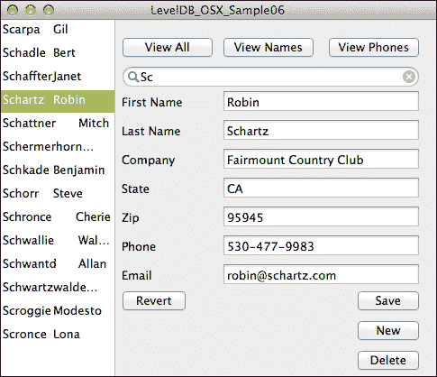
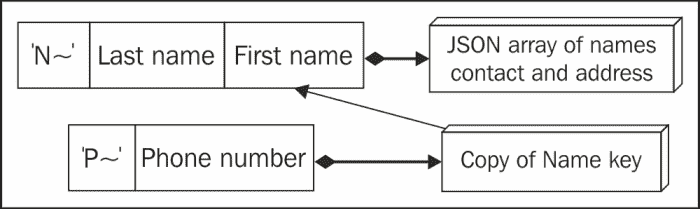
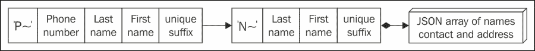
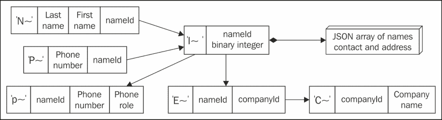

# 第八章。更丰富的键和数据结构

在本书的这一章中，我们将回顾一些与 LevelDB 相关的经典数据库理论。这种动机始于更丰富的应用研究。第六章 *与 Cocoa UI 集成* 介绍了如何将数据库连接到 GUI 并添加记录的基本方法。大多数应用程序还需要处理更改或删除数据。本章的代码将这些操作添加到 `Sample06` 中，在一个保持相同文件名的副本中，以便与更简单的示例进行比较。本章的前一部分结构与 第六章 *与 Cocoa UI 集成* 类似，以帮助进一步进行比较。

`Sample06x` 还通过不区分大小写的名称和智能电话号码改进了搜索。搜索需要通过自定义 LevelDB 的索引功能来支持。作为 `Comparator` 讨论的一部分，我们将探讨处理二进制整数键的方法。

# 完成丰富 GUI 的数据源

`Sample06` 的扩展版本增加了两个主要方面：

+   更改 `tableview` 中列出的数据，查看二级索引

+   删除和重命名记录，意味着键更新

当涉及到更新时，`Sample06` 展示了如何一个 **保存** 按钮可以简单地触发将当前键的记录值写回。我们的第一个版本相当有缺陷，因为它每次更改名称时都会创建记录的可见副本。我们需要确保重命名发生，而不是让 **保存** 行为像真的 **另存为** 一样。

为列出添加电话号码二级索引意味着每次从 GUI 保存时都要写入第二个键。对于新记录来说，这很简单。然而，当我们保存现有记录时，可能需要删除旧键值，因为它们指向过时的数据。这意味着在模型中需要智能清理，知道何时删除键和何时重写。如果这些概念是熟悉的，可以快速浏览这部分，但仍需查看如何使用键前缀作为标志来跟踪当前列出模式。

# 将 OS X 图形用户界面扩展以完全支持编辑

完整的 OS X 图形用户界面增加了更多用于编辑和排序列表的动作按钮。以下截图显示了列表的选择：



一个 OS X 示例应用程序，显示具有列表选择和更多编辑控制的列表

扩展的 OS X 应用程序也是一个单窗口，它增加了：

+   更多按钮和菜单项以提供 **视图** 命令

+   **还原** 和 **删除** 命令的按钮和菜单项

# 将数据库连接到 NSTableView

在简单的 OS X 应用程序中，`AppDelegate` 对象在 iOS 应用程序中扮演着 `ViewController` 类的角色。因此，所有这些界面方法和出口都在 `GSwLDB06osxAppDelegate` 中。图形界面在 `MainMenu06.xib` 中。

+   **查看所有**按钮和**查看 – 带前缀的所有记录**菜单项连接到 `(IBAction)viewAllRecords`

+   **查看名称**按钮和**查看 – 名称**菜单项连接到 `(IBAction)viewNamesOnly`

+   **查看电话**按钮和**查看 – 电话号码**菜单项连接到 `(IBAction)viewPhonesOnly`

+   `NSSearchField` 类的动作和 `NSTableView` 类的 `datasource` 和 `delegate` 输出连接方式与 `Sample06` 相同

`GSwLDB06osxAppDelegate` 的扩展声明如下代码所示。我们将在讨论编辑记录时讨论其他动作和输出：

```swift
@interface GSwLDB06osxAppDelegate: NSObject
  <NSApplicationDelegate, NSTableViewDataSource,
   NSTableViewDelegate>
- (IBAction)viewAllRecords:(id)sender;
- (IBAction)viewNamesOnly:(id)sender;
- (IBAction)viewPhonesOnly:(id)sender;
- (IBAction)viewMatches:(id)sender;
- (IBAction)newRecord:(id)sender;
- (IBAction)saveRecord:(id)sender;
- (IBAction)revertRecord:(id)sender;
- (IBAction)deleteRecord:(id)sender;
@property (weak) IBOutlet NSTextField *FirstNameEntry;
...
@property (weak) IBOutlet NSTextField *EmailEntry;
@property (assign) IBOutlet NSWindow *window;
@property (retain) IBOutlet NSTableView *tableView;
@end
```

加载一组行并将它们复制到 `tableview` 对象的机制与 `Sample06` 的简单示例相同。所有关于通过电话或通过名称查看的含义的知识都隐藏在模型类中。因此，要更改整个列表为电话，我们有一个调用的 `viewPhonesOnly` 动作：

```swift
- (IBAction)viewPhonesOnly:(id)sender {
  [self.model loadPhones];
  [self.tableView reloadData];
  [self loadFieldsForCurrentSelectedRow];  // explicitly reload 
}
```

模型的扩展公共接口位于 `Sample06_Model.h` 中，添加了：

```swift
- (void)loadAllRecords;
- (void)loadNames;
- (void)loadPhones;
- (void)deleteMatching:(NSString*)key;
- (NSArray*)fieldsForKey:(NSString*)key;
- (BOOL)saveRecord:(NSArray*)fields
    replacingKey:(NSString*)oldKey;
```

`Sample06_Model.m` 中的类扩展也略有不同，添加了一些方法和属性，并用更复杂的一个替换了 `addRecord`：

```swift
@interface Sample06_Model() {}
- (NSString*)mainKeyFrom:(NSString*)key;
- (void)addRecord:(NSArray*)fields 
    indexingPhone:(BOOL)addPhoneKey
    using:(id<APLevelDBWriteBatch>)batch;
@property (retain) NSString* lastPrefixUsed;
@property (nonatomic) BOOL neverLoaded;
```

数据库创建和从 `sample50000.txt` 加载与 `Sample05` 非常相似，与 `Sample06` 相同，除了我们使用 50,000 条记录来查看性能影响。我们将在讨论编辑时详细查看记录添加。继续关注加载表格，与 `Sample05` 的模型代码相比，最大的不同是它在数组中缓存结果而不是在迭代时仅打印键（对于 50,000 条记录消耗 200 MB 的内存）。它使用相同的 `N~` 或 `P~` 前缀来区分键类型。添加到 `Sample05` 简单模型中，支持 GUI 意味着模型会记住 `lastPrefixUsed`，这取决于用户对 **名称** 或 **电话** 的选择。我们看到的两个从 GUI 调用的加载方法如下：

```swift
- (void)loadPhones {
  self.rowsForUI = [self.db keysWithPrefix:@"P~"
    strippingFirst:2];
  self.lastPrefixUsed = @"P~";
}

- (void)loadStartingWith:(NSString*)partialKey {
  NSString* prefixedKey = [self.lastPrefixUsed 
    stringByAppendingString:partialKey];
  self.rowsForUI = [self.db keysWithPrefix:prefixedKey 
    strippingFirst: [self.lastPrefixUsed length]];
}
```

这两个都使用了一个添加到 APLevelDB 类别 `APLevelDB_ADSearches` 中的方法，与我们在 `Sample05` 中看到的 `enumerateKeysWithPrefix` 相同。它通过 `strippingFirst` 参数扩展了该方法，允许调用者指定键上非打印前缀的长度。当我们获取给定类型的所有记录时，前缀长度将与我们所见的相同两个字符（`N~` 或 `P~`）。

然而，当响应 GUI 的 `viewMatches` 动作时，我们正在搜索包含其搜索词的前缀，例如，以 `Smith` 开头的 `N~Smith`。我们的前缀是七个字符长，但我们想显示时去掉两个。在 `APLevelDB_APLevelDB_ADSearches.mm` 中查看，我们看到搜索实现如下：

```swift
- (NSArray*)keysWithPrefix:(NSString*)prefix 
    strippingFirst:(int)numCharsToStrip
{
  NSMutableArray *keys = [NSMutableArray array];
  if (numCharsToStrip > 0) {
    [self enumerateKeysWithPrefix:prefix 
      block:^(NSString* key, BOOL* stop) {
        [keys addObject:[key substringFromIndex:numCharsToStrip]];
      }];
  }
  else {  // for speed use a different block that copies whole
    [self enumerateKeysWithPrefix:prefix 
      block:^(NSString* key, BOOL* stop) {
        [keys addObject:key];
      }];
  }
  return keys;
}
```

在理解了键数组生成的方式之后，让我们回顾`Sample06_Model.m`，看看如何使用键数组为`tableview`对象提供值。`Sample06`的`countRows`和`keyForRow`方法没有改变，但我们的列表现在更智能了。以下代码片段显示了如何使用键数组为`tableview`对象提供值：

```swift
- (void)loadListForUI {
  if (self.neverLoaded) {
    self.neverLoaded = NO;
    [self loadNames];  // default UI is to give them names first
  }
  else if (self.lastPrefixUsed == @"N~") 
    [self loadNames];
  else if (self.lastPrefixUsed == @"P~") 
    [self loadPhones];
  else
    [self loadAllRecords];
}
```

你注意到这个小技巧了吗？我们只显示单列表格，但`Name`键是姓氏和名字的组合，中间用制表符分隔。我们只获取这个作为单个字符串，并允许 GUI 在中间有一个波浪线，而不是分成两列。这使得切换到单列电话列表更容易。

# 将记录详情连接到编辑表单

扩展的编辑行为包括：

+   **还原**：丢弃任何已输入的详细信息并重新加载当前记录

+   **保存**：将输入的详细信息复制回数据库，包括更改键和刷新列表

+   **删除**：从数据库中移除当前记录和次要键

允许并响应用户选择的变化与`Sample06`中的处理方式相同，即从被复制的记录中获取值并填充到输入字段中。`Sample06_Model`中的`fieldsForRow`方法的核心逻辑保持不变——基本的记录结构没有改变。然而，代码已经被拆分成了单独的`fieldsForKey`方法，该方法在多个地方被使用。

```swift
- (NSArray*)fieldsForRow:(NSInteger)index {
  NSString* key = [self keyForRow:index];
  return [self fieldsForKey:key];    
}

- (NSString*) keyForRow:(NSInteger)row {
  if (self.rowsForUI == nil)
    [self loadListForUI];
  return (NSString*)(self.rowsForUI[row]);
}

- (NSArray*)fieldsForKey:(NSString*)key {
  NSData* mainRec = [self.db dataForKey:[self mainKeyFrom:key]];
  NSError* decodeErr;
  NSArray* fields = [NSJSONSerialization 
    JSONObjectWithData:mainRec options:0 error:&decodeErr];
  assert(decodeErr == nil);
  return fields;
}
```

由于我们的 GUI 允许用户列出主`Name`索引或`Phone`键，因此引入了一点复杂性。我们需要一个`Name`键来从数据库中获取详细记录，但当前表可能显示的是`Phones`。这意味着列表中选定的值不是我们需要的键类型。或者，用数据库术语来说，我们是通过外键来列出它的。

在这种情况下，对于模型来说，记住列表的类型至关重要，它将其视为由`loadPhones`等方法设置的`lastPrefixUsed`集合。模型对 GUI 一无所知。它只知道它最后被要求获取电话或名称。如果我们有一个`Phone`键，我们需要读取其记录以获取主键（记住`Sample05`中的这个**次要索引**）。以下是完成此操作的方式：

```swift
- (NSString*)mainKeyFrom:(NSString*)key {
  if ([key hasPrefix:@"N~"])
    return key;  // original is already prefixed
  if ([self.lastPrefixUsed isEqualToString:@"N~"]) 
    return [@"N~" stringByAppendingString:key];
  if ([self.lastPrefixUsed isEqualToString:@"P &&
    ![key hasPrefix:@"P~"])
      key = [@"P~" stringByAppendingString:key];
  // if get here need to translate a Phone key into a main one,
  // read the main key indexed by phone number
  return [self.db stringForKey:key];  // read fully prefixed key
}
```

`mainKeyFrom`的大部分内容是关于键构建，如字符串前缀。最后一行使用`stringForKey`获取主键作为外键操作；这与我们在第四章中讨论的相同关系搜索，*迭代和搜索键*。

# 使用键更新保存数据

我们已经看到数据加载被扩展以处理通过不同索引进行列表和搜索。正如原始的`Sample06`所示，为了保存，我们需要将字段数组发送回模型以更新数据库。这次我们将正确更新索引。这始于`GSwLDB06osxAppDelegate`知道它正在保存新记录还是旧记录——模型需要知道它替换了什么。

```swift
- (IBAction)saveRecord:(id)sender {
  NSArray* fields = [NSArray arrayWithObjects:
    [self.FirstNameEntry stringValue],
    ...
    [self.EmailEntry stringValue],
    nil
  ];

  if (self.isNewRecord) {
    [self.model saveRecord:fields];
    self.isNewRecord = NO;
    [self.tableView reloadData];  // list shows new record
  } else {
    NSString* origKey = [self.model keyForRow:
      [self.tableView selectedRow]];
    if ( [self.model saveRecord:fields replacingKey:origKey] )
      [self.tableView reloadData]; // list shows new Name/Phone
  }
}
```

简单保存的情况是当保存了一个新记录，因此模型知道它正在创建一个新记录。我们现在看到我们的常见`addRecord`方法像`Sample05`一样工作，添加一个指向主键的电话记录，并使用 JSON 作为主体，如下所示：

```swift
- (void)saveRecord:(NSArray*)fields {
  id<APLevelDBWriteBatch> wb = [self.db beginWriteBatch];  
  [self addRecord:fields indexingPhone:YES using:wb];
  [self.db commitWriteBatch:wb];  
  self.rowsForUI = nil; // force reload when UI refreshes
  return YES;
}
- (void)addRecord:(NSArray*)fields indexingPhone:(BOOL)addPhoneKey 
    using:(id<APLevelDBWriteBatch>)batch
{
  NSString* nameKey = nameKeyFromFields(fields); 
  NSError* encErr;
  NSData* enc = [NSJSONSerialization dataWithJSONObject:fields 
    options:0 error:&encErr];
  assert(encErr == nil);
  [batch setData:enc forKey:nameKey];  // main record
  if (addPhoneKey && [fields[ePhone] length] > 0) {
    NSString* phoneKey = phoneKeyFromFields(fields);
    [batch setString:nameKey forKey:phoneKey];  
  }
}
```

保存现有记录的复杂情况必须应对需要更改`Phone`键的二级索引的需求，如果电话号码或主键发生了变化。如下所示：

```swift
- (BOOL)saveRecord:(NSArray*)fields replacingKey:(NSString*)oldKey 
{
  NSArray* oldRecord = [self fieldsForKey:oldKey];
  const int numFields = [oldRecord count];
  bool allSame = true;
  for (int i=0; i<numFields && allSame; ++i) {
    allSame = [fields[i] isEqualToString:oldRecord[i]];
  }
  if (allSame)
    return NO;  // so caller knows no change

  id<APLevelDBWriteBatch> wb = [self.db beginWriteBatch];      
  NSString* keyToUpdate = [self mainKeyFrom:oldKey];
  NSString* newKey = nameKeyFromFields(fields);
  BOOL replacePhone = NO;
  if ( ![newKey isEqualToString:keyToUpdate] ) {
    [wb removeKey:keyToUpdate];
    replacePhone = YES; // value (names) of phone record changed 
  }
  NSString* phoneKey = phoneKeyFromFields(fields);
NSString* oldPhoneKey = phoneKeyFromFields(oldRecord);
if ( ![phoneKey isEqualToString:oldPhoneKey] ) {
  replacePhone = YES;  // key changed
  [wb removeKey:oldPhoneKey];
}
  [self addRecord:fields indexingPhone:replacePhone using:wb];
  [self.db commitWriteBatch:wb];  
  self.rowsForUI = nil;  // forced reload when UI refreshes
  return YES;
}
```

如果所有键保持不变，但只有一些非键值改变，例如电子邮件，则保存方法可能只是简单地写入一个记录。在最坏的情况下，如果电话号码和其中一个名称都改变了，则之前的代码执行两次删除和两次写入。

# 对新和删除命令的响应

`new`命令只是一个 GUI 动作，清除所有输入字段。它设置委托`isNewRecord`的属性，正如你在`saveRecord`中之前看到的。模型不知道它是一个新记录，直到你调用之前展示的简单保存。以下代码显示了`new`命令：

```swift
- (IBAction)newRecord:(id)sender 
{
  self.isNewRecord = YES;
  if ([self.tableView numberOfSelectedRows] == 0)
    [self clearEntryFields];
  else  // selecting none will trigger clearEntryFields
    [self.tableView deselectAll:sender]; 
}
```

`delete`命令删除当前记录，并尝试保持选择在同一位置，重新加载数据以适应。正如你之前在`viewPhonesOnly`等方法中看到的，当列表内容改变时，我们需要显式调用`loadFieldsForCurrentSelectedRow`，但选择可能仍然停留在同一行号。以下代码显示了`delete`命令：

```swift
- (IBAction)deleteRecord:(id)sender 
{
  if ([self.tableView numberOfSelectedRows] == 0)
    return;
  int row = [self.tableView selectedRow];
  NSString* originalKey = [self.model keyForRow:row];
  [self.model deleteMatching:originalKey];
  [self.tableView reloadData];
  int lastRow = [self.model countRows] - 1;
  if (row > lastRow)
    row = lastRow;
  // usually select the same row
  [self.tableView selectRowIndexes:
    [NSIndexSet indexSetWithIndex:row] 
    byExtendingSelection:NO];
  [self loadFieldsForCurrentSelectedRow];
}
```

`model`方法只需要删除主和次要电话索引记录，如下所示：

```swift
- (void)deleteMatching:(NSString*)key 
{
  NSString* delKey = [self mainKeyFrom:key];
  NSArray* delRecord = [self fieldsForKey: delKey];
  NSString* delPhoneKey = phoneKeyFromFields(delRecord);
  [self.db removeKey:delKey];
  [self.db removeKey:delPhoneKey];
  self.rowsForUI = nil;  // force reload when UI refreshes
}
```

注意我们是如何读取主记录以获取电话键。根据当前列表是否按电话排序，你可以进行可能的优化，但这样代码更清晰。

## LevelDB 的关键设计相对于关系理论和 SQL

一个键应该存在于 LevelDB 中，因为：

+   你想直接使用相关值。

+   键本身提供信息，而不需要值。

+   你可以通过键的一部分或相关值导航到另一个键。最终，这个键链将引导到你想要的价值。

我们迄今为止为电话号码设计的键和值存在一个限制——唯一性问题。我们的键和值对看起来如下：



Sample06 名称和地址数据库中的当前键和值

本章中使用的惯例是，键本身将位于普通矩形中，相关值位于由菱形和箭头指向的 3D 框中（UML 风格表示包含关系）。因此，如果你看到一个不指向 3D 框的矩形，那么它就是一个没有值的键（如下一张图片所示）。

这种天真键设计的缺点在于，它只允许整个数据库中有一个特定的电话号码出现一次，因为我们只是从电话号码中构建键。这是一个明显的缺陷——人们会共享电话号码。类似的问题也出现在名字上——只允许一个*安迪·邓特*存在。如果这让你感到困惑，请记住，LevelDB 中的键值存储就像一个巨大的字典——**键是唯一的**，唯一让键重复值的方法是添加更多信息，以确保每个键仍然是唯一的。

通过在键的末尾简单地添加一个唯一的后缀，可以固定名字，例如为每个记录递增一个整数。为了让电话号码工作，我们需要将相关的名字从值中移出并放入键中，这样我们就有了一个没有值的电话键。这个移动本身只会允许每个唯一名字有一个电话键，所以如果我们想要很多电话号码，我们还必须在每个电话键的末尾添加一个唯一的后缀。



改变键结构以支持在名称和地址数据库中重复的名字和电话号码

如果你已经研究了关系理论或**范式**，在你的 SQL 数据库使用中，这开始变得熟悉起来。我们可以应用一个简单的原则——当不确定时，将你的 LevelDB 键视为等同于关系表，并且只将非键属性移动到相关的值中。

# 决定何时存储一条记录或拆分值

我们到目前为止的记录是一个简单的数组，使用 JSON 序列化器编码。正如你之前看到的，当我们更新 GUI 中的任何字段时，我们需要重写这个记录。如果我们更改电话号码或名字，我们也需要重写电话号码二级索引记录。我们可以通过以下图中的方式将数据移动到键中，使其更新更加灵活：



如果重构 Sample06 数据库以允许多个电话号码，键和值

在之前的图中，看起来我们有了从两个到四个键的爆炸性增长。电话号码现在是成对的键，以`P~`和`R~`为前缀。这是在键值存储之上构建**图数据库**的常见模式。两个事物相关的事实至少需要两个键来描述，这样你就可以通过任一相关项进行搜索。由于电话号码不在主数据中，我们需要能够在它们更新时通过 nameId 回到它们。

另一个考虑因素是，在许多键中重复名称会消耗大量存储空间。为了避免名称作为电话键一部分带来的存储开销，我们需要一个独特的 nameId，它可以与电话一起使用。我们可以用这个来代替之前作为名称键一部分的唯一后缀，这样我们的名称键仍然几乎相同。然而，主要价值不再直接与那个名称键相关联。相反，nameId 被用作详细记录的键。直接的后果是我们列出按名称排列的人时，读取次数翻倍以获取更多详细信息。如果我们考虑`Sample06`中的使用模式——`tableview`对象的物品列表仍然来自对名称键的单次迭代。这实际上并不昂贵，因为我们选择特定名称时只需增加一点加载详细信息的开销。

我们将不再在 JSON 数组中存储电话号码，而是将依赖一个键来提供该号码。这意味着我们必须能够从名称中检索电话号码。因此，我们有了使用 P~和 R~前缀的成对键。人们经常更换电话号码，因此通过将电话号码从主要详细信息中提取出来，我们避免了主要键及其相关值的重写。

我们现在可以轻易地扩展数据库以允许多个电话号码，尽管这需要重大的 GUI 重写，就像苹果的联系人编辑号码一样。第十章，*调整和键策略*，更详细地讨论了这种键重构的影响。

如果你熟悉关系型数据库规范化，上述分解的原因对你来说应该是常见模式。明显的区别是，单个关系型表可以允许从任一方面进行查询，例如，一个包含电话号码、nameId 和电话角色的单行（元组）。然而，在大多数数据库服务器上，数据库管理员通常会指定至少两个这些列的索引，以提高搜索性能，因此实际存储在 SQL 数据库中的数据将开始类似于我们的键图。

关系型数据库强制你在需要表示多个值时，例如我们的电话号码，将数据分解到单独的表中。我们可以在记录中存储多个 JSON 值以获得更大的灵活性。数千个详细信息可以隐藏在个人的记录中，而不需要复杂的表结构。唯一的缺点是，通过这些详细信息进行搜索需要读取整个数据库。

# 实现 LevelDB 的模式

在经典的数据库中，模式定义描述了每个表。表有严格的数据类型，并且每一行都有相同的内容。在 **ORM**（**对象关系映射**）产品上已经做了很多工作，并且有多个模式可以应用。参见 *Scott Ambler* 的 [`www.agiledata.org/essays/mappingObjects.html`](http://www.agiledata.org/essays/mappingObjects.html) 和 *Martin Fowler* 的 [`martinfowler.com/eaaCatalog/`](http://martinfowler.com/eaaCatalog/)，以获取关于 ORM 的详细讨论。

NoSQL 数据库兴起的一个原因是它们增加的灵活性。虽然我们一直在我们的记录中存储相当一致的数据，但仅使用 JSON 序列化方法就允许我们轻松地将复杂的字典映射到记录中。LevelDB 对一条记录的结构与另一条记录不同并不关心。记住，虽然我们一直在谈论好像我们的不同键位于不同的索引中，但实际上它们只是在单个键值存储中，只是我们的前缀约定将它们区分开来。

那么，模式支持在 LevelDB 中能提供什么价值呢？它不是一个约束性或强制性的东西，但作为 APLevelDB 的扩展，提供了管理复杂键的辅助工具。我们在本章的第一部分添加的所有工作只是为了维护指向主记录的两个键。想象一下，在混合中添加另外五个键，并且还需要生成唯一标识符。如果能简单地声明键之间的关系以及它们是如何派生的，提供任何自定义键组装的最小代码量，那将是非常好的。

模式支持还有助于将内容映射到详细记录或存储在相关键中的数据，例如电话号码。原始的 `Sample06` 使用枚举来索引值的 JSON 数组。使用模式允许我们通过苹果的键值编码的点式风格的关键路径来补充这些枚举。模式还提供了一个通用的接口来读取这些详细信息，以帮助您包括一个 REPL 进行调试。每个模式条目都存储在数据库中，使用一个简单的键，例如 `~~Person`，其整个模式条目详细信息存储在键的值的 JSON 字典中。

到目前为止，APLevelDB 以及模式支持的所有更改都已汇总并发布在 [`github.com/AndyDentFree/APLevelDBSS`](https://github.com/AndyDentFree/APLevelDBSS) 上，并在 `Sample06` 的另一个副本中展示。`Sample06` 的扩展功能与上一图中的 `Sample06sch` 中的重构键结构相结合。

# 处理整数键的端序

LevelDB 实际上并不关心您存储的是字符串值还是任意二进制字节——我们已经看到您可以将结构推入记录中，并且 `Slice` 结构与二进制键和值一起工作。如果您想要一个高效、唯一、紧凑的键，将二进制整数存储为键的全部或部分是一个明显的选择，例如我们的 nameId。

然而，默认使用的 `BytewiseComparator` 如果你尝试使用从内存中直接获取的整数来创建键，将会引起问题。Intel 和 ARM 芯片（Mac 和 iPhone）以 **小端序** 存储整数，这意味着最低有效字节在左边，按字节排序整数键将不会工作。这只有在你想对键进行排序时才是一个问题。如果你的二进制整数只是提供了一个唯一的后缀，那么忽略这一点。

本章的代码包括一个文件，`Log of Listing Binary Keys Sample08 OSX.txt`，它展示了这种情况的影响以及如何通过自定义比较器（见 *使用比较器来改变键的顺序* 部分）或简单地通过翻转整数中的字节顺序来修复它：

```swift
Using database with standard BytewiseComparator
Listing the keys in decimal and hex
 256 ( 100)
 512 ( 200)
 768 ( 300)
   1 (   1)
 257 ( 101)
 ...
Using database with binaryComparator
Listing the keys in decimal and hex
   1 (   1)
   2 (   2)
   3 (   3)
…
```

同一段代码生成了两个列表——一个简单的函数，它循环添加一些键，然后迭代数据库，读取那些已添加的键：

```swift
  for (int i=1; i<1000; i+=1) {
    assert( [db addBinaryKey:&i length:sizeof(i)] );
  }
  printStr(@"Listing the keys in decimal and hex");
  [db enumerateBinaryKeys:^(NSData *key, BOOL *stop) {
    long n;
    [key getBytes:&n length:sizeof(n)];
    printStr( [NSString stringWithFormat:@"%4ld (%4lx)",n, n] );
  }];
```

通过使用默认的 `BytewiseComparator` 的数据库并翻转键以存储小端序的字节，我们得到相同的有序结果。如果我们正在进行搜索，我们还需要翻转输入的搜索值：

```swift
  for (long i=1; i<1000; i+=1) {
    long flippedI = htonl(i);
    assert( [db addBinaryKey:&flippedI length:sizeof(flippedI)] );
  }
  printStr(@"Listing the keys in decimal and hex");
  [db enumerateBinaryKeys:^(NSData *key, BOOL *stop) {
    long n;
    [key getBytes:&n length:sizeof(n)];
    n = htonl(n);
    printStr( [NSString stringWithFormat:@"%4ld (%4lx)",n, n] );
  }];
```

系统函数 `htonl` 是一个非常高效的字节交换器。它有兄弟函数 `htnoll` 和 `htons` 用于 64 位和 16 位整数。如果你的键有多个整数组件，可能混合了二进制整数和字符串，那么你需要单独交换每个整数。

## 使用比较器来改变键的顺序

LevelDB 文档讨论了自定义比较器的使用，它们可以成为你的数据库工具包的有力补充，但人们经常误解它们的作用。比较器就像你传递给标准库排序的排序函数，但它们对数据库有**持久的影响**。LevelDB 表的核心数据结构按 `Comparator` 排序存储键。当你搜索时，比较器的 `Compare` 函数作为树遍历的一部分被调用。编写比较器是一项终身承诺，即该数据库的终身承诺。你的代码提供了比较器，因此要打开和使用数据库，你必须持续提供那个比较器。比较器对象通过一个虚拟函数提供一个 `Name`，在打开时进行检查，以确认你已指定了一个与用于创建数据库的比较器相匹配的比较器。

正如我们之前看到的，你可以通过仔细使用键前缀和翻转二进制键中整数的顺序来完成很多事情。然而，有些事情只能通过自定义比较器来完成。增强的 `Sample06` 展示了两个例子：

+   对于姓名，我们忽略大小写。这提供了更自然的用户体验。

+   对于电话号码，我们忽略任何非数字字符。如果号码带有破折号、空格、点或没有分隔符，这都不会影响。

这两个角色是不同的，但数据库只能使用一个比较器。我们仍然使用 APLevelDB 作为我们的基本 Objective-C 接口，但它需要一些修改才能允许我们指定比较器，这只是一个简单地将函数指针传递给`leveldb::Options`结构，该结构用于打开数据库时。我们首先在`APLevelDB.h`中添加一个指针类型，并添加一个额外的数据库工厂方法，该方法接受一个比较器，如下面的代码所示：

```swift
#ifdef __cplusplus
  typedef leveldb::Comparator* leveldbComparatorPtr;
#else
  typedef void* leveldbComparatorPtr;
#endif
...
@interface APLevelDB : NSObject
...
+ (APLevelDB *)levelDBWithPath:(NSString *)path 
    error:(NSError **)errorOut
    comparator:(leveldbComparatorPtr)adoptedComparator;
- (leveldbComparatorPtr) getComparator;
```

在`APLevelDB.mm`中的匹配更改包括添加一个指向比较器的`ivar`，并重写原始的`init`方法，使其接受一个比较器，如下面的代码所示。

```swift
@interface APLevelDB () {
  ...
 leveldbComparatorPtr _comparator;
}
- (id)initWithPath:(NSString *)path error:(NSError **)errorOut
     comparator:(leveldbComparatorPtr)adoptedComparator;
  ...
@end

@implementation APLevelDB
...
+ (APLevelDB *)levelDBWithPath:(NSString *)path 
  error:(NSError **)errorOut {
    return [[APLevelDB alloc] initWithPath:path 
      error:errorOut comparator:NULL];
}

+ (APLevelDB *)levelDBWithPath:(NSString *)path 
  error:(NSError **)errorOut 
  comparator:(leveldbComparatorPtr)adoptedComparator {
    return [[APLevelDB alloc] initWithPath:path 
      error:errorOut comparator:adoptedComparator];
}

- (id)initWithPath:(NSString *)path error:(NSError **)errorOut
  comparator:(leveldbComparatorPtr)adoptedComparator 
{
  if ((self = [super init])) {
    _path = path;
    _comparator = adoptedComparator;  // maybe NULL    
    leveldb::Options options = [[self class]defaultCreateOptions];
    if (adoptedComparator != NULL)
 options.comparator = adoptedComparator;
    leveldb::Status status = leveldb::DB::Open(options, 
      [_path UTF8String], &_db);
...
```

在将比较函数指针传递给选项后，数据库会自动使用它。然而，你必须确保所有使用该数据库的程序继续使用相同的比较器。比较器的核心是`Compare`函数，它要么调用我们自己的不区分大小写的`Name`比较，仅数字的电话比较，或者默认使用标准的`BytewiseComparator`。我强烈建议包括一个默认回退，如果你有像我们的前缀那样检测到的键类型。我们根据我们的键方案假设第二个字符中的`~`表示一个特殊键，以下代码展示了这一点：

```swift
  virtual int Compare(const Slice& a, const Slice& b) const {
    const char* adata = a.data();
    const char* bdata = b.data();
    if (adata[0] != bdata[0]) { // check first character
      if (adata[0] < bdata[0])
        return -1;
      return 1;
    } // 1st char the same, is it a N~ or P~ key?   
    if (adata[1] != '~' || bdata[1] != '~')  // not special key
      return BytewiseComparator()->Compare(a, b); // USE DEFAULT
    if (adata[0] == 'P') // only check digits, skipping any others
      return ComparePhones(adata+2, bdata+2, 
               a.size()-2, b.size()-2); 
    return CompareCaseInsensitive(adata+2, bdata+2, 
               a.size()-2, b.size()-2);
  }  
```

在 LevelDB 内部，比较器的使用是自动的，但在我用于迭代键的代码中，我陷入了常见的陷阱，即**绕过了**它。扩展`APLevelDB_ADSearches`添加了一个比较两个键的方法，我们的第一个实现使用了高效的`Slice::starts_with`函数。这只有在使用与`starts_with`相同逻辑的标准`Comparator`函数时才是安全的：

```swift
 - (void)enumerateKeysWithPrefix:(NSString*)prefix 
         block:(void (^)(NSString* key, BOOL* stop))block
{
  BOOL stop = NO;
  leveldb::Slice prefixSlice = SliceFromString(prefix);
  std::unique_ptr<leveldb::Iterator> iter( 
    [self getDB]->NewIterator(leveldb::ReadOptions()) );
  leveldbComparatorPtr customComp = [self getComparator];
  if (customComp == nullptr) {  // safe to use starts_with
    for (iter->Seek(prefixSlice); iter->Valid() && 
      iter->key().starts_with(prefixSlice); iter->Next()) {
      NSString *k = StringFromSlice( iter->key() );
      block(k, &stop);
      if (stop)
        break;
    }
  } else {
    // custom comparator so have to use it to check the prefix
    const size_t prefixLen = prefixSlice.size();
    for (iter->Seek(prefixSlice); iter->Valid(); iter->Next()) {
      leveldb::Slice key(iter->key());
      leveldb::Slice partKey( key.data(), 
        std::min(key.size(), prefixLen));
      if (customComp->Compare(partKey, prefixSlice) != 0)
        break;
      NSString *k = StringFromSlice( iter->key() );
      block(k, &stop);
      if (stop)
        break;
    }   
  }
}
```

LevelDB 网站上用于迭代的示例代码中展示了相同的错误，它比较一个字符串`it->key().ToString() < limit`，并且没有使用自定义比较器。这个例子是源代码的一部分，因此这个陷阱已经被广泛传播！

# 摘要

以下总结了本章的技术，按其依赖关系排序。

+   **添加额外的二级（外键）**：

    +   在不读取所有内容的情况下获得额外的搜索性能

    +   增加了代码和磁盘空间的开销

+   **将数据重构到多个键中**：

    +   与其他额外键的收益和成本相同

    +   获得更多稳定的主数据，不会被重写

    +   在初始键之后，通过另一个键（可能是 ID 键）到主数据时，增加了额外的读取开销

+   **使用 ID 键为主记录提供间接引用**：如果你有多个需要引用相同数据的键，并且主键很长或可变，请使用此方法：

    +   与其他额外键的收益和成本相同

    +   通过较小的二级键获得更小的索引

    +   如果主值更新时对更改项的依赖性较小（例如使用 nameId 而不是全名），则获得二级键的稳定性

    +   生成唯一 ID 值时增加了额外的逻辑

    +   即使对于最常见的键，也需要额外的读取开销，因为它们必须使用 ID 键来获取数据

+   **以对（图数据库）风格使用多个键**：当你已经将一个单独的键因子化以避免频繁更新的数据包含在主记录中时使用此功能：

    +   维护键增加了复杂性

    +   配对键的成本索引空间加倍

+   **整数键的端序翻转**：当你在键中有二进制整数值且关心它们对排序顺序的影响，但不想使用自定义比较器时使用此功能

+   **自定义比较器（使用）**：使用自定义比较器的理由包括：

    +   排序需要自定义逻辑，例如依赖于地区依赖性，如某些欧洲语言

    +   如果你想在 GUI 中直接使用键，因此不能容忍预处理中信息丢失，例如强制所有传入键转换为小写

    +   如果你可以优化计算下一个键的 delta 的方式，自定义比较器可能会节省大量的索引空间

    +   当键包含应被忽略的重要数据，因为它不帮助排序时

+   **自定义比较器（避免）**：避免使用自定义比较器的理由包括：

    +   如果你使用多种语言或框架，并且其中一些没有在数据库打开时设置比较器的支持

    +   当数据库将与其他人共享，而你又无法向他们提供比较器代码时

我们通过更多复杂的编辑和保存数据场景完善了`Sample06` GUI 示例。有了在名称和电话之间翻转列表的能力，我们再次看到了二级索引在 LevelDB 中的应用。我们还看到了当数据更改或被删除时维护该索引的负担。

在对仅一个表和两个索引的工作量有了一定的痛苦认识之后，我们更理论性地研究了设计键结构，并了解到数据库在`Sample06`中可以有多复杂。APLevelDBSS 的架构支持被引入，以使使用复杂的键结构更加容易。

回顾键中的二进制值，我们最后查看比较器如何支持二进制值或仅使搜索体验更加用户友好。

在下一章中，我们将构建一个使用所有这些技术和 LevelDB 扩展的复杂数据库的不同真实世界示例，跟踪和查找文档。
