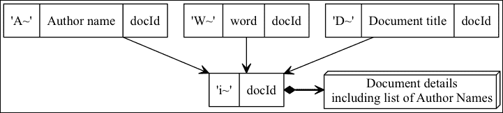

# 第九章。文档数据库

本章将展示我们在前几章中讨论的一些理论，并展示如何使用更丰富的记录结构和多个键来构建文档数据库。它使用扩展的 APLevelDBSS 框架进行这些搜索和构建键，包括单词索引。

这是一个相当简单的文档数据库，但足以记录各种书籍和出版物，以及本地的 PDF 或其他文件。构建每个项目的列表并输入其详细信息的过程与我们之前章节中提到的`Sample06` GUI 中所覆盖的过程非常相似。对于 OS X，这个应用程序引入了一种新的 GUI 技术，即如何通过将文件拖放到我们的窗口上来获取文件引用，因此本章将讨论这一过程的细节。

到目前为止的示例尚未涵盖如何处理多个数据库。我们使用了指向已知数据库位置的固定路径。本章将介绍如何打开其他数据库，包括讨论 iOS 和 OS X 的包惯用语，它将文件夹视为文档。

# 搜索文档数据库的关键设计

我们希望通过标题、关键词和作者检索文档，因此为每个都显示了以下图示中的键。



文档数据库中的典型 NoSQL 风格的数据和关系

在关系数据库中，会使用更多的表来跟踪作者，这使得确定共同作者变得更容易，但这并不是唯一可以使用的模式。

在 JSON 或其他编码值内部存储多个嵌套值是典型的 NoSQL 模式，有助于简化键。此模式还通过忽略实际上是不同人的相同作者姓名而稍微简化了一些。请注意，我们没有任何明确的键来跟踪共同作者。

## 使用 APLevelDBSS 定义模式

下面的代码显示了与之前图示相匹配的模式定义，使用每个键的属性来定义键的部分。`docKey`还定义了`valueFields`，这些字段定义了记录支持键和我们的 GUI 所需的最小内容。与经典的关系模式不同，任何单个记录中可能包含的域可能比我们定义的要多：

```swift
- (void)defineSchema {
  // define individual properties for keys to be easier to use
  self.authorKey = [ASDLevelDBKey key:@"Author name" withParts:@[
    @"A~",   
    [ASDLevelDBKey partFromPath:@"doc.authors.name"], 
    [ASDLevelDBKey partFromId:@"doc"]  ]];
  self.wordKey = [ASDLevelDBKey key:@"Words" withParts:@[
    @"W~", 
    [ASDLevelDBKey partFrom:@"doc.desc" 
      valueGenerator:^(NSString* source){ 
        return [Sample09_Model uniqueWordsFromString:source];
      }], 
    [ASDLevelDBKey partFromId:@"doc"]
  ]];
  self.docTitleKey = [ASDLevelDBKey key:@"Document" withParts:@[
    @"D~", [ASDLevelDBKey partFromPath:@"doc.title"], 
    [ASDLevelDBKey partFromId:@"doc"]  ]];
  self.docKey = [ASDLevelDBKey key:@"doc" withParts:@[
    @"i~", [ASDLevelDBKey partGeneratingId:@"doc"]  ]
    valueFields:@[
 @"title", @"desc", @"fileURL",
 [ASDLevelDBField multiple:@"authors" fields:@[@"name"]]
    ]  ];
  // now hook everything up so the key paths can reconcile
  self.schema = [ASDLevelDBSchema schemaWithKeys:@[
    self.authorKey, self.wordKey, self.docTitleKey, self.docKey
  ]];
}
```

APLevelDBSS 的模式处理将协调键定义，因此任何具有`partFromPath`的项都将使用路径字符串导航到原始数据，将`doc.desc`映射到`doc`键，然后在其中创建一个`desc`字段。

您可以看到`wordKey`有一个`valueGenerator`块，它生成多个值，使用以下代码中的`uniqueWordsFromString`。我们将所有键视为可能从块生成零个或多个值，或者作为它们路径的副作用，例如`doc.authors.name`与姓名列表匹配：

```swift
+ (NSArray*) uniqueWordsFromString:(NSString*)src {
  static NSMutableCharacterSet* seps = Nil;
  if (seps==Nil) {
    seps=[NSMutableCharacterSet
      whitespaceAndNewlineCharacterSet];
    [seps formUnionWithCharacterSet:
      [NSMutableCharacterSet punctuationCharacterSet]];
  }
  NSArray* words=[src componentsSeparatedByCharactersInSet:seps];
  NSMutableSet* uw=[NSMutableSet setWithCapacity:[words count]];
  for (id w in words) {
     if ([w length]>=3)
       [uw addObject:[w lowercaseString]];       
  }
  return [[uw allObjects] 
    sortedArrayUsingSelector:@selector(localizedCompare:)];
}
```

前面的单词生成器远比一个生产质量的生成器简单，后者会使用**词干提取**来匹配具有相同基词的单词，例如复数形式。它还应该有一个**停用词列表**来跳过某些单词，而不仅仅是检查`length >=3`个字符。

提取文本进行索引的字段有一大批研究成果。你可以阅读有关词干算法的内容，并下载 BSD 许可的 Snowball 算法源代码，它是经典 Porter 算法的后继者，在[`snowball.tartarus.org/index.php`](http://snowball.tartarus.org/index.php)。

使用文本索引的两个主要开源项目是 Sphinx 和 Solr；Lucene 的一部分。Packt Publishing 有许多关于它们的书籍，包括：[`www.packtpub.com/sphinx-search-beginners-guide/book`](http://www.packtpub.com/sphinx-search-beginners-guide/book) 和 [`www.packtpub.com/apache-solr-4-cookbook/book`](http://www.packtpub.com/apache-solr-4-cookbook/book)。

# 用于跟踪文档的数据库字段

文档通过一个 URL 来识别，这个 URL 可能指向外部互联网资源或本地文件。就数据库而言，这只是一个字符串值。OS X 示例允许你拖动一个文档并将其拖放到窗口上，通过注册处理`NSURLPboardType`并添加两个处理方法：

```swift
- (void)awakeFromNib {
  [super awakeFromNib];
  [self.window registerForDraggedTypes:@[NSURLPboardType]];
}
- (BOOL)performDragOperation:(id <NSDraggingInfo>)sender {
  NSPasteboard *p = [sender draggingPasteboard];  
  if ( [[p types] containsObject:NSURLPboardType] ) {
    [self.docURL setStringValue:[NSURL URLFromPasteboard:p]path]];
    [self.docURL needsDisplay];
  }
  return YES;
}
- (NSDragOperation)draggingEntered:(id <NSDraggingInfo>)sender {
  NSDragOperation dragMask = [sender draggingSourceOperationMask];
  NSPasteboard *p = [sender draggingPasteboard];  
  if ( [[pboard types] containsObject:NSURLPboardType] ) {
    if (dragMask & NSDragOperationGeneric) 
      return NSDragOperationGeneric;
  }
  return NSDragOperationNone;
}
```

一旦前面的代码设置了文本字段`docURL`，我们就将其与数据库一起使用，就像用户在输入字段中输入的字符串值一样。

# 通过包将数据库作为文档

我们之前的数据库示例在临时位置创建了一个数据库。大多数应用程序需要一个更像文档本身的数据库，这样我们就可以将其复制到其他地方并打开多个数据库。"Sample09"就是这样的一个`NSDocument`应用程序，支持独立作者的集合和其他文档。记住，我们使用一个属性来跟踪我们的数据库——没有任何东西阻止应用程序拥有多个这样的属性和打开的数据库。

### 小贴士

与典型的基于文档的应用程序不同，我们一旦打开新窗口就必须让数据库开始运行——我们将持续保存而不是按需保存。为了确保这一点，`NSWindowController`可以通过`[[self document] saveDocumentAs:self]`触发**另存为**面板，以便选择数据库的位置。

复杂性在于如何处理数据库实际上存储在许多文件目录中的事实。Apple 的*Bundle 编程指南*描述了如何创建**文档包**，这是一种将特别命名的目录视为单个文档的方法。我们使用`leveldb`作为扩展，但你也可以选择自己的。

首先编辑`xxx-info.plist`文件，并向`CFBundleDocumentTypes`添加两个条目：

1.  添加一个`LSTypeIsPackage`设置为`True`。

1.  添加一个`CFBundleTypeExtensions`，指定所需的扩展名，`leveldb`。

如果你编译并运行该程序，你会发现任何以该扩展名命名的目录，例如`blah.leveldb`，现在在查找器中都会显示为一个单独的项目，你必须右键单击并选择**显示包内容**来导航其中。将`NSDocument`子类连接到打开该目录中的数据库需要两个重写：

```swift
- (BOOL)readFromFileWrapper:(NSFileWrapper*)fileWrapper
   ofType:(NSString*)typeName error:(NSError**)outError {
  self.db = [APLevelDB levelDBWithPath:[fileWrapper filename] 
    error:outError];
  return outError == nil;
}

- (BOOL)writeToURL:(NSURL*)url ofType:(NSString*)typeName
  error:(NSError**)outError {
  if (self.db == nil) { // our initial saveDocumentAs
    self.db = [APLevelDB levelDBWithPath:[url path]
      error: outError];
    return outError == nil;
  }
  return NO; 
}
```

在上述两种方法中，我们最终都得到了一个从 OS X 函数提供的 GUI 中选择的文件或**另存为**位置的完整路径。在 OS X 中，这可能是一个沙盒位置——我们只是被返回了一个可用的路径字符串。

# 摘要

我们通过包括两个多个键来源的架构学习到了另一个关键的设计练习——单词索引和多个作者。典型的拖放桌面行为在 OS X 中展示了添加文件链接，因此你可以看到文件 URL 如何成为数据库中的一个字符串值。我们最终看到了如何在桌面上打开多个数据库并将它们作为单个文档处理，而不是在固定位置。现在，我们将更深入地探讨 LevelDB，并了解更多关于设计权衡和设置的信息。
