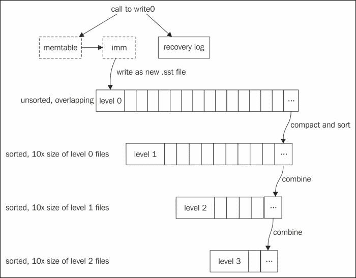
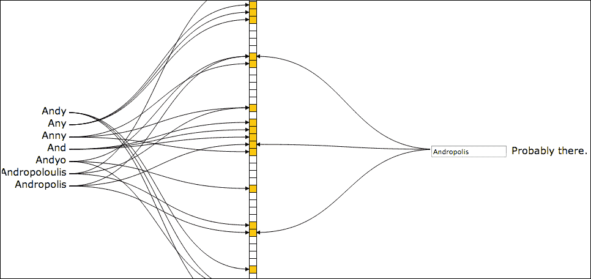

# 第十章 调整和键策略

LevelDB 有两个关键架构原则——不可变性和写入速度。不可变性虽然微妙但很重要——数据在 LevelDB 中永远不会被更新。相反，它被标记为已删除或被新的副本所取代。从应用程序代码来看，这似乎是一个无关紧要的问题，因为你似乎在更新键值。然而，理解数据库结构和遵循描述的行为至关重要。

在你获得 LevelDB 编程的新经验后，我们将从可调整的角度研究其实现。更多细节和文件格式在代码注释和 LevelDB 源代码的`doc`文件夹中的文件中解释。

我们将讨论调整设置以及 LevelDB 允许你插入自定义类的地方。它可以像我们迄今为止的示例中那样使用，即*直接从开源箱中*使用，但也有一些扩展点和参数让你可以改变其行为。一些组织甚至更进一步，定制 LevelDB 源代码，然后发布他们的版本。Riak 和 HyperDex 服务器是两个重要的 NoSQL 服务器，它们已经将他们的 LevelDB 修改作为独立的**分支**发布。我们将在接下来的调整说明中简要讨论它们。

# 理解 LevelDB 中的 Level

如你在以下图中可以看到，LevelDB 的主要存储是一个由**级别**组成的*排序字符串表*文件系列。它们目前有`.sst`扩展名，但不久将改为`.ldb`，以避免与微软冲突。每个更深层级的文件大小是前一个级别的文件大小的十倍。顶级是一个未排序的记录混合，排序发生在记录写入下一个级别时。

每次将一个级别的文件合并到下一个级别时，都会执行复制、排序和压缩。这种**写放大**是 LevelDB 架构中最大的性能权衡。在一个大型数据库中，某个值在其生命周期内可能被写入磁盘多达十一次，因为它在不同的级别之间被复制。这种方法的大优点是写入数据速度快，无需暂停进行索引更新。传统的 B-tree 索引在平衡树时也会重写数据。

数据并不会直接从你的函数调用跳转到 level 表。从`write()`操作开始，数据首先进入一个`memtable`，这是一个跳表结构。它同时被写入磁盘上的日志文件，以便在应用程序失败时提供数据恢复。当这个日志达到 4MB 的限制（由`write_buffer_limit`控制）时，LevelDB 开始写入一个新的日志，并切换到备用的`memtable`。内存中只维护这两种结构。正在写入的那个被称为 imm，因为它被视为不可变的，并且一个后台线程将其复制到一个新的`.sst`文件，位于 0 级：



LevelDB 的数据生命周期：复制和排序到更大的级别

为了以持久的方式管理这些文件集合，会写入一个**manifest**文件，记录每个`.sst`文件中使用的键范围和级别。记住，这些是不可变文件。每当通过写入当前的`memtable`或压缩线程合并文件并将其推到下一级别时添加新的`.sst`文件，manifest 都会添加一条记录。此外，在数据库目录中还有一个名为 CURRENT 的纯文本文件，它仅包含最新 manifest 文件的名称。

## 理解删除是另一种形式的写入

上述不可变级别和写入的解释应该能帮助你理解为什么我们看起来更新了一个键——使用相同键写入了一个新值，并逐级下渗。删除键的工作方式也是从上到下。与树索引不同，我们实际上不能删除一个键。相反，写入的是相同键的副本，并带有特殊标记以表明它已被删除。

## 理解从上到下读取的工作方式

我们已经看到写入值是如何从上到下，通过`memtable`推入级别文件的。读取可以说是从上到下拉取，是一个**可能**和**排除**的过程。当`Get`调用查找键时，以下步骤发生，直到找到为止，包括找到带有删除标记的键，或者确定没有这样的键：

1.  扫描当前的 memtable 跳表（可以找到键后退出）。

1.  imm memtable 跳表如果非空，也会被扫描。它将只包含内容，如果它正在写入磁盘过程中（可以找到键后退出）。

1.  检查 Manifest 以确定键是否在已知存在于级别文件中的范围内（可以说没有）。

1.  如果候选级别文件尚未缓存为打开状态，则将其打开。

1.  如果使用**filter policy**（将在本章后面详细描述），则检查过滤器以查看键是否可能在级别文件中（可以说没有）。

1.  使用文件的索引来确定文件是否包含一个包含键范围的块，该范围包括键（可以说没有）。

1.  如果可能包含键的块不在块缓存中，则从级别文件中读取该块。

1.  顺序遍历块中的键值对以读取值，或确定键最终不在该文件中（最终找到或没有）。

记住键和值可以是任意长度，因此无法计算一个偏移量以跳转到给定键值的起始位置，因此所有这些深入级别的努力。内存缓存和过滤器有很大帮助。有关布局和索引如何指向块的更多详细信息，请参阅`doc/table_format.txt`。

## 理解快照如何使读取可预测

不变表架构的一个微妙方面是快照的使用方式。这个名字有点误导，因为它暗示这是一个重量级的数据库快照。但实际上，它们提供了一种以低成本冻结你对数据库视图的方法——它们基本上只是一个特殊的数字。

数据库内部使用的键由你的键、一个标志值和快照号组成。标志表示这是一个数据键还是一个删除键——正如我们之前看到的，这是由于`Delete`操作添加的特殊键。同时读写操作通过快照号得到保护，有效地隔离了正在迭代的键与任何删除或重写这些键值的操作。

你可以将快照视为影响任何单个`Get`或`Iterator`读取，通过`ReadOptions`结构指定它：

```swift
  leveldb::ReadOptions options;
  options.snapshot = db->GetSnapshot(); // save before work
  ... // work that adds or deletes keys
  leveldb::Iterator* iter = db->NewIterator(options);
  ... // view keys existing from snapshot time
  delete iter;
  db->ReleaseSnapshot(options.snapshot); // MANDATORY cleanup
```

虽然`GetSnapshot`返回的对象应该被删除以帮助数据库状态，但其行为就像你传递了快照号来形成用于读取的关键一样。每次新的写入或写入批次都会增加当前数字，因此实际在快照中搜索的键将不会看到后续的键。

使用快照只是数据库当前打开会话中的一个临时活动。它们在底层以不可见的方式表示，这意味着没有安全的方法将快照持久化到磁盘并在程序后续运行中使用它。

# 理解布隆过滤器如何帮助猜测

找不到某物通常比找到它要慢——你何时放弃？在大多数应用程序中，你不会在数据库中存储每个可能的关键值。LevelDB 中最大的优化之一是使用过滤器策略来决定给定的键是否存在于某个级别。

我们可以从清单文件中知道哪个级别文件包含我们的键的范围。如果你使用过滤器，过滤器数据会为每个打开的文件进行缓存，因此它提供了一个快速回答，即该键是否存在于该表中，而不需要读取索引和扫描块。为你提供的默认过滤器是一个布隆过滤器。



来自 Jason Davies 在线演示器的操作中的布隆过滤器

前面的图显示了在[`www.jasondavies.com/bloomfilter/`](http://www.jasondavies.com/bloomfilter/)的动态演示器中输入了七个值后的快照，这是一个理解它们工作原理的好方法。如果该网站仍在运行，请去尝试输入一些值并观察不同值下的位向量变化，然后继续阅读本章。我在阅读论文和查看静态图表的几次尝试后，在他的网站上有了“啊哈”的顿悟。

希望你已经看到了过滤器在实际操作中的精彩演示，以下内容将使你更容易理解。布隆过滤器利用一个简单的洞察——通过组合使用一些简单、快速的哈希函数可以减少它们发生冲突的机会。组合的哈希函数将它们的结果写入相同的位掩码。通常计算三个简单的哈希值比尝试计算一个完美的哈希值要快得多。过滤器不像哈希表那样工作——它无法处理冲突，因为这是其他 LevelDB 数据结构的任务，它们到达实际键。

### 小贴士

哈希函数旨在提供一个小的值，该值映射到一个更大的键。根据你的数据，可能会有冲突的值。一个糟糕的哈希是当太多的原始字符串生成相同的哈希值。如果你对哈希值的概念完全陌生，只需想象将你的键的第一个小写字母作为哈希值。如果你只有二十个以不同字母开头的名字，这将是一个完美的哈希。如果它们都是 Smith，这将是一场灾难。

布隆过滤器保证没有**假阴性**。如果它说一个键不存在，那么它绝对不存在。但是，如果它说键存在，那么它可能存在——另一个键可能有相同的哈希序列。决定使用过滤器是一个经典的权衡，以牺牲更多的磁盘空间为代价来提高性能，存储过滤器数据。这可以通过更改每键位数或甚至过滤器算法来进一步细化——更多的位数通常以牺牲更多空间为代价带来更好的性能。

如果你知道你的键几乎总是存在于数据库中，那么使用布隆过滤器是没有意义的！

## 使用布隆过滤器或替代方案进行调整

LevelDB 不关心你使用什么类型的过滤器，如果有的话。它提供了一个钩子供你指定一个`FilterPolicy`对象。你可以通过继承该接口来提供任何你喜欢的过滤器。使用过滤器不是强制性的，但通常至少通过使用`NewBloomFilterPolicy`提供的默认过滤器来提高性能。然而，如果你有一个自定义的比较器，它忽略了键的某些区域或以错误的顺序处理它们，那么你不能使用默认的过滤器策略。如果你的键包含大量信息，而其中只有一小部分是唯一的，你也可能需要一个自定义策略。

你的自定义过滤器可能仍然使用布隆算法，或者可能是你自己的。过滤器存储在磁盘上的数据没有假设——LevelDB 只是存储和检索过滤器对象提供的字节，在每个级别文件的末尾。

如果你正在使用标准过滤器，那么有一个调整的机会，因为它需要你指定每个键使用多少位。建议的值是每个键 10 位，这是为该特定文件缓存的过滤器内存影响。如果你有一个包含大量稀疏键的数据库，你可能需要使用更多的位来提高准确性并避免索引扫描。

Basho 的 Riak 服务器使用 Erlang 包装器 **eleveldb**，它是一个 LevelDB 克隆。它可在 [`github.com/basho/leveldb`](http://github.com/basho/leveldb) 上找到，并包括改进的布隆过滤器以及其他更适合其服务器环境的更改。他们声称他们的过滤器在磁盘上占用的空间更少，并且错误正率为 0.05%，相比之下，标准 Google 版本（如前所述，每键 10 位）的错误正率为 1%。1%的错误正率意味着，当过滤器说一个键存在时，100 次中有 1 次你将遍历 SSTable 并发现该键实际上并不存在。他们的过滤器可以被复制并用作标准过滤器的直接替换。

# 使用影响性能的设置

以下设置在 `include/options.h` 中有文档说明，并带有重要的注释，所有这些都在 `LevelDB::Options` 结构中设置，该结构传递给 `Open`。

+   `write_buffer_size` 默认为 4 MB，更大的值将提高写入性能，如 Riak 所使用，但写入内存表到磁盘时可能会导致阻塞。记住，只有两个内存表缓冲区，如果`imm`仍在写入且当前缓冲区已满，则将发生停滞。

+   `max_open_files` 默认为 1000，对于大多数数据库来说将足够。如果你在服务器上有一个庞大的数据库，则可以增加这个值，因为它将允许更多的级别文件被缓存打开，从而避免打开它们和读取其索引和过滤器块的成本。

+   `block_cache` 是指向由 `NewLRUCache` 创建的缓存的指针，默认为 8 MB，请参阅以下讨论。

+   `block_size` 每块的用户数据，默认为 4 KB，影响级别表的索引，每个块有一个索引条目。除非你有许多大于 4 KB 的键，否则不要更改此设置。它还用于 I/O 刷新，因此选择一个更大的大小可能会使非常活跃的数据库容易受到操作系统崩溃丢失数据的影响。

+   `block_restart_interval` 默认为 16，除非你有大量具有最小变化的连续键，否则不要更改。这是检查点间隔，在此间隔内会写入整个新键而不是仅写入尾部更改。

+   `filter_policy` 默认为 NULL，除非使用前面讨论过的 Riak 等替换方案，否则使用 `NewBloomFilterPolicy` 创建策略。使用过滤器策略会占用存储空间并使用一些内存，但如果存在键不在表中的合理可能性，则可以优化键查找。

# 根据场景调整和结构化数据

以下场景为我们在这里和前几章中讨论的设置和键设计技术提供了上下文。

## 根据更新率选择数据结构

正如我们在第八章中讨论的，*更丰富的键和数据结构*，你可以决定将一些值移动到单独的键中，而不是将它们保留在主记录中。正如你现在应该理解的那样，如果主记录非常静态，它将倾向于迁移到层级表，然后在那里停留，而新的键值将从顶部向下推送，用于你经常更新的数据。如果主记录使用升序标识符进行索引，这种仓库方法将工作得更好，因为它们的层级表不需要回退。

在压缩过程中有一个优化，即在合并时，如果不需要回退，只需简单地将这些表复制到较大的表中。你也可以调用`CompactRange`函数来强制对给定键范围进行压缩。

## 基于预期访问的键性能缓存选择

缓存是一个复杂的过程。在`ReadOptions`中你可以应用一个有趣的附加选项，通过将`fill_cache`标志设置为 false 来**绕过**缓存。例如，想象一下你有一个数据库已打开，某些用户操作需要你离开并读取一些与大多数用户驱动操作流程不太相关的键。他们到目前为止对数据库的使用可能已经很好地加载了缓存，记录被大量重用。使用`fill_cache=false`创建的迭代器将避免刷新当前缓存。

另一个考虑因素是使用更大的缓存大小。缓存是一个对象，它可以通过标准调用或如果你对其进行了子类化，使用你自己的工厂来创建：

```swift
leveldb::Options options;
options.cache = leveldb::NewLRUCache(100 * 1048576); // 100MB
leveldb::DB* db;
leveldb::DB::Open(options, name, &db);
...
delete db
delete options.cache;  // mandatory cleanup
```

缓存是一个读取缓存——只有在你进行大量读取时才会有所帮助，其大小应该基于读取的数据量。否则，你就是在浪费内存。

## 根据角色使用多个数据库

Riak 服务器通过在每个平台上使用 7 到 64 个 LevelDB 数据库来实现极高的数据库吞吐量，部分原因是为了提高写入性能。你也可以利用不同的数据库作为机会，根据角色调整不同的设置。想象一下，你有一个非常动态的审计跟踪——它可以使用一个小缓存，避免过滤策略的开销，优化于写入。为了优化健壮性，你可以减少其`write_buffer_size`或显著增加其大小以获得高吞吐量。然而，经验报告表明，除非你有截然不同的用户画像，否则选择在数据库之间分割使用是一种后期优化。许多用户行为的自然不可预测性通常最好通过拥有一个单独的数据库来缓存数据，并在积累数据时构建层级来实现。

## 重新考虑生成键的策略

我们刚刚讨论了避免表更新的愿望如何导致使用不同的键，并解释了如何通过稳定的键范围来实现最佳压缩。关于键的生成方式，有一些可能需要考虑的点，这些点会影响层级表。

考虑的最简单场景是我们用于名称和地址数据库的批量加载数据。当`Sample06`转向使用多个键时，我们通过一个循环创建两个不同前缀的键来加载它们。这导致了很多键重叠，并在从 0 级到 1 级的压缩过程中产生了大量的排序。如果存在一次性加载大量记录的情况，比如我们的 50,000 行样本，考虑使用两次数据加载。为每个前缀使用单独的遍历意味着我们生成的键将已经按前缀分组，这减少了压缩时的排序。

如果你正在生成唯一的 ID 后缀，如我们添加的`nameId`以使名称唯一，两次遍历加载可能并不总是容易。然而，即使有这种唯一的键，你仍然可以在后续遍历中通过数据库循环生成二级键。这为数据加载增加了更多的处理，但与后续的多次读取操作相比，可能是一个好的权衡。

请记住，级别表中的键值以尾随增量形式存储，跳过了公共前缀。你应该小心避免添加可能会破坏这一点的后缀。如果你考虑将某个共同值添加为键后缀，看看是否将其作为前缀更合理。这通常需要一些应用程序逻辑更改，但可能会带来重大的表改进。这种复杂的变化只有在你有极端的性能要求时才有用，但这里提到以供你考虑。

另一个可以考虑的是，如果你的键有一个共同的值字段，以利用键增量。如果值中有许多键不变的内容，它将为每个键重复。如果你将它移动到记录的键而不是值一侧，你可能会从键压缩中获得好处。

最后，请记住 LevelDB 的 Bloom 过滤器和键范围行为使其非常擅长确定一个键值是否不在数据库中。如果你有二进制标志，考虑是否可以反转它们的行为，并存储一个键来表示相反的情况，这样你的正常搜索就会是如果标志键缺失。

# 概述

我们对内存和磁盘上的结构有了更多的了解，这些结构赋予了 LevelDB 其名称和行为。将这些内容置于我们整本书中编程的 API 的上下文中，为你提供了更明智的方式来构建程序和考虑你的键策略。你还了解了一些可能影响性能和内存使用的不同设置，这可能会让你使用具有不同设置的多个数据库。

总结 LevelDB 生态系统，我们将告别原生代码世界，并以一个附录结束，回顾一些更常见的脚本语言包装器，这些包装器允许你在不编译的情况下使用 LevelDB。
