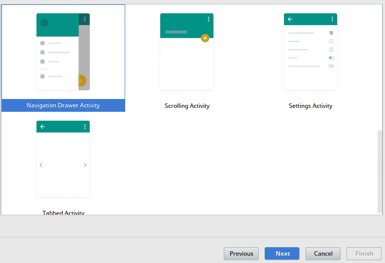
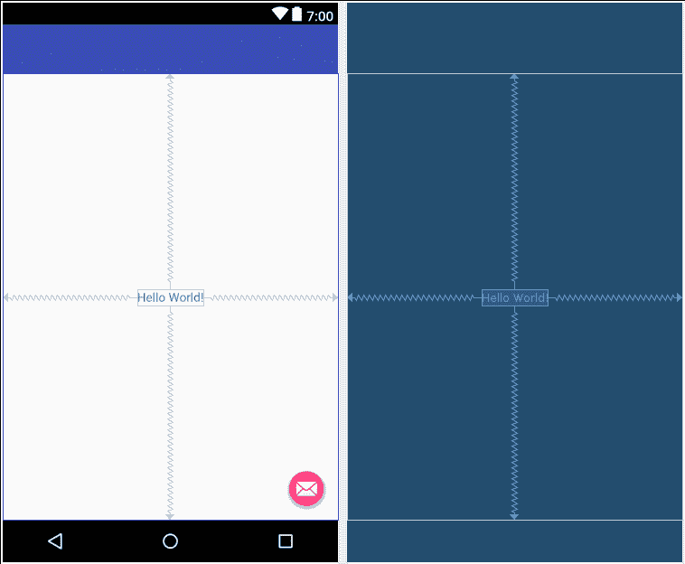
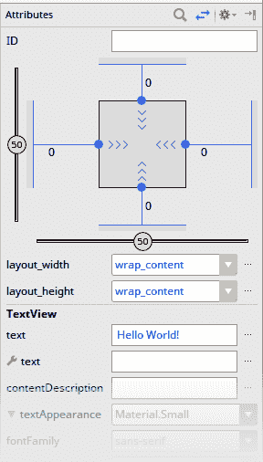
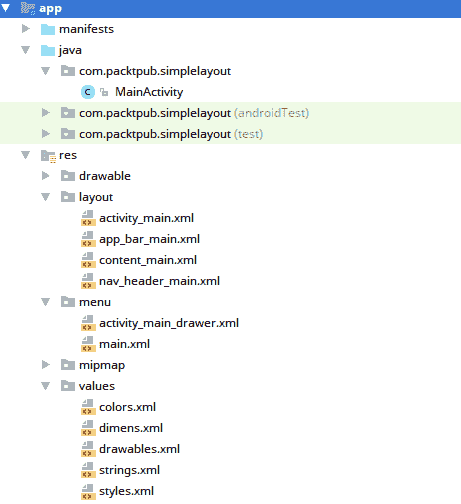

# 第一章：创建 Android 布局

移动应用的用户界面已经从早期发展了很多，尽管用户可以选择的设备比以往任何时候都多，但他们都期望从应用中获得一致的高质量体验。应用需要运行得快，用户界面需要流畅；所有这些同时还要在功能各异的庞大设备群上运行。您的应用需要在屏幕大小从电视那么大的一端，到另一端只有 2.5 厘米或更小的智能手表屏幕上运行。乍一看，这似乎是一场噩梦，但有一些简单的技巧可以使构建响应式 Android 应用变得容易。

在这本书中，你将学习一系列的技能以及一些可以应用于构建快速、响应式且外观出色的 Android 应用程序的理论知识。你将学习如何设计应用程序实际需要的屏幕，然后如何构建它们以实现最大限度的灵活性和性能，同时保持代码易于阅读并避免错误。

在本章中，我们将探讨用于构建 Android 应用程序用户界面的基本原理。你需要熟悉这些概念才能构建甚至是最简单的 Android 应用程序，因此在本章中，我们将涵盖以下主题：

+   Android 应用程序的基本结构

+   使用 Android Studio 创建简单的 Activity 和布局文件

+   在 Android Studio 布局编辑器中找到最有用部分的技巧

+   一个组织良好的项目的结构

# Material Design

自从 Android 在 2008 年首次推出以来，用户界面设计已经发生了根本性的变化，从最初的灰色、黑色和橙色主题的早期版本，到**Holo 主题**，这更多的是一种风格上的变化，而不是设计语言的根本转变，最终 culminating in material design。**Material Design**不仅仅是一种风格；它是一种包含导航和整体应用流程概念的设计语言。这一理念的核心是纸张和卡片的概念，即屏幕上的项目不仅彼此相邻，还可能在三维空间中的上方和下方（尽管这是虚拟的）。这是通过 Android 中所有小部件都通用的 elevation 属性实现的。除了这一基本原理外，material design 还提供了一些常见的模式，以帮助用户识别哪些组件可能执行哪些操作，即使是在应用程序中首次使用时。

如果你将原始的 Android 主题与 Holo Light 主题进行比较，你可以看到，尽管风格发生了巨大的变化，但许多元素保持相似或相同。灰色调被扁平化，但非常相似，许多边框被移除，但间距仍然非常接近原始主题。Material Design 语言在基本风格和设计上通常与 Holo 非常相似：


设计语言是现代用户界面设计和开发的一个基本组成部分。它不仅定义了你的小部件工具包的外观和感觉，还定义了应用程序在不同设备和不同情况下应该如何表现。例如，在 Android 上，由于滑动是从左侧开始的，因此通常会有一个导航抽屉，而在其他平台上这样做可能对用户来说并不自然。Material 设计定义的不仅仅是导航的外观和感觉，还包括运动和动画的指南，如何显示各种类型的错误，以及如何引导用户第一次使用应用程序。作为开发者或设计师，你可能觉得这限制了你的创意自由，实际上在某种程度上确实如此，但它也为你用户如何使用你的应用程序提供了一个清晰的信息。这意味着你的用户可以更轻松地使用你的应用程序，并且需要更少的认知负荷。

应用程序开发的一个方面，这在任何现代移动应用程序中都至关重要，是其性能。用户已经期待应用程序始终运行顺畅，无论系统实际负载如何。所有现代应用程序的基准是每秒 60 帧，即每 16.6 毫秒向用户交付一个完整的渲染事件。

用户不仅期望应用程序表现良好，还期望它能够即时对外部变化做出反应。当服务器端的数据发生变化时，用户期望立即在他们的设备上看到它。这使得开发移动应用程序的挑战，尤其是性能良好的应用程序，变得更加困难。幸运的是，Android 提供了一套出色的工具和庞大的生态系统来处理这些问题。

Android 通过计时主线程上发生的每个事件来尝试强制执行良好的线程和性能行为，并确保它们中的任何一个都不会花费太长时间（如果它们确实如此，则会产生一个**应用程序无响应**（**ANR**）错误）。它进一步要求不要在主线程上进行任何形式的网络操作，因为这些肯定会影响应用程序的性能。然而，这种方法难以处理的地方在于——任何与用户界面相关的代码都必须在主线程上执行，那里处理所有输入事件，并且所有图形渲染代码都在那里运行。这有助于用户界面框架，因为它避免了在非常注重性能的代码中需要线程锁的任何需求。

Android 平台是 Java 平台的完整替代品。虽然在高层面上，Android 平台 API 是一种 Java 框架的形式；但存在一些明显的差异。最明显的是，Android 不运行 Java 字节码，也不包含大多数 Java 标准 API。相反，你将使用的多数类和结构都是针对 Android 定制的。从这个角度来看，Android 平台有点像一个大型的有偏见的 Java 框架。它通过为你提供骨架结构来开发应用程序，试图减少你编写的样板代码量。

为 Android 构建用户界面的最常见方式是在布局 XML 文件中进行声明性操作。你也可以使用纯 Java 代码编写用户界面，但尽管可能更快，但并不常用，并且存在一些关键缺陷。最值得注意的是，当处理多个屏幕尺寸时，Java 代码变得更加复杂。你无法简单地引用不同的布局文件，让资源系统链接到最适合设备的布局，而必须在代码中处理这些差异。虽然在一个移动设备上解析 XML 可能看起来是个疯狂的想法，但实际上并没有那么糟糕；XML 在编译时被解析和验证，并转换为二进制格式，这是你的应用程序在运行时实际**读取**的格式。

另一个原因是在 XML 中编写 Android 布局非常方便的是 **Android Studio 布局编辑器**。这让你能够实时预览你的布局在真实设备上的外观，蓝图视图在调试诸如间距和样式等问题时非常有帮助。Android Studio 还提供了出色的 linting 支持，帮助你避免在完成编写布局文件之前就出现常见问题。

# Android Studio

Android Studio 是基于 **IntelliJ** 平台构建的具有全部功能的 IDE，专门用于开发 Android 应用程序。它拥有庞大的内置工具套件，这将使你的生活更加美好，并帮助你更快地编写更好的应用程序。

你可以从 [`developer.android.com/studio/`](https://developer.android.com/studio/) 下载你喜欢的 **操作系统**（**OS**）的 Android Studio。每个操作系统的设置说明略有不同，可在网站上找到。本书假定至少使用 Android Studio 版本 3.0。

安装完成后，Android Studio 还需要为你下载和安装 Android SDK，以便你可以在其上开发应用程序。几乎每个 Android 版本都有平台选项，包括模拟硬件，这允许你测试你的应用程序在不同硬件和 Android 版本上的运行情况。最好下载最新的 Android SDK，以及一个较旧的版本，以检查向后兼容性（4.1 或 4.4 是不错的选择）。

# Android 应用程序结构

与其他平台上的应用相比，Android 应用在其内部结构上非常不同，甚至在最简单的细节上也是如此。大多数平台将它们的应用视为具有固定入口点的单体系统。当入口点返回或退出时，平台假设应用已经完成运行。在 Android 上，一个应用可能有几个不同的入口点供用户使用，还有几个供系统使用。每个入口点都有不同的类型，以及不同的系统到达它的方式（称为**意图过滤器**）。从用户的角度来看，应用最重要的部分是其活动。这些（正如其名称所暗示的）应该代表用户将对应用采取的操作，例如以下操作：

+   列出我的电子邮件

+   编写一封电子邮件

+   编辑联系人

每个`Activity`都是一个非抽象类，它扩展了`Activity`类（或任何`Activity`的子类），并在应用程序清单文件中注册自己及其意图过滤器。以下是一个可以查看和编辑联系人的`Activity`的清单条目示例：

```kt
<activity android:name=".ContactActivity">
 <intent-filter>
   <!-- Appear in the launcher screen as the main entry point of the application -->
   <action android:name="android.intent.action.MAIN" />
   <category android:name="android.intent.category.LAUNCHER" />
 </intent-filter>
 <intent-filter>
   <!-- Handle requests to VIEW Uris with a mime-type of 'data/contact' -->
   <action android:name="android.intent.action.VIEW" />
   <data android:mimeType="data/contact"/>
 </intent-filter>
 <intent-filter>
   <!-- Handle requests to EDIT Uris with a mime-type of 'data/contact' -->
   <action android:name="android.intent.action.EDIT" />
   <data android:mimeType="data/contact"/>
 </intent-filter>
</activity>
```

应用程序清单文件（始终命名为`AndroidManifest.xml`）是 Android 系统了解应用有哪些组件以及如何到达每个组件的方式。它还包含有关应用将需要从用户那里获取的权限以及应用将在哪些 Android 系统版本上运行的信息。

从用户的角度来看，每个`Activity`通常旨在执行单一的操作，但这并不总是如此。在前面的例子中，有三个可能的意图过滤器，每个过滤器都向系统传达关于`ContactActivity`类的不同信息：

+   第一个意图告诉系统`ContactActivity`的图标应该显示在启动器屏幕上，从而使其成为应用的主要入口点

+   第二个意图告诉系统`ContactActivity`可以使用 MIME 类型为`"data/contact"`的`VIEW`内容

+   第三个意图告诉系统`ContactActivity`也可以用于使用`"data/contact"`MIME 类型`EDIT`内容

系统通过意图（Intents）解析`Activity`类。每个意图指定了应用代表用户如何以及想要做什么，系统使用这些信息在系统中的某个地方找到匹配的意图过滤器。然而，你通常不会为所有的`Activity`条目添加意图过滤器；你将通过在应用内部直接指定类来启动大多数。意图过滤器通常用于实现抽象的跨应用交互，例如，当一个应用需要“打开网页进行浏览”时，系统可以自动启动用户首选的网页浏览器。

`Activity`通常有一个主要布局文件，定义为 XML 资源。这些布局资源文件通常不是独立的，但会使用其他资源，甚至其他布局文件。

保持你的活动简单！避免在一个`Activity`类中加载过多的行为，并尽量保持它与单个布局（及其变体，如“横向”）相关联。最坏的情况下，允许使用具有共同布局小部件的多个行为（例如，单个`Activity`用于查看或编辑单个联系人）。我们将在第四章，*组合用户界面*中介绍一些此类技术。

Android 中的资源系统需要特别注意，因为它允许多个文件协作，从简单的组件中创建出复杂的行为。在核心上，资源系统在请求时（包括从其他资源内部）选择最合适的每个资源。这不仅允许你为纵向和横向模式创建屏幕布局，还允许你为尺寸、文本、颜色或其他任何资源做同样的事情。考虑以下示例：

```kt
<!-- res/values/dimens.xml -->
<dimen name="grid_spacer1">8dp</dimen>
```

上述尺寸资源现在可以通过名称在布局资源文件中使用：

```kt
<!-- res/layouts/my_layout.xml -->
<LinearLayout
    android:layout_width="match_parent"
    android:layout_height="match_parent"
    android:layout_margin="@dimen/grid_spacer1">
```

使用这种技术，你可以通过简单地更改用于定位和尺寸小部件的距离测量值来调整不同屏幕尺寸的布局，而不是必须定义全新的屏幕布局。

对于资源如尺寸和颜色等，尝试保持通用性是个好主意。这有助于保持用户界面对用户的一致性。

一致的用户界面通常比尝试创新更重要。用户需要理解你的应用程序时所需的认知努力越少，他们就越能与之互动。

# 创建 SimpleLayout

现在我们已经了解了 Android 应用程序结构的基本知识，让我们创建一个简单的屏幕，看看所有东西是如何结合在一起的。我们将使用 Android Studio 及其出色的模板活动之一。只需按照以下简单步骤操作：

1.  首先在你的计算机上打开 Android Studio。

1.  使用文件菜单或快速启动对话框（取决于哪个对你显示）启动一个新项目。

1.  将项目命名为`SimpleLayout`，并取消任何额外的支持（C++、Kotlin）：


1.  在新项目向导的下一屏，确保你支持 Android 4.1 或更高版本，但只为这个任务勾选电话和平板：


1.  Android Studio 在下一屏提供了丰富的**活动模板**选择。这将是你项目生成的第一个`Activity`，以帮助你开始。对于这个示例，你想要滚动列表并找到导航抽屉活动。选择它并点击下一步：



保持`Activity`的详细信息为默认值（MainActivity 等），然后点击完成以完成新项目向导。Android Studio 现在创建你的项目并运行第一次构建同步，以确保一切正常工作。

1.  一旦您的项目生成完成，您将看到 Android Studio 布局编辑器，看起来可能像这样：



恭喜，这个模板提供了一个极好的起点，用于探索 Android 应用程序及其用户界面是如何构建和组合在一起的。

如果您想回到活动模板屏幕，您可以使用 Android Studio 文件 | 新建 | 活动菜单中的“图库...”选项：


# 发现布局编辑器

初看之下，Android Studio 中的布局编辑器是一个标准的所见即所得编辑器；然而，它有几个重要的特性您需要了解。最重要的是，它实际上会运行小部件的代码，以便在编辑器中渲染它们。这意味着如果您编写了自定义布局或小部件，它们的外观和行为将与在模拟器或设备上一样。这对于快速原型设计屏幕非常有用，并且在使用得当的情况下可以大幅减少开发时间。

为了确保您的布局被正确渲染，有时您需要确保布局编辑器配置正确。从布局编辑器顶部的工具栏中，您可以选择要模拟的虚拟设备配置。这包括布局是否以纵向或横向模式查看，甚至用于布局渲染和资源选择的语言设置：


需要牢记的是，布局编辑器可以模拟的可用 Android 平台版本列表是有限的，并且它与您安装为虚拟设备（因此您不能通过安装额外的平台版本来向布局编辑器添加新版本）的列表不相连。如果您想查看 Android Studio 不直接支持的版本的用户界面，唯一的方法是运行应用程序。

需要注意的下一件非常重要的事情是属性面板，它默认停靠在布局编辑器的右侧。当您在设计区域中选择一个组件时，属性面板允许调整所有可以在 XML 中更改的属性，并且当然，您可以在布局编辑器中实时看到任何更改的结果：



Android Studio 通常会很好地控制属性的数量。默认面板仅显示所选小部件最常用的属性。为了在简短列表和所有可用属性列表（您会比想象的更频繁地这样做）之间切换，您需要使用属性面板顶部的切换按钮（）。

然而，当你查看所有属性视图时，你会注意到它们的数量众多使得视图相当难以使用。解决这个问题的最简单方法是使用搜索按钮（）来找到你想要的属性。这将允许你通过名称搜索属性，并且这是过滤列表并找到你想要的属性或属性组（即`scroll`会给你所有包含单词`scroll`的属性，包括`scrollIndicators`、`scrollbarSize`、`scrollbarStyle`等等）的最快方式。

# 组织项目文件

Android Studio 为你提供了一个相当标准的 Java 项目结构，即你有你的主要源集、测试、资源目录等等，但这并不真正涵盖你所有的组织需求。如果你检查我们创建的项目结构，你可能会注意到一些模式：



1.  你首先会注意到只创建了一个`Activity`——`MainActivity`，但这个`Activity`模板已经生成了四个布局文件。

1.  只有`activity_main.xml`被`MainActivity`实际引用；所有其他文件都是通过资源系统包含的。

1.  下一个要注意的是，由`MainActivity`引用的布局文件命名为`actvitity_main.xml`；这是一个标准的命名模式，Android Studio 在创建新的`Activity`类时实际上会建议使用。这是一个好主意，因为它有助于将用于`Activity`类的布局与用于其他地方的布局区分开来。

1.  接下来，看看其他布局文件的名称。每个文件也都是以`nav`、`app_bar`和`content`为前缀。这些前缀有助于在文件管理器和 IDE 中逻辑上分组布局文件。

1.  最后，你会注意到`values`目录中包含几个 XML 文件。整个`values`目录实际上被资源编译器当作一个大的 XML 文件来处理，但它通过资源声明的类型来帮助保持组织有序。

在资源目录（尤其是布局）中使用文件名前缀（以保持组织有序）。你不能将它们分解到子目录中，所以前缀是唯一一种将文件逻辑上分组的方法。常见的前缀有“activity”、“fragment”、“content”和“item”，这些通常用于前缀用于渲染列表项等的布局。

1.  如果你现在打开`MainActivity`类，你会看到布局是如何加载和绑定的。`MainActivity`在创建时首先会调用其父类的`onCreate`方法（这是一个强制步骤，如果不这样做将会引发异常）。然后，它使用`setContentView`方法加载其布局文件。这个方法调用同时做两件事：它加载布局 XML 文件，并将根小部件作为`Activity`的根（替换掉之前已经存在的任何小部件）。`R`类是由资源编译器定义的，并由 Android Studio 为你保持同步。每个文件和值资源都将有一个唯一的标识符，这允许你将事物紧密地绑定在一起。重命名资源文件，其对应的字段也会改变：

```kt
setContentView(R.layout.activity_main);
```

1.  然后，你会注意到`MainActivity`通过它们自己的 ID（也在`R`类中定义）检索布局文件中包含的各种小部件。`findViewById`方法在`Activity`布局中搜索具有相应`id`的小部件，然后返回它：

```kt
// MainActivity.java
Toolbar toolbar = (Toolbar) findViewById(R.id.toolbar);
setSupportActionBar(toolbar);
```

`findviewById`方法通过一系列循环遍历`Activity`中的所有小部件。没有查找表或优化这个过程。因此，你应该在`onCreate`中调用`findViewById`方法，并为每个所需的`View`对象保留一个类字段引用。

1.  上述代码片段将返回在`app_bar_main.xml`布局资源文件中声明的`Toolbar`对象：

```kt
<!-- app_bar_main.xml -->
<android.support.v7.widget.Toolbar
    android:id="@+id/toolbar"
    android:layout_width="match_parent"
    android:layout_height="?attr/actionBarSize"
    android:background="?attr/colorPrimary"
    app:popupTheme="@style/AppTheme.PopupOverlay" />
```

`findViewById`也可以在`View`类中找到，但它是一个相对昂贵的操作，所以当你有在`Activity`中再次使用的小部件时，应该将它们分配给类中的字段。

# 摘要

正如你所见，Android 应用程序由更多模块化组件组成，它们以层的形式组装，并且通常可以直接从平台访问。资源管理系统是你的最大盟友，应该利用它为用户提供一致的经验，并保持用户界面的一致性。当涉及到安排你的应用程序时，Android Studio 提供了一系列工具和功能，它将使用这些工具和功能来帮助你保持事物组织有序，并符合通常理解的模式。然而，坚持你自己的模式并保持事物有序也同样重要。Android 工具包有自己的要求，如果你想从中受益，你需要遵守它们的规则。

Android Studio 还拥有一个优秀的模板项目和活动集合，应该使用它们来启动你的项目。它们还经常提供关于如何在 Android 中实现常见的用户界面设计模式的说明。

在下一章中，我们将探讨从头开始创建布局以及如何设计表单屏幕的方法。
