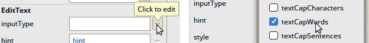
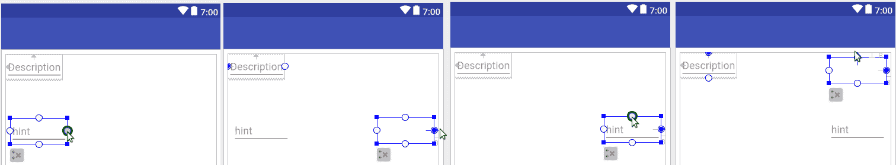

# 第二章：设计表单屏幕

在许多方面，表单屏幕是用户界面设计的重要组成部分，因为它们的历史就是如何不做事情的教训。大多数应用程序在某个时候都需要从用户那里获取输入，你需要输入控件来做到这一点，但你应该始终考虑你需要向用户请求的最少信息量，而不是试图获取你未来可能需要的所有信息。这种方法将使用户专注于他们试图完成的任务。向他们展示一堵输入字段墙会令大多数用户感到不知所措，并打破他们的注意力，这反过来又可能导致他们放弃他们试图用你的应用程序做的事情。

本章专注于表单屏幕，将在深入实际设计表单屏幕的方法之前，简要介绍它们的历史。这种方法可以在你需要为应用程序设计屏幕时重复使用。始终从你的代码工作中退一步，考虑事情对用户来说将看起来如何以及如何组合在一起，这往往是成功应用程序和失败之间的区别。

在本章中，我们将使用 Android Studio 和布局编辑器开发一个实用的表单屏幕。从新项目中的空白模板开始，你将学习以下内容：

+   如何拆分和重新排列表单布局以最有效地为用户服务

+   如何使用资源来保持用户界面的统一性

+   如何设置控件样式以帮助用户理解控件应如何使用

+   如何构建对状态变化做出响应的可绘制资源

# 探索表单屏幕

尽管不是应用程序用户体验中最吸引人的组件，但表单屏幕一直是软件的长期支柱。表单屏幕可以定义为任何用户预期明确输入或更改数据的屏幕，而不是查看或导航它。好的表单屏幕例子包括登录屏幕、编辑个人资料屏幕或电话簿应用中的添加联系人屏幕。多年来，关于什么是好的表单屏幕的想法已经发生了变化，有些人甚至完全避开它们。然而，你不能凭空捕捉到用户的数据。

Android 标准工具包提供了一组优秀且多样化的控件和布局结构，以促进构建出色的表单。在 Material Design 应用中，由于标签的放置，表单屏幕经常可以充当*视图*屏幕（通常是一个只读版本的表单屏幕）。理解这一原则的一个好方法就是考虑文本框的演变。一旦你有了一个需要用户填充空白空间，你就需要告诉用户该放什么，当我们开始对文本框进行标注时，我们只是简单地模仿了在纸质表单上这样做的方式——将标签放在文本框的一侧：


这个问题的症结在于标签总是占用相当多的空间，如果你需要为用户提供一些验证规则（例如日期输入--DD/MM/YYYY），它还会占用更多的空间。这就是我们开始向输入框添加提示的原因。标签将解释在出生日期文本框中应该添加什么，而文本框内的提示将告诉用户如何输入有效的数据：


从这个模式中，许多移动应用程序开始完全放弃标签，转而使用提示/占位符来包含数据，依据的理论是，从表单的上下文中，用户能够推断出每个文本框中包含的数据。然而，这意味着用户在第一次看到屏幕时需要做一点额外的思考才能理解屏幕内容。这种额外的延迟很快就会变成挫败感，并降低应用程序的可用性。因此，Material Design 文本输入将提示转换为当用户聚焦于文本框时移动到文本框上方的小标签，这使得他们更容易跟踪他们正在输入的信息：


这也减少了作为开发者需要在表单屏幕上完成的工作量，因为你通常不需要分离应用程序的*查看*和*编辑*屏幕，因为表单将始终提供所有标签。然而，避免在屏幕上过度拥挤输入小部件非常重要。没有人喜欢填写大量数据，即使其中大部分是可选的。相反，始终考虑在应用程序的每个点上你需要从用户那里获取的最小数据量。同时，考虑你将如何请求用户的数据也同样重要。

我们将首先将第一个表单屏幕作为一个信息收集屏幕。我们将构建一个虚拟应用程序来跟踪某人的旅行费用，允许他们捕捉、标记和存储每一项费用以便稍后过滤和审查。我们首先需要的是一个用户可以捕捉费用及其任何附加信息的屏幕。

尽可能地，你应该使输入字段为可选，但你总是可以通过告诉人们某件事的完整性来鼓励他们提供更多数据。这在处理用户资料时是一个常见的技巧--“您的资料完成度为 50%”，这有助于鼓励用户提供更多数据以提高该数字。这是一种简单的游戏化形式，但效果也非常显著。

# 设计布局

良好的用户界面设计基于一些简单的规则，并且你可以遵循一些流程来设计出色的用户界面。例如，想象你正在构建一个应用程序来捕捉旅行费用，以便稍后可以轻松地提出索赔。在这里，我们将首先构建的是捕捉单个索赔详情的屏幕。这是一个现代表单屏幕设计的完美例子。

在设计布局时，使用像 Balsamiq（[`balsamiq.com/`](https://balsamiq.com/)）这样的原型工具，或者甚至使用纸和笔来考虑屏幕的布局是个好主意。实物索引卡是出色的思考空间，因为它们的比例与手机或平板电脑相似。特别是使用纸张可以帮助你思考屏幕的布局，而不是被处理在常见主题规则中的确切颜色、字体和间距所分散。

要开始设计屏幕，我们需要考虑我们需要从用户那里获取哪些数据，以及我们可能如何为他们填写一些信息。我们还需要尝试遵守平台设计语言，以便应用程序对用户来说不会显得格格不入。在设计表单屏幕时，确保整个输入表单可以适应设备的显示也很重要。滚动输入屏幕需要用户记住屏幕上没有显示的内容，这会导致挫败感和焦虑。每次设计表单屏幕时，请确保所有输入都可以在一个显示上。如果它们不能立即一起显示在屏幕上，首先考虑是否可以删除其中的一些。在删除任何非绝对必需的信息后，考虑将一些信息分组在单行上，确保每行不超过两个输入。

因此，为了开始，考虑用户想要记录的旅行费用信息：

+   费用的金额

+   一些发票的照片，或者可能是购买的商品的照片

+   他们记录费用的日期

+   他们记录的费用类型，如食物、交通、住宿等

+   一个简短的描述，帮助他们记住这笔费用的内容

很好，这似乎是一个不错的起点，但它们没有很好的顺序，也没有任何分组。我们需要考虑什么是最重要的，以及哪些组在屏幕上逻辑上很好地组合在一起。首先，让我们专注于为手机开发一个肖像布局，因为这将是我们最常见的用例。所以，接下来要做的事情是以一种对用户来说既合理又熟悉的方式对输入组件进行分组。当查看索赔概览时，我们希望列出的内容包括以下内容：

+   费用的日期：

    +   他们记录费用的日期

+   索赔的金额：

    +   费用的金额

    +   一些发票的照片，或者可能是购买的商品的照片

+   索赔的描述：

    +   他们记录的费用类型，如食物、交通、住宿等

    +   一个简短的描述，帮助他们记住这笔费用的内容

因此，我们将这三个字段组合在一起，并将它们放在屏幕的顶部。这种分组对任何使用过任何预算或费用跟踪软件的人来说都很常见：


日期是一个特殊字段，因为我们可以轻松地填充当前日期。最有可能的情况是，当用户进入这个屏幕时，他们正在记录同一天的支出。我们仍然需要记录支出的类别和附件。附件需要大量的空间，以便用户可以预览它们，而无需打开每一个来了解其内容，因此我们将它们放在屏幕底部，并占用任何剩余的空间。这样就只剩下类别了。最佳地表示支出类别的方式是使用图标，但我们需要一些空间来放置文本，以便用户知道每个图标代表什么。我们可以通过几种方式来实现：

1.  在每个图标的上方或下方放置一个微小的标签：

    +   优点：所有标签始终显示在屏幕上

    +   缺点：在较小的屏幕上，标签可能难以阅读，图标占用的屏幕空间更多：


1.  创建一个垂直的图标列表，并在每个图标的右侧放置一个漂亮的、大号的标签：

    +   优点：标签易于阅读，并且始终与它们的图标相关联

    +   缺点：这将占用大量本应用于显示附件预览的垂直空间：


1.  只显示图标，当用户将手指放在图标上（长按）时显示标签：

    +   优点：文本不占用屏幕空间

    +   缺点：这种行为对用户来说不直观，需要用户选择类别才能知道其标签：


1.  在图标列表下方显示选中类别的文本：

    +   优点：文本标签可以很大，易于阅读，并且占用的屏幕空间较少，因为一次只显示一个标签

    +   缺点：用户必须选择类别才能知道其标签：


为了保持标签的大小适中、易于阅读，同时也要额外吸引对当前选中类别的注意，以下示例将向您展示如何创建第四种选项，即当前选中的类别名称显示在类别图标水平列表下方。我们还将突出显示选中的图标，以帮助保持两个用户界面元素之间的联系。

用户需要能够做到的唯一一件事是在保存之前将文件附加到费用报销单上。在这个布局的底部应该有一个宽敞的区域，这将是一个预览单个附件的完美区域，如果用户有多个附件，他们可以通过左右滑动来切换预览。然而，他们最初如何附加它们呢？这就是浮动操作按钮成为理想解决方案的地方。你会在 Android 应用程序的各个地方看到浮动操作按钮。它们通常位于屏幕的右下角，如果一个人用一只手握住手机，那么右手的人会在这里用他们的拇指，而且不会妨碍大多数西方内容，这些内容通常位于屏幕的左侧（通常）：


浮动操作按钮通常是屏幕上最常见的一种*创造性*（与导航或破坏性相对）操作；例如，在 Gmail 或 Inbox 应用程序中创建新电子邮件、附加文件等等。

因此，现在，我们将屏幕分解为三个逻辑区域，除了正常的装饰之外：

+   报销详情

+   分类

+   附件

将它们组合成一个单屏布局概念，这将为你提供一个线框，看起来像这样：


在开始开发之前先进行屏幕线框设计是一项极其有价值的练习，因为它为你提供了时间和空间来思考你可能会做出的每一个选择，而不是仅仅抓取工具箱中可用的第一个小部件并将其放置在屏幕上。现在你已经有了线框，你就可以开始构建应用程序的用户界面了。

# 创建表单布局

一旦你有一个好的线框可以从中开始工作，你将想要开始开发用户界面屏幕。为此，我们将使用 Android Studio 及其出色的布局编辑器。

由于这是一个全新的项目，你需要打开 Android Studio，并使用文件 | 新建 | 新建项目来开始它。然后，按照以下步骤操作：

1.  将项目命名为`Claim`，并保持任何非 Java 支持关闭。

1.  仅针对手机和平板电脑上的 Android 4.1。

1.  在活动画廊中，选择基本活动：


1.  将新的活动命名为`CaptureClaimActivity`，然后将标题更改为`Capture Claim`。保留其他参数的默认值：


1.  完成新建项目向导，并等待项目生成。

1.  项目生成并同步后，Android Studio 将在其布局编辑器中打开`content_capture_claim.xml`文件。

1.  默认情况下，Android Studio 假设你将使用`ConstraintLayout`作为布局的根元素。这是一个功能强大且灵活的工具，但并不适合作为这个用户界面的根元素。你需要切换到屏幕底部的文本视图，以便更改到更合适的内容：


1.  当前文件将包含以下类似的 XML 内容：

```kt
<?xml version="1.0" encoding="utf-8"?>
<android.support.constraint.ConstraintLayout 

    android:layout_width="match_parent"
    android:layout_height="match_parent"
    app:layout_behavior="@string/appbar_scrolling_view_behavior"
    tools:context="com.packtpub.claim.CaptureClaimActivity"
    tools:showIn="@layout/activity_capture_claim">

    <TextView
        android:layout_width="wrap_content"
        android:layout_height="wrap_content"
        android:text="Hello World!"
        app:layout_constraintBottom_toBottomOf="parent"
        app:layout_constraintLeft_toLeftOf="parent"
        app:layout_constraintRight_toRightOf="parent"
        app:layout_constraintTop_toTopOf="parent" />

</android.support.constraint.ConstraintLayout>
```

1.  将`ConstraintLayout`更改为简单的`LinearLayout`。`LinearLayout`是 Android 上可用的最简单布局之一。它根据其方向属性，将每个子元素渲染成一条直线，水平或垂直。将整个`content_capture_claim.xml`文件替换为以下内容：

```kt
<?xml version="1.0" encoding="utf-8"?>
<LinearLayout 

    android:layout_width="match_parent"
    android:layout_height="match_parent"
    android:orientation="vertical"
    app:layout_behavior="@string/appbar_scrolling_view_behavior"
    tools:context="com.packtpub.claim.CaptureClaimActivity"
    tools:showIn="@layout/activity_capture_claim">

</LinearLayout>
```

选择合适的布局不仅仅是保持代码简单；更不灵活的布局在运行时速度更快，并且能带来更流畅的用户体验。尽可能使用更简单的布局，但也避免布局嵌套过深（一个嵌套在另一个里面），因为这也会导致性能问题。

1.  在布局编辑器中切换回设计视图，你会注意到设计视图左侧的组件树现在只有一个 LinearLayout（垂直）作为其唯一组件。

# 创建描述框

现在基本布局已经设置好了，是时候开始向用户界面添加小部件并使其变得有用。在这个下一阶段，你将使用几个帮助创建优秀用户界面的 Material Design 小部件，例如**CardView**和**TextInputLayout**小部件。在 Material Design 之前，文本输入框只是普通的`EditText`小部件，虽然仍然可用，但现在通常不推荐使用，而是推荐使用`TextInputLayout`。`TextInputLayout`是一个专门布局，包含一个用于用户输入文本数据的单个`EditText`小部件。`TextInputLayout`还提供了浮动提示/标签效果和动画，将`EditText`小部件的提示过渡到输入区域上方的标签空间。这意味着即使用户已经填写了文本，`EditText`的提示仍然可见：


你将在这个第一个小部件组周围包裹一个`CardView`，这将为用户提供视觉分组。按照以下步骤添加描述输入框：

1.  打开小部件调色板的 AppCompat 部分。这部分包含来自特殊 API 的小部件，这些 API 是扩展 Android 平台的一部分。它们不是默认包含在平台中的，而是包含在每个使用它们的应用程序中，有点像静态链接库。

1.  将`CardView`拖放到你的用户界面设计中；你可以在设计画布的任何位置放置它。这将作为描述、金额和日期输入框的分组。确保在组件树中，`CardView`显示为`LinearLayout`（垂直）的子项：


1.  `CardView`将小部件堆叠在彼此之上，形成层（从后向前）。这在本例中不是所需的，因此你需要打开`Palette`中的布局部分，并将`ConstraintLayout`拖放到你的设计中的`CardView`上。确保在组件树中，`ConstraintLayout`显示为`CardView`的子项。

1.  在组件树中选择新的`ConstraintLayout`。

1.  在属性面板中，选择“查看所有属性”按钮：


1.  打开标题为“布局 _ 边距”的部分。

1.  如截图所示，点击全行的资源编辑器按钮：


1.  在资源编辑器中，点击左上角的“添加新资源”按钮，然后选择“新建维度值”（dimen 是维度的缩写。维度资源可以用来指定非像素单位的大小，这些大小随后会根据用户设备上的实际显示系统进行转换）。

1.  将资源命名为`grid_spacer1`，并赋予其值为`8dp`：


Android 上的 Material Design 界面使用**8dp**的间距网格，这是**8 密度无关像素**。这是一个特殊的测量单位，根据屏幕的密度变化实际使用的像素数。这些也是 Android 中最常见的屏幕测量单位。**1dp**的测量在 160dpi 屏幕上将是 1 个物理像素，并在 320dpi 屏幕上缩放为 2 个像素。这意味着通过以密度无关像素而不是物理像素来衡量你的布局，你的用户界面将更好地在各种设备上遇到的不同屏幕密度范围内进行转换。

1.  点击“确定”以创建维度资源并返回布局编辑器。

1.  现在，你需要开始构建用户填写的输入框。第一个将是描述框。打开“Palette”的“设计”部分，并将`TextInputLayout`拖放到组件树中，作为`ConstraintLayout`的子项：


1.  在属性面板中，点击“查看较少属性”按钮（它与“查看所有属性”按钮相同）。

1.  在属性面板的顶部，将`TextInputLayout`的 ID 设置为`description_layout`。

1.  使用约束编辑器（位于 ID 属性下方）通过点击带有+号的蓝色圆圈来创建到左侧和`TextInputLayout`上方的连接。然后，将两个新约束的约束边距更改为零，如图所示：


1.  您的 `TextInputLayout`，现在命名为 `description_layout`，应该已经吸附到布局编辑器的左上角：


1.  将 `layout_width` 属性更改为 `match_constraint`，并将 `layout_height` 参数更改为 `wrap_content`。`TextInputLayout` 将缩小到它可以在左上角占据的最小空间。

1.  现在，使用组件树，选择 `description_layout` 内的 `TextInputEditText`。

1.  在属性面板中，将 ID 更改为 `description`，因为这是您实际上想要捕获内容的字段。

1.  将输入类型更改为 textCapWords；这将指示软件键盘在每个单词的开头放置一个首字母大写：



1.  描述框的提示/标签目前是 `hint`，并且硬编码在布局中。我们希望将其更改为 `Description`，并使其可本地化（这样就可以轻松地将应用程序翻译成新语言）。使用编辑按钮打开字符串资源编辑器，并选择添加新资源 | 新字符串值：


1.  填写资源名称为 `label_description`。您会注意到这遵循了另一个前缀规则，这有助于在源代码中处理大量字符串资源时。

1.  在资源值中填写 `Description`，并保留其余字段不变：


1.  点击确定创建新的字符串资源，并返回布局编辑器。

在本节中，您创建了一个分组组件（`CardView`），它将用于视觉上分组描述金额和日期字段，并为用户服务。您已经填充了它的第一个组件——描述框。您还创建了一个维度资源，可以在整个应用程序中重复使用，以表示单个网格间距单位，允许您调整整个应用程序的网格大小。应用程序中一致的网格间距有助于定义应用程序的一致外观和感觉，并将此值作为资源提供，您可以在需要时更改它的单一位置。

# 添加金额和日期输入

在下一节中，我们将通过添加 `amount` 和 `date` 字段来完成描述框的构建。这将涉及到对您将要添加的小部件使用一些更复杂的约束，因为它们需要相互定位。按照以下步骤完成描述框：

1.  将另一个 `TextInputLayout` 拖入您的布局，并将其放置在描述字段下方。这个新框目前还没有约束。

1.  在属性面板中，将 ID 更改为 `amount_layout`。

1.  在属性面板中，打开 `layout_width` 的资源编辑器，就像您之前创建 `grid_spacer1` 资源时做的那样。

1.  创建一个名为 `input_size_amount` 的新资源，并设置其值为 `100sp`。

类似于 dp，**sp**（**无缩放像素**）是一种相对像素大小，但与密度无关像素不同，无缩放像素会根据用户的字体偏好进行缩放。通常，这些用于指定字体大小，但它们在指定文本输入小部件的固定大小时也很有用。

1.  现在，将右侧约束手柄拖动到布局的右侧，然后将顶部约束手柄拖动到布局的顶部，如图所示：



1.  现在，使用属性面板中的约束编辑器将边距设置为 0。


1.  现在，使用组件树选择`description_layout` `TextInputLayout`小部件。

当在设计视图中直接选择小部件时，编辑器将选择你点击的组件树中最深的子项。这意味着如果你直接点击描述字段，你将选择`TextInputEditText`框，而不是`TextInputLayout`。因此，在处理`ConstraintLayout`时，通常最好在组件树中选择小部件以确保选择正确。

1.  在布局视图中，将描述`TextInputLayout`的右侧约束手柄拖动到与新的`amount_layout`和`TextInputLayout`的左侧约束手柄对齐：


1.  在组件树面板中点击新的`TextInputEditText`小部件。

1.  在属性面板中，将 ID 更改为`amount`。

1.  使用属性编辑器将输入类型更改为数字。

1.  对于提示属性，打开资源编辑器以创建一个新的字符串资源。

1.  将资源命名为`label_amount`，并设置其值为`Amount`：


1.  现在，我们将为`Date`输入字段添加一个标签；在调色板面板中，打开文本部分，并将新的`TextView`拖动到布局编辑器中。

1.  使用属性面板中的约束编辑器，向左右添加约束，然后将其边距设置为 0。

1.  将`layout_width`更改为`match_constraint`，以便标签占据所有可用宽度：


`match_contstraint`值是`ConstraintLayout`子项可用的特殊标记属性，它将使小部件填充其约束提供的空间。这类似于`match_parent`值将使小部件填充其父项提供的所有空间。

1.  现在，从新的`TextView`的顶部拖动一个新的约束到描述`TextInputLayout`的底部：


1.  使用资源编辑器为文本属性创建一个新的字符串资源。

1.  将新资源命名为`label_date`，并设置其值为`Date`：


1.  仍然在属性面板中，将 textAppearance 属性更改为`AppCompat.Caption`。这是`TextInputLayout`在光标聚焦于其`EditText`时用于悬停标签的相同 textAppearance 样式。

1.  现在，使用 textColor 属性的资源选择器选择 colorAccent 颜色资源。这是 Android Studio 为您生成的突出显示颜色，也被`TextInputLayout`使用。您的`TextView`现在应看起来像`TextInputLayout`的聚焦标签，这正是您想要的，因为下一个控件应看起来像`EditText`，但实际上不是。

1.  从调色板面板中，将另一个`TextView`拖动到设计布局中。

1.  使用属性面板将其 ID 更改为`date`。

1.  创建左右约束，并将它们设置为零。

1.  将`layout_width`更改为`match_constraint`，以便`date` `TextView`占据所有水平空间：


1.  将`date` `TextView`的顶部约束手柄拖动到其`TextView`标签的底部：


1.  在属性面板的顶部，使用查看所有属性切换按钮查看所有可用属性。

1.  使用属性搜索框查找样式属性：


1.  打开样式属性的资源选择器。

1.  使用搜索框查找`AppCompat.EditText`样式：


1.  清除搜索框，并切换回查看较少属性的面板。

1.  清除文本属性的内容（此`TextView`应在布局文件中为空）。

1.  在组件树中选择`CardView`。

1.  在属性面板中，将其`layout_height`更改为`wrap_content`。`CardView`将向上滚动，仅占用足够的空间来容纳现在构成描述、金额和日期输入的控件。

与描述和金额输入框不同，日期实际上由两个样式化的标签组成，它们组合在一起看起来像聚焦的`TextInputLayout`小部件。这很重要，因为用户将通过日历对话框来填充日期，而不是使用键盘输入日期。日历对话框比手动输入日期更用户友好，且错误率更低。此外，这样用户会感到熟悉，这为他们提供了如何使用的建议。这种样式能力在 Android 中非常重要且实用，值得学习标准组件是如何组合在一起以及如何样式的，以便您可以构建这类仿真。

您完成描述、金额和日期后，在 Android Studio 布局编辑器中捕获框应如下所示：


# 创建类别选择器

类别选择器是用户选择如何提交他们的费用报销的地方。这些将相对较少，并且它们将在用户界面中以图标的形式表示。幸运的是，对于 Android 开发者来说，Material 指定了一系列标准图标，并且 Android Studio 有导入它们作为位图或矢量图形文件的功能。在决定是否使用位图图像或 SVG 时，考虑这两种格式之间的权衡，特别是与 Android 相关的权衡非常重要。特别是在 Android 中，通常为不同的屏幕尺寸和密度提供多个位图副本，这导致高质量的缩放（因为大多数情况下只会稍微缩小）。以下是一个快速表格来比较它们：

| **位图** | **矢量图形** |
| --- | --- |
| 在所有平台上原生支持 | 可能需要支持库才能工作 |
| 可以由 GPU 处理并以全速渲染 | 必须在屏幕上渲染之前将它们渲染成位图，这需要时间 |
| 在你的应用 APK 中占用更多空间，特别是你可能需要为不同屏幕尺寸和密度提供不同的副本 | 作为二进制 XML 文件存储，在 APK 中占用的空间非常小 |
| 放大时质量严重下降，缩小时细节丢失 | 可以以几乎任何大小渲染，而不会出现质量或细节的明显损失 |

对于类别选择器小部件，你将导入矢量图形图标并将它们用作单选按钮。让我们开始吧：

1.  在 Android Studio 最左侧的文件视图中，右键单击 res 目录并选择新建，矢量资源以打开矢量导入工具：


1.  在“图标”处，点击带有 Android 机器人的按钮。

1.  使用对话框左上角的搜索框查找“酒店”图标，并选择它。

1.  点击“确定”返回导入工具。

1.  导入工具将建议的名称更改为 `ic_hotel_black_24dp`；将其更改为 `ic_accommodation_black`：


1.  在“大小”框中，选择“覆盖”复选框并将大小更改为 `32` dp X `32` dp。

1.  点击“下一步”然后点击“完成”以完成导入。

1.  重复此过程，找到客房服务图标。将其命名为 `ic_food_black`，并不要忘记将其大小更改为 `32` dp X `32` dp。

1.  重复此过程，找到机场穿梭图标。这个是 `ic_transport_black`，再次，将其大小更改为 `32` dp X `32` dp。

1.  重复并找到本地电影图标；将其命名为 `ic_entertainment_black` 并记得将其大小更改为 `32` dp X `32` dp。

1.  找到“商务中心”图标并将其命名为 `ic_business_black`；再次，将其大小更改为 `32` dp X `32` dp。

1.  最后，找到包含式服务图标，将其命名为 `ic_other_black`，并覆盖其大小为 `32` dp X `32` dp。

现在你有一系列黑色图标，它们将成为你类别选择器的基础。

# 使图标随状态变化

在 Android 中，图像具有状态；它们可以根据使用它们的部件如何改变外观。实际上，这就是按钮的工作原理；它有一个背景图像，其状态会根据是否被按下、释放、启用、禁用、聚焦等而改变。为了向用户显示他们实际选择了哪个类别，我们需要在图标上提供视觉指示。这需要一些编辑：

1.  首先，复制生成的 `ic_accommodation_black.xml` 文件，并将这个文件命名为 `ic_accommodation_white.xml`。使用复制，然后将文件粘贴到同一目录中，以便 Android Studio 弹出复制对话框。

Android 中的矢量图形是 XML 文件，代表组成图形的各种形状和颜色。矢量图形不包含像素数据，如位图图像（例如 `.png` 或 `.jpeg`），而是包含如何渲染图像的指令。这意味着通过调整指令中包含的坐标，图像可以以几乎不损失质量的方式放大或缩小。

1.  **注意**，因为默认情况下，Android Studio 可能已将 drawable-xhdpi 目录选为粘贴操作的目标。如果是这样，您需要将其更改为 `drawable`：


1.  编辑器将以新的图标副本打开，它仍然是黑色的。文件的代码看起来可能像这样：

```kt
<vector
  android:height="32dp"
  android:viewportHeight="24.0"
  android:viewportWidth="24.0"
  android:width="32dp"
  >

    <path android:fillColor="#FF000000" android:pathData="..."/>
</vector>
```

1.  将 `android:fillColor` 属性从 `#FF000000` 更改为 `#FFFFFFFF` 以将图标从黑色更改为白色。

在 Android 资源中，颜色使用标准的十六进制颜色表示法指定。这与在 CSS 和 HTML 文件中在网页上使用的表示法相同。每一对两个字符代表颜色组件的一部分，其值从 0 到 255（包含）。组件的顺序始终是 Alpha、红色、绿色和蓝色。Alpha 表示颜色的透明度或不透明度，零（00）是完全不可见，而 255（FF）是完全不透明。

1.  现在，为导入的所有其他图标重复此操作，确保每个图标都复制到 drawable 目录，并将其名称从 `_black` 更改为 `_white`。

1.  您现在有了每个图标的黑白版本；黑色非常适合放置在 `CardView` 的白色背景上，而白色非常适合放置在您应用程序的强调色上，并显示图标是如何被用户选择的。为此，我们需要更多的 drawable 资源。在 drawable 目录上右键单击并选择“新建| Drawable 资源文件”。

1.  将这个新文件命名为 `ic_category_accommodation` 并点击确定。

1.  Android Studio 将现在打开新文件，它将是一个空的选择器文件：

```kt
<?xml version="1.0" encoding="utf-8"?>
<selector
    >
</selector>
```

选择器元素对应于 `android.graphics.drawable` 包中的 `StateListDrawable` 对象。此类尝试将其自己的状态标志与可能的可视状态列表（其他 `drawable` 对象）进行匹配。第一个匹配的项将被显示，这意味着考虑你声明的状态的顺序是很重要的。

1.  首先，告诉选择器它将始终保持相同的大小，通过设置其 `constantSize` 属性，然后告诉它应该快速在状态变化之间进行动画。这种简短的动画在用户选择分类时提供了对这些变化的指示：

```kt
<selector

    android:constantSize="true"
    android:exitFadeDuration="@android:integer/config_shortAnimTime"
    android:enterFadeDuration="@android:integer/config_shortAnimTime">
```

1.  首先，你需要创建一个当分类被选中时的状态；你将使用两层：一层将是一个简单的填充强调色的圆形背景，在其上方将是你之前提到的白色住宿图标：

```kt
<item android:state_checked="true">
  <layer-list>
    <item>
      <shape android:shape="oval">
        <solid android:color="@color/colorAccent"/>
      </shape>
    </item>
    <item
        android:width="28dp"
        android:height="28dp"
        android:gravity="center"
        android:drawable="@drawable/ic_accommodation_white"/>
  </layer-list>
</item>
```

1.  然后，创建另一个默认状态的 `item`——黑色填充的住宿图标：

```kt
<item android:drawable="@drawable/ic_accommodation_black"/>
```

1.  对你导入的每个图标重复此过程，以确保每个图标都有一个状态化的、可绘制的图标，你可以在布局文件中使用。

此过程通常会被重复，甚至可能涉及更多可绘制资源，以实现更多样化的状态列表。可绘制元素不总是嵌套的，就像你在前面的 `state_checked` 项中所做的那样；它们通常写入外部可绘制资源，然后导入。这允许它们在不要求资源具有状态感知的情况下被重用。

# 创建分类选择器布局

现在，是时候回到布局编辑器，并开始使用这些图标创建分类选择框：

1.  重新打开 `res/layout` 目录中的 `content_capture_claim.xml` 布局文件。

1.  在调色板面板中，打开 AppCompat 部分，并将另一个 `CardView` 拖入布局编辑器。将其放在描述、金额和日期输入字段的 `CardView` 下方。

1.  在属性面板中，使用查看所有属性切换按钮和搜索框来查找布局边距。

1.  打开 Layout_Margins 属性组。

1.  然后，打开顶部属性的资源选择器。

1.  选择你之前创建的 `grid_spacer1` 尺寸资源，然后点击确定以关闭资源选择器：


1.  然后，在调色板中打开布局部分，并将一个垂直的 `LinearLayout` 拖入新的 `CardView`。

1.  在属性面板中，使用资源选择器将所有边距属性更改为 `grid_spacer1` 以在 `CardView` 的边缘创建一些填充。

1.  清除属性面板的搜索框。

1.  打开调色板的容器部分，并将 `RadioGroup` 拖入布局编辑器中的新 `LinearLayout`。`RadioGroup` 是一个专门处理其子 `RadioButton` 小部件切换的 `LinearLayout`，你将使用它来允许用户选择一个分类。

1.  在属性面板中，将 id 属性更改为 `categories`。

1.  在属性面板中，使用搜索框查找方向属性并将其更改为 `horizontal`。

1.  清除属性面板的搜索框，并将其切换回查看较少属性。

1.  打开调色板的 Widgets 部分，并将`RadioButton`拖放到新的`RadioGroup`中。

1.  在属性面板中，将 ID 更改为`accommodation`。

1.  清除`layout_weight`属性。

1.  使用按钮属性的资源编辑器选择你之前创建的`ic_category_accommodation`：


1.  清除文本属性，因为这些单选按钮将没有标签。

1.  然后，你将使用`contentDescription`属性来存储类别的可读名称。打开资源编辑器，创建一个名为`description_accommodation`的新字符串资源，并给它赋值为`Accommodation`。

`contentDescription`属性是可访问性系统的一部分，它被屏幕阅读器和类似辅助工具用来描述可能没有文本标签的组件。在这种情况下，它是一个获取类别可读描述的完美位置。它不是一个屏幕上的空间，同时也服务于启用了可访问性的用户。

1.  切换到属性面板以查看所有属性，然后找到布局边距。

1.  使用资源选择器将结束边距属性更改为`grid_spacer1`。

1.  重复添加和填充单选按钮的过程，为每个类别在 ID 和 contentDescription 属性中赋予合适的名称。将“其他”类别放在最后，以便它出现在所有其他类别右侧。

1.  在组件树面板中，选择 RadioGroup。

1.  在属性面板中，将其`layout_height`更改为`wrap_content`。

1.  从调色板中打开文本部分，并将`TextView`拖放到`RadioGroup`下方。

1.  在属性面板中，将 ID 更改为`selected_category`。

1.  清除文本属性。

1.  使用文本外观属性的下拉菜单选择`AppCompat.Medium`。

1.  在组件树中，选择包含类别选择组件的`CardView`。

1.  现在在属性面板中，将`layout_height`更改为`wrap_content`。

`CardView`将向上包裹，包括你将用于显示当前选中类别名称的单选按钮和标签。`CardView`再次用于视觉上分组类别，并帮助用户理解他们如何使用屏幕的这一区域：


再次使用标准样式和主题，有助于用户快速理解事物的工作方式；尽管类别只是一行图标，但它们下面有选中类别名称的下划线。

# 添加附件预览

在完成类别选择框后，大约一半的可用布局空间应该在下方留空。这就是用户将能够预览他们添加到索赔中的附件的地方。我们希望用户能够左右滑动这些附件，而允许这样做最简单的方法是一个 `ViewPager`。`ViewPager` 是一种特殊的 Android 小部件，它链接到一个 `Adapter`（其他示例包括 `ListView`、`Spinner` 和 `RecyclerView`）。`Adapter` 对象将数据（例如数据库游标中的行或 `java.util.List` 中的对象）转换为可以在屏幕上显示的小部件。

按照以下步骤将其添加到布局中：

1.  `ViewPager` 类在调色板面板中不可用，因此请在布局编辑器的底部从设计模式切换到文本模式，以便您可以直接编辑布局 XML。

1.  将文件底部找到最后一个 `CardView` 元素关闭处和 `LinearLayout` 关闭处之间的空间。

1.  在该空间中插入一个 `ViewPager` 元素：

```kt
   </android.support.v7.widget.CardView>

 <android.support.v4.view.ViewPager
 android:id="@+id/attachments"
 android:clipChildren="false"
 android:clipToPadding="false"
 android:paddingBottom="@dimen/grid_spacer1"
 android:layout_weight="1"
 android:layout_width="wrap_content"
 android:layout_height="0dp"
 android:layout_marginTop="@dimen/grid_spacer1"/>
</LinearLayout>
```

1.  切换回设计视图，你会注意到在布局和蓝图中的空白区域已经添加了一个新的框。

在前面的代码中，`clipChildren` 和 `clipToPadding` 属性改变了 `ViewPager` 及其子小部件在渲染时对待周围空间的方式。`CardView` 类在其边界之外绘制阴影，默认情况下，这些阴影被图形系统裁剪。关闭裁剪允许阴影和边框完全渲染。

`ViewPager` 本身看起来什么都没有；它的子小部件是使其具有视觉外观的唯一东西。因此，直到用户将附件添加到索赔中，这个空间中不会出现任何东西。这不是问题，因为空白区域为软件键盘在输入描述和金额时出现提供了空间。

# 试试看

使用您在本章中获得的知识，将附件图标作为矢量图形导入，将其填充颜色更改为白色，并将其设置为出现在布局底部右边的浮动操作按钮的图标。一旦图标设置正确，尝试增加浮动操作按钮的大小，使其对用户更友好。

# 测试你的知识

1.  在设计表单屏幕时，你应该首先考虑什么？

    +   您想要使用的颜色和图标

    +   您需要从用户那里获取的数据

    +   Android 的标准指南

1.  材料设计中的标准间距增量是多少？

    +   8 像素

    +   8 密度无关像素

    +   8 设备像素

1.  `ConstraintLayout`、`ViewPager` 和 `CardView` 是支持 API 的一部分。这意味着什么？

    +   如果您使用它们，它们的字节码必须包含在您的应用程序中

    +   它们也被用作 Android Studio 代码库的一部分

    +   它们只能包含来自支持 API 的其他小部件

1.  在构建新布局时，你的根小部件应该是以下哪一个？

    +   一个 `ConstraintLayout`

    +   一个 `LinearLayout`

    +   对于你的布局来说，最简单的有意义的部件

# 摘要

在本章中，我们详细探讨了如何设计和构建表单屏幕。这些屏幕是应用程序的重要组成部分，因为它们是用户向你提供详细信息的地方，因此它们需要特别直观且易于使用。没有人喜欢花很多时间填写表格，尤其是当他们使用移动设备时。始终记住，人们通常使用应用程序的时间相对较短；“那封邮件是什么？”比“让我给某人写封信”更常见。这种观点有助于设计你将为用户构建的用户界面和整体体验。

总是在某个视觉上绘制你的屏幕是个好主意，如果你这样做，请使用软件：确保它是一种让你能专注于布局和内容，而不是必须担心颜色、模板或布局系统的工具；总是先设计，然后再考虑如何构建它。注意那些你喜欢的并且觉得有用的应用程序，看看它们是如何做事的——模仿是最真诚的赞美形式。不要过于紧密地模仿他人，但要从好的想法中汲取灵感；你的用户也会为此感谢你，因为你会向他们展示一些熟悉的东西，同时希望也能更加创新。

尽量将所有文本、颜色和尺寸作为资源，并在可能的情况下使用通用名称来命名这些资源。在应用程序名称下方直接定义一个“确定”和“取消”资源是很常见的，因为它们在应用程序中通常会被广泛使用。将这些值保留在资源系统中，可以更容易地进行更改，并保持应用程序的外观和用户体验对用户来说是一致的。

在下一章中，我们将探讨事件、Android 事件模型以及如何以最佳方式处理来自用户界面的事件，从而提供最佳的用户体验，同时使编程更加灵活。
