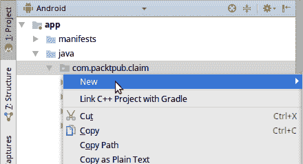
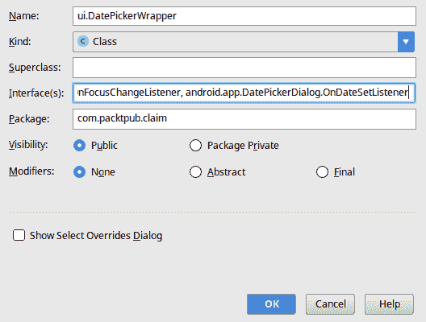
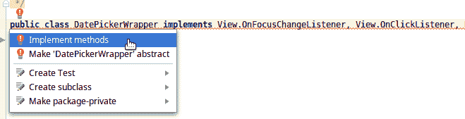
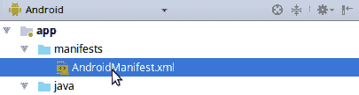

# 第三章：采取行动

处理事件是任何应用程序的基本部分；它们是用户界面的原始输入数据，以及我们如何与用户互动（而不仅仅是向他们展示数据）。Android 有一个事件模型，对于任何在桌面上的 Java 程序员来说都会立刻熟悉——你将监听器对象附加到小部件上，它们将事件传递给你。

Android 中的事件监听器以接口的形式存在，你需要实现这些接口以接收事件。每个可能的事件类型都在相关接口上声明为一个方法。为了接收用户在某个小部件上*点击*或*轻触*的通知，你使用`OnClickListener`接口，该接口声明了一个方法——`onClick(View)`——当相关小部件接收到它认为的用户点击手势时，该方法将被调用。

在本章中，我们将探讨 Android 中的事件，以及如何最佳地实现它们。具体来说，我们将更深入地研究以下内容：

+   Android 如何分发事件，以及它如何影响你的程序和用户体验

+   实现事件监听器的不同方式及其优缺点

+   如何将事件组封装到逻辑类中

+   如何使事件始终快速发生

# 理解 Android 事件要求

Android 对从用户界面传递的事件有一系列要求，这些要求非常重要，因为它们直接影响到用户体验和应用程序感知性能。Android 将应用程序的**主**线程作为一个事件循环来运行，而不是有一个单独的**事件循环**或**事件分发器**线程。这是一个极其重要的概念，因为这条线程和事件队列在以下方面是共享的：

+   所有来自用户界面的事件

+   小部件的绘图请求，即它们绘制自己的地方

+   布局系统以及所有定位和尺寸小部件的计算

+   各种系统级事件（如网络状态变化）

这使得应用程序的**主**线程成为一项宝贵的资源——动画的每一帧都必须作为一个单独的事件通过这个事件循环运行，布局的每一遍，以及用户界面小部件的每一个事件也是如此。在合同的另一边，还有三个其他重要因素需要了解和理解：

+   对用户界面元素的所有方法调用都必须在主线程上执行

+   主线程上不允许进行网络操作

+   主线程上的每个事件*切片*都是外部计时的，长时间运行的事件可能会导致你的应用程序通过向用户显示应用程序无响应对话框而被终止（这在大多数情况下与崩溃一样糟糕）

因此，我们有必要建立模型来避免过度使用主线程。每次你在主线程上运行某些操作时，你都会从图形渲染和输入事件等关键系统中夺取时间。这将导致你的应用程序看起来卡顿，变得无响应。幸运的是，Android 有许多工具可以帮助，作为开发者，可以采取一些额外的步骤来减少复杂性，并确保最佳的用户体验。

# 监听某些事件

当在 Android 中监听用户界面事件时，你通常会连接一个监听器对象到你想接收事件的组件上。然而，监听器对象的定义可能遵循多种不同的模式，监听器也可以有多种形式。你经常会看到定义一个简单的匿名类作为监听器，这可能是这样的：

```kt
closeButton.setOnClickListener(new View.OnClickListener() {
  @Override
  public void onClick(View v) {
    finish();
  }
});
```

然而，尽管这种模式很常见（特别是由于 lambda 语法的引入仅限于 Java 8，并且 Android 直到 2017 年才正确支持它），但它并不总是你的最佳选择，有多个原因：

+   这个匿名类根本不可重用。它只服务于一个目的，在整个应用程序中的一个单一对象。

+   你刚刚分配了一个新的对象，它也需要被垃圾回收。这不是什么大问题，但有时可以通过将监听器分组到处理多个相关事件的类中来避免或最小化这种情况。

+   在`onCreate`方法中定义的任何局部变量，如果被匿名内部类捕获，必须将引用复制到新类作为字段。你可能看不到这个过程发生，但是编译器会自动完成这个操作（这就是为什么字段必须是 final 的）。

如果你的项目中有 Java 8，当然可以使用 lambda 表达式，并缩短语法。然而，这仍然会导致创建一个匿名内部类。另一种监听事件的模式是让包含布局的类（通常是`Activity`或`Fragment`）实现监听器接口，并使用`switch`语句来处理来自不同组件的事件：

```kt
public class MyListenerActivity extends Activity implements View.OnClickListener {
  @Override
  protected void onCreate(@Nullable Bundle savedInstanceState) {
    super.onCreate(savedInstanceState);
    setContentView(R.layout.eventful_layout);

    findViewById(R.id.open).setOnClickListener(this);
    findViewById(R.id.find).setOnClickListener(this);
    findViewById(R.id.close).setOnClickListener(this);
  }

  // ...

  @Override
  public void onClick(View v) {
    switch (v.getId()){
      case R.id.open:
        onOpen();
        break;
      case R.id.find:
        onFind();
        break;
      case R.id.close:
        onClose();
        break;
    }
  }
}
```

这有两个优点：没有新的监听器对象，并且所有的布局和事件逻辑现在都被封装在`Activity`类中。`switch`语句带来了一点点开销，但随着布局的增大，维护这些样板代码变得很多，这多少会鼓励你直接在`onClick`方法中放置简单的事件代码，而不是总是只是调用另一个方法。这种简单的事件代码几乎总是导致更复杂的事件代码，最终在你的代码库中造成混乱。

那么，处理事件的最佳方式是什么？答案是并没有一种方法，但在决定如何处理事件时，你应该始终考虑你将如何重用事件处理器的代码--不要重复自己。对于上一章中的日期选择小部件，预期当用户点击日期时，他们将看到一个日历对话框打开，允许他们选择新日期。这需要一个事件处理器，并且这样的处理器应该是可重用的，因为你可能希望它在其他地方使用，所以按照以下步骤构建日期选择器事件监听器：

1.  右键单击你的默认包（即 `com.packtpub.claim`），然后选择“新建| Java 类”：



1.  将新类命名为 `ui.DatePickerWrapper`；Android Studio 将自动创建一个名为 `ui` 的新包，并将 `DatePickerWrapper` 放入其中。

1.  在接口列表中，添加以下监听器接口（使用逗号 "`,`" 分隔接口）：

    +   `android.view.View.OnClickListener`：当用户点击日期选择器时接收事件

    +   `android.view.View.OnFocusChangeListener`：当日期选择器获得键盘焦点时接收事件；如果用户选择使用键盘上的“下一个”按钮导航表单，或者设备连接了物理键盘，则处理此事件很重要。

    +   `android.app.DatePickerDialog.OnDateSetListener`：当用户从 `DatePickerDialog` 中选择新日期时接收事件：



1.  点击“确定”以创建新包和类。

1.  如果 Android Studio 没有为监听器创建骨架方法，请在源代码中选择类名为 `DatePickerWrapper`，并使用代码助手实现这些方法：



1.  现在，你需要一种方式来格式化日期字符串供用户使用，并且它应该是本地化的，因此声明一个 `java.text.DateFormat` 用于此目的：

```kt
private final DateFormat dateFormat = DateFormat.getDateInstance(DateFormat.LONG);
```

1.  此类是一个包装器，还需要一些字段来跟踪它所包装的内容，即 `TextView`，其中它将向用户显示日期（并且用户可以点击以打开日期选择器对话框），一个用于向用户显示的 `DatePickerDialog` 实例，以及当前所选/显示的 `Date`：

```kt
private final TextView display;

private DatePickerDialog dialog = null;
private Date currentDate = null;
```

1.  然后，我们需要一个简单的构造函数，它将捕获用于显示的 `TextView`，并将其设置为日期显示并配置事件：

```kt
public DatePickerWrapper(final TextView display) {
  this.display = display;
  this.display.setFocusable(true);
  this.display.setClickable(true);
  this.display.setOnClickListener(this);
  this.display.setOnFocusChangeListener(this);

  this.setDate(new Date());
}
```

1.  现在，我们需要类似 getter 和 setter 的方法来更改和检索日期选择器的状态：

```kt
public void setDate(final Date date) {
  if(date == null) {
    throw new IllegalArgumentException("date may not be null");
  }

  this.currentDate = (Date) date.clone();
  this.display.setText(dateFormat.format(currentDate));

  if(this.dialog != null) {
    final GregorianCalendar calendar = new GregorianCalendar();
    calendar.setTime(currentDate);
    this.dialog.updateDate(
        calendar.get(Calendar.YEAR),
        calendar.get(Calendar.MONTH),
        calendar.get(Calendar.DAY_OF_MONTH)
    );
  }
}

public Date getDate() {
  return currentDate;
}
```

1.  在我们实际处理事件之前，我们需要一个方法来显示 `DatePickerDialog`，这将允许用户更改日期：

```kt
void openDatePickerDialog() {
  if (dialog == null) {
    final GregorianCalendar calendar = new GregorianCalendar();
    calendar.setTime(getDate());
    dialog = new DatePickerDialog(
        display.getContext(),
        this,
        calendar.get(Calendar.YEAR),
        calendar.get(Calendar.MONTH),
        calendar.get(Calendar.DAY_OF_MONTH)
    );
  }
  dialog.show();
}
```

1.  然后，我们需要完成事件监听器方法，以便当用户选择显示的日期时，我们打开 `DatePickerDialog`，允许他们更改所选日期：

```kt
@Override
public void onClick(final View v) {
  openDatePickerDialog();
}

@Override
public void onFocusChange(final View v, final boolean hasFocus) {
  if (hasFocus) {
    openDatePickerDialog();
  }
}
```

1.  最后，我们需要处理从 `DatePickerDialog` 返回的事件，该事件指示用户已选择日期：

```kt
@Override
public void onDateSet(
      final DatePicker view,
      final int year,
      final int month,
      final int dayOfMonth) {

  final Calendar calendar = new GregorianCalendar(
      year, month, dayOfMonth
  );

  setDate(calendar.getTime());
}
```

现在你有一个可以将任何`TextView`对象转换成用户可以通过标准`DatePickerDialog`选择日期的空间的类。这是一个很好的封装事件的例子；你实际上有三个不同的事件处理器执行一组相关的操作，并在一个可以被整个应用程序重用的类中维护用户界面状态。

# 连接 CaptureClaimActivity 事件

现在我们有了一种让用户为他们的旅行费用报销选择日期的方法，我们需要将其实际连接到`CaptureClaimActivity`，这是所有屏幕逻辑和连接将存在的位置。要开始连接`CaptureClaimActivity`的事件，请按照以下步骤操作：

1.  在 Android Studio 中打开`CaptureClaimActivity.java`文件。

1.  现在，在类中（在`onCreate`方法之前）声明一个新的字段用于你编写的`DatePickerWrapper`（Android Studio 可以通过为你编写导入语句来帮助你）：

```kt
private DatePickerWrapper selectedDate;
```

1.  你会注意到（默认情况下），`FloatingActionButton`对象与一个简单的匿名事件处理器连接，其外观可能如下所示：

```kt
fab.setOnClickListener(new View.OnClickListener() {
  @Override
  public void onClick(View view) {
    Snackbar.make(
        view,
        "Replace with your own action",
        Snackbar.LENGTH_LONG
    ).setAction("Action", null).show();
  }
});
```

1.  这就是许多一次性事件是如何连接的（如本章前面所讨论的），但这不是我们想要做的，所以删除整个代码块。

1.  在`onCreate`方法的末尾，通过搜索你添加到布局中的`date` `TextView`来实例化`DatePickerWrapper`对象：

```kt
selectedDate = new DatePickerWrapper((TextView) findViewById(R.id.date));
```

1.  你不需要保留对`date` `TextView`的任何其他引用，因为你将只通过`DatePickerWrapper`类访问它。现在尝试运行你的应用程序，看看日期选择器是如何工作的。

在应用中，你会注意到你可以选择类别图标，并且它们将按预期工作。然而，跟在它们后面的标签完全没有连接，不会显示任何标签，使用户对实际选择的内容感到困惑。为了解决这个问题，你需要另一个事件监听器，当`RadioButton`小部件的状态改变时，它会设置标签的内容。这是一个专门监听器类很有意义的情况；因为它可以在任何时候使用，你有一组图标`RadioButton`小部件和一个为所有这些小部件共享的标签：

1.  右键点击`ui`包，选择“新建”|“Java 类”。

1.  将新类命名为`IconPickerWrapper`。

1.  将`android.widget.RadioGroup.OnCheckedChangeListener`添加到接口框中。

1.  为`TextView`标签创建一个字段，并创建一个构造函数来捕获它：

```kt
private final TextView label;

public IconPickerWrapper(final TextView label) {
  this.label = label;
}
```

1.  添加一个方法来设置标签文本内容：

```kt
public void setLabelText(final CharSequence text) {
  label.setText(text);
}
```

1.  完成设置标签文本的`onCheckedChange`方法，从所选`RadioButton`的`contentDescription`字段中设置：

```kt
@Override
public void onCheckedChanged(
    final RadioGroup group,
    final int checkedId) {

  final View selected = group.findViewById(checkedId);
  setLabelText(view.getContentDescription());
}
```

这是一个非常简单的类，但它也可能在你的应用程序中服务于其他目的，并且它只对将要连接的`RadioGroup`做出了两个假设：

+   每个`RadioButton`都有一个有效的 ID

+   每个`RadioButton`都有一个`contentDescription`，它将作为文本标签使用

回到`CaptureClaimActivity`，您将通过以下步骤将此新监听器连接到布局：

1.  在`onCreate`方法之前，创建一个新的字段来跟踪用户可以从中选择类别图标的`RadioGroup`：

```kt
private RadioGroup categories;
```

1.  然后，在`onCreate`方法的末尾，您需要找到布局中的`RadioGroup`，并实例化其事件处理器：

```kt
categories = (RadioGroup) findViewById(R.id.categories);
categories.setOnCheckedChangeListener(
  new IconPickerWrapper(
      (TextView) findViewById(R.id.selected_category)
  )
);
```

1.  最后，将默认选择设置为`other`；此操作还会在屏幕呈现给用户之前触发事件处理器。这意味着当用户第一次看到捕获报销屏幕时，标签也会被填充：

```kt
categories.check(R.id.other);
```

现在如果您再次运行应用程序，您将看到定义的标签在切换类别图标时出现在所选图标下方。

# 处理来自其他活动的事件

在 Android 上，您经常会发现您想要将用户发送到另一个`Activity`去做某事，然后带着该动作的结果返回到当前`Activity`。好的例子包括让用户选择联系人或使用相机应用程序拍照。在这些情况下，Android 使用一个内置在`Activity`类中的特殊事件系统。对于捕获旅行费用报销，您的用户需要能够选择文件以附加照片或电子邮件附件等。

为了向用户提供一个熟悉的文件选择器（并避免自己编写文件选择器），您需要使用此机制。然而，为了从应用程序的私有空间之外读取文件，您需要请求用户的权限。每当应用程序需要访问可能敏感的数据（公共目录、设备的相机或麦克风、联系人列表等）时，您需要用户的权限。在 Android 6.0 之前的版本中，这是在安装期间完成的；应用程序声明它需要的权限，用户可以选择不安装它。然而，这种机制对用户来说不够灵活，并在 6.0 中进行了更改，使得应用程序现在必须在运行时请求权限。

为了访问用户的文件，应用程序将声明它需要权限，并在运行时包含请求权限的代码（覆盖两种情况）：

1.  打开`CaptureClaimActivity`类，并使该类实现`View.OnClickListener`接口：

```kt
public class CaptureClaimActivity extends AppCompatActivity
                                  implements View.OnClickListener {
```

1.  创建两个新的常量来保存请求代码。每当您的用户离开当前`Activity`，并且您期望得到结果时，您需要一个请求代码：

```kt
private static final int REQUEST_ATTACH_FILE = 1;
private static final int REQUEST_ATTACH_PERMISSION = 1001;
```

1.  在`onCreate`方法中，找到 Android Studio 模板捕获`FloatingActionButton`的行：

```kt
FloatingActionButton fab = (FloatingActionButton) findViewById(R.id.fab);
```

1.  将按钮重命名为`attach`，如下所示（使用 Android Studio 重构更改 ID，布局文件中的 ID 也将相应更改）：

```kt
FloatingActionButton attach = (FloatingActionButton) findViewById(R.id.attach);
```

1.  现在，为`FloatingActionButton`设置`OnClickListener`为`Activity`：

```kt
attach.setOnClickListener(this);
```

1.  现在，在`CaptureClaimActivity`的末尾实现`onClick`方法，并将`FloatingActionButton`的点击事件委托：

```kt
@Override
public void onClick(View v) {
  switch (v.getId()){
    case R.id.attach:
      onAttachClick();
      break;
  }
}
```

1.  你的应用程序需要权限才能从其自身的私有空间外读取内容。在文件浏览器中打开 `manifests` 文件夹，并打开 `AndroidManifest.xml` 文件：



1.  在 `manifest` 元素内的文件顶部，但在应用程序元素之前，添加以下权限声明：

```kt
<manifest 
    package="com.packtpub.claim">

 <uses-permission
 android:name="android.permission.READ_EXTERNAL_STORAGE"
 android:maxSdkVersion="23" />

    <application
        android:name=".ClaimApplication"
```

1.  前面的权限仅适用于在安装期间请求权限的 Android 版本；在 Android 6.0 及更高版本中，你需要在运行时检查和请求权限。当用户点击 `FloatingActionButton` 附加文件时进行此操作是最佳时机，因为这正是在他们实际选择你将需要权限读取的文件之前：实现 `onAttachClick` 方法，从检查权限开始，如果尚未授予，则请求权限：

```kt
public void onAttachClick() {
  final int permissionStatus = ContextCompat.checkSelfPermission(
    this,
    Manifest.permission.READ_EXTERNAL_STORAGE);

  if (permissionStatus != PackageManager.PERMISSION_GRANTED) {
    ActivityCompat.requestPermissions(
      this,
      new String[]{Manifest.permission.READ_EXTERNAL_STORAGE},
      REQUEST_ATTACH_PERMISSION);
    return;
  }
```

1.  现在，应用程序可以请求系统启动一个 `Activity`，允许用户选择任何可打开的文件。这就是你之前定义的 `REQUEST_ATTACH_FILE` 常量开始被使用的地方：

```kt
  final Intent attach = new Intent(Intent.ACTION_GET_CONTENT)
        .addCategory(Intent.CATEGORY_OPENABLE)
        .setType("*/*");

  startActivityForResult(attach, REQUEST_ATTACH_FILE);
}
```

1.  如果我们之前的权限检查失败，系统将启动一个对话框询问用户是否授予访问外部文件的权限。当用户从该对话框返回时，将调用一个名为 `onRequestPermissionsResult` 的方法。在这里，你需要检查他们是否授予了你的请求，如果是的话，你可以简单地触发 `onAttachClick()` 方法以顺利继续流程：

```kt
@Override
public void onRequestPermissionsResult(
      final int requestCode,
      final String[] permissions,
      final int[] grantResults) {

  switch (requestCode) {
    case REQUEST_ATTACH_PERMISSION:
      if (grantResults[0] == PackageManager.PERMISSION_GRANTED) {
        onAttachClick();
      }
      break;
  }
}
```

1.  现在当系统从文件选择器 `Activity` 返回时，它将调用一个名为 `onActivityResult` 的方法，这个方法的结构与 `onRequestPermissionResult` 方法非常相似：

```kt
@Override
protected void onActivityResult(
      final int requestCode,
      final int resultCode,
      final Intent data) {

  switch (requestCode) {
    case REQUEST_ATTACH_FILE:
      onAttachFileResult(resultCode, data);
      break;
  }
}
```

1.  在前面的 `onActivityResult` 中，你只需检查它是否响应了你附加文件的请求，然后将剩余的操作委托给一个需要处理结果数据的方法：

```kt
public void onAttachFileResult(
    final int resultCode, final Intent data) {
```

1.  验证 `resultCode` 是否正常，并且数据是否有效：

```kt
if (resultCode != RESULT_OK
    || data == null
    || data.getData() == null) {
  return;
}
```

1.  目前，你只需要一个 `Toast` 弹出显示此代码已运行；稍后，你可以构建完整的逻辑来附加选定的文件。`Toast` 是一个出现后消失的小消息，无需用户交互，非常适合临时消息或调试：

```kt
Toast.makeText(this, data.getDataString(), Toast.LENGTH_SHORT).show();
```

现在，如果你运行应用程序并点击浮动操作 *附加* 按钮，你将获得一个权限请求（如果你运行的是 Android 6 或更高版本，在早期版本中权限是作为安装过程的一部分授予的），然后你可以使用你模拟器或设备上可用的任何文件选择系统选择文件。一旦你选择了文件，你将返回到 `CaptureClaimActivity`，选定的 `Uri` 将在屏幕上的 `Toast` 消息中显示：


这可能看起来不多，但这是您以后访问文件并附加到用户正在捕获的声明所需的所有内容。当您需要将用户发送到另一个 Activity 时，您将通过`onActivityResult`和`onRequestPermissionsResult`等方法将 Android 的`Activity`到`Activity`的消息系统挂钩。

# 使事件处理快速

Android 对应用程序中线程的使用施加了非常严格的限制：每个应用程序都有一个主线程，所有与用户界面相关的代码都必须在此线程上运行，但任何长时间运行的代码都会导致错误。在主线程上尝试进行网络操作将立即导致`NetworkOnMainThreadException`，因为网络操作的本质会阻塞主线程太长时间，使应用程序无响应。

这意味着您想要执行的大多数任务应该在后台工作线程上执行。这还将为您提供一种与用户界面的隔离形式，因为通常您会在主线程上捕获用户界面状态，将状态传递到后台线程，处理事件，然后，将结果发送回主线程，在那里您将更新用户界面。我们如何知道我们捕获的状态将是一致的？答案是，因为用户界面代码只能在主线程上运行，而您读取小部件的状态时，任何会改变其状态的事件都会被阻塞，直到您完成（因为它们也必须在主线程上发生）。消息队列和线程规则通过确保一次只处理一个代码单元（以消息的形式）来避免锁和其他线程保护机制的需求。

需要大量后台处理时间的 Android 任务通常使用 Android 平台提供的`AsyncTask`类（或其子类）编写。`AsyncTask`具有在后台工作线程上运行代码的方法，以及向主线程发布状态更新（并接收这些更新消息），以及几个其他实用结构。这使得它非常适合像下载大文件这样的任务，用户需要了解下载的进度。然而，您将要实现的多数事件处理器不需要接近这种复杂程度。

大多数事件处理器相对轻量级，但这并不意味着它在所有设备和所有情况下都会快速执行。您无法控制用户在设备上忙于做什么，一个简单的数据库查询可能会比预期的花费更长的时间。因此，最好将事件处理推送到后台线程，只要事件不是纯粹的用户界面更新（即显示对话框或类似内容）。即使是相当小的任务也应该移动到后台线程，这样主线程就可以继续消耗用户的输入；这将保持您的应用程序响应。以下是实现事件处理器时应尝试遵循的模式：

+   **在主线程上**：首先，捕获任何所需的参数

+   **在后台工作者上**：处理用户的事件和数据

+   **在主线程上**：最后，通过更新用户界面来更新新状态

如果您坚持这种模式，应用程序将始终对用户保持响应，因为处理数据不会阻止处理他们的事件（例如，他们可能正在滚动一个大型列表）。然而，`AsyncTask` 并不适合这些较小的事件（例如，将文件附加到索赔），因此以下是如何编写一个简单的类（类似于命令模式的风格）的示例，它将首先在后台运行一些代码，然后将该代码的结果传递到主线程上的另一个方法，非常适合执行较小的事件：

1.  右键单击您的根包（即 `com.packtpub.claim`），然后选择 New| Java Class。

1.  将类命名为 `util.ActionCommand`。

1.  将修饰符更改为使新类 `Abstract`。

1.  点击 OK 创建新包（`util`）和类。

1.  将类定义修改为包含用于“参数”和“返回值”的泛型参数：

```kt
public abstract class ActionCommand<P, R> {
```

1.  在新类顶部创建一个静态常量，通过 `android.os.Handler` 对象引用应用程序的主线程：

```kt
private static final Handler MAIN_HANDLER = new Handler(Looper.getMainLooper());
```

在 Android 中，`Handler` 对象是用来访问另一个线程的消息队列的方式。在这种情况下，任何发送到这个 `Handler` 的消息或 `Runnable` 对象都将尽可能快地在主线程上运行。您还可以发布需要在特定时间或延迟后运行的任务。这是在 Android 中创建计时器的首选方法。

1.  创建三个方法声明，用于在后台工作者、主线程上运行代码以及处理错误（具有默认实现）：

```kt
public abstract R onBackground(final P value) throws Exception;
public abstract void onForeground(final R value);

public void onError(final Exception error) {
  Log.e(
      getClass().getSimpleName(),
      "Error while processing data",
      error
  );
}
```

1.  然后，创建两个 exec 方法的变体，用于启动 `ActionCommand` 对象。第一个使用 `AsyncTask` 提供的标准 `Executor`，该 `Executor` 使用单个后台线程来处理任务（这是您在应用程序中希望看到的最常见行为）：

```kt
public void exec(final P parameter) {
   exec(parameter, AsyncTask.SERIAL_EXECUTOR);
}

public void exec(final P parameter, final Executor background) {
   background.execute(new ActionCommandRunner(parameter, this));
}
```

1.  在前面的方法中，我们向后台 `Executor` 对象提交一个 `ActionCommandRunner` 对象；这是一个 `private` 内部类，将在后台和主线程之间传递状态，这使 `ActionCommand` 类可重用且无状态：

```kt
private static class ActionCommandRunner implements Runnable {
```

1.  `ActionCommandRunner` 将处于三种可能状态之一：后台、前台或错误。声明三个常量作为名称，并声明一个字段来跟踪对象所处的状态：

```kt
private static final int STATE_BACKGROUND = 1;
private static final int STATE_FOREGROUND = 2;
private static final int STATE_ERROR = 3;
private int state = STATE_BACKGROUND;
```

1.  然后，您需要为正在运行的 `ActionCommand` 和当前值创建字段。`value` 字段是本类的一个通配符，它包含输入参数、后台代码的输出或从后台代码抛出的 `Exception`：

```kt
private final ActionCommand command;
private Object value;

ActionCommandRunner(
       final Object value,
       final ActionCommand command) {

   this.value = value;
   this.command = command;
}
```

1.  现在，创建处理每个 `ActionCommandRunner` 状态的方法：

```kt
void onBackground() {
   try {
       // our current "value" is the commands parameter
       this.value = command.onBackground(value);
       this.state = STATE_FOREGROUND;
   } catch (final Exception error) {
       this.value = error;
       this.state = STATE_ERROR;
   } finally {
       MAIN_HANDLER.post(this);
   }
}

void onForeground() {
   try {
       command.onForeground(value);
   } catch (final Exception error) {
       this.value = error;
       this.state = STATE_ERROR;

       // we go into an error state, and foreground to deliver it
       MAIN_HANDLER.post(this);
   }
}

void onError() {
   command.onError((Exception) value);
}
```

1.  最后，创建一个`run`方法，该方法将根据`ActionCommandRunner`的当前执行状态调用前面的`onBackground`、`onForeground`或`onError`方法：

```kt
@Override
public void run() {
   switch (state) {
       case STATE_BACKGROUND:
           onBackground();
           break;
       case STATE_FOREGROUND:
           onForeground();
           break;
       case STATE_ERROR:
           onError();
           break;
   }
}
```

这个类使得创建和重用小型任务变得非常容易，这些任务可以被扩展、组合、模拟和单独测试。在创建新的事件处理器时，考虑命令模式或类似模式是个好主意，这样事件就不会与您正在忙于的部件或屏幕耦合。这允许更好的代码重用，并使代码更容易测试，因为您可以在它将作为其中一部分的屏幕出现之前测试事件处理器。您还可以通过将它们编写为仅实现其`onBackground`方法的`abstract`类来使这些类更加模块化，允许子类以不同的方式处理结果。

# 多个事件监听器

然而，与其他许多事件系统不同，许多 Android 组件仅允许某些类型的事件有单个事件监听器；这与 Java 桌面平台或浏览器中的 JavaScript 不同，在这些平台上，可以为单个元素附加任意数量的**点击**监听器。在 Android 中，点击监听器几乎总是**设置**而不是**添加**。

这实际上是一个巧妙的权衡——为每个事件拥有多个监听器意味着你需要至少一个监听器数组；当数组空间不足时，需要对其进行大小调整和复制，但实际上很少需要多个监听器。多个监听器还意味着小部件每次想要分发事件时都必须遍历列表，因此坚持使用单个监听器可以简化代码，并减少所需的内存量。

如果你发现自己需要一个事件和仅提供单个监听器槽的小部件的多个监听器，只需简单地编写一个简单的委托类，如下所示：

```kt
public class MultiOnClickListener implements View.OnClickListener {
  private final List<View.OnClickListener> listeners =
      new CopyOnWriteArrayList<>();

  public MultiOnClickListener(
      final View.OnClickListener... listeners) {
    this.listeners.addAll(Arrays.asList(listeners));
  }

  @Override
  public void onClick(View v) {
    for (final View.OnClickListener listener : listeners)
      listener.onClick(v);
  }

  public void addOnClickListener(
      final View.OnClickListener listener) {
    if (listener == null) return;
      listeners.add(listener);
  }

  public void removeOnClickListener(
      final View.OnClickListener listener) {
    if (listener == null) return;
    listeners.remove(listener);
  }
}
```

上述模式允许在可能需要的情况下进行紧凑和灵活的多监听器委托。`CopyOnWriteArrayList`类是一个理想的监听器容器，因为其内部数组的大小始终与元素数量相同，因此它保持紧凑（而不是像`ArrayList`和类似实现那样有缓冲空间）。

# 测试你的知识

1.  实现事件处理器的最佳方式是什么？

    +   作为匿名内部类

    +   通过将`Activity`设为监听器

    +   作为每个监听器一个类

    +   没有特定的条件

1.  改变用户界面小部件状态的任何方法需要满足哪些条件？

    +   它们必须从后台线程调用

    +   它们必须线程安全

    +   它们必须从主线程调用

    +   它们必须从图形线程调用

1.  作为事件处理程序运行的部分代码应满足以下哪些条件？

    +   被一个同步块包围

    +   尽快运行

    +   仅与用户界面交互

1.  当从另一个`Activity`请求数据时，数据是通过以下哪种方式返回的？

    +   添加到`Activity`对象中的事件监听器

    +   对您的`Activity`对象上的回调

    +   放置在您应用程序的消息队列上的消息

# 摘要

Android 在应用程序内部传递事件时使用了几种不同的机制，每种机制都针对传递的事件类型和事件预期的接收者进行了定制。大多数用户界面事件都传递给每个小部件注册的单个监听器，但这并不妨碍同一个监听器处理来自不同小部件的多个事件类型。这种设计将减少系统负载和内存使用量，并且通常有助于生成更多可重用的代码。

事件处理器通常编写得不好，最终变成了匿名内部类，这些类最初可能只是另一个方法的简单委托，但最终会变得臃肿且难以维护。通常最好从一开始就将事件处理器与其环境隔离开来，因为这鼓励它们被重用，并使它们更容易进行测试和维护。一些事件处理器类（如`DatePickerWrapper`）以相关的方式处理不同类型的事件，允许单个类封装一小块可重用的逻辑。

在下一章中，我们将探讨如何通过将用户界面分解成更小的组件来构建可重用且易于测试的用户界面。
