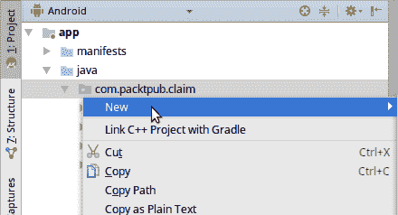

# 第四章：构建用户界面

移动应用看起来像是简单的系统，但实际上它们往往是相当深奥和复杂的系统，由许多不同的部分组成，这些部分帮助它们保持简单的外观。应用程序的用户界面也是如此；它们可能看起来简单，但通常是复杂的屏幕和对话框的排列，旨在隐藏应用程序的复杂性并向用户提供更流畅的体验。最容易想到的是，传统的桌面应用程序和网站往往更“宽”，而移动应用程序则更“深”。

这个评论（至少表面上）适用于应用程序的导航。桌面应用程序往往有一个中央**控制**区域，大部分工作都在这里完成。想想文档编辑器——应用程序围绕正在编写的文档展开，你永远不会真正**离开**这个区域。而不是导航离开，对话框会弹出以完成单个任务，在它们消失之前会改变文档。这个主题有很多变体，但桌面应用程序往往遵循相同的模式。

相反，移动应用程序往往从一个某种形式的**概览**屏幕开始，或者直接进入一个**操作**屏幕。然后用户会向下导航到一个任务或项目，之后要么返回到概览屏幕，要么完成任务并得到某种类型的**结果**（例如，预订航班）。通过从概览屏幕导航离开来实现目标，而不是简单地打开内容上方的对话框，这要求您对应用程序的设计采取不同的方法。由于没有中央屏幕始终可用，您通常需要提醒用户他们在哪里，以及他们在做什么。这种重复在桌面应用程序中是不可想象的，因为在另一个窗口或应用程序的面板中总是可以找到信息；然而，在移动手机提供的有限空间中，这成为了一个保持用户在正确轨道上并帮助他们完成他们试图完成的任务的必要工具。

这种用户导航方式的变化要求屏幕通常展示相同的数据，或者有在应用程序中重复出现的元素。这些元素最好被封装起来，以便在应用程序中轻松重用。Android 提供了封装这些小部件组的方法，使其比简单的布局组件更具有感知能力——片段。**片段**就像一个**微型**的`Activity`；每个片段都有一个完整的生命周期，就像`Activity`一样，只是它们总是包含在一个`Activity`中（有关`Activity`生命周期的详细信息，请参阅附录 A）。使用片段可以让您的应用程序更容易适应各种屏幕尺寸。我们将在本章后面更详细地探讨片段。

在本章中，我们将探讨各种分解用户界面的方法，构建可以分层和重用的模块，以形成复杂的行为，而无需编写复杂的代码和连接。我们将探讨以下内容：

+   如何构建可以直接包含在布局中的自定义小部件组

+   如何构建具有自身完整生命周期的 Fragment 以暴露常用功能

+   如何使用 ViewPager 显示页面或小部件标签页

# 设计模块化布局

到目前为止，你已经构建了一个包含两个布局文件（包含小部件）的布局的单一`Activity`类。这是一个相当正常的状态，但并不是最佳情况。像大多数用户界面一样，捕获屏幕可以被划分为一系列非常逻辑的区域：


在 Android 用户界面中，你总是将单个小部件（如`Button`、`TextView`、`ImageView`等）放在底层，而`Activity`位于顶层，但当你查看那个屏幕原型时，你可以立即看到屏幕可以被分成在`Activity`和小部件之间的其他层。当然，你可以从这个屏幕中取出每个`CardView`布局，并将它们放置在自己的布局 XML 文件中，然后导入：

```kt
<?xml version="1.0" encoding="utf-8"?>
<!-- card_claim_capture_info.xml -->
<android.support.v7.widget.CardView

   android:layout_width="match_parent"
   android:layout_height="wrap_content">

  <android.support.constraint.ConstraintLayout
       android:layout_width="match_parent"
       android:layout_height="match_parent"
       android:layout_margin="@dimen/grid_spacer1">
       <android.support.design.widget.TextInputLayout
           android:id="@+id/description_layout"
           android:layout_width="0dp"
           android:layout_height="wrap_content"
           android:layout_marginEnd="8dp"
           app:layout_constraintEnd_toStartOf="@+id/amount_layout"
           app:layout_constraintStart_toStartOf="parent"
           app:layout_constraintTop_toTopOf="parent">
```

你可以使用`<include>`元素将一个布局文件包含到另一个文件中，如下所示：

```kt
<!-- content_capture_claim.xml -->
<include layout="@layout/card_claim_capture_info"/>
```

这样就很好地分离了屏幕这一部分的布局，允许你在更大物理屏幕的布局中或是在应用程序中的其他`Activity`类中重用它。问题是，每个想要使用这个布局的屏幕都需要复制与之相关的所有逻辑。虽然逻辑解耦逻辑和布局大多数情况下是好事（尤其是当你可以在多个不同的布局上叠加逻辑时），但它们的耦合通常非常紧密。

# 创建 DatePickerLayout

这些区域中的每一个都可以轻松封装在 Java 类中，并在你的应用程序的其他地方重用。在第三章“执行操作”中，你编写了`DatePickerWrapper`类，该类可以将任何`TextView`小部件转换为日期选择小部件。然而，`DatePickerWrapper`不会创建`TextView`标签或更改小部件的样式以看起来像`TextInputLayout`。这意味着你需要将这种样式复制到每个你想要日期选择器的布局中，这可能导致你的用户界面出现不一致。虽然将事件和状态与显示逻辑解耦是好事，但将它们组合在一起在一个可以重用的单一结构中也会很好，这样就不需要每个布局都手动指定日期选择器小部件，然后在代码中将它们绑定到`DatePickerWrapper`。

虽然一开始并不明显，但 Android 布局 XML 文件可以引用任何 `View` 类，而不仅仅是核心和支持包中定义的类，并且它可以不使用任何特殊技巧做到这一点。您需要做的只是通过其完全限定名引用 `View` 类，就像您已经为几个小部件所做的那样：

+   `android.support.constraint.ConstraintLayout`

+   `android.support.v7.widget.CardView`

+   `android.support.design.widget.TextInputLayout`

所有的这些都是在 Android Studio 中可以查找的类，如果您喜欢，甚至可以阅读它们的代码。让我们开始编写一个 `DatePickerLayout`，将布局 XML 与 `DatePickerWrapper` 相结合，并使日期选择器可以从应用程序中的任何布局 XML 文件中重用：

1.  在 Android Studio 的 Android 面板中，右键单击 `res` 下的布局目录：


1.  选择“新建 | 布局资源文件”。

1.  将新的布局文件命名为 `widget_date_picker`.

1.  将根元素字段更改为 `merge`：


`merge` 是布局文件的特殊根元素。通常，布局文件的根元素是一个 `View` 类，当文件被填充时，它会在文件中产生一个根小部件。`merge` 元素不会创建根小部件；相反，当文件被加载时，它会有效地被跳过，并且其子元素会直接被填充。这使得它非常适合创建布局小部件或可重用的布局片段，同时保持布局层次结构扁平，并有助于提高应用程序的性能。

1.  将编辑模式更改为文本而不是设计。

1.  从 `merge` 元素中移除 `layout_width` 和 `layout_height` 属性。

1.  将以下两个 `TextView` 小部件写入 `merge` 元素中：

```kt
<?xml version="1.0" encoding="utf-8"?>
<merge >
   <TextView
       android:layout_width="match_parent"
       android:layout_height="wrap_content"
       android:text="@string/label_date"
       android:textAppearance="@style/TextAppearance.AppCompat.Caption"
       android:textColor="@color/colorAccent" />
   <TextView
       style="@style/Widget.AppCompat.EditText"
       android:layout_width="match_parent"
       android:layout_height="wrap_content"
       android:layout_marginTop="@dimen/grid_spacer1" />
</merge>
```

在前面的文件中，没有设置 `id` 属性；这是因为任何使用新小部件的布局都会被这些 `id` 属性污染，并且 `findViewById` 很容易返回意外的结果。在封装布局的各个部分时，始终考虑新布局中会出现的 `id` 值，以及它们可能在代码中的使用位置。`findViewById` 仅查找布局中的第一个匹配的 `View` 对象，并返回它，而不考虑该 `View` 可能来自何处（即：`<include>` 或特殊 `View` 类）。

1.  在 Android Studio 的 Android 面板中，右键单击您的 `base` 包（即 `com.packtpub.claim`）:



1.  选择“新建”和“Java 类”。

1.  将新类命名为 `widget.DatePickerLayout`。

1.  将超级类更改为 `android.widget.LinearLayout`。

1.  点击“确定”以创建新的包和类。

1.  在 `DatePickerLayout` 中声明字段以引用 `TextView` 标签和 `DatePickerWrapper` :

```kt
private TextView label;
private DatePickerWrapper wrapper;
```

1.  任何可以从布局 XML 访问的类都需要几个构造函数重载，因此最好创建一个可以重用于所有这些的单一 `initialize` 方法：

```kt
void initialize(final Context context) {
   setOrientation(VERTICAL);
}
```

1.  仍然在 `initialize` 方法中，使用 `LayoutInflator` 加载您编写的布局 XML 文件，将其内容作为元素添加到 `DatePickerLayout` 对象中：

```kt
LayoutInflater.from(context).inflate(
  R.layout.widget_date_picker, this, true);
```

`inflate` 方法的参数是布局资源、将包含布局的 `ViewGroup`（在这种情况下，`DatePickerLayout`），以及是否实际将布局资源的元素附加到 `ViewGroup`。由于您在布局资源中使用了一个合并元素，第三个参数必须是 `true`，否则布局的内容将会丢失。

1.  使用 `getChildAt` 来检索由 `LayoutInflator` 加载的新 `TextView` 元素，并将 `DatePickerLayout` 的字段赋值：

```kt
label = (TextView) getChildAt(0);
wrapper = new DatePickerWrapper((TextView) getChildAt(1));
```

1.  重载构造函数并在每个构造函数中调用 `initialize` 方法：

```kt
public DatePickerLayout(Context context) {
  super(context);
  initialize(context);
}

public DatePickerLayout(Context context, AttributeSet attrs) {
  super(context, attrs);
  initialize(context);
}

public DatePickerLayout(
    Context context, AttributeSet attrs, int defStyleAttr) {
  super(context, attrs, defStyleAttr);
  initialize(context);
}
```

1.  创建获取器和设置器，以便从 `Activity` 类中使用 `DatePickerLayout`：

```kt
public void setDate(final Date date) {
   wrapper.setDate(date);
}

public Date getDate() {
   return wrapper.getDate();
}

public void setLabel(final CharSequence text) {
   label.setText(text);
}

public void setLabel(final int resid) {
   label.setText(resid);
}

public CharSequence getLabel() {
   return label.getText();
}
```

1.  由于 `DatePickerLayout` 包含一些用户界面状态（当前选定的日期），因此它需要通过可能的 `Activity` 重新启动来跟踪这些状态，如果需要的话（每次用户在横屏和竖屏之间切换时，都会重新创建 `Activity`，因为这些被认为是 *配置* 变化）。这将涉及将其状态保存到 `Parcel` 中，并在请求时从 `Parcel` 中恢复（`Parcel` 类似于 `Serialized` 对象的 `byte[]`，但所有序列化工作都需要实现）。您需要一个内部类来保存 `DatePickerLayout` 的状态（及其父类--`LinearLayout`）。为了方便，`View` 类提供了一个 `BaseSavedState` 抽象类来为您处理一些实现，因此在一个名为 `SavedState` 的静态内部类中扩展 `BaseSavedState`：

```kt
private static class SavedState extends BaseSavedState {
   final long timestamp;
   final CharSequence label;

   public SavedState(
           final Parcelable superState,
           final long timestamp,
           final CharSequence label) {

       super(superState);
       this.timestamp = timestamp;
       this.label = label;
   }
}
```

在 `Activity` 实例之间传递的对象需要是 `Parcelable`，因为 Android 可能需要通过 `Activity` 生命周期临时存储对象。能够只存储重要的数据和方法状态，而不是整个小部件树，对于在用户运行大量应用程序时节省内存非常有用。`BaseSavedState` 实现 `Parcelable` 并允许 `DatePickerLayout` 在 `Activity` 被系统销毁和重新创建时记住其状态。

1.  `SavedState` 也需要一个构造函数来从 `Parcel` 对象中加载其字段；`CharSequence` 不能直接从 `Parcel` 中读取，但幸运的是，`TextUtils` 为您提供了一个读取 `Parcel` 对象中的 `CharSequence` 对象的便捷助手：

```kt
SavedState(final Parcel in) {
  super(in);
  this.timestamp = in.readLong();
  this.label = TextUtils.CHAR_SEQUENCE_CREATOR
      .createFromParcel(in);
}
```

1.  然后，`SavedState` 需要实现 `writeToParcel` 方法，以便实际上将这些字段写入 `Parcel`；其中一部分委托给了 `BaseSavedState` 类：

```kt
@Override
public void writeToParcel(final Parcel out, final int flags) {
   super.writeToParcel(out, flags);
   out.writeLong(timestamp);
   TextUtils.writeToParcel(label, out, flags);
}
```

1.  每个 `Parcelable` 实现都需要一个特殊的 `public static final` 字段，称为 `CREATOR`，它将被 `Parcel` 系统用于创建 `Parcelable` 对象的实例和数组。这也适用于每个子类，因此将以下静态最终字段写入 `SavedState` 类：

```kt
public static final Parcelable.Creator<SavedState> CREATOR =
      new Parcelable.Creator<SavedState>() {
  @Override
  public SavedState createFromParcel(final Parcel source) {
    return new SavedState(source);
  }

  @Override
  public SavedState[] newArray(int size) {
    return new SavedState[size];
  }
};
```

当实现一个普通的 `Parcelable` 类时，Android Studio 有一个很好的生成器，可以从类声明提示中触发（查找“添加 Parcelable 实现”），这将写入一个简单的 `writeToParcel` 方法、`Parcel` 处理构造函数和 `CREATOR` 字段。不过，检查它是否正常工作；它会跳过任何不知道如何处理的字段。

1.  在 `DatePickerLayout` 类中，你需要重写 `onSaveInstanceState` 方法并创建将被记录的 `SavedState` 对象：

```kt
@Override
protected Parcelable onSaveInstanceState() {
  return new SavedState(
      super.onSaveInstanceState(),
      getDate().getTime(), getLabel());
}
```

1.  你还需要从 `SavedState` 对象中恢复状态，这需要重写 `onRestoreInstanceState`：

```kt
@Override
protected void onRestoreInstanceState(final Parcelable state) {
   final SavedState savedState = (SavedState) state;
   super.onRestoreInstanceState(savedState.getSuperState());
   setDate(new Date(savedState.timestamp));
   setLabel(savedState.label);
}
```

1.  在 Android Studio 中打开 `content_capture_claim.xml` 布局文件。

1.  如有需要，切换到文本编辑器。

1.  找到描述日期选择器的两个 `TextView` 元素，并用以下代码片段替换它们：

```kt
<com.packtpub.claim.widget.DatePickerLayout
   android:id="@+id/date"
   android:layout_width="0dp"
   android:layout_height="wrap_content"
   android:layout_marginTop="8dp"
   app:layout_constraintEnd_toEndOf="parent"
   app:layout_constraintStart_toStartOf="parent"
   app:layout_constraintTop_toBottomOf="@+id/description_layout" />
```

1.  在 Android Studio 中打开 `CaptureClaimActivity` 类。

1.  将对 `DatePickerWrapper` 的引用替换为 `DatePickerLayout`：

```kt
private DatePickerLayout selectedDate;

@Override
protected void onCreate(Bundle savedInstanceState) {
  // …
  selectedDate = new DatePickerWrapper(    // remove this line
      (TextView) findViewById(R.id.date)); // remove this line
  selectedDate = (DatePickerLayout) findViewById(R.id.date);
  // …
}
```

这个新的 `DatePickerLayout` 类允许你在应用程序中的任何布局 XML 文件中重用相同的标签和编辑器，同时也在一个类中耦合所需的事件。每次你有带有 `TextViewLayout` 小部件的布局时，新的 `DatePickerLayout` 将完美融入样式，并允许安全地选择日期。如果你打算携带任何状态，实现 `onSaveInstanceState`/`onRestoreInstanceState` 方法在 `View` 子类上也非常重要。这些类是 marshaled 的，每次配置状态改变时都会创建新的 `View` 实例，这包括用户旋转设备等动作（有关 `Activity` 生命周期的更多信息，请参阅附录 A）。

# 创建数据模型

在应用程序的这个阶段，是时候构建一个简单的数据模型，用户界面将基于此模型。每个索赔将由一个 `ClaimItem` 对象表示，并将包含任意数量的 `Attachment` 对象，每个对象都将引用附加的 `File`，并有一个标记来帮助决定如何预览附件。所有这些类都需要实现 `Parcelable` 接口，因为它们需要在 `CaptureClaimActivity` 中保存。`CaptureClaimActivity` 还将使用它们作为输入和输出参数，并且每次需要将对象作为参数传递给或从 `Activity` 中取出时，它需要实现 `Parcelable`。

你还将创建一个 `Category` 枚举，将 Android ID 链接到一个内部模型，这样就可以在不担心 Android ID 随着应用程序的发展而改变值的情况下进行存储。

# 创建附件类

`Attachment` 类代表用户附加到 `ClaimItem` 的文件。这些文件应该始终是应用程序可访问的，稍后我们将采取措施确保这一点，即在将附件附加到索赔项目之前，将所有附件复制到私有空间中。现在，按照以下步骤创建 `Attachment` 类：

1.  在 Android 面板中，右键单击你的默认包（即 `com.packtpub.claim`），然后选择 New| Java Class。

1.  将新类命名为 `model.Attachment`，并在接口（s）框中添加 `Parcelable`：


1.  点击 OK 创建新的包和类。

1.  附件有不同的类型，这可能会影响它们的预览方式；目前，你将只有图像和未知类型。在新的 `Attachment` 类中，创建一个 `enum` 来表示这些类型：

```kt
public enum Type {
  IMAGE,
  UNKNOWN;

  public static Type safe(final Type type) {
    // Use a ternary to replace null with UNKNOWN
    return type != null ? type : UNKNOWN;
  }
}
```

1.  在 `Attachment` 类中，声明其字段、构造函数以及获取器和设置器：

```kt
File file;
Type type;

public Attachment(final File file, final Type type) {
 this.file = file;
 this.type = Type.safe(type);
}

public File getFile() { return file; }
public void setFile(final File file) {
  this.file = file;
}

public Type getType() { return type; }
public void setType(final Type type) {
  this.type = Type.safe(type);
}
```

1.  现在，为 `Attachment` 类创建 `Parcelable` 实现。在这种情况下，最好手动完成，因为 `File` 和 `Type` `enum` 都不会被 Android Studio 的 `Parcelable` 生成器理解：

```kt
protected Attachment(final Parcel in) {
  file = new File(in.readString());
  type = Type.values()[in.readInt()];
}

@Override
public void writeToParcel(final Parcel dest, final int flags) {
  dest.writeString(file.getAbsolutePath());
  dest.writeInt(type.ordinal());
}

@Override
public int describeContents() { return 0; }
```

1.  最后，在 `Attachment` 类的顶部，添加其 `Parcelable.Creator` 实例：

```kt
public static final Creator<Attachment> CREATOR = new Creator<Attachment>() {
  @Override
  public Attachment createFromParcel(final Parcel in) {
    return new Attachment(in);
  }

  @Override
  public Attachment[] newArray(final int size) {
    return new Attachment[size];
  }
};
```

# 创建 `Category` 枚举

模型的下一部分是 `Category` 枚举。这将起到双重作用--当你更改应用程序中可用的资源列表时，它们的 ID 都会发生变化。这使得这些 ID 不适合长期识别项目；然而，在应用程序运行时，它们作为标识符非常有用：

+   它们在应用程序内是唯一的

+   它们是整数类型，在比较时非常快

+   它们可以直接用来识别用户界面组件

`Category` 枚举将作为将长期稳定的标识符（枚举名称）与可能不稳定（但通常要快得多）的 Android 资源 ID 之间绑定的一种方式。按照以下快速步骤创建 `Category` 枚举：

1.  右键单击 `model` 包，然后选择 New | Java Class。

1.  将类命名为 `Category`。

1.  将 Kind 字段更改为 Enum。

1.  点击 OK 创建新的枚举文件。

1.  声明枚举常量，并将它们映射到相应的 Android 资源 ID：

```kt
ACCOMMODATION(R.id.accommodation),
FOOD(R.id.food),
TRANSPORT(R.id.transport),
ENTERTAINMENT(R.id.entertainment),
BUSINESS(R.id.business),
OTHER(R.id.other);
```

1.  声明 ID 整数、私有构造函数和 ID 获取器方法。注意使用 `@IdRes` 注解，它指示应使用哪些特定整数；在此处尝试传递除 ID 资源以外的任何内容都将导致 Android Studio 中出现 lint 错误：

```kt
@IdRes
private final int idResource;

Category(@IdRes final int idResource) {
  this.idResource = idResource;
}

@IdRes
public int getIdResource() {
  return idResource;
}
```

对于 Android 上所有不同的资源类型，都有类似于 `@IdRes` 的注解。它们位于 `android.support.annotation` 包中。在预期整数值引用 Android 类型资源的地方使用它们。

1.  最后，创建一个方法来从其 Android ID 资源查找 `Category` 枚举常量：

```kt
public static Category forIdResource(@IdRes final int id) {
  for (final Category c : values()) {
    if (c.idResource == id) {
      return c;
    }
  }

  throw new IllegalArgumentException("No category for ID: " + id);
}
```

# 创建 `ClaimItem` 类

**ClaimItem** 是这个应用程序对象模型的核心。用户收集的每个索赔在内存中都被表示为一个单独的 `ClaimItem` 实例。以下是构建 `ClaimItem` 类所需的步骤：

1.  右键单击 `model` 包，然后选择 New | Java Class。

1.  将类命名为 `ClaimItem`，并在接口（s）框中添加 `Parcelable`。

1.  点击 OK 创建新的类文件。

1.  声明 `ClaimItem` 类型的字段，以及一个 `public` 默认构造函数：

```kt
String description;
double amount;
Date timestamp;
Category category;
List<Attachment> attachments = new ArrayList<>();

public ClaimItem() {}
```

1.  使用 Android Studio 为所有字段生成 getter 和 setter 方法，除了附件字段：

```kt
public String getDescription() { return description; }
public void setDescription(final String description) {
  this.description = description;
}
public double getAmount() { return amount; }
public void setAmount(final double amount) {
  this.amount = amount;
}
public Date getTimestamp() { return timestamp; }
public void setTimestamp(final Date timestamp) {
  this.timestamp = timestamp;
}
public Category getCategory() { return category; }
public void setCategory(final Category category) {
  this.category = category;
}
```

1.  为 `ClaimItem` 创建添加、删除和列出 `Attachment` 对象的方法：

```kt
public void addAttachment(final Attachment attachment) {
  if ((attachment != null) && !attachments.contains(attachment)) {
   attachments.add(attachment);
  }
}

public void removeAttachment(final Attachment attachment) {
  attachments.remove(attachment);
}

public List<Attachment> getAttachments() {
  return Collections.unmodifiableList(attachments);
}
```

1.  实现 `ClaimItem` 类的 `Parcelable` 方法；这比 Android Studio 生成器通常能处理的情况要复杂：

```kt
protected ClaimItem(final Parcel in) {
  description = in.readString();
  amount = in.readDouble();

  final long time = in.readLong();
  timestamp = time != -1 ? new Date(time) : null;

  final int categoryOrd = in.readInt();
  category = categoryOrd != -1
      ? Category.values()[categoryOrd]
      : null;

  in.readTypedList(attachments, Attachment.CREATOR);
}

@Override
public void writeToParcel(final Parcel dest, final int flags) {
  dest.writeString(description);
  dest.writeDouble(amount);
  dest.writeLong(timestamp != null ? timestamp.getTime() : -1);
  dest.writeInt(category != null ? category.ordinal() : -1);
  dest.writeTypedList(attachments);
}

@Override
public int describeContents() { return 0; }

public static final Creator<ClaimItem> CREATOR = new Creator<ClaimItem>() {
  @Override
  public ClaimItem createFromParcel(Parcel in) {
  return new ClaimItem(in);
  }

  @Override
  public ClaimItem[] newArray(int size) {
  return new ClaimItem[size];
  }
};
```

太好了！在对象模型的正式性处理完毕后，你可以继续构建用户界面。下一阶段将涉及构建帮助模块化 `ClaimItem` 数据捕获的 `Fragment` 类。

# 完成分类选择器

你为 `CaptureClaimActivity` 创建的分类选择器目前只是一个卡片中的小部件组，虽然它是屏幕上使用最简单的卡片之一，但就编写的代码量而言，它也是最大的。将这部分屏幕封装起来的最佳方式是将出现在 `CardView` 内部的布局移动到一个 `Fragment` 类中。

然而，为什么是 `Fragment` 类，而不是编写另一个 `Layout` 类？`Fragment` 类是自包含的系统，在它们的父 `Activity` 上下文中有自己的生命周期。这意味着它们可以包含更多的应用程序逻辑，并且可以更容易地在应用程序的其他部分重用。这也因为在这种情况下，我们依赖于单选按钮的 ID 来知道用户检查了什么，这意味着我们可以非常容易地开始用特定于这个特定小部件的 ID 污染布局。`Fragment` 类不会阻止这种情况发生，但这是一种预期行为。你不期望从 `View` 类中污染 ID，但从 `Fragment` 类中，这是可以接受的。按照以下简单步骤将分类选择器封装到新的 `Fragment` 类中：

1.  在你的项目中右键单击 `ui` 包，然后选择 New| Fragment | Fragment (Blank)。

1.  将新的 `Fragment` 类命名为 `CategoryPickerFragment`。

1.  关闭 Include fragment factory 方法？和 Include 接口回调：


1.  点击完成以创建你的新 `Fragment` 及其布局文件。

1.  打开新的 `fragment_category_picker.xml` 文件，并将编辑视图更改为文本模式。

1.  将布局的根节点从 `FrameLayout` 更改为 `LinearLayout`，并使其为 `vertical` 方向：

```kt
<LinearLayout

   android:layout_width="match_parent"
   android:layout_height="match_parent"
   android:orientation="vertical"
   tools:context="com.packtpub.claim.ui.CategoryPickerFragment">
```

1.  删除由 Android Studio 模板放置在 `LinearLayout` 中的任何内容。

1.  打开 `content_capture_claim.xml` 布局文件，并将编辑视图更改为文本模式。

1.  删除包含现有类别选择器的`LinearLayout`的内容，以及用作标签的整个`RadioGroup`和`TextView`。

1.  将以下内容粘贴到`fragment_category_picker.xml`文件中的`LinearLayout`内容：

```kt
<?xml version="1.0" encoding="utf-8"?>
<LinearLayout 
  android:layout_width="match_parent"
  android:layout_height="match_parent"
  android:orientation="vertical">

  <RadioGroup
      android:id="@+id/categories"
      android:layout_width="match_parent"
      android:layout_height="wrap_content"
      android:orientation="horizontal">

      <RadioButton
          android:id="@+id/accommodation"
          android:layout_width="wrap_content"
          android:layout_height="wrap_content"
          android:layout_marginEnd="@dimen/grid_spacer1"
          android:layout_marginRight="@dimen/grid_spacer1"
          android:button="@drawable/ic_category_hotel"
          android:contentDescription="@string/description_accommodation" />

      <!-- ... -->
  </RadioGroup>

  <TextView
      android:id="@+id/selected_category"
      android:layout_width="match_parent"
      android:layout_height="wrap_content"
      android:textAppearance="@style/TextAppearance.AppCompat.Medium" />
</LinearLayout>
```

1.  在`content_capture_claim.xml`布局文件中，你现在可以删除类别选择器的`LinearLayout`，并用对`Fragment`类的引用替换它：

```kt
<android.support.v7.widget.CardView
  android:layout_width="match_parent"
  android:layout_height="wrap_content"
  android:layout_marginTop="@dimen/grid_spacer1">

  <fragment
      class="com.packtpub.claim.ui.CategoryPickerFragment"
      android:id="@+id/categories"
      android:layout_width="match_parent"
      android:layout_height="match_parent"
      android:layout_margin="@dimen/grid_spacer1"/>

</android.support.v7.widget.CardView>
```

1.  现在，在 Android Studio 中打开`CategoryPickerFragment`类，并在类的顶部声明你将用于跟踪和更新用户选择的`RadioGroup`和`TextView`字段：

```kt
private RadioGroup categories;
private TextView categoryLabel;
```

1.  现在，在`onCreateView`中，你需要更改`View`的填充方式，因为你需要捕获字段并设置事件监听器。注意使用`IconPickerWrapper`作为事件监听器：

```kt
public View onCreateView(
      final LayoutInflater inflater,
      final @Nullable ViewGroup container,
      final @Nullable Bundle savedInstanceState) {

  final View picker = inflater.inflate(
      R.layout.fragment_category_picker,
      container,
      false
  );

  categories = (RadioGroup) picker.findViewById(R.id.categories);
  categoryLabel = (TextView) picker.findViewById(
      R.id.selected_category);
  categories.setOnCheckedChangeListener(
      new IconPickerWrapper(categoryLabel));
  categories.check(R.id.other);
  return picker;
}
```

1.  现在，创建一个简单的 getter 和 setter 方法来使用`Category`枚举检索和修改状态：

```kt
public Category getSelectedCategory() {
  return Category.forIdResource(
      categories.getCheckedRadioButtonId());
}

public void setSelectedCategory(final Category category){
  categories.check(category.getIdResource());
}
```

1.  在 Android Studio 中打开`CaptureClaimActivity`。

1.  将类别字段更改为使用`CategoryPickerFragment`，而不是`RadioGroup`：

```kt
private CategoryPickerFragment categories;
```

1.  在`onCreate`方法中，删除初始化类别选择器的代码：

```kt
categories = (RadioGroup) findViewById(R.id.categories);
categories.setOnCheckedChangeListener(
    new IconPickerWrapper(
        (TextView) findViewById(R.id.selected_category)
    )
);
categories.check(R.id.other);
```

1.  使用`FragmentManager`从布局中检索新的`CategoryPickerFragment`：

```kt
final FragmentManager fragmentManager = getSupportFragmentManager();
categories = (CategoryPickerFragment)
    fragmentManager.findFragmentById(R.id.categories);
```

注意你正在使用`getSupportFragmentManager`方法，而不是`getFragmentManager`。这是因为`CategoryPickerFragment`建立在支持 API 之上，并且向后兼容性一直达到 API 级别 4（Android 1.6）。Android Studio 通常在生成代码时更喜欢支持 API，因为它提供了一个非常简单且稳定的靶标，因为你的应用程序链接到一个静态靶标，并且你可以控制链接哪个版本以及何时升级。你可以在应用程序的任何地方重用`CategoryPickerFragment`，就像你会重用自定义`View`实现一样。

链接平台 API（而不是等效的支持）会降低向后兼容性，并需要更多的测试，因为你的应用程序可能在平台的不同版本上表现略有不同。然而，平台版本可能稍微快一些，并且将导致应用程序体积更小。

# 创建附件翻页器

将类别选择器模块化后，现在是时候将注意力转向附件了。在你实现了文件选择功能时，你留下了一个`Toast`来显示代码通常会将选定的文件附加到正在捕获的`ClaimItem`的位置。下一阶段将创建一个`Fragment`来封装`Attachment`对象的预览。你还将将大部分附件逻辑移动到这个`Fragment`中。尽管连接到其他应用程序和请求权限的代码通常放置在`Activity`类中，但`Fragment`类也能够执行相同的操作，附件翻页器是展示这一点的绝佳机会。

这个`Fragment`将展示一个模式，其中`Fragment`与其所属的`Activity`交互，而不直接向上发送事件。大多数开发者第一次遇到`Fragment`时的本能是使用模板中的模式，其中`Fragment`可以向其`Activity`发送事件，如图所示：


然而，这通常不是理想的做法。通常，通过数据模型推动更改，并将其事件传递给对更改感兴趣的区域，这是一个单向事件流的一部分，有助于使应用程序更容易维护和调试，因为数据模型始终代表应用程序中所有信息和状态的*权威*，如图所示：


# 创建附件预览小部件

附件的第一部分将是一个`View`实现，允许在翻页器内预览附件。如果附件是图像，则需要一个区域来预览它；如果附件是应用程序无法读取的文件，则可以显示占位图标。按照以下步骤创建新的小部件及其布局 XML 文件：

1.  在 res 下的布局目录中右键点击，然后选择 New | Layout resource file。

1.  将新文件命名为`widget_attachment_preview`。

1.  将根元素字段更改为`merge`。

1.  点击 OK 创建新布局文件。

1.  在`merge`元素内部，创建一个`ImageView`，它可以携带附件文件的预览。`ImageView`需要一个边距来自动调整图像大小以适应屏幕（同时保持图像比例）：

```kt
<?xml version="1.0" encoding="utf-8"?>
<merge 
  android:layout_width="match_parent"
  android:layout_height="match_parent">
  <ImageView
      android:scaleType="fitCenter"
      android:layout_margin="@dimen/grid_spacer1"
      android:layout_width="match_parent"
      android:layout_height="match_parent"/>
</merge>
```

1.  在 drawable 资源目录上右键点击，然后选择 New, Vector Asset。

1.  使用图标按钮，搜索`insert drive file`图标并选择它。

1.  将新资源命名为`ic_unknown_file_type`。

1.  点击 Next 然后点击 Finish 创建新资源。

1.  在 Android Studio 中打开`ic_unknown_file_type.xml`文件。

1.  将路径的`fillColor`属性更改为`#FFBAB5AB`，并保存并关闭文件。

1.  在你的项目中右键点击`widget`包，然后选择 New | Java Class。

1.  将新类命名为`AttachmentPreview`。

1.  将 Superclass 字段更改为`android.support.v7.widget.CardView`。

1.  点击 OK 创建新类。

1.  创建字段以引用`Attachment`对象和将预览渲染到屏幕上的`ImageView`：

```kt
private Attachment attachment;
private ImageView preview;
```

1.  创建标准的`View`子类构造函数和一个`initialize`方法，该方法填充布局 XML 并捕获`ImageView`：

```kt
public AttachmentPreview(Context context) {
  super(context);
  initialize(context);
}

public AttachmentPreview(Context context, AttributeSet attrs) {
  super(context, attrs);
  initialize(context);
}

public AttachmentPreview(
    Context context,
    AttributeSet attrs,
    int defStyleAttr) {
  super(context, attrs, defStyleAttr);
  initialize(context);
}

void initialize(final Context context) {
  LayoutInflater.from(context).inflate(
      R.layout.widget_attachment_preview, this, true);
  preview = (ImageView) getChildAt(0);
}
```

1.  为`Attachment`字段创建一个简单的 getter 方法：

```kt
public Attachment getAttachment() { return attachment; }
```

1.  创建一个 setter 来更新`Attachment`字段，并启动屏幕上预览的更新。你还会创建一个使用你在第三章，“执行操作”中编写的`ActionCommand`类编写的内部类，该类将尝试在更新屏幕上的小部件之前在后台线程中加载实际图像：

```kt
public void setAttachment(final Attachment attachment) {
  this.attachment = attachment;
  preview.setImageDrawable(null);

  if (attachment != null) {
    new UpdatePreviewCommand().exec(attachment);
  }
}

private class UpdatePreviewCommand
    extends ActionCommand<Attachment, Drawable> {

  @Override
  public Drawable onBackground(
      final Attachment attachment)
      throws Exception {

    switch (attachment.getType()) {
      case IMAGE:
        return new BitmapDrawable(
            getResources(),
            attachment.getFile().getAbsolutePath()
        );
    }

    return getResources().getDrawable(
        R.drawable.ic_unknown_file_type);
  }

  @Override
  public void onForeground(final Drawable value) {
    preview.setImageDrawable(value);
  }
}
```

上述代码是使用`ActionCommand`对象来提升用户体验的一个绝佳示例。当在`AttachmentPreview`小部件上实际指定了`Attachment`时，屏幕上的预览会立即排队，而实际预览的加载（在较慢的设备上可能需要一秒钟或两秒钟）则在后台进行。这使主线程可以继续处理来自用户的事件，或者开始加载可能需要的其他预览。

# 创建附件翻页适配器

`ViewPager`类是 Android 中一种特殊类型的 widget，称为适配器视图（尽管一些，如`ViewPager`实际上并不继承自`AdapterView`，但它共享许多概念）。当可能需要显示比一次屏幕能容纳的数据更多时，会使用`AdapterView`，但它们会保持出色的性能。它们通过维护将在屏幕上显示的小部件的小选择，以及一个将数据填充到小部件中的`Adapter`来实现这一点。以下是一些`Adapter`小部件的示例：

+   `ListView`：一个简单的垂直滚动类似项目列表，例如电话联系人

+   `GridView`：一个垂直滚动的类似项目网格，例如照片

+   `StackView`：一个三维的项目堆叠，非常适合展示媒体

+   `RecyclerView`：一个功能强大的通用池化视图，最初被添加来替代`ListView`

如果你想要显示一个滚动图像列表，例如，你会使用`RecyclerView`并为其提供一个`Adapter`，该`Adapter`可以将图像文件的预览加载到`ImageView`小部件中（与`AttachmentPreview`类所做的方式非常相似）：


`ViewPager`与这里描述的`AdapterView`类略有不同；所有这些类一次只能维护屏幕上能容纳的那么多小部件。正常的`AdapterView`类和`RecyclerView`都会*回收*它们的池化小部件。当一个小部件被滚动出屏幕时，它会调整大小，用新数据填充，并滚动到视图中，看起来像一个新的小部件。`ViewPager`不会阻止你这样做，但它也不会为你这样做。这是因为`ViewPager`通常包含大型且复杂的标签布局，尝试回收（或者根本不重复，在这种情况下，回收是无效的）会非常昂贵。

对于这个应用程序，用户不太可能有多个附件，因此你可以在显示附件时为每个附件简单地创建一个`AttachmentPreview`实例，这会使实现`Adapter`的步骤更加简单和直接：

1.  右键单击您的默认包（即 `com.packtpub.claim`），然后选择新建 | Java 类。

1.  将新类命名为 `ui.attachments.AttachmentPreviewAdapter`。

1.  将其超类设置为 `android.support.v4.view.PagerAdapter`。

1.  点击“确定”以创建新类。

1.  这个类需要一个 `List` 来存储它预期将其转换为预览小部件的 `Attachment` 对象，并且需要一个设置器来更改将要显示的内容：

```kt
private List<Attachment> attachments = Collections.emptyList();

public int getCount() {
  return attachments.size();
}

public void setAttachments(final List<Attachment> attachments) {
  this.attachments = attachments != null
          ? attachments
          : Collections.<Attachment>emptyList();
  notifyDataSetChanged();
}
```

在更改附件的 `List` 之后，`AttachmentPreviewAdapter` 会进行包装；它调用 `notifyDataSetChanged()`，通知它附加的 `ViewPager` 有变化，可能需要进行一些重新渲染。这种功能可以在所有的 `Adapter` 类中找到，并允许用户从他们的应用中期望的响应式行为。当一封新邮件到达时，它可以直接出现在他们正在查看的列表中。作为一个开发者，这个系统很棒，因为事件可以从数据模型中冒泡出来，而不是绑定到用户界面。

1.  `ViewPager` 维护着用于在屏幕上显示数据的 widgets 和正在显示的对象模型之间的单独列表。`ViewPager` 通过在 `PagerAdapter` 对象上调用 `instantiateItem` 来创建 widgets，预期它会将 widget 添加到 `ViewPager` 并返回它所显示的数据模型对象：

```kt
public Object instantiateItem(final ViewGroup container, final int position) {
  final AttachmentPreview preview =
      new AttachmentPreview(container.getContext());
  preview.setAttachment(attachments.get(position));
  container.addView(preview);
  return attachments.get(position);
}
```

1.  `ViewPager` 也可能要求 `PagerAdapter` 移除用户看不到的小部件。这通常发生在视图不可见时，用户无法直接将其滚动到视图中（也就是说，它不是直接在当前视图的左侧或右侧）。传递给 `destroyItem` 的位置参数是数据模型中的位置，而不是小部件在 `ViewPager` 中的索引，因此你需要一种方法来确定 `ViewPager` 中哪个小部件实际上需要被移除。在这里，我们通过简单地遍历 `ViewPager` 中的所有子小部件来实现，因为它们永远不会很多：

```kt
public void destroyItem(
    final ViewGroup container,
    final int position,
    final Object object) {
  for (int i = 0; i < container.getChildCount(); i++) {
    final AttachmentPreview preview =
        ((AttachmentPreview) container.getChildAt(i));
    if (preview.getAttachment() == object) {
      container.removeViewAt(i);
      break;
    }
  }
}
```

1.  最后，`ViewPager` 需要一种方式来知道其哪个小部件子类与数据模型的哪个部分相关联；在这个类中，这对你来说非常简单，因为 `AttachmentPreview` 类直接引用了 `Attachment` 对象：

```kt
public boolean isViewFromObject(final View view, final Object o) {
  return (view instanceof AttachmentPreview)
      && (((AttachmentPreview) view).getAttachment() == o);
}
```

这个 `PagerAdapter` 的实现非常简单，但展示了 `Adapter` 视图是如何工作的。它们完全独立于数据集跟踪其屏幕视图，子小部件在屏幕上出现的顺序与数据模型展示的顺序没有直接关系。

下一步是创建另一个 `ActionCommand` 类，当用户选择一个外部文件附加到索赔时，该类将创建 `Attachment` 对象。

# 创建创建附件命令

当用户选择一个文件附加到索赔时，您需要确保您的应用程序始终可以访问该文件。这意味着将文件复制到应用程序的私有空间，这可能需要一秒钟或两秒钟。您还需要知道文件类型，否则您的应用程序将不知道是否可以渲染附件的预览。对于这两者，您都需要一个执行工作的 `ActionCommand` 实现：

1.  右键单击 `model` 包，选择 New | Java Class。

1.  将新类命名为 `commands.CreateAttachmentCommand`。

1.  使该类成为抽象类。

1.  点击 OK 创建新的包和类。

1.  将类声明改为扩展 `ActionCommand<Uri, Attachment>`：

```kt
public abstract class CreateAttachmentCommand
    extends ActionCommand<Uri, Attachment> {
```

1.  声明一个目录用于写入本地文件，以及一个可以用于读取用户选择的文件的 `ContentResolver`：

```kt
private final File dir;
private final ContentResolver resolver;

public CreateAttachmentCommand(
      final File dir,
      final ContentResolver resolver) {

  this.dir = dir;
  this.resolver = resolver;
}
```

`ContentResolver` 允许应用程序在它们选择公开数据的情况下读取彼此的数据。在这种情况下，您将使用在 Android 中数据需要在应用程序之间安全公开时常用的 `content://` URI。`ContentResolver` 的对应物是 `ContentProvider`，它公开数据供其他应用程序访问。

1.  创建一个简单的实用方法，将文件从 `Uri` 复制到一个新命名的文件中。文件是随机命名的，这样就不太可能有两个文件在名称上发生冲突：

```kt
File makeFile(final Uri value) throws IOException {
  final File outputFile =
      new File(dir, UUID.randomUUID().toString());
  final InputStream input = resolver.openInputStream(value);
  final FileOutputStream output = new FileOutputStream(outputFile);
  try {
      final byte[] buffer = new byte[10 * 1024];
      int bytesRead = 0;
      while ((bytesRead = input.read(buffer)) != -1) {
          output.write(buffer, 0, bytesRead);
      }
      output.flush();
  } finally {
      output.close();
      input.close();
  }
  return outputFile;
}
```

1.  覆盖 `onBackground` 方法，使用前面的实用方法来复制文件：

```kt
public Attachment onBackground(final Uri value) throws Exception {
   final File file = makeFile(value);
```

1.  最后，检查您刚刚创建的文件类型，如果它看起来像一张图片，确保在返回之前您能够读取它。这避免了应用程序每次想要预览附件时都需要进行相同的检查。我们通过尝试使用 `BitmapFactory` 类读取图片来检查图片是否可读：

```kt
  final String type = resolver.getType(value);
  if (type != null
      && type.startsWith("image/")
      && BitmapFactory.decodeFile(file.getAbsolutePath()) != null)
  {
    return new Attachment(file, Attachment.Type.IMAGE);
  } else {
    return new Attachment(file, Attachment.Type.UNKNOWN);
  }
}
```

这个简单的命令类没有任何前台工作，并且被保留为抽象类。相反，它假设处理 `Attachment` 的工作将在其他地方完成。下一部分是 `AttachmentPagerFragment` 类，它将处理在这里创建的 `Attachment` 对象，通过将它们附加到 `ClaimItem` 上，并通知 `AttachmentPreviewAdapter` 有新的附件需要渲染。

# 创建附件页面片段

现在您已经组装好了创建和预览附件所需的所有部分，您需要实际填充它们将被预览的区域。`AttachmentPagerFragment` 类不仅将用于封装预览附件所用的 `ViewPager`，还将封装添加新附件到用户索赔所需的逻辑。这将通过将 `onRequestPermissionsResult` 和 `onActivityResult` 从 `CaptureClaimActivity` 移动到新的 `AttachmentPagerFragment` 类来实现。这个过程将需要将一些代码从 `CaptureClaimActivity` 移动到 `Fragment` 类中，因此您将需要进行一些剪切和粘贴。让我们开始吧：

1.  创建一个名为`fragment_attachment_pager`的新布局资源。

1.  打开`content_capture_claim.xml`布局文件。

1.  将`content_capture_claim.xml`文件底部的`ViewPager`剪切并粘贴到`fragment_attachment_pager`布局文件中，覆盖文件中的所有内容。您需要在`ViewPager`元素上定义 XML 命名空间（`xmlns`属性），以便`fragment_attachment_pager.xml`文件看起来像这样：

```kt
<?xml version="1.0" encoding="utf-8"?>
<android.support.v4.view.ViewPager

  android:id="@+id/attachments"
  android:layout_width="wrap_content"
  android:layout_height="wrap_content"
  android:layout_weight="1"
  android:clipChildren="false"
  android:clipToPadding="false"
  tools:context=".ui.attachments.AttachmentPagerFragment"/>
```

1.  在`ui.attachments`包中创建一个新的 Java 类。

1.  将类命名为`AttachmentPagerFragment`。

1.  将其超类设置为`android.support.v4.app.Fragment`。

1.  打开`CaptureClaimActivity`类。

1.  从`CaptureClaimActivity`中剪切`REQUEST_ATTACH_FILE`和`REQUEST_ATTACH_PERMISSION`常量，并将它们粘贴到`AttachmentPagerFragment`中：

```kt
private static final int REQUEST_ATTACH_FILE = 1;
private static final int REQUEST_ATTACH_PERMISSION = 1001;
```

1.  创建一个`AttachmentPagerAdapter`的实例，以帮助渲染附件预览。由于`AttachmentPagerAdapter`可以完全处理其`Attachment`对象列表的变化，因此每个`AttachmentPagerFragment`中只需要一个：

```kt
private final AttachmentPreviewAdapter adapter = new AttachmentPreviewAdapter();
```

1.  为您将要用来附加文件的`ActionCommand`创建字段，并另一个用于持有`ViewPager`对象的引用：

```kt
private ActionCommand<Uri, Attachment> attachFileCommand;
private ViewPager pager;
```

1.  您的`AttachmentPagerFragment`需要对其预览的`Attachment`的`ClaimItem`的引用。这将允许它在不需要调用其`Activity`的情况下向索赔添加新的`Attachment`对象。`Fragment`还将公开一个可以被调用的方法，以通知它`ClaimItem`上的附件列表已更改。这可以通过`ClaimItem`本身稍后调用，或通过事件总线进行调用。

```kt
private ClaimItem claimItem;

public void setClaimItem(final ClaimItem claimItem) {
  this.claimItem = claimItem;
  onAttachmentsChanged();
}

public void onAttachmentsChanged() {
  adapter.setAttachments(
      claimItem != null
          ? claimItem.getAttachments()
          : null
  );
  pager.setCurrentItem(adapter.getCount() - 1);
}
```

1.  重写`Fragment`的`onCreate`方法。这看起来就像`Activity`的`onCreate`方法一样，在您的`Fragment`被附加到其上下文（在这种情况下，是`Activity`对象）之后被调用。`AttachmentPagerFragment`将使用`onCreate`来实例化用于后续使用的`attachFileCommand`，它将使用一个匿名内部类来实现，该类继承自您刚刚编写的`CreateAttachmentCommand`类：

```kt
public void onCreate(final @Nullable Bundle savedInstanceState) {
   super.onCreate(savedInstanceState);
   final File attachmentsDir =
      getContext().getDir("attachments", Context.MODE_PRIVATE);
   attachFileCommand = new CreateAttachmentCommand(
       attachmentsDir,
       getContext().getContentResolver()) {
       @Override
       public void onForeground(final Attachment value) {
           if (claimItem != null) {
               claimItem.addAttachment(value);
               onAttachmentsChanged();
           }
       }
   };
}
```

在任何在后台执行然后跳回前台的任务中，在运行任何代码之前检查上下文是一个好主意。在前面的代码片段中，这表现为`claimItem != null`检查。如果命令已启动，并且用户离开了`Activity`（或类似情况），前台代码可能会通过尝试更改无效或`null`的变量来触发错误。

1.  当`Fragment`完全释放（没有后续重启的机会）时，其`onDestroy`方法会被调用。使用此方法来释放`claimItem`，防止后台任务在它们返回前台时修改它：

```kt
public void onDestroy() {
   super.onDestroy();
   claimItem = null;
}
```

1.  就像您之前编写的`CategoryPickerFragment`一样，`AttachmentPagerFragment`需要一个在将其填充到布局 XML 时将显示的`View`。在这种情况下，您还需要稍微调整`ViewPager`，因为页面边距不是作为 XML 属性公开的：

```kt
public View onCreateView(
       final LayoutInflater inflater,
       final @Nullable ViewGroup container,
       final @Nullable Bundle savedInstanceState) {

  pager = (ViewPager) inflater.inflate(
      R.layout.fragment_attachment_pager, container, false);
  pager.setPageMargin(
      getResources().getDimensionPixelSize(R.dimen.grid_spacer1));
  pager.setAdapter(adapter);

  return pager;
}
```

1.  现在，将 `CaptureClaimActivity` 中的 `onAttachClick` 方法复制并粘贴到 `AttachmentPagerFragment` 中。这将立即引发错误，因为 `onAttachClick` 使用了 `Activity` 也是一个 `Context` 的事实；因此，`ContextCompat.checkSelfPermission` 可以使用 `CaptureClaimAcitvity` 作为 `Context` 来检查。`Fragment` 不继承自 `Context`，但它确实暴露了 `getContext()` 和 `getActivity()` 方法来检索它附加的环境：

```kt
public void onAttachClick() {
  final int permissionStatus = ContextCompat.checkSelfPermission(
      getContext(),
      Manifest.permission.READ_EXTERNAL_STORAGE);

  if (permissionStatus != PackageManager.PERMISSION_GRANTED) {
    ActivityCompat.requestPermissions(
        getActivity(),
        new String[]{Manifest.permission.READ_EXTERNAL_STORAGE},
        REQUEST_ATTACH_PERMISSION);
    return;
  }

  final Intent attach = new Intent(Intent.ACTION_GET_CONTENT)
      .addCategory(Intent.CATEGORY_OPENABLE)
      .setType("*/*");

  startActivityForResult(attach, REQUEST_ATTACH_FILE);
}
```

1.  现在，也将 `onRequestPermissionsResult`、`onAttachFileResult` 和 `onActivityResult` 方法复制粘贴过来。这些应该没有错误地复制过来。

1.  在 `onAttachFileResult` 方法中，你现在可以移除作为占位符添加的 `Toast`。相反，使用所选文件调用 `attachFileCommand`；这将自动更新预览：

```kt
Toast.makeText(this, data.getDataString(), Toast.LENGTH_SHORT).show();
attachFileCommand.exec(data.getData());
```

1.  在 `content_capture_claim.xml` 布局文件中，包括新的 `AttachmentPagerFragment`，它原本是 `ViewPager` 的位置：

```kt
<fragment
   android:id="@+id/attachments"
   class="com.packtpub.claim.ui.attachments.AttachmentPagerFragment"
   android:layout_width="match_parent"
   android:layout_height="0dp"
   android:layout_marginTop="@dimen/grid_spacer1"
   android:layout_weight="1" />
```

1.  在 `CaptureClaimActivity` 中，为 `AttachmentPagerFragment` 创建一个新的字段，并在 `onCreate` 中从 `FragmentManager` 捕获该字段：

```kt
private AttachmentPagerFragment attachments;
// ...
protected void onCreate(Bundle savedInstanceState) {
   // ...
   final FragmentManager fragmentManager =
       getSupportFragmentManager();
   categories = (CategoryPickerFragment)
       fragmentManager.findFragmentById(R.id.categories);
 attachments = (AttachmentPagerFragment)
       fragmentManager.findFragmentById(R.id.attachments);
```

1.  最后，将 `CaptureClaimActivity` 中的 `onClick` 方法更改为在 `AttachmentPagerFragment` 上调用 `onAttachClick`：

```kt
@Override
public void onClick(View v) {
  switch (v.getId()) {
    case R.id.attach:
      attachments.onAttachClick();
      break;
  }
}
```

`AttachmentPagerFragment` 是一个多功能的 `Fragment`。尽管它具有将文件附加到 `ClaimItem` 所需的所有逻辑，但它并不尝试将其与任何事件监听器连接起来。因此，你可以轻松地将其用作只读预览附件，例如，如果当前用户正在审查他人的差旅费用（在这种情况下，他们不应该编辑数据）。

总是考虑一个 `Fragment` 在不同情况下可能如何被重用是个好主意，并且应该将数据和事件推入它们，而不是让它们向上调用 `Activity` 来知道应该做什么（这迫使每个想要使用 `Fragment` 的 `Activity` 都必须提供这些信息）。

# 捕获 ClaimItem 数据

虽然你已经将新的 `Fragment` 类链接到 `CaptureClaimAcitvity`，但事情还没有完全完成。`CaptureClaimActivity` 实际上没有要捕获和修改的 `ClaimItem`。为此，你不仅需要在 `CaptureClaimActivity` 中保留对 `ClaimItem` 的引用，还需要确保它在 `Activity` 的生命周期变化中也被保存和恢复。幸运的是，你的模型都是 `Parcelable`，这使得这变得容易。现在是捕获 `ClaimItem` 的时候了：

1.  打开 `CaptureClaimActivity` 类。

1.  首先，你需要一种方法可以将 `ClaimItem` 传递到 `CaptureClaimActivity` 以进行编辑。为了保持简单和灵活，你将允许它们作为 "extra" 字段在 `Intent` 中传递。当你在 `Intent` 中使用 `extras` 时，将名称公开为公共常量是个好主意，这样它们就可以在外部类创建 `Intent` 对象时访问：

```kt
public static final String EXTRA_CLAIM_ITEM = "com.packtpub.claim.extras.CLAIM_ITEM";
```

1.  在编辑 `ClaimItem` 的过程中，你还需要保存和恢复 `ClaimItem`，为此，你还需要一个 `Bundle` 的键：

```kt
private static final String KEY_CLAIM_ITEM = "com.packtpub.claim.ClaimItem";
```

1.  然后，创建一个 `private` 字段来引用正在编辑的 `ClaimItem`，你还需要引用屏幕上的所有输入和 `Fragment` 对象；`CaptureClaimActivity` 应该有类似这样的 `private` 字段：

```kt
private EditText description;
private EditText amount;

private DatePickerLayout selectedDate;
private CategoryPickerFragment categories;
private AttachmentPagerFragment attachments;

private ClaimItem claimItem;
```

1.  在 `onCreate` 方法中，确保在调用 `setContentView` 之后捕获所有前面的字段：

```kt
description = (EditText) findViewById(R.id.description);
amount = (EditText) findViewById(R.id.amount);
selectedDate = (DatePickerLayout) findViewById(R.id.date);

final FragmentManager fragmentManager = getSupportFragmentManager();
attachments = (AttachmentPagerFragment) fragmentManager.findFragmentById(R.id.attachments);
categories = (CategoryPickerFragment) fragmentManager.findFragmentById(R.id.categories);
```

1.  然后，你需要检查是否有一个 `ClaimItem` 被传递进来，无论是通过 `savedInstanceState` `Bundle`（如果 `Activity` 由于配置更改而重新启动，它将被填充），还是作为 `Intent` 上的一个额外参数传递（有点像构造函数参数）：

```kt
if (savedInstanceState != null) {
   claimItem = savedInstanceState.getParcelable(KEY_CLAIM_ITEM);
} else if (getIntent().hasExtra(EXTRA_CLAIM_ITEM)) {
   claimItem = getIntent().getParcelableExtra(EXTRA_CLAIM_ITEM);
}
```

1.  如果通过这些机制中的任何一个都没有传递 `ClaimItem`，你将想要创建一个新的、空的 `ClaimItem` 以供用户编辑。另一方面，如果已经传递了一个，你需要用其数据填充用户界面：

```kt
if (claimItem == null) {
  claimItem = new ClaimItem();
} else {
  description.setText(claimItem.getDescription());
  amount.setText(String.format("%f", claimItem.getAmount()));
  selectedDate.setDate(claimItem.getTimestamp());
}

attachments.setClaimItem(claimItem);
```

1.  现在，编写一个 `utility` 方法，将用户界面小部件中的数据复制回 `ClaimItem` 对象：

```kt
void captureClaimItem() {
  claimItem.setDescription(description.getText().toString());
  if (!TextUtils.isEmpty(amount.getText())) {
    claimItem.setAmount(
        Double.parseDouble(amount.getText().toString()));
  }
  claimItem.setTimestamp(selectedDate.getDate());
  claimItem.setCategory(categories.getSelectedCategory());
}
```

1.  当 `Activity` 以可能导致稍后重新启动的方式关闭时（作为一个新实例），`onSaveInstanceState` 方法会调用一个 `Bundle`，其中你的 `Activity` 可以保存任何需要稍后恢复的状态（在这种情况下，它将是正在编辑的 `ClaimItem`）。这会在你的 `Activity` 处于后台且操作系统需要回收内存时发生，或者如果 `Activity` 由于配置更改（如用户在纵向和横向模式之间切换）而重新启动。这就是你设置传递到 `onCreate` 的 `Bundle` 内容的地方：

```kt
protected void onSaveInstanceState(final Bundle outState) {
  super.onSaveInstanceState(outState);
  captureClaimItem(); // make sure the ClaimItem is up-to-date
  outState.putParcelable(KEY_CLAIM_ITEM, claimItem);
}
```

1.  我们还希望确保当 `CaptureClaimActivity` 关闭时，它将编辑后的 `ClaimItem` 返回到启动它的 `Activity`。这可以通过重载 `finish()` 方法来实现，该方法被调用以关闭 `Activity`：

```kt
public void finish() {
  captureClaimItem();
  setResult(
      RESULT_OK,
      new Intent().putExtra(EXTRA_CLAIM_ITEM, claimItem)
  );
  super.finish();
}
```

`CaptureClaimActivity` 总是返回一个 `ClaimItem` 对象；没有保存 `ClaimItem` 或取消其创建的概念（尽管调用 `Activity` 可能会选择忽略空的 `ClaimItem`）。想法是假设用户知道他们在做什么，并且提供一种方法，一旦他们做出更改，就可以撤销更改。这比总是询问他们“你确定”要少得多干扰。

1.  最后，我们还需要确保用户有一个视觉方法可以退出屏幕，而不用按 Android 返回按钮。我们将通过在 `Toolbar` 上放置一个 *返回* 导航箭头来做到这一点。首先，编写一个处理程序，监听 *主页* 按钮被选中：

```kt
@Override
public boolean onOptionsItemSelected(final MenuItem item) {
  switch (item.getItemId()) {
    case android.R.id.home:
      finish();
      break;
    default:
      return false;
  }

  return true;
}
```

1.  现在，在可绘制资源目录上右键单击并选择“新建|矢量资产”。

1.  使用图标选择器，搜索 `arrow back`。

1.  将新的图标命名为 `ic_arrow_back_white_24dp`。

1.  点击“下一步”然后点击“完成”以完成向导并创建新的资产。

1.  打开`ic_arrow_back_white_24dp.xml`资源文件。

1.  将路径`android:fillColor`属性更改为白色：

```kt
<path
   android:fillColor="#FFFFFFFF"
```

1.  在设计模式下打开`activity_capture_claim.xml`布局资源。

1.  在组件树面板中选择工具栏！[](img/caab850f-21b9-4f23-ad79-e530047331a2.png)

1.  在属性面板中，切换到查看所有属性视图。

1.  搜索`navigationIcon`，并使用资源选择器选择`ic_arrow_back_white_24dp`图标资源。

如果你现在运行应用程序，你会看到你可以捕获索赔的附件，并且当设备旋转，或者你使用主页按钮导航离开时，当你返回到应用程序时，你更改的任何数据都将保持不变。在导航离开`Activity`时始终考虑你需要维护什么状态是很重要的，因为`Activity`本身可能需要被回收。

将`Activity`的状态与应用程序的状态分开也是一个好主意。当一个`Activity`忙于编辑记录时，该记录的数据应该封装在`Activity`内部。

# 试试你自己

你在本章中将类别选择器和附件逻辑隔离到`Fragment`类中；现在尝试编写一个`Fragment`来封装屏幕上第一个`CardView`的内容。记住，最好是把`ClaimItem`推入`Fragment`而不是让`Fragment`将更改事件推送到`Activity`。将新的`Fragment`类命名为`CaptureClaimDetailsFragment`，并将其布局资源命名为`fragment_capture_claim_details.xml`。

你也可以尝试将逻辑推入`CategoryPickerFragment`以更改`ClaimItem`的`Category`，方式类似于`AttachmentPagerFragment`自动向`ClaimItem`添加新的`Attachments`。

# 测试你的知识

1.  在开发布局子类时，以下哪个选项是最好的？

    +   以编程方式实例化其子小部件

    +   仅在嵌套子小部件中拥有 ID 属性

    +   避免将 ID 属性分配给子小部件

1.  以下哪个适用于在`onCreate`中传递给`Activity`的`Bundle`？

    +   它在`onSaveInstanceState`方法中被填充

    +   它由平台自动填充

    +   它永远不会为 null

1.  当`Adapter`的数据发生变化时，以下哪个情况会发生？

    +   它将被`View`自动检测

    +   它应该被一个新的`Adapter`替换以反映变化

    +   它应该通知任何附加的监听器

1.  `Fragments`和`View`类应该满足以下哪个条件？

    +   它们应该从`Activity`中推入它们的数据和状态

    +   它们应该暴露它们的`Activity`实现的监听器接口以接收事件

    +   它们应该通过将其转换为正确的类直接在它们的`Activity`上调用事件方法

# 摘要

在本章中，你学习了一些将用户界面和应用程序分解成可重用模块组件的实用技术。始终从完成后的用户界面开始，并对其进行拆分是一个好主意，最好是从小样阶段开始。识别系统中某些部分可以扮演多个角色也很好，例如，既是只读显示又是编辑器。将组件包装在其他组件中也是一个好主意，即使只是从概念上讲。将某些类型的事件处理器作为它们自己的模块来保持，使得它们可以在不共享完全相同的小部件但需要重用相同逻辑的屏幕上重用。

在构建用户界面时，使用`Activity`仅封装一组`Fragment`而不是在`Activity`中嵌套屏幕逻辑是一个好主意。这将允许`Fragment`承担特定的责任（例如附件），使它们在应用程序的其他地方更具可重用性。这也使得为不同屏幕尺寸提供不同布局时具有更大的灵活性。具有大屏幕的设备实际上可能比小屏幕设备在屏幕上拥有更多的`Fragment`。

作为一项通用的最佳实践，始终尝试通过向下推送数据状态（就像你向方法传递参数时那样）来包含数据和状态。这避免了`View`类和`Fragment`需要放置在应用程序的特定部分，就像方法不需要知道它从哪里被调用以完成其工作一样。这种方法使得以后移动应用程序的各个部分变得更加容易。

在下一章中，我们将探讨一个使这种模块化更容易、更灵活的 Android 系统。数据绑定系统是一个功能强大的系统，负责保持用户界面充满数据，并允许将大部分表示工作直接绑定到布局 XML 文件。
