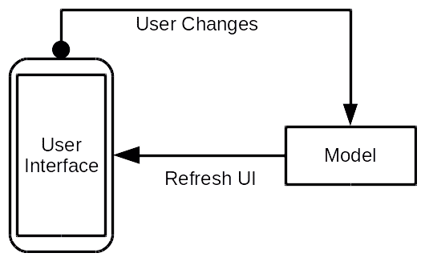
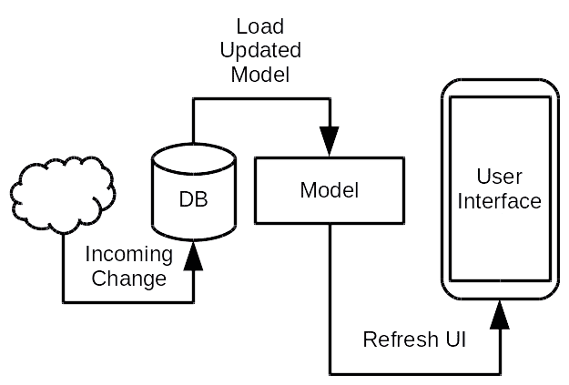
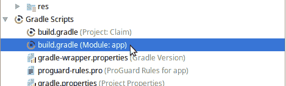

# 存储和检索数据

初看起来，数据存储似乎与用户界面毫不相关，但在大多数应用程序中，用户界面存在是为了在设备和网络上操纵持久数据。这意味着虽然它不会直接影响应用程序的外观，但它确实会影响用户体验。用户期望应用程序始终反映他们可用的最新数据，正如我们在第五章中探讨的，“将数据绑定到小部件”。使用响应式模式编写的应用程序确保用户界面始终与应用程序可用的最新数据保持同步，Android 数据绑定系统有助于简化编写响应式应用程序的过程。即使没有数据绑定框架，Android 本身也始终从底层向上构建为响应式应用程序，但直到最近，这种行为需要大量的样板代码。

当你开发任何类型的应用程序时，在应用程序内建立数据容器或权限是非常重要的。在大多数 Web 系统中，这将是一个数据库。系统可能还有许多其他数据存储层，例如缓存和内存中的对象模型，但在这个情况下，“权限”将是数据库。Android 应用程序可能一开始看起来更复杂；你通常有一个包含一些数据的服务器，你通常有一个本地数据库，然后还有屏幕上和内存中的内容。保持所有这些状态同步可能看起来像是一场噩梦，但实际上已经得到了妥善处理。

Android 团队构建了一个名为架构组件的 API 集合。这些组件共同简化了编写响应式应用程序的工作，因为它们处理了编写应用程序时最常见的常见问题。它们包括用于存储和检索数据的 API，以及用于响应应用程序状态变化的 API。

在本章中，我们将探讨以下主题：

+   数据和存储如何影响用户体验

+   Android 提供的用于存储和检索结构化数据的工具

+   保持用户界面与数据存储同步的最佳方式

+   使用 Room 持久化 API 构建 SQLite 数据库存储

# Android 中的数据存储

几乎每个应用程序在某个时候都需要持久化存储数据。任何需要在应用程序停止时保持完整的数据都必须放置在某种数据存储系统中，以便以后可以再次检索它。您可以将所有数据存储在服务器上，但这样您的应用程序只有在用户有活跃的互联网连接时才能工作，并且速度将仅限于他们的可用连接速度。您还可以将数据作为文件存储在设备的本地文件系统中，但这意味着您需要每次更改时都将所有数据加载到内存中并保存整个应用程序状态，或者您需要编写复杂的逻辑来维护应用程序将写入的各种文件之间的完整性。

Android 生态系统提供了大量的数据库系统，其中最流行的大概是 SQLite。数据可以保存在 SQLite 表中，并通过结构化查询检索。这为在设备上存储所有应用程序数据提供了一个理想的方式，同时只检索应用程序所需的数据。可以指示 SQLite 数据库精确检索哪些记录上的哪些字段，您可以使用索引来使此过程非常快速。

持久性数据存储和对象映射确实会带来显著的成本——数据库查找可能很快，但在主线程上它需要的时间明显长于可接受的范围，这会在图形渲染和事件分发中造成延迟。因此，您再次希望数据从后台线程加载。这可能会带来一些额外的挑战：如何确保数据始终是最新的，并且在涉及`Activity`生命周期、持久化和从多个存储系统加载时不会停滞？这可能会迅速失控，但再次强调，Android 有一个完整的生态系统，旨在保持一切井然有序。

在创建 Android 应用程序时，最好设计它，以便用户在当前`Activity`中编辑的任何内容都保持在可变的内存模型中，如图所示：



这种设计模式将为您的应用程序提供良好的性能，同时让您能够通过简单地丢弃用户正在更改的内存模型来轻松地*取消*更改。当用户正在查看而不是编辑数据时，需要不同的方法。当用户查看如他们的电子邮件收件箱或聊天对话的屏幕时，他们期望它在没有他们的交互下更新。在这种情况下，最好遵循单向数据流设计，如图中所示：



图中的**传入更改**可以来自任何地方。它可以来自应用程序的另一个部分，也可以来自网络，甚至可以来自用户正在查看的屏幕的另一部分。重要的是数据库（**DB**）总是首先更新，然后触发**模型**重新加载或更新，进而触发**用户界面**更新。这与**模型**相反，其中**用户界面**接收传入的事件并获取新数据。在这里，**用户界面**将始终直接接收最新数据。

# 使用 SQLite 数据库

SQLite 是一个嵌入到核心 Android 系统中的优秀小型 SQL 兼容数据库。这允许您利用完整的 SQL 数据库，而无需将数据库与您的应用程序一起分发（这将大大增加您的代码大小）。这使得它成为 Android 上存储结构化数据最常用的工具，但绝不是唯一的选择。

对于许多需要与服务器实时同步的应用程序，人们使用 Firebase 数据库。**Firebase**是谷歌云产品，包括一个功能强大的文档数据库，它实时同步其数据，直到客户端。这意味着当其数据从外部被修改时，客户端会触发一个事件，这使得它非常适合聊天和消息应用。然而，像 Firebase 这样的工具需要大量的额外客户端 API，将您的应用程序绑定到某个服务，并且很难将应用程序迁移到其他平台。使用它们构建的应用程序也可能会违反某些国家的隐私法律，如果应用程序在客户端未加密的情况下存储私人信息。在这些情况下，您可能需要设置自己的同步系统，或者使用具有过滤实时同步功能的数据库，例如 Apache 的 *CouchDB 项目*。

通常情况下，SQLite 作为客户端存储结构化数据的优秀选择。它灵活、非常强大且非常快速，并且因为它已经集成到 Android 平台，所以不会为您的应用程序增加任何直接的大小开销。大多数 Java 开发者在访问 SQL 数据库时都会使用 JDBC，尽管 Android 也提供了 JDBC 支持，但 `android.database` 和 `android.database.sqlite` 包是访问数据库的首选方法，而且速度更快。Android 还提供了一层额外的抽象，用于直接使用 SQLite，我们将在下一节中探讨这一点。

如需了解有关 SQLite 的更多信息以及如何充分利用它，建议浏览该项目的优秀文档，网址为 [`sqlite.org/`](https://sqlite.org/)。

# 介绍 Room

直接使用 SQLite 需要大量的代码来将 SQLite 结构化数据转换为 Java 对象，然后准备 SQL 语句将这些对象存储回数据库。将 SQL 记录映射到 Java 对象的通常形式如下：

```kt
public Attachment selectById(final long id) {
   final Cursor cursor = db.query(
           "attachments",
           new String[]{"file", "type"},
           "_id=?",
           new String[]{Long.toString(id)},
           null, null, null);

   try {
       if (cursor.moveToFirst()) {
           return new Attachment(
                   new File(cursor.getString(0)),
                   Attachment.Type.valueOf(cursor.getString(1))
           );
       }
   } finally {
       cursor.close();
   }
   return null;
}
```

如您立即所见，那里有很多代码，您将需要为每个数据模型对象重复使用。

幸运的是，Google 作为其架构组件的一部分提供了解决这个模板问题的方案，它被称为**Room**。Room 是一个 API 和代码生成器，允许您定义您的对象模型和您想要执行的 SQL 查询，同时它会为您编写模板**数据访问对象**（**DAO**）类。Room 是一个极佳的选择，因为所有繁重的工作都是在编译时通过为您的应用程序生成源代码来完成的。这也意味着它需要包含在您的应用程序中的额外代码要少得多，这有助于保持您的应用程序在最终用户设备上的体积更小。

Room 不是一个传统的**对象/关系**（**O/R**）映射层，而是允许您定义`SELECT`语句，并将它们返回的数据复制到您指定的对象模型中。因此，它不直接处理对象之间的关系（例如`ClaimItem`包含一个`Attachment`对象的数组）。虽然这看起来像是一个问题，但它是一个非常重要的特性！这类关系在对象模型中很常见，但在对象/关系层中实现起来成本很高，因为每次调用`ClaimItem.getAttachments`都需要另一个数据库查询，而在 Android 中，这些调用很可能会泄漏到主线程。

相反，Room 被设计成您可以创建适合数据绑定的对象模型，并构建可以直接返回它们的 SQL 查询。这把复杂性推回到数据库中，并有助于鼓励使用单个查询来显示编程行为。

# 向项目中添加房间

Room 是架构组件的一部分，默认情况下不会导入到项目中。相反，您需要按照以下简单步骤将它们作为依赖项添加到您的项目中：

1.  在 Android 面板中，打开 Gradle 脚本子部分，然后打开应用模块的`build.gradle`文件：



1.  在文件底部，您会找到一个依赖项块；在块的底部，添加以下两行代码：

```kt
implementation 'android.arch.persistence.room:runtime:+'
annotationProcessor 'android.arch.persistence.room:compiler:+'
```

1.  使用编辑器顶部的“立即同步”链接将项目与其 Gradle 文件同步。Android Studio 将自动下载您项目的新 Room 依赖项。

1.  您的项目现在已集成 Room API 及其代码生成器，您可以开始创建持久对象模型和数据库模式。

# 创建实体模型

Room，就像一个 SQL 数据库一样，是可选的非对称的；你写入它的内容可能与从它读取的内容格式不完全相同。当你向 Room 数据库写入时，你保存`Entity`对象，但在读取时，你可以读取几乎任何 Java 对象。这允许你定义最适合用户界面的对象模型，并通过`JOIN`查询加载它们，而不是为每个要向用户展示的对象进行一个或多个额外的查询。虽然`JOIN`查询在服务器上可能过于昂贵，但在移动设备上，它们通常比多查询替代方案要快得多。因此，在定义实体模型时，值得考虑你需要在数据库中保存什么，以及你需要在用户界面上使用哪些特定字段。你需要写入存储的数据成为你的实体，而用户界面的字段成为可以通过 Room 查询的 Java 对象中的字段。

Room 中的`Entity`类被注解为`@Entity`，并预期遵循某些规则：

+   字段必须是`public`的或者有 Java Beans 风格的 getter 和 setter

+   至少有一个字段必须使用`@PrimaryKey`注解标记为主键

+   Room 期望一个单独的`public`构造函数，因此你可能需要使用`@Ignore`注解标记其他构造函数，以便你的代码可以编译。通常最好只为 Room 留下一个默认（无参数）的构造函数

为了使用 Room 开始存储索赔数据，我们需要修改现有的`ClaimItem`和`Attachment`类，使它们成为有效的实体。这涉及到使它们作为关系结构可用；`ClaimItem`和`Attachment`都需要一个 ID 主键，并且附件需要为其所属的`ClaimItem`的外键标识符。执行以下步骤以修改这两个数据模型类，以便它们可以使用 Room 作为实体存储：

1.  首先在 Android Studio 中打开`ClaimItem`源文件。

1.  使用`@Entity`注解类声明：

```kt
@Entity
public class ClaimItem implements Parcelable {
```

1.  添加一个 ID 字段，使用`@PrimaryKey`注解它，并告诉 Room 你希望它由数据库生成，而不是手动创建 ID（如果你喜欢，也可以为这个字段添加 getter 和 setter）：

```kt
@PrimaryKey(autoGenerate = true)
public long id;
```

将字段保留为`public`意味着 Room 将直接访问字段，而不是使用 getter 和 setter。字段访问可能比调用 getter 和 setter 的方法调用要快得多。

1.  告诉 Room 忽略`Attachment`的`List`。Room 无法直接持久化这类关系，当它尝试为这个字段生成映射代码时，你的应用程序将无法编译：

```kt
@Ignore List<Attachment> attachments = new ArrayList<>();
```

1.  修改`ClaimItem`的`Parcelable`实现以保存和恢复 ID 字段：

```kt
protected ClaimItem(final Parcel in) {
       id = in.readLong();
       description = in.readString();
       amount = in.readDouble();
       // …
}

public void writeToParcel(final Parcel dest, final int flags) {
   dest.writeLong(id);
   dest.writeString(description);
   dest.writeDouble(amount);
   dest.writeLong(timestamp != null ? timestamp.getTime() : -1);
   dest.writeInt(category != null ? category.ordinal() : -1);
   dest.writeTypedList(attachments);
}
```

1.  打开`附件`源文件。

1.  将`Entity`注解添加到`Attachment`类中；这次你还需要包括一个`@Index`注解，以告诉 Room 在即将添加的新字段`claimItemId`上生成数据库索引。索引将确保查询特定`ClaimItem`记录的附件时非常快速：

```kt
@Entity(indices = @Index("claimItemId"))
public class Attachment implements Parcelable {
```

1.  为`Attachment`添加数据库主键字段，以及新的`claimItemId`字段，该字段将用于指示当`Attachment`存储在数据库中时它属于哪个`ClaimItem`：

```kt
@PrimaryKey(autoGenerate = true)
public long id;
public long claimItemId;
```

1.  确保存在一个`public`默认构造函数，并且任何其他`public`构造函数都标记为`@Ignore`：

```kt
public Attachment() {}
@Ignore public Attachment(final File file, final Type type) {
    this.file = file;
    this.type = type;
}
```

1.  更新`Attachment`类的`Parcelable`实现，以包括新字段：

```kt
protected Attachment(final Parcel in) {
    id = in.readLong();
 claimItemId = in.readLong();
    file = new File(in.readString());
    type = Type.values()[in.readInt()];
}

public void writeToParcel(final Parcel dest, final int flags) {
    dest.writeLong(id);
 dest.writeLong(claimItemId);
    dest.writeString(file.getAbsolutePath());
    dest.writeInt(type.ordinal());
}
```

如你所见，将现有的对象模型修改为存储在`Room`数据库中非常简单。Room 现在能够生成代码来从其数据库的表中加载和保存这些对象；它还能从这些类中生成数据库模式。

# 创建数据访问层

现在你已经有了一些要写入数据库的内容，你需要一种实际写入的方法，以及一种再次检索它的方法。最常见的方式是为每个类创建一个专门处理此类操作的类——数据访问对象（Data Access Object，简称 DAO）。然而，在 Room 中，你只需要使用接口声明它们应该是什么样子；Room 会为你生成实现代码。你可以通过在方法上使用`@Query`注解来定义你的查询，如下所示：

```kt
@Query(“SELECT * FROM users WHERE _id = :id”)
public User selectById(long id);
```

这与传统 O/R 映射层相比具有巨大优势，因为你仍然可以编写任何形式的 SQL 查询，让 Room 来决定如何将其转换为所需的对象模型。如果它无法生成代码，你将在编译时得到错误，而不是应用程序可能因为用户而崩溃。这还有一个额外的优势：Room 可以将你的 SQL 查询绑定到非实体类，让你能够充分利用 SQLite 数据库的全部功能，而无需手动进行所有列/字段/对象映射。例如，你可以定义一个特殊的`DisplayContact`类来显示联系人列表中的摘要数据，然后直接使用`join`查询它们：

```kt
@Query(“SELECT contacts.firstname, contacts.lastname, emails.address FROM contacts, emails WHERE emails._id = contacts.primaryEmailId ORDER BY contacts.lastname”)
public List<DisplayContact> selectDisplayContacts()
```

前面的查询不会返回可以直接保存到数据库中的对象；它是查看两个不同的表并收集它们字段的结果。尽管如此，Room 处理这种情况非常得心应手，并且不需要对返回的类进行任何类型的注解。

# LiveData 类

Room 执行的不仅仅是将数据库结构绑定到对象并再次绑定；它还为您提供了编写更简单反应性程序的能力。如前所述，Room 是 Android 架构组件库之一。架构组件共同提供了一般基础设施，可用于快速构建反应性应用程序，同时保持出色的性能和安全性。架构组件中最重要的类之一是 `LiveData`。`LiveData` 是对外部更改敏感的数据的通用封装。`LiveData` 可以被观察，就像用于数据绑定布局的类一样。主要区别在于 `LiveData` 将始终在新的观察者上触发一个 *首次* 事件，并提供当前的数据状态。

Room 内置了对 `LiveData` 的支持，这意味着您可以通过返回任何包装在 `LiveData` 中的对象来接收对该对象发生的任何更改。在撰写本文时，Room 通过监视每个表的变化来实现这一点。这意味着即使对象实际上没有发生变化，您也可能收到对象的更新。对于大多数应用程序来说，这不应该是一个问题，因为查询仍在工作线程上运行，而通知仅在主线程上发生。这使得 `LiveData` 在大多数情况下成为查询数据库的首选方法，因为它负责在工作线程上运行和处理查询，从而释放主线程来处理事件并保持应用程序平稳运行。

`LiveData` 不是 Room 的直接部分，因此您需要按照以下步骤将 `LiveData` 和其他架构组件添加到您的项目中：

1.  在 Android 面板中，打开 Gradle Scripts 子部分，然后打开应用模块的 build.gradle 文件：


1.  在文件底部，您会找到一个依赖项块；在块的底部，添加以下两行代码：

```kt
implementation 'android.arch.lifecycle:runtime:+'
implementation 'android.arch.lifecycle:extensions:+'
annotationProcessor 'android.arch.lifecycle:compiler:+'
```

1.  使用编辑器顶部的 Sync Now 链接将您的项目与其 Gradle 文件同步，并下载新的依赖项。

# 在 Room 中实现数据访问对象

您需要为 Claim 应用程序实现两个不同的数据访问对象类，一个用于每个 `Entity` 对象。从技术上讲，Room 不强制要求每个实体有一个 DAO，您可以为整个应用程序或每个屏幕使用一个单一的 DAO 接口。然而，最常见的设计模式是每个实体类型有一个 DAO 类，即使其中一些查询方法返回统计数据或其他数据视图。当处理更复杂的数据集时，考虑引入额外的 DAO 接口来覆盖特定于屏幕的查询或数据重叠在多个实体上的查询。

下面是如何逐步实现 Claim 示例应用程序的数据访问对象接口：

1.  在 Android Studio 中，右键单击 `model` 包，然后选择 New | Java Class。

1.  将新类命名为 `db.ClaimItemDao`。

1.  将 Kind 字段更改为“接口”。Room DAO 类型通常是接口，尽管这不是严格的要求，它们也可以是抽象类。

1.  点击“确定”以创建新的包和类。

1.  使用 `@Dao` 注解接口以将其标记为数据访问对象：

```kt
@Dao
public interface ClaimItemDao {
```

1.  声明一个查询方法以按最近的时间顺序获取所有 `ClaimItem` 对象；确保它返回 `LiveData` 以反映更改：

```kt
@Query("SELECT * FROM claimitem ORDER BY timestamp DESC")
LiveData<List<ClaimItem>> selectAll();
```

1.  接下来，您需要方法来在数据库中插入、更新和删除 `ClaimItem` 对象；这些方法仅接受 `Entity` 对象，而不是查询，而是用它们的操作进行注释。在插入方法的情况下，返回新记录生成的 ID 是有用的：

```kt
@Insert long insert(ClaimItem item);
@Update void update(ClaimItem item);
@Delete void delete(ClaimItem item);
```

1.  现在，再次在 `db` 包上右键单击，并选择“新建”|“Java 类”。

1.  将新类命名为 `AttachmentDao`，并将其 Kind 设置为“接口”。

1.  点击“确定”以创建 `AttachmentDao` 类。

1.  声明新的接口为 `Dao`：

```kt
@Dao
public interface AttachmentDao {
```

1.  编写一个查询方法以获取单个 `ClaimItem` 的 `Attachment` 对象。这是您在 `Attachment` 上声明的索引变得重要的地方：

```kt
@Query("SELECT * FROM attachment WHERE claimItemId = :claimItemId")
LiveData<List<Attachment>> selectForClaimItemId(final long claimItemId);
```

1.  声明 `Attachment` 类的插入、更新和删除方法，就像您对 `ClaimItem` 方法所做的那样：

```kt
@Insert long insert(Attachment attachment);
@Update void update(Attachment attachment);
@Delete void delete(Attachment attachment);
```

# 创建数据库

当使用 Room 编写应用程序时，您需要定义至少一个 *数据库* 类。每个此类都对应于一个特定的数据库模式--一组实体类及其保存和从存储中加载的各种方式。它还可以作为编写应用程序中其他数据库相关逻辑的方便位置。例如，`ClaimItem` 和 `Attachment` 类需要保存和加载 Room 无法理解的各种类型；例如，`Date`、`File`、`Category` 枚举和 `Attachment` `Type` 枚举。每个此类都需要一个 `TypeConverter` 方法，该方法可用于将其转换为 Room 能够理解的原始类型，并从原始类型转换回来。

Room 数据库类是抽象的。这是因为 Room 注解处理器会扩展它们以生成您在运行时使用的实现。这允许您在数据库类中定义任何数量的具体方法实现，这些实现可能对您的应用程序有用。按照以下步骤声明您的新 Room 兼容数据库类：

1.  在 Android Studio 中右键单击 `db` 包，然后选择“新建”|“Java 类”。

1.  将新类命名为 `ClaimDatabase`，并将其 Superclass 设置为 `RoomDatabase`。

1.  选择“抽象”修饰符。

1.  点击“确定”以创建新的类。

1.  注释该类以表明它是一个数据库，并声明它将存储 `ClaimItem` 和 `Attachment` 实体。您还需要指定模式版本，对于第一个版本将是 `1`：

```kt
@Database(
        entities = {ClaimItem.class, Attachment.class},
        version = 1,
        exportSchema = false)
public abstract class ClaimDatabase extends RoomDatabase {
```

1.  如前所述，您需要为`ClaimItem`和`Attachment`使用的所有非原始字段声明`TypeConverter`方法。您需要告诉数据库这些方法的位置，在这种情况下，它将是`ClaimDatabase`类本身：

```kt
@Database(
        entities = {ClaimItem.class, Attachment.class},
        version = 1,
        exportSchema = false)
@TypeConverters(ClaimDatabase.class)
public abstract class ClaimDatabase extends RoomDatabase {
```

1.  现在，定义用于检索您之前创建的数据访问对象实现的`abstract`方法；这些方法将由 Room 生成的子类实现：

```kt
public abstract ClaimItemDao claimItemDao();
public abstract AttachmentDao attachmentDao();
```

1.  现在，您需要告诉 Room 如何将各种字段转换为数据库支持的原始类型，并将其转换回原始类型。首先，实现将`Date`对象转换为可以存储在数据库中的时间戳长整型的方法（SQLite 没有`DATE`或`DATETIME`类型）：

```kt
@TypeConverter
public static Long fromDate(final Date date) {
    return date == null ? null : date.getTime();
}

@TypeConverter
public static Date toDate(final Long value) {
    return value == null ? null : new Date(value);
}
```

1.  现在继续使用这种模式来处理`ClaimItem`和`Attachment`需要的其他类型：

```kt
@TypeConverter
public static String fromFile(final File value) {
    return value == null ? null : value.getAbsolutePath();
}

@TypeConverter
public static File toFile(final String path) {
    return path == null ? null : new File(path);
}

@TypeConverter
public static String fromCategory(final Category value) {
    return value == null ? null : value.name();
}

@TypeConverter
public static Category toCategory(final String name) {
    return name == null ? null : Category.valueOf(name);
}

@TypeConverter
public static String fromAttachmentType(final Attachment.Type value) {
    return value == null ? null : value.name();
}

@TypeConverter
public static Attachment.Type toAttachmentType(final String name) {
    return name == null ? null : Attachment.Type.valueOf(name);
}
```

`TypeConverter`方法将由 Room 注解处理器找到并使用。它们直接从生成的代码中调用，基于存储或检索的 Java 类中使用的类型。这意味着它们几乎没有额外的运行时开销。

# 访问您的 Room 数据库

到目前为止，您已经为 Room 管理的 SQLite 数据库构建了所有组件，但您实际上仍然无法访问它。由于它是抽象的，您不能直接实例化`ClaimDatabase`类，您在 DAO 接口上也有同样的问题，那么访问数据库的最佳方法是什么？Room 为您提供了一个条目类，该类将正确实例化生成的`ClaimDatabase`实现，但这并不是全部故事；您的整个应用程序都依赖于这个数据库，它应该在应用程序启动时设置，并且应该对整个应用程序可访问。

您可以使用一个单例`ClaimDatabase`对象，但那么 SQLite 数据库文件将放在哪里呢？为了使其存储在应用程序的私有空间中，您需要一个 Context 对象。进入`Application`类，当使用时，它将持有将在您的应用程序中调用的第一个`onCreate`方法。按照以下快速步骤构建一个简单的`Application`类，该类将实例化并保留对您的`ClaimDatabase`的引用：

1.  右键单击您的根包（即`com.packtpub.claim`），然后选择“新建”|“Java 类”。

1.  将新类命名为`ClaimApplication`。

1.  将其超类设置为`android.app.Application`。

1.  点击“确定”以创建应用程序类。

1.  声明一个静态的`ClaimDatabase`以供应用程序使用：

```kt
private static ClaimDatabase DATABASE;
```

1.  重写`onCreate`方法，并使用它通过 Room 实例化`ClaimDatabase`对象；这将在您的应用程序中的任何其他操作之前发生：

```kt
@Override
public void onCreate() {
    super.onCreate();
    DATABASE = Room.databaseBuilder(
 this,                 /* Context */
            ClaimDatabase.class,  /* Abstract Database Class */
            "Claims"              /* Filename */ 
    ).build();
}
```

1.  提供一个`public` `static`方法，供应用程序的其他部分使用，以访问单例数据库实例：

```kt
public static ClaimDatabase getClaimDatabase() {
    return DATABASE;
}
```

1.  您需要将`ClaimApplication`注册到 Android 平台，以便它在应用程序启动时初始化它。您可以通过打开 manifests 目录并打开`AndroidManifest.xml`文件来完成此操作。

1.  在 `<application>` 元素中，你需要添加一个 `android:name` 属性来告诉 Android 平台代表应用程序根的类的名称：

```kt
<application
    android:name=".ClaimApplication"
    android:icon="@mipmap/ic_launcher"
    android:label="@string/app_name"
    android:roundIcon="@mipmap/ic_launcher_round"
    android:supportsRtl="true"
    android:theme="@style/AppTheme">
```

现在，每当你的应用程序的任何部分需要数据库时，它都可以简单地调用 `ClaimApplication.getClaimDatabase()` 来检索一个全局实例，并且因为它不再与特定的上下文实例相关联，所以它可以从任何地方调用（甚至是一个演示者）。

# 测试你的知识

1.  Android 的 Room API 提供了以下哪些？

    +   一个完整的数据库解决方案

    +   在 SQLite 之上的轻量级 API

    +   一个对象存储引擎

1.  从 Room DAO 返回 `LiveData` 需要做哪些？

    +   你观察它以获取数据的变化

    +   你在主线程上运行查询

    +   当你被 `LiveData` 对象通知时，再次调用查询方法

1.  不返回 `LiveData` 的数据库查询应该做什么？

    +   应该避免

    +   在工作线程上运行

    +   返回 `Cursor` 对象

1.  为 Room 编写更新方法需要哪些列表中的？

    +   在 DAO 接口上的 `@Query("UPDATE")` 方法

    +   一个接口上的 `@Update` 方法，接受一个 `Entity` 对象

    +   将添加到你的 `Entity` 实现中

# 摘要

你在 Android 应用程序中存储和检索结构化数据的方式将直接影响你的用户如何体验你的应用程序。当你选择使用 Room、CouchDB 或 Firebase 这样的系统时，数据更改作为更新推送到应用程序，用户将自然拥有一个反应式应用程序。更重要的是，应用程序通常将是响应式的，因为这些模式自然地将缓慢运行的查询和更新从应用程序主线程上移除。

Room 为标准的 Android 数据存储生态系统提供了一个出色的补充，不仅大大减少了编写样板数据访问代码的需求，而且还提供了一个定义良好且编写出色的接口来运行数据反应式查询。当然，你的应用程序不需要全部都是反应式的；一旦通过 `LiveData` 对象传递了一个对象，它就只是一个对象，可以用作内存快照，甚至如果它是可变的，还可以进行编辑。

当使用 Room 时，重要的是要记住你应该避免对象之间的复杂关系，因为 Room 将无法为你保存和解析这些关系。这通常是一个迹象，表明你可能需要重新思考你的数据结构；复杂的关系将大大减慢查询速度，因此任何依赖于它们的用户界面。通常，这些关系应该通过创建特定于演示的对象模型来处理，然后在查询中使用连接来检索所有所需的数据。有关 SQL 和如何在 SQLite 中使用它的更多信息，请参阅 SQLite 文档和 SQLite 项目网站上的教程，网址为 [`sqlite.org/`](https://sqlite.org/)。

在下一章中，我们将探讨构建概览屏幕的方法。这些屏幕在应用程序中极为常见，通常是应用程序的中心屏幕，用户在导航过程中会反复返回到这个屏幕。Android 为这些屏幕提供了一个极其灵活的组件——`RecyclerView`。此外，我们还将探讨如何使用 `RecyclerView`，通过将其与 `LiveData` 结合并使用数据绑定来确保它与应用程序的其他部分保持同步更新。
