# 创建概览屏幕

概览屏幕，或仪表盘屏幕，是允许用户快速查看应用程序中数据的布局。因此，它们也是用户会反复返回的屏幕。通常情况下，它们被定位为用户打开应用程序时通常会看到的第一个屏幕，例如电子邮件应用程序中的收件箱，或 Google Drive 中的文件列表。在应用程序中，导航通常是目标导向的；用户从一个概览开始，然后导航以执行特定操作。一旦他们完成操作（例如，撰写并发送电子邮件），他们就会被重定向到概览屏幕。

概览屏幕可能是一个复杂的构建系统，因为它们应该是响应式的，并且通常依赖于大量的应用程序数据。由于这是用户在您的应用程序中最常看到的屏幕，因此在设计过程中概览屏幕需要特别注意。向用户提供最重要的数据，而不会让他们感到不知所措是很重要的。在屏幕上放置过多的信息会让用户更难找到他们想要的信息。

在本章中，我们将探讨如何设计概览屏幕。我们将详细探讨以下内容：

+   `RecyclerView`类，这是概览列表中最常用的组件

+   数据绑定如何使`RecyclerView`的使用更加容易

+   设计概览屏幕时可以使用的技巧

+   如何从 Room 数据库获取数据到`RecyclerView`

# 设计概览屏幕

概览屏幕和仪表盘屏幕不仅是用户通常会看到的第一个界面，而且也是与用户接触最频繁的点。它们需要具备功能性、美观性，并且非常快速。如果一个应用程序加载第一个屏幕需要太长时间，只会让用户感到沮丧。如果应用程序让用户感到沮丧，他们就会避免使用它。因此，考虑用户需要的信息以及他们在概览屏幕上最可能采取的重要操作非常重要。

*Material Design 指南*提供了极好的建议，可以帮助您决定应用程序的这些方面，从而帮助您制作出更好的应用程序。记住，虽然发挥创意（并且很重要）是件有趣的事情，但坚持规则也非常重要。设计中的常见模式有助于用户理解您要求他们做什么，以及如何使用您的应用程序。您和用户之间的这种理解是为什么*Material Design 是一种设计语言*，而不仅仅是外观和感觉。这是一种您可以与用户交谈的语言，他们可以轻松理解。例如，当您在屏幕的右下角有一个浮动操作按钮时，用户知道它通常用于启动或创建新事物，例如创建一个空文档或拍摄一张新照片（取决于应用程序）。

概览屏幕需要允许用户到达应用程序的每个部分，但与网站或桌面应用程序不同，这可能需要一些中间步骤（尽管尽可能少）。这意味着虽然你可能向他们展示数据，但这绝不应该只是为了查看。放置在概览屏幕上的每个元素都必须有存在的理由。它们都应该履行两个角色：向用户提供信息，并允许他们使用这些信息采取某些行动（即使只是了解更多）。一个角色是通过简单地出现在屏幕上完成的，另一个角色是通过允许用户点击小部件来完成的。当然，你可以添加更多：滑动以取消，滚动等。在这些情况下，交互必须与 Material Design 中的交互保持一致（即，滑动以取消应该始终应用于列表项，而不是按钮）。

应用程序中一个示例流程应类似于以下图表。你会注意到所有流程最终都会将用户带回到概览屏幕。这就是所谓的深度导航；它是一个以目标为导向的结构，旨在引导用户完成他们试图完成的任务：

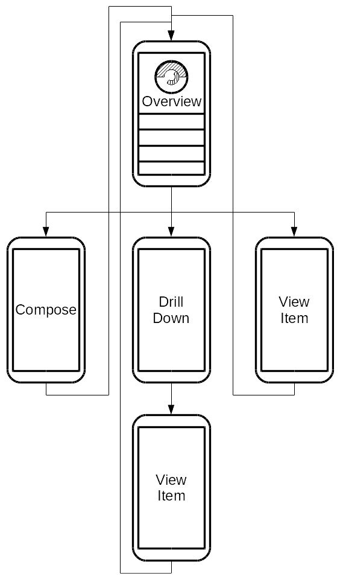

# 概览屏幕的元素

概览屏幕有一些常见的元素，让用户知道他们正在看什么，以及他们应该如何使用该屏幕。了解人们在第一次看到屏幕时是如何看待屏幕的很有帮助。尼尔森等团体进行的研究表明，大多数西方人在第一次看屏幕时遵循一种类似**F**形的模式。从左上角开始，他们的眼睛向右下方移动，如图所示：


这意味着在设计概览屏幕时，最重要的信息应该位于屏幕顶部，其次是位于其右侧的第二重要信息，随着你在屏幕上向下工作，信息的重要性逐渐降低。前面提到的图表在其屏幕顶部使用了一个图表；这也是一个重要的元素：在适用的情况下，优先使用图形和指标而不是原始数字。用户可以从图表中获得比从数字表更快的概览，尽管后者更强大。概览屏幕应该是用户可以在几秒钟内使用的；它不是一个他们想要花时间理解细节的地方。因此，概览屏幕不需要滚动就可以有用。避免滚动概览屏幕的重要性不如在表单/输入屏幕上那么重要，但任何滚动只应适用于访问详细信息。

概览屏幕通常以图表或用户数据的摘要开始，然后是适用细节的列表。以旅行报销应用为例，概览应该有屏幕顶部的概览片段，然后是他们的旅行报销列表，最近的报销在最上面：


概览片段允许他们看到他们花了多少钱，而列表则立即显示他们花在什么上。另一种可能性是显示他们在每个类别中花费的细分情况的图表。然而，这通常在日常基础上不太有用，而在商务旅行结束时以报告的形式更有用。

概览屏幕上最常见的元素之一是某种类型的列表。即使概览中不包含图表和信息图表，用户最新/最有用的项目列表也是非常常见的结构，Android 提供了`RecyclerView`作为构建此类列表的完美系统。与`ViewPager`或`ListView`不同，`RecyclerView`是一个用于显示大量滚动数据的通用系统。其子小部件不需要以严格的方式布局；它们可以是列表，可以是网格，可以是错落有致的，或者任何你想要用自定义布局管理器想到的东西。然而，它们都共享一组公共结构--每个`RecyclerView`都需要以下组件：

+   一个`Adapter`来提供子`View`对象，并将它们绑定到数据模型

+   包装子`View`对象的`ViewHolder`类

+   一个`LayoutManager`来决定如何放置子`View`对象相对于彼此的位置

让我们更详细地探讨如何构建和使用`RecyclerView`的组件，以及如何构建旅行报销应用的概览屏幕。

# 为 ViewHolder 创建布局

`RecyclerView`正是其名称所暗示的--它回收或重用其子元素来向用户展示不同的数据。这意味着虽然它看起来有一个长长的子小部件列表（如卡片或图片），但实际上它只有用户可以看到的那些。当一个小部件被滚动出屏幕时，`RecyclerView`会更改其数据，然后将其滚动回视图。`RecyclerView`不会直接将数据绑定到子视图中；然而，它通过`ViewHolder`来完成。`ViewHolder`的职责是帮助加快数据绑定过程。再次以旅行报销应用为例；如果我们想在`RecyclerView`中显示每个报销项目，每个项目将看起来像以下这样：

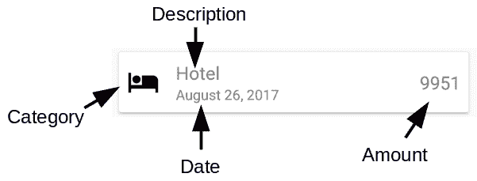

前述每一项都需要不同的 Android 小部件，并且每次您想要填充它们时，都需要查找并将它们绑定到新的数据。`ViewHolder`实现是一个方便的地方，可以查找、保留和绑定特定数据模型类型和显示组件的数据。让我们继续为前面的图创建一个布局资源，然后我们可以创建一个`ViewHolder`来使用它与`RecyclerView`：

1.  在 Android Studio 中，在应用程序资源（res）目录下，右键单击布局目录并选择“新建|布局资源文件”：

1.  将新的布局资源命名为`card_claim_item`。

1.  将根元素更改为`CardView`：

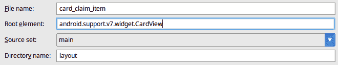

1.  点击“确定”以创建新的布局文件：

1.  在调色板中，打开布局部分，并将一个`ConstraintLayout`拖动到设计画布中：

1.  在调色板中，打开图像部分，并将一个`ImageView`拖动到设计画布中：

1.  从自动打开的可绘制资源选择器中选择`ic_other_black`图标：

1.  使用右侧的约束编辑器添加到新`ImageView`顶部、左侧和底部的约束，并将所有这些设置为 8，如下所示：

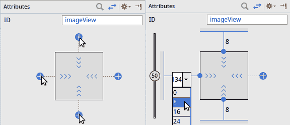

1.  将`ImageView`的 ID 更改为`item_category`：

1.  在调色板中，打开文本部分，并将一个新的`TextView`拖动到设计画布中，位于类别图标`ImageView`的右侧：

1.  使用约束编辑器为新`TextView`添加顶部、右侧和底部的`8dp`约束，以便它居中并放置在 Design canvas 的右侧（直接对应类别图标`ImageView`）：

1.  将`TextView`的 ID 更改为`item_amount`：

1.  删除文本属性的值，并将下面的文本属性（带有扳手图标的属性）更改为`250`。此值仅用于设计画布，并允许您预览设置值后的布局外观（尽管实际值在运行时填充）：

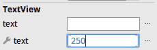

1.  将`textAppearance`属性更改为`@style/TextAppearance.AppCompat.Medium`，它将在下拉菜单中显示为`AppCompat.Medium`：

1.  从调色板中拖动另一个`TextView`到设计视图中，大致位于图标`ImageView`和金额`TextView`之间：

1.  从`TextView`的左侧拖动一个约束到`ImageView`的右侧手柄：

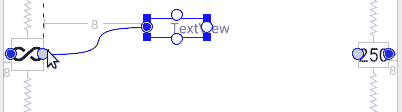

1.  从新`TextView`的右侧拖动另一个约束到金额`TextView`的左侧：

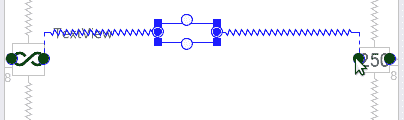

1.  使用约束编辑器为新`TextView`添加顶部约束：

1.  将顶部约束设置为`8`：

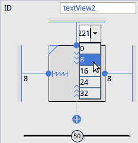

1.  使用属性面板（位于约束编辑器下方）将新`TextView`的`layout_width`属性更改为`match_constraint`：

1.  将新`TextView`的 ID 更改为`item_description`：

1.  清除文本属性，并将设计文本属性设置为 `Airport Shuttle`，这样你仍然在设计画布上有所可见。

1.  将文本外观属性更改为 `@style/TextAppearance.AppCompat.Medium`，它将在下拉菜单中显示为 `AppCompat.Medium`。

1.  从调色板中拖动第三个 `TextView` 到设计画布，并将其放在类别图标 `ImageView` 和金额 `TextView` 之间。

1.  就像描述 `TextView` 一样，将新的 `TextView` 约束到类别图标右侧和金额 `TextView` 左侧。

1.  使用约束编辑器，在新的 `TextView` 底部添加一个约束，并将其底部边距设置为 `8`：

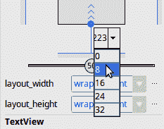

1.  将新 `TextView` 的 ID 设置为 `item_timestamp`。

1.  将新 `TextView` 的 `layout_width` 更改为 `match_constraint`。

1.  从新 `TextView` 的顶部拖动一个约束到描述 `TextView` 的底部；这将确保它们之间至少有 8dp 的空间。

1.  清除文本属性，并将设计工具文本属性设置为日期，例如 `27-December-2017`。

1.  在组件树面板中，选择布局根部的 `CardView`。

1.  切换到查看所有属性面板。

1.  打开布局边距组。

1.  将顶部边距设置为 `@dimen/grid_spacer1`。

1.  将 `CardView` 的 `layout_height` 设置为 `wrap_content`；布局将卷起，看起来像这样：

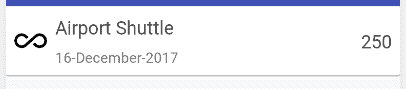

# 创建一个简单的 ViewHolder 类

创建一个 `ViewHolder` 非常简单，并且这是一个封装 `RecyclerView` 中渲染项目特定逻辑的好地方。对于前面的布局，按照以下步骤构建一个 `ViewHolder`：

1.  在 Android Studio 中的 ui 包上右键单击，并选择 New| Java Class。

1.  将新类命名为 `ClaimItemViewHolder`。

1.  将新类的父类设置为 `android.support.v7.widget.RecyclerView.ViewHolder`。

1.  点击确定以创建新的类。

1.  `ViewHolder` 的主要任务是加快数据模型与用户界面小部件之间的绑定，为此，`ViewHolder` 需要引用它将要填充的每个 `View` 对象：

```kt
private final ImageView categoryIcon;
private final TextView description;
private final TextView amount;
private final TextView timestamp;
```

1.  这个 `ViewHolder` 还需要一种格式化时间戳的方法，而最好的方法就是使用 `java.text.DateFormat`，这也是需要保留引用的东西，因为它们构建起来相当昂贵：

```kt
private final DateFormat dateFormat;
```

1.  `ViewHolder` 通常使用它预期绑定到的 `View` 对象来构建。你可以在 `ViewHolder` 构造函数中填充 `View` 对象，但为了保持灵活性并避免在构造函数中产生参数混乱，这个 `ViewHolder` 实现将只接受它将要包装的 `View` 对象：

```kt
public ClaimItemViewHolder(final View claimItemCard) {
    super(claimItemCard);
    this.categoryIcon = claimItemCard.findViewById(R.id.item_category);
    this.description = claimItemCard.findViewById(R.id.item_description);
    this.amount = claimItemCard.findViewById(R.id.item_amount);
    this.timestamp = claimItemCard.findViewById(R.id.item_timestamp);
```

1.  你还需要创建一个 `DateFormat` 对象，并且你希望使用用户当前区域的长时间日期格式：

```kt
this.dateFormat = DateFormat.getDateInstance(DateFormat.LONG);
```

1.  这个类需要一个工具方法来确定应该渲染哪个图标用于 `Category`，这将涉及手动引用应用程序的 `Resources` 来检索类别图标的黑色版本：

```kt
public Drawable getCategoryIcon(final Category category) {
    final Resources resources = itemView.getResources();
    switch (category) {
        case ACCOMMODATION:
            return resources.getDrawable(R.drawable.ic_hotel_black);
        case FOOD:
            return resources.getDrawable(R.drawable.ic_food_black);
        case TRANSPORT:
            return resources.getDrawable(R.drawable.ic_transport_black);
        case ENTERTAINMENT:
            return resources.getDrawable(R.drawable.ic_entertainment_black);
        case BUSINESS:
            return resources.getDrawable(R.drawable.ic_business_black);
        case OTHER:
        default:
            return resources.getDrawable(R.drawable.ic_other_black);
    }
}
```

1.  你还需要一个工具方法来格式化金额，使得整数金额没有小数部分，而非整数只显示两位小数：

```kt
public String formatAmount(final double amount) {
    return amount == 0
            ? ""
            : amount == (int) amount
            ? Integer.toString((int) amount)
           : String.format("%.2f", amount);
}
```

1.  最后，你需要一种方式让适配器用数据填充所有 `View` 元素，并且因为这个类是针对 `ClaimItem` 数据对象的，你可以通过提供一个类似设置器的方法来简化这个过程：

```kt
public void setClaimItem(final ClaimItem item) {
    categoryIcon.setImageDrawable(getCategoryIcon(item.getCategory()));
    description.setText(item.getDescription());
    amount.setText(formatAmount(item.getAmount()));
    timestamp.setText(dateFormat.format(item.getTimestamp()));
}
```

# 使用数据绑定创建 ViewHolder

如您从构建传统的 `ViewHolder` 实现中看到的那样，仅仅为了将单个项目中的数据放置在布局中，就需要做很多工作，并且有很多样板代码。此外，它本身实际上相当昂贵，因为每个 `ViewHolder` 实例都会创建并持有 `DateFormatter` 的一个实例，它们可以很容易地在 `RecyclerView` 的所有 `ClaimItemViewHolder` 实例之间共享：

在这种情况下，数据绑定可以带来巨大的差异。通过使用一些技巧，你实际上可以创建一个完全通用的 `ViewHolder` 实现，它将适用于你应用程序中的任何数据对象（假设你可以将其绑定到布局文件）。首先，你需要创建一个漂亮的通用 `ItemPresenter`，然后修改布局，然后你就可以创建一个通用的数据绑定 `ViewHolder` 实现了。按照这些说明操作，你将只需要一个 `ViewHolder` 实现：

1.  在 Android Studio 中，右键单击 `presenters` 包，然后选择 New| Java Class。

1.  将类命名为 `ItemPresenter`。

1.  点击“确定”以创建新类。

1.  `ItemPresenter` 需要一个 `Context` 来引用应用程序的 `Resources` 和文件：

```kt
private final Context context;

public ItemPresenter(final Context context) {
    this.context = context;
}
```

1.  创建一个与简单 `ViewHolder` 类中相同方式的 `formatAmount` 工具方法：

```kt
public String formatAmount(final double amount) {
    return amount == 0
            ? ""
            : amount == (int) amount
            ? Integer.toString((int) amount)
            : String.format("%.2f", amount);
}
```

1.  在新的 `ItemPresenter` 中编写一个 `getCategoryIcon` 工具方法（这几乎与 `ClaimItemViewHolder` 中的方法完全相同，只是在访问 `Resources` 对象的方式上有所不同）：

```kt
public Drawable getCategoryIcon(final Category category) {
    final Resources resources = context.getResources();
    switch (category) {
        case ACCOMMODATION:
            return resources.getDrawable(R.drawable.ic_hotel_black);
        case FOOD:
            return resources.getDrawable(R.drawable.ic_food_black);
        case TRANSPORT:
            return resources.getDrawable(R.drawable.ic_transport_black);
        case ENTERTAINMENT:
            return resources.getDrawable(R.drawable.ic_entertainment_black);
        case BUSINESS:
            return resources.getDrawable(R.drawable.ic_business_black);
        case OTHER:
        default:
            return resources.getDrawable(R.drawable.ic_other_black);
    }
}
```

1.  编写一个 `formatDate` 工具方法，将 `Date` 对象转换为适合在屏幕上显示的文本。转换是通过一个 `DateFormat` 对象完成的，它仅在第一次调用 `formatDate` 时创建（它是延迟初始化的）。延迟初始化很重要，因为这个类预期将在应用程序中所有可能的项表示器中通用，因此，将会有一些情况下它不会被使用：

```kt
private DateFormat dateFormat;
public String formatDate(final Date date) {
    if (dateFormat == null) {
        dateFormat = DateFormat.getDateInstance(DateFormat.LONG);
    }

    return dateFormat.format(date);
}
```

1.  现在，打开 `card_claim_item.xml` 布局资源。

1.  在编辑器中切换到文本视图。

1.  在 `CardView` 上方创建一个新的布局根元素，并确保从 `CardView` 中移除命名空间声明，并在文件末尾关闭布局元素：

```kt
<layout 

    >
```

1.  在`CardView`上方声明一个包含两个变量的数据块。保持这些名称的泛型是很重要的。一个将是`ItemPresenter`的实例，另一个将是布局要绑定的`ClaimItem`：

```kt
<data>
    <variable name="presenter" type="com.packtpub.claim.ui.presenters.ItemPresenter" />
    <variable name="item" type="com.packtpub.claim.model.ClaimItem" />
</data>
```

1.  找到`item_category`的`ImageView`声明，并添加一个新的数据绑定属性，使用`ItemPresenter`找到正确的图标：

```kt
<ImageView
    android:id="@+id/category_icon"
    android:layout_width="wrap_content"
    android:layout_height="wrap_content"
    android:layout_marginBottom="8dp"
    android:layout_marginStart="8dp"
    android:layout_marginTop="8dp"
    app:imageDrawable="@{presenter.getCategoryIcon(item.category)}"
    app:layout_constraintBottom_toBottomOf="parent"
    app:layout_constraintStart_toStartOf="parent"
    app:layout_constraintTop_toTopOf="parent" />
```

1.  找到`TextView`的声明并绑定其文本属性，使用`Presenter`将`ClaimItem`中的金额格式化：

```kt
<TextView
    android:id="@+id/item_amount"
    android:layout_width="wrap_content"
    android:layout_height="wrap_content"
    android:layout_marginBottom="8dp"
    android:layout_marginEnd="8dp"
    android:layout_marginTop="8dp"
    android:text="@{presenter.formatAmount(item.amount)}"
    android:textAppearance="@style/TextAppearance.AppCompat.Medium"
    app:layout_constraintBottom_toBottomOf="parent"
    app:layout_constraintEnd_toEndOf="parent"
    app:layout_constraintTop_toTopOf="parent"
    tools:text="150" />
```

1.  将`ClaimItem`中的描述数据绑定到`item_description` `TextView`：

```kt
<TextView
    android:id="@+id/item_description"
    android:layout_width="0dp"
    android:layout_height="wrap_content"
    android:layout_marginEnd="8dp"
    android:layout_marginStart="16dp"
    android:layout_marginTop="8dp"
    android:text="@{item.description}"
    android:textAppearance="@style/TextAppearance.AppCompat.Medium"
    app:layout_constraintEnd_toStartOf="@+id/item_amount"
    app:layout_constraintStart_toEndOf="@+id/category_icon"
    app:layout_constraintTop_toTopOf="parent"
    tools:text="Airport Shuttle" />
```

1.  使用`Presenter`将`ClaimItem`中的时间戳数据绑定到时间戳`TextView`：

```kt
<TextView
    android:id="@+id/item_timestamp"
    android:layout_width="0dp"
    android:layout_height="wrap_content"
    android:layout_marginBottom="8dp"
    android:layout_marginEnd="8dp"
    android:text="@{presenter.formatDate(item.timestamp)}"
    android:textAppearance="@style/TextAppearance.AppCompat.Small"
    app:layout_constraintBottom_toBottomOf="parent"
    app:layout_constraintEnd_toStartOf="@+id/item_amount"
    app:layout_constraintStart_toStartOf="@+id/item_description"
    app:layout_constraintTop_toBottomOf="@+id/item_description"
    tools:text="16-December-2017" />
```

1.  现在，是时候开始创建一个通用的`ViewHolder`类，它可以与任何数据绑定布局一起重用。在`ui`包上右键单击，然后选择“新建 | Java 类”。

1.  将新类命名为`DataBoundViewHolder`。

1.  将超类改为`android.support.v7.widget.RecyclerView.ViewHolder`。

1.  点击“确定”以创建新类。

1.  在类中添加一个泛型声明，以便为`Presenter`和 Item（P，I）变量提供泛型类型：

```kt
public class DataBoundViewHolder<P, I> extends RecyclerView.ViewHolder {
```

1.  数据绑定系统生成的每个绑定类都扩展了`ViewDataBinding`；`DataBoundViewHolder`实际上将包装这些之一，以便任何数据绑定布局都可以被包装：

```kt
private final ViewDataBinding binding;
```

1.  现在，编写一个构造函数，它接受一个`ViewDataBinding`对象和一个用于数据绑定布局的`Presenter`对象。由于`ViewDataBinding`是一个泛型抽象类，我们无法直接调用在`CardClaimItemBinding`类中由数据绑定系统生成的`setPresenter`方法。相反，我们可以使用一个特殊的泛型数据绑定方法，它允许你根据生成的 ID 号分配未知变量；这有点像使用 Java 反射，但实际的实现是在编译时生成的，并且非常快：

```kt
public DataBoundViewHolder(final ViewDataBinding binding, final P presenter) {
    super(binding.getRoot());
    this.binding = binding;
    this.binding.setVariable(BR.presenter, presenter);
}
```

如果你面临多个`BR`类的选择，请使用你自己的项目（`com.packtpub.claim`）的类。与正常的 Android 资源（`R`）类似，数据绑定系统为每个项目生成一个查找类。

1.  然后，编写两个 setter 方法，以便可以从外部统一更改`Presenter`和`item`变量：

```kt
public void setItem(final I item) {
    binding.setVariable(BR.item, item);
}

public void setPresenter(final P presenter) {
    binding.setVariable(BR.presenter, presenter);
}
```

`setVariable`方法在编译时生成，就像 getter 和 setter 方法一样，由一系列`if`语句组成。这使得它比实际的 setter 方法慢一点，但比使用反射调用 setter 方法要快得多。这不是需要优化的区域，特别是当这些数据绑定布局只有两个可能的变量时。如果你的布局在`RecyclerView`中需要超过这两个变量，你应该考虑将这些逻辑和数据组合或继承到更具体的类中。

本节中定义的`card_claim_item`布局生成的`setVariable`实现将类似于以下内容：

```kt
public boolean setVariable(int variableId, @Nullable Object variable) {
    boolean variableSet = true;
    if (BR.item == variableId) {
        setItem((com.packtpub.claim.model.ClaimItem) variable);
    }
    else if (BR.presenter == variableId) {
        setPresenter((ItemPresenter) variable);
    }
    else {
        variableSet = false;
    }
    return variableSet;
}
```

如您所见，此代码将非常快速地执行，如果给出了未知变量 ID，则不会抛出异常。然而，如果您尝试为数据绑定变量传递错误类型，它将抛出`ClassCastException`。

# 创建 RecyclerView 适配器

为了将数据放入`RecyclerView`中，你需要一个`Adapter`类，这类似于你为显示`CaptureClaimActivity`的附件预览而编写的`PagerAdapter`。然而，`RecyclerView`比`ViewPager`做了更多繁重的工作，因此，在适配器内部可以和不可以做的事情比`PagerAdapter`要受到更多的限制。此外，与`PagerAdapter`不同，`RecyclerView`适配器涉及两个与显示每个元素相关的操作：创建和绑定。当`RecyclerView`需要为元素创建一个新的子视图小部件时，它将调用`onCreateViewHolder`，这个方法应该返回一个未填充的`ViewHolder`，然后这个`ViewHolder`将被传递到`onBindViewHolder`，在那里应该将数据映射到从适配器使用的任何数据源中。

首先，`RecyclerView`完全维护其子视图的列表，因此适配器绝不能直接添加或删除它们。其次，`RecyclerView`期望适配器是稳定的，也就是说，适配器内部的数据必须在通知`RecyclerView`的情况下才能改变。

与像`ListView`和`GridView`这样的旧回收小部件类不同，`RecyclerView`并不假设它一次又一次地展示相同的对象模型。相反，从`Adapter`返回的每个对象可以可选地有一个视图类型指示器；当这些不同时，`RecyclerView`为每个视图类型维护一个单独的池，并分别回收它们。

当使用不同的视图类型时，适配器通常使用布局资源 ID 作为视图类型；这些在应用程序中是唯一的，避免了在内部视图类型 ID 和实际资源之间进行`switch`语句或类似映射的需要。

对于旅行索赔示例，您需要一个适配器来在概览屏幕上显示所有的`ClaimItems`。幸运的是，Room 为您提供了预构建的`LiveData`，可以直接观察，这使得构建适配器变得简单得多。按照以下简单步骤构建一个绑定到`LiveData`对象的`RecyclerView`适配器，并使用`DataBoundViewHolder`将数据展示给用户：

1.  右键点击 ui 包，选择 New| Java Class。

1.  将新类命名为`ClaimItemAdapter`。

1.  点击“确定”以创建新类。

1.  将类声明修改为继承自`RecyclerView.Adapter`，并描述你将使用的`DataBoundViewHolder`泛型：

```kt
public class ClaimItemAdapter
       extends RecyclerView.Adapter<DataBoundViewHolder<ItemPresenter, ClaimItem>> {
```

1.  此适配器类将作为资源填充数据绑定的布局文件，因此它需要一个`LayoutInflator`来完成这项工作：

```kt
private final LayoutInflater layoutInflater;
```

1.  `ItemPresenter`实例也可以在屏幕上所有显示的索赔项布局之间共享，因此`ClaimItemAdapter`应该持有它的引用：

```kt
private final ItemPresenter itemPresenter;
```

1.  最重要的是，`ClaimItemAdapter`需要数据来展示。确保你实例化这个引用，这样你就不需要在其他方法中进行空检查：

```kt
private List<ClaimItem> items = Collections.emptyList();
```

1.  现在，声明一个`ClaimItemAdapter`的构造函数；由于`ClaimItemAdapter`将观察一个`LiveData`对象，它需要一个`LifecycleOwner`。`LifecycleOwner`告诉`LiveData`何时通知你变化，何时不通知，以及何时注销任何监听器。典型的`LifecycleOwners`是`Activity`或`Fragment`实例，但你几乎可以将任何类变成`LifecycleOwner`：

```kt
public ClaimItemAdapter(
        final Context context,
        final LifecycleOwner owner,
        final LiveData<List<ClaimItem>> liveItems) {

    this.layoutInflater = LayoutInflater.from(context);
    this.itemPresenter = new ItemPresenter(context);
```

为了获得更大的灵活性，你可以允许将`ItemPresenter`传递给构造函数。这将允许在`ClaimItemAdapter`对象外部扩展或配置`ItemPresenter`，并且每个实例都可以有不同的展示规则。

1.  注意，`ClaimItemAdapter`还没有保留对`LiveData`实例的引用，实际上，它根本不会直接持有任何引用。相反，你将使用匿名内部类（如果可用的话，可以使用 lambda 表达式）来观察`LiveData`。重要的是要知道，当你开始观察一个`LiveData`实例时，如果你的`LifecycleOwner`处于正确的状态，你将自动接收到一个*初始*事件，其中包含数据的当前状态。这意味着你永远不需要尝试直接获取数据：

```kt
liveItems.observe(owner, new Observer<List<ClaimItem>>() {
    public void onChanged(final List<ClaimItem> claimItems) {
        ClaimItemAdapter.this.items = (claimItems != null)
 ? claimItems 
 : Collections.<ClaimItem>emptyList();
 ClaimItemAdapter.this.notifyDataSetChanged();
    }
});
```

1.  现在构造函数已经完成，是时候实现与绑定相关的功能了。第一步是实现`onCreateViewHolder`，这将使用`DataBindingUtil`来创建布局和`ViewDataBinding`，后者将被`DataBoundViewHolder`包装：

```kt
public DataBoundViewHolder<ItemPresenter, ClaimItem> onCreateViewHolder(
        final ViewGroup parent,
        final int viewType) {

    return new DataBoundViewHolder<>(
            DataBindingUtil.inflate(
 layoutInflater,
 R.layout.card_claim_item,
 parent,
 false
 ),
            itemPresenter
    );
}
```

1.  由于`DataBoundViewHolder`的实现，`onBindViewHolder`方法非常容易实现：

```kt
public void onBindViewHolder(
        final DataBoundViewHolder<ItemPresenter, ClaimItem> holder,
        final int position) {

    holder.setItem(items.get(position));
}
```

1.  `RecyclerView`还需要知道数据模型中有多少项：

```kt
public int getItemCount() {
    return items.size();
}
```

此适配器可以非常容易地进一步适应，就像`DataBoundViewHolder`一样，允许你使用任意数据绑定的布局文件展示从 Room 数据库返回的任何`LiveData`列表。数据绑定和`LiveData`的结合是一个非常强大的组合，极大地简化了你的用户界面代码，并避免了为每种视图和模型组合编写大量样板结构的需要。

# 数据绑定适配器

如果你想在包含`RecyclerView`的布局上使用数据绑定，你甚至可以将适配器对象数据绑定到`RecyclerView`。你所需做的只是在一个表示类中公开一个方法来访问所需的适配器对象：

```kt
private RecyclerView.Adapter<?> claimItemsAdapter;

public RecyclerView.Adapter<?> getClaimItemsAdapter() {
    if (claimItemsAdapter == null) {
        claimItemsAdapter = new ClaimItemAdapter(
                this, this,
                database.claimItemDao().selectAll()
        );
    }

    return claimItemsAdapter;
}
```

重要的是你预先构建或缓存你创建的实例，以避免不必要地重新创建适配器对象。同时，也要记住不要将适配器设置为`ObservableField`或类似类型，因为适配器的内容应该是变化的，而不是适配器本身。要绑定`RecyclerView`到其适配器，请使用数据绑定系统的*自动属性*系统：

```kt
<android.support.v7.widget.RecyclerView
    app:adapter="@{presenter.claimItemsAdapter}"
    app:layoutManager="android.support.v7.widget.LinearLayoutManager"
    android:id="@+id/claim_items"
    android:clipChildren="false"
    android:layout_marginTop="@dimen/grid_spacer1"
    android:layout_width="match_parent"
    android:layout_height="match_parent">
```

在使用数据绑定和适配器视图一起时，记住它们都会更新用户界面是非常重要的。因此，确保你保持适配器引用在表示者中稳定，并且在没有确定的情况下不要更改它。更改适配器引用将导致`AdapterView`（例如`RecyclerView`）完全重建其内容，而不是仅仅刷新其内容。使用适配器来通知`AdapterView`变化，比使适配器可观察要好得多。

# 创建概览活动

旅行报销示例应用需要一个很好的概览活动来整合津贴概览、报销项列表以及用户创建新报销项的方式。由于我们有 Room 数据库，事情可以变得显著地更加解耦，这真的是一件好事。拥有一个中央的响应式数据源允许应用程序的不同部分始终反映应用程序的实际状态，而无需相互协调。

构建`OverviewActivity`的第一部分是创建`Activity`类本身，并用用户输入的报销项填充它。按照以下步骤创建一个骨架`OverviewActivity`并将其注册为应用程序的主`Activity`：

1.  首先右键单击你的主包（即 com.packtpub.claim），然后从菜单中选择 New | Activity | Empty Activity。

1.  将新类命名为`OverviewActivity`。

1.  将所有其他字段保留为默认值，并选择 Finish 以创建新的`Activity`及其布局文件。

1.  打开新的`activity_overview.xml`布局文件并切换到文本编辑器。

1.  Android Studio 已经将`ConstraintLayout`作为根元素放置好了；将其更改为`FrameLayout`，因为这个布局非常简单，而且由于逻辑将是自绑定，使用数据绑定布局就没有意义了：

```kt
<FrameLayout 

    android:layout_width="match_parent"
    android:layout_height="match_parent"
    tools:context="com.packtpub.claim.OverviewActivity">

</FrameLayout>
```

**FrameLayout**是一个非常简单的布局，其中其子元素是相互叠加渲染的。第一个子元素先被绘制，然后第二个子元素在第一个子元素之上被绘制。这使得它非常适合构建分层场景，即使某些层可能不会总是可见。

1.  `FrameLayout`的第一个子元素将是一个简单的`LinearLayout`，以便你可以在报销项滚动列表上方放置津贴概览。在这里使用`LinearLayout`是理想的，因为它是一个非常简单且非常快的布局，我们不需要`ConstraintLayout`的复杂性：

```kt
<LinearLayout
    android:layout_width="match_parent"
    android:layout_height="match_parent"
    android:clipToPadding="false"
    android:orientation="vertical"
    android:paddingTop="@dimen/grid_spacer1"
    android:paddingBottom="@dimen/grid_spacer1">
</LinearLayout>
```

1.  `LinearLayout`的第一个子元素是`AllowanceOverviewFragment`，它将允许用户编辑他们的每日津贴并查看他们花费了多少：

```kt
<fragment
    class="com.packtpub.claim.ui.AllowanceOverviewFragment"
    android:id="@+id/allowance_overview"
    android:layout_width="match_parent"
    android:layout_height="wrap_content" />
```

1.  接下来是`RecyclerView`，它将显示用户输入的报销项的滚动列表。注意这里的裁剪和填充属性；它们确保报销项卡片有内边距，但它们的完整边框和阴影将可见：

```kt
<android.support.v7.widget.RecyclerView
    android:id="@+id/claim_items"
    android:layout_width="match_parent"
    android:layout_height="match_parent"
    android:layout_marginTop="@dimen/grid_spacer1"
    android:clipToPadding="false"
 android:paddingLeft="@dimen/grid_spacer1"
 android:paddingRight="@dimen/grid_spacer1"
    app:layoutManager="android.support.v7.widget.LinearLayoutManager" />
```

1.  现在，打开 Android Studio 生成的 `OverviewActivity` 类；是时候用声明项填充布局了。

1.  我们将使用 `ClaimItemAdapter` 渲染 `ClaimItem` 对象的列表，并且它需要使用数据库产生的 `LiveData` 对象来监视变化。这要求 `Activity` 报告其生命周期，这通过扩展支持包提供的 `Activity` 实现之一（在这种情况下，`AppCompatActivity`）来完成：

```kt
public class OverviewActivity
        extends AppCompatActivity {
```

1.  由于此 `Activity` 的所有行为实际上都是由其片段和由 `ClaimDatabase` 触发的 `LiveData` 变化处理的，因此 `onCreate` 实现只需要设置 `RecyclerView` 的适配器。`OverviewActivity` 的所有其他逻辑和行为将由片段和适配器处理：

```kt
protected void onCreate(final Bundle savedInstanceState) {
    super.onCreate(savedInstanceState);
    setContentView(R.layout.activity_overview);

    final RecyclerView claimItems = findViewById(R.id.claim_items);
    claimItems.setAdapter(new ClaimItemAdapter(
 // both the Context, and LifecycleOwner are the OverviewActivity
 this, this,
 ClaimApplication.getClaimDatabase().claimItemDao().selectAll()
 ));
}
```

1.  最后，你需要更改 `AndroidManifest.xml` 文件，告诉系统应用程序的主入口点是 `OverviewActivity`，而不是 `CaptureClaimActivity`；打开项目文件树顶部附近的 `manifests` 文件夹，并打开 `AndroidManifest.xml` 文件。

1.  修改活动元素声明，使 MAIN / LAUNCHER intent-filter 在 `OverviewActivity` 元素中而不是 `CaptureClaimActivity` 元素中。还值得更改 `windowSoftInputMode` 属性，以便在启动 `OverviewActivity` 时软件键盘不会自动打开。键盘默认打开，因为屏幕上的第一个小部件是 `EditText` 字段，用户可以在其中输入他们的每日津贴：

```kt
<activity
    android:name=".CaptureClaimActivity"
    android:label="@string/title_activity_capture_claim"
    android:theme="@style/AppTheme.NoActionBar" />
<activity
    android:name=".OverviewActivity"
    android:windowSoftInputMode="stateHidden">
    <intent-filter>
 <action android:name="android.intent.action.MAIN" />
 <category android:name="android.intent.category.LAUNCHER" />
 </intent-filter>
</activity>
```

如果你现在运行你的应用程序，你会看到虽然屏幕在技术上已经完成，但没有声明项，也没有添加它们的方法。因此，`RecyclerView` 中没有内容可供查看或滚动：

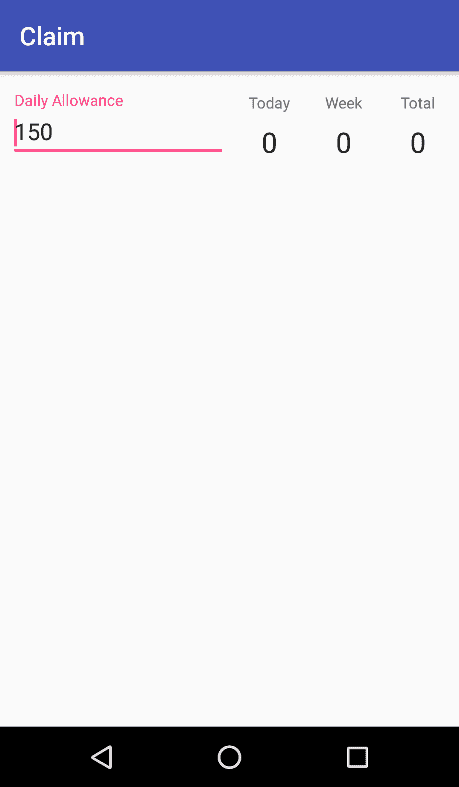

你需要提供一个方法让用户添加新的声明项。最好的方法是在屏幕右下角使用一个浮动操作按钮，我们将使用一个新的 `Fragment` 来实现这一点。通过使用 `Fragment` 来完成这项任务，你可以在应用程序的任何屏幕上放置一个“新建项”浮动操作按钮，而无需在 `Activity` 类中实现任何特殊代码。

# 使用片段创建新的声明项

使用 Room 数据库中的 `LiveData` 的一个不寻常的特性是，现在应用程序的各个部分可以相互交互，而无需相互直接了解。在你的 `OverviewActivity` 的情况下，这将允许你在不向 `ClaimItemAdapter` 发送任何“新项目”或“项目已添加”事件的情况下，用新的 `ClaimItem` 实体填充数据库。然而，Room 数据库抽象层阻止你在主线程上运行任何查询，除非它返回 `LiveData`。虽然检索 `ClaimItem` 实体的查询返回了 `LiveData`，但插入新的 `LiveData` 实体需要在后台运行。按照以下步骤构建一个允许用户捕捉和记录新的旅行索赔项的 `Fragment`：

1.  你需要一项任务来插入一个 `ClaimItem` 实体以及与其相关的任何 `Attachment` 实体。这项任务需要在后台工作线程上运行，因此打开 Android Studio 中的 `ClaimDatabase` 类。

1.  在返回抽象方法的后面，`ClaimItemDao` 和 `AttachmentDao` 声明了一个新的方法，该方法返回一个插入新 `ClaimItem` 的 `Runnable` 任务：

```kt
public Runnable createClaimItemTask(final ClaimItem claimItem) {
    return new Runnable() {
        @Override
        public void run() {
        }
    };
}
```

1.  在新的 `Runnable` 任务中，你希望使用事务将 `ClaimItem` 对象的内容保存到数据库中；如果此方法的任何部分失败，事务将被回滚，并且该方法将没有任何效果：

```kt
beginTransaction();
try {
    final long claimId = claimItemDao().insert(claimItem);
    claimItem.id = claimId;

    for (final Attachment attachment : claimItem.getAttachments()) {
        attachment.claimItemId = claimId;
        attachment.id = attachmentDao().insert(attachment);
    }
    setTransactionSuccessful();
} finally {
    endTransaction();
}
```

1.  你还需要在 `ClaimItem` 中有一个方法来确保它有内容并且被认为是有效的，因此打开 `ClaimItem` 类。

1.  在 `ClaimItem` 类的末尾创建一个新的 `isValid` 方法；这将用于在 `CaptureClaimActivity` 返回 `ClaimItem` 时检查我们是否应该将新的 `ClaimItem` 存储到数据库中：

```kt
public boolean isValid() {
    return !TextUtils.isEmpty(description)
            && amount > 0
            && timestamp != null
            && category != null;
}
```

1.  你需要一个用于添加索赔项的新图标；在可绘制资源目录上右键单击，然后选择新建|矢量资产。

1.  使用图标选择器找到并选择名为 `add` 的图标。

1.  将新的图标资源命名为 `ic_add_white_24dp`。

1.  点击下一步然后点击完成以创建新的资源。

1.  在 Android Studio 文本编辑器中打开新的图标资源。

1.  将路径元素的 `fillColor` 属性更改为白色：

```kt
<path
    android:fillColor="#FFFFFFFF"
    android:pathData="M19,13h-6v6h-2v-6H5v-2h6V5h2v6h6v2z"/>
```

1.  现在，在 ui 包上右键单击，然后选择新建|片段|片段（空白）。

1.  将新的 `Fragment` 类命名为 `NewClaimItemFloatingActionButtonFragment`。

1.  关闭包含片段工厂方法和包含接口回调选项。

1.  点击完成按钮以创建新的 `Fragment` 类。

1.  打开新的布局文件，该文件应命名为 `fragment_new_claim_item_floating_action_button.xml`。

1.  用一个 `FloatingActionButton` 替换此文件的内容：

```kt
<android.support.design.widget.FloatingActionButton

    tools:context="com.packtpub.claim.ui.NewClaimItemFloatingActionButtonFragment"
    android:layout_width="wrap_content"
    android:layout_height="wrap_content"
    app:fabSize="normal"
    app:srcCompat="@drawable/ic_add_white_24dp" />
```

1.  现在，打开新的 `NewClaimItemFloatingActionButtonFragment` 类。

1.  将类声明更改为实现 `View.OnClickListener` 接口：

```kt
public class NewClaimItemFloatingActionButtonFragment
        extends Fragment
        implements View.OnClickListener {
```

1.  声明一个请求码，用于将用户发送到 `CaptureClaimActivity`：

```kt
private static final int REQUEST_CODE_CREATE_CLAIM_ITEM = 100;
```

1.  将 `onCreateView` 方法更改为同时设置 `FloatingActionButton` 的 `OnClickListener`：

```kt
@Override
public View onCreateView(
        final LayoutInflater inflater,
        final ViewGroup container,
        final Bundle savedInstanceState) {

    final View button = inflater.inflate(
            R.layout.fragment_new_claim_item_floating_action_button,
            container,
            false
    );

    button.setOnClickListener(this);
    return button;
}
```

1.  重写`onClick`方法从`View.OnClickListener`并启动`CaptureClaimActivity`以获取结果：

```kt
@Override public void onClick(final View view) {
    startActivityForResult(
            new Intent(getContext(), CaptureClaimActivity.class),
            REQUEST_CODE_CREATE_CLAIM_ITEM);
}
```

1.  重写`onActivityResult`方法以处理传入的`ClaimItem`，如果它是有效的，则使用`AsyncTask`的`SERIAL_EXECUTOR`将其保存到数据库中：

```kt
public void onActivityResult(
        final int requestCode,
        final int resultCode,
        final Intent data) {

    if (requestCode != REQUEST_CODE_CREATE_CLAIM_ITEM
            || resultCode != Activity.RESULT_OK
            || data == null) {
        return;
    }

    final ClaimItem claimItem = data.getParcelableExtra(
            CaptureClaimActivity.EXTRA_CLAIM_ITEM
    );

    if (claimItem.isValid()) {
 final ClaimDatabase database = ClaimApplication.getClaimDatabase();
 AsyncTask.SERIAL_EXECUTOR.execute(
 database.createClaimItemTask(claimItem)
 );
 }
}
```

1.  现在，你需要将新片段添加到`OverviewActivity`中。打开`activity_overview`布局文件并切换到文本模式。

1.  在`FrameLayout`根元素的底部，包含一个引用`NewClaimItemFloatingActionButtonFragment`的片段标签，并将其定位在屏幕的右下角：

```kt
<fragment
        class="com.packtpub.claim.ui.NewClaimItemFloatingActionButtonFragment"
    android:id="@+id/new_claim_item"
    android:layout_width="wrap_content"
    android:layout_height="wrap_content"
    android:layout_gravity="bottom|end"
    android:layout_margin="@dimen/fab_margin" />
```

现在，你应该能够再次运行应用程序了；不仅你现在的概览屏幕底部应该有一个浮动操作按钮，而且它将正常工作！如果你点击该按钮并在`CaptureClaimActivity`上捕获一些细节，然后选择导航回`OverviewActivity`，新的索赔项目将出现在列表中，按日期排序。

与直接使用`SQLiteDatabase`相比，Room 将只允许在工作线程上运行查询。这使得将更新封装在可以在后台线程上运行的`Runnable`中（就像你在`ClaimDatabase`类中的`createClaimItemTask`所做的那样）变得很有吸引力。在`ClaimDatabase`上提供这些方法使得它们易于重用，并保持应用程序中逻辑的一致性。它还允许你将它们放入队列中或与其他任务并行运行，如果你选择使用线程池而不是`AsyncTask`的`SERIAL_EXECUTOR`（它一次只能运行一个任务）。

# 使用 Room 数据库的津贴概览

如果你运行概览屏幕并添加一些索赔到其中，你会注意到代码中的一段没有对新添加到数据库中的新项目做出反应：屏幕顶部的津贴概览。这是因为尽管其他所有内容都与 Room 数据库连接，但它仍在监视`Allowance`数据模型。当数据仅存在于内存中时，使用此类数据模型是一个好主意，但现在你已经有了数据库，事情可以改变并简化。例如，`Allowance`类实际上只保留用户计划每天花费的金额；索赔项实际上可以被视为数据库模型中的一个完全独立的结构。

因此，你可以将每日津贴移动到不同类型的数据存储中--`SharedPreferences`。`SharedPreferences`是 Android 中的键值存储，具有共享的内存表示和原子更新。如果你不期望它们存储太多数据，这使得它们非常适合跟踪那些实际上不会进入 SQLite 数据库的数据。让我们将`Allowance`概览的模型更改为使用`ClaimDatabase`和`SharedPreferences`：

1.  首先，打开`AllowanceOverviewPresenter`类。

1.  将其从使用`Allowance`类更改为公开每日津贴作为`ObservableInt`，并移除`OnPropertyChangeCallback`，以便现在字段看起来像这样：

```kt
public final ObservableField<SpendingStats> spendingStats = new ObservableField<>();
public final ObservableInt allowance = new ObservableInt();
private final UpdateSpendingStatsCommand updateSpendStatsCommand =
                  new UpdateSpendingStatsCommand();
```

1.  现在，将`UpdateSpendingStatsCommand`内部类更改为接受`ClaimItem`对象`List`而不是`Allowance`作为其参数：

```kt
private class UpdateSpendingStatsCommand extends ActionCommand<List<ClaimItem>, SpendingStats> {
```

1.  现在将`onBackground`实现更改为通过给定的`ClaimItem`对象`List`进行单次扫描，并一次性计算所有支出统计：

```kt
public SpendingStats onBackground(final List<ClaimItem> items) throws Exception {
    final Pair<Date, Date> today = getToday();
    final Pair<Date, Date> thisWeek = getThisWeek();

    double spentTotal = 0;
    double spentToday = 0;
    double spentThisWeek = 0;

    for (int i = 0; i < items.size(); i++) {
        final ClaimItem item = items.get(i);
        spentTotal += item.getAmount();

        if (item.getTimestamp().compareTo(thisWeek.first) >= 0
                && item.getTimestamp().compareTo(thisWeek.second) <= 0) {

            spentThisWeek += item.getAmount();
        }

        if (item.getTimestamp().compareTo(today.first) >= 0
                && item.getTimestamp().compareTo(today.second) <= 0) {

            spentToday += item.getAmount();
        }
    }

    // for stats we round everything to integers
    return new SpendingStats(
            (int) spentTotal,
            (int) spentToday,
            (int) spentThisWeek
    );
}
```

1.  现在，更改构造函数，使其接受`LifecycleOwner`和要显示给用户的起始津贴。然后，使用`ClaimDatabase`在添加新的`ClaimItem`对象时更新支出统计：

```kt
public AllowanceOverviewPresenter(
        final LifecycleOwner lifecycleOwner,
        final int allowance) {

    ClaimApplication.getClaimDatabase()
            .claimItemDao()
            .selectAll()
            .observe(lifecycleOwner, new Observer<List<ClaimItem>>() {
                @Override
                public void onChanged(final List<ClaimItem> claimItems) {
                    updateSpendStatsCommand.exec(claimItems);
                }
            });

    this.allowance.set(allowance);
}
```

1.  你还需要将`updateAllowance`方法更改为使用`ObservableInt`而不是`Allowance`对象：

```kt
public void updateAllowance(final CharSequence newAllowance) {
    try {
        allowance.set(Integer.parseInt(newAllowance.toString()));
    } catch (final RuntimeException ex) {
        //ignore
        allowance.set(0);
    }
}
```

1.  现在，打开`AllowanceOverviewFragment`类。

1.  在`AllowanceOverviewFragment`中添加一个`SharedPreferences`字段；我们将在本类中多次使用它们：

```kt
private FragmentAllowanceOverviewBinding binding;
private SharedPreferences preferences;
```

1.  重写`Fragment`的`onCreate`方法，并检索你将存储每日津贴的私有`SharedPreferences`实例。第一个参数指定要检索的`SharedPreferences`的名称，而第二个参数指定范围为`private`，意味着只有你的应用程序能够看到或使用此`SharedPreferences`实例：

```kt
@Override
public void onCreate(final Bundle savedInstanceState) {
    super.onCreate(savedInstanceState);
    this.preferences = getContext().getSharedPreferences(
            "Allowance",
            Context.MODE_PRIVATE
    );
}
```

1.  创建一个`onCreateView`方法来创建`AllowanceOverviewPresenter`，并将`Fragment`实例作为`LifecycleOwner`传递，以及从`SharedPreferences`检索当前的`allowancePerDay`。传递给`SharedPreferences.getInt`方法的第二个参数是默认值，如果没有存储现有值，则返回该值：

```kt
@Override
public View onCreateView(
        final LayoutInflater inflater,
        final ViewGroup container,
        final Bundle savedInstanceState) {

    this.binding = DataBindingUtil.inflate(
            inflater,
            R.layout.fragment_allowance_overview,
            container,
            false
    );

    this.binding.setPresenter(new AllowanceOverviewPresenter(
            this,
            preferences.getInt("allowancePerDay", 150)
    ));

    return this.binding.getRoot();
}
```

1.  最后，创建一个`onDestroy`方法，将每日津贴存储回`SharedPreferences`对象。你这样做是通过首先从`SharedPreferences`请求一个`Editor`，然后应用更改。`Editor`中的所有更改都是原子性地同时应用的（原子性地）：

```kt
@Override
public void onDestroy() {
    super.onDestroy();
    preferences.edit()
            .putInt("allowancePerDay", this.binding.getPresenter().allowance.get())
            .apply();
}
```

现在，如果你构建并运行应用程序，你会注意到津贴概览将正确显示你今天、“本周”以及总支出。使用`CaptureClaimActivity`中的日期选择器添加几个不同日期的报销项，并查看用户界面如何响应并重新计算你已支出的金额。

# 测试你的知识

1.  `RecyclerView`的一个实例将为以下哪项创建一个`View`实例？

    +   每项数据

    +   屏幕上可见的每一项数据

    +   每种也可见于屏幕上的数据元素

1.  当将观察者附加到`LiveData`时，你需要执行以下哪项操作？

    +   当其`LifecycleOwner`被销毁时将其分离

    +   在主线程上附加它

    +   提供一个有效的`LifecycleOwner`

1.  概览/仪表盘屏幕应该具备哪些功能？

    +   它们应该只使用图表来显示统计信息

    +   如果可以避免，它们不应该滚动

    +   它们应该首先显示最重要的信息概览

1.  `ViewHolder`类被`RecyclerView`用来做什么？

    +   提高数据绑定性能

    +   引用将被垃圾回收的视图

    +   将`View`对象存储在`Bundle`中

1.  当使用`LiveData`对象引用多个`Fragment`对象使用的数据时，以下哪个是正确的？

    +   `Fragment`实例必须共享相同的`LiveData`引用以查看更改

    +   `LiveData`只会更新一个`Fragment`实例

    +   `Fragment`类必须都扩展`android.support.v4.app.Fragment`

# 摘要

概览屏幕是用户在应用程序中首先看到并与之交互的东西，也将是他们将在应用程序中花费大部分时间的地方。保持屏幕专注于显示给用户的数据，以及如何显示数据，这一点很重要。始终考虑用户需要查看你的屏幕多长时间，以及他们需要轻松访问哪些信息。利用`RecyclerView`和`LiveData`类为用户提供以最重要的信息为先的详细视图，并允许他们快速滚动查看他们最重要的最近事件。

同样重要的是要考虑你应用程序的导航，用户将如何从概览屏幕离开的各种方式，以及他们将如何返回。尽可能保持`概览`类只负责在屏幕上排列数据。任何将用户从屏幕上移开（无论出于何种原因）的逻辑都应该封装在`Fragment`类中，这些类还包含处理他们最终返回概览屏幕的逻辑。

在本章中，我们探讨了构建概览屏幕的一种非常简单的方法。通过在用户滚动和拖动用户界面各种元素时重新设计屏幕布局，这些类型的屏幕可以通过多种方式变得更加有用和强大。

在下一章中，我们将探讨如何利用 Material Design API 提供的某些布局系统，允许用户界面动态地改变其形状和重点。
