# 有效导航

从广义上讲，导航是用户如何在您的应用程序中从一个屏幕跳转到另一个屏幕。然而，更具体地说，它是用户为了在您的应用程序中达到一个目标需要做什么。导航是您应用程序用户界面设计的一个几乎完全看不见的部分。这是一个经常被忽视、经常做得不好的领域，因此，经常导致用户感到沮丧。

问题在于，应用程序的导航设计通常是用户界面设计的副作用，而不是已经计划好的事情。就像单个屏幕一样，导航可以也应该围绕用户而不是设计师或开发者来设计。使用您在这本书中学到的技术，您应该能够轻松地使几乎任何导航流程工作，因为元素之间不应该紧密耦合。

在本章中，我们将探讨在 Material Design 语言中的导航和导航模式。您将学习如何做以下事情：

+   规划和设计应用程序的导航流程

+   使用标准的导航菜单组件

+   构建标签导航应用程序

+   使用片段而不是活动进行导航

# 规划导航

在跃入您最新的应用程序想法之前，停下来考虑您试图让用户做什么，以及他们实际上会如何去做，这是一个好主意。其中最好的方法之一是使用决策树或导航树。这些可以在纸上轻松绘制，或者如果您与其他人合作，磁性白板（或甚至是一个图钉板）上的索引卡也非常有效。

目标是不仅绘制出您应用程序中可能的屏幕，还要考虑用户如何到达每一个屏幕。导航图不仅有助于定义您的应用程序实际需要的屏幕，而且将有助于确保用户永远不会在您的应用程序中“迷路”。如果导航线变得过于复杂，那么您需要简化导航（可能通过添加或删除一些屏幕）。过于复杂的导航通常隐藏在应用程序的使用中，但当绘制在图上时，屏幕之间的复杂关系变得明显，通常，一个解决方案也会变得明显。

要开始绘制您的图，创建一个代表用户进入应用程序的主要入口的框或卡片。然后，从用户可能从该屏幕采取的每个可能的动作分支。对于每个动作，绘制一个简单的图标或描述用户预期采取的动作类型。例如，一个圆圈可以代表一个浮动操作按钮，三个错开的线条可以代表一个滑动手势，等等。这些图标还将通过确保屏幕上的手势和动作对用户来说保持明显，并帮助您避免隐藏用户行为的导航技术。以下是一个代表当前旅行报销应用程序状态的导航图示例：

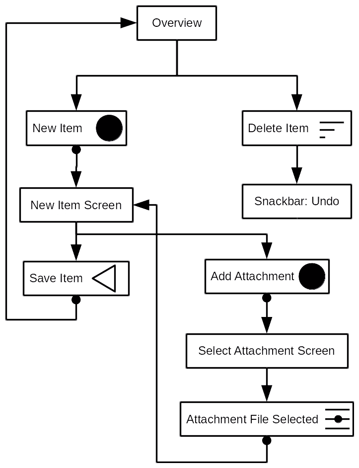

从图中立即可以看出，一切都在深入到应用中，目前有三个不同的操作区域：**新建项目**、**删除项目**和**添加附件**。较大的应用仍然应该有这些操作区域的逻辑分组，并且不应该有需要跨越太多图面的导航线。如果有的话，这表明导航结构过于复杂，而在图上移动元素通常会帮助你制作出更好、更直观的应用。

现在，让我们来看看专门为导航构建的各种 Android 组件。

# 标签导航

当应用被分解成少数几个逻辑区域时，标签通常成为最明显和最简单的方法。大多数应用的导航都是深度分层的，在这些情况下，标签不是导航机制的好选择。标签导航最好用于每个标签将与其他标签大致一样频繁使用（即，它们具有大致相等的重要性）。Android 中有两种主要的标签布局类型：底部标签和顶部标签（也称为操作栏标签或工具栏标签）。

**顶部标签**是将标签添加到 Android 应用的经典方法，当应用区域不经常切换时非常完美。这是因为它们位于屏幕顶部，通常远离用户的手指。通常，用户的手指靠近屏幕底部，靠近软件键盘和系统导航按钮：

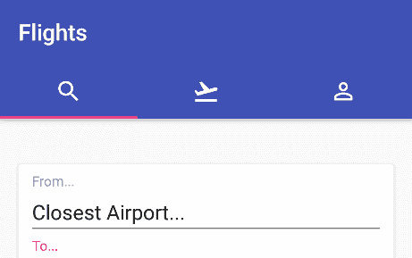

**底部标签**，另一方面，是实施有效的更微妙和更具挑战性的导航技术。底部标签比它们的顶部栏亲戚占用更多的垂直屏幕空间，因此需要为它们消耗的额外空间*工作*。如果用户将频繁地在这些空间之间切换，并且花费在每一个空间上的时间大致相同，那么底部标签的实现是好的。由于它们位于屏幕底部，通常更容易被用户访问，因此它们更容易在提供的屏幕之间切换：


使用这两种基于标签的导航选项时，重要的是要考虑标签应该始终在应用中可见，因此你的应用将在导航树中有几个**根节点**（每个标签一个）。你还应该避免在标签之间过多地导航用户，因为这可能会造成困惑。相反，每个标签应该代表应用流程的一个独立部分，几乎就像一个迷你应用。

Android 提供的标签组件实际上并不执行任何导航操作；相反，假设你将自行封装实际的导航容器和逻辑。使用 `ViewPager` 类来管理不同标签屏幕之间的切换，并为每个标签使用一个单独的 `Fragment` 是很正常的。Android Studio 还包括这两个导航模式的一些简单模板。让我们看看如何构建一个带有顶部标签的简单 `Activity`：

1.  打开文件菜单，选择新建 | 新建项目。

1.  将新项目命名为 `Navigation`。

1.  选择适当的公司域名以确定包名：

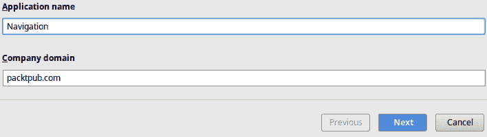

1.  点击下一步按钮。

1.  选择手机和平板支持，以及至少 API 16 级支持：

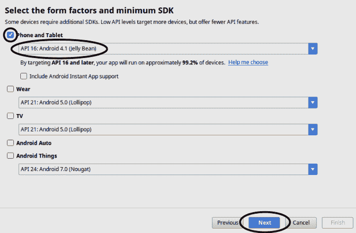

1.  然后，点击下一步。

1.  在活动库中，向右滚动到底部并选择标签活动：

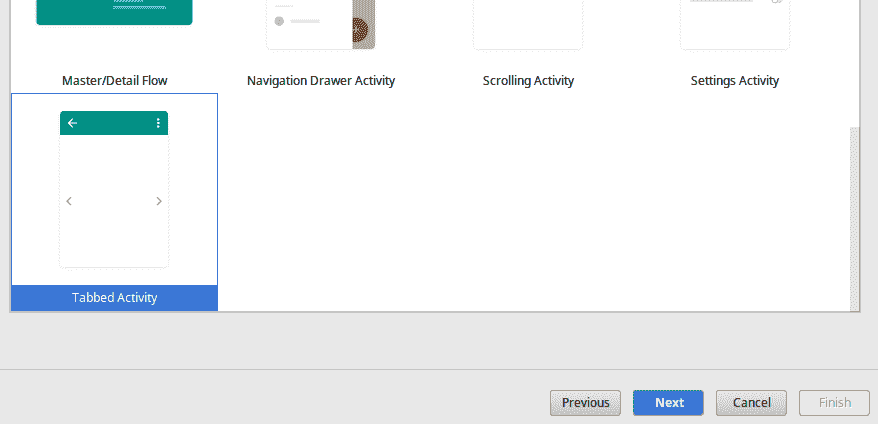

1.  点击下一步按钮。

1.  将新的 `Activity` 命名为 `TopTabsActivity`。

1.  在向导的底部滚动到导航样式。

1.  将导航样式更改为带有 ViewPager 的 ActionBar 标签：

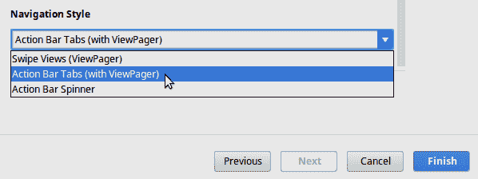

1.  点击完成以完成向导。

1.  等待 Android Studio 完成创建你的项目。

如果你的项目在 IDE 中有编译错误，你可能需要将支持库添加到新项目中。打开 app 模块的 build.gradle，并添加

`implementation 'com.android.support:support-v4:26.0.0'`

（带有正确的版本号）添加到 `dependencies`。

1.  一旦项目创建完成，Android Studio 将在 `AppBarLayout` 中构建一个新的 `Activity`，其中包含三个标签。打开 res/layout 目录，并打开 `activity_tob_tabs.xml` 布局文件以编辑标签的数量和外观：

```kt
<android.support.design.widget.TabLayout
    android:id="@+id/tabs"
    android:layout_width="match_parent"
    android:layout_height="wrap_content">

    <android.support.design.widget.TabItem
        android:id="@+id/tabItem"
        android:layout_width="wrap_content"
        android:layout_height="wrap_content"
        android:text="@string/tab_text_1" />

    <android.support.design.widget.TabItem
        android:id="@+id/tabItem2"
        android:layout_width="wrap_content"
        android:layout_height="wrap_content"
        android:text="@string/tab_text_2" />

    <android.support.design.widget.TabItem
        android:id="@+id/tabItem3"
        android:layout_width="wrap_content"
        android:layout_height="wrap_content"
        android:text="@string/tab_text_3" />
</android.support.design.widget.TabLayout>
```

在任何类型的标签布局中避免有太多的标签是最好的。如果你使用文本标签（如模板所示），应尽量避免超过三个标签。如果你需要超过三个，最好使用材料图标并移除文本描述。

1.  要编辑标签中显示的内容，你需要打开 `TopTabsActivity` 类。

1.  在文件底部找到 `SectionsPagerAdapter` 内部类。

1.  在这个类中，你可以在 `getItem` 方法中创建一个 `switch` 语句来为每个标签创建 `Fragment` 实例。例如，之前使用的“航班搜索”图片可能有一个类似这样的 `getItem` 实现：

```kt
public Fragment getItem(final int position) {
  switch (position) {
    case 0:
      return new FlightSearchFragment();
    case 1:
      return new BookingsFragment();
    case 2:
      return new ProfileFragment();
  }

  throw new IndexOutOfBoundsException(
      "no tab for position " + position);
}
```

使用 `switch` 语句或类似的结构而不是填充数组可以确保只有在实际需要时才会分配 `Fragment` 对象。如果用户不更改标签，则只需实例化一个。

在 `TopTabsActivity` 中，你会在 `onCreate` 方法中看到 Android Studio 使用 `TabLayout` 类的两个监听器类将 `TabLayout` 与 `AppBarLayout` 中的 `ViewPager` 绑定：

```kt
mViewPager.addOnPageChangeListener(
        new TabLayout.TabLayoutOnPageChangeListener(tabLayout));
tabLayout.addOnTabSelectedListener(
        new TabLayout.ViewPagerOnTabSelectedListener(mViewPager));
```

这些监听器将保持`TabLayout`中选中的标签页和由`ViewPager`显示的当前`Fragment`同步。当选择一个标签页时，将显示相应的页面，当滑动`ViewPager`时，将选择相应的标签页。

# 底部标签导航

在代码结构上，使用底部导航标签与在应用程序工具栏中放置标签有所不同。工具栏标签使用`TabItem`小部件来渲染其内容，而`BottomNavigationView`使用菜单来决定其外观。菜单，就像布局文件一样，是 Android 中的一个专用 XML 资源文件。它们在项目编译期间被压缩为二进制 XML，并且可以在运行时使用`MenuInflator`对象进行填充。与布局资源不同，菜单指定了菜单项和子菜单的列表，虽然它们有文本描述和可选图标，但没有自己的渲染逻辑。因此，它们非常适合表示导航选项到各种不同的小部件。

底部标签通常用于展示*替代*视图--在相同数据之上的不同用户界面；例如，搜索航班、即将到来的预订和过去的预订。所有这些都是用户的航班，但视角不同。

让我们构建一个`Activity`来使用`BottomNavigationView`在应用程序的不同区域之间导航：

1.  在导航项目中的主包上右键单击，并选择“新建”|“活动”|“底部导航活动”。

1.  将新的`Activity`命名为`BottomTabsActivity`。

1.  点击“完成”以创建新的结构。

1.  Android Studio 将创建几个新文件：`Activity`类、新的布局 XML 文件、几个新的图标文件和导航菜单资源。

1.  打开新的`res/layout/activity_bottom_tabs.xml`布局资源。

1.  确保编辑器处于设计模式。

1.  在组件树面板中，选择消息（`TextView`）项并删除它：

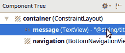

1.  在调色板面板中，打开容器并拖动一个`ViewPager`到设计画布的中间：

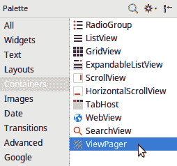

1.  使用属性面板，将所有边界的约束添加到新的`ViewPager`并设置为`0`：

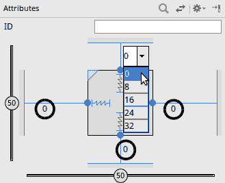

1.  将`layout_width`和`layout_height`属性更改为`match_constraint`。

1.  将`ViewPager`小部件的 ID 更改为`container`。

1.  在项目视图中，右键单击`res/drawable`目录，并选择“新建”|“矢量资产”。

1.  使用图标选择器查找标准`search`图标，并保留名称不变（`ic_search_black_24dp`）。

1.  选择“下一步”，然后选择“完成”以将图标导入到项目中。

1.  以相同的方式导入`flight takeoff`和`bookmark`图标。

1.  打开`res/menu/navigation.xml`菜单资源文件。在设计视图中，你应该看到一个菜单编辑器，如下所示：

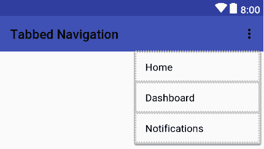

1.  通过在设计画布中单击它来选择主菜单项。

1.  在属性面板中，将项目的 ID 更改为`navigation_search`。

1.  使用字符串资源编辑器将标题属性更改为名为`title_search`的新字符串资源，内容为`搜索`。

1.  使用图标资源选择器将图标更改为您导入的`ic_search_black_24dp`图标。

1.  在设计画布中选择仪表板菜单项。

1.  在属性面板中将 ID 属性更改为`navigation_upcoming`。

1.  使用字符串资源编辑器将标题属性更改为名为`title_upcoming`的新字符串资源，内容为`即将到来的航班`。

1.  使用图标资源选择器将图标更改为您导入的`ic_flight_takeoff_black_24dp`图标。

1.  在设计画布中选择通知菜单项。

1.  在属性面板中将 ID 属性更改为`navigation_flown`。

1.  使用字符串资源编辑器将标题属性更改为名为`title_flown`的新字符串资源，内容为`过去的预订`。

1.  使用图标资源选择器将图标更改为您导入的`ic_bookmark_black_24dp`图标。

1.  现在，打开`BottomTabsActivity`源文件。

1.  删除对`TextView`的引用，并用对`ViewPager`和`BottomNavigationView`的引用替换它：

```kt
private TextView mTextMessage; // remove this line
private ViewPager container;
private BottomNavigationView navigation;
```

1.  `BottomNavigationView`（与用于顶部标签的`TabLayout`不同）不包含监听器来自动映射选定的标签和`ViewPager`，因此您需要将`MenuItem` ID 值映射到应显示的页面索引。创建一个包含`MenuItem` ID 值的`int`数组，其顺序与页面相同：

```kt
private final int[] pageIds = new int[]{
        R.id.navigation_search,
        R.id.navigation_upcoming,
        R.id.navigation_flown
};
```

1.  模板创建了一个`BottomNavigationView.OnNavigationItemSelectedListener`匿名内部类，用于在`TextView`中显示选定的标签名称。您希望`ViewPager`切换到选定的标签`Fragment`，您可以使用您刚才声明的 ID 值数组来完成此操作：

```kt
private BottomNavigationView.OnNavigationItemSelectedListener onNavigationItemSelectedListener
        = new BottomNavigationView.OnNavigationItemSelectedListener() {

    public boolean onNavigationItemSelected(final MenuItem item) {
        for (int i = 0; i < pageIds.length; i++) {
            if (pageIds[i] == item.getItemId()) {
                container.setCurrentItem(i);
                return true;
            }
        }

        return false;
    }
};
```

1.  您还需要一个监听器，用于当用户在`ViewPager`上的标签之间滑动时，以便`BottomNavigationView`也能突出显示正确的标签：

```kt
private ViewPager.OnPageChangeListener onPageChangeListener =
        new ViewPager.SimpleOnPageChangeListener() {
            public void onPageSelected(final int position) {
                navigation.setSelectedItemId(pageIds[position]);
            }
        };
```

1.  在`onCreate`方法中，删除对`TextView`的赋值，并分配新的`ViewPager`字段：

```kt
mTextMessage = findViewById(R.id.message); // remove this line
container = findViewById(R.id.container);
```

1.  将`BottomNavigationView`赋值和监听器分配给您的`Activity`中的字段，然后正确分配两个监听器：

```kt
navigation = findViewById(R.id.navigation);
navigation.setOnNavigationItemSelectedListener(
    onNavigationItemSelectedListener);
container.addOnPageChangeListener(onPageChangeListener);
```

1.  现在，您可以将一个`ViewPagerAdapter`分配给具有三个标签的`ViewPager`（例如在`TopTabsActivity`中生成的`SectionsPagerAdapter`）：

```kt
container.setAdapter(
    new SectionsPagerAdapter(getSupportFragmentManager()));
```

如果前面的行抱怨`TopTabsActivity`不是一个封装类，那么将`SectionsPagerAdapter`更改为静态内部类--`public static class SectionsPagerAdapter extends FragmentPagerAdapter`。

在此示例中的监听器可以在任何需要底部标签导航的应用程序中重复使用。你需要更改的唯一事情是显示给用户的`pageIds`列表。你应该避免在`BottomNavigationView`中有超过三个或四个标签；这通常意味着另一种导航形式更适合你的应用程序。

# 导航菜单

有时，你需要为用户提供一组广泛的导航选项，这些选项无法适应一组标签。这就是隐藏导航菜单，有时也称为汉堡菜单，变得有用的地方。这种菜单模式曾经流行，被用作一种主菜单，在应用程序的每个屏幕上都可以访问。然而，导航菜单隐藏选项，并且它们经常鼓励粗心的导航设计，因为它们提供了一个可以随意放置任何导航项的空间。最好在绝对确定你需要它之前，尽量避免任何形式的隐藏导航。

当它们增强其他导航模式（如标签）时，它们可以是有用的，并且用于提供用户不太可能每天访问的很少使用或高级功能。例如，在照片画廊屏幕上，隐藏菜单可能用于访问创建新标签、访问已删除的照片以及访问设置和帮助的能力。

让我们在带有底部标签的示例中添加一个导航菜单，以便用户可以访问他们可能需要的其他功能：

1.  右键点击`res/menu`目录并选择新建 | 菜单资源文件。

1.  将新文件命名为`nav_menu`，然后点击确定以创建新的资源文件。

1.  打开新文件的文本编辑器。

1.  将以下菜单结构复制到新文件中：

```kt
<?xml version="1.0" encoding="utf-8"?>
<menu
    >

  <item
    android:id="@+id/loyalty_programs"
    android:title="Frequent Flyer" />
  <item
    android:id="@+id/deals"
    android:title="Special Deals" />
  <item
    android:id="@+id/guides"
    android:title="Travel Guide" />
  <item
    android:id="@+id/settings"
    android:title="Settings">
    <!-- nesting a menu produces a "group" in the navigation menu -->
    <menu>
      <item android:id="@+id/profile"
            android:title="Profile"/>
      <item android:id="@+id/about"
            android:title="About"/>
    </menu>
  </item>
</menu>
```

1.  现在，打开`activity_bottom_tabs.xml`布局文件。

1.  切换到文本编辑器。

1.  根元素当前应该是一个`ConstraintLayout`；你需要将其包裹在一个`DrawerLayout`小部件中，该小部件将管理导航抽屉的显示和隐藏。你还需要给`ConstraintLayout`一个与`ActionBar`相同大小的顶部边距；否则，它将被系统`ActionBar`（另一种解决方法是使用没有系统`ActionBar`的`AppBarLayout`和`CoordinatorLayout`）隐藏。

```kt
<android.support.v4.widget.DrawerLayout

 android:id="@+id/drawer_layout"
 android:layout_width="match_parent"
 android:layout_height="match_parent"
 android:fitsSystemWindows="true"
 tools:openDrawer="start"
 tools:context="com.packtpub.navigation.BottomTabActivity">
    <!-- This ConstraintLayout is your old root layout widget -->
    <android.support.constraint.ConstraintLayout
        android:layout_width="match_parent"
        android:layout_height="match_parent"
        android:layout_marginTop="?attr/actionBarSize">
```

1.  在`ConstraintLayout`元素关闭后，你需要添加`NavigationView`，它将包含你刚刚编写的导航菜单：

```kt
</android.support.constraint.ConstraintLayout>

    <android.support.design.widget.NavigationView
 android:id="@+id/nav_view"
 android:layout_width="wrap_content"
 android:layout_height="match_parent"
 android:layout_gravity="start"
 android:fitsSystemWindows="true"
 app:menu="@menu/nav_menu" />
</android.support.v4.widget.DrawerLayout>
```

1.  打开`BottomTabActivity`源文件。

1.  默认情况下，`NavigationView`不会对任何形式的菜单项点击做出响应，甚至在你选择一个菜单项时也不会关闭导航抽屉。你需要添加一个监听器并自己告诉它要做什么。在`onCreate`方法的底部，查找`NavigationView`并添加一个监听器以至少关闭导航抽屉：

```kt
final NavigationView navigationView = findViewById(R.id.nav_view);
navigationView.setNavigationItemSelectedListener(new NavigationView.OnNavigationItemSelectedListener() {
  public boolean onNavigationItemSelected(final MenuItem item) {
    // your normal click handling would go here
    final DrawerLayout drawer = findViewById(R.id.drawer_layout);
    drawer.closeDrawer(GravityCompat.START);
    return true;
  }
});
```

1.  用户还期望能够使用返回按钮关闭导航抽屉。这需要你覆盖默认的返回按钮行为：

```kt
public void onBackPressed() {
  final DrawerLayout drawer = findViewById(R.id.drawer_layout);
  if (drawer.isDrawerOpen(GravityCompat.START)) {
    drawer.closeDrawer(GravityCompat.START);
  } else {
    super.onBackPressed();
  }
}
```

以这种方式覆盖返回按钮的行为需要你非常小心。默认行为在整个平台和所有行为良好的应用程序中都是高度一致的。具有不一致返回按钮行为的应用程序对用户来说很明显，并且通常非常令人沮丧。

这里的导航抽屉是其在应用程序上下文中使用的极好例子。底部标签允许用户快速访问应用程序中最常用的区域，而导航抽屉可以用来访问不太常用的功能。记住，导航抽屉隐藏了应用程序的功能，并且仅应用于对用户不是必需的功能，以有效地使用你的应用程序。有时，在用户第一次打开屏幕时强制打开导航抽屉是有意义的（你可以使用 `SharedPreferences` 来记住他们已经看到了它）。你可以使用 `Activity.onCreate` 中的 `DrawerLayout.openDrawer` 方法来做这件事。

此外，记住，虽然覆盖默认的返回按钮行为对于这个特定情况中的用户体验很重要，但通常不是一个好主意。不一致的返回按钮行为是用户很容易注意到的，它是最常见的烦恼之一。对于某些行为，如关闭导航抽屉，它很重要，因为这是最常见的模式，但使用询问用户是否“确实想要退出”（以及类似的其他行为）是浪费用户的时间，应该避免。

# 使用 `Fragment` 进行导航

到目前为止，在本书中，你主要是在将用户从一个 `Activity` 导航到另一个 `Activity`，这实际上也是大多数应用程序的构建方式。然而，还有一个选项，它通常要灵活得多，并允许你构建更加模块化的应用程序——使用 `Fragment` 实例进行导航。到目前为止，我们只是将 `Fragment` 视为可以组装成屏幕部分的小块，但它们可以远不止于此。

带标签的 `Activity` 类都提供了一种使用 `ViewPager` 类和 `FragmentPagerAdapter` 类进行导航的方式。在这些情况下，用户可以滑动到的每一页都是一个完整的 `Fragment`，其生命周期随着用户滑动 `Fragment` 进入或离开视图而暂停和恢复、停止和启动。

如果你查看 `FragmentPagerAdapter` 类，你会发现它不会直接将 `Fragment` 视图实例添加和移除到 `ViewPager` 对象中。相反，它使用 `FragmentTransaction` 通过 `ViewPager` 的 ID 属性将 `Fragment` 添加和移除到 `ViewPager` 中：

```kt
mCurTransaction = mFragmentManager.beginTransaction();
// …
fragment = getItem(position);
mCurTransaction.add(container.getId(), fragment,
                   makeFragmentName(container.getId(), itemId));
```

`FragmentTransaction`类允许你定义任何数量的操作，它们都将同时发生。你可以在用户界面中添加、删除、附加、分离和替换任意数量的`Fragment`实例，然后一次性触发它们。最好的部分是，你还可以将事务添加到“返回栈”。这意味着用户可以通过按设备上的*返回*按钮来撤销事务。

因此，通过使用具有内容空间（如标签示例中的`ViewPager`）的主`Activity`，并用`Fragment`对象填充它，你可以模拟`Activity`到`Activity`的导航。这也意味着你的主要导航控件，如标签或隐藏的导航菜单，只需在活动布局中定义，而不是在应用中每个屏幕的布局上定义。这也使得应用内的导航稍微快一些，因为屏幕的重量级组件在每个导航中都会被重用。

让我们在我们开始构建的底部标签示例中添加一些导航行为，以便导航菜单选项实际上可以执行某些操作：

1.  首先，你需要一个`Fragment`类，你可以用它来处理示例中的各种导航操作。在默认包（即`com.packtpub.navigation`）上右键单击，然后选择“新建|片段|片段（空白）”。

1.  将新的`Fragment`类命名为`PlaceholderFragment`。

1.  取消选择“包含片段工厂方法？”和“包含接口回调？”复选框：

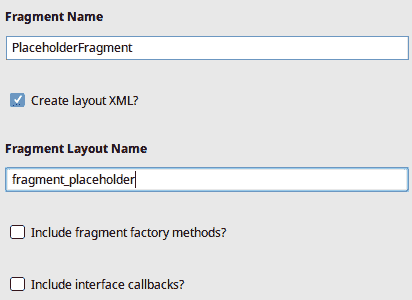

1.  点击“完成”以创建新的片段类和布局文件。

1.  在设计模式下打开`fragment_placeholder.xml`布局文件。

1.  在组件树面板中选择`FrameLayout`。

1.  在属性面板中，切换到查看所有属性。

1.  找到`background`属性，并将其设置为`#ffffff`（白色），以便此`Fragment`的背景不透明。

1.  在组件树面板中选择`TextView`。

1.  在属性面板中，将 ID 属性更改为`placeholder_text`。

1.  将`textAppearance`属性更改为`@style/TextAppearance.AppCompat.Display1`，它将在下拉菜单中显示为 AppCompat.Display1。

1.  现在，打开新的`PlaceholderFragment` Java 源文件。

1.  声明一个`static` `String`常量，以便`PlaceholderFragment`可以保留其占位文本参数：

```kt
private static final String ARG_TEXT = "text";
```

1.  将`onCreateView`方法修改为将`TextView`的文本设置为占位文本：

```kt
public View onCreateView(
    final LayoutInflater inflater,
    final ViewGroup container,
    final Bundle savedInstanceState) {

  final View rootView = inflater.inflate(
      R.layout.fragment_placeholder,
      container,
      false
  );

  final TextView textView =
      rootView.findViewById(R.id.placeholder_text);
 textView.setText(getArguments().getString(ARG_TEXT));</strong>
  return rootView;
}
```

1.  创建一个便利的工厂方法来创建具有指定为方法参数的占位文本的`PlaceholderFragment`：

```kt
public static PlaceholderFragment newInstance(final String text) {
  final PlaceholderFragment fragment = new PlaceholderFragment();
  final Bundle args = new Bundle();
  args.putString(ARG_TEXT, text);
  fragment.setArguments(args);
  return fragment;
}
```

1.  在文本编辑器中打开`activity_bottom_tabs.xml`布局资源。

1.  在`BottomNavigationView`小部件下方找到`ViewPager`。

1.  将`ViewPager`修改为被一个 ID 为`host`的全尺寸`FrameLayout`包裹；这将用于包含用于在应用中导航用户的各种`Fragment`实例：

```kt
<FrameLayout
    android:id="@+id/host"
    android:layout_width="match_parent"
    android:layout_height="0dp"
    app:layout_constraintBottom_toTopOf="@+id/navigation"
    app:layout_constraintEnd_toEndOf="parent"
    app:layout_constraintStart_toStartOf="parent"
    app:layout_constraintTop_toTopOf="parent"
    tools:layout_editor_absoluteX="8dp"
    tools:layout_editor_absoluteY="8dp">

    <android.support.v4.view.ViewPager
        android:id="@+id/container"
        android:layout_width="match_parent"
        android:layout_height="match_parent" />
</FrameLayout>
```

1.  打开`BottomTabsActivity`源文件。

1.  当用户点击底部导航项之一时，你想要确保清除他们所做的任何导航，这样返回按钮就不会将他们导航回之前的堆栈，并确保屏幕上没有残留的`Fragment`实例。在你的匿名类中的`OnNavigationItemSelectedListener.onNavigationItemSelected`方法中，你想要在告诉`ViewPager`切换标签之前弹出回退栈：

```kt
private BottomNavigationView.OnNavigationItemSelectedListener
    onNavigationItemSelectedListener
    = new BottomNavigationView.OnNavigationItemSelectedListener() {

  @Override
  public boolean onNavigationItemSelected(final MenuItem item) {
    final FragmentManager fragmentManager =
        getSupportFragmentManager();
 if (fragmentManager.getBackStackEntryCount() > 0) {
 fragmentManager.popBackStack(
 fragmentManager.getBackStackEntryAt(0).getId(),
 FragmentManager.POP_BACK_STACK_INCLUSIVE);
 }

      for (int i = 0; i < pageIds.length; i++) {
      // ...
```

1.  在`onCreate`方法的底部，你需要向`NavigationView`添加一个新的监听器来监听菜单中的点击。这些点击将触发使用`FragmentManager`的导航，并关闭导航抽屉：

```kt
final NavigationView navigationView = findViewById(R.id.nav_view);
navigationView.setNavigationItemSelectedListener(new NavigationView.OnNavigationItemSelectedListener() {
  @Override
  public boolean onNavigationItemSelected(final MenuItem item) {
    final String location = item.getTitle().toString();

    getSupportFragmentManager()
 .beginTransaction()
 .replace(
              R.id.host,
              PlaceholderFragment.newInstance(location)
          )
 .setTransition(FragmentTransaction.TRANSIT_FRAGMENT_OPEN)
 .addToBackStack(location)
 .commit();

    final DrawerLayout drawer = findViewById(R.id.drawer_layout);
    drawer.closeDrawer(GravityCompat.START);
    return true;
  }
});
```

作为额外的好处，前面的代码还会在每个导航动作之间产生一个可爱的过渡导航。也许你还会想在用户执行这些导航动作时清除回退栈。除此之外，你可能还希望选择`BottomNavigationView`中的特定标签页来指示用户当前在应用中的哪个部分，或者你可能希望`FrameLayout`包裹整个`ConstaintLayout`，这样当用户使用`FragmentManager`进行导航时，底部标签页就会消失。

重要的是要注意，在这个结构中，其他布局和`Fragment`实例仍然在布局中。它们只是被放置在它们上面的`Fragment`实例隐藏了，因为用户使用菜单进行导航。为了避免这种情况，你可以将`ViewPager`包裹在一个专门的`Fragment`类中，但重要的是要通过在`Activity.onCreate`方法中使用`FragmentManager`而不是在布局 XML 中使用`<fragment>`标签将其添加到布局中。`FragmentManager`只会从布局中移除最初通过`FragmentTransaction`添加的`Fragment`。

# 测试你的知识

1.  当使用底部标签页进行导航时，以下哪个因素很重要？

    +   它们都有单色图标

    +   标签页的重要性大致相等

    +   总共有三个标签页

1.  在以下哪种情况下，顶部标签页比底部标签页更受欢迎？

    +   当用户不需要频繁导航时

    +   当标签页没有图标时

    +   当标签页超过三个时

1.  在以下哪种情况下可以使用片段进行导航？

    +   只有当同时使用导航抽屉时

    +   用户在应用内导航的任何时候

    +   当它们可以嵌套在`FrameLayout`中时

1.  当用户在导航抽屉中选择一个项目时，以下哪个说法是正确的？

    +   抽屉需要由用户关闭

    +   抽屉应该通过编程方式关闭

    +   抽屉在短暂延迟后自动关闭

# 摘要

导航是用户体验的关键部分，应当仔细思考和设计。材料设计提供了各种不同的设计结构和组件，以帮助您实现更有效的导航，但重要的是要谨慎且恰当地使用它们。与任何屏幕设计一样，考虑用户最常想要执行的操作，并对每个可能的动作和导航从最重要的到最不重要的进行排序，在每个屏幕上都至关重要。

在许多应用中，甚至可能不需要专门的导航组件，导航可以通过从概览屏幕或仪表板出发的目标导向动作来实现。在任何情况下，提前绘制一个导航图都是一个好主意（即使它是不完整或过于简化的）。它们通常会告诉您您的应用程序需要什么样的导航结构和组件。

使用`FragmentManager`而不是始终启动新的`Activity`来实现的导航是一个极其强大的模式。它提供了大量的额外选项，并对 backstack 有显著更多的控制，甚至可以控制每个过渡期间播放的动画。还可能在单个`FragmentTransaction`中更改多个屏幕上的`Fragment`，这可以用来产生一些惊人的效果。

在下一章中，我们将回到旅行报销的例子，并探索一些关于`RecyclerView`的更多内容。本章将探讨`RecyclerView`的一些更高级的功能，以及如何使用支持 API 中的强大类将`RecyclerView`与`LiveData`类和 Room 集成，以实现一些令人兴奋的效果。
