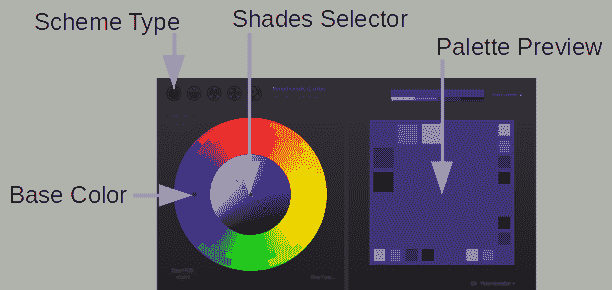
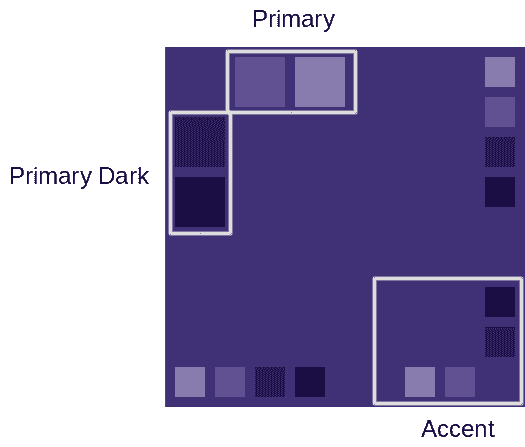
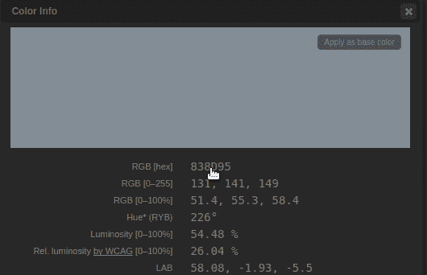
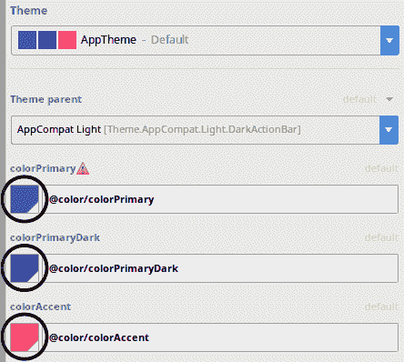
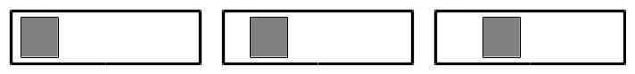
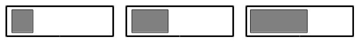
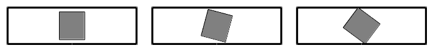
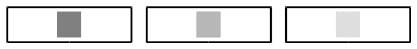
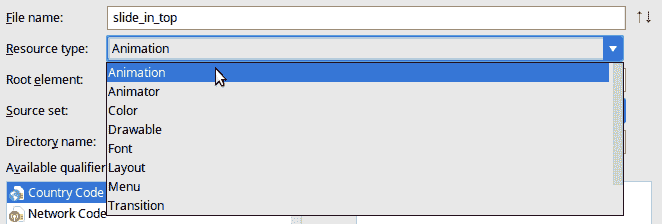
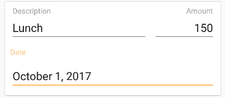

# 第十一章：精炼你的设计

应用程序的精炼是用户体验中较为微妙的一个领域。颜色、字体和动画的混合通常不是用户在意识层面上注意到的事情，但这并不意味着它们不重要。虽然颜色的选择不会直接影响应用程序的功能，但它确实会影响应用程序的可用性。这些选择也可能是用户通过你的应用程序完成交易，或者卸载它的区别。

Android 提供了一整套工具，你可以使用这些工具来完善你的应用程序。将品牌、颜色和广泛的主题应用到你的应用程序中，可以以允许你保持独特的外观和感觉的方式完成，同时仍然遵循 Material Design 指南，而不需要构建任何自定义小部件。实际上，Android 上大多数小部件的图形效果都可以通过样式来实现。在本章中，我们将探讨以下主题：

+   如何选择和应用颜色到应用程序中

+   如何和何时动态生成调色板

+   创建和应用动画，以及何时应用

+   定义和使用小部件的自定义样式

# 选择颜色和主题

颜色是用户界面设计中最不被理解但最重要的方面之一。文本颜色必须从背景颜色中脱颖而出，以便保持文本可读性，但又不过分突出。颜色选择应贯穿整个应用程序的调色板，并反映应用程序的品牌，但同时也应帮助向用户传达意义。选择正确的颜色组合将最大化应用程序的可用性，同时帮助减少用户的认知负荷。错误的颜色组合会使文本更难阅读，导致眼睛疲劳，并增加用户的认知疲劳程度。

当你为你的应用程序应用自定义颜色时，确保你不会使用太多颜色，并且它们在应用程序中应用是一致的。颜色传达意义；它可以用来告诉用户*新*按钮与*删除*按钮是相反的。这些样式应该定义为资源，并在整个应用程序中一致应用。一致的样式有助于用户更快地理解应用程序中的每个屏幕，通过告诉他们他们在看什么。通常，样式信息定义在你的项目`res/values/styles.xml`文件中。这是我们探索颜色并完善应用程序的一个很好的起点。如果你打开旅行索赔示例应用程序的`res/values/styles.xml`文件，你会在文件顶部附近看到类似以下内容：

```kt
<!-- Base application theme. -->
<style name="AppTheme" parent="Theme.AppCompat.Light.DarkActionBar">
    <!-- Customize your theme here. -->
    <item name="colorPrimary">@color/colorPrimary</item>
    <item name="colorPrimaryDark">@color/colorPrimaryDark</item>
    <item name="colorAccent">@color/colorAccent</item>
</style>
```

这定义了一个名为 `AppTheme` 的样式，该样式从 `AndroidManifest.xml` 文件应用到你的整个应用程序。该样式声明其父样式为 `Theme.AppCompat.Light.DarkActionBar`，该样式是从 `app-compat` 库（在你的 `build.gradle` 依赖项中）导入的。样式的父级有点像类的父级；它定义了所有默认值，你可以在子样式中覆盖它们。在默认的 `AppTheme` 样式中，有三个颜色通过颜色资源引用进行了覆盖：主色、主深色和强调色。这些颜色被用于 `AppTheme` 的 `Toolbar` 对象的背景、按钮、浮动操作按钮等。默认情况下，主色用于 `Toolbar` 和 `FloatingActionButton` 的背景，主深色用于状态栏背景，强调色用于 `FloatingActionButton` 的前景和 `TextInputLayout` 小部件上方的标签。

# 生成应用程序调色板

在将颜色应用到你的应用程序时，首先要做的是决定你的应用程序颜色方案或调色板。**调色板**是一组小的颜色，构成了你主题的基础，并且可以通过调整（通常是通过使它们更亮或更暗）来产生一系列看起来足够相似的颜色，这些颜色可以被视为同一主题的一部分。

最好使用一个好的颜色设计或调色板构建工具。一个出色的工具是 **Paletton**，它可以在 [`paletton.com`](http://paletton.com) 上免费使用（另一个好工具是 [`www.materialpalette.com/`](https://www.materialpalette.com/)）。对于本节，我们将使用 Paletton 为旅行索赔应用程序示例定义一个基本的调色板；让我们开始吧：

1.  在你选择的网页浏览器中导航到 [`paletton.com`](http://paletton.com)。

1.  Paletton 应用程序有两个主要部分；在左侧是一个带有可拖动手柄的颜色轮，允许你选择主色（辅助色会自动使用各种可用的算法推导出来）。在应用程序的右侧是应用程序的调色板样本：



1.  使用 **方案类型** 选择器选择第二种颜色方案：相邻颜色（3 种颜色）。

1.  在方案类型选择器的右侧，使用小切换按钮打开添加互补色。这将向你的调色板添加一个互补色。互补色将位于颜色轮上与主色相对的位置，并作为 *强调色*。

1.  调整基础颜色和阴影，直到右侧的调色板预览是你满意的一组组合：



1.  通过点击调色板预览中的任何方框及其十六进制代码，你可以将 RGB 十六进制代码复制到剪贴板，并将其粘贴到 Android Studio 中：



1.  确保你使用左上角的框中的颜色作为主色和主色深，同时使用右下角的框中的颜色作为强调色。

1.  在 Android Studio 中，使用“工具 | Android | 主题编辑器”打开 Android 主题编辑器。

1.  在右侧的主题面板中，你可以找到一个定义你主题的颜色列表：



1.  点击主题编辑器中的颜色按钮以打开颜色编辑器。将 Paletton 中的颜色复制到主题编辑器中的主色、主色深和强调色。

如果你现在运行旅行报销示例应用程序，你会看到整个应用程序都有一个全新的主题。浮动操作按钮将与`EditText`小部件下划线的颜色相同。这将是你强调色，而你的`Toolbar`的背景将是你的主色。

通常最好使用你主色的互补色作为你的强调色。这是位于色轮另一侧的颜色，通常与你的主色形成极佳的对比。这种对比有助于提高可读性并减少眼睛疲劳。确保每个人都能看清楚是很重要的，Paletton 在调色板预览下方包含一个视觉模拟选项，可以用来测试你的调色板以适应各种类型的色盲。

# 动态生成调色板

有时候你不确定你的调色板应该是什么样子。也有时候你希望配色方案与某些用户内容相匹配，比如他们正在看的照片或他们正在听的音乐的专辑封面。在这些情况下，能够从图像中抓取关键颜色并生成一个与之匹配的调色板是非常有用的。问题是调色板仍然不能太刺眼，你的文本仍然需要与背景颜色保持可读性。这些是在纯代码中很难解决的问题，但 Android 支持库有一个非常棒的工具可以做到这一点——`Palette` API。

使用生成的调色板的一个非常有用方法是，根据图标中的颜色用不同的颜色来着色卡片。让我们编写一个可以根据生成的调色板着色其内容的`CardView`实现：

1.  你首先需要将`Palette` API 添加到你的项目中。在旅行报销应用中，在 Android Studio 中打开应用模块的`build.gradle`文件。

1.  在文件底部的`dependencies`中，通过声明以下内容来包含`Palette` API：

```kt
implementation 'com.android.support:palette-v7:+'
```

1.  点击编辑面板顶部的“立即同步”链接。

1.  右键单击小部件的包，然后选择“新建| Java 类”。

1.  将新类命名为`ColorizedCardView`。

1.  将`Superclass`更改为`android.support.v7.widget.CardView`。

1.  将`android.support.v7.graphics.Palette.PaletteAsyncListener`添加到接口（s）中。

1.  点击“确定”以创建新类。

1.  添加所需的`View`构造函数，以便可以从 XML 文件中使用该类：

```kt
public ColorizedCardView(final Context context) {
  super(context);
}

public ColorizedCardView(
      final Context context,
      final AttributeSet attrs) {
  super(context, attrs);
}

public ColorizedCardView(
      final Context context,
      final AttributeSet attrs,
      final int defStyleAttr) {
  super(context, attrs, defStyleAttr);
}
```

1.  `ColorizedCardView`不仅改变自己的背景，还需要改变任何文本的颜色，以确保用户能够清晰地阅读文本。这意味着`ColorizedCardView`需要找到所有没有设置背景`Drawable`的`TextView`实例（一个`Button`只是一个具有特定背景的`TextView`，我们希望保持原样）。此方法将遍历（深度优先）`ColorizedCardView`，并将找到的任何`TextView`对象添加到`Collection`中：

```kt
static Collection<TextView> findTextViews(
    final ViewGroup viewGroup,
    final Collection<TextView> textViews) {

  final int childCount = viewGroup.getChildCount();
  for (int i = 0; i < childCount; i++) {
    final View child = viewGroup.getChildAt(i);

    if (child instanceof ViewGroup) {
      // recurse downwards
      findTextViews((ViewGroup) child, textViews);
    } else if (child instanceof TextView
          && child.getBackground() == null) {
      textViews.add((TextView) child);
    }
  }

  return textViews;
}
```

1.  每个`Palette`实际上是一个`Swatch`对象的列表，每个`Swatch`都包含一个基础颜色以及适合标题文本和正文文本的颜色。`ColorizedCardView`允许你直接指定`Swatch`来着色背景和所有文本：

```kt
public void setSwatch(final Palette.Swatch swatch) {
  setCardBackgroundColor(swatch.getRgb());

  final Collection<TextView> textViews = findTextViews(
      this, new ArrayList<TextView>()
  );

  if (!textViews.isEmpty()) {
    for (final TextView textView : textViews) {
      textView.setTextColor(swatch.getBodyTextColor());
    }
  }
}
```

1.  当生成`Palette`时，它可以包含任意数量的`Swatch`对象。有一系列*标准*的`Swatch`，通常在从`Bitmap`创建`Palette`时生成，但其中任意数量的`Swatch`可能未被填充（`null`）。当你通过`Palette`对象着色卡片时，你需要在`ColorizedCardView`实现中查找一个可用的`Swatch`；我们将优先选择*浅色*的`Swatch`而不是*深色*的`Swatch`，以及*柔和*的`Swatch`而不是*鲜艳*的`Swatch`：

```kt
public void setPalette(final Palette palette) {
  if (palette.getLightMutedSwatch() != null) {
    setSwatch(palette.getLightMutedSwatch());
  } else if (palette.getLightVibrantSwatch() != null) {
    setSwatch(palette.getLightVibrantSwatch());
  } else if (palette.getDarkMutedSwatch() != null) {
    setSwatch(palette.getDarkMutedSwatch());
  } else if (palette.getDarkVibrantSwatch() != null) {
    setSwatch(palette.getDarkVibrantSwatch());
  }
}
```

你可能需要根据应用程序中选择的颜色调整此方法的顺序。通常，柔和的颜色对用户的眼睛压力较小，但你可能希望使用鲜艳的颜色来着色操作按钮，以吸引人们的注意。

1.  现在，我们需要一种方法来指定一个`Bitmap`以着色整个`ColorizedCardView`。`Palette`使用一个`Builder`对象来生成其`Swatch`，并且有一个内置的`AsyncTask`来处理在后台线程上生成`Palette`（在较大的图像或较慢的设备上可能需要几秒钟）。`setColorizeBitmap`方法被定义为从数据绑定布局 XML 文件中调用它很容易。`Palette.Builder`需要一个回调来处理生成的`Palette`，这将是一个`ColorizedCardView`实例（记住你已经实现了`PaletteAsyncListener`接口）：

```kt
public void setColorizeBitmap(final Bitmap image) {
  new Palette.Builder(image).generate(this);
}

@Override
public void onGenerated(final Palette palette) {
  setPalette(palette);
}
```

1.  你还需要一种方法来根据`Drawable`对象对`ColorizedCardView`进行着色，这将提供与应用程序`Resources`更好的互操作性。以下`renderDrawable`方法如果`Drawable`对象是`BitmapDrawable`（它只是包装了一个`Bitmap`）的话，有一个快捷方式；否则，它将尝试将`Drawable`渲染到`Bitmap`对象。由于`Drawable`的边界包括其位置（而不仅仅是大小），你需要将要在其上绘制的`Canvas`进行平移，以便它在`Bitmap`的左上角渲染：

```kt
private Bitmap renderDrawable(final Drawable drawable) {
  if (drawable instanceof BitmapDrawable) {
    return ((BitmapDrawable) drawable).getBitmap();
  }

  final Rect bounds = drawable.getBounds();
  final Bitmap bitmap = Bitmap.createBitmap(
      bounds.width(),
      bounds.height(),
      Bitmap.Config.ARGB_8888
  );

  final Canvas canvas = new Canvas(bitmap);
  canvas.translate(-bounds.left, -bounds.top);
  drawable.draw(canvas);

   return bitmap;
}

public void setColorizeDrawable(final Drawable drawable) {
  setColorizeBitmap(renderDrawable(drawable));
}
```

要在旅行索赔应用程序中使用`ColorizedCardView`，您可以找到并下载所有类别的彩色图标，并将`ItemPresenter`更改为使用它们，而不是我们从 Material Icons 集合中导入的标准黑色图标。寻找图标和图标集合的优秀资源是 Iconfinder--[`www.iconfinder.com/`](https://www.iconfinder.com/)。Iconfinder 允许您根据您的标准搜索和筛选图标集合，并购买或下载您应用程序所需的图标。

要将概览屏幕更改为使用您喜欢的彩色图标，请按照以下步骤操作：

1.  将您的新图标放置在应用程序的`res/drawable`目录中；确保您下载 PNG 图标，以便 Android 能够读取。

1.  在 Android Studio 中打开`card_claim_item`布局资源。

1.  切换到文本编辑器。

1.  将`CardView`的声明更改为`ColorizedCardView`，并使用`app:colorizeDrawable`数据绑定属性调用`setColorizeDrawable`，使用与将作为图标渲染的相同`Drawable`：

```kt
<com.packtpub.claim.widget.ColorizedCardView
    android:layout_width="match_parent"
    android:layout_height="wrap_content"
    android:layout_marginTop="@dimen/grid_spacer1"
    android:foreground="?attr/selectableItemBackground"
    android:onClick="@{() -> presenter.viewClaimItem(item)}"
    app:colorizeDrawable="@{presenter.getCategoryIcon(item.category)}"
```

1.  打开`ItemPresenter` Java 源文件。

1.  将`getCategoryIcon`方法返回的图标更改为返回您的新图标，而不是类别选择器使用的图标：

```kt
public Drawable getCategoryIcon(final Category category) {
  final Resources resources = context.getResources();
  switch (category) {
    case ACCOMMODATION:
        return resources.getDrawable(R.drawable.hotel);
    case FOOD:
        return resources.getDrawable(R.drawable.dinner);
    case TRANSPORT:
        return resources.getDrawable(R.drawable.airplane);
    case ENTERTAINMENT:
        return resources.getDrawable(R.drawable.clapboard);
    case BUSINESS:
        return resources.getDrawable(R.drawable.briefcase);
    case OTHER:
    default:
        return resources.getDrawable(R.drawable.misc);
  }
}
```

之前使用的图标名称只是一个示例；您需要使用您下载并放置在`drawable`目录中的图标文件名称。

`ColorizedCardView`是使用`Palette`类进行着色的一个非常有用且通用的实现。使用每张卡片上的粗体背景颜色，可以让用户快速识别，并使用户能够更快地在长滚动列表中找到他们想要的内容。由于它可以自动使用数据绑定进行着色，因此`ColorizedCardView`可以填充几乎任何内容。

# 添加动画

动画可能看起来只是对用户界面进行的一些美化，但它们也可以发挥重要作用。在任何设计中，无论是建筑、API 还是用户界面，遵循最小惊讶原则都是好的。尽量提供用户理解起来有意义的东西，而无需他们尝试理解其工作细节。违反这一原则的一个好例子是按钮连接错误。如果您按下打印机上的*复制*按钮，而不是打印副本，而是打印了测试页，这将会令人惊讶。您期望机器根据标签执行一项操作，但它做了出乎意料的事情。

总是考虑用户在查看或使用您应用程序的用户界面时预期会发生什么，这始终很重要。使用众所周知的名称和图标来表示用户界面的元素有助于让用户立即理解，但有时您的应用程序会改变屏幕上的内容，而不会完全明显地表明*发生了什么变化*。在这种情况下，动画变得至关重要，可以告诉用户发生了什么。使用动画来表达变化的良好例子是您使用`DiffUtil`类添加到`RecyclerView`中的自动动画。当用户添加一个新的索赔项目时，它会在列表中出现在正确的位置，但动画会将用户的注意力吸引到它出现的位置，并让他们知道这是一项新项目。

动画必须保持谨慎的平衡。然而，如果一切都被动画化，用户可能会因为动画所消耗的额外时间而感到沮丧。这导致另一个重要因素——动画应该快速。Android 平台定义的*短*动画仅为*200 毫秒*，仅仅是一秒的五分之一。

您已经使用`RecyclerView`和`DiffUtil`向旅行索赔应用程序添加了隐式动画。**隐式动画**在 Android 平台中无处不在，涵盖了广泛的日常情况，例如`RecyclerView`内容的变化。还有方法可以向布局和小部件添加自己的动画，并且有几个小部件是专门设计用来渲染动画和转场的。

在布局动画中，动画可以对正在动画化的小部件或小部件组执行四种基本操作。

小部件可以被平移，这涉及到将其向左或向右、向上或向下移动（或这些移动的组合），如下所示：



动画还可以缩放小部件。这涉及到改变其大小，使其看起来更大或更小。与平移一样，缩放可以应用于水平（x）轴、垂直（y）轴，或同时应用于两者：



您还可以让动画旋转小部件。旋转对于用户界面小部件来说不是一种自然的变化，因为通常，所有小部件都是在一个类似框的网格中布局的。旋转可以非常实用，并且当应用于看起来是圆形的小部件（如`FloatingActionButton`或圆形头像）时，可以产生令人愉悦的效果：



虽然前三个变换都涉及到正在动画化的小部件的物理结构，但第四个变换则改变了它的不透明度。alpha 变换允许您产生小部件似乎淡入或淡出的动画：



这四个动画动作可以组合成 Android 所称的 **set**。一个 *set* 是一组动画动作，它们将同时出现。

# 创建自定义动画

Android 动画实际上是资源文件，就像图标或布局一样。应用于布局和小部件的动画是 XML 文件，定义了各种转换，并放置在 `res/anim` 目录中。Android 提供了一组简单的动画，您可以在应用程序中使用，而无需自己构建：

+   `android.R.anim.fade_in` - `@android:anim/fade_in`

+   `android.R.anim.fade_out` - `@android:anim/fade_out`

+   `android.R.anim.slide_in_left` - `@android:anim/slide_in_left`

+   `android.R.anim.slide_out_right` - `@android:anim/slide_out_right`

这四个动画涵盖了两种不同的过渡类型：淡入淡出，或者从左到右滑动小部件。没有任何东西阻止你将它们混合在一起，例如，先淡出小部件，然后从左侧滑入一个新的小部件。

要执行这些类型的转换，有一系列 Android 小部件可以为您管理动画。这些小部件可以专注于动画内容（即文本或图像），或者通过子小部件列表进行过渡。这些类的基础是 `android.widget.ViewAnimator`，最著名的实现包括这些：

+   `TextSwitcher`：表现得像动画 `TextView`；每次其文本更改时，它都会在旧文本和新文本之间进行动画转换

+   `ImageSwitcher`：就像 `TextSwitcher` 一样，但用于图像

+   `ViewFlipper`：它像 `FrameLayout` 一样使用，但一次只显示其子项中的一个，并且您可以使其在它们之间进行动画转换

让我们创建两个新的动画集来动画化一些文本，并将 `CategoryPickerFragment` 中的类别标签更改为使用 `TextSwitcher`：

1.  在旅行索赔示例应用的 res 目录上右键单击，然后选择“新建 | Android 资源文件”。

1.  将新文件命名为 `slide_in_top`。

1.  将资源类型更改为动画（不是动画器）：



`Animator` 允许直接操作任何 Java 对象中的任何属性；虽然这是一个非常强大的系统，但它不适用于 `TextSwitcher` 类等。`Animation` 指的是 *视图动画* 系统，它专门设计用于动画化小部件，并在布局系统中进行了各种性能优化，以避免在动画过程中出现用户界面卡顿。

1.  点击“确定”以创建新的动画 XML 资源。

1.  在 `<set>` 元素上，我们需要定义动画将持续多长时间，以及插值器。**插值器**定义了动画的相对运动。它是以线性平滑的方式发生（这通常看起来很假，但最容易），还是动画看起来像 *弹跳*，或者完全是其他的东西？在这种情况下，我们将使用标准的 `anticipate_overshoot_interpolator`，它包括动画结束时的轻微 *弹跳* 效果：

```kt
<?xml version="1.0" encoding="utf-8"?>
<set 
    android:interpolator="@android:anim/anticipate_overshoot_interpolator"
 android:shareInterpolator="true"
 android:duration="@android:integer/config_shortAnimTime">
</set>
```

1.  这个动画将包含两个部分。第一部分是从屏幕外向下移动到文本应该正常出现的位置。第二部分是从完全透明到不透明的淡入。每个视图动画的动作都是根据动画开始时和结束时应该有的值来定义的（从和到）。中间的值由每帧的时间以及插值器定义。在 `<set>` 元素内部，添加一个 `translation` 来将视图沿着 y 轴从上方移动到结束位置：

```kt
<translate
    android:fromYDelta="-50%p"
    android:toYDelta="0" />
```

1.  现在，添加使用 `alpha` 动作的淡入。零 alpha 值表示小部件应该是不可见的，而一表示它应该是完全不透明的。alpha 是一个浮点数，因此你可以定义介于零和一之间的任何值来实现部分透明度：

```kt
<alpha
    android:fromAlpha="0.0"
    android:toAlpha="1.0" />
```

1.  虽然单个动画很棒，但你需要两个动画同时运行来创建一个 *过渡效果*。在新的 `res/anim` 目录上右键单击，并选择“新建|动画资源文件”。

1.  将新的动画命名为 `slide_out_bottom`。

1.  点击“确定”以创建新的资源文件。

1.  这个动画与 `slide_in_top` 的工作方式相同，但它将视图向下推并使其透明：

```kt
<?xml version="1.0" encoding="utf-8"?>
<set 
    android:interpolator="@android:anim/anticipate_overshoot_interpolator"
    android:shareInterpolator="true"
    android:duration="@android:integer/config_shortAnimTime">

    <translate
        android:fromYDelta="0"
        android:toYDelta="50%p" />

    <alpha
        android:fromAlpha="1.0"
        android:toAlpha="0.0" />
</set>
```

1.  现在，你需要将 `CategoryPickerFragment` 改为使用 `TextSwitcher` 而不是 `TextView`。首先打开 `fragment_category_picker` 布局资源文件，并切换到文本编辑器。

1.  定位到文件底部的 `TextView`，并将其更改为 `TextSwitcher`。`TextSwitcher` 需要两个 `TextView` 子元素来在它们之间进行动画。每次你在 `TextSwitcher` 上更改文本时，它都会将新文本放在不可见的 `TextView` 上，然后在这两个可见的 `TextView` 和不可见的 `TextView` 之间进行动画（即切换它们，因此得名）。你需要告诉 `TextSwitcher` 使用你刚刚创建的动画资源作为其 *进入* 和 *退出* 动画：

```kt
<TextSwitcher
    android:id="@+id/selected_category"
    android:inAnimation="@anim/slide_in_top"
    android:outAnimation="@anim/slide_out_bottom"
    android:layout_width="match_parent"
    android:layout_height="wrap_content">

    <TextView
        android:layout_width="match_parent"
        android:layout_height="match_parent"
        android:textAppearance="@style/TextAppearance.AppCompat.Medium" />

    <TextView
        android:layout_width="match_parent"
        android:layout_height="match_parent"
        android:textAppearance="@style/TextAppearance.AppCompat.Medium" />
</TextSwitcher>
```

1.  打开 `CategoryPickerFragment` 源文件，并将对 `TextView` 的引用更改为 `TextSwitcher`。其中一个将作为字段，另一个应该在 `onCreateView` 方法中：

```kt
private RadioGroup categories;
private TextSwitcher categoryLabel;

// …

categories = (RadioGroup) picker.findViewById(R.id.categories);
categoryLabel = (TextSwitcher) picker.findViewById(R.id.selected_category);
```

1.  打开 `IconPickerWrapper` 源文件。目前它包装了一个 `TextView`，但现在需要包装一个 `TextSwitcher`。像 `CategoryPickerFragment` 一样，将 `TextView` 的引用更改为 `TextSwitcher`：

```kt
private final TextSwitcher label;
public IconPickerWrapper(final TextSwitcher label) {
    this.label = label;
}
```

在这种情况下，你只需要做这些；现在 `CaptureClaimActivity` 将在类别选择器中的文本上有一个非常令人愉悦的动画，这表明图标被用来更改类别。虽然 `TextSwitcher` 不继承自 `TextView`，但它确实暴露了这些情况下的相同关键方法--`setText(CharSequence)`。不幸的是，这意味着你不能直接替换这些类。相反，你需要将每个都视为一个单独的类型（如之前所述）。然而，你可以创建一个 `abstract` `wrapper` 类来包装这两个类，并允许你的布局定义是否应该有动画：

```kt
public abstract class TextWrapper<V extends View> {
  public final V view;

  public TextWrapper(final V view) {
    this.view = view;
  }

  public abstract void setText(CharSequence text);

  public abstract CharSequence getText();

  public static TextWrapper<TextView> wrap(final TextView tv) {
    return new TextWrapper<TextView>(tv) {
        @Override
        public void setText(final CharSequence text) {
          view.setText(text);
        }

        @Override
        public CharSequence getText() {
          return view.getText();
        }
      };
  }

  public static TextWrapper<TextSwitcher> wrap(final TextSwitcher ts) {
    return new TextWrapper<TextSwitcher>(ts) {
        @Override
        public void setText(final CharSequence text) {
          view.setText(text);
        }

        @Override
        public CharSequence getText() {
          return ((TextView) view.getCurrentView()).getText();
        }
    };
  }

  public static TextWrapper<?> wrap(final View v) {
    if (v instanceof TextView) {
      return wrap((TextView) v);
    } else if (v instanceof TextSwitcher) {
      return wrap((TextSwitcher) v);
    } else {
      throw new IllegalArgumentException("unknown text view: " + v);
    }
  }
}
```

这个类可以用来包装可以既是 `TextView` 又是 `TextSwitcher` 的控件引用，这取决于上下文。这允许你在处理某些屏幕需要简单布局，而其他屏幕需要动画的情况时重用更多的 Java 代码。这通常是一个有用的模式，因为它在不能使用类继承且想避免强制类型转换时，减少了用户界面和代码之间的耦合。

数据绑定也可以用来解决这个问题。通过让 `CategoryPickerFragment` 使用数据绑定的布局；当用户通过点击 `RadioButton` 控件更改模型时，`TextSwitcher` 将会自动动画。

# 激活更多动画

Android 还有一些其他小方法可以提供动画，让用户知道正在发生什么。例如，你可以告诉任何 `ViewGroup` 实现（任何 `Layout` 类：`FrameLayout`、`LinearLayout` 或 `ConstraintLayout`）动画布局的变化。你只需在布局资源中简单地打开 `animateLayoutChanges` 即可完成此操作：

```kt
<android.support.v7.widget.CardView
 android:animateLayoutChanges="true"
    android:layout_width="match_parent"
    android:layout_height="match_parent">
```

这在你提供展开卡片以显示更多功能或更多信息的能力时特别有用。将 `animateLayoutChanges` 属性与 `ViewGroup` 类结合使用是一个非常强大的组合。`ViewStub` 是一种特殊的控件，可以像 `<include>` 一样使用，只有当你告诉它时才会加载。当它加载时，它不会作为容器，而是用它加载的布局来*替换自己*。使用 `animateLayoutChanges` 来膨胀 `ViewStub` 可以自动触发一个漂亮的动画，向用户展示新内容。以下代码片段是一个 `CardView`，它将动画菜单的膨胀，该菜单可以被设置为出现在卡片的底部：

```kt
<?xml version="1.0" encoding="utf-8"?>
<android.support.v7.widget.CardView

    android:layout_width="match_parent"
    android:layout_height="wrap_content"
    app:contentPadding="@dimen/grid_spacer1">

    <android.support.constraint.ConstraintLayout
        android:animateLayoutChanges="true"
        android:layout_width="match_parent"
        android:layout_height="match_parent">

        <ImageView
            android:id="@+id/imageView"
            android:layout_width="48dp"
            android:layout_height="48dp"
            app:layout_constraintStart_toStartOf="parent"
            app:layout_constraintTop_toTopOf="parent"
            app:srcCompat="@drawable/ic_category_food" />

        <TextView
            android:id="@+id/heading"
            android:layout_width="wrap_content"
            android:layout_height="wrap_content"
            android:layout_marginStart="8dp"
            android:textAppearance="@style/TextAppearance.AppCompat.Large"
            app:layout_constraintStart_toEndOf="@+id/imageView"
            app:layout_constraintTop_toTopOf="parent"
            tools:text="Dinner a the Hotel" />

        <TextView
            android:id="@+id/date"
            android:layout_width="wrap_content"
            android:layout_height="wrap_content"
            android:layout_marginStart="8dp"
            app:layout_constraintStart_toEndOf="@+id/imageView"
            app:layout_constraintTop_toBottomOf="@+id/heading"
            tools:text="22-September-2017" />

        <ViewStub
 android:id="@+id/menu"
 android:layout_width="0dp"
 android:layout_height="wrap_content"
 android:layout_marginEnd="8dp"
 android:layout_marginStart="8dp"
 android:layout_marginTop="8dp"
 android:layout="@layout/card_menu"
 app:layout_constraintBottom_toBottomOf="parent"
 app:layout_constraintEnd_toEndOf="parent"
 app:layout_constraintStart_toStartOf="parent"
 app:layout_constraintTop_toBottomOf="@+id/date" />

    </android.support.constraint.ConstraintLayout>
</android.support.v7.widget.CardView>
```

当你膨胀前面的 `ViewStub` 时，它将用 `card_menu` 布局资源的内容来替换自己，`ConstraintLayout` 将动画变化，使 `card_menu` 看起来像是在展开。你可以使用以下代码片段在用户点击 `CardView` 时膨胀 `ViewStub`：

```kt
cardView.setOnClickListener(new View.OnClickListener() {
  @Override public void onClick(final View view) {
    final ViewStub menu = (ViewStub) findViewById(R.id.menu);
    menu.inflate();
    view.setOnClickListener(null);
  }
});
```

上述代码是一个一次性使用的 `OnClickListener`，在触发后会移除自己。这很重要，因为一旦 `ViewStub` 被膨胀，它就不再存在于布局中。在上述监听器被触发后，`findViewById(R.id.menu)` 将返回 `card_menu` 布局资源的根元素，而不是 `ViewStub`。

# 创建自定义样式

当你在润色应用程序时，你会发现某些样式要求在整个应用程序中变得很常见，但在特定的地方。例如，*正* / *前进* 按钮应该有特定的背景颜色，使其从应用程序中的其他按钮中突出出来，或者*负* / *删除* 按钮应该有颜色，使其对用户来说显得具有破坏性。

Android 允许你定义自己的样式，而不仅仅是系统定义的样式。Android 的主题系统完全建立在样式系统之上。样式有一些非常简单的属性：

+   样式可以被命名

+   样式可以改变在布局 XML 文件中暴露的任何属性

+   样式可以继承自另一个样式并覆盖其属性（有点像类相互扩展）

+   样式被定义为值资源（有点像尺寸、字符串和颜色）

让我们直接开始为旅行索赔应用程序的金额输入创建一个新的样式；我们想要创建一个样式，当用户需要在应用程序中输入货币金额时可以重复使用：

1.  打开位于 `res/values` 项目文件夹中的 `styles.xml` 资源文件。

1.  你会注意到在这个文件中，你已经通过 Android Studio 模板定义了几个样式。这些样式大多是主题相关的，并且将应用于整个应用程序。我们想要定义一个新的样式，该样式可以应用于特定的控件。声明一个新的样式元素，命名为 `AmountInput`：

```kt
<style name="AmountInput">
</style>
```

1.  我们首先想要这个样式做的第一件事是将文本对齐到输入框的右侧。这通常是通过更改 `EditText` 框上的 `android:gravity` 属性来完成的。在 `style` 元素中，你需要声明这是一个你希望覆盖的 `item`：

```kt
<item name="android:gravity">right</item>
```

1.  你还想要改变焦点行为，以便当用户点击编辑金额时，现有的值会被选中。这允许他们更容易地输入一个新的数字，这比编辑现有数字更为常见。`TextView` 类定义了一个名为 `selectAllOnFocus` 的属性，非常适合这个目的：

```kt
<item name="android:selectAllOnFocus">true</item>
```

1.  要将样式应用于金额输入，请以文本模式打开 `fragment_claim_capture_details.xml` 布局资源（这来自第四章的“自己尝试”部分，*构建用户界面*）。

1.  找到金额的 `EditText` 条目，并应用该样式。重要的是要注意，样式属性不在 android XML 命名空间中：

```kt
<EditText
    style="@style/AmountInput"
    android:id="@+id/amount"
    android:layout_width="match_parent"
    android:layout_height="wrap_content"
    android:hint="@string/label_amount"
    android:inputType="number|numberDecimal" />
```

当你运行应用程序或切换到设计视图时，你会发现金额字段现在已右对齐，如果你点击它，整个内容将被选中。现在，这种样式可以应用于应用程序中的任意多个字段：



样式本身可以在每一层被覆盖。当你从另一个样式继承时，子样式可以覆盖其父项中的任何项。当一个小部件应用了样式时，小部件 XML 元素上指定的任何属性都将优先于正在应用的样式。例如，如果您想创建一个左对齐文本内容（而不是样式的右对齐）的`AmountInput`样式小部件，您可能使用以下代码：

```kt
<EditText
    style="@style/AmountInput"
    android:id="@+id/amount"
    android:gravity="left"
    android:layout_width="match_parent"
    android:layout_height="wrap_content"
    android:hint="@string/label_amount"
    android:inputType="number|numberDecimal" />
```

虽然不常见，但你也可以使用样式将属性（如标签和提示）应用于小部件。这允许两个屏幕轻松地精确复制小部件，而无需使用`include`。每次你发现你的布局代码似乎在重复时，考虑使用样式，如果`include`看起来不合适的话。

# 测试你的知识

1.  在选择颜色方案时，强调色应具备以下哪些特征？

    +   它与原色具有相同的色调

    +   它与原色形成互补

    +   它既不是黑色也不是白色

1.  动态生成调色板应满足以下哪些条件？

    +   应优先使用它来定义颜色方案，而不是一开始就定义

    +   应在后台线程上执行

    +   它应仅用于媒体应用

1.  在您的应用程序中动画布局时，应牢记以下哪一项？

    +   它们不应阻碍或分散用户实现目标

    +   应在用户界面更改时进行

    +   它们应尽可能简单，以节省电池

1.  可以使用自定义样式来定义以下哪一项？

    +   基于它们类别的常见属性组

    +   通过`style`属性应用的一些常见属性组

    +   布局资源文件中任何属性的默认值

# 摘要

磨练应用程序（与优化应用程序类似）不应在开发初期就着手进行，因为这可能会分散将应用程序工作正常和使用户体验流畅的注意力。然而，它是应用程序开发的一个关键部分，并且对颜色、字体和动画的谨慎应用有时可能是成功与失败之间的区别。

使用 Paletton 等颜色工具可以使选择颜色方案变得容易得多。同时，考虑色盲人士如何看到您的应用程序也很重要，并确保应用程序对这部分人口仍然可用。如果您认识任何形式的色盲的人，请他们帮助测试您的颜色选择。或者，使用 Paletton 等调色板设计工具提供的色盲模拟。

当向应用程序添加动画时，利用平台提供的默认动画系统是一个好主意。避免向那些已经不提供某种形式的动画能力的部件添加动画。如果你发现自己正在手动进行动画处理，可能存在某些问题。尽量坚持使用内置于类如`RecyclerView`和`ViewPager`中的动画，并在适当的地方使用如`TextSwitcher`之类的动画部件。同时，保持动画的简短也很重要。虽然你可能认为你的动画看起来很漂亮，但如果动画减慢了应用程序的使用速度，用户可能会感到沮丧。

在本章中，我们探讨了各种方法来调整你的应用程序以适应配色方案，并通过动画和样式来润色某些组件。在下一章中，我们将探讨如何创建你自己的完全定制的部件类，以及如何将现有的部件类重新用于新的或特殊的使用场景。
