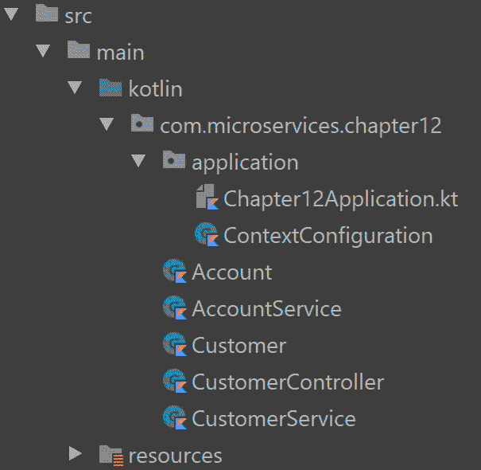
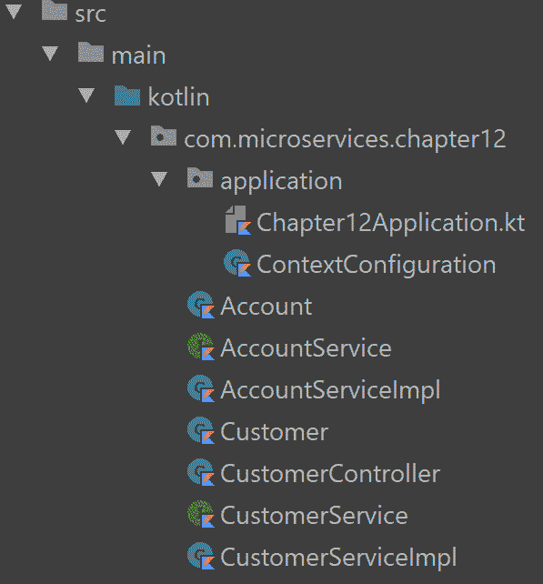
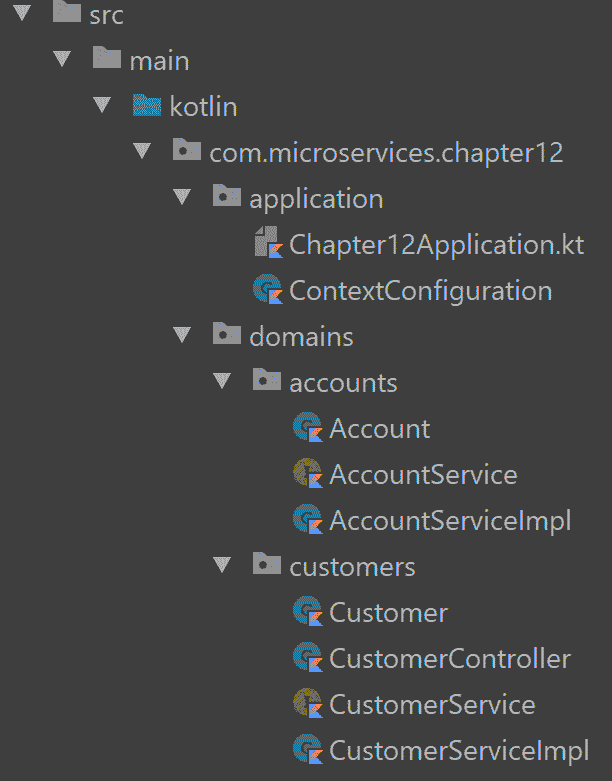
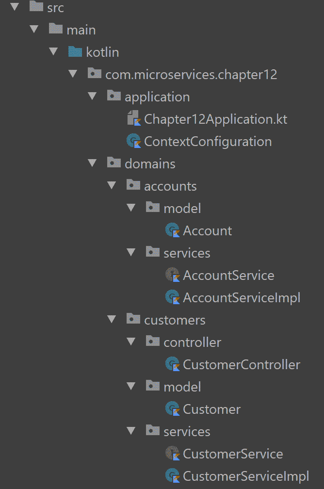
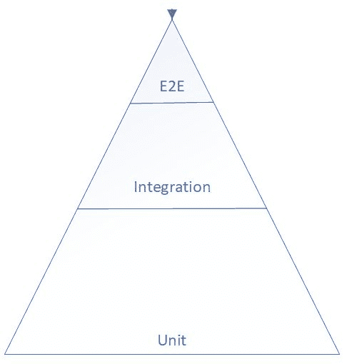

# 第一章：最佳实践

在本书的整个过程中，我们学习了许多技术和工具，这些技术和工具使我们能够使用 Spring 框架用 Kotlin 创建微服务；然而，这并不是一个简单的任务。当我们将所学应用于自己的项目时，我们总会有一系列无限多的方法可以选择，其中一些可能比其他方法更有效。

在本章中，我们将尝试学习行业最佳实践，这将使我们能够提高微服务的整体质量。在本章中，你将了解更多关于：

+   Kotlin 惯用法

+   Spring 上下文

+   分层

+   测试

+   持续集成

+   持续交付

# 使用 Kotlin 惯用法

Kotlin 提供了一套惯用法，使我们能够大幅减少样板代码的数量。样板代码指的是那些需要在多个地方包含且几乎不需要修改的代码段。在本节中，我们将学习一些最常用的惯用法。

# 推断类型

我们可能有一个返回值的函数，例如：

```java
fun lower(name : String) : String {
  val lower : String = name.toLowerCase()
  return "$name in lower case is: $lower"
}
```

在这里，我们明确指出了函数的结果类型以及我们内部使用的变量类型。

在 Kotlin 中，我们可以推断变量的类型：

```java
fun lower(name : String): String {
  val lower = name.toLowerCase()
  return "$name in lower case is: $lower"
}
```

甚至我们函数的返回类型也可以被推断出来：

```java
fun lower(name : String) = "$name in lower case is: ${name.toLowerCase()}"
```

这将非常有用，因为我们用推断类型创建的代码在改变其使用的类型时不需要更改。让我们用一个例子来澄清这一点：

```java
fun foo() : String {
  return "14"
}

fun bar() : String {
  val value : String = foo()
  return value
}
```

如果我们将我们的`foo`方法改为：

```java
fun foo() : Int {
  return 14
}
```

我们的`bar`方法需要更改：

```java
fun bar() : Int {
  val value : Int = foo()
  return value
}
```

然而，如果我们的方法声明如下：

```java
fun foo() = "14"

fun bar() = foo()
```

然后，我们可以简单地更改`foo`的结果而不影响`bar`：

```java
fun foo() = 14

fun bar() = foo()
```

# 表达式

考虑到我们有一个简单的函数用于返回某个值：

```java
fun oddOrEven(number: Int): String {
  if(number % 2 == 0)
    return "odd"
  else
    return "even"
}
```

它可以用作表达式：

```java
fun oddOrEven(number: Int): String {
  return if(number % 2 == 0)
    "odd"
  else
    "even"
}
```

当然，我们也可以推断类型：

```java
fun oddOrEven(number: Int) =
    if (number % 2 == 0)
      "odd"
    else
      "even"
```

其他语句也可以用作表达式，例如，如果我们有这个函数：

```java
fun fizzBuzz(number: Int): String {
  if (number % 15 == 0) {
    return "FizzBuzz"
  } else if (number % 3 == 0) {
    return "Fizz"
  } else if (number % 5 == 0) {
    return "Buzz"
  } else {
    return number.toString()
  }
}
```

我们可以将其转换为表达式：

```java
fun fizzBuzz(number: Int) =
    if (number % 15 == 0) {
      "FizzBuzz"
    } else if (number % 3 == 0) {
      "Fizz"
    } else if (number % 5 == 0) {
      "Buzz"
    } else {
      number.toString()
    }
```

但 Kotlin 有`when`表达式，它可以像 Java 的`switch`/`case`一样使用：

```java
fun fizzBuzz(number: Int) =
    when {
      number % 15 == 0 -> "FizzBuzz"
      number % 3 == 0 -> "Fizz"
      number % 5 == 0 -> "Buzz"
      else -> number.toString()
    }
```

这可以应用于其他表达式，例如`try`/`catch`：

```java
fun calculate(number1: Int, number2: Int) =
    try {
      number1 / number2
    } catch (ex: Exception) {
      0
    }
```

# 默认参数

Kotlin 允许我们在声明函数时指定默认参数：

```java
fun compute(number1: Int, number2: Int = 2, number3: Int = 5) = number1 * number2 * number3
```

这可以用来：

```java
println(compute(7))
println(compute(7, 2))
println(compute(7, 2, 8))
println(compute(number1 = 8, number3 = 4))
```

# Lambda

考虑到我们只是使用循环中循环的数字范围：

```java
fun printNumbers(){
  val range = 1..10
  for(i in range){
    println(i)
  }
}
```

我们可以使用 lambda 来访问它们：

```java
fun printNumbers(){
  val range = 1..10
  range.forEach { i -> println(i) }
}
```

但 lambda 可以用推断的`it`对象轻松缩短：

```java
fun printNumbers(){
  val range = 1..10
  range.forEach { println(it) }
}
```

而我们实际上不需要`it`变量，所以我们可以简化它：

```java
fun printNumbers() {
  (1..10).forEach { println(it) }
}
```

但由于我们只是打印`forEach`的元素，我们可以直接使用方法引用而不是 lambda：

```java
fun printNumbers() {
  (1..10).forEach(::println)
}
```

这些只是 Kotlin 惯用法的几个例子，但还有更多，我们强烈建议你查看官方 Kotlin 文档以查看所有内容，并保持与语言演变中出现的新增功能同步：[`kotlinlang.org/docs/reference/idioms.html`](https://kotlinlang.org/docs/reference/idioms.html)。

# 管理 Spring 上下文

Spring 应用程序上下文是我们 bean 被引用以在应用程序中使用的地方，正确管理它不是一项简单的任务。当我们有数十个 bean 被创建时，我们如何访问它们以及在哪里访问它们很重要，我们可能会陷入我们称之为不正确 bean 的情况。

在本节中，我们将讨论处理这种复杂性的方法。

# 构造函数注入

在这本书中，我们已经在示例中使用了`@Autowired`来展示我们如何请求 Spring 将 bean 注入到我们的应用程序中。

考虑以下两个服务和使用它们的控制器的示例：

```java
import org.springframework.beans.factory.annotation.Autowired
import org.springframework.stereotype.Service
import org.springframework.web.bind.annotation.*

@Service
class AccountService {
  fun getAccountsByCustomer(customerId: Int): List<Account>
      = listOf(Account(1, 125F), Account(2, 500F))
}

@Service
class CustomerService {
  @Autowired
  private lateinit var accountService: AccountService

  fun getCustomer(id: Int): Customer {
    val accounts = accountService.getAccountsByCustomer(id)
    return Customer(id, "customer$id", accounts)
  }
}

@RestController
class CustomerController {
  @Autowired
  private lateinit var customerService: CustomerService

  @GetMapping("/customer/{id}")
  fun getCustomer(@PathVariable id: Int) = customerService.getCustomer(1)
}
```

`CustomerController`使用`@AutoWired`注解注入`CustomerService` bean，而`CustomerService`也使用`@Autowired`注解注入`AccountService`。

这些服务使用了一些我们为这个示例创建的数据类：

```java
data class Account(val id : Int, val balance : Float)
data class Customer(val id : Int, val name : String, val accounts: List<Account>)
```

我们可以不用`@AutoWired`，而是将我们的服务作为类构造函数的一部分进行注入：

```java
import org.springframework.stereotype.Service
import org.springframework.web.bind.annotation.*

@Service
class AccountService {
  fun getAccountsByCustomer(customerId: Int): List<Account>
      = listOf(Account(1, 125F), Account(2, 500F))
}

@Service
class CustomerService(val accountService: AccountService) {
  fun getCustomer(id: Int): Customer {
    val accounts = accountService.getAccountsByCustomer(id)
    return Customer(id, "customer$id", accounts)
  }
}

@RestController
class CustomerController(val customerService: CustomerService) {
  @GetMapping("/customer/{id}")
  fun getCustomer(@PathVariable id: Int) = customerService.getCustomer(1)
}
```

当 Spring 创建我们的`CustomerController`时，它会检测到构造函数中的参数`CustomerService`实际上是一个存在于上下文中的 bean，因此它会在创建`CustomerController`时进行注入。当使用`AccountService`进行注入创建`CustomerService`时，也会发生完全相同的情况。

这将改善几个方面；首先，通过查看构造函数，我们可以更清楚地了解我们的组件需要什么，第二个自动注入需要一个`var`，一个可变对象，使用构造函数注入，我们可以使用`val`，一个不可变对象，之后不能被更改。

将我们的对象作为不可变对象，可以防止在创建并发应用程序（如微服务）时出现问题时。它们也可能对性能产生积极影响。

# 明确上下文配置

到目前为止，我们使用`@Component`或`@Service`来声明我们的 bean，然后在 SpringBoot 应用程序启动时，通过组件扫描将它们添加到 Spring 上下文中。然而，我们可能希望显式地使用`Configuration`类来声明我们的 bean：

```java
import org.springframework.context.annotation.Bean
import org.springframework.context.annotation.Configuration

@Configuration
class ContextConfiguration {
  @Bean
  fun accountService() = AccountService()

  @Bean
  fun customerService(accountService: AccountService) = CustomerService(accountService)

  @Bean
  fun customerController(customerService: CustomerService) = CustomerController(customerService)
}
```

由于我们现在有了构造函数注入，我们需要指定我们的 bean 声明以接收我们需要的 bean 作为参数，然后我们可以将其发送到方法的构造函数中。然后，我们可以从我们的服务中移除`@Service`，因为我们不需要创建时的组件扫描：

```java
class AccountService {
  fun getAccountsByCustomer(customerId: Int): List<Account>
      = listOf(Account(1, 125F), Account(2, 500F))
}

class CustomerService(val accountService: AccountService) {
  fun getCustomer(id: Int): Customer {
    val accounts = accountService.getAccountsByCustomer(id)
    return Customer(id, "customer$id", accounts)
  }
}
```

最后，我们可以将`application`类和`ContextConfiguration`类移动到单独的包中，这将防止组件扫描选择任何其他注解类并将其添加为 bean，为此，我们有一个显式的上下文配置，它确切地告诉我们上下文中需要什么：



应用程序包

在这个示例中，组件扫描在应用程序启动时加载我们的`ContextConfiguration`类，然后我们将创建我们的 bean。

明确的上下文允许我们避免一些可能非常复杂的情况，例如在有许多类的情况下获取正确的 bean。我们并不是说我们需要完全避免组件扫描，但我们需要谨慎使用它。

# 解耦服务

我们可能忽视的一点是，我们的控制器和服务依赖于实际实现。这意味着如果我们明天有实现上的变化，例如，从数据库迁移到不同的机制，我们需要改变使用它们的人，为了避免这种情况，我们将为它们创建接口。

首先，我们将重命名我们的`CustomerService`为`CustomerServiceImpl`，将`AccountService`重命名为`AccountServiceImpl`；然后，我们将创建我们的接口：

```java
interface AccountService {
  fun getAccountsByCustomer(customerId: Int): List<Account>
}

class AccountServiceImpl : AccountService {
  override fun getAccountsByCustomer(customerId: Int): List<Account>
      = listOf(Account(1, 125F), Account(2, 500F))
}

interface CustomerService {
  fun getCustomer(id: Int): Customer
}

class CustomerServiceImpl(val accountService: AccountService) : CustomerService {
  override fun getCustomer(id: Int): Customer {
    val accounts = accountService.getAccountsByCustomer(id)
    return Customer(id, "customer$id", accounts)
  }
}
```

现在，我们必须更改我们的`CustomerController`和`ContextConfiguration`以引用接口：

```java
import org.springframework.context.annotation.Bean
import org.springframework.context.annotation.Configuration
import org.springframework.web.bind.annotation.*

@RestController
class CustomerController(val customerService: CustomerService) {
  @GetMapping("/customer/{id}")
  fun getCustomer(@PathVariable id: Int) = customerService.getCustomer(1)
}

@Configuration
class ContextConfiguration {
  @Bean
  fun accountService() : AccountService = AccountServiceImpl()

  @Bean
  fun customerService(accountService: AccountService) : CustomerService =
    CustomerServiceImpl(accountService)

  @Bean
  fun customerController(customerService: CustomerService) = CustomerController(customerService)
}
```

现在，如果我们需要更改服务的实现，我们只需要更改我们的上下文配置；应用程序的其他部分将保持不变。这种变化的影响还包括，现在我们的服务可能不再有任何 Spring 依赖代码，如果明天我们需要将它们迁移到不同的框架，我们可能可以无缝地进行。

记住，在创建微服务时，避免耦合应该成为我们的原则之一，就像在任何我们构建的软件中一样。

# 应用程序分层

当我们的应用程序增长时，管理大量类将变得更加复杂。如果我们没有注意我们的应用程序结构，我们可能会陷入一种情况，当我们寻找它时可能找不到所需的类。

在本节中，我们将提出一个结构来分层我们的应用程序和打包类。

# 理解我们的类

让我们先看看我们项目中的当前类：



当前应用程序结构

目前，如果我们查看我们类的先前图像以了解它们可能引用的领域，我们可以将它们分为两个领域：

+   客户相关类

+   账户相关类

但如果我们查看相同的图像来了解我们的类，我们可以将它们分类到不同的组：

+   应用类

+   上下文配置类

+   数据类

+   服务接口

+   服务实现类

+   控制器类

让我们思考一下如何使用这些组和领域来安排它们。

# 领域

我们可以创建两个领域并将我们的类放入其中，我们已经有了一个`application`包，我们可以用它来存储不属于特定领域的应用程序类：



虽然这样看起来更好，但我们可能不需要有`domains`包，尽管如果我们需要向我们的结构中添加更多内容，它可能很有用。

# 分割

现在，我们可以根据它们的使用情况将它们分成基于领域的部分：



最终包

我们为以下内容创建了单独的包：

+   `model`：我们的领域模型对象，例如我们的数据类

+   `services`：我们的服务，该领域具有业务逻辑，我们可能想要将其实现拆分

+   `controllers`：我们暴露模型并使用服务的控制器

如果有更多的模型、服务或控制器类要添加，这些包中的每一个都可能增长。

将我们的应用程序分层，以便我们能够理解，对于我们的微服务至关重要，然而，没有结构是完美的，你应该决定你想要的结构方式。它可能与此结构不同，但请记住，它不仅是为了你，你的项目中的任何人都应该理解所使用的结构，如果你正在考虑将你的项目或应用程序作为**开源软件**（**OSS**）发布，你可能想在贡献文档中添加这一点。

# 有效地进行测试

测试是现代软件开发最重要的元素之一，你应该在开始设计你的微服务时就注意它。在本节中，我们将尝试通过一些建议来指导你如何有效地测试你的微服务，然而，真正理解测试需要更深入的研究，这是你应该最终覆盖的。

# 理解测试类型

你可以在微服务上执行多种测试，但以下是一些你应该了解的最常见的测试类型：

+   单元测试

+   集成测试

+   E2E 测试

这对我们很重要，因为我们应该根据它们的本质来命名我们的测试，无论是通过使用测试类名来命名测试类型，还是将引用该类型测试的包进行分类。

例如，如果我们有一个名为`CustomerControllerTest`的控制器集成测试，我们可以将其命名为`CustomerControlIntegrationTest`、`CustomerControllerIT`，或者将其留在`com.microservices.test.integration`包中。

正确分类我们的测试使我们能够轻松理解测试失败时它是哪种类型的测试。

让我们回顾一下不同的测试类型，以便我们清楚地了解如何命名或放置我们的测试。

# 单元测试

它们应该专注于测试小的单元（通常是类或复杂的算法）。它们应该在隔离和独立于其他单元的情况下进行测试。它们应该快速，不超过几秒钟，以提供即时反馈。有了这些测试，我们可以有信心重构代码，进行小改动并持续运行测试。

# 集成测试

集成测试测试我们软件的不同组件，以测试它们是否在组合中正确工作。我们的类可能单独工作，但在一起测试时可能会失败。

# E2E 测试

**端到端**（**E2E**）测试试图从最终用户的角度证明每个完整的功能都正常工作。如果我们正在运行一个暴露 API 的微服务，我们可能会像测试调用我们的外部应用程序一样测试不同的方法。

# 其他测试

还有许多其他类型的测试，但它们可能是之前定义的类型的一个子分类。以下是一些例子：

+   **系统测试**：一个集成测试，试图检查与其他系统的集成是否真正有效

+   **验收或功能测试**：这些通常是端到端测试，我们用它来验证我们的软件是否按用户指定的那样工作

+   **冒烟或健全性测试**：通常是一个集成或端到端测试，创建用来在发布软件之前验证我们应用最重要的部分是否仍然在正常工作

+   **安全测试**：通常是一个端到端或集成测试，试图证明我们的软件有多安全

# 测试金字塔

当我们测试我们的微服务时，我们可能会选择使用不同类型的测试，但软件的许多部分可以在不同类型的测试中进行测试。例如，当我们创建一个客户时，我们可能会使用创建客户的服务的**单元测试**来测试这个操作，然而，我们也可以使用**集成测试**或甚至**端到端测试**。在业界，这是一个普遍的理解，我们应该使用测试金字塔来接近测试，这个金字塔指示了我们应该有多少种类型的测试：



测试金字塔

整体思路是我们应该尽可能多地使用单元测试来进行测试，这将提供更及时的反馈。单元测试易于开发和维护，我们可以用所有不同类型的条件和场景去测试我们的单元。然而，我们也可能需要测试我们的单元是如何集成的，因此我们需要一个只测试该集成以及所有在单元中已经测试过的逻辑的集成测试。

例如，如果你对一个服务进行单元测试，覆盖所有不同的业务规则，只返回一个错误结果，在集成测试中，对于一个使用该服务的组件，你应该只测试该服务的结果或错误，而不是重复之前在单元测试中做的所有测试。最后，我们应该执行我们的端到端测试，覆盖完整的场景，而不仅仅是我们在需求中定义的场景，无论它们是如何实现的。

Google 测试博客建议采用 70/20/10 的分割：70% 单元测试，20% 集成测试，10% 端到端测试，你在为你的微服务进行测试时可以考虑这些数字。更多详情请参考以下网站：[`testing.googleblog.com/2015/04/just-say-no-to-more-end-to-end-tests.html`](https://testing.googleblog.com/2015/04/just-say-no-to-more-end-to-end-tests.html)

# 测试驱动开发

当我们创建微服务时，应该尝试进行**测试驱动开发**（**TDD**）。TDD 不仅能帮助我们确保微服务得到正确测试，还能指导我们更好地实现微服务的设计。进行 TDD 的整体思路是，首先编写一个测试，由于还没有相应的代码，这个测试将会失败，这个测试将会是红色的。然后，你只需实现最少的代码来使测试通过，测试将会变成绿色。然后，你重构代码以改进它，并重新运行测试以检查它是否仍然工作，如果不工作，就修复它。然后，你编写另一个测试，例如，为了在代码中做出另一个更改，并像之前一样重复这个循环。这些红色-绿色-重构的短周期是 TDD 之所以出色的原因。

对于微服务，你可能开始对一个可能不存在的控制器进行测试，然后实现控制器以返回数据，然后你可能为将执行控制器所需操作的服务创建一个测试，并实现该服务。接下来，你可以修改控制器，而你最初创建的测试仍然存在，以验证一切是否按定义工作。

此方法的其它显著优势在于，无论你在应用中需要什么，它都会在你需要时变得明显，而不是在需要之前就创建服务（及相关组件）；这是一种做精益软件开发的好方法。

不幸的是，在这本书中，我们无法涵盖 TDD 的全部范围，但我们鼓励你了解更多关于它的信息，并在编写自己的微服务时尝试引入这种纪律。你可以查看 Martin Fowler 博客中的这篇文章以开始了解，[`martinfowler.com/bliki/TestDrivenDevelopment.html`](https://martinfowler.com/bliki/TestDrivenDevelopment.html)，但我们真的建议你阅读 Kent Beck 的书籍，《*测试驱动开发*》。

# 行为驱动开发

当你在微服务上进行测试时，也可以使用**行为驱动开发**（**BDD**）。BDD 是一种从 TDD 中出现的软件开发过程，它结合了领域驱动设计和面向对象分析与设计的思想，为软件开发和管理团队提供共享工具和共享流程，以便在软件开发上进行协作。

思路是，你的软件需求由团队创建，包括领域专家定义应用程序应该如何行为。这是通过使用来自我们的领域模型中的通用语言的行为规范来完成的。

这是一个此类规范的示例：

```java
Story: Get a customer from the API

As a user of the API
In order to been able to get customers
I want to query them

Scenario 1: Get a customer that does exist
Given that I've the id from a customer
and the customer exists
When I query the customers API
and I use the customer id
Then I should get the customer details.

Scenario 2: Get a customer that does not exist
Given that I've the id from a customer
and the customer doest not exists
When I query the customers API
and I use the customer id
Then I should get a not found response
```

这描述了我们的需求，它将在我们构建微服务之前编写，并且由于我们将使用无处不在的语言，整个团队可以一起定义规范。然后，我们可以使用像**Cucumber**这样的工具来实际读取该规范并创建一个验证它的测试。最后，我们可以使用测试驱动开发（TDD）来编写使这些测试通过的代码，并执行我们的红-绿-重构周期。创建这样的测试将非常棒，因为我们会有每个人都可以贡献的测试，包括我们的领域专家和整个团队。

Cucumber–JVM 提供了一个用于执行行为驱动开发（BDD）测试的优秀框架，并且由于它们在 JVM 上运行，我们可以用 Kotlin 创建它们。有关更多详细信息，请参阅以下网站：[`cucumber.io/docs/reference/jvm.`](https://cucumber.io/docs/reference/jvm)

# 处理持续集成和持续交付

将持续集成和持续交付添加到我们的微服务中，将使我们能够以最快的速度以高质量交付我们的应用程序，这是我们创建微服务时应寻找的东西。在本节中，我们将讨论你在进行持续集成和持续交付时应考虑的一些实践。

# 持续集成

维护软件的正常运行并不总是容易，尤其是当你有多个开发者在同一个代码库上工作时。**持续集成**（**CI**）允许我们在使用我们的软件时最小化问题。CI 背后的主要思想是，每次我们将代码推送到我们的仓库时，我们的测试都会运行，这使我们能够知道我们刚刚做出的更改是否破坏了我们的应用程序，即使破坏的部分实际上不在我们修改的代码中。

如果有人推送了一个有缺陷的软件，这将最小化在代码库中集成软件的问题，我们可以修复它并使其恢复正常工作。这是我们应始终努力实现的目标，因为在我们仓库中有可工作的软件允许我们尽可能频繁地发布以获取反馈，而反馈正是使软件变得更好的关键。

我们可能会认为不应该在一切准备就绪之前提交软件，而这种做法已被证明是一种痛苦的方法，它将数十个更改推送到我们的代码库，以发现它们无法与其他部分集成。这是我们应避免的事情。持续集成（CI）允许我们在编写软件的同时集成软件，因此我们永远不会陷入软件已完成但实际上并未完成的情况，因为它无法与我们的代码库的其他部分一起工作。

尝试提交小的更改，并尽量频繁地提交；这允许你在不需要太多努力的情况下回退并修复直到它们集成。

# 持续交付

如果我们的持续集成（CI）已经运行良好，我们离**持续交付**（**CD**）就只差一步之遥，但有时这一步并不短。然而，我们无论如何都应该努力朝这个方向前进。我们可以在集成环境中拥有一个可工作的软件，但如果它需要几周时间才能在我们的终端可用，我们就无法为用户提供我们的应用程序应该提供的价值。

在 CD 中，我们将尝试自动化整个过程，将我们的软件从代码库中转换成实际应用，包括我们可能需要的所有步骤。这可以从创建和配置我们的基础设施开始，到我们的应用程序被测试、部署，甚至验证，以及介于这些步骤之间的一系列事情，以最少的，或非手动干预的方式进行。从开发者在我们仓库中推送更改到应用程序对最终用户可用，目标很简单。

除非对最终用户可用，否则实际上什么都没有完成。这是我们为我们的应用程序提供价值的方式，我们喜欢经常这样做，为了最佳质量，我们必须进行 CD。

# 管道

要进行适当的 CI 和 CD，我们需要一个管道工具来处理这个过程，某种能够让我们拾取我们的更改、构建我们的软件、运行测试、部署应用程序，或我们需要的任何中间步骤的工具。如果出现问题，我们的管道可以通知我们，这样我们就可以做出反应并纠正问题。

有大量的工具可以用来做管道，但我们建议您查看像 Jenkins（可能是最受欢迎的工具）这样的工具，或者像 Concourse、Bamboo Gitlab CI、Travis CI、Drone 等其他工具。

不要仅仅因为大家都这么做就去使用 Jenkins。有许多工具，其中许多工具甚至比 Jenkins 更好；尝试一些其他的工具。

# 仪表板

管道运行得很好是件好事，但如果我们的构建不工作，或者我们的测试没有运行，我们需要知道并做出反应。大多数管道提供系统来发送通知，例如发送电子邮件或在 Slack 等程序中发布，但大多数它们还提供创建仪表板的工具。

从管道中来的仪表板应该可视化我们所做的不同阶段，从构建我们的软件到启动我们的测试或部署，通常用标准工作的绿色和故障的红色进行颜色编码。如果我们有一个仪表板，我们就可以将其显示在团队可以使用的某个地方，以查看管道是否在正常工作，并在需要的地方进行修复。我们的管道仪表板也可以轻松集成到我们的应用程序监控中，以便有一个集中查看应用程序状态的全景视图。

修复损坏的构建是整个团队的责任，我们需要鼓励他们理解原因。让管道工作以使我们能够频繁且自信地向最终用户提供价值，这是我们应用程序的最佳利益。

# 摘要

在本书的整个过程中，我们介绍了微服务是什么，以及它们给我们的应用程序带来的好处。现在我们可以使用行业最佳原则来设计它们，这些原则允许我们的架构随着我们的产品的发展而发展。我们学习了 Spring 框架如何轻松地与 Kotlin 集成，提供了构建微服务的优秀工具。在这个过程中，我们意识到使用像 Kotlin 这样的现代编程语言来交付高质量软件的优势。记住，我们刚刚开始创建一些 RESTful API，这些 API 最终可以成为在 NoSQL 数据库（如 MongoDB）中使用，并具有最佳非阻塞操作性能的反应式微服务。然后，我们学习了如何创建容器和云，以及我们如何在需要时扩展我们的应用程序。

但我们需要能够给我们信心的软件，因此我们学习了我们的测试不仅保证了我们的需求得到满足，而且它们充当了任何我们团队的人都可以使用的活文档，以理解我们的应用程序。当我们的应用程序达到生产阶段时，我们可以利用我们所学的知识来拥有生产就绪的警报和监控，这些可以用来控制和管理工作负载，即使在最糟糕的情况下。最后，我们学习了如何在创建 Kotlin 中的微服务时使用行业最佳实践，以向我们的最终用户提供最佳价值。

到目前为止，你应该已经准备好使用 Kotlin 和 Spring 框架以及你所能获得的最佳技术来开始构建自己的微服务了。
