# 创建你的第一个应用

本章是 Android 的入门介绍，你将设置你的环境并专注于 Android 开发的基础知识。到本章结束时，你将获得从头创建 Android 应用并将其安装在虚拟或物理 Android 设备上所需的知识。

你将能够分析和理解 `AndroidManifest.xml` 文件的重要性，并使用 Gradle 构建工具配置你的应用并实现来自 Material Design 的 **用户界面**（**UI**）元素。

Android 是全球使用最广泛的移动电话操作系统，拥有超过三十亿活跃设备。通过学习 Android 并构建具有全球影响力的应用，这提供了巨大的贡献和影响力的机会。然而，对于初学 Android 的开发者来说，有许多问题你必须面对，以便开始学习和提高生产力。

本书将解决这些问题。在学习工具和开发环境之后，你将探索构建 Android 应用所需的基本实践。我们将涵盖开发者面临的广泛实际开发挑战，并探讨克服这些挑战的各种技术。

在本章中，你将学习如何创建一个基本的 Android 项目并向其中添加功能。你将介绍 Android Studio 的综合开发环境，并了解软件的核心区域，以便你能够高效地工作。

Android Studio 提供了应用开发的全部工具，但并不提供知识。本章将指导你有效地使用该软件来构建应用并配置 Android 项目的最常见区域。

本章将涵盖以下主题：

+   使用 Android Studio 创建 Android 项目

+   设置虚拟设备并运行你的应用

+   AndroidManifest 文件

+   使用 Gradle 构建、配置和管理应用依赖项

+   Android 应用结构

# 技术要求

本章所有练习和活动的完整代码可在 GitHub 上找到，链接为 [`packt.link/96l1D`](https://packt.link/96l1D)

# 使用 Android Studio 创建 Android 项目

为了在构建 Android 应用方面提高生产力，掌握如何使用 **Android Studio** 是至关重要的。这是 Android 开发的官方 **集成开发环境**（**IDE**），基于 JetBrains 的 **IntelliJ IDEA IDE** 构建，并由谷歌的 Android Studio 团队开发。你将在整个课程中使用它来创建应用并逐步添加更多高级功能。

Android Studio 的发展遵循 IntelliJ IDEA IDE 的发展。IDE 的基本功能当然存在，使你能够通过建议、快捷键和标准重构来优化你的代码。你将在整个课程中使用 Kotlin 编程语言来创建 Android 应用。之前创建 Android 应用的标准语言是 Java。

自从 2017 年 Google I/O（年度 Google 开发者大会）以来，这已经成为 Google 用于 Android 应用开发的优先语言。真正使 Android Studio 与其他 Android 开发环境区分开来的是，**Kotlin** 是由 IntelliJ IDEA（Android Studio 所基于的软件）的创建者 JetBrains 创建的。因此，你可以从 Kotlin 的稳定和不断发展的第一级支持中受益。

Kotlin 是为了解决 Java 在冗长性、处理空类型以及添加更多函数式编程技术等方面的不足而创建的。自从 2017 年 Kotlin 成为 Android 开发的首选语言，取代了 Java，你将在本书中使用它。

熟悉并熟悉 Android Studio 将使你在开发和构建 Android 应用时感到自信。那么，让我们开始创建你的第一个项目。

注意

Android Studio 的安装和设置在 *前言* 中有介绍。请确保你在继续之前已经完成了这些步骤。

## 练习 1.01 – 为你的应用创建 Android Studio 项目

这是创建你应用将构建其上的项目结构起点。模板驱动的方法将使你能够在短时间内创建一个基本项目，同时设置你可以用来开发应用的构建块。

要完成这个练习，请执行以下步骤：

1.  打开 Android Studio 后，你将看到一个窗口询问你是否想要创建一个新项目或打开一个现有项目。选择 **Create** **New Project**。

1.  现在，你将进入一个简单的向导驱动流程，这极大地简化了创建你的第一个 Android 项目。你将看到的下一个屏幕将为你想要应用拥有的初始设置提供大量选项：

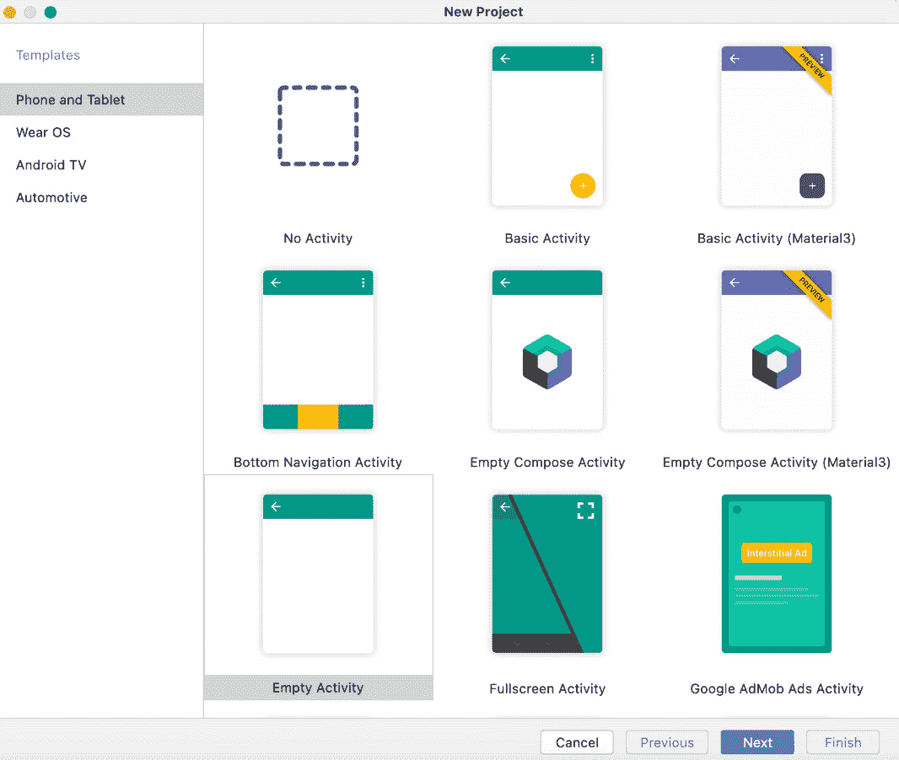

图 1.1 – 为你的应用启动项目模板

1.  欢迎来到你对 Android 开发生态系统的第一次介绍。在大多数项目类型中显示的词是 *Activity*。在 Android 中，一个 Activity 是一个页面或屏幕。你可以选择的选项都会以不同的方式创建这个初始屏幕。

描述说明了应用的第一屏将如何显示。这些是构建你应用的模板。从模板中选择 **Empty Activity** 并点击 **Next**。

项目配置屏幕如下：

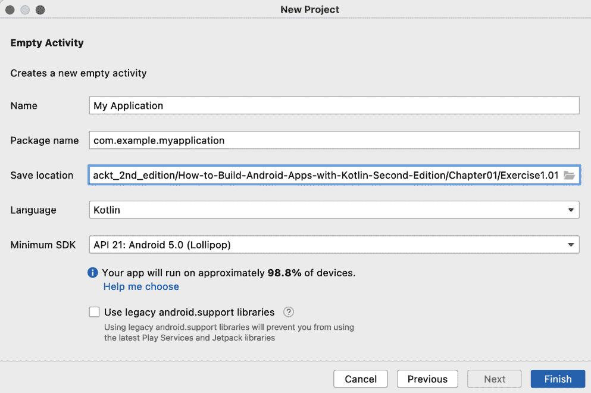

图 1.2 – 项目配置

1.  上一屏幕配置了你的应用。让我们逐一查看所有选项：

    +   (`com.sample.shop.myshop`)。如*图 1.2*所示，项目默认保存位置为`Users/MyUser/android/projects`。默认位置会根据你使用的操作系统而有所不同。默认情况下，项目将被保存在一个新文件夹中，该文件夹的名称为应用名称，空格将被删除。这会导致创建一个名为`MyApplication`的项目文件夹。请将其更改为你正在工作的`Exercise`或`Activity`，因此对于这个项目，文件夹名称应为`Exercise1.01`。

    +   **语言**: **Kotlin**是 Google 为 Android 应用开发首选的语言。

    +   **最小 SDK 版本**: 根据你下载的 Android Studio 版本不同，默认值可能与*图 1.2*中显示的相同，也可能不同。请保持这一设置不变。大多数 Android 的新特性都实现了向后兼容，因此你的应用可以在绝大多数旧设备上正常运行。然而，如果你希望针对新设备进行开发，你应该考虑提高最小 API 级别。有一个**帮助我选择**的链接，它会弹出一个对话框，解释了你可以在不同版本的 Android 上开发时使用的功能集，以及全球运行每个 Android 版本的设备百分比。

    +   **使用遗留的 android.support 库**: 请不要勾选此项。你将使用 AndroidX 库，它是为使 Android 新版本的功能向后兼容旧版本而设计的支持库的替代品，但它提供了更多功能。它还包含名为**Jetpack**的新 Android 组件，正如其名所示，它可以*提升*你的 Android 开发，并提供一系列丰富的功能，你可以在应用中使用这些功能，从而简化常见操作。

在填写完所有这些详细信息后，在一个标签页中选择`MainActivity`，在另一个标签页中选择用于屏幕的布局（`activity_main.xml`）。应用程序结构文件夹位于左侧面板中：

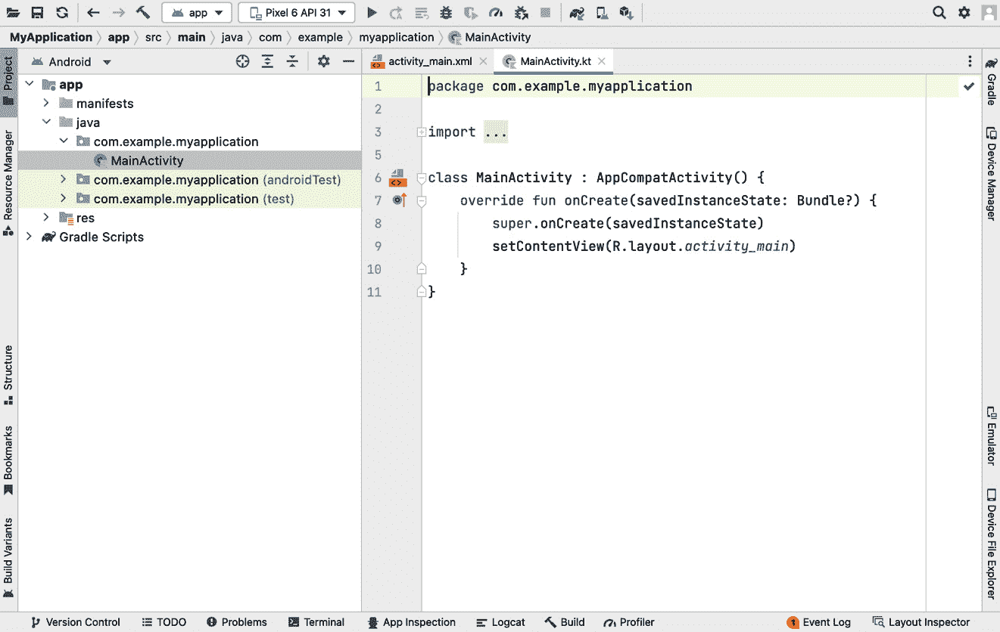

图 1.3 – Android Studio 默认项目

在这个练习中，你已经完成了使用 Android Studio 创建你的第一个 Android 应用的步骤。这种基于模板的方法向你展示了你需要为应用配置的核心选项。

在下一节中，你将设置一个虚拟设备，并看到你的应用首次运行。

# 设置虚拟设备并运行你的应用

作为安装 Android Studio 的一部分，您下载并安装了最新的 Android **软件开发工具包** (**SDK**) 组件。这些包括一个基本模拟器，您将配置它以创建一个虚拟设备来运行 Android 应用。模拟器模仿真实设备的硬件和软件特性和配置。好处是您可以在开发应用的同时在您的桌面上快速看到所做的更改。尽管虚拟设备没有真实设备的所有功能，但反馈周期通常比通过连接真实设备的步骤要快。

此外，尽管您应该确保您的应用在不同设备上按预期运行，但您可以通过下载设备配置文件来标准化它，即使您没有真实设备，如果这是您项目的要求。

您在安装 Android Studio 时将看到的（或类似的东西）如下所示：

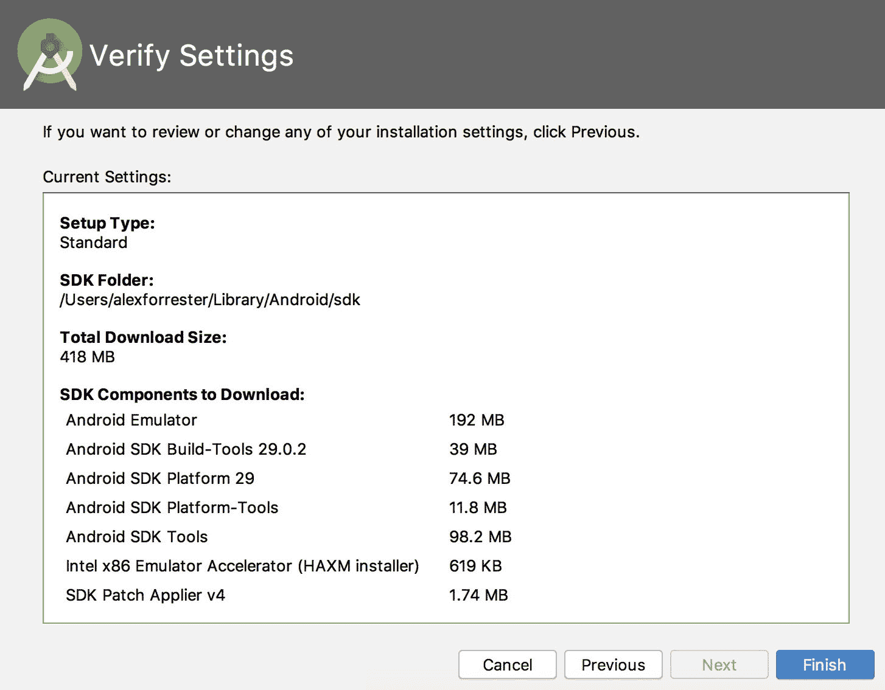

图 1.4 – SDK 组件

让我们看看已安装的 SDK 组件以及虚拟设备是如何适应的：

+   **Android 模拟器**：这是基本模拟器，我们将配置它以创建不同 Android 品牌和型号的虚拟设备。

+   **Android SDK 构建工具**：Android Studio 使用构建工具来构建您的应用。这个过程涉及编译、链接和打包您的应用，以便将其安装到设备上。

+   **Android SDK 平台**：这是您将用于开发应用的 Android 平台版本。平台指的是 API 级别。

+   **Android SDK 平台工具**：这些是您可以从命令行使用的工具，用于与您的应用交互和调试。

+   **Android SDK 工具**：与平台工具相比，这些是您主要在 Android Studio 内部使用的工具，用于完成某些任务，例如运行应用的虚拟设备以及 SDK 管理器用于下载和安装平台和其他 SDK 组件。

+   **Intel x86 模拟器加速器（HAXM 安装程序）**：如果您的操作系统提供它，这将是在您的计算机硬件级别的一个功能，您将被提示启用，这允许您的模拟器运行得更快。

+   **SDK 补丁应用器 v4**：随着 Android Studio 新版本的可用，这允许应用补丁以更新您正在运行的版本。

带着这些知识，让我们开始本章的下一个练习。

## 练习 1.02 – 设置虚拟设备并在其上运行您的应用

我们在 *练习 1.01* 中设置了一个 Android Studio 项目来创建我们的应用，即 *为您的应用创建 Android Studio 项目*，现在我们将要在虚拟设备上运行它。您也可以在真实设备上运行您的应用，但在这个练习中您将使用虚拟设备。这个过程是您在应用上工作的持续循环。一旦您实现了某个功能，您就可以根据需要验证其外观和行为。

对于这个练习，您将创建一个虚拟设备，但您应该确保在多个设备上运行您的应用以验证其外观和行为的一致性。执行以下步骤：

1.  在 Android Studio 的工具栏中，您将看到两个相邻的下拉框，其中**app**和**无****设备**被预先选中：

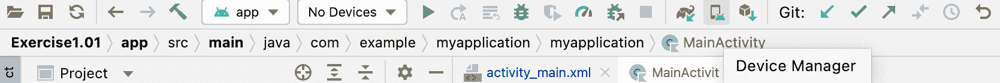

图 1.5 – Android Studio 工具栏

**app**是我们将要运行的应用的配置。由于我们尚未设置虚拟设备，它显示为**无设备**。

1.  为了创建虚拟设备，请点击如图 *图 1.5* 所示的**设备管理器**，以打开虚拟设备窗口/屏幕。此选项也可以从**工具**菜单访问：

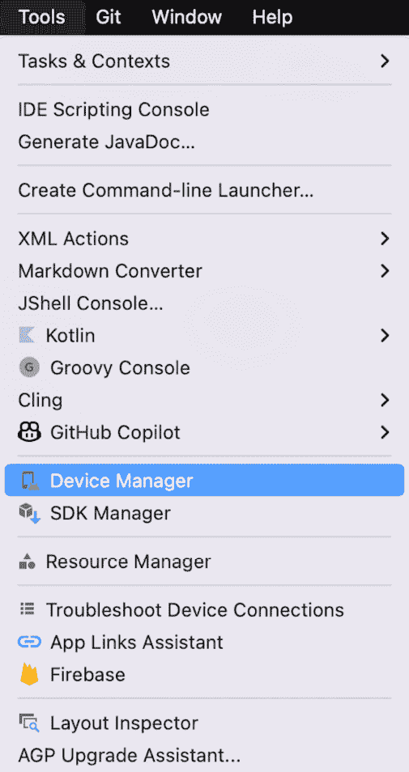

图 1.6 – 工具菜单中的设备管理器

1.  点击按钮或工具栏选项以打开**设备管理器**窗口，并点击如图 *图 1.7* 所示的**创建设备**按钮：

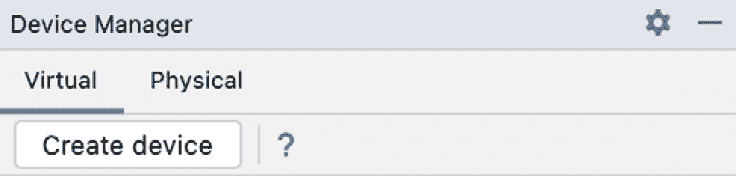

图 1.7 – 设备管理器窗口

随后，您将看到一个屏幕，如图 *图 1.8* 所示：

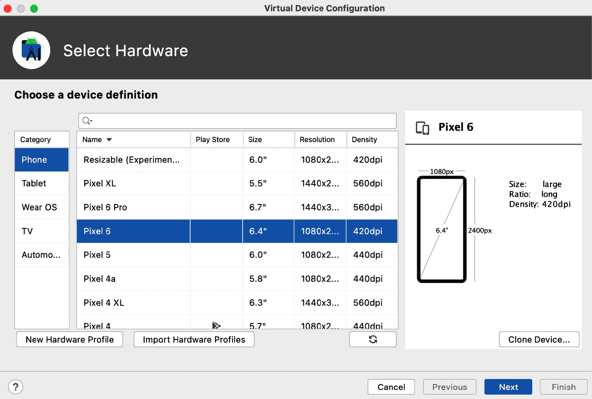

图 1.8 – 设备定义创建

1.  我们将选择**Pixel 6**设备。实际的（非虚拟）Pixel 设备系列由 Google 开发，并可以访问 Android 平台的最新版本。一旦选择，点击**下一步**按钮：

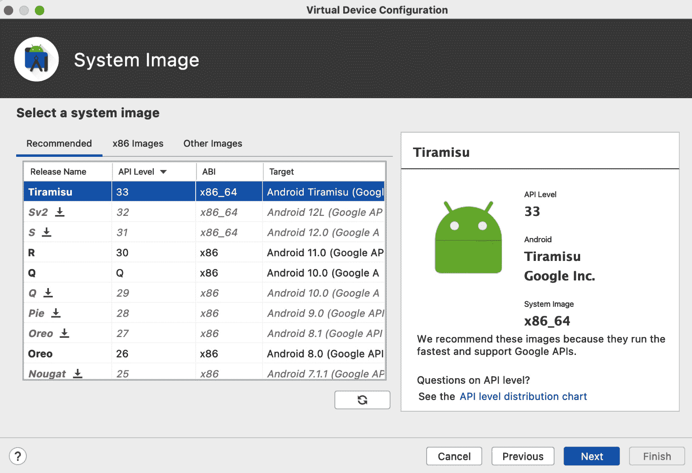

图 1.9 – 系统映像

这里显示的**Tirimasu**名称是 Android 13 的初始代码/发布名称。选择可用的最新系统映像。**目标**列也可能在名称中显示**（Google Play）**或**（Google APIs）**。Google APIs 表示系统映像预装了 Google Play 服务。

这是 Google APIs 和 Google 应用程序丰富的功能集，您的应用可以使用并与之交互。在首次运行应用时，您将看到地图和 Chrome 等应用，而不是一个普通的模拟器映像。Google Play 系统映像表示，除了 Google APIs 之外，Google Play 应用也将被安装。

1.  您应该使用 Android 平台的最新版本开发您的应用，以利用最新功能。在首次创建虚拟设备时，您将需要下载系统映像。如果**发布名称**旁边显示**下载**链接，请点击它，并等待下载完成。选择**下一步**按钮以查看您设置的虚拟设备：

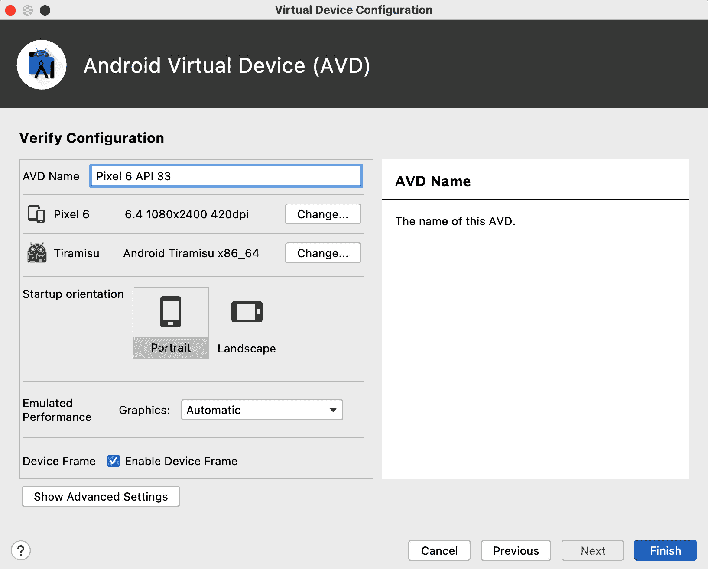

图 1.10 – 虚拟设备配置

1.  点击**完成**，您的虚拟设备将被创建。然后您将看到您的设备被突出显示：

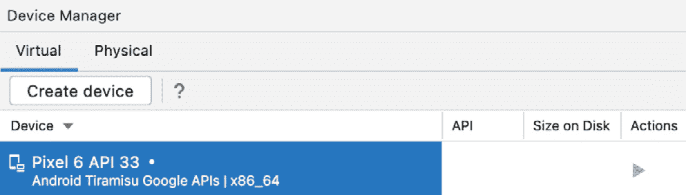

图 1.11 – 列出的虚拟设备

1.  在 **操作** 列下按下播放箭头按钮以运行虚拟设备：

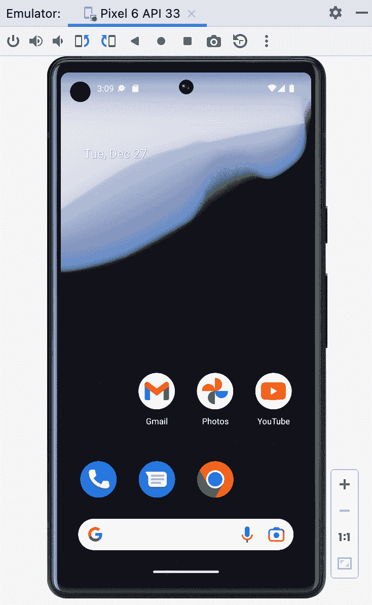

图 1.12 – 启动的虚拟设备

你将看到虚拟设备在 Android Studio 的 **模拟器** 工具窗口中运行。现在，你已经创建了虚拟设备并且它正在运行，你可以回到 Android Studio 中运行你的 app。

1.  你已设置并启动的虚拟设备将被选中。按下绿色三角形/播放按钮以启动你的 app：

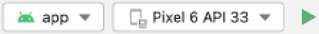

图 1.13 – App 启动配置

这将把 app 加载到模拟器中，如图 *图 1.14* 所示。

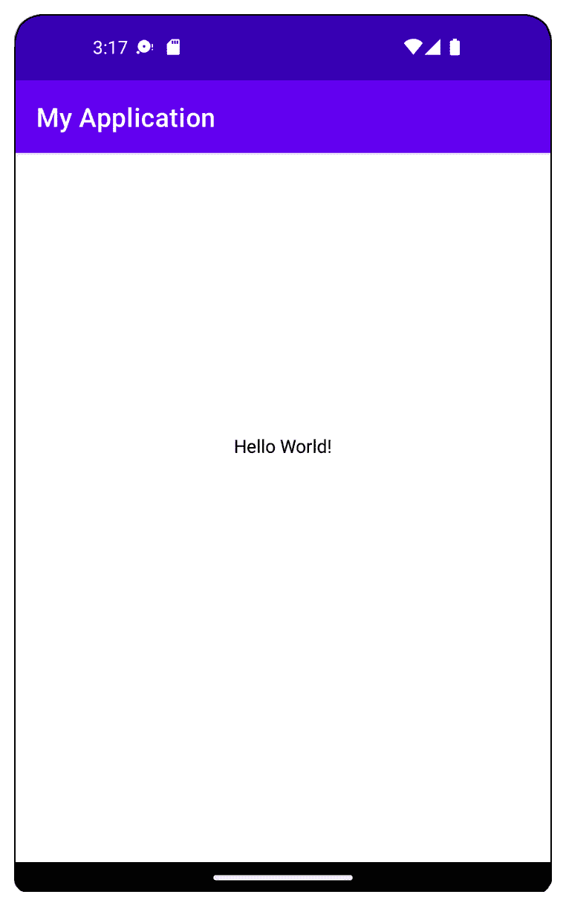

图 1.14 – 在虚拟设备上运行的 app

在这个练习中，你已经完成了创建虚拟设备并在其上运行你创建的 app 的步骤。你使用的 Android 虚拟设备管理器，允许你创建你想要为目标 app 定制的设备（或设备范围）。在虚拟设备上运行你的 app 可以让你快速地得到反馈，验证新功能开发的行为以及它是否以你期望的方式显示。

接下来，你将探索你的项目中的 `AndroidManifest.xml` 文件，它包含了你的 app 的信息和配置。

# Android manifest

你刚刚创建的 app，虽然简单，但包含了你将在所有项目中使用的核心构建块。app 由 `AndroidManifest.xml` 文件驱动，这是一个详细说明 app 内容的 manifest 文件。它位于 `app` | `manifests` | `AndroidManifest.xml`：

```swift
<?xml version="1.0" encoding="utf-8"?>
<manifest xmlns:android=
    "http://schemas.android.com/apk/res/android"
    xmlns:tools="http://schemas.android.com/tools">
    <application
        android:allowBackup="true"
        android:dataExtractionRules="@xml/data_extraction_
              rules"
        android:fullBackupContent="@xml/backup_rules"
        android:icon="@mipmap/ic_launcher"
        android:label="@string/app_name"
        android:roundIcon="@mipmap/ic_launcher_round"
        android:supportsRtl="true"
        android:theme="@style/Theme.MyApplication"
        tools:targetApi="31">
        <activity
            android:name=".MainActivity"
            android:exported="true">
            <intent-filter>
                <action android:name="android.intent.action.
                  MAIN" />
                <category android:name="android.intent.
                  category.LAUNCHER" />
            </intent-filter>
        </activity>
    </application>
</manifest>
```

从一般意义上讲，一个典型的 manifest 文件是一个顶级文件，它描述了包含的文件或其他数据以及相关的元数据，形成一个组或单元。Android manifest 将这个概念应用到你的 Android app 上，作为一个 XML 文件。

每个 Android app 都有一个应用程序类，允许你配置 app。在 `<application>` 元素打开后，你定义你的 app 的组件。由于我们刚刚创建了 app，它只包含以下代码中显示的第一个屏幕：

```swift
<activity android:name=".MainActivity">
```

下一个指定的子 XML 节点如下：

```swift
<intent-filter>
```

Android 使用意图作为与 apps 和系统组件交互的机制。意图被发送，意图过滤器注册了你的 app 对这些意图的反应能力。`<android.intent.action.MAIN>` 是你的 app 的主入口点，它在 `.MainActivity` 的封装 XML 中出现，指定当 app 启动时将启动此屏幕。`Android.intent.category.LAUNCHER` 表示你的 app 将出现在用户的设备启动器中。

由于您是从模板创建的应用程序，因此它有一个基本的清单，该清单将通过`Activity`组件启动应用程序并在启动时显示初始屏幕。根据您想添加到应用程序中的其他功能，您可能需要在 Android 清单文件中添加权限。

权限分为三个不同的类别：正常、签名和危险：

+   **正常**：这些权限包括访问网络状态、Wi-Fi、互联网和蓝牙。这些通常在运行时无需请求用户同意即可允许。

+   **签名**：这些权限由必须使用相同证书签名的同一组应用程序共享。这意味着这些应用程序可以自由共享数据，但其他应用程序无法访问。

+   **危险**：这些权限围绕用户及其隐私，例如发送短信、访问账户和位置，以及读写文件系统和联系人。

这些权限必须在清单中列出，并且在危险权限的情况下，从 Android Marshmallow API 23（Android 6 Marshmallow）开始，您还必须请求用户在运行时授予这些权限。

在下一个练习中，我们将配置 Android 清单。有关此文件的详细文档，请参阅[`developer.android.com/guide/topics/manifest/manifest-intro`](https://developer.android.com/guide/topics/manifest/manifest-intro)。

## 练习 1.03 – 配置 Android 清单互联网权限

大多数应用程序所需的关键权限是访问互联网。这默认情况下并未添加。在这个练习中，我们将修复这个问题，并在过程中加载一个`WebView`，这使应用程序能够显示网页。这种情况在 Android 应用程序开发中非常常见，因为大多数商业应用程序都会显示隐私政策、条款和条件等。由于这些文档可能对所有平台都适用，通常的显示方式是加载一个网页。为此，请执行以下步骤：

1.  创建一个新的 Android Studio 项目，就像在*练习 1.01*中为*您的应用程序*创建 Android Studio 项目一样。

1.  切换到`MainActivity`类所在的标签页。从主项目窗口，它位于`app` | `java` | `com` | `example` | `myapplication`。

您可以通过选择**视图** | **工具窗口** | **项目**来打开**工具**窗口，从而更改项目窗口显示的内容。这将选择**项目**视图。**项目**窗口顶部的下拉选项允许您更改查看项目的方式，最常用的显示方式是**项目**和**Android**：

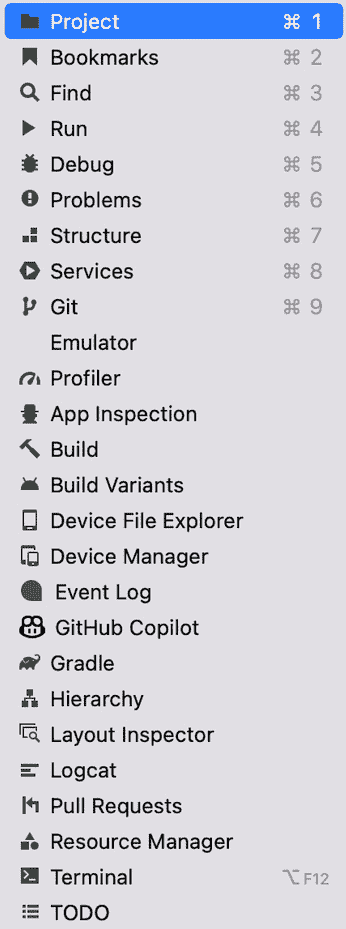

图 1.15 – 工具窗口下拉菜单

在打开`MainActivity`类时，您会看到以下内容或类似内容：

```swift
package com.example.myapplication
import androidx.appcompat.app.AppCompatActivity
import android.os.Bundle
class MainActivity : AppCompatActivity() {
    override fun onCreate(savedInstanceState: Bundle?)
    {
        super.onCreate(savedInstanceState)
        setContentView(R.layout.activity_main)
    }
}
```

你将在本章下一节中更详细地检查这个文件的内容，但到目前为止，你只需要知道 `setContentView(R.layout.activity_main)` 语句设置了你在虚拟设备中首次运行应用时看到的 UI 布局。

1.  使用以下代码将其更改为以下内容：

    ```swift
    package com.example.myapplication
    import androidx.appcompat.app.AppCompatActivity
    import android.os.Bundle
    import android.webkit.WebView
    class MainActivity : AppCompatActivity() {
        override fun onCreate(savedInstanceState: Bundle?){
            super.onCreate(savedInstanceState)
            val webView = WebView(this)
            webView.settings.javaScriptEnabled = true
            setContentView(webView)
            webView.loadUrl("https://www.google.com")
        }
    }
    ```

因此，你正在用 `WebView` 替换布局文件。`val` 关键字是一个只读属性引用，一旦设置后就不能更改。JavaScript 需要在 `WebView` 中启用才能执行 JavaScript。

注意

我们没有设置类型，但 Kotlin 有类型推断，所以如果可能的话，它会推断类型。因此，使用 `val webView: WebView = WebView(this)` 明确指定类型是不必要的。根据你过去使用的编程语言，定义参数名和类型的顺序可能或可能不熟悉。Kotlin 遵循 Pascal 语法，即名称后跟类型。

1.  现在，运行应用，文本将如截图所示出现：

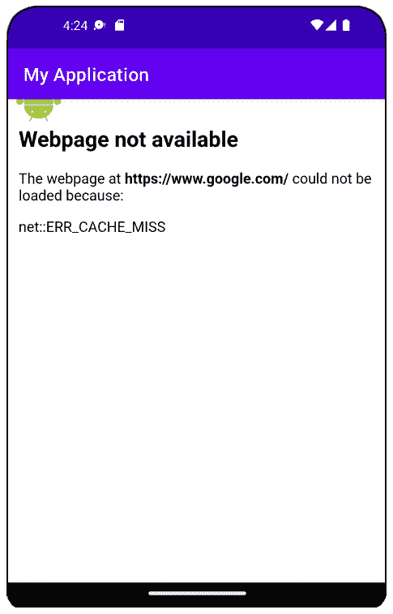

图 1.16 – 没有互联网权限错误信息

1.  这个错误发生是因为你的 `AndroidManifest.xml` 文件中没有添加 `INTERNET` 权限。（如果你收到 `net::ERR_CLEARTEXT_NOT_PERMITTED` 错误，这是因为你正在加载到 `WebView` 中的 URL 不是 HTTPS，并且从 API 级别 28 开始，非 HTTPS 流量被禁用，Android 9.0 Pie 及以上版本）。

1.  让我们通过向清单中添加 `INTERNET` 权限来修复这个问题。打开 Android 清单文件，并在 `<application>` 标签上方添加以下内容：

    ```swift
    <uses-permission android:name="android.permission.INTERNET" />
    ```

你可以在这里找到添加了权限的完整 Android 清单文件：[`packt.link/smzpl`](https://packt.link/smzpl)

在再次运行应用之前，从虚拟设备中卸载应用。你需要这样做，因为应用权限有时可能会被缓存。

通过长按应用图标并选择出现的 **App Info** 选项，然后按下带有 **Uninstall** 文字的 Bin 图标来完成此操作。或者，长按应用图标，然后将其拖动到屏幕右上角的 **Uninstall** 文字旁边的 Bin 图标。

1.  再次安装应用，并查看网页出现在 `WebView` 中：

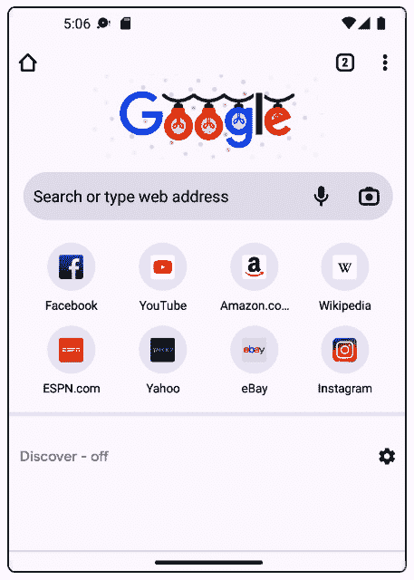

图 1.17 – 显示 WebView 的应用

在这个例子中，你学习了如何向清单文件中添加权限。Android 清单可以被视为你的应用的目录。它列出了你的应用使用的所有组件和权限。正如你从从启动器启动应用中看到的，它还提供了进入你应用的入口点。

在下一节中，你将探索 Android 构建系统，它使用 Gradle 构建工具来让你的应用运行起来。

# 使用 Gradle 构建、配置和管理应用依赖项

在创建此项目的过程中，你主要使用了 Android 平台 SDK。当你安装 Android Studio 时，下载了必要的 Android 库。然而，这些并不是创建你的应用所使用的唯一库。为了配置和构建你的 Android 项目或应用，使用了一个名为 **Gradle** 的构建工具。

Gradle 是 Android Studio 用于构建你的应用的多用途构建工具。默认情况下，Android Studio 使用 Groovy，一种动态类型的 **Java 虚拟机** (**JVM**) 语言来配置构建过程，并允许轻松管理依赖项，因此你可以将库添加到你的项目中并指定版本。

Android Studio 也可以配置为使用 Kotlin 配置构建，但由于默认语言是 Groovy，你将使用这个。存储这些构建和配置信息的文件被命名为 `build.gradle`。

当你首次创建你的应用时，有两个 `build.gradle` 文件，一个位于项目的根/顶级目录，另一个位于应用的 `module` 文件夹中，专门针对你的应用。

## 项目级别的 `build.gradle` 文件

现在我们来看看项目级别的 `build.gradle` 文件。这是你设置所有根项目设置的地方，这些设置可以应用于子模块/项目：

```swift
plugins {
    id 'com.android.application' version '7.4.2' apply
    false
    id 'com.android.library' version '7.4.2' apply false
    id 'org.jetbrains.kotlin.android' version '1.8.0'
    apply false
}
```

Gradle 依赖于插件系统，因此你可以编写自己的插件，执行任务或一系列任务，并将其插入到你的构建管道中。前面列出的三个插件执行以下操作：

+   `com.android.application`: 这添加了对创建 Android 应用的支持

+   `com.android.library`: 这使得子项目/模块能够成为 Android 库

+   `org.jetbrains.kotlin.android`: 这为项目中的 Kotlin 提供了集成和语言支持

`apply false` 语句仅使这些插件应用于子项目/模块，而不是项目的根级别。`version '7.3.1'` 指定了插件版本，该版本应用于所有子项目/模块。

## 应用级别的 `build.gradle` 文件

`build.gradle` 应用特定于你的项目配置：

```swift
plugins {
    id 'com.android.application'
    id 'org.jetbrains.kotlin.android'
}
android {
    namespace 'com.example.myapplication'
    compileSdk 33
    defaultConfig {
        applicationId "com.example.myapplication"
        minSdk 24
        targetSdk 33
        versionCode 1
        versionName "1.0"
        testInstrumentationRunner
            "androidx.test.runner.AndroidJUnitRunner"}
    buildTypes {
        release {
            minifyEnabled false
            proguardFiles getDefaultProguardFile('proguard-
               android-optimize.txt'), 'proguard-rules.pro'
        }
    }
    compileOptions {
        sourceCompatibility JavaVersion.VERSION_1_8
        targetCompatibility JavaVersion.VERSION_1_8
    }
    kotlinOptions {
        jvmTarget = '1.8'
    }
}
dependencies {…}
```

根 `build.gradle` 文件中详细说明的 Android 和 Kotlin 插件，在这里通过 `plugins` 行的 ID 应用到你的项目中。

由 `com.android.application` 插件提供的 `android` 块，是你配置 Android 特定配置设置的地方：

+   `namespace`: 这是从创建项目时指定的包名设置的。它将用于生成构建和资源标识符。

+   `compileSdk`: 这用于定义应用编译时使用的 API 级别，应用可以使用此 API 及其以下级别的功能。

+   `defaultConfig`: 这是你的应用的基本配置。

+   `applicationId`: 这设置为你的应用的包名，是用于在 Google Play 上唯一标识你的应用的标识符。如果需要，它可以被更改以与包名不同。

+   `minSdk`：这是你的应用程序支持的最低 API 级别。这将过滤掉低于此 API 级别的设备，使你的应用程序不会在 Google Play 中显示。

+   `targetSdk`：这是你针对的 API 级别。这是你的构建应用程序打算工作和已测试的 API 级别。

+   `versionCode`：这指定了你的应用程序的版本代码。每次需要更新应用程序时，版本代码都需要增加一个或多个。

+   `versionName`：这是一个用户友好的版本名称，通常遵循 *X.Y.Z* 的语义版本控制，其中 *X* 是主版本，*Y* 是次要版本，*Z* 是修补版本，例如，*1.0.3*。

+   `testInstrumentationRunner`：这是用于你的 UI 测试的测试运行器。

+   `buildTypes`：在 `buildTypes` 下，添加了一个配置你的应用程序以创建 `release` 构建的发布版本。如果将 `minifyEnabled` 设置为 `true`，则将通过删除任何未使用的代码以及混淆你的应用程序来缩小应用程序的大小。这个混淆步骤将源代码引用的名称更改为如 `a.b.c()` 这样的值。这使得你的代码更不容易被逆向工程，并进一步减少了构建应用程序的大小。

+   `compileOptions`：这是 Java 源代码的语言级别（`sourceCompatibility`）和字节码（`targetCompatibility`）。

+   `kotlinOptions`：这是 `kotlin gradle` 插件应该使用的 `jvm` 库。

`dependencies` 块指定了你的应用程序在 Android 平台 SDK 之上使用的库，如下所示（带有注释）：

```swift
    dependencies {
    // Kotlin extensions, jetpack component with Android
       Kotlin language features
    implementation 'androidx.core:core-ktx:1.7.0'
    // Provides backwards compatible support libraries and
       jetpack components
    implementation 'androidx.appcompat:appcompat:1.6.1'
    // Material design components to theme and style your
       app
    implementation
        'com.google.android.material:material:1.8.0'
    // The ConstraintLayout ViewGroup updated separately
       from main Android sources
    implementation
        'androidx.constraintlayout:constraintlayout:2.1.4'
    // Standard Test library for unit tests
    testImplementation 'junit:junit:4.13.2'
    // UI Test runner
    androidTestImplementation
        'androidx.test.ext:junit:1.1.5'
    // Library for creating Android UI tests
    androidTestImplementation
        'androidx.test.espresso:espresso-core:3.5.1'
    }
```

依赖关系遵循 Maven 的 `groupId`、`artifactId` 和 `versionId`，它们之间用 `:` 分隔。因此，例如，之前指定的兼容支持库显示如下：

```swift
'androidx.appcompat:appcompat:1.6.1'
```

`groupId` 是 `android.appcompat`，`artifactId` 是 `appcompat`，`versionId` 是 `1.5.1`。构建系统会定位并下载这些依赖关系，从 `settings.gradle` 文件中详细说明的 `repositories` 块构建应用程序。

注意

在之前的代码部分以及本章节和其他章节的后续部分中指定的依赖版本可能会发生变化，并且会随着时间的推移而更新，因此当你创建这些项目时，它们可能更高。

添加这些库的 `implementation` 表示法意味着它们的内部依赖关系不会暴露给你的应用程序，这使得编译更快。

在这里，`androidx` 组件被添加为依赖项，而不是在 Android 平台源中。这样，它们可以独立于 Android 版本进行更新。`androidx` 包含了 Android Jetpack 库的套件和重新打包的支持库。

下一个要检查的 Gradle 文件是 `settings.gradle`，它最初看起来像这样：

```swift
pluginManagement {
    repositories {
        google()
        mavenCentral()
        gradlePluginPortal()
    }
}
dependencyResolutionManagement {
repositoriesMode.set(RepositoriesMode.FAIL_ON_PROJECT_REPOS)
    repositories {
        google()
        mavenCentral()
    }
}
rootProject.name = "My Application"
include ':app'
```

在首次使用 Android Studio 创建项目时，将只有一个模块，即 `app`，但当你添加更多功能时，你可以添加新的模块，这些模块专门用于包含一个功能而不是将其打包在主 `app` 模块中。

这些被称为**功能模块**，你可以通过其他类型的模块来补充它们，例如共享模块，这些模块被所有其他模块使用，如网络模块。此文件还包含插件和依赖项的存储库，分别用于插件和依赖项的单独块。

设置`RepositoriesMode.FAIL_ON_PROJECT_REPOS`的值确保所有依赖项存储库都定义在这里；否则，将触发构建错误。

## 练习 1.04 – 探索 Material Design 如何用于应用主题

在这个练习中，你将了解谷歌的新设计语言**Material Design**，并使用它来加载一个 Material Design 主题的应用。Material Design 是由谷歌创建的一种设计语言，它基于现实世界的效果（如光照、深度、阴影和动画）添加了丰富的 UI 元素。执行以下步骤以完成练习：

1.  创建一个新的 Android Studio 项目，就像你在*练习 1.01*，*为你的应用创建 Android Studio 项目*时做的那样。

1.  首先，查看`dependencies`块并找到 Material Design 依赖项：

    ```swift
    implementation 
    'com.google.android.material:material:1.8.0'
    ```

1.  接下来，打开位于`app` | `src` | `main` | `res` | `values` | `themes.xml`的`themes.xml`文件：`values-night`文件夹中也有一个`themes.xml`文件，用于暗黑模式，我们将在稍后探讨：

    ```swift
    <resources xmlns:tools="http://schemas.android.com/tools">
        <!-- Base application theme. -->
        <style name="Theme.MyApplication" parent="Theme.
            MaterialComponents.DayNight.DarkActionBar">
            <!-- Primary brand color. -->
            <item name="colorPrimary">@color/purple_500
                </item>
            <item name="colorPrimaryVariant">@color/
                purple_700</item>
            <item name="colorOnPrimary">@color/white</item>
            <!-- Secondary brand color. -->
            <item name="colorSecondary">@color/teal_200
                </item>
            <item name="colorSecondaryVariant">@color/
                teal_700</item>
            <item name="colorOnSecondary">@color/black</item>
            <!-- Status bar color. -->
            <item name="android:statusBarColor">?attr/
                colorPrimaryVariant</item>
            <!-- Customize your theme here. -->
        </style>
    </resources>
    ```

注意`Theme.MyApplication`的父主题是`Theme.MaterialComponents.DayNight.DarkActionBar`。

在`dependencies`块中添加的 Material Design 依赖项被用来应用应用的主题。与它们之前使用的`AppCompat`主题相比，一个关键的区别是能够为应用的主色和辅助色提供变体。

例如，`colorPrimaryVariant`允许你为主色添加色调，这可以是比`colorPrimary`颜色更亮或更暗。此外，你还可以使用`colorOnPrimary`在你的应用前景中为视图元素的颜色进行样式设置。

一起，这些为应用的主题带来了统一的品牌形象。要看到这种效果，请进行以下更改以颠倒主色和辅助色：

```swift
<resources xmlns:tools="http://schemas.android.com/tools">
    <!-- Base application theme. -->
    <style name="Theme.MyApplication" parent="Theme.
        MaterialComponents.DayNight.DarkActionBar">
        <!-- Primary brand color. -->
        <item name="colorPrimary">@color/teal_200</item>
        <item name="colorPrimaryVariant">@color/
            teal_700</item>
        <item name="colorOnPrimary">@color/white</item>
        <!-- Secondary brand color. -->
        <item name="colorSecondary">@color/purple_200
            </item>
        <item name="colorSecondaryVariant">@color/
            purple_700</item>
        <item name="colorOnSecondary">@color/black</item>
        <!-- Status bar color. -->
        <item name="android:statusBarColor">?attr/
            colorPrimaryVariant</item>
        <!-- Customize your theme here. -->
    </style>
</resources>
```

1.  现在运行应用，你会看到应用的主题有所不同。动作栏和状态栏的背景色与默认的 Material 主题应用形成对比，如图*图 1.18*所示：

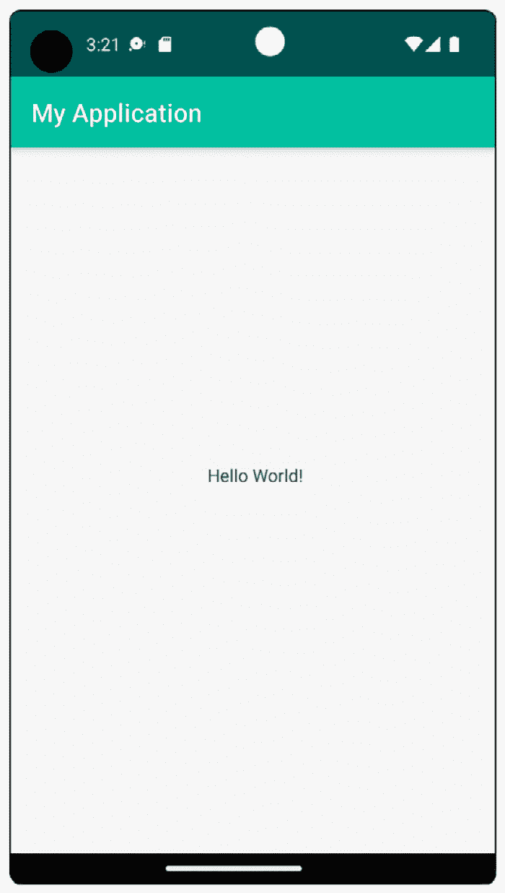

图 1.18 – 主色和辅助色颠倒的应用

在这个练习中，你学习了如何使用 Material Design 来为主题应用。由于你目前只显示`TextView`在屏幕上，所以不清楚材料设计提供了哪些好处，但当你开始使用更多的 Material UI 设计小部件时，这将会改变。

现在你已经了解了项目的构建和配置方式，在下一节中，你将详细探索项目结构，了解它是如何创建的，并熟悉开发环境的核心区域。

# 安卓应用结构

现在我们已经介绍了 Gradle 构建工具的工作原理，我们将探索项目的其余部分。最简单的方法是检查应用文件夹结构。在 Android Studio 的左上角有一个工具窗口，称为 **项目**，它允许您浏览应用的内容。

默认情况下，当您的 Android 项目首次创建时，它被设置为 **打开**/**选中**。当您选择它时，您将看到一个类似于 *图 1**.19* 中的截图的视图。如果您在屏幕左侧看不到任何窗口栏，请转到顶部工具栏并选择 **视图** | **外观** | **工具窗口栏**，并确保它被勾选。

浏览项目有多种不同的选项，但让我们看看 `app` 文件夹结构。

这里是这些文件的概述，其中包含对最重要的文件更详细的说明。打开后，您将看到它包含以下文件夹结构：

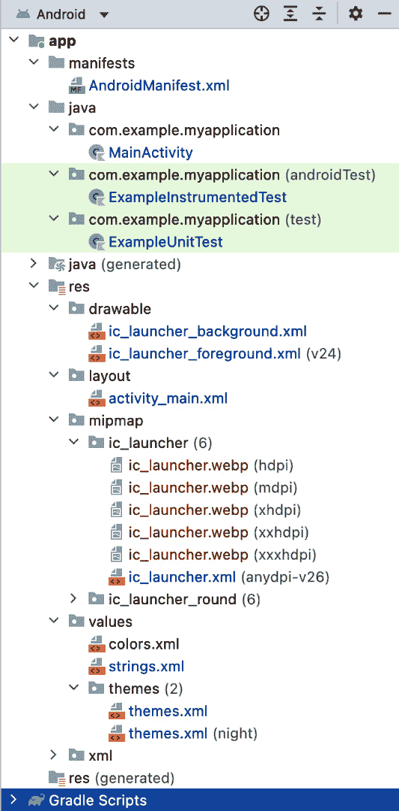

图 1.19 – 应用中文件和文件夹结构的概述

Kotlin 文件（`MainActivity`），您指定在应用启动时运行，如下所示：

```swift
package com.example.myapplication
import androidx.appcompat.app.AppCompatActivity
import android.os.Bundle
class MainActivity : AppCompatActivity() {
    override fun onCreate(savedInstanceState: Bundle?) {
        super.onCreate(savedInstanceState)
        setContentView(R.layout.activity_main)
    }
}
```

`import` 语句包括库和此活动使用的源。`class MainActivity : AppCompatActivity()` 类头创建了一个继承自 `AppCompatActivity` 的类。在 Kotlin 中，冒号 `:` 字符用于从类派生（也称为继承）和实现接口。

`MainActivity` 继承自 `androidx.appcompat.app.AppCompatActivity`，这是一个向后兼容的活动，旨在使您的应用能够在旧设备上运行。

Android 活动有许多回调函数，您可以在活动的不同生命周期点进行重写。这被称为 `onCreate` 函数，如下所示：

```swift
override fun onCreate(savedInstanceState: Bundle?)
```

Kotlin 中的 `override` 关键字指定您正在为父类中定义的函数提供特定的实现。`fun` 关键字（正如您可能已经猜到的）代表 *函数*。`savedInstanceState: Bundle?` 参数是 Android 用于恢复先前保存状态的机制。对于这个简单的活动，您没有存储任何状态，因此此值将为 `null`。跟随类型的问号 `?` 声明此类型可以是 `null`。

`super.onCreate(savedInstanceState)` 这一行调用基类的重写方法，最终，`setContentView(R.layout.activity_main)` 加载我们想要在活动中显示的布局；否则，如果没有定义布局，它将显示为空白屏幕。

让我们看看文件夹结构中存在的其他一些文件（*图 1**.19*）：

+   `ExampleInstrumentedTest`：这是一个示例 UI 测试。您可以通过在应用运行时运行测试来检查和验证应用的流程和结构。

+   `ExampleUnitTest`：这是一个示例单元测试。创建 Android 应用的一个基本部分是编写单元测试来验证源代码是否按预期工作。

+   `ic_launcher_background.xml`和`ic_launcher_foreground.xml`：这两个文件一起构成了你的应用启动器的矢量格式图标，它将被 Android API 26（奥利奥）及更高版本的`ic_launcher.xml`启动器图标文件使用。

+   `activity_main.xml`：这是 Android Studio 在创建项目时创建的布局文件。它被`MainActivity`用于绘制初始屏幕内容，当应用运行时显示：

    ```swift
    <?xml version="1.0" encoding="utf-8"?>
    <androidx.constraintlayout.widget.ConstraintLayout xmlns:android=
      "http://schemas.android.com/apk/res/android"
        xmlns:app="http://schemas.android.com/apk/res-auto"
        xmlns:tools="http://schemas.android.com/tools"
        android:layout_width="match_parent"
        android:layout_height="match_parent"
        tools:context=".MainActivity">
        <TextView
            android:layout_width="wrap_content"
            android:layout_height="wrap_content"
            android:text="Hello World!"
            app:layout_constraintBottom_toBottomOf="parent"
            app:layout_constraintEnd_toEndOf="parent"
            app:layout_constraintStart_toStartOf="parent"
            app:layout_constraintTop_toTopOf="parent" />
    </androidx.constraintlayout.widget.ConstraintLayout>
    ```

在 Android 中，可以使用 XML 或 Jetpack Compose 创建屏幕显示，Jetpack Compose 使用声明式 API 动态构建 UI。你将在*第九章*中学习 Jetpack Compose。对于 XML，文档从 XML 头开始，然后是顶级`ViewGroup`（在这里是`ConstraintLayout`），然后是一个或多个嵌套的`Views`和`ViewGroups`。

`ConstraintLayout` `ViewGroup`允许在屏幕上非常精确地定位视图，通过父视图和兄弟视图、指南和障碍物来约束视图。有关`ConstraintLayout`的详细文档可以在[`developer.android.com/reference/androidx/constraintlayout/widget/ConstraintLayout`](https://developer.android.com/reference/androidx/constraintlayout/widget/ConstraintLayout)找到。

`TextView`，目前是`ConstraintLayout`的唯一子视图，通过`android:text`属性在屏幕上显示文本。视图的水平定位是通过将视图约束到父视图的起始和结束位置来完成的，这样当两个约束都应用时，视图在水平方向上居中。

从起始到结束，从左到右的语言（`ltr`）是从左到右阅读的，而`non ltr`语言是从右到左阅读的。通过将视图约束到其父视图的顶部和底部，视图在垂直方向上居中。应用所有四个约束的结果是在`ConstraintLayout`中水平和垂直居中`TextView`。

在`ConstraintLayout`标签中有三个 XML 命名空间：

+   `xmlns:android`：这指的是 Android 特定的命名空间，它用于主 Android SDK 中的所有属性和值。

+   `xmlns:app`：这个命名空间用于不在 Android SDK 中的任何内容。因此，在这种情况下，`ConstraintLayout`不是 Android SDK 的一部分，而是作为一个库添加的。

+   `xmnls:tools`：这指的是用于向 XML 添加元数据的命名空间，它指示布局的使用位置（`tools:context=".MainActivity"`）。它还用于显示预览中可见的示例文本。

Android XML 布局文件最重要的两个属性是`android:layout_width`和`android:layout_height`。

这些可以设置为绝对值，通常是密度无关像素（称为 `dip` 或 `dp`），它们将像素大小缩放到不同密度设备上大致等效。然而，更常见的是，这些属性被设置为 `wrap_content` 或 `match_parent` 值。`wrap_content` 将根据需要的大小仅包含其内容。`match_parent` 将根据其父元素的大小进行设置。

有其他 `ViewGroups` 可以用来创建布局。例如，`LinearLayout` 垂直或水平排列视图，`FrameLayout` 通常用于显示单个子视图，而 `RelativeLayout` 是 `ConstraintLayout` 的一个更简单版本，它根据父视图和兄弟视图的位置排列视图。

`ic_launcher.webp` 文件是具有每个不同密度设备图标的 `.webp` 启动器图标。这种图像格式由 Google 创建，与 `.png` 图像相比具有更高的压缩率。由于我们使用的 Android 最小版本是 API 21：Android 5.0（Jelly Bean），因此这些 `.webp` 图像被包含在内，因为启动器矢量格式的支持直到 Android API 26（Oreo）才被引入。

`ic_launcher.xml` 文件使用矢量文件（`ic_launcher_background.xml` 和 `ic_launcher_foreground.xml`）在 Android API 26（Oreo）及更高版本中缩放到不同的密度设备。

注意

要针对 Android 平台上的不同密度设备，除了每个 `ic_launcher.png` 图标外，你还会在括号中看到它针对的密度。由于设备的像素密度差异很大，Google 创建了密度桶，以便根据设备每英寸的像素数选择正确的图像进行显示。

不同的密度限定符及其细节如下：

+   `nodpi`：密度无关资源

+   `ldpi`：120 dpi 的低密度屏幕

+   `mdpi`：160 dpi 的中等密度屏幕（基准）

+   `hdpi`：240 dpi 的高密度屏幕

+   `xhdpi`：320 dpi 的超高清屏幕

+   `xxhdpi`：480 dpi 的超高清屏幕

+   `xxxhdpi`：640 dpi 的超超超高清屏幕

+   `tvdpi`：电视资源（约 213 dpi）

基准密度桶是在每英寸 `160` 个点为中等密度设备创建的，被称为 `160` 点/像素，最大的显示桶是 `xxxhdpi`，具有 `640` 个点每英寸。Android 根据单个设备确定要显示的适当图像。

因此，Pixel 6 模拟器的密度大约为 `411dpi`，所以它使用来自超超高清密度桶（`xxhdpi`）的资源，这是最接近的匹配。Android 倾向于将资源缩放以最佳匹配密度桶，因此位于 `xhdpi` 和 `xxhdpi` 桶之间的 `400dpi` 设备很可能会显示来自 `xxhdpi` 桶的 `480dpi` 资产。

要为不同密度创建替代位图可绘制对象，您应遵循六种主要密度之间的 `3:4:6:8:12:16` 缩放比例。例如，如果您有一个为中等密度屏幕的 `48x48` 像素的位图可绘制对象，所有不同的大小应如下所示：

+   `36x36` (`0.75x`) 用于低密度 (`ldpi`)

+   `48x48` (`1.0x` 基线) 用于中等密度 (`mdpi`)

+   `72x72` (`1.5x`) 用于高密度 (`hdpi`)

+   `96x96` (`2.0x`) 用于超高密度 (`xhdpi`)

+   `144x144` (`3.0x`) 用于超高中密度 (`xxhdpi`)

+   `192x192` (`4.0x`) 用于超超高密度 (`xxxhdpi`)

要比较这些按密度分组的物理启动器图标，请参考以下表格：

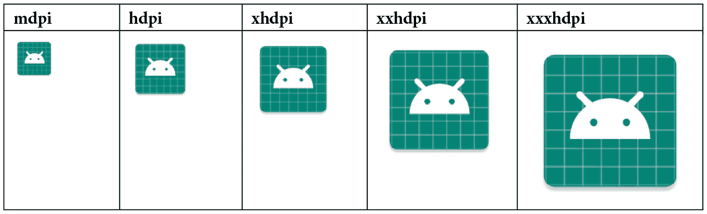

图 1.20 – 主要密度分组启动器图像大小的比较

备注

启动器图标比应用中的正常图像略大，因为它们将被设备的启动器使用。由于一些启动器可以放大图像，这确保了图像没有像素化和模糊。

现在，您将查看应用使用的一些资源。这些资源在 XML 文件中引用，并保持应用显示和格式的统一。

在 `colors.xml` 文件中，您以十六进制格式定义您想在应用中使用的颜色：

```swift
<?xml version="1.0" encoding="utf-8"?>
<resources>
    <color name="purple_200">#FFBB86FC</color>
    <color name="purple_500">#FF6200EE</color>
    <color name="purple_700">#FF3700B3</color>
    <color name="teal_200">#FF03DAC5</color>
    <color name="teal_700">#FF018786</color>
    <color name="black">#FF000000</color>
    <color name="white">#FFFFFFFF</color>
</resources>
```

格式基于 `#00` 完全透明到 `#FF` 完全不透明。对于颜色，`#00` 表示不添加任何颜色来构成复合颜色，而 `#FF` 表示添加所有颜色。

如果不需要透明度，您可以省略前两个字符。因此，要创建全蓝色和 50% 透明的蓝色颜色，格式如下：

```swift
    <color name="colorBlue">#0000FF</color>
    <color name=
        "colorBlue50PercentTransparent">#770000FF</color>
```

`strings.xml` 文件显示应用中显示的所有文本：

```swift
<resources>
    <string name="app_name">My Application</string>
</resources>
```

您可以在您的应用中使用硬编码的字符串，但这会导致重复，并且如果您想使应用支持多语言，则无法自定义文本。通过将字符串作为资源添加，您还可以在应用中不同位置使用时，在一个地方更新字符串。

您想在应用中使用的常见样式添加到 `themes.xml` 文件中：

```swift
<resources xmlns:tools="http://schemas.android.com/tools">
    <!-- Base application theme. -->
    <style name="Theme.MyApplication" parent=
        "Theme.MaterialComponents.DayNight.DarkActionBar">
        <!-- Primary brand color. -->
        <item name="colorPrimary">@color/purple_500</item>
        <item name="colorPrimaryVariant">@color/purple_700
            </item>
        <item name="colorOnPrimary">@color/white</item>
        <!-- Secondary brand color. -->
        <item name="colorSecondary">@color/teal_200</item>
        <item name="colorSecondaryVariant">@color/teal_700
            </item>
        <item name="colorOnSecondary">@color/black</item>
        <!-- Status bar color. -->
        <item name="android:statusBarColor"
            tools:targetApi="l">?attr/colorPrimaryVariant
                </item>
        <!-- Customize your theme here. -->
    </style></resources>
```

可以通过将 `android:textStyle="bold"` 作为属性设置在 `TextView` 上，直接将样式信息应用于视图。但是，您必须为每个想要以粗体显示的 `TextView` 在多个地方重复此操作。此外，当您开始向单个视图添加多个样式属性时，它会添加大量重复，并且在您想要更改所有类似视图并错过更改一个视图的样式属性时，可能会导致错误。

如果您定义了一种样式，您只需更改样式，它就会更新所有应用中应用了该样式的视图。在创建项目时，将顶级主题应用于 `AndroidManifest.xml` 文件中的应用标签，并称为应用于应用中所有视图的样式。

在这里使用的是您在`colors.xml`文件中定义的颜色。实际上，如果您更改了`colors.xml`文件中定义的任何颜色，它现在将传播以样式化应用。

您现在已经探索了应用的核心区域。您已添加`TextView`视图来显示标签、标题和文本块。在下一个练习中，您将介绍允许用户与您的应用交互的 UI 元素。

## 练习 1.05 – 向用户显示定制问候语的交互式 UI 元素

本练习的目标是增加用户添加和编辑文本的能力，然后将这些信息提交以显示包含输入数据的定制问候语。为此，您需要添加可编辑的文本视图。通常，这通过`EditText`视图来实现，可以在如下 XML 布局文件中添加：

```swift
<EditText
    android:id="@+id/full_name"
    style="@style/TextAppearance.AppCompat.Title"
    android:layout_width="wrap_content"
    android:layout_height="wrap_content"
    android:hint="@string/first_name" />
```

这使用 Android `TextAppearance.AppCompat.Title`样式来显示标题，如图*图 1**.21*所示：


图 1.21 – 带有提示的 EditText

虽然这可以很好地启用用户添加/编辑文本，但`TextInputEditText`材料和其包装器`TextInputLayout`视图为`EditText`显示增添了一些光泽。以下是`EditText`可以更新的方式：

```swift
    <com.google.android.material.textfield.TextInputLayout
        android:id="@+id/first_name_wrapper"
        style="@style/text_input_greeting"
        android:layout_width="match_parent"
        android:layout_height="wrap_content"
        android:hint="@string/first_name_text">
        <com.google.android.material.textfield
            .TextInputEditText 
            android:id="@+id/first_name"
            android:layout_width="match_parent"
            android:layout_height="wrap_content" />
    </com.google.android.material.textfield.TextInputLayout>
```

输出如下：

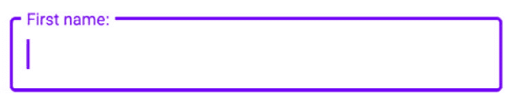

图 1.22 – 带有提示的 TextInputLayout/TextInputEditText 材料

`TextInputLayout`允许我们为`TextInputEditText`视图创建一个标签，并在`TextInputEditText`视图获得焦点（移动到字段顶部）时执行一个漂亮的动画，同时仍然显示标签。标签通过`android:hint`指定。

您将更改应用中的`Hello World`文本，以便用户可以输入他们的名字和姓氏，并通过按按钮进一步显示问候语。为此，请执行以下步骤：

1.  按照与*练习 1.01*，*为您的应用创建 Android Studio 项目*相同的方式创建一个新的 Android Studio 项目，命名为 My Application。

1.  通过将以下条目添加到`app` | `src` | `main` | `res` | `values` | `strings.xml`来创建您应用中将使用的标签和文本：

    ```swift
    <string name="first_name_text">First name:</string>
    <string name="last_name_text">Last name:</string>
    <string name="enter_button_text">Enter</string>
    <string name="welcome_to_the_app">Welcome to the app</string>
    <string name="please_enter_a_name">Please enter a full name!</string>
    ```

1.  接下来，我们将更新我们的样式以在布局中使用，通过在`app` | `src` | `main` | `res` | `values` | `themes.xml`主题中添加以下样式：

    ```swift
    <style name="text_input_greeting" parent="Widget.MaterialComponents.TextInputLayout.OutlinedBox">
        <item name="android:layout_margin">8dp</item>
    </style>
    <style name="button_greeting">
        <item name="android:layout_margin">8dp</item>
        <item name="android:gravity">center</item>
    </style>
    <style name="greeting_display" parent="@style/TextAppearance.MaterialComponents.Body1">
        <item name="android:layout_margin">8dp</item>
        <item name="android:gravity">center</item>
        <item name="android:layout_height">40dp</item>
    </style>
    <style name="screen_layout_margin">
        <item name="android:layout_margin">12dp</item>
    </style>
    ```

注意

一些样式的父级引用了 Material 样式，因此这些样式将直接应用于视图和指定的样式。

1.  现在我们已经添加了要应用于布局和文本的样式，我们可以更新`activity_main.xml`布局文件，位于`app` | `src` | `main` | `res` | `layout`文件夹中：

    ```swift
    <?xml version="1.0" encoding="utf-8"?>
    <androidx.constraintlayout.widget.ConstraintLayout xmlns:android=
      "http://schemas.android.com/apk/res/android"
    xmlns:app="http://schemas.android.com/apk/res-auto"
    xmlns:tools="http://schemas.android.com/tools"
    android:layout_width="match_parent"
    android:layout_height="match_parent"
    style="@style/screen_layout_margin"
    tools:context=".MainActivity">
    <com.google.android.material.textfield.TextInputLayout
        android:id="@+id/first_name_wrapper"
        style="@style/text_input_greeting"
        android:layout_width="match_parent"
        android:layout_height="wrap_content"
        android:hint="@string/first_name_text"
        app:layout_constraintTop_toTopOf="parent"
        app:layout_constraintStart_toStartOf="parent">
        <com.google.android.material.textfield.
            TextInputEditText android:id="@+id/first_name" 
            android:layout_width="match_parent" android:layout_
            height="wrap_content" />
    </com.google.android.material.textfield.TextInputLayout>
    <com.google.android.material.textfield.TextInputLayout
        android:id="@+id/last_name_wrapper"
        style="@style/text_input_greeting"
        android:layout_width="match_parent"
        android:layout_height="wrap_content"
        android:hint="@string/last_name_text"
        app:layout_constraintTop_toBottomOf="@id/first_name_
            wrapper"
        app:layout_constraintStart_toStartOf="parent">
        <com.google.android.material.textfield.
            TextInputEditText android:id="@+id/last_name" 
            android:layout_width="match_parent" android:layout_
            height="wrap_content" />
    </com.google.android.material.textfield.TextInputLayout>
    <com.google.android.material.button.MaterialButton
        android:layout_width="match_parent"
        android:layout_height="wrap_content"
        style="@style/button_greeting"
        android:id="@+id/enter_button"
        android:text="@string/enter_button_text"
        app:layout_constraintTop_toBottomOf="@id/last_name_
            wrapper"
        app:layout_constraintStart_toStartOf="parent"/>
    <TextView
        android:id="@+id/greeting_display"
        android:layout_width="match_parent"
        style="@style/greeting_display"
        app:layout_constraintTop_toBottomOf="@id/enter_
            button"
        app:layout_constraintStart_toStartOf="parent" />
    </androidx.constraintlayout.widget.ConstraintLayout>
    ```

1.  运行应用并查看外观和感觉。您已为所有视图添加了 ID，以便它们可以与其兄弟元素进行约束，并在活动中提供获取`TextInputEditText`视图值的方法。`style="@style.."`表示法应用了`themes.xml`文件中的样式。

如果你选择一个`TextInputEditText`视图，你会看到标签动画并移动到视图的顶部：

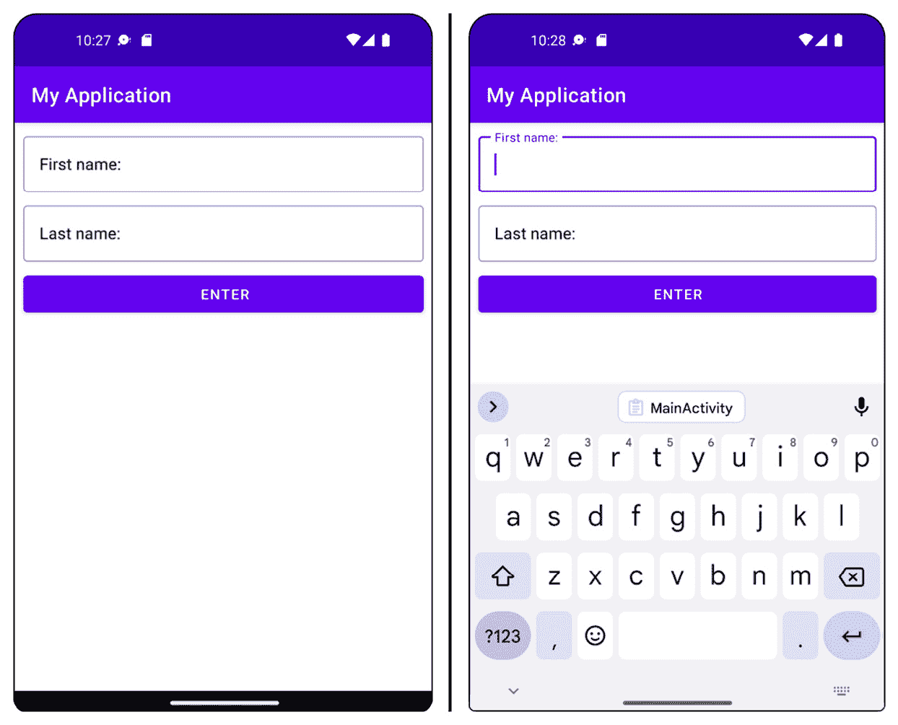

图 1.23 – 无焦点和有焦点的带有标签状态的 TextInputEditText 字段

1.  现在，我们必须在我们的活动中添加与视图的交互。布局本身并不能做任何事情，除了允许用户在`EditText`字段中输入文本。在这个阶段点击按钮不会做任何事情。你将通过在按钮按下时捕获输入的文本，并使用表单字段的 ID 来使用这些文本填充一个`TextView`消息来完成这个任务。

1.  打开`MainActivity`并完成下一步，以处理输入的文本，并使用这些数据来显示问候语和处理任何表单输入错误。

1.  在`onCreate`函数中，在按钮上设置一个`ClickListener`，这样我们就可以响应用件点击并通过更新`MainActivity`来检索表单数据，如下面的代码块所示：

    ```swift
    package com.example.myapplication
    import androidx.appcompat.app.AppCompatActivity
    import android.os.Bundle
    import android.view.Gravity
    import android.widget.Button
    import android.widget.TextView
    import android.widget.Toast
    import com.example.myapplication.R
    import com.google.android.material.textfield.TextInputEditText
    class MainActivity : AppCompatActivity() {
        override fun onCreate(savedInstanceState: Bundle?) {
            super.onCreate(savedInstanceState)
            setContentView(R.layout.activity_main)
            findViewById<Button>(R.id.enter_button)?.
            setOnClickListener {
                //Get the greeting display text
                val greetingDisplay = 
                    findViewById<TextView>(R.id.greeting_
                    display)
                //Get the first name TextInputEditText value
                val firstName = 
                    findViewById<TextInputEditText>(R.
                    id.first_name)
                    ?.text.toString().trim()
                //Get the last name TextInputEditText value
                val lastName = 
                    findViewById<TextInputEditText>(R.
                    id.last_name)
                    ?.text.toString().trim()
                //Add code below this line in step 9 to Check 
                  names are not empty here:
            }
        }
    }
    ```

1.  然后，检查修剪后的名称是否不为空，并使用 Kotlin 的字符串模板格式化名称：

    ```swift
    if (firstName.isNotEmpty() && lastName.isNotEmpty()) {
        val nameToDisplay = firstName.plus(" ")
            .plus(lastName)
        //Use Kotlin's string templates feature to display 
          the name
        greetingDisplay?.text = " ${getString(R.string.
            welcome_to_the_app)} ${nameToDisplay}!"
    }
    ```

1.  最后，如果表单字段没有正确填写，则显示一条消息：

    ```swift
    else {
        Toast.makeText(this, getString(R.string.please_
            enter_a_name), Toast.LENGTH_LONG)
            .apply {
                setGravity(Gravity.CENTER, 0, 0)
                show()
            }
    }
    ```

指定的`Toast`是一个小文本对话框，在主布局上方短暂出现，用于在消失前向用户显示消息。

1.  运行应用，在字段中输入文本，并验证当两个文本字段都填写时，会显示问候消息；如果两个字段都没有填写，则会出现一个弹出消息，说明为什么问候没有被设置。你应该看到以下显示的每个案例：

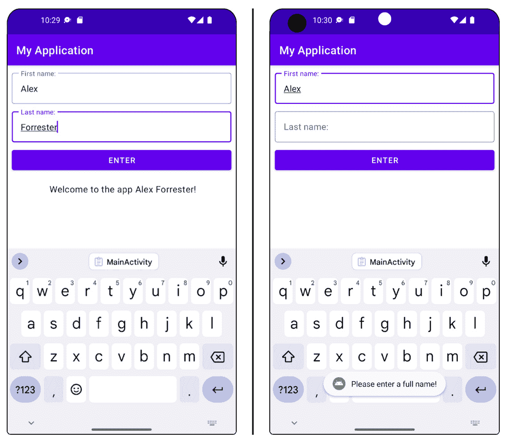

图 1.24 – 填写正确的名称和有错误的 app

完整的练习代码可以在[`packt.link/UxbOu`](https://packt.link/UxbOu)查看。

前面的练习介绍了如何通过用户可以填写的`EditText`字段添加交互性到你的应用中，添加一个点击监听器来响应用件事件，并执行一些验证。

## 在布局文件中访问视图

在布局文件中访问视图的常规方法是使用`findViewById`和视图的 ID 名称。因此，在`setContentView(R.layout.activity_main)`在 Activity 中设置布局之后，`enter_button`按钮是通过`findViewById<Button>(R.id.enter_button)`语法检索的。

你将在本课程中使用这项技术。谷歌还引入了`findViewById`，它创建了一个绑定类来访问视图，并且具有空值和类型安全性的优势。你可以在[`developer.android.com/topic/libraries/view-binding`](https://developer.android.com/topic/libraries/view-binding)上了解更多信息。

## 进一步的输入验证

验证用户输入是处理用户数据的关键概念，你肯定在填写表单的必填字段时多次看到过它的实际应用。这就是前一个练习在检查用户是否在姓名和姓氏字段中输入了值时所验证的内容。

XML 视图元素中还有其他可用的验证选项。例如，假设你想验证一个字段中输入的 IP 地址。你知道 IP 地址可以是四个由点/句号分隔的数字，其中数字的最大长度为三位。

因此，可以输入字段的最大字符数是`15`，并且只能输入数字和点/句号。两个 XML 属性可以帮助我们进行验证：

+   `android:digits="0123456789."`：这通过列出所有允许的单独字符来限制可以输入到字段中的字符

+   `android:maxLength="15"`：这限制了用户输入的字符数不超过 IP 地址将包含的最大字符数

因此，这是如何在表单字段中显示它的方法：

```swift
<com.google.android.material.textfield.TextInputLayout style="@style/Widget.MaterialComponents.TextInputLayout.OutlinedBox"
    android:layout_width="match_parent"
    android:layout_height="wrap_content">
    <com.google.android.material.textfield.TextInputEditText  android:id="@+id/ip_address"
    android:digits="0123456789."
    android:layout_width="match_parent"
    android:layout_height="wrap_content"
    android:maxLength="15" />
</com.google.android.material.textfield.TextInputLayout>
```

此验证限制了可以输入的字符和最大长度。根据 IP 地址格式，还需要对字符序列以及它们是点/句号还是数字进行额外的验证，但这是为了帮助用户输入正确的字符的第一步。还有一个`android:inputType` XML 属性，可以用来指定允许的字符并配置输入选项，例如，`android:inputType="textPassword"`确保输入的字符是隐藏的。`android:inputType="Phone"`是电话号码的输入方法。

通过从本章获得的知识，让我们从以下活动开始。

## 活动 1.01 – 创建 RGB 颜色应用

在此活动中，我们将探讨一个使用验证的场景。假设你被分配创建一个应用，展示红色、绿色和蓝色在 RGB 颜色空间中如何相加以创建颜色。

每个 RGB 通道应添加为两个十六进制字符，其中每个字符可以是 0-9 或 A-F 的值。然后，这些值将组合起来产生一个六字符的十六进制字符串，该字符串在应用中以颜色形式显示。

此活动旨在生成一个表单，其中包含可编辑的字段，用户可以为每种颜色添加两个十六进制值。在填写所有三个字段后，用户应点击一个按钮，该按钮将三个值连接起来创建一个有效的十六进制颜色字符串。然后，应将其转换为颜色并在应用的 UI 中显示。

以下步骤将帮助您完成活动：

1.  创建一个新的 Android Studio 项目，就像你在*练习 1.01*中做的那样，*为你的应用创建 Android Studio 项目*。

1.  在布局的顶部添加一个`标题`约束。

1.  向用户添加一个简短的说明，说明如何完成表单。

1.  添加三个`TextInputLayout`字段，分别包裹三个`TextInputEditText`字段，这些字段出现在`标题`下方。这些字段应该被约束，以便每个视图位于另一个视图之上（而不是旁边）。将`TextInputEditText`字段分别命名为`红通道`、`绿通道`和`蓝通道`，并为每个字段添加限制，只允许输入两个字符和十六进制字符。

1.  添加一个按钮，该按钮从三个颜色字段获取输入。

1.  在布局中添加一个显示生成的颜色的视图。

1.  最后，在按钮按下且所有输入有效时，在布局中显示由三个通道创建的 RGB 颜色。

最终输出应如下所示（颜色将根据输入而变化）：

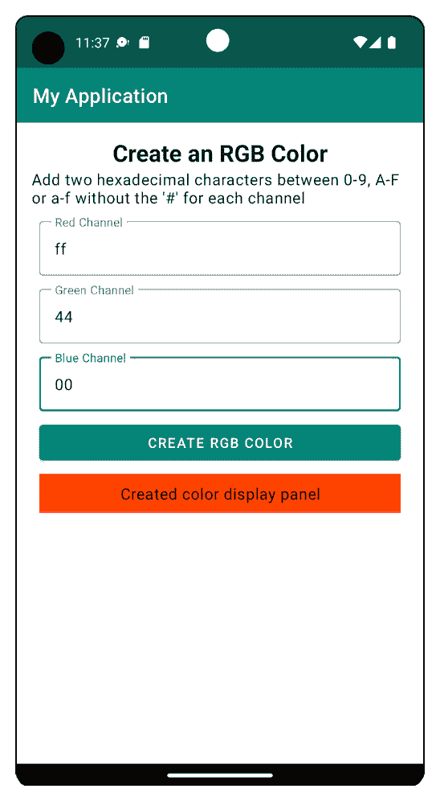

图 1.25 – 显示颜色时的输出

注意

该活动的解决方案可在[`packt.link/By7eE`](https://packt.link/By7eE)找到。

注意

当第一次将此课程的 GitHub 仓库中的所有已完成项目加载到 Android Studio 中时，**不要**使用顶部菜单中的**文件** | **打开**来打开项目。始终使用**文件** | **新建** | **导入项目**。这确保了应用程序可以正确构建。在初次导入后打开项目，您可以使用**文件** | **打开**或**文件** | **打开最近的项目**。

# 摘要

本章涵盖了大量关于 Android 开发基础的内容。您从如何使用 Android Studio 创建 Android 项目开始，然后在虚拟设备上创建并运行了应用程序。

章节随后通过探索`AndroidManifest`文件来推进，该文件详细说明了您的应用程序内容和权限模型，接着介绍了 Gradle 以及添加依赖项和构建应用程序的过程。

然后是深入了解 Android 应用程序的细节以及文件和文件夹结构。介绍了布局和视图，并通过练习迭代来展示如何使用 Google 的 Material Design 构建 UI。

下一章将在此基础上学习活动生命周期、活动任务和启动模式，屏幕间的数据持久化和共享，以及如何在应用程序中创建健壮的用户旅程。

| **mdpi** | **hdpi** | **xhdpi** | **xxhdpi** | **xxxhdpi** |
| --- | --- | --- | --- | --- |

|  |  |  |  |  |
