# 构建用户屏幕流程

本章涵盖了 Android 活动生命周期，并解释了 Android 系统如何与您的应用交互。在本章结束时，您将学会如何通过不同的屏幕构建用户旅程。您还将能够使用活动任务和启动模式，保存和恢复活动状态，使用日志报告您的应用程序，以及在不同屏幕之间共享数据。

上一章向您介绍了 Android 开发的核心理念，从使用`AndroidManifest.xml`文件配置您的应用，处理简单的活动，以及 Android 资源结构，到使用`gradle`构建应用和在虚拟设备上运行应用。

在本章中，您将进一步学习 Android 系统如何通过 Android 生命周期与您的应用交互，您如何被通知应用状态的变化，以及您如何使用 Android 生命周期来响应这些变化。

接下来，您将学习如何通过您的应用创建用户旅程以及如何在屏幕之间共享数据。您将介绍不同的技术来实现这些目标，以便您可以在自己的应用中使用它们，并在看到其他应用中使用它们时能够识别它们。

本章我们将涵盖以下主题：

+   活动生命周期

+   保存和恢复活动状态

+   活动与意图的交互

+   意图、任务和启动模式

# 技术要求

本章所有练习和活动的完整代码可在 GitHub 上找到，链接为[`packt.link/PmKJ6`](https://packt.link/PmKJ6)

# 活动生命周期

在上一章中，我们使用了`onCreate(saveInstanceState: Bundle?)`方法在屏幕的 UI 中显示布局。现在，我们将更详细地探讨 Android 系统如何与您的应用交互以实现这一点。一旦活动启动，它将经历一系列步骤，从准备显示到部分显示，然后完全显示。

此外，还有与您的应用被隐藏、后台运行然后销毁相对应的步骤。这个过程被称为**活动生命周期**。对于这些步骤中的每一个，都有一个**回调**，您的活动可以使用它来执行在应用被置于后台时创建和更改显示以及保存数据，当应用回到前台后恢复这些数据的操作。

这些回调是在您的活动父级上进行的，您需要决定是否需要在您的活动中实现它们以执行任何相应的操作。每个这些回调函数都有`override`关键字。在 Kotlin 中，`override`关键字意味着这个函数要么提供了一个接口或抽象方法的实现，要么，在您当前的活动这里，作为一个子类，它提供了一个将覆盖其父类的实现。

现在您已经了解了 Activity 生命周期的一般工作原理，让我们更详细地探讨您将按顺序工作的主要回调，从创建 Activity 到 Activity 被销毁：

+   `override fun onCreate(savedInstanceState: Bundle?)`: 这是您将最常用于绘制全屏活动的回调。在这里，您准备 Activity 布局以供显示。在这个阶段，方法完成后，它仍然没有显示给用户，尽管如果您没有实现任何其他回调，它看起来会是这样。您通常在这里通过调用`setContentView(R.layout.activity_main)`方法来设置 Activity 的 UI，并执行任何所需的初始化。

在其生命周期中，此方法只会被调用一次，除非 Activity 再次被创建。对于某些操作（如将手机从纵向旋转到横向）默认情况下会发生这种情况。`Bundle?`类型的`savedInstanceState`参数（`?`表示该类型可以为 null）在最简单的形式中是一个优化了保存和恢复数据的键值对映射。

如果这是应用程序启动后第一次运行 Activity，或者 Activity 是第一次被创建，或者 Activity 在没有保存任何状态的情况下被重新创建，那么它将是空的。

+   `override fun onRestart()`: 当 Activity 重新启动时，这个方法会在`onStart()`之前立即被调用。了解重启 Activity 和重新创建 Activity 之间的区别很重要。当 Activity 被按下主页按钮置于后台，然后再次进入前台时，`onRestart()`会被调用。重新创建 Activity 发生在配置更改时，例如设备旋转。Activity 结束时会被重新创建，在这种情况下，`onRestart()`不会被调用。

+   `override fun onStart()`: 这是当 Activity 从后台被带到前台时第一次被调用的回调。

+   `override fun onRestoreInstanceState(savedInstanceState: Bundle?)`: 如果已经使用`onSaveInstanceState(outState: Bundle?)`保存了状态，那么在`onStart()`之后，系统会调用此方法，您可以在其中检索`Bundle`状态，而不是使用`onCreate(savedInstanceState: Bundle?)`恢复状态。

+   `override fun onResume()`: 这个回调是在第一次创建 Activity 的最后阶段运行的，也是当应用从后台被带到前台时。完成此回调后，屏幕/活动就准备好被使用，接收用户事件，并做出响应。

+   `override fun onSaveInstanceState(outState: Bundle?)`: 如果你想保存 Activity 的状态，这个函数可以做到。你可以使用一个方便的函数来添加键值对，具体取决于数据类型。如果 Activity 在`onCreate(saveInstanceState: Bundle?)`和`onRestoreInstanceState(savedInstanceState: Bundle?)`中被重新创建，数据将可用。

+   `override fun onPause()`: 当 Activity 开始变为后台或者另一个对话框或 Activity 进入前台时，会调用此函数。

+   `override fun onStop()`: 当 Activity 被隐藏时，无论是由于它正在变为后台还是另一个 Activity 在它之上启动，都会调用此函数。

+   `override fun onDestroy()`: 当系统资源低时，系统会调用此方法来结束 Activity，当 Activity 被显式调用`finish()`方法，或者更常见的是，当用户通过关闭应用从最近/概览按钮关闭应用时，Activity 会被杀死。

回调/事件的流程在以下图中展示：

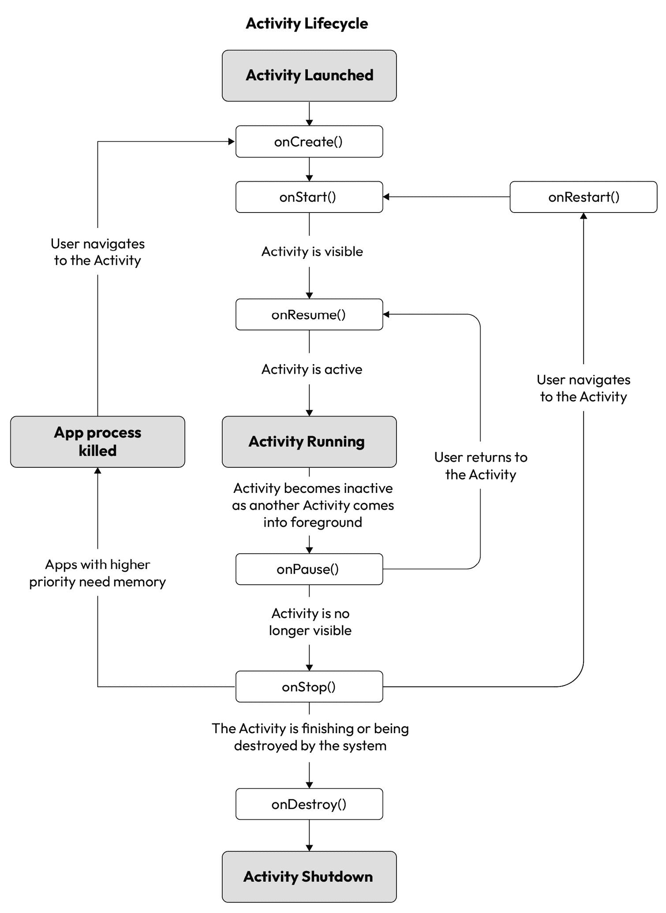

图 2.1 – Activity 生命周期

现在你已经了解了这些常见的生命周期回调的作用，让我们实现它们来看看它们何时被调用。

## 练习 2.01 – 记录 Activity 回调

创建一个名为`Activity Callbacks`的应用程序，其中包含一个空的 Activity。这个练习的目的是记录 Activity 回调以及它们发生的顺序：

1.  为了验证回调的顺序，让我们在每个回调的末尾添加一个日志语句。打开`MainActivity`，通过添加`import android.util.Log`到`import`语句中来准备 Activity 的日志记录。然后，在类中添加一个常量来标识你的 Activity。Kotlin 中的常量通过`const`关键字标识，可以在类的顶部级别（类外）或类内的对象中声明。

如果需要将常量设置为公开的，通常使用顶级常量。对于私有常量，Kotlin 提供了一种方便的方法，通过声明一个伴生对象来为类添加静态功能。在`onCreate(savedInstanceState: Bundle?)`下方添加以下内容：

```swift
companion object {
    private const val TAG = "MainActivity"
}
```

然后，在`onCreate(savedInstanceState: Bundle?)`的末尾添加一个日志语句：

```swift
Log.d(TAG, "onCreate")
```

我们的活动现在应该有以下的代码：

```swift
package com.example.activitycallbacks
import android.os.Bundle
import android.util.Log
import androidx.appcompat.app.AppCompatActivity
class MainActivity : AppCompatActivity() {
    override fun onCreate(savedInstanceState: Bundle?) {
        super.onCreate(savedInstanceState)
        setContentView(R.layout.activity_main)
        Log.d(TAG, "onCreate")
    }
    companion object {
        private const val TAG = "MainActivity"
    }
}
```

在前面的日志语句中的`d`代表*调试*。有六个不同的日志级别可以用来输出从最不重要到最重要的消息信息 – `v`代表*详细*，`d`代表*调试*，`i`代表*信息*，`w`代表*警告*，`e`代表*错误*，`wtf`代表*多么糟糕的失败*（这个最后的日志级别强调了不应该发生的异常）：

```swift
Log.v(TAG, "verbose message")
Log.d(TAG, "debug message")
Log.i(TAG, "info message")
Log.w(TAG, "warning message")
Log.e(TAG, "error message")
Log.wtf(TAG, "what a terrible failure message")
```

1.  现在，让我们看看在 Android Studio 中日志是如何显示的。打开**Logcat**窗口。可以通过点击屏幕底部的**Logcat**标签或通过工具栏中的**视图** | **工具窗口** | **Logcat**来访问。

1.  在虚拟设备上运行应用并检查 **Logcat** 窗口的输出。你应该看到像 *图 2**.2* 中的以下行格式化的日志语句。如果 **Logcat** 窗口看起来不同，你可能需要通过转到 **Android Studio** | **设置** | **实验性** 并勾选说 **启用新 Logcat** **工具窗口** 的复选框来启用 **Logcat** 的新版本。

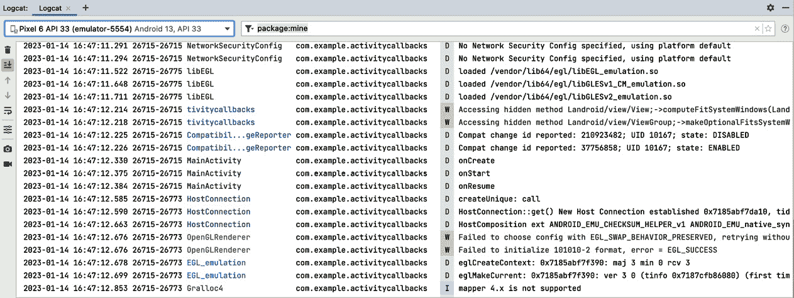

图 2.2 – Logcat 中的日志输出

1.  日志语句一开始可能很难理解，所以让我们将以下语句分解为其独立的各个部分：

    ```swift
    2023-01-14 16:47:12.330 26715-26715/com.example.activitycallbacks/D/onCreate
    ```

让我们详细检查日志语句的元素：

| **字段** | **值** |
| --- | --- |
| **日期** | `2023-01-14` |
| **时间** | `16:47:12.330` |
| **进程标识符和线程标识符（你的应用进程 ID 和当前线程 ID）** | `26715-26715` |
| **类名** | `MainActivity` |
| **包名** | `com.example.activitycallbacks` |
| **日志级别** | `D (用于调试)` |
| **日志消息** | `onCreate` |

图 2.3 – 解释日志语句的表格

默认情况下，在日志过滤器（日志窗口上方的文本框中），显示 `package:mine`，这是你的应用日志。你可以通过更改日志过滤器从 `level:debug` 到下拉菜单中的其他选项来检查设备上所有进程的不同日志级别的输出。如果你选择 `level:verbose`，正如其名所示，你会看到大量的输出。

5. 日志语句的 `tag` 选项很棒的地方在于，它允许你过滤出在 `tag` 后跟的文本标签中报告的日志语句，如 *图 2**.4* 所示：

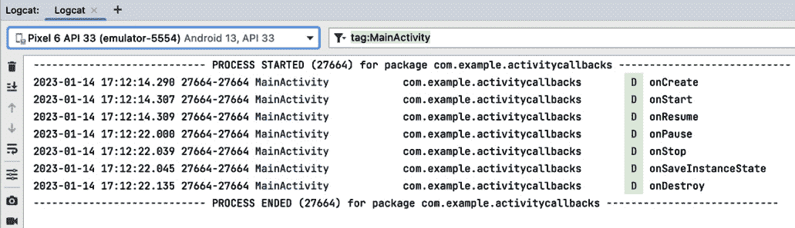

图 2.4 – 通过标签名过滤日志语句

因此，如果你正在调试 Activity 中的问题，你可以输入标签名并在你的 Activity 中添加日志以查看日志语句的顺序。这就是你接下来将要通过实现主要 Activity 回调并在每个回调中添加日志语句来查看它们何时运行要做的。

6. 在 `onCreate(savedInstanceState: Bundle?)` 函数的闭合花括号后的一行放置你的光标，然后添加带有日志语句的 `onRestart()` 回调。确保调用 `super.onRestart()` 以确保 Activity 回调的现有功能按预期工作：

```swift
override fun onRestart() {
    super.onRestart()
    Log.d(TAG, "onRestart")
}
```

注意

在 Android Studio 中，你可以开始输入函数的名称，并会弹出自动完成选项，提供要覆盖的函数的建议。或者，如果你转到顶部菜单，然后选择 **代码** | **生成** | **覆盖方法**，你可以选择要覆盖的方法。

对以下所有回调函数都这样做：

```swift
onCreate(savedInstanceState: Bundle?)
onRestart()
onStart()
onRestoreInstanceState(savedInstanceState: Bundle)
onResume()
onPause()
onStop()
onSaveInstanceState(outState: Bundle)
onDestroy()
```

7. 完成后的活动将用你的实现覆盖回调，并添加日志消息。以下截断的代码片段显示了`onCreate(savedInstanceState: Bundle?)`中的日志语句。完整的类可在[`packt.link/Lj2GT`](https://packt.link/Lj2GT)找到：

```swift
package com.example.activitycallbacks
import android.os.Bundle
import android.util.Log
import androidx.appcompat.app.AppCompatActivity
class MainActivity : AppCompatActivity() {
    override fun onCreate(savedInstanceState: Bundle?) {
        super.onCreate(savedInstanceState)
        setContentView(R.layout.activity_main)
        Log.d(TAG, "onCreate")
    }
    companion object {
        private const val TAG = "MainActivity"
    }
}
```

8. 运行应用，然后一旦加载，如*图 2.5*所示，查看**Logcat**输出；你应该看到以下日志语句（这是一个简化的版本）：

```swift
D/MainActivity: onCreate
D/MainActivity: onStart
D/MainActivity: onResume
```

活动已经创建、启动，并准备让用户与之交互：

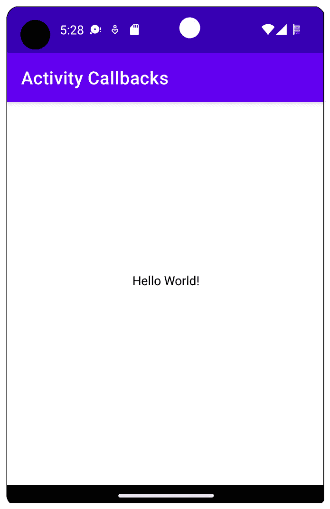

图 2.5 – 应用已加载并显示 MainActivity

在模拟器窗口中虚拟设备上方的导航控制中心的圆形主页按钮上按下，并将应用置于后台。并非所有设备都使用相同的三个按钮导航，即*后退*（三角形图标）、*主页*（圆形图标）和*最近的应用/概览*（方形图标）。也可以启用手势导航，这样所有这些操作都可以通过滑动和可选地按住来实现。你现在应该能看到以下**Logcat**输出：

```swift
D/MainActivity: onPause
D/MainActivity: onStop
D/MainActivity: onSaveInstanceState
```

对于针对 Android Pie（API 28）以下版本的应用，`onSaveInstanceState(outState: Bundle)`也可能在`onPause()`或`onStop()`之前被调用。

10. 现在，通过按下模拟器控制中的最近的应用/概览方形按钮并选择应用，将应用恢复到前台。你现在应该看到以下内容：

```swift
D/MainActivity: onRestart
D/MainActivity: onStart
D/MainActivity: onResume
```

活动已经重新启动。你可能已经注意到`onRestoreInstanceState(savedInstanceState: Bundle)`函数没有被调用。这是因为活动没有被销毁和重新创建。

11. 再次按下最近的应用/概览方形按钮，然后向上滑动应用图像以结束活动。这是输出：

```swift
D/MainActivity: onPause
D/MainActivity: onStop
D/MainActivity: onDestroy
```

12. 再次启动你的应用，然后旋转手机。你可能发现手机没有旋转，显示是侧置的。如果发生这种情况，向下拖动虚拟设备顶部的状态栏，寻找一个带有矩形图标和箭头的按钮，称为**自动旋转**，并选择它。

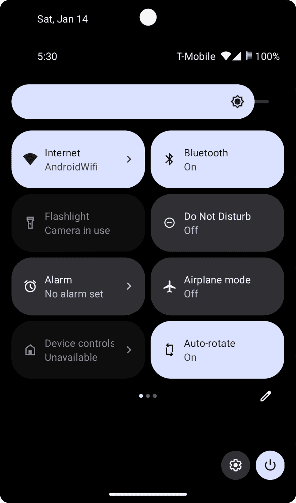

图 2.6 – 已选择 Wi-Fi 和自动旋转按钮的快速设置栏

你应该看到以下回调：

```swift
D/MainActivity: onCreate
D/MainActivity: onStart
D/MainActivity: onResume
D/MainActivity: onPause
D/MainActivity: onStop
D/MainActivity: onSaveInstanceState
D/MainActivity: onDestroy
D/MainActivity: onCreate
D/MainActivity: onStart
D/MainActivity: onRestoreInstanceState
D/MainActivity: onResume
```

请注意，如第 9 步所述，`onSaveInstanceState(outState: Bundle)`回调的顺序可能不同。

配置更改，如旋转手机，默认会重新创建活动。你可以选择不在应用中处理某些配置更改，这样活动就不会重新创建。

13. 要在旋转时不重新创建活动，将`android:configChanges="orientation|screenSize|screenLayout"`添加到`AndroidManifest.xml`文件中的`MainActivity`。启动应用，然后旋转手机，你将看到的只有添加到`MainActivity`的这些回调：

```swift
D/MainActivity: onCreate
D/MainActivity: onStart
D/MainActivity: onResume
```

`orientation` 和 `screenSize` 值在不同的 Android API 级别上检测屏幕方向变化的功能相同。`screenLayout` 值检测可能在可折叠手机上发生的其他布局更改。

这些是你可以选择自己处理的一些配置更改（另一个常见的是 `keyboardHidden` 以响应键盘访问的变化）。应用将通过以下回调由系统通知这些更改：

```swift
override fun onConfigurationChanged(newConfig:
Configuration) {
    super.onConfigurationChanged(newConfig)
    Log.d(TAG, "onConfigurationChanged")
}
```

如果你将这个回调函数添加到 `MainActivity`，并且你在清单文件中的 `Main` **Activity** 上添加了 `android:` **configChanges="orientation|screenSize|screenLayout"`，你将看到它在旋转时被调用。

这种不重新启动活动的方法不建议使用，因为系统不会自动应用替代资源。因此，从纵向旋转到横向不会应用合适的横向布局。

在这个练习中，你了解了主要的 Activity 回调以及当用户通过系统与 `MainActivity` 的交互执行常见操作时它们是如何运行的。在下一节中，我们将介绍保存状态和恢复状态，以及查看更多 Activity 生命周期的工作示例。

# 保存和恢复 Activity 状态

在本节中，你将探索你的 Activity 如何保存和恢复状态。正如你在上一节中学到的，配置更改，如旋转手机，会导致 Activity 被重新创建。这也可能发生在系统需要杀死你的应用以释放内存的情况下。

在这些情况下，保留 Activity 的状态然后恢复它非常重要。在接下来的两个练习中，你将通过一个示例来确保当 `TextView` 创建并从用户填写表单后的数据中填充时，用户的数据被恢复。

## 练习 2.02 – 在布局中保存和恢复状态

在这个练习中，首先创建一个名为 `Save and Restore` 的应用程序，并包含一个空活动。你将要创建的应用程序将包含一个简单的表单，如果用户输入一些个人信息（实际上不会将任何信息发送到任何地方，所以你的数据是安全的），将提供用户的喜爱餐厅的折扣代码：

1.  打开 `strings.xml` 文件（位于 `app` | `src` | `main` | `res` | `values` | `strings.xml`），并添加以下字符串，这些字符串是你应用所需的：

    ```swift
    <string name="header_text">Enter your name and email for a discount code at Your Favorite Restaurant!</string>
        <string name="first_name_label">First Name:</string>
        <string name="email_label">Email:</string>
        <string name="last_name_label">Last Name:</string>
        <string name="discount_code_button">GET DISCOUNT
            </string>
        <string name="discount_code_confirmation">Hey  %s! 
            Here is your discount code</string>
        <string name="add_text_validation">Please fill in all 
            form fields</string>
    ```

1.  在 `R.layout.activity_main` 中，将内容替换为以下 XML，它创建一个包含布局文件并添加一个带有文本 `Enter your name and email for a discount code at Your Favorite Restaurant!` 的 `TextView` 标题。这是通过添加 `android:text` 属性并使用 `@``string/header_text` 值来完成的：

    ```swift
    <?xml version="1.0" encoding="utf-8"?>
    <androidx.constraintlayout.widget.ConstraintLayout
        xmlns:android=
          "http://schemas.android.com/apk/res/android"
        xmlns:app="http://schemas.android.com/apk/res-auto"
        xmlns:tools="http://schemas.android.com/tools"
        android:layout_width="match_parent"
        android:layout_height="match_parent"
        android:padding="4dp"
        android:layout_marginTop="4dp"
        tools:context=".MainActivity">
        <TextView
            android:id="@+id/header_text"
            android:gravity="center"
            android:textSize="20sp"
            android:paddingStart="8dp"
            android:paddingEnd="8dp"
            android:layout_width="wrap_content"
            android:layout_height="wrap_content"
            android:text="@string/header_text"
            app:layout_constraintTop_toTopOf="parent"
            app:layout_constraintEnd_toEndOf="parent"
            app:layout_constraintStart_toStartOf="parent" />
    </androidx.constraintlayout.widget.ConstraintLayout>
    ```

你会看到这里 `android:textSize` 是以 `sp` 指定的，它代表无缩放像素。这种单位类型表示与密度无关像素相同的值，它根据运行应用程序的设备的密度定义大小测量，并根据用户在 **设置** | **显示** | **字体样式**（这可能是 **字体大小和样式** 或类似的内容，具体取决于你使用的确切设备）中定义的首选项更改文本大小。

布局中的其他属性会影响定位。最常见的是填充和边距。填充应用于视图的内部，是文本和边框之间的空间。边距在视图的外部指定，是视图外边缘的空间。例如，`android:padding` 使用指定的值在所有边上设置视图的填充。或者，你可以使用 `android:paddingTop`、`android:paddingBottom`、`android:paddingStart` 和 `android:paddingEnd` 指定视图四边之一的填充。这种模式也存在于指定边距，因此 `android:layout_margin` 为视图的所有四边指定边距值，而 `android:layout_marginTop`、`android:layout_marginBottom`、`android:layout_marginStart` 和 `android:layout_marginEnd` 允许为单个边设置边距。

为了在整个应用程序中使用这些定位值保持一致性和统一性，你可以将边距和填充值定义为包含在 `dimens.xml` 文件中的尺寸，这样它们就可以在多个布局中使用。例如，`<dimen name="grid_4">4dp</dimen>` 可以用作视图属性，如下所示：`android:paddingStart="@dimen/grid_4"`。为了在视图内定位内容，你可以指定 `android:gravity`。`center` 值在视图内垂直和水平方向上约束内容。

1.  接下来，在 `header_text` 下方添加三个 `EditText` 视图，供用户添加他们的名字、姓氏和电子邮件地址：

    ```swift
    <EditText
        android:id="@+id/first_name"
        android:textSize="20sp"
        android:layout_marginStart="24dp"
        android:layout_marginEnd="16dp"
        android:layout_width="wrap_content"
        android:layout_height="wrap_content"
        android:hint="@string/first_name_label"
        android:inputType="text"
        app:layout_constraintTop_toBottomOf="@id/header_text"
        app:layout_constraintStart_toStartOf="parent"
        />
    <EditText
        android:textSize="20sp"
        android:layout_marginEnd="24dp"
        android:layout_width="wrap_content"
        android:layout_height="wrap_content"
        android:hint="@string/last_name_label"
        android:inputType="text"
        app:layout_constraintTop_toBottomOf="@id/header_text"
        app:layout_constraintStart_toEndOf="@id/first_name"
        app:layout_constraintEnd_toEndOf="parent" />
    <!-- android:inputType="textEmailAddress" is not
    enforced, but is a hint to the IME (Input Method
    Editor) usually a keyboard to configure the
    display for an email -typically by showing the '@'
    symbol -->
    <EditText
        android:id="@+id/email"
        android:textSize="20sp"
        android:layout_marginStart="24dp"
        android:layout_marginEnd="32dp"
        android:layout_width="match_parent"
        android:layout_height="wrap_content"
        android:hint="@string/email_label"
        android:inputType="textEmailAddress"
        app:layout_constraintTop_toBottomOf="@id/first_name"
        app:layout_constraintEnd_toEndOf="parent"
        app:layout_constraintStart_toStartOf="parent" />
    ```

`EditText` 字段有一个 `inputType` 属性来指定可以输入到表单字段的输入类型。一些值，例如 `EditText` 上的 `number`，会限制可以输入到字段中的输入，并在选择字段时建议如何显示键盘。其他值，如 `android:inputType="textEmailAddress"`，不会强制在表单字段中添加 `@` 符号，但会向键盘提供提示以显示它。

1.  最后，添加一个按钮供用户按下以生成折扣代码，一个 `TextView` 用于显示折扣代码，以及一个 `TextView` 用于显示确认消息：

    ```swift
    <Button
        android:id="@+id/discount_button"
        android:textSize="20sp"
        android:layout_marginTop="12dp"
        android:gravity="center"
        android:layout_width="wrap_content"
        android:layout_height="wrap_content"
        android:text="@string/discount_code_button"
        app:layout_constraintTop_toBottomOf="@id/email"
        app:layout_constraintEnd_toEndOf="parent"
        app:layout_constraintStart_toStartOf="parent"/>
    <TextView
        android:id="@+id/discount_code_confirmation"
        android:gravity="center"
        android:textSize="20sp"
        android:paddingStart="16dp"
        android:paddingEnd="16dp"
        android:layout_marginTop="8dp"
        android:layout_width="match_parent"
        android:layout_height="wrap_content"
        app:layout_constraintTop_toBottomOf="@id/discount_
            button"
        app:layout_constraintEnd_toEndOf="parent"
        app:layout_constraintStart_toStartOf="parent"
        tools:text="Hey John Smith! Here is your discount 
            code" />
    <TextView
        android:id="@+id/discount_code"
        android:gravity="center"
        android:textSize="20sp"
        android:textStyle="bold"
        android:layout_marginTop="8dp"
        android:layout_width="match_parent"
        android:layout_height="wrap_content"
        app:layout_constraintTop_toBottomOf="@id/discount_
            code_confirmation"
        app:layout_constraintEnd_toEndOf="parent"
        app:layout_constraintStart_toStartOf="parent"
        tools:text="XHFG6H9O" />
    ```

还有一些你之前没有见过的属性。在 XML 布局文件顶部指定的 `xmlns:tools="http://schemas.android.com/tools"` 工具命名空间，可以启用某些功能，这些功能可以在创建你的应用程序时用于辅助配置和设计。

当你构建应用时，这些属性会被移除，因此它们不会对应用的整体大小产生影响。你正在使用`tools:text`属性来显示通常会在表单字段中显示的文本。这有助于你在 Android Studio 中从查看`Code`视图中的 XML 切换到`Design`视图时，可以看到布局在设备上的近似显示效果。

1.  运行应用，你应该会看到*图 2.7*中显示的输出。**GET DISCOUNT**按钮尚未启用，因此目前不会执行任何操作。

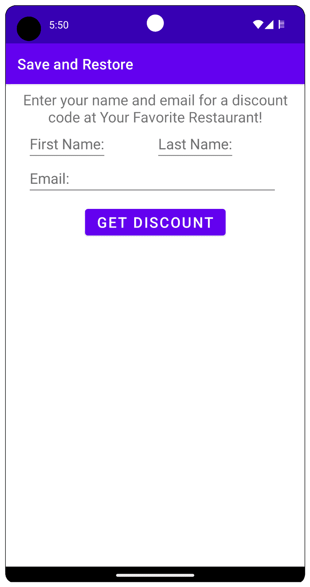

图 2.7 – 首次启动的活动屏幕

1.  在每个表单字段中输入一些文本：

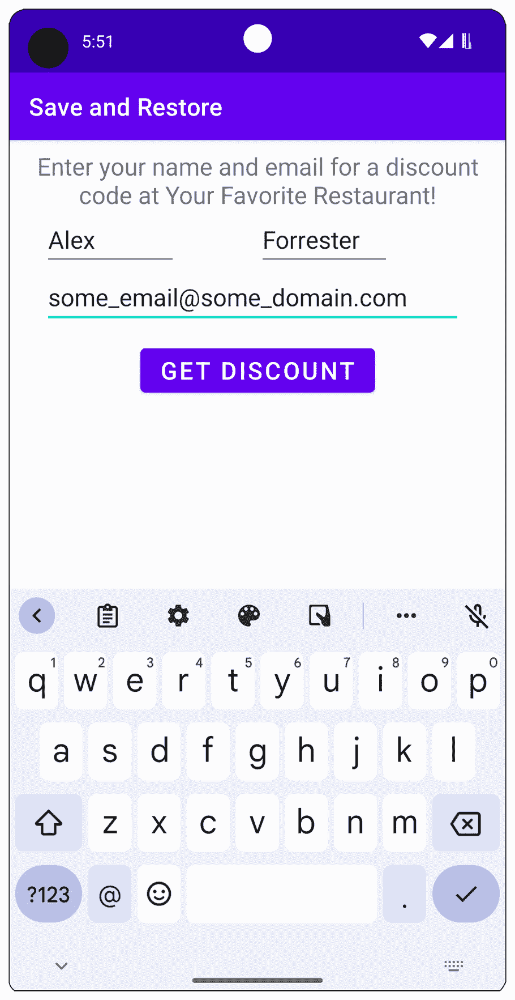

图 2.8 – 填写好的 EditText 字段

1.  现在，使用虚拟设备控制中的第二个旋转按钮()将手机向右旋转 90 度：


图 2.9 – 虚拟设备切换到横屏方向

你能发现发生了什么吗？`EditText`字段，如果它们设置了 ID，Android 框架将保留字段的当前状态。

1.  返回到`activity_main.xml`布局文件，并为位于`First Name` `EditText`下方出现的`Last Name` `EditText`添加一个 ID：

    ```swift
    <EditText
        android:id="@+id/first_name"
    <EditText
        android:id="@+id/last_name"
        …
    ```

当你再次运行应用并旋转设备时，它将保留你输入的值。你现在已经看到，你需要为`EditText`字段设置 ID 以保留状态。对于`EditText`字段，当用户在表单中输入详细信息时，在配置更改时保留状态是常见的，这样如果字段有 ID，它就是默认行为。

显然，你希望在用户输入一些文本后获取`EditText`字段的详细信息，这就是为什么你设置了 ID，但为其他字段类型，如`TextView`设置 ID，如果你更新它们并且需要自己保存状态，则不会保留状态。为允许滚动的视图设置 ID，如`RecyclerView`，也很重要，因为它可以在 Activity 重新创建时保持滚动位置。

现在，你已经定义了屏幕的布局，但你还没有添加创建和显示折扣代码的逻辑。在下一个练习中，我们将处理这个问题。

本练习中创建的布局可在[`packt.link/ZJleK`](https://packt.link/ZJleK)找到。

你可以在[`packt.link/Kh0kR`](https://packt.link/Kh0kR)找到整个练习的代码。

## 练习 2.03 – 使用回调保存和恢复状态

这个练习的目的是在用户输入数据后，将布局中的所有 UI 元素组合起来生成折扣代码。为了做到这一点，您必须在按钮中添加逻辑以检索所有 `EditText` 字段，并向用户显示确认信息，以及生成折扣代码：

1.  打开 `MainActivity.kt` 并将其内容替换为以下内容：

    ```swift
    package com.example.saveandrestore
    import android.content.Context
    import android.os.Bundle
    import android.util.Log
    import android.view.inputmethod.InputMethodManager
    import android.widget.Button
    import android.widget.EditText
    import android.widget.TextView
    import android.widget.Toast
    import androidx.appcompat.app.AppCompatActivity
    import java.util.*
    class MainActivity : AppCompatActivity() {
        private val discountButton: Button
            get() = findViewById(R.id.discount_button)
        private val firstName: EditText
            get() = findViewById(R.id.first_name)
        private val lastName: EditText
            get() = findViewById(R.id.last_name)
        private val email: EditText
            get() = findViewById(R.id.email)
        private val discountCodeConfirmation: TextView
            get() = findViewById(R.id.discount_code_
                confirmation)
        private val discountCode: TextView
            get() = findViewById(R.id.discount_code)
        override fun onCreate(savedInstanceState: Bundle?) {
            super.onCreate(savedInstanceState)
            setContentView(R.layout.activity_main)
            Log.d(TAG, "onCreate")
            // here we handle the Button onClick event
            discountButton.setOnClickListener {
                val firstName = firstName.text.toString().
                    trim()
                val lastName = lastName.text.toString().
                    trim()
                val email = email.text.toString()
                if (firstName.isEmpty() || lastName.isEmpty() 
                || email.isEmpty()) {
                    Toast.makeText(this, getString(R.string.
                        add_text_validation), 
                        Toast.LENGTH_LONG)
                        .show()
                } else {
                    val fullName = firstName.plus(" ")
                        .plus(lastName)
                    discountCodeConfirmation.text =
                        getString(R.string.discount_code_
                        confirmation, fullName)
                    // Generates discount code
                    discountCode.text = UUID.randomUUID().
                        toString().take(8).uppercase()
                    hideKeyboard()
                }
            }
        }
        private fun hideKeyboard() {
            if (currentFocus != null) {
                val imm = getSystemService(Context.INPUT_
                    METHOD_SERVICE) as InputMethodManager
                imm.hideSoftInputFromWindow(currentFocus?.
                    windowToken, 0)
            }
        }
        companion object {
            private const val TAG = "MainActivity"
        }
    }
    ```

`get() = …` 是一个属性的定制访问器。

点击折扣按钮后，您从 `first_name` 和 `last_name` 字段中检索值，将它们与空格连接，然后使用字符串资源格式化折扣代码确认文本。在 `strings.xml` 文件中引用的字符串如下：

```swift
<string name="discount_code_confirmation">Hey %s! Here
is your discount code</string>
```

`%s` 值指定在检索字符串资源时要替换的字符串值。这是通过在获取字符串时传递全名来完成的：

```swift
getString(R.string.discount_code_confirmation,
fullName)
```

代码是通过使用 `java.util` 包生成的。这创建了一个唯一的 ID，然后使用 `take()` Kotlin 函数获取前八个字符，在将它们设置为 uppercase 之前。最后，在视图中设置 `discountCode`，隐藏键盘，并将所有表单字段重置为其初始值。

1.  运行应用并在姓名和电子邮件字段中输入一些文本，然后点击 `GET DISCOUNT`：

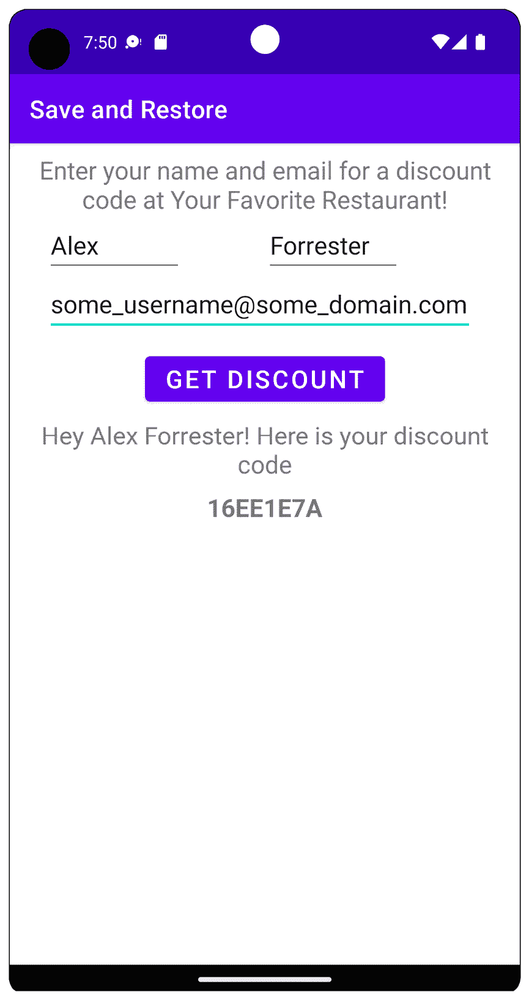

图 2.10 – 用户生成折扣代码后显示的屏幕

应用程序按预期运行，显示确认信息。

1.  现在，通过在模拟器控制中按第二个旋转按钮 () 来旋转手机，并观察结果：

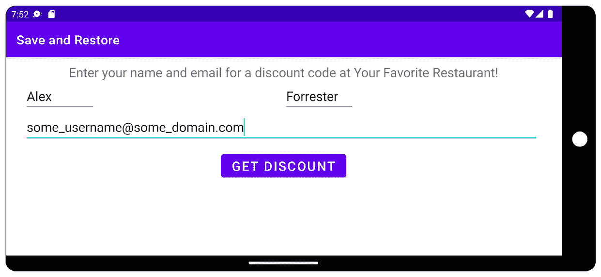

图 2.11 – 折扣代码不再显示在屏幕上

哦，不！折扣代码不见了。`TextView` 字段不会保留状态，因此您必须自己保存状态。

1.  返回 `MainActivity.kt` 并添加以下 Activity 回调：

    ```swift
    override fun onRestoreInstanceState(savedInstanceState: Bundle) {
        super.onRestoreInstanceState(savedInstanceState)
        Log.d(TAG, "onRestoreInstanceState")
    }
    override fun onSaveInstanceState(outState: Bundle) {
        super.onSaveInstanceState(outState)
        Log.d(TAG, "onSaveInstanceState")
    }
    ```

这些回调，正如其名称所表明的，使您能够保存和恢复实例状态。`on` **SaveInstanceState(outState: Bundle)** 允许您在 Activity 被置于后台或销毁时添加键值对，您可以在 `onCreate(savedInstanceState: Bundle?)` 或 `onRestoreInstanceState` **(**`savedInstanceState: Bundle)` 中检索这些键值对。

因此，您有两个回调来检索已设置的状态。如果您在 `onCreate(savedInstanceState: Bundle)` 中进行了大量的初始化，那么在 Activity 被重新创建时使用 `onRestoreInstanceState(savedInstanceState: Bundle)` 来检索这个实例状态可能更好。这样，可以清楚地知道哪个状态正在被重新创建。然而，如果您需要的设置很少，您可能更喜欢使用 `onCreate(savedInstanceState: Bundle)`。

无论你决定使用哪一个回调，你都将不得不获取在`onSaveInstanceState(outState: Bundle)`调用中设置的状态。对于练习的下一步，你将使用`onRestoreInstanceState(savedInstanceState: Bundle)`。

1.  在`MainActivity`的伴生对象中添加两个常量，该对象位于`MainActivity`的底部：

    ```swift
    private const val DISCOUNT_CONFIRMATION_MESSAGE =
    "DISCOUNT_CONFIRMATION_MESSAGE"
    private const val DISCOUNT_CODE = "DISCOUNT_CODE"
    ```

1.  现在，将这些常量作为要保存和检索的值的键，并在`onSaveInstanceState(outState: Bundle)`和`onRestoreInstanceState(savedInstanceState: Bundle)`函数中对 Activity 进行以下更改。

    ```swift
    override fun onRestoreInstanceState(savedInstanceState: Bundle) {
        super.onRestoreInstanceState(savedInstanceState)
        Log.d(TAG, "onRestoreInstanceState")
        // Get the discount code or an empty string if it 
           hasn't been set
        discountCode.text = savedInstanceState.
            getString(DISCOUNT_CODE,"")
        // Get the discount confirmation message or an empty 
           string if it hasn't been set
        discountCodeConfirmation.text = savedInstanceState.
            getString(DISCOUNT_CONFIRMATION_MESSAGE,"")
    }
    override fun onSaveInstanceState(outState: Bundle) {
        super.onSaveInstanceState(outState)
        Log.d(TAG, "onSaveInstanceState")
        outState.putString(DISCOUNT_CODE, discountCode.text.
        toString())
        outState.putString(DISCOUNT_CONFIRMATION_MESSAGE, 
        discountCodeConfirmation.text.toString())
    }
    ```

1.  运行应用，将值输入到`EditText`字段中，然后生成一个折扣码。然后旋转设备，你将看到折扣码在**图 2**.12*中恢复显示：

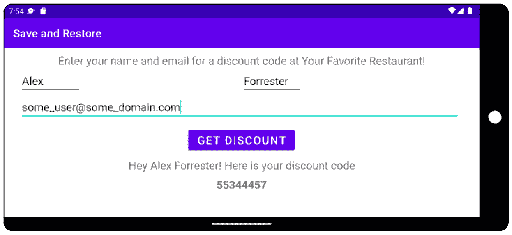

**图 2.12 – 折扣码继续在屏幕上显示**

在这个练习中，你首先看到了在配置更改时如何维护`EditText`字段的状态。你还使用了活动生命周期函数`onSaveInstanceState(outState: Bundle)`和`onCreate(savedInstanceState: Bundle?)`/`onRestoreInstanceState(savedInstanceState: Bundle)`来保存和恢复实例状态。这些函数提供了一种保存和恢复简单数据的方式。Android 框架还提供了`ViewModel`，这是一个生命周期感知的 Android 架构组件。如何保存和恢复此状态（使用`ViewModel`）的机制由框架管理，因此你不需要像前面示例中那样显式管理它。你将在*第十一章*，*Android* *架构组件*中学习如何使用此组件。

本练习的完整代码可以在以下链接找到：[`packt.link/zsGW3`](https://packt.link/zsGW3)。

在下一节中，你将为应用添加另一个 Activity 并在活动之间进行导航。

# Activity 与 Intents 的交互

Android 中的 intent 是一种组件间的通信机制。在你的应用内部，很多时候，当当前活动发生某些操作时，你将希望启动另一个特定的 Activity。指定确切哪个 Activity 将启动被称为从上一个练习中的`AndroidManifest.xml`文件，你将看到在`MainActivity`的`<intent-filter>` XML 元素中设置了两个 intent 过滤器示例：

```swift
<intent-filter>
    <action android:name="android.intent.action.MAIN"/>
    <category android:name="android.intent.category. LAUNCHER"/>
</intent-filter>
```

其中指定为 `<action android:name="android.intent.action.MAIN" />` 的意味着这是进入应用的主要入口点。根据设置的哪个类别，它控制当应用启动时哪个 Activity 首先启动。另一个指定的 intent 过滤器是 `<category android:name="android.intent.category.LAUNCHER" />`，它定义了应用应该出现在启动器中。当结合使用时，这两个 intent 过滤器定义了当从启动器启动应用时，`MainActivity` 应该启动。移除 `<action android:name="android.intent.action.MAIN" />` intent 过滤器会导致出现 `"Error running 'app': Default Activity not found"` 信息。由于应用没有主入口点，因此无法启动。如果您移除 `<category android:name="android.intent.category.LAUNCHER" />`，则没有地方可以从中启动。

在下一个练习中，您将看到 intents 如何在您的应用中导航工作。

## 练习 2.04 – Intent 简介

本练习的目标是创建一个简单的应用，使用 intents 根据用户的输入向用户显示文本：

1.  在 Android Studio 中创建一个新的项目，命名为 `Intents Introduction` 并选择一个空 Activity。一旦设置好项目，转到工具栏并选择 `File` | `New` | `Activity` | `Empty` `Activity`。将其命名为 `WelcomeActivity` 并保留所有其他默认设置。它将被添加到 `AndroidManifest.xml` 文件中，以便使用。您现在添加了 `WelcomeActivity` 后遇到的问题是不知道如何使用它。`MainActivity` 在您启动应用时启动，但您需要一种方法来启动 `WelcomeActivity`，并且可选地传递数据给它，这就是您使用 intent 的时候。

1.  为了完成此示例，请将以下字符串添加到 `strings.xml` 文件中。

    ```swift
        <string name="header_text">Please enter your name and 
            then we\'ll get started!</string>
        <string name="welcome_text">Hello %s, we hope you 
            enjoy using the app!</string>
        <string name="full_name_label">Enter your full 
            name:</string>
        <string name="submit_button_text">SUBMIT</string>
    ```

1.  接下来，在 `activity_main.xml` 中更改 `MainActivity` 布局，并用以下代码替换内容以添加一个 `EditText` 和一个 `Button`：

    ```swift
    <?xml version="1.0" encoding="utf-8"?>
    <androidx.constraintlayout.widget.ConstraintLayout
        xmlns:android=
          "http://schemas.android.com/apk/res/android"
        xmlns:app="http://schemas.android.com/apk/res-auto"
        xmlns:tools="http://schemas.android.com/tools"
        android:layout_width="match_parent"
        android:padding="28dp"
        android:layout_height="match_parent"
        tools:context=".MainActivity">
        <EditText
            android:id="@+id/full_name"
            android:layout_width="wrap_content"
            android:layout_height="wrap_content"
            android:textSize="28sp"
            android:hint="@string/full_name_label"
            android:layout_marginBottom="24dp"
            app:layout_constraintTop_toTopOf="parent"
            app:layout_constraintStart_toStartOf="parent"
            app:layout_constraintEnd_toEndOf="parent"/>
        <Button
            android:id="@+id/submit_button"
            android:textSize="24sp"
            android:layout_width="wrap_content"
            android:layout_height="wrap_content"
            android:text="@string/submit_button_text"
            app:layout_constraintTop_toBottomOf="@id/full_
                name"
            app:layout_constraintEnd_toEndOf="parent"
            app:layout_constraintStart_toStartOf="parent"/>
    </androidx.constraintlayout.widget.ConstraintLayout>
    ```

应用程序运行时看起来如 *图 2.13* 所示：

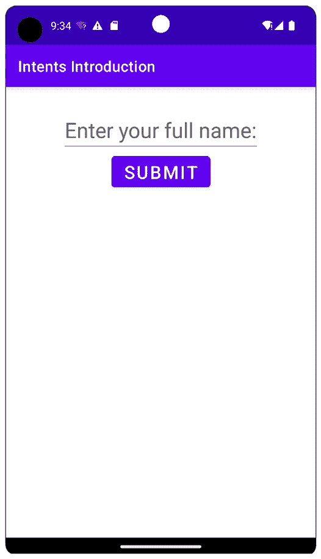

图 2.13 – 添加了 EditText 全名字段和提交按钮后的应用显示

您现在需要配置按钮，以便当它被点击时，从 `EditText` 字段中检索用户的全名，并将其通过 intent 发送，从而启动 `WelcomeActivity`。

1.  更新 `activity_welcome.xml` 布局文件以准备进行此操作：

    ```swift
    <?xml version="1.0" encoding="utf-8"?>
    <androidx.constraintlayout.widget.ConstraintLayout
        xmlns:android=
          "http://schemas.android.com/apk/res/android"
        xmlns:app="http://schemas.android.com/apk/res-auto"
        xmlns:tools="http://schemas.android.com/tools"
        android:layout_width="match_parent"
        android:layout_height="match_parent"
        tools:context=".WelcomeActivity">
        <TextView
            android:id="@+id/welcome_text"
            android:textSize="24sp"
            android:padding="24sp"
            android:layout_width="wrap_content"
            android:layout_height="wrap_content"
            app:layout_constraintTop_toTopOf="parent"
            app:layout_constraintEnd_toEndOf="parent"
            app:layout_constraintStart_toStartOf="parent"
            app:layout_constraintBottom_toBottomOf="parent"
            tools:text="Welcome John Smith we hope you enjoy 
                using the app!"/>
    </androidx.constraintlayout.widget.ConstraintLayout>
    ```

您正在添加一个 `TextView` 字段来显示用户的全名，并带有欢迎信息。创建全名和欢迎信息的逻辑将在下一步展示。

1.  现在，打开 `MainActivity` 并在类头之上添加一个常量值并更新导入：

    ```swift
    package com.example.intentsintroduction
    import android.content.Intent
    import android.os.Bundle
    import android.widget.Button
    import android.widget.EditText
    import android.widget.Toast
    import androidx.appcompat.app.AppCompatActivity
    const val FULL_NAME_KEY = "FULL_NAME_KEY"
    class MainActivity : AppCompatActivity(){
    …
    }
    ```

您将使用该常量来设置在 intent 中保存用户全名的键。

1.  然后，将以下代码添加到 `onCreate(savedInstanceState: Bundle?)` 的底部：

    ```swift
    findViewById<Button>(R.id.submit_button).setOnClickListener {
        val fullName = findViewById<EditText>(R.id.full_
            name).text.toString()
        if (fullName.isNotEmpty()) {
            // Set the name of the Activity to launch
            val welcomeIntent = Intent(this,
                WelcomeActivity::class.java)
            welcomeIntent.putExtra(FULL_NAME_KEY,
                fullName)
            startActivity(welcomeIntent)
        } else {
            Toast.makeText(this, getString(
                R.string.full_name_label),
                Toast.LENGTH_LONG).show()
        }
    }
    ```

有逻辑可以检索全名值并验证用户是否已填写此信息；如果没有填写，将显示一个弹出提示消息。然而，主要逻辑是获取 `EditText` 字段的 `fullName` 值，创建一个显式意图以启动 `WelcomeActivity`，然后将一个 `Extra` 键及其值放入 Intent 中。最后一步是使用该意图启动 `WelcomeActivity`。

1.  现在，运行应用，输入你的名字，然后按 **提交**，如图 *图 2.14* 所示：

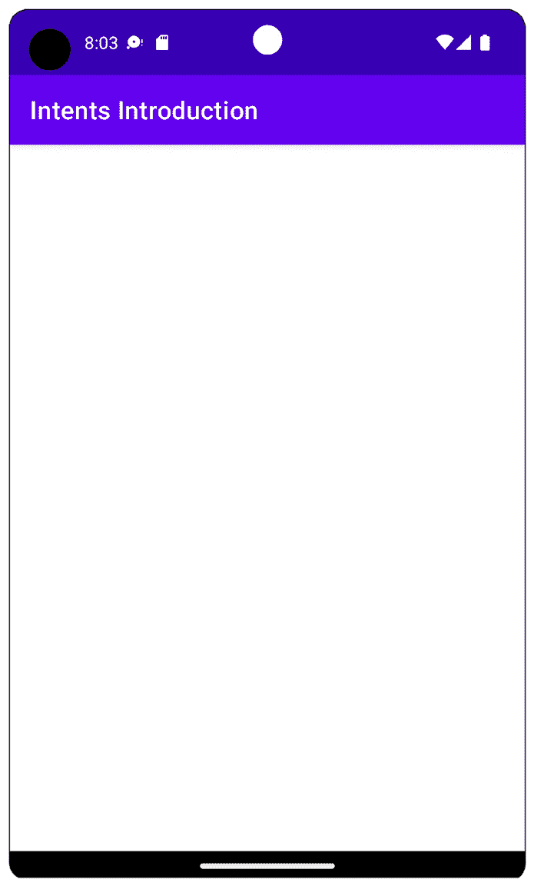

图 2.14 – 当未处理意图额外数据时显示的默认屏幕

嗯，这并不太令人印象深刻。你已经添加了发送用户名的逻辑，但没有显示它。

1.  要启用此功能，请打开 `WelcomeActivity` 并将导入 `import android.widget.TextView` 添加到导入列表中，并在 `onCreate(savedInstanceState: Bundle?)` 的底部添加以下内容：

    ```swift
    if (intent != null) {
        val fullName = intent.getStringExtra(FULL_NAME_KEY)
        findViewById<TextView>(R.id.welcome_text).text = 
            getString(R.string.welcome_text, fullName)
    }
    ```

我们检查启动 Activity 的意图是否不为空，然后通过获取字符串 `FULL_NAME_KEY` 额外键从 `MainActivity` 意图中检索字符串值。然后，我们通过从资源中获取字符串并将从意图中检索到的 `fullname` 值传递进去来格式化 `<string name="welcome_text">Hello %s, we hope you enjoy using the app!</string>` 资源字符串。最后，将此设置为 `TextView` 的文本。

1.  再次运行应用，将显示一个简单的问候语，如图 *图 2.15* 所示：

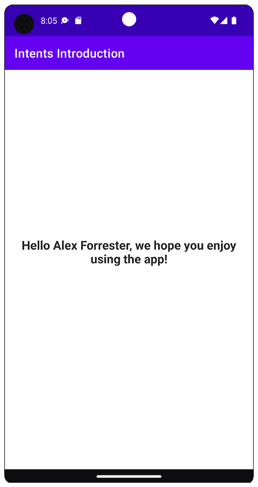

图 2.15 – 用户欢迎信息显示

虽然这个练习在布局和用户交互方面非常简单，但它允许展示意图的一些核心原则。你将使用它们来添加导航并从你的应用的一个部分创建到另一个部分的用户流程。在下一节中，你将看到如何使用意图启动 Activity 并从其中获取结果。

## 练习 2.05 – 从 Activity 中检索结果

对于某些用户流程，你将只为从 Activity 中获取结果而启动 Activity。这种模式通常用于请求使用特定功能，弹出对话框询问用户是否允许访问联系人、日历等，然后向调用 Activity 报告是或否的结果。在这个练习中，你将要求用户选择彩虹的最喜欢的颜色，一旦选择，就在调用 Activity 中显示结果：

1.  创建一个名为 `Activity Results` 的新项目，包含一个空 Activity，并将以下字符串添加到 `strings.xml` 文件中：

    ```swift
    <string name="header_text_main">Please click the button below to choose your favorite color of the rainbow!</string>
    <string name="header_text_picker">Rainbow Colors</string>
    <string name="footer_text_picker">Click the button above which is your favorite color of the rainbow.</string>
    <string name="color_chosen_message">%s is your favorite color!</string>
    <string name="submit_button_text">CHOOSE COLOR</string>
    <string name="red">RED</string>
    <string name="orange">ORANGE</string>
    <string name="yellow">YELLOW</string>
    <string name="green">GREEN</string>
    <string name="blue">BLUE</string>
    <string name="indigo">INDIGO</string>
    <string name="violet">VIOLET</string>
    <string name="unexpected_color">Unexpected color</string>
    ```

1.  将以下颜色添加到 `colors.xml`：

    ```swift
        <!--Colors of the Rainbow -->
        <color name="red">#FF0000</color>
        <color name="orange">#FF7F00</color>
        <color name="yellow">#FFFF00</color>
        <color name="green">#00FF00</color>
        <color name="blue">#0000FF</color>
        <color name="indigo">#4B0082</color>
        <color name="violet">#9400D3</color>
    ```

1.  现在，你必须设置将在 `MainActivity` 中设置结果的 Activity。转到 `RainbowColorPickerActivity`。

1.  更新 `activity_main.xml` 布局文件以显示标题、按钮，然后是一个隐藏的 `android:visibility="gone"` 视图，当结果报告时，该视图将被设置为用户彩虹色最喜欢的颜色：

    ```swift
    <?xml version="1.0" encoding="utf-8"?>
    <androidx.constraintlayout.widget.ConstraintLayout
        xmlns:android=
          "http://schemas.android.com/apk/res/android"
        xmlns:app="http://schemas.android.com/apk/res-auto"
        xmlns:tools="http://schemas.android.com/tools"
        android:layout_width="match_parent"
        android:layout_height="match_parent"
        tools:context=".MainActivity">
        <TextView
            android:id="@+id/header_text"
            android:textSize="20sp"
            android:padding="10dp"
            android:gravity="center"
            android:layout_width="wrap_content"
            android:layout_height="wrap_content"
            android:text="@string/header_text_main"
            app:layout_constraintTop_toTopOf="parent"
            app:layout_constraintEnd_toEndOf="parent"
            app:layout_constraintStart_toStartOf="parent"/>
        <Button
            android:id="@+id/submit_button"
            android:textSize="18sp"
            android:layout_width="wrap_content"
            android:layout_height="wrap_content"
            android:text="@string/submit_button_text"
            app:layout_constraintTop_toBottomOf="@id/header_
                text"
            app:layout_constraintEnd_toEndOf="parent"
            app:layout_constraintStart_toStartOf="parent"/>
        <TextView
            android:id="@+id/rainbow_color"
            android:layout_width="320dp"
            android:layout_height="50dp"
            android:layout_margin="12dp"
            android:textSize="22sp"
            android:textColor="@android:color/white"
            android:gravity="center"
            android:visibility="gone"
            tools:visibility="visible"
            app:layout_constraintTop_toBottomOf="@id/submit_
                button"
            app:layout_constraintStart_toStartOf="parent"
            app:layout_constraintEnd_toEndOf="parent"
            tools:text="BLUE is your favorite color"
            tools:background="@color/blue"/>
    </androidx.constraintlayout.widget.ConstraintLayout>
    ```

1.  你将使用 `registerForActivityResult(ActivityResultContracts.StartActivityForResult())` 函数从你启动的活动获取结果。为我们在 intent 中想要使用的值添加两个常量键，并在 `MainActivity` 的类标题上方添加一个默认颜色常量，并更新导入，使其显示如下，包括包名和导入：

    ```swift
    package com.example.activityresults
    import android.content.Intent
    import android.graphics.Color
    import android.os.Bundle
    import android.widget.Button
    import android.widget.TextView
    import androidx.activity.result.contract.ActivityResultContracts
    import androidx.appcompat.app.AppCompatActivity
    import androidx.core.content.ContextCompat
    import androidx.core.view.isVisible
    const val RAINBOW_COLOR_NAME = "RAINBOW_COLOR_NAME" // Key to return rainbow color name in intent
    const val RAINBOW_COLOR = "RAINBOW_COLOR" // Key to return rainbow color in intent
    const val DEFAULT_COLOR = "#FFFFFF" // White
    class MainActivity : AppCompatActivity()…
    ```

1.  然后，在类标题下方创建一个属性，用于启动新活动并从中返回结果：

    ```swift
    private val startForResult =
        registerForActivityResult(ActivityResultContracts.
        StartActivityForResult()) { activityResult ->
            val data = activityResult.data
            val backgroundColor = data?.getIntExtra(RAINBOW_
                COLOR, Color.parseColor(DEFAULT_COLOR))
                ?: Color.parseColor(DEFAULT_COLOR)
            val colorName = data?.getStringExtra(RAINBOW_
                COLOR_NAME) ?: ""
            val colorMessage = getString(R.string.color_
                chosen_message, colorName)
            val rainbowColor = findViewById<TextView>(R.
                id.rainbow_color)
            rainbowColor.setBackgroundColor(ContextCompat.
            getColor(this, backgroundColor))
            rainbowColor.text = colorMessage
            rainbowColor.isVisible = true
        }
    ```

一旦返回结果，你可以继续查询期望的 intent 数据。对于这个练习，我们想要获取背景颜色名称（`colorName`）和颜色的十六进制值（`backgroundColor`），以便我们可以显示它。`?` 操作符检查值是否为 null（即在 intent 中未设置），如果是，则 Elvis 操作符（`?:`）设置默认值。颜色消息使用字符串格式化来设置消息，将资源值中的占位符替换为颜色名称。现在你已经得到了颜色，你可以使 `rainbow_color` `TextView` 字段可见，并将视图的背景颜色设置为 `backgroundColor`，并添加显示用户彩虹色最喜欢的颜色名称的文本。

1.  首先，将启动 Activity 的逻辑添加到之前定义的属性中，方法是在 `onCreate(savedInstanceState: Bundle?)` 的底部添加以下代码：

    ```swift
        findViewById<Button>(R.id.submit_button)
        .setOnClickListener {
            startForResult.launch(Intent(this,
            RainbowColorPickerActivity::class.java)
            )
        }
    ```

这将创建一个用于返回结果的 Intent：`Intent(this, RainbowColorPickerActivity::class.java)`。

1.  对于 `RainbowColorPickerActivity` 活动的布局，你将显示一个带有背景颜色和颜色名称的按钮，每个彩虹的七种颜色：`RED`、`ORANGE`、`YELLOW`、`GREEN`、`BLUE`、`INDIGO` 和 `VIOLET`。这些将在一个 `LinearLayout` 垂直列表中显示。对于本书中的大多数布局文件，你将使用 `ConstraintLayout`，因为它提供了对单个视图的精细定位。对于需要显示少量垂直或水平列表的情况，`LinearLayout` 也是一个不错的选择。如果你需要显示大量项目，那么 `RecyclerView` 是更好的选择，因为它可以缓存单个行的布局并回收屏幕上不再显示的视图。你将在 *第六章*，*RecyclerView* 中了解 `RecyclerView`。

1.  在 `RainbowColorPickerActivity` 中，你需要做的第一件事是创建布局。这将是你向用户展示选择他们彩虹色最喜欢的颜色的选项的地方。

1.  打开 `activity_rainbow_color_picker.xml` 并替换布局，插入以下内容：

    ```swift
    <?xml version="1.0" encoding="utf-8"?>
    <ScrollView xmlns:android=
        "http://schemas.android.com/apk/res/android"
        xmlns:app="http://schemas.android.com/apk/res-auto"
        xmlns:tools="http://schemas.android.com/tools"
        android:layout_width="match_parent"
        android:layout_height="wrap_content">
    </ScrollView>
    ```

我们添加`ScrollView`以允许内容在屏幕高度无法显示所有项目时滚动。`ScrollView`只能接受一个子视图，即要滚动的布局。

1.  接下来，在`ScrollView`内添加`LinearLayout`以按添加顺序显示包含的视图，包括页眉和页脚。第一个子视图是一个带有页面标题的页眉，最后添加的视图是一个带有用户选择颜色说明的页脚：

    ```swift
    <LinearLayout
        android:layout_width="match_parent"
        android:layout_height="wrap_content"
        android:gravity="center_horizontal"
        android:orientation="vertical"
        tools:context=".RainbowColorPickerActivity">
        <TextView
            android:id="@+id/header_text"
            android:layout_width="wrap_content"
            android:layout_height="wrap_content"
            android:layout_marginTop="10dp"
            android:padding="10dp"
            android:text="@string/header_text_picker"
            android:textAllCaps="true"
            android:textSize="24sp"
            android:textStyle="bold"
            app:layout_constraintEnd_toEndOf="parent"
            app:layout_constraintStart_toStartOf="parent"
            app:layout_constraintTop_toTopOf="parent" />
        <TextView
            android:layout_width="380dp"
            android:layout_height="wrap_content"
            android:gravity="center"
            android:padding="10dp"
            android:text="@string/footer_text_picker"
            android:textSize="20sp"
            app:layout_constraintEnd_toEndOf="parent"
            app:layout_constraintStart_toStartOf="parent"
            app:layout_constraintTop_toTopOf="parent" />
    </LinearLayout>
    ```

布局现在应该看起来与应用中的*图 2.16*一样：

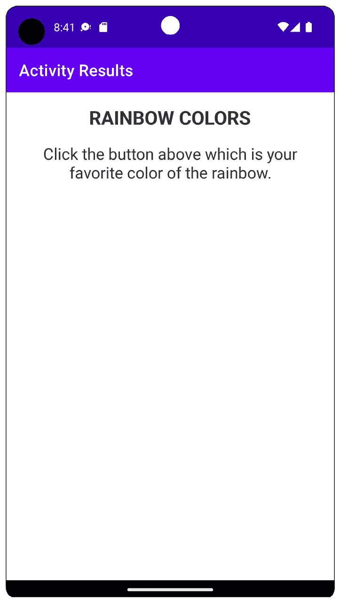

图 2.16 – 带有页眉和页脚的彩虹颜色屏幕

1.  现在，最后，在页眉和页脚之间添加按钮视图以选择彩虹颜色，然后运行应用（以下代码仅显示第一个按钮）。完整的布局可在[`packt.link/ZgdHX`](https://packt.link/ZgdHX)找到：

    ```swift
        <Button
            android:id="@+id/red_button"
            android:layout_width="120dp"
            android:layout_height="wrap_content"
            android:backgroundTint="@color/red"
            android:text="@string/red" />
    ```

这些按钮按照彩虹的颜色顺序显示，带有颜色文本和背景。XML 中的`id`属性是你在 Activity 中准备返回给调用 Activity 的结果。

1.  现在，打开`RainbowColorPickerActivity`并将内容替换为以下内容：

    ```swift
    package com.example.activityresults
    import android.app.Activity
    import android.content.Intent
    import androidx.appcompat.app.AppCompatActivity
    import android.os.Bundle
    import android.view.View
    import android.widget.Toast
    class RainbowColorPickerActivity : AppCompatActivity() {
        override fun onCreate(savedInstanceState: Bundle?) {
            super.onCreate(savedInstanceState)
            setContentView(R.layout.activity_rainbow_color_
                picker)
        }
        private fun setRainbowColor(colorName: String, color: 
        Int) {
            Intent().let { pickedColorIntent ->
                pickedColorIntent.putExtra(RAINBOW_COLOR_
                    NAME, colorName)
                pickedColorIntent.putExtra(RAINBOW_COLOR, 
                    color)
                setResult(Activity.RESULT_OK, 
                    pickedColorIntent)
                finish()
            }
        }
    }
    ```

`setRainbowColor`函数创建一个意图，并将彩虹颜色名称和彩虹颜色的`hex`值作为字符串附加信息添加。然后结果返回给调用 Activity，由于你不再使用此 Activity，你调用`finish()`以便显示调用 Activity。检索用户选择的彩虹颜色的方式是在布局中的所有按钮上添加监听器。

1.  现在，将以下内容添加到`onCreate(savedInstanceState: Bundle?)`的底部：

    ```swift
    val colorPickerClickListener = View.OnClickListener { view ->
        when (view.id) {
            R.id.red_button -> setRainbowColor(getString(R.
                string.red), R.color.red)
            R.id.orange_button -> setRainbowColor(getString(R.
                string.orange), R.color.orange)
            R.id.yellow_button -> setRainbowColor(getString(R.
                string.yellow), R.color.yellow)
            R.id.green_button -> setRainbowColor(getString(R.
                string.green), R.color.green)
            R.id.blue_button -> setRainbowColor(getString(R.
                string.blue), R.color.blue)
            R.id.indigo_button -> setRainbowColor(getString(R.
                string.indigo), R.color.indigo)
            R.id.violet_button -> setRainbowColor(getString(R.
                string.violet), R.color.violet)
            else -> {
                Toast.makeText(this, getString(R.string.
                    unexpected_color), Toast.LENGTH_LONG)
                    .show()
            }
        }
    }
    ```

在前面的代码中添加的`colorPickerClickListener`通过使用`when`语句确定`setRainbowColor(colorName: String, color: Int)`函数要设置的颜色。`when`语句相当于 Java 和基于 C 的语言中的`switch`语句。它允许一个分支满足多个条件，并且更简洁。在前面的示例中，`view.id`与彩虹布局按钮的 ID 匹配，当找到时，执行分支，从字符串资源设置颜色名称和十六进制值以传递给`setRainbowColor(colorName: String, color: Int)`。

1.  现在，将此点击监听器添加到前面的代码下面的布局中的按钮：

    ```swift
    findViewById<View>(R.id.red_button).setOnClickListener(colorPickerClickListener)
    findViewById<View>(R.id.orange_button).setOnClickListener(colorPickerClickListener)findViewById<View>(R.id.yellow_button).setOnClickListener(colorPickerClickListener)
    findViewById<View>(R.id.green_button).setOnClickListener(colorPickerClickListener)
    findViewById<View>(R.id.blue_button).setOnClickListener(colorPickerClickListener)
    findViewById<View>(R.id.indigo_button).setOnClickListener(colorPickerClickListener)
    findViewById<View>(R.id.violet_button).setOnClickListener(colorPickerClickListener)
    ```

每个按钮都附加了一个`ClickListener`接口，由于操作相同，它们附加了相同的`ClickListener`接口。然后，当按钮被按下时，它设置用户选择的颜色结果并将其返回给调用 Activity。

1.  现在，运行应用并按下*图 2.17*中显示的`选择颜色`按钮：

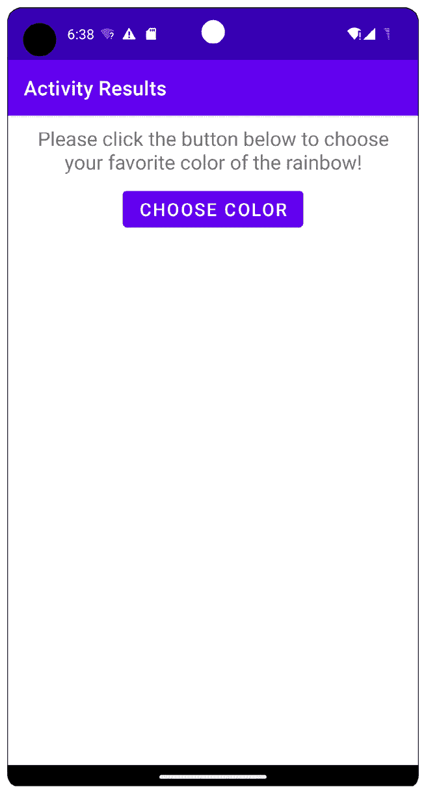

图 2.17 – 彩虹颜色应用启动屏幕

1.  现在，选择您最喜欢的彩虹颜色：

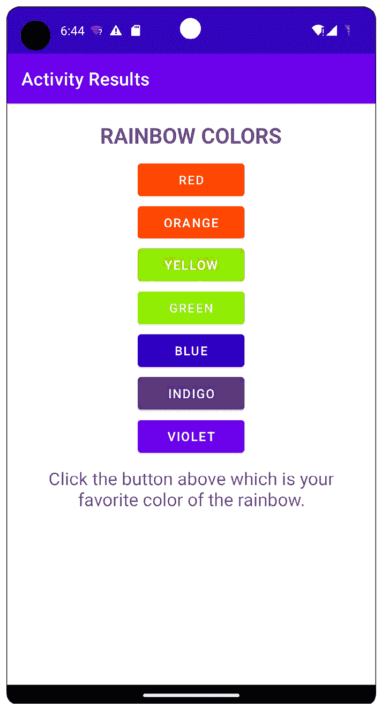

图 2.18 – 彩虹颜色选择屏幕

1.  一旦您选择了您最喜欢的颜色，就会显示一个带有您最喜欢的颜色的屏幕，如图 *图 2.19* 所示：

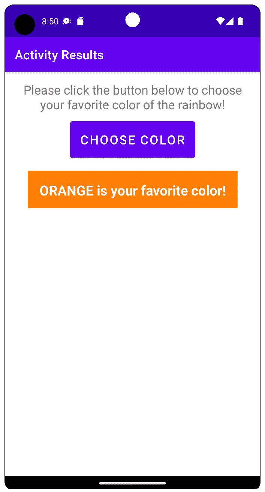

图 2.19 – 显示所选颜色的应用

如您所见，应用在 *图 2.19* 中显示了您选定的作为您最喜欢的颜色。

这个练习向您介绍了使用 `registerFor` **ActivityResult** 创建用户流程的另一种方法。这在执行需要在使用者通过应用流程之前获取结果的专用任务时非常有用。接下来，您将探索启动模式以及它们在构建应用时对用户旅程流程的影响。

# Intents、Tasks 和启动模式

到目前为止，您一直在使用创建 Activity 和从一个 Activity 转移到下一个 Activity 的标准行为。当您以默认行为从启动器打开应用时，它会创建自己的 Task，并且您创建的每个 Activity 都会被添加到一个回退栈中，因此当您作为用户旅程的一部分连续打开三个 Activity 时，按三次返回按钮会将用户带回到之前的屏幕/Activity，然后返回到设备的首页，同时仍然保持应用打开。

这种类型的 Activity 的启动模式称为 `Standard`；它是默认的，不需要在 `AndroidManifest.xml` 的 Activity 元素中指定。即使您连续三次启动相同的 Activity，也会有三个相同的行为实例。

对于某些应用，您可能希望更改此行为，以便使用相同的实例。可以在这里帮助的启动模式称为 `singleTop`。如果一个 `singleTop` Activity 是最近添加的，当再次启动相同的 `singleTop` Activity 时，则不会创建新的 Activity，而是使用相同的 Activity 并运行 `onNewIntent` 回调。在这个回调中，您会收到一个意图，然后您可以像之前在 `onCreate` 中所做的那样处理这个意图。

有三种其他启动模式需要了解，称为 `singleTask`、`singleInstance` 和 `singleInstancePerTask`。这些不是通用用途，仅用于特殊场景。所有启动模式的详细文档可以在此查看：[`developer.android.com/guide/topics/manifest/activity-element#lmode`](https://developer.android.com/guide/topics/manifest/activity-element#lmode)。

在下一个练习中，您将探索 `Standard` 和 `singleTop` 启动模式的行为差异。

## 练习 2.06 – 设置 Activity 的启动模式

这个练习包含了许多不同的布局文件和活动，以说明两种最常用的启动模式。请从[`packt.link/DQrGI`](https://packt.link/DQrGI)下载代码：

1.  打开`activity_main.xml`文件并检查它。

这在使用布局文件时说明了新概念。如果你有一个布局文件，并且想要将其包含在另一个布局中，你可以使用`<include>` XML 元素（查看以下布局文件的片段）：

```swift
<include layout="@layout/letters"
    android:id="@+id/letters_layout"
    android:layout_width="wrap_content"
    android:layout_height="wrap_content"
    app:layout_constraintLeft_toLeftOf="parent"
    app:layout_constraintRight_toRightOf="parent"
    app:layout_constraintTop_toBottomOf="@id/launch_mode_
        standard"/>
<include layout="@layout/numbers"
    android:layout_width="wrap_content"
    android:layout_height="wrap_content"
    app:layout_constraintLeft_toLeftOf="parent"
    app:layout_constraintRight_toRightOf="parent"
    app:layout_constraintTop_toBottomOf="@id/launch_mode_
        single_top"/>
```

前面的布局使用`include` XML 元素包含了两个布局文件：`letters.xml`和`numbers.xml`。

1.  打开并检查位于`res` | `layout`文件夹中的`letters.xml`和`numbers.xml`文件。这两个文件非常相似，它们之间的区别仅在于包含的按钮的 ID 以及显示的文本标签。

1.  运行应用，你会看到以下屏幕：

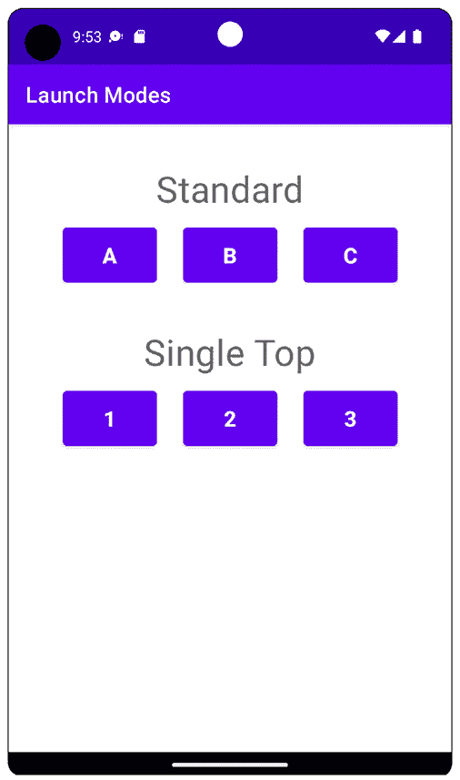

图 2.20 – 显示标准模式和单顶模式的 App

为了演示/说明`standard`和`singleTop`活动启动模式之间的区别，你必须依次启动两个或三个活动。

1.  打开`MainActivity`并检查`onCreate(savedInstanceState: Bundle?)`中的代码块内容（已截断）：

    ```swift
    val buttonClickListener = View.OnClickListener { view ->
        when (view.id) {
            R.id.letterA -> startActivity(Intent(this, 
                ActivityA::class.java))
            // Other letters and numbers follow the same 
               pattern/flow
            else -> {
                Toast.makeText(
                    this, getString(
                        R.string.unexpected_button_pressed
                    ),
                    Toast.LENGTH_LONG
                )
                    .show()
            }
        }
    }
    findViewById<View>(R.id.letterA).setOnClickListener(buttonClickListener)
    // The buttonClickListener is set on all the number and letter views
    ```

主活动和其他活动包含的逻辑基本上是相同的。它显示一个活动，并允许用户按下按钮以相同的逻辑启动另一个活动，即创建一个`ClickListener`并将其设置在你在*练习 2.05*，*从* *活动* *获取结果*中看到的按钮上。

1.  打开`AndroidManifest.xml`文件，你会看到以下活动显示：

    ```swift
    <activity android:name=".ActivityA" android:launchMode="standard"/>
    <activity android:name=".ActivityB" android:launchMode="standard"/>
    <activity android:name=".ActivityC" android:launchMode="standard"/>
    <activity android:name=".ActivityOne" android:launchMode="singleTop"/>
    <activity android:name=".ActivityTwo" android:launchMode="singleTop"/>
    <activity android:name=".ActivityThree" android:launchMode="singleTop"/>
    ```

你根据主屏幕上的按钮点击来启动一个活动，但字母和数字活动有不同的启动模式，这可以在`AndroidManifest.xml`文件中看到。

这里指定了`standard`启动模式，以说明`standard`和`singleTop`之间的区别，但`standard`是默认的，如果没有`android:launchMode` XML 属性，活动将以这种方式启动。

1.  点击`标准`标题下的任意字母，你会看到以下屏幕（带有**A**、**B**或**C**）：

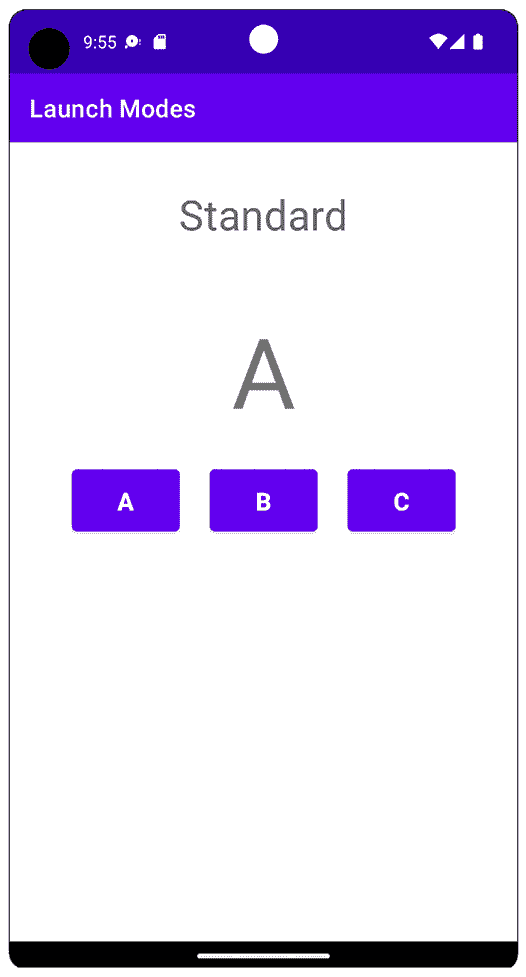

图 2.21 – 显示标准活动的 App

1.  持续按下任意字母按钮，这将启动另一个活动。日志已添加以显示此启动活动的序列。以下是随机按下 10 个字母活动后的日志：

    ```swift
    MainActivity com.example.launchmodes onCreate
    Activity A   com.example.launchmodes onCreate
    Activity A   com.example.launchmodes onCreate
    Activity B   com.example.launchmodes onCreate
    Activity B   com.example.launchmodes onCreate
    Activity C   com.example.launchmodes onCreate
    Activity B   com.example.launchmodes onCreate
    Activity B   com.example.launchmodes onCreate
    Activity A   com.example.launchmodes onCreate
    Activity C   com.example.launchmodes onCreate
    Activity B   com.example.launchmodes onCreate
    Activity C   com.example.launchmodes onCreate
    ```

如果你观察前面的日志，每次用户在启动模式下按下字符按钮时，都会启动一个新的字符活动实例并将其添加到返回栈中。

1.  关闭应用，确保它不是后台运行（或在最近/概览菜单中），而是真正关闭，然后再次打开应用并按下 **Single** **Top** 标题下的一个数字按钮：

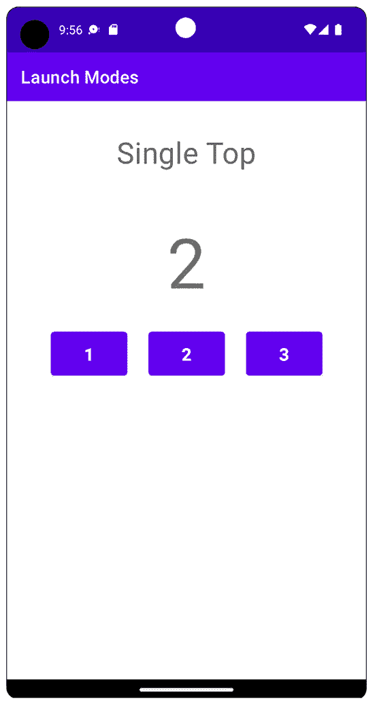

图 2.22 – 显示 Single Top 活动的应用

1.  按下数字按钮 10 次，但确保在按下另一个数字按钮之前至少连续两次按下相同的数字按钮。

你应该在 **Logcat** 窗口中看到的日志应该类似于以下内容：

```swift
MainActivity com.example.launchmodes  onCreate
Activity 1   com.example.launchmodes  onCreate
Activity 1   com.example.launchmodes  onNewIntent
Activity 2   com.example.launchmodes  onCreate
Activity 2   com.example.launchmodes  onNewIntent
Activity 3   com.example.launchmodes  onCreate
Activity 2   com.example.launchmodes  onCreate
Activity 3   com.example.launchmodes  onCreate
Activity 3   com.example.launchmodes  onNewIntent
Activity 1   com.example.launchmodes  onCreate
Activity 1   com.example.launchmodes  onNewIntent
```

你会注意到，当你连续至少两次按下相同的按钮时，不会调用 `onCreate`，而是调用 `onNewIntent`。如果你按下返回按钮，你会注意到，你只需点击不到 10 次就能退出应用并返回主屏幕，这反映了实际上没有创建 10 个活动。

## 活动二.01 – 创建登录表单

这个活动的目的是创建一个带有用户名和密码字段的登录表单。一旦这些字段中的值被提交，将这些输入的值与硬编码的值进行比较，如果匹配，则显示欢迎消息，如果不匹配，则显示错误消息，并将用户返回到登录表单。实现这一目标所需的步骤如下：

1.  创建一个包含用户名和密码 `EditText` 视图以及 `LOGIN` 按钮的表单。

1.  将 `ClickListener` 接口添加到按钮上，以响应按钮点击事件。

1.  验证表单字段是否已填写。

1.  将提交的用户名和密码字段与硬编码的值进行比较。

1.  如果成功，显示带有用户名的欢迎消息并隐藏表单。

1.  如果不成功，显示错误消息并将用户重定向回表单。

你可以尝试完成这个活动的一些方法。以下是你可以采用的三种方法的想法：

+   使用 `singleTop` 活动并发送一个意图路由到相同的活动以验证凭据

+   使用 `standard` 活动将用户名和密码传递给另一个活动并验证凭据

+   使用 `registerForActivityResult` 在另一个活动中执行验证，然后返回结果

完成的应用在首次加载时应该看起来像 *图 2.23*：

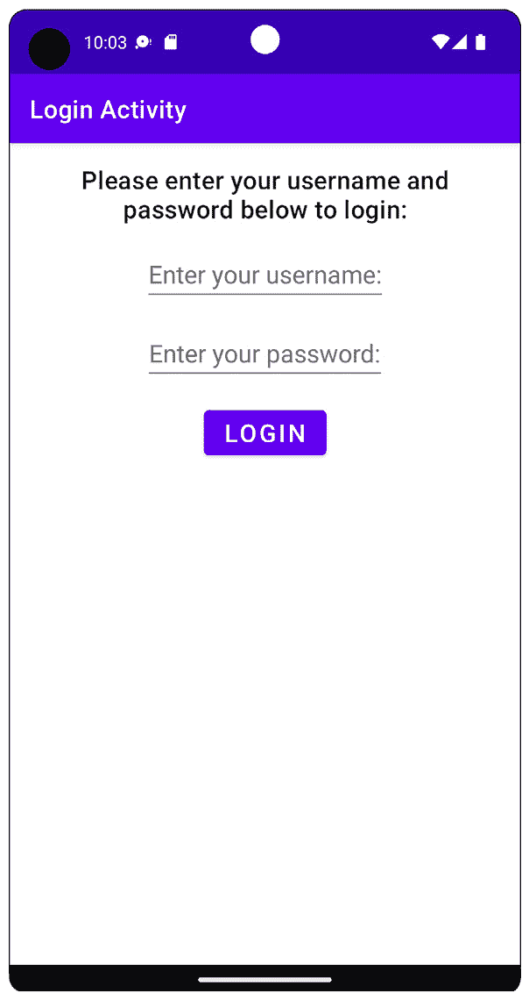

图 2.23 – 应用首次加载时的显示

注意

这个活动的解决方案可以在 [`packt.link/PmKJ6`](https://packt.link/PmKJ6) 找到。

# 摘要

在本章中，您已经涵盖了您应用程序与 Android 框架交互的基础知识，从 Activity 生命周期回调到在活动中保留状态，从一屏幕导航到另一屏幕，以及意图和启动模式如何实现这一切。这些是您为了进入更高级主题所必须理解的核心概念。

在下一章中，您将了解到片段以及它们如何融入您应用程序的架构，同时还将探索更多关于 Android 资源框架的内容。
