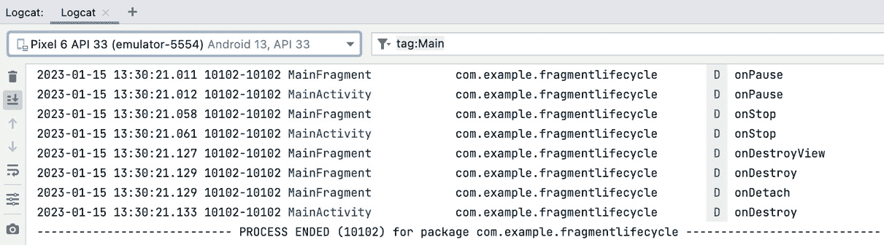

# 使用片段开发 UI

本章涵盖了片段和片段生命周期。它展示了如何使用它们来构建高效且动态的布局，这些布局能够响应不同的屏幕尺寸和配置，并允许你将你的 UI 划分为不同的部分。在本章结束时，你将能够创建静态和动态片段，在片段和活动之间传递数据，并使用 Jetpack `Navigation` 组件详细说明片段如何组合在一起。

在上一章中，我们探讨了 Android 活动生命周期，并研究了它在应用中用于屏幕间导航的方式。我们还分析了各种启动模式，这些模式定义了屏幕间转换是如何发生的。在本章中，你将探索片段。片段是一个部分、部分，或者正如其名称所暗示的，Android 活动的一部分。

在本章中，你将学习如何使用片段，了解它们可以存在于多个活动中，并发现如何在单个活动中使用多个片段。你将从向活动添加简单的片段开始，然后逐步学习静态和动态片段之间的区别。

可以使用片段来简化为具有较大尺寸的 Android 平板创建布局。例如，如果你有一个平均尺寸的手机屏幕，并且你想包含新闻故事列表，你可能只有足够的空间来显示列表。

如果你在一个平板上查看相同的新闻故事列表，你会拥有更多的可用空间，因此你可以显示相同的列表，并在列表的右侧显示一个故事。屏幕上的每个不同区域都可以使用一个片段。然后你可以在手机和平板上都使用相同的片段。你可以从重用和简化布局中受益，无需重复创建类似的功能。

在探索了片段的创建和使用方法之后，你将学习如何使用片段组织用户旅程。你将应用一些使用片段的既定实践。最后，你将学习如何通过使用 Android Jetpack `Navigation` 组件创建导航图来简化片段的使用，该组件允许你指定将片段与目的地链接在一起。

本章我们将涵盖以下主题：

+   片段生命周期

+   静态片段和双面板布局

+   动态片段

+   Jetpack 导航

# 技术要求

本章中所有练习和活动的完整代码可在 GitHub 上找到，网址为 [`packt.link/KmdBZ`](https://packt.link/KmdBZ)

# 片段生命周期

一个片段是一个具有自己生命周期的组件。理解片段的生命周期至关重要，因为它在片段创建、运行状态和销毁的某些阶段提供回调，这些回调配置了初始化、显示和清理。片段在活动中运行，一个片段的生命周期绑定到活动生命周期。

在许多方面，片段的生命周期与活动生命周期非常相似，乍一看，似乎前者复制了后者。片段生命周期中与活动生命周期相同或类似的回调有很多，例如`onCreate(savedInstanceState: Bundle?)`。

片段生命周期与活动生命周期相关联，因此无论在哪里使用片段，片段回调都会与活动回调交织在一起。

初始化片段并准备在用户交互之前显示给用户之前，会执行相同的步骤。当应用处于后台、隐藏或退出时，片段也会经历与活动相同的拆解步骤。片段，就像活动一样，必须扩展/从父`Fragment`类派生，你可以根据你的用例选择要覆盖哪些回调。生命周期在以下图中显示，随后是每个函数的更多详细信息。


Figure 3.1 – Fragment 生命周期

让我们现在来探索这些回调，它们出现的顺序，以及它们的作用。

## onAttach

`override fun onAttach(context: Context)`：这是你的片段与其所使用的活动关联起来的时刻。它允许你引用活动，尽管在这个阶段，片段和活动都还没有完全创建。

## onCreate

`override fun onCreate(savedInstanceState: Bundle?)`：这是你进行片段初始化的地方。这不是设置片段布局的地方，因为在这一阶段，没有可显示的 UI，也没有像活动中的`setContentView`那样的设置。

## onCreateView

`override fun onCreateView(inflater: LayoutInflater, container: ViewGroup?, savedInstanceState: Bundle?): View?`：现在，这是你创建片段布局的地方。在这里要记住的最重要的事情是，与活动不同，片段实际上会从这个函数返回布局`View?`。

在你的布局中看到的视图在这里都可以参考，但也有一些注意事项。你需要在引用其中包含的视图之前创建布局，这就是为什么建议在`onViewCreated`中进行视图操作。

## onViewCreated

`override fun onViewCreated(view View, savedInstanceState: Bundle?)`：这个回调是在片段完全创建和向用户可见之间的一个回调。通常在这里设置视图，并添加任何功能性和交互性到这些视图。这可能包括给按钮添加`OnClickListener`，并在点击时调用一个函数。

## onActivityCreated

`override fun onActivityCreated(context: Context)`: 这是在活动 `onCreate` 运行后立即调用的。片段的视图状态的大多数初始化都将完成，如果需要，这是进行最终设置的地方。

## onStart

`override fun onStart()`: 当片段即将对用户可见但用户尚不能与之交互时调用。

## onResume

`override fun onResume()`: 在这次调用结束时，你的片段可供用户交互。通常，在此回调中定义的设置或功能最少，因为当应用进入后台然后返回前台时，此回调总是会调用。

因此，你不想在可以不运行当片段变得可见时不必要地重复设置片段。

## onPause

`override fun onPause()`: 与其对应的活动中的 `onPause()` 一样，`onPause()` 表示你的应用正在进入后台或被屏幕上的其他内容部分覆盖。使用此回调来保存片段状态的变化。

## onStop

`override fun onStop()`: 在这次调用结束时，该片段不再可见并进入后台。

## onDestroyView

`override fun onDestroyView()`: 这通常是在片段被销毁之前进行最终清理时调用的。如果你需要清理任何资源，应使用此回调。如果片段被推送到后台栈并保留，则也可以不销毁片段而调用它。完成此回调后，片段的布局视图将被移除。

## onDestroy

`override fun onDestroy()`: 正在销毁片段。这可能是因为应用被杀死，或者是因为这个片段被另一个片段替换。

## onDetach

`override fun onDetach()`: 当片段与其活动分离时调用。

有更多的片段回调，但这些都是你将在大多数情况下使用的。通常，你只会使用这些回调的一部分：`onAttach()` 将活动与片段关联，`onCreate` 初始化片段，`onCreateView` 设置布局，然后 `onViewCreated`/`onActivityCreated` 进行进一步初始化，也许还有 `onPause()` 进行一些清理。

注意

这些回调的更多详细信息可以在官方文档中找到，网址为 https://developer.android.com/guide/fragments。

现在我们已经了解了片段生命周期的理论以及它是如何受宿主活动生命周期影响的，让我们看看这些回调在实际运行中的情况。

## 练习 3.01 – 添加基本片段和片段生命周期

在这个练习中，我们将创建并添加一个基本片段到应用中。这个练习的目的是熟悉片段如何添加到活动中以及它们显示的布局。为此，你将在 Android Studio 中创建一个新的空白片段及其布局。然后，你将添加片段到活动中，并通过片段布局的显示来验证片段已被添加。执行以下步骤：

1.  在 Android Studio 中创建一个名为 `Fragment Lifecycle` 的空活动应用。

1.  一旦应用构建完成，通过转到 `Fragment (Blank)` 选项创建一个新的片段。当你选择此选项时，你将看到 *图 3**.2* 中显示的屏幕：


图 3.2 – 创建新片段

1.  将片段重命名为 `MainFragment` 和布局重命名为 `fragment_main`。然后，按 `Fragment` 类将被创建并打开。已添加两个函数：`onCreate`，用于初始化片段，以及 `onCreateView`（在以下代码片段中显示），用于填充用于片段的布局文件：

    ```swift
        override fun onCreateView(
            inflater: LayoutInflater, container:
                ViewGroup?,
            savedInstanceState: Bundle?
        ): View? {
            // Inflate the layout for this fragment
            return inflater.inflate(
                R.layout.fragment_main, container, false)
        }
    ```

1.  当你打开 `fragment_main.xml` 布局文件时，你会看到以下代码：

    ```swift
    <?xml version="1.0" encoding="utf-8"?>
    <FrameLayout
    xmlns:android=
      "http://schemas.android.com/apk/res/android"
        xmlns:tools="http://schemas.android.com/tools"
        android:layout_width="match_parent"
        android:layout_height="match_parent"
        tools:context=".MainFragment">
        <!-- TODO: Update blank fragment layout -->
        <TextView
            android:layout_width="match_parent"
            android:layout_height="match_parent"
            android:text="@string/hello_blank_fragment" />
    </FrameLayout>
    ```

已添加一个简单的布局，包含一个 `TextView` 和一些使用 `@string/hello_blank_fragment` 的示例文本。这个字符串资源中的文本是 `hello blank fragment`。由于 `layout_width` 和 `layout_height` 被指定为 `match_parent`，`TextView` 将占据整个屏幕。然而，文本本身将添加到视图的左上角，使用默认位置。

1.  将 `android:gravity="center"` 属性和值添加到 `TextView` 中，以便文本显示在屏幕中央：

    ```swift
        <TextView
            android:layout_width="match_parent"
            android:layout_height="match_parent"
            android:gravity="center"
            android:text="@string/hello_blank_fragment" />
    ```

如果你现在运行 UI，你将在 *图 3**.3* 中看到 **Hello World!** 显示：


图 3.3 – 添加片段前的初始应用布局显示

好吧，你可以看到一些你可能期望的 `hello blank fragment` 文本。当你创建片段时，片段及其布局不会自动添加到活动中。这是一个手动过程。

1.  打开 `activity_main.xml` 文件，并用以下内容替换：

    ```swift
    <?xml version="1.0" encoding="utf-8"?>
    <androidx.constraintlayout.widget.ConstraintLayout
        xmlns:android=
          "http://schemas.android.com/apk/res/android"
        xmlns:tools="http://schemas.android.com/tools"
        android:layout_width="match_parent"
        android:layout_height="match_parent"
        tools:context="com.example.fragmentlifecycle
            .MainActivity">
        <fragment
            android:id="@+id/main_fragment"
            android:name="com.example.fragmentlifecycle
                .MainFragment"
            android:layout_width="match_parent"
            android:layout_height="match_parent" />
    </androidx.constraintlayout.widget.ConstraintLayout>
    ```

正如你可以在 XML 布局中添加视图声明一样，也存在一个 `fragment` 元素。你已经将片段添加到 `ConstraintLayout` 中，`layout_width` 和 `layout_height` 的约束为 `match_parent`，因此它将占据整个屏幕。

在这里需要检查的最重要的 `xml` 属性是 `android:name`。正是在这里，你指定了要添加到布局中的 `Fragment` 类的完整限定名和包名，使用 `com.example.fragmentlifecycle.MainFragment`。现在运行应用，你将看到 *图 3**.4* 中显示的输出：


图 3.4 – 添加片段后的应用布局显示

这证明了您的文本为`Hello blank fragment`的片段已添加到活动中，并且您定义的布局正在显示。接下来，您将检查活动与片段之间的回调方法以及这是如何发生的。

1.  打开`MainFragment`类，并在伴随对象中添加一个`TAG`常量，其值为`"MainFragment"`以标识该类。

    ```swift
    private const val TAG = "MainFragment"
    ```

然后，添加/更新函数并添加适当的日志语句。

您需要将`Log`语句和`context`的导入添加到类的顶部的导入中。以下代码片段被截断。请按照显示的链接查看您需要使用的完整代码块：

MainFragment.kt

```swift
import android.content.Context
import android.util.Log
    override fun onAttach(context: Context) {
        super.onAttach(context)
        Log.d(TAG, "onAttach: ")
    }
    override fun onCreate(savedInstanceState: Bundle?)
    {
        super.onCreate(savedInstanceState)
        Log.d(TAG,"onCreate: ")
        arguments?.let {
            param1 = it.getString(ARG_PARAM1)
            param2 = it.getString(ARG_PARAM2)
        }
    }
    override fun onCreateView(
        inflater: LayoutInflater, container:
            ViewGroup?, savedInstanceState: Bundle?
    ): View? {
        Log.d(TAG,"onCreateView: ")
        // Inflate the layout for this fragment
        return inflater.inflate(
            R.layout.fragment_main, container, false)
    }
```

您可以在[`packt.link/XcOJ4`](https://packt.link/XcOJ4)找到此步骤的完整代码。

您需要在`onCreateView`回调中添加`Log.d(TAG, "onCreateView")`，在已存在的`onCreate`回调中添加`Log.d(TAG, "onCreate")`，并重写`onAttach`函数，添加`Log.d(TAG, "onAttach")`，以及添加`onViewCreated`，添加`Log.d(TAG, "onViewCreated")`。

1.  接下来，打开`MainActivity`类，并添加一个带有`TAG`常量的伴随对象，其值为`"MainActivity"`。然后，将`Log`导入添加到类的顶部，然后添加常见的`onStart`和`onResume`回调方法，如下面的代码片段所示。

    ```swift
        import android.util.Log
        override fun onCreate(savedInstanceState: Bundle?)
        {
            super.onCreate(savedInstanceState)
            setContentView(R.layout.activity_main)
            Log.d(TAG, "onCreate")
        }
        override fun onStart() {
            super.onStart()
            Log.d(TAG, "onStart")
        }
        override fun onResume() {
            super.onResume()
            Log.d(TAG, "onResume")
        }
        companion object {
            private const val TAG = "MainActivity"
        }
    ```

您会看到您还必须添加`onCreate`日志语句`Log.d(TAG, "onCreate")`，因为当您将活动添加到项目中时，这个回调已经存在。

您在*第二章*，*构建用户屏幕流程*中学习了如何查看日志语句，您将打开 Android Studio 中的**Logcat**窗口来检查日志以及它们在运行应用时的调用顺序。

在*第二章*，*构建用户屏幕流程*中，您查看了一个活动的日志，以便您可以看到它们被调用的顺序。现在，您将检查`MainActivity`和`MainFragment`回调发生的顺序。

1.  打开以`Main`开头的`MainActivity`和`MainFragment`，您可以在搜索框中键入`tag:Main`以过滤日志，只显示包含此文本的语句。运行应用，您应该看到以下内容：


图 3.5 – 启动应用时显示的 Logcat 语句

这里有趣的是，前几个回调来自片段。它通过`onAttach`回调与放置在其中的活动链接。片段初始化，并在调用另一个回调`onCreateView`之前显示其视图，以确认片段 UI 已准备好显示。

这是在调用活动的 `onCreate` 方法之前。这很有意义，因为活动根据其包含的内容创建其 UI。由于这是一个定义自己布局的片段，活动需要知道如何在 `onCreate` 方法中测量、布局和绘制片段。

然后，片段通过 `onActivityCreated` 回调确认已完成此操作，在片段和活动开始显示 UI 的 `onStart` 之前，在各自的 `onResume` 回调完成后准备用户与之交互。

注意

之前详细说明的活动和片段生命周期之间的交互是在静态片段被创建的情况下。对于动态片段，它们可以在活动运行时添加，交互可能会有所不同。

因此，现在片段和包含的活动都已显示，当应用被置于后台或关闭时会发生什么？当片段和活动暂停、停止和完成时，回调仍然交织在一起。

1.  将以下回调添加到 `MainFragment` 类：

    ```swift
    override fun onPause() {
        super.onPause()
        Log.d(TAG, "onPause")
    }
    override fun onStop() {
        super.onStop()
        Log.d(TAG, "onStop")
    }
    override fun onDestroyView() {
        super.onDestroyView()
        Log.d(TAG, "onDestroyView")
    }
    override fun onDestroy() {
        super.onDestroy()
        Log.d(TAG, "onDestroy")
    }
    override fun onDetach() {
        super.onDetach()
        Log.d(TAG, "onDetach")
    }
    ```

1.  然后，将这些回调添加到 `MainActivity`：

    ```swift
    override fun onPause() {
        super.onPause()
        Log.d(TAG, "onPause")
    }
    override fun onStop() {
        super.onStop()
        Log.d(TAG, "onStop")
    }
    override fun onDestroy() {
        super.onDestroy()
        Log.d(TAG, "onDestroy")
    }
    ```

1.  构建应用，一旦运行，你将看到之前启动片段和活动的回调。你可以使用 `Logcat` 窗口左上角的垃圾桶图标来清除语句。然后，旋转应用并查看输出日志语句：



图 3.6 – 关闭应用时显示的 Logcat 语句

`onPause` 和 `onStop` 语句正如你所预期的那样，因为片段首先在活动内部被通知这些回调。你可以将其视为从内到外，即子元素在包含它们的父元素之前被通知，因此父元素知道如何响应。

然后，片段被拆解，从活动中移除，并在活动本身被销毁之前，使用 `onDestroyView`、`onDestroy` 和 `onDetach` 函数被销毁，这是在 `onDestroy` 中完成任何最终清理之后。在所有组成活动的组件部分被移除之前，活动完成是没有意义的。

在 Android 中，完整的片段生命周期回调以及它们如何与活动回调相关联是复杂的，因为哪些回调在哪种情况下应用可能会有很大的差异。要查看更详细的概述，请参阅官方文档：https://developer.android.com/guide/fragments。

对于大多数情况，你将只使用前面的片段回调。此示例演示了自包含片段在其创建、显示和销毁过程中的独立性，以及它们与包含活动的相互依赖性。

现在我们已经通过一个基本示例了解了如何将片段添加到活动并检查片段与活动之间的交互，让我们看看如何更详细地示例如何将两个片段添加到活动。

## 练习 3.02 – 将片段静态添加到活动

这个练习将演示如何将两个片段添加到具有自己 UI 和独立功能的活动。你将创建一个简单的计数器类，该类可以增加和减少一个数字，以及一个颜色类，该类可以改变应用于某些 `Hello World` 文本的程序化颜色。执行以下步骤：

1.  在 Android Studio 中创建一个名为 `Fragment` `Intro` 的空活动。然后，在 `res` | `values` | `strings.xml` 文件中添加以下所需的字符串：

    ```swift
        <string name="hello_world">Hello World</string>
        <string name="red_text">Red</string>
        <string name="green_text">Green</string>
        <string name="blue_text">Blue</string>
        <string name="zero">0</string>
        <string name="plus">+</string>
        <string name="minus">-</string>
        <string name="counter_text">Counter</string>
    ```

这些字符串在计数器片段以及你将要创建的颜色片段中都会使用。

1.  通过前往具有 `fragment_counter` 布局名称的 `CounterFragment` 来添加一个新的空白片段。

1.  现在，修改 `fragment_counter.xml` 文件。以下代码因空间限制而截断。请遵循显示的链接以获取你需要使用的完整代码：

`fragment_counter.xml`

```swift
<TextView
    android:id="@+id/counter_text"
    android:layout_width="wrap_content"
    android:layout_height="wrap_content"
    android:text="@string/counter_text"
    android:paddingTop="10dp"
    android:textSize="44sp"
    app:layout_constraintEnd_toEndOf="parent"
    app:layout_constraintStart_toStartOf="parent"
    app:layout_constraintTop_toTopOf="parent"/>
<TextView
    android:id="@+id/counter_value"
    android:layout_width="wrap_content"
    android:layout_height="wrap_content"
    android:text="@string/zero"
    android:textSize="54sp"
    android:textStyle="bold"
    app:layout_constraintEnd_toEndOf="parent"
    app:layout_constraintStart_toStartOf="parent"
    app:layout_constraintTop_toBottomOf=
        "@id/counter_text"
    app:layout_constraintBottom_toTopOf="@id/plus"/>
```

你可以在 [`packt.link/ca4EK`](https://packt.link/ca4EK) 找到此步骤的完整代码。

我们使用了一个简单的 `ConstraintLayout` 文件，其中设置了 `TextView` 作为 `@+id/counter_text` 标题，以及一个 `TextView` 用于计数器的值，`android:id="@+id/counter_value"`（默认为 `@string/zero`），它将由 `android:id="@+id/plus"` 和 `android:id="@+id/minus"` 按钮更改。

注意

对于这样一个简单的例子，你不会使用 `style="@some_style"` 符号在视图中设置单个样式，这是最佳实践，以避免在每个视图中重复这些值。

1.  现在打开 `CounterFragment` 并在类标题下方添加一个属性作为计数器（它是一个 `var`，因此它是可变的，可以更改）：

    ```swift
    var counter  = 0
    ```

1.  现在打开并添加以下 `onViewCreated` 函数。你还需要在类的顶部添加以下导入：

    ```swift
    import android.widget.Button
    import android.widget.TextView
    override fun onViewCreated(view: View,
    savedInstanceState: Bundle?) {
        super.onViewCreated(view, savedInstanceState)
        val counterValue =
           view.findViewById<TextView>(R.id.counter_value)
        view.findViewById<Button>(R.id.plus)
        .setOnClickListener {
            counter++
            counterValue.text = counter.toString()
        }
        view.findViewById<Button>(R.id.minus)
        .setOnClickListener {
            if (counter > 0) {
                counter--
                counterValue.text = counter.toString()
            }
        }
    }
    ```

我们添加了 `onViewCreated`，这是当布局已应用于你的片段时运行的回调。创建视图的 `onCreateView` 回调是在片段本身创建时运行的。

你在先前的片段中指定的按钮已经设置了 `OnClickListener` 来增加和减少 `counter` 的值。

1.  首先，在加号按钮的 `OnClickListener` 中，你正在增加计数器并将此值设置在视图中：

    ```swift
    counter++
    counterValue.text = counter.toString()
    ```

1.  然后，在减号按钮的 `OnClickListener` 中，它会将值减一，但仅当值大于一时，因此不会设置任何负数：

    ```swift
    if (counter > 0) {
        counter--
        counterValue.text = counter.toString()
    }
    ```

1.  你还没有将片段添加到 `MainActivity` 布局中。为此，进入 `activity_main.xml` 并用以下代码替换内容：

    ```swift
    <?xml version="1.0" encoding="utf-8"?>
    <LinearLayout
    xmlns:android=
      "http://schemas.android.com/apk/res/android"
        xmlns:tools="http://schemas.android.com/tools"
        android:layout_width="match_parent"
        android:layout_height="match_parent"
        android:orientation="vertical"
        tools:context=".MainActivity">
        <fragment
            android:id="@+id/counter_fragment"
            android:name="com.example.fragmentintro
                .CounterFragment"
            android:layout_width="match_parent"
            android:layout_height="match_parent"/>
    </LinearLayout>
    ```

为了简化布局，你将把布局从`ConstraintLayout`改为`LinearLayout`，因为在进入下一阶段时，你可以轻松地将一个片段添加到另一个片段之上。你通过`fragment` XML 元素中的`name`属性指定要使用的片段，使用用于类的完全限定包名：`android:name="com.example.fragmentintro.CounterFragment"`。

如果你创建应用程序时使用了不同的包名，那么这必须指的是你创建的`CounterFragment`。这里要掌握的重要一点是，你已经将一个片段添加到主活动布局中，并且片段也有一个布局。

这展示了使用片段的一些强大功能，因为你可以将应用程序一个功能的全部功能封装起来，包括布局文件和片段类，并将其添加到多个活动中。

完成此操作后，如*图 3**.7*所示，在虚拟设备上运行片段：


图 3.7 – 显示计数器片段的应用程序

你已经创建了一个简单的计数器。基本功能按预期工作，增加和减少计数器值。

1.  在下一步中，你将在屏幕下半部分添加另一个片段。这展示了片段的通用性。你可以在屏幕的不同区域封装具有功能和特性的 UI 片段。

1.  现在，使用创建`CounterFragment`的早期步骤创建一个新的片段，命名为`ColorFragment`，布局名称为`fragment_color`。

1.  接下来，打开创建的`fragment_color.xml`文件，并用以下链接中的代码替换其内容。以下片段被截断 – 请参阅链接以获取完整代码：

    ```swift
    <TextView
            android:id="@+id/hello_world"
            android:layout_width="wrap_content"
            android:layout_height="0dp"
            android:textSize="34sp"
            android:paddingBottom="12dp"
            android:text="@string/hello_world"
            app:layout_constraintEnd_toEndOf="parent"
            app:layout_constraintStart_toStartOf="parent"
            app:layout_constraintTop_toTopOf="parent" />
        <Button
            android:id="@+id/red_button"
            android:layout_width="wrap_content"
            android:layout_height="0dp"
            android:textSize="24sp"
            android:text="@string/red_text"
    app:layout_constraintEnd_toStartOf="@+id/green_button"
    app:layout_constraintStart_toStartOf="parent"
    app:layout_constraintTop_toBottomOf="@id/hello_world"
    />
    ```

你可以在[`packt.link/GCYDR`](https://packt.link/GCYDR)找到此步骤的完整代码。

布局添加了一个`TextView`和三个按钮。`TextView`的文本以及所有按钮的文本都设置为字符串资源（`@string`）。

1.  接下来，进入`activity_main.xml`文件，在`LinearLayout`内部`CounterFragment`下方添加`ColorFragment`：

    ```swift
    <?xml version="1.0" encoding="utf-8"?>
    <LinearLayout
    xmlns:android=
      "http://schemas.android.com/apk/res/android"
        xmlns:tools="http://schemas.android.com/tools"
        android:layout_width="match_parent"
        android:layout_height="match_parent"
        android:orientation="vertical"
        tools:context=".MainActivity">
        <fragment
            android:id="@+id/counter_fragment"
            android:name="com.example.fragmentintro
                .CounterFragment"
            android:layout_width="match_parent"
            android:layout_height="match_parent"/>
        <fragment
            android:id="@+id/color_fragment"
            android:name="com.example.fragmentintro
                .ColorFragment"
            android:layout_width="match_parent"
            android:layout_height="match_parent"/>
    </LinearLayout>
    ```

当你运行应用程序时，你会看到`ColorFragment`不可见，如*图 3**.8*所示：


图 3.8 – 未显示 ColorFragment 的应用程序

你已经在布局中包含了`ColorFragment`，但由于`CounterFragment`的宽度和高度设置为匹配其父元素（`android:layout_width="match_parent" android:layout_height="match_parent"`），并且它是布局中的第一个视图，因此它占据了所有空间。

你需要一种方式来指定每个片段应占用的身高比例。`LinearLayout`的方向设置为垂直，因此当`layout_height`未设置为`match_parent`时，片段将一个接一个地显示。

为了定义这个高度的比例，您需要在`activity_main.xml`布局文件中的每个片段中添加另一个属性，`layout_weight`。当您使用`layout_weight`来确定片段应占用的比例高度时，将片段的`layout_height`值设置为`0dp`。

1.  使用以下更改更新`activity_main.xml`布局，将两个片段的`layout_height`设置为`0dp`，并添加以下值的`layout_weight`属性：

    ```swift
    <?xml version="1.0" encoding="utf-8"?>
    <LinearLayout
    xmlns:android=
      "http://schemas.android.com/apk/res/android"
        xmlns:tools="http://schemas.android.com/tools"
        android:layout_width="match_parent"
        android:layout_height="match_parent"
        android:orientation="vertical"
        tools:context=".MainActivity">
        <fragment
            android:id="@+id/counter_fragment"
            android:name="com.example.fragmentintro
                .CounterFragment"
            android:layout_width="match_parent"
            android:layout_height="0dp"
            android:layout_weight="2"/>
        <fragment
            android:id="@+id/color_fragment"
            android:name="com.example.fragmentintro
                .ColorFragment"
            android:layout_width="match_parent"
            android:layout_height="0dp"
            android:layout_weight="1"/>
    </LinearLayout>
    ```

这些更改使`CounterFragment`的高度是`ColorFragment`的两倍，如图*图 3*.9 所示：


图 3.9 – CounterFragment 分配了两倍垂直空间

您可以通过更改权重值来实验，看看您可以对布局显示做出哪些改变。

1.  到目前为止，按下**红色**、**绿色**和**蓝色**颜色按钮对**Hello World**文本没有任何影响。按钮动作尚未指定。下一步涉及向按钮添加交互性，以便更改**Hello** **World**文本的样式。

1.  在`ColorFragment`中添加以下`onViewCreated`函数，该函数覆盖其父类，在布局视图设置完毕后向片段添加行为。您还需要添加`TextView`、`Color`和`Button`导入以更改文本颜色：

    ```swift
    import android.widget.Button
    import android.widget.TextView
    import android.graphics.Color
    override fun onViewCreated(view: View,
    savedInstanceState: Bundle?) {
        super.onViewCreated(view, savedInstanceState)
        val redButton =
            view.findViewById<Button>(R.id.red_button)
        val greenButton =
            view.findViewById<Button>(R.id.green_button)
        val blueButton =
            view.findViewById<Button>(R.id.blue_button)
        val helloWorldTextView =
            view.findViewById<TextView>(R.id.hello_world)
        redButton.setOnClickListener {
            helloWorldTextView.setTextColor(Color.RED)
        }
        greenButton.setOnClickListener {
            helloWorldTextView.setTextColor(Color.GREEN)
        }
        blueButton.setOnClickListener {
            helloWorldTextView.setTextColor(Color.BLUE)
        }
    }
    ```

在这里，您正在为布局中定义的每个按钮添加`OnClickListener`，并将**Hello World**文本设置为所需的颜色。

1.  运行应用并按下**红色**、**绿色**和**蓝色**按钮。你应该看到与*图 3.10*类似的显示。10*：


图 3.10 – ColorFragment 设置文本颜色为红色、绿色和蓝色

虽然这个练习很简单，但它展示了使用片段的一些基本概念。用户可以与之交互的应用程序功能可以独立开发，而不必将两个或更多功能捆绑到一个布局和活动文件中。这使得片段可重用，意味着您可以在开发应用程序时将注意力集中在将定义良好的 UI、逻辑和功能添加到单个片段中。

# 静态片段和双面板布局

之前的练习向您介绍了静态片段，那些可以在活动 XML 布局文件中定义的片段。您还可以为不同屏幕尺寸创建不同的布局和资源。这用于根据设备是手机还是平板电脑来决定显示哪些资源。

在更大的尺寸平板电脑上，布局 UI 元素的空间可以显著增加。Android 允许根据许多不同的形态因素指定不同的资源。在`res`（资源）文件夹中，通常使用`sw600dp`来定义平板电脑。

这表示如果设备的最短宽度（`sw`）超过 600 dp，则使用这些资源。此限定符用于 7 英寸平板电脑及以上。平板电脑促进了所谓的双面板布局。一个面板代表用户界面的一个自包含部分。如果屏幕足够大，则可以支持两个面板（双面板布局）。这也提供了机会，让一个面板与另一个面板交互以更新内容。

## 练习 3.03 – 使用静态片段的双面板布局

在这个练习中，你将创建一个简单的应用程序，显示星座列表以及每个星座的详细信息。它将为手机和平板电脑使用不同的显示方式。

手机将显示一个列表，然后在另一个屏幕上打开所选列表项的内容，而平板电脑将在一个面板中显示相同的列表，并在同一屏幕上的另一个面板中打开列表项的内容，形成一个双面板布局。

为了做到这一点，你必须创建另一个仅用于 7 英寸平板电脑及以上的布局。执行以下步骤：

1.  首先，创建一个新的 Android Studio 项目，名为 `Dual` `Pane Layouts` 的 `Empty Activity`。

1.  然后，确保在左侧的项目视图中选中 Android 视图，转到 **文件** | **新建** | **Android 资源文件** 并填写以下对话框中的字段（你需要在对话框的左侧面板中选择 **最小屏幕宽度** – 选中后，选项将更改为 **屏幕宽度**）：


图 3.11 – 设备变体视图

1.  这在 `main` | `res` 文件夹中创建了一个名为 `'layout-sw600dp'` 的新文件夹，并添加了 `activity_main.xml` 布局文件。

目前，它是当你创建应用程序时添加的 `activity_main.xml` 文件的副本，但你会将其更改为自定义平板电脑的屏幕显示。

为了演示双面板布局的使用，你将创建一个星座列表，以便当选择列表项时，它会显示有关星座的一些基本信息。

1.  前往顶部工具栏并选择 `ListFragment`。

对于这个练习，你需要更新 `strings.xml` 和 `themes.xml` 文件，添加以下条目：

strings.xml

```swift
    <string name="star_signs">Star Signs</string>
    <string name="symbol">Symbol: %s</string>
    <string name="date_range">Date Range: %s</string>
    <string name="aquarius">Aquarius</string>
    <string name="pisces">Pisces</string>
    <string name="aries">Aries</string>
    <string name="taurus">Taurus</string>
    <string name="gemini">Gemini</string>
    <string name="cancer">Cancer</string>
    <string name="leo">Leo</string>
    <string name="virgo">Virgo</string>
    <string name="libra">Libra</string>
    <string name="scorpio">Scorpio</string>
    <string name="sagittarius">Sagittarius</string>
    <string name="capricorn">Capricorn</string>
    <string name="unknown_star_sign">Unknown Star Sign
    </string>
```

themes.xml

```swift
    <style name="StarSignTextView"
    parent="Base.TextAppearance.AppCompat.Large" >
        <item name="android:padding">18dp</item>
    </style>
    <style name="StarSignTextViewHeader"
    parent="Base.TextAppearance.AppCompat.Display1" >
        <item name="android:padding">18dp</item>
    </style>
```

1.  打开 `main` | `res` | `layout` | `fragment_list.xml` 文件，并用以下内容替换默认内容：

    ```swift
    <?xml version="1.0" encoding="utf-8"?>
    <ScrollView
    xmlns:android=
      "http://schemas.android.com/apk/res/android"
        xmlns:tools="http://schemas.android.com/tools"
        android:layout_width="match_parent"
        android:layout_height="wrap_content"
        tools:context=".ListFragment">
        <LinearLayout
            android:layout_width="match_parent"
            android:layout_height="wrap_content"
            android:orientation="vertical">
            <TextView
                android:layout_width="match_parent"
                android:layout_height="wrap_content"
                android:gravity="center"
                android:textSize="24sp"
                android:textStyle="bold"
                style="@style/StarSignTextView"
                android:text="@string/star_signs" />
            <View
                android:layout_width="match_parent"
                android:layout_height="1dp"
                android:background="?android:attr/
                    dividerVertical" />
            <TextView
                android:id="@+id/aquarius"
                style="@style/StarSignTextView"
                android:layout_width="match_parent"
                android:layout_height="wrap_content"
                android:text="@string/aquarius" />
        </LinearLayout>
    </ScrollView>
    ```

你会看到第一个 `xml` 元素是一个 `ScrollView`。`ScrollView` 是一个允许内容滚动的 `ViewGroup`，由于你将在其中添加 12 个星座到 `LinearLayout`，它可能比屏幕上可用的垂直空间更多。

添加`ScrollView`可以防止内容在没有更多空间显示时垂直截断，并滚动布局。`ScrollView`只能包含一个子视图。在这里，它是一个`LinearLayout`，由于内容将垂直显示，因此方向设置为垂直（`android:orientation="vertical"`）。在第一个标题`TextView`下方，你添加了一个分隔符`View`和一个用于第一个星座水瓶座的`TextView`。

1.  使用相同的格式添加其他 11 个星座，首先添加分隔符，然后添加`TextView`。每个`TextView`的字符串资源名称和`id`值应该相同。你将创建视图的星座名称在`strings.xml`文件中指定。

注意

用于布局列表的技术对于示例来说是好的，但在实际应用中，你会创建一个用于显示可滚动列表的`RecyclerView`，数据通过适配器绑定到列表。你将在后面的章节中介绍这一点。

1.  接下来，在`MainActivity`类标题上方创建`StarSignListener`，并通过添加以下代码使`MainActivity`实现它：

    ```swift
    interface StarSignListener {
        fun onSelected(id: Int)
    }
    class MainActivity : AppCompatActivity(),
    StarSignListener {
        ...
        override fun onSelected(id: Int) {
            TODO("not implemented yet")
        }
    }
    ```

这就是当用户从`ListFragment`中选择星座时，片段将如何将信息反馈给活动，逻辑将根据是否有双面板而添加。

1.  一旦创建了布局文件，进入`ListFragment`类，并使用以下内容更新它，同时保留`onCreateView()`。你可以在片段的`onAttach()`回调中看到，你声明活动实现了`StarSignListener`接口，以便在用户点击列表中的项目时通知活动。在文件顶部与其他导入一起添加所需的`Context`导入：

    ```swift
    import android.content.Context
    class ListFragment : Fragment(), View.OnClickListener
    {
        // TODO: Rename and change types of parameters
        private var param1: String? = null
        private var param2: String? = null
        private lateinit var starSignListener:
            StarSignListener
        override fun onAttach(context: Context) {
            super.onAttach(context)
            if (context is StarSignListener) {
                starSignListener = context
            } else {
                throw RuntimeException("Must implement
                    StarSignListener")
            }
    }
          override fun onCreateView(...)
          override fun onViewCreated(view: View,
          savedInstanceState:Bundle?) {
            super.onViewCreated(view, savedInstanceState)
            val starSigns = listOf<View>(
                view.findViewById(R.id.aquarius),
                view.findViewById(R.id.pisces),
                view.findViewById(R.id.aries),
                view.findViewById(R.id.taurus),
                view.findViewById(R.id.gemini),
                view.findViewById(R.id.cancer),
                view.findViewById(R.id.leo),
                view.findViewById(R.id.virgo),
                view.findViewById(R.id.libra),
                view.findViewById(R.id.scorpio),
                view.findViewById(R.id.sagittarius),
                view.findViewById(R.id.capricorn)
            )
            starSigns.forEach {
                it.setOnClickListener(this)
            }
        }
        override fun onClick(v: View?) {
            v?.let { starSign ->
                starSignListener.onSelected(starSign.id)
            }
        }
    }
    ```

剩余的回调与你在之前的练习中看到的是相似的。你通过`onCreateView`创建片段视图。你在`onViewCreated`中使用`OnClickListener`设置按钮，然后处理点击事件在`onClick`中。

`onViewCreated`中的`listOf`语法是创建一个具有指定元素的只读列表的方法，在这种情况下是你的星座`TextView`实例。然后，在接下来的代码中，你通过使用`forEach`语句遍历这些`TextView`，通过迭代`TextView`列表为每个单独的`TextView`设置`OnClickListener`。这里的`it`语法指的是正在操作的列表元素，它将是 12 个星座`TextView`之一。

1.  最后，当列表中的某个星座被点击时，`onClick`语句通过`StarSignListener`将信息反馈给活动：

    ```swift
    v?.let { starSign ->
        starSignListener.onSelected(starSign.id)
    }
    ```

你使用`?`检查指定的视图`v`是否为 null，然后只有在不为 null 的情况下，使用`let`作用域函数对其进行操作，在将星座的`id`值传递给`Activity`/`StarSignListener`之前。

注意

监听器是响应更改的常见方式。通过指定 `Listener` 接口，您指定了一个需要满足的合同。实现类随后会通知监听器操作的结果。

1.  接下来，创建 `DetailFragment`，它将显示星座详情。创建一个空白片段，就像之前做的那样，命名为 `DetailFragment`。用以下 XML 文件替换 `fragment_detail` 布局文件的内容：

    ```swift
    <?xml version="1.0" encoding="utf-8"?>
    <LinearLayout
    xmlns:android=
      "http://schemas.android.com/apk/res/android"
        xmlns:tools="http://schemas.android.com/tools"
        android:layout_width="match_parent"
        android:layout_height="match_parent"
        android:orientation="vertical"
        tools:context=".DetailFragment">
        <TextView
            android:id="@+id/star_sign"
            style="@style/StarSignTextViewHeader"
            android:textStyle="bold"
            android:gravity="center"
            android:layout_width="match_parent"
            android:layout_height="wrap_content"
            tools:text="Aquarius"/>
        <TextView
            android:id="@+id/symbol"
            style="@style/StarSignTextView"
            android:layout_width="match_parent"
            android:layout_height="wrap_content"
            tools:text="Water Carrier"/>
        <TextView
            android:id="@+id/date_range"
            style="@style/StarSignTextView"
            android:layout_width="match_parent"
            android:layout_height="wrap_content"
            tools:text="Date Range:
                January 20 - February 18" />
    </LinearLayout>
    ```

在这里，您创建了一个简单的 `LinearLayout`，它将显示星座名称、星座符号和日期范围。您将在 `DetailFragment` 中设置这些值。

1.  打开 `DetailFragment` 并用以下文本更新内容，同时将 `TextView` 和 `Toast` 导入添加到导入列表中：

    ```swift
    import android.widget.TextView
    import android.widget.Toast
    class DetailFragment : Fragment() {
        // TODO: Rename and change types of parameters
        private var param1: String? = null
        private var param2: String? = null
        private val starSign: TextView?
            get() = view?.findViewById(R.id.star_sign)
        private val symbol: TextView?
            get() = view?.findViewById(R.id.symbol)
        private val dateRange: TextView?
            get() = view?.findViewById(R.id.date_range)
        override fun onCreate(...)
        override fun onCreateView(...)
        fun setStarSignData(starSignId: Int) {
            when (starSignId) {
                R.id.aquarius -> {
                    starSign?.text =
                        getString(R.string.aquarius)
                    symbol?.text =
                        getString(R.string.symbol,
                            "Water Carrier")
                    dateRange?.text =
                        getString(R.string.date_range,
                            "January 20 - February 18")
                }
            }
        }
    }
    ```

`onCreateView` 方法会像平常一样填充布局。`setStarSignData()` 函数用于从传入的 `starSignId` 中填充数据。`when` 表达式用于确定星座的 ID 并设置适当的内容。

在这里，`setStarSignData` 函数使用 `getString` 函数格式化文本 – 例如，`getString(R.string.symbol,"Water Carrier")` 将文本 `Water Carrier` 传递到 `symbol` 字符串，`<string name="symbol">Symbol: %s</string>`，并用传入的值替换 `%s`。您可以在官方文档中查看其他字符串格式化选项：https://developer.android.com/guide/topics/resources/string-resource。

按照由 `aquarius` 引入的模式，将其他 11 个星座添加到完成文件中的 `aquarius` 块下方：[`packt.link/C9sWZ`](https://packt.link/C9sWZ)。

目前，您已经添加了 `ListFragment` 和 `DetailFragment`。然而，目前它们尚未添加到活动布局中，也没有同步，因此选择 `ListFragment` 中的星座项不会将内容加载到 `DetailFragment` 中。让我们看看如何改变这一点。

1.  首先，您需要更改 `layout` 文件夹和 `layout-sw600dp` 中的 `activity_main.xml` 的布局。

1.  如果处于项目视图，打开 `res` | `layout` | `activity_main.xml`。在默认的 Android 视图中，打开 `res` | `layout` | `activity_main.xml` 并选择顶部的 `activity_main.xml` 文件（无 `sw600dp`）。用以下内容替换内容：

    ```swift
    <?xml version="1.0" encoding="utf-8"?>
    <androidx.constraintlayout.widget.ConstraintLayout
    xmlns:android=
      "http://schemas.android.com/apk/res/android"
        xmlns:tools="http://schemas.android.com/tools"
        android:layout_width="match_parent"
        android:layout_height="match_parent"
        tools:context=".MainActivity">
        <fragment
            android:id="@+id/star_sign_list"
            android:name="com.example.dualpanelayouts
                .ListFragment"
            android:layout_height="match_parent"
            android:layout_width="match_parent"/>
    </androidx.constraintlayout.widget.ConstraintLayout>
    ```

如果现在运行应用程序并选择其中一个星座，您将得到一个 `NotImplementedError`，因为我们需要用这个功能替换 `TODO` 项。

1.  然后，如果处于项目视图，打开 `res` | `layout-sw600dp` | `activity_main.xml`。在默认的 Android 视图中，打开 `res` | `layout` | `activity_main.xml (sw600dp)`。用以下内容替换内容：

    ```swift
    <?xml version="1.0" encoding="utf-8"?>
    <LinearLayout
    xmlns:android=
      "http://schemas.android.com/apk/res/android"
        xmlns:tools="http://schemas.android.com/tools"
        android:layout_width="match_parent"
        android:layout_height="match_parent"
        android:orientation="horizontal"
        tools:context=".MainActivity">
        <fragment
            android:id="@+id/star_sign_list"
            android:name="com.example.dualpanelayouts
                .ListFragment"
            android:layout_height="match_parent"
            android:layout_width="0dp"
            android:layout_weight="1"/>
        <View
            android:layout_width="1dp"
            android:layout_height="match_parent"
            android:background="?android:attr/
                dividerVertical" />
        <fragment
            android:id="@+id/star_sign_detail"
            android:name="com.example.dualpanelayouts
                .DetailFragment"
            android:layout_height="match_parent"
            android:layout_width="0dp"
            android:layout_weight="2"/>
    </LinearLayout>
    ```

您正在添加 `LinearLayout`，它将默认水平排列其内容。

你添加 `ListFragment`，一个分隔符，然后是 `DetailFragment` 并为片段分配适当的 ID。注意，你还在使用权重概念来分配每个片段可用的空间。当你这样做时，你指定 `android:layout_width="0dp"`。`layout_weight` 然后设置由权重测量值确定的可用宽度比例，因为 `LinearLayout` 被设置为水平排列片段。

`ListFragment` 被指定为 `android:layout_weight="1"`，而 `DetailFragment` 被指定为 `android:layout_weight="2"`，这告诉系统将 `DetailFragment` 的宽度分配给 `ListFragment` 的两倍。在这种情况下，有三个视图包括一个固定 dp 宽度的分隔符，这将大致导致 `ListFragment` 占据三分之一的宽度，而 `DetailFragment` 占据三分之二。

1.  要查看应用，请创建一个新的虚拟设备，如*第一章*中所示，*创建您的第一个应用*，并选择**类别** | **平板** | **Nexus 7**。

1.  这将创建一个 7 英寸的平板。然后，启动虚拟设备并运行应用。这是你在横屏模式下启动平板时将看到的初始视图：


图 3.12 – 初始星座应用 UI 显示

你可以看到列表占据了大约三分之一的屏幕，而空白空间占据了三分之二的屏幕。

1.  点击虚拟设备底部的  旋转按钮，将虚拟设备顺时针旋转 90 度。

1.  完成这些操作后，虚拟设备将进入横屏模式。然而，它不会改变屏幕的方向为横屏。

1.  为了做到这一点，点击虚拟设备左下角的  旋转按钮。你还可以选择虚拟设备顶部的状态栏，按住并向下拖动以显示快速设置栏，其中你可以通过选择旋转按钮来打开自动旋转。（你可能需要在快速设置栏内左右滑动以显示 **自动旋转** 选项。）


图 3.13 – 已选择自动旋转的快速设置栏

1.  这将随后将平板布局更改为横屏：


图 3.14 – 平板在横屏模式下初始星座应用 UI 显示

1.  下一步是启用选择列表项以将内容加载到屏幕的 `Detail` 面板中。为此，我们需要在 `MainActivity` 中进行更改。使用以下代码更新 `MainActivity` 以通过其 ID 模式检索片段（当完成手机实现时将需要一些未使用的导入）：

    ```swift
    package com.example.dualpanelayouts
    import android.content.Intent
    import android.os.Bundle
    import android.view.View
    import androidx.appcompat.app.AppCompatActivity
    const val STAR_SIGN_ID = "STAR_SIGN_ID"
    interface StarSignListener {
        fun onSelected(id: Int)
    }
    class MainActivity : AppCompatActivity(),
    StarSignListener {
        var isDualPane: Boolean = false
        override fun onCreate(savedInstanceState: Bundle?)
        {
            super.onCreate(savedInstanceState)
            setContentView(R.layout.activity_main)
            isDualPane =
                findViewById<View>(R.id.star_sign_detail)
                    != null
        }
        override fun onSelected(id: Int) {
            if (isDualPane) {
                val detailFragment =
                    supportFragmentManager
                    .findFragmentById(
                    R.id.star_sign_detail) as
                    DetailFragment
            detailFragment.setStarSignData(id)
            }
        }
    }
    ```

注意

片段是在 2011 年的 API 11 中引入的，当时有一个 `FragmentManager` 类来管理它们与活动的交互。`SupportFragmentManager` 被引入以支持在 Android 支持库中在 API 11 之前的 Android 版本中使用片段。`SupportFragmentManager` 已进一步发展，成为 Jetpack Fragment 库的基础，该库为片段管理添加了改进。

此示例及其后续示例使用 `supportFragmentManager.findFragmentById` 来检索片段。然而，你也可以通过在片段 XML 中添加标签来使用 `Tag` 检索片段，方法是使用 `android:tag="MyFragmentTag"`。

1.  你可以使用 `supportFragmentManager.findFragmentByTag("MyFragmentTag")` 来检索片段。

1.  为了从片段检索数据，活动需要实现 `StarSignListener`。这完成了片段中设置的合同，以便将详细信息传递回实现类。`onCreate` 函数设置布局，然后检查 `DetailFragment` 是否在活动的填充布局中，通过检查 `R.id.star_sign_detail` ID 是否存在。

1.  从项目视图来看，`res` | `layout` | `activity_main.xml` 文件只包含 `ListFragment`，但你已经在 `res` | `layout-sw600dp` | `activity_main.xml` 文件中添加了代码，以包含带有 `android:id="@+id/star_sign_detail"` 的 `DetailFragment`。

1.  这将被用于 Nexus 7 平板的布局。在默认的 Android 视图中，打开 `res` | `layout` | `activity_main.xml` 并选择顶部的 `activity_main.xml` 文件（不带 `sw600dp`），然后选择 `activity_main.xml` (`sw600dp`) 以查看这些差异。

1.  因此，现在我们可以通过 `StarSignListener` 将从 `ListFragment` 传递回 `MainActivity` 的星座 ID 检索出来，并将其传递到 `DetailFragment`。这是通过检查 `isDualPane` 布尔值来实现的，如果评估结果为 `true`，则知道可以将星座 ID 通过此代码传递给 `DetailFragment`：

    ```swift
    val detailFragment = supportFragmentManager
    .findFragmentById (R.id.star_sign_detail) as
    DetailFragment
    detailFragment.setStarSignData(id)
    ```

1.  你将片段从 `id` 强制转换为 `DetailFragment` 并调用以下代码：

    ```swift
    detailFragment.setStarSignData(id)
    ```

1.  由于你在片段中实现了此函数并通过 `id` 值检查要显示的内容，因此 UI 被更新：


图 3.15 – 星座应用在平板上横向双面板显示

1.  现在点击列表项将按预期工作，显示双面板布局，内容设置正确。

1.  然而，如果设备不是平板，即使点击列表项，也不会发生任何事，因为没有为非平板设备定义的 `else` 分支条件来执行任何操作，这由 `isDualPane` 布尔值定义。显示将如 *图 3**.16* 所示，并且在选择项目时不会改变：


图 3.16 – 在手机上显示的初始星座应用 UI

1.  你将要在另一个活动中显示星座详情。通过访问`activity_detail.xml`并使用此布局创建一个新的`DetailActivity`：

    ```swift
    <?xml version="1.0" encoding="utf-8"?>
    <androidx.constraintlayout.widget.ConstraintLayout
    xmlns:android=
      "http://schemas.android.com/apk/res/android"
        xmlns:app="http://schemas.android.com/apk/res-auto"
        xmlns:tools="http://schemas.android.com/tools"
        android:layout_width="match_parent"
        android:layout_height="match_parent"
        tools:context=".DetailActivity">
        <fragment
            android:id="@+id/star_sign_detail"
            android:name="com.example.dualpanelayouts
                .DetailFragment"
            android:layout_height="match_parent"
            android:layout_width="match_parent"/>
    </androidx.constraintlayout.widget.ConstraintLayout>
    ```

1.  这将`DetailFragment`添加为布局中的唯一片段。现在，更新`DetailActivity`的`onCreate`函数，内容如下：

    ```swift
    override fun onCreate(savedInstanceState: Bundle?) {
        super.onCreate(savedInstanceState)
        setContentView(R.layout.activity_detail)
        val starSignId =
            intent.extras?.getInt(STAR_SIGN_ID, 0) ?: 0
        val detailFragment =
            supportFragmentManager.findFragmentById(
            R.id.star_sign_detail) as DetailFragment
        detailFragment.setStarSignData(starSignId)
    }
    ```

1.  星座`id`预期将通过在 intent 的 extra（也称为 bundle）中设置一个键从另一个活动传递到这个活动。我们在*第二章*中介绍了 intent，*构建用户屏幕流程*，但为了提醒，它们可以在不同组件之间进行通信，并且可以发送数据。

1.  在这种情况下，打开此活动的 intent 已经设置了一个星座 ID。它将使用`id`在`DetailFragment`中设置星座 ID。接下来，你需要实现`isDualPane`检查的`else`分支以启动`DetailActivity`，并通过 intent 传递星座 ID。

1.  按照以下方式更新`MainActivity`以实现此功能：

    ```swift
    override fun onSelected(id: Int) {
        if (isDualPane) {
            val detailFragment = supportFragmentManager
                .findFragmentById(R.id.star_sign_detail)
                    as DetailFragment
            detailFragment.setStarSignData(id)
        } else {
            val detailIntent = Intent(this,
                DetailActivity::class.java)
                    .apply {
                        putExtra(STAR_SIGN_ID, id)
                    }
            startActivity(detailIntent)
           }
    }
    ```

1.  一旦你在手机显示上点击一个星座名称，它就会显示在`DetailActivity`中的内容，占据整个屏幕而没有列表：


图 3.17 – 手机上的单面板星座详情屏幕

这个练习展示了片段的灵活性。它们可以封装逻辑并展示应用的不同功能，根据设备的形态可以以不同的方式集成。它们可以在屏幕上以多种方式排列，这些排列受到它们包含的布局的限制；因此，它们可以作为双面板布局的一部分，或者作为单面板布局的全部或部分。

这个练习展示了片段在平板电脑上并排布局，但它们也可以重叠布局，以及以其他多种方式布局。下一个主题将说明在应用中使用的片段配置不必在 XML 中静态指定，也可以动态完成。

# 动态片段

到目前为止，你只看到了在编译时在 XML 中添加的片段。虽然这可以满足许多用例，但你可能希望在运行时动态添加片段以响应用户的操作。这可以通过添加`ViewGroup`作为片段的容器，然后从`ViewGroup`中添加、替换和删除片段来实现。

这种技术更灵活，因为片段可以在不再需要时被移除，而不是像静态片段那样始终在 XML 布局中填充。如果在一个活动中需要三个或四个更多片段来满足不同的用户旅程，那么首选的选项是通过动态添加/替换片段来响应用户的 UI 交互。

当用户的 UI 交互在编译时固定，并且你事先知道需要多少个片段时，使用静态片段效果更好。例如，从列表中选择项目以显示内容的情况就是这样。

## 练习 3.04 – 向活动中动态添加片段

在这个练习中，我们将构建与之前相同的星座应用，但将展示如何动态地将列表和详情片段添加到屏幕布局中，而不是直接在 XML 布局中添加。你还可以向片段传递参数。为了简化，你将为手机和平板创建相同的配置。执行以下步骤：

1.  创建一个名为 `Dynamic Fragments` 的 `Empty Activity` 的新项目。

1.  完成后，添加以下依赖项 - 你需要使用 `FragmentContainerView`，这是一个用于处理片段事务的优化的 `ViewGroup`，在 `app/build.gradle` 中的 `dependencies{ }` 块中使用：

    ```swift
    implementation 'androidx.fragment:fragment-ktx:1.5.6'
    ```

1.  从 *Exercise 3.03* – *使用静态片段的双面板布局* 中复制以下 XML 资源文件的内容，并将它们添加到本练习中相应的文件中：`strings.xml`（将 `app_name` 字符串从 `Dual Pane Layouts` 更改为 `Dynamic Fragments`），`fragment_detail.xml` 和 `fragment_list.xml`。所有这些文件都存在于上一个练习中创建的项目中，你只需将这些内容添加到这个新项目中。

1.  然后，将 `DetailFragment` 和 `ListFragment` 复制到新项目中。你将不得不在这两个文件中将包名从 `package com.example.dualpanelayouts` 更改为 `package com.example.dynamicfragments`。最后，将上一个练习中在基本应用程序样式下方定义的样式添加到本项目的 `themes.xml` 中。

1.  你现在已经设置了与上一个练习相同的片段。现在，打开 `activity_main.xml` 布局文件，并用以下内容替换其内容：

    ```swift
    <?xml version="1.0" encoding="utf-8"?>
    <androidx.fragment.app.FragmentContainerView
    xmlns:android=
      "http://schemas.android.com/apk/res/android"
        android:id="@+id/fragment_container"
        android:layout_width="match_parent"
        android:layout_height="match_parent" />
    ```

这是你将添加片段的 `FragmentContainerView`。你会注意到在布局 XML 中没有添加任何片段，因为这些片段将动态添加。

1.  进入 `MainActivity` 并用以下内容替换其内容：

    ```swift
    package com.example.dynamicfragments
    import androidx.appcompat.app.AppCompatActivity
    import android.os.Bundle
    import androidx.fragment.app.FragmentContainerView
    const val STAR_SIGN_ID = "STAR_SIGN_ID"
    interface StarSignListener {
        fun onSelected(id: Int)
    }
    class MainActivity : AppCompatActivity() {
        override fun onCreate(savedInstanceState: Bundle?)
        {
            super.onCreate(savedInstanceState)
            setContentView(R.layout.activity_main)
            if (savedInstanceState == null) {
                findViewById<FragmentContainerView>(
                R.id.fragment_container)?.let {
                frameLayout ->
                 val listFragment = ListFragment()
                 supportFragmentManager.beginTransaction()
                     .add(frameLayout.id,
                     listFragment).commit()
                }
            }
        }
    }
    ```

你正在获取 `activity_main.xml` 中指定的 `FragmentContainerView` 的引用，创建一个新的 `ListFragment`，然后将这个片段添加到具有 `fragment_container` ID 的 `FragmentContainerView` 中。

指定的片段事务是 `add`，因为你第一次将片段添加到 `FrameLayout` 中。你调用 `commit()` 来立即执行事务。使用 `savedInstanceState` 进行空检查，以确保在没有要恢复的状态时才添加这个 `ListFragment`，如果有片段之前被添加，就会存在这种状态。

1.  接下来，让 `MainActivity` 通过添加以下代码来实现 `StarSignListener`：

    ```swift
    class MainActivity : AppCompatActivity(),
    StarSignListener {
    ...
    override fun onSelected(id: Int) {
        }
    }
    ```

1.  现在如果你运行应用，你将看到星座列表在手机和平板上显示。

你现在面临的问题是，由于它不在 XML 布局中，如何将星座 ID 传递给 `DetailFragment`。

一种选择是使用与上一个示例相同的技巧，通过创建一个新的活动并将星座 ID 通过 intent 传递，但你不需要创建一个新的活动来添加一个新的片段；否则，你不如放弃片段，直接使用活动。

你将用 `DetailFragment` 替换 `FragmentContainerView` 中的 `ListFragment`，但首先，你需要找到一种方法将星座 ID 传递到 `DetailFragment`。你这样做是通过在创建片段时将此 `id` 值作为参数传递。这样做的一种标准方式是在片段中使用一个 `Factory` 方法。

1.  将以下代码添加到 `DetailFragment` 的底部（当你使用模板/向导创建片段时，将添加一个示例 `factory` 方法，你可以在这里更新它）：

    ```swift
    companion object {
        private const val STAR_SIGN_ID = "STAR_SIGN_ID"
        fun newInstance(starSignId: Int) =
        DetailFragment().apply {
            arguments = Bundle().apply {
                putInt(STAR_SIGN_ID, starSignId)
            }
        }
    }
    ```

一个 `companion` 对象允许你在你的类中添加 Java 的静态成员。在这里，你实例化一个新的 `DetailFragment` 并设置传递给片段的参数。片段的参数存储在一个 `Bundle()` 中，所以与活动 intent 的额外内容（也是一个 bundle）一样，你添加值作为键值对。在这种情况下，你添加了 `STAR_SIGN_ID` 键和值 `starSignId`。

1.  下一步是重写 `DetailFragment` 的生命周期函数之一，以使用传入的参数：

    ```swift
    override fun onViewCreated(view: View,
    savedInstanceState: Bundle?) {
        val starSignId = arguments?.getInt(STAR_SIGN_ID,
            0) ?: 0
        setStarSignData(starSignId)
    }
    ```

1.  你这样做是在 `onViewCreated` 中，因为在这个阶段，片段的布局已经设置，你可以访问视图层次结构（而如果在 `onCreate` 中访问参数，由于这是在 `onCreateView` 中完成的，因此片段布局将不可用）：

    ```swift
    val starSignId = arguments?.getInt(STAR_SIGN_ID, 0) ?: 0
    ```

1.  这行代码从传入的片段参数中获取星座 ID，如果找不到 `STAR_SIGN_ID` 键，则设置默认值 `0`。然后，你调用 `setStarSignData(starSignId)` 来显示星座内容。

1.  现在你只需要在 `MainActivity` 中实现 `StarSignListener` 接口，以从 `ListFragment` 中检索星座 ID：

    ```swift
    class MainActivity : AppCompatActivity(),
    StarSignListener {
        override fun onCreate(savedInstanceState: Bundle?)
        {
            super.onCreate(savedInstanceState)
            setContentView(R.layout.activity_main)
            if (savedInstanceState == null) {
                findViewById<FragmentContainerView>(
                R.id.fragment_container)?.let {
                frameLayout ->
                  val listFragment = ListFragment()
                 supportFragmentManager.beginTransaction()
                     .add(frameLayout.id,
                     listFragment).commit()
                }
            }
        }
        override fun onSelected(starSignId: Int) {
            findViewById<FragmentContainerView>(
            R.id.fragment_container)?.let { frameLayout ->
                val detailFragment =
                    DetailFragment.newInstance(starSignId)
                supportFragmentManager.beginTransaction()
                    .replace(frameLayout.id,
                    detailFragment)
                    .addToBackStack(null)
                    .commit()
            }
        }
    }
    ```

你使用前面解释的方法创建 `DetailFragment`，通过 `factory` 方法传入星座 ID：`DetailFragment.newInstance(starSignId)`。

在这个阶段，`ListFragment` 仍然是已经添加到活动 `FrameLayout` 中的片段。你需要用 `DetailFragment` 替换它，这需要另一个事务。然而，这次你使用 `replace` 函数用 `DetailFragment` 替换 `ListFragment`。

在提交事务之前，你调用 `.addToBackStack(null)`，这样当按下返回按钮时，应用不会退出，而是通过弹出 `DetailFragment` 从片段堆栈返回到 `ListFragment`。

这个练习介绍了动态将片段添加到你的活动。下一个主题将介绍创建片段的更明确的结构，称为导航图。

# Jetpack 导航

使用动态和静态片段，虽然非常灵活，但会在您的应用中引入大量样板代码，并且当用户旅程需要添加、删除和替换多个片段同时管理回退栈时，可能会变得相当复杂。

如您在 *第一章* 中所学的，Google 引入了 Jetpack 组件，以在您的代码中使用既定的最佳实践。Jetpack 组件套件中的 `Navigation` 组件使您能够减少样板代码并简化应用内的导航。我们现在将使用它来更新星象应用。

## 练习 3.05 – 添加 Jetpack 导航图

在这个练习中，我们将重用上一个练习中的大多数类和资源。我们首先创建一个空项目并复制资源。接下来，我们将添加依赖项并创建一个导航图。

使用逐步方法，我们将配置导航图并添加目标以在片段之间导航。执行以下步骤：

1.  创建一个名为 `Jetpack Fragments` 的 `Empty Activity` 的新项目。

1.  从上一个练习中复制 `strings.xml`、`fragment_detail.xml`、`fragment_list.xml`、`DetailFragment` 和 `ListFragment`，记得在 `strings.xml` 中更改 `app_name` 字符串以及片段类的包名。您需要将以下行从 `import com.example.dynamicfragments.R` 更改为 `import com.example.jetpacknavigation.R`。

1.  最后，将上一个练习中在 `themes.xml` 中定义的样式添加到本项目的 `themes.xml` 中。您还需要在 `MainActivity` 的类头上方添加以下内容：

    ```swift
    const val STAR_SIGN_ID = "STAR_SIGN_ID"
    interface StarSignListener {
        fun onSelected(id: Int)
    }
    ```

1.  完成此操作后，添加以下依赖项 - 您需要在 `app/build.gradle` 文件中的 `dependencies{ }` 块中使用 `Navigation` 组件：

    ```swift
    implementation 
    "androidx.navigation:navigation-fragment-ktx:2.5.3"
    implementation 
    "androidx.navigation:navigation-ui-ktx:2.5.3"
    ```

1.  它将提示您选择 `app` 模块并转到 **文件** | **新建** | **Android 资源**。

1.  一旦出现此对话框，更改 `nav_graph`：


图 3.18 – 新资源文件对话框

点击名为 `Navigation` 的 `res` 文件夹，其中包含 `nav_graph.xml` 文件。

1.  使用以下代码更新 `nav_graph.xml` 导航文件：

    ```swift
    <?xml version="1.0" encoding="utf-8"?>
    <navigation
    xmlns:android=
      "http://schemas.android.com/apk/res/android"
        xmlns:app="http://schemas.android.com/apk/res-auto"
        xmlns:tools="http://schemas.android.com/tools"
        android:id="@+id/nav_graph"
        app:startDestination="@id/starSignList">
        <fragment
            android:id="@+id/starSignList"
            android:name="com.example.jetpackfragments
                .ListFragment"
            android:label="List"
            tools:layout="@layout/fragment_list">
            <action
                android:id="@+id/star_sign_id_action"
                app:destination="@id/starSign">
            </action>
        </fragment>
        <fragment
            android:id="@+id/starSign"
            android:name="com.example.jetpackfragments
                .DetailFragment"
            android:label="Detail"
            tools:layout="@layout/fragment_detail" />
    </navigation>
    ```

前面的文件是一个有效的导航图。尽管语法不熟悉，但它相当直观易懂：

1.  `ListFragment` 和 `DetailFragment` 的存在方式与您添加静态片段时相同。

1.  在根 `<navigation>` 元素中有一个 `id` 值用于识别图，以及在片段本身上的 ID。导航图引入了目标的概念，因此在根 `navigation` 级别，有 `app:startDestination`，其 ID 为 `starSignList`，对应 `ListFragment`，然后在 `<fragment>` 标签内，有 `<action>` 元素。

1.  动作是将导航图内的目的地连接起来的东西。这里的动作有一个 ID，因此您可以在代码中引用它，并且有一个目的地，当使用时，它将引导到。

现在您已经添加了导航图，您需要使用它来将活动和片段连接起来。

1.  打开 `activity_main.xml` 并将 `ConstraintLayout` 内的 `TextView` 替换为以下 `FragmentContainerView`：

    ```swift
    <?xml version="1.0" encoding="utf-8"?>
    <androidx.fragment.app.FragmentContainerView
    xmlns:android=
      "http://schemas.android.com/apk/res/android"
        xmlns:app="http://schemas.android.com/apk/res-auto"
        android:id="@+id/nav_host_fragment"
        android:name="androidx.navigation.fragment
            .NavHostFragment"
        android:layout_width="match_parent"
        android:layout_height="match_parent"
        app:defaultNavHost="true"
        app:navGraph="@navigation/nav_graph" />
    ```

`FragmentContainerView` 已添加，名称为 `android:name="androidx.navigation.fragment.NavHostFragment"`。它将托管您刚刚创建的 `app:navGraph="@navigation/nav_graph"` 中的片段。

`app:defaultNavHost` 表示它是应用程序的默认导航图。它还控制当一个片段替换另一个片段时的后退导航。您可以在布局中拥有多个 `NavHostFragment` 来控制两个或更多屏幕区域，这些区域管理自己的片段，您可能用于平板电脑的双面板布局，但只能有一个默认的。

您需要对应用程序进行一些更改，以便在 `ListFragment` 中按预期工作。

1.  首先，移除类文件头和 `StarSignListener` 的引用。因此，以下内容将被替换：

    ```swift
    interface StarSignListener {
        fun onSelected(starSignId: Int)
    }
    class ListFragment : Fragment(), View.OnClickListener
    {
        private lateinit var starSignListener:
            StarSignListener
        override fun onAttach(context: Context) {
            super.onAttach(context)
            if (context is StarSignListener) {
                starSignListener = context
            } else {
                throw RuntimeException("Must implement
                StarSignListener")
            }
        }
    ```

它将被以下代码行替换：

```swift
class ListFragment : Fragment() {
```

1.  接下来，在类的底部，移除 `onClick` 覆盖方法，因为您没有实现 `View.OnClicklistener`：

    ```swift
    override fun onClick(v: View?) {
        v?.let { starSign ->
            starSignListener.onSelected(starSign.id)
        }
    }
    ```

1.  在 `onViewCreated` 方法中，替换遍历星象视图的 `forEach` 语句：

    ```swift
    starSigns.forEach {
        it.setOnClickListener(this)
    }
    ```

用以下代码替换它，并将 `Navigation` 导入添加到导入列表中：

```swift
import androidx.navigation.Navigation
starSigns.forEach { starSign ->
    val fragmentBundle = Bundle()
    fragmentBundle.putInt(STAR_SIGN_ID, starSign.id)
    starSign.setOnClickListener(
        Navigation.createNavigateOnClickListener(
            R.id.star_sign_id_action, fragmentBundle)
    )
}
```

在这里，您正在创建一个包来传递 `STAR_SIGN_ID`，带有所选星象视图的视图 ID 到 `NavigationClickListener`。它使用 `R.id.star_sign_id_action` 动作的 ID 来加载 `DetailFragment`，因为那是动作的目的地。`DetailFragment` 不需要任何更改，并使用传入的 `fragment` 参数来加载所选星象 ID 的详细信息。

1.  运行应用程序，您会看到应用程序的行为与之前相同。

现在，您已经能够删除大量样板代码，并在导航图中记录应用程序内的导航。此外，您已经将更多片段生命周期的管理卸载到 Android 框架，从而节省更多时间来开发功能。

Jetpack 导航是一个强大的 `androidx` 组件，它使您能够映射整个应用程序以及片段、活动等之间的关系。您还可以选择性地使用它来管理应用程序中具有定义良好的用户流程的不同区域，例如应用程序的启动和引导用户通过一系列欢迎屏幕，或者一些向导布局的用户旅程，例如。

带着这些知识，让我们尝试使用从所有这些练习中学到的技术来完成一个活动。

## 活动三.01 – 在行星上创建一个测验

对于这个活动，您将创建一个问答，用户必须回答太阳系中行星的三个问题之一。您选择使用多少个片段由您决定。然而，考虑到本章的内容，即把 UI 和逻辑分离到单独的片段组件中，您可能需要使用两个或更多的片段来实现这一点。

下面的截图显示了完成此任务的一种方法，但创建此应用程序有多种方法。您可以使用本章中详细说明的方法之一，例如静态片段、动态片段或 Jetpack `Navigation` 组件，或者使用这些和其他方法的组合来创建自定义内容。

以下是问答的内容。在 UI 中，您需要向用户提出以下三个问题：

+   哪颗是最大的行星？

+   哪颗行星拥有最多的卫星？

+   哪颗行星是侧卧旋转的？

然后，您需要提供一个行星列表，以便用户可以选择他们认为的答案：

+   `水星`

+   `金星`

+   `地球`

+   `火星`

+   `木星`

+   `土星`

+   `天王星`

+   `海王星`

一旦他们给出了答案，您需要显示他们是否正确。正确的答案应该有一些文本，提供有关问题答案的更多详细信息：

```swift
Jupiter is the largest planet and is 2.5 times the mass of all 
the other planets put together.
Saturn has the most moons and has 82 moons.
Uranus spins on its side with its axis at nearly a right angle to the Sun.
```

以下是一些截图，展示了如何实现您需要构建的应用程序的要求：

**问题界面**:


图 3.19 – 行星问答问题界面

**答案选项界面**:


图 3.20 – 行星问答多选题答案界面

**答案界面**:


图 3.21 – 行星问答详细答案界面

以下步骤将帮助您完成活动：

1.  创建一个带有 `Empty Activity` 的 Android 项目。

1.  使用您需要的项目条目更新 `strings.xml` 文件。

1.  修改 `themes.xml` 文件以包含项目的样式。

1.  创建一个 `QuestionsFragment`，更新布局以包含问题，并添加按钮和 `OnClickListener`(s) 的交互。

1.  可选地，创建一个多选题片段，并添加答案选项和按钮点击处理（这也可以通过将可能的答案选项添加到 `QuestionsFragment` 中来完成）。

1.  创建一个 `AnswersFragment`，显示相关问题的答案，并显示有关答案的更多详细信息。

注意

本活动的解决方案可在 [`packt.link/By7eE`](https://packt.link/By7eE) 找到。

# 摘要

本章深入探讨了片段，从了解片段生命周期和需要在您自己的片段中重写的关键功能开始。然后，我们转向在 XML 中将简单的片段静态地添加到应用程序中，并演示了 UI 显示和逻辑如何可以在单个片段中自包含。接着，我们介绍了如何使用`FragmentContainerView`将片段添加到应用程序中，以及动态添加和替换片段的其他选项。最后，我们讨论了如何通过使用 Jetpack `Navigation`组件来简化这一过程。

片段是 Android 开发的基本构建块之一。您在这里学到的概念将使您能够在此基础上构建，并逐步创建越来越高级的应用程序。片段是构建有效导航的核心，以便将简单易用的功能和功能绑定到您的应用程序中。

下一章将通过使用已建立的 UI 模式来构建清晰和一致的导航，并说明片段是如何被用来实现这一点的，来详细探讨这个领域。
