# 构建应用导航

在本章中，你将通过三种主要模式：底部导航、导航抽屉和标签导航来构建用户友好的应用导航。通过指导理论和实践，你将了解这些模式如何工作，以便用户可以轻松访问你的应用内容。本章还将关注让用户意识到他们在应用中的位置以及他们可以导航到应用层次结构的哪个级别。

到本章结束时，你将了解如何使用这三种主要导航模式，并理解它们如何与应用栏一起支持导航。

在上一章中，你探索了片段和**片段生命周期**，并使用了 Jetpack 导航来简化它们在你的应用中的使用。在本章中，你将学习如何在继续使用 Jetpack 导航的同时，为你的应用添加不同类型的导航。

你将从学习导航抽屉开始，这是 Android 应用中最早广泛采用的导航模式，然后探索底部导航和标签导航。你将了解 Android 导航用户流程，它是如何围绕目标构建的，以及它们如何控制应用内的导航。

将解释主要和次要目标之间的区别，以及根据你的应用用例，三种主要导航模式中哪一个更适合。

在本章中，我们将涵盖以下主题：

+   导航概览

+   导航抽屉

+   底部导航

+   标签导航

# 技术要求

本章中所有练习和活动的完整代码可在 GitHub 上找到，网址为[`packt.link/B2rz6`](https://packt.link/B2rz6)。

# 导航概览

Android 导航用户流程围绕应用内的**目标**构建。在应用顶级有主要目标可用，随后始终显示在主应用导航和次要目标中。三个导航模式的一个指导原则是，在任何给定时间点，根据用户所在的应用主要部分提供上下文信息。

这可以表现为用户所在目标应用顶部栏中的一个标签，可选地显示一个箭头提示用户不在顶级，以及/或提供突出显示的文本和图标在**用户界面**（**UI**）中，指示用户所在的区域。你的应用中的导航应该是流畅和自然的，直观地引导用户，同时也在任何给定时间点提供一些他们所在位置的上下文。

你将要探索的三个导航模式以不同的方式实现这一目标。其中一些导航模式更适合与更多顶级主要目标一起使用来显示，而其他一些则适合较少的目标。

# 导航抽屉

**导航抽屉**是 Android 应用中最常用的导航模式之一，并且无疑是第一个被广泛采用的模式。以下是一个下一项练习的截图，显示了关闭状态下的简单导航抽屉：

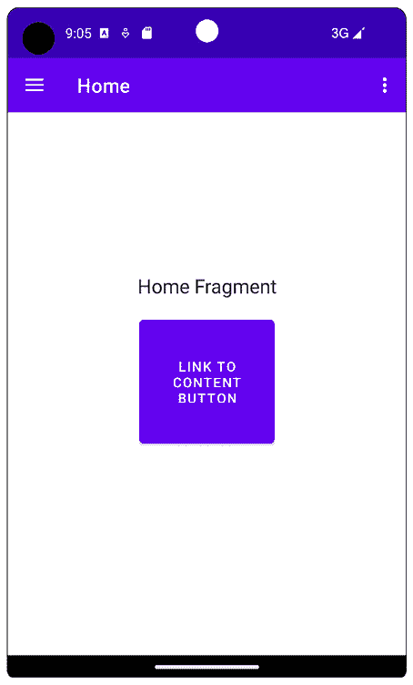

图 4.1 – 导航抽屉关闭的应用

导航抽屉通过现在普遍称为汉堡菜单的方式访问，这是位于 *图 4.1* 顶部左边的带有三个水平线的图标。屏幕上不显示导航选项，但当前屏幕的上下文信息显示在顶部应用栏中。

在屏幕的右侧也可以有一个溢出菜单，通过它可以访问其他上下文相关的导航选项。以下是一个打开状态下的导航抽屉的截图，显示了所有导航选项：

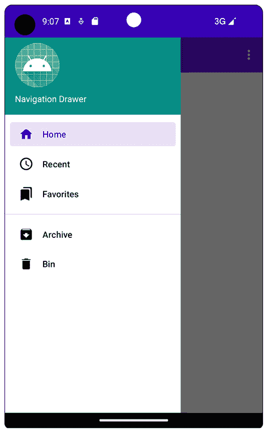

图 4.2 – 导航抽屉打开的应用

选择汉堡菜单后，导航抽屉从左侧滑出，当前部分被突出显示。这可以显示带有或不带有图标。由于导航占据了屏幕的高度，它最适合五个或更多顶级目的地。

目的地也可以分组，以表示多个主要目的地的层次结构（如前一张截图中的分隔线所示），这些层次结构也可以有标签。此外，抽屉内容也是可滚动的。总之，导航抽屉是一种非常方便的方式，可以快速访问许多不同的应用目的地。

导航抽屉的一个弱点是它需要用户选择汉堡菜单才能使目的地可见。相比之下，标签和底部导航（带有固定标签）始终可见。然而，这反过来也是导航抽屉的一个优点，因为可以有更多屏幕空间用于应用内容。

让我们开始本章的第一个练习，创建一个导航抽屉，这样我们就可以访问应用的所有部分。

## 练习 4.01 – 创建带有导航抽屉的应用

在此练习中，你将在 Android Studio 中使用 `Empty Activity` 项目模板创建一个名为 `Navigation Drawer` 的新应用，同时保留所有其他默认设置。在向导选项中，你可以创建一个新项目，其中包含本章练习中将要生成的所有导航模式，但我们将逐步构建应用以指导你完成步骤。

你将构建一个经常使用导航抽屉的应用，例如新闻或邮件应用。我们将添加的分区包括 **主页**、**收藏夹**、**最近**、**存档**、**回收站** 和 **设置**。

执行以下步骤以完成此练习：

1.  使用名为 `Navigation Drawer` 的 `Empty Activity` 创建一个新的项目。不要使用 **Navigation Drawer Activity** 项目模板，因为我们打算使用增量步骤来构建应用。

1.  在 `app/build.gradle` 中添加你将需要的 Gradle 依赖项：

    ```swift
    implementation 
    'androidx.navigation:navigation-fragment-ktx:2.5.3'
    implementation 
    'androidx.navigation:navigation-ui-ktx:2.5.3'
    ```

1.  更新 `res/values` 文件夹中的 `strings.xml` 和 `themes.xml`，内容如下：

strings.xml

```swift
       <string name="nav_header_desc">Navigation header</string>
<string name="home">Home</string>
    <string name="settings">Settings</string>
    <string name="content">Content</string>
    <string name="archive">Archive</string>
    <string name="recent">Recent</string>
    <string name="favorites">Favorites</string>
    <string name="bin">Bin</string>
    <string name="home_fragment">Home Fragment</string>
    <string name="settings_fragment">Settings Fragment</string>
    <string name="content_fragment">Content Fragment</string>
    <string name="archive_fragment">Archive Fragment</string>
    <string name="recent_fragment">Recent Fragment</string>
    <string name="favorites_fragment">Favorites Fragment</string>
    <string name="bin_fragment">Bin Fragment</string>
    <string name="link_to_content_button">Link to Content Button</string>
```

themes.xml

```swift
  <style name="Theme.NavigationDrawer.NoActionBar">
        <item name="windowActionBar">false</item>
        <item name="windowNoTitle">true</item>
   </style>
    <style name="Theme.NavigationDrawer.AppBarOverlay" parent="ThemeOverlay.AppCompat.Dark.ActionBar" />
    <style name="Theme.NavigationDrawer.PopupOverlay" parent="ThemeOverlay.AppCompat.Light" />
```

1.  接下来，更新 `AndroidManifest.xml` 中的名为 `MainActivity` 的活动元素，使其不使用 Action Bar。这将由导航抽屉布局提供。转到 `app` | `manifests` | `AndroidManifest.xml` 并添加 `android:theme` 属性，使用 `NoActionBar` 风格，如以下代码片段所示：

    ```swift
    <activity
        android:name=".MainActivity"
        android:exported="true"
        android:theme=
            "@style/Theme.NavigationDrawer.NoActionBar">
    ```

1.  创建以下片段（`HomeFragment`

1.  `FavoritesFragment`

1.  `RecentFragment`

1.  `ArchiveFragment`

1.  `SettingsFragment`

1.  `BinFragment`

1.  `ContentFragment`

1.  将每个片段布局更改为使用以下内容：

    ```swift
    <?xml version="1.0" encoding="utf-8"?>
    <androidx.constraintlayout.widget.ConstraintLayout xmlns:android=
      "http://schemas.android.com/apk/res/android"
        xmlns:app="http://schemas.android.com/apk/res-auto"
        android:layout_width="match_parent"
        android:layout_height="match_parent">
        <TextView
            android:layout_width="match_parent"
            android:layout_height="wrap_content"
            android:layout_margin="8dp"
            android:text="@string/home_fragment"
            android:textAlignment="center"
            android:layout_gravity="center_horizontal"
            android:textSize="20sp"
            app:layout_constraintBottom_toBottomOf="parent"
            app:layout_constraintEnd_toEndOf="parent"
            app:layout_constraintStart_toStartOf="parent"
            app:layout_constraintTop_toTopOf="parent" />
    </androidx.constraintlayout.widget.ConstraintLayout>
    ```

唯一的区别是 `android:text` 属性，它将包含来自 `strings.xml` 文件的相应字符串。因此，使用正确的字符串创建这些片段，以指示用户正在查看哪个片段。

这可能看起来有点重复，但一个单独的片段可以更新为这段文本，但它展示了如何在现实世界的应用中分离不同的部分。

1.  使用以下内容更新 `fragment_home.xml`，其中添加了一个按钮（这是在 *图 4**.1 中可以看到的正文内容，带有关闭的导航抽屉）：

    ```swift
    <?xml version="1.0" encoding="utf-8"?>
    <androidx.constraintlayout.widget.ConstraintLayout xmlns:android=
      "http://schemas.android.com/apk/res/android"
        xmlns:app="http://schemas.android.com/apk/res-auto"
        android:layout_width="match_parent"
        android:layout_height="match_parent">
        <TextView
            android:id="@+id/text_home"
            android:layout_width="match_parent"
            android:layout_height="wrap_content"
            android:layout_margin="8dp"
            android:text="@string/home_fragment"
            android:textAlignment="center"
            android:layout_gravity="center_horizontal"
            android:textSize="20sp"
            app:layout_constraintBottom_toBottomOf="parent"
            app:layout_constraintEnd_toEndOf="parent"
            app:layout_constraintStart_toStartOf="parent"
            app:layout_constraintTop_toTopOf="parent" />
        <Button
            android:id="@+id/button_home"
            android:layout_width="140dp"
            android:layout_height="140dp"
            android:layout_marginTop="16dp"
            android:text="@string/link_to_content_button"
            app:layout_constraintEnd_toEndOf="parent"
            app:layout_constraintStart_toStartOf="parent"
            app:layout_constraintTop_toBottomOf="@+id/text_home" />
    </androidx.constraintlayout.widget.ConstraintLayout>
    ```

`TextView` 与其他片段布局中指定的内容相同，除了它有一个 ID (`id`)，用于约束其下方的按钮。

1.  创建将在应用中使用的导航图。在项目中选择 `res` 文件夹，查看此选项。选择 `mobile_navigation.xml`。

这将创建导航图：

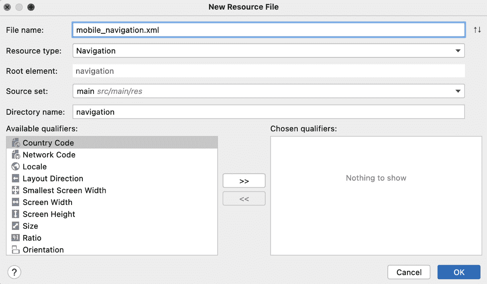

图 4.3 – Android Studio 新资源文件对话框

1.  在 `res/navigation` 文件夹中打开 `mobile_navigation.xml` 文件，并使用以下链接中的文件中的代码更新它。这里显示了代码的截断版本。使用此链接访问完整代码：[`packt.link/ZRDiT`](https://packt.link/ZRDiT)。

mobile_navigation.xml

```swift
<?xml version="1.0" encoding="utf-8"?>
<navigation xmlns:android=
    "http://schemas.android.com/apk/res/android"
    xmlns:app="http://schemas.android.com/apk/res-auto"
    xmlns:tools="http://schemas.android.com/tools"
    android:id="@+id/mobile_navigation"
    app:startDestination="@+id/nav_home">
    <fragment
        android:id="@+id/nav_home"
        android:name="com.example.navigationdrawer.HomeFragment"
        android:label="@string/home"
        tools:layout="@layout/fragment_home">
        <action
            android:id="@+id/nav_home_to_content"
            app:destination="@id/nav_content"
            app:popUpTo="@id/nav_home" />
    </fragment>
…
```

这将在你的应用中创建所有目的地。然而，它并没有指定这些是主要目的地还是次要目的地。这应该与上一章中提到的片段 Jetpack 导航练习中的内容相似。

这里需要注意的最重要的一点是 `app:startDestination="@+id/nav_home"`，它指定了导航加载时将显示的内容，以及从 `HomeFragment` 内部有可用的操作可以移动到图中的 `nav_content` 目的地：

```swift
        <action
            android:id="@+id/nav_home_to_content"
            app:destination="@id/nav_content"
            app:popUpTo="@id/nav_home" />
```

你现在将看到如何在 `HomeFragment` 及其布局中设置。

1.  打开 `HomeFragment` 并添加两个 `import` 语句用于 `Button` 和 `Navigation` 导入，并更新 `onCreateView` 以设置按钮：

HomeFragment

```swift
import android.widget.Button
import androidx.navigation.Navigation
    override fun onCreateView(
        inflater: LayoutInflater,
        container: ViewGroup?,
        savedInstanceState: Bundle?
    ): View? {
        val view = inflater.inflate(R.layout.fragment_home, container, false)
        view.findViewById<Button> (R.id.button_home)?.setOnClickListener(
            Navigation.createNavigateOnClickListener (R.id.nav_home_to_content, null)
        )
        return view
    }
```

这使用 `ClickListener` 导航，当点击 `button_home` 时完成 `R.id.nav_home_to_content` 动作。

然而，这些更改目前不会产生任何效果，因为您仍然需要为您的应用程序设置导航宿主，并添加所有其他布局文件，包括导航抽屉。

1.  通过在布局文件夹中创建一个名为 `content_main.xml` 的新文件来创建一个 `Nav` 主片段。这可以通过在 `res` 目录中的 `layout` 文件夹上右键单击，然后转到 `FragmentContainerView` 来完成：

    ```swift
    <?xml version="1.0" encoding="utf-8"?>
    <androidx.fragment.app.FragmentContainerView
        xmlns:android=
          "http://schemas.android.com/apk/res/android"
        xmlns:app="http://schemas.android.com/apk/res-auto"
        android:id="@+id/nav_host_fragment"
        android:name="androidx.navigation.fragment.NavHostFragment"
        android:layout_width="match_parent"
        android:layout_height="match_parent"
        app:defaultNavHost="true"
        app:navGraph="@navigation/mobile_navigation" />
    ```

1.  您会注意到导航图设置为刚刚创建的图：

    ```swift
        app:navGraph="@navigation/mobile_navigation"
    ```

1.  这样，应用程序的主体及其目的地就已经设置好了。现在，您需要设置 UI 导航。创建另一个名为 `nav_header_main.xml` 的布局资源文件，并添加以下内容：

    ```swift
    <?xml version="1.0" encoding="utf-8"?>
    <LinearLayout xmlns:android=
        "http://schemas.android.com/apk/res/android"
        xmlns:app="http://schemas.android.com/apk/res-auto"
        android:layout_width="match_parent"
        android:layout_height="176dp"
        android:background="@color/teal_700"
        android:gravity="bottom"
        android:orientation="vertical"
        android:paddingStart="16dp"
        android:paddingTop="16dp"
        android:paddingEnd="16dp"
        android:paddingBottom="16dp"
        android:theme="@style/ThemeOverlay.AppCompat.Dark">
        <ImageView
            android:id="@+id/imageView"
            android:layout_width="wrap_content"
            android:layout_height="wrap_content"
            android:contentDescription="@string/nav_header_desc"
            android:paddingTop= "8dp"
            app:srcCompat="@mipmap/ic_launcher_round" />
        <TextView
            android:layout_width="match_parent"
            android:layout_height="wrap_content"
            android:paddingTop= "8dp"
            android:text="@string/app_name"
            android:textAppearance= "@style/TextAppearance.AppCompat.Body1" />
    </LinearLayout>
    ```

这是显示在导航抽屉标题中的布局。

1.  使用名为 `app_bar_main.xml` 的工具栏布局文件创建应用程序栏，并包含以下内容：

    ```swift
    <?xml version="1.0" encoding="utf-8"?>
    <androidx.coordinatorlayout.widget.CoordinatorLayout xmlns:android=
      "http://schemas.android.com/apk/res/android"
        xmlns:app="http://schemas.android.com/apk/res-auto"
        xmlns:tools="http://schemas.android.com/tools"
        android:layout_width="match_parent"
        android:layout_height="match_parent"
        tools:context=".MainActivity">
        <com.google.android.material.appbar.AppBarLayout
            android:layout_width="match_parent"
            android:layout_height="wrap_content"
            android:theme= "@style/Theme.NavigationDrawer.AppBarOverlay">
            <androidx.appcompat.widget.Toolbar
                android:id="@+id/toolbar"
                android:layout_width="match_parent"
                android:layout_height="?attr/actionBarSize"
                android:background="?attr/colorPrimary"
                app:popupTheme= "@style/Theme.NavigationDrawer.PopupOverlay" />
        </com.google.android.material.appbar.AppBarLayout>
        <include layout="@layout/content_main" />
    </androidx.coordinatorlayout.widget.CoordinatorLayout>
    ```

这将应用程序的主体布局与出现在其上方的应用程序栏集成在一起。剩下的部分是创建将出现在导航抽屉中的项目，并使用这些项目创建和填充导航抽屉。

1.  要使用这些菜单项的图标，您需要将完成练习的可绘制文件夹中的矢量资产复制到项目中的可绘制文件夹。矢量资产使用坐标来布局与相关颜色信息关联的图像。

与 PNG 和 JPG 图像相比，它们显著更小，矢量图可以调整到不同的大小而不会损失质量。您可以在以下位置找到它们：[`packt.link/CurtF`](https://packt.link/CurtF)。

复制以下可绘制资源：

+   `favorites.xml`

+   `archive.xml`

+   `recent.xml`

+   `home.xml`

+   `bin.xml`

1.  使用这些项目创建一个菜单。为此，转到 `activity_main_drawer`，然后用以下内容填充它：

    ```swift
    <?xml version="1.0" encoding="utf-8"?>
    <menu xmlns:android=
        "http://schemas.android.com/apk/res/android"
        xmlns:tools="http://schemas.android.com/tools"
        tools:showIn="navigation_view">
        <group
            android:id="@+id/menu_top"
            android:checkableBehavior="single">
            <item
                android:id="@+id/nav_home"
                android:icon="@drawable/home"
                android:title="@string/home" />
            <item
                android:id="@+id/nav_recent"
                android:icon="@drawable/recent"
                android:title="@string/recent" />
            <item
                android:id="@+id/nav_favorites"
                android:icon="@drawable/favorites"
                android:title="@string/favorites" />
        </group>
        <group
            android:id="@+id/menu_bottom"
            android:checkableBehavior="single">
            <item
                android:id="@+id/nav_archive"
                android:icon="@drawable/archive"
                android:title="@string/archive" />
            <item
                android:id="@+id/nav_bin"
                android:icon="@drawable/bin"
                android:title="@string/bin" />
        </group>
    </menu>
    ```

这设置了将出现在导航抽屉中的菜单项。ID 的名称是连接菜单项到导航图中目的地的魔法。

如果菜单项的 ID（在 `activity_main_drawer.xml` 中）与导航图中的目的地 ID（在这种情况下，是 `mobile_navigation.xml` 中的片段）完全匹配，则目的地将自动加载到导航宿主中。

1.  `MainActivity` 的布局将导航抽屉与之前指定的所有布局绑定在一起。打开 `activity_main.xml` 并使用以下内容更新它：

    ```swift
    <?xml version="1.0" encoding="utf-8"?>
    <androidx.drawerlayout.widget.DrawerLayout
    xmlns:android=
      "http://schemas.android.com/apk/res/android"
        xmlns:app="http://schemas.android.com/apk/res-auto"
        xmlns:tools="http://schemas.android.com/tools"
        android:id="@+id/drawer_layout"
        android:layout_width="match_parent"
        android:layout_height="match_parent"
        android:fitsSystemWindows="true"
        tools:openDrawer="start">
        <include
            layout="@layout/app_bar_main"
            android:layout_width="match_parent"
            android:layout_height="match_parent" />
      <com.google.android.material.navigation.NavigationView
            android:id="@+id/nav_view"
            android:layout_width="wrap_content"
            android:layout_height="match_parent"
            android:layout_gravity="start"
            android:fitsSystemWindows="true"
            app:headerLayout="@layout/nav_header_main"
            app:menu="@menu/activity_main_drawer" />
    </androidx.drawerlayout.widget.DrawerLayout>
    ```

如您所见，使用了 `include` 来添加 `app_bar_main.xml`。`<include>` 元素允许您添加在编译时将被实际布局替换的布局。

1.  它们允许我们将不同的布局封装起来，因为它们可以在应用中的多个布局文件中重复使用。`NavigationView`（创建导航抽屉的类）指定你刚刚创建的布局文件来配置其页眉和菜单项：

    ```swift
        app:headerLayout="@layout/nav_header_main"
        app:menu="@menu/activity_main_drawer"
    ```

1.  现在你已经指定了所有布局文件，通过添加以下交互逻辑来更新`MainActivity`：

    ```swift
    package com.example.navigationdrawer
    import android.os.Bundle
    import androidx.appcompat.app.AppCompatActivity
    import androidx.navigation.findNavController
    import androidx.navigation.fragment.NavHostFragment
    import androidx.navigation.ui.*
    import com.google.android.material.navigation.NavigationView
    class MainActivity : AppCompatActivity() {
        private lateinit var appBarConfiguration: AppBarConfiguration
        override fun onCreate(savedInstanceState: Bundle?) {
            super.onCreate(savedInstanceState)
            setContentView(R.layout.activity_main)
            setSupportActionBar(findViewById(R.id.toolbar))
            val navHostFragment = supportFragmentManager.findFragmentById(R.id.nav_host_fragment) as NavHostFragment
            val navController = navHostFragment.navController
            //Creating top level destinations
            //and adding them to the draw
            appBarConfiguration = AppBarConfiguration(
                setOf(
                    R.id.nav_home, R.id.nav_recent, R.id.nav_favorites, R.id.nav_archive, R.id.nav_bin
                ), findViewById(R.id.drawer_layout)
            )
            setupActionBarWithNavController(navController, appBarConfiguration)
            findViewById<NavigationView>(R.id.nav_view) ?.setupWithNavController(navController)
        }
        override fun onSupportNavigateUp(): Boolean {
            val navController = findNavController(R.id.nav_host_fragment)
            return navController.navigateUp(appBarConfiguration) || super.onSupportNavigateUp()
        }
    }
    ```

现在，让我们回顾一下前面的代码。`setSupportActionBar(toolbar)`这一行通过从布局中引用并设置它来配置应用中使用的工具栏。获取`NavHostFragment`的操作是通过以下代码完成的：

```swift
    val navHostFragment = supportFragmentManager
.findFragmentById(R.id.nav_host_fragment) as NavHostFragment
        val navController = navHostFragment.navController
```

接下来，添加你想要在导航抽屉中显示的菜单项：

```swift
appBarConfiguration = AppBarConfiguration(
    setOf(
        R.id.nav_home, R.id.nav_recent, R.id.nav_favorites, R.id.nav_archive, R.id.nav_bin
    ), findViewById(R.id.drawer_layout)
)
```

`drawer_layout`是`nav_view`、主要应用栏及其包含内容的容器。

这可能看起来像是你重复做了两次，因为这些项目已经在`activity_main_drawer.xml`菜单的导航抽屉中显示。然而，在`AppBarConfiguration`中设置这些项目的功能是，当这些主要目标被选中时，它们将不会显示向上箭头，因为它们处于顶层。

它还把`drawer_layout`作为最后一个参数添加，以指定当汉堡菜单被选中并在导航抽屉中显示时应该使用哪个布局。下一行如下：

```swift
setupActionBarWithNavController(navController, appBarConfiguration)
```

这设置了应用栏与导航图，以便对目标所做的任何更改都会反映在应用栏上：

```swift
findViewById<NavigationView> (R.id.nav_view)?.setupWithNavController(navController)
```

这是`onCreate`中的最后一句话，它指定了当用户点击时应在导航抽屉中突出显示的项目。类中的下一个函数处理按下向上按钮以访问次要目标，确保它返回其父级主要目标：

```swift
override fun onSupportNavigateUp(): Boolean {
    val navController = findNavController(R.id.nav_host_fragment)
    return navController.navigateUp(appBarConfiguration) || super.onSupportNavigateUp()
}
```

应用栏还可以通过溢出菜单显示其他菜单项，当配置好时，这些菜单项在应用栏右侧顶部以三个垂直点显示。让我们创建一个溢出菜单来显示**设置**屏幕。

1.  要将溢出菜单添加到应用栏中，请转到`main.xml`。

更新内容如下：

```swift
<?xml version="1.0" encoding="utf-8"?>
<menu xmlns:android=
    "http://schemas.android.com/apk/res/android"
    xmlns:app="http://schemas.android.com/apk/res-auto">
    <item
        android:id="@+id/nav_settings"
        android:title="@string/settings"
        app:showAsAction="never" />
</menu>
```

此配置显示一个项目：“设置”。由于它指定了与导航图中`SettingsFragment`目标相同的 ID，即`android:id="@+id/nav_settings"`，因此它将打开`SettingsFragment`片段。

设置为`app:showAsAction="never"`的属性确保它将作为一个菜单选项保留在三个点的溢出菜单中，并且不会出现在应用栏本身上。`app:showAsAction`还有其他值，可以将菜单选项设置为始终出现在应用栏上，如果空间允许的话。

在这里查看完整列表：[`developer.android.com/guide/topics/resources/menu-resource`](https://developer.android.com/guide/topics/resources/menu-resource)。

1.  要将溢出菜单添加到应用栏，请将以下内容添加到`MainActivity`类中：

    ```swift
    override fun onCreateOptionsMenu(menu: Menu): Boolean {
        menuInflater.inflate(R.menu.main, menu)
        return true
    }
    override fun onOptionsItemSelected(item: MenuItem): Boolean {
        return item.onNavDestinationSelected(findNavController (R.id.nav_host_fragment))
    }
    ```

你还需要添加以下导入：

```swift
import android.view.Menu
import android.view.MenuItem
```

`onCreateOptionsMenu` 函数选择要添加到应用程序栏的菜单，而 `onOptionsItemSelected` 处理当使用 `item.onNavDestinationSelected(findNavController(R.id.nav_host_fragment))` 导航函数选择项时要执行的操作。这用于在导航图中导航到目的地。

1.  运行应用程序，并使用导航抽屉导航到顶级目的地。以下屏幕截图显示了导航到“最近”目的地的示例：

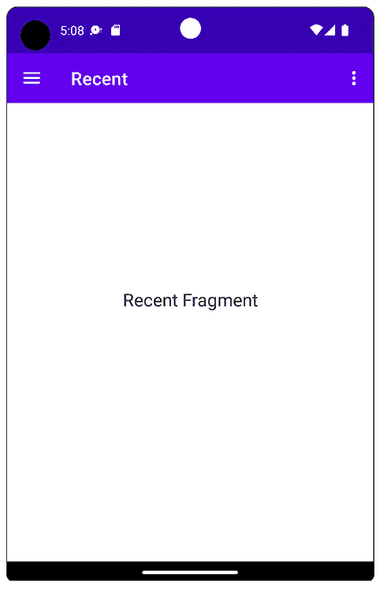

图 4.4 – 从导航抽屉打开的“最近”菜单项

1.  当你再次打开导航抽屉时，你会看到“最近”菜单项被选中：

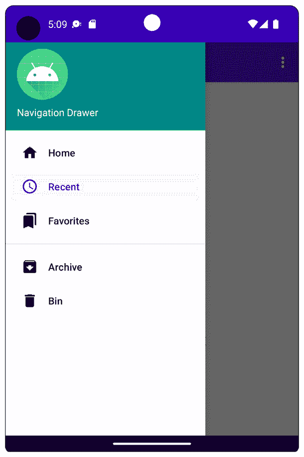

图 4.5 – 导航抽屉中高亮的“最近”菜单项

1.  再次选择**主页**菜单项以显示带有标签**链接到** **内容按钮**的按钮：

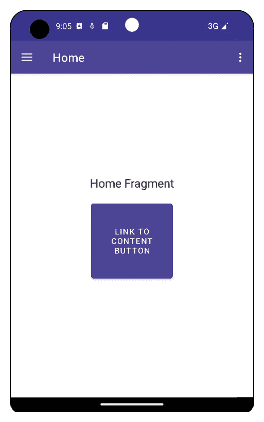

图 4.6 – 带有次要目的地按钮的主屏幕

1.  点击此按钮转到次要目的地。你会看到一个向上箭头显示：

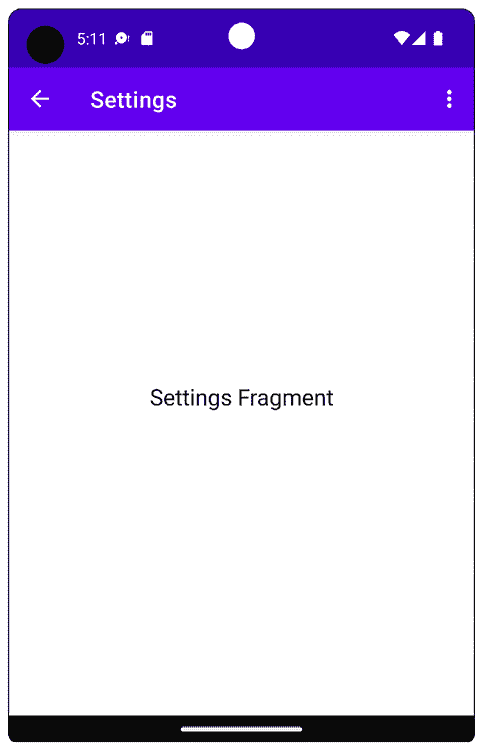

图 4.7 – 显示向上箭头的次要目的地

在所有前面的屏幕截图中，都显示了溢出菜单。选择它后，你会看到一个显示向上箭头的片段：

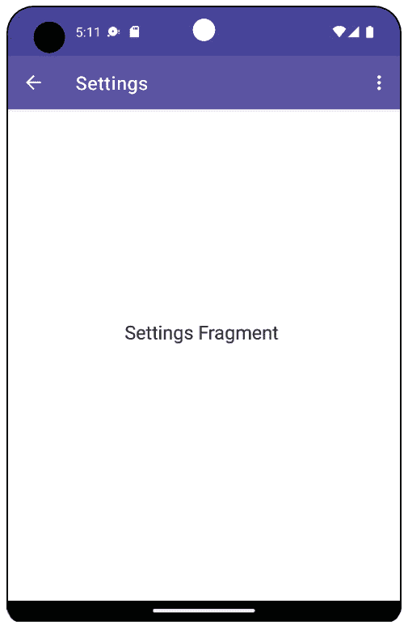

图 4.8 – 设置片段

虽然设置具有导航抽屉的应用程序需要经过相当多的步骤，但一旦创建，它就非常可配置。通过向抽屉菜单添加一个菜单项条目和导航图中的一个目的地，可以创建并立即设置一个新的片段。

这将删除你在上一章中使用片段所需的大量样板代码。接下来，你将探索的下一个导航模式是底部导航。这已成为 Android 中最受欢迎的导航模式，主要是因为它使得应用程序的主要部分易于访问。

# 底部导航

**底部导航**用于当有有限数量的顶级目的地时，这些目的地可以从三个到五个主要目的地不等，它们之间没有关联。底部导航栏上的每个项目都显示一个图标和一个可选的文本标签。

这种导航允许快速访问，因为项目始终可用，无论用户导航到应用程序的哪个次要目的地。

## 练习 4.02 – 将底部导航添加到你的应用程序

在 Android Studio 中创建一个名为 `Bottom Navigation` 的新应用程序，使用 **Empty Activity** 项目模板，保留所有其他默认设置。不要使用 **Bottom Navigation Activity** 项目模板，因为我们打算使用增量步骤来构建应用程序。

你将构建一个忠诚度应用程序，为注册使用该应用程序的客户提供优惠、奖励等。底部导航对于这类应用程序来说相当常见，因为通常顶级目标有限。

让我们开始吧：

1.  许多步骤与之前的练习非常相似，因为你将使用 Jetpack 导航并在导航图和相应的菜单中定义目标。

1.  创建一个名为 `Bottom Navigation` 的 `Empty Activity` 的新项目。

1.  将所需的 Gradle 依赖项添加到 `app/build.gradle`：

    ```swift
    implementation 
    'androidx.navigation:navigation-fragment-ktx:2.5.3'
    implementation 
    'androidx.navigation:navigation-ui-ktx:2.5.3'
    ```

1.  在 `res/values` 文件夹中追加 `strings.xml` 并包含以下值：

`strings.xml`

```swift
    <!-- Bottom Navigation -->
    <string name="home">Home</string>
    <string name="tickets">Tickets</string>
    <string name="offers">Offers</string>
    <string name="rewards">Rewards</string>
    <!-- Action Bar -->
    <string name="settings">Settings</string>
    <string name="cart">Shopping Cart</string>
    <string name="content">Content</string>
    <string name="home_fragment">Home Fragment</string>
    <string name="tickets_fragment">Tickets Fragment</string>
    <string name="offers_fragment">Offers Fragment</string>
    <string name="rewards_fragment">Rewards Fragment</string>
    <string name="settings_fragment"> Settings Fragment</string>
    <string name="cart_fragment"> Shopping Cart Fragment</string>
    <string name="content_fragment">Content Fragment</string>
    <string name="link_to_content_button"> Link to Content Button</string>
```

1.  创建以下名称的八个片段：

    +   `HomeFragment`

    +   `ContentFragment`

    +   `OffersFragment`

    +   `RewardsFragment`

    +   `SettingsFragment`

    +   `TicketsFragment`

    +   `CartFragment`

1.  为所有片段应用与之前练习中相同的布局，除了 `fragment_home.xml`。对于此布局，使用你在 *练习 4.01 – 创建带有* *导航抽屉* *的应用* 中使用的相同布局文件。

1.  按照之前的练习创建导航图，并将其命名为 `mobile_navigation.xml`。使用以下链接中提供的文件中的代码更新它。这里显示的是代码的截断版本。请参阅链接以获取您需要使用的整个代码块：[`packt.link/Fwuyl`](https://packt.link/Fwuyl)。

`mobile_navigation.xml`

```swift
<navigation xmlns:android=
    "http://schemas.android.com/apk/res/android"
    xmlns:app="http://schemas.android.com/apk/res-auto"
    xmlns:tools="http://schemas.android.com/tools"
    android:id="@+id/mobile_navigation"
    app:startDestination="@+id/nav_home">
    <fragment
        android:id="@+id/nav_home"
        android:name="com.example.bottomnavigation.HomeFragment"
        android:label="@string/home"
        tools:layout="@layout/fragment_home">
        <action
            android:id="@+id/nav_home_to_content"
            app:destination="@id/nav_content"
            app:popUpTo="@id/nav_home" />
    </fragment>
…
```

1.  更新 `HomeFragment` 中的 `onCreateView` 函数，使用导航图中的目标导航到 `ContentFragment`。你还需要添加以下导入语句：

    ```swift
    import android.widget.Button
    import androidx.navigation.Navigation
    override fun onCreateView(
        inflater: LayoutInflater,
        container: ViewGroup?,
        savedInstanceState: Bundle?
    ): View? {
        val view = inflater.inflate(R.layout.fragment_home, container, false)
        view.findViewById<Button>(R.id.button_home) ?.setOnClickListener(
            Navigation.createNavigateOnClickListener (R.id.nav_home_to_content, null)
        )
        return view
    }
    ```

1.  现在导航图中的目标已经定义，创建底部导航菜单以引用这些目标。首先，你需要收集本练习中将要使用的图标。前往 GitHub 上的完成练习，并在 `drawable` 文件夹中找到矢量资产：[`packt.link/pUXvC`](https://packt.link/pUXvC)。

将以下可绘制文件复制到项目的 `drawable` 文件夹中：

+   `cart.xml`

+   `home.xml`

+   `offers.xml`

+   `rewards.xml`

+   `tickets.xml`

1.  创建一个 `bottom_nav_menu.xml` 文件（在 `res` 文件夹上右键点击并选择 `cart.xml` 矢量资产，它将被用于顶部工具栏。注意，项的 ID 与导航图中的 ID 匹配）：

`bottom_nav_menu.xml`

```swift
<?xml version="1.0" encoding="utf-8"?>
<menu xmlns:android=
    "http://schemas.android.com/apk/res/android">
    <item
        android:id="@+id/nav_home"
        android:icon="@drawable/home"
        android:title="@string/home" />
    <item
        android:id="@+id/nav_tickets"
        android:icon="@drawable/tickets"
        android:title="@string/tickets"/>
    <item
        android:id="@+id/nav_offers"
        android:icon="@drawable/offers"
        android:title="@string/offers" />
    <item
        android:id="@+id/nav_rewards"
        android:icon="@drawable/rewards"
        android:title="@string/rewards"/>
</menu>
```

1.  更新 `activity_main.xml` 文件如下内容：

`activity_main.xml`

```swift
<?xml version="1.0" encoding="utf-8"?>
<androidx.constraintlayout.widget.ConstraintLayout 
xmlns:android=
  "http://schemas.android.com/apk/res/android"
    xmlns:app="http://schemas.android.com/apk/res-auto"
    android:id="@+id/container"
    android:layout_width="match_parent"
    android:layout_height="match_parent"
    android:paddingTop="?attr/actionBarSize">
    <com.google.android.material.bottomnavigation.BottomNavigationView
    android:id="@+id/nav_view"
    android:layout_width="0dp"
    android:layout_height="wrap_content"
    android:layout_marginStart="0dp"
    android:layout_marginEnd="0dp"
    android:background="?android:attr/windowBackground"
    app:layout_constraintBottom_toBottomOf="parent"
    app:layout_constraintStart_toStartOf="parent"
    app:layout_constraintEnd_toEndOf="parent"
    app:menu="@menu/bottom_nav_menu"
    app:labelVisibilityMode="labeled"/>
    <androidx.fragment.app.FragmentContainerView
        android:id="@+id/nav_host_fragment"
        app:layout_constraintStart_toStartOf="parent"
        app:layout_constraintEnd_toEndOf="parent"
        app:layout_constraintTop_toTopOf="parent"
        android:name ="androidx.navigation.fragment.NavHostFragment"
        android:layout_width="match_parent"
        android:layout_height="match_parent"
        app:defaultNavHost="true"
        app:navGraph="@navigation/mobile_navigation" />
</androidx.constraintlayout.widget.ConstraintLayout>
```

`BottomNavigation` 视图配置了之前创建的菜单，即 `app:menu="@menu/bottom_nav_menu"`，而 `FragmentContainerView` 配置为 `app:navGraph="@navigation/mobile_navigation"`。由于应用程序中的底部导航没有直接连接到应用程序栏，因此需要设置的布局文件较少。

1.  更新 `MainActivity` 如下内容：

    ```swift
    package com.example.bottomnavigation
    import android.os.Bundle
    import androidx.appcompat.app.AppCompatActivity
    import androidx.navigation.findNavController
    import androidx.navigation.fragment.NavHostFragment
    import androidx.navigation.ui.*
    import com.google.android.material.bottomnavigation.BottomNavigationView
    class MainActivity : AppCompatActivity() {
        private lateinit var appBarConfiguration: AppBarConfiguration
        override fun onCreate(savedInstanceState: Bundle?) {
            super.onCreate(savedInstanceState)
            setContentView(R.layout.activity_main)
        val navHostFragment = supportFragmentManager.findFragmentById (R.id.nav_host_fragment) as NavHostFragment
        val navController = navHostFragment.navController
            //Creating top level destinations
            //and adding them to bottom navigation
            appBarConfiguration = AppBarConfiguration(setOf(
                R.id.nav_home, R.id.nav_tickets, R.id.nav_offers, R.id.nav_rewards))
            setupActionBarWithNavController(navController, appBarConfiguration)
            findViewById<BottomNavigationView>(R.id.nav_view) ?.setupWithNavController(navController)
        }
        override fun onSupportNavigateUp(): Boolean {
            val navController = findNavController(R.id.nav_host_fragment)
            return navController.navigateUp(appBarConfiguration) || super.onSupportNavigateUp()
        }
    }
    ```

之前的代码应该非常熟悉，因为它在前面的练习中已经解释过了。这里的主要变化是，现在用 `BottomNavigationView` 替换了之前用于持有导航抽屉主要 UI 导航的 `NavigationView`。之后的配置是相同的。

1.  运行应用。你应该看到以下输出：

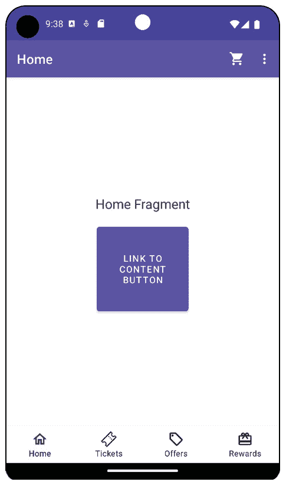

图 4.9 – 选择“主页”的底部导航

1.  显示显示了您设置的四个菜单项，其中 **主页** 项被选中作为起始目的地。点击方形按钮将被带到 **主页** 内的辅助目的地：

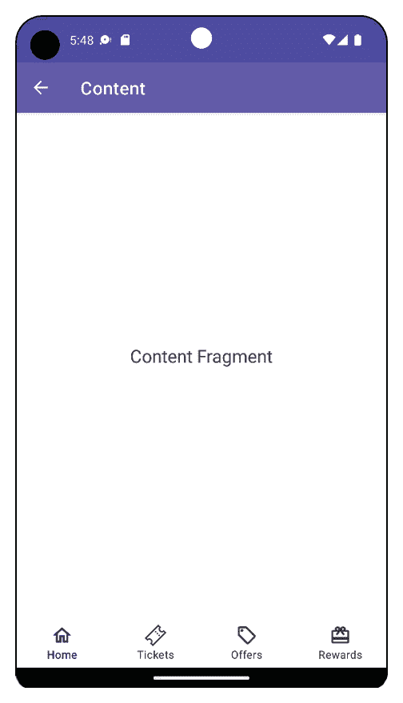

图 4.10 – 主页内的辅助目的地

1.  使这成为可能的行为是导航图中指定的 `nav_home_to_content` 动作：

mobile_navigation.xml（片段）

```swift
<fragment
    android:id="@+id/nav_home"
    android:name="com.example.bottomnavigation.HomeFragment"
    android:label="@string/home"
    tools:layout="@layout/fragment_home">
    <action
        android:id="@+id/nav_home_to_content"
        app:destination="@id/nav_content"
        app:popUpTo="@id/nav_home" />
</fragment>
```

1.  由于底部导航栏中添加的项目数量有限（通常是三到五个），有时会将在应用栏中添加操作项（那些有专用图标的项目）。创建另一个名为 `main.xml` 的菜单，并添加以下内容：

main.xml

```swift
<?xml version="1.0" encoding="utf-8"?>
<menu xmlns:android=
    "http://schemas.android.com/apk/res/android"
    xmlns:app="http://schemas.android.com/apk/res-auto">
    <item
        android:id="@+id/nav_cart"
        android:title="@string/cart"
        android:icon="@drawable/cart"
        app:showAsAction="always" />
    <item
        android:id="@+id/nav_settings"
        android:title="@string/settings"
        app:showAsAction="never" />
</menu>
```

1.  此菜单将在应用栏的溢出菜单中使用。当你点击三个点时，溢出菜单将可用。由于 `app:showAsAction` 属性设置为 `always`，因此还会在顶部应用栏上显示一个 `cart` 矢量资产。在 `MainActivity` 中通过添加以下内容来配置溢出菜单：

在文件顶部添加以下两个导入：

```swift
import android.view.Menu
import android.view.MenuItem
```

然后这两个函数：

```swift
override fun onCreateOptionsMenu(menu: Menu): Boolean {
    menuInflater.inflate(R.menu.main, menu)
    return true
}
override fun onOptionsItemSelected(item: MenuItem): Boolean {
    super.onOptionsItemSelected(item)
    return item.onNavDestinationSelected(findNavController (R.id.nav_host_fragment))
}
```

1.  现在，这将在应用栏中显示主菜单。再次运行应用，你将看到以下内容：

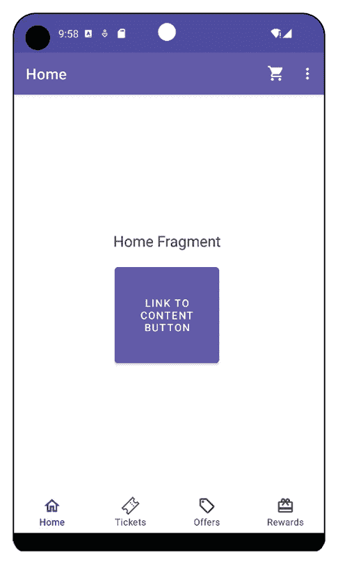

图 4.11 – 带有溢出菜单的底部导航

选择购物车将带您到我们在导航图中配置的辅助目的地：

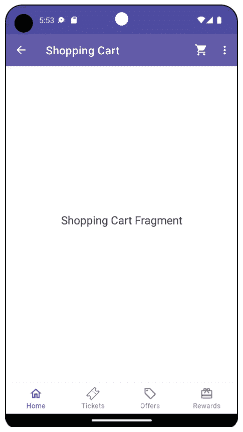

图 4.12 – 在辅助目的地中带有溢出菜单的底部导航

正如你在这次练习中看到的，设置底部导航相当直接。导航图和菜单设置简化了将菜单项链接到片段的过程。此外，集成动作栏和溢出菜单也是实现的小步骤。

如果你正在开发一个具有非常明确的高级目的地并且在这些目的地之间切换很重要的应用，那么这些目的地的可见性使得底部导航成为一个理想的选择。接下来要探索的最后一个主要导航模式是标签导航。

这是一个多功能的模式，因为它可以用作应用的主要导航，也可以作为我们研究过的其他导航模式中的辅助导航。

# 标签导航

**标签导航**主要用于你想显示相关项目时。如果有少量标签（通常在两个到五个标签之间），通常会使用固定标签，如果你有超过五个标签，则使用可滚动的水平标签。它们主要用于对处于同一层次级别的目的地进行分组。

如果目的地相关，这可以成为主要导航。这可能适用于你开发的应用程序在一个狭窄或特定主题领域，其中主要目的地是相关的，例如新闻应用。更常见的是，它与底部导航一起使用，以展示主要目的地内的次要导航。以下练习演示了使用标签导航来显示相关项目。

## 练习 4.03 – 使用标签进行应用导航

在 Android Studio 中创建一个新的应用程序，名为`Tab Navigation`的`Empty Activity`。你将构建一个显示电影类型的骨架电影应用程序。让我们开始吧：

1.  使用以下内容更新`strings.xml`：

strings.xml

```swift
    <string name="action">Action</string>
    <string name="comedy">Comedy</string>
    <string name="drama">Drama</string>
    <string name="sci_fi">Sci-Fi</string>
    <string name="family">Family</string>
    <string name="crime">Crime</string>
    <string name="history">History</string>
    <string name="dummy_text">
        Lorem ipsum dolor sit amet, consectetuer adipiscing elit. Aenean commodo ligula eget dolor. Aenean massa. Cum sociis natoque penatibus et magnis dis parturient montes, nascetur ridiculus mus. Donec quam felis, ultricies nec, pellentesque eu, pretium quis, sem. Nulla consequat massa quis enim. Donec pede justo, fringilla vel, aliquet nec, vulputate eget, arcu. In enim justo, rhoncus ut, imperdiet a, venenatis vitae, justo. Nullam dictum felis eu pede mollis pretium. Integer tincidunt. Cras dapibus. Vivamus elementum semper nisi. Aenean vulputate eleifend tellus. Aenean leo ligula, porttitor eu, consequat vitae, eleifend ac, enim. Aliquam lorem ante, dapibus in, viverra quis, feugiat a, tellus. Phasellus viverra nulla ut metus varius laoreet. Quisque rutrum. Aenean imperdiet. Etiam ultricies nisi vel augue. Curabitur ullamcorper ultricies nisi.
</string>
```

`<string name="dummy_text">`文件为每个电影类型提供了一些正文文本：

1.  为了能够左右滑动标签页，我们需要使用一个`ViewPager`组件。在 app 的`build.gradle`文件中添加以下依赖项：

    ```swift
    implementation "androidx.viewpager2:viewpager2:1.0.0"
    ```

1.  创建一个新的空白`MoviesFragment`片段，它将显示一些正文文本，并用以下代码片段替换布局文件内容。

fragment_movies.xml

```swift
<?xml version="1.0" encoding="utf-8"?>
<androidx.constraintlayout.widget.ConstraintLayout xmlns:android=
  "http://schemas.android.com/apk/res/android"
    xmlns:app="http://schemas.android.com/apk/res-auto"
    xmlns:tools="http://schemas.android.com/tools"
    android:layout_width="match_parent"
    android:layout_height="match_parent"
    tools:context=".MoviesFragment">
    <TextView
        android:layout_width="wrap_content"
        android:layout_height="wrap_content"
        android:textSize="16sp"
        android:text="@string/dummy_text"
        android:padding="16dp"
        app:layout_constraintStart_toStartOf="parent"
        app:layout_constraintEnd_toEndOf="parent"
        app:layout_constraintTop_toTopOf="parent" />
</androidx.constraintlayout.widget.ConstraintLayout>
```

1.  使用以下内容更新`activity_main.xml`文件：

    ```swift
    <androidx.constraintlayout.widget.ConstraintLayout xmlns:android="http://schemas.android.com/apk/res/android" xmlns:app="http://schemas.android.com/apk/res-auto"
        android:layout_width="match_parent"
        android:layout_height="match_parent"
        android:orientation="vertical">
        <com.google.android.material.tabs.TabLayout
            app:layout_constraintTop_toTopOf="parent"
            android:id="@+id/tab_layout"
            android:layout_width="match_parent"
            android:layout_height="wrap_content"
            app:tabMode="fixed"/>
        <androidx.viewpager2.widget.ViewPager2
       app:layout_constraintTop_toBottomOf="@id/tab_layout"
            android:id="@+id/view_pager"
            android:layout_width="match_parent"
            android:layout_height="wrap_content"/>
    </androidx.constraintlayout.widget.ConstraintLayout>
    ```

布局在顶部显示`TabLayout`，并注意它使用`app:tabMode="fixed"`属性将标签设置为固定。为了显示所需的内容，你将使用`ViewPager`，这是一个可滑动的布局，允许你添加多个视图或片段，这样当用户滑动以更改其中一个标签时，主体内容将显示相应的视图或片段。对于这个练习，你将滑动在电影片段之间。

标签的格式可以是固定的，这样所有标签都可以同时显示在屏幕上，或者可以滚动，这样如果标签不适合可用的水平屏幕空间，一些标签最初将不在屏幕上。

接下来，我们需要为`ViewPager`提供内容。在`ViewPager`中提供数据的组件被称为适配器。

1.  创建一个简单的适配器，用于显示我们的电影。转到`MovieGenresAdapter`：

    ```swift
    package com.example.tabnavigation
    import androidx.fragment.app.Fragment
    import androidx.fragment.app.FragmentManager
    import androidx.lifecycle.Lifecycle
    import androidx.viewpager2.adapter.FragmentStateAdapter
    val TAB_GENRES_SCROLLABLE = listOf(
        R.string.action,
        R.string.comedy,
        R.string.drama,
        R.string.sci_fi,
        R.string.family,
        R.string.crime,
        R.string.history
    )
    val TAB_GENRES_FIXED = listOf(R.string.action, R.string.comedy, R.string.drama)
    class MovieGenresAdapter(fragmentManager: FragmentManager, lifecycle: Lifecycle) :
        FragmentStateAdapter(fragmentManager, lifecycle) {
        override fun getItemCount(): Int {
           return TAB_GENRES_FIXED.size
        }
        override fun createFragment(position: Int): Fragment {
            return MoviesFragment()
        }
    }
    ```

首先，查看`MovieGenresAdapter`类的头部。它继承自`FragmentStateAdapter`，这是一个用于在`ViewPager`中填充片段的适配器。

回调方法的函数如下：

+   `getItemCount()`：这个方法返回我们将要插入的片段总数，由于我们将页面数与标签数相匹配，所以是`TABS_GENRE_FIXED`常量的大小。

+   `createFragment(position Int)`: 这将创建在传递的参数位置显示在 `ViewPager` 中的片段。在这里，我们将它设置为相同的片段，但在实际应用中，你会在其中填充不同的片段。

1.  更新 `MainActivity` 以使用带有 `ViewPager` 的标签：

    ```swift
    package com.example.tabnavigation
    import androidx.appcompat.app.AppCompatActivity
    import android.os.Bundle
    import androidx.viewpager2.widget.ViewPager2
    import com.google.android.material.tabs.TabLayout
    import com.google.android.material.tabs.TabLayoutMediator
    class MainActivity : AppCompatActivity() {
        override fun onCreate(savedInstanceState: Bundle?) {
            super.onCreate(savedInstanceState)
            setContentView(R.layout.activity_main)
            val viewPager = findViewById<ViewPager2>(R.id.view_pager)
            val tabLayout = findViewById<TabLayout>(R.id.tab_layout)
            val adapter = MovieGenresAdapter(supportFragmentManager, lifecycle)
            viewPager.adapter = adapter
            TabLayoutMediator(tabLayout, viewPager) { tab, position ->
                tab.text = resources.getString(TAB_GENRES_FIXED[position])
            }.attach()
        }
    }
    ```

1.  然后，从布局中检索视图，并使用 `TabLayoutMediator` 将标签与 `ViewPager` 链接。标签本身是公开的，以便你可以自定义。在这个例子中，我们只是设置了文本。位置也可以用来将标签位置与 `ViewPager` 中的片段位置链接。创建这种标签导航既简单又有效。

1.  运行应用，你应该看到以下内容：

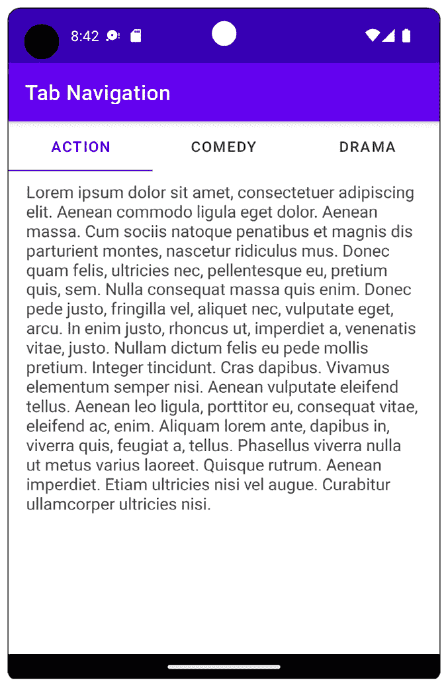

图 4.13 – 带有固定标签的标签布局

你可以在页面主体中左右滑动以访问三个标签中的每一个，你也可以选择相应的标签以执行相同操作。现在，让我们更改正在显示的标签数据，并设置标签以便它们可以滚动。

1.  首先，将 `MovieGenresAdapter` 更新为使用一些额外的类型，通过更新 `getItemCount` 函数：

    ```swift
    override fun getItemCount(): Int {
      return TAB_GENRES_SCROLLABLE.size
    }
    ```

1.  在 `MainActivity` 中，将 `TabLayoutMediator` 设置为使用适配器中更新的项目计数来设置这些额外页面的标签文本：

    ```swift
    TabLayoutMediator(tabLayout, viewPager) { tab, position ->
        tab.text = resources.getString(TAB_GENRES_SCROLLABLE[position])
    }.attach()
    ```

1.  你还需要将 `activity_layout.xml` 文件中的 `app:tabMode="fixed"` 行更改为 `app:tabMode="scrollable"`。

1.  现在运行应用，你应该看到以下内容：

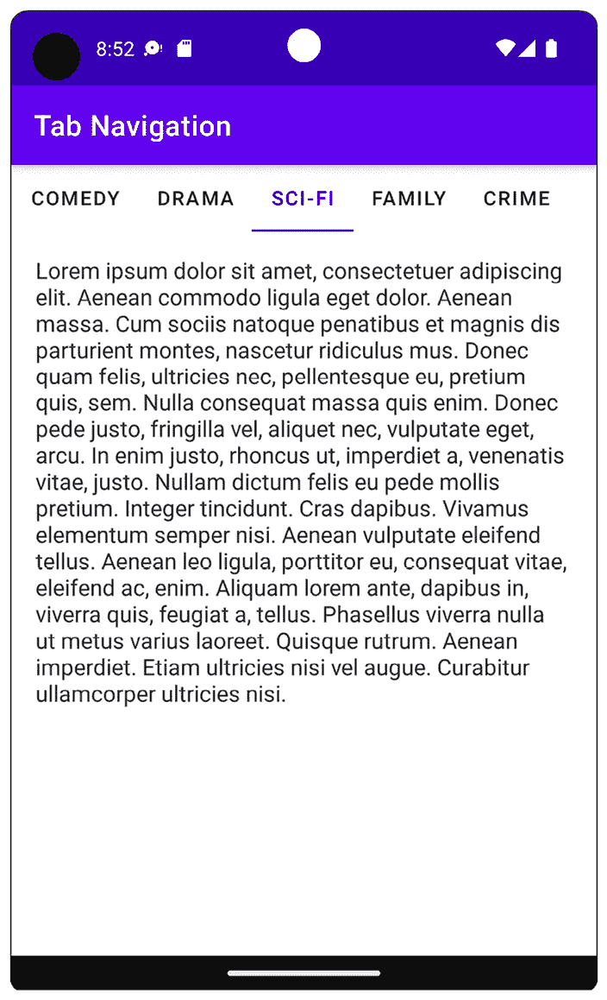

图 4.14 – 带有可滚动标签的标签导航布局

标签列表继续显示在屏幕之外。标签可以滑动和选择，主体内容也可以滑动，这样你就可以在标签页面中左右移动。

通过这个练习，你学习了标签在提供应用导航时的多功能性。固定宽度的标签可以用于主要和次要导航。同时，可滚动标签可以用来将相关项目分组以进行次要导航，因此你还需要向应用添加主要导航。

在这个例子中，为了简化，省略了主要导航，但对于更真实和复杂的应用，你可以添加导航抽屉或底部导航。

## 活动 4.01 – 构建主要和次要应用导航

你被分配了一个创建体育应用的任务。它可以有三个或更多顶级目的地。然而，其中一个主要目的地必须称为 `My Sports` 并链接到一个或多个次要目的地，即运动。你可以使用本章中探索的任何一种导航模式或它们的组合，你也可以引入你认为合适的任何自定义设置。

尝试此活动有多种方式。一种方法就是使用底部导航，并将单个二级体育目的地添加到导航图中，以便它可以链接到这些目的地。这相当简单，并且通过操作委托给导航图。以下是使用此方法后主屏幕应该看起来像什么：

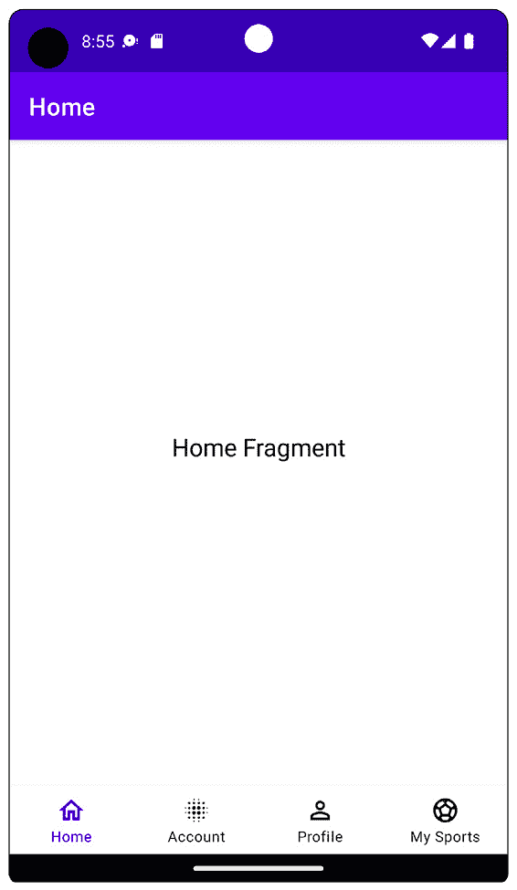

图 4.15 – My Sports 应用程序的底部导航

注意

此活动的解决方案可在：[`packt.link/By7eE`](https://packt.link/By7eE) 找到。

# 摘要

本章涵盖了您需要了解的最重要的导航技术，以便在您的应用中创建清晰和一致的导航。您从学习如何使用 Jetpack 导航创建带有导航抽屉的 Android Studio 项目开始，将导航菜单项连接到单个片段。然后，您继续学习 Jetpack 导航中的操作，以便在导航图中导航到应用中的其他二级目的地。

接下来的练习使用了底部导航来显示始终可见于屏幕上的主要导航目的地。随后，我们探讨了标签导航，您学习了如何显示固定和可滚动的标签。对于每种导航模式，您都了解了根据您构建的应用类型，何时可能更适合。我们通过构建自己的应用并添加主要和次要目的地来结束本章。

本章在 *第一章*，*创建您的第一个应用*，以及您在 *第二章*，*构建用户屏幕流程*，和 *第三章*，*使用片段开发 UI* 中学到的关于活动和片段的知识的基础上构建。这些章节涵盖了您需要创建应用所需的知识、实践和基本 Android 组件。本章通过引导您了解可用的主要导航模式，将这些先前章节联系起来，使您的应用脱颖而出且易于使用。

下一章将在此基础上构建，并介绍更多高级的显示应用内容的方法。您将从学习如何使用 `RecyclerView` 将数据与列表绑定开始。之后，您将探索您可以使用的不同机制来检索和填充应用内的内容。

# 第二部分：显示网络调用

在这部分，我们将探讨如何集成用于构建 Android 应用的流行库和框架。我们将从用于从互联网获取和处理数据的库开始，然后继续使用用于渲染列表的 `RecyclerView` 库。

接下来，我们将探讨如何处理权限和使用 Google Maps，然后是使用 Services 和 `WorkManager` 在后台执行任务，接着向用户显示通知。最后，我们将探讨 Jetpack Compose 以及如何使用它来简化用户界面的创建。

在本节中，我们将涵盖以下章节：

+   *第五章*, *必备库：Retrofit, Moshi 和 Glide*

+   *第六章*, *添加和与 RecyclerView 交互*

+   *第七章*, *Android 权限和 Google Maps*

+   *第八章*, *服务、WorkManager 和通知*

+   *第九章*, *使用 Jetpack Compose 构建用户界面*
