# 6

# 添加和与 RecyclerView 交互

在本章中，你将学习如何将项目列表和网格添加到你的应用中，并有效地利用`RecyclerView`的回收能力。你还将学习如何处理屏幕上项目视图的用户交互，并支持不同的项目视图类型——例如，用于标题。在本章的后面部分，你将动态地添加和删除项目。

到本章结束时，你将掌握向用户展示丰富项目交互式列表所需的所有技能。

在上一章中，我们学习了如何从 API 中获取数据，包括项目列表和图像 URL，以及如何从 URL 加载图像。将这一知识结合展示项目列表的能力，是本章的目标。

很频繁地，你将想要向用户展示一个项目列表。例如，你可能想向他们展示设备上的图片列表，或者让他们从一个包含所有国家的列表中选择他们的国家。为此，你需要填充多个视图，所有这些视图共享相同的布局，但展示不同的内容。

从历史上看，这是通过使用`ListView`或`GridView`来实现的。虽然这两种方法仍然是可行的选项，但它们并不提供`RecyclerView`的强大功能和灵活性。例如，它们不支持大型数据集，不支持水平滚动，并且不提供丰富的分隔符自定义。

注意

使用`RecyclerView.ItemDecorator`可以轻松地自定义`RecyclerView`中项目之间的分隔符。

那么，`RecyclerView`到底做了什么？`RecyclerView`负责协调表示项目列表的视图的创建、填充和重用（因此得名）。要使用`RecyclerView`，你需要熟悉其两个依赖项——适配器（以及通过它，视图持有者）和布局管理器。这些依赖项为我们的`RecyclerView`提供要显示的内容，并告诉它如何呈现这些内容以及如何在屏幕上布局。

适配器为`RecyclerView`提供绘制在屏幕上的子视图（在`RecyclerView`中嵌套的 Android 视图，用于表示单个数据项），将这些视图绑定到数据（通过`ViewHolder`实例），并报告用户与这些视图的交互。

布局管理器告诉`RecyclerView`如何布局其子项。我们默认提供了三种布局类型——线性、网格和交错网格，分别由`LinearLayoutManager`、`GridLayoutManager`和`StaggeredGridLayoutManager`管理。

注意

本章依赖于使用 Jetpack `RecyclerView`库：[`packt.link/FBX4d`](https://packt.link/FBX4d)。

在本章中，我们将开发一个应用，列出特工及其当前是否活跃或睡眠（因此不可用）。然后，应用将允许我们通过滑动来添加新特工或删除现有特工。不过，有一个转折——正如你在 *第五章*，“基本库：Retrofit、Moshi 和 Glide”中所看到的，我们所有的特工都将变成猫。

在本章中，我们将涵盖以下主题：

+   将 `RecyclerView` 添加到我们的布局

+   填充 `RecyclerView`

+   在 `RecyclerView` 中响应用户点击

+   支持不同的项目类型

+   滑动删除项目

+   交互式添加项目

# 技术要求

本章中所有练习和活动的完整代码可在 GitHub 上找到，链接为 [`packt.link/IJbeG`](https://packt.link/IJbeG)

# 将 `RecyclerView` 添加到我们的布局

在 *第三章*，“使用片段开发 UI”，我们看到了如何将视图添加到我们的布局中，以便由活动、片段或自定义视图填充。`RecyclerView` 就是这样的另一个视图。要将它添加到我们的布局中，我们需要在布局中添加以下标签：

```swift
<androidx.recyclerview.widget.RecyclerView
    android:id="@+id/recycler_view"
    android:layout_width="match_parent"
    android:layout_height="wrap_content"
    tools:listitem="@layout/item_sample" />
```

你应该已经能够识别 `android:id` 属性，以及 `android:layout_width` 和 `android:layout_height` 属性。

我们可以使用可选的 `tools:listitem` 属性来告诉 Android Studio 在预览工具栏中哪个布局应该被填充为列表项。这将给我们一个关于 `RecyclerView` 在我们的应用中可能看起来如何的印象。

在我们的布局中添加一个 `RecyclerView` 标签意味着我们现在有一个空容器来存放代表列表项的子视图。一旦填充，它将为我们处理子视图的展示、滚动和回收。

## 练习 6.01 – 在主活动中添加一个空的 RecyclerView

要在你的应用中使用 `RecyclerView`，你首先需要将它添加到你的布局之一中。让我们将它添加到由我们的主活动填充的布局中：

1.  首先创建一个新的空活动项目（`My RecyclerView App`）。确保你的包名为 `com.example.myrecyclerviewapp`。

1.  将保存位置设置为你要保存项目的地方。将其他所有内容保留在默认值，并点击 **完成**。确保你正在你的 **项目** 面板中的 **Android** 视图中：

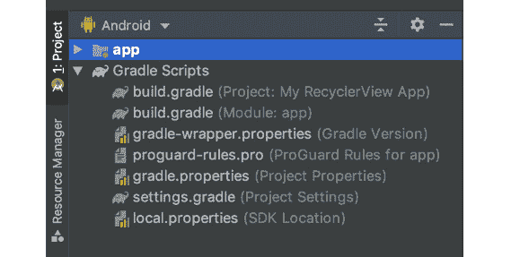

图 6.1 – 项目面板中的 Android 视图

1.  以 **文本** 模式打开你的 `activity_main.xml` 文件。

1.  要将你的标签变成屏幕顶部的标题，并在其下方添加你的 `RecyclerView`，请给 `TextView` 添加一个 ID 并将其对齐到顶部，如下所示：

    ```swift
    <TextView
        android:id="@+id/hello_label"
        android:layout_width="wrap_content"
        android:layout_height="wrap_content"
        android:text="Hello World!"
        app:layout_constraintLeft_toLeftOf="parent"
        app:layout_constraintRight_toRightOf="parent"
        app:layout_constraintTop_toTopOf="parent" />
    ```

1.  在 `TextView` 标签之后添加以下内容，以将一个空的 `RecyclerView` 元素添加到你的布局中，并限制在 `hello_label` `TextView` 标题下方：

    ```swift
    <androidx.recyclerview.widget.RecyclerView
      android:id="@+id/recycler_view"
      android:layout_width="match_parent"
      android:layout_height="wrap_content"
      app:layout_constraintTop_toBottomOf="@+id/hello_label" />
    ```

你的布局文件现在应该看起来像这样：

```swift
<?xml version="1.0" encoding="utf-8"?>
<androidx.constraintlayout.widget.ConstraintLayout
  ...>
  <TextView
    android:id="@+id/hello_label"
    android:layout_width="wrap_content"
    android:layout_height="wrap_content"
    android:text="Hello World!"
    app:layout_constraintLeft_toLeftOf="parent"
    app:layout_constraintRight_toRightOf="parent"
    app:layout_constraintTop_toTopOf="parent" />
  <androidx.recyclerview.widget.RecyclerView
    android:id="@+id/recycler_view"
    android:layout_width="match_parent"
    android:layout_height="wrap_content"
    app:layout_constraintTop_toBottomOf="@+id/hello_label" />
</androidx.constraintlayout.widget.ConstraintLayout>
```

1.  通过点击 **运行应用** 按钮或按 *Ctrl* + *R*（在 Windows 中为 *Shift* + *F10*）来运行你的应用。在模拟器上，它应该看起来像这样：

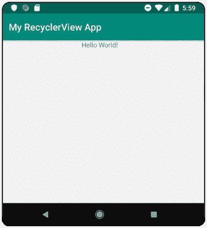

图 6.2 – 具有空 RecyclerView 的应用（图像裁剪以节省空间）

如您所见，我们的应用正在运行，并且我们的布局已显示在屏幕上。然而，我们没有看到我们的 `RecyclerView`。为什么是这样？在这个阶段，我们的 `RecyclerView` 没有内容。默认情况下，没有内容的 `RecyclerView` 不会渲染——因此，尽管我们的 `RecyclerView` 确实在屏幕上，但它不可见。这使我们来到了下一步——用我们可以实际看到的内容填充 `RecyclerView`。

# 填充 RecyclerView

因此，我们在布局中添加了 `RecyclerView`。为了从 `RecyclerView` 中受益，我们需要向其中添加内容。让我们看看我们是如何做到这一点的。

如我们之前提到的，为了向我们的 `RecyclerView` 添加内容，我们需要实现一个适配器。适配器将我们的数据绑定到子视图。用更简单的话说，这意味着它告诉 `RecyclerView` 如何将数据插入到设计用来展示该数据的视图。

例如，假设我们想要展示员工列表。

首先，我们需要设计我们的 UI 模型。这将是一个数据对象，包含我们的视图展示单个员工所需的所有信息。因为这是一个 UI 模型，一个惯例是在其名称后缀加上 `UiModel`：

```swift
data class EmployeeUiModel(
    val name: String,
    val biography: String,
    val role: EmployeeRole,
    val gender: Gender,
    val imageUrl: String
)
```

我们将如下定义 `EmployeeRole` 和 `Gender`：

```swift
enum class EmployeeRole {
    HumanResources,
    Management,
    Technology
}
enum class Gender {
    Female,
    Male,
    Unknown
}
```

这些值当然只是作为示例提供的。请随意添加更多您自己的内容！


图 6.3 – 模型的层次结构

现在，我们知道在绑定到视图时可以期待什么数据，因此我们可以设计我们的视图来展示这些数据（这是实际布局的简化版本，我们将将其保存为 `item_employee.xml`）。我们将从 `ImageView` 开始：

```swift
<?xml version="1.0" encoding="utf-8"?>
<androidx.constraintlayout.widget.ConstraintLayout ...>
    <ImageView
        android:id="@+id/item_employee_photo"
        android:layout_width="60dp"
        android:layout_height="60dp"
        app:layout_constraintStart_toStartOf="parent"
        app:layout_constraintTop_toTopOf="parent"
        tools:background="@color/colorPrimary" />
```

然后，我们将为每个字段添加一个 `TextView`：

```swift
  <TextView
    android:id="@+id/item_employee_name"
    android:layout_width="wrap_content"
    android:layout_height="wrap_content"
    android:layout_marginStart="16dp"
    android:layout_marginLeft="16dp"
    android:textStyle="bold"
    app:layout_constraintStart_toEndOf="@+id/item_employee_photo"
    app:layout_constraintTop_toTopOf="parent"
    tools:text="Oliver" />
  <TextView
    android:id="@+id/item_employee_role"
    android:layout_width="wrap_content"
    android:layout_height="wrap_content"
    android:textColor="@color/colorAccent"
    app:layout_constraintStart_toStartOf="@+id/item_employee_name"
    app:layout_constraintTop_toBottomOf="@+id/
        item_employee_name"
    tools:text="Exotic Shorthair" />
  <TextView
    android:id="@+id/item_employee_biography"
    android:layout_width="wrap_content"
    android:layout_height="wrap_content"
    app:layout_constraintStart_toStartOf="@+id/item_employee_role"
    app:layout_constraintTop_toBottomOf="@+id/item_employee_role"
    tools:text="Stealthy and witty. Better avoid in dark alleys." />
  <TextView
    android:id="@+id/item_employee_gender"
    android:layout_width="wrap_content"
    android:layout_height="wrap_content"
    android:textSize="30sp"
    app:layout_constraintEnd_toEndOf="parent"
    app:layout_constraintTop_toTopOf="parent"
    tools:text="&#9794;" />
</androidx.constraintlayout.widget.ConstraintLayout>
```

到目前为止，没有什么新的内容。你应该能够识别出从 *第二章*，*构建用户* *屏幕流程* 中提到的所有不同的视图类型：


图 6.4 – item_cat.xml 布局文件的预览

现在我们有了数据模型和布局，我们已经拥有了将数据绑定到视图所需的一切。为此，我们将实现一个视图持有者。通常，视图持有者有两个职责——它持有对视图的引用（正如其名称所暗示的），但它还负责将数据绑定到该视图。我们将如下实现我们的视图持有者：

```swift
private const val FEMALE_SYMBOL = "\u2640"
private const val MALE_SYMBOL = "\u2642"
private const val UNKNOWN_SYMBOL = "?"
class EmployeeViewHolder(
  containerView: View,
  private val imageLoader: ImageLoader
) : ViewHolder(containerView) {
private val employeeNameView: TextViewby lazy {
    containerView.findViewById(R.id.item_employee_name) }
private val employeeRoleView: TextViewby lazy {
    containerView.findViewById(R.id.item_employee_role) }
private val employeeBioView: TextViewby lazy {
    containerView.findViewById(R.id.item_employee_bio) }
private val employeeGenderView: TextViewby lazy {
    containerView.findViewById(R.id.item_employee_gender) }
  fun bindData(employeeData: EmployeeUiModel) {
    imageLoader.loadImage(employeeData.imageUrl,
      employeePhotoView)
    employeeNameView.text = employeeData.name
    employeeRoleView.text = when (employeeData.role) {
      EmployeeRole.HumanResources -> "Human Resources"
      EmployeeRole.Management -> "Management"
      EmployeeRole.Technology -> "Technology"
    }
    employeeBioView.text = employeeData.biography
    employeeGenderView.text = when (employeeData.gender) {
      Gender.Female -> FEMALE_SYMBOL
      Gender.Male -> MALE_SYMBOL
      else -> UNKNOWN_SYMBOL
    }
  }
}
```

在前面的代码中，有几个值得注意的地方。首先，按照惯例，我们在视图持有者的名称后缀加上 `ViewHolder`。其次，请注意 `EmployeeViewHolder` 需要实现抽象的 `RecyclerView.ViewHolder` 类。

这是为了确保我们的适配器的泛型可以是我们的视图持有者。最后，我们懒加载地保留对我们感兴趣的视图的引用。当第一次调用 `bindData(EmployeeUiModel)` 时，我们将在布局中找到这些视图并保留它们的引用。

接下来，我们引入了一个`bindData(EmployeeUiModel)`函数。这个函数将由我们的适配器调用，以将数据绑定到视图持有者持有的视图。最后但同样重要的是，我们总是确保为所有可能的输入设置所有修改视图的状态。

在设置好视图持有者之后，我们可以继续实现我们的适配器。我们将从实现所需的最小函数以及一个设置数据的函数开始。我们的适配器看起来可能像这样：

```swift
class EmployeesAdapter(
  private val layoutInflater: LayoutInflater,
  private val imageLoader: ImageLoader
) : RecyclerView.Adapter<EmployeeViewHolder>() {
  private val employees = mutableListOf<EmployeeUiModel>()
  fun setData(newEmployees: List<EmployeeUiModel>) {
    employees.clear()
    employees.addAll(newEmployees)
    notifyDataSetChanged()
  }
  override fun onCreateViewHolder(parent: ViewGroup,
    viewType: Int): EmployeeViewHolder {
    val view = layoutInflater.inflate(
      R.layout.item_employee, parent, false)
    return EmployeeViewHolder(view, imageLoader)
  }
  override fun getItemCount() = employees.size
  override fun onBindViewHolder(
    holder: EmployeeViewHolder, position: Int) {
    holder.bindData(employees [position])
  }
}
```

让我们回顾一下这个实现。首先，我们通过适配器的构造函数注入我们的依赖项。这将使测试我们的适配器变得容易得多，但也会允许我们轻松地更改其某些行为（例如，替换图像加载库）。实际上，在这种情况下，我们甚至不需要更改适配器。

然后，我们定义一个私有的可变`EmployeeUiModel`列表来存储适配器当前提供给`RecyclerView`的数据。我们还引入了一个`setData`方法来填充该列表。请注意，我们保留一个本地列表并设置其内容，而不是直接设置`employees`。

这主要是因为 Kotlin，就像 Java 一样，通过引用传递变量。通过引用传递变量意味着传递给适配器的列表内容的变化会改变适配器持有的列表。例如，如果某个项目在适配器外部被删除，适配器也会删除该项目。

这成为一个问题，因为适配器不会意识到这个变化，因此无法通知`RecyclerView`。在适配器外部修改列表周围还有其他风险，但涵盖这些风险超出了本书的范围。

将数据修改封装在函数中的另一个好处是，我们避免了忘记通知`RecyclerView`数据集已更改的风险，这是通过调用`notifyDataSetChanged()`来实现的。

我们继续实现适配器的`onCreateViewHolder(ViewGroup, Int)`函数。当`RecyclerView`需要一个新的`ViewHolder`来在屏幕上渲染数据时，会调用此函数。它为我们提供了一个`ViewGroup`容器和一个视图类型（我们将在本章后面讨论视图类型）。

函数随后期望我们返回一个使用视图初始化的视图持有者（在我们的情况下，是一个已充气的视图）。因此，我们充气我们之前设计的视图，并将其传递给一个新的`EmployeeViewHolder`实例。请注意，传递给充气函数的最后一个参数是`false`。

这确保我们不会将新充气的视图附加到父视图上。视图的附加和分离将由布局管理器管理。将视图设置为`true`或省略它会导致抛出`IllegalStateException`。最后，我们返回新创建的`EmployeeViewHolder`。

要实现`getItemCount()`，我们只需返回我们的`employees`列表的大小。

最后，我们实现`onBindViewHolder(EmployeeViewHolder, Int)`。这是通过将存储在`employees`中的`EmployeeUiModel`传递给视图持有者的`bindData(EmployeeUiModel)`函数来完成的。我们的适配器现在已准备就绪。

如果我们现在尝试将适配器连接到我们的`RecyclerView`并运行应用程序，我们仍然看不到任何内容。这是因为我们仍然缺少两个小步骤——在适配器上设置数据并将布局管理器分配给我们的`RecyclerView`。完整的有效代码将如下所示：

```swift
class MainActivity : AppCompatActivity() {  
    private val employeesAdapter  
        by lazy { EmployeesAdapter(layoutInflater, 
        GlideImageLoader(this)) }  
    private val recyclerView: RecyclerView 
        by lazy { findViewById(R.id.main_recycler_view) }  
    override fun onCreate(savedInstanceState: Bundle?) {  
        super.onCreate(savedInstanceState)  
        setContentView(R.layout.activity_main)  
        recyclerView.adapter = employeesAdapter  
        recyclerView.layoutManager = LinearLayoutManager(  
            this, LinearLayoutManager.VERTICAL, false)  
        employeesAdapter.setData(  
            listOf(  
                EmployeeUiModel(  
                    "Robert",  
                    "Rose quickly through the organization",  
                    EmployeeRole.Management,  
                    Gender.Male,  
                    "https://images.pexels.com/photos/220453/
                    pexels-photo-220453.jpeg?  
                    auto=compress&cs=tinysrgb&h=650&w=940"  
                 ),  
                 EmployeeUiModel(  
                    "Wilma",  
                    "A talented developer",  
                    EmployeeRole.Technology,  
                    Gender.Female,  
                    "https://images.pexels.com/photos/3189024/
                    pexels-photo-3189024.jpeg?  
                    auto=compress&cs=tinysrgb&h=650&w=940"  
                 ),  
                 EmployeeUiModel( 
                    "Curious George",  
                    "Excellent at retention",  
                    EmployeeRole.HumanResources,  
                    Gender.Unknown,  
                    "https://images.pexels.com/photos/771742/
                    pexels-photo-771742.jpeg? 
                    auto=compress&cs=tinysrgb&h=750&w=1260"  
                 )  
             )  
        )  
    }  
} 
```

现在运行我们的应用程序，我们会看到员工列表。

注意我们硬编码了员工列表。在生产应用中，遵循`ViewModel`。还应注意，我们保留了`employeesAdapter`的引用。

这样我们就可以在以后设置不同的值。一些实现依赖于从`RecyclerView`本身读取适配器——这可能导致不必要的类型转换操作和适配器尚未分配给`RecyclerView`的意外状态，因此这通常不是一个推荐的方法。

最后，请注意，我们选择使用`LinearLayoutManager`，并提供活动作为上下文、`VERTICAL`方向标志以及`false`来告诉它我们不希望列表中项目的顺序颠倒。

## 练习 6.02 – 填充您的 RecyclerView

没有内容的`RecyclerView`并不有趣。是时候通过添加您的秘密猫代理来填充`RecyclerView`了。

在您开始之前，快速回顾一下——在前一个练习中，我们介绍了一个空列表，用于存储用户可用的秘密猫代理列表。在这个练习中，您将填充这个列表，向用户展示机构中可用的秘密猫代理：

1.  为了保持我们的文件结构整洁，我们首先创建一个模型包。右键单击应用程序的包名，然后选择**新建** | **包**：

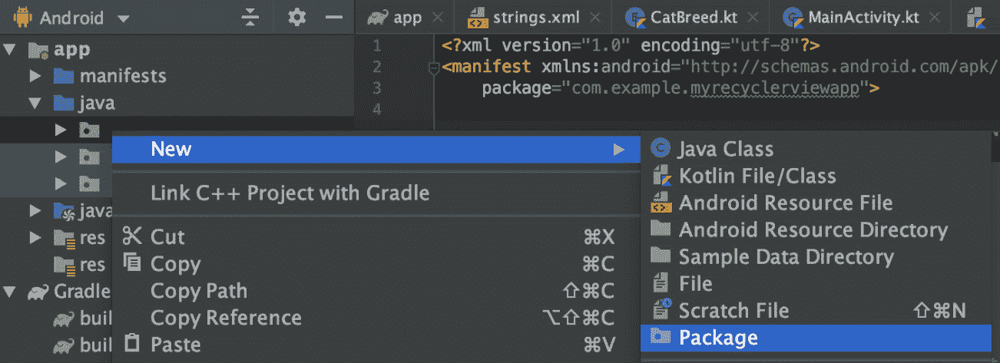

图 6.5 – 创建新包

1.  将新包命名为`model`。点击**确定**以创建包。

1.  要创建我们的第一个模型数据类，右键单击新创建的模型包，然后选择**新建** | **Kotlin 文件/类**。

1.  在`CatUiModel`下，将**kind**保留为**文件**，然后点击**确定**。这将是我们关于每个单独猫代理的数据的类。

1.  将以下内容添加到新创建的`CatUiModel.kt`文件中，以定义包含猫代理所有相关属性的数据类：

    ```swift
    data class CatUiModel(
        val gender: Gender,
        val breed: CatBreed,
        val name: String,
        val biography: String,
        val imageUrl: String
    )
    ```

对于每个猫代理，除了他们的名字和照片，我们还想了解他们的性别、品种和传记。这将帮助我们选择适合任务的正确代理。

1.  再次右键单击模型包，然后导航到**新建** | **Kotlin 文件/类**。

1.  这次，将新文件命名为`CatBreed`并将`kind`设置为`Enum`类。这个类将包含我们的不同猫品种。

1.  更新您新创建的`enum`，添加一些初始值，如下所示：

    ```swift
    enum class CatBreed {
        AmericanCurl, BalineseJavanese, ExoticShorthair
    }
    ```

1.  重复 *步骤 6* 和 *步骤 7*，这次将文件命名为 `Gender`。这将包含猫代理性别的有效值。

1.  更新 `Gender` 枚举，如下所示：

    ```swift
    enum class Gender {
        Female, Male, Unknown
    }
    ```

1.  现在，为了定义包含每个猫代理数据的视图的布局，通过右键单击 `layout` 并选择 **新建** | **布局资源文件** 创建一个新的布局资源文件：


图 6.6 – 创建新的布局资源文件

1.  将资源命名为 `item_cat`。保留所有其他字段不变，然后点击 **确定**。

1.  更新新创建的 `item_cat.xml` 文件的内容（以下代码块因空间限制已被截断，请使用以下链接查看需要添加的完整代码）：

item_cat.xml

```swift
    <ImageView
        android:id="@+id/item_cat_photo"
        android:layout_width="60dp"
        android:layout_height="60dp"
        app:layout_constraintStart_toStartOf="parent"
        app:layout_constraintTop_toTopOf="parent"
        tools:background="@color/colorPrimary" />
    <TextView
        android:id="@+id/item_cat_name"
        android:layout_width="wrap_content"
        android:layout_height="wrap_content"
        android:layout_marginStart="16dp"
        android:layout_marginLeft="16dp"
        android:textStyle="bold"
        app:layout_constraintStart_toEndOf="@+id/
            item_cat_photo"
        app:layout_constraintTop_toTopOf="parent"
        tools:text="Oliver" />
```

本步骤的完整代码可以在 [`packt.live/3sopUjo`](http://packt.live/3sopUjo) 找到。

这将创建一个包含用于我们列表中的名称、品种和传记的图片和文本字段的布局。

1.  您需要一份 `ImageLoader.kt` 的副本，它在 *第五章* 的 *Essential Libraries: Retrofit, Moshi, and Glide* 中介绍过，因此右键单击您的应用包名称，导航到 `ImageLoader` 并将其转换为 **接口**，然后点击 **确定**。

1.  与 *第五章* 中的 *Essential Libraries: Retrofit, Moshi, and Glide* 类似，您在这里只需要添加一个函数：

    ```swift
    interface ImageLoader {
      fun loadImage(imageUrl: String, imageView: ImageView)
    }
    ```

确保导入 `ImageView`。

1.  再次右键单击您的应用包名称，然后选择 **新建** | **Kotlin 文件/类**。

1.  将新文件命名为 `CatViewHolder`。点击 **确定**。

1.  要实现 `CatViewHolder`，它将绑定猫代理数据到您的视图，用以下内容替换 `CatViewHolder.kt` 文件的内容：

    ```swift
    private val FEMALE_SYMBOL = "\u2640"
    private val MALE_SYMBOL = "\u2642"
    private const val UNKNOWN_SYMBOL = "?"
    class CatViewHolder(
      containerView: View,
      private val imageLoader: ImageLoader
    ) : ViewHolder(containerView) {
      private val catBiographyView: TextView by lazy {
        containerView
          .findViewById(R.id.item_cat_biography) }
      private val catBreedView: TextView by lazy {
        containerView.findViewById(R.id.item_cat_breed) }
      private val catGenderView: TextView by lazy {
        containerView.findViewById(R.id.item_cat_gender) }
      private val catNameView: TextView by lazy {
        containerView.findViewById(R.id.item_cat_name) }
      private val catPhotoView: ImageView by lazy {
        containerView.findViewById(R.id.item_cat_photo) }
      fun bindData(cat: CatUiModel) {
        imageLoader.loadImage(cat.imageUrl, catPhotoView)
        catNameView.text = cat.name
        catBreedView.text = when (cat.breed) {
          AmericanCurl -> "American Curl"
          BalineseJavanese -> "Balinese-Javanese"
          ExoticShorthair -> "Exotic Shorthair"
        }
        catBiographyView.text = cat.biography
        catGenderView.text = when (cat.gender) {
          Female -> FEMALE_SYMBOL
          Male -> MALE_SYMBOL
          else -> UNKNOWN_SYMBOL
        }
      }
    }
    ```

1.  仍然在我们的应用包名称下，创建一个名为 `CatsAdapter` 的新 Kotlin 文件。

1.  要实现 `CatsAdapter`，它负责存储 `RecyclerView` 的数据以及创建视图持有实例并使用它们将数据绑定到视图，用以下内容替换 `CatsAdapter.kt` 文件的内容：

    ```swift
    package com.example.myrecyclerviewapp
    import { ... }
    class CatsAdapter(
        private val layoutInflater: LayoutInflater,
        private val imageLoader: ImageLoader
    ) : RecyclerView.Adapter<CatViewHolder>() {
        private val cats = mutableListOf<CatUiModel>()
        fun setData(newCats: List<CatUiModel>) {
            cats.clear()
            cats.addAll(newCats)
            notifyDataSetChanged()
        }
        override fun onCreateViewHolder(parent: ViewGroup,
          viewType: Int): CatViewHolder {
            val view = layoutInflater
              .inflate(R.layout.item_cat, parent, false)
            return CatViewHolder(view, imageLoader)
        }
        override fun getItemCount() = cats.size
        override fun onBindViewHolder(
            holder: CatViewHolder, position: Int) {
            holder.bindData(cats[position])
        }
    }
    ```

1.  在这一点上，您需要在项目中包含 Glide。首先，将以下行代码添加到您的应用 `gradle.build` 文件中的 `dependencies` 块内：

    ```swift
    implementation 'com.github.bumptech.glide:glide:4.14.2'
    ```

1.  在您的应用包路径中创建一个 `GlideImageLoader` 类，包含以下内容：

    ```swift
    package com.example.myrecyclerviewapp
    [imports]
    class GlideImageLoader(context: Context) : ImageLoader {
        private val glide by lazy { Glide(context) }
        override fun loadImage(imageUrl: String,
        imageView: ImageView) {
            glide.load(imageUrl)
                .centerCrop().into(imageView)
        }
    }
    ```

这是一个简单的实现，假设加载的图片应该始终居中裁剪。

1.  更新您的 `MainActivity` 文件：

    ```swift
    class MainActivity : AppCompatActivity() {
      private val recyclerView: RecyclerView by lazy {
        findViewById(R.id.recycler_view) }
      private val catsAdapter by lazy { CatsAdapter(
        layoutInflater, GlideImageLoader(this)) }
      override fun onCreate(savedInstanceState: Bundle?) {
        super.onCreate(savedInstanceState)
        setContentView(R.layout.activity_main)
        recyclerView.adapter = catsAdapter
        recyclerView.layoutManager = LinearLayoutManager(
          this, LinearLayoutManager.VERTICAL, false)
        catsAdapter.setData(
          listOf(
            CatUiModel(Gender.Male,
              CatBreed.BalineseJavanese, "Fred",
              "Silent and deadly",
              "https://cdn2.thecatapi.com/image/DBmIBhhyv.
              jpg"
            ),
            CatUiModel(Gender.Female,
              CatBreed.ExoticShorthair, "Wilma",
              "Cuddly assassin",
              "https://cdn2.thecatapi.com/images/KJF8fB_20.
              jpg"
            ),
            CatUiModel(Gender.Unknown,
              CatBreed.AmericanCurl, "Curious George",
              "Award winning investigator",
              "https://cdn2.thecatapi.com/images/vJB8rwfdX.
              jpg"
            )
          )
        )
      }
    }
    ```

这将定义您的适配器，将其附加到 `RecyclerView` 并用一些硬编码的数据填充它。

1.  在您的 `AndroidManifest.xml` 文件中，在 `manifest` 标签中的应用标签之前添加以下内容：

    ```swift
    <uses-permission android:name="android.permission.INTERNET" />
    ```

有这个标签将允许您的应用从互联网下载图片。

1.  为了进行一些最后的润色，例如给我们的标题视图一个合适的名称和文本，更新您的 `activity_main.xml` 文件，如下所示：

    ```swift
    <?xml version="1.0" encoding="utf-8"?>
    <androidx.constraintlayout.widget.ConstraintLayout
      ...>
      <TextView
        android:id="@+id/main_label"
        android:layout_width="wrap_content"
        android:layout_height="wrap_content"
        android:text="@string/main_title"
        android:textSize="24sp"
        app:layout_constraintLeft_toLeftOf="parent"
        app:layout_constraintRight_toRightOf="parent"
        app:layout_constraintTop_toTopOf="parent" />
      <androidx.recyclerview.widget.RecyclerView
        android:id="@+id/recycler_view"
        android:layout_width="match_parent"
        android:layout_height="wrap_content"
        app:layout_constraintTop_toBottomOf="@+id/main_label" />
    </androidx.constraintlayout.widget.ConstraintLayout>
    ```

1.  此外，更新您的 `strings.xml` 文件，为您的应用提供一个合适的名称和标题：

    ```swift
    <resources>
      <string name="app_name">SCA - Secret Cat Agents</string>
      <string name="main_title">Our Agents</string>
    </resources>
    ```

1.  运行您的应用。它应该看起来像这样：


图 6.7 – 带有硬编码的秘密猫特工的 RecyclerView

如您所见，`RecyclerView`现在有了内容，您的应用开始成形。注意，相同的布局被用来根据绑定到每个实例的数据展示不同的项目。正如您所期望的，如果您添加足够的项目使它们超出屏幕，则可以滚动。接下来，我们将探讨允许用户与`RecyclerView`内部的项目进行交互。

# 在 RecyclerView 中响应点击

如果我们想让用户从显示的列表中选择一个项目呢？为了实现这一点，我们需要将点击事件回传到我们的应用中。

实现点击交互的第一步是在`ViewHolder`级别捕获项目的点击。为了保持我们的视图持有者和适配器之间的分离，我们在视图持有者中定义了一个嵌套的`OnClickListener`接口。我们选择在视图持有者中定义接口，因为那和监听器是紧密耦合的。

在我们的情况下，这个接口将只有一个功能。这个函数的目的是通知视图持有者的所有者关于点击的信息。视图持有者的所有者通常是`Fragment`或`Activity`。由于我们知道视图持有者可以被重用，我们知道在构造时定义它可能会很有挑战性，这样我们就能知道哪个项目被点击了（因为随着重用，那个项目会随时间改变）。

我们通过在点击时将当前显示的项目回传给视图持有者的所有者来解决这个问题。这意味着我们的接口看起来会是这样：

```swift
interface OnClickListener {
    fun onClick(cat: CatUiModel)
}
```

我们还将把这个监听器作为一个参数添加到我们的`ViewHolder`构造函数中：

```swift
class CatViewHolder(
    containerView: View,
    private val imageLoader: ImageLoader,
    private val onClickListener: OnClickListener
) : ViewHolder(containerView) {
    ...
}
```

它将这样使用：

```swift
containerView.setOnClickListener {
    onClickListener.onClick(cat) }
```

现在，我们希望我们的适配器传递一个监听器。反过来，这个监听器将负责通知适配器的所有者关于点击的信息。这意味着我们的适配器也需要一个嵌套的监听器接口，这与我们在视图持有者中实现的接口非常相似。

注意

虽然这似乎是重复的，可以通过重用相同的监听器来避免，但这并不是一个好主意，因为它会导致通过监听器在视图持有者和适配器之间产生紧密耦合。当你想要你的适配器也通过监听器报告其他事件时会发生什么？你将不得不处理来自视图持有者的这些事件，即使它们实际上并没有在视图持有者中实现。

最后，为了处理点击事件并显示对话框，我们在活动中定义了一个监听器，并将其传递给适配器。我们设置这个监听器，在点击时显示对话框。在 MVVM 实现中，你会在这一点通知`ViewModel`关于点击的信息。`ViewModel`随后会更新其状态，告诉视图（我们的活动）应该显示对话框。

## 练习 6.03 – 响应点击

你的应用已经向用户展示了秘密猫特工的列表。现在是时候允许用户通过点击其视图来选择一个秘密猫特工了。点击事件从视图持有器委托到适配器再到活动，如图*图 6.9*所示：

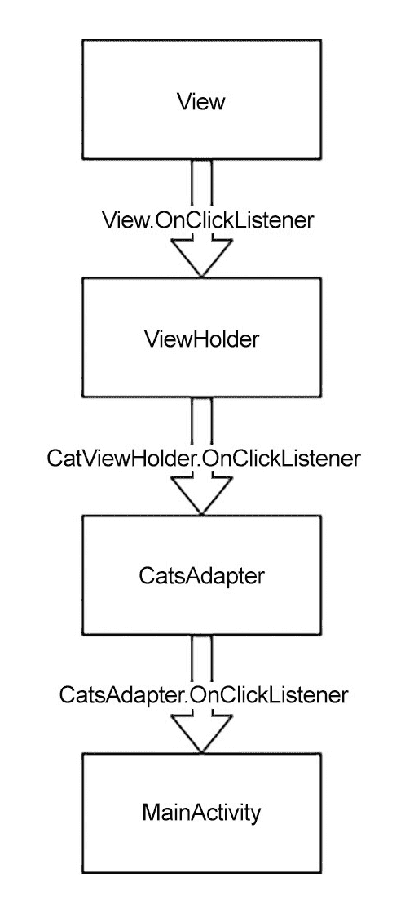

图 6.8 – 点击事件流程

完成此练习需要遵循以下步骤：

1.  打开你的`CatViewHolder.kt`文件。在最后的闭合花括号之前向其中添加一个嵌套接口：

    ```swift
    interface OnClickListener {
        fun onClick(cat: CatUiModel)
    }
    ```

这将是监听器必须实现以注册对单个猫项目点击事件的接口。

1.  更新`CatViewHolder`构造函数以接受`OnClickListener`并使`containerView`可访问：

    ```swift
    class CatViewHolder(
        private val containerView: View,
        private val imageLoader: ImageLoader,
        private val onClickListener: OnClickListener
    ) : ViewHolder(containerView) {
    ```

现在，当构建`CatViewHolder`构造函数时，你还需要为项目视图注册点击事件。

1.  在`bindData(CatUiModel)`函数的顶部添加以下内容以拦截点击并报告给提供的监听器：

    ```swift
    containerView.setOnClickListener {
        onClickListener.onClick(cat) }
    ```

1.  现在，打开你的`CatsAdapter.kt`文件。在最后的闭合花括号之前添加这个嵌套接口：

    ```swift
    interface OnClickListener {
        fun onItemClick(cat: CatUiModel)
    }
    ```

这定义了监听器必须实现的接口，以接收来自适配器的项目点击事件。

1.  更新`CatsAdapter`构造函数以接受一个实现你刚刚定义的`OnClickListener`适配器的调用：

    ```swift
    class CatsAdapter(
        private val layoutInflater: LayoutInflater,
        private val imageLoader: ImageLoader,
        private val onClickListener: OnClickListener
    ) : RecyclerView.Adapter<CatViewHolder>() {
    ```

1.  在`onCreateViewHolder(ViewGroup, Int)`中，更新视图持有者的创建，如下所示：

    ```swift
    return CatViewHolder(view, imageLoader, object :
    CatViewHolder.OnClickListener {
    override fun onClick(cat: CatUiModel) =
    onClickListener.onItemClick(cat)
    })
    ```

这将添加一个匿名类，将`ViewHolder`的点击事件委托给适配器监听器。

1.  最后，打开你的`MainActivity.kt`文件。按照以下方式更新`catsAdapter`的构建，以向适配器提供所需的依赖项，形式为一个匿名监听器，通过显示对话框来处理点击事件：

    ```swift
    private val catsAdapter by lazy {
      CatsAdapter(layoutInflater, GlideImageLoader(this),
        object : CatsAdapter.OnClickListener {
          override fun onClick(cat: CatUiModel) =
            onClickListener.onItemClick(cat)
        }
      )
    }
    ```

1.  在最后的闭合花括号之前添加以下函数：

    ```swift
    private fun showSelectionDialog(cat: CatUiModel) {
      AlertDialog.Builder(this)
        .setTitle("Agent Selected")
        .setMessage("You have selected agent ${cat.name}")
        .setPositiveButton("OK") { _, _ -> }.show()
    }
    ```

此函数将显示一个对话框，显示传递进来的猫的数据名称。

1.  确保导入正确的`AlertDialog`版本，即`androidx.appcompat.app.AlertDialog`，而不是`android.app.AlertDialog`。

注意

AppCompat 版本通常是一个更好的选择，因为它提供了向后兼容性。

1.  运行你的应用。点击猫中的一个应该现在会打开一个对话框：


图 6.9 – 显示已选择代理的对话框

尝试点击不同的项目，并注意显示的不同消息。你现在知道如何响应用户在`RecyclerView`内部点击物品。接下来，我们将探讨如何在我们的列表中支持不同的项目类型。

# 支持不同的项目类型

在前面的章节中，我们学习了如何处理单一类型的物品列表（在我们的案例中，所有物品都是`CatUiModel`）。如果你想要支持多种类型的物品，会发生什么？一个很好的例子是在我们的列表中添加分组标题。

假设我们不是得到猫的列表，而是得到包含快乐猫和悲伤猫的列表。这两组猫的前面都有对应组的标题。我们的列表现在将包含 `ListItem` 实例，而不是 `CatUiModel` 实例的列表。`ListItem` 可能看起来像这样：

```swift
sealed class ListItem {
    data class Group(val name: String) : ListItem()
    data class Cat(val cat: CatUiModel) : ListItem()
}
```

我们的项目列表可能看起来像这样：

```swift
listOf(
  ListItem.Group("Happy Cats"),
  ListItem.Cat(
    CatUiModel(Gender.Female, CatBreed.AmericanCurl,
      "Kitty", "Kitty is warm and fuzzy.",
      "https://cdn2.thecatapi.com/images/..."
    )
  ),
  ListItem.Cat(
    CatUiModel(Gender.Male, CatBreed.ExoticShorthair,
      "Joey", "Loves to cuddle.",
      "https://cdn2.thecatapi.com/images/..."
    )
  ),
  ListItem.Group("Sad Cats"),
  ListItem.Cat(
    CatUiModel(Gender.Unknown, CatBreed.AmericanCurl,
      "Ginger", "Just not in the mood.",
      "https://cdn2.thecatapi.com/images/..."
    )
  ),
  ListItem.Cat(
      CatUiModel(Gender.Female, CatBreed.ExoticShorthair,
      "Butters", "Sleeps most of the time.",
      "https://cdn2.thecatapi.com/images/..."
    )
  )
)
```

在这种情况下，只有一个布局类型是不够的。幸运的是，正如您可能在我们早期的练习中注意到的，`RecyclerView.Adapter` 为我们提供了一个处理这种情况的机制（记得在 `onCreateViewHolder(ViewGroup, Int)` 函数中使用的 `viewType` 参数吗？）。

为了帮助适配器确定每个项目所需的视图类型，我们重写了它的 `getItemViewType(Int)` 函数。以下是一个实现示例，它可以为我们完成这项工作：

```swift
override fun getItemViewType(position: Int) =
  when (listData[position]) {
    is ListItem.Group -> VIEW_TYPE_GROUP
    is ListItem.Cat -> VIEW_TYPE_CAT
  }
```

在这里，`VIEW_TYPE_GROUP` 和 `VIEW_TYPE_CAT` 定义如下：

```swift
private const val VIEW_TYPE_GROUP = 0
private const val VIEW_TYPE_CAT = 1
```

此实现将给定位置的 数据类型映射到表示我们已知布局类型之一的常量值。在我们的情况下，我们知道有标题和猫，因此有两种类型。我们使用的值可以是任何整数值，因为它们会回传给我们，就像在 `onCreateViewHolder(ViewGroup, Int)` 函数中一样。我们唯一需要做的是确保不要重复使用相同的值。

既然我们已经告诉适配器支持哪些视图类型，我们还需要告诉它每种视图类型应该使用哪个视图持有者。这是通过实现 `onCreateViewHolder(ViewGroup, Int)` 函数来完成的：

```swift
override fun onCreateViewHolder(parent: ViewGroup,
viewType: Int) = when (viewType) {
    VIEW_TYPE_GROUP -> {
        val view = layoutInflater.inflate(
            R.layout.item_title, parent, false)
        GroupViewHolder(view)
    }
    VIEW_TYPE_CAT -> {
        val view = layoutInflater.inflate(
            R.layout.item_cat, parent, false)
        CatViewHolder(view, imageLoader, object :
        CatViewHolder.OnClickListener {
        override fun onClick(cat: CatUiModel) =
            onClickListener.onItemClick(cat)
        })
    }
    else -> throw IllegalArgumentException(
      "Unknown view type requested: $viewType")
}
```

与此函数的早期实现不同，我们现在考虑了 `viewType` 的值。

正如我们所知，`viewType` 应该是我们从 `getItemViewType(Int)` 返回的值之一。

对于这些值（`VIEW_TYPE_GROUP` 和 `VIEW_TYPE_CAT`），我们填充相应的布局并构建合适的视图持有者。请注意，我们从未期望收到任何其他值，因此如果遇到这样的值，我们会抛出异常。

注意

根据您的需求，您可以选择返回一个带有布局的默认视图持有者，显示错误或什么也不显示。记录这样的值可能也是一个好主意，这样您可以调查为什么收到它们，并决定如何处理它们。

对于我们的组标题布局，一个简单的 `TextView` 可能就足够了。对于猫，可以使用 `item_cat.xml` 布局。

现在，让我们继续到视图持有者。我们需要为组标题创建一个视图持有者。这意味着我们现在将有两个不同的视图持有者。然而，我们的适配器只支持一种适配器类型。最简单的解决方案是定义一个通用的视图持有者，`GroupViewHolder` 和 `CatViewHolder` 都会扩展它。

让我们称它为 `ListItemViewHolder`。`ListItemViewHolder` 类可以是抽象的，因为我们从不打算直接使用它。为了使其更容易绑定数据，我们还可以在我们的抽象视图持有者中引入一个函数——`abstract fun bindData(listItem: ListItemUiModel)`。

我们的具体实现可以期望接收特定类型，因此我们可以在 `GroupViewHolder` 和 `CatViewHolder` 分别添加以下行：

```swift
require(listItem is ListItemUiModel.Group)
    { "Expected ListItemUiModel.Group" }
require(listItem is ListItemUiModel.Cat)
    { "Expected ListItemUiModel.Cat" }
```

具体来说，在 `CatViewHolder` 中，得益于一些 Kotlin 魔法，我们可以使用 `define val cat = listItem.cat` 并保持类中其余部分不变。

进行了这些更改后，我们现在可以期待看到 `快乐猫` 和 `悲伤猫` 组标题，每个标题后面跟着相关的猫。

## 练习 6.04 – 向 RecyclerView 添加标题

我们现在希望能够以两组形式展示我们的秘密猫特工 – 可用于部署到现场的活跃特工和目前无法部署的卧底特工。我们将通过在活跃特工和卧底特工上方添加标题来实现这一点：

1.  在 `com.example.myrecyclerviewapp.model` 下创建一个名为 `ListItemUiModel` 的新 Kotlin 文件。

1.  在 `ListItemUiModel.kt` 文件中添加以下内容，定义我们的两种数据类型 – 标题和猫：

    ```swift
    sealed class ListItemUiModel {
        data class Title(val title: String) :
            ListItemUiModel()
        data class Cat(val cat: CatUiModel) :
            ListItemUiModel()
    }
    ```

1.  在 `com.example.myrecyclerviewapp` 下创建一个名为 `ListItem ViewHolder` 的新 Kotlin 文件。这将是我们的基础视图持有者。

1.  在 `ListItemViewHolder.kt` 文件中填充以下内容：

    ```swift
    abstract class ListItemViewHolder(containerView: View
    ) : RecyclerView.ViewHolder(containerView) {
        abstract fun bindData(listItem: ListItemUiModel)
    }
    ```

1.  打开 `CatViewHolder.kt` 文件。

1.  使 `CatViewHolder` 继承 `ListItemViewHolder`:

    ```swift
    class CatViewHolder(...) :
        ListItemViewHolder(containerView) {
    ```

1.  将 `bindData(CatUiModel)` 参数替换为 `ListItemUiModel` 并使其覆盖 `ListItemViewHolder` 抽象函数：

    ```swift
    override fun bindData(listItem: ListItemUiModel)
    ```

1.  在 `bindData(ListItemUiModel)` 函数顶部添加以下两行，以强制将 `ListItemUiModel` 强制转换为 `ListItemUiModel.Cat` 并从中获取猫数据：

    ```swift
    require(listItem is ListItemUiModel.Cat)
        { "Expected ListItemUiModel.Cat" }
    val cat = listItem.cat
    ```

保持文件其余部分不变。

1.  创建一个新的布局文件。将你的布局命名为 `item_title`。

1.  将新创建的 `item_title.xml` 文件中的默认内容替换为以下内容：

    ```swift
    <?xml version="1.0" encoding="utf-8"?>
    <TextView
      xmlns:android=
        "http://schemas.android.com/apk/res/android"
      xmlns:app="http://schemas.android.com/apk/res-auto"
      xmlns:tools="http://schemas.android.com/tools"
      android:id="@+id/item_title_title"
      android:layout_width="match_parent"
      android:layout_height="wrap_content"
      android:padding="8dp"
      android:textSize="16sp"
      android:textStyle="bold"
      app:layout_constraintStart_toStartOf="parent"
      app:layout_constraintTop_toTopOf="parent"
      tools:text="Sleeper Agents" />
    ```

这个新的布局，仅包含一个 16 sp 大小加粗字体的 `TextView`，将承载我们的标题：

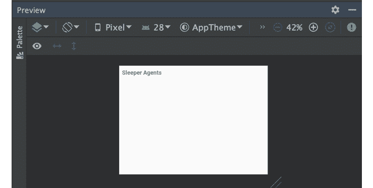

图 6.10 – item_title.xml 布局的预览

1.  在 `com.example.myrecyclerviewapp` 下以相同名称创建一个新文件，实现 `TitleViewHolder`：

    ```swift
    class TitleViewHolder(
      containerView: View
    ) : ListItemViewHolder(containerView) {
      private val titleView: TextView by lazy {
        containerView.findViewById(R.id.item_title_title)
      }
      override fun bindData(listItem: ListItemUiModel) {
        require(listItem is ListItemUiModel.Title)
          { "Expected ListItemUiModel.Title" }
        titleView.text = listItem.title
      }
    }
    ```

这与 `CatViewHolder` 非常相似，但由于我们只在 `TextView` 上设置文本，因此它也简单得多。

1.  现在，为了使事情更整洁，选择 `CatViewHolder`、`ListItemViewHolder` 和 `TitleViewHolder`。

1.  将所有文件移动到新的命名空间；在文件上右键单击，然后选择 **重构** | **移动**（或按 *F6*）。

1.  将 `/viewholder` 添加到预填充的 **目标目录** 字段。保留 **搜索引用** 和 **更新包指令（Kotlin 文件）** 复选框，并取消选中 **在编辑器中打开移动的文件**。点击 **确定**。

1.  打开 `CatsAdapter.kt` 文件。

1.  现在，将 `CatsAdapter` 重命名为 `ListItemsAdapter`。在代码窗口中右键单击 `CatsAdapter` 类名，然后选择 **重构** | **重命名**（或按 *Shift* + *F6*）。

注意

维护变量、函数和类的命名以反映它们的实际使用，这对于避免未来的混淆非常重要。

1.  当`CatsAdapter`被高亮显示时，输入`ListItemsAdapter`并按*Enter*。

1.  将适配器泛型类型更改为`ListItemViewHolder`：

    ```swift
    class ListItemsAdapter(...) :
        RecyclerView.Adapter<ListItemViewHolder>() {
    ```

1.  更新`listData`和`setData(List<CatUiModel>)`以处理`ListItemUiModel`：

    ```swift
    private val listData = mutableListOf<ListItemUiModel>()
    fun setData(newListData: List<ListItemUiModel>) {
        listData.clear()
        listData.addAll(newListData)
        notifyDataSetChanged()
    }
    ```

1.  更新`onBindViewHolder(CatViewHolder)`以符合适配器合约更改：

    ```swift
    override fun onBindViewHolder(holder:
        ListItemViewHolder, position: Int) {
        holder.bindData(listData[position])
    }
    ```

1.  在文件顶部，在导入之后和类定义之前，添加视图类型常量：

    ```swift
    private const val VIEW_TYPE_TITLE = 0
    private const val VIEW_TYPE_CAT = 1
    ```

1.  实现`getItemViewType(Int)`，如下所示：

    ```swift
    override fun getItemViewType(position: Int) =
        when (listData[position]) {
            is ListItemUiModel.Title -> VIEW_TYPE_TITLE
            is ListItemUiModel.Cat -> VIEW_TYPE_CAT
        }
    ```

1.  最后，更改你的`onCreateViewHolder(ViewGroup, Int)`实现，如下所示：

    ```swift
    override fun onCreateViewHolder(parent: ViewGroup,
      viewType: Int) = when (viewType) {
      VIEW_TYPE_TITLE -> {
        val view = layoutInflater.inflate(
          R.layout.item_title, parent, false)
        TitleViewHolder(view)
      }
      VIEW_TYPE_CAT -> {
        val view = layoutInflater.inflate(
          R.layout.item_cat, parent, false)
        CatViewHolder(
          view,
          imageLoader,
          object : CatViewHolder.OnClickListener {
            override fun onClick(cat: CatUiModel) =
              onClickListener.onItemClick(catData)
          })
      }
      else -> throw IllegalArgumentException("Unknown view type requested: $viewType")
    }
    ```

1.  更新`MainActivity`以用适当的数据填充适配器，替换之前的`catsAdapter.setData(List<CatUiModel>)`调用（注意以下代码因空间限制已被截断；请参阅代码块后的链接以获取需要添加的完整代码）：

MainActivity.kt

```swift
listItemsAdapter.setData(
  listOf(
      ListItemUiModel.Title("Sleeper Agents"),
      ListItemUiModel.Cat(
        CatUiModel(Gender.Male,
          CatBreed.ExoticShorthair, "Garvey",
          "Garvey is as a lazy, fat, and cynical orange 
          cat.",
          "https://cdn2.thecatapi.com/images/FZpeiLi4n.jpg"
        )
      ),
      ListItemUiModel.Cat(
        CatUiModel(Gender.Unknown,
          CatBreed.AmericanCurl, "Curious George",
          "Award winning investigator",
          "https://cdn2.thecatapi.com/images/vJB8rwfdX.
          jpg"
        )
      ),
      ListItemUiModel.Title("Active Agents"),
```

此步骤的完整代码可以在[`packt.live/3icCrSt`](http://packt.live/3icCrSt)找到。

1.  由于`catsAdapter`不再持有`CatsAdapter`而是`ListItemsAdapter`，因此相应地重命名它。命名为`listItemsAdapter`。

1.  运行应用。你应该看到以下类似的内容：

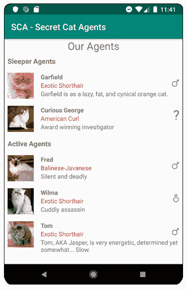

图 6.11 – 带有睡眠者和活动者头部视图的 RecyclerView

如你所见，我们现在在我们的两个代理组上方有标题。与`RecyclerView`不同。

# 滑动删除项目

在前面的章节中，我们学习了如何展示不同的视图类型。然而，到目前为止，我们一直在使用固定列表的项目。如果你想要能够从列表中删除项目怎么办？有一些常见的机制可以实现这一点——每个项目上的固定**删除**按钮、滑动删除和长按选择然后点击**删除**按钮，仅举几例。在本节中，我们将重点关注*滑动删除*的方法。

首先，让我们给我们的适配器添加删除功能。要告诉适配器删除一个项目，我们需要指出我们想要删除哪个项目。实现这一点的最简单方法是通过提供项目的位置。在我们的实现中，这将直接关联到`listData`列表中项目的位置。因此，我们的`removeItem(Int)`函数应该看起来像这样：

```swift
fun removeItem(position: Int) {
    listData.removeAt(position)
    notifyItemRemoved(position)
}
```

注意

就像设置数据一样，我们需要通知`RecyclerView`数据集已更改——在这种情况下，一个项目已被删除。

接下来，我们需要定义滑动手势检测。这是通过利用`ItemTouchHelper`来完成的，它通过回调报告给我们某些触摸事件，即拖动和滑动。我们通过实现`ItemTouchHelper.Callback`来处理这些回调。此外，`RecyclerView`提供了`ItemTouchHelper.SimpleCallback`，它减少了大量样板代码的编写。

我们希望响应滑动手势但忽略移动手势。更具体地说，我们希望响应向右的滑动。移动用于重新排序项目，这超出了本章的范围。因此，我们的 `SwipToDeleteCallback` 实现将如下所示：

```swift
inner class SwipeToDeleteCallback :
  ItemTouchHelper.SimpleCallback(0, ItemTouchHelper.RIGHT) {
  override fun onMove(
    recyclerView: RecyclerView,
    viewHolder: RecyclerView.ViewHolder,
    target: RecyclerView.ViewHolder
  ): Boolean = false
  override fun getMovementFlags(
    recyclerView: RecyclerView,
    viewHolder: RecyclerView.ViewHolder
  ) = if (viewHolder is CatViewHolder) {
    makeMovementFlags(
      ItemTouchHelper.ACTION_STATE_IDLE,
      ItemTouchHelper.RIGHT
    ) or makeMovementFlags(
      ItemTouchHelper.ACTION_STATE_SWIPE,
      ItemTouchHelper.RIGHT
    )
  } else { 0 }
  override fun onSwiped(viewHolder: RecyclerView.ViewHolder,
    direction: Int) {
    val position = viewHolder.adapterPosition
    removeItem(position)
  }
}
```

由于我们的实现与我们的适配器和其视图类型紧密耦合，我们可以舒适地将它定义为内部类。我们获得的好处是能够直接调用适配器的方法。

如您所见，我们从 `onMove(RecyclerView, ViewHolder, ViewHolder)` 函数中返回 `false`。这意味着我们忽略移动事件。

接下来，我们需要告诉 `ItemTouchHelper` 哪些项目可以被滑动。我们通过重写 `getMovementFlags(RecyclerView, ViewHolder)` 来实现这一点。当用户即将开始拖拽或滑动手势时，会调用此函数。`ItemTouchHelper` 期望我们返回给定视图持有者的有效手势。

我们检查 `ViewHolder` 类，如果是 `CatViewHolder`，我们希望允许滑动；否则，我们不允许。我们使用 `makeMovementFlags(Int, Int)`，这是一个辅助函数，用于以 `ItemTouchHelper` 可以解析的方式构造标志。

注意，我们为 `ACTION_STATE_IDLE` 定义了规则，这是手势的起始状态，因此允许手势从左侧或右侧开始。然后我们（使用 `or`）将其与 `ACTION_STATE_SWIPE` 标志结合，允许进行中的手势向左或向右滑动。返回 `0` 表示对于提供的视图持有者既不会滑动也不会移动。

一旦滑动动作完成，就会调用 `onSwiped(ViewHolder, Int)`。然后，我们通过调用 `adapterPosition` 从传入的视图持有者中获取位置。现在，`adapterPosition` 非常重要，因为它是获取视图持有者展示的项目真实位置的唯一可靠方式。

在获得正确的位置后，我们可以通过在适配器中调用 `removeItem(Int)` 来删除项目。

为了公开我们新创建的 `SwipeToDeleteCallback` 实现方式，我们在适配器中定义一个只读变量 `swipeToDeleteCallback`，并将其设置为 `SwipeToDeleteCallback` 的新实例。

最后，要将我们的 `callback` 机制连接到 `RecyclerView`，我们需要构建一个新的 `ItemTouchHelper` 并将其附加到我们的 `RecyclerView` 上。我们应该在设置 `RecyclerView` 时这样做，我们在主活动的 `onCreate(Bundle?)` 函数中这样做。创建和附加看起来是这样的：

```swift
val itemTouchHelper =
  ItemTouchHelper(listItemsAdapter.swipeToDeleteCallback)
itemTouchHelper.attachToRecyclerView(recyclerView)
```

现在我们可以滑动项目以从列表中删除它们。注意，正如我们预期的那样，我们的标题不能被滑动。

你可能已经注意到一个小问题——最后一个项目在向上动画时被截断了。这是因为 `RecyclerView` 在动画开始之前缩小以适应新的（更小的）项目数量。一个快速的修复方法是固定我们的 `RecyclerView` 的高度，使其底部与其父容器的底部对齐。

## 练习 6.05 – 添加滑动删除功能

我们之前已将 `RecyclerView` 添加到我们的应用程序中，并向其中添加了不同类型的项。现在，我们将允许用户通过左右滑动来删除一些项（我们希望让用户删除秘密猫特工，但不能删除标题）：

1.  要将项删除功能添加到我们的适配器中，在 `setData(List<ListItemUiModel>)` 函数之后添加以下函数到 `ListItemsAdapter`：

    ```swift
    fun removeItem(position: Int) {
        listData.removeAt(position)
        notifyItemRemoved(position)
    }
    ```

1.  接下来，在您的 `ListItemsAdapter` 类的结束括号之前，添加以下 `callback` 实现来处理用户向左或向右滑动猫代理的情况：

    ```swift
    inner class SwipeToDeleteCallback :
      ItemTouchHelper.SimpleCallback(0,
      ItemTouchHelper.LEFT or ItemTouchHelper.RIGHT) {
      override fun onMove(
        recyclerView: RecyclerView,
        viewHolder: RecyclerView.ViewHolder,
        target: RecyclerView.ViewHolder
      ): Boolean = false
        override fun getMovementFlags(
          recyclerView: RecyclerView,
        viewHolder: RecyclerView.ViewHolder
      ) = if (viewHolder is CatViewHolder) {
        makeMovementFlags(
          ItemTouchHelper.ACTION_STATE_IDLE,
          ItemTouchHelper.LEFT or ItemTouchHelper.RIGHT
        ) or makeMovementFlags(
          ItemTouchHelper.ACTION_STATE_SWIPE,
          ItemTouchHelper.LEFT or ItemTouchHelper.RIGHT
        )
      } else { 0 }
      override fun onSwiped(viewHolder:
        RecyclerView.ViewHolder, direction: Int) {
        val position = viewHolder.adapterPosition
        removeItem(position)
      }
    }
    ```

我们已实现了一个 `ItemTouchHelper.SimpleCallback` 实例，传递我们感兴趣的指令——`LEFT` 和 `RIGHT`。通过使用 `or` 布尔运算符来连接这些值。

我们已重写 `getMovementFlags` 函数，以确保我们只处理猫代理视图上的滑动，而不是标题上的滑动。为 `ItemTouchHelper.ACTION_STATE_SWIPE` 和 `ItemTouchHelper.ACTION_STATE_IDLE` 创建标志允许我们分别拦截滑动和释放事件。

一旦完成滑动（用户已从屏幕上抬起手指），`onSwiped` 将被调用，作为响应，我们将移除由拖动视图持有者提供的位置的项。

1.  在适配器的顶部，公开您刚刚创建的 `SwipeToDeleteCallback` 类的一个实例：

    ```swift
    class ListItemsAdapter(...) :
      RecyclerView.Adapter<ListItemViewHolder>() {
      val swipeToDeleteCallback = SwipeToDeleteCallback()
    ```

1.  最后，通过实现 `ItemViewHelper` 并将其附加到我们的 `RecyclerView` 上来将所有这些整合在一起。将以下代码添加到您的 `MainActivity` 文件的 `onCreate(Bundle?)` 函数中，在将布局管理器分配给适配器之后：

    ```swift
    recyclerView.layoutManager = ...
    val itemTouchHelper = ItemTouchHelper(listItemsAdapter
      .swipeToDeleteCallback)
    itemTouchHelper.attachToRecyclerView(recyclerView)
    ```

1.  为了解决当项被删除时出现的微小视觉错误，通过更新 `activity_main.xml` 中的代码来调整 `RecyclerView` 以适应屏幕。更改位于 `RecyclerView` 标签中，在 `app:layout_constraintTop_toBottomOf` 属性之前：

    ```swift
    android:layout_height="0dp"
    app:layout_constraintBottom_toBottomOf="parent"
    app:layout_constraintTop_toBottomOf="@+id/main_label" />
    ```

注意，这里有两个变化——我们在视图底部添加了一个约束到父视图的底部，并将布局高度设置为 `0dp`。后者的变化告诉我们的应用程序根据其约束来计算 `RecyclerView` 的高度：

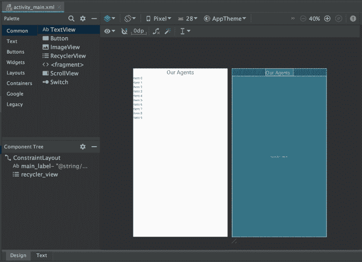

图 6.12 – RecyclerView 占据布局的全部高度

1.  运行您的应用程序。现在，您应该能够通过左右滑动秘密猫特工来从列表中删除它们。请注意，`RecyclerView` 为我们处理折叠动画：


图 6.13 – 向右滑动的猫

注意，尽管标题是项目视图，但它们不能被滑动。您已经实现了一个用于滑动手势的回调，它区分不同的项目类型，并通过删除被滑动的项来响应滑动。现在，您知道如何交互式地删除项。接下来，您将学习如何添加新项。

# 交互式添加项

我们刚刚学习了如何交互式地移除项目。那么添加新项目呢？让我们来看看。

与我们实现移除项目的方式类似，我们首先在我们的适配器中添加一个函数：

```swift
fun addItem(position: Int, item: ListItemUiModel) {
    listData.add(position, item)
    notifyItemInserted(position)
}
```

注意，实现方式与之前我们实现的 `removeItem(Int)` 函数非常相似。这次，我们同样接收一个要添加的项目和一个添加位置。然后我们将它添加到我们的 `listData` 列表中，并通知 `RecyclerView` 我们在请求的位置添加了一个项目。

要触发对 `addItem(Int, ListItemUiModel)` 的调用，我们可以在我们的主活动布局中添加一个按钮。此按钮可以如下所示：

```swift
<Button
    android:id="@+id/main_add_item_button"
    android:layout_width="match_parent"
    android:layout_height="wrap_content"
    android:text="Add A Cat"
    app:layout_constraintBottom_toBottomOf="parent" />
```

应用现在看起来是这样的：

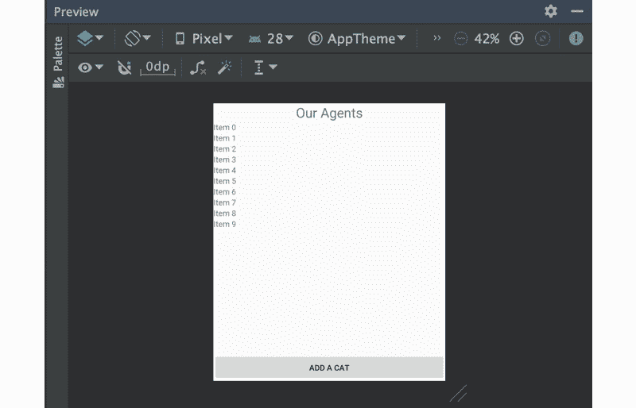

图 6.14 – 带有添加猫按钮的主布局

不要忘记更新你的 `RecyclerView`，使其底部约束到该按钮的顶部。否则，按钮和 `RecyclerView` 将会重叠。

在一个生产应用中，你可以添加关于新项目是什么的理由。例如，你可以有一个表单供用户填写不同的详细信息。为了简单起见，在我们的示例中，我们将始终添加相同的虚拟项目 – 一个匿名的女性秘密猫特工。

要添加项目，我们在按钮上设置 `OnClickListener`：

```swift
addItemButton.setOnClickListener {
  listItemsAdapter.addItem(1, ListItemUiModel.Cat(
    CatUiModel(Gender.Female, CatBreed.BalineseJavanese,
      "Anonymous", "Unknown",
      "https://cdn2.thecatapi.com/images/zJkeHza2K.jpg"
    ))
  )
}
```

就这样。我们在位置 `1` 添加项目，使其正好位于我们的第一个标题下方，即位置 `0` 的项目。在一个生产应用中，你可以有逻辑来决定插入项目的正确位置。它可以是相关标题下方，或者总是添加到顶部、底部或正确的位置以保持某些现有顺序。

我们现在可以运行应用。现在我们将有一个新的 `RecyclerView`。新添加的猫可以被滑动移除，就像之前的硬编码猫一样。

## 练习 6.06 – 实现添加猫按钮

在实现了移除项目的机制后，现在是时候实现添加项目的机制了：

1.  在 `ListItemsAdapter` 中添加一个函数以支持添加项目。在 `removeItem(Int)` 函数下方添加它：

    ```swift
    fun addItem(position: Int, item: ListItemUiModel) {
        listData.add(position, item)
        notifyItemInserted(position)
    }
    ```

1.  在 `activity_main.xml` 中添加一个按钮，紧接在 `RecyclerView` 标签之后：

    ```swift
    <Button
        android:id="@+id/main_add_item_button"
        android:layout_width="match_parent"
        android:layout_height="wrap_content"
        android:text="Add A Cat"
        app:layout_constraintBottom_toBottomOf="parent" />
    ```

1.  注意 `android:text="Add A Cat"` 被高亮显示。如果你将鼠标悬停在其上，你会看到这是由于硬编码的字符串造成的。点击 **添加** 单词，将编辑器光标放置在其上。

1.  按下 *Option* + *Enter*（iOS）或 *Alt* + *Enter*（Windows）以显示上下文菜单，然后再次按下 *Enter* 以显示 **提取** **资源** 对话框。

1.  将资源命名为 `add_button_label`。按 **确定**。

1.  要更改 `RecyclerView` 的底部约束，以便按钮和 `RecyclerView` 不重叠，在你的 `RecyclerView` 标签内，找到以下内容：

    ```swift
        app:layout_constraintBottom_toBottomOf="parent"
    ```

用以下代码行替换它：

```swift
app:layout_constraintBottom_toTopOf="@+id/main_add_item_button"
```

1.  在类顶部，紧接在 `recyclerView` 定义之后添加一个懒字段，持有按钮的引用：

    ```swift
    private val addItemButton: View by lazy {
        findViewById(R.id.main_add_item_button) }
    ```

注意，`addItemButton`被定义为视图。这是因为，在我们的代码中，我们不需要知道视图的类型来向其添加点击监听器。选择更抽象的类型允许我们在以后更改布局中的视图类型，而无需修改此代码。

1.  最后，更新`MainActivity`以处理点击。找到以下内容的行：

    ```swift
    itemTouchHelper.attachToRecyclerView(recyclerView)
    ```

紧接着，添加以下内容：

```swift
addItemButton.setOnClickListener {
    listItemsAdapter.addItem(1,
        ListItemUiModel.Cat(CatUiModel(
            Gender.Female, CatBreed.BalineseJavanese,
            "Anonymous", "Unknown",
            "https://cdn2.thecatapi.com/images/zJkeHza2K.jpg"
        ))
    )
}
```

这将在每次点击按钮时向`RecyclerView`添加一个新项目。

1.  运行应用。你应该在你的应用底部看到一个新按钮：

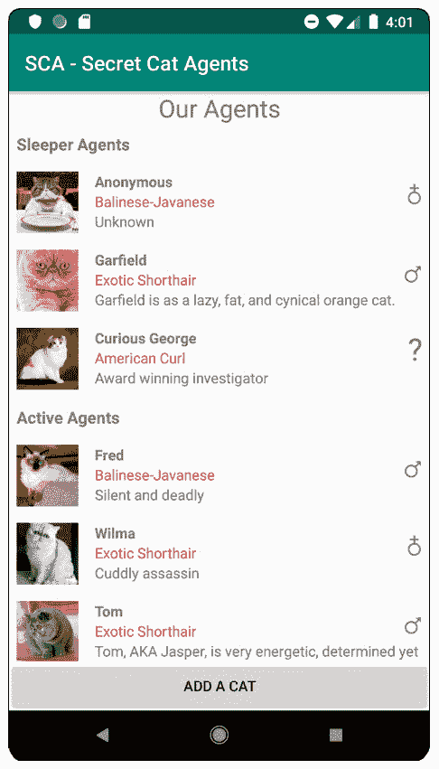

图 6.15 – 点击按钮添加了一只匿名猫

1.  尝试点击几次。每次点击，都会在`RecyclerView`中添加一个新的匿名秘密猫特工。你可以像处理硬编码的猫一样滑动掉新添加的猫。

在这个练习中，你根据用户交互向`RecyclerView`添加了新项目。你现在知道如何在运行时更改`RecyclerView`的内容。了解如何在运行时更新列表是有用的，因为，相当常见的是，你在应用运行时向用户展示的数据会发生变化，而你希望向用户提供一个新鲜、最新的状态。

## 活动第 6.01 节 – 管理项目列表

想象一下，你想要开发一个食谱管理应用。你的应用将支持甜味和咸味食谱。你的应用用户可以添加新的甜味或咸味食谱，滚动查看已添加食谱的列表——按口味（甜味或咸味）分组——点击一个食谱以获取其信息，最后，通过滑动将其删除。

这个活动的目的是创建一个带有`RecyclerView`的应用，列出按口味分组的食谱标题。`RecyclerView`将支持用户交互。每个食谱将有一个标题、一个描述和一个口味。交互包括点击和滑动。

点击将向用户展示一个对话框，显示食谱的描述。滑动将删除被滑动的食谱。最后，使用两个`EditText`字段（见*第三章*，*使用片段开发 UI*）和两个按钮，用户可以分别添加新的甜味或咸味食谱，标题和描述设置为`EditText`字段中设置的值。

完成此操作的步骤如下：

1.  创建一个新的空活动应用。

1.  将`RecyclerView`支持添加到应用的`build.gradle`文件中。

1.  将`RecyclerView`、两个`EditText`字段和两个按钮添加到主布局中。它应该看起来像这样：

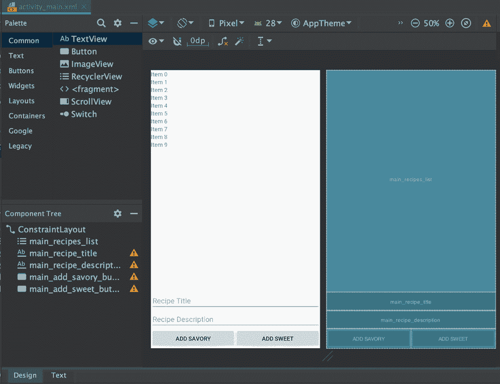

图 6.16 – 带有 RecyclerView、两个 EditText 字段和两个按钮的布局

1.  添加口味标题和食谱的模型，以及一个用于口味的枚举。

1.  添加口味标题的布局。

1.  添加食谱标题的布局。

1.  为风味标题和食谱标题添加视图持有者，以及适配器。

1.  添加点击监听器以显示包含食谱描述的对话框。

1.  将 `MainActivity` 更新为构建新的适配器，并将按钮连接到添加新的咸味和甜味食谱。确保在添加食谱后清除表单。

1.  添加一个滑动助手以删除项目。

最终输出将如下所示：

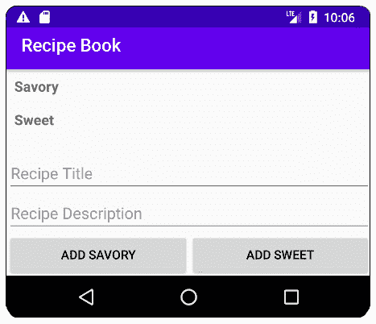

图 6.17 – 烹饪书 app

注意

此活动的解决方案可在[`packt.link/By7eE`](https://packt.link/By7eE)找到。

# 摘要

在本章中，我们学习了如何将 `RecyclerView` 支持添加到我们的项目中。我们还学习了如何将 `RecyclerView` 添加到我们的布局中，以及如何用项目填充它。我们探讨了添加不同项目类型，这对于标题特别有用。我们涵盖了与 `RecyclerView` 的交互，响应单个项目的点击以及响应滑动手势。

最后，我们学习了如何动态地向 `RecyclerView` 添加和删除项目。`RecyclerView` 的世界非常丰富，我们只是触及了表面。进一步探索将超出本书的范围。然而，强烈建议您自行研究，以便您可以在应用程序中拥有轮播图、设计分隔符和更复杂的滑动效果。

您可以从这里开始您的探索：[`packt.link/ClmMn`](https://packt.link/ClmMn)。

在下一章中，我们将探讨代表我们的应用程序请求特殊权限，以便它能够执行某些任务，例如访问用户的联系人列表或麦克风。我们还将探讨使用 Google 的 Maps API 和访问用户的物理位置。
