# 第七章：Android 权限和 Google Maps

本章将教您如何在 Android 中请求和获取应用权限。您将通过使用 Google Maps API 深入了解如何将本地和全局交互式地图包含到您的应用中，以及如何请求使用提供更丰富功能的设备功能的权限。

到本章结束时，您将能够为您的应用创建权限请求并处理缺失的权限。

在上一章中，我们学习了如何使用 `RecyclerView` 在列表中展示数据。然后，我们利用这些知识向用户展示了一个秘密猫特工的列表。在本章中，我们将学习如何在地图上找到用户的位置，以及如何通过在地图上选择位置来部署猫特工到现场。

首先，我们将探索 Android 权限系统。许多 Android 功能对我们来说并不是立即可用的。这些功能被权限系统所限制，以保护用户。为了访问这些功能，我们必须请求用户允许我们这样做。这些功能包括但不限于获取用户的位置、访问用户的联系人、访问他们的相机以及建立蓝牙连接。不同的 Android 版本实施不同的权限规则。

注意

例如，当 Android 6（棉花糖）在 2015 年推出时，您可以在安装时静默获取的一些权限被认为是不安全的，并成为运行时权限，需要明确的用户同意。

我们将接着查看 Google Maps API。此 API 允许我们向用户提供世界上任何期望位置的地图。我们将在该地图上添加数据，并让用户与地图进行交互。API 还允许您显示兴趣点并渲染支持位置的道路视图，尽管我们不会在本书中探索这些功能。

本章我们将涵盖以下主题：

+   从用户那里请求权限

+   显示用户的位置地图

+   地图点击和自定义标记

# 技术要求

本章所有练习和活动的完整代码可在 GitHub 上找到，链接为 [`packt.link/6ShZd`](https://packt.link/6ShZd)

# 从用户那里请求权限

我们的应用可能需要实现一些谷歌认为危险的功能。这通常意味着访问这些功能可能会危及用户的隐私。例如，某些权限可能允许您读取用户的消息或确定他们的当前位置。

根据所需的权限和目标 Android API 级别，我们可能需要请求用户授予该权限。如果设备运行在 Android 6（棉花糖，API 级别 23），并且我们的应用的目标 API 是 23 或更高（几乎肯定是这样，因为现在大多数设备都将运行 Android 的新版本），则在安装时不会有关于应用请求的任何权限的用户警报。相反，我们的应用必须在运行时请求用户授予这些权限。

当我们请求权限时，用户会看到一个类似于*图 7.1*所示的对话框。

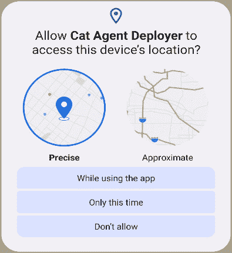

图 7.1 – 设备位置访问权限对话框

注意

要查看权限及其保护级别的完整列表，请参阅此处：[`developer.android.com/reference/android/Manifest.permission`](https://developer.android.com/reference/android/Manifest.permission)。

当我们打算使用权限时，我们必须在我们的清单文件中包含权限。具有`SEND_SMS`权限的清单文件可能看起来像以下片段：

```swift
<manifest xmlns:android=
    "http://schemas.android.com/apk/res/android"
  package="com.example.snazzyapp">
<uses-permission android:name="android.permission.SEND_SMS" />
  <application …> ... </application>
</manifest>
```

安全权限（或谷歌称之为常规权限）将自动授予用户。然而，危险权限只有在用户明确批准的情况下才会被授予。如果我们未能从用户那里请求权限并尝试执行需要该权限的操作，最坏的结果是应用崩溃。

在请求用户权限之前，我们应该首先检查用户是否已经授予我们该权限。如果用户尚未授予我们权限，我们可能需要检查是否需要在权限请求之前显示一个理由对话框。这取决于请求的理由对用户来说是否明显。

例如，如果一个相机应用请求访问摄像头的权限，我们可以安全地假设原因对用户来说是清晰的。然而，有些情况可能对用户来说并不那么清晰，特别是如果用户不是技术达人。在这些情况下，我们可能需要向用户解释请求的理由。

Google 为我们提供了一个名为`shouldShowRequestPermissionRationale(Activity, String)`的函数来实现这个目的。在底层，这个函数检查用户是否之前拒绝过该权限，同时也检查用户是否之前拒绝过我们。

策略是让我们在请求权限之前向用户解释我们的请求理由，从而增加他们批准请求的可能性。一旦我们确定应用是否应该向用户展示我们的理由，或者是否不需要理由，我们就可以继续请求权限。

让我们看看我们如何请求权限。首先，我们必须在我们的应用`gradle`文件中包含 Jetpack Activity 和 Fragment 依赖项：

```swift
implementation "androidx.activity:activity-ktx:1.6.1"
implementation "androidx.fragment:fragment-ktx:1.5.5"
```

这将为我们提供`ActivityResultLauncher`，我们将使用它来启动权限请求对话框并处理用户的响应。

以下是一个请求`Location`权限的`Activity`类的示例：

```swift
class MainActivity : AppCompatActivity() {
  private lateinit var requestPermissionLauncher:
    ActivityResultLauncher<String>
  override fun onCreate() {
    ...
    requestPermissionLauncher = registerForActivityResult(
      RequestPermission()) { isGranted ->
        if (isGranted) {... } else { ... }    }
```

当`Activity`被创建时，我们注册启动器来处理权限请求响应。我们保留结果的引用以供以后使用。当`Activity`恢复时，我们检查权限的状态并相应地继续：

```swift
override fun onResume() {
  ...
  when {
    hasLocationPermission() -> getLastLocation()
    shouldShowRequestPermissionRationale(this, 
    ACCESS_FINE_LOCATION) -> {
      showPermissionRationale {
        requestPermissionLauncher
          .launch(ACCESS_FINE_LOCATION)
      }
    }
    else -> requestPermissionLauncher.
              launch(ACCESS_FINE_LOCATION)
  }
}
```

我们首先通过调用`getHasLocationPermissions()`来检查位置权限（`ACCESS_FINE_LOCATION`）：

```swift
private fun hasLocationPermission() =
  checkSelfPermission(this, Manifest.permission.ACCESS_FINE_
  LOCATION) == PERMISSION_GRANTED
```

此函数通过调用`checkSelfPermission(Context, String)`并传入请求的权限来检查用户是否授予了我们请求的权限。

如果用户没有授予我们权限，我们调用之前提到的`shouldShowRequestPermissionRationale(Activity, String)`来检查是否应该向用户展示理由对话框。

如果需要显示我们的理由，我们调用`showPermissionRationale(() -> Unit)`，传入一个 lambda，该 lambda 将在用户使用正面按钮关闭我们的理由对话框后，使用`requestPermissionLauncher`启动请求对话框。如果不需要理由，我们直接使用`requestPermissionLauncher`启动对话框。以下代码用于显示理由对话框：

```swift
private fun showPermissionRationale(
  positiveAction: () -> Unit) {
  AlertDialog.Builder(this)
    .setTitle("Location permission")
    .setMessage("We need your permission to find your current 
        position")
    .setPositiveButton(android.R.string.ok) { _, _ ->
        positiveAction()
    }
    .setNegativeButton(android.R.string.cancel) { dialog, _ -> 
        dialog.dismiss() }
    .create().show()
}
```

我们的`showPermissionRationale`函数向用户展示一个对话框，简要解释我们为什么需要他们的权限。**确定**按钮将执行提供的正面操作，而**取消**按钮将关闭对话框：

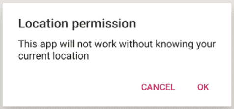

图 7.2 – 理由对话框

最后，我们通过调用之前声明的请求权限启动器`requestPermissionLauncher.launch(ACCESS_FINE_LOCATION)`来请求权限。

如果我们已经从用户那里请求了位置权限，请求权限启动器将根据`isGranted`返回的值处理响应，如下面的代码所示：

```swift
registerForActivityResult(RequestPermission()) { isGranted ->
  if (isGranted) { getLastLocation() }
  else {
    showPermissionRationale { requestPermissionLauncher
      .launch(ACCESS_FINE_LOCATION) }
  }
}
```

这段代码是我们之前观察到的代码的扩展，添加到了`Activity`的`onCreate`函数中。本章将带我们开发一个应用程序，它可以在地图上显示我们的当前位置，并允许我们在想要部署我们的秘密猫特工的地方放置标记。

让我们从第一个练习开始。

## 练习 7.01 – 请求位置权限

在这个练习中，我们将请求用户提供位置权限。我们首先创建一个**Google Maps Activity**项目。然后，我们在清单文件中定义所需的权限。要开始，让我们实现请求用户允许访问其位置的代码：

1.  首先，创建一个新的 Google Maps Activity 项目（**文件** | **新建** | **新建项目** | **Google Maps Activity**）。在这个练习中，我们不会使用 Google Maps。然而，在这种情况下，Google Maps Activity 仍然是一个不错的选择。它将在下一个练习（*练习 7.02*）中为你节省大量的样板代码。不用担心，它对你的当前练习没有任何影响。点击**下一步**，如图所示：

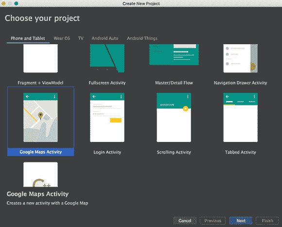

图 7.3 – 选择你的项目

1.  将你的应用程序命名为`Cat Agent Deployer`。

1.  确保你的包名为`com.example.catagentdeployer`。

1.  将项目保存位置设置为你要保存项目的地方。

1.  将其他所有设置保留为默认值，然后点击**完成**。

1.  确保你在**项目**面板的**Android**视图中：

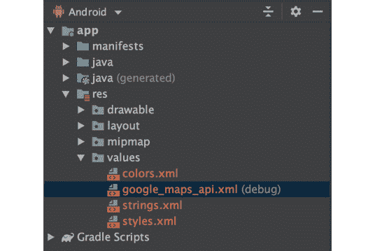

图 7.4 – Android 视图

1.  打开你的 `AndroidManifest.xml` 文件。确保位置权限已经添加到你的应用中：

    ```swift
    <manifest ...>
        <uses-permission android:name=
            "android.permission.ACCESS_FINE_LOCATION" />
        <application ...> ... </application>
    </manifest>
    ```

注意

`ACCESS_FINE_LOCATION` 是你将需要根据 GPS 获取用户位置，以及使用 `ACCESS_COARSE_LOCATION` 权限可以获得的基于 Wi-Fi 和移动数据的不太准确的位置信息。

1.  打开你的 `MapsActivity.kt` 文件。在 `MapsActivity` 类块底部添加一个空的 `getLastLocation()` 函数：

    ```swift
    class MapsActivity : ... {
      ...
      private fun getLastLocation() {
        Log.d("MapsActivity", "getLastLocation() called.")
      }
    }
    ```

这将是当你确保用户已经授予你位置权限时将调用的函数。

1.  接下来，将请求权限启动器添加到 `MapsActivity` 类的顶部：

    ```swift
    class MapsActivity : ... {
        private lateinit var requestPermissionLauncher:
            ActivityResultLauncher<String>
    ```

这是我们将通过它启动权限请求并跟踪用户响应的变量。

现在导航到 `onCreate()` 函数的底部并注册活动结果，将结果存储在你在上一步中声明的 `requestPermissionLauncher` 中：

```swift
override fun onCreate(savedInstanceState: Bundle?) {
  ...
  requestPermissionLauncher =
    registerForActivityResult(RequestPermission()) { 
    isGranted ->
      if (isGranted) { getLastLocation() }
      else {
        showPermissionRationale {
          requestPermissionLauncher
            .launch(ACCESS_FINE_LOCATION)
        }
      }
    }
}
```

1.  要向用户展示权限请求的理由，在 `getLastLocation()` 函数之前实现 `show` **PermissionRationale(() -> Unit)** 函数：

    ```swift
    private fun showPermissionRationale(positiveAction: ()
    -> Unit) {
      AlertDialog.Builder(this)
        .setTitle("Location permission")
        .setMessage("This app will not work without knowing 
            your current location")
        .setPositiveButton(android.R.string.ok) { _, _ ->
            positiveAction() }
        .setNegativeButton(android.R.string.cancel) { dialog, 
            _ -> dialog.dismiss() }
        .create().show()
    }
    ```

此函数将向用户展示一个简单的警告对话框，解释说明应用在没有知道他们当前位置的情况下无法工作，如图 *图 7**.1* 所示。点击 `positiveAction` lambda。点击 **取消** 将关闭对话框。

1.  要确定你的应用是否已经具有位置权限，在 `requestPermissionWithRationaleIfNeeded()` 函数之前引入以下 `hasLocationPermission()` 函数：

    ```swift
    private fun hasLocationPermission() =
        ContextCompat.checkSelfPermission(
            this, Manifest.permission.ACCESS_FINE_LOCATION
        ) == PackageManager.PERMISSION_GRANTED
    ```

1.  最后，更新你的 `MapsActivity` 类的 `onMapReady()` 函数以确定权限状态并相应地执行：

    ```swift
    override fun onMapReady(googleMap: GoogleMap) {
      mMap = googleMap
      when {
        hasLocationPermission() -> getLastLocation()
        shouldShowRequestPermissionRationale(this,
          ACCESS_FINE_LOCATION) -> {
          showPermissionRationale {
            requestPermissionLauncher
              .launch(ACCESS_FINE_LOCATION)
          }
        }
        else -> requestPermissionLauncher
          .launch(ACCESS_FINE_LOCATION)
      }
    }
    ```

`when` 语句将检查权限是否已经授予。如果没有，它将检查是否应该显示解释对话框。然后，如果用户接受了解释或不需要解释对话框，它将向用户展示一个标准的权限请求对话框（如图 *图 7**.1* 所示），请求他们允许应用访问他们的位置。你传递给用户请求的权限，即你希望用户授予你的应用 (`Manifest.permission.ACCESS_FINE_LOCATION`)。

1.  运行你的应用。你现在应该看到一个系统权限对话框，请求你允许应用访问设备的地理位置，如图 *图 7**.5* 所示。

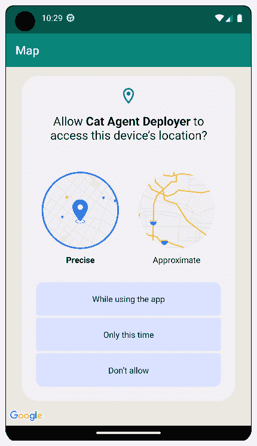

图 7.5 – 应用请求位置权限

如果用户拒绝权限，将显示解释对话框。如果接受了解释，系统权限对话框将再次显示。直到 SDK 31，用户可以选择不让应用再次请求权限（*图 7**.6*）。从 SDK 31 开始，不再询问是默认设置。之后允许它需要使用设备设置。

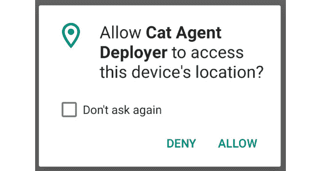

图 7.6 – “不再询问”消息

一旦用户允许或永久拒绝权限，对话框将不再显示。要重置应用权限的状态，您必须通过**应用****信息**界面手动授予它权限。

现在我们已经获得了位置权限，我们将现在查看如何获取用户的当前位置。

# 显示用户的位置地图

在成功从用户那里获取访问其位置的权限后，我们现在可以要求用户的设备提供其最后已知的位置。这通常也是用户的当前位置。然后我们将使用这个位置向用户展示其当前位置的地图。

为了获取用户最后已知的位置，谷歌为我们提供了谷歌播放位置服务，更具体地说，提供了`FusedLocationProviderClient`类。`FusedLocationProviderClient`类帮助我们与谷歌的融合位置提供者 API 交互，这是一个智能地结合来自多个设备传感器的不同信号以提供设备位置信息的 API。

要访问`FusedLocationProviderClient`类，我们必须首先在我们的项目中包含谷歌播放位置服务库。这仅仅意味着将以下代码片段添加到我们的`build.gradle`应用的`dependencies`块中：

```swift
implementation "com.google.android.gms:play-services-location:21.0.1"
```

在导入位置服务后，我们现在可以通过调用`LocationServices.getFusedLocationProviderClient(this@MainActivity)`来获取`FusedLocation`**ProviderClient**类的实例。

一旦我们有了融合位置客户端，我们可以通过调用`fusedLocationClient.lastLocation`来获取用户的最后位置。

注意

这是在我们已经从用户那里收到位置权限的前提下。

由于这是一个异步调用，我们还应该提供一个最小成功监听器。如果我们想的话，我们还可以添加取消、失败和请求完成的监听器。调用`lastLocation`返回`Task<Location>`。`Task`是谷歌 API 的一个抽象类，其实现执行异步操作。

在这种情况下，该操作返回一个位置。因此，添加监听器只是简单地链式调用。我们将添加以下代码片段到我们的调用中：

```swift
.addOnSuccessListener { location: Location? -> }
```

注意，如果客户端未能获取用户的当前位置，`location`参数可能是`null`。这种情况并不常见，但如果例如用户在调用期间禁用了他们的位置服务，则可能会发生。

一旦我们成功监听器块内的代码执行，并且`location`不是`null`，我们就有了用户当前的位置，形式为一个`Location`实例。

一个`Location`实例在地球上持有单个坐标，使用经纬度表示。

注意

对于我们的目的来说，知道地球表面的每个点都映射到一对唯一的**经度**（**Lng**）和**纬度**（**Lat**）值就足够了。

这就是令人兴奋的地方。谷歌允许我们通过使用`SupportMapFragment`类在交互式地图上展示任何位置。只需注册一个免费的 API 密钥即可。当你使用 Google Maps Activity 创建你的应用程序时，Android Studio 会立即打开`AndroidManifest.xml`文件。文件中的一个注释会引导我们前往[`packt.link/FK58V`](https://packt.link/FK58V)以获取所需的 API 密钥。你可以将此链接复制到浏览器中，或者按*Ctrl*/*Command* + 点击它。

在页面上，按照说明操作，并点击元标签值中的`YOUR_API_KEY`字符串，使用你新获得的密钥。

到目前为止，如果你运行你的应用程序，你已经在屏幕上看到了一个交互式地图，如图*图 7.7*所示。

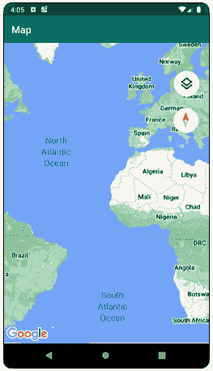

图 7.7 – 交互式地图

为了根据我们的当前位置定位地图，我们创建一个`LatLng`实例，其中包含来自我们的`Location`实例的坐标，并在`GoogleMap`实例上调用`moveCamera(CameraUpdate)`。为了满足`CameraUpdate`的要求，我们调用`CameraUpdateFactory.newLatLng(LatLng)`，传入之前创建的`LatLng`参数。调用看起来可能如下所示：

```swift
mMap.moveCamera(CameraUpdateFactory.newLatLng(latLng))
```

注意

要发现可用的`CameraUpdateFactory`选项的其余部分，请访问[`packt.link/EBRnt`](https://packt.link/EBRnt)。

我们还可以调用`newLatLngZoom(LatLng, Float)`来修改地图的缩放和缩放功能。

注意

有效的缩放值范围在 2.0（最远）到 21.0（最近）之间。超出此范围的值将被限制。

一些区域可能没有瓦片来渲染最近的缩放值。

我们在`GoogleMap`实例上调用`addMarker(MarkerOptions)`来在用户的坐标处添加一个标记。`MarkerOptions`参数通过链式调用`MarkerOptions()`实例进行配置。我们可以调用`position(LatLng)`和`title(String)`来为所需位置创建一个简单的标记。调用可能如下所示：

```swift
mMap.addMarker(MarkerOptions().position(latLng)
    .title("Pin Label"))
```

我们链式调用顺序并不重要。

让我们在下面的练习中实践一下。

## 练习 7.02 – 获取用户当前位置

现在既然你的应用程序可以授予位置权限，你可以使用位置权限来获取用户的当前位置。然后你将显示地图，并更新它以缩放到用户的当前位置，并在该位置显示一个标记。为此，请执行以下步骤：

1.  首先，将 Google Play 位置服务添加到你的`build.gradle`文件中。你应该在`dependencies`块内添加它：

    ```swift
    dependencies {
      implementation "com.google.android.gms: play-services-
      location:21.0.1"
      ...
    }
    ```

1.  在 Android Studio 中点击**同步项目与 Gradle 文件**按钮，以便 Gradle 获取新添加的依赖项。

1.  获取 API 密钥：打开`AndroidManifest.xml`文件（`app/src/main/AndroidManifest.xml`），使用*Ctrl* / *Cmd* + 点击链接[`developers.google.com/maps/documentation/android-sdk/get-api-key`](https://developers.google.com/maps/documentation/android-sdk/get-api-key)。

1.  按照网站上的说明操作，直到你生成了新的 API 密钥。

1.  通过以下代码将`google_maps_api.xml`文件中的`YOUR_API_KEY`替换为你的新 API 密钥：

    ```swift
    <meta-data
    android:name="com.google.android.geo.API_KEY"
                android:value="YOUR_API_KEY" />
    ```

1.  打开你的`MapsActivity.kt`文件。在`MapsActivity`类的顶部，定义一个懒加载的融合位置提供者客户端：

    ```swift
    class MapsActivity : ... {
      private val fusedLocationProviderClient by lazy {
        LocationServices
          .getFusedLocationProviderClient(this)
      }
      override fun onCreate(savedInstanceState: Bundle?)
      { ... }
      ...
    }
    ```

通过懒加载初始化`fusedLocationProviderClient`，你确保它仅在需要时初始化，这基本上保证了在初始化之前`Activity`类已经被创建。

1.  在`getLastLocation()`函数之后立即引入一个`updateMapLocation(LatLng)`函数和一个`addMarkerAtLocation(LatLng, String)`函数，分别用于在给定位置放大地图和在位置处添加标记：

    ```swift
    private fun updateMapLocation(location: LatLng) {
        mMap.moveCamera(CameraUpdateFactory.newLatLngZoom(
            location, 7f))
    }
    private fun addMarkerAtLocation(location: LatLng,
    title: String) {
        mMap.addMarker(MarkerOptions().title(title)
            .position(location))
    }
    ```

1.  现在更新你的`getLastLocation()`函数以检索用户的位置：

    ```swift
    private fun getLastLocation() {
      fusedLocationProviderClient.lastLocation
        .addOnSuccessListener { location: Location? ->
    location?.let {
            val userLocation = LatLng(
              location.latitude, location.longitude)
            updateMapLocation(userLocation)
            addMarkerAtLocation(userLocation, "You")
         }
      }
    }
    ```

你的代码通过调用`lastLocation`请求最后位置，然后附加一个`lambda`函数作为`OnSuccessListener`接口。一旦获得位置，`lambda`函数将被执行，更新地图位置。如果返回了非空位置，代码将在该位置添加一个带有`You`标题的标记。

1.  运行你的应用。它应该看起来像*图 7.8*。

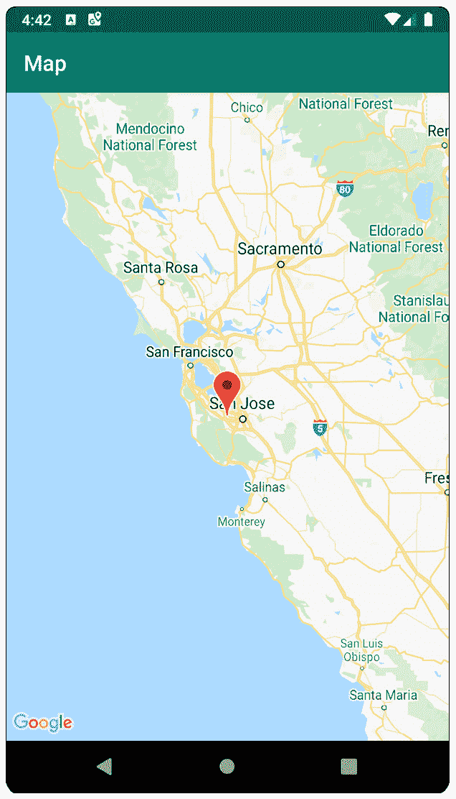

图 7.8 – 在当前位置带有标记的交互式地图

一旦应用被授予权限，它可以通过融合位置提供者客户端从 Google Play 位置服务请求用户的最后位置。这为你提供了一个简单且简洁的方式来获取用户的当前位置。请记住，为了应用能够工作，请确保在设备上开启位置服务。

通过用户的当前位置，你的应用可以告诉地图如何缩放以及放置标记的位置。如果用户点击标记，他们将看到你分配给它的标题（练习中的`You`）。

在下一节中，我们将学习如何响应用户在地图上的点击以及如何移动标记。

# 地图点击和自定义标记

通过放大到正确的位置并在那里放置一个标记来显示用户当前位置的地图，我们有了如何渲染所需的地图以及如何获取所需的权限和用户当前位置的基本知识。

在本节中，我们将学习如何响应用户与地图的交互以及如何更广泛地使用标记。我们将学习如何在地图上移动标记，并用自定义图标替换默认的图钉标记。当我们知道如何让用户在地图的任何位置放置标记时，我们可以让他们选择部署秘密猫特工的位置。

我们需要向 `GoogleMap` 实例添加一个监听器，以便监听地图上的点击。查看我们的 `MapsActivity.kt` 文件，这样做最好的地方是在 `onMapReady(GoogleMap)` 中。一个简单的实现可能看起来像这样：

```swift
override fun onMapReady(googleMap: GoogleMap) {
    mMap = googleMap.apply {
        setOnMapClickListener { latLng ->
            addMarkerAtLocation(latLng, "Deploy here")
        }
    }
    ...
}
```

然而，如果我们运行此代码，我们会发现每次在地图上点击都会添加一个新的标记。这不是我们期望的行为。

要控制地图上的标记，我们需要保留对该标记的引用。这可以通过保留 `GoogleMap.addMarker(MarkerOptions)` 的输出来实现。`addMarker` 函数返回一个 `Marker` 实例。要移动地图上的标记，我们通过调用其 `position` 设置器给它分配一个新的位置值。

要用自定义图标替换默认的图钉图标，我们必须向标记或 `MarkerOptions()` 实例提供 `BitmapDescriptor`。`BitmapDescriptor` 包装器绕过 `GoogleMap` 使用的位图来渲染标记和地面叠加层，但在此书中我们不会涉及这一点。

我们通过使用 `BitmapDescriptorFactory` 获取 `BitmapDescriptor`。工厂将需要一个资产，可以通过几种方式提供。你可以提供 `assets` 目录中位图的名称，一个 `Bitmap`，内部存储中文件的文件名，或者资源 ID。

工厂还可以创建不同颜色的默认标记。我们感兴趣的是 `Bitmap` 选项，因为我们打算使用矢量可绘制内容，而工厂不支持这些。此外，在将可绘制内容转换为 `Bitmap` 时，我们可以根据需要对其进行操作（例如，我们可以更改其颜色）。

Android Studio 默认提供了一系列免费的矢量 `Drawables`。对于这个例子，我们想要 `paw` 可绘制内容。为此，在左侧 Android 窗格的任何位置右键单击，然后选择 **新建** | **矢量资产**。

现在，点击 **剪贴画** 标签旁边的 Android 图标以获取图标列表（见 *图 7.9*）：

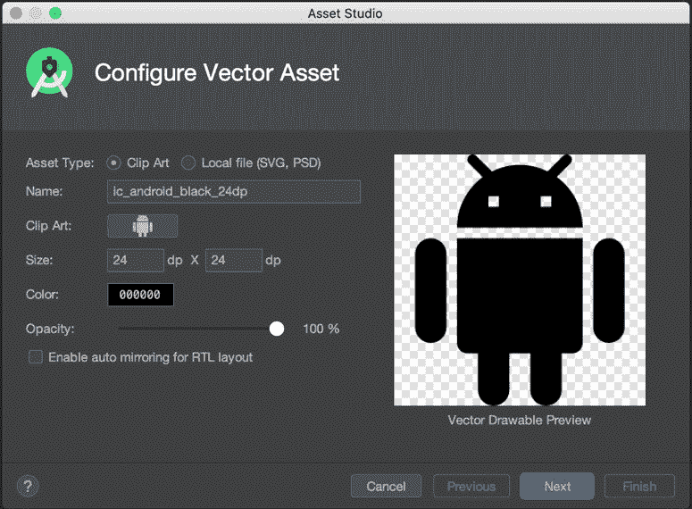

图 7.9 – 资产工作室

现在我们将访问一个窗口，从提供的剪贴画库中选择（*图 7.10*）：

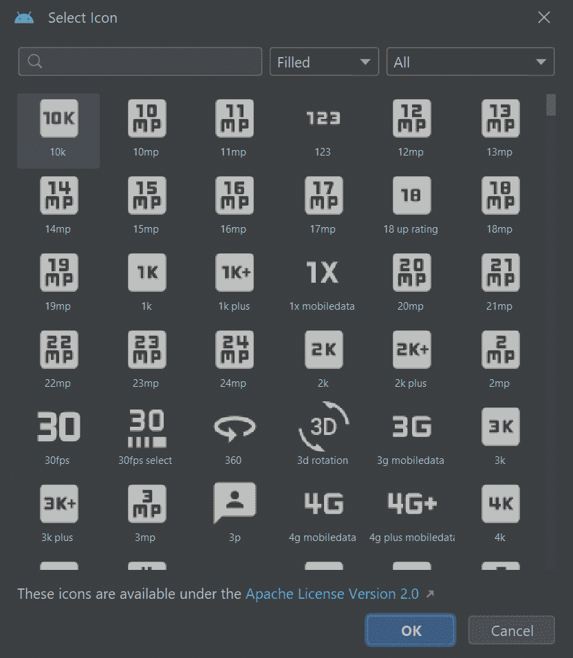

图 7.10 – 选择图标

一旦我们选择了一个图标，我们就可以给它命名，它将作为一个矢量可绘制 XML 文件为我们创建。我们将命名为 `target_icon`。

要使用创建的资产，我们首先必须将其作为 `Drawable` 实例获取。这是通过调用 `ContextCompat.getDrawable(Context, Int)` 来完成的，传入活动和 `R.drawable.target_icon` 作为我们资产的引用。接下来，我们需要为 `Drawable` 实例定义绘制边界。

使用 (`0`, `0`, `drawable.intrinsicWidth`, `drawable.intrinsicHeight`) 调用 `Drawable.setBound(Int, Int, Int, Int)` 将告诉可绘制内容在其固有尺寸内绘制。

要更改我们图标的颜色，我们可以着色它。为了以支持运行 API 低于`21`的设备的方式着色`Drawable`实例，我们必须首先通过调用`DrawableCompat.wrap(Drawable)`将我们的`Drawable`实例包装在`DrawableCompat`中。然后，可以使用`DrawableCompat.setTint(Drawable, Int)`着色返回的`Drawable`。

接下来，我们需要创建一个`Bitmap`来保存我们的图标。其尺寸可以与`Drawable`边界匹配，我们希望其`Config`为`Bitmap.Config.ARGB_8888`。

注意

`8`表示每个通道的位数。`ARGB_8888`意味着我们想要 8 位的红色、绿色、蓝色和 alpha 通道。

然后，我们为`Bitmap`创建一个`Canvas`，这样我们就可以通过调用……你猜对了，`Drawable.draw(Canvas)`来绘制我们的`Drawable`实例：

```swift
private fun getBitmapDescriptorFromVector(@DrawableRes vectorDrawableResourceId: Int): BitmapDescriptor? {
  val bitmap = ContextCompat.getDrawable(this,
    vectorDrawableResourceId)?.let { vectorDrawable ->
      vectorDrawable.setBounds(0, 0,
        vectorDrawable.intrinsicWidth,
        vectorDrawable.intrinsicHeight)
      val drawableWithTint = DrawableCompat.
        wrap(vectorDrawable)
      DrawableCompat.setTint(drawableWithTint, Color.RED)
      val bitmap = Bitmap.createBitmap(
        vectorDrawable.intrinsicWidth,
        vectorDrawable.intrinsicHeight,
        Bitmap.Config.ARGB_8888
      )
      val canvas = Canvas(bitmap)
      drawableWithTint.draw(canvas)
      bitmap
    }
    return BitmapDescriptorFactory.fromBitmap(bitmap)
      .also { bitmap?.recycle() }
}
```

使用包含我们图标的`Bitmap`，我们现在可以从`BitmapDescriptorFactory`获取一个`BitmapDescriptor`实例。别忘了之后回收你的`Bitmap`。这将避免内存泄漏。

您已经学会了如何通过将地图居中在用户当前位置并使用自定义标记显示他们的当前位置来向用户提供一个有意义的地图。

## 练习 7.03 – 在地图点击处添加自定义标记

在这个练习中，您将通过在用户点击的地图位置放置一个红色的爪形标记来响应用户的地图点击：

1.  在`MapsActivity.kt`文件中（位于`app/src/main/java/com/example/catagentdeployer`），在`mMap`变量定义下方，定义一个可空的`Marker`变量以保存对地图上爪形标记的引用：

    ```swift
    private lateinit var mMap: GoogleMap
    private var marker: Marker? = null
    ```

1.  更新`addMarkerAtLocation(LatLng, String)`以接受一个可空的`BitmapDescriptor`，默认值为`null`：

    ```swift
    private fun addMarkerAtLocation(
      location: LatLng, title: String,
      markerIcon: BitmapDescriptor? = null
    ) = mMap.addMarker(
      MarkerOptions().title(title).position(location)
        .apply { markerIcon?.let { icon(markerIcon) } }
    )
    ```

如果提供的`markerIcon`不为 null，则应用程序将其设置为`MarkerOptions`。函数现在返回它添加到地图上的标记。

1.  在您的`addMarkerAtLocation(LatLng, String, BitmapDescriptor?)`函数下方创建一个`getBitmapDescriptorFromVector(Int): BitmapDescriptor?`函数，以提供给定`Drawable`资源 ID 的`BitmapDescriptor`：

    ```swift
    private fun getBitmapDescriptorFromVector(@DrawableRes vectorDrawableResourceId: Int): BitmapDescriptor? {
      val bitmap = ContextCompat.getDrawable(this,
        vectorDrawableResourceId)?.let { vectorDrawable ->
          vectorDrawable.setBounds(0, 0,
            vectorDrawable.intrinsicWidth,
            vectorDrawable.intrinsicHeight)
          val drawableWithTint = DrawableCompat
            .wrap(vectorDrawable)
          DrawableCompat.setTint(drawableWithTint, Color.RED)
          val bitmap = Bitmap.createBitmap(
            vectorDrawable.intrinsicWidth,
            vectorDrawable.intrinsicHeight,
            Bitmap.Config.ARGB_8888
          )
          val canvas = Canvas(bitmap)
          drawableWithTint.draw(canvas)
          bitmap
        }
      return BitmapDescriptorFactory.fromBitmap(bitmap)
        .also { bitmap?.recycle() }
    }
    ```

此函数首先通过传递提供的资源 ID 使用`ContextCompat`获取一个 drawable，然后设置 drawable 的绘制边界，将其包装在`DrawableCompat`中，并将其着色为红色。

然后，它创建一个`Bitmap`和一个`Canvas`，用于该`Bitmap`，在该`Canvas`上绘制着色的 drawable。然后，将 bitmap 返回以供`BitmapDescriptorFactory`构建`BitmapDescriptor`使用。最后，回收`Bitmap`以避免内存泄漏。

1.  在您可以使用`Drawable`实例之前，您必须首先创建它。在 Android 面板上右键单击，然后选择**新建** | **矢量资产**。

1.  在打开的窗口中，点击**剪贴画**标签旁边的 Android 图标以选择不同的图标（*图 7.11*.11）：

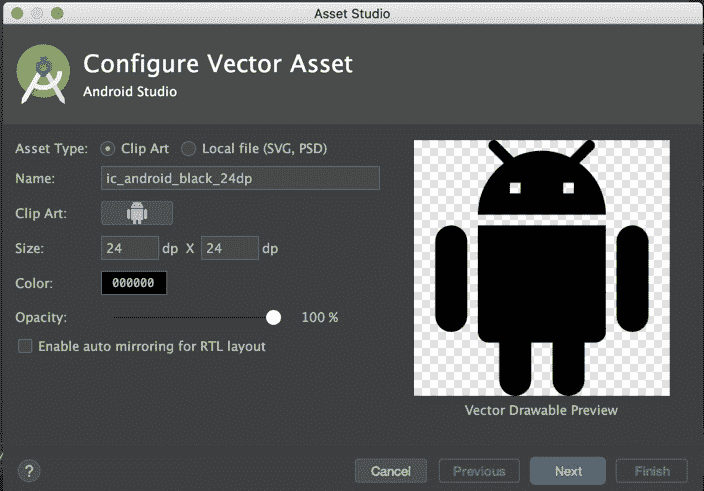

图 7.11 – 资产工作室

1.  从图标列表中选择 `pets` 到搜索字段中，如果你找不到图标。一旦你选择了 **pets** 图标，点击 **确定**：


图 7.12 – 选择图标

1.  将你的图标命名为 `target_icon`。点击 **下一步** 和 **完成**。

1.  定义一个 `addOrMoveSelectedPositionMarker(LatLng)` 函数来创建一个新的标记或将它移动到提供的位置，如果已经创建了一个标记。在 `getBitmapDescriptorFromVector(Int)` 函数之后添加它：

    ```swift
    private fun addOrMoveSelectedPositionMarker(latLng:
    LatLng) {
      if (marker == null) {
        marker = addMarkerAtLocation(latLng,
          "Deploy here", getBitmapDescriptorFromVector(
            R.drawable.target_icon)
        )
      } else { marker?.apply { position = latLng } }
    }
    ```

1.  更新你的 `onMapReady(GoogleMap)` 函数，在 `mMap` 上设置一个 `OnMapClickListener` 事件，这将向点击的位置添加一个标记或将现有的标记移动到点击的位置：

    ```swift
    override fun onMapReady(googleMap: GoogleMap) {
        mMap = googleMap.apply {
            setOnMapClickListener { latLng ->
                addOrMoveSelectedPositionMarker(latLng)
            }
        }
        if (hasLocationPermission()) { ... }
    }
    ```

运行你的应用程序。它应该看起来像 *图 7**.13*。

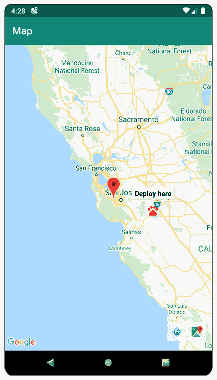

图 7.13 – 完整的应用程序

现在点击地图上的任何位置都会将爪子图标移动到该位置。点击爪子图标将显示 **部署** **此处** 标签。

注意

爪子的位置是地理上的，而不是屏幕上的。这意味着如果你拖动地图或放大，爪子会随着地图移动并保持在相同的地理位置。

你现在知道如何响应用户在地图上的点击，并在周围添加和移动标记。你还知道如何自定义标记的外观。

## 活动 7.01 – 创建一个查找停车位置的应用程序

有些人经常忘记他们停车的地方。假设你想通过开发一个允许用户存储他们最后一次停车位置的应用程序来帮助这些人。当用户启动应用程序时，应用程序将在汽车的位置显示一个图钉。用户可以点击一个 **我停在这里** 按钮来更新下一次停车时图钉的位置。

在这个活动中，你的目标是开发一个向用户显示当前位置地图的应用程序。应用程序必须首先请求用户允许访问他们的位置。根据 SDK，如果需要，请确保也提供合理的对话框。

应用程序将在用户上次告诉它的汽车位置显示一个汽车图标。用户可以点击一个标签为 **我停在这里** 的按钮，将汽车图标移动到当前位置。当用户重新启动应用程序时，它将显示用户的当前位置和上次停车的汽车图标。

作为你应用程序的一个附加功能，你可以选择添加一个功能，用于存储汽车的位置，以便在用户关闭并重新打开应用程序后恢复。此附加功能依赖于使用 `SharedPreferences`；这是一个将在 *第十章*，*持久化数据* 中介绍的概念。因此，这里的 *步骤 9* 和 *步骤 10* 将为你提供所需的实现。

以下步骤将帮助你完成活动：

1.  创建一个 Google Maps Activity 应用程序。

1.  为应用程序获取一个 API 密钥，并使用该密钥更新你的 `google_maps_api.xml` 文件。

1.  在底部显示一个带有 **我停在这里** 标签的按钮。

1.  在您的应用中包含位置服务。

1.  请求用户权限以访问他们的位置。

1.  获取用户的位置并在该位置在地图上放置一个图钉。

1.  将汽车图标添加到您的项目中。

1.  添加功能以将汽车图标移动到用户的当前位置。

1.  奖励步骤：将选定的位置存储在`SharedPreferences`中。此函数，放置在您的活动中，将帮助您完成此操作：

    ```swift
    private fun saveLocation(latLng: LatLng) =
      getPreferences(MODE_PRIVATE)?.edit()?.apply {
        putString("latitude", latLng.latitude.toString())
        putString("longitude", latLng.longitude.toString())
        apply()
      }
    ```

1.  奖励步骤：从`SharedPreferences`恢复任何已保存的位置。您可以使用以下函数：

    ```swift
    val latitude = sharedPreferences
        .getString("latitude", null)
        ?.toDoubleOrNull() ?: return null
    val longitude = sharedPreferences
        .getString("longitude", null)
        ?.toDoubleOrNull() ?: return null
    ```

完成此活动后，您已经证明了您对在 Android 应用中请求权限的理解。您还展示了您可以向用户展示地图并控制地图上的图钉。最后，您还展示了您获取用户当前位置的知识。做得好。

注意

此活动的解决方案可以在[`packt.link/By7eE`](https://packt.link/By7eE)找到。

# 摘要

在本章中，我们学习了关于 Android 权限的内容。我们讨论了拥有权限的原因，并展示了如何请求用户权限以执行特定任务。我们还学习了如何使用 Google 的 Maps API 以及如何向用户展示交互式地图。

最后，我们利用了展示地图和请求权限的知识，以找出用户的当前位置并在地图上展示它。当然，使用 Google Maps API 还有更多可以做的事情，您可以使用某些权限探索更多可能性。

您现在应该对基础知识有足够的了解，可以进一步探索。要了解更多关于权限的信息，请访问[`packt.link/57BdN`](https://packt.link/57BdN)。要了解更多关于 Maps API 的信息，请访问[`packt.link/8akrP`](https://packt.link/8akrP)。

在下一章中，我们将学习如何使用`Services`和`WorkManager`执行后台任务。我们还将学习如何在应用未运行时向用户展示通知。作为移动开发者，这些是您工具箱中非常强大的工具。
