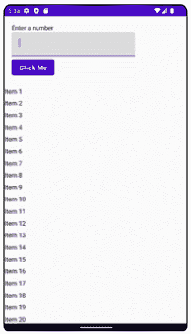
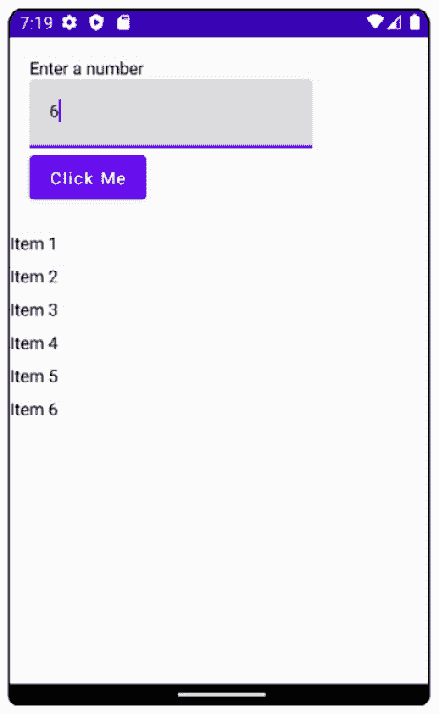
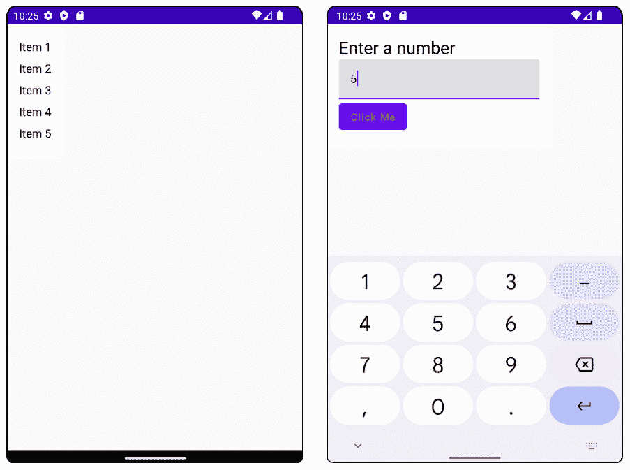

# 第九章：使用 Jetpack Compose 构建用户界面

在本节中，你将学习如何使用 Kotlin 代码通过 Jetpack Compose 创建用户界面，了解 Compose 如何革命性地改变我们构建用户界面的方式，以及如何将现有应用程序转换为 Jetpack Compose。到本章结束时，你将熟悉 Compose 中最常见的 UI 元素以及如何处理用户操作。

在本章中，我们将涵盖以下主题：

+   什么是 Jetpack Compose？

+   处理用户操作

+   Compose 中的主题

+   将 Compose 添加到现有项目中

# 技术要求

本章中所有练习和活动的完整代码可在 GitHub 上找到，网址为 [`packt.link/kb5FW`](https://packt.link/kb5FW)

# 什么是 Jetpack Compose？

在前面的章节中，你学习了如何将数据设置到 Android 视图层次结构中，以及如何使用不同类型的视图来实现不同的目的。这种用户界面构建方法被称为 **命令式方法**。

在命令式方法中，当我们想要改变用户界面的状态时，我们需要手动更改每个用户界面元素，直到达到我们期望的结果。

假设由于用户操作，我们希望我们的 `TextView` 改变文本和文本颜色。这意味着我们需要调用 `setText` 和 `setTextColor` 来实现我们期望的效果。

作为命令式方法的替代，我们有 **声明式方法**，其中我们需要描述我们希望用户界面达到的最终状态，然后内部执行所需的调用。

这意味着我们的 `TextView` 将具有文本和文本颜色作为属性，我们可以定义不同的对象来保存我们想要的状态。在 Jetpack Compose 中，这看起来就像以下示例：

```swift
@Composable
fun MyTextDisplay(myState: MyState) {
    Text(text = myState.text, color = myState.color)
}
data class MyState(
    val text: String,
    val color: Color
)
```

在前面的例子中，我们定义了一个将显示 `Text` 元素的 `@Composable` 函数。`text` 和 `color` 的值将保存在一个单独的数据类中，该数据类将代表文本的状态。

这种机制允许 Jetpack Compose 在 `MyState` 发生任何变化时重新绘制用户界面。这个过程被称为 `@Composable` 函数发生了变化。

如果我们想在 Compose 中创建一个新的屏幕，我们可以选择使用 `Row` 或 `Column` 函数来排列元素。对于垂直排列，我们可以使用 `Column`，而对于水平对齐，我们使用 `Row`：

```swift
@Composable
fun MyScreen(){
    Column {
        Text(text = "My Static Text")
        TextField(value = "My Text Field", onValueChange = {
        })
        Button(onClick = { }) { }
        Icon(painter = painterResource(R.drawable.icon),
            contentDescription = stringResource(id =
            R.string.icon_content_description))
    }
}
```

在前面的例子中，使用 `Column`，我们展示了不同的用户界面元素是上下排列的：

+   `Text` 将显示一个简单的标签，其中 `My Static Text` 标签作为 `text`。

+   `TextField` 将显示一个输入字段，该字段通过 `value` 参数预先填充了 `My Text Field` 文本。`onValueChange` lambda 将捕获用户插入的任何文本。

+   `Button` 将显示一个按钮，通过 `onClick` lambda，我们可以捕获其上的点击事件。

+   `Icon` 将显示来自 `drawable` 或 `mipmap` 文件夹的特定图标，并将从字符串资源设置内容描述。

如果我们想显示项目列表，当项目数量已知且足够小，可以适应设备屏幕时，我们可以使用以下方法：

```swift
@Composable
fun MyList(items: List<String>) {
    Column {
        items.forEach { item -> Text(text = item) }
    }
}
```

在前面的示例中，我们遍历列表中的每个项目，并为每个项目显示一个 `Text`。如果项目的数量未知且足够大，需要滚动，那么我们就会遇到性能问题，因为重组会覆盖可见和不可见的项目。对于这种情况，我们可以使用以下方法：

```swift
@Composable
fun MyList(items: List<String>) {
    LazyColumn {
        item { Text(text = "Header") }
        items(items){ item-> Text(text = item) }
        item { Text(text = "Footer") }
    }
}
```

在这里，我们使用 `LazyColumn` 函数，并用 `items` 函数包裹我们的集合。我们还可以通过 `item` 函数添加静态项作为列表的头部和尾部。像 `Column` 一样，我们可以使用 `LazyRow` 来显示具有水平滚动的项目列表。

如果我们想在 UI 元素之间添加间距，那么 `Modifiers` 就变得很有用：

```swift
@Composable
fun MyScreen(){
    Column {
        Text(text = "My Static Text")
        TextField(value = "My Text Field", onValueChange =
        { }
}
```

在前面的示例中，我们在所有方向上为所有项目的整个列添加了 `16.dp` 的内边距。如果我们想在不同方向上使用不同的内边距，我们会得到以下类似的内容：

```swift
@Composable
fun MyScreen() {
    Column(
        modifier = Modifier.padding(
            top = 5.dp, bottom = 5.dp,
            start = 10.dp, end = 10.dp)
    ) {
    }
}
```

在前面的示例中，我们设置了 `5.dp` 的垂直内边距和 `10.dp` 的水平内边距。因为值是重复的，我们可以使用以下方法：

```swift
@Composable
fun MyScreen() {
    Column(
        modifier = Modifier.padding(
            vertical = 5.dp,
            horizontal = 10.dp)
    ) {
    }
}
```

这里，我们使用了 `vertical` 和 `horizontal` 参数来设置垂直和水平内边距。如果我们想使行可点击，则可以使用以下修饰符：

```swift
@Composable
fun MyScreen() {
    Column(
        modifier = Modifier.padding(
            vertical = 5.dp,
            horizontal = 10.dp
        ).clickable { }
    ) { }
}
```

在前面的示例中，我们使用了 `Modifier` 的 `clickable` 方法。这将在整个 `Column` 上注册一个点击监听器。

当涉及到 Activity 和 Fragment 以及在 Compose 中构建的屏幕之间的关系时，我们有以下 Compose 扩展：

```swift
class MainActivity : ComponentActivity() {
    override fun onCreate(savedInstanceState: Bundle?) {
        super.onCreate(savedInstanceState)
        setContent { MyScreen() }
    }
}
```

在前面的示例中，我们为 `ComponentActivity` 定义了 `setContent` 扩展函数，该函数将 `@Composable` 函数设置为 `Activity` 的内容。对于片段也是如此；然而，在启动新项目时，当前的推荐是只有一个 `Activity`，并将所有额外的屏幕作为单独的 `@``Composable` 函数。

注意

在 Android Studio 中，我们有使用 `@``Preview` 注解预览我们的 `@Composable` 函数的可能性。

## 练习 9.01 – 第一个 Compose 屏幕

创建一个使用 `@Composable` 函数定义的单屏幕 Android 应用程序。屏幕应包含以下元素：

+   `Text`，将显示 `"Enter` `a number"`

+   `TextField`，将只接受整数

+   `Button`，其文本为 `"``Click Me"`

+   `LazyColumn`，将显示一个包含 100 个项目的列表，每个行的格式如下：`"``Item c"`

执行以下步骤以完成练习：

1.  创建一个新的 Android Studio 项目并选择 **Empty** **Compose Activity**。

1.  将以下内容添加到 `res/values` 文件夹中的 `strings.xml`：

    ```swift
        <string name="enter_number">Enter a
            number</string>
        <string name="click_me">Click Me</string>
        <string name="item_format">Item %s</string>
    ```

1.  定义练习的用户界面：

    ```swift
    @Composable
    fun MyScreen(
        items: List<String>
    ) {
        LazyColumn {
            item {
                Column(modifier = Modifier.padding(16.dp))
                {
                    Text(text = stringResource(id =
                    R.string.enter_number))
                    TextField(
                        value = "",
                        keyboardOptions =
                        KeyboardOptions(keyboardType =
                        KeyboardType.Number),
                        onValueChange = {
                        })
                    Button(onClick = { }) {
                        Text(text = stringResource(id =
                        R.string.click_me))
                    }
                }
            }
            items(items) { item ->
                Column(modifier =
                Modifier.padding(vertical = 4.dp)) {
                    Text(text = item)
                }
            }
        }
    }
    ```

我们选择将所有内容放置在`LazyColumn`块中。这将使整个内容可滚动，包括`Text`、`TextField`和`Button`，而不仅仅是项目列表。

为了使键盘只接受数字输入，我们使用了`TextField`函数的`keyboardOptions`参数。对于`Button`，为了向其添加文本，我们需要使用函数的内容参数，并在 lambda 中放置一个新的`Text`。

1.  最后，修改`MainActivity`代码以使用我们刚刚定义的函数：

    ```swift
    class MainActivity : ComponentActivity() {
        override fun onCreate(savedInstanceState: Bundle?) {
            super.onCreate(savedInstanceState)
            setContent {
                val items = (1..100).toList().map {
                    stringResource(id =
                    R.string.item_format, formatArgs =
                    arrayOf("$it"))
                }
                MyScreen(items)
            }
        }
    }
    ```

在这里，我们生成一个新列表的项目，它们将显示为`"Item [count]"`，并调用`@Composable`函数`MyScreen`。

如果我们运行前面的示例，我们将看到以下输出：



图 9.1 – 练习 9.01 的输出

我们可以在前面的图中看到，屏幕是根据练习规范构建的。需要注意的是，我们不允许在输入字段中输入任何文本。这是因为我们将`TextField`的值设置为空字符串。我们将在本书的后续章节中探讨如何正确处理这一方面。

在本节中，我们探讨了如何使用 Jetpack Compose 以简单的方式构建用户界面，而不涉及其他语言和语法，如 Kotlin。接下来，我们将继续探索 Compose，以及我们如何处理用户操作和管理状态。

# 处理用户操作

在上一节中，我们学习了如何使用 Jetpack Compose 构建用户界面。在练习中，我们无法收集用户在`TextField`中设置的数据。在本节中，我们将学习如何处理用户输入以及用户界面的状态。

假设我们有以下示例：

```swift
@Composable
fun MyScreen() {
    Column { TextField(value = "", onValueChange = {}) }
}
```

在这个例子中，我们定义了一个空白的`TextField`，没有处理值的变化。正如我们所看到的，这不会让我们从键盘引入任何新的输入，因为它总是会将文本设置为空字符串。

为了引入新的文本，我们需要创建一个可变变量来存储文本，并确保它在重新组合中存活。在 Jetpack Compose 中，我们可以使用名为`@Composable`的函数`remember`来定义一个`MutableState`，它将保存我们的文本：

```swift
@Composable
fun MyScreen() {
    var text by remember { mutableStateOf("") }
    Column { TextField(value = text, onValueChange = {}) }
}
```

在前面的示例中，我们定义了一个名为`text`的可变变量，并将其设置在`TextField`中。`text`变量通过`remember`函数初始化，它将保存一个`MutableState`，其初始值设置为空字符串。这还不是完整的；我们现在需要将状态与`TextField`值的变化连接起来：

```swift
@Composable
fun MyScreen() {
    var text by remember { mutableStateOf("") }
    Column {
        TextField(value = text, onValueChange = { text = it })
    }
}
```

在这里，我们修改了`onValueChange`的 lambda 表达式，以便使用用户插入的最新文本来改变`text`状态。

注意

我们可以使用`rememberSaveable`函数来保留对象在配置更改（如 Activity 重建）之间的值。

在处理状态时，我们倾向于将 `@Composable` 函数从无状态（不管理状态）转换为有状态（管理一个或多个状态）。作为一个指导原则，我们应该尽量通过名为 `@Composable` 函数的模式保持我们的函数尽可能无状态。这将使前面的例子变成以下形式：

```swift
@Composable
fun MyScreen() {
    var text by rememberSaveable { mutableStateOf("") }
    MyScreenContent(text = text, onTextChange = { text = it })
}
@Composable
fun MyScreenContent(text: String, onTextChange: (String) -> Unit) {
    Column {
        TextField(value = text, onValueChange =
            onTextChange)
    }
}
```

在前面的例子中，我们将我们的函数分成了两部分。`MyScreen` 函数将管理文本状态并调用 `MyScreenContent` 函数，该函数现在是无状态的。这种方法引入了多个好处，如我们无状态函数的 *可重用性*、*解耦* 状态管理和 *单一事实来源*。

注意

当你使用 Jetpack Compose 状态和 `MutableState` 对象时，你可能需要手动导入以下两个用于获取和设置状态的方法：`androidx.compose.runtime.getValue` 和 `androidx.compose.runtime.setValue`。

在处理 Jetpack Compose 中的状态时，当状态发生变化时，会触发重新组合过程。这可能会在我们想要显示一次性事件，如 `Snackbar` 和 `Toast` 时引起问题。为了实现这一点，我们可以使用 `LaunchedEffect`：

```swift
@Composable
fun MyScreenContent() {
    val context = LocalContext.current
    LaunchedEffect(anObjectToChange) {
        Toast.makeText(context, "Toast text",
        Toast.LENGTH_SHORT).show()
    }
}
```

前面的例子会在 `anObjectToChange` 每次取不同值时显示一个 `Toast` 消息。如果我们用 `Unit` 替换 `anObjectToChange`，那么 `LaunchedEffect` 块将只执行一次。

## 练习 9.02 – 处理用户输入

修改 *练习 9.01 – 第一个 Compose 屏幕*，使得当用户在 `TextField` 中输入一个数字并点击按钮时，将生成一个与输入数字大小相同的项目列表，并将它们填充在按钮下面的列表中。每个项目的文本将与之前相同。

为了表示用户界面的状态，将创建一个数据类来保存项目数量，默认为 `0`，以及项目列表，默认为空。

执行以下步骤以完成练习：

1.  创建 `MyScreenState` 数据类，它将保存用户界面的状态：

    ```swift
    data class MyScreenState(
        val itemCount: String = "",
        val items: List<String> = emptyList()
    )
    ```

1.  创建一个名为 `MyScreenContent` 的 `@Composable` 方法，它将 `MyScreenState` 作为参数并渲染状态：

    ```swift
    @Composable
    fun MyScreenContent(
        myScreenState: MyScreenState,
        onItemCountChange: (String) -> Unit,
        onButtonClick: @Composable () -> Unit
    ) {
        LazyColumn {
            item {
                Column(modifier = Modifier.padding(16.dp))
                {
                    Text(text = stringResource(id =
                    R.string.enter_number))
                    TextField(
                        value = myScreenState.itemCount,
                        keyboardOptions =
                        KeyboardOptions(keyboardType =
                        KeyboardType.Number),
                        onValueChange =
                        onItemCountChange
                    )
                    Button(onClick = onButtonClick) {
                        Text(text = stringResource(id =
                        R.string.click_me))
                    }
                }
            }
            items(myScreenState.items) { item ->
                Column(modifier =
                Modifier.padding(vertical = 4.dp)) {
                    Text(text = item)
                }
            }
        }
    }
    ```

在前面的例子中，我们在 `TextField` 中设置了 `myScreenState` 的 `itemCount`，并将 `myScreenState` 的 `items` 作为列表中的项目。我们还添加了文本更改监听器和按钮监听器作为函数的参数，使其变为无状态。

1.  修改 `MyScreen` 函数，使其调用 `MyScreenContent` 并处理文本更改和按钮点击的监听器：

    ```swift
    @Composable
    fun MyScreen() {
        var state by remember {
            mutableStateOf(MyScreenState())
        }
        val context = LocalContext.current
        MyScreenContent(state, {
            state = state.copy(itemCount = it)
        }, {
            state = state.copy(items =
            (1..state.itemCount.toInt()).toList().map {
                context.getString(R.string.item_format,
                "$it")
            })
        })
    }
    ```

在这里，我们创建了一个新的 `MutableState`，它将保存具有默认值的 `MyScreenState`。然后我们将调用 `MyScreenContent` 并传递状态。当文本更改时，我们将状态设置为现有状态的副本，并带有新文本，当按钮被点击时，我们将生成一个新项目列表，直到当前的 `itemCount` 并更新状态。

1.  更新`MainActivity`类以调用不带任何参数的`MyScreen`函数：

    ```swift
    class MainActivity : ComponentActivity() {
        override fun onCreate(savedInstanceState: Bundle?) {
            super.onCreate(savedInstanceState)
            setContent {
                MyScreen()
            }
        }
    }
    ```

如果我们运行练习并插入一个数字，那么我们应该看到以下屏幕：



图 9.2 – 练习 9.02 的输出

当应用程序首次启动时，我们应该看到`TextField`为空，并且按钮下没有元素。当设置一个数字时，状态将改变以反映新的文本，当点击按钮时，将显示包含插入数字大小的项目列表。

在本节中，我们探讨了如何处理用户输入，保持其状态，并在重新组合中管理该状态。在接下来的章节中，我们将探讨如何进一步装饰我们的用户界面元素。

# Compose 中的主题化

在上一节中，我们学习了如何处理用户操作以及如何管理特定屏幕的状态。但我们是如何保持应用程序的用户界面元素在整个应用程序中的一致性呢？在本节中，我们将探讨如何创建与应用程序主题相关联的可重用元素。

您可能已经注意到，在执行前面的练习时，Android Studio 在`ui.theme`包中创建了一些文件。这是因为 Jetpack Compose 建立在 Material Design 库之上，并将为您的应用程序分配一个基于 Material Design 的主题。所采用的方法如下：

1.  在`Color.kt`文件中，声明了应用程序的所有颜色：

    ```swift
    val Purple200 = Color(0xFFBB86FC)
    val Purple500 = Color(0xFF6200EE)
    val Purple700 = Color(0xFF3700B3)
    val Teal200 = Color(0xFF03DAC5)
    ```

在前面的示例中，我们有颜色十六进制名称。

1.  在`Shape.kt`文件中，生成了以下代码：

    ```swift
    val Shapes = Shapes(
        small = RoundedCornerShape(4.dp),
        medium = RoundedCornerShape(4.dp),
        large = RoundedCornerShape(0.dp)
    )
    ```

这将指示您在应用程序中使用的图标的大小。

1.  在`Type.kt`文件中，生成了以下代码：

    ```swift
    val Typography = Typography(
        body1 = TextStyle(
            fontFamily = FontFamily.Default,
            fontWeight = FontWeight.Normal,
            fontSize = 16.sp
        )
    )
    ```

这将表示您的应用程序中文本是如何渲染的。`Typography`类包含有关标题、副标题、段落、按钮和标题文本应如何配置的设置。

1.  在`Theme.kt`文件中，定义了两个颜色调色板：

    ```swift
    private val DarkColorPalette = darkColors(
        primary = Purple200,
        primaryVariant = Purple700,
        secondary = Teal200
    )
    private val LightColorPalette = lightColors(
        primary = Purple500,
        primaryVariant = Purple700,
        secondary = Teal200
    )
    ```

这里定义了浅色和深色颜色调色板，并设置了`primary`、`primaryVariant`和`secondary`颜色。`lightColors`和`darkColors`函数中的其余颜色将保留其默认值。

1.  在同一文件中，生成应用程序的主题：

    ```swift
    @Composable
    fun MyApplicationTheme(
        darkTheme: Boolean = isSystemInDarkTheme(),
        content: @Composable () -> Unit
    ) {
        val colors = if (darkTheme) {
            DarkColorPalette
        } else {
            LightColorPalette
        }
        MaterialTheme(
            colors = colors,
            typography = Typography,
            shapes = Shapes,
            content = content
        )
    }
    ```

在这里，将检查设备是否启用了浅色或深色模式，并为每种模式使用适当的颜色集。它还将设置您配置的字体样式以及应用程序中形状的样式。尽管它已在主题中设置，但这并不意味着我们的用户界面元素会自动继承它。

1.  当生成`MainActivity`类时，它将具有以下结构：

    ```swift
    class MainActivity : ComponentActivity() {
        override fun onCreate(savedInstanceState: Bundle?) {
            super.onCreate(savedInstanceState)
            setContent {
                MyApplicationTheme {
                    Surface(color =
                    MaterialTheme.colors.background) { }
                }
            }
        }
    }
    ```

当调用`setContent`时，您的应用程序主题将被调用，并且`Surface`函数将设置应用程序的背景。

我们现在可以将前面的设置作为起点来定义应用程序的主题，并开始创建可重用的用户界面组件。假设我们希望应用程序中的所有段落都使用相同的排版和颜色；在这种情况下，我们将使用 `MaterialTheme.typography.body1` 和 `MaterialTheme.colors.onBackground`：

```swift
@Composable
fun ParagraphText(text: String) {
    Text(
        text = text,
        style = MaterialTheme.typography.body1,
        color = MaterialTheme.colors.onBackground
    )
}
```

在前面的示例中，我们定义了 `ParagraphText` 函数，该函数将设置从 `MaterialTheme` 来的文本样式和颜色。如果我们想使用相同的样式和不同的文本颜色，可能需要为每个样式属性重复，这时我们可能遇到问题。另一个解决方案是创建两个函数——一个用于样式，另一个用于其上的颜色：

```swift
@Composable
fun OnBackgroundParagraphText(text: String) {
    ParagraphText(text = text, color =
    MaterialTheme.colors.onBackground)
}
@Composable
fun ParagraphText(text: String, color: Color) {
    Text(
        text = text,
        style = MaterialTheme.typography.body1,
        color = color
    )
}
```

在前面的示例中，我们将颜色移动到 `ParagraphText` 函数的参数中，然后创建了一个名为 `OnBackgroundParagraphText` 的新函数，这使得我们可以将 `MaterialTheme.colors.onBackground` 设置为在 `ParagraphText` 中定义的 `Text`。如果我们想使用我们的新函数，我们可以这样做：

```swift
@Composable
fun MyScreen() {
    OnBackgroundParagraphText(text = "My text")
}
```

这是一个简单的函数调用，就像使用 `Text` 函数一样。

现在，假设我们正在将此文本应用于整个应用程序，并且应用程序经历了一次重新设计，其中不再使用 `MaterialTheme.typography.body1`，而是需要使用 `MaterialTheme.typography.body2`，并且文本颜色需要是红色。在这种情况下，我们将修改 `ParagraphText` 函数如下：

```swift
@Composable
fun ParagraphText(text: String, color: Color) {
    Text(
        text = text,
        style = MaterialTheme.typography.body2,
        color = color
    )
}
```

在这里，我们将 `Text` 函数的样式更改为使用 `MaterialTheme.typography.body2`。要更改颜色，我们可以修改 `OnBackgroundParagraphText`，但当前使用的颜色建议用于当前背景之上，因此我们也可以更改 `MaterialTheme.colors.onBackground` 的值。为此，我们可以进入 `Theme.kt` 并执行以下操作：

```swift
private val DarkColorPalette = darkColors(
    primary = Purple200,
    primaryVariant = Purple700,
    secondary = Teal200,
    onBackground = Color.Red
)
private val LightColorPalette = lightColors(
    primary = Purple500,
    primaryVariant = Purple700,
    secondary = Teal200,
    onBackground = Color.Red
)
```

在这里，我们将 `onBackground` 的值更改为红色，这将影响所有引用 `onBackground` 的用户界面元素。我们现在可以看到如何轻松地将此应用于应用程序中的所有用户界面元素，而无需触及使用这些元素的地方的代码。

如果我们想在应用程序中拥有多个屏幕，我们可以将 Compose 与 `navigation` 库连接起来，该库在此处可用：

```swift
implementation "androidx.navigation:navigation-compose:2.5.3
```

现在假设我们在 Jetpack Compose 中定义了两个屏幕：

```swift
@Composable
fun Screen1(onButtonClick: () -> Unit) {
    Button(onClick = onButtonClick) {
        Text(text = "Click Me")
    }
}
@Composable
fun Screen2(input1: String, input2: String) {
    Text(text = "My inputs are $input1 and $input2")
}
```

`Screen1` 将显示一个按钮，而 `Screen2` 有两个输入将被显示。我们现在想连接这两个屏幕，以便当在 `Screen1` 上点击按钮时，`Screen2` 会打开，并传递两个硬编码的输入。这看起来如下所示：

```swift
@Composable
fun MyApp(navController: NavHostController) {
    NavHost(navController = navController,
    startDestination = "screen1") {
        composable("screen1") {
            Screen1 { navController.navigate
            ("screen2/Input1?input2=Input2") }
        }
        composable(
            "screen2/{input1}?input2={input2}",
            arguments = listOf(navArgument("input1") {
            type = NavType.StringType },
            navArgument("input2") { type =
            NavType.StringType }
            )
        ) {
            Screen2(
                input1 = it.arguments?
                .getString("input1").orEmpty(),
                input2 = it.arguments?
                .getString("input2").orEmpty()
            )
        }
    }
}
```

我们定义了一个新的 `@Composable` 函数 `MyApp`，它使用 `NavHost` 来保持应用程序中的所有屏幕。`NavHost` 将通过 `screen1` URL 默认打开 `Screen1`。在 `Screen1` 的 `onButtonClick` lambda 中，我们导航到 `Screen2` 并传递 `input1` 和 `input2` 字符串。

这是通过`screen2/{input1}?input2={input2}` URL 完成的。这也是我们在两个屏幕之间传递参数的方式，无论是通过路径参数（`input1`）还是通过参数（`input2`）。对于每个输入，我们需要指定我们期望的是一个字符串类型。

然后，将打开`Screen2`，并通过`it`变量提取输入，`it`是一个`NavBackStackEntry`类型。我们可以从 Activity 的`setContent`方法中调用此函数：

```swift
class MainActivity : ComponentActivity() {
    override fun onCreate(savedInstanceState: Bundle?) {
        super.onCreate(savedInstanceState)
        setContent {
            MyApplicationTheme {
                Surface(color =
                MaterialTheme.colors.background) {
                    val navController =
                        rememberNavController()
                    MyApp(navController)
                }
            }
        }
    }
}
```

在这里，我们提升`NavHostController`的状态，然后调用`MyApp`函数。

## 练习 9.03 – 应用主题

修改*练习 9.02 – 处理用户输入*，以便将`MyScreen`、`MyScreenContent`和`MyScreenState`拆分为两个屏幕，其中`ItemCountScreen`、`ItemCountScreenContent`和`ItemCountScreenState`在一侧，将包含`Text`、`TextField`和`Button`，而`ItemScreen`、`ItemScreenContent`和`ItemScreenState`在另一侧，将包含项目列表。

两个屏幕将被保存在`ItemCountScreen.kt`和`ItemScreen.kt`文件中。`ItemCountScreen`将首先显示，当按钮被点击时，然后显示`ItemScreen`，并在上一个屏幕中设置项目数量。

还将创建新的函数来表示应用程序中使用的`Text`：一个用于`"Enter a number"`文本，它将是`MaterialTheme.typography.h5`；`"Click Me"`文本将是`MaterialTheme.typography.button`；而`"Item [count]"`将是`MaterialTheme.typography.body1`。

文本的颜色将设置为`MaterialTheme.colors.onBackground`，按钮文本的颜色为`Color.red`。

执行以下步骤以完成练习：

1.  在`app/build.gradle`文件中，添加`navigation`库依赖项：

    ```swift
    implementation "androidx.navigation:navigation-compose:2.5.3"
    ```

1.  在`ui.theme`包中，创建一个名为`Elements`的 Kotlin 文件。

1.  在`Elements.kt`文件中，添加第一屏幕上标题文本的函数：

    ```swift
    @Composable
    fun OnBackgroundTitleText(text: String) {
        TitleText(text = text, color =
            MaterialTheme.colors.onBackground)
    }
    @Composable
    fun TitleText(text: String, color: Color) {
        Text(text = text, style =
            MaterialTheme.typography.h5, color = color)
    }
    ```

1.  在同一文件中，添加`"Item [``count]"`文本的函数：

    ```swift
    @Composable
    fun OnBackgroundItemText(text: String) {
        ItemText(text = text, color =
            MaterialTheme.colors.onBackground)
    }
    @Composable
    fun ItemText(text: String, color: Color) {
        Text(text = text, style =
            MaterialTheme.typography.body1, color = color)
    }
    ```

1.  在同一文件中，添加按钮文本的函数：

    ```swift
    @Composable
    fun PrimaryTextButton(text: String, onClick: () ->
    Unit) {
        TextButton(text = text, textColor = Color.Red,
        onClick = onClick)
    }
    @Composable
    fun TextButton(text: String, textColor: Color,
    onClick: () -> Unit) {
        Button(
            onClick = onClick, colors = ButtonDefaults
            .buttonColors(contentColor = textColor)
        ) {
            Text(text = text, style =
            MaterialTheme.typography.button)
        }
    }
    ```

在这个例子中，由于按钮以不同的方式设置内容的颜色，我们不得不使用`ButtonColors`类中的`contentColor`。

1.  创建一个名为`ItemCountScreen`的新 Kotlin 文件。

1.  在此文件中，创建一个名为`ItemCountScreenState`的新类：

    ```swift
    data class ItemCountScreenState(
        val itemCount: String = ""
    )
    ```

1.  在同一文件中，创建一个名为`ItemCountScreenContent`的新函数，该函数将包含新创建的`OnBackgroundTitleText`和`PrimaryTextButton`函数：

    ```swift
    @Composable
    fun ItemCountScreenContent(
        itemCountScreenState: ItemCountScreenState,
        onItemCountChange: (String) -> Unit,
        onButtonClick: () -> Unit
    ) {
        Column {
            OnBackgroundTitleText(text = stringResource(id
                = R.string.enter_number))
            TextField(
                value = itemCountScreenState.itemCount,
                keyboardOptions = KeyboardOptions(
                keyboardType = KeyboardType.Number),
                onValueChange = onItemCountChange
            )
            PrimaryTextButton(text = stringResource(id =
            R.string.click_me), onClick = onButtonClick)
        }
    }
    ```

1.  在同一文件中，创建一个名为`ItemCountScreen`的新函数：

    ```swift
    @Composable
    fun ItemCountScreen(onButtonClick: (String) -> Unit) {
        var state by remember {
            mutableStateOf(ItemCountScreenState())
        }
        ItemCountScreenContent(state, {
            state = state.copy(itemCount = it)
        }, {
            onButtonClick(state.itemCount)
        })
    }
    ```

1.  创建一个名为`ItemScreen`的新 Kotlin 文件。

1.  在该文件中，创建一个名为`ItemScreenState`的新类：

    ```swift
    data class ItemScreenState(
        val items: List<String> = emptyList()
    )
    ```

1.  在同一文件中，创建一个名为`ItemScreenContent`的新函数，该函数将使用`OnBackgroundItemText`：

    ```swift
    @Composable
    fun ItemScreenContent(
        itemScreenState: ItemScreenState
    ) {
        LazyColumn {
            items(itemScreenState.items) { item ->
                Column(modifier =
                Modifier.padding(vertical = 4.dp)) {
                    OnBackgroundItemText(text = item)
                }
            }
        }
    }
    ```

1.  在同一文件中，创建一个名为`ItemScreen`的新函数：

    ```swift
    @Composable
    fun ItemScreen(itemCount: String) {
        ItemScreenContent(itemScreenState =
        ItemScreenState((1..itemCount.toInt()).toList()
        .map {
            stringResource(id = R.string.item_format,
            formatArgs = arrayOf("$it"))
        }))
    }
    ```

1.  在`MainActivity`文件中，创建`MyApp`函数，该函数将管理之前定义的两个屏幕：

    ```swift
    @Composable
    fun MyApp(navController: NavHostController) {
        NavHost(navController = navController,
        startDestination = "itemCountScreen") {
            composable("itemCountScreen") {
                ItemCountScreen { navController.navigate(
                "itemScreen/?itemCount=$it") }
            }
            composable(
                "itemScreen/?itemCount={itemCount}",
                arguments =
                listOf(navArgument("itemCount") {type =
                NavType.StringType })
            ) {
                ItemScreen(
                    it.arguments?.getString("itemCount")
                    .orEmpty()
                )
            }
        }
    }
    ```

1.  最后，修改`setContent`函数，以便调用`MyApp`：

    ```swift
    class MainActivity : ComponentActivity() {
        override fun onCreate(savedInstanceState: Bundle?)
        {
            super.onCreate(savedInstanceState)
            setContent {
                MyApplicationTheme {
                    Surface(color =
                    MaterialTheme.colors.background) {
                        val navController =
                            rememberNavController()
                        Column(modifier =
                            Modifier.padding(16.dp)) {
                                MyApp(navController)
                        }
                    }
                }
            }
        }
    }
    ```

如果我们运行应用程序，我们应该看到以下输出：



图 9.3 – 练习 9.03 的输出

我们应该能够看到屏幕被分成两部分，并且在在一个屏幕中输入一个数字后，我们应该过渡到另一个屏幕，并显示一个生成的项目列表。我们还应该看到为 `Text` 函数新定义的样式。我们只能从 `Elements` 类中控制这些样式，而不会对屏幕本身进行任何修改。

在本节中，我们学习了如何将主题应用到应用程序中，以及我们如何使用 Jetpack Compose 创建多个屏幕并在它们之间导航。在下一节中，我们将探讨如何将 Compose 集成到现有项目中，以及它如何与其他流行的库集成。

# 将 Compose 添加到现有项目

在本节中，我们将探讨将 Jetpack Compose 引入现有 Android 应用程序的各种选项，以及如何使 Compose 与不同的库一起工作。

当使用 Jetpack Compose 时，理想情况下应该有少量活动，如果可能的话，只有一个，并且所有屏幕都使用 Compose 构建。为了使现有项目能够实现这一点，它需要从 `View` 层级的底部开始，这意味着你的现有视图应该开始迁移到使用 Compose 构建。

为了方便这种过渡，Jetpack Compose 提供了在 XML 布局中使用 `ComposeView` 的可能性，如下例所示：

```swift
<?xml version="1.0" encoding="utf-8"?>
<LinearLayout
    xmlns:android=
      "http://schemas.android.com/apk/res/android"
    android:orientation="vertical"
    android:layout_width="match_parent"
    android:layout_height="match_parent">
    <androidx.compose.ui.platform.ComposeView
        android:id="@+id/compose_view"
        android:layout_width="match_parent"
        android:layout_height="match_parent" />
</LinearLayout>
```

在这里，我们有一个现有的布局，它需要包含一个使用 Jetpack Compose 定义的视图。在布局 XML 文件中，我们可以在我们的视图将存在的位置放置一个 `ComposeView` 占位符，然后在 Kotlin 代码中，我们可以包含 Compose 用户界面元素：

```swift
class MyFragment : Fragment() {
    override fun onCreateView(
        inflater: LayoutInflater,
        container: ViewGroup?,
        savedInstanceState: Bundle?
    ): View? {
        return inflater.inflate(
        R.layout.my_fragment_layout, container).apply {
            findViewById<ComposeView>(R.id.compose_view)
            .apply {
                setViewCompositionStrategy(
                ViewCompositionStrategy
                .DisposeOnViewTreeLifecycleDestroyed)
                setContent {
                    MaterialTheme {
                        Text("My Text")
                    }
                }
            }
        }
    }
}
```

在这个例子中，`Fragment` 展示了 XML 布局，查找 `ComposeView`，并标记当 `Fragment` 的 `View` 被销毁时，Compose 内容也应该被销毁，以防止任何泄漏，然后设置 `ComposeView` 的内容为 `Text`。

当我们想要走相反的路，将 Android 视图添加到 Compose 代码中时，我们有使用 `AndroidView` 的选项：

```swift
@Composable
fun MyCustomisedElement(text: String) {
    AndroidView(factory = { context ->
        TextView(context).apply {
            this.text = text
        }
    })
}
```

在这个例子中，我们定义了一个新的 `@Composable` 函数，名为 `MyCustomisedElement`，它将调用 `AndroidView`，然后创建一个 `TextView`，并将我们定义的文本作为参数设置到该文本视图上。

正如我们在前面的章节中看到的，我们可以使用 `LocalContext.current` 来获取 `Context` 引用。这允许我们执行启动活动、服务以及显示 `Toasts` 等操作。

Compose 还能够与其他在构建 Android 应用程序时有用的库进行交互。我们将在接下来的章节中分析这些库，但现在，我们将看看它们是如何与 Jetpack Compose 一起工作的：

+   `ViewModel`库对于在 Activity 和 Fragment 的配置更改中保持数据很有用，并有助于使我们的代码更容易测试。Compose 可以通过名为`@Composable`的函数`viewModel`获取`ViewModel`对象的引用：

    ```swift
    @Composable
    fun MyScreen(viewModel: MyViewModel = viewModel()) {
        Text(text = viewModel.myText)
    }
    ```

在这里，我们调用`viewModel`来获取`MyViewModel`的引用，并使用`viewModel`持有的值设置`Text`。

+   数据流库与`ViewModel`库结合使用很有用，因为我们想要从互联网或本地文件系统异步加载数据时，需要通知用户界面数据已加载。

常见的数据流库有 LiveData、RxJava 和 Coroutines 和 Flows。我们已看到，当我们要管理用户界面的状态时，Compose 使用`State`对象。对于这三个库，Compose 提供了扩展库，将数据流转换为`State`对象：

```swift
@Composable
fun MyScreen(viewModel: MyViewModel = viewModel()) {
    viewModel.myLiveData.observeAsState()?.let{
    myLiveDataText->
        Text(text = myLiveDataText)
    }
    viewModel.myObservable.subscribeAsState()?.let{
     myObservableText->
        Text(text = myObservableText)
    }
    viewModel.myFlow.collectAsState()?.let{
    myFlowText->
        Text(text = myFlowText)
    }
}
```

在这个例子中，我们的`viewModel`对象将包含每个数据流，这些数据流将保存一个字符串。对于每个流，Compose 调用等效的方法来订阅并监控字符串值的更改。当每个流发出新的值时，Compose 将其设置在`Text`中。

+   Hilt 是一个为 Android 应用开发设计的依赖注入库。如果项目中没有`navigation`库，那么使用前面描述的`viewModel`函数就足够获取到`ViewModel`的引用；然而，如果`navigation`库存在，那么还需要包含一个使`hilt`和`navigation`协同工作的库：

    ```swift
    implementation 'androidx.hilt:hilt-navigation-compose:1.0.0'
    ```

要在 Compose 代码中获取`ViewModel`对象的引用，我们需要将`viewModel`的调用替换为`hiltViewModel`的调用。

你可以在[`developer.android.com/jetpack/compose`](https://developer.android.com/jetpack/compose)找到有关将 Jetpack Compose 集成到你的 Android 应用程序中的更多信息，以及与其他库的兼容性信息：[`developer.android.com/jetpack/compose/libraries`](https://developer.android.com/jetpack/compose/libraries)。

在本节中，我们探讨了如何集成 Jetpack Compose 库，使其与项目中的现有`View`对象和现有库协同工作。

## 活动第 9.01 节 – 第一个 Compose 应用

使用 Jetpack Compose 创建一个新的应用，它将包含三个屏幕：

+   **插入行**屏幕将有一个标题、一个文本字段和一个按钮，可以在其中插入一个数字。当按钮被点击时，用户将导航到下一个屏幕。

+   **插入列**屏幕将有一个标题、一个可以插入数字的文本字段和一个按钮。当按钮被点击时，用户将导航到下一个屏幕。

+   网格屏幕将显示一个网格，其行数和列数将插入在上方。每一行将独立使用 `LazyRow` 进行滚动，而对于列，将使用 `LazyColumn`。每个网格项将显示文本 `"Item [row][column]"`。

前两个屏幕将使用相同的样式来显示标题、文本字段和按钮，而第三个屏幕将有一个用于显示网格中文本的样式。

要完成此活动，您需要执行以下步骤：

1.  使用空 Compose Activity 创建一个新的 Android Studio 项目。

1.  将 `navigation` 库依赖项添加到 `app/build.gradle` 文件中。

1.  在 `ui.theme` 包中，创建一个名为 `Elements` 的新 Kotlin 文件。

1.  在该文件中，为应用中使用的标题创建 `@Composable` 函数。

1.  在同一文件中，为应用中使用的文本字段创建 `@Composable` 函数。

1.  在同一文件中，为网格项创建 `@Composable` 函数。

1.  在同一文件中，为按钮创建 `@Composable` 函数。

1.  创建一个名为 `InsertRowsScreen` 的新 Kotlin 文件。

1.  创建 `InsertRowsScreenState`、`InsertRowsScreenContent` 和 `InsertRowsScreen`，它们将负责保持屏幕状态和屏幕内容，并管理屏幕状态。

1.  创建一个名为 `InsertColumnsScreen` 的新 Kotlin 文件。

1.  创建 `InsertColumnsScreenState`、`InsertColumnsScreenContent` 和 `InsertColumnsScreen`，它们将负责保持屏幕状态和屏幕内容，并管理屏幕状态。

1.  创建一个名为 `GridScreen` 的新 Kotlin 文件。

1.  创建 `GridScreenState`、`GridScreenContent` 和 `GridScreen`，它们将负责保持屏幕状态和屏幕内容，并管理屏幕状态。

1.  在 `MainActivity` 中，创建一个新的函数来设置屏幕之间的导航。

1.  在 `MainActivity` 中，修改 `setContent` 方法块以调用之前创建的函数。

注意

该活动的解决方案可在 [`packt.link/Le1jE`](https://packt.link/Le1jE) 找到。

# 摘要

在本章中，我们探讨了如何使用 Jetpack Compose 构建用户界面。我们首先创建简单的用户界面元素，并探讨了如何使用 `@Composable` 函数构建整个屏幕，而不需要任何 XML 代码。

然后，我们分析了状态管理以及如何处理用户输入，并探讨了诸如状态提升等模式，其中我们尽可能保持函数无状态以提高可重用性。然后，我们探讨了如何定义我们自己的用户界面元素并将主题和样式应用于它们，这使得我们可以在不修改使用更改元素的屏幕的情况下更改整个应用程序的外观。

最后，我们探讨了如何将 Compose 添加到现有项目中，以及 Compose 如何与用于应用开发的流行库交互。在章节活动中，我们应用了所有这些概念，并创建了一个具有一致的用户界面定义的应用程序，其中定义了多个由 Compose 定义的屏幕。

在下一章中，我们将分析如何测试我们的 Android 代码，并查看一些我们可以用来实现这一目标的流行库。

# 第三部分：测试和代码结构

在这部分，我们将探讨如何构建我们的代码以使其可测试，以及我们可以在代码库中执行的各种测试类型。Android 架构组件将被用于通过将执行可测试任务的代码与与用户界面交互的代码分离来辅助代码结构化，后者更难测试。

然后，我们将探讨我们在设备上保存数据时拥有的可用选项。最后，我们将探讨在依赖注入的帮助下如何管理应用程序内部的依赖关系。

在本节中，我们将涵盖以下章节：

+   *第十章*, *使用 JUnit、Mockito 和 Espresso 进行单元测试和集成测试*

+   *第十一章*, *Android 架构组件*

+   *第十二章*, *持久化数据*

+   *第十三章*, *使用 Dagger、Hilt 和 Koin 进行依赖注入*
