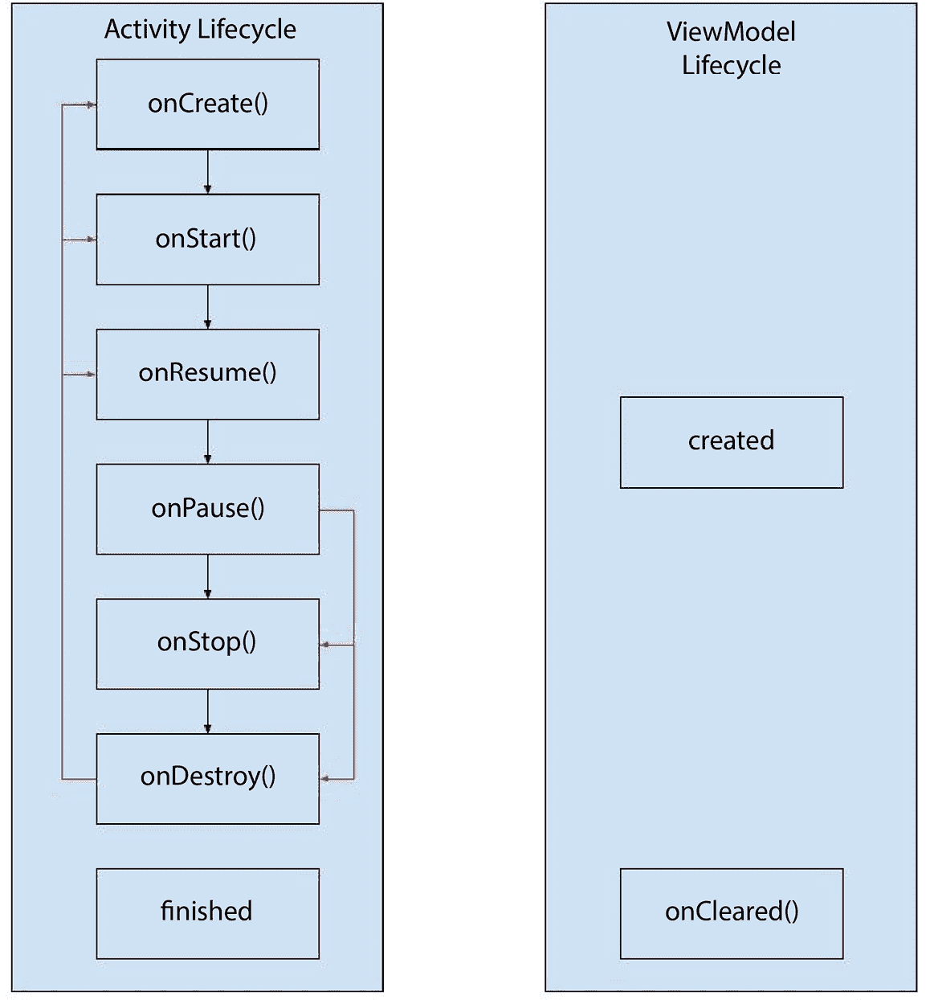
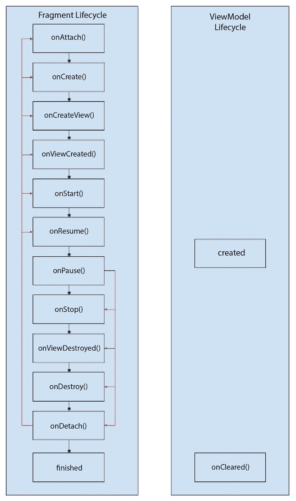
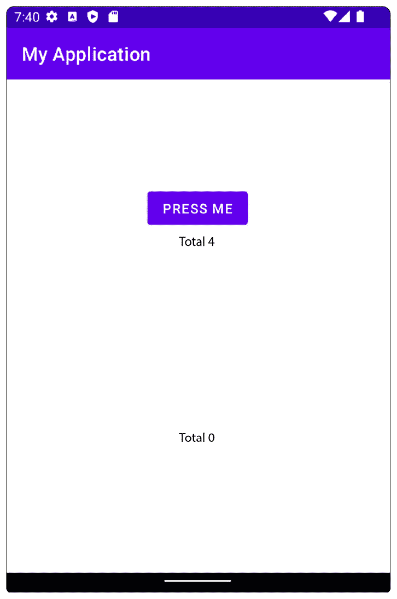
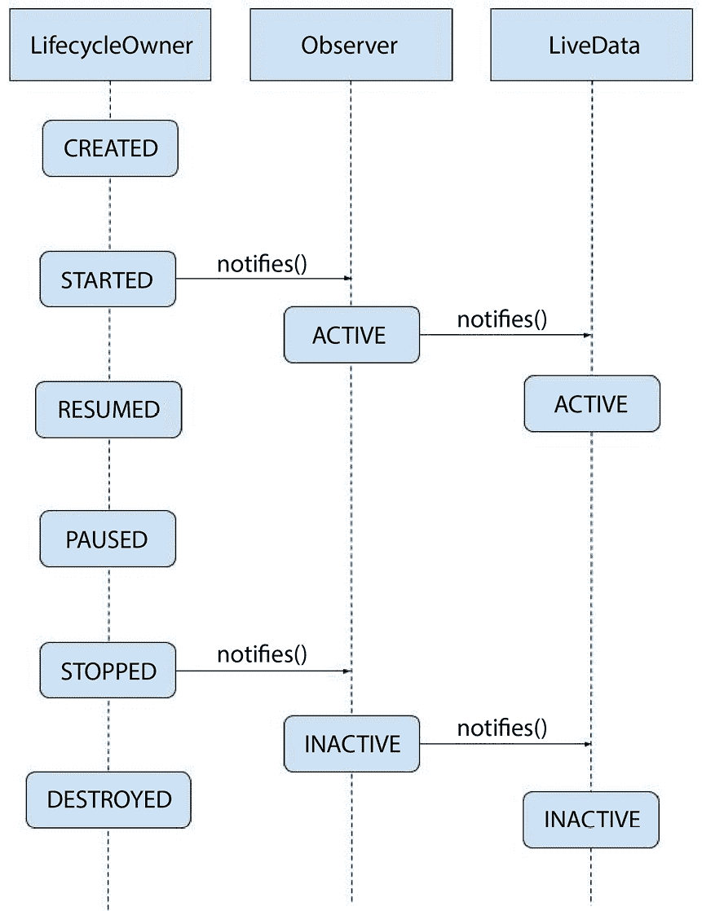
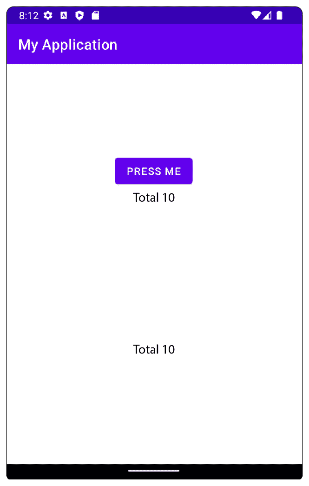
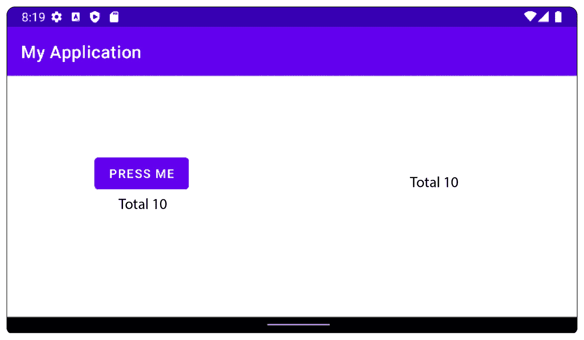
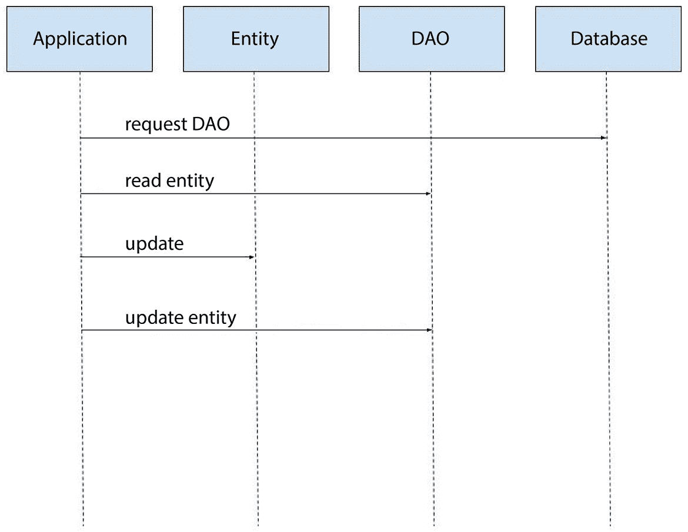
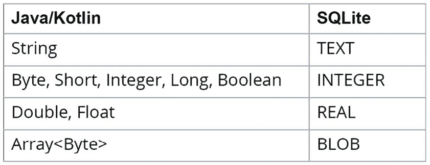
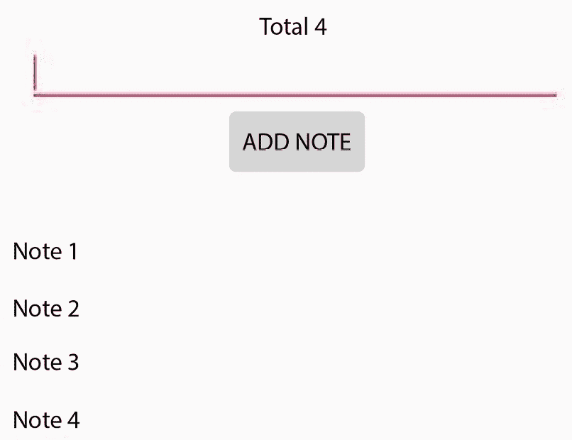

# 11

# Android 架构组件

在本章中，你将了解 Android Jetpack 库的关键组件以及它们为标准 Android 框架带来的好处。你还将学习如何借助 Jetpack 组件来组织你的代码，并为你的类分配不同的职责。最后，你将提高你代码的测试覆盖率。

到本章结束时，你将能够轻松地创建处理活动和片段生命周期的应用程序。你还将了解更多关于如何在 Android 设备上使用 Room 持久化数据以及如何使用 ViewModels 将你的逻辑与视图分离。

在前面的章节中，你学习了如何编写单元测试。问题是：你可以对什么进行单元测试？你能否对活动和片段进行单元测试？由于它们构建的方式，在你的机器上对活动和片段进行单元测试是困难的。如果你能将代码从活动和片段中移除，测试将会更容易。

此外，考虑一下你正在构建一个支持不同方向（如横屏和竖屏）和多种语言的应用程序的情况。在这些场景中，默认情况下，当用户旋转屏幕时，活动和片段会为新的显示方向重新创建。

现在，假设这种情况发生在你的应用程序正在处理数据的过程中。你必须跟踪你正在处理的数据，跟踪用户如何与你的屏幕进行交互，并避免造成上下文泄露。

注意

当你的已销毁活动因为被具有更长生命周期的组件（例如当前正在处理你的数据的线程）引用而无法被垃圾回收时，就会发生**上下文泄露**。

在本章中，我们将涵盖以下主题：

+   ViewModel

+   数据流

+   Room

# 技术要求

本章中所有练习和活动的完整代码可在 GitHub 上找到，链接为 [`packt.link/89BCi`](https://packt.link/89BCi)

# Android 组件背景

在许多情况下，你必须使用 `onSaveInstanceState` 来保存你的活动/片段的当前状态，然后在 `onCreate` 或 `onRestoreInstanceState` 中恢复你的活动/片段的状态。这增加了你代码的复杂性，并使其变得重复，尤其是如果处理代码是活动或片段的一部分。

这些场景正是 `ViewModel` 和 `LiveData` 发挥作用的地方。`ViewModels` 是为了在生命周期变化时持有数据而构建的组件。它们还从视图中分离逻辑，这使得它们非常容易进行单元测试。`LiveData` 是一个用于持有数据并在变化发生时考虑到其生命周期的组件。

用更简单的话来说，片段只处理视图，`ViewModel` 执行繁重的工作，而 `LiveData` 负责将结果传递给片段，但仅当片段存在且准备就绪时。

如果你曾经使用过 WhatsApp 或类似的即时通讯应用，并且你已经关闭了互联网，你会注意到你仍然可以使用该应用。这是因为消息通常存储在你的设备上的本地数据库文件 `SQLite` 中。

Android 框架已经允许你为你的应用程序使用这个功能。然而，这需要大量的样板代码来读取和写入数据。每次你想与本地存储交互时，你必须编写一个 SQL 查询。当你读取 SQLite 数据时，你必须将其转换为 Java/Kotlin 对象。

所有这些都需要大量的代码、时间和单元测试。如果有人处理 SQLite 连接，而你只需专注于代码部分会怎样？这就是 **Room** 发挥作用的地方。这是一个在 SQLite 上包装的库。你所需要做的就是定义你的数据应该如何保存，然后让库处理其余部分。

假设你想要你的活动知道何时有互联网连接，何时互联网断开。你可以使用 `BroadcastReceiver` 来实现这一点。这个问题的一个小问题是，每次你在活动中注册 `BroadcastReceiver` 时，你必须在其被销毁时注销它。

你可以使用 `Lifecycle` 来观察你活动的状态，从而允许你的接收器在所需状态下注册，并在互补状态下注销（例如，`RESUMED-PAUSED`、`STARTED-STOPPED` 或 `CREATED-DESTROYED`）。

`ViewModels`、`LiveData` 和 `Room` 都是 Android 架构组件的一部分，它们是 Android Jetpack 库的一部分。架构组件旨在帮助开发者构建代码结构，编写可测试的组件，并帮助减少样板代码。

其他架构组件包括 `Databinding`（它将视图与模型或 `ViewModels` 绑定，允许直接在视图中设置数据），`WorkManager`（它允许开发者轻松处理后台工作），`Navigation`（它允许开发者创建视觉导航图并指定活动与片段之间的关系），以及 `Paging`（它允许开发者加载分页数据，这在需要无限滚动的情况下很有帮助）。

# ViewModel

`ViewModel` 组件负责保存和处理用户界面（**UI**）所需的数据。它有一个好处，即它能够在片段和活动被销毁和重新创建的配置更改中存活下来，这使得它能够保留数据，然后可以用来重新填充 UI。

当活动或片段被销毁而没有被重新创建，或者当应用程序进程被终止时，它最终会被销毁。这允许`ViewModel`履行其职责，并在不再需要时进行垃圾回收。`ViewModel`唯一的方法是`onCleared()`方法，当`ViewModel`终止时会被调用。你可以重写这个方法来终止正在进行的任务和释放不再需要的资源。

将数据处理从活动迁移到`ViewModel`有助于创建更好、更快的单元测试。测试活动需要在一个设备上执行 Android 测试。活动也有状态，这意味着你的测试应该将活动置于适当的状态，以便断言能够工作。`ViewModel`可以在你的开发机器上本地进行单元测试，并且可以是无状态的，这意味着你可以单独测试数据处理逻辑。

`ViewModel`最重要的特性之一是它允许片段之间的通信。要在没有`ViewModel`的情况下在片段之间进行通信，你必须让你的片段与活动通信，然后活动会调用你想要通信的片段。

要使用`ViewModel`实现这一点，你只需将其附加到父活动，并在你想要通信的片段中使用相同的`ViewModel`。这将减少之前所需的样板代码。

在下面的图中，你可以看到`ViewModel`可以在活动生命周期的任何时刻被创建（在实践中，它们通常在`onCreate`中初始化，对于活动而言，以及`onCreateView`或`onViewCreated`对于片段而言，因为这些代表了视图被创建并准备好更新的点），一旦创建，它将和活动一样长时间存在：



图 11.1 – 活动生命周期与 ViewModel 生命周期的比较

在前面的图中，我们可以看到`Activity`的生命周期与`ViewModel`的生命周期是如何比较的。红色线条表示当`Activity`被重新创建时发生的情况，从`onPause`方法开始，以`onDestroy`结束，然后在新实例的`Activity`中从`onCreate`到`onResume`。

下面的图显示了`ViewModel`如何连接到一个片段：



图 11.2 – Fragment 生命周期与 ViewModel 生命周期的比较

在前面的图中，我们可以看到`Fragment`的生命周期与`ViewModel`的生命周期是如何比较的。红色线条表示当`Fragment`被重新创建时发生的情况，从`onPause`方法开始，以`onDetach`结束，然后在新实例的`Fragment`中从`onAttach`到`onResume`。

在本节中，我们学习了什么是 ViewModel 以及它提供的与测试和执行逻辑相关的优势，这些逻辑可以在活动或片段重建后继续存在。

## 练习 11.01 – 共享 ViewModel

你被分配了一个任务，要构建一个应用，当在纵向模式时屏幕垂直分割成两部分，在横向模式时水平分割。第一部分包含一些文本，下面是一个按钮。

第二部分只包含文本。当屏幕打开时，两部分的文本都显示 **Total: 0**。当点击按钮时，文本将变为 **Total: 1**。再次点击，文本将变为 **Total: 2**，依此类推。当设备旋转时，将显示最后总和的新方向。

为了解决这个任务，我们将定义以下内容：

+   一个将包含两个片段的活动 - 一个用于纵向，另一个用于横向：

+   一个包含 `TextView` 和按钮的一个布局的片段：

+   一个包含 `TextView` 的一个布局的片段：

+   一个将在两个片段之间共享的 `ViewModel`：

让我们先设置我们的配置：

1.  在 Android Studio 中创建一个新的项目，并添加一个名为 `SplitActivity` 的空活动。

1.  让我们将 `ViewModel` 库添加到 `app/build.gradle`:

    ```swift
        implementation "androidx.lifecycle:
        lifecycle-viewmodel-ktx:2.5.1"
    ```

1.  将以下字符串添加到 `values/strings.xml`：

    ```swift
        <string name="press_me">Press Me</string>
        <string name="total">Total %d</string>
    ```

1.  创建并定义 `SplitFragmentOne`:

    ```swift
    class SplitFragmentOne : Fragment() {
        override fun onCreateView(
            inflater: LayoutInflater,
            container: ViewGroup?,
            savedInstanceState: Bundle?
        ): View? {
            return inflater.inflate(
            R.layout.fragment_split_one, container, false)
        }
        override fun onViewCreated(view: View,
            savedInstanceState: Bundle?) {
            super.onViewCreated(view, savedInstanceState)
            view.findViewById<TextView>
                (R.id.fragment_split_one_text_view)
                    .text = getString(R.string.total, 0)
        }
    }
    ```

1.  将 `fragment_split_one.xml` 文件添加到 `res/layout` 文件夹：

    ```swift
    <?xml version="1.0" encoding="utf-8"?>
    <LinearLayout xmlns:android=
        "http://schemas.android.com/apk/res/android"
        android:layout_width="match_parent"
        android:layout_height="match_parent"
        android:gravity="center"
        android:orientation="vertical">
        <TextView
            android:id="@+id/fragment_split_one_text_view"
            android:layout_width="wrap_content"
            android:layout_height="wrap_content" />
        <Button
            android:id="@+id/fragment_split_one_button"
            android:layout_width="wrap_content"
            android:layout_height="wrap_content"
            android:text="@string/press_me" />
    </LinearLayout>
    ```

1.  现在，让我们创建并定义 `SplitFragmentTwo`：

    ```swift
    class SplitFragmentTwo : Fragment() {
        override fun onCreateView(
            inflater: LayoutInflater,
            container: ViewGroup?,
            savedInstanceState: Bundle?
        ): View? {
            Return inflater.inflate(
            R.layout.fragment_split_two, container, false)
        }
        override fun onViewCreated(view: View,
            savedInstanceState: Bundle?) {
            super.onViewCreated(view, savedInstanceState)
            view.findViewById<TextView> (
            R.id.fragment_split_two_text_view).text =
            getString(R.string.total, 0)
        }
    }
    ```

1.  将 `fragment_split_two.xml` 文件添加到 `res/layout` 文件夹：

    ```swift
    <?xml version="1.0" encoding="utf-8"?>
    <LinearLayout xmlns:android =
        "http://schemas.android.com/apk/res/android"
        android:layout_width="match_parent"
        android:layout_height="match_parent"
        android:gravity="center"
        android:orientation="vertical">
        <TextView
            android:id="@+id/fragment_split_two_text_view"
            android:layout_width="wrap_content"
            android:layout_height="wrap_content" />
    </LinearLayout>
    ```

1.  定义 `SplitActivity`:

    ```swift
    class SplitActivity : AppCompatActivity() {
        override fun onCreate(savedInstanceState: Bundle?)
        {
            super.onCreate(savedInstanceState)
            setContentView(R.layout.activity_split)
        }
    }
    ```

1.  在 `res/layout` 文件夹中创建 `activity_split.xml` 文件：

    ```swift
    <?xml version="1.0" encoding="utf-8"?>
    <LinearLayout>
        <androidx.fragment.app.FragmentContainerView
            android:id="@+id/activity_fragment_split_1"
            android:name="{package.path}.SplitFragmentOne"
            android:layout_width="match_parent"
            />
        <androidx.fragment.app.FragmentContainerView
            android:id="@+id/activity_fragment_split_2"
            android:name="{package.path}.SplitFragmentTwo"
            android:layout_width="match_parent"
            />
    </LinearLayout>
    ```

本步骤的完整代码可以在 [`packt.link/HPy9p`](https://packt.link/HPy9p) 找到。

将 `{package.path}` 替换为你片段所在的包名。

1.  接下来，让我们在 `res` 文件夹中创建一个 `layout-land` 文件夹。然后，在 `layout-land` 文件夹中，我们将创建一个具有以下布局的 `activity_split.xml` 文件：

    ```swift
    <?xml version="1.0" encoding="utf-8"?>
    <LinearLayout>
        <androidx.fragment.app.FragmentContainerView
            android:id="@+id/activity_fragment_split_1"
            android:name="{package.path}.SplitFragmentOne"
            />
        <androidx.fragment.app.FragmentContainerView
            android:id="@+id/activity_fragment_split_2"
            android:name="{package.path}.SplitFragmentTwo"
            />
    </LinearLayout>
    ```

本步骤的完整代码可以在 [`packt.link/1zRQa`](https://packt.link/1zRQa) 找到。

将 `{package.path}` 替换为你片段所在的包名。注意两个 `activity_split.xml` 文件中的相同 `android:id` 属性。这允许操作系统在旋转期间正确保存和恢复片段的状态。

1.  在根包的 `main/java` 文件夹中，创建一个类似于以下的 `TotalsViewModel`:

    ```swift
    class TotalsViewModel : ViewModel() {
        var total = 0
        fun increaseTotal(): Int {
            total++
            return total
        }
    }
    ```

注意我们扩展了 `ViewModel` 类，它是生命周期库的一部分。在 `ViewModel` 类中，我们定义了一个方法，该方法增加总值并返回更新后的值。

1.  现在，将 `updateText` 和 `prepareViewModel` 方法添加到 `SplitFragment1` 片段中：

    ```swift
    class SplitFragmentOne : Fragment() {
        …
        override fun onViewCreated(view: View,
        savedInstanceState: Bundle?) {
            …
            prepareViewModel()
        }
        private fun prepareViewModel() {
    }
        private fun updateText(total: Int) {
            view?.findViewById<TextView>
            (R.id.fragment_split_one_text_view)?.text =
            getString(R.string.total, total)
        }
    }
    ```

1.  在 `prepareViewModel()` 函数中，让我们开始添加我们的 `ViewModel`:

    ```swift
    private fun prepareViewModel() {
        val totalsViewModel = ViewModelProvider(this)
            .get(TotalsViewModel::class.java)
    }
    ```

这是如何访问 `ViewModel` 实例的方式。`ViewModelProvider(this)` 将 `TotalsViewModel` 绑定到片段的生命周期。`.get(TotalsViewModel::class.java)` 将检索我们之前定义的 `TotalsViewModel` 实例。

如果片段是第一次被创建，它将产生一个新的实例，而如果片段在旋转后重新创建，它将提供之前创建的实例。我们传递类作为参数，因为片段或活动可以有多个 `ViewModel`，而这个类作为我们想要 `ViewModel` 类型的标识符。

1.  现在，在视图中设置最后已知值：

    ```swift
    private fun prepareViewModel() {
        val totalsViewModel = ViewModelProvider(this)
            .get(TotalsViewModel::class.java)
        updateText(totalsViewModel.total)
    }
    ```

第二行将在设备旋转时有所帮助。它将设置最后计算的总数。如果我们删除这一行并重新构建，那么我们将看到 `1`。

1.  当点击 `fragment_split_one_button` 按钮时更新视图：

    ```swift
    private fun prepareViewModel() {
        val totalsViewModel =
            ViewModelProvider(this)
                .get(TotalsViewModel::class.java)
        updateText(totalsViewModel.total)
        view?.findViewById<Button>
        (R.id.fragment_split_one_button)
        ?.setOnClickListener {
            updateText(totalsViewModel.increaseTotal())
        }
    }
    ```

最后几行表明，当按钮被点击时，我们告诉 `ViewModel` 重新计算总数并设置新值。

1.  将我们之前使用的相同 `ViewModel` 添加到 `SplitFragmentTwo`：

    ```swift
    class SplitFragmentTwo : Fragment() {
        override fun onCreateView(
            inflater: LayoutInflater,
            container: ViewGroup?,
            savedInstanceState: Bundle?
        ): View? {
            return inflater.inflate(
            R.layout.fragment_split_two, container, false)
        }
        override fun onViewCreated(view: View,
        savedInstanceState: Bundle?) {
            super.onViewCreated(view, savedInstanceState)
            val totalsViewModel = ViewModelProvider(this)
                .get(TotalsViewModel::class.java)
            updateText(totalsViewModel.total)
        }
        private fun updateText(total: Int) {
            view?.findViewById<TextView> (
            R.id. fragment_split_two_text_view)?.text =
            getString(R.string.total, total)
        }
    }
    ```

如果我们现在运行应用程序，我们将看到没有任何变化。第一个片段仍然按预期工作，但第二个片段没有收到任何更新。这是因为尽管我们定义了一个 `ViewModel`，但我们为每个片段都有两个该 `ViewModel` 的实例。

我们需要将实例数量限制为每个片段一个。我们可以通过使用名为 `requireActivity` 的方法将我们的 `ViewModel` 附着到 `SplitActivity` 生命周期来实现这一点。

1.  让我们修改我们的片段。在两个片段中，我们需要找到并更改以下代码：

    ```swift
    val totalsViewModel = ViewModelProvider(this).get(TotalsViewModel::class.java)
    ```

我们将把它改为以下内容：

```swift
val totalsViewModel = ViewModelProvider(requireActivity()) .get(TotalsViewModel::class.java)
```

注意

使用 `ViewModel` 在片段之间进行通信仅在片段放置在同一个活动时才会工作。

如果我们运行应用程序，我们应该看到以下内容：



图 11.3 – 练习 11.01 的输出

当按钮被点击时，总更新显示在屏幕的上半部分，但不在下半部分。如果我们旋转屏幕，`ViewModel` 最后的值也会设置在第二个屏幕上。这意味着我们的应用程序没有正确地响应 `ViewModel` 的变化。

这意味着我们需要一个发布者-订阅者方法来监控我们数据中发生的变化。在下一节中，我们将查看一些 `ViewModel` 可以用来通知数据变化的常见数据流。

在这个练习中，我们实现了一个 `ViewModel`，它负责增加一个将在屏幕上显示的整数值。在接下来的部分，我们将连接数据流以在数值增加时做出反应。

# 数据流

在数据可观察性方面，我们有多种实现方法，无论是手动构建的机制、Java 语言的组件、第三方组件，还是最终为 Android 开发的特定解决方案。在 Android 方面，一些最常用的解决方案是 `LiveData`、协程组件中的 Flows 以及 RxJava。

我们首先将探讨的是 `LiveData`，因为它属于 Android 架构组件的一部分，这意味着它是专门针对 Android 定制的。然后我们将探讨如何使用其他类型的数据流，这些内容将在未来的章节中更深入地介绍。

## LiveData

`LiveData` 是一个生命周期感知组件，允许更新您的 UI，但仅当 UI 处于活动状态时（例如，如果活动或片段处于 `STARTED` 或 `RESUMED` 状态之一）。要监控 `LiveData` 的变化，您需要一个与 `LifecycleOwner` 结合的观察者。当活动设置为活动状态时，当发生变化时，观察者将被通知。

如果活动被重新创建，那么观察者将被销毁，并将重新附加一个新的观察者。一旦发生这种情况，`LiveData` 的最后一个值将被发出，以便我们可以恢复状态。活动和片段是 `LifecycleOwner`，但片段有一个单独的 `LifecycleOwner` 用于视图状态。片段由于在 `BackStack` 中的行为而具有这个特定的 `LifecycleOwner`。

当在回退栈中替换片段时，它们不会被完全销毁；只有它们的视图会被销毁。开发者常用的触发处理逻辑的一些常见回调包括 `onViewCreated()`、`onActivityResumed()` 和 `onCreateView()`。如果我们在这类方法中注册 `LiveData` 的观察者，我们可能会遇到每次我们的片段返回屏幕时都会创建多个观察者的情况。

当更新 `LiveData` 模型时，我们面临两种选择：`setValue()` 和 `postValue()`。`setValue()` 会立即传递结果，并且只应在 UI 线程上调用。另一方面，`postValue()` 可以在任何线程上调用。当调用 `postValue()` 时，`LiveData` 将在 UI 线程空闲时安排更新值。

在 `LiveData` 类中，这些方法是受保护的，这意味着存在允许我们更改数据的子类。`MutableLiveData` 使这些方法公开，这为我们提供了在大多数情况下观察数据的一个简单解决方案。`MediatorLiveData` 是 `LiveData` 的一个特殊实现，它允许我们将多个 `LiveData` 对象合并为一个（这在我们的数据保存在不同的存储库中，我们希望显示一个组合结果的情况下非常有用）。

`TransformLiveData` 是另一种专用实现，它允许我们将一个对象转换成另一个对象（这在我们从某个存储库获取数据并希望从依赖于先前数据的另一个存储库请求数据的情况下很有帮助，以及在我们想要对存储库的结果应用额外逻辑的情况下）。

注意事项

在`ViewModel`中使用`LiveData`是一种常见做法。当发生配置更改时，在片段或活动中持有`LiveData`会导致数据丢失。

以下图表展示了 `LiveData` 如何与 `LifecycleOwner` 的生命周期相连接：



图 11.4 – LiveData 与 LifecycleOwner 之间的关系

注意事项

我们可以为 `LiveData` 注册多个观察者，并且每个观察者可以注册到不同的 `LifecycleOwner`。在这种情况下，`LiveData` 将变为非活动状态，但仅当所有观察者都处于非活动状态时。

在本节中，我们探讨了`LiveData`组件的工作原理以及它为观察活动（activities）和片段（fragments）的生命周期提供的好处。在下一节中，我们将探讨一个使用`LiveData`的练习。

### 练习 11.02 – 使用 LiveData 进行观察

修改 *练习 11.01 – 共享 ViewModel*，以便当按钮被点击时，两个片段都将更新为点击的总数。

执行以下步骤以实现此功能：

1.  将 `LiveData` 库添加到 `app/build.gradle` 文件中：

    ```swift
    implementation "androidx.lifecycle:
    lifecycle-livedata-ktx:2.5.1"
    ```

1.  `TotalsViewModel` 应该被修改以支持 `LiveData`：

    ```swift
    class TotalsViewModel : ViewModel() {
        private val _total = MutableLiveData<Int>()
        val total: LiveData<Int> = _total
        init {
            _total.postValue(0)
        }
        fun increaseTotal() {
            _total.postValue((_total.value ?: 0) + 1)
        }
    }
    ```

在这里，我们创建了`MutableLiveData`，它是`LiveData`的一个子类，允许我们更改数据的值。当创建`ViewModel`时，我们将其默认值设置为`0`，然后当我们增加总数时，我们发布前一个值加`1`。

我们对总和进行重复表示的原因是我们希望将可变的部分保留为类的私有属性，同时将不可变的总和暴露给其他对象进行观察。

1.  现在，我们需要修改我们的片段，以便它们适应新的`ViewModel`。对于`SplitFragmentOne`，我们进行以下操作：

    ```swift
        override fun onViewCreated(view: View,
        savedInstanceState: Bundle?) {
            super.onViewCreated(view, savedInstanceState)
                val totalsViewModel =
                 ViewModelProvider(requireActivity())
                     .get(TotalsViewModel::class.java)
            totalsViewModel.total.observe(
            viewLifecycleOwner, {
                updateText(it)
            })
            view.findViewById<Button>(
            R.id.fragment_split_one_button)
            .setOnClickListener {
                totalsViewModel.increaseTotal()
            }
        }
    ```

1.  对于`SplitFragmentTwo`，我们执行以下操作：

    ```swift
        override fun onViewCreated(view: View,
            savedInstanceState: Bundle?) {
            super.onViewCreated(view, savedInstanceState)
            val totalsViewModel =
                ViewModelProvider(requireActivity())
                    .get(TotalsViewModel::class.java)
            totalsViewModel.total.observe(
            viewLifecycleOwner, {
                updateText(it)
            })
        }
    ```

如果我们查看以下行：`totalsViewModel.getTotal().observe(view **LifecycleOwner**, { updateText(it)})`，`observe` 方法的 `LifecycleOwner` 参数被命名为 `viewLifecycleOwner`。这是从 `fragment` 类继承而来的，当我们观察数据而片段管理的视图正在渲染时，这很有帮助。在我们的例子中，将 `viewLifecycleOwner` 与 `this` 交换并不会造成影响。

但如果我们的片段是回退栈功能的一部分，那么就有创建多个观察者的风险，这会导致对于相同的数据集被多次通知。

1.  现在，让我们为我们的新`ViewModel`编写一个测试。我们将命名为`TotalsViewModelTest`并将其放置在`test`包中，而不是`androidTest`。这是因为我们希望这个测试在我们的工作站上执行，而不是在设备上：

    ```swift
    class TotalsViewModelTest {
        private lateinit var totalsViewModel:
            TotalsViewModel
        @Before
        fun setUp() {
            totalsViewModel = TotalsViewModel()
            assertEquals(0, totalsViewModel.total.value)
        }
        @Test
        fun increaseTotal() {
            val total = 5
            for (i in 0 until total) {
                totalsViewModel.increaseTotal()
            }
            assertEquals(4, totalsViewModel.total.value)
        }
    }
    ```

1.  在前面的测试中，在测试开始之前，我们断言`LiveData`的初始值被设置为`0`。然后，我们编写一个小测试，其中我们将总数增加五次，并断言最终值为`5`。让我们运行测试并看看会发生什么：

    ```swift
    java.lang.RuntimeException: Method getMainLooper in
    android.os.Looper not mocked.
    ```

1.  将会显示与前面类似的消息。这是因为`LiveData`的实现方式。内部，它使用 Handlers 和 Loopers，这是 Android 框架的一部分，从而阻止我们执行测试。幸运的是，有一个解决办法。我们需要在我们的测试的 Gradle 文件中添加以下配置：

    ```swift
    testImplementation "androidx.arch.core:
    core-testing:2.1.0"
    ```

1.  这将向我们的测试代码中添加一个测试库，而不是应用代码。现在，让我们在我们的代码中`ViewModel`类的实例化之上添加以下行：

    ```swift
    class TotalsViewModelTest {
        @get:Rule
        val rule = InstantTaskExecutorRule()
        private val totalsViewModel = TotalsViewModel()
    ```

我们添加了一个`TestRule`，它表示每次`LiveData`的值发生变化时，它将立即进行更改，并避免使用 Android 框架组件。

在这个类中我们编写的每个测试都将受到这个规则的影响，从而给我们提供了在每种新的测试方法中玩转`LiveData`类的自由。如果我们再次运行测试，我们会看到以下内容：

```swift
java.lang.RuntimeException: Method getMainLooper in
android.os.Looper not mocked
```

1.  这是否意味着我们的新规则不起作用？并不完全是这样。如果你查看你的`TotalsViewModels`类，你会看到以下内容：

    ```swift
    init {
             total.postValue(0)
    }
    ```

1.  这意味着由于我们在规则的作用域之外创建了`ViewModel`类，因此规则不会适用。我们可以做两件事来避免这种情况：我们可以更改我们的代码以处理我们首次订阅`LiveData`类时发送的空值，或者我们可以调整我们的测试，以便将`ViewModel`类放在规则的作用域内。让我们选择第二种方法，并更改我们在测试中创建`ViewModel`类的方式。它应该看起来像这样：

    ```swift
    @get:Rule
    val rule = InstantTaskExecutorRule()
    private lateinit var totalsViewModel: TotalsViewModel
    @Before
    fun setUp() {
        totalsViewModel = TotalsViewModel()
        assertEquals(0, totalsViewModel.total.value)
    }
    ```

1.  让我们再次运行测试并看看会发生什么：

    ```swift
    java.lang.AssertionError:
    Expected :4
    Actual :5
    ```

看看你是否能找到测试中的错误，修复它，然后重新运行：



图 11.5 – Exercise 11.02 的输出

横屏模式下的相同输出将如下所示：



图 11.6 – 横屏模式下 Exercise 11.02 的输出

通过查看前面的示例，我们可以看到使用`LiveData`和`ViewModel`方法的组合是如何帮助我们解决我们的问题，同时考虑到 Android 操作系统的特定性：

+   `ViewModel`：这帮助我们跨设备方向变化保持数据，并解决了片段间通信的问题

+   `LiveData`：这有助于我们在考虑片段的生命周期时检索我们处理的最最新信息。

+   这两种方法的结合使我们能够有效地委托我们的处理逻辑，从而允许我们对这种处理逻辑进行单元测试。

## 其他数据流

最近流行起来的一种数据流类型是协程和流的用法，主要因为它们在 Android 中的异步操作方法。以下是一个在 `ViewModel` 中发出数据的流的示例：

```swift
class TotalsViewModel : ViewModel() {
    private val _total = MutableStateFlow(0)
    val total: StateFlow<Int> = _total
    fun increaseTotal() {
        _total.value = _total.value + 1
    }
}
```

在前面的代码片段中，我们有公共和私有使用的两个总声明。我们不是使用 `LiveData`，而是使用 `StateFlow`，它将在我们订阅时发出当前值和所有后续的新值。因为它会发出最后一个值，所以我们必须在初始化时始终设置一个初始值。如果我们想订阅总值的更改，我们可以使用以下方法：

```swift
        val totalsViewModel =
            ViewModelProvider(requireActivity())
                .get(TotalsViewModel::class.java)
        viewLifecycleOwner.lifecycleScope.launch {
            repeatOnLifecycle(Lifecycle.State.CREATED) {
                totalsViewModel.total.collect {
                    updateText(it)
                }
            }
        }
```

在前面的代码片段中，每次 `viewLifecycleOwner` 进入 `CREATED` 阶段时，都会订阅 `StateFlow`。这将 `StateFlow` 与 `Fragment` 的生命周期连接起来，以防止任何可能的泄漏。我们将在未来的章节中探讨流和协程的机制。

另一个数据流的例子是 RxJava 库，它代表了另一种发出数据的方式。该库最适合执行异步工作和转换，因为它基于 Java 而不是 Android 操作系统，所以它缺乏任何生命周期感知。例如，将 RxJava 与 ViewModels 结合使用看起来如下所示：

```swift
class TotalsViewModel : ViewModel() {
    private val _total = BehaviorSubject.createDefault(0)
    val total: Observable<Int> = _total
    fun increaseTotal() {
        _total.onNext(_total.blockingLast())
    }
}
```

在这里，我们使用 `BehaviorSubject` 来替换 `StateFlow`。`BehaviorSubject` 与状态流具有相同的属性。它将保留最新的值，并在组件订阅时以及订阅后的所有新值时发出。订阅对象看起来如下所示：

```swift
    private var disposable: Disposable? = null
    override fun onViewCreated(view: View,
    savedInstanceState: Bundle?) {
        super.onViewCreated(view, savedInstanceState)
        val totalsViewModel =
            ViewModelProvider(requireActivity())
                .get(TotalsViewModel::class.java)
        disposable = totalsViewModel.total.subscribe {
            updateText(it)
        }
    }
    override fun onDestroyView() {
        disposable?.dispose()
        super.onDestroyView()
    }
```

在这里，我们在 `onViewCreated` 中使用 Disposable 来保持订阅。在 `onDestroyView` 中，我们销毁订阅以防止任何上下文泄漏。这是使用如 `LiveData` 和 `StateFlow` 这样的生命周期感知组件的替代方案。

在本节中，我们探讨了 Android 应用程序中可能存在的其他类型的数据流，如 Kotlin 流和 RxJava，并分析了它们的特性。在下一节中，我们将探讨如何使用 Room 库持久化数据。

# Room

房间持久化库在您的应用程序代码和 SQLite 存储之间充当包装器。您可以将 SQLite 视为一个无需自己的服务器即可运行的数据库，并将所有应用程序数据保存到仅对应用程序可访问的内部文件中（如果设备未越狱）。

Room 位于应用程序代码和 SQLite Android 框架之间，处理必要的**创建**、**读取**、**更新**和**删除**（**CRUD**）操作，同时提供了一个抽象，应用程序可以使用它来定义数据和如何处理数据。这种抽象以以下对象的形式出现：

+   **实体（Entities）**：你可以指定你想要如何存储数据以及数据之间的关系

+   **数据访问对象（Data access object，DAO）**：可以在你的数据上执行的操作

+   **数据库**：你可以指定数据库应具有的配置（数据库的名称和迁移场景）

这些可以在以下图中看到：



图 11.7 – 应用程序与 Room 组件之间的关系

在前面的图中，我们可以看到 Room 组件之间的交互方式。通过一个例子来可视化这一点会更简单。假设你想制作一个消息应用，并将每条消息存储在本地存储中。在这种情况下，`Entity`将是一个`Message`对象，它将有一个 ID，并包含消息的内容、发送者、时间、状态等。

为了从本地存储中访问消息，你需要`MessageDao`，它将包含`insertMessage()`、`getMessagesFromUser()`、`deleteMessage()`和`updateMessage()`等方法。此外，由于这是一个消息应用，你还需要一个`Contact`实体来存储消息的发送者和接收者的信息。

`Contact`实体将包含诸如姓名、最后在线时间、电话号码、电子邮件等信息。为了访问联系信息，你需要一个`ContactDao`接口，它将包含`createUser()`、`updateUser()`、`deleteUser()`和`getAllUsers()`。这两个实体将在 SQLite 中创建一个匹配的表，该表包含我们在实体类内部定义的字段作为列。为了实现这一点，我们需要创建`MessagingDatabase`，在其中我们将引用这两个实体。

在没有 Room 或类似 DAO 库的世界中，我们需要使用 Android 框架的 SQLite 组件。这通常涉及到在设置数据库时编写代码，例如创建表的查询，以及为每个我们将拥有的表应用类似的查询。每次我们查询表以获取数据时，我们都需要将结果对象转换为 Java 或 Kotlin 对象。

默认情况下，Room 不允许在 UI 线程上进行任何操作，以强制执行与输入输出操作相关的 Android 标准。为了异步调用以访问数据，Room 与许多库和框架兼容，例如 Kotlin 协程、RxJava 和`LiveData`，在其默认定义之上。

现在我们应该对 Room 的工作原理及其主要组件有一个概述。接下来，我们将逐一查看这些组件以及我们如何使用它们进行数据持久化。

## 实体

实体有两个用途：定义表的结构并存储表行中的数据。让我们以我们的消息应用场景为例，定义两个实体：一个用于用户，一个用于消息。

`User` 实体将包含有关谁发送了消息的信息，而 `Message` 实体将包含有关消息内容、发送时间和消息发送者的引用。以下代码片段提供了一个使用 Room 定义实体的示例：

```swift
@Entity(tableName = "messages")
data class Message(
    @PrimaryKey(autoGenerate = true) @ColumnInfo(name =
        "message_id") val id: Long,
    @ColumnInfo(name = "text", defaultValue = "") val text:
        String,
    @ColumnInfo(name = "time") val time: Long,
    @ColumnInfo(name = "user") val userId: Long,
)
@Entity(tableName = "users")
data class User(
    @PrimaryKey @ColumnInfo(name = "user_id") val id: Long,
    @ColumnInfo(name = "first_name") val firstName: String,
    @ColumnInfo(name = "last_name") val lastName: String,
    @ColumnInfo(name = "last_online") val lastOnline: Long
)
```

如您所见，实体只是带有注解的数据类，这些注解将告诉 Room 如何在 SQLite 中构建表。我们使用的注解如下：

+   `@Entity` 注解定义了表。默认情况下，表名将是类的名称。我们可以通过 `Entity` 注解中的 `tableName` 方法来更改表名。这在我们需要使代码混淆但希望保持 SQLite 结构一致性的情况下非常有用。

+   `@ColumnInfo` 定义了特定列的配置。最常见的是列名。我们还可以指定默认值、字段的 SQLite 类型以及字段是否应该被索引。

+   `@PrimaryKey` 指示我们的实体中哪部分将使其唯一。每个实体至少应该有一个主键。如果你的主键是整数或长整型，那么我们可以添加 `autogenerate` 字段。这意味着每个插入到 `Primary Key` 字段的实体都将由 SQLite 自动生成。

通常，这是通过递增前一个 ID 来实现的。如果你希望将多个字段定义为主键，那么你可以调整 `@Entity` 注解以适应这种情况，如下所示：

```swift
@Entity(tableName = "messages", primaryKeys = ["id",
"time"])
```

假设我们的消息应用想要发送位置。位置有纬度、经度和名称。我们可以将它们添加到 `Message` 类中，但这会增加类的复杂性。我们可以做的是创建另一个实体并在我们的类中引用其 ID。

这种方法的缺点是，每次我们查询 `Message` 实体时，都会查询 `Location` 实体。Room 通过 `@Embedded` 注解提供了第三种方法。现在，让我们看看更新后的 `Message` 实体：

```swift
@Entity(tableName = "messages")
data class Message(
    @PrimaryKey(autoGenerate = true) @ColumnInfo(name =
        "message_id") val id: Long,
    @ColumnInfo(name = "text", defaultValue = "") val text:
        String,
    @ColumnInfo(name = "time") val time: Long,
    @ColumnInfo(name = "user") val userId: Long,
    @Embedded val location: Location?
)
data class Location(
    @ColumnInfo(name = "lat") val lat: Double,
    @ColumnInfo(name = "long") val log: Double,
    @ColumnInfo(name = "location_name") val name: String
)
```

这段代码向消息表添加了三个列（`lat`、`long` 和 `location_name`）。这使我们能够在保持表的一致性的同时避免拥有大量字段的对象。

如果我们查看我们的实体，我们会看到它们是独立存在的。`Message` 实体有一个 `userId` 字段，但没有任何东西阻止我们添加来自无效用户的消息。这可能导致我们收集没有目的的数据。如果我们想删除特定的用户及其消息，我们必须手动进行。Room 提供了一种使用 `ForeignKey` 定义这种关系的方法：

```swift
@Entity(
    tableName = "messages",
    foreignKeys = [ForeignKey(
        entity = User::class,
        parentColumns = ["user_id"],
        childColumns = ["user"],
        onDelete = ForeignKey.CASCADE
    )]
)
data class Message(
    @PrimaryKey(autoGenerate = true) @ColumnInfo(name =
        "message_id") val id: Long,
    @ColumnInfo(name = "text", defaultValue = "") val text:
        String,
    @ColumnInfo(name = "time") val time: Long,
    @ColumnInfo(name = "user") val userId: Long,
    @Embedded val location: Location?
)
```

在前面的例子中，我们添加了 `foreignKeys` 字段，并为 `User` 实体创建了一个新的 `ForeignKey`，而对于父列，我们在 `User` 类中定义了 `user_id` 字段，对于子列，在 `Message` 类中定义了 `user` 字段。

每次我们向表中添加消息时，`users` 表中都需要有一个 `User` 条目。如果我们尝试删除一个用户，并且该用户的消息仍然存在，那么，默认情况下，这不会工作，因为存在依赖关系。然而，我们可以告诉 Room 执行级联删除，这将删除用户及其相关的消息。

## DAO

如果实体指定了如何定义和保存我们的数据，那么 DAO 指定了如何处理这些数据。DAO 类是一个定义我们的 CRUD 操作的地方。理想情况下，每个实体都应该有一个相应的 DAO，但在某些情况下会发生交叉（通常，这发生在我们必须处理两个表之间的 JOIN 时）。

继续我们之前的例子，让我们为我们的实体构建一些相应的 DAO：

```swift
@Dao
interface MessageDao {
    @Insert(onConflict = OnConflictStrategy.REPLACE)
    fun insertMessages(vararg messages: Message)
    @Update
    fun updateMessages(vararg messages: Message)
    @Delete
    fun deleteMessages(vararg messages: Message)
    @Query("SELECT * FROM messages")
    fun loadAllMessages(): List<Message>
    @Query("SELECT * FROM messages WHERE user=:userId AND
        time>=:time")
    fun loadMessagesFromUserAfterTime(userId: String, time:
        Long): List<Message>
}
@Dao
interface UserDao {
    @Insert(onConflict = OnConflictStrategy.REPLACE)
    fun insertUser(user: User)
    @Update
    fun updateUser(user: User)
    @Delete
    fun deleteUser(user: User)
    @Query("SELECT * FROM users")
    fun loadAllUsers(): List<User>
}
```

在我们的消息的情况下，我们定义了以下函数：插入一个或多个消息，更新一个或多个消息，删除一个或多个消息，以及检索特定时间之前某个用户的全部消息。对于我们的用户，我们可以插入一个用户，更新一个用户，删除一个用户，以及检索所有用户。

如果你查看我们的 `Insert` 方法，你会看到我们定义了在冲突的情况下（当我们尝试插入一个已经存在的 ID 时），它将替换现有的条目。`Update` 字段有类似的配置，但在我们的情况下，我们选择了默认设置。这意味着如果更新无法发生，则不会发生任何操作。

`@Query` 注解与其他所有注解不同。这是我们使用 SQLite 代码来定义我们的读取操作如何工作的地方。`SELECT *` 表示我们想要读取表中每一行的所有数据，这将填充我们所有实体的字段。`WHERE` 子句表示我们想要应用查询的限制。我们也可以定义一个类似的方法：

```swift
@Query("SELECT * FROM messages WHERE user IN (:userIds) AND time>=:time")
fun loadMessagesFromUserAfterTime(userIds: List<String>, time: Long): List<Message>
```

这允许我们过滤来自多个用户的消息。我们可以定义一个新的类如下：

```swift
data class TextWithTime(
    @ColumnInfo(name = "text") val text: String,
    @ColumnInfo(name = "time") val time: Long
)
```

现在，我们可以定义以下查询：

```swift
@Query("SELECT text,time FROM messages")
fun loadTextsAndTimes(): List<TextWithTime>
```

这将允许我们一次提取某些列的信息，而不是整行。

现在，假设你想要将发送者的用户信息添加到每条消息中。在这里，我们需要使用之前使用过的类似方法：

```swift
data class MessageWithUser(
    @Embedded val message: Message,
    @Embedded val user: User
)
```

通过使用新的数据类，我们可以定义以下查询：

```swift
@Query("SELECT * FROM messages INNER JOIN users on users.user_id=messages.user")
fun loadMessagesAndUsers(): List<MessageWithUser>
```

现在我们有了我们想要显示的每条消息的用户信息。这在诸如群聊等场景中很有用，在这些场景中，我们应该显示每条消息的发送者姓名。

## 设置数据库

我们迄今为止学到的关于 DAO 和实体的一堆知识。现在，是时候将它们组合在一起了。首先，让我们定义我们的数据库：

```swift
@Database(entities = [User::class, Message::class],
version = 1)
abstract class ChatDatabase : RoomDatabase() {
    companion object {
        private lateinit var chatDatabase: ChatDatabase
        fun getDatabase(applicationContext: Context):
        ChatDatabase {
            if (!(::chatDatabase.isInitialized)) {
                chatDatabase =
                    Room.databaseBuilder(applicationContext
                    , chatDatabase::class.java, "chat-db")
                    .build()
            }
            return chatDatabase
        }
    }
    abstract fun userDao(): UserDao
    abstract fun messageDao(): MessageDao
}
```

在`@Database`注解中，我们指定了数据库中包含哪些实体以及我们的版本。然后，对于每个 DAO，我们在`RoomDatabase`中定义一个抽象方法。这允许构建系统构建我们类的子类，并为这些方法提供实现。构建系统还将创建与我们的实体相关的表。

伴随对象中的`getDatabase`方法说明了我们如何创建`ChatDatabase`类的实例。理想情况下，由于构建新数据库对象涉及到的复杂性，我们的应用程序应该只有一个数据库实例。然而，这可以通过依赖注入框架更好地实现。

假设你已经发布了你的聊天应用程序。你的数据库目前是版本一，但你的用户抱怨消息状态功能缺失。你决定在下一个版本中添加这个功能。这涉及到更改数据库结构，这可能会影响已经构建了结构的数据库。

幸运的是，Room 提供了一个名为迁移的功能。在迁移中，我们可以定义数据库在版本 1 和 2 之间的变化。所以，让我们看看我们的例子：

```swift
data class Message(
    @PrimaryKey(autoGenerate = true) @ColumnInfo(name =
        "message_id") val id: Long,
    @ColumnInfo(name = "text", defaultValue = "") val text:
        String,
    @ColumnInfo(name = "time") val time: Long,
    @ColumnInfo(name = "user") val userId: Long,
    @ColumnInfo(name = "status") val status: Int,
    @Embedded val location: Location?
)
```

在这里，我们向`Message`实体添加了状态标志。现在，让我们看看`ChatDatabase`：

```swift
Database(entities = [User::class, Message::class],
version = 2)
abstract class ChatDatabase : RoomDatabase() {
    companion object {
        private lateinit var chatDatabase: ChatDatabase
        private val MIGRATION_1_2 = object : Migration(1,
        2) {
            override fun migrate(database:
            SupportSQLiteDatabase) {
                database.execSQL("ALTER TABLE messages ADD
                    COLUMN status INTEGER")
            }
        }
        fun getDatabase(applicationContext: Context):
        ChatDatabase {
            if (!(::chatDatabase.isInitialized)) {
                chatDatabase =
                   Room.databaseBuilder(applicationContext,
                   chatDatabase::class.java, "chat-db")
                   .addMigrations(MIGRATION_1_2)
                   .build()
            }
            return chatDatabase
        }
    }
    abstract fun userDao(): UserDao
    abstract fun messageDao(): MessageDao
}
```

在我们的数据库中，我们已经将版本提升到`2`，并在版本`1`和`2`之间添加了迁移。在这里，我们向表中添加了`status`列。当我们构建数据库时，我们将添加这个迁移。

一旦我们发布了新代码，当更新后的应用程序打开并执行构建数据库的代码时，它将比较存储数据的版本与我们类中指定的版本，并发现差异。然后，它将执行指定的迁移，直到达到最新版本。这使我们能够在多年内维护应用程序，而不会影响用户体验。

如果你看看我们的`Message`类，你可能已经注意到我们定义了时间戳为`Long`。在 Java 和 Kotlin 中，我们有`Date`对象，这可能比消息的时间戳更有用。幸运的是，Room 提供了一个名为`TypeConverter`的解决方案。

以下表格显示了我们在代码中可以使用的数据类型以及 SQLite 的等效类型。复杂的数据类型需要通过 TypeConverters 降级到这些级别：



图 11.8 – Kotlin/Java 数据类型与 SQLite 数据类型之间的关系

在这里，我们修改了`lastOnline`字段，使其成为`Date`类型：

```swift
data class User(
    @PrimaryKey @ColumnInfo(name = "user_id") val id: Long,
    @ColumnInfo(name = "first_name") val firstName: String,
    @ColumnInfo(name = "last_name") val lastName: String,
    @ColumnInfo(name = "last_online") val lastOnline: Date
)
```

在这里，我们定义了一些方法，可以将 `Date` 对象转换为 `Long`，反之亦然。`@TypeConverter` 注解帮助 Room 识别转换发生的位置：

```swift
class DateConverter {
    @TypeConverter
    fun from(value: Long?): Date? {
        return value?.let { Date(it) }
    }
    @TypeConverter
    fun to(date: Date?): Long? {
        return date?.time
    }
}
```

最后，我们将使用 `@TypeConverters` 注解将我们的转换器添加到 Room 中：

```swift
@Database(entities = [User::class, Message::class],
version = 2)
@TypeConverters(DateConverter::class)
abstract class ChatDatabase : RoomDatabase() {
```

在下一节中，我们将探讨一些第三方框架。

## 第三方框架

房间（Room）与第三方框架如 `LiveData`、RxJava 和协程（coroutines）配合良好。这解决了两个问题：多线程和观察数据变化。

`LiveData` 将使你的 DAO 中的 `@Query` 注解的方法实现响应式，这意味着如果添加了新数据，`LiveData` 将通知观察者：

```swift
    @Query("SELECT * FROM users")
    fun loadAllUsers(): LiveData<List<User>>
```

Kotlin 协程通过使 `@Insert`、`@Delete` 和 `@Update` 方法异步来补充 `LiveData`：

```swift
    @Insert(onConflict = OnConflictStrategy.REPLACE)
    suspend fun insertUser(user: User)
    @Update
    suspend fun updateUser(user: User)
    @Delete
    suspend fun deleteUser(user: User)
```

`@Query` 方法通过 `Publisher`、`Observable` 或 `Flowable` 等组件实现响应式，并通过 `Completable`、`Single` 或 `Maybe` 使其他方法异步：

```swift
    @Insert(onConflict = OnConflictStrategy.REPLACE)
    fun insertUser(user: User) : Completable
    @Update
    fun updateUser(user: User) : Completable
    @Delete
    fun deleteUser(user: User) : Completable
    @Query("SELECT * FROM users")
    fun loadAllUsers(): Flowable<List<User>>
```

**执行器和线程**是 Java 框架的一部分，如果上述第三方集成都不是你的项目的一部分，它们可以是一个有用的解决方案来解决 Room 的线程问题。

你的 DAO 类不会受到任何修改；然而，你需要访问你的 DAO 的组件进行调整和使用执行器或线程：

```swift
    @Query("SELECT * FROM users")
    fun loadAllUsers(): List<User>
    @Insert(onConflict = OnConflictStrategy.REPLACE)
    fun insertUser(user: User)
    @Update
    fun updateUser(user: User)
    @Delete
    fun deleteUser(user: User)
```

访问 DAO 的一个示例如下：

```swift
    fun getUsers(usersCallback:()->List<User>){
        Thread(Runnable {
            usersCallback.invoke(userDao.loadUsers())
        }).start()
    }
```

以下示例将在每次我们想要检索用户列表时创建一个新的线程并启动它。这段代码有两个主要问题：

+   线程创建是一个昂贵的操作

+   代码难以测试

第一个问题的解决方案是使用 `ThreadPools` 和 `Executors`。Java 框架在提供 `ThreadPools` 方面提供了一套强大的选项。线程池是一个负责线程创建和销毁的组件，允许开发者指定池中的线程数。线程池中的多个线程将确保多个任务可以并发执行。

我们可以将前面的代码重写如下：

```swift
    private val executor:Executor =
        Executors.newSingleThreadExecutor()
    fun getUsers(usersCallback:(List<User>)->Unit){
        executor.execute {
            usersCallback.invoke(userDao.loadUsers())
        }
    }
```

在前面的示例中，我们定义了一个将使用一个线程池的执行器。当我们想要访问用户列表时，我们将查询移动到执行器内部，当数据加载完成后，我们的回调 lambda 将被调用。

## 练习 11.03 – 留出一些空间

你被一家新闻机构雇佣来构建一个新闻应用程序。该应用程序将显示由记者撰写的文章列表。一篇文章可以由一位或多位记者撰写，每位记者可以撰写一篇或多篇文章。每篇文章的数据信息包括文章的标题、内容和日期。

记者的信息包括他们的名字、姓氏和职位。你需要构建一个包含这些信息的 Room 数据库，以便进行测试。在我们开始之前，让我们看看实体之间的关系。在聊天应用程序的示例中，我们定义了一个规则：一个用户可以发送一条或多条消息。

这种关系被称为一对多关系。该关系通过一个实体到另一个实体（用户在消息表中定义，以便与发送者连接）的引用来实现。

在这种情况下，我们有一个多对多关系。为了实现多对多关系，我们需要创建一个包含引用的实体，这些引用将链接其他两个实体。让我们开始吧：

1.  创建一个不带活动的新的 Android 项目。

1.  让我们先向`app/build.gradle`添加注解处理插件。这将读取 Room 使用的注解并生成与数据库交互所需的代码：

    ```swift
    plugins {
        …
        id 'kotlin-kapt'
    }
    ```

1.  接下来，让我们在`app/build.gradle`中添加 Room 库：

    ```swift
    def room_version = "2.2.5"
    implementation "androidx.room:
        room-runtime:$room_version"
    kapt "androidx.room:room-compiler:$room_version"
    ```

第一行定义了库版本，第二行引入了 Java 和 Kotlin 的 Room 库，最后一行是用于 Kotlin 注解处理器的。这允许构建系统从 Room 注解生成样板代码。在修改了你的 Gradle 文件之后，你应该会收到一个提示来同步你的项目，你应该点击它。

1.  让我们在`main/java`文件夹和根包中定义我们的实体：

    ```swift
    @Entity(tableName = "article")
    data class Article(
        @PrimaryKey(autoGenerate = true) @ColumnInfo(
            name = "id") val id: Long = 0,
        @ColumnInfo(name = "title") val title: String,
        @ColumnInfo(name = "content") val content: String,
        @ColumnInfo(name = "time") val time: Long
    )
    @Entity(tableName = "journalist")
    data class Journalist(
        @PrimaryKey(autoGenerate = true) @ColumnInfo(name
            = "id") val id: Long = 0,
        @ColumnInfo(name = "first_name") val firstName:
            String,
        @ColumnInfo(name = "last_name") val lastName:
            String,
        @ColumnInfo(name = "job_title") val jobTitle:
            String
    )
    ```

1.  现在，在`main/java`文件夹和根包中定义连接记者和文章的实体以及适当的约束：

    ```swift
    @Entity(
        tableName = "joined_article_journalist",
        primaryKeys = ["article_id", "journalist_id"],
        foreignKeys = [ForeignKey(
            entity = Article::class,
            parentColumns = arrayOf("id"),
            childColumns = arrayOf("article_id"),
            onDelete = ForeignKey.CASCADE
        ), ForeignKey(
            entity = Journalist::class,
            parentColumns = arrayOf("id"),
            childColumns = arrayOf("journalist_id"),
            onDelete = ForeignKey.CASCADE
        )]
    )
    data class JoinedArticleJournalist(
        @ColumnInfo(name = "article_id") val articleId:
            Long,
        @ColumnInfo(name = "journalist_id") val
            journalistId: Long
    )
    ```

在前面的代码中，我们定义了我们的连接实体。正如你所见，我们没有为唯一性定义 ID，但文章和记者将一起使用时将是唯一的。我们还为我们的实体引用的每个其他实体定义了外键。

1.  在`main/java`文件夹和根包中创建`ArticleDao` DAO：

    ```swift
    @Dao
    interface ArticleDao {
        @Insert(onConflict = OnConflictStrategy.REPLACE)
        fun insertArticle(article: Article)
        @Update
        fun updateArticle(article: Article)
        @Delete
        fun deleteArticle(article: Article)
        @Query("SELECT * FROM article")
        fun loadAllArticles(): List<Article>
        @Query("SELECT * FROM article INNER JOIN
                joined_article_journalist ON
                article.id=joined_article_journalist
                .article_id WHERE
                joined_article_journalist.journalist_id=
                :journalistId")
        fun loadArticlesForAuthor(journalistId: Long):
            List<Article>
    }
    ```

1.  现在，在`main/java`文件夹和根包中创建`JournalistDao`数据访问对象：

    ```swift
    @Dao
    interface JournalistDao {
        @Insert(onConflict = OnConflictStrategy.REPLACE)
        fun insertJournalist(journalist: Journalist)
        @Update
        fun updateJournalist(journalist: Journalist)
        @Delete
        fun deleteJournalist(journalist: Journalist)
        @Query("SELECT * FROM journalist")
        fun loadAllJournalists(): List<Journalist>
        @Query("SELECT * FROM journalist INNER JOIN
                joined_article_journalist ON
                journalist.id=joined_article_journalist
                .journalist_id WHERE
                joined_article_journalist.article_id=
                :articleId")
        fun getAuthorsForArticle(articleId: Long):
            List<Journalist>
    }
    ```

1.  在`main/java`文件夹和根包中创建`JoinedArticleJournalistDao` DAO：

    ```swift
    @Dao
    interface JoinedArticleJournalistDao {
        @Insert(onConflict = OnConflictStrategy.REPLACE)
        fun insertArticleJournalist(
          joinedArticleJournalist: JoinedArticleJournalist
        )
        @Delete
        Fun deleteArticleJournalist(
          joinedArticleJournalist: JoinedArticleJournalist
        )
    }
    ```

让我们稍微分析一下我们的代码。对于文章和记者，我们可以添加、插入、删除和更新查询。对于文章，我们可以提取所有文章，也可以从特定作者那里提取文章。

我们还有提取所有撰写文章的记者的选项。这是通过与我们中间实体的 JOIN 来完成的。对于该实体，我们定义了插入（这将链接一篇文章到一个记者）和删除（这将移除该链接）的选项。

1.  最后，让我们在`main/java`文件夹和根包中定义我们的`Database`类：

    ```swift
    @Database(
        entities = [Article::class, Journalist::class,
            JoinedArticleJournalist::class],
        version = 1
    )
    abstract class NewsDatabase : RoomDatabase() {
        abstract fun articleDao(): ArticleDao
        abstract fun journalistDao(): JournalistDao
        abstract fun joinedArticleJournalistDao():
            JoinedArticleJournalistDao
    }
    ```

我们在这里避免了定义`getInstance`方法，因为我们不会在任何地方调用数据库。但如果我们不这样做，我们怎么知道它是否工作呢？答案是，我们将对其进行测试。这不是将在你的机器上运行的测试，而是一个将在设备上运行的测试。这意味着我们将在`androidTest`文件夹中创建它。

1.  让我们先设置测试数据。在这里，我们将向数据库添加一些文章和记者，然后测试检索、更新和删除条目：

    ```swift
    @RunWith(AndroidJUnit4::class)
    class NewsDatabaseTest {
        @Test
        fun updateArticle() {
            val article = articleDao.loadAllArticles()[0]
            articleDao.updateArticle(article.copy(title = 
                "new title"))
            assertEquals("new title", articleDao.
                loadAllArticles()[0].title)
        }
        @Test
        fun updateJournalist() {
            val journalist = journalistDao.
                loadAllJournalists()[0] journalistDao.
                updateJournalist(journalist.copy(jobTitle = 
                "new job title"))
            assertEquals("new job title", journalistDao.
                loadAllJournalists()[0].jobTitle)
        }
    }
    ```

此步骤的完整代码可以在 [`packt.link/6H8X2`](https://packt.link/6H8X2) 找到。

在这里，我们定义了一些如何测试 Room 数据库的示例。有趣的是我们如何构建数据库。我们的数据库是一个内存数据库。这意味着所有数据都会在测试运行期间保留，并在之后丢弃。

这允许我们为每个新状态从零开始，避免了每个测试会话的后果相互影响。在我们的测试中，我们设置了 5 篇文章和 10 名记者。第一篇文章是由前两名记者撰写的，而第二篇文章是由第一名记者撰写的。

其余的文章没有作者。通过这样做，我们可以测试我们的更新和删除方法。对于删除方法，我们还可以测试我们的外键关系。在测试中，我们可以看到如果我们删除文章 `1`，它将删除文章与撰写它的记者之间的关系。

在测试你的数据库时，你应该添加你的应用程序将使用的场景。请随意添加其他测试场景并改进你自己的数据库中的先前测试。请注意，如果你正在使用 `androidTest` 文件夹，那么这将是一个仪器化测试，这意味着你需要一个模拟器或设备来测试。

## 活动 11.01 – 购物笔记应用

你想跟踪你的购物项目，因此你决定构建一个应用程序来保存你下次去商店时希望购买的项目。这些要求如下：

+   UI 将分为两部分：纵向模式下的顶部/底部和横向模式下的左侧/右侧。UI 的外观将与以下截图所示类似。

+   第一部分将显示笔记数量、文本字段和按钮。每次按下按钮时，都会在文本字段中添加一个笔记。

+   第二部分将显示笔记列表。

+   对于每一半，你将有一个视图模型来保存相关数据。

+   你应该定义一个存储库，该存储库将用于在 Room 数据库之上访问你的数据。

+   你还应该定义一个 Room 数据库来保存你的笔记。

+   笔记实体将具有以下属性：`id` 和 `text`：



图 11.9 – 活动 11.01 的可能输出示例

执行以下步骤以完成此活动：

1.  从创建 `Entity`、`Dao` 和 `Database` 方法开始 Room 集成。对于 `Dao`，使用 `@Query` 注解的方法可以直接返回 `LiveData` 对象，这样观察者就可以在数据更改时直接收到通知。

1.  以接口的形式定义我们存储库的模板。

1.  实现存储库。存储库将包含一个对我们之前定义的 `Dao` 对象的引用。插入数据的代码必须移动到单独的线程中。

1.  创建 `NotesApplication` 类以提供将在整个应用程序中使用的仓库的一个实例。确保更新 `AndroidManifest.xml` 文件中的 `<application>` 标签以添加你的新应用程序类。

1.  单元测试仓库并定义 `ViewModels`，如下所示：

    1.  定义 `NoteListViewModel` 和相关的测试。这将有一个对仓库的引用并返回笔记列表。

    1.  定义 `CountNotesViewModel` 和相关的测试。`CountViewModel` 将有一个对仓库的引用并返回笔记的总数作为 `LiveData`。它还将负责插入新的笔记。

    1.  定义 `CountNotesFragment` 和相关的 `fragment_count_notes.xml` 布局。在布局中，定义一个 `TextView`，用于显示总数，一个用于新笔记名称的 `EditText`，以及一个按钮，该按钮将插入在 `EditText` 中引入的笔记。

    1.  定义一个名为 `NoteListAdapter` 的笔记列表适配器以及相关的布局文件 `view_note_item.xml`。

    1.  定义相关的布局文件，称为 `fragment_note_list.xml`，其中将包含 `RecyclerView`。该布局将由 `NoteListFragment` 使用，它将连接 `NoteListAdapter` 到 `RecyclerView`。它还将观察来自 `NoteListViewModel` 的数据并更新适配器。

    1.  定义具有相关布局的 `NotesActivity`，包括横屏模式和竖屏模式。

1.  确保你已经在 `strings.xml` 中有了所有必要的数据。

注意

该活动的解决方案可以在 [`packt.link/ZhnDx`](https://packt.link/ZhnDx) 找到。

# 摘要

在本章中，我们分析了构建可维护应用程序所需的基本组件。我们还探讨了开发者在使用 Android 框架时遇到的最常见问题之一，即在生命周期变化期间维护对象的状态。

我们首先分析了 `ViewModels` 以及它们如何解决在方向变化时保持数据的问题。我们向 `ViewModels` 添加了 `LiveData` 来展示这两个是如何相互补充的，并探讨了如何使用其他数据流与 `ViewModels` 一起使用，并将这些与 `LiveData` 进行比较。

我们接着转向 Room，展示如何以最小的努力和几乎没有 SQLite 模板代码的情况下持久化数据。我们还探讨了一对一和多对多关系，以及如何迁移数据和将复杂对象分解为原始数据以进行存储。

本章中我们完成的活动是 Android 应用发展方向的一个示例。然而，这并不是一个完整的示例，因为你会发现许多框架和库，这些框架和库为开发者提供了灵活性，可以走向不同的方向。

本章中你学到的信息将有助于下一章，下一章将扩展仓库的概念。这将允许你将来自服务器的数据保存到 Room 数据库中。

随着你探索其他持久化数据的方式，例如通过`SharedPreferences`、`DataStore`和文件，持久化数据的概念也将得到扩展。我们的重点将放在某些类型的文件上：从设备相机获取的媒体文件。
