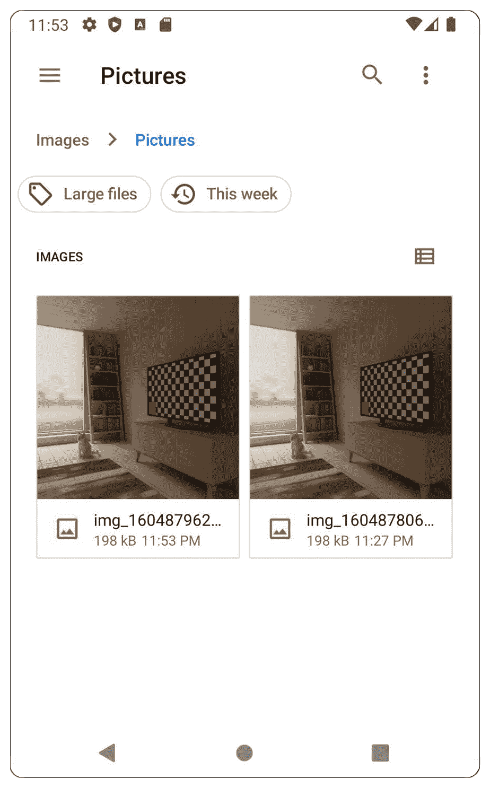

# 12

# 持久化数据

本章深入探讨了 Android 中的数据持久化。到本章结束时，你将了解多种在设备上直接存储（持久化）数据的方法以及可用于此目的的框架。在处理文件系统时，你将了解其分区方式以及如何在不同的位置读取和写入文件，以及如何使用不同的框架。

在上一章中，你学习了如何构建代码和保存数据。在活动中，你还有机会构建一个仓库并使用它通过 Room 访问和保存数据。在本章中，你将了解通过 Android 文件系统在设备上持久化数据的替代方法以及它的结构如何分为外部和内部内存。

你还将加深对读写权限的理解，学习如何创建`FileProvider`类以允许其他应用访问你的文件，以及如何在不需要请求外部驱动器权限的情况下保存这些文件。你还将了解如何从互联网下载文件并将它们保存到文件系统中。

本章还将探讨另一个概念，即使用**相机**应用代表你的应用拍照和录制视频，并使用文件提供者将它们保存到外部存储。

本章将涵盖以下主题：

+   预设和 DataStore

+   文件

+   作用域存储

# 技术要求

本章中所有练习和活动的完整代码可在 GitHub 上找到：[`packt.link/XlTwZ`](https://packt.link/XlTwZ)

# 预设和 DataStore

想象一下，你被分配了一个任务，需要集成一个使用 OAuth 之类的机制来实现 Facebook、Google 等登录的第三方 API。这些机制的工作方式如下——它们会给你一个令牌，你必须将其存储在本地，然后可以使用该令牌发送其他请求以访问用户数据。

这引发了一些问题。你该如何存储那个令牌？你是否只为一个令牌使用 Room？你是否将令牌保存在单独的文件中并实现写入文件的方法？如果那个文件需要同时从多个地方访问怎么办？`SharedPreferences`和`DataStore`是这些问题的答案。`SharedPreferences`是一种允许你将布尔值、整数、浮点数、长整型、字符串和字符串集合保存到 XML 文件的功能。

当你想保存新值时，你指定要为相关键保存哪些值，完成后，你提交更改，这将异步触发将更改保存到 XML 文件。`SharedPreferences`映射也保存在内存中，这样当你想要读取这些值时，它将瞬间完成，从而消除了读取 XML 文件的异步调用需求。

我们现在有两种方式以键值对的形式存储数据，即`SharedPreferences`和`DataStore`。现在我们将探讨每个的工作原理以及它们各自提供的优势。

## SharedPreferences

访问 `SharedPreference` 对象的方式是通过 `Context` 对象：

```swift
val prefs = getSharedPreferences("my-prefs-file",
Context.MODE_PRIVATE)
```

第一个参数是您指定首选项名称的地方，第二个参数是您希望如何将文件暴露给其他应用程序。目前，最佳模式是私有模式。其他所有模式都存在潜在的安全风险。

如果您想将数据写入首选项文件，您首先需要获取对首选项编辑器的访问权限。编辑器将为您提供写入数据的权限。然后您可以在其中写入数据。一旦完成写入，您将必须应用更改，这将触发对 XML 文件的持久化并更改内存中的值。

您有两个选择来应用对首选项文件的变化 – `apply` 或 `commit`。选择 `apply` 将立即在内存中保存您的更改，但写入磁盘将是异步的，这在您想从应用程序的主线程保存数据时很有用。`commit` 会同步执行所有操作，并返回一个布尔结果，告诉您操作是否成功。在实践中，`apply` 通常比 `commit` 更受欢迎：

```swift
    val editor = prefs.edit()
    editor.putBoolean("my_key_1", true)
    editor.putString("my_key_2", "my string")
    editor.putLong("my_key_3", 1L)
    editor.apply()
```

现在，您想要清除所有数据。相同的原理适用；您将需要 `editor`、`clear` 和 `apply`：

```swift
    val editor = prefs.edit()
    editor.clear()
    editor.apply()
```

如果您想读取之前保存的值，您可以使用 `SharedPreferences` 对象来读取存储的值。如果没有保存的值，您可以选择返回默认值：

```swift
    prefs.getBoolean("my_key_1", false)
    prefs.getString("my_key_2", "")
    prefs.getLong("my_key_3", 0L)
```

现在我们应该对如何使用 `SharedPreferences` 持久化数据有一个了解，我们可以在下一节的练习中应用这一点。

## 练习 12.01 – 包装 SharedPreferences

我们将构建一个应用程序，该程序显示 `TextView`、`EditText` 和一个按钮。`TextView` 将显示在 `SharedPreferences` 中之前保存的值。用户可以输入新的文本，当按钮被点击时，文本将被保存到 `SharedPreferences` 中，并且 `TextView` 将显示更新后的文本。我们需要使用 `ViewModel` 和 `LiveData` 来使代码更易于测试。

为了完成这个练习，我们需要创建一个 `Wrapper` 类，该类将负责保存文本。这个类将返回文本的值作为 `LiveData`。这将注入到我们的 `ViewModel` 中，该 `ViewModel` 将绑定到活动：

1.  使用 Android Studio 创建一个新的空活动项目。

1.  让我们从向 `app/build.gradle` 添加适当的库开始：

    ```swift
        implementation "androidx.lifecycle:
            lifecycle-viewmodel-ktx:2.5.1"
        implementation "androidx.lifecycle:
            lifecycle-livedata-ktx:2.5.1"
    ```

1.  让我们在 `main/java` 文件夹中的 `root` 包下创建一个 `Wrapper` 类，该类将监听 `SharedPreferences` 的变化，并在首选项发生变化时更新 `LiveData` 的值。该类将包含保存新文本和检索 `LiveData` 的方法：

    ```swift
    const val KEY_TEXT = "keyText"
    class PreferenceWrapper(private val sharedPreferences:
    SharedPreferences) {
        private val textLiveData =
            MutableLiveData<String>()
        init {
            sharedPreferences
            .registerOnSharedPreferenceChangeListener {
            _, key ->
                when (key) {
                    KEY_TEXT -> {
                        textLiveData.postValue(
                        sharedPreferences
                        .getString(KEY_TEXT, ""))
                    }
                }
            }
        }
    }
    ```

此步骤的完整代码可以在 [`packt.link/a2RuN`](https://packt.link/a2RuN) 找到。

注意文件的顶部。我们添加了一个监听器，以便当我们的 `SharedPreferences` 值发生变化时，我们可以查找新值并更新我们的 `LiveData` 模型。这将允许我们观察 `LiveData` 的任何更改并仅更新 UI。

`saveText` 方法将打开编辑器，设置新值，并应用更改。`getText` 方法将读取最后保存的值，将其设置在 `LiveData` 中，并返回 `LiveData` 对象。这在应用打开并希望在应用关闭之前访问最后值的情况下非常有用。

1.  现在，让我们在根包的 `main/java` 文件夹中设置 `Application` 类的偏好实例：

    ```swift
    class PreferenceApplication : Application() {
        lateinit var preferenceWrapper: PreferenceWrapper
        override fun onCreate() {
            super.onCreate()
            preferenceWrapper =
                PreferenceWrapper(getSharedPreferences(
                "prefs", Context.MODE_PRIVATE))
        }
    }
    ```

1.  现在，让我们在 `AndroidManifest.xml` 的 `application` 标签中添加适当的属性：

    ```swift
    android:name=".PreferenceApplication"
    ```

1.  接下来，让我们在根包的 `main/java` 文件夹中构建 `ViewModel` 组件：

    ```swift
    class PreferenceViewModel(private val
    preferenceWrapper: PreferenceWrapper) : ViewModel() {
        fun saveText(text: String) {
            preferenceWrapper.saveText(text)
        }
        fun getText(): LiveData<String> {
            return preferenceWrapper.getText()
        }
    }
    ```

1.  现在，让我们在 `res/layout` 文件夹中定义我们的 `activity_main.xml` 布局文件：

    ```swift
        <TextView
            android:id="@+id/activity_main_text_view"
            android:layout_width="wrap_content"
            android:layout_height="wrap_content"
            android:layout_marginTop="50dp"
            app:layout_constraintLeft_toLeftOf="parent"
            app:layout_constraintRight_toRightOf="parent"
            app:layout_constraintTop_toTopOf="parent" />
        <EditText
            android:id="@+id/activity_main_edit_text"
            android:layout_width="200dp"
            android:layout_height="wrap_content"
            android:inputType="none"
            app:layout_constraintLeft_toLeftOf="parent"
            app:layout_constraintRight_toRightOf="parent"
            app:layout_constraintTop_toBottomOf=
                "@id/activity_main_text_view" />
    ```

此步骤的完整代码可以在 [`packt.link/2c5Ay`](https://packt.link/2c5Ay) 找到。

1.  最后，在 `MainActivity` 中执行以下步骤：

    ```swift
    class MainActivity : AppCompatActivity() {
        override fun onCreate(savedInstanceState: Bundle?)
        {
            preferenceViewModel.getText().observe(this,
            Observer {
                findViewById<TextView>(
                R.id.activity_main_text_view) .text = it
            })
            findViewById<Button>(R.id.activity_main_button
            ) .setOnClickListener {
                preferenceViewModel.saveText(findViewById
                <EditText> (R.id.activity_main_edit_text)
                .text.toString())
            }
        }
    }
    ```

此步骤的完整代码可以在 [`packt.link/ZRWNc`](https://packt.link/ZRWNc) 找到。

上述代码将产生 *图 12.1* 中所示的输出：


图 12.1 – 练习 12.01 的输出

一旦你插入了一个值，尝试关闭应用程序并重新打开它。应用程序将显示最后持久化的值。

## 数据存储

当我们想要通过偏好 `DataStore` 以键值对的形式存储数据，或者想要通过 Proto `DataStore` 存储整个对象时，`DataStore` 持久化库是 `SharedPreferences` 的一个替代方案。这两个库都避免了与 Android 框架的依赖（与需要初始化 `Context` 对象的 `SharedPreferences` 不同），并且使用协程和流构建，因此在你的项目中使用协程和流时，它们是理想的候选者。

这种集成允许 `DataStore` 通知订阅者所有更改，这意味着开发者不再需要担心处理这些更改：

```swift
val Context.dataStore: DataStore<Preferences> by
preferencesDataStore(name = "myDataStore")
val KEY_MY_INT = intPreferencesKey("my_int_key")
val KEY_MY_BOOLEAN =
    booleanPreferencesKey("my_boolean_key")
val KEY_MY_STRING = stringPreferencesKey("my_string_key")
class MyAppSettings(private val context: Context) {
    val myIntValue: Flow<Int> = context.dataStore.data
        .map { preferences ->
            preferences[KEY_MY_INT] ?: 0
        }
    val myBooleanValue: Flow<Boolean> =
        context.dataStore.data
        .map { preferences ->
            preferences[KEY_MY_BOOLEAN] ?: false
        }
    val myStringValue: Flow<String> =
        context.dataStore.data
        .map { preferences ->
            preferences[KEY_MY_STRING] ?: ""
        }
}
```

在前面的代码片段中，我们在顶层 Kotlin 文件中初始化 `Context.dataStore`。然后我们定义了三个不同的键，分别对应我们想要读取的不同类型。在 `MyAppSettings` 中，我们将 `context.dataStore.data` 中的值映射到我们的键，并从中提取值。

如果我们想在 `DataStore` 中存储数据，则需要执行以下操作：

```swift
class MyAppSettings(private val context: Context) {
    …
    suspend fun saveMyIntValue(intValue: Int) {
        context.dataStore.edit { preferences ->
            preferences[KEY_MY_INT] = intValue
        }
    }
    suspend fun saveMyBooleanValue(booleanValue: Boolean) {
        context.dataStore.edit { preferences ->
            preferences[KEY_MY_BOOLEAN] = booleanValue
        }
    }
    suspend fun saveMyStringValue(stringValue: String) {
        context.dataStore.edit { preferences ->
            preferences[KEY_MY_STRING] = stringValue
        }
    }
}
```

`suspend` 关键字来自协程，它表示我们需要将方法调用放入异步调用中。`context.dataStore.edit` 将 `DataStore` 中的偏好设置为可变的，并允许我们更改值。

## 练习 12.02 – 预设数据存储

我们将构建一个显示 `TextView`、`EditText` 和按钮的应用程序。`TextView` 将显示添加到 `DataStore` 的值。用户可以输入新的文本，当按钮被点击时，文本将被保存到 `DataStore`，并且 `TextView` 将显示更新的文本。

我们将需要使用 `ViewModel` 和 `LiveData`。在 `ViewModel` 中，我们将收集来自 `DataStore` 的数据并将其放置在一个 `LiveData` 对象中：

1.  创建一个带有空活动的新的 Android Studio 项目。

1.  让我们从向 `app/build.gradle` 添加适当的库开始：

    ```swift
        implementation "androidx.datastore:
            datastore-preferences:1.0.0"
        implementation "androidx.lifecycle:
            lifecycle-viewmodel-ktx:2.5.1"
        implementation "androidx.lifecycle:
            lifecycle-livedata-ktx:2.5.1"
    ```

1.  在根包的 `main/java` 文件夹中创建一个名为 `SettingsStore` 的新类，该类将包含从 `DataStore` 加载和保存数据的方法：

    ```swift
    val Context.dataStore: DataStore<Preferences> by
    preferencesDataStore(name = "settingsStore")
    val KEY_TEXT = stringPreferencesKey("key_text")
    class SettingsStore(private val context: Context) {
        val text: Flow<String> = context.dataStore.data
            .map { preferences ->
                preferences[KEY_TEXT] ?: ""
            }
        suspend fun saveText(text: String) {
            context.dataStore.edit { preferences ->
                preferences[KEY_TEXT] = text
            }
        }
    }
    ```

在前面的代码片段中，我们定义了一个用于存储文本的键、用于检索已保存文本的字段以及用于保存它的方法。

1.  在根包的 `main/java` 文件夹中创建一个名为 `SettingsViewModel` 的新类，该类将从 `SettingsStore` 收集数据并将其保存到 `LiveData` 对象中：

    ```swift
    class SettingsViewModel(private val settingsStore:
    SettingsStore) : ViewModel() {
        private val _textLiveData =
            MutableLiveData<String>()
        val textLiveData: LiveData<String> = _textLiveData
        init {
            viewModelScope.launch {
                settingsStore.text.collect {
                    _textLiveData.value = it
                }
            }
        }
        fun saveText(text: String) {
            viewModelScope.launch {
                settingsStore.saveText(text)
            }
        }
    }
    ```

在前面的示例中，`viewModelScope` 是 `ViewModel` 的扩展，代表 `CoroutineScope`，这确保了在 `ViewModel` 仍然活跃时完成后台工作，以避免任何可能的泄漏。使用这个，我们可以在 `ViewModel` 初始化时收集现有的文本到 `LiveData`，然后从 `SettingsStore` 调用 `saveText` 方法。

1.  现在，让我们在根包的 `main/java` 文件夹中设置 `Application` 类，并包含 `SettingsStore` 实例：

    ```swift
    class SettingsApplication : Application() {
        lateinit var settingsStore: SettingsStore
        override fun onCreate() {
            super.onCreate()
            settingsStore = SettingsStore(this)
        }
    }
    ```

1.  接下来，让我们在 `AndroidManifest.xml` 的 `application` 标签中添加适当的属性：

    ```swift
    android:name=".SettingsApplication"
    ```

1.  最后，让我们在 `res/layout` 文件夹中定义我们的 `activity_main.xml` 布局文件：

    ```swift
        <TextView
            android:id="@+id/activity_main_text_view"
            android:layout_width="wrap_content"
            android:layout_height="wrap_content"
            android:layout_marginTop="50dp"
            app:layout_constraintLeft_toLeftOf="parent"
            app:layout_constraintRight_toRightOf="parent"
            app:layout_constraintTop_toTopOf="parent" />
        <EditText
            android:id="@+id/activity_main_edit_text"
            android:layout_width="200dp"
            android:layout_height="wrap_content"
            android:inputType="none"
            app:layout_constraintLeft_toLeftOf="parent"
            app:layout_constraintRight_toRightOf="parent"
            app:layout_constraintTop_toBottomOf=
                "@id/activity_main_text_view" />
    ```

此步骤的完整代码可以在 [`packt.link/8f854`](https://packt.link/8f854) 找到。

1.  最后，在 `MainActivity` 中执行以下步骤：

    ```swift
    class MainActivity : AppCompatActivity() {
        override fun onCreate(savedInstanceState: Bundle?)
        {
            super.onCreate(savedInstanceState)
            setContentView(R.layout.activity_main)
            val preferenceWrapper =
                (application as SettingsApplication)
                .settingsStore
            val preferenceViewModel =
                ViewModelProvider(this, object :
                ViewModelProvider.Factory {
                    override fun <T : ViewModel>
                    create(modelClass: Class<T>): T {
                        return SettingsViewModel(
                        preferenceWrapper) as T
                }
            }).get(SettingsViewModel::class.java)
        }
    }
    ```

此步骤的完整代码可以在 [`packt.link/gydeC`](https://packt.link/gydeC) 找到。

如果我们现在运行应用程序，我们应该看到以下屏幕：


图 12.2 – 练习 12.02 的输出

如果我们输入新的文本并点击 `DataStore`，它将为每次更改发出新的值。我们将在未来的章节中查看流和其他响应式流。

在这个练习中，我们探讨了 `DataStore` 库的工作原理及其优势，特别是在数据流方面。在接下来的章节中，我们将继续探讨使用文件持久化数据的其他方法。

# 文件

我们已经讨论了 Room、`SharedPreferences` 和 `DataStore`，并指定了它们存储的数据是如何写入文件的。你可能想知道，这些文件存储在哪里？这些特定的文件存储在内部存储中。内部存储是每个应用程序的专用空间，其他应用程序无法访问（除非设备已越狱）。你的应用程序可以使用存储空间没有限制。

然而，用户可以从**设置**菜单中删除他们应用的文件。内部存储只占用总可用空间的一小部分，这意味着在存储文件时应小心。还有外部存储。您的应用存储在外部存储中的文件对其他应用是可访问的，其他应用中的文件对您的应用也是可访问的。

注意

在 Android Studio 中，您可以使用`/data/data/{packageName}`。如果您可以访问此文件夹，这意味着设备已 root。使用此方法，您可以可视化数据库文件和`SharedPreferences`文件。

**设备文件浏览器**的外观示例可以在以下图中查看：


图 12.3 – Android 的模拟设备文件浏览器

## 内部存储

内部存储不需要用户的权限。要访问内部存储目录，您可以使用`Context`对象中的以下方法之一：

+   `getDataDir()`: 返回您应用沙盒的根文件夹。

+   `getFilesDir()`: 专门用于应用文件的文件夹——推荐使用。

+   `getCacheDir()`: 一个专门用于缓存文件的文件夹。在此处存储文件并不保证您以后可以检索它们，因为系统可能会决定删除此目录以释放内存。此文件夹与**设置**中的**清除缓存**选项相关联。

+   `getDir(name, mode)`: 如果不存在，则根据指定的名称创建一个文件夹。

当用户从**设置**中使用**清除数据**选项时，大多数这些文件夹将被删除，使应用的状态与全新安装相似。当应用被卸载时，这些文件也将被删除。

读取缓存文件的典型示例如下：

```swift
        val cacheDir = context.cacheDir
        val fileToReadFrom = File(cacheDir, "my-file.txt")
        val size = fileToReadFrom.length().toInt()
        val bytes = ByteArray(size)
        val tmpBuff = ByteArray(size)
        val fis = FileInputStream(fileToReadFrom)
        try {
            var read = fis.read(bytes, 0, size)
            if (read < size) {
                var remain = size - read
                while (remain > 0) {
                    read = fis.read(tmpBuff, 0, remain)
                    System.arraycopy(tmpBuff, 0, bytes,
                        size - remain, read)
                    remain -= read
                }
            }
        } catch (e: IOException) {
            throw e
        } finally {
            fis.close()
        }
```

之前的示例将从位于`Cache`目录中的`my-file.txt`文件中读取，并为该文件创建`FileInputStream`。然后，将使用一个缓冲区来收集文件中的字节。收集到的字节将被放置在`bytes`字节数组中，该数组将包含从该文件中读取的所有数据。读取将在读取整个文件长度后停止。

向`my-file.txt`文件写入的内容将类似于以下示例：

```swift
        val bytesToWrite = ByteArray(100)
        val cacheDir = context.cacheDir
        val fileToWriteIn = File(cacheDir, "my-file.txt")
        try {
            if (!fileToWriteIn.exists()) {
                fileToWriteIn.createNewFile()
            }
            val fos = FileOutputStream(fileToWriteIn)
            fos.write(bytesToWrite)
            fos.close()
        } catch (e: Exception) {
            e.printStackTrace()
        }
```

之前示例所做的是获取您想要写入的字节数组，创建一个新的`File`对象，如果不存在则创建文件，并通过`FileOutputStream`将字节写入文件。

注意

处理文件有许多替代方案。读者（`StreamReader`、`StreamWriter`等）更适合处理基于字符的数据。还有第三方库可以帮助处理磁盘 I/O 操作。其中最常用的第三方库之一是名为`OkHttp`的库，它与 Retrofit 结合使用以进行 API 调用。Okio 提供的方法与它在 HTTP 通信中读写数据所使用的方法相同。

## 外部存储

在外部存储中读取和写入需要用户权限。如果授予写入权限，则您的应用程序具有读取外部存储的能力。一旦这些权限被授予，则您的应用程序可以在外部存储上做任何它想做的事情。

这可能带来问题，因为用户可能不会选择授予这些权限。然而，有一些专门的方法提供了将数据写入您的应用程序专用文件夹的可能性。

访问外部存储的最常见方式之一是从`Context`和`Environment`对象：

+   `Context.getExternalFilesDir(mode)`：此方法将返回外部存储上为您的应用程序专用的目录路径。指定不同的模式（图片、电影等）将创建不同的子文件夹，具体取决于您希望如何保存文件。此方法*不*需要权限。

+   `Context.getExternalCacheDir()`：这将指向外部存储上的应用程序缓存目录。对此`缓存`文件夹应适用与内部存储选项相同的考虑。此方法*不*需要权限。

+   `Environment`类可以访问设备上一些最常见文件夹的路径。然而，在新设备上，应用程序可能无法访问这些文件和文件夹。

注意

避免使用硬编码的文件和文件夹路径。Android 操作系统可能会根据设备或 Android 版本将文件夹的位置移动。

## 文件提供者

这代表了一种专门实现的内容提供者，它有助于组织应用程序的文件和文件夹结构。如果您选择这样做，它允许您指定一个 XML 文件，在其中定义您的文件应该如何在内部和外部存储之间分割。它还允许您通过隐藏路径并生成一个唯一的 URI 来识别和查询您的文件，从而授予其他应用程序访问您文件的权限。

`FileProvider`允许您在六个不同的文件夹中进行选择，您可以在其中设置您的文件夹层次结构：

+   `Context.getFilesDir()`（文件路径）

+   `Context.getCacheDir()` (缓存路径)

+   `Environment.getExternalStorageDirectory()`（外部路径）

+   `Context.getExternalFilesDir(null)`（外部文件路径）

+   `Context.getExternalCacheDir()`（外部缓存路径）

+   `Context.getExternalMediaDirs()` 的第一个结果（外部媒体路径）

`FileProvider`的主要优点是它在组织文件时提供的抽象，同时让开发者可以在 XML 文件中定义路径，更重要的是，如果您选择使用它来存储外部存储中的文件，您无需请求用户权限。

另一个好处是它使得内部文件的共享更加容易，同时让开发者控制其他应用可以访问哪些文件，而不必暴露它们的真实位置。

让我们通过以下示例更好地理解：

```swift
<paths
xmlns:android="http://schemas.android.com/apk/res/android">
    <files-path name="my-visible-name" path="/
    my-folder-name" />
</paths>
```

上述示例将使`FileProvider`使用内部`files`目录并创建一个名为`my-folder-name`的文件夹。当路径转换为 URI 时，该 URI 将使用`my-visible-name`。

## 存储访问框架（SAF）

SAF 是 Android KitKat 中引入的文件选择器，应用程序可以使用它让用户选择文件，目的是处理或上传文件。您可以在以下场景中使用它：

+   您的应用需要用户处理另一个应用（如照片和视频）保存在设备上的文件

+   您希望在一个设备上保存文件，并让用户选择文件的保存位置和文件名

+   您希望将应用程序使用的文件提供给其他应用，用于与列表中第一个场景类似的情况

这同样很有用，因为您的应用程序将避免读写权限，但仍可以写入和访问外部存储。这种方式是基于意图的。您可以注册`GetDocument`或`CreateDocument`的活动结果。然后，在活动结果回调中，系统将为您提供临时权限的 URI，允许您读取和写入该文件。

SAF 的另一个好处是文件不必在设备上。例如，Google Drive 这样的应用通过 SAF 公开其内容，当选择 Google Drive 文件时，它将被下载到设备上，并将 URI 作为结果发送。

另一个需要提到的重要事情是 SAF 对虚拟文件的支持，这意味着它将公开具有自己格式的 Google 文档，但当这些文档通过 SAF 下载时，它们的格式将被转换为 PDF 等通用格式。

## 资产文件

您项目中的`assets`文件夹。然后您可以使用文件夹在您的资产中分组文件。

您可以通过`AssetManager`类在运行时访问这些文件，该类本身可以通过上下文对象访问。`AssetManager`为您提供查找文件和读取文件的能力，但不允许任何写操作：

```swift
        val assetManager = context.assets
        val root = ""
        val files = assetManager.list(root)
        files?.forEach {
            val inputStream = assetManager.open(root + it)
        }
```

上述示例列出了`assets`文件夹根目录下的所有文件。`open`函数返回`inputStream`，如果需要，可以使用它来读取文件信息。

`assets`文件夹的一个常见用途是自定义字体。如果您的应用程序使用自定义字体，则可以使用`assets`文件夹来存储字体文件。

注意

对于以下练习，您需要一个模拟器。您可以在 Android Studio 中通过选择 **工具** | **AVD 管理器** 来这样做。然后，您可以通过选择 **创建虚拟设备** 选项，选择模拟器类型，点击 **下一步**，然后选择一个 x86 图像来创建一个。任何大于 Lollipop 的图像都适用于此练习。接下来，您可以给您的图像命名并点击 **完成**。

## 练习 12.03 – 复制文件

让我们创建一个应用程序，该应用程序将在 `assets` 目录中保留一个名为 `my-app-file.txt` 的文件。该应用程序将显示两个按钮，分别称为 `FileProvider` 和 `SAF`。当点击 `FileProvider` 按钮时，文件将被保存在应用程序外部存储的专用区域（`Context.getExternalFilesDir(null)`）中。`SAF` 按钮将打开 SAF，并允许用户指定文件应保存的位置。

为了实现这个练习，请按照以下步骤操作：

1.  定义一个文件提供者，它将使用 `Context.getExternalFilesDir(null)` 位置。

1.  当点击 `FileProvider` 按钮时，将 `my-app-file.txt` 复制到前面的位置。

1.  当点击 `SAF` 按钮时，使用 `Intent.ACTION_CREATE_DOCUMENT` 并将文件复制到提供的位置。

1.  使用单独的线程进行文件复制，以符合 Android 指南。

1.  使用 Apache IO 库帮助实现文件复制功能，通过提供允许我们从 `InputStream` 复制到 `OutputStream` 的方法。

完成步骤如下：

1.  创建一个新的 Android Studio 项目，包含一个空活动。

1.  让我们从我们的 Gradle 配置开始：

    ```swift
        implementation 'commons-io:commons-io:2.6'
    ```

1.  在 `main/assets` 文件夹中创建 `my-app-file.txt` 文件。您可以随意填充您想要读取的文本。如果 `main/assets` 文件夹不存在，您可以创建它。要创建 `assets` 文件夹，您可以在 `main` 文件夹上右键单击，选择 `assets`。

现在，此文件夹将被构建系统识别，并且其中的任何文件也将与应用程序一起安装到设备上。您可能需要将 **项目视图** 从 **Android** 切换到 **项目**，以便能够查看此文件结构。

1.  我们还可以在根包的 `main/java` 文件夹中定义一个类来包装 `AssetManager`，并定义一个方法来访问这个特定的文件：

    ```swift
    class AssetFileManager(private val assetManager:
    AssetManager) {
        fun getMyAppFileInputStream() =
            assetManager.open("my-app-file.txt")
    }
    ```

1.  现在，让我们专注于 `FileProvider` 方面。在 `res` 文件夹中创建 `xml` 文件夹。在新的文件夹中定义 `file_provider_paths.xml`。我们将定义 `external-files-path`，命名为 `docs`，并将其放置在 `docs/` 文件夹中：

    ```swift
    <?xml version="1.0" encoding="utf-8"?>
    <paths>
        <external-files-path name="docs" path="docs/"/>
    </paths>
    ```

1.  接下来，我们需要将 `FileProvider` 添加到 `AndroidManifest.xml` 文件中，并将其与 `<application>` 标签内定义的新路径链接：

    ```swift
            <provider
                android:name=
                    "androidx.core.content.FileProvider"
                android:authorities=
                    "com.android.testable.files"
                android:exported="false"
                android:grantUriPermissions="true">
                <meta-data
                    android:name="android.support
                        .FILE_PROVIDER_PATHS"
                    android:resource="@xml/
                        file_provider_paths" />
            </provider>
    ```

名称将指向 Android 支持库中的 `FileProvider` 路径。`authorities` 字段表示您的应用程序域（通常是应用程序的包名）。

导出字段表示我们是否希望与其他应用程序共享我们的提供者，而`grantUriPermissions`表示我们是否希望通过 URI 授予其他应用程序访问某些文件的权利。元数据将我们之前定义的 XML 文件与`FileProvider`链接起来。

1.  在根包的`main/java`文件夹中定义`ProviderFileManager`类，该类负责访问`docs`文件夹并将数据写入文件：

    ```swift
    class ProviderFileManager(
    ) {
        fun writeStream(name: String, inputStream:
        InputStream) {
            executor.execute {
                val fileToSave = File(getDocsFolder(),
                name)
                val outputStream =
                    context.contentResolver
                    .openOutputStream(fileToUriMapper
                    .getUriFromFile(context, fileToSave),
                    "rw")
                IOUtils.copy(inputStream, outputStream)
            }
        }
    }
    ```

此步骤的完整代码可以在[`packt.link/Gp0Ph`](https://packt.link/Gp0Ph)找到。

`getDocsFolder`将返回我们在 XML 中定义的`docs`文件夹的路径。如果文件夹不存在，则将其创建。

`writeStream`方法将提取我们希望保存的文件的 URI，并使用 Android 的`ContentResolver`类，将给我们提供访问我们将要保存的文件的`OutputStream`类的权限。请注意，`FileToUriMapper`尚未存在。代码被移动到一个单独的类中，以便使此类可测试。

1.  在根包的`main/java`文件夹中创建`FileToUriMapper`类：

    ```swift
    class FileToUriMapper {
        fun getUriFromFile(context: Context, file: File):
        Uri {
            return FileProvider.getUriForFile(context,
            "com.android.testable.files", file)
        }
    }
    ```

`getUriForFile`方法是`FileProvider`类的一部分，其作用是将文件的路径转换为`ContentProviders`和`ContentResolvers`可以使用以访问数据的 URI。因为此方法是静态的，所以它阻止我们进行适当的测试。

1.  确保以下字符串被添加到`strings.xml`中：

    ```swift
        <string name="file_provider">FileProvider</string>
        <string name="saf">SAF</string>
    ```

1.  现在，让我们继续定义我们的`activity_main.xml`文件在`res/layout`文件夹中的 UI：

    ```swift
        <Button
            android:id="@+id/activity_main_file_provider"
            android:layout_width="wrap_content"
            android:layout_height="wrap_content"
            android:layout_marginTop="200dp"
            android:text="@string/file_provider"
            app:layout_constraintEnd_toEndOf="parent"
            app:layout_constraintStart_toStartOf="parent"
            app:layout_constraintTop_toTopOf="parent" />
        <Button
            android:id="@+id/activity_main_saf"
            android:layout_width="wrap_content"
            android:layout_height="wrap_content"
            android:layout_marginTop="50dp"
            android:text="@string/saf"
            app:layout_constraintEnd_toEndOf="parent"
            app:layout_constraintStart_toStartOf="parent"
            app:layout_constraintTop_toBottomOf=
                "@id/activity_main_file_provider" />
    ```

此步骤的完整代码可以在[`packt.link/Pw37X`](https://packt.link/Pw37X)找到。

1.  现在，让我们在根包的`main/java`文件夹中定义我们的`MainActivity`类：

    ```swift
    class MainActivity : AppCompatActivity() {
        override fun onCreate(savedInstanceState: Bundle?)
        {
            super.onCreate(savedInstanceState)
            setContentView(R.layout.activity_main)
            findViewById<Button>(
            R.id.activity_main_file_provider)
            .setOnClickListener {
                val newFileName = "Copied.txt"
                providerFileManager.writeStream(
                    newFileName, assetFileManager
                    .getMyAppFileInputStream())
            }
        }
    }
    ```

此步骤的完整代码可以在[`packt.link/FBXgY`](https://packt.link/FBXgY)找到。

对于这个例子，我们选择了`MainActivity`来创建我们的对象并将数据注入到我们拥有的不同类中。如果我们执行此代码并点击`FileProvider`按钮，我们在 UI 上不会看到输出。

然而，如果我们查看 Android 的**设备文件浏览器**，我们可以找到文件保存的位置。在不同的设备和操作系统上，路径可能不同。路径可能如下所示：

+   `mnt/sdcard/Android/data/<package_name>/files/docs`

+   `sdcard/Android/data/<package_name>/files/docs`

+   `storage/emulated/0/Android/data/<package_name>/files/docs`

输出将如下所示：


图 12.4 – 通过 FileProvider 的复制输出

1.  让我们添加`SAF`按钮的逻辑。我们需要启动一个指向`SAF`的活动，使用`CREATE_DOCUMENT`意图，其中我们指定我们想要创建一个文本文件。

我们将需要`SAF`的结果，以便我们可以将文件复制到用户选择的地点。在`MainActivity`的`onCreate`中，我们可以添加以下内容：

```swift
      val createDocumentResult =
          registerForActivityResult(
          ActivityResultContracts.CreateDocument(
          "text/plain")) { uri ->
              uri?.let {
                  val newFileName = "Copied.txt"
                  providerFileManager
                  .writeStreamFromUri(newFileName,
                  assetFileManager
                  .getMyAppFileInputStream(), uri)
              }
            }
        findViewById<Button>(R.id.activity_main_saf)
        .setOnClickListener {
            createDocumentResult.launch("Copied.txt")
        }
```

前面的代码将要执行的操作是在用户创建新文件时注册一个 `Activity` 结果。然后，我们将从 `ProviderFileManager` 调用 `writeStreamFromUri` 来保存用户创建的文件中 `assets` 文件夹的内容。当按钮被点击时，我们将从 SAF 启动文件创建界面。

1.  现在我们有了 URI。我们可以在 `ProviderFileManager` 中添加一个方法，将我们的文件复制到由 `uri` 指定的位置：

    ```swift
        fun writeStreamFromUri(name: String, inputStream:
        InputStream, uri:Uri){
            executor.execute {
                val outputStream =
                    context.contentResolver
                    .openOutputStream(uri, "rw")
                IOUtils.copy(inputStream, outputStream)
            }
        }
    ```

如果我们运行前面的代码并点击 **SAF** 按钮，我们将看到 *图 12.5* 中展示的输出：


图 12.5 – 通过 SAF 复制的输出

如果您选择保存文件，SAF 将关闭，并调用 `registerForActivityResult` 的回调，这将触发文件复制。之后，您可以通过 Android 设备文件管理器工具导航，以查看文件是否已正确保存。

# 范围存储

自 Android 10 以来，随着 Android 11 的进一步更新，引入了范围存储的概念。其背后的主要思想是允许应用程序对其外部存储中的文件有更多的控制权，并防止其他应用程序访问这些文件。

这意味着 `READ_EXTERNAL_STORAGE` 和 `WRITE_EXTERNAL_STORAGE` 只适用于用户交互的文件（如媒体文件）。这会阻止应用程序在外部存储中创建自己的目录，而是坚持使用通过 `Context.getExternalFilesDir` 提供给它们的目录。

文件提供者和 SAF 是使您的应用程序符合范围存储实践的好方法，一个允许应用程序使用 `Context.getExternalFilesDir`，另一个使用内置的文件浏览器应用程序，现在将避免外部存储中 `Android/data` 和 `Android/obb` 文件夹中的其他应用程序的文件。

## 摄像头和媒体存储

Android 提供了多种与其设备上的媒体进行交互的方式，从构建自己的相机应用程序并控制用户如何拍照和录像，到使用现有的相机应用程序并指导其如何拍照和录像。

Android 还附带了一个 `MediaStore` 内容提供者，允许应用程序提取有关设备上设置并应用程序间共享的媒体文件的信息。

这在需要为设备上存在的媒体文件（如照片或音乐播放器应用程序）提供自定义显示的情况下很有用，以及在您使用 `MediaStore.ACTION_PICK` 意图从设备中选择照片并希望提取所选媒体图像信息的情况下（这通常是对于无法使用 SAF 的旧应用程序而言）。

为了使用现有的相机应用程序，您需要使用 `MediaStore.ACTION_IMAGE_CAPTURE` 意图启动一个用于结果的相机应用程序，并传递您希望保存的图像的 URI。然后用户将进入相机活动并拍照，然后您处理操作的结果：

```swift
        val imageCaptureLauncher =
            registerForActivityResult(
            ActivityResultContracts.TakePicture()){
            }
        imageCaptureLauncher.launch(photoUri)
```

`photoUri` 参数将代表您希望保存照片的位置。它应该指向一个具有 JPEG 扩展名的空文件。您可以通过两种方式构建此文件：

+   使用 `File` 对象在外部存储上创建一个文件（这需要 `WRITE_EXTERNAL_STORAGE` 权限），然后使用 `Uri.fromFile()` 方法将其转换为 `URI`（这在 Android 10 及以上版本中不再适用）

+   使用 `File` 对象在 `FileProvider` 位置创建一个文件，然后使用 `FileProvider.getUriForFile()` 方法获取 URI，并在必要时授予它权限（当您的应用程序针对 Android 10 和 Android 11 时推荐的方法）

注意

同样的机制可以使用 `MediaStore.ACTION_VIDEO_CAPTURE` 用于视频。

如果您的应用程序严重依赖相机功能，那么您可以通过在 `AndroidManifest.xml` 文件中添加 `<uses-feature>` 标签来排除没有相机的用户的应用程序。您还可以指定相机为非必需，并使用 `Context.hasSystemFeature(PackageManager.FEATURE_CAMERA_ANY)` 方法查询相机是否可用。

如果您希望文件保存在 `MediaStore` 中，有多种方法可以实现：

1.  使用您的媒体 URI 发送 `ACTION_MEDIA_SCANNER_SCAN_FILE` 广播：

    ```swift
          val intent = Intent(Intent.ACTION_MEDIA_SCANNER_
          SCAN_FILE)
          intent.data = photoUri
          sendBroadcast(intent)
    ```

1.  使用媒体扫描器直接扫描文件：

    ```swift
            val paths = arrayOf("path1", "path2")
            val mimeTypes= arrayOf("type1", "type2")
            MediaScannerConnection.scanFile(context,paths,
                mimeTypes) { path, uri ->
            }
    ```

1.  直接使用 `ContentResolver` 将媒体插入 `ContentProvider`：

    ```swift
            val contentValues = ContentValues()
            contentValues.put(MediaStore.Images
                .ImageColumns.TITLE, "my title")
            contentValues.put(MediaStore.Images
                .ImageColumns .DATE_ADDED, timeInMillis)
            contentValues.put(MediaStore.Images
                .ImageColumns .MIME_TYPE, "image/*")
            contentValues.put(MediaStore.Images
                .ImageColumns .DATA, "my-path")
            val newUri =
                contentResolver.insert(MediaStore.Video
                .Media.EXTERNAL_CONTENT_URI,
                contentValues)
    newUri?.let {
        val outputStream = contentResolver
        .openOutputStream(newUri)
        // Copy content in outputstream
    }
    ```

注意

在 Android 10 及以上版本中，`MediaScanner` 功能不再从 `Context.getExternal` **FilesDir** 添加文件。如果应用程序选择与其他应用程序共享其媒体文件，它们应选择使用 `insert` 方法。

## 练习 12.04 – 拍照

我们将构建一个具有两个按钮的应用程序；第一个按钮将打开相机应用程序拍照，第二个按钮将打开相机应用程序录制视频。我们将使用 `FileProvider` 将照片保存到外部存储（external-path）的两个文件夹中，`pictures` 和 `movies`。

照片将使用 `img_{timestamp}.jpg` 保存，视频将使用 `video_{timestamp}.mp4` 保存。在照片和视频保存后，您将把文件从 `FileProvider` 复制到 `MediaStore`，以便其他应用程序可以看到：

1.  创建一个新的 Android Studio 项目，其中包含一个空活动。

1.  让我们在 `app/build.gradle` 中添加库：

    ```swift
        implementation 'commons-io:commons-io:2.6'
    ```

1.  我们需要为 Android 10 之前的设备请求 `WRITE_EXTERNAL_STORAGE` 权限，这意味着我们需要在 `<application>` 标签之外 `AndroidManifest.xml` 中包含以下内容：

    ```swift
    <uses-permission
        android:name="android.permission
        .WRITE_EXTERNAL_STORAGE"
        android:maxSdkVersion="28" />
    ```

1.  让我们在根包的`test`文件夹中定义一个`FileHelper`类，它将包含在`test`文件夹中更难测试的方法：

    ```swift
    class FileHelper(private val context: Context) {
        fun getUriFromFile(file: File): Uri {
            return FileProvider.getUriForFile(context,
            "com.android.testable.camera", file)
        }
        fun getPicturesFolder(): String =
            Environment.DIRECTORY_PICTURES
        fun getVideosFolder(): String =
            Environment.DIRECTORY_MOVIES
    }
    ```

1.  让我们在`res/xml/file_provider_paths.xml`中定义我们的`FileProvider`路径。请确保在`FileProvider`中包含您应用程序的适当包名：

    ```swift
    <?xml version="1.0" encoding="utf-8"?>
    <paths>
        <external-path
            name="photos"
            path="Android/data/com.android.testable
            .myapplication/files/Pictures" />
        <external-path
            name="videos"
            path="Android/data/com.android.testable
            .myapplication/files/Movies" />
    </paths>
    ```

让我们在根包中的`AndroidManifest.xml`文件内的`<application>`标签中添加文件提供者路径：

```swift
        <provider
            android:name=
                "androidx.core.content.FileProvider"
            android:authorities=
                "com.android.testable.camera"
            android:exported="false"
            android:grantUriPermissions="true">
            <meta-data
                android:name="android.support
                .FILE_PROVIDER_PATHS"
                android:resource="@xml/
                file_provider_paths" />
        </provider>
```

1.  现在我们定义一个模型，它将包含`Uri`和与根包中`main/java`文件夹中的文件关联的路径：

    ```swift
    data class FileInfo(
        val uri: Uri,
        val file: File,
        val name: String,
        val relativePath:String,
        val mimeType:String
    )
    ```

1.  让我们在根包中的`main/java`文件夹中创建一个`ContentHelper`类，它将为我们提供`ContentResolver`所需的数据。我们将定义两个用于访问照片和视频内容 URI 的方法，以及两个创建`ContentValues`的方法。

我们这样做是因为需要静态方法来获取 URI 和创建`ContentValues`，这使得此功能难以测试。以下代码为了节省空间而被截断。您需要添加的完整代码可以通过以下代码块后的链接找到：

```swift
    class MediaContentHelper {
        fun getImageContentUri(): Uri =
            if (android.os.Build.VERSION.SDK_INT >=
            android.os.Build.VERSION_CODES.Q) {
                MediaStore.Images.Media.getContentUri
                (MediaStore.VOLUME_EXTERNAL_PRIMARY)
            } else {
                MediaStore.Images.Media
                .EXTERNAL_CONTENT_URI
            }
        fun generateImageContentValues(fileInfo:
        FileInfo) = ContentValues().apply {
            this.put(MediaStore.Images.Media
            .DISPLAY_NAME, fileInfo.name)
        if (android.os.Build.VERSION.SDK_INT >=
            android.os.Build.VERSION_CODES.Q) {
                this.put(MediaStore.Images.Media
                .RELATIVE_PATH, fileInfo.relativePath)
        }
        this.put(MediaStore.Images.Media .MIME_TYPE,
            fileInfo.mimeType)
    }
```

此步骤的完整代码可以在[`packt.link/DhOLR`](https://packt.link/DhOLR)找到。

1.  现在，让我们在根包中的`main/java`文件夹中创建`ProviderFileManager`类，我们将定义用于生成相机将使用的照片和视频文件的方法，以及将文件保存到媒体存储的方法。同样，为了简洁，代码已被截断。请参阅以下代码块后的链接以获取您需要使用的完整代码：

    ```swift
        class ProviderFileManager(
        ) {
            fun generatePhotoUri(time: Long): FileInfo {
                val name = "img_$time.jpg"
                val file = File(
                    context.getExternalFilesDir(
                    fileHelper .getPicturesFolder()), name
                )
                return FileInfo(
                    fileHelper.getUriFromFile(file),
                    file, name,
                    fileHelper.getPicturesFolder(),
                    "image/jpeg"
                )
            }
    ```

此步骤的完整代码可以在[`packt.link/ohv7a`](https://packt.link/ohv7a)找到。

注意我们如何将根文件夹定义为`context.getExternalFilesDir(Environment.DIRECTORY_PICTURES)`和`context.getExternalFilesDir(Environment.DIRECTORY_MOVIES)`。这连接到`file_provider_paths.xml`，它将在应用程序的外部存储专用文件夹中创建一个名为`Movies`和`Pictures`的文件夹集合。`insertToStore`方法是将文件复制到`MediaStore`的地方。

首先，我们将创建一个条目到该存储中，这将给我们一个该条目的 URI。接下来，我们将从由`FileProvider`生成的 URI 中复制文件的 内容到`OutputStream`，指向`MediaStore`条目。

1.  将以下字符串添加到`strings.xml`中：

    ```swift
        <string name="photo">Photo</string>
        <string name="video">Video</string>
    ```

1.  让我们在`res/layout/activity_main.xml`中定义我们活动的布局：

    ```swift
        <Button
            android:id="@+id/photo_button"
            android:layout_width="wrap_content"
            android:layout_height="wrap_content"
            android:text="@string/photo" />
        <Button
            android:id="@+id/video_button"
            android:layout_width="wrap_content"
            android:layout_height="wrap_content"
            android:layout_marginTop="5dp"
            android:text="@string/video" />
    ```

此步骤的完整代码可以在[`packt.link/6iSNp`](https://packt.link/6iSNp)找到。

1.  让我们在根包中`main/java`文件夹中创建`MainActivity`类，我们将检查是否需要请求`WRITE_STORAGE_PERMISSION`，如果需要，就请求它，并在它被授权后，打开相机拍照或录像。和之前一样，这里的代码为了简洁而被截断。您可以通过以下链接访问完整的代码：

    ```swift
    class MainActivity : AppCompatActivity() {
            private lateinit var providerFileManager:
                ProviderFileManager
            private var photoInfo: FileInfo? = null
            private var videoInfo: FileInfo? = null
            private var isCapturingVideo = false
        override fun onCreate(savedInstanceState:
        Bundle?) {
            super.onCreate(savedInstanceState)
            setContentView(R.layout.activity_main)
            providerFileManager =
                ProviderFileManager(applicationContext,
                FileHelper(applicationContext),
                contentResolver, Executors
                .newSingleThreadExecutor(),
                MediaContentHelper()
                )
    ```

此步骤的完整代码可以在 [`packt.link/YeHWC`](https://packt.link/YeHWC) 找到。

如果我们执行前面的代码，我们将看到以下内容：


图 12.6 – 练习 12.04 的输出

1.  通过点击任一按钮，你将被重定向到相机应用，在那里如果你在 Android 10 及以上版本上运行示例，你可以拍照或录像。如果你在较低的 Android 版本上运行，则首先会请求权限。

一旦你拍摄了照片并确认，你将被带回到应用程序。照片将被保存在你在 `FileProvider` 中定义的位置：


图 12.7 – 通过相机应用捕获的文件位置

在前面的屏幕截图中，你可以看到文件的位置，这是通过 Android Studio 的**设备文件浏览器**帮助实现的。如果你打开任何文件管理应用，如**文件**、**图库**或**谷歌照片**应用，你将能够看到拍摄的视频和图片。



图 12.8 – 应用程序在文件浏览器应用中显示的文件

## 活动 12.01 – 狗下载器

你被分配了一个任务，需要构建一个针对 API 21 以上 Android 版本的应用程序，显示狗照片的 URL 列表。你将连接到的 URL 是 `https://dog.ceo/api/breed/hound/images/random/{number}`，其中 `number` 将通过一个**设置**屏幕进行控制，用户可以在该屏幕中选择他们想要显示的 URL 数量。

**设置**屏幕将通过主屏幕上的选项打开。当用户点击 URL 时，图像将下载到应用程序的外部缓存路径。在图像下载过程中，用户将看到一个不确定的进度条。URL 列表将使用 Room 本地持久化。

我们将使用以下技术：

+   Retrofit 用于检索 URL 列表和下载文件

+   Room 用于持久化 URL 列表

+   `SharedPreferences` 用于存储要检索的 URL 数量

+   `FileProvider` 用于在缓存中存储文件

+   Apache IO 用于写入文件

+   仓库来组合所有数据源

+   使用 `LiveData` 和 `ViewModel` 处理来自用户的逻辑

+   `RecyclerView` 用于项目列表

响应的 JSON 将类似于以下内容：

```swift
{
    "message": [
        "https://images.dog.ceo/breeds/hound-
        afghan/n02088094_4837.jpg",
        "https://images.dog.ceo/breeds/hound-
        basset/n02088238_13908.jpg",
        "https://images.dog.ceo/breeds/hound-
        ibizan/n02091244_3939.jpg"
    ],
    "status": "success"
}
```

完成此活动的步骤如下：

1.  创建一个包含网络相关类的 `api` 包。

1.  创建一个数据类来模拟响应 JSON。

1.  创建一个 Retrofit `Service` 类，其中将包含两个方法。第一个方法将表示返回品种列表的 API 调用，第二个方法将表示下载文件的 API 调用。

1.  创建一个 `storage` 包，并在其中创建一个 `room` 包。

1.  创建一个名为 `Dog` 的实体，它将包含一个自动生成的 ID 和一个 URL。

1.  创建一个包含插入 `Dogs` 列表、删除所有 `Dogs` 和查询所有 `Dogs` 方法的 `DogDao` 类。`delete` 方法是必需的，因为 API 模型没有任何唯一标识符。

1.  在 `storage` 包内部，创建一个 `preference` 包。

1.  在 `preference` 包内部，创建一个围绕 `SharedPreferences` 的包装类，该类将返回我们需要使用的 URL 数量并设置该数量。默认值为 `10`。

1.  在 `res/xml` 中，为 `FileProvider` 定义你的文件夹结构。文件应保存在 `external-cache-path` 标签的根文件夹中。

1.  在 `storage` 包内部，创建一个 `filesystem` 包。

1.  在 `filesystem` 包内部，定义一个类，该类将负责将 `InputStream` 写入 `FileProvider` 中的文件，使用 `Context.externalCacheDir`。

1.  创建一个 `repository` 包。

1.  在 `repository` 包内部，创建一个密封类，该类将包含 API 调用的结果。密封类的子类将是 `Success`、`Error` 和 `Loading`。

1.  定义一个包含两个方法的 `Repository` 接口，一个用于加载 URL 列表，另一个用于下载文件。

1.  定义一个 `DogUi` 模型类，它将在应用程序的 UI 层中使用，并在你的仓库中创建。

1.  定义一个映射类，它将把你的 API 模型转换为实体，并将实体转换为 UI 模型。

1.  定义一个 `Repository` 的实现，该实现将实现前面的两个方法。该仓库将包含对 `DogDao`、Retrofit `Service` 类、`Preferences` 包装类、管理文件的类、`Dog` 映射类和多线程的 `Executor` 类的引用。在下载文件时，我们将使用从 URL 中提取的文件名。

1.  创建一个扩展 `Application` 的类，该类将初始化仓库。

1.  定义你的 UI 使用的 `ViewModel` 类，它将有一个对 `Repository` 的引用，并调用它来加载 URL 列表和下载图片。

1.  定义你的 UI，它将由两个活动组成：

    +   `MainActivity`，显示 URL 列表，并具有点击动作以启动下载。此活动将有一个进度条，在下载发生时将显示。屏幕还将有一个 `SettingsActivity`。

    +   `SettingsActivity`，它将显示 `EditText` 和 `Button` 并保存 URL 的数量。

注意

该活动的解决方案可以在 [`packt.link/z6g5j`](https://packt.link/z6g5j) 找到。

# 摘要

在本章中，我们分析了在持久化数据方面 Room 的替代方案。我们首先看了 `SharedPreferences` 以及它如何构成一种方便的数据持久化解决方案，当数据以键值格式存在且数据量较小时。我们还看了 `DataStore` 以及我们如何像使用 `SharedPreferences` 一样使用它，但具有内置的可观察性，它会通知我们值何时发生变化。

接下来，我们回顾了在 Android 框架中持续变化的某个方面——关于文件系统的抽象演变。我们首先概述了 Android 拥有的存储类型，然后更深入地探讨了其中两种抽象——`FileProvider`，您的应用可以使用它来在设备上存储文件并在必要时与他人共享，以及 SAF，它可以用作在用户选择的位置保存设备上的文件。

我们还利用了`FileProvider`的优势来生成文件的 URI，以便使用相机应用拍照和录制视频，同时将它们保存在应用文件中，并添加到`MediaStore`中。

本章中执行的活动结合了之前讨论的所有元素，以说明即使在应用内部需要平衡多个来源，也可以以更可读的方式完成。

注意，在本章和上一章的活动和练习中，我们不得不一直使用`application`类来实例化数据源。在下一章中，您将学习如何通过依赖注入来克服这一点，并了解它如何使 Android 应用受益。
