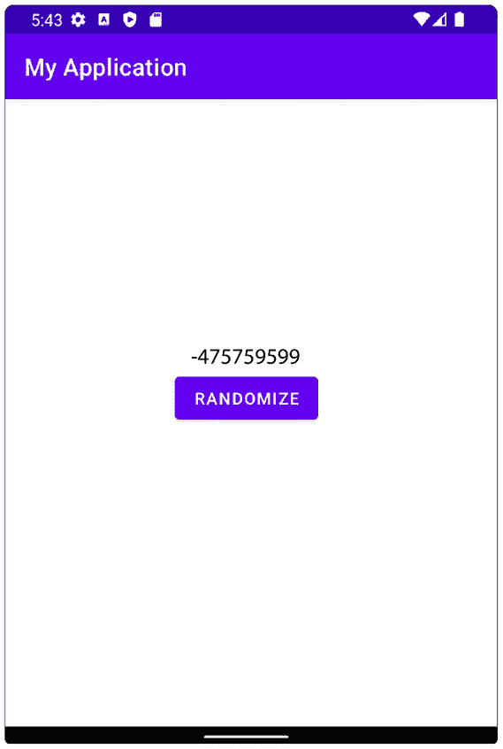
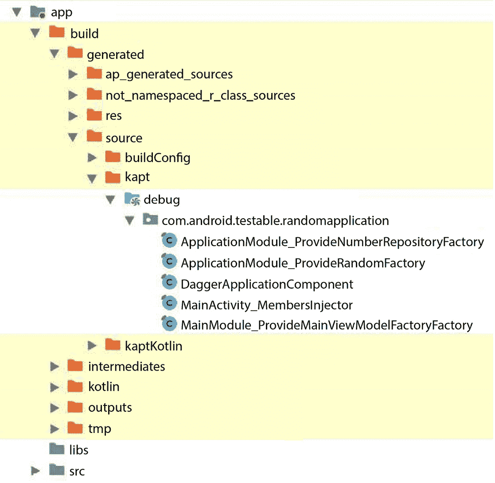
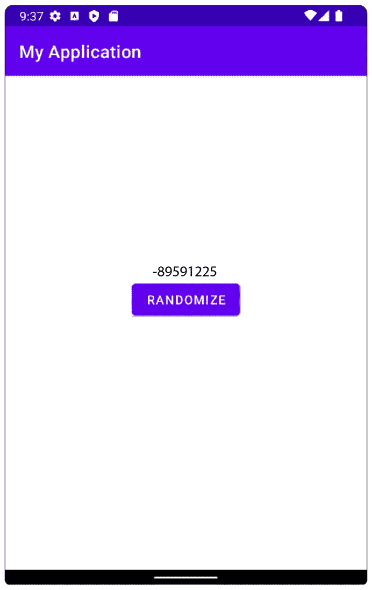

# 13

# 使用 Dagger、Hilt 和 Koin 进行依赖注入

本章涵盖了依赖注入的概念及其对 Android 应用程序提供的益处。我们将探讨如何借助容器类手动执行依赖注入。我们还将介绍一些可用于 Android、Java 和 Kotlin 的框架，这些框架可以帮助开发者应用这一概念。在本章结束时，你将能够使用 Dagger 2 和 Koin 来管理你的应用程序依赖，并了解如何有效地组织它们。

在上一章中，我们探讨了如何将代码结构化成不同的组件，包括 ViewModels、API 组件和持久化组件。其中一直存在的困难之一是所有这些组件之间的依赖关系，尤其是在进行单元测试时。

本章将涵盖以下主题：

+   手动依赖注入

+   Dagger 2

+   Hilt

+   Koin

# 技术要求

本章中所有练习和活动的完整代码可在 GitHub 上找到，链接为[`packt.link/IIQmX`](https://packt.link/IIQmX)

# 依赖注入的必要性

我们一直使用`Application`类来创建这些组件的实例，并将它们传递给组件上层构造函数（我们创建了 API 和 Room 实例，然后是 Repository 实例，等等）。我们所做的是依赖注入的简化版本。

`ViewModels`）。这样做的原因是为了提高代码的可重用性和可测试性，并将创建实例的责任从我们的组件转移到`Application`类。

依赖注入的一个好处是涉及代码库中对象的创建方式。依赖注入将对象的创建与其使用分离。换句话说，一个对象不应该关心另一个对象是如何创建的；它只应该关注与其他对象的交互。

在本章中，我们将分析三种在 Android 中注入依赖的方法：手动依赖注入、Dagger 和 Koin：

+   **手动依赖注入（Manual DI）**：这是一种开发者通过创建容器类来手动处理依赖注入的技术。在本章中，我们将探讨如何在 Android 中实现这一过程。通过研究我们如何手动管理依赖关系，我们将深入了解其他依赖注入框架的工作原理，并为我们如何集成这些框架打下基础。

+   **Dagger**：这是一个为 Java 开发的依赖注入框架。它允许你将依赖分组到不同的模块中。你还可以定义组件，其中模块被添加以创建依赖图，Dagger 会自动实现以执行注入。它依赖于注解处理器来生成执行注入所需的代码。Dagger 的一个专门实现**Hilt**对 Android 应用程序非常有用，因为它消除了大量样板代码并简化了过程。

+   **Koin**：这是一个为 Kotlin 开发的轻量级依赖注入库。它不依赖于注解处理器；它依赖于 Kotlin 的机制来执行注入。在这里，我们还可以将依赖项拆分为模块。

在本章中，我们将探讨这两个库是如何工作的，以及将它们添加到简单 Android 应用程序所需的步骤。

# 手动依赖注入

为了理解依赖注入是如何工作的，我们首先可以分析如何在 Android 应用程序的不同对象中手动注入依赖项。这可以通过创建包含整个应用程序所需依赖项的容器对象来实现。

您还可以创建多个容器，代表应用程序中所需的不同作用域。在这里，您可以定义仅在特定屏幕显示时才需要的依赖项，当屏幕被销毁时，实例也可以被垃圾回收。

这里展示了一个容器示例，该容器将保持实例，直到应用程序的生命周期结束：

```swift
class AppContainer(applicationContext:Context) {
    val myRepository: MyRepository
    init {
        val retrofit =
            Retrofit.Builder().baseUrl(
            "https://google.com/").build()
        val myService=
            retrofit.create<MyService>(MyService::
            class.java)
        val database =
            Room.databaseBuilder(applicationContext,
            MyDatabase::class.java, "db").build()
        myRepository = MyRepositoryImpl(myService,
            database.myDao())
    }
}
```

使用该容器的 `Application` 类看起来如下所示：

```swift
class MyApplication : Application() {
    lateinit var appContainer: AppContainer
    override fun onCreate() {
        super.onCreate()
        appContainer = AppContainer(this)
    }
}
```

如前例所示，创建依赖项的责任已从 `Application` 类转移到 `Container` 类。代码库中的活动仍然可以使用以下命令访问依赖项：

```swift
    override fun onCreate(savedInstanceState: Bundle?) {
        ....
        val myRepository = (application as
        MyApplication).appContainer. myRepository
        ...
}
```

范围有限的模块可以用于创建 `ViewModel` 工厂，这些工厂反过来被框架用来创建 `ViewModel`：

```swift
class MyContainer(private val myRepository: MyRepository) {
    fun geMyViewModelFactory(): ViewModelProvider.Factory {
        return object : ViewModelProvider.Factory {
            override fun <T : ViewModel?>
            create(modelClass: Class<T>): T {
                return MyViewModel(myRepository) as T
            }
        }
    }
}
```

一个活动或片段可以使用这个特定的容器来初始化 `ViewModel`：

```swift
class MyActivity : AppCompatActivity() {
    private lateinit var myViewModel: MyViewModel
    private lateinit var myContainer: MyContainer
    override fun onCreate(savedInstanceState: Bundle?) {
        super.onCreate(savedInstanceState)
        ....
        val myRepository = (application as
            MyApplication).appContainer. myRepository
        myContainer = MyContainer (myRepository)
        myViewModel = ViewModelProvider(this,
            myContainer.geMyViewModelFactory())
            .get(MyViewModel::class.java)
    }
}
```

再次，我们可以看到创建 `Factory` 类的责任已从 `Activity` 类转移到 `Container` 类。`MyContainer` 可以扩展以提供 `MyActivity` 所需的实例，在这些实例的生命周期应与活动相同的情况下，或者构造函数可以扩展以提供具有不同生命周期的实例。

现在，让我们将这些示例应用到练习中。

## 练习 13.01 – 手动注入

在这个练习中，我们将编写一个 Android 应用程序，该应用程序将应用手动依赖注入的概念。该应用程序将有一个仓库，它将生成一个随机数，以及一个带有 `LiveData` 对象的 `ViewModel` 对象，该对象负责检索仓库生成的数字并在 `LiveData` 对象中发布它。

为了做到这一点，我们需要创建两个容器来管理以下依赖项：

+   仓库

+   负责创建 `ViewModel` 的 `ViewModel` 工厂

应用程序本身将在每次点击按钮时显示随机生成的数字：

1.  创建一个新的 Android Studio 项目，并包含一个空活动。

1.  首先，让我们将 `ViewModel` 和 `LiveData` 库添加到 `app/build.gradle` 文件中：

    ```swift
        implementation "androidx.lifecycle:
            lifecycle-viewmodel-ktx:2.5.1"
        implementation "androidx.lifecycle:
            lifecycle-livedata-ktx:2.5.1"
    ```

1.  接下来，让我们在根包的 `main/java` 文件夹中编写一个 `NumberRepository` 接口，它将包含一个获取整数的函数：

    ```swift
    interface NumberRepository {
        fun generateNextNumber(): Int
    }
    ```

1.  现在，我们将在这个根包的`main/java`文件夹中提供这个实现的实现。我们可以使用`java.util.Random`类来生成随机数：

    ```swift
    class NumberRepositoryImpl(private val random: Random)
    : NumberRepository {
        override fun generateNextNumber(): Int {
            return random.nextInt()
        }
    }
    ```

1.  我们现在将转到根包的`main/java`文件夹中的`MainViewModel`类，它将包含一个包含从仓库生成的每个数字的`LiveData`对象：

    ```swift
    class MainViewModel(private val numberRepository:
    NumberRepository) : ViewModel() {
        private val _numberLiveData =
            MutableLiveData<Int>()
        val numberLiveData: LiveData<Int> =
            _numberLiveData
        fun generateNextNumber() {
            _numberLiveData.postValue(numberRepository
            .generateNextNumber())
        }
    }
    ```

1.  接下来，让我们继续创建用于显示数字的`TextView`和用于生成下一个随机数的`Button`。这将是`res/layout/activity_main.xml`文件的一部分：

    ```swift
        <TextView
            android:id="@+id/activity_main_text_view"
            android:layout_width="wrap_content"
            android:layout_height="wrap_content" />
        <Button
            android:id="@+id/activity_main_button"
            android:layout_width="wrap_content"
            android:layout_height="wrap_content"
            android:text="@string/randomize" />
    ```

此步骤的完整代码可以在[`packt.link/lr5Fx`](https://packt.link/lr5Fx)找到。

1.  确保将按钮的字符串添加到`res/values/strings.xml`文件中：

    ```swift
       <string name="randomize">Randomize</string>
    ```

1.  现在，让我们在根包的`main/java`文件夹中创建我们的`Application`类：

    ```swift
    class RandomApplication : Application() {
        override fun onCreate() {
            super.onCreate()
        }
    }
    ```

1.  让我们也将`Application`类添加到`AndroidManifest.xml`文件中的`application`标签下：

    ```swift
        <application
            ...
            android:name=".RandomApplication"
    .../>
    ```

1.  现在，让我们在根包的`main/java`文件夹中创建我们的第一个容器，该容器负责管理`NumberRepository`依赖项：

    ```swift
    class ApplicationContainer {
        val numberRepository: NumberRepository =
        NumberRepositoryImpl(Random())
    }
    ```

1.  接下来，让我们将这个容器添加到`RandomApplication`类中：

    ```swift
    class RandomApplication : Application() {
        val applicationContainer = ApplicationContainer()
        override fun onCreate() {
            super.onCreate()
        }
    }
    ```

1.  我们现在继续在根包的`main/java`文件夹中创建`MainContainer`，它需要一个对`NumberRepository`依赖项的引用，并将提供创建`MainViewModel`所需的`ViewModel`工厂的依赖项：

    ```swift
    class MainContainer(private val numberRepository: NumberRepository) {
        fun getMainViewModelFactory():
        ViewModelProvider.Factory {
            return object : ViewModelProvider.Factory {
                override fun <T : ViewModel>
                create(modelClass: Class<T>): T {
                    return MainViewModel(numberRepository)
                    as T
                }
            }
        }
    }
    ```

1.  最后，我们可以修改`MainActivity`以从我们的容器中注入依赖项，并将 UI 元素连接起来以显示输出：

    ```swift
    class MainActivity : AppCompatActivity() {
        override fun onCreate(savedInstanceState: Bundle?) {
            super.onCreate(savedInstanceState)
            setContentView(R.layout.activity_main)
            val mainContainer =
                MainContainer((application as
                RandomApplication).applicationContainer
                .numberRepository)
            val viewModel = ViewModelProvider(this,
                mainContainer.getMainViewModelFactory()
            ).get(MainViewModel::class.java)
            viewModel.numberLiveData.observe(this,
            Observer {
                findViewById<TextView>(
                R.id.activity_main_text_view).text =
                it.toString()
            }
            )
            findViewById<TextView>(
            R.id.activity_main_button).setOnClickListener
            {
                viewModel.generateNextNumber()
            }
        }
    }
    ```

在高亮显示的代码中，我们可以看到我们正在使用在`ApplicationContainer`中定义的仓库并将其注入到`MainContainer`中，然后它将通过`ViewModelProvider.Factory`将其注入到`ViewModel`中。前面的示例应该会呈现*图 13.1*.1*中的输出：


图 13.1 – 练习 13.01 的模拟器输出，显示随机生成的数字

手动依赖注入是设置小型应用程序依赖项的一种简单方法，但随着应用程序的增长，它可能会变得极其困难。想象一下，如果在*练习 13.01*的*手动注入*中，我们有两个从`NumberRepository`扩展的类。我们将如何处理这种情况？开发者将如何知道哪个被用于哪个活动？这些问题在 Google Play 上大多数知名应用程序中变得非常普遍，这就是为什么手动依赖注入很少使用。当使用时，它通常采用类似于我们接下来将要查看的依赖注入框架的形式。

# Dagger 2

**Dagger 2**提供了一种全面的方式来组织应用程序的依赖项。它具有首先在 Android 上被开发社区采用的优势，在 Kotlin 引入之前。这是许多 Android 应用程序使用 Dagger 作为其依赖注入框架的原因之一。

该框架的另一个优势是针对用 Java 编写的 Android 项目，因为库是用相同的语言开发的。该框架最初由 Square（Dagger 1）开发，后来过渡到 Google（Dagger 2）。在本章中，我们将介绍 Dagger 2 及其优势。

Dagger 2 提供的一些关键功能如下所示：

+   注入

+   在模块中分组的依赖项

+   用于生成依赖图的组件

+   标准化

+   范围

+   子组件

当处理 Dagger 时，注解是关键元素，因为它通过注解处理器生成执行 DI 所需的代码。主要注解可以按以下方式分组：

+   `@Module`负责提供可以注入的对象（依赖对象）

+   `@Inject`注解用于定义依赖项

+   被`@Component`注解的接口定义了提供者和消费者之间的连接

你需要在`app/build.gradle`文件中添加以下依赖项，以将 Dagger 添加到你的项目中：

```swift
implementation 'com.google.dagger:dagger:2.44.2'
kapt 'com.google.dagger:dagger-compiler:2.44.2'
```

由于我们正在处理注解处理器，在同一个`build.gradle`文件中，你需要为它们添加插件：

```swift
apply plugin: 'com.android.application'
apply plugin: 'kotlin-android'
apply plugin: 'kotlin-kapt'
```

我们现在应该对 Dagger 2 如何执行 DI 有一个概念。接下来，我们将查看 Dagger 2 提供的每个注解组。

## 消费者

Dagger 使用`javax.inject.Inject`来识别需要注入的对象。有多种注入依赖项的方法，但推荐的方法是通过构造函数注入和字段注入。构造函数注入的代码可能如下所示：

```swift
import javax.inject.Inject
class ClassA @Inject constructor()
class ClassB @Inject constructor(private val classA:
ClassA)
```

当构造函数被`@Inject`注解时，Dagger 将生成负责实例化对象的`Factory`类。在`ClassB`的例子中，Dagger 将尝试找到适合构造函数签名的适当依赖项，在这个例子中是`ClassA`，Dagger 已经为其创建了一个实例。

如果你不想让 Dagger 管理`ClassB`的实例化，但仍然需要将`ClassA`的依赖注入，你可以使用字段注入，其形式可能如下所示：

```swift
import javax.inject.Inject
class ClassA @Inject constructor()
class ClassB {
    @Inject
    lateinit var classA: ClassA
}
```

在这种情况下，Dagger 将生成必要的代码，仅用于在`ClassB`和`ClassA`之间注入依赖。

## 提供者

你可能会遇到应用程序使用外部依赖项的情况。这意味着你不能通过构造函数注入来提供实例。构造函数注入不可行的情况还包括使用接口或抽象类。

在这种情况下，Dagger 可以使用`@Provides`注解提供实例。然后你需要将提供实例的方法分组到被`@Module`注解的模块中：

```swift
import dagger.Module
import dagger.Provides
class ClassA
class ClassB(private val classA: ClassA)
@Module
object MyModule {
    @Provides
    fun provideClassA(): ClassA = ClassA()
    @Provides
    fun provideClassB(classA: ClassA): ClassB =
        ClassB(classA)
}
```

如前例所示，`ClassA` 和 `ClassB` 没有任何 Dagger 注解。创建了一个模块，它将为 `ClassA` 提供实例，然后将被用来为 `ClassB` 提供实例。在这种情况下，Dagger 将为每个 `@Provides` 注解的方法生成一个 `Factory` 类。

## 连接器

假设我们将有多个模块，我们必须将它们组合成一个可以在应用程序中使用的依赖关系图。Dagger 提供了 `@Component` 注解。这通常用于将被 Dagger 实现的接口或抽象类。

除了组装依赖关系图之外，组件还提供了向特定对象的成员中注入依赖项的功能。在组件中，你可以指定提供方法，这些方法返回模块中提供的依赖项：

```swift
import dagger.Component
@Component(modules = [MyModule::class])
interface MyComponent {
    fun inject(myApplication: MyApplication)
}
```

对于前面的 `Component`，Dagger 将生成一个 `DaggerMyComponent` 类，我们可以按照以下代码所述构建它：

```swift
import android.app.Application
import javax.inject.Inject
class MyApplication : Application() {
    @Inject
    lateinit var classB: ClassB
    override fun onCreate() {
        super.onCreate()
val component = DaggerMyComponent.create()
        //needs to build the project once to generate
        //DaggerMyComponent.class
        component.inject(this)
    }
}
```

`Application` 类将创建 Dagger 依赖图和组件。`Component` 中的 `inject` 方法允许我们对 `Application` 类中用 `@Inject` 注解的变量执行依赖注入，从而让我们访问模块中定义的 `ClassB` 对象。

## 限定符

如果你想要提供同一类的多个实例（例如，在应用程序中注入不同的字符串或整数），可以使用限定符。这些是帮助你识别实例的注解。其中最常见的一个是 `@Named` 限定符，如下面的代码所述：

```swift
@Module
object MyModule {
    @Named("classA1")
    @Provides
    fun provideClassA1(): ClassA = ClassA()
    @Named("classA2")
    @Provides
    fun provideClassA2(): ClassA = ClassA()
    @Provides
    fun provideClassB(@Named("classA1") classA: ClassA):
    ClassB = ClassB(classA)
}
```

在这个例子中，我们创建了两个 `ClassA` 的实例，并给它们不同的名称。然后，尽可能使用第一个实例来创建 `ClassB`。我们还可以创建自定义限定符，而不是使用 `@Named` 注解，如下面的代码所述：

```swift
import javax.inject.Qualifier
@Qualifier
@MustBeDocumented
@kotlin.annotation.Retention(AnnotationRetention.RUNTIME)
annotation class ClassA1Qualifier
@Qualifier
@MustBeDocumented
@kotlin.annotation.Retention(AnnotationRetention.RUNTIME)
annotation class ClassA2Qualifier
```

模块可以像这样更新：

```swift
@Module
object MyModule {
    @ClassA1Qualifier
    @Provides
    fun provideClassA1(): ClassA = ClassA()
    @ClassA2Qualifier
    @Provides
    fun provideClassA2(): ClassA = ClassA()
    @Provides
    fun provideClassB(@ClassA1Qualifier classA: ClassA):
    ClassB = ClassB(classA)
}
```

## 范围

如果你想要跟踪你的组件和依赖项的生存周期，你可以使用范围。Dagger 提供了 `@Singleton` 范围。这通常表示你的组件将与你的应用程序一样长存。

范围定义对对象的生存周期没有影响；它们被构建来帮助开发者识别对象的生存周期。建议为你的组件指定一个范围，并将代码分组以反映该范围。

一些常见的 Android 上 Dagger 的范围与活动或片段相关：

```swift
import javax.inject.Scope
@Scope
@MustBeDocumented
@kotlin.annotation.Retention(AnnotationRetention.RUNTIME)
annotation class ActivityScope
@Scope
@MustBeDocumented
@kotlin.annotation.Retention(AnnotationRetention.RUNTIME)
annotation class FragmentScope
```

该注解可以在提供依赖项的模块中使用：

```swift
@ActivityScope
@Provides
fun provideClassA(): ClassA = ClassA()
```

`Component` 的代码如下：

```swift
@ActivityScope
@Component(modules = [MyModule::class])
interface MyComponent {
}
```

前面的例子表明，`Component` 只能使用具有相同范围的对象。如果 `Component` 的任何模块包含具有不同范围的依赖项，Dagger 将抛出一个错误，指示范围存在问题。

## 子组件

与作用域密切相关的是子组件。它们允许你为较小的作用域组织依赖项。在 Android 中，一个常见的用例是为活动和片段创建子组件。子组件继承父组件的依赖项，并为子组件的作用域生成一个新的依赖图。

假设我们有一个独立的模块，如下所示：

```swift
class ClassC
@Module
object MySubcomponentModule {
    @Provides
    fun provideClassC(): ClassC = ClassC()
}
```

一个将为此模块生成依赖图的 `Subcomponent` 可能看起来如下所示：

```swift
import dagger.Subcomponent
@ActivityScope
@Subcomponent(modules = [MySubcomponentModule::class])
interface MySubcomponent {
    fun inject(mainActivity: MainActivity)
}
```

父组件需要声明新的组件，如下面的代码片段所示：

```swift
import dagger.Component
@Component(modules = [MyModule::class])
interface MyComponent {
    fun inject(myApplication: MyApplication)
    fun createSubcomponent(mySubcomponentModule:
    MySubcomponentModule): MySubcomponent
}
```

你可以按照以下方式将 `ClassC` 注入到你的活动中：

```swift
@Inject
    lateinit var classC: ClassC
    override fun onCreate(savedInstanceState: Bundle?) {
        super.onCreate(savedInstanceState)
        (application as MyApplication).component
        .createSubcomponent(MySubcomponentModule)
        .inject(this)
}
```

基于这些知识，让我们继续进行练习。

## 练习 13.02 – Dagger 注入

在这个练习中，我们将编写一个 Android 应用程序，该程序将使用 Dagger 应用 DI 概念。该应用程序将具有与 *练习 13.01*，*手动注入* 中定义相同的 `Repository` 和 `ViewModel`。

我们需要使用 Dagger 来公开相同的两个依赖项：

+   `Repository`：这将具有 `@Singleton` 作用域，并由 `ApplicationModule` 提供。现在，`ApplicationModule` 将作为 `ApplicationComponent` 的一部分公开。

+   `ViewModelProvider.Factory`：这将具有自定义定义的作用域名称 `MainScope`，并由 `MainModule` 提供。现在，`MainModule` 将由 `MainSubComponent` 公开。此外，`MainSubComponent` 将由 `ApplicationComponent` 生成。

应用程序本身将在每次点击按钮时显示一个随机生成的数字。为了实现这一点，请执行以下步骤：

1.  创建一个新的 Android Studio 项目，包含空活动。

1.  首先，我们将 Dagger 和 `ViewModel` 库添加到 `app/build.gradle` 文件中：

    ```swift
        implementation 'com.google.dagger:dagger:2.44.2'
        kapt 'com.google.dagger:dagger-compiler:2.44.2'
        implementation "androidx.lifecycle:
            lifecycle-viewmodel-ktx:2.5.1"
        implementation "androidx.lifecycle:
            lifecycle-livedata-ktx:2.5.1"
    ```

1.  我们还需要在 `app/build.gradle` 模块中添加 `kapt` 插件。按照以下方式附加插件：

    ```swift
    apply plugin: 'kotlin-kapt'
    ```

1.  我们现在需要添加 `NumberRepository`、`NumberRepositoryImpl`、`Main` **ViewModel** 和 `RandomApplication` 类，并使用 `Main` **Activity** 构建我们的 UI。这可以通过遵循 *练习 13.01*，*手动注入* 中的 *步骤 2–9* 来完成。

1.  现在，让我们转向根包的 `main/java` 文件夹中的 `ApplicationModule`，它将提供 `NumberRepository` 依赖项：

    ```swift
        @Module
        class ApplicationModule {
            @Provides
            fun provideRandom(): Random = Random()
            @Provides
            fun provideNumberRepository(random: Random):
            NumberRepository =
            NumberRepositoryImpl(random)
    }
    ```

1.  现在，让我们在根包的 `main/java` 文件夹中创建 `MainModule`，它将提供 `ViewModel.Factory` 的实例：

    ```swift
    @Module
    class MainModule {
        @Provides
        fun provideMainViewModelFactory(numberRepository:
        NumberRepository): ViewModelProvider.Factory {
            return object : ViewModelProvider.Factory {
                override fun <T : ViewModel>
                create(modelClass: Class<T>): T {
                    return MainViewModel(numberRepository)
                    as T
                }
            }
        }
    }
    ```

1.  现在，让我们在根包的 `main/java` 文件夹中创建 `MainScope`：

    ```swift
    @Scope
    @MustBeDocumented
    @kotlin.annotation.Retention(AnnotationRetention
    .RUNTIME)
    annotation class MainScope
    ```

1.  我们还需要在根包的 `main/java` 文件夹中创建 `MainSubcomponent`，它将使用前面的作用域：

    ```swift
    @MainScope
    @Subcomponent(modules = [MainModule::class])
    interface MainSubcomponent {
        fun inject(mainActivity: MainActivity)
    }
    ```

1.  接下来，我们需要在根包的 `main/java` 文件夹中引入 `ApplicationComponent`：

    ```swift
    @Singleton
    @Component(modules = [ApplicationModule::class])
    interface ApplicationComponent {
        fun createMainSubcomponent(): MainSubcomponent
    }
    ```

1.  接下来，我们修改 `RandomApplication` 类以添加初始化 Dagger 依赖图的代码：

    ```swift
    class RandomApplication : Application() {
        lateinit var applicationComponent:
        ApplicationComponent
        override fun onCreate() {
            super.onCreate()
            applicationComponent =
            DaggerApplicationComponent.create()
        }
    }
    ```

1.  现在我们修改 `MainActivity` 类以注入 `ViewModelProvider.Factory` 并初始化 `ViewModel`，以便我们可以显示随机数：

    ```swift
    class MainActivity : AppCompatActivity() {
        @Inject
        lateinit var factory: ViewModelProvider.Factory
        override fun onCreate(savedInstanceState: Bundle?)
        {
            (application as RandomApplication)
                .applicationComponent
                .createMainSubcomponent()
                .inject(this)
            super.onCreate(savedInstanceState)
        }
    }
    ```

本步骤的完整代码可以在 [`packt.link/A7ozE`](https://packt.link/A7ozE) 找到。

1.  我们需要导航到 `Build` 并在 Android Studio 中点击 `Rebuild project`，以便 Dagger 生成执行 DI 的代码。

如果您运行前面的代码，它将构建一个应用程序，当您点击按钮时将显示不同的随机输出：



图 13.2 – 练习 13.02 的模拟器输出，显示随机生成的数字

1.  *图 13*.3 显示了应用程序的外观。您可以在 `app/build` 文件夹中查看生成的 Dagger 代码：



图 13.3 – 为练习 13.02 生成的 Dagger 代码

在 *图 13*.3 中，我们可以看到 Dagger 生成的代码，以满足依赖项之间的关系。对于每个需要注入的依赖项，Dagger 将生成一个适当的 `Factory` 类（基于 `Factory` 设计模式），该类将负责创建依赖项。

Dagger 还会查看需要注入依赖的地方，并生成一个 `Injector` 类，该类将负责将值分配给依赖项（在这种情况下，它将分配给 `MainActivity` 类中注解了 `@Inject` 的成员）。

最后，Dagger 为带有 `@Component` 注解的接口创建实现。在实现中，Dagger 将处理模块的创建，并提供一个构建器，开发者可以指定如何构建模块。

当组织 Android 应用程序的依赖项时，您会发现的一个常见设置如下：

+   `ApplicationModule`：这是定义整个项目共通依赖的地方。可以在此提供如 context、资源和其他 Android 框架对象。

+   `NetworkModule`：这是存储与 API 调用相关的依赖的地方。

+   `StorageModule`：这是存储与持久化相关的依赖的地方。它可以分为 `DatabaseModule`、`FilesModule`、`SharedPreferencesModule` 等。

+   `ViewModelsModule`：这是存储 `ViewModel` 或 `ViewModel` 工厂依赖的地方。

+   `FeatureModule`：这是为具有自己 `ViewModel` 的特定活动或片段组织依赖的地方。在这里，可以使用子组件或 Android 注入器来完成此目的。

我们提出了一些关于手动 DI 可能出错的问题。现在我们已经看到 Dagger 如何解决这些问题。尽管它完成了工作，并且在性能方面做得很快，但它也是一个复杂且学习曲线非常陡峭的框架。

# Hilt

当我们在 Android 应用程序中使用 Dagger 时，我们被迫编写一些模板代码。其中一些是关于处理与 Activities 和 Fragments 链接的对象的生命周期，这导致我们创建子组件；其他部分是关于 ViewModels 的使用。

为了简化 Android 中的 Dagger，曾尝试使用 Dagger-Android 库，但后来在 Dagger 的基础上开发了一个新的库，称为 **Hilt**。这个库通过使用新的注解简化了大部分的 Dagger 使用，这导致产生了更多的模板代码，这些代码可以被生成。

要在项目中使用 Hilt，我们需要以下内容：

```swift
apply plugin: 'com.android.application'
apply plugin: 'kotlin-android'
apply plugin: 'kotlin-kapt'
apply plugin: 'com.google.dagger.hilt.android'
```

或者根据你的项目如何使用 Gradle，你可能需要使用以下内容：

```swift
plugins {
  …
  id 'kotlin-kapt'
  id 'com.google.dagger.hilt.android'
}
```

在这两种情况下，你都需要一个插件来处理注解，以及一个单独的插件来处理项目中的 Hilt。

要将 Hilt 添加到你的项目中，你需要以下内容：

```swift
dependencies {
  implementation "com.google.dagger:hilt-android:2.44.2"
  kapt "com.google.dagger:hilt-compiler:2.44.2"
}
```

Hilt 首先在 `Application` 类中做出的改变是，不再需要调用特定的 Dagger 组件来初始化，使用 Hilt，你只需使用 `@HiltAndroidApp` 注解即可：

```swift
@HiltAndroidApp
class MyApplication : Application() {
}
```

上述代码片段将让 Hilt 知道你的应用程序的入口点，并开始生成依赖图。

Hilt 的另一个好处在于与 Android 组件（如 `Activities`、`Fragments`、`Views`、`Services` 和 `BroadcastReceivers`）交互时。对于这些组件，我们可以使用 `@AndroidEntryPoint` 注解将依赖注入到每个这些类中，如下所示：

```swift
@AndroidEntryPoint
class MyActivity : AppCompatActivity() {
    @Inject
    lateinit var myObject: MyObject
}
```

在上述代码片段中，`@AndroidEntryPoint` 的使用允许 Hilt 将 `myObject` 注入到 `MyActivity` 中。类似的方法也可以用于通过 `@HiltViewModel` 注解将依赖注入到 `ViewModels` 中：

```swift
@HiltViewModel
class MyViewModel @Inject constructor(private val myObject:
MyObject) : ViewModel()
```

在上述代码片段中，`@HiltViewModel` 注解允许 Hilt 将 `myObject` 注入到 `MyViewModel` 中。我们还可以观察从 Dagger 继承而来的 `@Inject` 注解，不需要使用模块。

当涉及到模块时，Hilt 继续采用 Dagger 的方法，增加了一个小的改进：使用 `@InstallIn` 注解。这会将注解模块与特定的组件关联起来。Hilt 提供了一系列预构建的组件，例如 `SingletonComponent`、`ViewModelComponent`、`ActivityComponent`、`FragmentComponent`、`ViewComponent` 和 `ServiceComponent`。

这些组件中的每一个都将注解模块中依赖项的生命周期与应用程序、`ViewModel`、`Activity`、`Fragment`、`View` 和 `Service` 的生命周期相链接：

```swift
@Module
@InstallIn(SingletonComponent::class)
class MyModule {
    @Provides
    fun provideMyObject(): MyObject = MyObject()
}
```

在上述代码片段中，我们可以看到 Hilt 中的 `@Module` 的样子以及我们如何使用 `@InstallIn` 注解来指定 `MyObject` 的生命周期与我们的应用程序的生命周期相同。

当涉及到仪器化测试时，Hilt 提供了有用的注解来更改测试的依赖项。如果我们想利用这些功能，那么我们需要以下测试依赖项：

```swift
    androidTestImplementation 'com.google.dagger:
        hilt-android-testing:2.44.2'
    kaptAndroidTest 'com.google.dagger:
        hilt-android-compiler:2.44.2'
```

然后，我们可以进入我们的测试，并按照以下方式引入 Hilt：

```swift
@HiltAndroidTest
class MyInstrumentedTest {
    @get:Rule
    var hiltRule = HiltAndroidRule(this)
    @Inject
    lateinit var myObject: MyObject
    @Before
    fun init() {
        hiltRule.inject()
    }
}
```

在前面的代码片段中，使用了`@HiltAndroid`测试和`hiltRule`来交换应用程序中使用的依赖项与测试依赖项。注入调用使我们能够将`MyObject`依赖项注入到测试类中。为了提供测试依赖项，我们可以在`androidTest`文件夹中编写一个新的模块，如下所示：

```swift
@Module
@TestInstallIn(
    components = [SingletonComponent::class],
    replaces = [MyModule::class]
)
class MyTestModule {
    @Provides
    fun provideMyObject(): MyObject = MyTestObject()
}
```

在这里，我们使用`@TestInstallIn`注解，该注解将用`MyTestModule`替换依赖图中现有的`MyModule`，从而提供我们想要交换的依赖项的不同子类。

为了使 Hilt 能够初始化用于测试的仪器，我们需要定义一个自定义测试运行器，以从 Hilt 库提供一个测试应用程序。该运行器可能看起来如下所示：

```swift
class HiltTestRunner : AndroidJUnitRunner() {
    override fun newApplication(cl: ClassLoader?, name:
    String?, context: Context?): Application {
        return super.newApplication(cl,
        HiltTestApplication::class.java.name, context)
    }
}
```

此运行器需要在运行测试的模块的`build.gradle`中注册：

```swift
android {
    …
    defaultConfig {
        …
        testInstrumentationRunner "{app_package_name}
            .HiltTestRunner"
    }
}
```

在本节中，我们研究了 Hilt 库及其在移除使用 Dagger 所需的样板代码方面的优势。

## 练习 13.03 – Hilt 注入

修改*练习 13.02*、*Dagger 注入*，以便删除`@Component`和`@Subcomponent`类，并使用 Hilt：

1.  在顶级`build.gradle`文件中添加 Hilt 插件：

    ```swift
    plugins {
        …
        id 'com.google.dagger.hilt.android' version
        '2.44.2' apply false
    }
    ```

1.  在`app/build.gradle`中添加 Hilt 插件：

    ```swift
    plugins {
        id 'com.android.application'
        id 'org.jetbrains.kotlin.android'
        id 'kotlin-kapt'
        id 'com.google.dagger.hilt.android'
    }
    ```

1.  在同一文件中，将 Dagger 依赖项替换为 Hilt 依赖项，并添加用于生成`ViewModel`的片段扩展库：

    ```swift
        implementation "com.google.dagger:
            hilt-android:2.44.2"
        kapt "com.google.dagger:hilt-compiler:2.44.2"
        implementation 'androidx.fragment:
            fragment-ktx:1.5.5'
    ```

1.  从项目中删除`ApplicationComponent`、`MainModule`、`MainScope`和`MainSubcomponent`。

1.  将`@InstallIn`注解添加到`ApplicationModule`：

    ```swift
    @Module
    @InstallIn(SingletonComponent::class)
    class ApplicationModule {
    }
    ```

1.  从`RandomApplication`内部删除所有代码并添加`@HiltAndroidApp`注解：

    ```swift
    @HiltAndroidApp
    class RandomApplication : Application()
    ```

1.  修改`MainViewModel`以添加`@HiltViewModel`和`@Inject`注解：

    ```swift
    @HiltViewModel
    class MainViewModel @Inject constructor(private val
    numberRepository: NumberRepository) :
        ViewModel() {
        …
    }
    ```

1.  修改`MainActivity`以注入`MainViewModel`，删除之前删除的所有组件依赖项，并添加`@AndroidEntryPoint`注解：

    ```swift
    @AndroidEntryPoint
    class MainActivity : AppCompatActivity() {
        private val mainViewModel: MainViewModel by
        viewModels()
    }
    ```

此步骤的完整代码可以在[`packt.link/k7hs7`](https://packt.link/k7hs7)找到。

在前面的代码片段中，我们使用`viewModels`方法来获取`MainViewModel`依赖项。这是`androidx.fragment:fragment-ktx:1.5.5`扩展函数中内置的一种机制，它将寻找获取我们`ViewModel`实例的工厂。

如果我们运行代码，我们应该看到以下输出：


图 13.4 – 练习 13.03 的输出

我们可以看到，使用 Hilt 而不是 Dagger 可以简化应用程序代码的程度。例如，我们不再需要处理被`@Component`和`@Subcomponent`注解的类，以及在应用程序组件中管理子组件，而且我们也不需要从`Application`类手动初始化依赖图，因为 Hilt 为我们处理了这一点。这些都是 Hilt 成为 Android 应用程序中依赖注入最广泛采用的库的主要原因之一。

# Koin

Koin 是一个适合小型应用程序的轻量级框架。它不需要代码生成，并且基于 Kotlin 的功能扩展构建。它也是一个**领域特定语言**（**DSL**）。您可能已经注意到，当使用 Dagger 时，必须编写大量代码来设置 DI。Koin 对 DI 的方法解决了这些问题中的大多数，允许更快地集成。

您可以通过将以下依赖项添加到`build.gradle`文件中来将 Koin 添加到您的项目中：

```swift
implementation "io.insert-koin:koin-core:3.2.2"
```

要在您的应用程序中设置 Koin，您需要使用 DSL 语法调用`startKoin`：

```swift
class MyApplication : Application() {
    override fun onCreate() {
        super.onCreate()
        startKoin {
            androidLogger(Level.INFO)
            androidContext(this@MyApplication)
            androidFileProperties()
            modules(myModules)
        }
    }
}
```

在这里，您可以配置您的应用程序上下文是什么（在`androidContext`方法中），指定属性文件来定义 Koin 配置（在`androidFileProperties`中），声明 Koin 的日志级别，这将根据级别（在`androidLogger`方法中）在`LogCat`结果中输出 Koin 操作的结果，并列出应用程序使用的模块。创建模块时使用类似的语法：

```swift
class ClassA
class ClassB(private val classB: ClassA)
    val moduleForClassA = module {
        single { ClassA() }
    }
    val moduleForClassB = module {
        factory { ClassB(get()) }
    }
    override fun onCreate() {
        super.onCreate()
        startKoin {
            androidLogger(Level.INFO)
            androidContext(this@MyApplication)
            androidFileProperties()
modules(listOf(moduleForClassA,
            moduleForClassB))
        }
    }
```

在前面的示例中，两个对象将有两个不同的生命周期。当使用**单例**符号提供依赖项时，整个应用程序生命周期中只会使用一个实例。这对于仓库、数据库和 API 组件很有用，因为多个实例对应用程序来说成本高昂。

**工厂**符号将在每次执行注入时创建一个新的对象。在对象需要像活动或片段一样长时间存活的情况下，这可能很有用。

可以使用`by inject()`方法或`get()`方法注入依赖项，如下面的代码所示：

```swift
    class MainActivity : AppCompatActivity() {
      val classB: ClassB by inject()
    }
    override fun onCreate(savedInstanceState: Bundle?) {
        super.onCreate(savedInstanceState)
        val classB: ClassB = get()
    }
```

当创建模块时，Koin 还提供了使用`named()`方法添加限定符的可能性。这允许您提供同一类型的多个实现（例如，提供具有不同内容的两个或多个列表对象）：

```swift
    val moduleForClassA = module {
        single(named("name")) { ClassA() }
    }
```

Koin 为 Android 应用程序的主要功能之一是活动片段的作用域，如下面的代码片段所示：

```swift
    val moduleForClassB = module {
        scope(named<MainActivity>()) {
            scoped { ClassB(get()) }
        }
    }
```

前面的示例将`ClassB`依赖项的生命周期连接到`MainActivity`的生命周期。为了将您的实例注入到活动中，您需要扩展`ScopeActivity`类。这个类负责在活动存活期间保持引用。类似类存在于其他 Android 组件中，例如片段（`ScopeFragment`）和服务（`ScopeService`）：

```swift
class MainActivity : ScopeActivity() {
    val classB: ClassB by inject()
}
```

您可以使用`inject()`方法将实例注入到您的活动中。这在您希望限制谁可以访问依赖项时很有用。在先前的示例中，如果另一个活动想要访问`ClassB`的引用，那么它将无法在作用域中找到它。

对于 Android 来说，另一个有用的功能是`ViewModel`注入。要设置此功能，您需要在`build.gradle`中添加库：

```swift
implementation "io.insert-koin:koin-android:3.2.2"
```

如果你记得，`ViewModels`需要`ViewModelProvider.Factories`才能实例化。Koin 自动解决这个问题，允许`ViewModels`直接注入并处理工厂工作：

```swift
    val moduleForClassB = module {
        factory {
            ClassB(get())
        }
        viewModel { MyViewModel(get()) }
    }
```

要将`ViewModel`的依赖注入到你的活动中，你可以使用`viewModel()`方法：

```swift
class MainActivity : AppCompatActivity() {
    val model: MyViewModel by viewModel()
}
```

或者，你也可以直接使用该方法：

```swift
    override fun onCreate(savedInstanceState: Bundle?) {
        super.onCreate(savedInstanceState)
        val model : MyViewModel = getViewModel()
    }
```

如我们前面设置中看到的那样，Koin 充分利用了 Kotlin 的语言特性，并减少了定义你的模块及其作用域所需的样板代码量。

## 练习 13.04 – Koin 注入

在这里，我们将编写一个 Android 应用，该应用将使用 Koin 执行依赖注入。该应用将基于*练习 13.01*，*手动注入*，保留`NumberRepository`，`NumberRepositoryImpl`，`MainViewModel`和`MainActivity`。以下依赖项将被注入：

+   `Repository`：作为名为`appModule`的模块的一部分。

+   `MainViewModel`：这将依赖于 Koin 为`ViewModels`提供的专用实现。这将作为名为`mainModule`的模块的一部分提供，并将具有`MainActivity`的作用域。

执行以下步骤以完成练习：

1.  每次点击按钮时，应用都会显示一个随机生成的数字。让我们先添加 Koin 库：

    ```swift
        implementation "androidx.lifecycle:
            lifecycle-viewmodel-ktx:2.5.1"
        implementation "androidx.lifecycle:
            lifecycle-livedata-ktx:2.5.1"
        implementation "io.insert-koin:koin-android:3.2.2"
        implementation "io.insert-koin:koin-core:3.2.2"
        testImplementation 'junit:junit:4.13.2'
    ```

1.  接下来，在`RandomApplication`类中定义`appModule`变量。这将与 Dagger 设置中的`AppModule`有类似的结构：

    ```swift
    class RandomApplication : Application() {
        val appModule = module {
            single {
                Random()
            }
            single<NumberRepository> {
                NumberRepositoryImpl(get())
            }
    }
    }
    ```

1.  现在，让我们在`appModule`之后添加活动模块变量：

    ```swift
        val mainModule = module {
            scope(named<MainActivity>()) {
                scoped {
                    MainViewModel(get())
                }
            }
        }
    ```

1.  接下来，让我们在`RandomApplication`的`onCreate()`方法中初始化`Koin`：

    ```swift
            super.onCreate()
            startKoin {
                androidLogger()
                androidContext(this@RandomApplication)
                modules(listOf(appModule, mainModule))
            }
    ```

1.  最后，让我们将依赖注入到活动中：

    ```swift
    class MainActivity : ScopeActivity() {
        private val mainViewModel: MainViewModel by
        inject()
    }
    ```

此步骤的完整代码可以在[`packt.link/0Njdv`](https://packt.link/0Njdv)找到。

1.  如果你运行前面的代码，应用应该按照之前的示例工作。然而，如果你检查`LogCat`，你会看到与此类似的输出：

    ```swift
    [Koin]: [init] declare Android Context
    [Koin]: bind type:'android.content.Context' ~ [type:Single,primary_type:'android.content.Context']
    [Koin]: bind type:'android.app.Application' ~ [type:Single,primary_type:'android.app.Application']
    [Koin]: bind type:'java.util.Random' ~ [type:Single,primary_type:'java.util.Random']
    [Koin]: bind type:'com.android.testable.randomapplication .NumberRepository' ~ [type:Single,primary_type:'com.android .testable.randomapplication.NumberRepository']
    [Koin]: total 5 registered definitions
    [Koin]: load modules in 0.4638 ms
    ```

在*图 13.5*中，我们可以看到与之前练习相同的输出：



图 13.5 – 练习 13.04 的模拟器输出，显示随机生成的数字

如我们从本练习中看到的那样，Koin 集成得更快、更简单，特别是与其`ViewModel`库一起使用。这对于小型项目来说很有用，但一旦项目规模扩大，其性能将受到影响。

## 活动 13.01 – 注入仓库

在这个活动中，你将在 Android Studio 中创建一个应用，该应用通过 Retrofit 库连接到示例 API，[`jsonplaceholder.typicode.com/posts`](https://jsonplaceholder.typicode.com/posts)，从网页上检索帖子列表，然后将其显示在屏幕上。

然后，你需要设置一个 UI 测试，检查数据是否正确地显示在屏幕上，但不是连接到实际端点，而是为测试提供用于在屏幕上显示的虚拟数据。你将使用 DI 概念，在应用执行时而不是在测试应用时，使用 Hilt 交换依赖。

为了实现这一点，你需要构建以下内容：

+   一个负责下载和解析 JSON 文件的网络组件

+   一个访问 API 层的数据的仓库

+   一个访问仓库的`ViewModel`实例

+   一个带有`RecycleView`的活动，用于显示数据

+   一个 UI 测试，将断言行并使用虚拟对象生成 API 数据

注意

对于这项活动，可以避免错误处理。

执行以下步骤以完成此活动：

1.  在 Android Studio 中，创建一个带有`Empty Activity`（`MainActivity`）的应用程序，并添加一个`api`包，其中存储你的 API 调用。

1.  定义一个负责 API 调用的类。

1.  创建一个`repository`包。

1.  定义一个包含一个方法、返回包含帖子列表的`LiveData`的`repository`接口。

1.  为`repository`类创建实现。

1.  创建一个`ViewModel`实例来调用`repository`以检索数据。

1.  为 UI 的行创建适配器。

1.  创建将渲染 UI 的活动。

1.  设置一个初始化网络相关依赖的 Hilt 模块。

1.  创建一个负责定义活动所需依赖的 Hilt 模块。

1.  设置 UI 测试和测试应用程序，并提供一个单独的`RepositoryModule`类，该类将返回包含虚拟数据的依赖项。

1.  实现 UI 测试。

注意

这个活动的解决方案可以在[`packt.link/3xfkt`](https://packt.link/3xfkt)找到。

# 摘要

在本章中，我们分析了 DI 的概念以及它应该如何应用于分离关注点，防止对象承担创建其他对象的责任，以及这对测试的巨大好处。我们通过分析手动 DI 的概念开始本章；这作为一个很好的例子，说明了 DI 是如何工作的以及它如何应用于 Android 应用程序；它作为比较 DI 框架的基准。

我们还分析了两个最受欢迎的框架，这些框架帮助开发者注入依赖。我们从名为 Dagger 2 的强大且快速的框架开始，它依赖于注解处理器来生成执行注入的代码。然后我们研究了 Hilt 如何简化 Android 应用的 Dagger 复杂性。我们还调查了 Koin，这是一个用 Kotlin 编写的轻量级框架，性能较慢但集成简单，并且大量关注 Android 组件。

本章的练习旨在探索如何使用多种解决方案来解决相同的问题，并比较这些解决方案的难度级别。在本章的活动实践中，我们利用 Dagger、Hilt 和 Koin 的模块在运行应用程序时注入某些依赖项，在运行使用`ViewModels`、仓库和 API 加载数据的应用程序的测试时注入其他依赖项。

这部分旨在展示多个框架无缝集成的过程，这些框架实现不同的目标。在章节的活动中，我们探讨了如何使用 Hilt 在测试目的下交换依赖项，并注入我们可以断言是否显示在屏幕上的模拟数据。

在接下来的章节中，你将有机会通过添加与线程处理和后台操作相关的概念来构建迄今为止获得的知识。此外，你将有机会探索 RxJava 及其对线程的响应式方法，你还将了解协程，它采用不同的线程处理方法。

你还将观察到协程和 RxJava 如何与 Room 和 Retrofit 等库非常有效地结合。最后，你将能够将这些概念结合到一个健壮的应用程序中，该应用程序将具有很高的未来可扩展性。

# 第四部分：打磨和发布应用

在这部分中，我们将探讨如何使用协程和流异步加载数据，以及如何将它们集成到不同的架构模式中，这进一步有助于我们如何构建应用程序的代码结构。

接下来，我们将探讨如何使用`CoordinatorLayout`和`MotionLayout`在用户界面中渲染动画。最后，我们将了解在 Google Play 上发布应用程序的过程。

在本节中，我们将涵盖以下章节：

+   *第十四章*，*协程和流*

+   *第十五章*，*架构模式*

+   *第十六章*，*使用 CoordinatorLayout 和 MotionLayout 进行动画和过渡*

+   *第十七章*，*在 Google Play 上发布您的应用*
