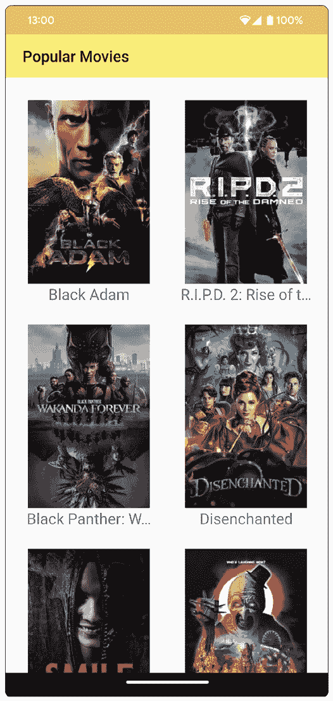
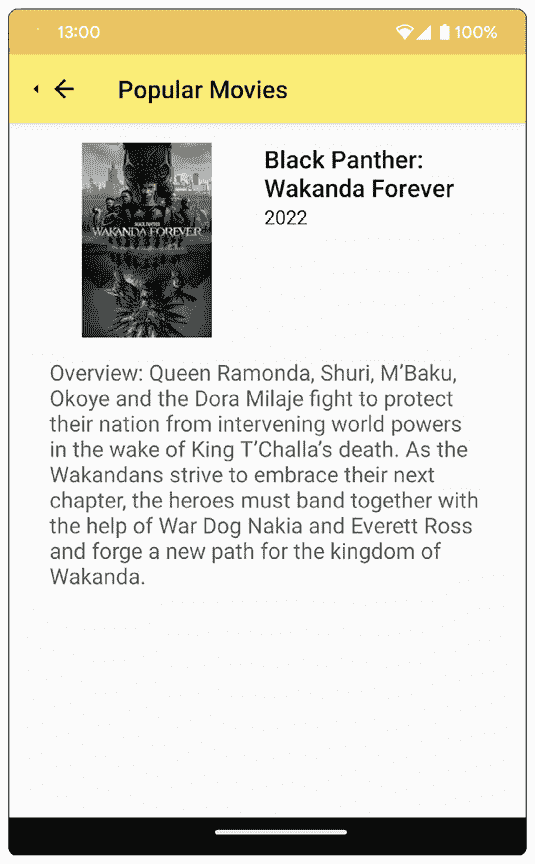
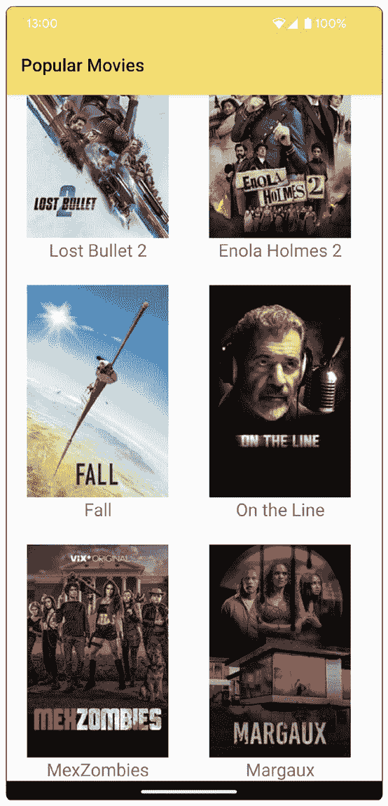
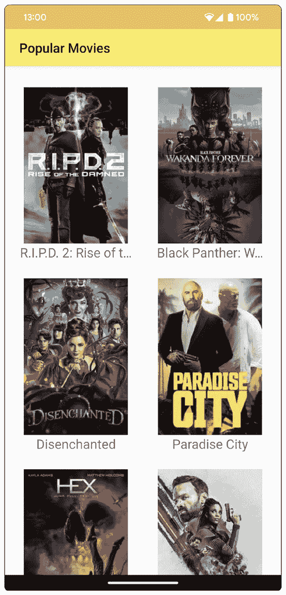
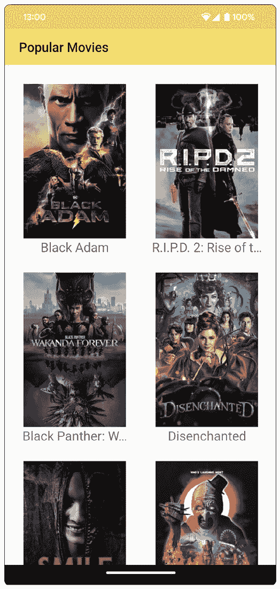
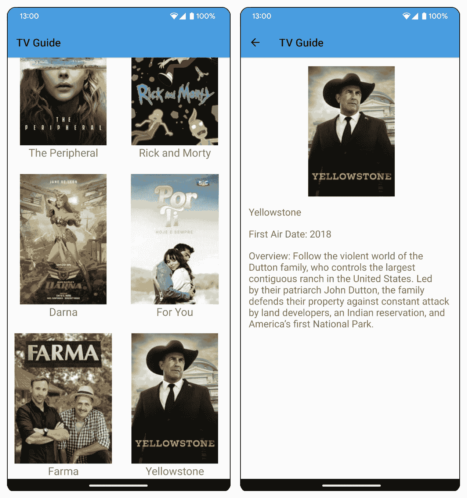

# 第十四章：协程和 Flow

本章介绍了使用协程和 Flow 进行后台操作和数据操作。你还将学习如何使用`LiveData`转换和 Kotlin Flow 操作来操作和显示数据。

到本章结束时，你将能够使用协程和 Flow 在后台管理网络调用。你还将能够使用`LiveData`转换和 Flow 操作来操作数据。

你已经学习了 Android 应用开发的基础知识，并实现了如 RecyclerViews、通知、从网络服务获取数据以及服务等功能。你还掌握了测试和持久化数据的最佳实践。在前一章中，你学习了依赖注入。现在，你将学习关于后台操作和数据操作的内容。

一些 Android 应用程序可以独立工作。然而，大多数应用程序都需要后端服务器来检索或处理数据。这些操作可能需要一段时间，具体取决于网络连接、设备设置和服务器规格。如果长时间运行的操作在主**用户界面**（**UI**）线程上运行，应用程序将被阻塞，直到任务完成。应用程序可能会变得无响应，并提示用户关闭并停止使用它。

为了避免这种情况，可能需要无限期时间的任务必须异步运行。异步任务意味着它可以与另一个任务并行运行或在后台运行。例如，在异步从数据源获取数据时，你的 UI 仍然可以显示，用户交互也可以发生。

你可以使用如协程和 Flow 之类的库来进行异步操作。我们将在本章中讨论这两个库。

本章我们将涵盖以下关键主题：

+   在 Android 上使用协程

+   转换 `LiveData`

+   在 Android 上使用 Flow

# 技术要求

本章中所有练习和活动的完整代码可在 GitHub 上找到，链接为 [`packt.link/puLUO`](https://packt.link/puLUO)

让我们开始学习协程。

# 在 Android 上使用协程

协程是在 Kotlin 1.3 中添加的，用于管理后台任务，如发起网络调用、访问文件或数据库。Kotlin 协程是 Google 在 Android 上异步编程的官方推荐。它们的 Jetpack 库，如 LifeCycle、WorkManager 和 Room，现在都支持协程。

使用协程，你可以以顺序方式编写你的代码。可以将长时间运行的任务转换为挂起函数，当调用时，可以暂停线程而不阻塞它。当挂起函数完成后，当前线程将恢复执行。这将使你的代码更容易阅读和调试。

要将一个函数标记为挂起函数，你可以向它添加`suspend`关键字；例如，如果你有一个调用`getMovies`函数的函数，该函数从你的端点获取`movies`并显示它：

```swift
val movies = getMovies()
displayMovies(movies)
```

你可以通过添加 `suspend` 关键字将 `getMovies()` 函数转换为暂停函数：

```swift
suspend fun getMovies(): List<Movies> { ... }
```

在这里，调用函数将调用 `getMovies` 并暂停。在 `getMovies` 返回电影列表后，它将恢复其任务并显示电影。

暂停函数只能在其他暂停函数或协程中调用。协程有一个上下文，包括协程调度器。调度器指定协程将使用哪个线程。你可以使用以下三个调度器：

+   `Dispatchers.Main`: 用于在 Android 的主线程上运行

+   `Dispatchers.IO`: 用于网络、文件或数据库操作

+   `Dispatchers.Default`: 用于 CPU 密集型工作

要更改协程的上下文，你可以使用 `withContext` 函数为想要使用不同线程的代码。例如，在你的暂停函数 `getMovies` 中，它从端点获取电影，你可以使用 `Dispatchers.IO`：

```swift
suspend fun getMovies(): List<Movies>  {
    withContext(Dispatchers.IO) { ... }
}
```

在下一节中，我们将介绍如何创建协程。

## 创建协程

你可以使用 `async` 和 `launch` 关键字创建协程。`launch` 关键字创建一个协程，不返回任何内容。另一方面，`async` 关键字返回一个值，你可以稍后使用 `await` 函数获取。

`async` 和 `launch` 关键字必须从 `CoroutineScope` 创建，它定义了协程的生命周期。例如，主线程的协程作用域是 `MainScope`。然后你可以使用以下方式创建协程：

```swift
MainScope().async { ... }
MainScope().launch { ... }
```

你也可以通过使用 `CoroutineScope` 创建一个自己的 `CoroutineScope` 而不是使用 `MainScope`。你可以通过使用 `CoroutineScope` 并传递协程的上下文来创建一个。例如，为了在网络调用中使用 `CoroutineScope`，你可以定义以下内容：

```swift
val scope = CoroutineScope(Dispatchers.IO)
```

当函数不再需要时，例如关闭活动时，可以取消协程。你可以通过从 `CoroutineScope` 调用 `cancel` 函数来实现这一点：

```swift
scope.cancel()
```

ViewModel 还有一个用于创建协程的默认 `CoroutineScope`：`viewModelScope`。Jetpack 的 LifeCycle 也有你可以使用的 `lifecycleScope`。当 ViewModel 被销毁时，`viewModelScope` 会被取消；当生命周期被销毁时，`lifecycleScope` 也会被取消。因此，你不再需要取消它们。

在下一节中，你将学习如何将协程添加到你的项目中。

## 添加协程到你的项目

你可以通过将以下代码添加到你的 `app/build.gradle` 文件依赖项中来将协程添加到你的项目中：

```swift
implementation 'org.jetbrains.kotlinx:
    kotlinx-coroutines-core:1.6.4'
implementation 'org.jetbrains.kotlinx:
    kotlinx-coroutines-android:1.6.4'
```

`kotlinx-coroutines-core` 是协程的主要库，而 `kotlinx-coroutines-android` 为主 Android 线程添加了支持。

你可以在 Android 中添加协程，在执行网络调用或从本地数据库获取数据时。

如果你使用 Retrofit 2.6.0 或更高版本，你可以使用 `suspend` 标记端点函数为暂停函数：

```swift
@GET("movie/latest")
suspend fun getMovies() : List<Movies>
```

然后，你可以创建一个协程来调用暂停的 `getMovies` 函数并显示列表：

```swift
CoroutineScope(Dispatchers.IO).launch {
    val movies = movieService.getMovies()
    withContext(Dispatchers.Main) {
        displayMovies(movies)
    }
}
```

你也可以使用 `LiveData` 来处理协程的响应。`LiveData` 是一个可以持有可观察数据的 Jetpack 类。你可以通过添加以下依赖项将 `LiveData` 添加到你的 Android 项目中：

```swift
implementation 'androidx.lifecycle:
lifecycle-livedata-ktx:2.5.1'
```

让我们尝试在一个 Android 项目中使用协程。

## 练习 14.01 – 在 Android 应用中使用协程

对于本章，你将使用 The Movie Database API 显示热门电影的应用程序。前往 [`developers.themoviedb.org`](https://developers.themoviedb.org) 并注册 API 密钥。在这个练习中，你将使用协程来获取热门电影列表：

1.  在本书代码仓库的 `Chapter14` 目录中打开 Android Studio 中的 `Popular Movies` 项目。

1.  打开 `AndroidManifest.xml` 文件并在 manifest 标签内但不在 application 标签外添加 `INTERNET` 权限：

    ```swift
    <uses-permission android:name="android.permission
    .INTERNET" />
    ```

1.  打开 `app/build.gradle` 文件并添加 Kotlin 协程的依赖项：

    ```swift
    implementation 'org.jetbrains.kotlinx:
        kotlinx-coroutines-core:1.6.4'
    implementation 'org.jetbrains.kotlinx:
        kotlinx-coroutines-android:1.6.4'
    ```

这些将允许你在项目中使用协程。

1.  此外，添加 ViewModel 和 `LiveData` 扩展库的依赖项：

    ```swift
    implementation 'androidx.lifecycle:
        lifecycle-livedata-ktx:2.5.1'
    implementation 'androidx.lifecycle:
        lifecycle-viewmodel-ktx:2.5.1'
    ```

1.  打开 `MovieService` 接口并将其替换为以下代码：

    ```swift
    interface MovieService {
        @GET("movie/popular")
        suspend fun getPopularMovies(@Query("api_key")
        apiKey: String): PopularMoviesResponse
    }
    ```

这将 `getPopularMovies` 标记为挂起函数。

1.  打开 `MovieRepository` 并添加 `apiKey`（使用来自电影数据库 API 的值）：

    ```swift
    private val apiKey = "your_api_key_here"
    ```

1.  在 `MovieRepository` 文件中，为电影列表添加电影和错误 `LiveData`：

    ```swift
        private val movieLiveData =
            MutableLiveData<List<Movie>>()
        private val errorLiveData =
            MutableLiveData<String>()
        val movies: LiveData<List<Movie>>
            get() = movieLiveData
        val error: LiveData<String>
            get() = errorLiveData
    ```

1.  添加挂起的 `fetchMovies` 函数以从端点检索列表：

    ```swift
        suspend fun fetchMovies() {
            try {
                val popularMovies =
                    movieService.getPopularMovies(apiKey)
                movieLiveData.postValue(popularMovies
                    .results)
            } catch (exception: Exception) {
                errorLiveData.postValue(
                "An error occurred: ${exception.message}")
            }
        }
    ```

1.  打开 `MovieApplication` 并为 `movieRepository` 添加一个属性：

    ```swift
    class MovieApplication: Application() {
        lateinit var movieRepository: MovieRepository
    }
    ```

1.  覆盖 `MovieApplication` 类的 `onCreate` 函数并初始化 `movieRepository`：

    ```swift
    override fun onCreate() {
        super.onCreate()
        val retrofit = Retrofit.Builder()
            .baseUrl("https://api.themoviedb.org/3/")
            .addConverterFactory(
            MoshiConverterFactory.create())
            .build()
        val movieService = retrofit.create(
            MovieService::class.java)
        movieRepository = MovieRepository(movieService)
    }
    ```

1.  使用以下代码更新 `MovieViewModel` 的内容：

    ```swift
        init {
            fetchPopularMovies()
        }
        val popularMovies: LiveData<List<Movie>>
        get() = movieRepository.movies
        val error: LiveData<String> =
            movieRepository.error
        private fun fetchPopularMovies() {
            viewModelScope.launch(Dispatchers.IO)  {
                movieRepository.fetchMovies()
            }
        }
    ```

`fetchPopularMovies` 函数有一个协程，使用 `viewModelScope` 从 `movieRepository` 获取电影。

1.  打开 `MainActivity` 类。在 `onCreate` 函数的末尾，创建 `movie` **仓库** 和 `movieViewModel`：

    ```swift
    val movieRepository =
        (application as MovieApplication).movieRepository
    val movieViewModel =
        ViewModelProvider(
        this, object: ViewModelProvider.Factory {
        override fun <T : ViewModel> create(modelClass:
        Class<T>): T {
            return MovieViewModel(movieRepository) as T
        }
    })[MovieViewModel::class.java]
    ```

1.  之后，向 `movieViewModel` 的 `popularMovies` 和 `error` `LiveData` 添加观察者：

    ```swift
            movieViewModel.popularMovies.observe(this) {
            popularMovies ->
                movieAdapter.addMovies(popularMovies
                    .filter {
                        it.releaseDate.startsWith(
                            Calendar.getInstance()
                            .get(Calendar.YEAR)
                            .toString()
                        )
                    }
                    .sortedByDescending { it.popularity }
                )
            }
            movieViewModel.error.observe(this) { error ->
                if (error.isNotEmpty()) Snackbar.make(
                recyclerView, error, Snackbar
                .LENGTH_LONG).show()
    }
    ```

这将更新活动中的 RecyclerView，显示获取到的电影。电影列表使用 Kotlin 的 `filter` 函数进行过滤，仅包括今年上映的电影。然后使用 Kotlin 的 `sortedByDescending` 函数按受欢迎程度排序。

1.  运行应用程序。你会看到应用程序将显示当前年份的热门电影列表，按受欢迎程度排序：



图 14.1 – 显示按受欢迎程度排序的今年上映热门电影的 app

1.  点击一部电影，你将看到其详细信息，例如上映日期和概述：



图 14.2 – 电影详情屏幕

你已经使用了协程和 `LiveData` 来从远程数据源检索并显示热门电影列表，而不会阻塞主线程。

在将 `LiveData` 传递到 UI 进行显示之前，你也可以先转换数据。你将在下一节中了解这一点。

# 转换 LiveData

有时候，从 ViewModel 传递到 UI 层的 `LiveData` 需要先进行处理，然后再显示。例如，你可能只能选择数据的一部分，或者先对其进行一些处理。在之前的练习中，你过滤了数据，只选择了当年流行的电影。

要修改 `LiveData`，你可以使用 `Transformations` 类。它有两个函数，`Transformations.map` 和 `Transformations.switchMap`，你可以使用。

`Transformations.map` 将 `LiveData` 的值修改为另一个值。这可以用于过滤、排序或格式化数据等任务。例如，你可以将 `movieLiveData` 转换为包含电影标题的字符串 `LiveData`：

```swift
private val movieLiveData: LiveData<Movie>
val movieTitleLiveData : LiveData<String> =
    Transformations.map(movieLiveData) { it.title }
```

当 `movieLiveData` 的值发生变化时，`movieTitleLiveData` 也会根据电影的标题发生变化。

使用 `Transformations.switchMap`，你可以将一个 `LiveData` 的值转换为另一个 `LiveData`。这在你想要对原始 `LiveData` 执行涉及数据库或网络操作的具体任务时使用。例如，如果你有一个表示电影 `id` 对象的 `LiveData`，你可以通过应用 `getMovieDetails` 函数将其转换为电影 `LiveData`，该函数从 `id` 对象返回电影详情 `LiveData`（例如，来自另一个网络或数据库调用）：

```swift
private val idLiveData: LiveData<Int> = MutableLiveData()
val movieLiveData : LiveData<Movie> =
    Transformations.switchMap(idLiveData) {
    getMovieDetails(it) }
fun getMovieDetails(id: Int) : LiveData<Movie> = { ... }
```

让我们使用 `LiveData` 转换对使用协程获取的电影列表进行转换。

## 练习 14.02 – LiveData 转换

在这个练习中，你将在将 `LiveData` 列表传递给 `MainActivity` 文件中的观察者之前对其进行转换：

1.  打开你在之前练习中在 Android Studio 中工作的 `Popular Movies` 项目。

1.  打开 `MainActivity` 文件。在 `onCreate` 函数中的 `movieViewModel.popularMovies` 观察者中，移除过滤和 `sortedByDescending` 函数调用。代码应如下所示：

    ```swift
    movieViewModel.getPopularMovies().observe(this,
    Observer { popularMovies ->
        movieAdapter.addMovies(popularMovies)
    })
    ```

现在，将显示列表中的所有电影，而不会按流行度排序。

1.  运行应用程序。你应该看到所有电影（包括去年的电影），但不会按流行度排序：



图 14.3 – 未排序的流行电影应用

1.  打开 `MovieViewModel` 类，并使用 `LiveData` 转换来过滤和排序电影：

    ```swift
            val popularMovies: LiveData<List<Movie>>
            get() = movieRepository.movies.map { list ->
            list.filter {
                val cal = Calendar.getInstance()
                it.releaseDate.startsWith(
                    "${cal.get(Calendar.YEAR)}"
                )
            }.sortedByDescending { it.popularity }
        }
    ```

这将选择当年发布的电影，并按标题排序后再传递给 `MainActivity` 中的 UI 观察者。

1.  运行应用程序。你会看到应用显示了一个按流行度排序的当年流行电影列表：



图 14.4 – 按流行度排序的上个月发布的电影应用

你已经使用了 `LiveData` 转换来修改电影列表，只选择上个月发布的电影。在将它们传递给 UI 层的观察者之前，它们也按受欢迎程度进行了排序。

在下一节中，你将了解 Kotlin 流。

# 在 Android 上使用 Flow

在本节中，你将探讨在 Android 中使用流进行异步编程。Flow 是一个基于 Kotlin 协程构建的异步流库，非常适合在应用程序中更新实时数据。Android Jetpack 库包括 Room、WorkManager 和 Jetpack Compose，第三方库支持 Flow。

数据流由 `kotlinx.coroutines.flow.Flow` 接口表示。流一次发射相同类型的一个值。例如，`Flow<String>` 是一个发射字符串值的流。

当你在协程或另一个挂起函数中调用挂起的 `collect` 函数时，流开始发射值。在下面的示例中，`collect` 函数是从使用 `lifecycleScope` 的 `launch` 构建器创建的协程中调用的：

```swift
class MainActivity : AppCompatActivity() {
    ...
    override fun onCreate(savedInstanceState: Bundle?) {
        ...
        lifecycleScope.launch {
            viewModel.fetchMovies().collect { movie ->
                Log.d("movies", "${movie.title}")
            }
        }
    }
}
class MovieViewModel : ViewModel() {
    ...
    fun fetchMovies(): Flow<Movie> { ... }
}
```

在这里，对 `viewModel.fetchMovies()` 调用了 `collect{}` 函数。这将启动 Flow 的电影发射；然后记录下每部电影的标题。

要更改 Flow 运行的 `CoroutineContext`，你可以使用 `flowOn()` 函数来更改调度器。前面的示例可以使用不同的调度器进行更新，如下面的代码所示：

```swift
    override fun onCreate(savedInstanceState: Bundle?) {
        ...
        lifecycleScope.launch {
            viewModel.fetchMovies()
            .flowOn(Dispatchers.IO)
            .collect { movie ->
                Log.d("movies", "${movie.title}")
            }
        }
    }
```

在这个示例中，Flow 的调度器将被更改为 `Dispatchers.IO`。调用 `flowOn` 只会更改它之前的函数，而不会更改它之后的函数和操作符。

在下一节中，你将学习如何在 Android 上收集流。

## 在 Android 上收集流

在 Android 中，流通常在 Activity 或 Fragment 中收集以在 UI 中显示。将应用移至后台不会停止数据收集。应用不应这样做，并继续更新屏幕以避免内存泄漏和防止资源浪费。

你可以通过手动处理生命周期变化或使用 `lifecycle-runtime-ktx` 库中的 `Lifecycle.repeatOnLifecycle` 和 `Flow.flowWithLifecycle`（从版本 2.4.0 开始提供）来安全地在 UI 层收集流。

要在项目中使用它，请将以下内容添加到你的 `app/build.gradle` 依赖项中：

```swift
implementation 'androidx.lifecycle:
    lifecycle-runtime-ktx:2.4.1'
```

这会将 `lifecycle-runtime-ktx` 库添加到你的项目中，这样你就可以使用 `Lifecycle.repeatOnLifecycle` 和 `Flow.flowWithLifecycle`。

`Lifecycle.repeatOnLifecycle(state, block)` 将挂起父协程，直到生命周期被销毁，并在生命周期至少处于提供的 `state` 时执行挂起的 `block` 代码。当生命周期离开该状态时，流将停止，当生命周期返回该状态时，流将重新启动。`Lifecycle.repeatOnLifecycle` 必须在 Activity 的 `onCreate` 或 Fragment 的 `onViewCreated` 中调用。

当使用 `Lifecycle.State.STARTED` 作为 `state` 时，`repeatOnLifecycle` 将在 Lifecycle 开始时开始 Flow 收集，并在 Lifecycle 停止时停止（调用 `onStop()`）。

如果你使用 `Lifecycle.State.RESUMED`，开始将在 Lifecycle 恢复时，停止将在 `onPause` 被调用或 Lifecycle 暂停时。

以下示例展示了如何使用 `Lifecycle.repeatOnLifecycle`：

```swift
class MainActivity : AppCompatActivity() {
    ...
    override fun onCreate(savedInstanceState: Bundle?) {
        ...
        lifecycleScope.launch {
            repeatOnLifecycle(Lifecycle.State.STARTED) {
                viewModel.fetchMovies()
                    .collect { movie ->
                        Log.d("movies", "${movie.title}")
                    }
            }
        }
    }
}
```

在这个类中，`repeatOnLifecycle` 与 `Lifecycle.State.STARTED` 一起使用，当生命周期开始时开始收集电影 Flow，当生命周期停止时停止。

`Flow.flowWithLifecycle` 是在 Android 中安全收集 Flows 的另一种方式。它在生命周期至少处于你设置的或默认的 `Lifecycle.State.STARTED` 状态时，从 Flow 发射值和调用之前的操作符（上游 Flow）。内部使用 `Lifecycle.repeatOnLifecycle`。以下示例展示了如何使用 `Flow.flowWithLifecycle`：

```swift
class MainActivity : AppCompatActivity() {
    ...
    override fun onCreate(savedInstanceState: Bundle?) {
        ...
        lifecycleScope.launch {
            viewModel.fetchMovies()
                .flowWithLifecycle(lifecycle,
                Lifecycle.State.STARTED)
                .collect { movie ->
                    Log.d("movies", "${movie.title}")
            }
        }
    }
}
```

这里，我们使用了 `flowWithLifecycle` 与 `Lifecycle.State.STARTED` 来在生命周期开始时收集电影 Flow，并在生命周期停止时停止。

在下一节中，你将学习如何创建 Flows。

## 使用 Flow Builders 创建 Flows

你可以使用 Kotlin Flow API 中的 Flow Builders 来创建 Flows。以下是可以使用的 Flow Builders：

+   `flow{}`: 这会从一个可挂起的 lambda 块创建一个新的 Flow。你可以使用 `emit` 函数发送值。

+   `flowOf()`: 这会从指定的值或 `vararg` 值创建一个 Flow。

+   `asFlow()`: 这是一个扩展函数，用于将类型（序列、数组、范围或集合）转换为 Flow。

以下示例展示了如何在应用程序中使用 Flow Builders：

```swift
class MovieViewModel : ViewModel() {
    ...
    fun fetchMovies: Flow<List<Movie>> = flow {
        fetchMovieList().forEach { movie - > emit(movie) }
    }
    fun fetchTop3Titles: Flow<List<String>> {
        val movies = fetchTopMovies()
        return flowOf(movies[0].title,
            movies[1].title, movies[2].title)
    }
    fun fetchMovieIds: Flow<Int> {
        return fetchMovies().map { it.id }.asFlow()
    }
}
```

在这个例子中，`fetchMovies` 使用 `flow{}` 创建了一个 Flow，并从列表中发射了每部电影。`fetchTop3Titles` 函数使用 `flowOf` 创建了一个包含前三部电影标题的 Flow。最后，`fetchMovieIds` 使用 `asFlow` 函数将 ID 列表转换成了电影 ID 的 Flow。

在下一节中，你将了解你可以与 Flows 一起使用的 Kotlin Flow 操作符。

## 使用 Flows 的操作符

Flows 有一些内置的操作符可以与 Flows 一起使用。你可以使用终端操作符收集 Flows，并使用中间操作符转换 Flows。

终端操作符，如前例中使用的 `collect` 函数，用于收集 Flows。以下是可以使用的其他终端操作符：

+   `count`

+   `first` 和 `firstOrNull`

+   `last` 和 `lastOrNull`

+   `fold`

+   `reduce`

+   `single` 和 `singleOrNull`

+   `toCollection`、`toList` 和 `toSet`

这些操作符与 Kotlin `Collection` 函数同名操作符的工作方式类似。

你可以使用中间操作符来修改 Flow 并返回一个新的 Flow。它们也可以链式使用。以下中间操作符与 Kotlin 集合函数同名操作符的工作方式相同：

+   `filter`、`filterNot`、`filterNotNull` 和 `filterIsInstance`

+   `map` 和 `mapNotNull`

+   `onEach`

+   `runningReduce` 和 `runningFold`

+   `withIndex`

此外，还有一个 `transform` 操作符可以用来应用你自己的操作。例如，这个类有一个使用 `transform` 操作符的 Flow：

```swift
class MovieViewModel : ViewModel() {
    ...
    fun fetchTopRatedMovie(): Flow<Movie> {
        return fetchMoviesFlow()
            .transform {
                if(it.voteAverage > 0.6f) emit(it)
            }
    }
}
```

在这里，使用了 `transform` 操作符在电影 Flow 中仅发射 `voteAverage` 大于 `0.6`（60%）的电影。

此外，还有大小限制的 Kotlin Flow 操作符，如 `drop`、`dropWhile`、`take` 和 `takeWhile`，它们的功能与 Kotlin 集合函数同名类似。

让我们将 Kotlin Flow 添加到 Android 项目中。

## 练习 14.03 – 在 Android 应用中使用 Flow

在这个练习中，你将更新流行电影应用以使用 Kotlin Flow 来获取电影列表：

1.  打开 Android Studio 中上一个练习的“流行电影”项目。

1.  前往 `MovieRepository` 类，删除 `movies` 和 `error` `LiveData`。然后，用以下内容替换 `fetchMovies` 函数：

    ```swift
        fun fetchMovies(): Flow<List<Movie>> {
            return flow {
                emit(movieService
                .getPopularMovies(apiKey).results)
            }.flowOn(Dispatchers.IO)
        }
    ```

这将修改 `fetchMovies` 函数以使用 Kotlin Flow。Flow 将从 `movieService.getPopularMovies` 发射电影列表，并在 `Dispatchers.IO` 调度器上流动。

1.  打开 `MovieViewModel` 类。在类声明中，添加一个具有默认值 `Dispatchers.IO` 的调度器参数：

    ```swift
    class MovieViewModel(
        private val movieRepository: MovieRepository,
        private val dispatcher: CoroutineDispatcher =
            Dispatchers.IO
    ) : ViewModel() {
        ...
    }
    ```

这将是之后用于 Flow 的调度器。

1.  将 `popularMovies` `LiveData` 替换为以下内容：

    ```swift
    private val _popularMovies = MutableStateFlow(
        emptyList<Movie>())
    val popularMovies: StateFlow<List<Movie>> =
        _popularMovies
    ```

你将使用这些来获取 `MovieRepository` 中电影列表的值。`StateFlow` 是一个可观察的 Flow，它向收集器发射状态更新，而 `MutableStateFlow` 是一个可以更改值的 `StateFlow`。在 Android 中，`StateFlow` 可以作为 `LiveData` 的替代品。

1.  删除 `error` `LiveData` 并替换为以下内容：

    ```swift
    private val _error = MutableStateFlow("")
    val error: StateFlow<List<String>> =_error
    ```

你将使用这些来处理 Flow 遇到异常的情况。

1.  将 `fetchPopularMovies` 函数的内容更改为以下内容：

    ```swift
    private fun fetchPopularMovies() {
        viewModelScope.launch(dispatcher) {
            movieRepository.fetchMovies().catch {
                _error.value =
                    "An exception occurred:
                    ${it.message}"
            }.collect {
                _popularMovies.value = it
            }
        }
    }
    ```

这将收集来自 `movieRepository` 的电影列表并将其设置到 `_popularMovies` 中的 `MutableStateFlow`（以及 `popularMovies` 中的 `StateFlow`）。

1.  打开 `app/build.gradle` 文件，并在依赖项中添加以下内容：

    ```swift
    implementation 'androidx.lifecycle:
    lifecycle-runtime-ktx:2.5.1'
    ```

这允许你在 `MainActivity` 中使用 `lifecycleScope` 来收集 Flows。

1.  前往 `MainActivity` 文件，从 `MovieViewModel` 中删除观察 `popularMovies` 和 `error` 的代码行。添加以下内容以收集来自 `MovieViewModel` 的 Flow：

    ```swift
    lifecycleScope.launch {
        repeatOnLifecycle(Lifecycle.State.STARTED) {
            launch {
                movieViewModel.popularMovies.collect {
                    movies ->movieAdapter.addMovies(
                    movies)
                }
            }
            launch {
                movieViewModel.error.collect { error ->
                    if (error.isNotEmpty()) Snackbar
                    .make(recyclerView, error, Snackbar
                    .LENGTH_LONG).show()
                }
            }
        }
    }
    ```

1.  运行应用程序。应用将显示电影列表，如下面的截图所示：



图 14.5 – 显示流行电影的 app

在这个练习中，你将 Kotlin Flow 添加到 Android 项目中。`MovieRepository` 返回电影列表作为 Flow，然后在 `MovieViewModel` 中收集。`MovieViewModel` 使用 `StateFlow`，然后 `MainActivity` 收集它以在 RecyclerView 中显示。

让我们继续下一个活动。

## 活动十四点零一 - 创建电视指南应用

许多人观看电视。不过，大多数时候，他们不确定当前正在播出的电视节目是什么。假设你想开发一个应用程序，该应用程序可以使用 Kotlin Flow 从 Movie Database API 的 `tv/on_the_air` 端点显示这些节目的列表。

应用程序将有两个屏幕：主屏幕和详情屏幕。在主屏幕上，你将显示正在播出的电视节目列表。电视节目将按名称排序。点击一个电视节目将打开详情屏幕，该屏幕显示所选电视节目的更多信息。

以下步骤是为了完成活动：

1.  在 Android Studio 中创建一个新的项目，命名为 `TV Guide`。设置其包名。

1.  在 `AndroidManifest.xml` 文件中添加 `INTERNET` 权限。

1.  在你的 `app/build.gradle` 文件中添加 Retrofit、Coroutines、Moshi、Lifecycle 和其他库的依赖项。

1.  添加一个 `layout_margin` 尺寸值。

1.  创建一个 `view_tv_show_item.xml` 布局文件，其中包含用于海报的 `ImageView` 和用于电视节目名称的 `TextView`。

1.  在 `activity_main.xml` 文件中，删除 `Hello World` TextView 并将 RecyclerView 添加到电视节目列表中。

1.  创建一个 `TVShow` 模型类。

1.  为从 API 端点获取正在播出的电视节目的响应创建另一个名为 `TVResponse` 的类。

1.  创建一个名为 `DetailsActivity` 的新活动，其布局文件为 `activity_details.xml`。

1.  打开 `AndroidManifest.xml` 文件，并在 `DetailsActivity` 声明中添加 `parentActivityName` 属性。

1.  在 `activity_details.xml` 中添加电视节目详情的视图。

1.  打开 `DetailsActivity` 并添加显示所选电视节目详情的代码。

1.  为电视节目列表创建一个 `TVShowAdapter` 适配器类。

1.  创建一个 `TelevisionService` 类以添加 `Retrofit` 方法。

1.  创建一个 `TVShowRepository` 类，其中包含 `tvService` 构造函数以及 `apiKey` 和 `tvShows` 属性。

1.  创建一个函数以从端点检索电视节目列表。

1.  创建一个 `TVShowViewModel` 类，其中包含 `TVShowRepository` 构造函数。添加 `tvShows` 和 `error` StateFlow 以及一个 `fetchTVShows` 函数，该函数收集来自存储库的 Flow。

1.  创建一个名为 `TVApplication` 的应用程序类，其中包含 `TVShowRepository` 属性。

1.  在 `AndroidManifest.xml` 文件中将 `TVApplication` 设置为应用程序的值。

1.  打开 `MainActivity` 并添加代码以在 `ViewModel` 的 Flow 更新其值时更新 RecyclerView。添加一个函数，当点击列表中的电视节目时将打开详情屏幕。

1.  运行你的应用程序。应用程序将显示电视节目列表。点击一个电视节目将打开详情活动，该活动显示节目详情。主屏幕和详情屏幕将与以下截图类似：



图 14.6 – TV Guide 应用程序的主屏幕和详情屏幕

注意

这个活动的解决方案可以在 [`packt.link/By7eE`](https://packt.link/By7eE) 找到。

# 摘要

本章重点介绍了使用 Kotlin 协程和 Flow 进行后台操作。后台操作用于长时间运行的任务，例如从本地数据库或远程服务器访问数据。

你从 Kotlin 协程的基本用法开始，这是 Google 推荐的异步编程解决方案。你了解到你可以使用 `suspend` 关键字将后台任务转换为挂起函数。协程可以通过 `async` 或 `launch` 关键字启动。

你学习了如何创建挂起函数以及如何启动协程。你还使用了调度器来改变协程运行的线程。然后，你使用协程进行网络调用，并使用 `map` 和 `switchMap` `LiveData` 转换函数修改检索到的数据。

然后，你转向在 Android 应用中使用 Kotlin 流来在后台加载数据。为了在 UI 层面上安全地收集流程，防止内存泄漏，并避免资源浪费，你可以使用 `Lifecycle.repeatOnLifecycle` 和 `Flow.flowWithLifecycle`。

你学习了如何使用 Flow Builders 来创建流程。`flow` 构建函数从一个挂起 lambda 块创建一个新的流程，然后你可以通过 `emit()` 发送值。`flowOf` 函数创建一个发出值或 `vararg` 值的流程。你可以使用 `asFlow()` 扩展函数将集合和函数类型转换为流程。

最后，你探索了 Flow 操作符，并学习了如何在 Kotlin 流中使用它们。终端操作符用于启动流的收集。通过中间操作符，你可以将一个流程转换成另一个流程。

在下一章中，你将学习关于架构模式的内容。你将学习诸如 **模型-视图-视图模型**（**MVVM**）的模式，以及你如何改进你应用的架构。
