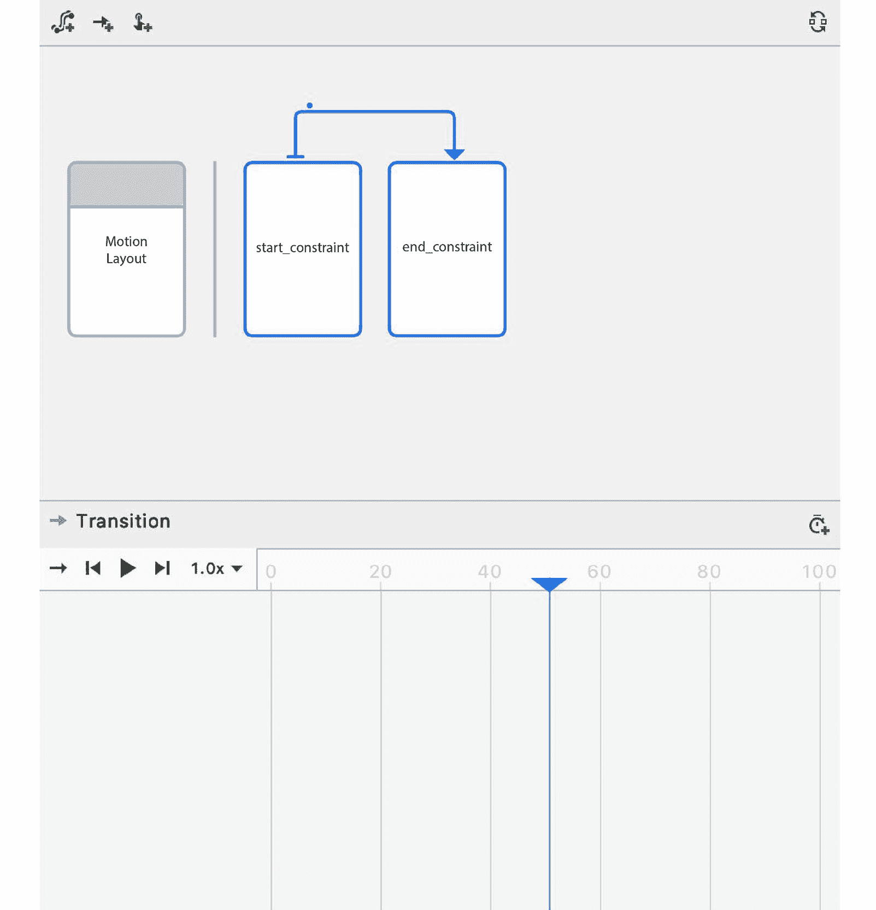

# 使用 CoordinatorLayout 和 MotionLayout 的动画和过渡

本章将向你介绍动画以及如何处理布局之间的切换。它描述了在 Android 中使用`MotionLayout`和 Motion Editor 移动对象，以及约束集的详细解释。本章还涵盖了修改路径和向帧的运动添加关键帧。

到本章结束时，你将能够使用`CoordinatorLayout`和`MotionLayout`创建动画，并使用 Android Studio 中的 Motion Editor 创建`MotionLayout`动画。

在上一章中，你学习了关于架构模式，如 MVVM。你现在知道如何改进应用的架构。接下来，我们将学习如何使用动画来增强我们应用的外观和感觉，使其与其他应用不同且更好。

有时候，我们开发的某些应用可能看起来有点单调，因此我们可以在应用中加入一些动态部分和令人愉悦的动画，使它们更加生动，并改善 UI 和用户体验。例如，我们可以添加视觉提示，以便用户不会对下一步该做什么感到困惑，并引导他们了解可以采取的步骤。

加载时的动画可以在内容被检索或处理时娱乐用户。当应用遇到错误时，漂亮的动画可以帮助防止用户对发生的事情感到愤怒，并告知他们有哪些选项。

在本章中，我们将首先探讨一些使用 Android 进行动画的传统方法。我们将以探讨较新的`MotionLayout`选项结束本章。让我们从活动过渡开始，这是最容易且最常用的动画之一。

本章我们将涵盖以下主题：

+   活动过渡

+   使用`CoordinatorLayout`的动画

+   使用`MotionLayout`的动画

# 技术要求

本章所有练习和活动的完整代码可在 GitHub 上找到，链接为[`packt.link/G8RoL`](https://packt.link/G8RoL)

# 活动过渡

当打开和关闭活动时，Android 会播放默认过渡动画。我们可以自定义活动过渡以反映品牌和/或区分我们的应用。活动过渡从 Android 5.0 Lollipop（API 级别 21）开始提供。

活动过渡有两个部分——进入过渡和退出过渡。进入过渡定义了活动及其视图在活动打开时如何动画化。同时，退出过渡描述了活动及其视图在活动关闭或打开新活动时如何动画化。Android 支持以下内置过渡：

+   **Explode**：这会将视图从中心移动到内部或外部

+   **Fade**：此视图会缓慢出现或消失

+   **Slide**：这会将视图从边缘移动到内部或外部

现在，让我们看看我们如何在下一节中添加活动过渡。有两种方法可以添加活动过渡 – 通过 XML 和通过代码。首先，我们将学习如何通过 XML 添加过渡，然后通过代码。

## 通过 XML 添加活动过渡

您可以通过 XML 添加活动过渡。第一步是启用窗口内容过渡。这是通过在 `themes.xml` 中的活动主题中添加以下内容来完成的：

```swift
<item name="android:windowActivityTransitions">true</item>
```

之后，您可以使用 `android:windowEnterTransition` 和 `android:windowExitTransition` 风格属性添加进入和退出过渡。例如，如果您想使用 `@android:transition/` 的默认过渡，您需要添加以下属性：

```swift
<item name="android:windowEnterTransition"> @android:
    transition/slide_left</item>
<item name="android:windowExitTransition"> @android:
    transition/explode</item>
```

您的 `themes.xml` 文件将如下所示：

```swift
    <style name="AppTheme" parent=
        "Theme.AppCompat.Light.DarkActionBar">
        ...
        <item name="android:
            windowActivityTransitions">true</item>
        <item name="android:windowEnterTransition">
            @android:transition/slide_left</item>
        <item name="android:windowExitTransition">
            @android:transition/explode</item>
    </style>
```

通过 `<item name="android:windowActivityTransitions">**true</item>**` 启用活动过渡。`<item name="android:windowEnterTransition">@android:transition/slide_left</item>` 属性设置进入过渡，而 `@android:transition/explode` 是退出过渡文件，由 `<item name="android:windowExitTransition">@android:transition/explode</item>` 属性设置。

在下一节中，您将学习如何通过编码添加活动过渡。

## 通过代码添加活动过渡

活动过渡也可以通过编程添加。第一步是启用窗口内容过渡。您可以通过在活动调用 `setContentView()` 之前调用以下函数来实现：

```swift
window.requestFeature(Window.FEATURE_CONTENT_TRANSITIONS)
```

您可以在之后使用 `window.enterTransition` 和 `window.exitTransition` 分别添加进入和退出过渡。我们可以使用 `android.transition` 包中的内置 `Explode()`、`Slide()` 和 `Fade()` 过渡。例如，如果我们想使用 `Explode()` 作为进入过渡，`Slide()` 作为退出过渡，我们可以添加以下代码：

```swift
window.enterTransition = Explode()
window.exitTransition = Slide()
```

如果您的应用最低支持的 SDK 版本低于 21，请记住在调用 `setContentView()` 之前对这些调用进行 `Build.VERSION.SDK_INT >= Build.VERSION_CODES.LOLLIPOP` 的检查。

现在您已经知道如何通过代码或 XML 添加进入和退出活动过渡，您需要学习如何在打开活动时激活过渡。我们将在下一节中这样做。

## 使用活动过渡开始活动

一旦您已将活动过渡添加到活动（无论是通过 XML 还是编码），您可以在打开活动时激活过渡。而不是使用 `startActivity(intent)` 调用，您应该传递一个包含过渡动画的 bundle。为此，使用以下代码启动您的活动：

```swift
startActivity(intent, ActivityOptions
.makeSceneTransitionAnimation(this).toBundle())
```

`ActivityOptions.makeSceneTransitionAnimation(this).toBundle()` 参数将创建一个包含我们为活动指定的进入和退出过渡（通过 XML 或代码）的 bundle。

让我们通过向应用添加活动过渡来尝试一下我们到目前为止所学的内容。

## 练习 16.01 – 在应用中创建活动过渡

在许多机构中，留下小费（通常称为**赏金**）是很常见的。这是一笔表示对服务感激之情的钱款 – 例如，给餐厅的侍应生。小费是在最终账单上标明的基本费用之外提供的。

在本章中，我们将使用一个计算应支付小费金额的应用程序。这个值将基于账单金额（基本费用）和用户想要给出的额外百分比。用户将输入这两个值，应用程序将计算小费金额。

在这个练习中，我们将自定义输入屏幕和输出屏幕之间的活动过渡：

1.  在 Android Studio 中，从书籍代码仓库的 `Chapter16` 目录中打开 Tip Calculator 项目。

1.  运行应用。点击 `OutputActivity` 并返回。当 `MainActivity` 关闭和 `OutputActivity` 打开及关闭时，会有一个默认的动画。

1.  现在，让我们开始添加过渡动画。打开 `themes.xml` 文件，并更新活动主题，使用 `windowActivityTransitions`、`windowEnterTransition` 和 `windowExitTransition` 风格属性：

    ```swift
        <item name="android:windowActivityTransitions">
          true</item>
        <item name="android:windowEnterTransition">
          @android:transition/explode</item>
        <item name="android:windowExitTransition">
          @android:transition/slide_left</item>
    ```

这将启用活动过渡，添加一个爆炸进入过渡，并添加一个向左滑动退出过渡到活动。

1.  返回到 `MainActivity` 文件，将 `startActivity(intent)` 替换为以下内容：

    ```swift
    startActivity(intent, ActivityOptions
    .makeSceneTransitionAnimation(this).toBundle())
    ```

这将使用我们在 XML 文件中指定的过渡动画打开 `OutputActivity`（我们在上一步中设置了该动画）。

1.  运行应用。你会看到打开和关闭 `MainActivity` 和 `OutputActivity` 时的动画已经改变。当 Android UI 打开 `OutputActivity` 时，注意文本是向中心移动的。在关闭时，视图向左滑动：


图 16.1 – 应用屏幕 – 输入屏幕（在左侧）和输出屏幕（在右侧）

我们已经为一个应用添加了活动过渡。当我们打开一个新的活动时，新活动的进入过渡将被播放。当活动关闭时，其退出过渡将被播放。

有时候，当我们从一个活动打开另一个活动时，两个活动中都存在一个共同元素。在下一节中，我们将学习如何添加这个共享元素过渡。

## 添加共享元素过渡

有时候，一个应用从一个活动切换到另一个活动，并且这两个活动中都存在一个共同元素。我们可以为这个共享元素添加一个动画，以使用户注意到这两个活动之间的联系。

例如，在一个电影应用程序中，一个包含电影列表（带有缩略图图像）的活动可以打开一个新的活动，显示所选电影的详细信息，以及顶部的一个全尺寸图像。为图像添加共享元素过渡将把列表活动中的缩略图与详情活动中的图像联系起来。

共享元素过渡有两个部分——进入过渡和退出过渡。这些过渡可以通过 XML 或代码实现。

第一步是启用窗口内容过渡。你可以通过将活动的主题添加到`themes.xml`中来实现，如下所示：

```swift
<item name="android:windowContentTransitions">true</item>
```

你也可以通过在调用`setContentView()`之前调用以下函数来编程实现：

```swift
window.requestFeature(Window.FEATURE_CONTENT_TRANSITIONS)
```

将`android:windowContentTransitions`属性设置为`true`和`window.requestFeature(Window.FEATURE_CONTENT_TRANSITIONS)`将启用窗口内容过渡。

之后，你可以添加共享元素进入过渡和共享元素退出过渡。如果你在`res/transitions`目录中有`enter_transition.xml`和`exit_transition.xml`，你可以通过添加以下样式属性来添加共享元素进入过渡：

```swift
<item name="android:windowSharedElementEnterTransition"> @transition/enter_transition</item>
```

你也可以通过以下代码行来实现：

```swift
val enterTransition = TransitionInflater.from(this)
    .inflateTransition(R.transition.enter_transition)
window.sharedElementEnterTransition = enterTransition
```

`windowSharedElementEnterTransition`属性和`window.shared ElementEnterTransition`将我们的进入过渡设置为`enter_transition.xml`文件。

要添加共享元素退出过渡，你可以添加以下样式属性：

```swift
<item name="android:windowSharedElementExitTransition">
@transition/exit_transition</item>
```

这可以通过以下代码行编程实现：

```swift
val exitTransition = TransitionInflater.from(this)
    .inflateTransition(R.transition.exit_transition)
window.sharedElementExitTransition = exitTransition
```

`windowSharedElementExitTransition`属性和`window.shared ElementExitTransition`将我们的退出过渡设置为`exit_transition.xml`文件。

你已经学会了如何添加共享元素过渡。在下一节中，我们将学习如何使用共享元素过渡启动活动。

## 使用共享元素过渡启动活动

一旦你将共享元素过渡添加到活动（无论是通过 XML 还是通过编程方式），你就可以在打开活动时激活过渡。在你这样做之前，添加一个`transitionName`属性。将其值设置为两个活动中的共享元素相同的文本。

例如，在`ImageView`中，我们可以为`transitionName`属性添加一个`transition_name`值：

```swift
    <ImageView
        ...
        android:transitionName="transition_name"
        android:id="@+id/sharedImage"
    ... />
```

要使用共享元素启动活动，我们将传递一个包含过渡动画的包。为此，使用以下代码启动你的活动：

```swift
startActivity(intent, ActivityOptions
.makeSceneTransitionAnimation(this, sharedImage,
"transition_name").toBundle());
```

`ActivityOptions.makeSceneTransitionAnimation(this, sharedImage, "transition_name").toBundle()`参数将创建一个包含共享元素（`sharedImage`）和过渡名称（`transition_name`）的包。

如果你有一个以上的共享元素，你可以传递`Pair<View, String>`的变量参数，其中包含`View`和过渡名称`String`。例如，如果我们有按钮和图像作为共享元素，我们可以这样做：

```swift
val buttonPair: Pair<View, String> = Pair(button, "button")
val imagePair: Pair<View, String> = Pair(image, "image")
val activityOptions = ActivityOptions
    .makeSceneTransitionAnimation(this, buttonPair,
    imagePair)
startActivity(intent, activityOptions.toBundle())
```

这将启动带有两个共享元素（按钮和图片）的活动。

注意

记得导入`android.util.Pair`而不是`kotlin.Pair`，因为`makeSceneTransitionAnimation`期望来自 Android SDK 的 pair。

让我们通过向*小费* *计算器*应用程序添加共享元素过渡来尝试我们到目前为止所学的内容。

## 练习 16.02 – 创建共享元素过渡

在第一个练习中，我们为`MainActivity`和`OutputActivity`自定义了活动过渡。在这个练习中，我们将向两个活动添加图片。当从输入屏幕移动到输出屏幕时，这个共享元素将被动画化。我们将使用应用程序启动器图标（`res/mipmap/ic_launcher`）作为`ImageView`。你可以更改它而不是使用默认图标：

1.  打开我们在上一个练习中开发的`Tip Calculator`项目。

1.  进入`activity_main.xml`文件，在金额文本字段顶部添加`ImageView`：

    ```swift
        <ImageView
            android:id="@+id/image"
            ...
            android:transitionName="transition_name"
            ... />
    ```

本步骤的完整代码可以在[`packt.link/NvDO2`](https://packt.link/NvDO2)找到。

`transitionName`值为`transition_name`将用于识别这是一个共享元素。

1.  通过将`app:layout_constraintTop_toTopOf="parent"`更改为以下内容来更改 ID 为`amount_text_layout`的`TextInputLayout`的顶部约束：

    ```swift
    app:layout_constraintTop_toBottomOf="@id/image"
    ```

这将把`amount_text_layout`移动到图片下方。

1.  现在，打开`activity_output.xml`文件，在提示`TextView`上方添加一个图片，高度和宽度为 200 dp，`scaleType`设置为`fitXY`以适应`ImageView`的尺寸：

    ```swift
    <ImageView
        android:id="@+id/image"
        ...
        android:transitionName="transition_name"
        ... />
    ```

本步骤的完整代码可以在[`packt.link/jpgVe`](https://packt.link/jpgVe)找到。

`transitionName`值为`transition_name`与`MainActivity`中`ImageView`的值相同。

1.  打开`MainActivity`并将`startActivity`代码更改为以下内容：

    ```swift
    val image: ImageView = findViewById(R.id.image)
    startActivity(intent, ActivityOptions
    .makeSceneTransitionAnimation(this, image,
    "transition_name").toBundle())
    ```

这将启动从`MainActivity`中的`ImageView`开始的过渡，ID 为 image 过渡到`OutputActivity`中的另一个`ImageView`，其`transitionName`值也是`transition_name`。

1.  运行应用程序。提供金额和百分比，然后点击`OutputActivity`：


图 16.2 – 应用程序屏幕 – 输入屏幕（在左侧）和输出屏幕（在右侧）

我们已经学习了如何添加活动过渡和共享元素过渡。现在，让我们看看如何在布局内部动画化视图。如果我们内部有多个元素，可能很难对每个元素进行动画化。可以使用`CoordinatorLayout`来简化这个动画。我们将在下一节讨论这个问题。

# 使用 CoordinatorLayout 的动画

`CoordinatorLayout` 是一个处理其子视图之间运动的布局。当你将 `CoordinatorLayout` 作为父视图组使用时，你可以轻松地对其内部的视图进行动画处理。你可以通过在 `app/build.gradle` 文件中添加以下依赖项将 `CoordinatorLayout` 添加到你的项目中：

```swift
implementation 'androidx.coordinatorlayout:
coordinatorlayout:1.2.0'
```

这将允许我们在布局文件中使用 `CoordinatorLayout`。

假设我们有一个包含在 `CoordinatorLayout` 中的浮动操作按钮的布局文件。当点击浮动操作按钮时，UI 显示一个 `Snackbar` 消息。

注意

`Snackbar` 是一个 Android 小部件，它会在屏幕底部向用户提供一个简短的消息。

如果你使用除 `CoordinatorLayout` 之外的任何布局，带有消息的 `Snackbar` 将会渲染在浮动操作按钮的上方。如果我们使用 `CoordinatorLayout` 作为父视图组，布局将推动浮动操作按钮向上，在它下方显示 `Snackbar`，并在 `Snackbar` 消失时将其移回。*图 16**.3* 展示了布局如何调整以防止 `Snackbar` 覆盖浮动操作按钮：


图 16.3 – 左侧截图显示了在显示 Snackbar 消息之前和之后的 UI。右侧的截图显示了当 Snackbar 可见时的 UI

浮动操作按钮移动并给 `Snackbar` 消息留出空间，因为它有一个默认的行为，称为 `FloatingActionButton.Behavior`，它是 `CoordinatorLayout.Behavior` 的子类。`FloatingActionButton.Behavior` 子类在显示 `Snackbar` 时移动浮动操作按钮，这样 `Snackbar` 就不会覆盖浮动操作按钮。

并非所有视图都具有 `CoordinatorLayout` 的行为。为了实现自定义行为，你可以从扩展 `CoordinatorLayout.Behavior` 开始。然后你可以通过 `layout_behavior` 属性将其附加到视图上。例如，如果我们为按钮在 `com.example.behavior` 包中创建了 `CustomBehavior`，我们可以在布局中更新按钮，如下所示：

```swift
...
<Button
    ...
    app:layout_behavior="com.example.behavior.CustomBehavior">
    .../>
```

我们已经学习了如何使用 `CoordinatorLayout` 创建动画和过渡。在下一节中，我们将探讨另一个布局，即 `MotionLayout`，它允许开发者对运动有更多的控制。

# 带有 MotionLayout 的动画

在 Android 中创建动画有时会耗费时间。即使要创建简单的动画，也需要在 XML 和代码文件上工作。更复杂的动画和过渡需要更多的时间来制作。

为了帮助开发者轻松制作动画，Google 创建了 `MotionLayout`。这是一种通过 XML 创建运动和动画的新方法。它从 API 级别 14（Android 4.0）开始可用。

使用 `MotionLayout`，我们可以动画化一个或多个视图的位置、宽度/高度、可见性、透明度、颜色、旋转、高度和其它属性。通常，这些属性中的一些很难用代码实现，但 `MotionLayout` 允许我们使用声明性 XML 轻松调整它们，这样我们就可以更多地关注我们的应用程序。

让我们开始通过将 `MotionLayout` 添加到我们的应用程序中。

## 添加 MotionLayout

要将 `MotionLayout` 添加到您的项目中，您只需添加 `ConstraintLayout 2.0` 的依赖项。`ConstraintLayout 2.0` 是 `ConstraintLayout` 的新版本，增加了新功能，包括 `MotionLayout`。将以下依赖项添加到您的 app/`build.gradle` 文件中：

```swift
implementation 'androidx.constraintlayout:
constraintlayout:2.1.4'
```

这将添加 ConstraintLayout 的最新版本（在撰写本文时为 2.1.4）到您的应用中。

添加依赖项后，我们现在可以使用 `MotionLayout` 创建动画。我们将在下一节中这样做。

## 使用 MotionLayout 创建动画

`MotionLayout` 是我们老朋友 ConstraintLayout 的子类。要使用 `MotionLayout` 创建动画，打开我们将添加动画的布局文件。将根 `ConstraintLayout` 容器替换为 `androidx.constraintlayout.motion.widget.MotionLayout`。

动画本身不会在布局文件中，而是在另一个名为 `motion_scene` 的 XML 文件中。这将指定 `MotionLayout` 如何动画化其中的视图。`motion_scene` 文件应放置在 `res/xml` 目录中。布局文件将通过根视图组的 `app:layoutDescription` 属性链接到这个 `motion_scene` 文件。您的布局文件应类似于以下内容：

```swift
<?xml version="1.0" encoding="utf-8"?>
<androidx.constraintlayout.motion.widget.MotionLayout
    ...
    app:layoutDescription="@xml/motion_scene">
    ...
</androidx.constraintlayout.motion.widget.MotionLayout>
```

要使用 `MotionLayout` 创建动画，我们必须有视图的初始状态和最终状态。`MotionLayout` 将自动在这两个状态之间进行动画过渡。您可以在同一个 `motion_scene` 文件中指定这两个状态。如果您在布局中有很多视图，您也可以为动画的起始和结束状态使用两个不同的布局。

`motion_scene` 文件的根容器是 `motion_scene`。这是我们添加 `MotionLayout` 的约束和动画的地方。它包含以下内容：

+   **ConstraintSet**：指定要动画化的视图/布局的起始和结束位置及样式

+   **过渡**：指定要在视图上执行的动画的开始、结束、持续时间和其他细节

让我们尝试通过将 `MotionLayout` 添加到我们的 *小费* *计算器* 应用中来添加动画。

## 练习 16.03 – 使用 MotionLayout 添加动画

在这个练习中，我们将更新我们的 *小费计算器* 应用，添加 `MotionLayout` 动画。在输出屏幕中，当点击提示文本上方的图片时，它会向下移动；再次点击时，它会回到原始位置：

1.  在 Android Studio 4.0 或更高版本中打开 *小费计算器* 项目。

1.  打开`activity_output.xml`文件并将根`ConstraintLayout`标签更改为`MotionLayout`。将`androidx.constraintlayout.widget.ConstraintLayout`更改为以下内容：

    ```swift
    androidx.constraintlayout.motion.widget.MotionLayout
    ```

1.  将`app:layoutDescription="@xml/motion_scene"`添加到`MotionLayout`标签中。IDE 会警告你该文件尚不存在。现在请忽略这个警告，因为我们将在下一步中添加它。你的文件应该看起来像这样：

    ```swift
    <?xml version="1.0" encoding="utf-8"?>
    <androidx.constraintlayout.motion.widget.MotionLayout
          ...
        app:layoutDescription="@xml/motion_scene">
        ...
    </androidx.constraintlayout.motion.widget
    .MotionLayout>
    ```

1.  在`res/xml`目录下创建一个`motion_scene.xml`文件。这将是我们定义动画配置的`motion_scene`文件。使用`motion_scene`作为文件的根元素。

1.  通过在`motion_scene`文件中添加以下内容来添加起始`Constraint`元素：

    ```swift
       <ConstraintSet android:id="@+id/start_constraint">
            <Constraint
                android:id="@id/image"
                .../>
        </ConstraintSet>
    ```

本步骤的完整代码可以在[`packt.link/jdJrD`](https://packt.link/jdJrD)找到。

这是图像在当前位置（约束在屏幕顶部）的显示效果。

1.  接下来，通过在`motion_scene`文件中添加以下内容来添加结束`Constraint`元素：

    ```swift
        <ConstraintSet android:id="@+id/end_constraint">
            <Constraint
                android:id="@id/image"
                ... />
        </ConstraintSet>
    ```

本步骤的完整代码可以在[`packt.link/jdJrD`](https://packt.link/jdJrD)找到。

在结束动画中，`ImageView`将位于屏幕底部。

1.  现在我们来为`ImageView`添加在`ConstraintSet`之后的过渡：

    ```swift
        <Transition
            app:constraintSetEnd="@id/end_constraint"
            app:constraintSetStart="@id/start_constraint"
            app:duration="2000">
            <OnClick
                app:clickAction="toggle"
                app:targetId="@id/image" />
        </Transition>
    ```

在这里，我们指定了起始和结束约束，这些约束将在 2,000 毫秒（2 秒）内动画化。我们还为`ImageView`添加了一个`OnClick`事件。切换将使视图从起始状态动画化到结束状态，如果视图已经在结束状态，它将动画化回到起始状态。

1.  运行应用并点击`ImageView`。它将在大约 2 秒内直接向下移动。再次点击，它将在 2 秒内返回到上方。*图 16.4*显示了动画的起始和结束状态：


图 16.4 – 起始动画（左）和结束动画（右）

在这个练习中，我们通过指定起始约束、结束约束以及带有持续时间和`OnClick`事件的过渡，在`MotionLayout`中动画化了`ImageView`。`MotionLayout`会自动从起始位置播放动画到结束位置（在我们看来，当点击时，它看起来像是在自动向上或向下直线移动）。

我们已经使用`MotionLayout`创建了动画。在下一节中，我们将使用 Android Studio 的运动编辑器来创建`MotionLayout`动画。

## 运动编辑器

从版本 4.0 开始，Android Studio 包含了运动编辑器。运动编辑器可以帮助开发者使用`MotionLayout`创建动画。这使得开发者更容易创建和预览过渡和其他动作，而不是手动操作并运行应用来查看更改。编辑器还会自动生成相应的文件。

你可以通过在布局编辑器中右键点击预览并点击**转换为运动布局**项将你的 ConstraintLayout 转换为`MotionLayout`。Android Studio 将执行转换并为你创建运动场景文件。

当在**设计**视图中查看以`MotionLayout`为根布局的布局文件时，运动编辑器 UI 将包含在**设计**视图中，如图*图 16.5*所示：


图 16.5 – Android Studio 4.0 中的运动编辑器

在右上角的窗口（`MotionLayout`以及起始和结束约束。过渡以从起始约束发出的箭头表示。靠近起始约束的点显示了过渡的点击动作。*图 16.6*显示了选中的`start_constraint`：


图 16.6 – 选择 start_constraint 时运动编辑器的概览面板

右下角的窗口是当选择`start_constraint`时选中的`MotionLayout`：


图 16.7 – 运动编辑器的选择面板显示 start_constraint 的 ConstraintSet

当你在**概览**面板的左侧点击`MotionLayout`时，下方的**选择**面板将显示视图及其约束，如图*图 16.8*所示：


图 16.8 – 选择 MotionLayout 时的概览和选择面板

当你点击`start_constraint`或`end_constraint`时，左侧的预览窗口将显示起始或结束状态的样子。`start_constraint`被选中：


图 16.9 – 选择 start_constraint 时运动编辑器的样子

*图 16.10*显示了如果你选择`end_constraint`时运动编辑器将如何显示：


图 16.10 – 选择 end_constraint 时运动编辑器的样子

连接`start_constraint`和`end_constraint`的箭头代表`MotionLayout`的过渡。在**选择**面板上，有播放或跳转到第一个或最后一个状态的控件。你还可以将箭头拖动到特定位置。*图 16.11*显示了它在动画中间（50%）的样子：


图 16.11 – 动画中间的过渡

在使用`MotionLayout`开发动画的过程中，如果我们能够调试动画以确保我们正确地执行动画会更好。我们将在下一节讨论如何做到这一点。

## 运动布局的调试

为了在运行应用程序之前帮助你可视化 `MotionLayout` 动画，你可以在运动编辑器中显示运动路径和动画的进度。运动路径是动画对象从起始状态到结束状态将采取的直线路径。

要显示路径和/或进度动画，我们可以在 `MotionLayout` 容器中添加一个 `motionDebug` 属性。

我们可以为 `motionDebug` 使用以下值：

+   `SHOW_PATH`：这仅显示运动的路径

+   `SHOW_PROGRESS`：这仅显示动画进度

+   `SHOW_ALL`：这显示动画的路径和进度

+   `NO_DEBUG`：这隐藏了所有动画

要显示 `MotionLayout` 的路径和进度，我们可以使用以下方法：

```swift
<androidx.constraintlayout.motion.widget.MotionLayout
    ...
    app:motionDebug="SHOW_ALL"
    ...>
```

`SHOW_ALL` 值将显示动画的路径和进度。*图 16*.*12* 展示了当我们使用 `SHOW_PATH` 和 `SHOW_PROGRESS` 时它将看起来如何：


图 16.12 – 使用 SHOW_PATH（左）显示动画路径，而 SHOW_PROGRESS（右）显示动画进度

虽然 `motionDebug` 听起来像只在调试模式下出现的东西，但它也会出现在发布构建中，因此在你准备发布你的应用程序时应该将其删除。

在 `MotionLayout` 的动画过程中，起始约束将过渡到结束约束，即使有可以阻挡运动对象的元素或元素。我们将在下一节讨论如何避免这种情况发生。

## 修改 MotionLayout 路径

在 `MotionLayout` 的动画中，UI 将从起始约束播放到结束约束，即使中间有可以阻挡我们移动视图的元素。例如，如果 `MotionLayout` 涉及从屏幕顶部到底部移动的文本，反之亦然，并且我们在中间添加了一个按钮，按钮将覆盖移动的文本。

*图 16*.*13* 展示了 **OK** 按钮如何阻挡动画中间的移动文本：


图 16.13 – OK 按钮阻挡了文本动画的中间部分

`MotionLayout` 沿着直线路径从起始约束播放到结束约束，并根据指定的属性调整视图。我们可以在起始和结束约束之间添加关键帧来调整动画路径和/或视图属性。例如，在动画过程中，除了将移动文本的位置改变以避开按钮外，我们还可以更改文本或其他视图的属性。

关键帧可以作为 `motion_scene` 转换属性的子元素添加到 `KeyFrameSet` 中。我们可以使用以下关键帧：

+   `KeyPosition`：这指定了动画过程中视图在特定点的位置，以调整路径

+   `KeyAttribute`: 这指定了动画特定点的视图属性。

+   `KeyCycle`: 这在动画期间添加了振荡。

+   `KeyTimeCycle`: 这允许循环由时间而不是动画进度驱动。

+   `KeyTrigger`: 这添加了一个可以根据动画进度触发事件的元素。

我们将重点关注 `KeyPosition` 和 `KeyAttribute`，因为 `KeyCycle`、`KeyTimeCycle` 和 `KeyTrigger` 是更高级的关键帧。

`KeyPosition` 允许我们在 `MotionLayout` 动画中间更改视图的位置。它有以下属性：

+   `motionTarget`: 这指定了由关键帧控制的对象。

+   `framePosition`: 从 1 到 99 编号，这指定了位置改变时的运动百分比。例如，25 表示动画的四分之一处，而 50 是动画的中点。

+   `percentX`: 这指定了路径的 *x* 值将被修改多少。

+   `percentY`: 这指定了路径的 *y* 值将被修改多少。

+   `keyPositionType`: 这指定了 `KeyPosition` 如何修改路径。

`keyPositionType` 属性可以有以下值：

+   `parentRelative`: `percentX` 和 `percentY` 是基于视图的父元素指定的。

+   `pathRelative`: `percentX` 和 `percentY` 是基于从起始约束到结束约束的直线路径指定的。

+   `deltaRelative`: `percentX` 和 `percentY` 是基于视图的位置指定的。

例如，如果我们想在动画的精确中点（50%）修改具有 `text_view` ID 的 `TextView` 的路径，通过将其沿 *x* 方向移动 10% 和沿 *y* 方向移动 10%，相对于 `TextView` 的父容器，我们将在 `motion_scene` 中有以下关键位置：

```swift
<KeyPosition
    app:motionTarget="@+id/text_view"
    app:framePosition="50"
    app:keyPositionType="parentRelative"
    app:percentY="0.1"
    app:percentX="0.1"
/>
```

同时，`KeyAttribute` 允许我们在 `MotionLayout` 动画进行时更改视图的属性。我们可以更改的一些视图属性包括 `visibility`、`alpha`、`elevation`、`rotation`、`scale` 和 `translation`。`KeyAttribute` 有以下属性：

+   `motionTarget`: 这指定了由关键帧控制的对象。

+   `framePosition`: 从 1 到 99 编号，这指定了应用视图属性时的运动百分比。例如，20 表示动画的五分之一处，而 75 是动画的三分之四处。

让我们尝试向 *小费计算器* 应用添加关键帧。当 `ImageView` 动画时，它会覆盖显示小费的文本。我们将通过添加关键帧来修复这个问题。

## 练习 16.04 – 使用关键帧修改动画路径

在上一个练习中，我们使图像在点击时向下移动（或当它已经在底部时向上移动）。当它在中间时，图像覆盖了提示 `TextView`。我们将通过在 Android Studio 的 Motion 编辑器中添加 `KeyFrame` 到 `motion_scene` 来解决此问题：

1.  使用 Android Studio 4.0 或更高版本打开 *小费计算器* 应用。

1.  在 `res/layout` 目录中打开 `activity_output.xml` 文件。

1.  将`app:motionDebug="SHOW_ALL"`添加到`MotionLayout`容器中。这将允许我们在 Android Studio 和我们的设备/模拟器上看到路径和进度信息。您的`MotionLayout`容器将如下所示：

    ```swift
    <androidx.constraintlayout.motion.widget.MotionLayout
          ...
        app:motionDebug="SHOW_ALL">
    ```

1.  运行应用程序并执行计算。在输出屏幕上，点击图像。在动画进行时查看提示文本。注意，文本在动画中间被图像覆盖，如*图 16.14*所示：


图 16.14 – 图像隐藏显示提示的 TextView

1.  返回 Android Studio 中的`activity_output.xml`文件。确保它在**设计**视图中打开。

1.  在`start_constraint`和`end_constraint`中。将**选择**面板中的向下箭头拖动到中间（50%），如*图 16.15*所示：



图 16.15 – 选择表示起始和结束约束之间转换的箭头

1.  点击**选择**面板（带有绿色**+**符号的面板）中**转换**右侧的**创建关键帧**图标，如*图 16.16*所示：


图 16.16 – 创建关键帧图标

1.  选择**关键位置**。我们将使用**关键位置**来调整输出屏幕上的图像，使其不会与包含提示文本的文本重叠。

1.  选择`50`。类型是`parentRelative`，`1.5`，如*图 16.17*所示。这将为转换中间（50%）的图像添加一个**关键位置**属性，相对于父元素的*x*轴是 1.5 倍：


图 16.17 – 提供要创建的关键位置输入

1.  点击`ImageView`。现在它将位于`TextView`的右侧：


图 16.18 – 路径现在将是曲线的；转换面板将出现新的 KeyPosition 项

1.  点击播放图标以查看动画效果。在设备或模拟器上运行应用程序以验证它。您将看到动画现在向右弯曲，而不是采取之前的直线路径，如*图 16.19*所示：


图 16.19 – 现在动画避免了带有提示的 TextView

1.  Motion 编辑器将自动生成`KeyPosition`的代码。如果您转到`motion_scene.xml`文件，您将看到 Motion 编辑器在转换属性中添加了以下代码：

    ```swift
    <KeyFrameSet>
        <KeyPosition
            app:framePosition="50"
            app:keyPositionType="parentRelative"
            app:motionTarget="@+id/image"
            app:percentX="1.5" />
    </KeyFrameSet>
    ```

在过渡期间添加了 `KeyPosition` 属性。在动画的 50% 时，图像的 *x* 位置相对于其父视图移动了 1.5 倍。这允许图像在动画过程中避免其他元素。

在这个练习中，你添加了一个关键位置，这将调整 `MotionLayout` 动画，确保它不会阻塞或被其路径上的另一个视图阻塞。

通过进行另一个活动来测试你所学的一切。

## 活动 16.01 – 密码生成器

使用强密码来保护我们的在线账户非常重要。它必须是唯一的，并且必须包含大写和小写字母、数字和特殊字符。在这个活动中，你将开发一个可以生成强密码的应用程序。

应用程序将有两个屏幕 – 输入屏幕和输出屏幕。在输入屏幕中，用户可以提供密码的长度并指定是否必须包含大写或小写字母、数字或特殊字符。

输出屏幕将显示三个可能的密码，当用户选择一个时，其他密码将移开，并显示一个按钮以将密码复制到剪贴板。您应该自定义从输入屏幕到输出屏幕的过渡。

完成以下步骤：

1.  在 Android Studio 4.0 或更高版本中创建一个新的项目，并将其命名为 `Password Generator`。设置其包名和**最小 SDK**。

1.  将 `MaterialComponents` 依赖项添加到您的 `app/build.gradle` 文件中。

1.  更新 `ConstraintLayout` 的依赖项。

1.  确保活动的主题在 `themes.xml` 文件中使用 `MaterialComponents` 中的一个。

1.  在 `activity_main.xml` 文件中，删除 `Hello World` `TextView` 并添加用于长度的输入文本字段。

1.  添加用于大写字母、数字和特殊字符的复选框代码。

1.  在复选框底部添加一个**生成**按钮。

1.  创建另一个活动，并将其命名为 `OutputActivity`。

1.  将从输入屏幕（`MainActivity`）到 `OutputActivity` 的活动过渡进行自定义。打开 `themes.xml` 并使用 `windowActivityTransitions`、`windowEnterTransition` 和 `windowExitTransition` 风格属性更新活动主题。

1.  更新 `MainActivity` 中的 `onCreate` 函数的末尾。

1.  更新 `activity_output.xml` 文件中 `androidx.constraintlayout.widget.ConstraintLayout` 的代码。

1.  将 `app:layoutDescription="@xml/motion_scene"` 和 `app:motion Debug="SHOW_ALL"` 添加到 `MotionLayout` 标签中。

1.  向输出活动添加三个 `TextView` 实例，用于显示生成的三个密码。

1.  在屏幕底部添加一个**复制**按钮。

1.  在 `OutputActivity` 中添加 `generatePassword` 函数。

1.  添加代码以根据用户输入生成三个密码，并为**复制**按钮添加一个 `ClickListener` 组件，以便用户可以将选定的密码复制到剪贴板。

1.  在 `OutputActivity` 中，为每个密码 `TextView` 创建一个动画。

1.  为默认视图创建 `ConstraintSet`。

1.  当第一个、第二个和第三个密码被选中时，添加`ConstraintSet`。

1.  接下来，当每个密码被选中时，添加`Transition`。

1.  通过访问**运行**菜单并点击**运行应用程序**菜单项来运行应用程序。

1.  输入一个长度，选择大写字母、数字和特殊字符的复选框，然后点击**生成**按钮。将显示三个密码。

1.  选择一个，其余的将移出视图。还会显示一个**复制**按钮。点击它并检查您选择的密码是否现在在剪贴板上。输出屏幕的初始和最终状态将与*图 16**.20*相似：


图 16.20 – 密码生成器应用中 MotionLayout 的起始和结束状态

注意

该活动的解决方案可以在[`packt.link/By7eE`](https://packt.link/By7eE)找到。

# 摘要

本章介绍了如何使用`CoordinatorLayout`和`MotionLayout`创建动画和过渡。动画可以提高我们应用程序的可用性，并使其与其他应用程序相比脱颖而出。

我们从自定义使用活动过渡打开和关闭活动时的过渡开始。我们还学习了当打开的活动及其打开的活动都包含相同元素时添加共享元素过渡，使我们能够向用户突出显示共享元素之间的这种链接。

我们学习了如何使用`CoordinatorLayout`来处理其子视图的运动。一些视图具有内置的行为，可以处理它们在`CoordinatorLayout`内部的工作方式。您也可以向其他视图添加自定义行为。然后，我们转向使用`MotionLayout`通过指定起始约束、结束约束以及它们之间的过渡来创建动画。我们还探讨了通过在动画中间添加关键帧来修改运动路径。我们学习了关于关键帧的知识，例如`KeyPosition`，它可以改变视图的位置，以及`KeyAttribute`，它可以改变视图的样式。我们还探讨了在 Android Studio 中使用运动编辑器来简化动画的创建和预览以及路径的修改。

在下一章中，我们将学习关于 Google Play 商店的内容。我们将讨论如何创建账户并准备应用程序发布，以及如何将它们发布供用户下载和使用。
