# 第十七章：在 Google Play 上发布您的应用程序

本章将向您介绍 Google Play 控制台、发布渠道和整个发布过程。它涵盖了创建 Google Play 开发者账户、设置我们开发的应用程序的商店入口以及创建密钥库（包括介绍密码的重要性以及文件存储的位置）。我们还将了解应用程序包和 APK，查看如何生成应用程序的 APK 或 AAB 文件。在章节的后面部分，我们将设置发布路径、公开测试版和封闭测试版，最后，我们将上传我们的应用程序到商店并在设备上下载。

到本章结束时，您将能够创建自己的 Google Play 开发者账户，准备您的已签名 APK 或应用程序包以发布，并在 Google Play 上发布您的第一个应用程序。

您在*第十六章*中学习了如何使用 `CoordinatorLayout` 和 `MotionLayout` 添加动画和过渡，*使用 CoordinatorLayout 和 MotionLayout 的动画和过渡*。现在，您已经准备好开发和发布 Android 应用程序。

在开发 Android 应用后，它们只能在您的设备和模拟器上使用。您必须使它们对所有人可用，以便他们可以下载。反过来，您将获得用户，并且可以从他们那里赚钱。Android 应用的官方市场是 Google Play。通过 Google Play，您发布的应用程序和游戏将可供全球超过 20 亿台活跃的 Android 设备使用。还有其他市场，您可以在那里发布您的应用程序，但它们超出了本书的范围。

在本章中，我们将学习如何在 Google Play 上发布您的应用程序。我们将从准备应用程序发布和创建 Google Play 开发者账户开始。然后，我们将继续上传您的应用程序和管理应用程序发布。

在本章中，我们将介绍以下主题：

+   准备您的应用程序发布

+   创建开发者账户

+   将应用程序上传到 Google Play

+   管理应用程序发布

# 准备您的应用程序发布

Android Studio 通常使用调试密钥对您的构建进行签名。这种调试构建允许您快速构建和测试您的应用程序。要发布您的应用程序到 Google Play，您必须创建一个使用您自己的密钥签名的发布构建。这个发布构建将不可调试，并且可以优化大小。

发布构建还必须具有正确的版本信息。否则，您将无法发布新应用程序或更新已发布的应用程序。

让我们从向您的应用程序添加版本开始。

## 应用程序版本控制

您的应用程序版本对于以下原因很重要：

+   用户可以看到他们下载的版本。他们可以在检查是否有更新或报告应用程序的错误/问题时使用此信息。

+   设备和 Google Play 使用版本值来确定应用程序是否可以或应该更新。

+   开发者还可以使用这个值来为特定版本添加功能支持。他们还可以警告或强制用户升级到最新版本以获取对错误或安全问题的重要修复。

一个 Android 应用有两个版本：`versionCode`和`versionName`。现在，`versionCode`是一个由开发者、Google Play 和 Android 系统使用的整数，而`versionName`是用户在 Google Play 页面上看到的应用字符串。

应用程序的初始发布应该有一个`versionCode`值为`1`，你应该为每个新版本增加它。

`versionName`可以是*x.y*格式（其中*x*是主版本，*y*是次版本）。你也可以使用语义版本，如*x.y.z*，通过添加补丁版本*z*。

要了解更多关于语义版本的信息，请参阅[`semver.org`](https://semver.org)。

在模块的`build.gradle`文件中，当你在 Android Studio 中创建一个新项目时，`versionCode`和`versionName`会自动生成。它们位于`android`块下的`defaultConfig`块中。一个示例`build.gradle`文件显示了这些值：

```swift
android {
    compileSdk 33
    defaultConfig {
        applicationId "com.example.app"
        minSdk 21
        targetSdk 33
        versionCode 1
        versionName "1.0"
        ...
    }
    ...
}
```

在发布更新时，正在发布的新的包必须有一个更高的`versionCode`值，因为用户不能降级他们的应用，只能下载新版本。

在确保应用版本正确后，发布流程的下一步是获取一个密钥库来签名应用。这将在下一节中讨论。

## 创建密钥库

Android 应用在运行时会被自动使用调试密钥签名。然而，在它可以在 Google Play 商店发布之前，应用必须使用发布密钥进行签名。为此，你必须有一个密钥库。如果你还没有，你可以在 Android Studio 中创建一个。

## 练习 17.01 – 在 Android Studio 中创建密钥库

在这个练习中，我们将使用 Android Studio 创建一个可以用于签名 Android 应用的密钥库。按照以下步骤完成这个练习：

1.  在 Android Studio 中打开一个项目。

1.  前往**构建**菜单，然后点击**生成签名包****或 APK**：

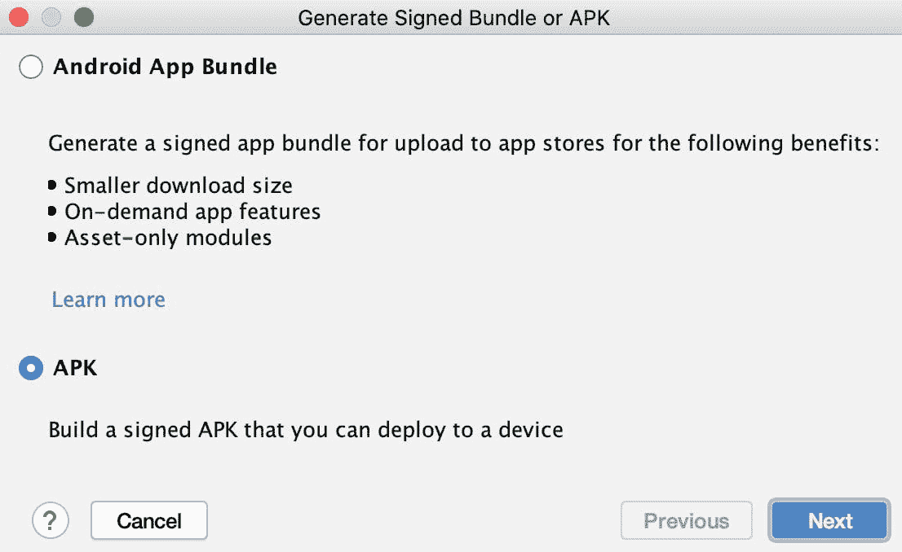

图 17.1 – 生成签名包或 APK 对话框

**APK**文件是用户可以安装应用的文件格式。Android 应用包是一种新的文件发布格式，它允许 Google Play 向设备分发特定且更小的 APK，因此开发者不需要发布和管理多个 APK 以支持不同的设备。

1.  确保已选择**APK**或**Android 应用包**，然后点击**下一步**按钮。在这里，你可以选择一个现有的密钥库或创建一个新的：

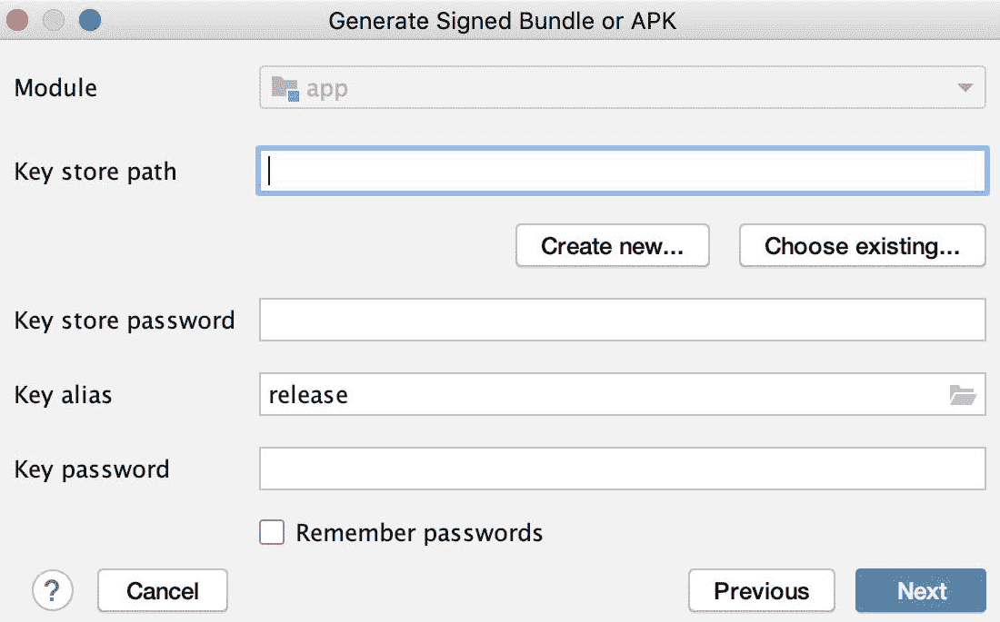

图 17.2 – 选择 APK 并点击下一步按钮后的生成签名包或 APK 对话框

1.  点击**创建新…**按钮。然后会出现**新密钥库**对话框：

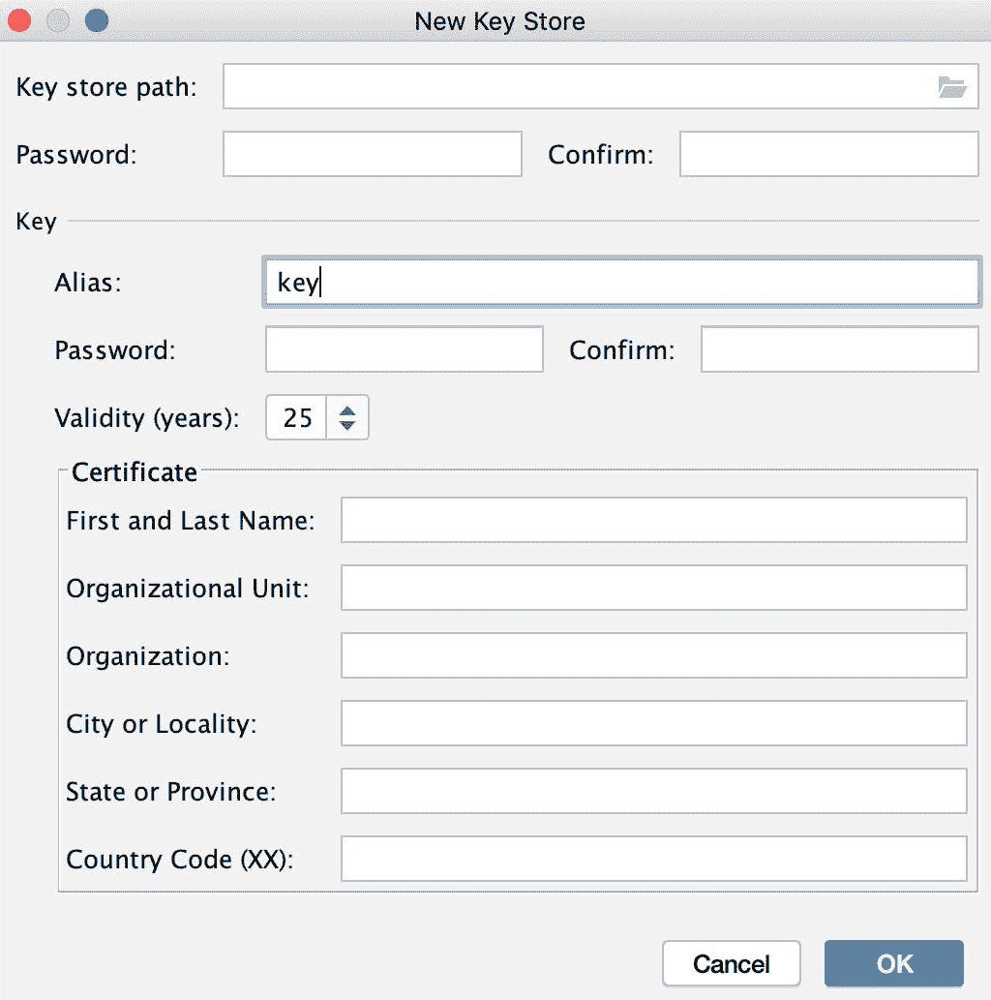

图 17.3 – 新密钥库对话框

1.  在`users/packt/downloads/keystore.keystore`。

1.  在**密码**和**确认**字段中提供密码。

1.  在**密钥**下的**证书**部分，输入**姓名**、**组织单位**、**组织**、**城市或地区**、**州或省**和**国家代码**字段的值。其中只需提供一项，但提供所有信息是好的。

1.  点击**确定**按钮。如果没有错误，密钥库将在您提供的路径中创建，您将回到**生成签名包或 APK**对话框，并带有密钥库值，以便您继续生成 APK 或应用包。如果您只想创建密钥库，则可以关闭对话框。

在这个练习中，您已经创建了您自己的密钥库，您可以使用它来为发布到 Google Play 的应用签名。

如果您更喜欢使用命令行，您也可以使用命令行生成密钥库。`keytool`命令在**Java 开发工具包**（**JDK**）中可用。命令如下：

```swift
keytool -genkey -v -keystore my-key.jks -keyalg RSA –
keysize
  2048 -validity 9125 -alias key-alias
```

此命令在当前工作目录中创建一个 2,048 位 RSA 密钥库，有效期为 9,125 天（25 年），文件名为`my-key.jks`，别名为`key-alias`。您可以将有效期、文件名和别名更改为您喜欢的值。命令行将提示您输入密钥库密码，然后提示您再次输入以确认。

它将依次询问您姓名、组织单位、组织名称、城市或地区、州或省和国家代码，只需提供一项；如果您想留空，可以按*Enter*键。尽管如此，提供所有信息是良好的实践。

在国家代码提示后，您将被要求验证提供的输入。您可以输入`yes`以确认。然后您将被要求提供密钥别名的密码。如果您想它与密钥库密码相同，您可以按*Enter*。然后密钥库将被生成。

现在您已经有了用于签名应用的密钥库，您需要知道如何保持其安全。您将在下一节中了解这一点。

## 存储密钥库和密码

您需要将密钥库和密码保存在安全的地方，因为如果您丢失密钥库和/或其凭证，您将无法再为您的应用发布更新。如果黑客也获得了对这些凭证的访问权限，他们可能能够在未经您同意的情况下更新您的应用。

您可以将密钥库存储在您的 CI/构建服务器或安全服务器上。

保持凭证有点棘手，因为您稍后需要在为应用更新签名时使用它们。您可以这样做的一种方法是在项目的`app/build.gradle`文件中包含这些信息。

在`android`块中，您可以有`signingConfigs`，它引用密钥库文件、其密码以及密钥的别名和密码：

```swift
android {
    ...
    signingConfigs {
        release {
            storeFile file("keystore-file")
            storePassword "keystore-password"
            keyAlias "key-alias"
            keyPassword "key-password"
        }
    }
    ...
}
```

在项目的`build.gradle`文件中的`buildTypes`发布块下，您可以在`signingConfigs`块中指定发布配置：

```swift
buildTypes {
        release {
            ...
            signingConfig signingConfigs.release
        }
        ...
}
```

将签名配置存储在`build.gradle`文件中并不安全，因为任何可以访问项目或仓库的人都可以危及应用。

您可以将这些凭据存储在环境变量中以提高安全性。采用这种方法，即使恶意人员获取了您的代码访问权限，应用更新仍然安全，因为签名配置不是存储在您的代码中，而是在系统上。环境变量是在您的**集成开发环境**（**IDE**）或项目之外设置的键值对，例如，在您的个人电脑或构建服务器上。

要在 Gradle 中为密钥库配置使用环境变量，您可以创建存储文件路径、存储密码、密钥别名和密钥密码的环境变量。例如，您可以使用`KEYSTORE_FILE`、`KEYSTORE_PASSWORD`、`KEY_ALIAS`和`KEY_PASSWORD`环境变量。

在 macOS 和 Linux 上，您可以使用以下命令设置环境变量：

```swift
export KEYSTORE_PASSWORD=securepassword
```

如果您使用的是 Windows，可以使用以下命令完成：

```swift
set KEYSTORE_PASSWORD=securepassword
```

此命令将创建一个`KEYSTORE_PASSWORD`环境变量，其值为`securepassword`。在`app/build.gradle`文件中，您可以使用环境变量的值：

```swift
storeFile System.getenv("KEYSTORE_FILE")
storePassword System.getenv("KEYSTORE_PASSWORD")
keyAlias System.getenv("KEY_ALIAS")
keyPassword System.getenv("KEY_PASSWORD")
```

您的密钥库将用于为您的应用发布签名，以便您可以在 Google Play 上发布。我们将在下一节讨论这个问题。

## 为发布版本签名应用

当您在模拟器或实际设备上运行应用程序时，Android Studio 会自动使用调试密钥库对其进行签名。要发布到 Google Play，您必须使用在 Android Studio 或命令行中创建的密钥库使用自己的密钥对 APK 或应用包进行签名。

假设您已在您的`build.gradle`文件中添加了发布构建的签名配置；您可以通过选择项目`app/build/output`目录中的发布构建来自动构建签名 APK 或应用包。

## 练习 17.02 – 创建签名 APK

在这个练习中，我们将使用 Android Studio 为 Android 项目创建一个签名 APK：

1.  在 Android Studio 中打开一个项目。

1.  前往**构建**菜单，然后点击**生成签名包或 APK**菜单项：


图 17.4 – “生成签名包或 APK”对话框

1.  选择**APK**，然后点击**下一步**按钮：

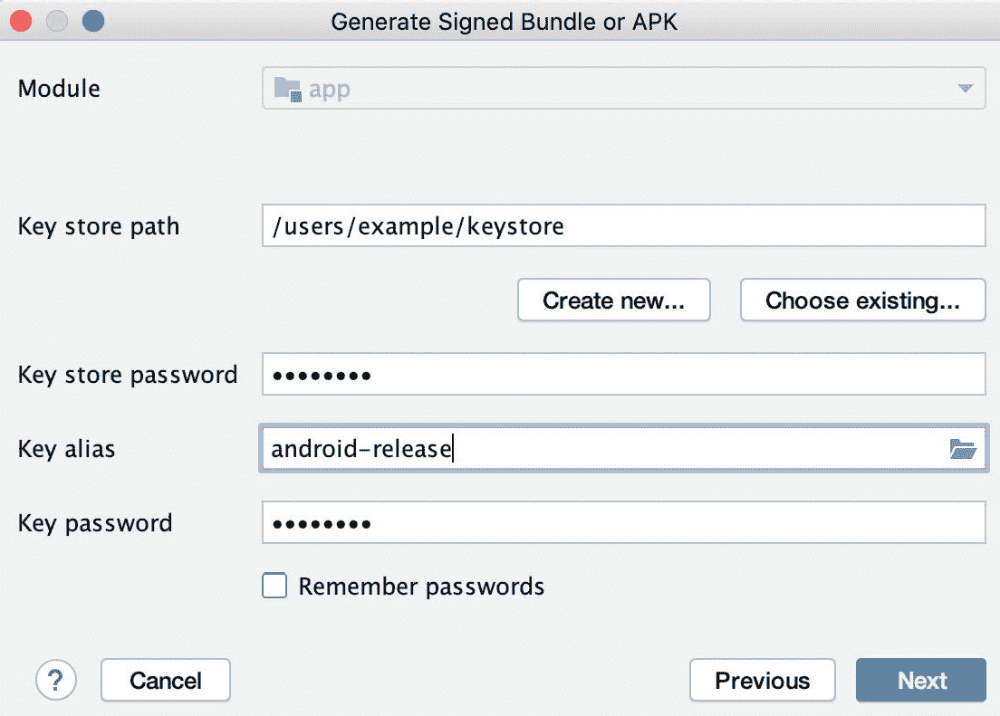

图 17.5 – 点击“下一步”按钮后的“生成签名包或 APK”对话框

1.  选择您在*练习 17.01* – *在 Android Studio 中创建密钥库*中创建的密钥库。

1.  在**密钥库密码**字段中提供您为创建的密钥库设置的密码。

1.  在**密钥别名**字段中，点击右侧的图标并选择密钥别名。

1.  在**密钥** **密码**字段中提供您为密钥库设置的别名密码。

1.  点击**下一步**按钮。

1.  选择签名 APK 将生成的目标文件夹。

1.  在**构建变体**字段中，确保选择了**发布**变体：


图 17.6 – 在“生成签名包或 APK”对话框中选择发布构建

对于签名版本，选择**V1**和**V2**。**V2（完整 APK 签名）**是一个整个文件方案，它增加了您的应用安全性并使其安装速度更快。这仅适用于 Android 7.0 Nougat 及以上版本。如果您针对的版本低于这个版本，您还应该使用**V1（JAR 签名）**，这是签名的旧方法，但比**V2**安全性低。

1.  点击**完成**按钮。Android Studio 将构建签名 APK。IDE 通知将告知您已生成签名 APK。您可以通过点击**定位**来转到签名 APK 文件所在的目录：


在这个练习中，您已经制作了一个已签名的 APK，现在您可以将其发布到 Google Play。在下一节中，您将了解 Android App Bundle，这是一种新的发布应用打包方式。

## Android 应用包

传统的发布 Android 应用的方式是通过 APK 或应用包。这个 APK 文件是用户在安装您的应用时下载到设备上的文件。这个大文件包含了所有设备配置的所有字符串、图像和其他资源。

随着您支持的设备类型和国家的增加，这个 APK 文件的大小将会增长。用户下载的 APK 将包含他们设备上并不真正需要的部分。这可能会成为您的问题，因为存储空间有限的用户可能没有足够的空间来安装您的应用。拥有昂贵的数据计划或慢速互联网连接的用户可能会避免下载过大的应用。他们也可能卸载您的应用以节省存储空间。

一些开发者已经构建并发布了多个 APK 来避免这些问题。然而，这既复杂又低效，尤其是在您针对不同的屏幕密度、CPU 架构和语言时。此外，每个发布版本维护的 APK 文件会太多。

Android App Bundle 是发布应用的一种新打包方式。您只需生成单个应用包文件（使用 Android Studio 3.2 及以上版本）并将其上传到 Google Play。Google Play 将自动生成基础 APK 文件以及每个设备配置、CPU 架构和语言的 APK 文件。安装您的应用的用户将只下载他们设备所需的 APK。与通用 APK 相比，这将更小。

这适用于运行 Android 5.0 Lollipop 及以上版本的设备；对于低于此版本的设备，生成的 APK 文件仅用于设备配置和 CPU 架构。所有语言和其他资源都将包含在每个 APK 文件中。

## 练习 17.03 – 创建签名应用包

在这个练习中，我们将使用 Android Studio 为 Android 项目创建一个签名应用包：

1.  在 Android Studio 中打开一个项目。

1.  转到**构建**菜单，然后点击**生成签名包或 APK**菜单项：

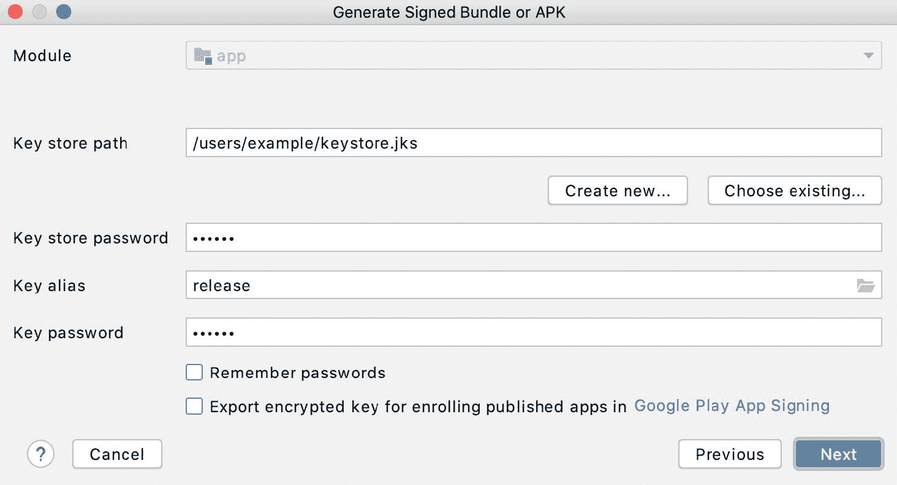

图 17.8 – 生成签名包或 APK 对话框

1.  选择**Android App Bundle**，然后点击**下一步**按钮：

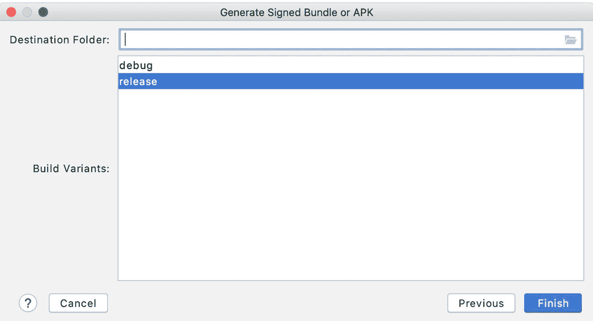

图 17.9 – 点击下一步按钮后的生成签名包或 APK 对话框

1.  在*练习 17.01 – 在 Android Studio 中创建密钥库*中创建的密钥库中选择。

1.  在**密钥库** **密码**字段中提供您为创建的密钥库设置的密码。

1.  在**密钥别名**字段中，点击右侧的图标并选择密钥别名。

1.  在**密钥** **密码**字段中提供您为在 Android Studio 中创建的密钥库设置的别名密码。

1.  点击**下一步**按钮。

1.  选择生成签名应用包的目标文件夹。

1.  在**构建变体**字段中，确保选择了**发布**变体：


图 17.10 – 在生成签名包或 APK 对话框中选择发布构建

1.  点击**完成**按钮。Android Studio 将构建签名应用包。IDE 通知将告知您已生成签名应用包。您可以点击**定位**以转到签名应用包文件所在的目录：

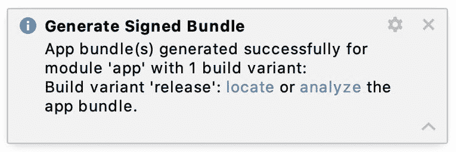

图 17.11 – 已生成签名应用包的弹出通知

在这个练习中，您已经创建了一个签名应用包，现在可以将其发布到 Google Play。

要能够以 Android 应用包格式将您的应用发布到 Google Play 商店，您首先需要选择 Google Play 的应用签名功能。我们将在下一节中讨论 Google Play 应用签名。

## Google Play 应用签名

Google Play 提供了一种名为应用签名的服务，允许 Google 管理和保护您的应用签名密钥，并自动为用户重新签名您的应用。

使用 Google Play 应用签名服务，您可以允许 Google 生成签名密钥或上传您自己的密钥。您还可以为额外的安全性创建不同的上传密钥。您可以使用上传密钥对应用进行签名并在 Play Console 上发布应用。

Google 将检查上传密钥，将其删除，并使用应用签名密钥重新签名应用以分发给用户。当应用启用应用签名时，上传密钥可以被重置。如果您丢失了上传密钥或认为它已经被破坏，您可以简单地联系 Google Play 开发者支持，验证您的身份，并获取一个新的上传密钥。

在发布新应用时加入应用签名很容易。在 Google Play Console ([`play.google.com/console`](https://play.google.com/console)) 中，您可以前往 **发布管理** | **应用发布** 部分，并在 **让 Google 管理和保护您的应用签名密钥** 部分选择 **继续**。您最初用于签名应用的密钥将成为上传密钥，Google Play 将生成一个新的应用签名密钥。

您还可以配置现有应用以使用应用签名。这可以在 Google Play Console 中应用的 **发布** | **设置** | **应用签名** 部分找到。您需要上传现有的应用签名密钥并生成一个新的上传密钥。

一旦您注册了 Google Play 应用签名，您就无法取消注册。此外，如果您使用第三方服务，您必须使用应用签名密钥的证书。这可以在 **发布管理** | **应用签名** 中找到。

应用签名还允许您上传应用包，Google Play 将自动签名并生成 APK 文件，用户在安装您的应用时将下载这些文件。

在下一节中，您将创建 Google Play 开发者账户，以便您可以将签名的 APK 或应用包发布到 Google Play。

# 创建开发者账户

要在 Google Play 上发布应用程序，您需要采取的第一步是创建 Google Play 开发者账户。前往 [`play.google.com/console/signup`](https://play.google.com/console/signup) 并使用您的 Google 账户登录。如果您还没有，您应该先创建一个。

我们建议使用您计划长期使用的 Google 账户，而不是一次性账户。阅读开发者分发协议并同意服务条款。

注意

如果您的目标是销售付费应用或在您的应用/游戏中添加内购产品，您还必须创建一个商户账户。遗憾的是，这并非在所有国家都可用。我们在这里不会涉及此内容，但您可以在注册页面或[`packt.link/LDncA`](https://packt.link/LDncA)上了解更多信息。

您必须支付 25 美元的注册费来创建您的 Google Play 开发者账户。（这是一次性支付）。费用必须使用有效的借记卡/信用卡支付，但某些预付费/虚拟信用卡也适用。您可以使用的内容因地区/国家而异。

最后一步是完成账户详情，例如开发者的姓名、电子邮件地址、网站和电话号码。这些信息可以在以后更新，并将形成在您的应用商店列表中显示的开发者信息。

完成注册后，你将收到一封确认邮件。你的付款可能需要几小时（最多 48 小时）才能处理并注册你的账户，所以请耐心等待。理想情况下，你应该提前这样做，即使你的应用还没有准备好，这样你就可以在它准备好发布时轻松发布。

当你收到谷歌的确认邮件后，你就可以开始将应用和游戏发布到谷歌 Play 了。

在下一节中，我们将讨论如何将应用上传到谷歌 Play。

# 上传应用到谷歌 Play

一旦你有了一个准备发布的应用和一个谷歌 Play 开发者账号，你就可以访问谷歌 Play 控制台([`play.google.com/console`](https://play.google.com/console))来发布应用。

要上传应用，请访问 Play 控制台，点击**所有应用**，然后点击**创建应用**。提供应用程序的名称和默认语言。在**应用或游戏**部分，设置它是一个应用还是一个游戏。同样，在**免费或付费**部分，设置它是免费还是付费。创建你的商店列表，准备应用发布，并推出发布。我们将在本节中查看详细步骤。

## 创建商店列表

当用户在谷歌 Play 上打开你的应用页面时，首先看到的是商店列表。如果应用已经发布，你可以转到**增长**、**商店存在感**，然后选择**主要商店列表**。

### 应用详情

你将导航到**应用详情**页面。在**应用详情**页面，你需要填写以下字段：

+   **应用名称**：在这里，你提供你的应用名称（最大字符数为 50）。

+   **简短描述**：在这里，你提供一段简短的文字总结你的应用（最大字符数为 80）。

+   **完整描述**：这是你应用的详细描述。限制为 4,000 个字符，所以你可以在这里添加很多相关信息，例如它的功能以及用户需要知道的事情。

注意

对于产品详情，你可以根据你的应用将在哪些语言/国家发布添加本地化版本。

你的应用标题和描述不得包含受版权保护的材料和垃圾邮件，因为这可能会导致你的应用被拒绝。

### 图形资产

在本节中，提供以下详细信息：

+   一个图标（一个 512 x 512 的高分辨率图标）。

+   特效图形（1,024 x 500）。

+   应用程序的 2-8 张截图。如果你的应用支持其他形式因素（平板电脑、电视或 Wear OS），你也应该为每个形式因素添加截图。

如果你有的话，也可以添加促销图形和视频。如果你的应用使用了违反谷歌 Play 政策的图形，它可能会被拒绝，所以请确保你使用的图片是你的，并且不包含受版权保护或不适当的内容。

## 准备发布

在准备发布之前，请确保您的构建已使用签名密钥签名。如果您正在发布应用更新，请确保它与相同的包名、使用相同的密钥签名，并且版本代码高于 Play Store 上的当前版本。

您还必须确保遵循开发者政策（以避免任何违规行为），并确保您的应用遵循应用质量指南。更多内容列在发布清单中，您可以在[`support.google.com/googleplay/android-developer/`](https://support.google.com/googleplay/android-developer/)查看。

### APK/app bundle

您可以上传 APK 或更新的格式：Android App Bundle。转到**发布**，然后**应用发布**。这将显示每个轨道中活跃和草稿发布的摘要。

您可以在不同的轨道上发布应用：

+   生产

+   开放测试

+   封闭测试

+   内部测试

我们将在本章的*管理应用发布*部分详细讨论发布轨道。

选择您将创建发布的轨道。对于生产轨道，您可以在左侧选择**管理**。对于其他轨道，请先点击**测试**，然后选择轨道。要在封闭测试轨道上发布，您还必须选择**管理轨道**，然后通过点击**创建轨道**来创建一个新的轨道。

完成后，您可以在页面右上角点击**创建新发布**。在**要添加的 Android App Bundles 和 APKs**部分，您可以上传您的 APK 或 app bundle。

确保 app bundle 或 APK 文件已由您的发布签名密钥签名。如果未正确签名，Google Play 控制台将不接受。如果您正在发布更新，app bundle 或 APK 的版本代码必须高于现有版本。

您还可以添加发布名称和发布说明。发布名称供开发者使用以跟踪发布，对用户不可见。默认情况下，上传的 APK 或 app bundle 的版本名称设置为发布名称。发布说明将显示在 Play 页面上，并告知用户应用的更新内容。

发布说明的文本必须添加到语言的标签内。例如，默认的美国英语语言的开头和结尾标签是`<en-US>`和`</en-US>`。如果您的应用支持多种语言，默认情况下，每个语言标签都会显示在发布说明的字段中。然后您可以添加每种语言的发布说明。

如果您已经发布了应用，您可以从之前的发布中复制发布说明，并通过点击**从上一个发布复制**按钮并从列表中选择来重用或修改它们。

当您点击**保存**按钮时，发布将被保存，您可以在以后返回。**审查发布**按钮将带您到可以审查和发布发布的屏幕。

## 发布版本

如果您准备好发布您的发布，请转到 Play 控制台并选择您的应用。转到**发布**并选择您的发布轨道。点击**发布**标签，然后点击发布旁边的**编辑**按钮：


图 17.12 – 生产轨道上的草稿发布

您可以审查 APK 或应用包、发布名称和发布说明。点击**审查发布**按钮以开始发布的发布。Play 控制台将打开**审查和发布**屏幕。在这里，您可以审查发布信息并检查是否有警告或错误。

如果你正在更新一个应用，你还可以在创建另一个版本时选择发布百分比。将其设置为 100%意味着它将可供所有用户下载。当你将其设置为较低的百分比，例如，50%时，发布将可供一半的现有用户使用。

如果你对自己的发布有信心，请点击页面底部的**开始发布到生产**按钮。发布您的应用后，它需要一段时间（新应用可能需要 7 天或更长时间）才能进行审查。您可以在 Google Play 控制台的右上角查看状态。这些状态包括以下内容：

+   **待发布**（您的应用正在审查中）

+   **已发布**（您的应用现在可在 Google Play 上使用）

+   **拒绝**（您的应用因违反政策而未发布）

+   **暂停**（您的应用违反了 Google Play 政策并被暂停）

如果您的应用存在问题，您可以解决它们并重新提交应用。您的应用可能因版权侵权、假冒和垃圾邮件等原因被拒绝。

一旦应用发布，用户现在可以下载它。新应用或应用更新在 Google Play 上变为可用可能需要一些时间。如果您正在尝试在 Google Play 上搜索您的应用，它可能不可搜索。请确保您在生产和开放轨道上发布它。

# 管理应用发布

您可以缓慢地在不同的轨道上发布您的应用以测试它们，然后再向用户公开发布。您还可以进行定时发布，使应用在特定日期可用，而不是一旦通过 Google 的审核就自动发布。

## 发布轨道

在为应用创建发布时，您可以选择四个不同的轨道：

+   生产是所有人都可以看到应用的地方。

+   公开测试针对更广泛的公众测试。发布将在 Google Play 上可用，任何人都可以加入测试计划并测试。

+   封闭测试旨在为测试预发布版本的小组用户。

+   内部测试是在开发/测试应用时为开发者/测试者构建的。

内部、封闭和公开渠道允许开发者创建一个特殊版本，并允许真实用户在其余用户使用生产版本的同时下载它。这让你能够知道发布版本是否有错误，并在将其推广给所有人之前快速修复它们。这些渠道的用户反馈也不会影响你应用的公开评论/评分。

理想的方式是在开发期间和内部测试阶段首先在内部渠道发布。当预发布版本准备就绪时，你可以为少量信任的人/用户/测试者创建一个封闭测试。然后，你可以创建一个公开测试，允许其他用户在全面上线生产之前尝试你的应用。

要访问每个渠道并管理发布，你可以进入 Google Play 控制台的**发布**部分，并选择**生产**或**测试**，然后选择**公开测试**、**封闭测试**或**内部测试**渠道。

### 反馈渠道和订阅链接

在内部、封闭和公开渠道中，有一个用于**反馈 URL 或电子邮件地址**和**测试者如何加入你的测试**的部分。你可以在**反馈 URL 或电子邮件地址**下提供一个电子邮件地址或网站，测试者可以将他们的反馈发送到那里。当他们在你的测试计划中订阅时，这会被显示出来。

在**测试者如何加入你的测试**部分，你可以复制链接与测试者分享。他们可以使用此链接加入测试计划。

### 内部测试

此渠道用于在开发/测试应用时的构建。这里的发布将快速对内部测试者可用。在**测试者**标签页中，有一个**测试者**部分。你可以选择现有的列表或创建一个新的列表。内部测试的测试者数量上限为 100。

### 封闭测试

在**测试者**标签页中，你可以为测试者选择**电子邮件列表**或**Google Groups**。如果你选择电子邮件列表，请选择一个测试者列表或创建一个新的列表。封闭测试的测试者数量上限为 2,000。

如果你选择`the-alpha-group@googlegroups.com`），该组的所有成员都将成为测试者。

### 公开测试

在**测试者**标签页中，你可以为测试者设置**无限**或**有限数量**。你可以设置的有限测试的最小测试者数量是 1,000。

在公开、封闭和内部渠道中，你可以添加用户作为你的应用的测试者。你将在下一节中学习如何添加测试者。

## 分阶段推广

在推出应用更新时，你可以首先将它们发布给一小群用户。然后，当发布版本出现问题时，你可以停止推广或发布另一个更新来修复问题。如果没有问题，你可以逐渐增加推广百分比。这被称为**分阶段推广**。

如果你已将更新发布给不到 100% 的用户，你可以转到 Play Console，选择**发布**，点击跟踪，然后选择**发布**选项卡。在你要更新的发布下方，你可以看到**管理发布**下拉菜单。它将包含更新或停止发布的选项。

你可以选择**管理发布**，然后**更新发布**来增加发布发布的百分比。将出现一个对话框，你可以输入发布百分比。你还可以点击**更新**按钮来更新百分比。

完全发布将使发布内容对所有用户可用。低于该百分比的任何百分比意味着发布内容仅对相应百分比的用户可用。

如果在分阶段发布过程中发现重大错误或崩溃，你可以转到 Play Console，选择**发布**，点击跟踪，然后选择**发布**选项卡。在你要更新的发布下面，选择**管理发布**，然后**停止发布**。将出现一个包含额外信息的对话框。添加可选的备注，然后点击**停止发布**按钮以确认：

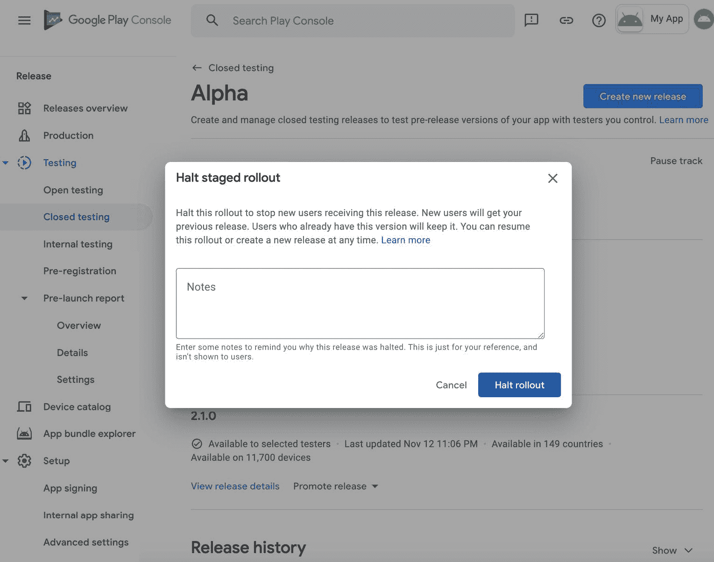

图 17.13 – 停止分阶段发布的对话框

当分阶段发布被停止时，你的跟踪页面中的发布页面将更新为**发布已停止**和**恢复发布**按钮：

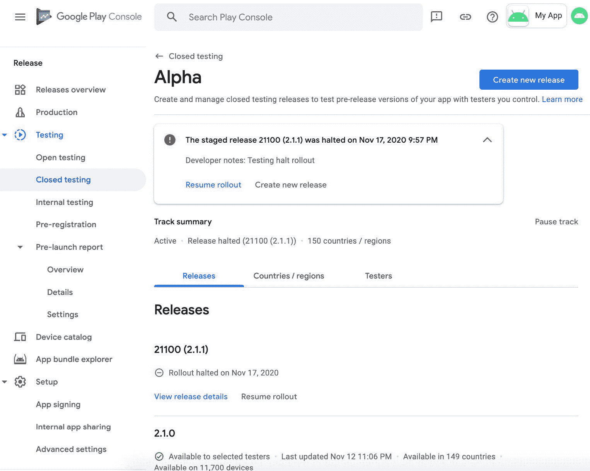

图 17.14 – 停止分阶段发布的发布页面

如果你已修复问题，例如在后台，且无需发布新更新，你可以恢复你的分阶段发布。要这样做，请转到 Play Console，选择**发布**，点击跟踪，然后选择**发布**选项卡。选择发布并点击**恢复发布**按钮。在**恢复分阶段发布**对话框中，你可以更新百分比并点击**恢复发布**以继续发布。

## 托管发布

当你在 Google Play 上发布新版本时，它将在几分钟内发布。你可以将其更改为稍后发布。这在针对特定日期时很有用，例如，与 iOS/web 发布的同一日期或发布日期之后。

在创建和发布你想要控制的发布的更新之前，必须设置托管发布。当你选择 Google Play Console 上的你的应用时，你可以在左侧选择**发布概览**。在**托管发布**部分，点击**开启托管****发布**按钮：

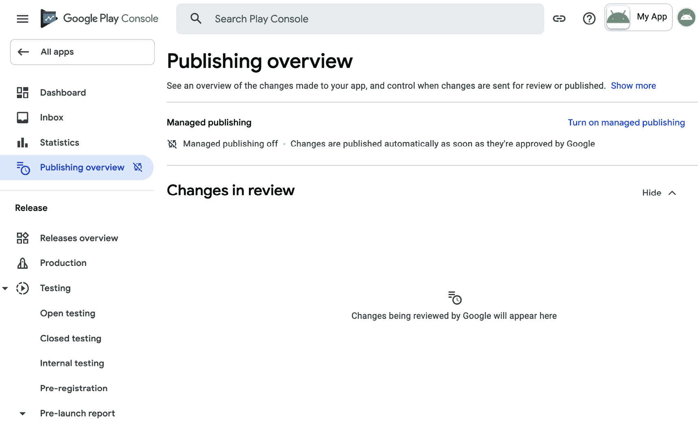

图 17.15 – 发布概览中的托管发布

**托管发布**对话框将显示。在此，你可以开启或关闭托管发布，然后点击**保存**按钮。

当你开启**管理发布**时，你可以继续添加和提交应用的更新。你可以在**更改审查**下的**发布概述**中看到这些更改。

一旦更改被批准，**待审查的更改**将变为空，并移动到**准备发布的更改**部分。在那里，你可以点击**发布更改**按钮。在出现的对话框中，你可以点击**发布更改**按钮以确认。然后你的更新将立即发布：

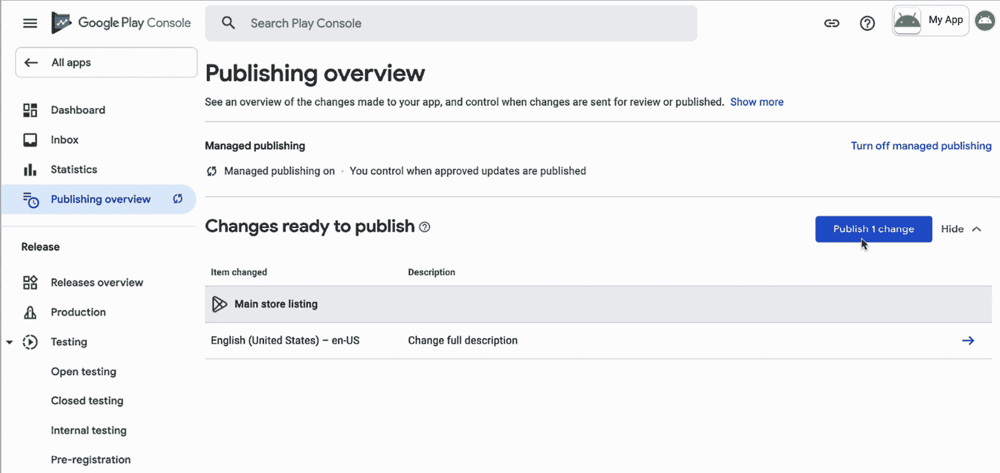

图 17.16 – 准备发布的更改

在本节中，你了解了可以测试发布、执行分阶段发布的发布轨道，以及管理发布时间。

通过一个活动来测试你所学的一切。

## 活动 17.01 – 发布应用

作为本书的最后一项活动，你被要求创建一个 Google Play 开发者账户并发布你构建的新 Android 应用。你可以发布本书或另一个项目中构建的应用之一。你可以使用以下步骤作为指南：

1.  前往 Google Play 开发者控制台([`play.google.com/console`](https://play.google.com/console))并创建一个账户。

1.  创建一个密钥库，你可以用它来签署发布构建。

1.  为发布生成 Android 应用包。

1.  在发布到生产轨道之前，在公开测试轨道上发布应用。

注意

本章已解释了发布应用的详细步骤，因此没有为这个活动提供单独的解决方案。你可以遵循本章的练习来成功完成前面的步骤。所需的精确步骤将取决于你的应用和你要使用的设置。

# 摘要

本章涵盖了 Google Play 商店：从准备发布到创建 Google Play 开发者账户，最后发布你的应用。我们从对应用进行版本管理、生成密钥库、创建 APK 文件或 Android 应用包并使用发布密钥库对其进行签名，以及存储密钥库及其凭证开始。然后我们转向在 Google Play 控制台中注册账户、上传你的 APK 文件或应用包以及管理发布。

这是本书贯穿始终的工作成果的总结——发布你的应用并将其向世界开放是一项伟大的成就，并展示了你在整个课程中的进步。

在本书的整个过程中，你获得了许多技能，从 Android 应用开发的基础到实现 RecyclerViews、从网络服务获取数据、通知和测试等功能。你看到了如何通过最佳实践、架构模式和动画来改进你的应用，最后，你学习了如何将它们发布到 Google Play。

这只是你作为安卓开发者的旅程的开始。随着你继续构建更复杂的个人应用并在此基础上扩展你的学习，你还有许多更高级的技能需要掌握。

记住，安卓系统是持续演进的，所以请确保自己跟上最新的安卓版本。你可以访问[`developer.android.com/`](https://developer.android.com/)来获取最新的资源，并进一步沉浸在安卓的世界中。
