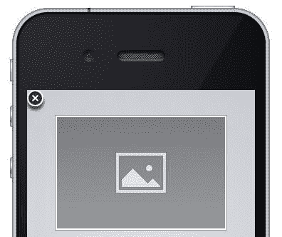
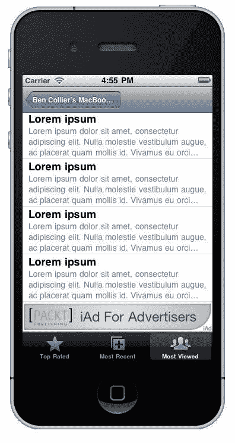
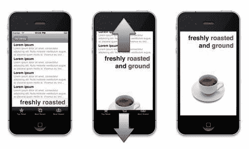
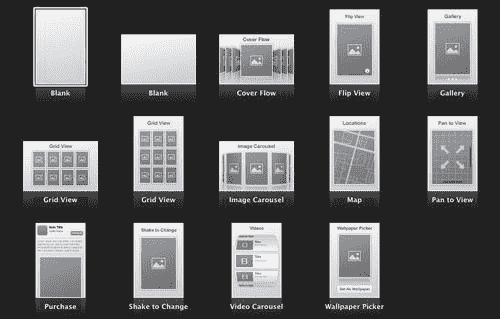
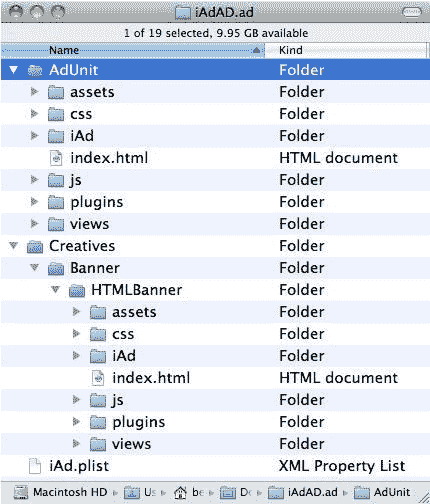
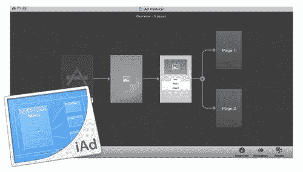
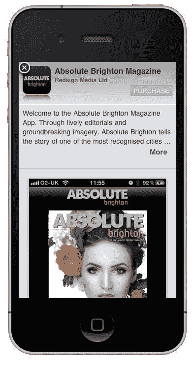
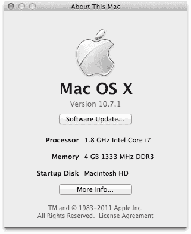
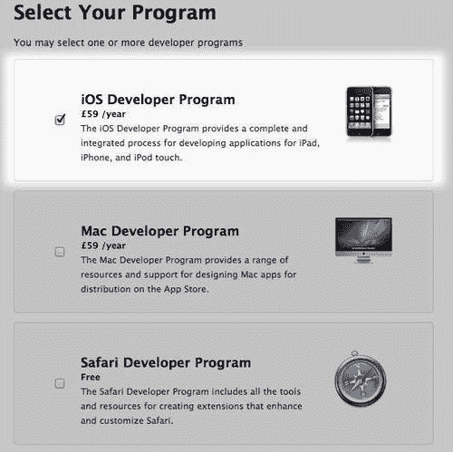

# 第一章：iAd 入门

> iAd 是苹果提供的激动人心的移动广告机会。

在本章中，我们将探讨：

+   iAd 是什么

+   使 iAd 变得出色的因素

+   iAd 的结构

+   驱动 iAd 的技术

+   可用于构建你自己的 iAds 的工具

+   如何访问工具

# 了解 iAd 是什么

苹果在 2010 年夏季宣布支持 iAd，允许你直接针对在应用商店购买的应用程序中的客户投放令人惊叹的互动广告。每个 iAd 最初都是一个用户个人设备上的小型激动人心的横幅，一旦激活就会瞬间填满整个屏幕，为你，广告商，提供了一个精心打造深度沉浸式体验的机会。

应用开发者可以在苹果应用商店的他们的应用程序中为你的 iAd 指定空间，横幅在整个应用程序使用过程中位于屏幕底部。通常，iAds 比它们所在的应用程序更有趣！

iAds 内置在 iOS 4.0 及之后的苹果 iPhone、iPod touch 和 iPad 操作系统。

### 注意

将 iAd 想象成用户从苹果应用商店下载的第三方应用程序中的迷你应用程序。

使用 iAd，你的广告将被以下受众观看：

+   自 2008 年应用商店开业以来，已安装超过 150 亿个应用程序

+   已激活超过 2.25 亿个 iTunes 账户，每个账户都与一张信用卡绑定，实现一键计费（甚至在你使用 iAd 时）

+   全球每秒下载 200 个新应用程序

+   平均每天花费 73 分钟使用应用程序

+   每次访问平均与 iAd 广告互动 60 秒

苹果在其产品中设定了一定的质量标准，这在他们应用商店提供的广泛应用程序中得到了体现。然而，移动广告通常是用户不愉快的体验。对此不满，苹果决定在数百万用户的手机中构建一个独特的广告平台。

2011 年初，苹果宣布支持 iPad 的 iAd，这为我们提供了全面访问丰富交互式多点触控画布的机会，以我们以前只能想象的方式推广我们的品牌或产品。

### 注意

许多使用 iAds 的公司会制作一个促销视频，只是为了展示他们的广告！你有时会发现，使用 iAd，你将获得额外的公关机会，因为每个体验都是如此动态和不同，人们喜欢谈论它们。

每个 iAd 展示都可以针对以下内容：

+   **人口统计信息：** 目标性别或年龄

+   **应用偏好：** 用户的购买和下载趋势可以揭示他们的偏好

+   **音乐热情：** 尽管用户的音乐品味不是一个明显的有用定位技术，但由 iTunes 监控的收听习惯可以识别出特定的受众群体。这就是广播广告定位的方式。

+   **电影、电视和有声书兴趣类型：** 由于每个设备都与 iTunes 账户相关联，苹果可以访问用户的商店购买和媒体兴趣。

+   **位置：** 每个 iOS 设备都内置了位置功能；因此，如果您有实体店，您可以针对附近的潜在客户进行定位，可能还有本地的时间敏感优惠。

+   **设备（iPhone、iPod touch 或 iPad）：** iAd 网络让您可以为不同的 iOS 设备设计并定位独特的广告，为每个体验量身定制，以充分利用可用的硬件。

+   **网络（Wi-Fi、3G）：** 如果用户连接到 Wi-Fi，他们更有可能处于会与您的 iAd 互动的情况，因为 Wi-Fi 主要在静态位置可用，用户有更多时间关注您的广告。

苹果管理着整个广告投放过程，包括在 iAd 网络上托管广告，并通过无线方式将它们发送到 iOS 设备上的受众。

### 备注

苹果允许用户通过访问 iOS 4.0+设备上的[`oo.apple.com/`](http://oo.apple.com/)来选择退出基于兴趣的广告。这仍然会将 iAd 发送给用户，但没有任何针对特定用户的目标。显然，苹果并没有公开宣传这一点，只有少数高级用户会选择退出。

## 理解现有移动广告的问题

移动广告并非新概念，但在 iAd 出现之前，它从未真正做对。它充斥着铃声、壁纸和高级短信服务，用户往往在不经意间被订阅了服务。这更多的是关于直接向客户推广付费移动媒体，而不是推广优秀的品牌和产品。

应用内广告开始针对更具体的品牌，但几乎所有移动广告都会将用户从当前的应用程序中推出，并使其无法轻易回到之前的位置。通常，用户会被推送到移动浏览器，到一个通常不是为移动设备设计的网页，缺乏用户的交互性和响应性。在 iAd 之前，典型的移动横幅广告可能是一个隐藏在用户应用程序中的普通静态条带，而不是嵌入到核心操作系统中的交互式广告。

在桌面端，大部分广告收入来自搜索，但移动用户正在使用更具体的应用程序来查找他们想要的信息。如果您想找到一个不错的餐厅，您更有可能打开餐厅目录应用程序，而不是进入移动浏览器并使用搜索引擎。上下文感知应用程序正在成为用户在移动设备上查找事物的方式。您的 iAd 在这些应用程序中智能定位，提供相关、上下文和令人兴奋的营销机会。

# 发现是什么让 iAd 变得出色

与传统的移动广告不同，每个 iAd 都提供了一个应用内交互式广告，它不会将用户推出应用程序。您以前从未能够以如此沉浸式的体验来推广您的品牌或产品，与用户的指尖互动。

尼尔森公司的一项研究比较了坎贝尔汤电视广告活动与他们的 iAd 移动广告，发现与 iAd 互动的用户是：

+   记忆广告的可能性高出两倍

+   记忆信息的可能性高出三倍

+   购买的可能性高出四倍

当信息与我们要他们吸收的信息互动时，人们记得更好。每个 iAd 都获得了访问深度沉浸式设备功能的机会，从全多点触控屏幕（允许用户近距离缩放并浏览您产品的图片）到设备的物理运动（允许他们使用摇晃来显示关于您品牌的随机信息或事实），iAds 提供了前所未有的引人入胜、互动和难忘的体验机会。

集成在 iAd 中的独特功能使得用户能够以多种引人入胜的方式与您的品牌互动，例如以下几种：

+   **在 iAd 内下载应用程序或购买 iTunes 媒体：** 如果您在 iTunes Store 或 App Store 上有可用的内容，例如您想要推广的电影或应用程序，用户可以在您的 iAd 中轻触一次即可购买，而无需离开他们当前的应用程序

+   **将屏幕截图保存到相册：** 像优惠券、条形码、食谱或品牌壁纸这样的图片可以直接保存到用户的设备上，或者立即设置为他们的背景

+   **查看内联音频和视频：** 视频可以在您的 iAd 中的自定义框架内播放，并叠加交互元素

+   **查找附近的商店：** 由于每个 iOS 设备都内置了丰富的 Google Maps，因此很容易显示您附近的商店或零售商列表

+   **在不离开广告的情况下通过 Twitter 分享内容：** iAd 框架是完全可扩展的，因此可以实现社交分享和几乎任何功能

在任何时候，用户都可以点击位于 iAd 右上角的关闭按钮，返回他们之前的应用程序，这使得他们更愿意点击 iAd，并将您的品牌与积极的体验联系起来。在这里，您可以看到演示广告中的关闭按钮：

通过 iAd，苹果公司创造了一种体验，它同时结合了传统在线广告的互动性和电视广告的情感因素。

### 注意

查看尼桑 leaf iAd 促销视频（在 YouTube 等视频网站上搜索*Nissan Leaf iAd*）；这是一个在 iAd 中激发情感并展示 iAd 平台巨大灵活性的绝佳例子。

# 描述 iAd 的解剖结构

一个 iAd 由四个关键部分组成，具体如下：

1.  横幅广告。

1.  从横幅切换到主要广告。

1.  启动页。

1.  核心广告单元。

## 理解横幅的作用

**横幅**是您广告的第一印象；它至关重要，必须激发用户点击它并探索您在 iAd 中等待的所有其他精彩内容。横幅可以通过横幅右下角的小标志识别，如下面的截图所示：

iAd 标志增加了用户点击您的广告的可能性，因为他们知道他们将获得一个丰富的沉浸式广告，而不会失去他们所在的应用位置。

横幅通常显示在屏幕底部或用户应用的标签栏上方，如下面的截图所示：

### 使用不同的横幅类型

您可以为您的 iAd 使用两种类型的横幅 - 一种**静态图片横幅**或一种**动态 HTML5 横幅**。

#### 静态图片横幅

静态图片横幅是一种更为传统的横幅，通常因为它快速简单而被选择。

您的静态横幅可以是横幅框架的大小，也可以是一个屏幕尺寸的静态横幅，其中只有横幅中的一部分图像可见，当用户点击查看您的广告时，将显示完整图像。

#### 动态 HTML5 横幅

HTML5 动态横幅为用户参与提供了更多机会，因为它允许动画文本和图形。在横幅中添加运动和动画可以使它在使用者的设备上脱颖而出，吸引他们的注意力，并增加他们点击了解更多关于您品牌信息的可能性。

使用 HTML5 横幅，您能够远程更新横幅中的数据，使用实时信息，如最新的体育比分或股票报价。

## 进入广告的切换

切换发生在用户点击横幅进入您的 iAd 时；它使进入启动页的过程变得柔和，并在两者之间创建视觉连接。切换可以是**滑动**或**揭示**。

### 幻灯片切换

幻灯片切换是展示您的启动页最常见的方式。它从横幅中推起一个全色块，覆盖用户当前所在的 app。一个进度条显示了您的启动屏幕加载的状态。

### 揭示切换

您只有在使用屏幕尺寸静态横幅时才应使用揭示切换。它将用户 app 中的用户界面元素推开，以揭示您的 iAd 启动屏幕。以下截图显示了本书稍后我们将创建的广告中的揭示切换：

## 使用启动页使加载变得有趣

启动页是一个可选的屏幕；它在主要 iAd 资源加载时显示，在用户点击您的横幅和能够与核心广告单元交互之间显示。

虽然闪屏页是可选的，但在你的广告资源加载期间传达你的品牌信息是一个理想的机会。

苹果估计，一旦用户进入你的 iAd，你有 15 秒的时间赢得他们的注意力，所以一个引人入胜的闪屏页确保我们在等待时保持他们的满意度。

闪屏页可以用来在过渡到主要广告之前展示有关你的品牌或产品的有趣统计数据或功能。

### 注意

即使你认为你的 iAd 轻量级且不需要下载时间，用户通常在缓慢的移动数据连接上，小广告不会立即加载。

在闪屏页上也可以使用预播放视频，尽管有了轻量级的 CSS3 动画和样式，我们可以将动态效果应用于图像和文本，这通常可以模仿视频，而不需要与流媒体视频相关的大（且慢）下载。

## 探索核心广告单元

这是你的 iAd 的主要内容，在这里你有真正的机会以多种令人兴奋的方式传达你的内容。核心广告单元由多个视图组成；将这些视为网站的不同页面，每个页面都有各种媒体和内容，以激发用户对你的品牌或产品的兴趣。

广告单元从**根视图**开始，通常用于导航，在 iAd 内的不同视图之间切换。

根视图的子页面提供了提供以下内容的机会：显示用户最近商店或零售商位置的动力地图，惊人的 3D 交互式视频旋转木马和图片库，或者仅限于你想象力的空白画布！以下是可以在你的 iAd 中使用的一些模板的选择，以帮助你了解你可以包含的内容类型：

# 理解你的 iAd

iAd 本质上是一个包含在用户已安装的应用程序中的丰富动态网页。就大部分而言，我们不需要担心正在发生的事情，因为苹果提供的工具为我们管理这些。话虽如此，了解驱动你的 iAd 的魔法总是好的。

HTML5 是 iAd 框架的底层技术。它基于 Web 的未来，下一代 HTML（并且错误地宣传为包括对 JavaScript 和 CSS 的增强）。我们的 iAd 可以结合使用 JavaScript 和 CSS 的最新功能。

## 使用 HTML 进行结构化

HTML5，即第五代**HTML**（超文本标记语言），是您页面的内容和语义结构。

视频、音频以及其他传统上需要插件（如 Flash，iOS 著名地不支持）的东西，现在可以使用 HTML5 来实现。

### 注意

对于好奇的人来说，如果你在网页上右键单击并选择**查看源代码**，你可以查看创建该页面结构和包含该页面内容的底层 HTML。

## 使用 CSS3 进行样式设计

**CSS** **（层叠样式表）** 的第三版允许在您的 iAd 中进行视觉样式设计。使用 CSS3，可以不使用图像就完成圆角和背景渐变的样式设计，这意味着您的 iAd 轻量级，并且能够更快地将品牌信息传递给用户。CSS3 具有丰富的动画能力，可以为您的 iAd 和横幅带来活力。

CSS3 具有平滑、硬件加速的 3D 效果，您可以将这些效果应用到您的 iAd 资产中，并结合动画。丰富的 3D 动画增加了您广告的互动性。

## 与 JavaScript 交互

JavaScript 是一种用于控制您 iAd 内部交互的编程语言。每当在某个地方轻触或捏合导致与您的 iAd 交互时，幕后 JavaScript 将控制这一点。JavaScript 能够访问用户位置以查找当地商店并提供基于位置的促销活动。JavaScript 可以使用 AJAX 技术从您的网站远程获取最新的优惠和信息，以创建动态且最新的体验。

## 文件排列

每个 iAd 都是一个文件夹，其中包含了用于您的横幅和广告单元的 HTML、CSS、JavaScript 和媒体文件。在下面的屏幕截图中，我们可以看到典型 iAd 的文件结构：

如果您愿意，您可以使用文本编辑器仅通过操作这些文件来创建整个 iAd。幸运的是，**iAd Producer** 在我们使用它创建 iAd 时会为我们创建和更新这些文件。

# 使用工具创建和测试 iAd

我们将使用的主要工具是 iAd Producer，这是一个简单的拖放工具，用于构建、测试和分发令人惊叹的交互式 iAd。

## 介绍 iAd Producer

iAd Producer 管理您 iAd 中的所有 HTML5、CSS3 和 JavaScript，而无需您编写任何代码。在下面的屏幕截图中，我们可以看到 iAd Producer 丰富的视觉界面：

iAd Producer 提供了您 iAd 的结构和流程的视觉概述。使用它，您只需点击几次即可添加额外的子页面并重构整个 iAd。

您的所有媒体资产都存储在中央资产库中，该库自动管理对高分辨率和低分辨率显示的支持，通过优化资产以适应更新 Apple iOS 设备中使用的 **Retina 显示屏**。

### 注意

Retina 显示屏是苹果公司在 iPhone 4 和 iPod Touch 及后续设备上使用的高分辨率屏幕。它的分辨率是旧设备的两倍，具有如此高的像素密度，以至于您的眼睛无法看到单个像素。这样鲜艳、清晰、锐利的屏幕可以让您的品牌在 iAd 中充分利用。要了解更多关于 Retina 显示屏的信息，请访问 [`www.apple.com/iphone/features/retina-display.html`](http://www.apple.com/)。

我们可以通过将图片和视频拖放到 iAd Producer 预构建的动感丰富的 3D 轮播图中来构建整个广告。菜单会自动生成，供用户探索和浏览您的 iAd。

iAd Producer 使您能够轻松地将视觉动画和效果应用到您的内容上，这是为您的 iAd 增添个性和兴奋感的好方法，而不需要视频的沉重负担。这些动画包括擦除、淡入淡出、旋转效果和立方体过渡，可以应用于媒体项目、文本，甚至整个页面。

为了创建用户熟悉的视觉冲击体验，iAd Producer 包含了一个丰富的轮播图、按钮、音频或视频播放器和画廊库；所有这些都可以通过简单的拖放添加到您的 iAd 中。

在制作您的广告的过程中，iAd Producer 会验证和检查您的项目，识别常见问题，例如图像大小或格式不正确，或者您忘记配置某个页面。这意味着您可以尽早发现问题，并专注于创建您的广告。

要扩展您 iAd 的功能，超出 iAd Producer 内置的功能，我们能够查看、编辑和扩展它创建的代码，以创建更酷的功能，如分享您的内容、测验或竞赛。

一旦您完成了您的 iAd，`iAd Producer`会对您的资源进行打包和优化，以减少大小和所需时间，将完整的广告体验传递给用户。

## 使用 iOS 模拟器和 iAd Tester 应用进行测试

**iOS 模拟器**是一个运行在您的 Mac 桌面上的虚拟 iPhone 或 iPad，是测试您无法购买或尚未公开的设备的快捷方式。它支持大多数真实设备会有的功能，例如**方向**和**摇晃**。方向允许设备知道何时旋转，并相应地更新屏幕内容。同样，通过摇晃，我们可以在用户摇晃设备时更新屏幕内容。在 iOS 模拟器中，我们可以从菜单中模拟这些旋转和摇晃；不幸的是，摇晃或旋转您的 Mac 不会产生类似的结果。

### 注意

即使您可以在没有设备的情况下测试您的 iAd，但在真实的 iPhone 上测试是至关重要的，因为 iAd 在模拟器中通常会加载和运行得更快。这是因为模拟器能够使用您系统的全部资源。

**iAd Tester 应用**是一个您可以安装到您的 iPhone、iPod 或 iPad 上的移动应用程序，通过 iTunes 进行安装。iAd Tester 应用能够远程连接到您 Mac 上的 iAd Producer，并允许您测试您的 iAd 在其他开发者的应用中会如何显示。

要访问 iAd Producer、iPhone/iPad 模拟器或测试您的 iAd 在设备上，您需要加入**Apple 开发者计划**。

## 使用 iAd 加速开发者开发

如果你已经有了自己的 iOS 应用程序，苹果有一个预构建的 iAd 包，用于驱动你的应用程序的下载，称为**iAd for Developers**。要使用它，你需要有一个在 App Store 上活跃的应用程序，然后通过[`advertising.apple.com/contact/`](http://advertising.apple.com/contact/)上的表格联系苹果，并选择**iAd for Developers**来推广应用程序。单页 iAd 几乎与你的 App Store 列表相同，看起来类似于以下示例：

# 加入开发者程序

要访问完整的苹果文档和 iAd 工具，你需要成为付费的苹果 iOS 开发者计划的成员。这需要每年支付 99 美元，并为你提供访问 iAd Producer 的权限，这是我们将在整本书中使用来为你的品牌构建一些优秀的 iAds 的工具。

### 注意

别担心，尽管它被称为开发者程序，但你不需要是开发者或拥有开发技能，就可以使用这本书中探讨的技术。

## 使用正确的硬件

我们将在本书中使用苹果软件要求你使用他们最新的 Mac OS X 操作系统和硬件。

### 你拥有 Mac

如果你已经有了 Mac，它必须是一款 Intel Mac，运行 Mac OS X Snow Leopard 或更高版本。

# 检查你的 Mac 的行动时间

要检查你的 Mac 是否运行 Snow Leopard，请按照以下步骤操作：

1.  点击屏幕左上角的苹果图标，然后选择**关于本机**。如果版本中包含**10.6**或更高版本，你正在运行 Snow Leopard 或更高版本，可以安装我们将要使用的工具。

1.  如果你的版本低于**10.6**，我们可以通过检查你的处理器是否包含**Intel**来查看你是否能够升级，从**关于本机**。在这里我们可以看到操作系统版本是**10.7.1**，即高于 10.6，因此与 iAd Producer 兼容：

+   如果你拥有 Intel 处理器，你可以通过从苹果商店或零售商购买 Mac OS X Snow Leopard 升级盘来升级到 Snow Leopard（v. 10.6）。一旦升级到 Snow Leopard，你可以选择通过 Mac App Store 更新到 Mac OS Lion。

## 刚才发生了什么？

**关于本机**屏幕会告诉你你的 Mac 的技术规格以及它所使用的操作系统。

如果你没有 Intel 处理器，并且**关于本机**屏幕显示你的处理器为**PowerPC**，很遗憾，你不能升级到 Snow Leopard；是时候获得一台应得的全新机器了！

# 购买 Mac 的时间

当前系列中的任何 Mac 都应该能够运行 iAd Producer；所以，如果你已经关注了一段时间，就给自己一个惊喜吧！

如果你已经有了屏幕、键盘和鼠标，Mac Mini 是开始的最便宜方式。如果你想要从头开始，MacBook 或 iMac 可以很好地处理 iAd 生产和开发。

如果您计划购买一台二手机器，任何 2009 年中或之后的型号都应该预装了 Mac OS X Snow Leopard，并且能够运行 iAd Producer。使用前面概述的步骤来查看潜在的机器是否合适。

## 成为注册开发者

要访问 iAd Producer 工具和广泛的苹果 iAd 文档，您需要一个付费的开发者账户。让我们注册 iOS 开发者计划。

# 行动时间——注册开发者计划

按照以下简单步骤，您将很快就能访问开发者计划：

1.  访问 [`developer.apple.com/programs/start/standard/`](http://developer.apple.com/programs/start/standard/) 并在左下角点击**继续**。您将设置一个新的苹果开发者账户，并会被询问是否有一个您想使用的苹果 ID。如果您有 iTunes 或 MobileMe 账户，可以使用这个 ID。然而，当为您的公司或客户创建 iAds 时，您应该创建一个新的苹果 ID。这样可以确保账单和发票与您的个人账户分开。

1.  您可以设置个人账户或公司账户；选择与您相关的账户。

    ### 注意

    设置公司账户可能需要大约两周的时间来验证您的公司信息，所以请尽快设置以避免在构建您的 iAds 过程中出现延误！

    +   如果您正在设置一个新的苹果 ID，您现在需要输入您的个人信息、密码和一般安全信息，然后点击**继续**。您将被要求完成一个专业档案；这只是苹果的一个调查，您选择的值不会影响您设置的账户。苹果将在几分钟内向您发送一封确认电子邮件；您可以选择点击此电子邮件中的链接来激活您的账户，或者将其复制到注册过程中的文本框中。恭喜，您已成为注册的苹果开发者！现在，您需要注册 iOS 计划。

1.  输入您的账单地址详情并点击**继续**。您将被要求选择您想注册的计划；勾选**iOS 开发者计划**并点击**继续**。

1.  您现在有机会审查您的信息，确保 iOS 开发者计划在开发者计划下，并且您的个人/账单信息是正确的。通过点击**继续**来确认这些细节。

1.  阅读苹果开发者协议并勾选框以接受它。点击**我同意**。

    ### 注意

    苹果开发者协议主要针对在 App Store 上构建和分发应用程序，但在接受之前请确保您已全面审查。

1.  您现在可以通过点击**加入购物车**来购买 iOS 开发者计划。

1.  选择**结账**，一旦您的申请被处理，您将加入该计划。

## 刚才发生了什么？

使用苹果创建 iOS 开发者账户可以访问他们为我们构建优秀 iAd 所需的开发工具。这个开发者账户与在 App Store 中提供应用的开发者使用的账户相同。如果您有任何希望发布到 App Store 的应用，可以使用此账户提交。

### 注意

$99 的开发者费用仅有效期为一年，要继续使用 iAd Producer 和创建 iAd，您必须续订该程序的订阅。如有必要，苹果将通过电子邮件通知您续订说明。

# 摘要

在本章中我们学到了很多。现在您知道，iAd 是苹果 iOS 设备（iPhone、iPod touch 和 iPad）上的一项激动人心的营销机会。iAd 之所以突出，是因为它们提供了一种无与伦比的互动体验。每个 iAd 都是一个微型的互动网页，使用 HTML5、CSS3 和 JavaScript。iAd 有四个关键部分：

1.  **横幅广告：** 用户点击你的 iAd 的吸引人机会。

1.  **过渡动画：** 在横幅广告和启动页面之间的一种不会令人不适的动画。

1.  **启动页面：** 让用户等待变得有趣，并保持他们的注意力。

1.  **核心广告单元：** 构成给用户留下深刻印象的关键机会的导航和子页面。

iAd Producer 是我们将用来构建您的 iAd 的工具。我们可以在 iAd 模拟器和我们的设备上使用 iAd 测试应用程序来测试我们的 iAd。

在本章中，我们还有：

1.  获得了运行我们将要使用的工具所需的硬件。

1.  已注册开发者计划以获取构建和测试一些优秀 iAd 的工具！

现在您已经了解了 iAd 是什么，并且可以访问这些工具，我们可以继续到第二章*，准备您的 iAd 内容*，我们将探讨为 iAd 准备媒体和内容以及向移动设备传输媒体的限制。

### 注意

在我们开始构建它们之前，如果您想了解更多关于 iAd 的信息，请查看苹果的销售提案[`advertising.apple.com/`](http://advertising.apple.com/)和 iAd 文档[`developer.apple.com/library/iad/`](https://developer.apple.com/library/iad/) [需要开发者登录]。
