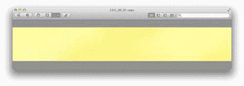
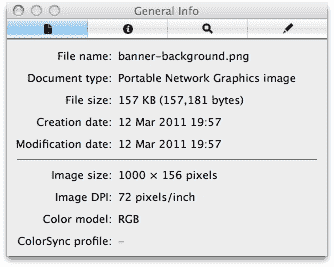
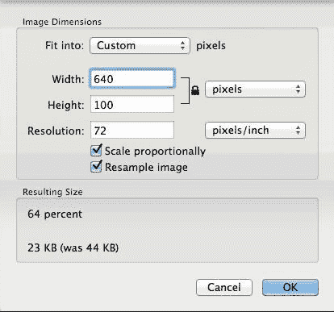
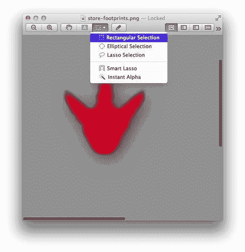
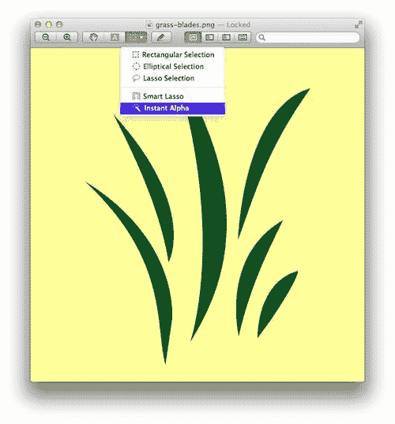
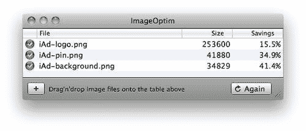
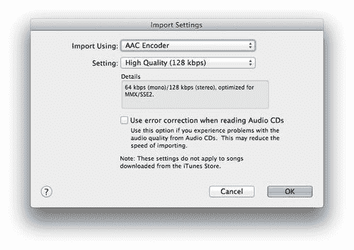
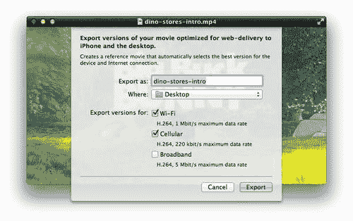

# 第二章：为移动设备准备您的内容

> 您需要优质的内容来制作出色的 iAd，并且这些内容需要以正确的格式呈现。

在本章中，我们将探讨以下主题：

+   iAd 可以包含哪些媒体

+   应对移动限制

+   编辑和优化图像以用于您的 iAd

+   为您的 iAd 获取正确的音频格式

+   修改您的视频，使其能在 iOS 上运行

# 在 iAd 中包含媒体

iAds 可以包含图像、音频和视频。在它们可以包含在您的 iAd 中之前，每种都需要非常具体的格式并满足某些标准。

您将需要构建 iAd 的典型资产包括：

+   您的产品和/或公司标志

+   情感化的产品图像

+   引人入胜的音频片段

+   沉浸式视频

+   用于标记商店位置的地图针

+   背景和主题艺术作品

在设计和制作您的 iAd 资产时，重要的是要关注您的内容出现的上下文。

# 克服移动限制

与所有移动设备一样，iPhone 的较小屏幕和便携性意味着在物理尺寸、处理能力和连接性方面存在限制。这些限制不应被恐惧，相反，它们是完善您的信息并向未来的客户提供最相关体验的绝佳机会。

## 为小屏幕设计

较小的屏幕意味着您需要更好地利用您可用的有限屏幕空间；例如，可点击区域需要考虑用户手指的不一致性。我们需要确保所有可点击区域至少高 88px、宽 88px，并且每个可操作元素之间有足够的空间，以防止对用户体验有害的无意点击。

### 注意

在设计您的 iAd 横幅时，请记住横幅的右下角将被 iAd 标志遮挡，因此不要在那里放置任何重要信息。

重要的是要记住，您不应试图将整个产品线或公司理念都放入您的 iAd 中。吸引人的体验和直接与用户互动的独特机会应专注于少数几个关键产品或要点，鼓励他们采取行动并实现您的广告目标。

当在移动环境中处理广告时，用户通常处于一个充满干扰的环境中，因此创建清晰、响应式且对用户直观的屏幕是实现成功的 iAd 的关键。

## 在下载速度受限时提供内容

如果您希望您的 iAd 覆盖最广泛的受众，您需要假设大多数用户可能通过通常较慢的蜂窝网络连接。较慢的连接意味着用户在看到您令人惊叹的 iAd 之前需要等待更长的时间！因此，存在某些限制和建议。

### 遵守文件大小限制

苹果限制了 iAd 初始部分（横幅和启动屏幕）的文件大小，以确保它们快速加载并在关键的前 15 秒内吸引用户。

您的 HTML5 横幅大小可以达到以下范围：

+   在具有高分辨率显示的 iPhone/iPod touch 设备上为 60KB

+   在具有标准分辨率显示的 iPhone/iPod touch 设备上为 40KB

+   在 iPad 上为 65KB

+   iPad 全屏 HTML5 横幅为 150KB

### 注意

横幅大小限制包括您横幅的纵向和横向版本，因此设计时确保许多相同的资源可以在两种方向上使用是很重要的。

您的启动屏幕大小可以达到以下范围：

+   在具有高分辨率显示的 iPhone/iPod touch 设备上为 256KB

+   在具有标准分辨率显示的 iPhone/iPod touch 设备上为 128KB

+   在 iPad 上为 300KB

注意您在高分辨率显示上获得的两倍存储空间；这是因为 Apple 的高分辨率显示（品牌为 Retina 显示）中水平像素和垂直像素的数量是两倍，因此图像的大小大约是两倍。

总是使用高分辨率显示尺寸，因为当您构建 iAd 时，iAd Producer 会自动调整资源大小。

### 小贴士

尽量保持您 iAd 中在任何时候加载的资源总数不超过 20 个。每次对文件的请求都包括一些额外的开销，这会减慢每次访问网络时的加载速度。

您的核心广告单元可以加载更大的资源，但保持这些资源小是一个好习惯。幸运的是，有很多方法可以优化您的资源以适应移动传输。

# 与图像一起工作

图像在您的 iAd 中用于背景、主题图形、您的标志、图片库和用户可配置的壁纸。它们可能是您 iAd 中最常见的媒体类型，并且以多种格式提供，这些格式可以被操作和编辑以增强广告的性能和体验。

## 理解不同的图像格式

在我们的 iAds 中，图像可以是**JPEG**或**PNG**，具体取决于它们包含的内容或将要用于什么目的。JPEG 通常文件大小更小，因为它们可以被广泛压缩。PNG 通常质量更好，更灵活，但这是以它们更大的文件大小为代价的。

当您能使用 JPEG 时，应该使用 JPEG。然而，当：

+   **您的图像包含文本**：当 JPEG 被压缩时，文本的清晰边缘可能会丢失。

+   **您的图像包含锐利的边缘或形状**：与文本一样，JPEG 压缩过程通常会模糊锐利的线条边缘。

+   **您的图像包含大面积的纯色区域**：JPEG 压缩可能会对大面积的颜色区域产生阻塞效果。

+   **您的图像具有透明度**：如果图像有透明部分，则图像后面的元素仍然部分可见。因此，您必须使用 PNG，因为 JPEG 不支持透明度。

## 调整图像大小

很可能您的许多资源都不是正确的大小或格式，可以直接用于您的 iAd。

我们可以使用**预览**，这是所有 Mac 内置的一个用于图像和文档操作的工具。尽管名为预览，但它的内置编辑功能相当广泛，为我们提供了免费、快速且专业的方式，将内容格式化为适合我们的 iAd。

# 使用预览裁剪图片的行动时间

让我们使用提供的样本文件之一，并使其准备好用于我们的 iAd。

1.  首先，我们需要这本书中包含的一个演示资产——如果你还没有下载完整的支持文件集合。双击文件`iAd_Book_Resources.zip`以提取内容。

    ### 注意

    你可以通过访问[`www.packtpub.com/support`](http://www.packtpub.com/support)并选择**iAd Production Beginners Guide**来下载资产。

1.  打开**预览**应用；你可以在 Mac 的`应用程序`文件夹中找到它。

1.  选择**文件** | **打开**。

1.  导航到`book asset`文件夹，该文件夹在第一步中已解压。找到**dino stores**项目文件夹，并选择**banner-background.png**。点击**打开**。你现在应该能看到我们将用于后续 iAd 的横幅图片：

    +   这是一个 iPhone 竖屏横幅，因此在高分辨率显示设备上需要是 640 x 100 像素，而在标准显示设备上则是其一半（即 320 x 50 像素）。让我们检查一下尺寸是否正确：

1.  要查看图片的大小，请转到**预览**菜单栏中的**工具** | **显示检查器**。这将显示关于我们图片的信息。查看**图片大小**值。在这里，我们可以看到图片的一般信息，包括其大小和类型：

    +   如你所见，这不是正确的尺寸；它的宽度是 1000 像素，高度是 156 像素。让我们将其调整到高分辨率横幅尺寸。

1.  由于 iAd Producer 会自动从高分辨率资产中生成低分辨率图片，所以我们只需要为高分辨率显示制作资产。

1.  目前 iPad 没有高分辨率显示，所以我们只需要为其制作一套资产。

    要调整你的图片大小，在**预览**菜单栏中，选择**工具 | 调整大小**。我们希望这张图片宽度为**640**像素，高度为**100**像素。在**宽度**框中输入 640。这将自动将**高度**更新为**100**，因为图片已经处于正确的宽高比。检查尺寸是否正确，然后按**确定**：

    

1.  你应该看到图片缩小到更小的尺寸。现在，我们需要保存它。在菜单栏中，选择**文件** | **另存为**。我们希望将图片从 PNG 转换为 JPEG，因为我们不需要 PNG 为这张图片带来的好处。将**质量**调整为大约三分之二。现在选择一个保存文件的位置；我们稍后会回来。

## 刚才发生了什么？

我们刚刚使用 **预览** 调整了第一张图像的大小。当你需要缩小图像时，请以此为例作为指南。

## 从图像裁剪部分

如果你只想从较大的图像中选择子部分，我们可以选择它并移除我们不需要的部分。这被称为 **裁剪**，我们可以在 **预览** 中完成它。

# 操作时间 — 裁剪选择

在我们的广告中稍后要使用的大图像中，让我们剪掉我们不想出现在我们的 iAd 中的部分：

1.  如果你还没有打开它，请从 `应用程序` 文件夹中打开 **预览**。

1.  从预览菜单栏中选择 **文件** | **打开**。在上一个练习中下载的 `book assets` 文件夹中，找到 **Dino Stores** 文件夹并打开 **store-footprints.png**。

1.  你应该看到三个恐龙足迹。我们将在我们的 iAd 商店查找器上稍后使用这些足迹；然而，我们不需要所有三个足迹，只需要红色那个。

    ### 注意

    我们选择红色图像，因为用户将地图上的红色标记与目的地相关联。绿色标记表示起点，紫色表示用户选择的终点，蓝色信标表示用户的当前位置。

1.  在 **选择** 选项中，确保通过点击 **选择** 图标旁边的箭头并选择 **矩形选择** 来激活 **矩形选择** 工具。

1.  我们将选择围绕红色足迹的小区域，因此使用图像上方的 **Zoom +** 按钮放大足迹。你可能需要滚动以将正确的足迹显示在视图中。在这里，你可以看到工具栏上的选择工具和缩放按钮：

1.  现在，按住 *Shift* 键并拖动鼠标覆盖足迹，直到出现一个围绕它的方形框。在你拖动时，鼠标指针旁边会出现一个小的方框，显示你选择的大小；一旦达到 **160x160**，停止拖动。

    ### 小贴士

    拖动时按住 *Shift* 键会强制出现方形选择而不是矩形选择。当你需要精确且等大的选择时使用此方法。

1.  你现在应该有一个围绕红色足迹的方形。如果它没有居中，你可以点击并拖动方形以在方形内居中足迹。你也可以使用箭头键来微调选择的位置。

1.  一旦你对方形的定位满意，从菜单栏中选择 **工具** | **裁剪**。其余的图像应该消失，只留下红色足迹。

现在我们可以保存图像；选择 **另存为…**，这样我们就不覆盖完整的图像，并确保以不同的名称保存，例如 `map-pin.png`。将其保存在安全的地方；我们稍后会将它放在我们的 iAd 地图上。

## 刚才发生了什么？

你现在知道如何使用 Mac 上的 **预览** 工具从图像中提取子部分。裁剪图像可以用来选择图像的有趣部分，或者改变它们的纵横比，例如使图像成为方形以更好地适应画廊。

## 移除实色背景

您通常会发现自己的图像有一个实色背景，但您想将它们叠加在一起。或者，您可能在 iAd 上有一个背景图像，您希望它始终可见，不被这种实色所遮挡。透明的分层图像可以为您的 iAd 内容增加深度，当与动画结合时，可以看起来非常令人印象深刻。

# 执行动作 — 移除实色

我们可以使用预览中的**瞬时透明度**工具来移除实色块。

### 注意

瞬时透明度工具可以用来从图像中移除实色块。它通过检测您选择的颜色的相似色调，并将这些像素替换为透明颜色来实现。

1.  如果您还没有打开，请打开**预览**。

1.  现在打开包含在您下载的演示资产`Dino Store`文件夹中的`grass-blades.png`文件。您应该看到一些绿色的草叶在奶油色的背景上。

1.  这个奶油色背景会干扰我们的 iAd 背景图像，所以我们将移除它。在我们继续之前，请确保**视图**菜单中的**显示图像背景**被勾选。这将允许我们看到图像的结束位置以及哪些部分是透明的。

1.  点击图像上方**选择**按钮右侧的小箭头，并选择**瞬时透明度**，如以下截图所示：

    ### 注意

    如果您看不到**选择**选项，请尝试将**预览**窗口稍微放大一些，因为它如果太小就会被隐藏。

1.  **瞬时透明度**允许您拖动覆盖您想要移除的颜色区域。您拖动得越远，它选择的颜色范围就越广。将要选择的区域将以红色突出显示。将光标拖动到背景上，直到它变成红色。

1.  应该在草叶的外围有跳舞的线条；点击**删除**来移除这个区域。

1.  您现在应该看到草叶后面有一个棋盘式的效果。这是图像编辑软件用来显示图像透明区域的方法。

1.  现在，我们需要保存图像；在菜单栏中点击**文件** | **另存为**。选择保存图像的位置（我们稍后会用到它）。确保格式是 PNG，并且透明度复选框被勾选。

1.  点击**保存**。

## 刚才发生了什么？

我们现在已经移除了这张图像的背景颜色，所以稍后当我们把这张图像放在背景上时，只有图像的实色部分会覆盖它。以下截图显示了在添加透明度之前（左侧）和添加透明度之后（右侧）的外观：

如您所见，这可以让背景通过图像的透明部分可见。现在您已经知道如何操作您的图像，我们将探讨通过减小文件大小来优化图像以适应移动设备传输。

## 加快我们的图像下载速度

当图片创建时，它们包含可以删除、优化或压缩的额外信息。我们可以在将图片包含在我们的 iAd 之前处理它们，以保持在苹果的文件大小限制内并减少用户在参与我们的品牌之前等待的时间。

# 是时候行动起来——优化图片

有许多应用程序可用于优化图片；我们将使用 **ImageOptim**，因为它免费且开源。

### 注意

ImageOptim 分析每一张图片，并确定最有效的算法或最佳方式来压缩内容，然后删除任何不必要的注释或颜色配置文件。ImageOptim 是无损的，因此我们的图片不会丢失任何质量。

1.  从 [`imageoptim.pornel.net`](http://imageoptim.pornel.net) 下载 ImageOptim。

1.  双击下载的文件以提取它。将应用程序拖到应用程序文件夹中。

1.  打开 ImageOptim。

1.  将你的图片拖到应用中的表格上；它将自动优化并保存每一张。你可以一次拖动多张图片或整个文件夹，ImageOptim 将处理它们并显示保存情况。

    ### 注意

    ImageOptim 可以优化 iAd 支持的所有文件格式，因此我们的 JPEG、PNG 和 GIF 都可以从复杂的文件大小减少中受益。

1.  你的图片现在已优化！你可以在图像文件名旁边看到你节省的金额。关闭应用，但请记住优化你将来要使用的任何图片。以下是在使用 ImageOptim 时可以预期的典型节省示例：

## 刚才发生了什么？

我们现在已经减小了图片的大小，这意味着它们将加载得更快，并有助于我们保持在 iAd 文件大小限制内。通常，你的图片大小将减少 15% 到 50%，而不会损失质量！

## 快速问答——理解图片

我们已经讨论了很多关于编辑图片及其不同格式的内容。尝试根据我们刚刚学到的知识回答以下问题：

1.  为什么我们要使用像 ImageOptim 这样的软件来优化我们的图片？

    +   a. 因为它们看起来会更清晰和更清晰

    +   b. 为了增加它们的文件大小和下载时间

    +   c. 为了减少下载时间和保持在苹果的文件大小限制内

    +   d. 优化后的图片可以有更多颜色，看起来更亮

1.  你应该在预览中使用哪个工具来移除实色块，以便使图像的一部分透明？

    +   a. 快速选择器

    +   b. Instant Alpha

    +   c. Fast Grab

    +   d. Mega Select

1.  何时你应该使用哪种图像格式？

    +   a. JPEG

    +   b. PNG

    +   c. GIF

    +   d. TIFF

1.  你何时需要使用 PNG 图片？

    +   a. 为了减小文件大小

    +   b. 要在图片中有一个透明区域

    +   c. 要有动画内容

    +   d. 当你的图片是黑白时

## 尝试一下英雄——编辑你自己的图片

为什么不使用你刚刚学到的方法来准备你自己的图片，比如你的公司标志，并为你自己的 iAd 准备好它？你可以：

+   仅裁剪你需要的内容

+   使任何实色背景透明

+   调整图片大小

+   根据哪个更适合，将其保存为 JPEG 或 PNG

+   使用 ImageOptim 优化并减小我们迄今为止一直在处理的资产文件的大小

# 包含音频

音频、音乐预览、角色口号或背景环境声音可以用来吸引用户参与您的 iAd 主题。

## 转换您的音频

就像图片一样，您的音频必须以苹果推荐的格式才能从您的 iAd 及其运行设备中获得最佳性能。

### 注意

苹果建议使用`.m4a`扩展名的 AAC 音频文件，比特率为 128 kbps。iOS 设备内部有专门的硬件芯片，可以轻松解码此格式，实现清晰、不间断的播放。

# 行动时间——将 mp3 转换为 iOS 上使用的格式

iTunes 包含一个强大的音频引擎，我们可以利用它将我们的音频转换为正确的格式。为此，请按照以下步骤操作：

1.  确保**iTunes**窗口已打开。您应该能在您的`应用程序`文件夹中找到它。

1.  在本章代码包提供的`assets`文件夹中，找到`Dino Store`资源文件夹，其中有一个音频文件`roar-noise.mp3`。将其拖到**iTunes**窗口中。

1.  我们现在需要设置 iTunes 以将音频转换为正确的格式。从菜单栏的**iTunes**部分，打开**偏好设置**。

1.  在**常规**选项卡上，点击底部的右边的**导入设置**。我们希望使用**AAC 编码器**导入，选择**高质量**设置，以便您的**导入设置**与以下截图匹配：

1.  点击**确定**并关闭**偏好设置**窗口。现在在您的库中找到`roar-noise`音频文件。右键点击它并选择**创建 AAC 版本**。完成后，您应该在库中看到该文件的两个副本。

1.  右键点击两个文件中的第二个，选择**在 Finder 中显示**。这将显示这两个文件，`roar-noise.m4a`和`roar-noise.mp3`。我们只对新的`.m4a`文件感兴趣，所以将其从文件夹移到您可以稍后轻松访问的地方。

1.  一旦您移动或创建了文件的副本，您可以从**iTunes**中删除它们，以防止库中充满不需要的音频。

## 刚才发生了什么？

我们刚刚将`.mp3`音频文件转换为支持的 iAds 格式的`.m4a` AAC 音频文件。

由于用户可以在他们的设备上调整或静音音量，确保任何对您的 iAd 体验至关重要的音频也带有视觉提示。如果您选择在您的 iAd 中自动播放任何音频，例如在背景中，您应该包括一种清晰的方式来暂停它。

音频在您的 iAd 中吸引用户效果很好，但为了更丰富的内容，我们可以在我们的 iAd 中嵌入视频。

# 集成视频

视频可以为您的 iAd 添加引人入胜的叙事和故事；您可以用它来制作电影预告片、产品演示或展示您最新的电视广告。优秀的视频可以将用户吸引到您的 iAd 体验中，并且如果做得正确，可以与您的 iAd 的其他部分完美融合，为您品牌创造无缝且难忘的曝光。

## 视频转换

Apple 设备内置了专门的硬件来流畅地播放您的视频，但为了实现这一点，它必须处于正确的格式。

# 行动时间——视频编码

使用随 Mac 一起提供的**QuickTime**，我们能在几分钟内创建兼容 iAd 的视频。

### 注意

QuickTime X（或 10）是当前版本的 QuickTime，由 Apple 随其 Mac 操作系统提供。QuickTime 提供音频和视频播放及流媒体，以及将视频转换为不同格式的简单界面。如果您能运行 iAd Producer，您将安装正确的 QuickTime 版本。

1.  打开 QuickTime；它应被称为**QuickTime Player**，您可以在`应用程序`文件夹中找到它。

1.  选择**文件** | **打开文件**。在提供的`book assets`文件夹中的`Dino Store`文件夹中打开`dino-stores-intro.mp4`文件。

1.  视频应在 QuickTime 窗口中加载。点击**播放**按钮，检查视频是否按预期播放并显示。

1.  一旦您观看了视频，请从菜单栏中选择**文件** | **导出为 Web**。

1.  选择文件名和保存位置。在**导出版本为：**下，确保**iPhone**和**iPhone (Cellular)**被选中，而**计算机**未被选中。您的导出设置应类似于以下截图：

1.  点击**保存**；这将现在处理您的视频。这可能需要几分钟，具体取决于视频的长度和您的 Mac 的速度。

## 刚才发生了什么？

QuickTime 刚刚创建了一些不同的文件，允许 iAd 显示您视频的两个不同版本。一个高分辨率的版本，当您的 iAd 通过 Wi-Fi 查看时使用，以及一个低分辨率的版本，当通过蜂窝网络流式传输时使用。

它通过创建所谓的参考电影来实现这一点，在这种情况下，文件`dino-stores-intro.mov`。iPhone 或 iPad 加载参考电影，然后决定是否想要高质量（较大的文件，在这种情况下`dino-stores-intro - iPhone.m4v`），还是低质量（较小的文件，`dino-stores-intro - iPhone (Cellular).3gp`）。这意味着无论您的 iAd 用户连接到什么网络，他们都可以以最小的缓冲观看您的视频。

QuickTime 还创建了一个海报文件，`dino-stores-intro.jpg`，它被用作我们视频的缩略图。

由于此方法旨在嵌入到网络上，它为我们创建了一个网页，`dino-stores-intro.html`；如果您想删除它，可以安全地删除，因为我们不会为我们的 iAd 使用它。

## 视频微调

对于高级用户，或者如果经验丰富的第三方正在创建你的视频资产，请考虑以下技术调整。如果你不理解这里发生的事情，请不要担心。我们刚刚转换的视频在我们的 iAds 中会运行得非常好。

### 视频内容

以 720p 或 1080p 的高清拍摄你的视频。与高质量视频一起工作对于让你的观众沉浸在 iAd 内容中至关重要。

限制使用缩放、快速摄像机移动和过渡效果。每当屏幕的大部分发生变化时，由于视频的创建方式，你的视频文件大小会增加。

### 你的视频音频

你可以通过降低音频质量来减小视频的大小。典型的音频质量为 CD 质量；然而，你可以将其质量减半，同时保持你 iAd 中的音频听起来很棒。

### 注意

如果你正在考虑使用大量音频和视频来增强你的 iAd，请查看苹果 iAd 资产指南中的**视频交付设置**，详情请见[`bit.ly/iAd-asset-guidelines`](http://bit.ly/iAd-asset-guidelines)。

如果你正在你的 iAd 中包含多个视频，请确保它们的音量相似，以避免给观众带来不适！

### 视频尺寸

你不需要在 iAd 中包含全分辨率视频来获得高质量的视频效果。iOS 设备拥有强大的渲染引擎，能够以非常高的质量显示全屏视频。

考虑以下最大尺寸以获得最佳视频：

+   iPhone & iPod touch—480 x 320px（横屏）或 320 x 480px（竖屏）

+   iPad—512 x 384px（横屏）或 384 x 512px（竖屏）

### 视频时长

当在你的 iAd 中包含视频时，苹果建议以下时长限制：

+   在你的主要广告单元之前播放的视频，例如在启动画面之后的预览广告，其时长应约为或低于 15 秒

+   你主广告单元中的任何视频都不应超过 60 秒

+   你应该将你 iAd 中的视频总时长控制在 2 分钟以内

+   不仅苹果的推荐可以减少你 iAd 中的加载时间，短视频通常能更好地保持用户的参与度。较长的视频可能会让用户关闭 iAd 并离开你的体验。视频应该用来激发用户；然而，为了确保他们在整个广告中保持参与，你应该专注于让他们与广告内容互动。

## 尝试英雄式操作 — 遵守指南

苹果会根据反馈或当新技术和最佳实践可用时偶尔更新其推荐和指南。通过探索苹果文档来保持最新状态是很重要的。

确保你遵循正确的最新资产指南，详情请见[`developer.apple.com/library/iad/documentation/UserExperience/Conceptual/iAd_Design_Guide/AssetGuidelines/AssetGuidelines.html`](https://developer.apple.com/library/iad/documentation/UserExperience/Conceptual/iAd_Design_Guide/AssetGuidelines/AssetGuidelines.html)。

阅读设计指南概述，了解 iAd 体验和工作流程，[`developer.apple.com/library/iad/documentation/UserExperience/Conceptual/iAd_Design_Guide`](http://developer.apple.com/library/iad/documentation/UserExperience/Conceptual/iAd_Design_Guide)。

### 备注

要访问这些文档，您需要使用我们在第一章*开始使用 iAd*时创建/使用的 Apple ID 登录，第一章*

## 快速问答 — 音频和视频

1.  应该将您的声音文件转换为哪种音频格式？

    +   a. mp3

    +   b. m4a/AAC

    +   c. wma

    +   d. jpg

1.  QuickTime 创建的参考电影有什么作用？

    +   a. 展示谁制作了视频

    +   b. 允许您远程编辑视频

    +   c. 自动选择高质量或低质量流

    +   d. 包含您下一个秘密产品的片段

# 摘要

您现在可以操作、优化并将您的媒体转换为最适合您的 iAd 的最佳格式。在本章中，我们学习了以下内容：

+   移动设备的限制，如屏幕大小和下载速度

+   编辑和调整图像以用于我们的 iAd

+   将音频文件转换为在 iOS 设备上播放的格式

+   对我们的广告进行视频编码和微调

请记住，尽管您可以在 iAd 中包含音频、视频和图像，但这并不意味着您必须找到一种方法将它们全部放进去。在下一章中，事情将变得非常激动人心，我们将探讨安装 iAd Producer 以及如何使用我们刚刚创建的资产来制作我们的第一个 iAd。
