# 第三章。制作您的 iAd

> 我们现在可以使用我们优化以与 iAd 一起工作的内容来构建我们的第一个广告。

在本章中，我们将涵盖以下主题：

+   在您的 Mac 上安装 iAd Producer

+   熟悉 iAd Producer 界面

+   设置空白 iAd 以便使用

+   使用模板构建您 iAd 的每个部分

+   调整模板以使您的广告更加出色

+   使用 Safari 预览 iAd 中的动画

# 获取 iAd Producer

iAd Producer 是一个工具，它允许我们通过简单的拖放可视化界面组装出优秀的交互式广告。在您的 Mac 上下载并安装 iAd Producer，以便您开始创建广告。

# 行动时间 — 安装 iAd Producer

要安装 iAd Producer，请按照以下步骤操作：

1.  要下载和使用 iAd Producer，您需要成为 iOS 开发者计划的付费成员。在 第一章 中，*开始使用 iAd*，我们注册了开发者计划，因此您在继续之前需要那些登录详情。

1.  前往 [`developer.apple.com/devcenter/ios/`](http://developer.apple.com/devcenter/ios/) 并点击 **登录** 按钮。

1.  输入您的 Apple ID 和密码，然后点击 **登录**。

    登录后，找到页面底部的 **下载** 部分。点击 **iAd Producer** 开始下载。您可以看到下载在这里被高亮显示：

    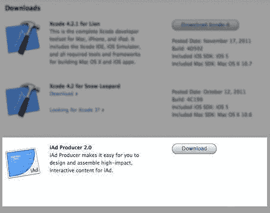

    ### 注意

    如果您在 **下载** 中看不到 **iAd Producer**，请确保您已登录并且您的开发者账户已被激活。

1.  下载完成后，打开文件并运行 `iAd Producer.mpkg` 以启动安装向导。按照安装步骤操作，并在需要时输入您的 Mac 密码。

    ### 注意

    在安装某些软件时，您需要输入您的 Mac 密码以允许它获得对系统的特权访问。不要将此与为 iOS 开发者计划设置的 Apple ID 混淆。如果您在 Mac 上没有密码，只需将密码区域留空并点击 **确定**。

1.  完成安装步骤后，安装将需要几分钟。在您收到 **安装成功** 消息后，您可以关闭安装程序。

## 刚才发生了什么？

我们现在已安装了 iAd Producer；每次需要打开它时，您都可以在 Mac 的 `应用程序` 文件夹中找到它。

# 使用 iAd Producer 进行工作

让我们看看您将经常使用的 iAd Producer 的主要部分，以便熟悉界面。

## 启动屏幕

当您第一次打开 iAd Producer 时，您可以从项目选择器开始一个新的 iPhone 或 iPad 项目，如下面的截图所示。由于两个设备之间的屏幕尺寸和体验差异很大，我们必须为每个设备专门设计和构建广告： 

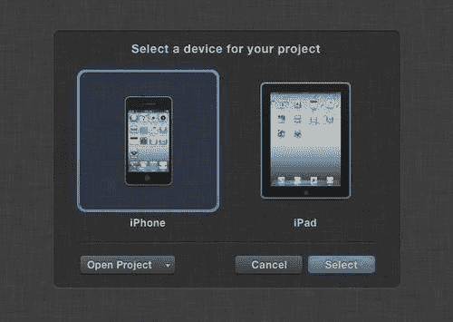

从启动屏幕，您也可以打开您正在工作的现有项目。

## 默认广告

一旦您选择创建 iPad 或 iPhone iAd，系统会为您创建一个占位符广告，显示视觉流程。这是您广告的概览，您将使用它来组合广告的各个部分。以下截图显示了默认概览：

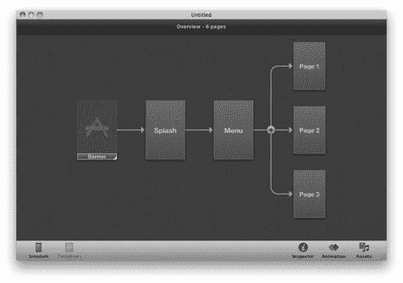

双击广告流程中的任何屏幕都会要求您为该页面选择一个模板；一旦分配，您就可以使用画布编辑器来设计 iAd。

## 模板选择器

在我们编辑广告的任何页面之前，我们必须将其应用到一个模板上，即使它只是一个用于构建的空白画布。iAd Producer 会自动显示与当前编辑页面相关的模板。这意味着您的广告遵循用户期望的结构。模板为您的 iAd 提供了一些很好的起点，无论是简单的带有图像和文本的横幅，还是用户可以翻动和操作的三维图像轮播，所有这些都可以通过简单的点击完成。以下是一个模板选择器示例的截图：

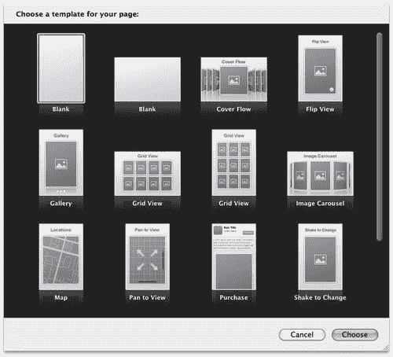

## 资产库

资产库包含您 iAd 的所有媒体和内容，例如图像、视频和音频。当您向**资产库**添加媒体时，请确保您使用的是高分辨率图像，以便在高清 Retina 显示屏上显示。iAd Producer 会在您导入资源时自动生成广告的较低分辨率的图像。

### 注意

如果您想要一个图像宽度为 200 像素，高度为 300 像素，您应该将水平和垂直像素加倍到 400 像素宽和 600 像素高。这意味着您的图形在高分辨率屏幕上看起来清晰且令人印象深刻。

以下截图显示了**资产库**中的媒体示例：

## 广告画布

一旦您选择了模板，您可以在**概览**中双击项目以打开该页面的画布。广告画布是您使用强大的视觉编辑器来定制广告每一页的地方。以下是一个添加了视频轮播的广告画布示例：

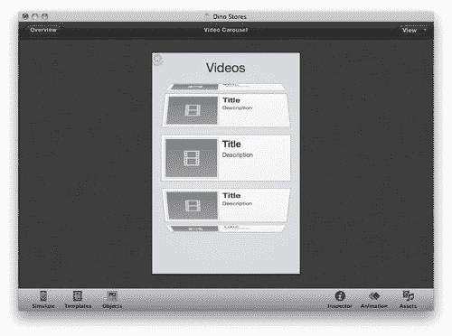

# 设置您的广告

让我们创建并保存一个空项目，以便我们在创建 iAd 时使用；您只需为每个广告做一次。

### 注意

无论您在处理什么数字内容，在您对 iAd 进行重大更改时保存您的 iAd 都很重要，以防 iAd Producer 意外关闭。尽量养成定期保存的习惯，以避免丢失您的广告。

# 行动时间——创建新项目

为了创建一个新项目，请按照以下步骤操作：

1.  如果您还没有创建一个新的项目，请从您的`应用程序`文件夹中打开**iAd Producer**。

1.  从启动屏幕中选择 iPhone 并选择**选择**。您现在将看到默认的广告概览。iAd Producer 已经自动为我们创建了一个名为`Untitled`的项目，并填充了默认的页面集。

1.  从**文件**菜单中选择**保存**以保存空的 iAd，准备稍后添加组件。将项目命名为类似`Dino Stores`的东西，因为这是我们将会工作的广告。

1.  您现在可以通过选择菜单栏上的**文件**然后**保存**或按键盘上的*Command* + *S*在任何时候保存项目的进度。

## 刚才发生了什么？

您现在已经看到了项目选择器和启动屏幕的实际操作，并且已经拥有了我们将在此基础上构建的第一个 iAd 的基础项目。如果您退出此项目，您现在可以从 iAd Producer 内部打开项目，方法是点击菜单栏上的**文件** | **打开**；或者，在 Finder 中简单地双击`project`文件以自动打开它。

# 获取资源

在本章中，我们将使用与本书一起可下载的`Dino Stores`示例资源。如果您想使用自己的资产，您需要以下媒体：

+   用于横幅的图片，大约 120px 宽和 100px 高

+   您公司的标志或名称的图片，大约 420px 宽和 45px 高

+   一个 80px 的方形图片，带有透明度，用作地图针

+   一个大约 600px 宽和 400px 高的加载图片

+   用于画廊的六到十张图片，每张大约 304px 宽和 440px 高

+   当 iPhone 摇晃时将改变的二或更多图片，每张大约 600px 宽和 800px 高

+   与您的产品或服务相关的图片，至少 300px 宽，用于主菜单页面

### 注意

这些像素大小是双倍大小，以考虑到 iPhone 4 及以后设备上发现的超高分辨率 Retina 显示屏。iAd Producer 将自动为旧设备创建低分辨率版本。

# 构建您的横幅

横幅是吸引观众点击并探索您的 iAd 的钩子。我们将使用一张图片和一个广告标语来创建一个简单但有效的横幅。

# 行动时间——制作横幅

为了制作横幅，请按照以下步骤操作：

1.  打开`Dino Stores`项目，并在广告概览中双击**横幅**。它应该是屏幕上的第一个项目。

1.  在您能够编辑广告的任何页面之前，您需要为它分配一个模板。从模板选择器中，您应该可以看到横幅的可用的模板。在这个横幅中，我们将使用**图片和文本**；选择此模板并点击**选择**。

1.  在选择横幅类型后，再次从 iAd 概览中选择横幅。现在您应该打开了横幅画布，准备自定义横幅，如以下截图所示：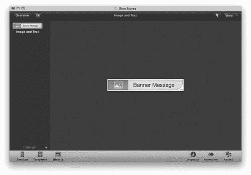

1.  我们将更改的第一个项目是**横幅消息**。双击文本将将其更改为编辑模式。现在，输入您自己的文本，例如`Rawr-some Pets`。在标签外单击以退出编辑模式。

    ### 小贴士

    在 iAd Producer 中，每个文本区域都被称为*标签*。它们之所以被称为标签，是因为 iAd 的用户无法编辑它们。对于可编辑的文本区域，我们可以使用文本框。

1.  现在让我们将文本稍微放大并居中，使其正确地位于横幅中。再次单击文本，以便在它周围出现选择框，然后在 iAd Producer 的右下角单击**检查器**选项。这会打开**检查器面板**，用于调整您 iAd 中元素的外观和样式。

    ### 注意

    通过再次单击图标可以切换检查器面板的打开和关闭。您可以使用此功能放大画布的最大可用区域，以便可以更精确地编辑您的广告。

1.  在检查器面板中，单击**文本**部分以展开文本格式化选项。我们可以使用对齐设置中的中间按钮将文本居中，然后增加字体大小到大约**25**。您可以在以下屏幕截图中看到字体大小和对齐方式被突出显示：

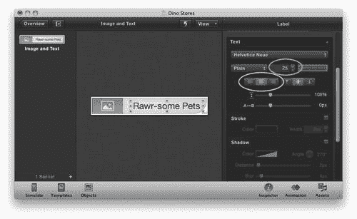

## 刚才发生了什么？

我们选择了**图片和文本**模板来创建横幅的基本布局。然后，我们第一次使用广告画布来编辑默认设置。现在您知道如何选择模板，然后编辑和调整其文本和外观。

## 尝试英雄——编写好的横幅文本

在编写横幅文本时，您可以使用某些语言和词汇来吸引并抓住用户的注意力，使他们点击您的横幅。考虑更新您的横幅，使用行动号召，其中结合以下内容：

+   一个用于鼓励用户点击横幅的动作动词，例如“尝试”、“加入”、“获取”、“探索”、“创建”或“玩耍”

+   一个用于增加价值或重要性的词，以激发点击动作，例如免费、现在或快速

+   将内容保持在最少，以免阻止用户阅读

以下屏幕截图显示了一个完整的行动号召示例：

# 行动时间——更改背景

我们已经编辑了横幅上的文本；现在让我们更改背景，使其在它将出现的应用中更加突出。我们将使用渐变来填充背景，在两种颜色之间渐变。

1.  在灰色背景上的标签外单击，以在检查器面板中选择背景属性。现在单击**背景**，以打开背景属性部分。

1.  当我们选择横幅模板时，已经为我们选择了**径向渐变**，所以我们只需要更改两种背景颜色。

    ### 注意

    径向渐变是两种颜色之间的平滑过渡；想象一下，将两个彩色圆圈融合成一个，从它们填充区域的中心开始。

1.  你应该看到一个带有小箭头和盒子的白色到灰色渐变条；点击左边的盒子以打开颜色选择器。颜色选择器有多种选择颜色的方式。我们将使用最简单的方式——蜡笔选择器。通过点击颜色选择器上的蜡笔盒子来选择它。在下面的屏幕截图中，我们可以看到**背景**部分以及蜡笔颜色选择器：.jpg)

1.  我们现在有一系列蜡笔可供选择颜色。我们首先选择的是径向渐变的内部颜色；从颜色底部左边的自然史前橙色（命名为 *Cantaloupe*）中选择。你应该看到横幅的内部变成了那种颜色。如果没有，请确保已经选择了渐变条上的第一个框，然后再次尝试。

1.  接下来，选择渐变条右侧的小灰色框来更改径向渐变的外部颜色。我们将外部颜色更改为白色（命名为 *Snow*），底部最右边的蜡笔。一旦两种颜色都选好了，你就可以关闭颜色选择器。

1.  我们现在可以通过将左边的橙色框拖动到大约四分之一的位置向右来微调渐变。这改变了渐变淡入的起点，因此在中心可以看到更多的橙色。

## 刚才发生了什么？

我们刚刚在 iAd Producer 中使用了内置的渐变来创建一个用代码而不是图片的渐变，这意味着它们可以无损失地缩放到高分辨率或低分辨率屏幕，同时文件大小显著减小。iAd Producer 自动生成 CSS。

## 英雄尝试——学习 CSS3 渐变

**CSS3** 是一个正在开发中的规范，目前正受到最新一代浏览器支持。如果你对 CSS3 渐变及其如何应用于网站感兴趣，请查看以下资源：

+   CSS3 渐变生成器是一个可视化的网络工具，它允许你生成和查看复杂渐变的 CSS 代码；请访问[`gradients.glrzad.com/`](http://gradients.glrzad.com/)。

+   CSS Tricks 在[`css-tricks.com/5700-css3-gradients`](http://css-tricks.com/5700-css3-gradients)提供了一个全面且易于理解的浏览器支持和小怪癖概述。

+   W3 编写并维护了 CSS3 渐变的深入规范；可在[`dev.w3.org/csswg/css3-images/#gradients`](http://dev.w3.org/csswg/css3-images/#gradients)找到。

# 行动时间——添加图片

在背景渐变设置好之后，我们现在需要添加横幅的最后一个组件，一个小图形来补充文本：

1.  要将图片添加到我们的 iAd 中，我们需要将我们的媒体添加到 iAd Producer 的**资产库**中。我们可以一次添加多个资产，所以我们将导入整个`Dino Stores`项目文件。在 iAd Producer 中，从远底右边的菜单中选择**资产**以打开**资产库**。你现在应该能在 iAd Producer 的右侧看到**资产库**，如下面的截图所示：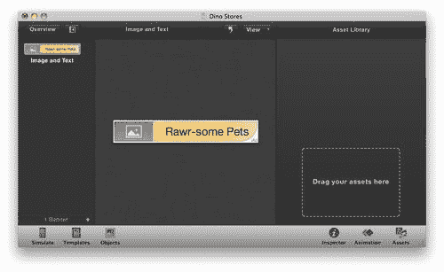

1.  选择**文件** | **导入资产**，然后找到本书资产提供的`Dino Stores`文件夹。在这个文件夹中，有一个`final`文件夹，其中包含为这个 iAd 准备的所有资产；选择**final**然后点击**选择**。你也可以直接从 Finder 将媒体拖到你的**资产库**中。

    ### 注意事项

    `Dino Stores`示例的`final`文件夹中的资产已经调整大小并优化，以用于本项目。如果你想在第二章“准备你的 iAd 内容”中使用的资产，或者如果你选择制作自己的资源，请现在导入它们。

1.  请等待 iAd Producer 导入你的媒体和资产。导入完成后，它应该会显示一个列表，列出所有可用于你的 iAd 的资产。将`banner-icon-rex.png`拖放到横幅画布左边的占位符图片（一个带有月亮的风景剪影）上。它应该更新为我们的新图片。

1.  注意这是一个 PNG 图像；我们选择 PNG 是因为我们希望透明的区域显示背景渐变，这是我们不能用 JPG 做到的。现在新图片已经在我们的 iAd 中，而且文本似乎太靠右了，所以点击文本标签并将其稍微向左拖动。

## 刚才发生了什么？

我们已经将用于我们的 iAd 的资源集导入到**资产库**中，并更新了模板以包含我们自己的图片。

# 操作时间 — 支持所有方向

苹果建议我们的横幅应该同时在纵向和横向工作，这样做可以确保你的 iAd 看起来很棒，并且可以出现在支持 iAd 的任何应用程序中。我们现在将查看如何修改横幅以支持两种方向：

1.  要查看当前横幅在横向时的外观，请从菜单栏中选择**视图**然后选择**横向**。你会看到 iAd 会调整大小以匹配新尺寸；我们现在有一个更薄更长的画布来定制我们的广告。

1.  如你所见，我们的文本现在太大，图片已被裁剪。选择文本并将其更改为更合适的大小，例如**22**。你可能需要将文本移动到新视图的中心。

1.  我们现在将修复图片；点击以选择图片。如果检查器面板不可见，请从 iAd Producer 的右下角菜单中打开它。

1.  在检查器面板中的图片属性部分，将**实际大小**更改为**拉伸以适应**。这允许我们将图片缩小以适应横幅。

    ### 注意事项

    通过缩放我们在纵向中使用的相同图像，我们保持横幅的总大小不变，因为我们不需要为横幅的横向版本加载任何额外的资源。

1.  仍然在检查器面板中，展开**布局**部分并检查**约束比例**选项。约束比例意味着当我们调整图像大小时，图像将始终保持正确的比例。在这里，我们可以看到为横幅上的图像选中的**布局**部分和**约束比例**选项：

1.  现在，将图像从边缘的小框中拖动，称为**拖动句柄**，以调整大小以正确地适应较窄的横向横幅。如果需要重新定位图像，将其拖动到看起来好的位置。

    ### 注意

    当在广告画布上拖动或移动元素时，iAd Producer 将建议你可以使用的一些点；这些点由黄色线条指示，并且元素会吸附到它们上。

1.  不幸的是，我们的一些更改也影响了纵向视图，因为它们共享相同的资产和一些设置。从菜单栏中选择**视图**然后**纵向**，以返回到纵向视图。

1.  你可能已经注意到，图像现在缩小了，并且没有正确地适应横幅。这是因为我们选择的**拉伸以适应**设置与此视图冲突。我们可以通过从拖动句柄拖动图像来调整大小，使其适应应有的样子。

1.  重新定位图像，使其回到正确的位置。

    ### 注意

    在**视图**下拉菜单旁边的画布上方的箭头图标可以用来快速在横幅的横向和纵向版本之间跳转。

1.  再次检查横幅，在每个方向上。现在一切看起来都应该很棒；如果不是，修复问题，直到你对横幅满意为止。

1.  使用菜单栏中的**文件**部分中的**保存**选项保存您的 iAd 项目。

## 刚才发生了什么？

我们通过支持横向和纵向方向完成了横幅，以确保我们的广告兼容，因此可以在尽可能多的应用程序中显示。

如果你使用了提供的资产，你的横幅应该看起来像以下截图：

## 突击测验——制作横幅

1.  为什么我们应该调整我们的 iAd 横幅，使其在纵向和横向模式下都看起来很好？

    +   a. 因此我们的横幅可以倒置

    +   b. 使我们的 iAd 在任何方向上都看起来很棒

    +   c. 如果用户在火车上看到我们的横幅

    +   d. 苹果要求我们支持两种方向

1.  径向渐变是什么？

    +   a. 带有颜色的圆圈

    +   b. 两种搭配得好的颜色

    +   c. 两个颜色渐变的圆圈

    +   d. 带有图像的按钮

现在我们已经完成了横幅，让我们看看如何通过一个闪屏页，平滑地将用户过渡到我们的核心广告单元。

# 制造轰动

启动画面是你在用户等待你的核心广告单元加载时保持用户兴趣的机会。

# 执行时间 — 制作启动画面

让我们制作一个展示弹跳图像和三个消息交替淡入淡出的启动画面：

1.  如果你正在继续上一个练习，请点击 iAd Producer 左上角的 **概览** 返回按钮。如果你还没有，那么打开 iAd Producer 并选择 **打开项目**；找到我们之前一直在使用的 `Dino Stores` 项目。

1.  你现在应该能看到你的 iAd 概览以及各个组件之间的流程。双击 **启动画面** 页面以打开模板选择器。对于这个启动画面，我们将使用 **弹跳标志** 模板。再次双击页面以在画布上打开它。

1.  从底部栏右侧的 **资产** 选项打开 **资产库** 面板。这应该会显示我们之前导入的所有资产。将 **Pterodactyl.png** 拖动到启动画面画布上的大图像占位符框中。

1.  你可能已经注意到我们的翼龙翅膀和头部被切掉了。我们可以通过使用拖动手柄调整图像框的大小来修复这个问题。一旦你将图像框的大小调整为显示整个图像，确保通过拖动整个图像使其居中，这样画布中间就会出现一条黄色线，图像会自动吸附到它上。这是 iAd Producer 建议的理想位置。下面的屏幕截图是 iAd Producer 中黄色线建议定位的示例：

1.  我们已经将图像添加到我们的启动画面中；现在，我们将自定义文本。**弹跳标志** 模板包含一个 `Multi-Label` 对象，类似于标准标签，但它允许我们在不同的消息之间切换，并带有过渡效果。

1.  双击 **多标签**；目前，它应该显示为 **加载消息 1**。这会打开多标签编辑器，并在我们编辑时淡出画布的其余部分。

1.  再次点击文本以突出显示它，并用你自己的消息替换它，比如 **已经过去了 1.8 亿年**。

1.  要将消息移动到下一个单元格，即多标签的子标签，点击 **1 of 3 cells** 右侧的向下箭头。在下面的屏幕截图中，这个单元格导航箭头被突出显示：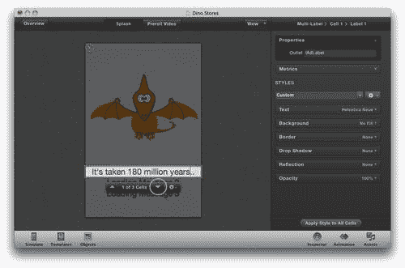

1.  现在，输入第二个单元格的文本，比如 `但最终..`。转到第三个单元格并添加最终消息，例如，`他们来了`。

1.  iAd Producer 现在将自动在这些单元格之间切换，同时我们的广告正在加载。为了确保我们的消息有机会完成一个完整的循环，我们需要调整多标签的计时。我们将改变每个单元格可见的时间和过渡的长度，并确保启动画面在一段时间内可见。

1.  要更改多标签的持续时间，点击单元格外的任何位置以退出编辑模式。现在单击多标签以选择它，但不要重新进入编辑模式。如果检查器面板不可见，请打开它并找到**效果**部分。我们将想要将**按字母**更改为**按行**。这意味着效果是逐行应用的，而不是逐个字母。检查**显示时间**为**2 秒**和**隐藏时间**为**0.5 秒**；如果它们不是这些值，请更改它们。您最终的效果应该看起来像以下截图：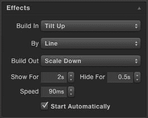

1.  现在让我们将启动画面的最小持续时间更改为**7.5 秒**。点击 iAd 的背景以修改主要启动画面的属性。在检查器面板中，将**至少显示页面**的值更改为**7.5 秒**，通过将滑块向右拖动。

    ### 注意

    我们选择了**7.5 秒**的最小持续时间，因为这允许多标签单元格上的整个效果动画完成。每个单元格可见 2 秒，隐藏 0.5 秒，总共 2.5 秒。然后我们有三个单元格，总持续时间为 3 x 2.5 秒，即 7.5 秒。保持启动画面尽可能短的时间很重要，以防止用户在你甚至到达内容之前就关闭你的广告！

1.  最后，我们将在启动画面中添加背景渐变。在**至少显示页面**下，找到**背景**部分。就像我们处理横幅的背景一样，我们将使用径向渐变。我们将点击渐变条上的第一个颜色并选择右下角的白色蜡笔*Snow*。现在点击渐变条上的第二个颜色框并从左下角选择*Cantaloupe*。

1.  从**文件**菜单保存你的项目。这是我们的最终启动画面，其外观将与以下截图类似：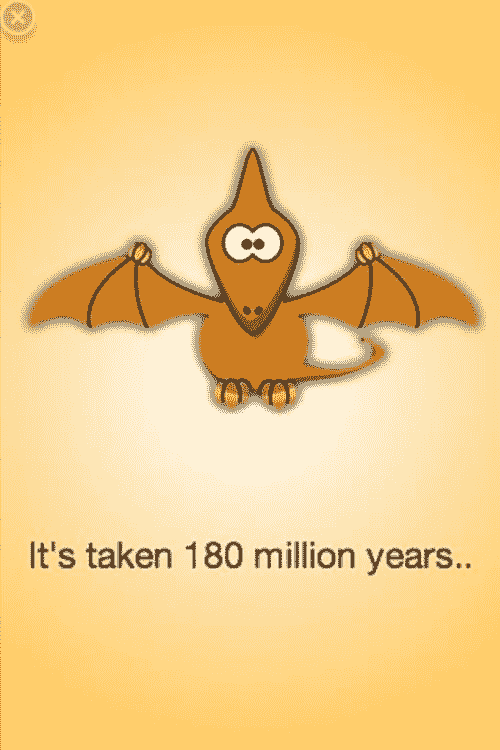

## 刚才发生了什么？

我们现在已经制作了第一个启动画面，将用户过渡到核心广告单元。您修改了动画效果的时间，以确保用户能够看到完整的启动动画。

由于我们的启动页面包含在 iAd Producer 中无法预览的动画，让我们快速看看如何使用 Safari 来模拟它们。

# 预览广告

虽然 iAd Producer 给出了关于你的 iAd 位置、样式和流程的很好概述，但它不会显示动画或让我们与我们的广告互动。幸运的是，由于每个 iAd 都是使用最新的网络技术构建的，我们可以使用 **Safari**，这是你的 Mac 上的内置网络浏览器。Safari 使用与 iPhone 相同的引擎来显示网页，所以表示应该是准确的；然而，请记住，你的 Mac 比你的 iPhone 快得多，所以在该设备上的性能可能会更差。

# 行动时间 — 测试你的 iAd

让我们暂时放下我们的 iAd 构建，检查一下我们迄今为止创建的`Dino Stores`广告，以确保模板和标签提供的动画正在工作：

1.  如果它还没有打开，请打开我们一直在工作的`Dino Stores`项目，并在画布编辑器中打开横幅。您可能需要返回概览来找到横幅。

1.  从菜单栏，选择**导出**然后**在 Safari 中预览**。这将打开 Safari，其中包含您的横幅。您应该看到文本从右侧滑入，图像淡入。如果在大横幅区域之外的可视框架中看到文本进入之前，请不要担心。

    ### 注意

    您可能已经注意到，在 Safari 的预览中缺少 iAd 标志和框架，这是 iOS 设备上的 iAd 系统添加的，并且在 Safari 中不可用。

1.  让我们通过刷新页面再次查看动画。从 Safari 的菜单栏中选择**查看**然后**重新加载页面**。如果您在 iAd Producer 中对 iAd 进行了更改，重新加载页面不会显示更新的 iAd，因此您必须返回 iAd Producer 并再次选择**在 Safari 中预览**以更新它。

1.  如果横幅让您满意，请在 iAd Producer 中打开启动页面，并从菜单栏选择**导出**然后**在 Safari 中预览**。

### 注意

无论何时您在包含动画或效果的 iAd 上工作，您都可以随时预览 iAd，以查看使用此技术时的外观。

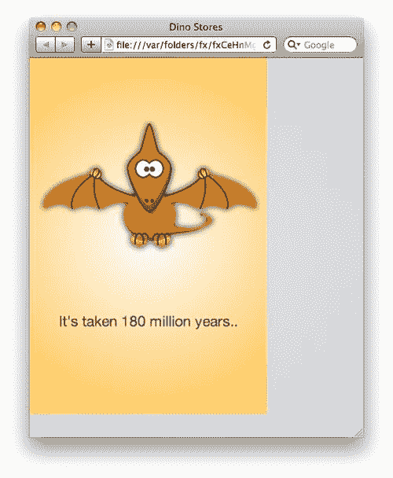

## 刚才发生了什么？

您刚刚预览了您的广告在 Safari 中运行的样子——就像之前的截图一样。在下一章中，我们将探讨设备测试，能够触摸我们的广告并沉浸其中，这使得我们更容易感受到我们的 iAd 体验将是什么样的。

现在我们已经看到了我们的横幅和启动页面将是什么样子，让我们继续构建广告的其余部分。

# 添加菜单

菜单是我们核心广告单元的根视图，并用于在 iAd 的子视图之间进行主要导航。广告的流程通常意味着用户会从菜单进入一个页面，然后返回菜单并进入另一个页面。

# 行动时间——制作菜单

让我们为我们的 iAd 制作一个菜单，以便访问广告中的三个页面——图片画廊、可摇动的图片视图和商店搜索器。要制作菜单，请按照以下步骤进行：

1.  如果您还没有这样做，请打开 iAd Producer 和我们一起工作的`Dino Stores`项目。从概览屏幕，双击应用中的**菜单**页面。然后，转到打开模板选择器。

1.  对于这个菜单，我们将使用`隐藏-显示`模板，它为我们提供了一个在更改页面时滑到下面的菜单，并且当用户想要返回主菜单时可以滑回。选择此模板并点击**选择**。双击广告流程中的**隐藏-显示**菜单以打开菜单画布。

1.  双击菜单区域以打开其编辑模式。然后，双击**页面 1**以更改文本。我们广告的第一页将是图片库，所以输入一些文本，比如**查看我们的宠物**。对下一个两个项目，可摇晃的图像视图和商店查找器重复此操作。你可以使用**所有形状和大小**和**找到我们！**来表示这些项目。有了新的文本，你选择的菜单将类似于以下截图：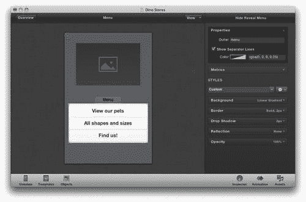

1.  菜单的默认样式并不非常吸引人，所以让我们重新设计它。通过点击广告的背景退出菜单的编辑模式，然后再次单击菜单以选择它。然而，不要进入编辑模式。展开检查器面板的背景部分以显示渐变条，然后单击第一个颜色框以打开颜色选择器。

1.  这次，我们不会使用蜡笔来选择颜色，因为它们提供的选项非常有限。在颜色选择器中，点击充满彩虹的圆圈以打开**颜色轮**。颜色轮给我们一个带有颜色光谱的大圆圈，允许选择我们想要的任何颜色。以下截图显示了颜色轮选择器的每个部分的作用：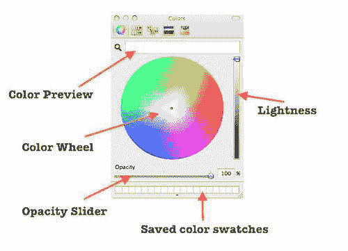

1.  对于我们的第一种颜色，通过在颜色轮上点击你想要的颜色来选择一个浅橙色。预览区域和 iAd 画布应该更新以显示你的选择。你可以在颜色轮上点击并拖动以实时更新你选择的颜色。

1.  一旦你找到了喜欢的颜色，通过在 iAd Producer 的渐变条上单击第二个颜色框来选择第二种颜色，在颜色选择器中打开该颜色。这次选择一个更深、更暗的橙色，以补充第一种颜色。你可以使用亮度滑块在浅色和深色颜色之间切换，以进行选择。

1.  现在我们已经为菜单选择了颜色，让我们确保它是一个线性渐变。线性渐变有一个起始颜色和一个结束颜色，从第一种颜色渐变到第二种颜色。在检查器面板的**背景**部分，检查渐变条下的类型是否为**线性**而不是**径向**。

    ### 注意

    当为可触摸项创建线性渐变时，你应该保持顶部颜色比底部颜色更浅，以创造深度错觉。从浅到深的渐变会产生一种推出去的效果，这会给按钮带来一种真实、可触摸的感觉。如果你需要交换颜色，**背景**部分有一个带有两个箭头的按钮。点击该按钮将反转渐变的方向。

1.  我们已经为菜单的内部应用了样式；现在让我们更改边框。在**背景**部分下，你应该看到一个边框部分；如果它没有展开，点击它以显示边框设置。点击颜色框以打开颜色选择器。将默认的白色更改为另一种颜色，例如深棕色。我们可以将边框宽度增加到**3px**以使其更加明显。如果你想，可以将半径更改为**20px**，以增加菜单的圆角。边框样式可以从实线更改为点划线或虚线；然而，如果你尝试更改它，你会很快看到这些不适合我们正在制作的菜单。

    ### 注意

    如果你制作了一个想要保存以便以后方便访问的自定义颜色，你可以将预览区域中的大色块拖到颜色选择器底部的空白框条上。当你想在广告中多次使用相同的自定义颜色并保持它们一致时，这很有用。

1.  你可能已经注意到顶部的**主菜单**标签没有任何样式应用，所以让我们将其改为与菜单的其他部分相匹配。双击**菜单**的主区域，然后单击菜单的顶部部分，那里写着**菜单**。选择**菜单**标签可能相当困难，所以如果你需要尝试几次才能选择它，请不要担心。

1.  首先，让我们将菜单标签的背景颜色与边框匹配，使其看起来像一个完整的单元。在检查器面板中，找到**背景**部分，将其更改为实色填充，并复制我们用于边框的相同红色。

    ### 注意

    iAd Producer 不幸地隐藏了我们正在编辑的画布区域，背后是一个深灰色蒙版，所以你可能需要偶尔取消选择**菜单**标签，以查看你所做的更改。

1.  **菜单**标签的较暗背景意味着文本不再可读，所以让我们更改文本颜色。从检查器面板中，找到**文本**部分，并在需要时将其展开。单击灰色色块并将其更改为白色。在这里，我们可以看到调整颜色的**菜单**标签的选择：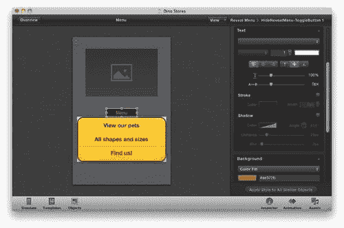

1.  再次单击主广告画布以查看菜单的外观，并编辑你认为需要调整的任何部分，菜单就完成了！

1.  我们已经添加了菜单，现在让我们更改页面的背景。单击广告画布上的背景，并在检查器面板中打开**背景**部分。

1.  我们希望背景与启动屏幕相匹配，以便于过渡到我们的核心广告单元。如果你使用了启动屏幕的建议颜色，你将需要将调色板中的蜡笔部分的第一种颜色更改为白色（*Snow*），并将第二种颜色更改为橙色（*Cantaloupe*）。默认模板应该已经应用了径向渐变。检查是否已经应用，并在需要时进行更改。

    ### 注意

    如果你正在使用 iAd Producer 2.0 或更高版本（2011 年第四季度发布），那么你可以从广告概览的检查器面板设置**共享背景项目**属性。这将导致所有未来的页面背景共享相同的默认值。

1.  这很简单；让我们给我们的广告菜单添加几张图片。通过点击 iAd Producer 窗口右下角的**资产库**图标来打开**资产库**。将**t-rex.png**图片从**资产库**拖动到画布上的占位符图片区域。将图片重新定位到画布的右侧，使其略微重叠屏幕边缘。

1.  现在将**dino-stores-title.png**图片拖动到画布上，并重新定位，使其位于恐龙旁边。你可能想要将标志图片放置在恐龙的牙齿之间，如下面的截图所示：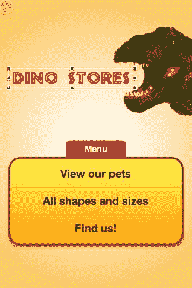

    ### 注意

    当将图片拖动到画布上时，如果你将其放在现有图片的上方，现有图片将被替换。如果你想有重叠的图片，你需要将新图片拖动到画布上没有图片的位置，然后重新定位它。

1.  让我们给`dino-stores-title.png`图片添加一个反射效果。在画布上选择**Dino Stores**图片，然后点击检查器面板。找到**反射**部分并展开，如果需要的话。勾选复选框以启用反射。现在，我们可以调整反射设置以改善其外观。将**偏移**设置为**0px**意味着反射将从图片的末端开始，这通常是一个好主意。我们将保持大小为**100**%，但你也可以使用它来裁剪反射，如果你不希望整个图片在下面镜像的话。**强度**是反射的透明度；尝试一个大约**15**%的值以获得微妙而时尚的反射，类似于以下截图：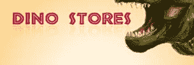

1.  如果你还没有这样做，请确保保存你的 iAd。

## 刚才发生了什么？

恭喜你，你刚刚为 iAd 制作了第一个菜单页面。拥有一个出色的菜单页面对于鼓励用户深入探索你的 iAd 并了解更多关于你引人入胜的信息至关重要。

## 尝试英雄菜单页面

为什么不尝试为菜单页面选择一个不同的模板，并像我们刚才对`Hide-Reveal`模板所做的那样进行设计？你可以做以下操作：

+   通过在画布编辑视图中打开页面并按下 iAd Producer 底部栏左侧的**模板**按钮来更改页面的模板

+   尝试将模板从`Hide-Reveal`模板更改为`Buttons`模板

+   重新设计模板以匹配广告

### 注意

警告——更改模板会重置整个页面，因此你将不得不重新设计所有组件并重新添加你的自定义图片。

# 构建核心广告页面

我们已经构建了导航来在页面之间切换，现在是为它们添加一些精彩内容的时候了！我们将添加一个**3D 交互式图片库**——一个当它被摇晃时会在图片之间切换的页面，以及一个使用内置 GPS 来定位用户最近的商店或分店的商店查找器。

## 插入图片库

让我们从图片库开始吧；我们将使用一个用户可以前后翻动的 3D 旋转木马来浏览图片。

# 行动时间——制作图片库

为了制作图片库，按照以下步骤进行：

1.  我们将把图片库添加到我们现有的`Dino Stores`项目中。如果你还没有做，请打开我们在 iAd Producer 中一直在工作的`Dino Stores`项目。

1.  双击**页面 1**以打开模板选择器。选择**图片旋转木马**模板并按**选择**。现在，再次双击页面以进入画布。

1.  我们现在在页面的画布上，准备编辑我们的图片库。要向图片库添加图片，你必须一次性将它们拖放到画布上的图片库对象上。

1.  让我们选择我们想要添加的项目组。从底部栏打开**资产库**，找到标记为**gallery-image-1.jpg, gallery-image-2.jpg**等图片的组。单击第一张图片，**gallery-image-1.jpg**；它应该被高亮显示。现在按住键盘上的*Shift*键，单击最后一张图片，**gallery-image-6.jpg**。这将选择两个选择之间的所有图片。用选定的图片组，将它们拖放到画布上的图片库对象上。

    ### 注意

    注意我们在图片库中使用 JPG 图片。我们的图片没有透明区域，因此我们可以使用 JPG 并从较小的文件大小中受益。如果你使用自己的图片，图片旋转木马需要高分辨率的图片，宽度为 304px，高度为 440px。iAd Producer 会自动为你生成低分辨率的资源。

    +   图片库现在应该填满我们的图片，并为它们添加 3D 视角。你的项目应该开始成形，看起来类似于以下截图：

    

1.  为了给图片添加极片效果，让我们在图片的外围添加一个 4px 的白色边框。通过单击选择图片旋转木马。在检查器面板中，展开边框部分。勾选复选框以打开边框，然后使用颜色选择器将颜色更改为白色；将宽度增加到**4px**。

    ### 注意

    不要被添加到你的 3D 图片旋转木马上的阴影或反射所诱惑。阴影和反射在 3D 视图中可能会表现不佳。将它们保留用于静态或 2D 元素。

1.  我们现在需要做的就是添加背景渐变以匹配我们 iAd 的其余部分，并更改标题。点击广告画布的背景；然后，打开检查器以更改页面背景。我们希望使用在启动画面和菜单中得到的相同径向渐变，因此将第一个颜色设置为*Snow*，第二个颜色设置为*Cantaloupe*。

1.  一旦你对背景渐变满意，双击**图片轮播**标签以更改其中的文本。输入页面的标题，比如“我们的宠物”。你可能还想要从检查器面板的文本部分增大字体并更改颜色。

## 刚才发生了什么？

我们刚刚将“图片轮播”模板分配给广告的第一页，并向其中添加了一些图片。我们学习了如何一次性选择多个图片并将它们应用到画廊对象中。

当添加你自己的图片时，尽量保持每个画廊有 6 到 10 张图片，以获得最佳体验。

## 尝试一下英雄 — 覆盖流画廊

现在你已经知道如何选择多个图片并将它们添加到图片库中，为什么不尝试使用其他画廊模板之一呢？`Cover Flow`模板可以用来创建一个类似于 iTunes 中动画专辑视图的 3D 图片库。你还需要在这个视图中调整图片大小，使每个图片都是 440 像素宽的正方形。

## 摇动视图

到目前为止，我们只使用了 iPhone 的触摸屏，所以让我们开始利用这个设备的其他功能。内置在 iPhone 中的**加速度计**用于检测旋转和运动事件，这样我们就可以创建一个当用户摇晃 iPhone 时通过改变屏幕上的图片来响应的页面。

# 行动时间 — 摇一摇

使用内置的“摇一摇切换”模板，我们将创建我们的 iAd 的第二页。然后，我们将添加多个图片，每次用户摇晃设备时，这些图片都会发生变化。

1.  在 iAd Producer 中继续`Dino Stores`项目，双击项目概览中的**页面 2**。从模板选择器中选择**摇一摇切换**并按**选择**。

1.  现在通过双击它打开画布中的页面。展开**资产库**，找到图片**dino-shape-1.png**到**dino-shape-8.png**。现在点击第一个图片以突出显示它，然后按住*Shift*键点击列表中的最后一个图片以选择所有这些图片。现在将选择拖动到画布中间的占位符区域。在下面的屏幕截图中，我们可以看到选中的多个图片准备拖动：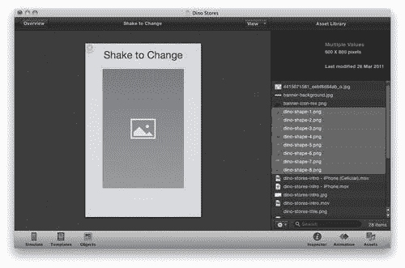

1.  一些图片比占位符区域大，所以我们需要使用拖动手柄来扩展它。尝试将其设置为画布的全宽，并增加高度，以便第一张图片不会被裁剪。你可能想要重新定位图片以确保它仍然正确居中。当你拖动时，黄色的辅助线应该会帮助你。

1.  我们现在将逐个翻阅每张图片，检查它是否正确。为此，我们需要双击第一张图片以进入单元格编辑模式。就像多标签一样，这个可摇动的图像视图设置了多个单元格，它在它们之间进行转换。你应该在图像下方看到“**1/8 单元格**”导航框；点击左右箭头以循环查看每张图片。

    ### 注意

    当你在单元格之间切换时，你应该看到图像在彼此之间晃动和淡入淡出；这是当你的广告用户摇晃设备时发生的动画。

1.  导航到每张图片并检查它们是否在边缘处被截断；如果有一个被截断，点击图片外部以退出单元格编辑模式并使图像区域更大以适应整个图片。

1.  一旦你对每张图片的显示效果满意，点击广告画布的背景并打开检查器面板。让我们将背景改为与我们的 iAd 保持一致。使用以*Snow*和*Cantaloupe*为颜色的径向渐变。

    ### 注意

    如果你发现渐变看起来比你预期的更淡，尝试重新选择径向渐变选项。有时 iAd Producer 无法正确更新视图，这样做会强制它刷新预览。

1.  如果你愿意，更改页面顶部的文本；然而，请记住你将需要一个方法来告诉用户摇晃设备将使他们能够与你的 iAd 交互。

## 刚才发生了什么？

我们刚刚使用了页面模板“摇一摇变一变”来向我们的 iAd 添加一个页面，每次用户摇晃时都会改变。你可以使用设备硬件功能为你的广告添加额外的交互性，为用户提供难忘且沉浸式的体验。

## 让用户找到我们的商店

现在我们已经让用户对我们的产品产生了兴趣，让我们给他们一个购买它的方法！利用 iPhone 内置的 GPS 功能，你可以向用户展示他们当地的商店，并提供联系方式以便他们联系。

### 注意

虽然 iPod touch 没有内置 GPS，但它可以使用其无线互联网连接来估算用户的位置。这通常非常准确！

# 行动时间 — 商店查找器

这将是我们的“恐龙商店”iAd 的最后一页；我们将使用附近的苹果商店作为示例位置设置。

1.  如果你不是从上一个练习继续，请打开 iAd Producer 并选择我们一直在工作的项目。转到广告概览；应该仍然有一个没有模板的页面；这是我们 iAd 中的最后一页。双击**页面 3**并选择**地图**模板。

1.  一旦你选择了模板，双击页面即可在画布编辑器中打开它。让我们先从自定义地图开始；点击画布中央的占位地图区域，并在检查器面板中打开它。

1.  在**属性**部分，找到**站点 ID**。默认情况下，这设置为**demo**；这是苹果公司使用的示例 ID，显示了他们苹果零售店的位置。你通常会更新这个为你的**站点 ID**，这需要由苹果公司设置。当你与苹果公司合作加入 iAd 项目时，你可以联系他们请求一个。

1.  **半径**值定义了广告应该查找店铺的用户位置有多远。根据你拥有的店铺数量，你可能想要更改这个值；店铺数量越多或密度越高，搜索半径应该越小。对于演示**站点 ID**，将其设置为**50mi**。

1.  仍然在属性部分，点击**自定义图钉**中的下拉文件选择器以选择一个自定义图像来显示每个店铺的位置。选择你想要使用的图像，例如**map-pin-footprint.png**；这是一个红色图标，因为红色在 iOS 地图上用来表示目的地。根据图像，你可能需要调整偏移量以使图钉位于位置中心；例如，尝试**Offset X**的**-9px**和**Offset Y**的**5px**。你的图钉应该出现在画布上的地图中心，如图所示：

1.  这样，**地图**视图就完成了，但让我们添加一些视觉调整，使其看起来更好。选择**地图**视图后，向下滚动到检查器面板的边框部分，并添加一个**4px**，实心白色边框来框定地图。

1.  让我们再添加一些阴影，使地图从背景中突出出来。在边框部分下方，通过勾选复选框启用**阴影**，并点击颜色以打开颜色选择器。将不透明度滑块调整到较低的设置，大约**40%**左右，以减少阴影的不透明度并使其在屏幕上不那么刺眼。

1.  地图视图样式完成后，现在让我们为页面背景添加径向渐变。点击画布并展开检查器面板中的**背景**部分。添加你在整个广告中使用的渐变。如果你使用了建议的渐变，从蜡笔颜色选择器中选择*Snow*和*Cantaloupe*作为颜色。

1.  让我们将**位置**文本更改为类似`查找一家商店 ..`的内容，通过双击标签进入编辑模式。

1.  让我们也为我们的总部添加一个编号。模板没有提供任何其他标签，所以我们需要自己添加。在底部栏的左侧，点击**对象**图标以打开`对象`库，然后向下滚动直到找到**标签**对象，如图所示。选择它以将一个空标签添加到画布上；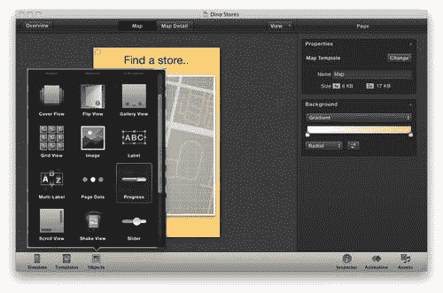

1.  双击画布上的新标签以进入编辑模式。输入一些文本，例如`联系我们：555-1051`。你可能需要调整文本区域的宽度以适应整个消息。现在，将文本区域移动到屏幕底部。

    ### 注意事项

    你可能需要缩小地图并移动标签远离屏幕底部。我们使用的滑动揭示菜单模板将菜单的顶部部分添加到广告的每一页，这样用户就可以回到主页。在 Safari 中预览广告，看看你是否需要重新定位它——导航到广告概览并从菜单栏选择**导出** | **在 Safari 中预览**。只有当你从概览开始预览并点击**菜单**导航到该页面时，菜单才会显示。

1.  一旦你对标签的位置满意，保存你的完成版 iAd！

## 刚才发生了什么？

我们刚刚在我们的 iAd 中添加了最后一页，这样顾客就能找到我们最近的商店。你现在已经完成了你的第一个 iAd 的制作。做得好！你的概览屏幕应该类似于以下截图：

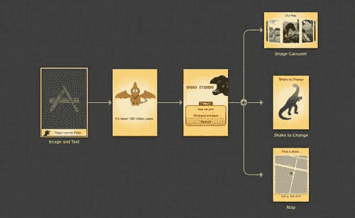

## 快速问答 — iAd Producer

现在你已经熟悉了 iAd Producer，看看你是否能回答以下简单问题：

1.  你去哪里找你导入到 iAd 中的媒体？

    +   a. 检查面板

    +   b. 画布

    +   c. 文件菜单

    +   d. 资产库

1.  一个在多个值之间变化的文本框叫什么名字？

    +   a. 多标签

    +   b. 大量标签

    +   c. 文本转换器 5000

    +   d. 淡入文本框

# 摘要

你在本章中学到了很多，并在 iAd Producer 中制作了你的第一个广告。你现在应该知道如何：

+   在 iAd Producer 中创建一个项目

+   制作横幅、闪屏页面、菜单和子页面

+   为每个视图选择一个模板

+   将径向和线性渐变添加到元素的页面背景

+   通过添加自己的自定义对象来扩展模板

+   使用 Safari 预览你的 iAd

现在你已经制作了一个出色的 iAd，我们将探讨如何在物理设备和模拟器上测试它，如何修复出现的问题，以及你 iAd 的常见问题。
