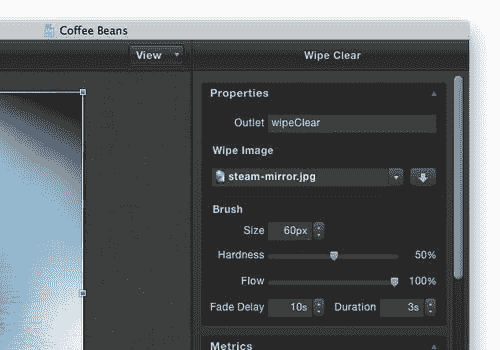

# 第五章. 模板和对象

> 我们已经使用了一些 iAd Producer 中可用的模板来构建我们的广告，但我们能做些什么来超越基本的模板设计和功能。

在本章中，我们将探讨何时使用哪个模板，以及我们如何能够使用对象来增强我们广告的功能，包括：

+   每个模板的功能

+   设置用户的壁纸

+   添加预播放视频

+   动画我们的对象

+   翻转我们的页面

# 模板

由于模板种类繁多，我们只需将媒体拖放到广告画布上，就可以简单地构建交互式广告。模板很有用，因为它们为用户提供了熟悉感；因为它们遵循苹果的标准，并且被网络上的其他广告使用。我们将查看 iAd 的每个部分可用的不同模板，然后制作一个基本广告，我们将使用模板并在以后用对象扩展它们。

如果您计划使用自己的资产，您将需要：

+   一个时长不超过 10 秒的预播放视频，以及用于创建它的相关媒体。此视频需要为 Wi-Fi 和蜂窝网络编码，以便在 iAd 中使用。

### 注意

在第二章中，我们探讨了使用**QuickTime X**的**保存为网页**功能来导出我们的视频以供 Wi-Fi 和蜂窝网络使用，以便我们的 iAd 可以根据用户的连接加载适当的电影。

+   一个用于横幅的图标，大约高度和宽度为 100px。

+   三个或更多用户可以将其设置为背景的全屏图像，宽度为 640px，高度为 960px。

+   一个大约高度和宽度为 640px 的大图像，用于优惠券页面，大约高度和宽度为 640px。

+   一个全屏、宽度为 640px、高度为 960px 的图像，将由用户从屏幕上擦除。

+   由三个或更多较小的、类似图标的图像组成的一个大图像，类似于以下屏幕截图所示：

## 从模板创建横幅

让我们设置一个新的项目，并使用**图像和文本**模板添加一个基本的图像横幅。

# 行动时间——创建横幅

为了创建横幅，请按照以下步骤操作：

1.  从您的`应用程序`文件夹中打开 iAd Producer，并选择一个 iPhone 项目。

1.  从菜单栏中选择**文件** | **另存为**，并为您的项目输入一个名称，例如`咖啡豆`。

    ### 注意

    如果您正在使用此项目的示例文件，您可以在本书资产中包含的`咖啡豆`文件夹中找到它们。

1.  现在，通过将您的资产拖动到资产库面板中，将您的资产添加到项目中。示例资产可以在`final`文件夹中找到。如果您正在使用自己的资产，请确保优化您的图像并将您的视频转换为格式。

1.  在广告概览中双击横幅，以打开模板选择器。选择**图像和文本**横幅类型。现在，再次双击横幅以在编辑画布上打开它。

1.  将**coffee-cup-small.jpg**或您的横幅图标拖动到画布上的图像占位符。您将看到一个带有白色背景的咖啡杯出现。

1.  由于图像不是透明的，让我们更新横幅以匹配我们图像的白色背景。单击横幅的背景以取消选择图像，然后打开检查器面板。如果尚未展开，请展开**背景**部分，然后将**背景**类型更改为**颜色填充**并将颜色更改为白色。

1.  双击画布上标记为**横幅信息**的文本，开始编辑横幅文本，输入类似`咖啡豆`的内容。您的横幅应该看起来类似于以下截图：

1.  如果您没有定期保存项目，请确保单击**保存**。

## 刚才发生了什么？

使用我们在上一章中学到的技能，我们快速使用**文本和图像**模板制作了一个横幅，并用我们自己的图标和信息进行了定制。

### 探索其他横幅模板

**图像和文本**横幅类型具有很大的冲击力，同时仍然轻量级，并且可以快速出现在用户的设备上。如果您有一个强有力的信息或出色的文案，可以独立存在，那么简单的**文本**模板可以帮助您快速轻松地传达这些内容。**图像**模板提供了一个良好的起点，但默认情况下不应用任何动画或文本，因此在使用时不应进行任何修改。

每个模板选择器都提供了一个**空白**模板可供使用，您可以使用对象来构建完全定制的页面。

# 使用启动屏幕和预滚动视频

对于这个 iAd，我们将从我们的启动页面过渡到预滚动视频。我们将使**启动**页面看起来像视频的第一帧，以便它们在这两个页面之间平滑过渡。

# 行动时间 — 预滚动

我们将继续使用`咖啡豆`项目，并添加一段蒸汽咖啡的短视频：

1.  如果您还没有，请打开`咖啡豆`项目，或者如果您正在制作自己的广告，现在请打开它。

1.  预滚动视频与启动屏幕一起设置，因此在我们添加预滚动之前，我们需要添加一个占位符**启动**屏幕。双击广告概览中的**启动**，以打开模板选择器。选择**马赛克**模板。**马赛克**模板将画布上添加的图像切割成多个部分，这些部分将过渡到屏幕上。再次双击**启动**页面，以打开广告概览。

1.  打开资产库面板，将**coffee-steam-video.jpg**拖动到画布上。这是我们的预滚动视频的**海报帧**，可以在主视频加载时平滑过渡到广告。海报帧是我们视频的第一秒的快照图像，在将其转换为 QuickTime 时自动创建。

1.  在仍然处于闪屏编辑画布中时，将画布上方的切换按钮从**闪屏**切换到**预滚动视频**，如图所示：

1.  您现在应该看到一个灰色视频占位符，其中将放置预滚动视频。单击占位符以选择它。从底部栏打开**检查器**以编辑视频的设置。

1.  我们需要选择我们的预滚视频的视频文件和海报帧。确保**检查器**的**属性**部分已展开，然后在**视频**标题下单击**选择视频**。从文件列表中选择**coffee-steam-video - iPhone.m4v**（如果您使用的是自己的视频，请选择您的电影）；视频对象现在应该更新为黑色。

    ### 注意

    如果您使用的是自己的视频，例如我们在第二章“为移动设备准备内容”中创建的视频，您需要将`(Cellular)`替换为`-3G`，用于视频的蜂窝文件。例如，视频文件`video-name - iPhone (Cellular).3gp`将重命名为`video-name - iPhone-3G.3gp`。这允许 iAd 为连接加载正确的视频。

1.  重复此步骤为**海报帧**，并选择`coffee-steam-video.jpg`。**iAd Producer**可能会假设您的海报帧是为视网膜显示屏设计的，并将其大小缩小 50%，尽管苹果公司建议仅支持视频的标准分辨率。如果您使用的是本书中包含的资产，这已经为您完成了。

1.  如果占位符只显示一半大小，我们可以使用**预览**来将图片分辨率加倍。切换到**资产库**，右键单击**coffee-steam-video.jpg**图片的海报帧，并选择**在外部编辑器中打开**，在**预览**中打开文件，如图所示：

1.  在**预览**中，从菜单栏选择**工具** | **调整大小**。我们想要加倍每个分辨率，所以输入`640`作为宽度；高度应该自动更改为`960`，以保持图片的比率。

1.  通过菜单栏选择**文件** | **保存**，或按键盘上的*cmd* + *S*来保存图片。关闭**预览**并返回到**iAd Producer**。

1.  我们需要通过在**资产库**中右键单击它并选择**更新**来更新资产。确认您想要更新资产，现在图片应该填满整个视频对象。如果它仍然只有一半大小，尝试在检查器面板中重新选择占位符帧。

    ### 注意

    虽然将图片放大到更大的尺寸并不理想，因为会损失一些质量，但在我们过渡到标准质量视频时，这不会很明显。

1.  现在，切换回**闪屏**页面，使用画布上方的切换按钮。我们将更改图像的默认马赛克动画，这是我们在选择模板时自动选择的。

    ### 注意

    不要忘记，无论何时您想查看效果的外观，您都需要在设备上、iOS 模拟器中或通过使用**Safari**来预览它。

1.  点击图片选择它，并打开检查器面板。如果它们还没有展开，请展开**属性**和**效果**部分。在**效果**部分，将**内置**效果更改为**飞入**，并将**方向**更改为**拼图**。**内置**效果是马赛克中的每个单元格如何在屏幕上出现，而**方向**是它们出现的顺序。我们还应该通过在**持续时间**区域选择**2s**来减少效果的总体持续时间。

1.  由于我们缩短了效果的时间，让我们也将图片分割成单元格的数量减少；这防止广告尝试太快地动画化太多项目。从**属性**部分，将**行数**更改为**6**，将**列数**更改为**4**。您的**马赛克视图属性**应该类似于以下截图：

1.  确保没有选择任何元素，并打开检查器面板。让我们将**最小显示持续时间**更改为**2s**，通过将滑块向左拖动，使其与我们的启动效果持续时间相匹配。这将防止我们添加的占位符帧显示时间超过所需。

1.  让我们还将启动画面的背景更改为深灰色或黑色，使用**背景**选项卡中的颜色选择器；这将真正让我们的启动效果更加闪耀。

1.  确保您已经定期保存您的 iAd。

1.  现在是预览您的广告的绝佳时机，无论是使用 Safari 模拟器，还是使用**iAd Tester**在您的设备上，有了启动效果和视频，它看起来将会非常棒！

## 刚才发生了什么？

我们使用了**马赛克**启动模板来显示海报图片，这是我们的视频的第一帧，然后过渡到我们的预加载视频。通过结合启动页面和预加载视频，我们让用户进入我们的 iAd 体验变得非常出色。

## 替代启动画面模板

由于**启动**页面是用户在您的核心内容加载时看到的内容，因此选择正确的模板并对其进行自定义以吸引用户并保持他们的注意力至关重要：

前面的截图显示了 iAd Producer 中可用的模板选择。

### 弹跳、坠落和旋转

每个这些模板都为我们提供了一个图像区域，以及一个多标签单元格，在核心广告单元加载时，它会在多个消息之间淡入淡出。

图片也是动态的，取决于我们选择了哪个模板。弹跳模板上下浮动；我们在第三章“制作您的 iAd”中使用它，让我们的恐龙看起来像是在飞翔。**坠落**模板的图片从屏幕顶部落下到合适的位置，而**旋转**模板在加载内容时像螺旋一样扭曲图片。

### 注意

要理解这些动画的最佳方式是观看它们。创建一个新项目并尝试这些不同类型很容易。默认情况下，iAd Producer 创建占位符图像和文本，因此您甚至不需要向项目中添加任何资产即可预览动画。

**Bouncing**、**Drop**和**Rotating**模板允许您通过将图像拖到屏幕上并编辑一些文本来创建轻量级和快速的启动页面。

### Wave 模板

**Wave**模板使用一个小图标图像并将其重复以填充屏幕。然后，每个图标实例从小到大缩放，以创建水波般的效果。如果您有一个小而可识别的产品图像或标志，可以重复多次以创建醒目的启动屏幕，那么**Wave**模板效果很好。

## 尝试一下英雄

让我们看看 mosaic 模板的不同效果组合，并尝试其他启动模板和配置。为什么不尝试以下：

+   创建一个新的临时项目

+   使用**Mosaic**模板以及其他效果设置，例如**Door Left**用于**Build In**效果，以及**Random**用于**Direction**

+   向**Wave**模板添加图标并调整模式和间距

+   当使用**Bouncing**、**Drop**和**Rotating**启动模板时，查看应用到的不同图像动画

+   在您的 iOS 设备上预览效果及其性能

# 使用菜单模板

菜单页面提供了我们广告页面之间的核心导航；在 iAd Producer 中使用菜单模板创建的菜单会在我们修改、添加或从广告中删除页面时自动更新。

# 行动时间——制作菜单

让我们快速设置一种简单的导航我们的 iAd 的方法，使用菜单模板：

1.  我们将继续使用我们的`coffee beans`示例项目；如果它还没有在 iAd Producer 中打开，现在就打开它。

1.  在广告概览中，双击**菜单**页面以打开模板选择器。对于此页面，我们将使用简单的**按钮**模板。选择它，然后再次双击**菜单**页面，以在编辑画布上打开它。

1.  打开**资产库**并将**coffee-bean-ribbon.jpg**，或您的公司标志图像，拖到画布上的图像占位符。您应该看到图像出现在画布上；然而，它已经在角落被裁剪了。

1.  要修复此问题，选中图像后，打开检查器面板并展开**布局**部分。单击以下截图中的**原始大小**按钮，图像容器将自动调整到正确的尺寸，以显示整个图像：

1.  这张图片是 JPG 格式，所以它不支持透明度。这意味着我们需要确保页面的背景与图片的白色相匹配，并且没有其他元素在其后面重叠，否则它们将被隐藏。点击画布背景，并在检查器面板的**背景**部分使用**颜色填充**选项将背景更改为白色。

1.  与纯白色背景相比，按钮看起来有点无聊。让我们通过调整它们的背景颜色、添加阴影和移除边框来重新设计它们。

1.  点击按钮对象以选择它，然后打开检查器面板。找到**背景**部分，并为按钮选择一个**渐变**背景。例如，选择**线性**渐变的两色，例如，*雪*和*银*。

    ### 注意

    记住，当在按钮上使用渐变时，渐变应从顶部轻柔到底部深色。这将使按钮看起来更像一个物理的、可按压的对象，因为它会从其他对象中突出出来。

1.  展开**阴影**部分，勾选复选框以启用阴影。尝试将**距离**减少到**0px**，这意味着阴影在按钮的每个边缘都可见。

1.  现在我们已经在按钮的外围添加了阴影，让我们通过在对象的检查器中的**边框**部分禁用复选框来移除边框。

    以下截图显示了**边框**属性已禁用，以及到目前为止我们的菜单的整体外观：

    

1.  保存您的 iAd。

## 刚才发生了什么？

我们在我们的 iAd 中添加了一个**按钮**菜单页面，这样我们的用户就可以在广告的页面之间导航。通过将模板作为指南并修改它以匹配我们品牌的风格，我们的菜单页面看起来独特，但对我们用户来说感觉熟悉。

## 尝试可用的菜单模板

每个非空菜单模板都提供相同的功能，只是有一些额外的对象和变化。例如，**隐藏-显示**菜单类型类似于我们刚刚添加到我们的“咖啡豆”广告中的**按钮**模板，但它将按钮组合到一个容器中，当你在页面之间移动时，这个容器会动画进入和退出屏幕。**擦除清除**菜单模板将您的菜单隐藏在用户必须擦除以显示的图片后面。在这里，您可以看到模板选择器中可用的模板：

iAd Producer 提供了一组有限的菜单模板，但非空模板提供的最有用的对象是用于打开我们的子页面的按钮集。当您更改广告的结构时，按钮会自动更新。尽管 iAd Producer 提供了空白模板，但请考虑使用其他模板，并删除您不需要的项目。这样，您仍然会有一个在您修改广告时更新的菜单。

## 快速问答——菜单

看看您是否能回答关于菜单模板的问题：

1.  如果你想创建一个带有导航的空白菜单模板，你应该怎么做？

    +   a. 使用空白模板

    +   b. 使用按钮对象创建自己的菜单

    +   c. 我们不需要设置模板；iAd Producer 将自动创建菜单

    +   d. 使用非空白模板之一，并删除我们不需要的项目

现在我们已经让用户进入我们的广告，并且有方法在广告中导航，让我们添加一些内容供他们与之交互。

# 创建更多页面

苹果为我们 iAd 的页面提供了一系列模板，可以适应我们的需求并创建令人惊叹的交互式广告。使用页面模板，您可以快速构建 iAd 的基础。

# 行动时间 — 页面

让我们创建一个壁纸选择页面和两个空白模板页面，我们将稍后使用它们从头开始创建自己的视图，使用对象：

1.  让我们在我们的`咖啡豆`iAd 中添加一些页面。如果你还没有在**iAd Producer**中打开它，现在就打开。

1.  首先，让我们设置我们的两个空白模板。双击**广告概览**中的第一个页面以打开模板选择器。有两个空白模板可供选择，要么是纵向要么是横向；我们想要一个纵向页面，所以选择两个中较高的、较窄的那个。对下一个页面重复此步骤。

1.  现在，双击第三个页面，并在模板选择器中选择**壁纸选择器**。再次双击壁纸页面，以在画布上打开它。

1.  **壁纸选择器**模板需要一张或更多图片，它将在画廊中显示。用户可以浏览这些图片，并将他们喜欢的设置为设备上的背景。让我们为壁纸选择器添加三张图片。打开**资产库**面板，并突出显示三张图片文件**wallpaper-1.jpg - wallpaper-3.jpg**。要选择多个项目，单击第一个文件，然后按住*shift*键单击最后一个文件。将突出显示的组拖动到画布上的占位符图片上。

1.  第一张图片应该出现在画布上。现在我们已经添加了图片，我们可以更新页面的样式以改善其外观。图片在黑色背景上看起来很棒，所以我们将更新页面的背景颜色为黑色。

1.  单击广告的背景，并打开检查器面板。在**背景**部分，将**背景类型**设置为**颜色填充**并将颜色设置为黑色。

1.  由于我们有了新的黑色背景，页面的标题难以阅读；由于我们在按钮中有**设置为壁纸**的文本，我们可以安全地删除标签，而不会让用户对页面的目的感到困惑。单击带有文本**壁纸选择器**的标签，并按*删除*或*退格*键将其从画布上删除。

1.  由于我们现在有额外的屏幕空间可用，让我们在壁纸选择画廊中放大图片的大小。单击画廊以选择它，然后点击并拖动页面的顶部中心拖动手柄到页面顶部。你可能注意到，左右拖动手柄已经达到页面的全宽度，尽管我们的图片相当薄。这是由于**iAd Producer**为我们添加了**填充**。填充通过在其周围添加空空间来增加对象占据的区域。我们可以调整填充；在对象仍然被选中时，打开**检查器**面板并展开**布局**部分。在**布局**部分，我们可以更改**填充 X**，水平（或左和右）填充，以及**填充 Y**，垂直（或顶部和底部）填充。我们只想调整宽度，所以尝试将**填充 X**减少到更小的值，例如，*75*。

    ### 小贴士

    请记住，在我们的 iAd 的左上角始终有一个可见的按钮，让用户关闭广告。这应该在 iAd Producer 中可见，因此请避免在其附近放置对象，并且永远不要将可点击的交互式按钮放置在其附近，以防用户关闭你的广告而不是执行他们打算执行的操作。

1.  一旦你对图片的大小满意，让我们继续调整我们的画廊。iPhone 应用程序通常在可翻页区域下方使用分页点，以显示你所在的页面，并指示更多页面是否可见。你可能已经在你的 iPhone 或 iPad 的主屏幕上注意到它们，在那里显示所有你的应用程序。我们可以在检查器面板的**属性**部分勾选**显示点**复选框，将这些建议添加到我们的画廊中。你可能需要调整画廊的高度以容纳这些建议。我们的完整画廊应该看起来像以下截图：

1.  现在，在 iOS 模拟器或设备上预览广告。你可能注意到，你无法从画廊返回到菜单，因为**菜单**按钮似乎无响应。这是由于 iAd 框架将我们的画廊放置在按钮上方，即使在 iAd Producer 中看起来不是这样。我们可以通过右键单击按钮并选择**置于顶层**来确保按钮始终位于其他对象之上，如图所示：

1.  再次测试你的 iAd，你应该能够从壁纸选择页面返回到菜单。

1.  现在，通过点击**iAd Producer**左上角的**概览**导航箭头打开广告概览。你现在可以看到我们的广告结构正在形成，但如果我们想改变页面出现的顺序怎么办？在广告概览中，我们可以点击并拖动我们的 iAd 页面，以调整它们在广告中的显示方式。尝试将**壁纸选择**页面从最后一页拖动到中间。你的广告中的菜单模板将自动更新以显示你页面的新顺序。

    ### 小贴士

    记住，你只能更改 iAd 中页面的顺序，而不能更改横幅、启动画面或菜单/核心广告单元的顺序。你的广告必须遵循苹果定义的该流程。

1.  在我们完成页面之前，我们可以重命名空白模板，以便我们稍后用对象构建。继续停留在广告概览中，单击第一个页面以选择它。在**检查器**的**属性**部分，将名称更改为`Bean Blender`。对最后一个空白页面重复此操作，并将其命名为`Steamy Savings`。

## 刚才发生了什么？

我们使用了**壁纸选择器**模板，通过提供出色的背景，在用户的设备上留下持久的印象。每次用户查看他们的设备时，都会提醒他们你的广告体验和品牌。

## 突出显示显著的页面模板

可用的页面模板种类繁多；以下是从模板选择器中选取的一些最佳和最有用的模板，如下截图所示：

### 与图像交互：封面流

就像 iTunes 封面流，用户可以翻动他们的专辑图像的 3D 画廊，我们也可以将一组图像从**资产库**拖动到**封面流**模板中。在这里，你可以看到聚焦于中心项目的封面流画廊：

### 使用 3D 画廊：网格视图

网格视图为画廊增添了一个惊人的转折。它自动创建你的图像的小缩略图，当点击时，会旋转以显示全尺寸图像。这种视图看起来很棒；如果你在使用它，确保在**检查器**中调整行和列设置，以匹配你的画廊中的图像数量。

### 使用：翻转视图揭示信息

翻转视图为你提供了一个大图像区域，该图像以 3D 方式旋转以显示其背面。你可以在图像的背面添加自定义对象；这通常用于显示更多信息，例如产品价格详情。

## 尝试一下英雄

为什么不创建另一个 iAd 项目来尝试不同的页面模板呢？你可以：

+   使用本书中的示例图像或你自己的图像来尝试不同的画廊。特别注意**网格视图**和**封面流**模板，因为它们可以产生一些相当出色的画廊。

+   将一张大图添加到**平移查看**模板中，该模板允许用户翻动图像的特写并调整页面上的样式。这对于风景、景观图像或产品的特写视图非常适用。

+   在不同的设备上测试一些模板，看看它们如何影响性能。

我们已经看到了 iAd Producer 中大部分可用的页面模板。现在，让我们来看看如何在我们的模板中设置样式。

# 创建更高级的样式

iAd Producer 拥有强大的编辑工具，可以使你的广告制作更简单、更一致，并为用户提供更好的体验。让我们看看如何创建样式预设和创建高级按钮状态。

## 使用样式预设

很可能你会在整个 iAd 中使用相同的样式以保持一致且难忘的体验。iAd Producer 允许你将某些样式组合保存为预设，以便在广告中使用。

# 行动时间 — 你的样式在哪里？

使用 iAd Producer 的样式预设来跟踪和在我们的每个广告中应用常用样式非常简单：

1.  在**iAd Producer**中，打开包含在“书资产”文件夹中的`Styles Demo`示例项目。

1.  从广告概览中，你应该看到这个广告有两个页面；第一页有一些时尚的样式文本，而第二页上有一些无聊的默认文本。我们将复制第一页的样式并将其应用到第二页。双击第一页以在画布上打开它。

1.  单击文本区域以选择它；然后，如果尚未打开，打开检查器面板。在**样式**标题下，有一个带有**自定义**字样的下拉文本框；点击其右侧的齿轮图标，然后选择**另存为...**，以保存新的样式预设。

1.  iAd Producer 显示哪些属性将包含在样式中。让我们不包含透明度在这个样式预设中，通过取消**透明度**旁边的勾选。不同的样式取决于你正在编辑的对象，所以请确保你注意到了哪些属性被包含。

1.  我们还希望给样式起一个难忘的名称，这样我们就可以在多个预设中知道哪个是哪个。在**名称**文本框中输入一些描述性的内容，例如`框内大文本`。点击**确定**，以保存样式。以下截图显示了可用的属性：

1.  **自定义**下拉文本框现在应该更新以匹配样式的名称。回到**概览**，打开第二页的未设置样式的文本；你应该会看到一些普通的默认文本，填充了整个页面。

1.  通过单击选择普通文本标签。从检查器面板中，点击**样式**下的下拉区域，并从列表中选择你想要应用的样式，例如**框内大文本**。我们保存的样式应该被应用，以便文本与第一个视图中的文本相匹配。

    ### 小贴士

    记住，只有我们选中的并保存到预设中的样式才会被应用。

1.  尝试调整样式属性之一，例如，在**检查器**中展开**文本**部分，并将背景颜色更改为红色。**样式**下拉菜单将更新以显示样式已被修改。点击旁边的齿轮图标，然后选择**保存**以更新样式，如图所示：

1.  现在应用样式的每个对象都将更新以匹配新的样式；您可以通过回到广告的第一页来检查。您的文本现在应该是红色的。您还可以通过选择**另存为**选项而不是**保存**来复制一个样式。

## 刚才发生了什么？

使用 iAd Producer 内置的样式预设功能，我们能够确保广告中的样式保持一致。使用样式与我们的对象意味着我们可以在编辑样式时一次性更新多个对象。

样式被保存，并且每个 iAd Producer 项目都是唯一的，因此您无法在不同广告之间传输它们，但您可以为每个项目保存所需的所有样式。

## 改变状态

可点击的对象，如按钮，可以根据它们的状态应用不同的样式。状态根据对象之间的交互而改变；按钮可以是**正常**的（这通常是它的外观），**高亮**的（当用户按下或点击按钮时），以及**禁用**的（当按钮可见但不会响应用户交互时）。

我们可以使用 iAd Producer 中的样式编辑器来修改每个状态的按钮样式。改变按钮状态可以增加广告的响应性，因为当用户与您的 iAd 互动时，他们会立即获得反馈。

# 行动时间——状态的重要性！

让我们调整“咖啡豆”示例项目中的菜单按钮状态：

1.  如果您还没有做，请打开我们一直在工作的“咖啡豆”项目。双击**菜单**页面以在画布上打开它。

1.  单击菜单对象以选择它，然后打开**检查器**并找到**设置**标题。在标题下方，**样式**下拉菜单旁边是状态选择器，它允许您在编辑**正常、高亮和禁用**状态之间切换。当您选择不同的状态时，您应用的所有样式将仅在按钮处于该状态时出现。您可以在以下屏幕截图中看到状态选择器：

1.  将选择器更改为**高亮**；此按钮状态应使用正常线性渐变的反转或反转版本。展开**背景**部分，并选择与正常状态相同的渐变。如果您使用示例颜色，请使用从**雪**到**银**的渐变，使用蜡笔选择器。

1.  现在，我们可以通过按下位于渐变类型下拉菜单旁边的渐变反转按钮来反转渐变的方向，这在以下屏幕截图中被突出显示。这仅仅是切换颜色顺序。反转渐变会给按钮带来一种按下或推入的感觉：

    ### 小贴士

    iAd Producer 有时不会更新画布以显示你的更改；如果发生这种情况，你应该保存、关闭，然后重新打开你的项目。如果你仍然看不到更改，请使用 iOS 模拟器或设备来测试你的按钮状态。

1.  现在，将状态选择器更改为**禁用**。由于禁用按钮在被点击时不会执行任何操作，它们应该感觉平坦，并使用较浅的颜色以显得褪色；实现这一点最简单的方法是降低我们禁用按钮状态的透明度。

1.  展开透明度样式部分，并将透明度滑块拖动到大约 40%。降低透明度使按钮略微透明，褪色颜色，并稍微显示背景在其后面。禁用样式通常不会被我们的 iAd 用户看到，因为禁用按钮的唯一方法是使用 JavaScript 代码。所以，只有当你知道你将使用它时，你才需要设置它。

1.  最后，保存你的 iAd 并在设备上测试它。当你与按钮交互时，你应该能感觉到状态的效果。

## 刚才发生了什么？

我们刚刚使用状态选择器来更改按钮在被高亮或禁用时的外观。我们还学习了应该应用到每个状态上的样式，以及为什么这种样式是合适的。

如果你使用 iAd Producer 提供的默认样式来设置按钮，它将自动应用正常、高亮和禁用按钮的正确状态。

## 突击测验 — 样式和状态

尝试回答这些问题：使用按钮状态和样式预设

1.  在创建样式预设时，你如何知道保存了哪些样式？

    +   a. 只保存你修改过的样式

    +   b. 所有样式都已被保存

    +   c. 背景和文字颜色是唯一保存的样式

    +   d. 保存样式时将显示一个清单

1.  每次你保存一个样式预设时，都会显示一个可编辑的清单，列出将随预设存储的样式。你应该如何为高亮或触摸的按钮应用样式？

    +   a. 线性渐变，与正常状态相同但相反

    +   b. 使用与正常按钮状态相同的颜色的径向渐变

    +   c. 单一的深色

    +   d. 我们不需要为高亮状态设置样式，因为它从未被使用

1.  你应该反转正常按钮的渐变以创建一个凹陷的、按下的感觉，模仿真实的按钮。在正常或默认状态下，应该应用什么颜色到按钮上？

    +   a. 单一的光亮颜色

    +   b. 从顶部浅色到底部深色的线性渐变

    +   c. 从中间的深色到边缘的浅色的径向渐变

    +   d. 从顶部深色到底部浅色的线性渐变

# 使用对象超越模板

我们可以通过选择空白模板来构建自己的页面，或者使用模板作为起点，并使用对象在此基础上构建。让我们利用到目前为止所创建的内容来丰富我们的 iAd。

# 行动时间 — 添加对象

我们将把到目前为止构建的`Coffee Beans`示例添加到其中，通过创建两个自定义页面，使用我们在创建项目时之前选择的空白模板。要添加对象，请按照以下步骤操作：

1.  打开我们一直在工作的`Coffee Beans`广告的 iAd 项目。从**Overview**打开画布上的第一个空白页面：它应该被命名为`Bean Blender`。你应该看到一个空白页面，有一个菜单按钮，准备好添加我们的自定义对象。在我们开始之前，将页面的背景设置为纯**Color Fill**白色，以便它与菜单页面相匹配。

1.  我们将制作一个页面，在摇动之间切换，显示有关咖啡豆的不同事实。点击 iAd Producer 底部的**Objects**按钮，打开对象库。

    ### 注意

    已经有一个我们可以使用的可摇动视图模板！然而，我们将自己构建这个页面，以展示大多数模板实际上只是使用你可用对象构建的。

1.  从对象库中，点击**Shake View**，然后将在画布上添加一个占位符摇视图。默认情况下，**Shake View**假设你想要在图像库之间摇动，但是，我们将从每个单元格中删除占位符图片，并添加我们自己的对象到视图中。

1.  双击**Shake View**以打开单元格编辑模式；页面上的其余部分将变暗以指示更改，如以下截图所示：

1.  现在，单击占位符图片，然后按键盘上的*delete*或*backspace*键。我们需要对视图中的每个单元格重复此操作，使用单元格导航箭头在单元格之间切换，并删除占位符，直到你删除了所有占位符。你可以使用*Cmd* + 左箭头或右箭头通过键盘在单元格之间导航。

1.  删除占位符图片后，我们应该调整我们的**Shake View**大小，点击单元格外部以退出编辑模式，然后通过单击重新选择**Shake View**。现在点击并向上拖动顶部中间的拖动手柄，使其刚好位于关闭按钮下方。

1.  我们将把自定义对象添加到**Shake View**中；确保你处于第一个单元格，通过双击**Shake View**进入编辑模式，并使用单元格导航箭头更改单元格，直到页面指示器显示**1 of 4 Cells**。打开**Objects**页面，点击**Label**；这将向**Shake View**添加一个占位符标签。将标签文本更改为`Unroasted Beans`；你需要调整文本区域的大小，以确保整个文本可见且在一行内。现在，将标签重新定位到摇视图的左上角，并拖动标签使其占据视图的全宽；这将确保其正确对齐。让我们更新文本样式为**粗体**，对齐方式为**左对齐**，使用检查器面板的**Text**部分。

1.  让我们添加第二个标签；再次，点击**对象**，然后选择**标签**。更新文本为`未烘焙的咖啡豆是绿色的，来自咖啡树的种子`，并将字体大小减少到大约**17**。将标签重新定位在**Shake View**的底部，并将其调整大小以填充整个宽度。

1.  在仍然处于单元格编辑模式时，点击**对象**|**图像**，向单元格添加图像。从**资产库**中，将图像**beans-1-un-roasted.jpg**拖动到我们刚刚添加到画布上的图像对象。单击图像以选择它，然后打开**检查器**上的**度量**部分。按**原始大小**按钮将图像对象调整大小以适应其中的图像。考虑对图像进行样式设计，可能使用深灰色边框和阴影。

1.  当你对图像的风格满意时，从对象库中添加一个图像到画布上。将画布上的图像大小调整为 65px 宽和 50px 高；你可以使用**布局**部分在**检查器**中设置确切的大小值。将图像对象重新定位在单元格的右上角；使用出现的黄色标尺来引导你。

1.  从**资产库**中，将图像**coffee-grades-sprite.jpg**拖动到占位符图像对象上。你应该看到两个咖啡豆出现；然而，如果你看一下源图像，你会发现它实际上是一串几个咖啡豆。我们将使用一种称为**CSS 精灵**的技术；使用精灵，我们将几个我们想要使用的单独图像组合成一个大的图像。

    然后，我们只显示我们当时想要的图像部分。将图像合并成一个可以减少加载时间，因为您广告中包含的每个文件都会增加对 iAd 网络的请求。我们可以将图像精灵定位在图像对象内部，只显示我们想要的区域。双击图像对象，精灵的隐藏区域将变为可见，尽管稍微亮一些，以显示哪些部分是可见的和隐藏的：

1.  点击并拖动精灵，将其移动，以便仅显示最左侧的绿色未烘焙豆。一旦你满意，精灵和单元格看起来类似于以下截图。我们将继续添加剩余的单元格到我们的**Shake View**：

1.  我们**Shake View**的每个单元格都将具有相同的结构，只是文本和图像不同。我们可以从单元格复制对象并将其粘贴到下一个单元格中；这样可以节省时间并保持每个单元格与上一个单元格的一致性。

    ### 注意

    在 iAd 中保持一致性很重要，尤其是在在两个视图或单元格之间转换时，如在**Shake View**中。

1.  我们想要选择单元格中的所有对象；要做到这一点，在键盘上按住*cmd*键，然后点击你想要选择的对象。一旦你选择了所有对象，在这个例子中，四个对象，右键点击其中一个对象并从菜单中选择**复制**，或者按*cmd* + *C*，在键盘上。现在，使用单元格导航箭头切换到**第 2 个单元格（共 4 个）**。在单元格内任何位置右键点击并从菜单中选择**粘贴**，或者使用*cmd* + *V*，在键盘上。我们在**单元格 1**中选择的对象现在应该出现在**单元格 2**中。首先，更新单元格顶部的标题标签为`Lightly Roasted`，并将底部标签文本更新为`After several minutes the beans "pop" or "crack" and visibly expand in size`。从**资产库**中拖动图像**beans-2-light-roast.jpg**到单元格中的主图像。最后，调整图像精灵的位置，以显示当前绿色豆子右侧的两个较深的豆子。

1.  对最后一行重复此操作，然后复制并粘贴你需要用到的对象。接着，将标题标签设置为`Dark Roast`，将底部标签文本设置为`After a few more minutes the beans begin popping again, oils rise to the surface. This is called second crack`。更新主图像为`beans-3-full-roast.jpg`，并将图像精灵移动到下一个两个豆子上。

1.  我们还剩一个空单元格；使用单元格导航箭头切换到它，然后点击箭头右侧的齿轮图标。选择**删除单元格**，因为我们只需要前三个。

    ### 小贴士

    当制作一个需要交互且不是立即显而易见的页面时，你应该添加屏幕提示来帮助用户。考虑在这个页面上添加一个`Shake to change`标签，这样用户就知道该做什么。

1.  在设备上测试你的广告；如果你注意到单元格之间的过渡可能会卡住，考虑移除图像上的阴影以增加性能。

## 刚发生了什么？

你刚刚通过向空白模板添加对象从头开始构建了一个整个页面。使用`Shake View`对象，我们使页面变得交互式，用户可以通过摇晃来浏览我们复制粘贴的不同单元格（以节省时间和保持用户摇晃体验的一致性）。

我们使用了一个图像精灵，将几个图像组合成一个大图像，并只显示我们想要显示的部分。图像精灵是一种起源于早期视频游戏的技术，它减少了 iAd 网络的请求，因此我们的广告加载得更快。

## 尝试一下英雄

为什么不通过以下方式改进你的**Bean Blender**页面：

+   在**Shake**视图对象中添加一个关于双倍烘焙咖啡的额外单元格（见烘焙风味，在[`en.wikipedia.org/wiki/Coffee_roasting`](http://en.wikipedia.org/wiki/Coffee_roasting)）。

+   为每个项目创建一个样式预设，这样你就可以更新一个单元格的样式，其他单元格将匹配它。

# 行动时间——更多对象

我们画布上仍然有一页空白；让我们添加一页充满蒸汽的页面，用户必须擦干净才能揭示促销优惠：

1.  我们将继续使用我们的`Coffee Beans`示例项目，所以如果你还没有做，请在 iAd Producer 中打开它。从**概览**中打开最后一个空白页面，标题为`Steamy Savings`。使用**颜色填充**选项将背景设置为纯白色。

1.  打开对象库，并将`Wipe Clear`对象添加到画布上。`Wipe Clear`对象显示一个图像，当用户用手指擦除时，图像会消失。将**Asset Library**中的图像**steam-mirror.jpg**拖动到`Wipe Clear`对象上。你会看到对象被图像填充；使用**检查器**中的**布局**部分的**原始大小**选项调整`Wipe Clear`对象的大小。现在图像应该填满屏幕。在设备或 iOS 模拟器上测试页面；你可以擦除或摩擦屏幕以移除图像的一部分。

1.  你可能已经注意到，在你有机会擦除所有图像之前，你的广告已经自动淡出了图像。这样做是为了让那些没有与你的页面互动的用户仍然可以获取内容。不过，让我们调整这个设置，让我们的内容在屏幕上停留更长一点。

1.  打开**检查器**的**属性**部分，将**淡入延迟**设置为**7.5 秒**和**10 秒**之间，并将**持续时间**设置为**3 秒**。淡入延迟是指 iAd 开始淡出广告之前需要多长时间，如果用户没有清除所有内容，持续时间是指淡出动画持续的时间。

1.  你的属性应该看起来类似于以下截图：

1.  我们还可以调整`Wipe Clear`对象的透明度，使得页面内容可以通过蒸汽略微看到。在**检查器**中，展开**不透明度**部分，并使用滑块将数量减少到大约**90%**。

1.  让我们添加在`Wipe Clear`淡出后才会显示的对象。目前，`Wipe Clear`对象填满了整个页面，所以我们无法访问画布。将整个对象从画布上拖动到左侧或右侧。iAd Producer 会淡出对象以显示它不包括在内，如以下截图所示。一旦我们添加了元素，我们将重新定位它：

1.  在画布上移除`Wipe Clear`对象后，从对象库中添加一个标签到页面上。将标签放置在广告的顶部中央，并将文本更新为`Steamy Savings`。接下来，我们将在页面上添加一个图像，但不是使用图像对象，而是将**Asset Library**中的图像**coffee-cup-large.jpg**直接拖动到画布上的一个空白区域。图像应该会自动生成一个图像对象出现在那里。将咖啡杯放置在屏幕中央。

1.  现在，将一个`Multi-Label`对象添加到画布上，并为每个单元格添加一个优惠码，例如，为**cell 1**添加`#HALFOFF - 50% off`，为**cell 2**添加`#EXTRA - double serving`，为最后一个单元格添加`#SAMPLE - free expresso`。在多标签上方添加一个带有文本`Voucher codes:`的标签，以便用户知道它们是什么。此外，在屏幕底部添加一些小文字，说明如何使用这些代码，例如`在店内出示优惠码`。

1.  设计和定位元素，使你的页面看起来类似于以下截图：

    ### 小贴士

    当在支持的对象上的单元格编辑模式下时，你可以使用**Apply Style to All Cells**按钮快速将你的单元格样式复制到其他单元格。

1.  当你对页面的布局满意时，通过点击并拖动将`Wipe Clear`对象重新定位到画布上。你可能会发现一些对象覆盖在`Wipe Clear`对象之上；如果发生这种情况，右键点击`Wipe Clear`对象并选择**Bring to Front**。这将确保该对象是屏幕上的最前元素。

1.  保存并在设备或模拟器上测试你的广告。

## 刚才发生了什么？

我们现在已经完成了我们的`咖啡豆`iAd 的主结构；它侧重于提供更多关于咖啡的信息和趣味性，然后提供一个用户机会，在**Steamy Savings**页面上通过优惠来行动他们的新兴趣。一些最好的广告并不是在每个机会都推销他们的产品和品牌，而是微妙地赢得用户的兴趣。

# 调整过渡

过渡用于在广告的页面之间进行动画处理；你可以为每个页面设置出现和消失的动画，以在页面打开和关闭时添加一些运动和效果。

# 行动时间——过渡

让我们通过改变过渡来改善我们的`咖啡豆`广告的感觉，使用户能够顺畅地浏览我们的内容和页面：

1.  在 iAd Producer 中打开项目`咖啡豆`。

1.  默认情况下，iAd Producer 为每个页面添加淡入和淡出过渡，淡出第一页并淡入第二页。这导致我们的启动页面和预览视频之间出现闪烁，因为我们使这些页面匹配相同的内容。让我们删除这两个过渡，以便在启动页面和预览视频之间实现无缝切换。双击**Overview**中的**Splash**页面，在编辑画布上打开它。

1.  确保顶部页面的切换设置为**Splash**，并从底部栏的右侧展开检查器面板。我们仍然希望我们的**Splash**页面在出现时淡入，但不想在页面消失和预览视频开始时有任何过渡。

1.  展开**Transitions**部分，并确保过渡设置为**Fade In**。现在，将切换到**Preroll Video**并将过渡设置为**None**：

1.  预览你的广告，你应该注意到改进；事情将会更加顺畅！

1.  返回广告概览，并确保检查面板仍然打开。我们可以快速更改广告的**概览**页面过渡。单击菜单页面以选择，但不要打开它。然后，在**过渡**部分，选择**向左滑动**。为每个页面重复此操作，选择你选择的过渡效果。

1.  保存你的广告，并在设备或 iOS 模拟器上预览不同的过渡效果。

## 刚才发生了什么？

我们将溅屏和预览视频之间的过渡改为主广告单元，以在广告的不同部分之间创建无缝的流程。

# 添加一些动画

我们页面上的每个对象也可以有出现和消失的动画，类似于全页过渡。给我们的广告添加动作，可以吸引人们的注意力，并使体验更加吸引人。

# 动作时间 - 动画

我们将在**咖啡豆**项目中添加一些动画，这些动画将使我们的对象在其页面上移动：

1.  在**iAd Producer**中打开**咖啡豆**项目。双击菜单页面以在**画布**上打开它。点击菜单对象，并展开**动作**面板。

1.  我们希望当页面加载时，菜单从屏幕底部滑入，当它关闭时滑出。确保面板的标题为**页面出现**，并点击**+**图标以打开可用的动作列表。

1.  从动作列表中找到并选择**滑入**。这将添加动作；将**方向**更改为**从底部进入**。请再次确认你的动作属性与以下内容匹配：

    ### 注意

    如果可用的动作列表中没有包含在**动画**下列出的任何内容，请确保你已经选择了菜单。

1.  我们可以通过修改**持续时间、延迟**和**计时**来调整动画。**持续时间**为**0.75 秒**通常效果不错；尝试调整并预览动画。计时选项会改变动画的行为，例如，默认的缓动进出选项将开始缓慢并逐渐减速，而**线性**选项则从开始到结束以恒定速度移动。

    ### 注意

    当为关键对象设置动画持续时间，例如菜单或文本时，尽量保持它们在 1 秒以下。较长的动画会让你的广告感觉缓慢且不灵敏。

1.  点击**动作**面板标题中的**页面出现**，并将其更改为**页面消失**。这将允许我们设置页面即将消失时的动作。添加**滑出**动作，并将**方向**更改为**底部**。你可以使用播放三角形图标来预览动画。

    ### 注意

    将页面的消失动作与出现动作相匹配是很好的。因此，如果一个对象在出现时从底部滑入，那么在消失时也应该滑出到底部。

1.  由于我们的菜单是从屏幕底部出现的，让我们让我们的主图像从屏幕顶部进入和退出。对于图像，重复前面的步骤，但将**方向**属性更改为**顶部**用于**页面出现**，以及**顶部**用于**页面消失**。

1.  保存并预览你的广告。你可能想要向广告的其他页面上的对象添加一些动作。

## 刚才发生了什么？

我们使用动作和动画来构建页面的组件，并在用户在广告中导航时增强页面过渡。

## 突击测验 — 动画和过渡

通过回答以下关于动画和过渡的问题来测试你到目前为止所学的内容：

1.  为什么你可能想要防止你的启动页面和预告片视频之间的过渡？

    +   a. 为了使你的内容加载更快

    +   b. 为了防止它们之间出现闪烁

    +   c. 这将防止我们的广告使用过多的电池电量

    +   d. 过渡可以在视频中复制

1.  **页面消失**动作何时开始？

    +   a. 当广告立即打开时

    +   b. 在广告关闭之前

    +   c. 在页面消失过渡之前

    +   d. 在页面消失过渡之后

# 收尾工作

为了使你的 iAd 更加特别，我们可以修整一些粗糙的边缘，以制作出最精致、最吸引人的广告。这些最后的调整在使用你的 iAd 时非常明显。

## 尝试英雄式操作 — 已润色

让我们尝试修复`Coffee Beans`项目的最后几个问题；考虑尝试以下建议：

+   使所有菜单项在每个页面上匹配（使用样式预设）

+   更新预告片中的**跳过视频**按钮，使其看起来很棒；不要忘记修改其状态

+   尝试在核心广告页面之间使用不同的过渡效果

+   在`Wipe Clear`对象上方放置一条消息，告诉用户要擦除屏幕

+   通过向空白横幅模板添加对象来创建一个新的横幅

+   向其他页面上的元素添加动画

+   检查横幅是否在两种方向上都工作

如果你需要一些灵感来润色你的 iAd，请查看`assets`文件夹中完成的`Coffee Beans`项目。

# 摘要

在本章中，我们专注于使用模板和对象来创建定制、独特的 iAds；有了这些基本技能，你能够快速构建高级广告。你现在知道以下内容：

+   如何将预告片视频添加到广告中

+   可用的模板有哪些

+   如何使用对象在模板上构建

+   如何使用空白模板从头开始创建页面

+   通过使用精灵可以优化小图像的加载时间

+   如何在广告的页面之间进行过渡

+   对象可以在画布上和画布外通过动作进行动画处理

记住，你可以将模板作为你页面的基础，然后通过添加对象来定制和增强它们。在下一章中，我们将探讨如何通过在我们广告内创建有价值的行动和目的地来利用客户对我们品牌的喜爱。
