# 第七章。为大屏幕构建

> 从 iOS 4.2 开始，运行在 iPhone 和 iPad 上的操作系统允许你为 iPad 创建丰富的全屏 iAd。iPad 的 9.7 英寸大屏幕为我们提供了更大的画布来创建沉浸式和亲密的 iAd。

在本章中，我们将探讨以下内容：

+   iPad iAd 的不同之处

+   创建丰富的全屏横幅

+   在你的广告中包含多个横幅，以保持一系列应用中内容的新鲜度

+   使用对象库中不可用的对象来创建自定义页面

# 创建 iPad iAd

你在 iPhone 上熟悉的模板和对象在 iPad 上也是可用的；然而，为了创建 iPad 的 iAd，你需要开始一个新的项目。iPad 的屏幕尺寸更大，苹果要求你重新设计和规划你的广告以充分利用这一点；但我们能够共享许多相同的资源和资产。

如果你在本章中使用自己的资产，你需要以下内容：

+   用于菜单屏幕的大标志图片

+   用于横幅的背景图片，宽度为 1024 像素，高度为 66 像素

+   用于横幅的小图标或标志

+   一张背景图片，宽度为 1024 像素，高度为 768 像素，用于广告的每一页

+   用于启动屏幕的图片，大约宽度为 300 像素，高度为 200 像素

+   几张用于相册的照片

+   用户将在屏幕上平移的宽度为 2000 像素，高度为 768 像素的图片

+   用于横幅图片的背景

+   一部简短的全屏电影，宽度为 512 像素，高度为 384 像素

+   一张海报图片和你的电影快照

+   一个定制的地图图标，大约宽度为 100 像素，高度为 100 像素

+   每一页广告的菜单图标，包括返回按钮

回顾一下，当我们查看 iAd 的大小限制时，iPad iAd 的限制更为宽松，因为通常有更多的资源比小屏幕的 iPhone 广告要大。在创建资源时请记住这些限制：

+   横幅大小限制为 65 KB。

+   全屏横幅（仅在 iPad 上可用）可达 350 KB。

+   **启动**页面的大小限制为 300 KB。

+   与其他广告一样，剩余的页面没有最大大小限制，但包括过多的资源会增加广告的加载时间。尽量将每个 iAd 页面中的媒体元素数量控制在 20 个以下。

当构建你的 iAd 时，你可以使用项目警告窗口来查看广告中的任何问题，包括你是否已达到文件大小限制。要查看项目警告，请从 iAd Producer 的菜单栏中选择**导出** | **显示项目警告**。以下是一个显示项目警告的**项目报告**窗口示例：

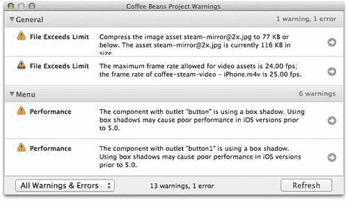

如果你的资产太大，可以考虑使用第二章中介绍的优化技术，*为移动设备准备内容*。

目前，iPad 没有像 iPhone 那样的视网膜显示屏，因此你不需要以双倍分辨率创建你的资产；然而，记住在创建 iAd 资源时尽可能使用高分辨率。确保你使用高分辨率意味着，如果苹果公司将来发布带有视网膜显示屏的 iPad，你就不必重新制作所有资产以更高的分辨率。

# Time for action — 设置 iPad 项目

创建 iPad 项目就像设置一个新的 iPhone 项目一样简单。让我们创建一个占位符广告，我们将在本章中使用它：

1.  如果你还没有做，请打开 iAd Producer。

1.  在项目设备选择屏幕上，点击**iPad**然后**选择**：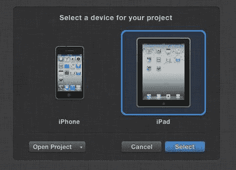

1.  你会看到你习惯在 iPhone 项目中工作的相同的广告概览。唯一明显的区别是广告中的更大、更方形的占位符页面。如果你需要确定现有项目是 iPhone 还是 iPad，请从菜单栏中选择**查看**。它将在菜单下拉列表中显示 iPad 或 iPhone。

1.  如果你正在使用本项目的示例资产，请现在将它们添加到你的**资产库**中。

1.  从菜单栏中选择**文件** | **另存为**，给你的项目起一个容易记住的名字。如果你将使用本章的示例资产，请使用`Cloud 9 - iPad`作为文件名。点击**保存**。

### 注意

在命名文件时，建议将项目类型添加到文件名末尾，例如，在 iPad 项目中添加`- iPad`以区分它们与 iPhone 版本。

## 刚才发生了什么？

就像你之前做的那样，我们在 iAd Producer 中创建了一个新的项目，但这次我们选择的是 iPad，而不是创建 iPhone 项目。

iPad 广告几乎与它们的 iPhone 版本相同，除了额外的屏幕空间；然而，在 iPad 上，我们能够创建全屏 HTML5 横幅。

# Time for action — 向你的 iPad 广告添加横幅

iPad 横幅分为两类：动态横幅，如 iPhone 上找到的，以及仅在 iPad 上可用的全屏 HTML5 横幅。我们将首先查看全屏横幅，但首先让我们创建一个在纵向和横向模式下都工作的动态横幅：

1.  在 iAd Producer 中打开你的项目；如果你正在使用示例项目，请打开`Cloud 9 - iPad`项目。从广告概览中，双击横幅以打开模板选择器。你会注意到模板被分为两个类别；目前，选择**图片和文本**横幅类型。再次双击横幅以在编辑画布上打开它。

1.  默认情况下，iAd Producer 将横幅缩放至 50%；然而，这种缩小的视图可能会使预测我们的广告在设备上的外观变得困难。从 iAd Producer 右上角选择**视图**，然后选择**iPad (100%)**。你现在会看到画布在正确的尺寸；如果你的 Mac 屏幕不够大以显示完整的画布，你可以滚动查看整个横幅。你可能想要调整 iAd Producer 窗口的大小以增加画布的空间。你可以通过点击并拖动窗口的右下角向外扩展来实现这一点：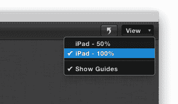

1.  现在我们有了占位符横幅，我们可以像在 iPhone 项目中一样自定义元素。让我们将横幅的背景改为云朵的图片。打开**检查器**并展开**背景**部分；现在将类型改为**图片**，并使用文件选择器下拉菜单选择**clouds-banner.jpg**作为背景图片。你会看到画布更新以显示背景。如果你想关闭检查器使画布适合整个横幅，那么再次点击**检查器**图标以隐藏它。

    ### 注意

    我们使用的是宽度为 1024px、高度为 66px 的背景图片，因此当横幅在竖屏（宽度为 768px）查看时，背景会在边缘被裁剪。创建适用于两种方向的图片对于保持横幅的大小和轻量至关重要。

1.  从**资产库**中，将图片**banner-plane.png**拖动到画布上的图片占位符。你会看到一架带有阴影的战斗机出现在画布上。

1.  默认情况下，**图片和文本**模板仅出现在横幅上，这并不很有吸引力。让我们改变图片的动画，使其从屏幕左侧飞入。选择图片后，展开**动作**面板并添加一个新动作，使用**滑动进入**动画。将**延迟**设置为**0.5s**，将**持续时间**设置为**3.5s**。我们将**缓动**更改为**线性**，因为这将防止动画在结束时减速。你的动作设置应该类似于这些：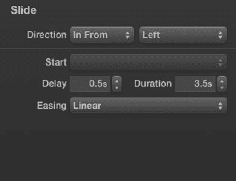

1.  将图片移动到画布之外，横幅的右侧。这意味着滑动动画将从屏幕左侧将图片移动到这个点，使其看起来像是从屏幕飞过。

1.  使用光滑的飞机动画吸引用户的注意力，让我们更改标签文本，让他们点击了解更多。双击占位符标签进入文本编辑模式，并将文本更改为类似`Ever wanted to learn to fly..?`的内容。你可能需要调整标签大小，以便将所有文本都显示在视图中。将标签移动到横幅的中心。这样，一旦飞机动画结束，我们的横幅就不会看起来不平衡。黄色的网格线应该看起来会将标签吸附到横幅的中间。

1.  保持标签选中状态，打开**检查器**，将文本颜色更改为白色。这应该会使标签在云背景上更加突出。

1.  保持标签选中状态，打开**动作**面板。添加一个**滑动进入**动作，就像我们为飞机做的。这次，将**方向**更改为从**底部**，并将**延迟**更新为**4.2s**。这将导致文本在主要的飞行飞机动画结束后出现。

1.  您的横幅应该看起来像以下截图所示：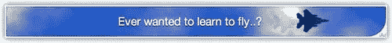

1.  由于我们的横幅在竖屏视图中看起来很棒，让我们调整它，使其在横屏模式下也能同样出色。单击 iAd Producer 右上角的**视图**下拉菜单旁边的箭头，在两种方向之间切换，或从菜单栏中选择**视图** | **横屏**。您可能想要隐藏检查器面板，以便显示更多画布区域。

    ### 注意

    在 iPad 上处理方向性甚至更为重要，因为该设备没有默认的方向。鼓励应用开发者支持竖屏和横屏两种模式。

1.  现在您处于横幅的景观视图中，重新定位标签，使其位于画布的中心。您会注意到背景图像已经自动扩展到更宽横幅的全宽。

1.  保存您的 iAd。

## 刚才发生了什么？

我们刚刚创建了一个大型的 iPad 横幅，它可以在竖屏和横屏模式下工作。通过使用内置的进出动画，我们模拟了一架飞机在画布上飞行的效果。

现在预览您的 iAd（最好在设备上），查看动画，并测试其在竖屏和横屏下的外观。如果您需要在 iPad 上安装 iAd Tester 或想知道如何缩放和旋转模拟器，请参阅第四章，*确保它工作*。

## 尝试一下

一旦动画结束，我们的横幅略显静态；如果您愿意，为什么不尝试添加一些调整和润色，以保持横幅在初始动画之后对用户的吸引力。您可以尝试以下操作：

+   通过用多标签单元格替换标签，并为每个单元格添加不同的文本，使横幅更加有趣。

+   给文本添加阴影，使其在云层中更加突出。

+   将图像 `clouds-banner-transparent.png` 添加到画布上。从右到左，线性地动画化它，持续 15 秒。这将给你的横幅动画增加更多的深度。

现在我们已经有一个很棒的动态横幅了，让我们来看看如何包含一个大型、沉浸式、全屏的 HTML5 横幅。

# 使用 HTML5 全屏横幅填充屏幕

从 2011 年 3 月发布的 iOS 4.3 开始，iPad 能够显示全屏横幅。与你的启动画面类似，全屏横幅只能显示元素。用户无法与之交互，因为任何在横幅上的触摸都会加载你核心广告单元的丰富内容。

HTML5 全屏横幅通常出现在杂志和游戏等应用中，它们会在页面之间显示或帮助用户在游戏级别之间过渡。我们可以在一个 iAd 项目中包含多个横幅创意。这意味着在用户的设备上，iAd 框架将加载与用户当前体验最相关的横幅。

# 行动时间 — 提供多个横幅创意

任何项目，无论是 iPhone 还是 iPad，都可以有多个横幅创意。这是适应你 iAd 将出现的各种情况和应用的绝佳方式：

1.  在 iAd Producer 中打开项目 `Cloud 9`，双击横幅以在编辑画布上打开它。你应该能看到我们之前添加到广告中的横幅。

1.  在 iAd Producer 的右上角，紧邻 **概览** 按钮，点击小箭头按钮，以展开 **横幅绘制**。这个绘制显示了目前在 iAd Producer 中可用的所有横幅创意。

1.  在横幅绘制底部，点击 **+** 按钮，打开模板选择器，选择任何模板，然后点击 **选择**。这将向你的项目添加一个新的横幅创意：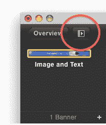

1.  要在横幅之间切换，只需点击你想要查看的横幅创意缩略图，画布将更新。

1.  删除你刚刚添加的模板；我们将在下一个步骤中添加一个合适的全屏横幅。点击横幅绘制中的横幅以选择它，然后在键盘上按 *delete* 或 *backspace* 键来移除它。

## 发生了什么？

使用多个横幅意味着更多的应用能够展示你的广告。当应用开发者将 iAds 添加到他们的应用中时，他们会决定使用动态横幅还是 HTML5 全屏横幅。通过在你的 iAd 项目中提供全屏和动态横幅，你的广告能够在更多的应用中显示。

你可能会想知道为什么这会在只有一种横幅类型（动态横幅）的 iPhone 广告中带来好处。如果你创建了一个包含多个创意横幅的广告，iAd 框架将自动在这些横幅之间循环。这意味着看到你的广告横幅多次的用户将看到不同的横幅，保持你的创意新鲜。

### 注意

你的广告可以包含全屏横幅和动态横幅的组合，以及相同类型的多个横幅。如果你包含了多个类似的横幅，请确保在检查器面板中为每个横幅更新名称，使其可识别。

# 创建沉浸式视频体验的时间

使用全屏 HTML5 横幅，我们能够通过填充整个屏幕来捕获用户的全部注意力，这为我们提供了一个将用户沉浸在我们品牌中的绝佳方式。结合全屏横幅和预滚动视频将使用户过渡到我们的广告，并兴奋地了解我们的产品：

1.  如果它还没有打开，请在 iAd Producer 中打开 `Cloud 9` 演示。双击横幅以在画布上打开横幅。使用横幅抽屉，打开模板选择器并选择**空白**全屏模板。如果你不确定哪个模板是标准横幅，哪个是全屏横幅，将鼠标悬停在每一个上，**全屏**将出现在正确的模板上。

    ### 注意

    你可能需要将画布视图更改为 50%，这样你就可以看到整个横幅。

1.  打开**检查器**并将**名称**属性设置为可识别的内容，例如 `Fullscreen Banner`。现在，我们将设置页面的背景图像并展开**背景**部分。将背景更改为**图像**并选择文件 `launch-movie-placeholder.jpg`。通过使用背景图像，我们的横幅将根据方向自动裁剪。

1.  就像动态横幅一样，我们的全屏横幅需要在两种方向上都能工作。在 iAd Producer 的右上角单击方向切换按钮，或从菜单栏中选择**视图**|**横向**，以切换到横向视图。

1.  占位符图像设计为 1024 像素宽和 1024 像素高；这意味着它可以在任何方向上填充屏幕，某些部分可能被你的 iAd 裁剪或隐藏。

1.  以下截图显示了安全区域，始终可用的中间正方形区域——仅在纵向或横向可见的区域，以及永远不会可见的角落：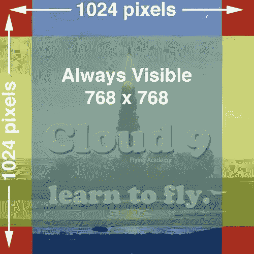

1.  通过使用一个图像作为我们的占位符，它在所有方向上都有效，当设备旋转时不会有闪烁。这是因为我们能够将文件大小和加载时间保持在较低水平。

1.  返回广告概览并双击**启动**页面。从模板选择器中选择**马赛克**。在广告画布上打开**启动**页面。选择马赛克对象并更新图像属性为视频占位符 `launch-movie-placeholder.jpg`。

1.  你可能已经注意到图像的倾斜比例不正确。展开马赛克对象的**布局**部分并单击**原始大小**以将图像的正确比例恢复到正确比例。

1.  通过使用画布上方的切换按钮切换到**预播放**页面。展开检查器面板，将**视频**设置为**launch-movie - iPhone.mov**，将**海报帧**设置为**launch-movie-placeholder.jpg**。

1.  你将看到画布更新为包含我们的视频占位符图像。默认情况下，iAd Producer 将我们的视频设置为全屏模式播放。

1.  保存你的 iAd，并准备好进行测试。

## 刚才发生了什么？

我们创建了一个可以适应不同屏幕尺寸和方向的横幅，并在广告中添加了一个引人入胜的沉浸式视频预播放。全屏广告可以比动态横幅更具吸引力，因为它可以捕获整个屏幕，确保用户的注意力。

请记住，如果你选择使用全屏 HTML5 横幅，你将无法在运行比 iOS 4.3 更旧操作系统的设备上显示你的广告。然而，所有 iPad 都可以升级到这个操作系统，所以你不应该错过大量受众。

苹果之前允许在全屏横幅中使用视频，但由于自动播放视频的用户体验不佳，因此取消了这一功能。你可以在全屏横幅上构建动画，以诱使用户点击它。

尽管是全屏横幅，但你的横幅可能并不总是充分利用屏幕，这取决于它出现的应用程序。例如，一些应用可能会在标签栏和导航栏内显示你的广告，而一些全屏游戏可能仍然会在屏幕顶部显示 20px 的状态栏。你的 iAd 将始终填充整个屏幕宽度；只有高度可以改变。你的全屏横幅应该在这些尺寸范围内进行测试和调整，以确保其正常工作：

1.  在竖屏布局中，你的横幅可能看起来如下所示：

    +   高度在 911px 到 1024px 之间

    +   总宽度为 768px

1.  在横幅布局中，你的横幅可能看起来如下所示：

    +   高度在 655px 到 768px 之间

    +   总宽度为 1024px

幸运的是，iAd 测试器提供了模拟广告可能出现的各种潜在情况的能力。

# 测试全屏横幅情况的时间

当你的 iAd 项目包含多个横幅或全屏横幅时，iAd 测试器提供了不同的选项来测试每个横幅，以及它可能出现的各种情况。让我们预览一下到目前为止的`Cloud 9`广告，并检查我们的每个横幅的外观：

1.  确保 iAd Producer 已打开，并且`Cloud 9 - iPad`项目处于活动状态。

    ### 注意

    如果你正在使用 iPad 进行测试，请确保你在本地网络上共享你的广告，或者使用 iTunes 导出并复制你的广告到 iPad。如果你忘记了如何使用 iAd Producer 测试你的广告，我们已经在第四章中介绍了如何共享你的 iAd，*测试和调试*。

1.  在你的 iPad 上打开 iAd 测试器或点击 iAd Producer 中的**模拟**按钮以打开 iOS 模拟器。

1.  如果您在设备上使用 iAd 测试器，您现在将看到所有可用的项目；轻触您的项目名称。由于我们为这个广告提供了多个横幅，因此会出现一个包含您的横幅或创意的列表。让我们测试全屏横幅；从列表中轻触**全屏**横幅。

1.  您现在可以选择模拟横幅可能出现的各种布局的模拟，分为杂志和游戏风格的应用程序：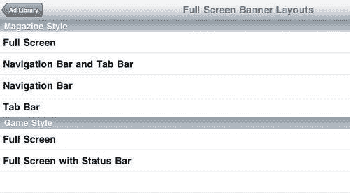

1.  在列表中轻触第一个**全屏**条目以预览全屏的视频。尝试旋转 iPad 以查看横幅在每个方向上的表现。一旦视频播放完成，您将看到占位符图像出现。

1.  在横幅的任何地方轻触都会打开您的核心广告。

1.  要关闭横幅，请随时在屏幕左上角轻触关闭图标。

1.  关闭广告和横幅，并测试您广告的其他配置。

    ### 注意

    **导航栏和标签栏**布局为您的 iAd 横幅提供了最少的空间，在横幅模式下只有 655px 的高度可用。请确保您使用这种样式测试您的横幅。

1.  通过关闭当前广告（如果已打开）并在导航栏左上角轻触**创意**菜单项来返回您的创意列表。打开**图片和文本**横幅以查看如何从您的 iAd 项目中访问一个或多个横幅。

## 刚才发生了什么？

使用 iAd 测试器，无论是在设备上还是在 iOS 模拟器中，我们测试了我们的 iAd 全屏横幅。您现在知道如何在广告中选择多个横幅创意，并且可以在各种模拟情况下测试您的全屏横幅。

确保您使用可识别的页面名称，这样您就可以找到您想要的横幅。您可以从检查器面板更改横幅名称。您应该尝试使用静音的 iPad 测试您的广告。这样，您就可以确保您的视频在视觉上是有意义的，而不需要音频。

## 快速问答——横幅

1.  当创建一个 iAd 时，为什么我们应该包含多个横幅？

    +   a. 制作很多横幅很有趣

    +   b. 横幅易于创建

    +   c. 如果用户不喜欢某个横幅，他们可以滑动以显示不同的横幅

    +   d. 多个横幅意味着看到我们横幅的用户会看到多种不同的横幅

1.  当测试全屏横幅时，哪种布局为您的横幅提供了最少的空间？

    +   a. 全屏

    +   b. 带状态栏的全屏

    +   c. 导航栏和标签栏

    +   d. 导航栏

## 挑战英雄——改进您的横幅

配有出色的动态横幅和丰富的全屏沉浸式视频，我们的横幅看起来很棒；考虑以下这些小调整，让它们变得更好：

+   在您的广告中添加一个额外的动态横幅，以便循环显示多个横幅

+   使用 QuickTime 中的*保存为网页*功能创建多个视频版本，以便根据无线网络的质量和加载大小进行调整

+   尝试通过叠加更多对象和使用动作来动画化它们来改进您的全屏横幅

+   使用 iAd Tester 测试和调整全屏横幅在各种可能出现的场景中的效果

# 制作大型菜单

与 iPhone 不同，在 iPhone 中菜单填充了页面的相当一部分，我们可以在 iPad 广告中包含更深层次的菜单交互。

# 行动时间 — 将对象组合以创建独特的菜单

我们可以将 3D 旋转木马与按钮结合使用，因为它不仅限于图片；这意味着我们可以使用按钮，使它们在广告中的菜单看起来像飞行的飞机。为了将对象组合以创建独特的菜单，请按照以下步骤操作：

1.  我们将继续使用`Cloud 9 - iPad`项目，所以如果它还没有打开，请在 iAd Producer 中打开它。

1.  在我们制作菜单之前，让我们设置 iAd 的占位符页面。从广告概览中双击第一个页面项，以打开模板选择器。选择第二个空白模板，一个**空白**横幅页面，然后点击**选择**：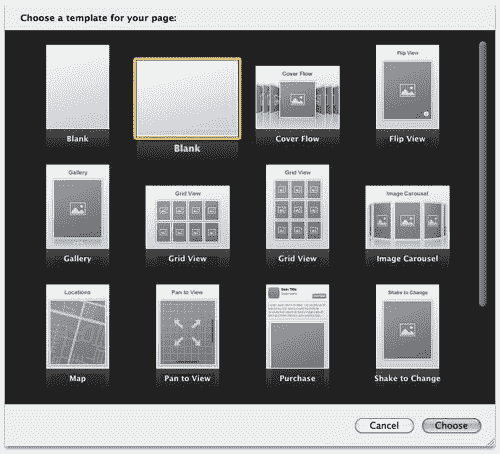

1.  在广告概览中单击新的空白页面。打开**检查器**并将名称更改为`Test Flight`。

1.  对其他两个页面重复此操作，为下一个页面选择第一个**网格视图**模板，在横幅模式下，并将名称更改为`Making Memories`。对于最后一页，选择**地图**并将名称更新为`Book a flight`。

1.  在我们的页面设置完成后，双击菜单页面并选择一个宽的、横幅的空白页面。再次双击页面，以在画布上打开它。从检查器中，将**背景**类型更改为**图片**，并选择**menu-background.jpg**作为您的背景图片。这将有背景图片和标志的组合，以节省请求并减少对透明图片的需求（透明图片文件大小更大）。

1.  从 iAd Producer 的左下角打开对象库，并将旋转木马对象添加到画布上。

1.  在选择新的旋转木马对象后，打开检查器面板。展开属性部分，将方向更改为**水平**，并勾选**吸附到单元格**框。这将使我们的旋转木马左右滚动而不是上下滚动，并确保它始终停在单元格上，不会卡在两个单元格之间。

1.  调整旋转木马的大小，使其位于标志下方并跨越页面的宽度。它应该看起来有点像以下截图：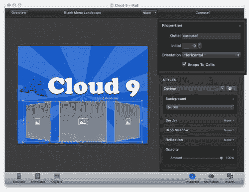

1.  双击中心单元格以进入单元格编辑模式。画布的其余部分应该淡出，单元格导航器将出现。再次单击以选择单元格内的图像占位符。我们将在这个单元格中添加一个按钮而不是图像，所以，在图像被选中时，按键盘上的*退格*或*删除*键来删除图像。

1.  打开对象库，并将按钮添加到单元格中。我们想使用图像作为按钮，因此打开检查器面板，并将**背景**类型更改为**图像**。选择**test-flight-button.png**作为图像；你会看到按钮更新为这个图形。目前，图形被裁剪，并且按钮文本与之重叠。尝试调整按钮的大小以适应整个图像。

1.  你可能会发现单元格不够大，无法容纳整个按钮图像。如果是这种情况，点击单元格外部以退出单元格编辑模式，然后再次点击轮播图以选择它。从检查器面板的**度量**部分，将**单元格长度**更改为更大的数字，例如**500px**，并将**填充**减少到**30px**。这将增加单元格的大小，这样你就可以调整按钮的大小以适应整个图像。

1.  iAd Producer 自动为按钮应用边框；然而，由于我们的按钮边缘是透明的，边框在图像周围添加了一个不必要的框架。在单元格编辑模式下，并且选中按钮对象，取消选中**边框**选项。

1.  我们的形象文本与按钮重叠，因此双击按钮对象进入文本编辑模式；通过删除它来删除所有文本。

1.  最后，我们需要更新我们的按钮，以便在点击时打开我们广告的正确页面。将检查器面板的**事件**部分的**转到页面**更改为**测试飞行**。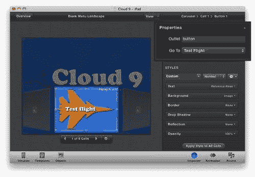

1.  我们将使用这个按钮作为其他单元格的模板。复制按钮，以便我们可以将其粘贴到另一个单元格中。

    ### 注意

    要复制对象，右键单击对象并从上下文菜单中选择**复制**，或者按键盘上的*cmd* + *C*，以复制选定的对象或项目。

1.  使用单元格导航器，点击右边的箭头以移动到下一个单元格。再次点击它，这样你就在我们刚刚创建的按钮单元格的两侧两个单元格。我们稍后会更新这两个单元格。

1.  删除单元格中当前存在的图像占位符对象，然后粘贴我们刚刚复制的按钮。

    ### 注意

    要粘贴对象，在画布上右键单击并从上下文菜单中选择**粘贴**，或者使用键盘快捷键*cmd* + *V*。

1.  我们现在已经有了我们设置的按钮的副本；通过复制和粘贴元素，我们节省了时间，因为不需要为每个单元格重新制作按钮。将按钮的背景图像更改为**memories-button.png**。你可能需要更改按钮的大小以防止图像被裁剪。更新**转到页面**为**制作回忆**，这样按钮就能将用户带到正确的页面。

1.  再次向前移动，通过点击单元格导航器的右箭头两次，移动两个单元格。删除占位符图像，然后再次粘贴按钮，这次将按钮的背景图像替换为**book-a-flight-button.png**，并将按钮的**转到页面**更改为**预订航班**。

1.  在构建我们的轮播图时，我们省略了一些单元格；现在让我们向它们添加一些内容。为了让轮播图运行良好，它需要一定数量的单元格，否则每个单元格之间的角度太紧。围绕剩余的单元格，并更新每个图像占位符为**cartoon-clouds.png**。如果你想更快地完成，可以尝试复制和粘贴图像。

1.  在设备或模拟器上测试你的 iAd。你可以用酷炫的 3D 飞行效果翻动菜单。尝试轻触菜单项以打开相关页面。你的最终菜单页面应该看起来像以下截图：

## 刚才发生了什么？

使用轮播图对象，我们在单元格中添加了带有图片的按钮，以创建一个符合我们广告背景的交互式 3D 菜单。在 iAd Producer 中的大多数对象一样，你可以移除占位符内容，并调整对象以创建一些有趣且独特的内容。

使用这种技术，菜单可以轻松扩展，向广告中添加更多页面，而不会让用户感到不知所措。

## 尝试一下英雄

我们菜单看起来很棒；改变这些事情让它更加出色：

+   为按钮添加按钮状态，考虑使用相同的图像，并将按钮的不透明度设置为 80%，以使用户对状态的变化有反馈

+   在轮播图元素上设置动画，使菜单从页面底部移动进和出

# 创建一个宏伟的画廊

为 iPad 创建相册与为 iPhone 创建相册相同，只是你不必担心双分辨率图形，因为目前 iPad 还没有配备视网膜显示屏。然而，你将需要创建比标准分辨率的 iPhone 更大的图像。在这个例子中，我们使用的是宽度为 640px、高度为 478px 的图像。

# 行动时间 — 在画廊中创造回忆

让我们在广告中添加一个图像画廊，使用**网格**模板，这将展示与`Cloud 9`典型一天的情况：

1.  在 iAd Producer 中打开`Cloud 9 - iPad`项目，双击**创造回忆**页面以在画布上打开它。选择图像**cloud-9-example-day-1.jpg**到**cloud-9-example-day-7.jpg**，并将它们拖到画布上的网格画廊对象中。

1.  网格画廊现在将更新以显示图像。将页面的背景类型更改为**图像**，并选择**blue-starburst.jpg**，使用检查器面板的**背景**部分。

1.  将当前标题为**网格视图**的标签更改为，例如**创造回忆**。将文字颜色更新为白色，以便在丰富的蓝色背景上突出显示。

1.  目前，用户没有返回主菜单的方法，所以让我们添加一个返回按钮。从对象库中选择一个按钮并将其添加到画布上。将**背景**类型更改为**图片**并使用图片**back-button.png**。你需要调整按钮对象的大小并移除文本，以便你的按钮看起来正确。更新**转到页面**属性以打开**空白菜单景观**页面。

    ### 注意

    你可能想更新你的菜单页面名称；**空白菜单景观**不是很清晰。

1.  将返回按钮复制并粘贴到广告的其他两个页面上，这样你就有了一种通用的方法来离开每个页面。

1.  返回你的**制作回忆**页面并测试你的 iAd。点击一个缩略图以打开带有整洁 3D 动画的全尺寸图片。完成后的页面应该看起来像以下截图：

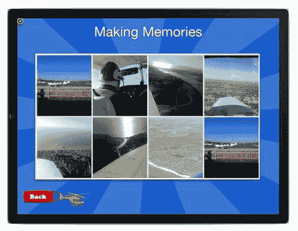

## 刚才发生了什么？

我们定制了我们的**网格**模板以匹配我们广告的主题，并将我们的图片添加到其中。**网格**模板提供了一个高冲击力的交互式画廊；你所需要做的只是将你的图片拖放到它上面。

# 使用滚动视图滚动内容

与我们广告的其他页面不同，让我们只使用对象和空白模板创建一个交互式广告部分。

# 行动时间——在广告中滚动内容

让我们为我们的广告的第一页，空白的**测试飞行**页面进行样式设计：

1.  确保在 iAd Producer 中打开了`Cloud 9 - iPad`项目。双击第一页，**测试飞行**，以在画布上打开它。

1.  将背景更新为图片**blue-starburst.jpg**，以便它与你的其余 iAd 相匹配。

1.  从对象库中添加一个滚动视图到画布上。滚动视图是一个包含用户可以滑动以滚动的大视图的对象。它是平移查看页面模板的核心组件。使用拖动手柄，调整滚动视图的大小，使其适合页面的整个高度和宽度。

1.  打开**资产库**，并将图片**cloud-scene.jpg**拖动到滚动视图中。这将自动将滚动视图的背景设置为云的图片。点击滚动视图对象以选择它并展开检查器面板的**布局**部分。在**布局**部分，将**内容视图**的宽度更改为**2000px**；这将允许滚动视图左右滚动，以显示更多背景图片：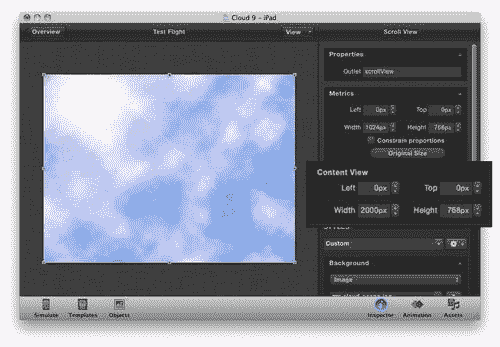

    ### 注意

    在你的 iAd 项目中，图片的最大尺寸是 2000px x 2000px。在设计可滚动区域的大图形时请记住这一点。苹果实施这个限制是因为低功耗设备上的性能限制。

1.  双击**滚动视图**以打开视图编辑模式。这允许你添加元素到滚动视图中，当用户滚动时，这些元素会随着视图移动。在编辑模式中，你可以通过选择箭头/指针图标或抓取/手图标来更改选择对象和滚动视图之间的交互方法：

1.  仍然在编辑模式中，从对象库中向视图中添加一个新的标签。更新标签文本为“想学习飞行？通过我们的测试飞行套餐，你可以获得 60 分钟的空中体验。无需经验！”。为了使整个文本适合视图，调整标签大小以适应滚动视图的宽度。你可能需要滚动视图以保持拖动标签到滚动视图的隐藏区域。将交互方法更改为滚动和拖动滚动视图以显示当前不在页面上的区域。切换回指针选择方法，然后继续调整标签大小。将标签重新定位，使其从滚动视图的左下角开始。

1.  更新文本样式以匹配广告的设计，并调整字体大小以填充提供的可用宽度。考虑使用**Chalkboard SE**字体，大小为**34px**，并添加深蓝色阴影。

1.  现在我们给我们的页面添加一个额外的对象，一个上下弹跳的飞机图片。由于 iAd Producer 的对象库中没有提供持续动画的对象，我们不得不使用一个小技巧，从浮动的**Splash**模板中复制图片对象。既然我们已经在这个广告中设置了并配置了我们的**Splash**页面，让我们打开一个新的项目，复制动画图片对象，并将其粘贴回我们的主要`Cloud 9`项目中。在继续之前，建议保存你的项目，以防在下一步中出现问题。

1.  从 iAd Producer 的菜单栏中选择**文件** | **新建**，或者使用键盘快捷键*cmd* + *N*。这将打开一个新的 iAd Producer 窗口。选择 iPad 作为项目类型。从**概览**中双击**Splash**页面，选择**弹跳**模板。再次双击页面，以在编辑画布上打开它。选择并复制页面画布上的占位符图片对象。

1.  复制对象后，使用窗口左上角的红色关闭点关闭此 iAd Producer 项目。如果被问及是否要保存未命名的项目，请选择**不保存**。你的`Cloud 9`项目应该重新回到视图中；如果它没有，从菜单栏中选择**窗口** | **Cloud 9**。 

1.  通过点击主画布外部来确保你不在滚动视图编辑模式中。将你刚刚复制的对象粘贴到画布上。

    ### 注意

    复制和粘贴并不特定于你当前选定的项目，因此你可以用它来在项目之间共享对象。

1.  你现在会看到图像占位符出现。虽然它看起来像标准的图像对象，但它应用了特殊的属性，使其弹跳或上下浮动。这应该适用于大多数模板，所以你可以在模板有你想使用的对象但不在对象库中时使用它。

1.  选择**airplane.png**文件作为图像。在检查器面板的**度量**部分中单击**原始大小**按钮，以便图像对象是正确的图像大小。重新定位飞机，使其位于页面中央。

1.  测试你的 iAd；你会看到你可以滚动滚动视图来阅读文本，同时飞机图像保持在屏幕中央上下动画。如果你看不到返回按钮，你的滚动视图对象可能与之重叠；右键单击**滚动视图**并选择**发送到后台**。

1.  希望你的最终页面看起来类似于以下截图：

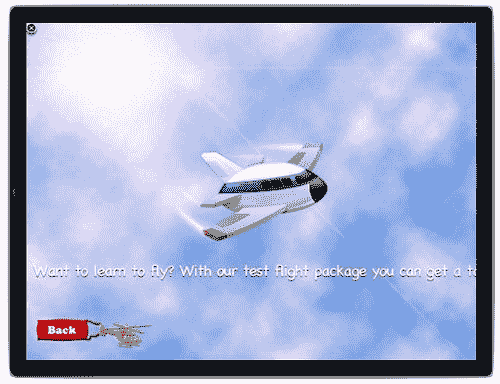

## 刚才发生了什么？

我们向滚动视图中添加了内容，这样我们就可以包含更多适合在一屏上显示的内容，用户可以通过滚动来查看它们。使用模板中可用的对象，但不在对象库中，我们将它从**启动页**复制并粘贴到我们的**测试飞行页**。共享对象对于创建共享相同资源的 iPad 和 iPhone 广告很有用，因为您可以复制并粘贴对象，并根据不同的设备进行调整，而不是从头开始重新创建整个广告。

# 使用商店查找器增加客流量

尽管大多数 iPad 中没有内置 GPS 位置感知芯片，但它们仍然能够在有网络连接时估算其位置。我们可以利用这一点在我们的大屏幕 iPad 广告中包含商店查找器页面。

# 是时候添加商店查找器了

没有商店查找器的广告是不完整的。让我们快速将商店查找器样式调整为与我们的广告保持一致，通过更改背景并使用自定义标记图像：

1.  从`Cloud 9 - iPad`项目，在 iAd Producer 的编辑画布上打开**位置**页面。

1.  将页面背景更改为图像**blue-starburst.jpg**，并更新页面标题标签为`找到您最近的中心..`。更改字体和颜色以匹配广告的其余部分；您可以将**制作回忆**标题标签的样式保存并应用于整个广告，以保持一致的样式。

1.  点击地图对象以选择它，然后将自定义标记设置为图像**cloud-9-map-pin.png**。

## 刚才发生了什么？

就像我们对 iPhone 所做的那样，我们使用自定义的标记样式对地图进行了设计，并将页面的其余部分样式与我们的广告保持一致。我们的 iPad 地图与 iPhone 地图之间没有太大的区别，只是我们使用了更大的标记图像。例如，这个图像是 100 像素乘以 100 像素，而标准分辨率的 iPhone 图像大约是 30 像素乘以 30 像素。

## 尝试一下英雄功能

我们完成的广告看起来相当棒，但考虑以下调整以使其更加出色：

+   设计商店查找器地图详情页面。

+   在广告中添加动画，以构建页面元素并让用户平滑地过渡到你的 iAd。

+   向**测试飞行**页面添加一条消息，建议用户滚动，并添加额外内容以使页面更加吸引人。

+   如果你感到好奇，为什么不尝试为较小的 iPhone 屏幕重新设计这个广告？创建一个新的项目，并调整这些练习以适应较小的屏幕。你将能够复制和粘贴许多对象以加快迁移速度。别忘了：全屏 HTML5 横幅在 iPhone 上不可用，但你仍然可以有多个动态横幅创意。

# 摘要

通过大屏幕的航空广告，我们创建了一个大胆、高影响力的广告，在 iPad 的 9.7 英寸大屏幕上看起来很棒。在本章中，你学习了以下内容：

+   为 iPad 创建全屏 HTML5 横幅

+   在你的 iAd 中包含多个横幅创意

+   使用 iAd 测试器测试包含多个横幅和全屏 HTML5 横幅的广告

+   从对象库中不可用的模板中窃取对象

+   iPad 和 iPhone 广告之间没有太多技术差异，但体验应该根据 iPad 丰富的、大型的多点触控屏幕进行定制

现在，你能够为 iPhone 和 iPad 创建令人惊叹的广告。在下一章中，我们将看看如何通过一些简单的 JavaScript 代码来扩展它们的功能。
