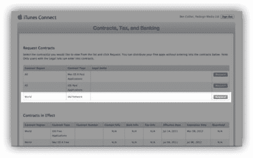
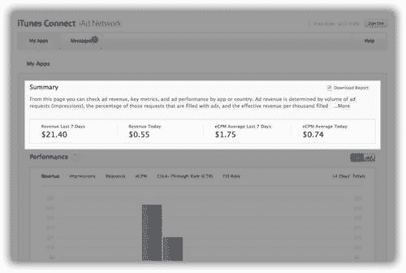
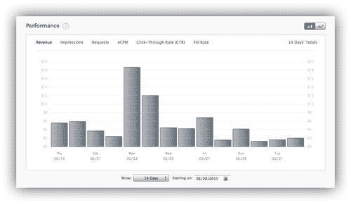
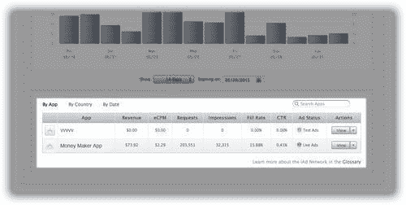
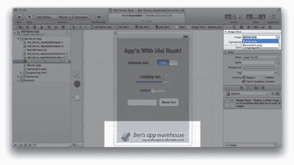
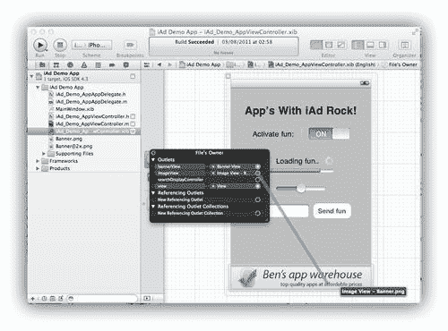

# 第十一章。跟踪收入和回退

> 当 iAd 横幅出现在您的应用中时，您将想知道如何跟踪它们产生的收入，以及当用户离线或 iAd 网络不可用时如何显示替代横幅。

在本章的最后部分，我们将涵盖以下主题：

+   接受 iAd 网络合同

+   在提交的应用中激活您的实时广告

+   测量您的收入和移动展示广告中使用的术语

+   当 iAd 不可用时，回退到其他广告网络

通过这组关键技能的最后一批，您很快将成为移动广告大师。

# 启用实时广告

默认情况下，当您在您的某个视图中添加了 iAd 横幅时，iAd 网络会将测试广告发送到您的应用。苹果要求您在 iTunes Connect 中激活您的应用，然后他们才会向您的应用提供产生收入的实时广告。

## 接受合同

首次启用实时广告需要您设置并接受 iAd 网络合同；您可能已经启用了此功能，但如果您尚未启用或不确定，请按照下一个练习检查并注册。

# 行动时间 — 签署虚线

如果您目前没有任何使用 iAd 的应用，那么您可能尚未请求并激活与苹果的 iAd 网络合同。请求此合同只需几个简单步骤，只要您接受条款和条件，您就可以开始通过 iAd 网络生成收入。

1.  通过在浏览器中打开[`itunesconnect.apple.com`](http://https://itunesconnect.apple.com)登录 iTunes Connect。您的用户名和密码将与我们在第一章中使用的 Apple ID 相同，即*开始使用 iAd*，当您注册 Apple iOS 开发者计划时。

1.  登录后，从页面下半部分的选项列表中选择**管理我的应用**。如果您尚未在 iTunes Connect 中创建应用，请选择**添加新应用**并按照步骤操作。

    ### 注意

    如果您不确定应用提交流程，苹果为开发者提供了一个可在`http://itunesconnect.apple.com/docs/iTunesConnect_DeveloperGuide.pdf`找到的指南，该指南涵盖了提交应用的流程。您可以从 iTunes Connect 中的合同、税务和**银行**部分手动接受 iAd 网络合同。

1.  当应用在 iTunes Connect 中可用时，通过点击其图标来选择它。这将打开应用摘要页面；从这里，选择**设置 iAd 网络**。如果您尚未同意 iAd 网络合同，您将在继续之前被提示签署。

1.  点击**iAd 网络**合同的链接以打开可用的合同页面。找到以下截图中的**iAd 网络**合同，并选择**请求**：

1.  阅读并接受条款和条件。苹果将以 PDF 格式通过电子邮件向您发送合同，但合同将立即生效。在您能够开始为您的广告收取付款之前，您需要设置您的联系信息、银行信息和税务信息——您可以在**进行中的合同**部分找到这些信息。

1.  您现在已接受 iAd 合同，iAd 网络可以开始向您的 iAd 启用应用发送盈利横幅！

## 发生了什么？

苹果不会允许我们在与他们签订合同之前在我们的应用中显示实时广告。请确保您阅读了条款和条件，因为它们概述了协议的规则，包括付款条款和苹果公司撤销访问 iAd 网络的权利，如果您的应用不符合某些指南。如前所述，一旦您提交了 iAd 启用应用，您的应用将开始盈利，但您无法收集您的收入，直到您设置了您的联系信息、银行信息和税务信息。

## 启用您的广告

虽然您已在您的应用中添加了 iAd 横幅并接受了 iAd 合同，但您可能希望在每个应用上显示实时广告并产生收入；这需要单独激活并启用 iAd。

# 行动时间 — 启用广告

与苹果公司签订有效的 iAd 合同后，我们能够开始为每个应用提供实时 iAd 活动。要启用广告，请按照以下步骤操作：

1.  使用您的 Apple ID 登录到 iTunes Connect。选择**管理您的应用**。找到并打开您想要启用广告的应用。

1.  从右侧菜单中选择**设置 iAd 网络**，如图所示：

1.  选择您的目标受众是否为 17 岁以下。苹果目前不会向针对未成年人的应用发送广告。点击**启用 iAd**开关，然后点击**保存**。

    ### 注意

    要查看此屏幕，您的应用必须处于可编辑状态。这意味着您已在 iTunes Connect 中为更新或新应用准备了详细信息，但尚未上传应用二进制文件或点击**准备上传**按钮。

1.  您的应用现在已启用 iAd！任何未来提交给此应用的二进制文件都将显示实时广告，一旦在 App Store 中可用。

## 发生了什么？

由于真正的 iAd 只出现在提交给 App Store 的非开发应用中，您必须在提交之前启用您的应用，因为仅为 iAd 激活您的应用只会使其适用于未来的上传。这意味着您可能会在您的实时应用中收到测试广告，而根据其本质，这些广告不会产生任何收入！一旦启用，停止向您的应用程序发送广告的唯一方法是提交一个没有任何横幅查看的应用更新。您无法从 iTunes Connect 中移除您的应用从 iAd 网络。

苹果公司限制在开发应用中显示实时横幅，以防止在测试应用时虚假赚取收入，并阻止通过**点击欺诈**利用点击。点击欺诈是指人为生成点击或点击以虚假增加 iAd 网络的收入。

# 监控您的收入

与跟踪您自己的 iAd 广告活动类似，显示和监控您应用中的广告需要您了解指标和术语。在监控收入时，我们将关注的术语包括：

+   收入

+   展示量

+   请求

+   填充率

+   eCPM

+   点击率

## 收入

这是关键指标——您的应用能赚多少钱！苹果公司将广告收入的 60%分给您；因此，对于他们产生的每一百美元，您将收到其中的六十美元。显示的收入是您的实际到手收入。收入是根据您的应用中横幅广告的展示量和点击量来计算的。

当您的累积收入达到一定阈值时，苹果公司将通过支票或银行转账将您生成的收入转给您。

## 展示量

**展示量**是指横幅加载并出现在您的应用中。因此，显示的展示量是在特定时间段内出现在您的应用中的横幅总数。

## 请求

每次您的应用从 iAd 网络请求新的横幅以在应用中显示时，苹果公司都会将其记录为**请求**。用户每次使用您的应用通常会导致许多请求，因为应用中的横幅在显示一段时间后会被新鲜内容循环替换。

## 填充率

**填充率**是指从您的应用发送的请求中成功填充并返回广告以显示的百分比。填充率越高，越好，因为这意味着您的应用正在尽可能多地显示广告。当您的应用在尚未加入 iAd 网络的市场中大量使用时，可能会出现低填充率。

### 注意

要了解目前由 iAd 网络服务的国家和地区，请访问[`developer.apple.com/iad/`](http://developer.apple.com/iad/)。

如果您的填充率是零，请考虑联系苹果公司；偶尔他们可能会因为对您应用的内容有顾虑或者目前没有广告商为您的应用类别提供广告而禁用广告投放。

## eCPM

eCPM，或有效每千次展示成本（每千次展示的成本），是指您的收入除以您的应用显示的横幅广告的千次展示量。这允许您预测如果您的应用使用量（因此展示量）增加，您的收入会如何增长。

如果您的展示量和点击量的总收入为 2000 美元，并且您的应用横幅展示量为 10 万次，那么您的 eCPM 将是 20 美元。这意味着对于每 1000 次展示，您的平均收入将是 20 美元。然后您可以估计您的收入；比如说，您的应用接收了 20 万次展示，那么您可能会赚取 200 乘以 20，即 4000 美元。

## 点击率

**点击通过率**是导致用户点击或轻触以显示核心广告单元的横幅查看百分比。点击比简单展示产生更多收入，因此拥有高点击通过率是理想的。如果您的点击通过率低，可能是由于您的横幅位置不易被您的应用用户访问。确保您的横幅视图已添加并在整个应用中可见，无论是在屏幕顶部还是底部。

# 行动时间 — 分析收入

iAd 网络提供了一个丰富的视觉界面，包含数据和图表，供您跟踪您的应用收入。您需要一个活跃的应用，该应用已在商店上线并产生收入，才能继续。

1.  通过访问[`itunesconnect.apple.com`](http://itunesconnect.apple.com)并使用您的 Apple ID 登录到 iTunes Connect。从可用选项中选择**iAd 网络**。

    ### 注意

    这只能在您有一个使用 iAd 网络的实际应用后才能使用；遵循最后一个练习中的步骤来启用应用以进行实时 iAd。

1.  登录成功后，您将看到过去七天和 24 小时内所有您的 iAd 启用应用的收入摘要。例如，查看以下截图：

1.  在摘要下方，您将找到一个条形图，显示了您应用在过去 14 天内的收入；您可以通过点击图表上方显示的指标名称来在各种性能指标之间切换。您可以使用这些图表来查找您的收入中的模式和趋势，例如突出显示哪些天带来最佳收入或将收入映射到外部促销活动，吸引人们使用您的应用：

1.  通过调整图表下方直接找到的控制，尝试更改您收入图表的持续时间和日期。

1.  要查看您单个应用的细分，滚动到窗口底部的以下截图所示区域。从这里，您可以选择一个应用程序并查看为其过滤的数据。



## 刚才发生了什么？

通过登录到 iTunes Connect 管理门户并查看我们的 iAd 收入，我们能够查看摘要、图表和累积或按应用的收入。这些数据通常每 24 小时更新一次，因此在跟踪您的收入时请记住这一点。

## 快速问答 — 收入学习

能够跟踪您的收入并预测未来的收入对于确定您的 iAd 启用应用的长期性和盈利能力至关重要。尝试回答以下问题：

1.  如果您的应用点击通过率低，您应该做什么？

    +   a. 检查您是否已为所有带有横幅的应用启用了实时横幅

    +   b. 在您的应用中添加两个横幅，以便更可能发生意外点击

    +   c. 在 iAd 网络列表中的国家推广您的应用

    +   d. 确保你的横幅在你的应用中始终显示，在视图顶部或底部的推荐位置

1.  请求是什么？

    +   a. 在点击横幅后加载核心广告单元时

    +   b. 当你的应用首次加载并缓冲所有广告时发生请求

    +   c. 当你的应用请求 iAd 网络显示横幅时

    +   d. 横幅显示的次数

1.  由于填充率是应用程序请求中显示广告的百分比，你将如何计算它？

    +   a. 展示次数除以请求次数

    +   b. 100 除以请求次数，乘以展示次数

    +   c. 100 除以展示次数，乘以总请求次数

    +   d. 点击通过率乘以 100

# 降级方案

有时候，iAd 网络将不可用或无法向你的应用程序提供广告。广告可能因许多原因而不可用，包括：

+   用户没有活跃的互联网连接

+   iAd 网络目前在一些用户的国家的不可用

+   针对用户或你的应用人口统计的 iAd 库存中没有可用的横幅和广告创意

在这种情况下，你的应用中不会显示任何横幅或广告。如果你的应用程序的收入主要来自广告，你将想要提供一个降级广告或收入来源。

# 行动时间 — 添加另一个广告

当 iAd 框架通知我们没有可用的广告时，我们可以使用这个代理方法来显示一个替代横幅，即一个简单的图片。

1.  我们将继续使用我们在上一章中创建的演示 iAd 应用程序；现在在 Xcode 中打开它。对于我们的横幅，我们将使用与 iAd 横幅相同大小的图像，宽度为 320px，高度为 50px，但我们还需要一个高分辨率的双倍大小图像用于视网膜显示屏。在本书资源中包含的`iAd Demo App`文件夹中，找到`Banner@2x.png`和`Banner.png`图像并将其拖到项目导航器中，即在 Xcode 的左侧。

    ### 注意

    与 iAd Producer 不同，Xcode 不会自动从高分辨率版本生成我们的低分辨率图像。我们需要创建一个 640px 宽、100px 高的图像，然后保存另一个大小减半的版本。你可以使用**预览**来编辑、调整大小和保存每个横幅。在文件扩展名之前在文件名中使用`@2x`来命名高分辨率图像。

1.  在我们的项目中有了可用图像后，我们将它们添加到视图中。选择**iAd_Demo_AppViewController.xib**视图以在界面构建器中打开它。从对象库中找到图像视图对象。如果你找不到它，不要忘记对象库中的搜索功能。将一个**图像视图**拖到视图中，调整大小和位置，使其覆盖当前的 iAd 横幅视图。

1.  在**属性检查器**中，将图像视图的**图像**属性设置为**Banner.png**。它应该可以从显示项目中所有可用图像的下拉列表中找到。我们在这里不使用我们的`@2x`图像，因为当设备具有视网膜显示屏时，应用程序将自动加载此图像，前提是文件名相同：

1.  你会在视图中看到模拟横幅图片出现。有了这个，我们需要更新应用程序代码来隐藏和显示正确的横幅，这取决于 iAd 的可用性。

1.  在我们能够从代码中访问我们的备用横幅之前，我们需要将其添加为出口。在代码编辑器中选择并打开头文件`iAd_Demo_AppViewController.h`；我们必须添加一个引用到我们可以用作出口的图像视图。在第一个`ADBannerView *bannerView`之后，在新的一行中添加以下内容：

    ```swift
    UIImageView *imageView;

    ```

1.  在界面构建器中添加的图像视图用作参考，作为`UIImageView`，以 UI 开头，因为它是一个用户界面对象。

1.  在我们声明横幅视图为出口的`@property`之后，添加以下代码行：

    ```swift
    @property(nonatomic, strong) IBOutlet UIImageView *imageView;

    ```

    这将使我们能够将界面构建器中的图像视图与代码链接起来。

1.  最后，在我们能够连接我们的图像视图之前，打开主代码文件`iAd_Demo_AppViewController.m`。然后，在`@synthesize bannerView`之后，我们需要通过添加以下内容来合成我们的图像视图：

    ```swift
    @synthesize imageView;

    ```

1.  返回到界面构建器中的视图，并将来自**文件所有者**的出口`imageView`连接到视图上的图像视图，如下截图所示：

    ### 注意

    如果需要提醒在 Xcode 中连接出口，请参考上一章。

1.  在将视图的出口连接后，我们能够根据 iAd 横幅的可用性重新定位模拟横幅。回到主视图文件，在代码编辑器中打开它。找到大约在第 71 行附近的`adjustBannerVisibility`方法。这个方法在需要调整横幅位置时被调用和执行，因此它是使用理想的方法。通过复制和粘贴来复制包含`CGPoint bannerOrigin`的行，并将`bannerOrigin`重命名为`fallbackBannerOrigin`，现在它如下所示：

    ```swift
    CGPoint bannerOrigin = CGPointMake(CGRectGetMinX(frame), CGRectGetMaxY(frame));
    CGPoint fallbackBannerOrigin = CGPointMake(CGRectGetMinX(frame), CGRectGetMaxY(frame));

    ```

1.  这将给我们两个框架进行调整，一个用于横幅，一个用于备用。

1.  找到检查横幅是否已加载的`if`语句，并在其后添加以下代码：

    ```swift
    else {
    fallbackBannerOrigin.y -= imageView.bounds.size.height;
    }

    ```

1.  当`if`语句为假时，此代码将执行，因此当横幅视图不可用时，此块将运行。类似于我们的横幅视图框架，我们通过其高度调整备用横幅框架，使其回到视图中。

1.  最后，我们在动画块中添加对框架的更改，并找到将横幅视图框架动画到视图中的行，并添加以下内容：

    ```swift
    imageView.frame = CGRectMake(imageView.bounds.origin.x, fallbackBannerOrigin.y, imageView.frame.size.width, imageView.frame.size.height);

    ```

1.  最终方法应如下代码片段所示：

    ```swift
    -(void) adjustBannerVisibility
    {
    CGRect frame = self.view.bounds;
    CGPoint bannerOrigin = CGPointMake(CGRectGetMinX(frame), CGRectGetMaxY(frame));
    CGPoint fallbackBannerOrigin = CGPointMake(CGRectGetMinX(frame), CGRectGetMaxY(frame));
    // check if the banner is loaded
    if (bannerView.bannerLoaded) {
    // bring banner into view
    bannerOrigin.y -= bannerView.bounds.size.height;
    }
    else {
    fallbackBannerOrigin.y -= imageView.bounds.size.height;
    }
    // Animate the frames view
    [UIView animateWithDuration:2.0f
    animations:^{
    bannerView.frame = CGRectMake(bannerView.bounds.origin.x, bannerOrigin.y, bannerView.frame.size.width, bannerView.frame.size.height);
    imageView.frame = CGRectMake(imageView.bounds.origin.x, fallbackBannerOrigin.y, imageView.frame.size.width, imageView.frame.size.height);
    }];
    }

    ```

1.  运行您的应用。您应该会看到备用横幅出现，然后如果可用，会与 iAd 网络的横幅进行交换。尝试关闭您的互联网连接以强制备用方案生效。

## 刚才发生了什么？

虽然这是一个非常基础的横幅系统，但它允许在 iAd 网络不可用的情况下继续产生一些收入。通过向应用的主要视图添加一个带有出口的图片视图，我们能够从我们的代码中引用它。有了可访问的备用图片，我们修改了`adjustBannerVisibility`方法，根据横幅视图的`bannerLoaded`属性来隐藏或显示我们的图片。

您可以使用这个横幅进行自己的推广，可能是其他应用，或者将空间出售给希望在您的应用内进行广告的人。您可以使用您的填充率和请求来估计此备用横幅出现的次数。然而，这不会包括用户离线的情况。

## 尝试一下英雄

我们的基于图片的横幅在 iAd 网络不可用时提供了一个合适的备用方案。如果您对 iOS 开发感到舒适，并希望提高横幅备用方案及其盈利能力，请考虑以下调整：

+   当设备切换到横屏方向时，用另一张图片替换图片视图。

+   使用图片视图出口和旋转方法来更新用于图片的文件。

+   从远程服务器下载您的横幅，以便您可以使用新的广告更新它们。

+   启用横幅可点击，并打开一个外部网页。

+   用替代广告网络的横幅视图替换我们的自定义图片。许多人使用来自谷歌的 AdMob—[`www.admob.com/`](http://www.admob.com/)。然而，还有许多较小的提供商可供选择。

# 摘要

通过跟踪收入和提供备用内容，您正在监控和提升您应用的财务成功。在本章的最后，您已经做了以下事情：

+   接受了在您的应用中显示实时广告所需的 Apple iAd 合同

+   在您的每个应用中激活了实时广告

+   学习了用于跟踪收入的术语

+   查看了您的应用产生的收入

+   在 iAd 网络不可用的情况下显示了备用横幅内容

拥有这些技能，您完全能够作为广告商和广告发布者接受 iAd。祝您好运！
