# 第一章. 立即安装 BlueStacks

欢迎使用*立即安装 BlueStacks*。本书特别编写，旨在为你提供设置 BlueStacks 工具套件所需的所有信息。你将学习 BlueStacks App Player 的基础知识，学习如何使用云连接同步应用程序，并发现一些使用这些工具的技巧和窍门。

本书包含以下部分：

*那么，什么是 BlueStacks？*帮助你了解 BlueStacks 软件工具套件，你可以用它们做什么，以及为什么它们如此出色。

*安装*部分介绍了如何轻松下载和安装 BlueStacks，然后设置它，以便你能够尽快使用 Android 应用程序。

*快速入门 – 安装你的第一个应用程序*将向你展示如何开始使用 BlueStacks；安装和优化系统以运行 Android 应用程序。本节还将展示配置 BlueStacks 环境的步骤，以便你开始使用软件。

*你需要了解的前 5 个功能*将帮助你学习如何使用 BlueStacks 最重要的功能执行各种任务。在本节结束时，你将能够舒适地更改 BlueStacks 环境，将 BlueStacks 与 Google 账户连接，以便你可以访问你在其他地方购买的应用程序和内容，使用云连接在平板电脑/手机和 BlueStacks 之间同步应用程序，安装不在应用商店中出现的 Android 应用程序，以及解决 BlueStacks 的问题。

*你应该了解的人和地点*为你提供了许多有用的链接到项目页面和论坛，以及一些专家 BlueStacks 用户的帮助文章、教程和博客。

# 那么，什么是 BlueStacks？

BlueStacks 是一套工具，旨在让你能够轻松地在 Windows 或 Mac 电脑上运行 Android 应用程序。以下截图显示了它的外观：

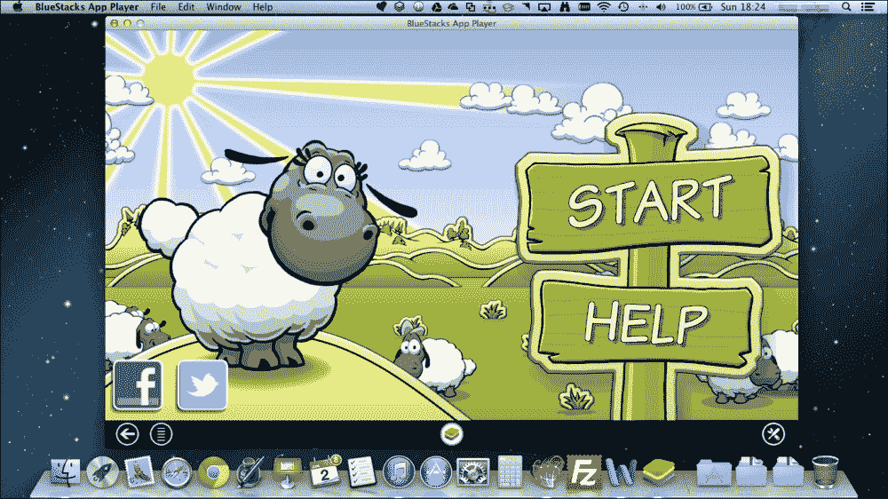

在撰写本书时，BlueStacks 套件有两个元素，如下所示：

+   **App Player**：这是运行 Android 应用程序的引擎

+   **云连接**：这是一个同步工具

由于 BlueStacks 工具可以免费下载，任何运行 Windows 或 Mac 的 PC 用户都可以下载它们并开始测试其功能。本书将指导你如何在电脑上运行 BlueStacks，并展示你如何充分利用这项新兴技术。还有其他方法可以在你的电脑上运行 Android 模拟器。例如，你可以运行虚拟机或安装 Android **软件开发工具包**（**SDK**）。这些假设了一定的技术理解，而使用 BlueStacks 则不一定需要，这使得 BlueStacks 成为在电脑上运行应用程序最快、最简单的方式。

BlueStacks 对于 Windows 8 平板电脑用户来说特别有趣，因为它打开了一个专为触摸界面设计的成熟软件库。这对于那些想在笔记本电脑或平板电脑上使用许多免费或便宜安卓应用的人来说非常有用。

### 注意

值得注意的是，在撰写本书时，这些工具是测试版发布，因此你花时间向开发者通过他们的网站报告你发现的任何错误非常重要。软件的持续开发和成功取决于这种反馈，并导致产品变得更好。如果你依赖于某个特定功能，向开发者表达你的喜爱也是一个好主意。这可以帮助影响哪些功能将被保留并随着产品的成熟而改进。

## App Player

BlueStacks App Player 允许 Windows 或 Mac 用户在他们的台式机或笔记本电脑上运行安卓应用程序。它是通过在窗口中运行安卓的模拟版本来实现的，你可以使用键盘和鼠标与之交互。App Player 可以从 BlueStacks 网站免费下载和安装，[`www.bluestacks.com`](http://www.bluestacks.com)。目前，有两个主要版本可供不同操作系统使用：

+   Mac OS X

+   Windows XP、Vista、7 和 8

安装完软件后，Android 模拟器将在你的机器上运行。这是一个轻量级的安卓版本，可以访问应用商店，以便你可以下载和运行免费和付费的应用程序和内容。大多数应用程序与 App Player 兼容；然而，有些由于技术原因不兼容，有些则被应用开发者阻止运行。

### 注意

如果你在电脑上运行其他操作系统，你提供给 App Player 的计算能力越强越好。否则，你可能会遇到应用程序加载缓慢或更糟糕的是无法正常工作的情况。

为了增加成功的几率，首先尝试在不运行任何其他应用程序的情况下运行 App Player（例如，Word）。

## Cloud Connect

Cloud Connect 提供了一种同步现有手机或平板电脑上运行的应用程序与 App Player 的方法。这意味着你不必手动安装大量应用程序。相反，你只需在设备上安装一个应用程序并注册，这样你的 App Player 就会与你的设备拥有完全相同的应用程序。

# 安装

你可以通过三个简单的步骤安装 BlueStacks App Player 并在你的系统上设置它。第三个步骤已经根据 Windows 7、8 和 Mac OS X 分割，以便你可以遵循你操作系统的具体信息。

## 第 1 步 – 我需要什么？

在安装 BlueStacks App Player 之前，你需要检查你是否拥有以下列出的所有必需元素：

+   磁盘空间：2 GB 可用（最小）。

+   内存：2 GB（最小）。

+   双核 CPU（推荐）。

+   BlueStacks App Player 需要兼容 OpenGL ES 的图形卡和驱动程序（例如 DoctorGL 这样的实用程序可以帮助识别您的图形卡功能并检查是否需要升级驱动程序）。

+   要在 Windows 上安装 BlueStacks App Player，您需要使用完整管理员权限登录。在 Mac OS X 上安装时，您需要提供具有更改系统权限的凭据。

+   Mac OS X 安装需要 Snow Leopard 或更高版本。

## 步骤 2 – 下载 BlueStacks App Player

下载 BlueStacks App Player 最简单的方法是访问 [`www.bluestacks.com`](http://www.bluestacks.com)。通过下载适当的安装包选择您希望安装的操作系统类型（Windows 或 Mac）。以下截图显示了 BlueStacks 网站：

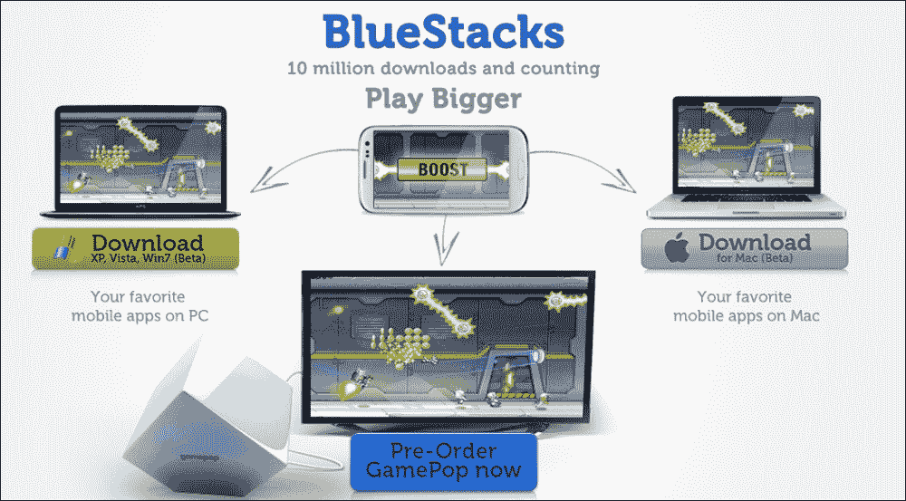

## 步骤 3 - 安装 BlueStacks App Player

执行以下步骤以安装您系统上使用的操作系统对应的 BlueStacks：

### 对于 Windows 7

执行以下步骤以安装 Windows 7 的 BlueStacks：

1.  当提示您选择 **运行** 或 **保存**，如下面的截图所示时，点击 **保存**，以便您手头有文件供将来参考。下载完成后，点击 **运行**。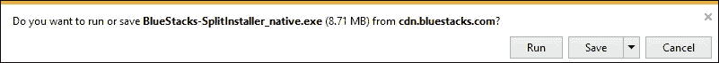

1.  当提示您点击 **继续** 时，请点击 **继续**，并保留两个安装组件选中（**应用商店访问**和**应用通知**），如下面的截图所示。这些允许您安装应用程序并通知您 BlueStacks App Player 的更新。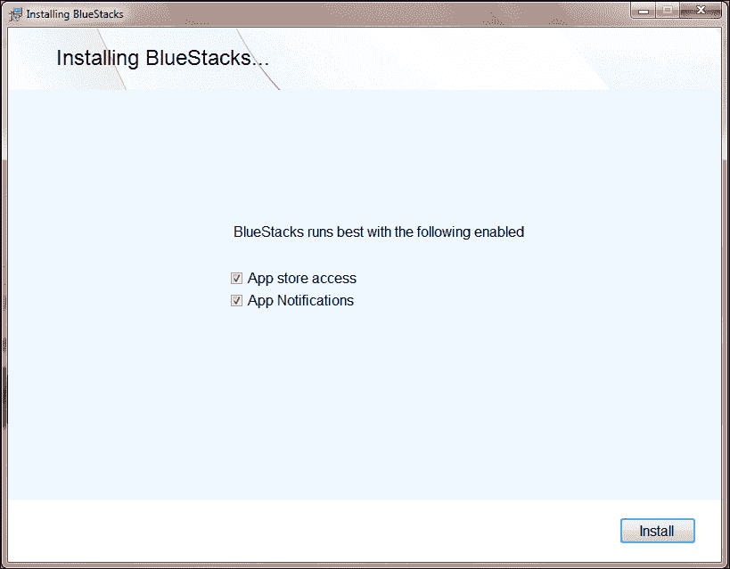

1.  现在，点击 **安装**，在安装过程中，会显示多个推广的应用程序，如下面的截图所示。如果您在选择应用程序时遇到困难，可以尝试这些经过广泛测试的应用程序。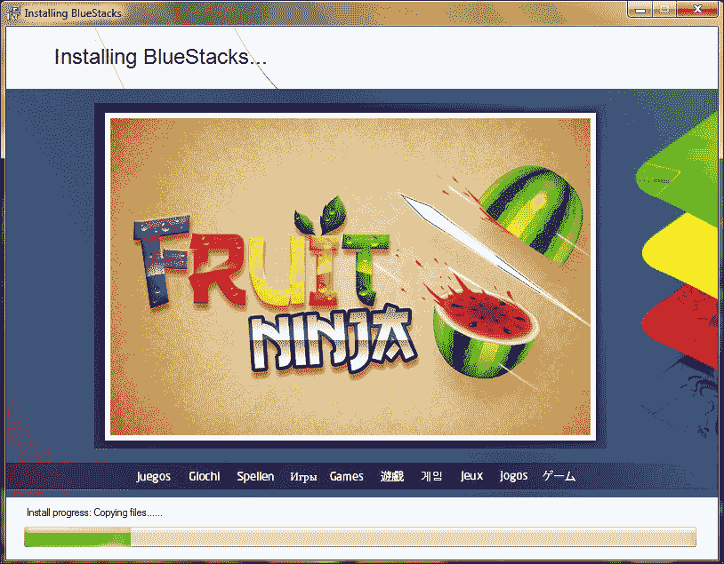

1.  安装完成后，App Player 将自动启动。默认情况下，它以全屏模式加载。您现在可以通过点击右下角的双矩形图标退出全屏模式，如下面的截图所示：

如果这样做，您可能还会注意到几个图标已安装到您的桌面上。

### 对于 Windows 8

执行以下步骤以安装 Windows 8 的 BlueStacks：

1.  当提示您选择 **运行** 或 **保存**，如下面的截图所示时，点击 **保存**，以便您手头有文件供将来参考。下载完成后，点击 **运行**。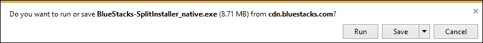

1.  当提示您点击 **继续** 时，请点击 **继续**，并保留两个安装组件选中（**应用商店访问**和**应用通知**），如下面的截图所示：

1.  现在，点击 **安装**，在安装过程中，会展示一系列被推广的应用程序，如图所示。如果您在选择应用程序时遇到困难，可以尝试这些经过广泛测试的应用程序之一：

1.  安装完成后，App Player 将自动启动。默认情况下，它以全屏模式加载。您现在可以通过点击右下角的双矩形图标退出全屏模式。如果您这样做，您可能还会注意到几个图标已经安装到您的桌面上。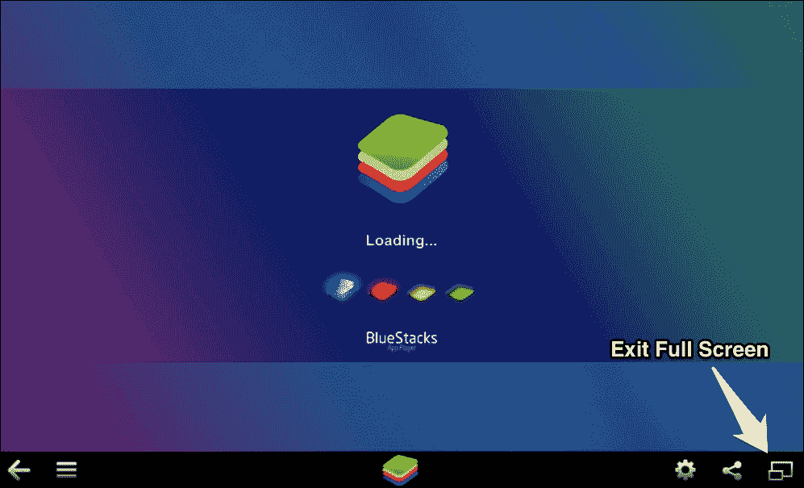

此外，如果您按下 Windows 按钮，您会注意到 **开始** 菜单中添加了一些磁贴。

### 对于 Mac OS X

执行以下步骤以安装适用于 Mac OS X 的 BlueStacks：

1.  在您的计算机上下载 `BlueStacks_AppPlayer-Beta.dmg`，如图所示：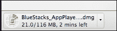

1.  文件下载完成后，双击打开，如图所示：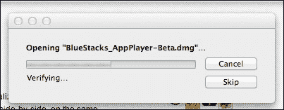

1.  一旦初始扩展过程完成，您需要将 **BlueStacks** 图标拖动到您的 **应用程序** 文件夹中，如图所示：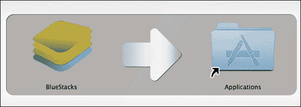

    这将把文件复制到必要的位置。

1.  文件复制完成后，您可以从您的 dock 运行应用程序，如图所示：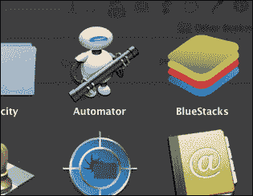

1.  第一次运行应用程序时，您将收到警告，表明该应用程序是从互联网下载的。点击 **打开** 以继续，如图所示：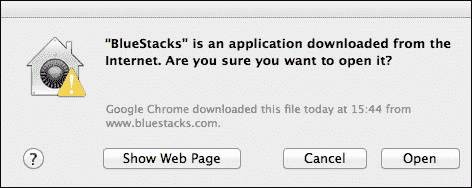

1.  默认情况下，BlueStacks App Player 以全屏模式加载。您现在可以通过点击右下角的双矩形图标退出全屏模式，如图所示：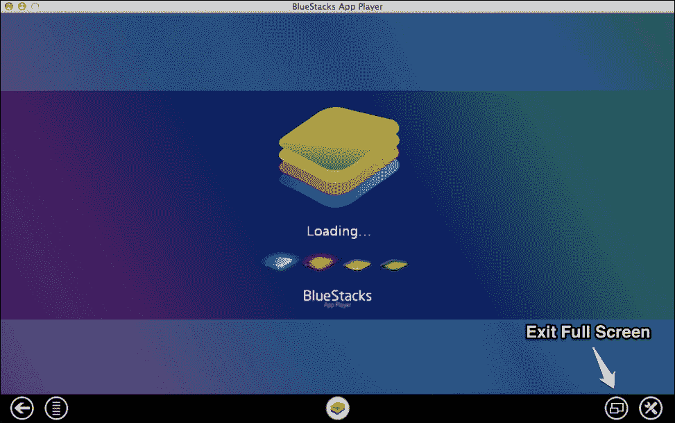

## 就这样

到此为止，您应该有一个可工作的 BlueStacks App Player 安装，您可以自由地探索并了解更多关于它的信息。

# 快速入门 – 安装您的第一个应用程序

要充分发挥 BlueStacks App Player 的作用，您需要安装一些应用程序。这些应用程序与 Android 设备上可用的应用程序相同，并为您的电脑提供了丰富的免费和低成本的工具。本节将指导您设置 BlueStacks App Player，以便您能够享受它提供的功能。

如果您被提示设置“一键同步”，您可能需要跳转到第二步。已知不同版本的 BlueStacks 应用程序在安装过程中的不同阶段都有这个功能。

## 第一步 – 熟悉 App Player

现在您已经安装了 App Player，您需要熟悉界面。以下截图标识了界面上的主要组件，您将在它完成加载后看到：

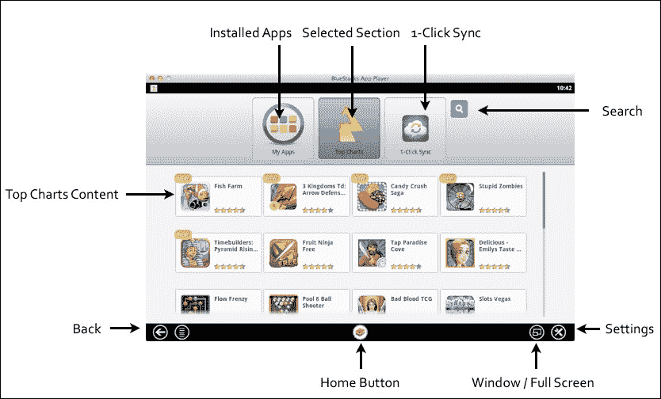

下面是每个按钮的描述：

| **已安装应用** | 这是您可以通过它访问已安装应用的按钮。 |
| --- | --- |
| **热门图表** | 默认选择热门图表页面。此页面显示其他 App Player 用户使用最多的应用。 |
| **一键同步** | 点击此处设置一键同步，这允许您将应用发送到安卓设备（需要谷歌账户）。 |
| **搜索** | 此按钮搜索要安装的应用。 |
| **设置** | 此按钮帮助我们配置 App Player 并管理应用。 |
| **窗口/全屏** | 此按钮在 App Player 的全屏和窗口视图之间切换。 |
| **主页按钮** | 此按钮带您回到首页。 |
| **返回** | 此按钮将您退回一步。 |
| **热门图表内容** | 此区域显示当前页面的内容（在本例中，为**热门图表**） |

随意探索 App Player 的各个部分，熟悉环境。如果您遇到任何困难，点击**主页**按钮将带您回到此页面。

## 步骤 2 – 安装 Flipboard

现在您对界面相对熟悉了，应该深入安装一个应用。以下步骤将指导您安装 Flipboard，这是一个仅适用于移动设备的杂志式 RSS 阅读器：

1.  点击**搜索**图标。

1.  输入 `Flipboard` 并点击**查找**，如下截图所示：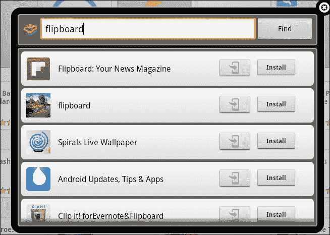

1.  点击**Flipboard: 你的新闻杂志**旁边的**安装**。

1.  由于这是您第一次安装应用，您需要配置**一次性设置**，如下截图所示：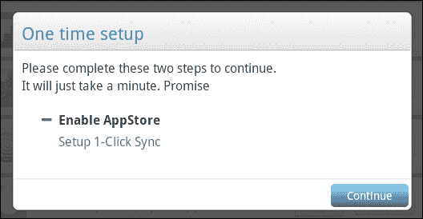

1.  点击**继续**后，您将被告知需要提供谷歌账户详细信息。点击**下一步**继续。

1.  您可以创建一个新的谷歌账户，或者如果您已经有了账户，就登录。出现的窗口如下截图所示：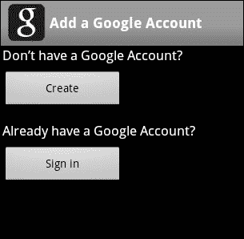

1.  如果您已经有了谷歌账户，点击**登录**，或者点击**创建**来设置一个新账户。这将带您到谷歌网站，您需要提供一些个人信息并设置一个用户名，该用户名也将作为您的电子邮件地址。

1.  输入您的详细信息，然后点击**登录**，如下截图所示：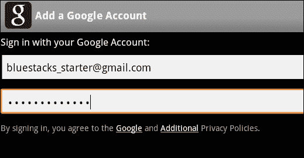

1.  一段时间后，您的谷歌账户将会同步。点击**完成设置**，屏幕上应该会出现以下截图：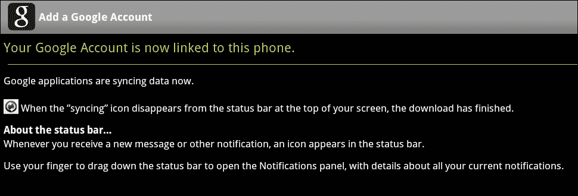

1.  接下来，您需要启用**一键同步**，如下截图所示：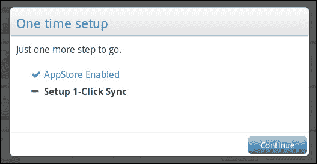

1.  点击**继续**。

1.  当提示时，点击**继续**，如图所示：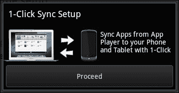

1.  使用您的 Google 账户登录，如图所示：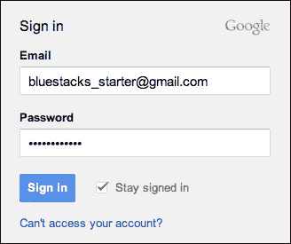

1.  如果您已有设备，您可以通过突出显示它们来同步应用内容。点击**完成**，如图所示：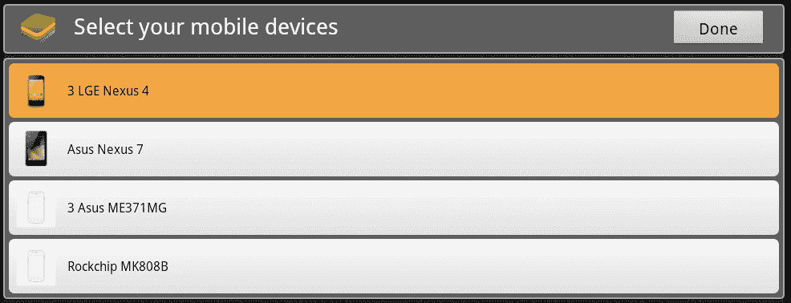

1.  当提示时，点击**完成并开始**！

1.  您现在将被带到**应用商店**。点击**继续**，如图所示：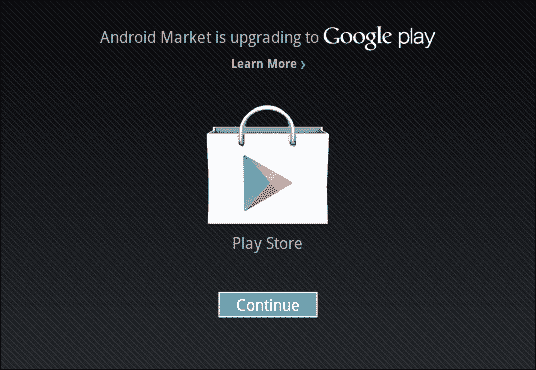

1.  现在您已设置**一键同步**，将带您回到安装**Flipboard**，如图所示：

1.  点击**安装**将带您进入一系列**应用商店**，从中安装**Flipboard**（请参阅以下截图）。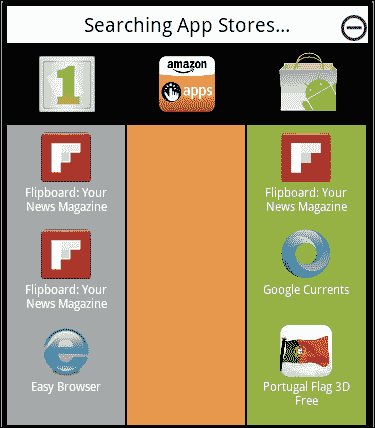

1.  点击左上角列中的一个**Flipboard**图标以开始安装应用。

1.  Flipboard 将开始下载，如图所示：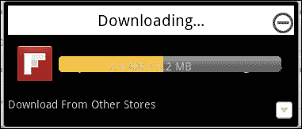

1.  下载完成后，将带您回到**搜索**屏幕，如图所示：

1.  点击右上角的叉号关闭**搜索**窗口，然后点击**我的应用**以查看**Flipboard**已安装，如图所示：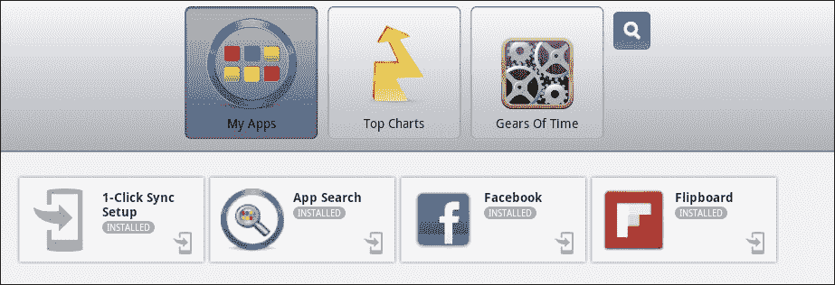

1.  点击**Flipboard**图标以运行应用，如图所示：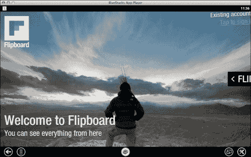

# 您需要了解的前五项顶级功能

随着您越来越熟悉使用 BlueStacks，您将开始欣赏 BlueStacks 在您的电脑上运行 Android 应用的强大功能。考虑到这一点，以下是一些顶级功能，这些功能将帮助您从新手成长为能够充分利用该软件的用户。

## BlueStacks 环境

一旦您开始使用 BlueStacks App Player，您无疑会想要深入了解并做一些更改。如图所示，右下角的设置图标带您进入更改环境的页面：

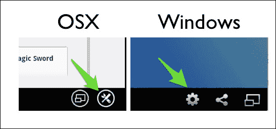

当您处于设置屏幕时，如图所示，有几个选项您可能希望调整，如下所述：

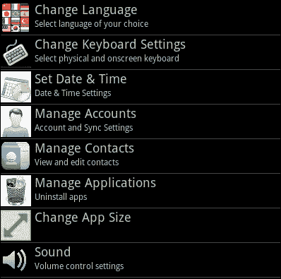

+   **更改语言**：此选项允许母语非英语的用户选择与其母语兼容的选项。

+   **管理账户**：此选项允许您更新您的 Google 账户以访问应用商店。如果您有购买在不同账户中的应用且不想再次购买，您可以添加多个账户。

+   **管理应用**：此选项允许您卸载不再使用的应用，并设置它们是平板电脑还是应用的默认版本。大多数情况下，默认选项就足够了，但如果您发现某个应用在全屏模式下无法自动运行，您可能需要选择平板电脑选项。

## 一键同步

本简要指南将指导您使用以下步骤通过一键同步将应用从 BlueStacks App Player 发送到您的手机：

1.  在开始之前，您需要确保您在设置部分中设置了与您希望发送应用的设备上相同的 Google 账户。

1.  在**App Player**内部，点击**一键同步**设置。

1.  选择您希望同步应用的设备。

1.  点击**完成**。

1.  现在点击您希望发送到 Android 设备的应用的右下角**一键同步图标**，如图所示：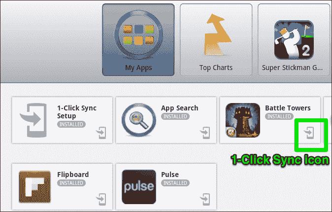

1.  现在您将看到应用自动开始下载。

## Cloud Connect

Cloud Connect 允许您同步您手机上安装的应用。以下步骤帮助您使用 Cloud Connect 同步您的应用：

1.  在您的计算机上使用 BlueStacks App Player，并点击**设置**。

1.  点击**Cloud Connect**。

1.  插入您的电子邮件地址和手机号码（通过短信进行配置详情）。

1.  您将获得一个屏幕上的 PIN 码，您需要记下（或者至少在下一步中留在屏幕上）。

1.  在您的 Android 设备的**Play Store**应用中搜索`Cloud Connect`，然后安装它。

1.  一旦应用下载完成，打开应用，您将需要插入**BlueStacks Channels PIN**。

1.  输入 PIN 码，然后点击**登录**。

1.  登录后，您可以选择您希望同步回 App Player 的应用，如图所示：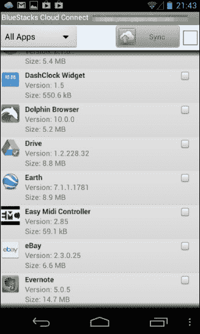

## 来自应用商店之外的应用

要安装应用商店中未出现的应用，您首先需要获取 APK 文件。这是专门为 Android 编写的编译后的 Java 应用程序。对于 Mac 和 PC，过程不同，因此您需要遵循与您拥有的计算机类型相关的指南。

### Mac

执行以下步骤以在 Mac 上安装应用商店中未出现的应用：

1.  从互联网下载 APK 文件，或者如果您是开发者，请在您的 IDE 中准备一个。您可以从[`www.freewarelovers.com/android/download/temp/1325762461_Zirco_Browser_0.4.3.apk`](http://www.freewarelovers.com/android/download/temp/1325762461_Zirco_Browser_0.4.3.apk)下载。

1.  一旦文件下载完成，你需要将其复制到这个目录：`Applications\BlueStacks.app\Contents\Runtime`。如果你使用的是 Finder，你需要右键点击**BlueStacks**应用，然后点击**显示包内容**。

1.  打开终端。

1.  输入以下命令：

    ```java
      cd .. [Return]
      cd .. [Return]
      cd applications [Return]
      cd bluestacks.app [Return]
      cd contents [Return]
      cd runtime [Return]
      ./uHD-Adb install Zirco_Browser_0.4.3.apk [Return]
    ```

    当过程完成时，你应该会收到一条成功消息。

1.  此应用现在将被安装到 BlueStacks App Player 的**我的应用**部分。

### PC

执行以下步骤在你的 PC 上安装应用商店中未出现的应用：

1.  从互联网下载 APK 文件，或者如果你是开发者，在你的 IDE 中准备一个。你可以从[`www.freewarelovers.com/android/download/temp/1325762461_Zirco_Browser_0.4.3.apk`](http://www.freewarelovers.com/android/download/temp/1325762461_Zirco_Browser_0.4.3.apk)下载。

1.  右键点击文件，用**BlueStacks APK 处理器**打开。

1.  此应用现在将被安装到 BlueStacks App Player 的**我的应用**部分。

## 故障排除技巧

如果你遇到麻烦，你可能需要考虑以下故障排除技巧：

+   你的第一个故障排除策略是卸载并重新安装 BlueStacks。如果它是测试版软件，你可能发现第一次安装并不成功。

+   如果你从 BlueStacks 收到缓慢的响应，你应该尝试重新启动你的计算机，并确保后台运行的应用非常少，因为 App Player 对系统资源的需求相当大。

+   如果你使用的是 Windows 系统，下一步是安装你的显卡的最新驱动程序。如果你发现应用无法加载，值得查看支持论坛，看看你的显卡是否被其他人成功使用。

+   如果你使用的是带有触摸屏的 Windows 8 Pro 设备并且无法运行 App Player，尝试下载并运行以下注册表修复补丁：[`cdn.bluestacks.com/downloads/tools/fix-win8-pro-compat-rel.reg`](http://cdn.bluestacks.com/downloads/tools/fix-win8-pro-compat-rel.reg)。

    在安装注册表键之前，你应该小心谨慎，因为这可能会对你的系统造成风险。如果有疑问，请不要继续，或者如果你想了解更多，请查看以下来自微软的文章：[`support.microsoft.com/kb/310516`](http://support.microsoft.com/kb/310516)。

# 你应该了解的人和地方

以下是在使用 BlueStacks 时你应该熟悉的一批人和地方。他们将指导你熟悉软件，并提供如何更好地为你工作的宝贵见解。

## 官方网站

+   主页：[`www.bluestacks.com`](http://www.bluestacks.com)

+   维基：[`en.wikipedia.org/wiki/BlueStacks`](http://en.wikipedia.org/wiki/BlueStacks)

+   博客：[`www.bluestacks.com/announcements.html`](http://www.bluestacks.com/announcements.html)

## 文章和教程

+   [`bloodbrothersgame.wikia.com/wiki/Tutorial:Bluestacks`](http://bloodbrothersgame.wikia.com/wiki/Tutorial:Bluestacks)

+   [`www.head4space.com/install-flipboard-on-your-mac-or-pc/`](http://www.head4space.com/install-flipboard-on-your-mac-or-pc/)

+   [`gigaom.com/2012/09/27/amd-computers-run-500000-android-apps-with-bluestacks/`](http://gigaom.com/2012/09/27/amd-computers-run-500000-android-apps-with-bluestacks/)

+   [`blog.julianxhokaxhiu.com/2012/12/26/how-to-run-whatsapp-on-your-pcmac-using-bluestacks/`](http://blog.julianxhokaxhiu.com/2012/12/26/how-to-run-whatsapp-on-your-pcmac-using-bluestacks/)

+   [`www.engadget.com/2012/09/27/bluestacks-teams-with-amd-to-optimize-its-android-app-player/`](http://www.engadget.com/2012/09/27/bluestacks-teams-with-amd-to-optimize-its-android-app-player/)

+   [`hackyogi.com/how-to-remove-error-while-installing-bluestack-in-windows/`](http://hackyogi.com/how-to-remove-error-while-installing-bluestack-in-windows/)

## 社区

+   官方论坛：[`getsatisfaction.com/bstk`](http://getsatisfaction.com/bstk)

+   Facebook: [`www.facebook.com/BlueStacksInc`](http://www.facebook.com/BlueStacksInc)

+   用户常见问题解答：[`getsatisfaction.com/bstk`](https://getsatisfaction.com/bstk)（支持论坛中的粘性项目）

## 博客

+   XDA 开发者 Wiki：[`forum.xda-developers.com/wiki/BlueStacks_App_Player`](http://forum.xda-developers.com/wiki/BlueStacks_App_Player)

+   含有 BlueStacks 内容的 Tumblr 博客：[`www.tumblr.com/tagged/bluestacks`](http://www.tumblr.com/tagged/bluestacks)

+   TechCrunch 报道 BlueStacks 开发：[`techcrunch.com/tag/bluestacks/`](http://techcrunch.com/tag/bluestacks/)

+   The Verge 报道了 BlueStacks：[`www.theverge.com/search?q=bluestacks`](http://www.theverge.com/search?q=bluestacks)

+   Engadget 报道了 BlueStacks：[`www.engadget.com/tag/BlueStacks/`](http://www.engadget.com/tag/BlueStacks/)

## Twitter

+   官方 BlueStacks 推特账号：[`twitter.com/bluestacksinc`](http://twitter.com/bluestacksinc)

+   TechCrunch 推文：[`twitter.com/techcrunch`](http://twitter.com/techcrunch)

+   The Verge 推文：[`twitter.com/verge`](http://twitter.com/verge)

+   科技推文：[`www.twitter.com/head4space`](http://www.twitter.com/head4space)

+   想获取更多开源信息，请关注 Packt 出版社在[`twitter.com/#!/packtopensource`](http://twitter.com/#!/packtopensource)的账号
