# 第一章. iOS 即时 Passbook 应用程序开发指南

欢迎来到*iOS 即时 Passbook 应用程序开发指南*。这本书将指导您创建 Passbook Pass，将其分发给您的用户，并将其集成到现有的应用程序中。

# 理解 Passbook（简单）

这个菜谱将帮助您从用户和 Pass 创建者的角度理解 Passbook。

## 准备工作

使用 iOS，苹果推出了 Passbook 应用程序作为所有商店卡、优惠券、登机牌和活动门票的中央数字钱包，这些已成为应用程序的流行功能。

想要利用这个数字钱包及其提供的额外功能的公司，可以使用苹果的开发者平台为他们的用户创建 Pass。

## 如何操作…

1.  要理解 Passbook，我们需要看到 Pass 的实际应用。从以下链接下载示例 Pass：

    [`passkit.pro/example-generic-pkpass`](http://passkit.pro/example-generic-pkpass)

1.  如果您在运行 iOS 的 iPhone 或 iPod Touch 上的 Mobile Safari 中打开此链接，您将看到 Pass 以及将其添加到 Passbook 的选项：

1.  或者，您可以在 Mac 或 PC 上下载 Pass 并将其通过电子邮件发送给自己，然后在 iPhone 或 iPod Touch 上的 Mail 应用程序中打开该电子邮件。点击 Pass 附件链接将显示 Pass。

1.  如果您选择将 Pass 添加到您的 Passbook 应用程序中，显示的 Pass 将消失，因为它已经被存档到您的 Passbook 中。现在，点击**主页**按钮返回主屏幕并启动 Passbook 应用程序。在应用程序中，您现在将看到刚刚添加的 Pass。它包含应用程序创建者指定的信息，并在与提供服务的企业互动时可以展示。可以在 Pass 的背面放置附加信息。点击 Pass 右上角顶部的**i**按钮，以显示这些信息。

## 它是如何工作的…

以下图表描述了 Pass 是如何交付到 Passbook 的，以及这些 Pass 如何更新：

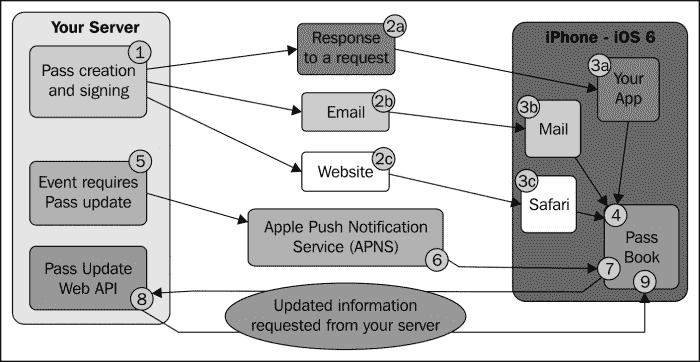

创建 Pass 的过程涉及使用从您的 iOS 开发者账户生成的证书和密钥对 Pass 进行加密签名。因此，Pass 的生成需要在服务器上进行，然后通过您的应用程序、作为电子邮件附件或嵌入到网站中，将其交付给 Passbook。

重要的是要注意，苹果不提供任何系统让 Pass 提供者进行验证、验证或使 Pass 失效。Pass 可以包含条形码信息，但提供这些条形码读取和处理基础设施的责任在于 Pass 提供者。

通行证不仅仅可以静坐在 Passbook 应用中等待使用，它还可以包含位置和时间触发器，主动向用户展示通行证，既起到提醒作用，又提供方便的访问。例如，活动通行证可以设置为在开始前 15 分钟出现，此时用户可能需要向服务员出示活动通行证。或者，优惠券通行证可以在用户接近可以兑换优惠券的本地商店时展示。

已添加到 Passbook 的通行证也可以动态更新。例如，如果通行证是商店卡，卡余额的变化可能需要更新通行证。例如，对于航班通行证，登机口变更应触发通行证更新。

当需要更新通行证时，您的服务器会向用户设备上的 Passbook 应用发送推送通知。这种推送通知不会显示给用户。

在接收到此推送通知后，Passbook 应用会向您的服务器请求更新的通行证信息。您的服务器会响应相关请求，并以预期的格式提供更新信息。

当用户的设备上的 Passbook 应用接收到更新信息时，它会静默地更新通行证。下次用户查看 Passbook 应用中的通行证时，会显示更新后的信息。

## 还有更多…

Passbook 的支持也内置在 OSX Mountain Lion（10.8.2）中。具有`pkpass`文件扩展名的 Pass 文件将在预览窗口中打开：

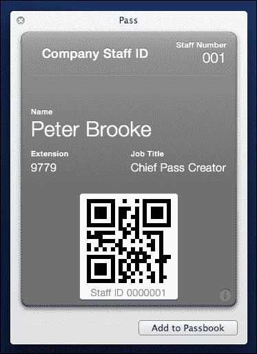

点击**添加到 Passbook**按钮，将通行证放入与 OSX 系统偏好设置中设置的 iCloud 账户关联的 Passbook 中。

OSX 的 Mail 应用和 Safari 也支持嵌入的通行证。

在构建通行证时，您可以指定相关的时间和最多 10 个相关位置，这些位置将触发在锁屏上显示消息。消息看起来与推送通知相似，然而通行证通知不那么侵扰性。当需要显示时，它不会振动 iPhone，也不会唤醒屏幕。通知仅在手机从睡眠中唤醒时才可见：

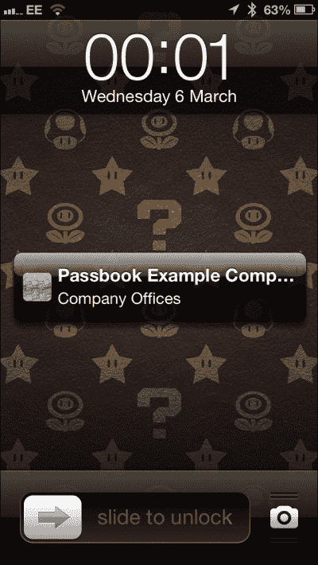

指定相关时间和位置以及通知触发的位置距离的选项，由通行证类型决定，我们稍后会看到。

### 使用 Passbook 的应用

App Store 中使用 Passbook 的一些应用如下：

+   **Hotels.com**：此应用使用 Passbook 来存储房间预订详情。可以从[`appstore.com/hotelscom/hotelscom`](http://appstore.com/hotelscom/hotelscom)下载。

+   **星巴克**：此应用使用 Passbook 作为商店卡。可以从[`appstore.com/starbuckscoffeecompany`](http://appstore.com/starbuckscoffeecompany)下载。

+   **票务大师**：此公司使用 Passbook 进行活动门票。可以从[`appstore.com/ticketmaster/ticketmaster`](http://appstore.com/ticketmaster/ticketmaster)下载。

+   **联合航空**：此航空公司使用 Passbook 进行登机牌。可以从[`appstore.com/unitedairlines`](http://appstore.com/unitedairlines)下载。

### 更多文档

更多详细信息，请参阅 Apple 的 Passbook 文档，链接为[`developer.apple.com/passbook/`](https://developer.apple.com/passbook/)。

# 设置环境（简单）

此配方展示了如何在 Apple 的配置文件门户中设置您的 Pass 类型并生成代码签名所需的文件。

## 准备工作

要开始创建自己的 Pass，您需要一个付费的 iOS 开发者账户。如果您打算在现有的 iOS 应用程序中展示 Pass，您将需要访问发布此现有应用程序的 iOS 开发者账户。此外，许多这些步骤需要仅在 OSX 上可用的应用程序和实用程序，例如用于证书创建过程的 Keychain Access。因此，这些步骤应在运行 OSX 的 Mac 上执行。

## 如何操作…

1.  如果您打算在 iOS 应用程序中展示 Pass，但尚未创建应用程序，您需要在 iOS 开发者中心的**标识符**部分创建一个 App ID。

1.  登录 iOS 开发者中心，导航到**证书** | **标识符 & 配置文件** | **标识符**，或点击此链接：

    [`developer.apple.com/account/ios/identifiers/bundle/bundleList.action`](https://developer.apple.com/account/ios/identifiers/bundle/bundleList.action)

1.  点击右上角的**+**按钮。

1.  在**App ID 描述**字段中输入应用程序名称：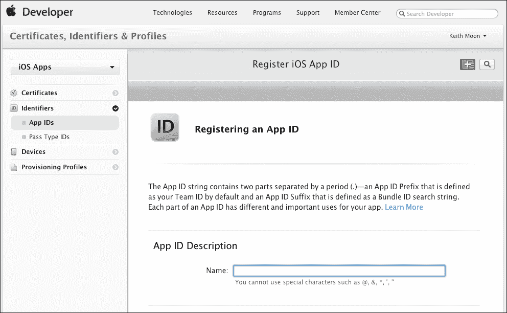

1.  在**应用程序服务**下，确保**Passbook**已启用。

1.  在**App ID 前缀**下，除非您有明确指定此内容的理由，否则请使用 Team ID。

1.  App ID 后缀是一个唯一的字符串标识符，仅适用于您的应用程序。配置文件门户不允许您指定在另一个应用程序中使用的 Bundle Identifier。建议使用反向域名样式字符串。例如，在这本书中，我使用了域名[`passkit.pro`](http://passkit.pro)，因此我选择的 Bundle Identifier 是`pro.passkit.example`，因为这将是示例应用程序的应用 ID。

1.  如果您有一个现有的 App ID，您需要为该 App ID 启用 Passbook。从配置文件门户的 App ID 部分选择 App ID，并记下前缀，因为我们指定 Pass 的 Team Identifier 时需要它。完成此操作后，选择**设置**：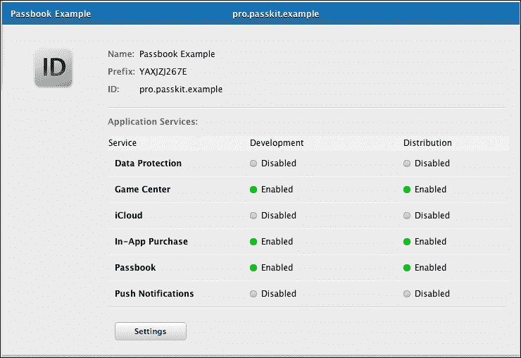

1.  在“Passbook”旁边的复选框中勾选，然后点击**完成**。将显示一个警告，告知为该应用 ID 创建的所有新配置文件都将启用 Passes。这作为一个提醒，表示现有的配置文件将不会为 Passbook 启用，直到它们被重新创建。因此，如果你有一个已发布到 App Store 的现有应用，你需要重新生成应用的分发配置文件，使用这个新的配置文件重新构建应用，并将应用的更新提交到 App Store。在你这样做之前，你的应用将无法将 Passes 添加到 Passbook 中。当 Passes 为应用 ID 正确启用后，Passes 的指示器将变为绿色，并在应用 ID 摘要屏幕上标记为**启用**：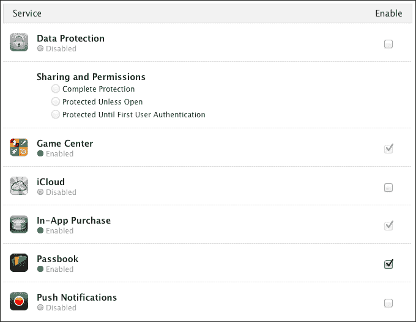

1.  无论你打算在应用中展示你的 Pass 还是不展示，你现在都需要创建一个 Pass Type ID。点击左侧菜单上的 Pass Type ID 链接或访问：

    [`developer.apple.com/account/ios/identifiers/passTypeId/passTypeIdList.action`](https://developer.apple.com/account/ios/identifiers/passTypeId/passTypeIdList.action)

1.  点击**+**按钮创建一个新的 Pass Type ID。你需要为打算创建的每种 Pass 类型创建一个 Pass Type ID。目前可以创建的 Pass 类型有登机牌、优惠券、活动门票、商店卡和通用。Pass 类型以不同的方式呈现，具有不同的功能，正如我们将看到的。在我们的示例中，我们将专注于构建一个通用 Pass。如果你打算创建商店卡类型 Pass 和优惠券类型 Pass，你需要为每种类型创建一个 Pass Type ID：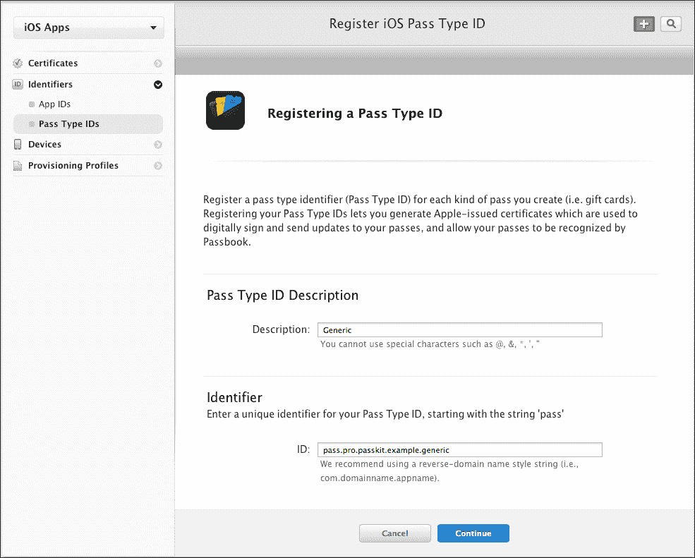

1.  对于描述，选择一个定义你正在创建的 Pass 类型的名称。在本书后面的主要示例中，将创建一个通用类型的 Pass，因此在上面的示例 Pass Type ID 中，使用了描述**通用**。

1.  标识符必须以`pass.`开头，然后是一个反向域名字符串，Pass 类型放在末尾。在上面的示例中，我使用了之前创建的完整应用 ID，Pass 类型为通用，因此完整的 Pass Type Identifier 如下：

    ```swift
    pass.pro.passkit.example.generic
    ```

    在创建 Pass Type ID 后，我们将生成一个相关的加密密钥和证书，这是用于 Pass 认证所需的。选择 Pass Type ID 并记下 Pass Type ID，因为这将需要在创建 Pass 时使用：

    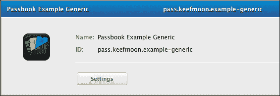

1.  点击**设置**按钮，按照说明创建证书签名请求。以下我将重复说明，并提供一些建议以帮助避免后续的混淆。

1.  启动“钥匙串访问”实用程序。

1.  从菜单中选择**钥匙串访问** | **证书助手** | **从证书颁发机构请求证书**。在**证书信息**窗口中，输入以下信息：

    +   **用户电子邮件地址**：输入与您的 iOS 开发者账户关联的电子邮件地址。

    +   **通用名称**：选择一个与 Pass Type ID 相关的名称。这将显示在 Keychain Access 中的密钥旁边，因此一个不够具体的通用名称可能会导致混淆。请参阅以下截图，这是在步骤 18 之后在 Keychain Access 中如何呈现的。

    +   **CA 电子邮件地址**：此字段留空

    +   **请求类型**：选择**保存到磁盘**

    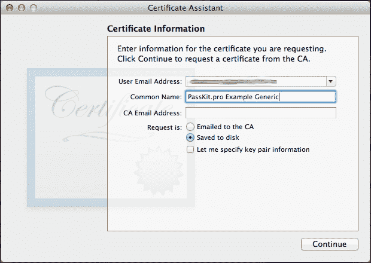

1.  点击**继续**并保存您的证书签名请求。然后，在 Safari（其他浏览器可能会有问题或不兼容，阻止您选择文件）中，点击**选择文件**并选择刚刚生成的证书签名请求。点击**生成**并等待生成密码类型证书：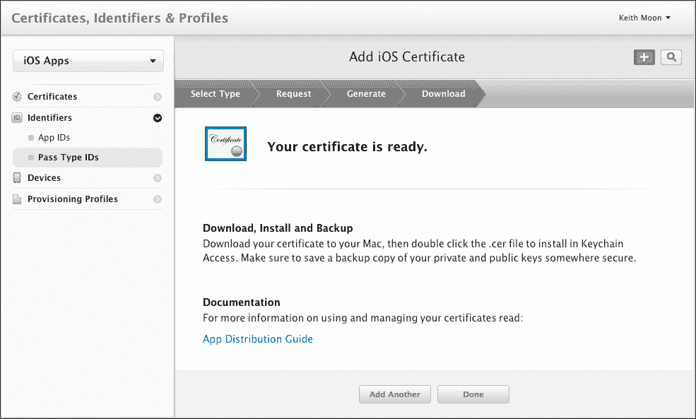

1.  生成后，点击**完成**并下载您的证书。打开您下载的证书，这将启动 Keychain Access 并将证书附加到在证书签名请求生成过程中创建的相关私钥：

证书和密钥对现在应在 Keychain Access 中可见。这些现在需要转换为可以正确签署您将创建的 Passes 的格式。在 Keychain Access 中选择证书，然后从菜单中选择**文件** | **导出项**，并选择一个导出位置。您将被要求提供密码以保护导出的项，您还可能被要求输入管理员密码，因为您正在执行需要管理员权限的任务。

您需要使用名为 OpenSSL 的命令行工具来使用导出的文件生成所需的密钥和证书文件。此命令行工具可以从内置的 OSX 实用程序**终端**中运行。要打开终端，请转到 Finder 中的`Applications`文件夹。终端位于`Utilities`文件夹中。

1.  使用以下终端命令生成一个`certificate.pem`文件和一个`key.pem`文件。

    ```swift
    openssl pkcs12 -in <Path to exported .p12> -clcerts -nokeys -out certificate.pem
    openssl pkcs12 -in <Path to exported .p12> -nocerts -out key.pem

    ```

1.  在生成`key.pem`时，您将被提示输入导入护照，这是在从 Keychain Access 导出时设置的密码。然后，您将被提示输入密码短语；这可以与导入密码相同，但请注意，此密码短语在签署您的 Passes 时需要提供，因此可能成为自动化脚本的一部分。

1.  除了上面生成的`certificate.pem`文件和`key.pem`文件外，还需要 Apple WWDR 中间证书。您可以通过访问配置文件门户，在**证书**部分，点击**+**按钮，或访问以下链接。该证书在**中间证书**下标记为*Worldwide Developer Relations Certificate Authority*。

    [`developer.apple.com/account/ios/certificate/certificateCreate.action`](https://developer.apple.com/account/ios/certificate/certificateCreate.action)

1.  一旦下载完成，还需要将其转换为 `.pem` 文件。双击 WWDR 证书文件，将其加载到钥匙串访问中，并在钥匙串访问中选择证书：

1.  然后，从菜单中选择 **文件** | **导出项**，将文件格式更改为 **增强隐私邮件** `(.pem)` 并将其保存为 `wwdr.pem`。

## 它是如何工作的…

苹果的安全模型确保只有注册的 iOS 开发者可以创建 Pass，并且 Pass 在发送到用户设备时不能被第三方更改，除非被检测并拒绝，否则 Passbook 将拒绝。

证书创建过程生成一个与创建它的 Pass 类型 ID 相关联的 Pass 类型证书，这反过来又将其与您的开发者账户关联起来。这提供了一种验证使用此证书签名的 Pass 内容的方法，因此，也是一种检测除注册 Pass 创建者之外任何人篡改 Pass 的方法。

# 创建您的 Pass（中等）

Pass 通过在 JSON 格式中指定相关信息来构建和自定义。还可以提供某些图形资产以进一步自定义 Pass 的外观和感觉。

例如，我们将构建一个通用类型的 Pass，用作员工身份卡。一旦我们了解了这种类型的 JSON 结构，我们就会看到其他 Pass 类型有何不同。

## 准备工作

您可以从以下链接获取完整的 JSON 代码，我们将使用它：

[`passkit.pro/example-generic-json`](http://passkit.pro/example-generic-json)

这将创建一个如下两个图像所示的 Pass。

以下截图显示了 Pass 的正面：


以下截图显示了 Pass 的背面：

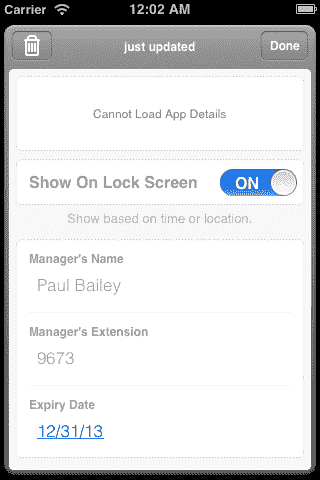

## 如何操作…

1.  将以下 JSON 代码保存到名为 `pass.json` 的文件中：

    ```swift
    {
    "passTypeIdentifier" : "pass.pro.passkit.example.generic",
      "formatVersion" : 1,
      "teamIdentifier" : "YAXJZJ267E",
      "organizationName" : "Passbook Example Company",
      "serialNumber" : "0000001",
      "description" : "Staff Pass for Employee Number 001",
      "associatedStoreIdentifiers" : [
        375380948
      ],
      "locations" : [
        {
      "latitude" : 51.50506, 
      "longitude" : -0.01960, 
      "relevantText" : "Company Offices"
    }
      ],
      "foregroundColor" : "rgb(255, 255, 255)",
      "backgroundColor" : "rgb(90, 90, 90)",
      "labelColor" : "rgb(255, 255, 255)",
      "logoText" : "Company Staff ID",
      "barcode" : {
        "format" : "PKBarcodeFormatQR",
        "message" : "0000001",
        "messageEncoding" : "iso-8859-1",
        "altText" : "Staff ID 0000001"
       },
      "generic" : {
        "headerFields" : [
          {
            "key" : "staffNumber",
      "label" : "Staff Number",
      "value" : "001"
          }
        ],
      "primaryFields" : [
        {
      "key" : "staffName",
      "label" : "Name",
      "value" : "Peter Brooke"
      }
      ],
      "secondaryFields" : [
      {
      "key" : "telephoneExt",
      "label" : "Extension",
      "value" : "9779"
      },
      {
      "key" : "jobTitle",
      "label" : "Job Title",
      "value" : "Chief Pass Creator"
      }
      ],
      "backFields" : [
      {
      "key" : "managersName",
      "label" : "Manager's Name",
      "value" : "Paul Bailey"
      },
      {
      "key" : "managersExt",
      "label" : "Manager's Extension",
      "value" : "9673"
      },
      {
      "key" : "expiryDate",
      "dateStyle" : "PKDateStyleShort",
      "label" : "Expiry Date",
      "value" : "2013-12-31T00:00-23:59"
      }
      ]
      }
    }
    ```

1.  将 `passTypeIdentifier` 的值（当前为 `pass.pro.passkit.example.generic`）替换为您之前创建的 Pass 类型标识符。

1.  将 `teamIdentifier` 的值（当前为 `YAXJZJ267E`）替换为您的团队标识符，之前记为应用 ID 前缀。

1.  可以添加多个图形资产以进一步自定义 Pass。唯一必需的图形资产是图标，它在显示 Pass 在锁屏上时使用。

1.  创建一个分辨率为 58 像素 x 58 像素的视网膜屏幕图标，应命名为 `icon@2x.png`。创建一个非视网膜版本，分辨率为 29 像素 x 29 像素，应命名为 `icon.png`。示例资产可以从 [`passkit.pro/example-generic-package`](http://passkit.pro/example-generic-package) 下载。

## 它是如何工作的…

我们刚刚创建的 `pass.json` 文件包含以下顶级键/值对：

+   `passTypeIdentifier`: 这将通行证与您的开发者账户关联。

+   `formatVersion`: 目前这始终为 1，但它将允许苹果在未来更改格式，同时保持向后兼容性。

+   `teamIdentifier`: 此标识符允许同一开发者通过 iOS 密钥链在不同应用程序之间共享数据。对于我们的目的，这只需要与创建通行证标识符时指定的 App ID 前缀相匹配。

+   `organizationName`: 这是您的公司或应用程序的名称，这应该是您的用户了解和提及您的方式。当通行证在锁定屏幕上显示时，它将作为通知的标题显示。

+   `serialNumber`: 这应该包含对通行证的唯一引用，当更新通行证时，此序列号将用于从您的服务器请求更新信息，因此它应唯一标识此类通行证中的一个通行证。在员工识别通行证的例子中，这可能是员工参考编号。虽然示例中将其表示为数字，但它可以是任何文本值。

+   `description`: 用于辅助功能，因此应简要描述通行证的使用情况，并包含足够的信息以区分同一类型的其他通行证。

+   `associatedStoreIdentifiers`: 与此通行证关联的 iTunes Store 应用程序标识符数组。如果您已经有了一个在 App Store 中提供通行证的 app，则应包括此标识符。应用程序的标识符可以在 iTunes Connect 中找到。如果提供了多个标识符，则将使用设备上可用的第一个标识符。这将显示通行证背面的应用程序信息横幅。此横幅将提示用户安装您的应用程序或如果已安装则打开应用程序。

以下两个顶级键/值对决定了在什么情况下通行证会在用户的锁定屏幕上显示给用户。

+   `locations`: 这是与通行证使用相关的位置列表。这表示为包含位置信息的字典数组的数组。示例中只提供了一个位置，但实际上可以指定多达 10 个位置。如果用户位于此位置的一定距离内，他们可能会在锁定屏幕上看到通行证。触发此行为的位置距离取决于通行证类型，对于通用通行证类型，距离大约为 100 米。每个`locations`字典包含纬度、经度和在触发时将在锁定屏幕上显示的相关文本。在`locations`字典中，您可以可选地指定海拔。

+   `relevantDate`：在上述示例中没有包含，因为它与雇主 ID 用例不匹配。此键确定通行证相关的时段。此键的值应为 W3C 时间戳形式的文本，例如，“2013-12-31T00:00-23:59”，如果需要，也可以包括秒。不应包含时区信息，因为设备设置中设置的时区将被使用。

上文所述的两个相关性键的行为取决于通行证类型。通行证类型决定了`locations`和`relevantDate`哪些是必需的，哪些是可选的，它还决定了在用户锁屏上展示通行证时使用的触发条件。

不同行为的解释可以在苹果的通行证编程指南（需要苹果开发者账户登录）中找到：

[`developer.apple.com/library/ios/#documentation/UserExperience/Conceptual/PassKit_PG/Chapters/Creating.html#//apple_ref/doc/uid/TP40012195-CH4-SW53`](https://developer.apple.com/library/ios/#documentation/UserExperience/Conceptual/PassKit_PG/Chapters/Creating.html)

+   `foregroundColor`：通行证的前景颜色，以 RGB 三元组的形式提供值。

+   `backgroundColor`：通行证的背景颜色，以 RGB 三元组的形式提供值。

+   `labelColor`：通行证中显示的文本颜色，以 RGB 三元组的形式提供值。

+   `logoText`：在通行证左上角显示的文本。这很可能是您公司的名称，或是对通行证用途的指示。

+   `barcode`：此字典包含要在条码中显示的信息以及如何显示它。通行证格式支持以下格式之一自动创建 2D 条码：

    +   `PKBarcodeFormatQR`

    +   `PKBarcodeFormatPDF417`

    +   `PKBarcodeFormatAztec`

    消息编码通常是`iso-8859-1`，除非您知道您的条码扫描器支持其他编码格式。

    应将编码到条码中的值定义为消息键，并使用`altText`键可选地显示条码信息的更易读的描述。

+   **generic**：此顶级键确定您将要创建的通行证类型。目前可用的类型有：

    +   `generic`

    +   `boardingPass`

    +   `coupon`

    +   `eventTicket`

    +   `storeCard`

您选择的通行证类型会影响通行证的许多方面，包括整体风格、文本布局、可用的图形资产选项以及锁屏行为。苹果针对其各自的用例优化了通行证类型，因此请尽量选择与您的通行证用例最接近的通行证类型。如果没有任何特定的通行证类型适用，则可以使用通用通行证类型。

通行证编程指南描述了每种通行证类型的不同布局配置：

[`developer.apple.com/library/ios/#documentation/UserExperience/Conceptual/PassKit_PG/Chapters/Creating.html#//apple_ref/doc/uid/TP40012195-CH4-SW1`](https://developer.apple.com/library/ios/#documentation/UserExperience/Conceptual/PassKit_PG/Chapters/Creating.html)

在通行证类型的顶级键中是一个字典，包含各种显示组的数组，包括 `headerFields`、`primaryFields`、`secondaryFields` 和 `backFields`，它们根据通行证类型进行显示。每个组包含一个字典数组，指定键、标签和值。标签和值字段在通行证上显示，而键字段应在您的通行证格式中是唯一的，并在更新通行证时使用。

## 还有更多...

可以提供图形资产以进一步视觉定制您的通行证。`icon.png` 资产是必需的，但以下资产可以可选地包含在通行证包中：

+   `logo.png`

+   `background.png`

+   `thumbnail.png`

+   `footer.png`

+   `strip.png`

所有资产都应包含一个视网膜版本，其宽度和高都是两倍，文件名末尾带有 `@2x`。因此，对于图标，您应提供以下文件：

+   `icon.png`: 29 像素宽度 x 29 像素高度

+   `icon@2x.png`: 58 像素宽度 x 58 像素高度

下表提供了每个资产的可用大小以及每种通行证类型的可用空间。大小以像素宽度 x 像素高度提供：

| 通行证类型 | icon29 x 29 | logo160 x 50 | background180 x 220 | thumbnail90 x 90* | strip** | footer286x15 |
| --- | --- | --- | --- | --- | --- | --- |
| 通用 | 必需 | 可选 | 未使用 | 可选 | 未使用 | 未使用 |
| 登机牌 | 必需 | 可选 | 未使用 | 未使用 | 未使用 | 可选 |
| 优惠券 | 必需 | 可选 | 未使用 | 未使用 | 可选 | 不适用 |
| 事件门票 | 必需 | 可选 | 可选 | 可选 | 未使用 | 未使用 |
| （带条形码） | 未使用 | 未使用 | 可选 |
| 商店卡片 | 必需 | 可选 | 未使用 | 未使用 | 可选 | 未使用 |

* 90px x 90px 是可用空间，但图形必须是 60px x 90px 或 90px x 60px

**条形码资产的允许大小为 312 x 84（事件门票），当使用正方形条形码时为 312 x 110，否则为 312 x 123**。

### 进一步的文档

有关通行证类型布局结构的更多详细信息，可以在 Apple Passbook 包格式参考（需要 Apple 开发者账户登录）中找到：

[`developer.apple.com/library/ios/#documentation/UserExperience/Reference/PassKit_Bundle/Chapters/Introduction.html#//apple_ref/doc/uid/TP40012026`](https://developer.apple.com/library/ios/#documentation/UserExperience/Reference/PassKit_Bundle/Chapters/Introduction.html)

# 签署您的通行证（简单）

现在您已经构建并定制了您的通行证，您需要数字签名通行证包内容，以便它将被 Passbook 应用程序接受。

我们将使用之前生成的证书和密钥。这将使用您的开发者身份对通行证进行签名，允许通行证通过 Passbook 应用进行验证和使用：

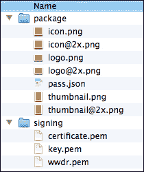

## 准备工作

您的通行证图形资产和`pass.json`文件应在自己的文件夹中，与之前创建的`.pem`文件在同一较高层文件夹中。

下面是一个文件夹结构的示例：

## 如何操作…

1.  将以下 JSON 代码保存到名为`manifest.json`的文件中。

    ```swift
    {
     "pass.json":"4f5cef0afe8171f736de367b202ca054abfb3663",
     "icon.png":"8c58c1fbf11f944c03b5cd5e41dc6d301263c1f7", "icon@2x.png":"ae3395b5e252610b02d51d52a534c700837ced2d"
    }

    ```

1.  此文件应包含一个 JSON 字典，其中每个键是通行证包中包含的文件名，值是该文件的 SHA1 哈希值。要确定 SHA1 值，打开您的终端应用，并输入以下命令：

    ```swift
    cd [Path to the folder containing the Pass package]
    opensslsha1 *

    ```

1.  将生成的哈希值放入`manifest.json`文件中。

1.  然后需要使用以下终端命令对清单文件进行数字签名，以生成签名文件，这将验证通行证的内容未被修改。这需要管理员权限，因此您需要输入管理员密码：

    ```swift
    sudo open sslsmime -binary -sign -certfile ../signing/wwdr.pem -signer ../sgning/certificate.pem -inkey ../signing/key.pem -in manifest.json -out signature -outform DER -passin pass:[Pass phrase provided when creating the key.pem]

    ```

1.  如果您的文件夹与前面的建议不同，您需要相应地更改`.pem`文件的路径。

1.  您的包文件夹现在应包括：

    +   图形资产

    +   `pass.json`

    +   `manifest.json`

    +   `signature`文件

    将您的包文件夹中的文件放入 ZIP 文件中。这可以通过选择所有文件并从**Finder**菜单中选择**文件** | **压缩**来完成。

1.  将生成的 ZIP 文件重命名，将文件扩展名更改为`.pkpass`。如果您已将文件名设置为隐藏，则可能更改的是文件名而不是扩展名。要显示文件扩展名，请从菜单中选择**Finder** | **首选项**，并启用**显示所有文件扩展名**。

恭喜！您现在拥有一张定制并签名的通行证。

## 它是如何工作的…

签名过程的目标是防止第三方在您的服务器和用户接收之间修改通行证。当创建`manifest.json`文件时，通行证包中的每个文件都会计算其哈希值并存储。如果任何文件的 内容发生变化，其哈希值也会发生变化，因此此`manifest.json`文件代表了一种检查通行证包文件是否被修改的简单方法。

然而，仅此还不够，因为第三方在修改包中的其他文件时可能会修改`manifest.json`文件。为了防止这种情况，使用公钥/私钥加密从`manifest.json`生成签名文件。您的私钥，只有您可以访问，用于生成文件，但任何拥有公钥的人都可以使用它来验证清单文件是否被篡改。

通过使用此过程，用户的设备可以确信接收到的通行证的来源是真实的，并且在传输过程中没有被更改。

由于此验证，确保只有 `manifest.json` 文件中指定的文件包含在压缩文件中非常重要。在 Finder 中单独选择文件，然后从菜单中选择压缩，是确保这一点的良好方法。如果您选择通过终端命令压缩整个文件夹的内容，请小心，因为这可能包括像 `.DS_Store` 这样的额外隐藏文件。

改变文件扩展名告诉系统将其视为通行证而不是常规 ZIP 文件。

## 还有更多...

理解签署通行证的过程和涉及的步骤很重要，但是手动执行这些步骤为每个创建的通行证可能不太可行。相反，它们应该成为生产用户通行证的自动化系统的一部分。

预构建的通行证创建实现正在出现，包括以下 PHPserver 代码：

[`github.com/tschoffelen/PHP-Passkit`](https://github.com/tschoffelen/PHP-Passkit)

# 通过电子邮件发送您的通行证（Medium）

通行证可以作为电子邮件附件发送，允许收件人查看通行证并将其添加到他们的 Passbook 应用中。

## 准备工作

下面的通行证电子邮件创建脚本可以从以下位置下载：

[`passkit.pro/ruby-email-script`](http://passkit.pro/ruby-email-script)

## 如何操作…

1.  将以下代码保存到名为 `send_pass_by_email.rb` 的文件中。

    ```swift
    require 'net/smtp'

    # This script accepts the following arguments: recipients name, recipients email address, path to Pass.
    # Example usage: 
    # ruby send_pass_by_email.rb "Peter Brooke" pbrooke@passkit.pro ../Pass-Example-Generic/Pass-Example-Generic.pkpass

    # Retrieve command line arguments
    recipientName = ARGV[0]
    recipientEmail = ARGV[1]
    passFilePath = ARGV[2]

    # Setup template email values
    senderName = "Passbook Example Company"
    senderEmail = "info@passkit.pro" 
    emailSubjectText = "New Employee Pass"
    emailBodyText = "Please find attached your new employee Pass"

    # Setup SMTP settings
    smtpDomain = "TO DEFINE. Eg. gmail.com"
    smtpLogin = "TO DEFINE. Eg. ......@gmail.com"
    smtpPassword = "TO DEFINE" 

    # Read file and base64 encode
    fileContent = File.read(passFilePath)
    encodedContent = [fileContent].pack("m")

    # The is used to separate the MIME parts, it can be anything
    # as long as it does not appear elsewhere in the email text
    boundaryMarker = "SEPARATINGSTRINGNOTFOUNDELSEWHERE"

    # Setup the email headers.
    headers =<<EOF
    From: #{senderName} <#{senderEmail}>
    To: #{recipientName} <#{recipientEmail}>
    Subject: #{emailSubjectText}
    MIME-Version: 1.0
    Content-Type: multipart/mixed; boundary=#{boundaryMarker}
    --#{boundaryMarker}
    EOF

    # Setup the email body
    body =<<EOF
    Content-Type: text/plain
    Content-Transfer-Encoding:8bit

    #{emailBodyText}
    --#{boundaryMarker}
    EOF

    # Setup the Pass attachment with the correct MIME Encoding
    attachment =<<EOF
    Content-Type: application/vnd.apple.pkpass; name=\"#{passFilePath}\"
    Content-Transfer-Encoding:base64
    Content-Disposition: attachment; filename="#{passFilePath}"

    #{encodedContent}
    --#{boundaryMarker}--
    EOF

    completeEmail = headers + body + attachment

    # Send email using your SMTP settings
    smtp = Net::SMTP.new 'smtp.gmail.com', 587
    smtp.enable_starttls
    smtp.start(smtpDomain, smtpLogin, smtpPassword, :login) do
      smtp.send_message(completeEmail, senderEmail, recipientEmail)
    end
    ```

1.  在 **# 设置模板电子邮件值** 部分下，输入发件人姓名、发件人电子邮件地址、主题和电子邮件正文的相关值。

1.  在 **# 设置 SMTP 设置** 部分下，输入用于发送电子邮件的 SMTP 电子邮件服务器和账户详情。这些可以从您的电子邮件客户端设置中找到，或者您可以使用像 Gmail 这样的免费电子邮件服务。

1.  此 Ruby 脚本接受三个参数，即收件人姓名、收件人电子邮件地址以及要附加的通行证的路径。打开终端，通过使用适当的参数调用脚本以发送启用通行证的电子邮件，如下例所示：

    ```swift
    ruby <Path to send_pass_by_email.rb> "Peter Brooke" pbrooke@passkit.pro <Path to Pass to attach .pkpass>
    ```

    以下截图显示了在 iOS 上最终电子邮件的外观：

    ,

    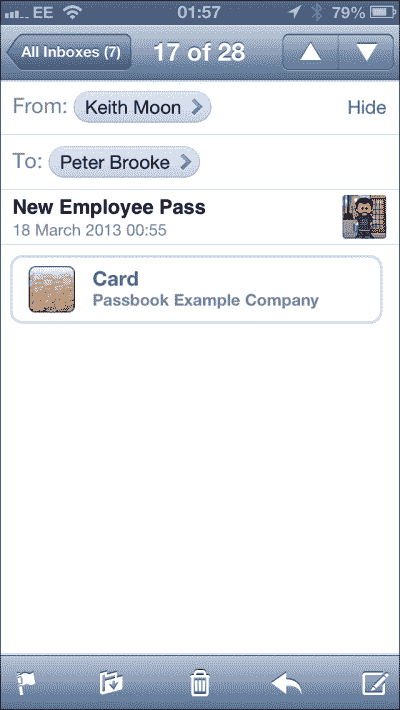

1.  如果您将此电子邮件发送到您有权访问的电子邮件账户，请在运行 iOS 6 的 iPhone 上的 Mail 应用或 OS X 10.8.2 上的 Mail 中打开此电子邮件，您将获得打开和查看通行证并将其添加到 Passbook 的选项。

## 它是如何工作的…

上面的脚本是用 Ruby 编写的，因为 Ruby 解释器默认安装在 OSX 上。

发送一个 iOS 和 OSX 都能理解并展示给用户的通行证附件，需要指定附件中的特定 MIME 类型。此 MIME 类型如下：

application/vnd.apple.pkpass

此脚本或类似脚本可用于通过电子邮件自动向大量用户发送通行证。

# 通过网页链接（Medium）发送您的通行证

您可以通过从您的网站链接到 Pass 来向用户交付 Pass，例如，从确认页面链接。

## 准备工作

您需要访问自己的 Web 服务器，或者具有 FTP 访问权限的共享托管空间。以下说明适用于 Apache Web 服务器。Mac OSX 内置了 Apache Web 服务器，可以使用。这曾经可以在 **系统偏好设置** 中的 **共享** 菜单下找到，然而自 OSX 10.8 以来，它只能通过命令行激活。您可以从终端运行以下命令来启动 Web 服务器：

```swift
sudoapachectl start

```

该服务器的根目录位于 `/Library/WebServer/Documents/`。

我们将创建的文件可以从以下位置下载：

[`passkit.pro/apache-mime-type`](http://passkit.pro/apache-mime-type)

## 如何操作…

1.  将以下 MIME 类型指令保存到名为 `htaccess` 的文件中：

    ```swift
    AddType application/vnd.apple.pkpass pkpass
    ```

1.  创建一个链接到 Pass 的 HTML 页面，如下所示，并将其保存为 `index.html`：

    ```swift
    Get your employee pass <a href='Pass-Example-Generic.pkpass'>HERE</a>
    ```

1.  将 `htaccess` 文件、`index.html` 文件和 Pass 文件上传到您的 Web 服务器上的一个公开可访问的目录。如果您在本地运行 Web 服务器，请将这些文件放置在 Web 服务器根目录中。

1.  将 `htaccess` 文件重命名为 `.htaccess`。（文件可能会消失，因为以 `.` 开头的文件被视为隐藏文件。）

1.  在您的 iPhone 上的 Mobile Safari 中，访问您 Web 服务器上 `index.html` 文件的 URL。

1.  点击 Pass 的链接，Mobile Safari 将显示 Pass，以便可以将其添加到 Passbook。

## 它是如何工作的…

为了让 Safari 或 Mobile Safari 浏览器理解 Pass 文件并将其显示给用户，您的 Web 服务器需要以 `application/vnd.apple.pkpass` 的 MIME 类型呈现文件。

`.htaccess` 文件告诉 Web 服务器如何处理其所在文件夹中的文件。在这种情况下，它指示 Web 服务器通知任何访问的 Web 浏览器，具有 `pkpass` 文件扩展名的文件应被视为 Pass。`.htaccess` 必须放置在每个包含 Pass 的文件夹中。

只有支持此 MIME 类型的浏览器用户才会出现 Pass 对话框，其他人将被提示下载 Pass。虽然 Safari 和 Mobile Safari 支持 Pass，但其他第三方浏览器可能不支持。然而，iOS 上当前版本的 Chrome 和 Facebook 应用程序中的内置浏览器都支持 Pass 显示。

## 还有更多…

如果您希望添加对 Pass MIME 类型的服务器端支持，您可以在 Apache Web 服务器的 `mimes.type` 文件中添加一个条目，该文件位于 `conf` 目录中。在文本编辑器中打开该文件，并在正确的字母顺序中添加以下行：

```swift
application/vnd.apple.pkpass pkpass
```

您需要重新启动服务器才能使更改生效。

# 通过应用程序（中等）交付 Pass

Pass 可以通过配套的 iOS 应用程序进行交付。该应用程序将使用 Apple 的 PassKit 框架提供用户界面，使用户能够查看 Pass 并选择将其添加到他们的 Passbook 中。

## 准备工作

要遵循这些步骤，假设您有一些 Objective-C 和创建 iOS 应用程序的经验。

按照以下方式创建的示例项目可以从以下位置下载：

[`passkit.pro/example-app`](http://passkit.pro/example-app)

此应用程序不使用 **自动引用计数** (**ARC**)，如果您在 ARC 环境中使用此代码，请删除对释放对象的任何调用。

## 如何操作…

1.  打开 Xcode 并创建一个新的单视图项目。示例项目的设置选项如下截图所示：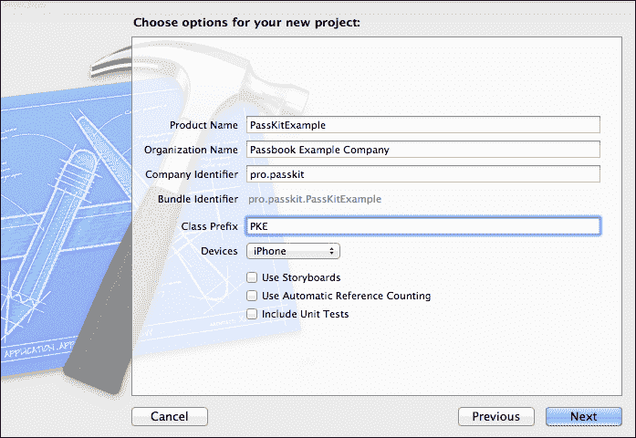

1.  在目标设置中，在 **构建阶段** 下，展开 **链接二进制与库** 部分，并点击 **+** 按钮。搜索 PassKit 框架并将其添加。之后，链接库列表应如下所示：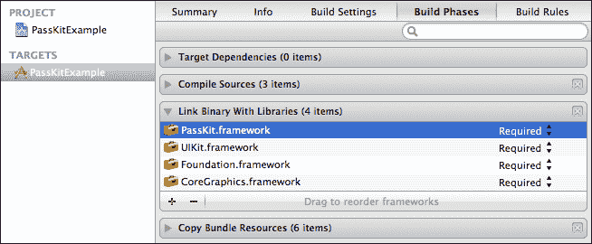

1.  将您之前创建的通行证拖动到项目导航器中，添加到项目中，例如，此通行证名为 `Pass-Example-Generic.pkpass`。

    ```swift
    In PKEViewController.h, replace the existing code with the following:
    #import <UIKit/UIKit.h>
    #import <PassKit/PassKit.h>

    @interface PKEViewController : UIViewController<PKAddPassesViewControllerDelegate>

    @property (nonatomic, retain) IBOutletUIButton *addPassButton;

    - (IBAction)addPassButtonPressed:(id)sender;

    @end
    ```

1.  在 **PKEViewController.m** 中替换现有代码为以下内容：

    ```swift
    #import "PKEViewController.h"

    @interface PKEViewController ()

    @property (nonatomic, retain) PKPass *genericPass;

    @end

    @implementation PKEViewController

    - (void)viewDidLoad
    {
        [super viewDidLoad];
      // Do any additional setup after loading the view, typically from a nib.

        // Create the PKPass from the bundled file
        // In a real App this may be retrive from the network.

    NSString *passFilePath = [[NSBundle mainBundle] pathForResource:@"Pass-Example-Generic" ofType:@"pkpass"];
    NSData *passData = [[NSDataalloc] initWithContentsOfFile:passFilePath];
    NSError *passError;
        _genericPass = [[PKPass alloc] initWithData:passData error:&passError];
        [passData release];

    }

    - (void)didReceiveMemoryWarning
    {
        [super didReceiveMemoryWarning];
        // Dispose of any resources that can be recreated.
    }

    - (void)dealloc {

        [_addPassButton release];
        [_genericPass release];

        [super dealloc];
    }

    #pragma mark - IBAction Methods

    - (IBAction)addPassButtonPressed:(id)sender {

        if (![PKPassLibrary isPassLibraryAvailable]) {

    NSLog(@"Passbook not available on this device");
            return;

        }

    PKAddPassesViewController *addPassViewController = [[PKAddPassesViewController alloc] initWithPass:self.genericPass];
    addPassViewController.delegate = self;

        [self presentViewController:addPassViewController animated:YES completion:^{

      NSLog(@"Add Pass view controller presented");

        }];

        [addPassViewController release];
    }

    #pragma mark - PKAddPassesViewControllerDelegate Methods

    - (void)addPassesViewControllerDidFinish:(PKAddPassesViewController *)controller {

        // Check if the Pass is now in the Pass Library

    PKPassLibrary *passLibrary = [[PKPassLibrary alloc] init];

        if ([passLibrary containsPass:self.genericPass]) {

            // If the Pass is now in the Library, we can't re-add it, only view it.
            [self.addPassButton setTitle:@"View Pass in Passbook" forState:UIControlStateNormal];

        } 

        [self dismissViewControllerAnimated:YES completion:^{

      NSLog(@"Add Pass view controller dismissed");

        }];

    }

    @end
    ```

    打开 **PKEViewController.xib**，在视图中放置一个标题为 **添加通行证到 Passbook** 的 `UIButton`，并将其连接到 `IBOutlet` **addPassButton** 和 IBAction**addPassButtonPressed** 以便发送触摸事件：

    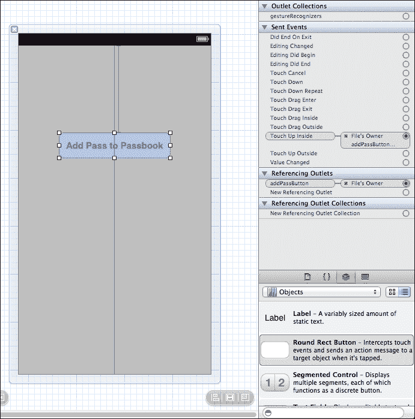

1.  在 iPhone 模拟器中运行项目。点击 **添加通行证到 Passbook** 按钮将启动 PassKit UI，显示通行证并允许用户将其添加到 Passbook 应用中。然而，在这个阶段，通行证将不会成功添加到 Passbook 应用中，因为我们需要使用正确的配置文件。

1.  要将应用程序构建到 iPhone 上，我们需要一个合适的配置文件。因此，您需要登录到 Apple 开发者中心：

    [`developer.apple.com/account/ios/profile/profileList.action`](https://developer.apple.com/account/ios/profile/profileList.action)

1.  在 **配置** 下，点击 **新建配置文件** 按钮，并按照以下步骤操作：

1.  为开发配置文件选择一个名称。

1.  在您的证书旁边打勾。

1.  选择您之前为通行证启用并生成证书的 App ID。

1.  选择您将要使用的设备。

1.  点击 **提交**。

1.  生成后，下载配置文件并将其打开以加载到 Xcode 中。

1.  在 **目标** 设置中，在 **信息** 下，确保捆绑标识符与在配置文件创建过程中之前创建并选择的 App ID 相匹配。

1.  在 **构建设置** 中，在 **代码签名身份** 下，确保在 **调试** 下选择了上面创建的配置文件。

1.  构建到设备，并测试所显示的通行证是否成功添加到 Passbook。

## 工作原理…

示例应用程序使用 PassKit 框架向用户展示框架提供的视图控制器，监听用户完成与视图控制器交互时的代理回调，如果通行证成功添加到 Passbook，则更改按钮的标题。

使用以下代码，从`NSData`对象创建`PKPass`对象：

```swift
NSString *passFilePath = [[NSBundle mainBundle] pathForResource:@"Pass-Example-Generic" ofType:@"pkpass"];
NSData *passData = [[NSDataalloc] initWithContentsOfFile:passFilePath];
NSError *passError;
_genericPass = [[PKPassalloc] initWithData:passData error:&passError];
[passData release];
```

为了简化起见，在这个示例中，通行证是从与应用程序捆绑的文件中加载的。在现实世界的应用程序中，通行证更有可能从网络资源下载。

`PKPassLibrary`提供了访问 Passbook 中包含的通行证的方法。它还提供了一个名为`isPassLibraryAvailable`的类方法，可以告诉您 Passbook 是否存在于该设备上，例如，Passbook 不在 iPad 上。此方法在示例应用程序中用于决定是否显示通行证视图控制器。

```swift
if (![PKPassLibrary isPassLibraryAvailable]) {
    NSLog(@"Passbook not available on this device");
    return;       
}
```

## 还有更多...

PassKit 框架的更多文档可以在以下位置找到：

[`developer.apple.com/library/ios/#documentation/UserExperience/Reference/PassKit_Framework/`](https://developer.apple.com/library/ios/#documentation/UserExperience/Reference/PassKit_Framework/)

# 在 Passbook 应用内更新通行证（高级）

苹果为用户添加到 Passbook 的通行证提供了一种更新机制。这个过程涉及向用户的设备发送推送通知，并实现一个 REST API，该 API 将响应用户设备的请求并提供相关的更新通行证信息。

## 准备工作

更新通行证的第一阶段是向用户的设备发送推送通知，以启动通行证更新过程。发送**苹果推送通知**（**APNs**）的过程超出了本书的范围，并假设发送适当 APN 的功能是可用的。有关 APNs 的更多信息可以在苹果的文档中找到：

[`developer.apple.com/library/ios/#documentation/NetworkingInternet/Conceptual/RemoteNotificationsPG/Introduction/Introduction.html`](https://developer.apple.com/library/ios/#documentation/NetworkingInternet/Conceptual/RemoteNotificationsPG/Introduction/Introduction.html)

在实现所需的 REST API 时，我们将使用 GIT 源代码管理工具。如果您尚未安装和设置 GIT，请遵循 GitHub 教程：

[`help.github.com/articles/set-up-git`](https://help.github.com/articles/set-up-git)

## 如何做到这一点...

1.  打开终端，将目录更改为包含服务器代码的目录。

1.  我们将使用开源的 Passbook 服务器示例，由 Mattt Thompson 使用 Ruby on Rails 构建（[`github.com/mattt`](https://github.com/mattt)），因此我们首先需要从存储库克隆服务器代码，以下命令：

    ```swift
    git clone https://github.com/keefmoon/passbook_rails_example.git

    ```

1.  您需要安装 Xcode 命令行工具，您可以通过打开 Xcode 并在菜单中转到 **Xcode** | **首选项** | **下载**，然后点击 **命令行工具** 旁边的 **安装** 来完成此操作。

1.  切换到包含代码的目录并准备 Ruby 应用程序：

    ```swift
    cd passbook_rails_example
    bundle

    ```

1.  如果您遇到与 Postgres 相关的错误，请使用以下命令单独安装它，然后再次运行 `bundle` 命令。（此命令需要管理员权限。）

    ```swift
    sudo env ARCHFLAGS="-arch x86_64" gem install pg

    ```

1.  根据安装的 Ruby 版本，您可能需要输入额外的命令。Mountain Lion 随带 Ruby 1.8.7 并需要额外的命令，但如果您已升级到 1.9.2 或更高版本，则不需要以下命令。（需要管理员权限。）

    ```swift
    sudo gem installrdoc-data
    sudo rdoc-data --install

    ```

1.  在文本编辑器中打开 `[服务器代码路径]/db/seeds.rb`。此文件中的内容将用于初始化数据库，因此用与您之前创建的 Pass 匹配的详细信息替换示例数据，确保通行证类型标识符和序列号正确，但至少更改通行证数据的一部分。在以下示例中，我将彼得·布鲁克的职位从 `Chief Pass Creator` 更改为 `CTO`。

    ```swift
    pass = Passbook::Pass.create(pass_type_identifier: "pass.pro.passkit.example.generic", serial_number: "0000001", authentication_token: "UniqueAuthTokenABCD1234")
    pass.data = {
      staffName: "Peter Brooke",
      telephoneExt: "9779",
      jobTitle: "CTO",
      managersName: "Paul Bailey",
      managersExt: "9673",
      expiryDate: "2013-12-31T00:00-23:59"
    }
    pass.save

    pass.registrations.create(device_library_identifier: "123456789", push_token: "00000000 00000000 00000000 00000000 00000000 00000000 00000000 00000000")
    ```

1.  在 `seeds.rb` 文件中，为每个添加的通行证指定一个唯一的认证令牌。在先前的示例中使用了 **UniqueAuthTokenABCD1234**，尽管在实际应用中这将是自动生成的。

1.  将此服务器代码部署到免费的 Heroku 服务是使其可用于测试最快、最简单的方法。访问 [`www.heroku.com`](http://www.heroku.com) 并注册一个账户。

1.  下载并安装 HerokuToolbelt for OSX：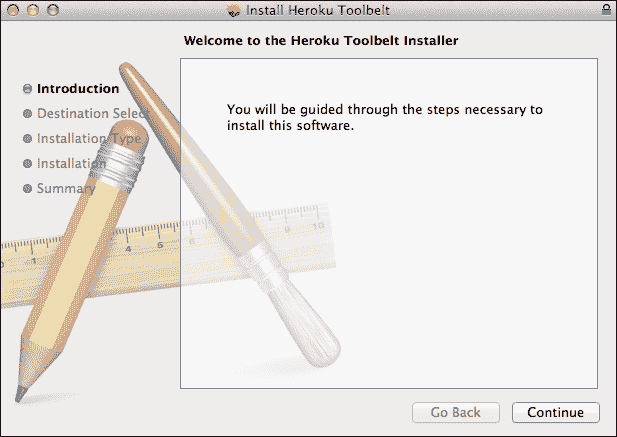

1.  打开终端并登录到 Heroku。然后创建一个新的 Heroku 应用程序并将服务器代码推送到它。Heroku 将为您的应用程序生成一个名称；例如 [`frozen-bayou-9500.herokuapp.com/`](http://frozen-bayou-9500.herokuapp.com/).

    ```swift
    heroku create
    git push heroku master
    heroku run rake db:createdb:migratedb:seed
    ```

1.  对于我们之前创建的用于通过服务器更新的通行证，我们需要在通行证中包含相关信息。（在以下代码示例中，请注意示例网络服务器在 `webServiceURL` 中有额外的 `passbook` 路径组件。）打开之前创建的 `pass.json` 并添加两个顶级键及其相关值，重新生成 `manifest.json`，重新生成 `signature` 文件，并重新压缩包文件。

    ```swift
    "authenticationToken" : "UniqueAuthTokenABCD1234",
    "webServiceURL" : "http://frozen-bayou-9500.herokuapp.com/passbook",
    ```

## 它是如何工作的…

我们上面实现的服务器是为了方便通行证更新过程，这涉及到用户设备与您的服务器之间的双向通信。

当用户添加包含 `webServiceURL` 和 `authenticationToken` 键的 Pass 到 Passbook 时，设备会与您的服务器注册，传递一个用于进一步通信验证的设备库 ID，用于验证初始通信的认证令牌，以及用于发送 APN 时使用的推送令牌。

当 Pass 中包含的信息发生变化时，以我们的例子来说，这可能是指彼得·布鲁克晋升，你的服务器会向设备发送一个 APN，使用它收到的推送令牌。（发送此推送通知超出了本书的范围。）这会提示设备向你的服务器请求自上次请求以来所有更新的 Pass 列表。从这个列表中，设备依次请求每个 Pass 的更新信息。最后，服务器响应更新后的 Pass 信息，并更新后的 Pass 呈现给用户。

## 还有更多…

关于 Pass 更新过程的更多信息可以在苹果文档中找到：

[`developer.apple.com/library/ios/#documentation/UserExperience/Conceptual/PassKit_PG/Chapters/Updating.html`](https://developer.apple.com/library/ios/#documentation/UserExperience/Conceptual/PassKit_PG/Chapters/Updating.html)

上述服务器还实现了 REST API 的完整规范：

[`developer.apple.com/library/ios/#documentation/PassKit/Reference/PassKit_WebService/WebService.html`](https://developer.apple.com/library/ios/#documentation/PassKit/Reference/PassKit_WebService/WebService.html)

在浏览器中测试网络服务端点时，除了规范中描述的任何授权头之外，还需要包含以下请求头：

```swift
Accept: application/json
```

在实际生产环境中，网络服务必须使用 HTTPS，但是你可以允许你的设备在开发测试中使用 HTTP。如果你的设备已经通过 Xcode 启用开发，你将在应用设置下有一个额外的**开发者**部分。在**开发者**部分，在**PassKit 测试**下，打开**允许 HTTP 服务**：

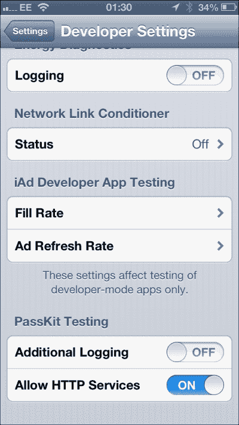
