# 第二章：创建新的 iOS 社交项目

通过本章，我们开始我们的编码之旅。我们将从头开始构建我们的社会应用。

在本章中，我们将学习以下内容：

+   **创建 Facebook App ID**：这是与我们的 API 一起使用的关键，用于与 Facebook 平台通信。

+   **下载 Facebook SDK**：iOS SDK 可以从两个不同的渠道下载。我们将探讨这两个渠道。

+   **创建新的 XCode 项目**：我将简要介绍如何创建新的 XCode 项目以及 IDE 环境的描述。

+   **将 Facebook iOS SDK 导入到我们的 XCode 项目中**：我将逐步介绍如何将 Facebook SDK 导入到我们的 XCode 项目中。

+   **熟悉 Storyboard 以构建更好的界面**：这是对苹果工具的简要介绍，用于构建我们的应用程序界面。

在开始任何工作之前，我们应始终检查我们是否有合适的工具。为了开始构建我们的应用程序，我们需要两样东西：

+   **Mac OS 机器**：XCode 仅在 Mac 上运行（官方）

+   **XCode**：这是用于构建我们的社会应用的编辑器

本书的目标是解释如何将 iOS Facebook SDK 集成到我们的应用程序中。使用 XCode 和 Objective-C 概念超出了本书的范围。本章将简要介绍 XCode，因为我们假设读者已经熟悉苹果开发环境和其功能。我们将构建一个用于图书跟踪的社会应用。

# 创建 Facebook App ID

为了使用他们的 SDK 与 Facebook 平台进行通信，我们需要为我们的应用程序提供一个标识符。这个标识符，也称为 Facebook App ID，将使我们能够访问平台；同时，我们还将能够收集大量有关其使用情况、印象和广告的信息。

要获取 Facebook App ID，我们需要一个 Facebook 账户。如果您还没有，您可以通过以下页面创建一个 Facebook 账户：[`www.facebook.com`](https://www.facebook.com)：

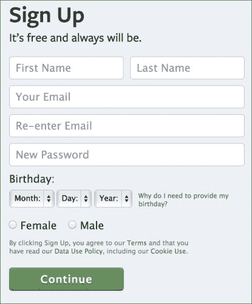

上一张截图显示了新的 Facebook 账户注册表单。填写所有字段后，您将能够访问 Facebook 开发者门户。

一旦我们登录到 Facebook，我们需要访问开发者门户。您可以在[`developers.facebook.com/`](https://developers.facebook.com/)找到它。我已经提到了开发者门户在开发我们的社会应用中的重要作用。

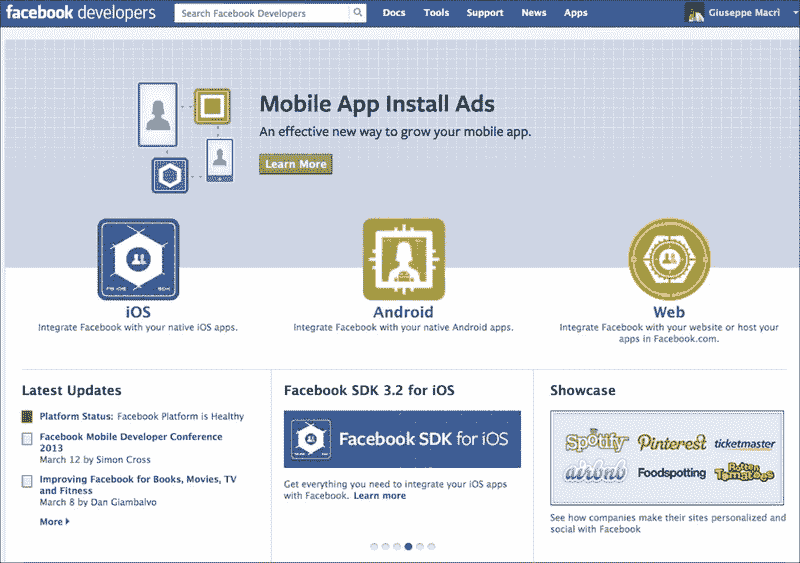

上一张截图显示了 Facebook 开发者门户。主要部分，即顶部部分，是专门用于当前 SDK 的。在顶部蓝色栏上点击**Apps**链接，它将重定向我们到 Facebook 应用仪表板。

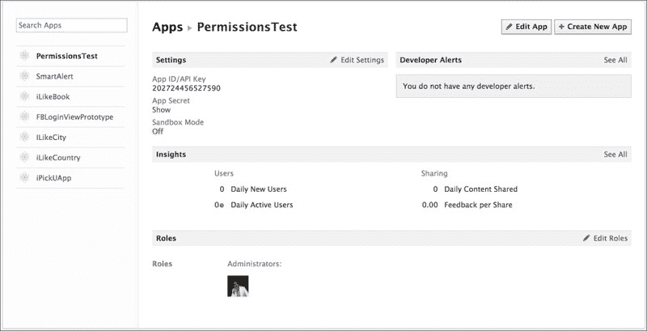

上一张截图显示了 Facebook 应用仪表板。在左侧，我们有一个应用列表；在页面中心，我们可以看到列表中当前选定应用的详细信息。页面显示了应用的设置和分析（**洞察**）。

为了创建一个新的 Facebook App ID，您可以在应用仪表板的右上角点击**创建新应用**。

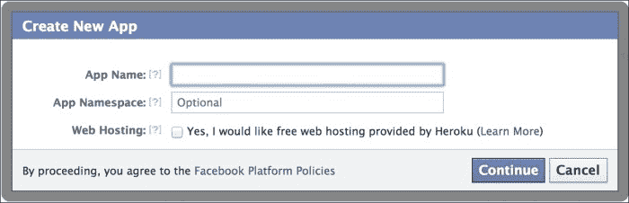

上一张截图显示了创建 Facebook App ID 的第一步。在提供**应用名称**时，请确保该名称尚未存在或违反任何版权法；否则，Facebook 将删除您的应用。**应用命名空间**是我们想要在 Open Graph 结构中定义自定义对象和/或操作时需要的东西。**应用命名空间**主题不包含在本书中。Web 托管在创建社交 Web 应用时非常有用。如果需要，Facebook 可以与其他提供商合作为我们创建 Web 托管。这部分内容将不会在本书中讨论；因此，请不要为您的应用选择此选项。

一旦提供了所有信息，我们就可以继续下一步。请填写表格，并继续到下一个步骤。

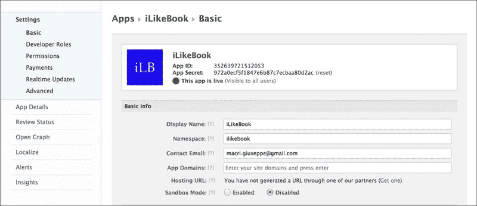

在页面顶部，我们可以看到**App ID**和**App Secret**。这是我们新社交应用最重要的信息。**App ID**是我们可以分享的信息，而**App Secret**则不可以。

在我们新的 Facebook 应用页面中心，我们有基本信息字段。不要担心**命名空间**、**应用域名**和**托管 URL**；这些字段是针对 Web 应用的。**沙盒模式**仅允许开发者使用当前应用。开发者通过左侧边栏上的**开发者角色**链接进行指定。

向下移动，选择应用的类型。对于我们的目标，选择**原生 iOS 应用**。您可以选择多个类型并创建多平台社交应用。

一旦您选择了**原生 iOS 应用**，您将看到一个以下表格：

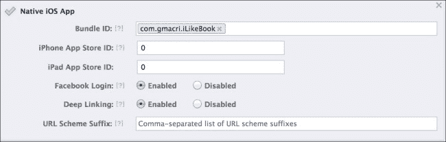

我们现在需要提供的唯一字段是**包标识符**。**包标识符**与 XCode 设置有关。确保 Facebook 的**包标识符**将与我们的**XCode 社交应用包标识符**匹配。包标识符的格式始终类似于`com.MyCompany.MyApp`。

**iPhone**/**iPad App Store IDs**是您在 App Store 发布应用时的 App Store 标识符。如果您在保存更改后没有提供任何这些标识符，您将收到一个警告消息；然而，请不要担心，我们新的**App ID**现在可以使用了。

保存您的更改，并准备好开始我们的开发之旅。

# 下载 Facebook iOS SDK

iOS Facebook SDK 可以通过两个不同的渠道下载：

+   **Facebook 开发者门户**：用于下载安装包

+   **GitHub**：用于下载 SDK 源代码

使用 Facebook 开发者门户，我们可以下载 iOS SDK 作为安装包。如以下截图所示访问[`developers.facebook.com/ios/`](https://developers.facebook.com/ios/)并点击**下载 SDK**以下载安装包。

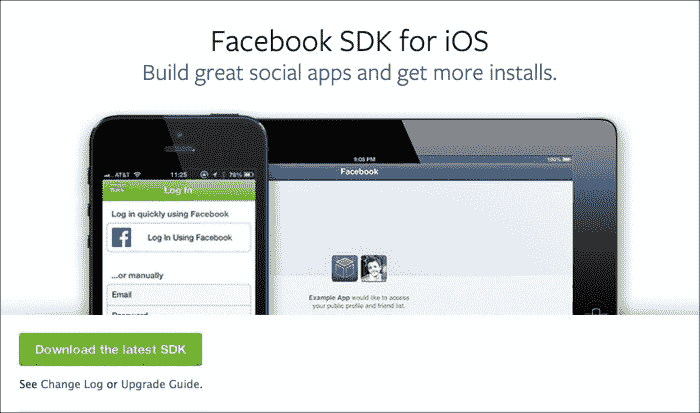

安装包安装后，将在我们的`Documents`文件夹中创建一个新的**FacebookSDK**文件夹。

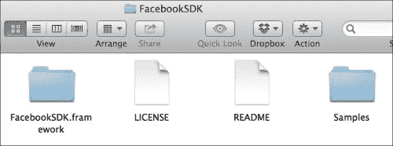

之前的截图显示了 iOS SDK 安装包的内容。在这里，我们可以看到四个元素：

+   **FacebookSDK.framework**：这是我们将在 XCode 社交项目中导入的框架

+   **LICENSE**：它包含有关框架许可和使用的相关信息

+   **README**：它包含有关框架安装的所有必要信息

+   **Samples**：它包含一组有用的示例项目，这些项目使用了 iOS 框架的功能

使用安装包，我们只有编译后的文件可以使用，没有原始源代码。

可以通过 GitHub 渠道下载源代码。要克隆`git repo`，你需要一个 Git 客户端，无论是终端还是图形用户界面。iOS SDK 框架`git repo`位于[`github.com/facebook/facebook-ios-sdk.git`](https://github.com/facebook/facebook-ios-sdk.git)。我更喜欢以下命令中使用的终端客户端：

```swift
git clone https://github.com/facebook/facebook-ios-sdk.git
```

在我们克隆了 repo 之后，目标文件夹将如下截图所示：

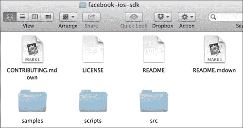

之前的图片显示了**iOS SDK GitHub repo**的内容。在这个 repo 中出现了两个新元素：**src**和**scripts**。**src**包含需要编译的框架源代码。**scripts**文件夹包含编译源代码所需的所有必要脚本。

使用 GitHub 版本可以使我们在社交应用中始终保持框架的最新状态，但就本书的范围而言，我们将使用安装包。

# 创建新的 XCode 项目

我们创建了一个 Facebook App ID 并下载了 iOS Facebook SDK。现在是时候使用 XCode 开始我们的社交应用程序了。

1.  如果启用了**在 XCode 启动时显示此窗口**，应用程序将提示欢迎对话框！[](img/vIhM2pXb.jpg)

1.  选择**创建新的 XCode 项目**选项。如果欢迎对话框已禁用，请导航到**文件** | **新建** | **项目…**！[](img/V0Ysg5Oh.jpg)

1.  选择要工作的项目类型是下一步，如下面的截图所示！[](img/hccaL07b.jpg)

1.  左侧的条目定义了项目是针对桌面还是移动设备。导航到**iOS** | **应用程序**并选择**单视图应用程序**项目类型！[](img/fSaxx9pR.jpg)

之前的截图显示了新项目的详细信息。为新项目提供以下信息：

+   **产品名称**：这是我们应用程序的名称

+   **组织名称**：即使您不属于任何组织，我也强烈建议填写这部分，因为此字段将是我们的**Bundle Identifier**的一部分。

+   **公司标识符**：虽然这仍然是可选的，但我们绝对应该填写它，以尊重**Bundle Identifier**的最佳实践格式。

+   **类前缀**：此前缀将被添加到我们将在项目中创建的每个类之前。

+   **设备**：我们可以选择应用程序的目标设备；在这种情况下，是一个 iPhone，但我们也可以选择 iPad 或通用。

+   **使用故事板**：我们将使用故事板来创建应用程序的用户界面。

+   **使用自动引用计数**：此功能使**Objective C 垃圾回收器**能够进行引用计数。

+   **包含单元测试**：如果选中，XCode 还将为我们的应用程序创建一个单独的项目目标以进行单元测试；这不是本书的内容。

保存新项目。我强烈建议勾选**为此项目创建本地 git 仓库**选项，以便跟踪更改。一旦项目处于版本控制之下，我们还可以决定使用 GitHub 作为远程主机来存储我们的源代码。

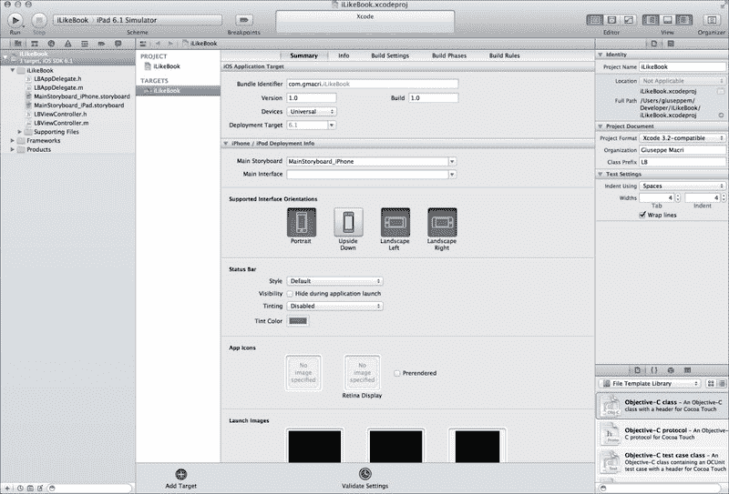

# 将 Facebook SDK 导入到应用程序项目中

我已经提到，我们将使用安装包导入 Facebook SDK。安装包将在**Documents**文件夹中创建一个**FacebookSDK**文件夹。在文件夹中，找到**FacebookSDK**. **framework**文件夹，并将其拖放到您的 XCode 项目中。将框架拖放到**Project Navigator**的**Frameworks**部分，如图所示：

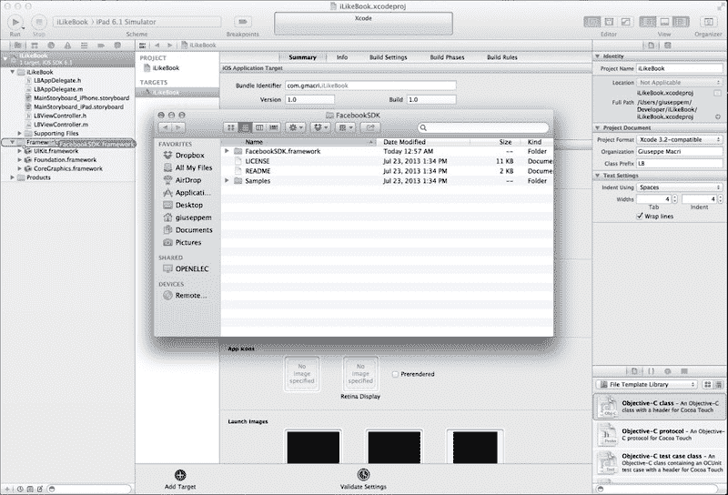

当提示导入设置时，请勾选**将项目复制到目标组文件夹中（如有必要）**选项。

使用**Finder**在您的项目目录中定位**Facebook SDK**文件夹。您可以通过在 XCode 中右键单击并导航到**SDK** | **在 Finder 中显示**来找到文件夹位置。在**Framework**文件夹中，找到**Resources**文件夹并打开它。

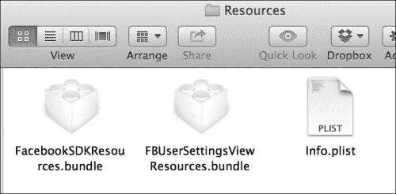

就像我们对 Facebook 框架所做的那样，将`FacebookSDKResources.bundle`拖放到 XCode 的**Frameworks**部分。它将用于在 iOS 项目中创建 UI 对象。仍然检查是否需要启用**将项目复制到目标组文件夹中（如有必要）**选项。

SDK 依赖于 XCode 中已经包含的三个框架，例如 AdSupport、Accounts 和 Social。我们需要将这些框架添加到我们的项目中。在目标**摘要**面板中，找到**链接的框架和库**，点击**+**，将显示所有可用的框架列表。

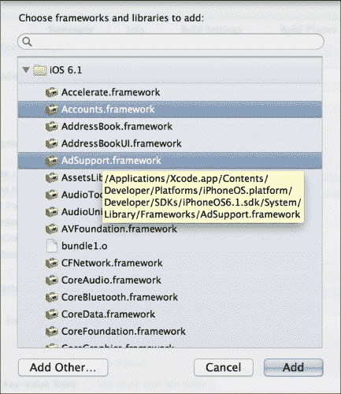

选择之前图像中提到的框架，并点击**添加**。这三个包将被添加到我们的根项目文件夹中。为了保持我们的项目有序，我们可以将这三个框架移动到项目的**Frameworks**部分。

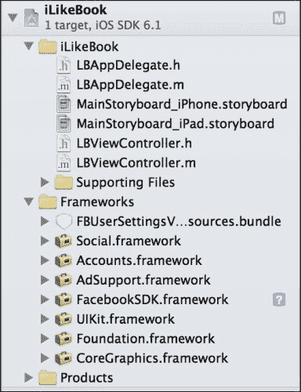

下一步是添加**SQLite**和**-ObjC 链接器标志**。在**Summary**面板中，选择**Targets**中的项目，在右侧找到**Build Settings**，在下面的条中检查**All**和**Levels**。现在在搜索栏中输入`other link`。结果应该看起来像下面的屏幕截图。

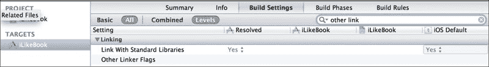

然后选择**Other Linker Flags**条目，双击第三列，即**Resolved**之后的列。向其中添加以下标志：

+   **-ObjC**

+   **-lsqlite3.0**

现在，我们需要将 Facebook 框架设置为使用我们之前创建的 Facebook App ID。在**Navigator**中，定位到`Application-Info.plist`文件；您可以在项目的**Navigator** | **Application Folder** | **Supporting Files**中找到它。

创建一个新的条目，使用`FacebookAppID`键；值需要是一个字符串类型，包含您之前创建的 Facebook App ID。

我们还需要确保应用程序接收到基于 Web 的身份验证流程（`OAuth`）的回调 URL。为了实现这一点，创建一个新的 URL 类型数组条目，包含一个单独的项目。向数组项目添加一个新的**URL Schemes**数组，第一个条目将是一个以`fb`前缀的 Facebook App ID 的字符串键。您可以在下面的屏幕截图中看到结果：

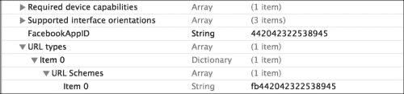

新的社会 iOS 项目现在已准备就绪。在下一章中，我们将开始编写新的功能代码。

# 熟悉 Storyboard 以构建更好的界面

**Storyboard**是构建 iPhone/iPad 用户交互和界面的优秀工具。使用它，我们能够在开始编写代码之前绘制整个数据流和交互。

Storyboard 是在 iOS 5 版本中引入的。在此之前，唯一可用的构建 UI 的格式是 XIB 格式。XIB 格式允许一次构建一个界面，而 Storyboard 允许您跨多个界面工作，并使用动作（**segues**）将它们连接起来。

Storyboard 并不是要完全取代 XIB 格式；实际上，它们可以轻松共存。

下面的屏幕截图中显示了 Storyboard 的实际应用示例。Storyboard 中的每个元素都称为**场景**。场景通过 segues 连接。两个场景嵌入在导航控制器中，截图中最左侧的对象；两个主要控制器通过每个场景中按钮关联的两个 segues 相互连接。

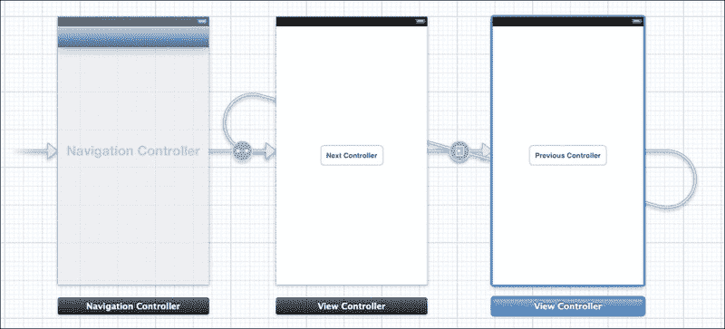

对于这个项目，我们将利用 Storyboard 功能来构建应用程序界面。

# 摘要

在本章中，我们学习了如何创建一个新的 Facebook App ID，这个 ID 将用于在社交平台上识别我们的社交应用。我们还创建了一个新的 iPhone 项目，并下载了 Facebook iOS SDK。为了使用 Facebook iOS SDK，我们必须在我们的社会项目中导入几个框架，并设置一些特定的链接器标志，这些标志将由 Facebook SDK 使用。同样重要的是要记住，我们需要在我们的应用程序中使用之前创建的 Facebook App ID；否则，Facebook SDK 将抛出异常，因为 Facebook App ID 用于与社交平台通信。

一个重要的工具，它也将被用来构建我们的社会项目，就是 Storyboard。Storyboard 将帮助用户创建我们的图形用户界面并定义用户交互。
