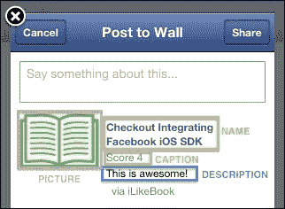

# 第五章. 墙上发布

在本章中，我们将实现 UI 和逻辑，使应用程序能够发布当前用户及其朋友的墙上的帖子。

我们将开始实现用户界面，使用户能够在实际将数据发送到 Facebook 平台之前审查要发布的信息。我们将定义在当前用户墙上发布帖子并自定义发布对话框的步骤。

我们将学习如何在帖子中标记朋友，为帖子添加上下文（例如，位置），并在平台上上传图片。

# 创建发布对话框界面

在 Facebook 平台上创建帖子意味着在 Facebook 新闻源上发布一个动作。这可以通过 Open Graph API 完成，该 API 在 Facebook SDK 2.x 中可用，与框架 3.x 版本的新原生或 Web 对话框相比。请注意，您仍然可以使用 Open Graph API 在您的新闻源上发布。

为了在 Facebook 新闻源上发布，我们首先需要请求用户允许我们在他们的新闻源上写入；更具体地说，是`publish_actions`权限。一旦应用程序被授予权限，我们可以使用以下组件：

+   `FBNativeDialogs`：此功能用于提供原生用户界面。它适用于 iOS 6 及以上版本，前提是在设备上设置了 Facebook 账户。

+   `FBWebDialogs`：此功能用于展示 Web 对话框以在 Open Graph 上发布。

原生对话框是分享平台信息的理想选择，因为它们需要编写的代码更少，并提供了更多开箱即用的功能；例如，位置标签和隐私设置（见以下截图）。


新闻源分享对话框

上一张截图显示了一个带有新闻源内容的原生对话框，并且还提供了通过**添加位置**按钮标记当前位置和使用**朋友**按钮更改隐私设置的能力。

## 创建书籍模型

在开始实现实际的分享功能之前，我们需要一种方法将信息从`LBViewController`（书籍信息控制器）传递到 Facebook 视图控制器。为了传递这些信息，我们将创建一个新的模型类。模型是一种用于存储信息且不关联任何逻辑的类。

要创建一个新的模型类，在项目导航器中的主文件夹（即`Group`）上右键单击，创建一个新的组，并将其命名为`models`。在`models`上右键单击并创建一个新文件。选择**Objective-C**类并将**Class**字段设置为`LBBook`，它是`NSObject`的子类。保存这些设置后，我们将在`models`组中获得新的`LBBook`类。以下截图显示了创建新的`model`书籍类后的项目结构：


添加 LBBook 类后的项目结构

我们需要填充`model`类以包含书籍信息所需的属性。我们需要以下属性：

+   `标题`

+   `作者`

+   `评论`

+   `分数`

打开 `LBBook.h` 文件并添加以下代码片段中的属性：

```swift
#import &lt;Foundation/Foundation.h&gt;
 @interface LBBook : NSObject
 @property (strong, nonatomic) NSString *title;
 @property (strong, nonatomic) NSString *author;
 @property (strong, nonatomic) NSString *review;
 @property (strong, nonatomic) NSNumber *vote;
 @end
```

我们不需要自定义 `LBBook.m` 文件。如前所述，我们只将此类用作容器。对于此模型不需要更多编码。

## 控制器之间的信息传递

我们需要通过 `LBViewController` 接口收集用户输入。我们可以采取两种不同的方法。第一种方法需要为 `LBViewController` 中的每个 UI 输入组件创建引用，并在用户点击 **Go Social** 按钮时收集数据。另一种技术需要在用户通过界面编辑书籍信息时更新书籍信息。两种技术都需要将 `LBBook` 类的实例作为 `LBViewController` 的私有属性。我们将采取第一种方法，并在用户点击 **Go Social** 按钮时收集所有信息。

打开 `LBViewController.m` 文件并导入 `LBBook.h` 文件。新的书籍属性将是私有的；因此，通过添加以下代码片段中的代码来编辑接口声明：

```swift
#import "LBBook.h"
 @interface LBViewController ()
 @property (strong, nonatomic) LBBook *book;
 @end
```

为了收集用户提供的书籍信息，我们需要在 `LBViewController.m` 接口声明中对每个 UI 组件有引用。为了创建这些引用，打开 Storyboard 并选择 **Book Scene**。在辅助编辑器窗口中打开 `LBViewController.m` 文件。将 `interface` 语句中的每个 UI 输入控件拖放到其中以创建对其的引用：

```swift
#import "LBViewController.h"
#import "LBBook.h"
#import "LBFacebookViewController.h"

@interface LBViewController ()
 @property (strong, nonatomic) LBBook *book;
 // UI input fields
@property (weak, nonatomic) IBOutlet UITextField *titleField;
@property (weak, nonatomic) IBOutlet UITextField *authorField;
@property (weak, nonatomic) IBOutlet UITextView *reviewField;
@property (weak, nonatomic) IBOutlet UITextField *voteField;
 @end
```

正如我们已经预料的，我们将在用户点击 **Go Social** 按钮后从视图中收集书籍信息。我们需要创建一个绑定按钮事件的函数。对于书籍场景，按住 *Ctrl* 按钮并在 `LBViewController` 文件中的 `implementation.m` 语句内拖放按钮以创建处理方法。将新方法的名称设置为 `onGoSocialClick`。

在新方法中，我们需要收集书籍信息并将此类信息填充到 `LBBook` 实例中。我们首先需要检查书籍属性是否已经初始化；如果没有，我们需要处理它。对于每个 UI 输入，我们将在 `book` 属性中设置相应的属性。

```swift
- (IBAction)onGoSocialClick:(id)sender {
    // check if self.book is already initialized
    if (self.book == nil) {
        // init self.book
        self.book = [[LBBook alloc] init];
    }
    // set book title using the correspondent field text or empty string
    self.book.title = self.titleField.text ? self.titleField.text : @"";

    // set book author using the correspondent field text or empty string
    self.book.author = self.authorField.text ? self.authorField.text : @"";

    // set book review using the correspondent field text or empty string
    self.book.review = self.reviewField.text ? self.reviewField.text : @"";

    // set book review using the correspondent field text or empty string
    self.book.vote = self.voteField.text ? [NSNumber numberWithInt:self.voteField.text.intValue] : [NSNumber numberWithInt:-1];
}
```

以下代码片段显示了 `onGoSocialClick` 方法的最终版本。在设置任何书籍属性之前，我们需要检查相应的 UI 输入字段是否与 NIL 不同；如果是，我们使用空字符串。我们应该对提供的数据进行某种形式的验证；例如，书籍标题不应为空。我们将在发布书籍信息到用户的墙之前实现验证。

现在我们已经将用户提供的当前信息填充到书变量中，我们需要在 `LBFacebookViewController.h` 中创建一个类似的属性，但这个属性可以从其他类中访问。使用这种方法，`LBViewController` 可以更新 `LBFacebookViewController` 上的书属性，并且发布方法将能够访问这些数据。

打开 `LBFacebookViewController.h` 并创建一个新的 `LBBook` 属性。这次属性将不会定义为 `strong`，因为我们已经有一个对相同内存的 `strong` 引用，而是定义为 `weak`。内存管理不在此书的范围之内。如果您对 `weak`/`strong` 概念有任何疑问，可以查看苹果提供的 ARC 文档，该文档可以在以下位置找到：

[`developer.apple.com/library/ios/#releasenotes/ObjectiveC/RN-TransitioningToARC/Introduction/Introduction.html`](http://developer.apple.com/library/ios/#releasenotes/ObjectiveC/RN-TransitioningToARC/Introduction/Introduction.html)

```swift
#import "LBBook.h"
 @interface LBFacebookViewController : UIViewController
 // Current book data. Initialized by LBViewController using segue
@property (weak, nonatomic) LBBook *book;
 @end
```

现在我们需要关注将书对象从 `LBViewController` 传递到 `LBFacebookViewController`。我们将使用连接书场景与 Facebook 的 `segue` 并覆盖 `LBViewController` 中的 `segue` 处理方法。首先我们需要定义一个 `segue` 的标识符。打开 Storyboard 并选择书和 Facebook 场景之间的 `segue`。打开实用工具面板，在属性检查器中设置 `segue` 的标识符为 `GoSocialSegue`。

使用 `segue`，我们可以从源控制器传递数据到目标控制器，这正是我们打算做的。每次执行 `segue` 时，应用程序都会调用源控制器中的一个方法，这个方法可以由我们自行覆盖。

打开 `LBFacebookViewController.m` 并覆盖以下方法：

```swift
- (void)prepareForSegue:(UIStoryboardSegue *)segue sender:(id)sender
```

如果当前的 `segue` 有 `GoSocialSegue` 标识符，我们可以设置目标控制器书属性为 `LBViewController` 中定义的当前 `book` 属性。以下代码片段显示了前面方法的代码。

```swift
- (void)prepareForSegue:(UIStoryboardSegue *)segue sender:(id)sender
{
    if ([segue.identifier isEqualToString:@"GoSocialSegue"]) {
        if ([segue.destinationViewController isKindOfClass:[LBFacebookViewController class]]) {
            LBFacebookViewController *facebookController = segue.destinationViewController;
            [facebookController setBook:self.book];
        }
    }
}
```

在前面的代码中，我们再次检查了 `segue` 目标 `viewController` 类类型，并使用当前的 `book` 属性设置了 `book` 属性。

我们现在能够从一个控制器传递书信息到另一个控制器。

## 分享对话框

现在我们已经将书信息存储在 `LBFacebookViewController` 中，我们可以创建原生和 Web Feed 对话框，以便在用户的墙上分享信息。

在开始实现 Feed 对话框之前，我们需要请求用户授予 `publish_action` 权限。当应用程序被授予发布权限时，我们可以专注于对话框的实现。

我们将使用原生和 Web 对话框在用户的个人时间轴上发布信息。

## 上传操作权限

我们将在用户尝试在平台上创建新的 Feed 时检查我们的应用程序是否已被授予发布操作权限。

我们需要创建一个新的按钮，允许用户创建新的动态并发送当前书籍信息到 Open Graph。当前的 Facebook 场景布局不容易添加新组件，但我们可以以不同的方式重新排列 UI 组件。打开故事板并重新排列 Facebook 场景。下一张图片显示了新的 Facebook 场景布局。


新的 Facebook 场景布局

从前面的截图，我们可以看到个人资料图片、姓名和电子邮件标签较小，并且位置不同。现在将一个新的按钮拖放到**朋友**按钮上方，并将其命名为 `Book on Feed`。以下截图显示了带有新按钮的 Facebook 场景。


书籍在动态按钮

此按钮的行为应与**朋友**按钮完全一致；它只有在用户成功登录后才会激活；因此，我们需要在 `LBFacebookViewController.m` 文件的 `interface` 语句中获取按钮的引用。


书籍在动态按钮引用

我们需要将**书籍在动态**按钮的点击事件映射到一个新方法。打开辅助编辑器，在 `LBFacebookViewController.m` 文件打开时，按住 *Ctrl* 键并在文件内的 `implementation` 语句中创建连接。这将允许用户在新闻源上发布当前书籍信息。


书籍在动态按钮的点击处理程序引用

正如我们之前预料的，我们需要请求用户允许在他们的新闻源上发布。请求发布权限相当简单；我们只需要从 `FBSession` 对象中调用一个方法。`FBSession` 对象是一个单例组件，用于跟踪当前用户的 Facebook 会话状态。`FBLoginView` 组件在用户登录和登出时与 `FBSession` 交互，以保持会话更新；因此，我们可以在用户成功登录后使用此会话对象执行任何请求。

在 `onBookOnFeedClick` 方法中，将向用户发送发布动作权限请求，并将用户的响应保存在 Facebook 平台上。根据用户的响应，应用程序将继续发布当前书籍信息或显示一条消息，提醒用户缺少权限。

```swift
- (IBAction)onBookOnFeedClick:(id)sender {

    if (![FBNativeDialogs canPresentShareDialogWithSession:nil]) {
        UIAlertView *pickWallMessage  = [[UIAlertView alloc] initWithTitle:@"Where to post"
                                                                   message:@"Pick a Wall"
                                                                  delegate:self
                                                         cancelButtonTitle:@"cancel"
                                                         otherButtonTitles:@"mine", @"friend's", nil];
        [pickWallMessage show];
    } else {
        [self checkForPublishPermissionAndPublish];
    }
}
```

前面的截图显示了如何检查应用程序是否已经获得 `publish_action` 权限。如果没有，我们将使用当前活动的 Facebook 会话执行发布权限请求。当我们请求发布动作权限时，我们还需要定义新帖子的受众；例如，`FBSessionDefaultAudienceEveryone`。我们可以设置的受众值类型如下：

+   `FBSessionDefaultAudienceNone`: 这定义了只有 Facebook 平台作为受众。其他用户没有访问权限。

+   `FBSessionDefaultAudienceOnlyMe`: 这定义了当前用户仅作为新故事的受众。

+   `FBSessionDefaultAudienceFriends`：这定义了用户的朋友为受众。

+   `FBSessionDefaultAudienceEveryone`：这定义了当前帖子为公开。任何人都可以阅读。

`completionHandler` 方法检查用户是否已授予当前操作权限。如果已授予权限，应用程序将使用 `publishCurrentBook` 方法（将在本章的 Facebook 和原生部分中进一步讨论）通过窗口界面提示新的帖子信息。如果用户不授予权限，我们不得不通过 `showDeniedPermissionAlertMessage` 显示一个警告消息。以下代码片段演示了 `showDeniedPermissionAlertMessage` 方法的用法：

```swift
- (void)showDeniedPermissionAlertMessage:(NSString *)message
{
    UIAlertView *deniedPermissionMessage = [[UIAlertView alloc] initWithTitle:@"Permission Error"
                                                                      message:message
                                                                     delegate:nil
                                                            cancelButtonTitle:nil
                                                            otherButtonTitles:@"OK", nil];
    [deniedPermissionMessage show];
}
```

# Facebook Web 对话框

Web 对话框类是在 Facebook iOS SDK 的第 3 版中引入的。有关更多详细信息，请访问 [`developers.facebook.com/docs/reference/ios/3.6/class/FBWebDialogs/`](https://developers.facebook.com/docs/reference/ios/3.6/class/FBWebDialogs/)。

此类型对话框支持所有 iOS 版本，且无需在当前设备上设置 Facebook 账户。

Web 对话框是一个有用的组件，可以显示 Feed 对话框，允许用户将故事发布到个人资料的时间轴上。有关此方面的更多详细信息，请访问 [`developers.facebook.com/docs/reference/dialogs/feed/`](https://developers.facebook.com/docs/reference/dialogs/feed/)。

`FBWebDialogs` 提供了用于在时间轴上发布信息和向朋友发送请求的静态方法。

在本书的这一部分，我们将探讨以下方法的实现：

```swift
presentDialogModallyWithSession:parameters:handler
```

我们将使用当前的 Facebook 开放会话和书籍信息来填充前面方法的输入参数。

在 `LBFacebookViewController.m` 文件中创建一个名为 `displayWebPostDialog` 的新方法，其中 `dictionary` 作为输入参数。以下代码片段演示了此方法的实现。

```swift
- (void)displayWebPostDialog:(NSDictionary *)params
{
    [FBWebDialogs presentFeedDialogModallyWithSession:FBSession.activeSession
                                           parameters:params
                                              handler:
     ^(FBWebDialogResult result, NSURL *resultURL, NSError *error) {
         if (error) {
             NSLog(@"Error publishing story.");
         } else {
             if (result == FBWebDialogResultDialogNotCompleted) {
                 NSLog(@"User canceled story publishing.");
             } else {
                 NSLog(@"Story posted");
             }
         }
     }];
}
```

当我们调用静态方法 `presentFeedDialogModallyWithSession` 时，应用程序将向用户显示一个包含帖子信息的窗口，类似于以下截图：


在时间轴对话框上发布

现在缺少的部分是理解代码的哪一部分在调用 `displayWebPostDialog` 并传递正确的信息以填充 Facebook Web 对话框。

在 `LBFacebookViewController.m` 文件中创建名为 `publishCurrentBook` 的新方法。目前，该方法将创建一个字典，用于填充 Web 对话框信息，并包含书籍数据，然后调用 `displayWebPostDialog` 方法。

```swift
- (void)publishCurrentBook
{
    BOOL displayNativePostDialog = [self displayNativePostDialog];

    // NO FACEBOOK INTEGRATION
    if (!displayNativePostDialog) {
        // Create dictionary for Facebook web dialog
        NSString *name = [NSString stringWithFormat:@"Checkout %@", self.book.title];
        NSString *caption = [NSString stringWithFormat:@"Score %@", self.book.vote];
        NSString *description = self.book.review;
        NSString *pictureUrl = @"http://www.iconpot.com/icon/thumbnail/open-book-vector.jpg";

        NSMutableDictionary *params = [NSMutableDictionary dictionaryWithObjectsAndKeys:
                                       name, @"name",
                                       caption, @"caption",
                                       description, @"description",
                                       pictureUrl, @"picture",
                                       nil];

        if (!self.myWall) {
            [params setObject:self.selectedFriend.id forKey:@"to"];
            self.myWall = YES;
        }

        [self displayWebPostDialog:params];
    }
}
```

`publishCurrentBook` 方法从由 `onGoSocialSegue` 初始化的内部属性 `book` 中读取书籍信息。

书籍字段将被用来填充 Web 对话框信息。以下截图显示了字典键与 Web 对话框界面组件之间的映射：



带有书籍信息的 Web 对话框

用户将通过文本框添加更多信息，并能够确认或取消故事。以下屏幕截图显示了在 Facebook 时间轴上的故事：


用户在时间轴上的帖子

## 在朋友的墙上发布

我们需要给用户选择将故事发布到哪个 Facebook 墙的能力，更新 UI 和逻辑。**在动态信息上点击** 按钮将触发一个 UI 警告消息，让我们选择要使用的墙，而不是尝试发布故事。在朋友的墙上发布的功能只能通过 `FBWebDialogs` 使用。

在 `LBFacebookViewController.m` 文件中创建一个新的方法，名为 `checkForPublishPermissionAndPublish`。将 `onBookOnFeedClick` 方法中的内容移动到刚刚创建的新方法中。以下代码展示了新方法的内容：

```swift
- (void)checkForPublishPermissionAndPublish
{
    // Ask for publish_actions permissions in context
    if ([FBSession.activeSession.permissions indexOfObject:@"publish_actions"] == NSNotFound) {
        [FBSession.activeSession requestNewPublishPermissions:[NSArray arrayWithObject:@"publish_actions"]
                                              defaultAudience:FBSessionDefaultAudienceFriends
                                            completionHandler:^(FBSession *session, NSError *error) {
                                                if (!error) {
                                                    [self publishCurrentBook];
                                                } else {
                                                    if (error.fberrorCategory == FBErrorCategoryUserCancelled) {
                                                        [self showDeniedPermissionAlertMessage:@"Publish Action Permission was not granted"];
                                                    }
                                                }
                                            }];
    } else { // If permissions present, publish the story
        [self publishCurrentBook];
    }
}
```

我们需要创建 `UIAlertMessage` 接口，以便用户可以选择哪个墙。为了捕获用户在 `UIAlertMessage` 接口上的响应，我们需要将 `LBFacebookViewController` 设置为 `UIAlertViewDelegate`。以下代码片段展示了新的代理扩展。

```swift
@interface LBFacebookViewController () &lt;FBLoginViewDelegate, FBFriendPickerDelegate, UIAlertViewDelegate&gt;
```

修改 `onBookOnFeedClick` 以向用户显示如下代码中的警告消息。

```swift
- (IBAction)onBookOnFeedClick:(id)sender {

    if (![FBNativeDialogs canPresentShareDialogWithSession:nil]) {
        UIAlertView *pickWallMessage  = [[UIAlertView alloc] initWithTitle:@"Where to post"
                                                                   message:@"Pick a Wall"
                                                                  delegate:self
                                                         cancelButtonTitle:@"cancel"
                                                         otherButtonTitles:@"mine", @"friend's", nil];
        [pickWallMessage show];
    } else {
        [self checkForPublishPermissionAndPublish];
    }
}
```

在以下屏幕截图中，我们为用户提供选择他们自己的墙或朋友的墙的选项：


UIAlertMessage – 墙选项

为了跟踪用户的选择，我们将使用两个私有属性：

+   `@property BOOL myWall`: 这用于跟踪要发布到哪个墙。

+   `@property (strong, nonatomic) id<FBGraphUser> selectedFriend`: 这用于跟踪当前选中的朋友。我们将使用此对象来提取 Facebook 用户。

在 `LBFacebookViewController.m` 文件中定义上述变量。

在 `viewDidLoad` 中将 `myWall` 变量设置为 `false`。在用户选择在朋友的墙上发布后，点击 **完成** 按钮在 **朋友选择器** 组件中，将设置 `selectedFriend` 变量。

我们现在需要创建 `UIAlertViewMessage` 代理方法来捕获用户的响应并选择正确的墙进行发布，如下面的屏幕截图所示：

```swift
- (void)alertView:(UIAlertView *)alertView didDismissWithButtonIndex:(NSInteger)buttonIndex
{
    switch (buttonIndex) {
        case 1: //mine button was clicked
            self.myWall = YES;
            [self checkForPublishPermissionAndPublish];
            break;
        case 2: //friend's button was clicked
            self.myWall = NO;
            [self showFriendPickerViewControllerWithMultiSelection:YES];
            break;
        default:
            self.myWall = YES;
            break;
    }
}
```

故意没有覆盖 `clickButtonAtIndex` `UIAlertViewDelegate` 方法。如果应用程序在警告消息仍然可见时尝试运行模态视图控制器，则不会显示任何内容。

如果用户点击 **我的** 按钮，应用程序将 `myWall` 变量设置为 `true`。这将显示发布视图控制器，并允许用户在自己的墙上发布新故事。

如果用户点击 **取消** 来取消操作，我们将 `myWall` 属性设置为 `true` 值，并关闭警告消息。

当用户点击 **朋友的** 按钮时，应用程序将 `myWall` 属性设置为 `false`，并将 `LBFriendPickerViewController` 显示给用户，以便选择一个朋友。

以下代码片段展示了新函数`showFriendPickerViewControllerWithMultiSelection`的实现，该函数将显示朋友选择器视图控制器。

```swift
- (void)showFriendPickerViewControllerWithMultiSelection:(BOOL)multiSelection
{
    if (self.friendPickerViewController == nil) {
        self.friendPickerViewController = [[LBFriendPickerViewController alloc] init];
        self.friendPickerViewController.title = @"Pick a Friend";
        [self.friendPickerViewController setDelegate:self];
    }

    [self.friendPickerViewController setAllowsMultipleSelection:multiSelection];

    [self.friendPickerViewController loadData];
    [self.friendPickerViewController clearSelection];

    [self presentViewController:self.friendPickerViewController animated:YES completion:^{
        NSLog(@"Friends list ready");
    }];
}
```

前面的方法接受一个布尔值作为输入来启用或禁用多选。当用户尝试向朋友的墙发布新故事时，我们将禁用`multiSelection`。

使用前面代码中创建的新方法更新`onFriendsClick`；请参见以下代码片段中的输出：

```swift
- (IBAction)onFriendsClick:(id)sender {
    [self showFriendPickerViewControllerWithMultiSelection:YES];
}
```

我们现在需要更新`facebookViewControllerDoneWasPressed`代理方法以检索被选中的用户并存储对`self.selectedFriend`的引用。应用程序将只允许用户在单个朋友的墙上发布。一旦代理方法被调用，我们就可以轻松检查是否进行了朋友选择并发布到朋友的墙上。以下代码片段演示了新代理方法的用法。

```swift
#pragma mark - FBFriendPickerViewController delegate
- (void)facebookViewControllerDoneWasPressed:(id)sender {

    LBFriendPickerViewController *friendPicker = (LBFriendPickerViewController *)sender;

    // Checking for user friend selections
    if ([[friendPicker selection] count] &gt; 0) {
        self.selectedFriend = [[friendPicker selection] objectAtIndex:0];
    } else {
        // resetting previous selction
        self.myWall = YES;
    }

    [self dismissViewControllerAnimated:YES completion:^{
        if (!self.myWall) {
            // Posting new story on the friends wall
            [self checkForPublishPermissionAndPublish];
        }
    }];
}
```

如果`friendPickerViewController`选择数组至少有一个选择，我们将`self.selectedFriend`属性设置为朋友列表选择中的第一个对象。如果有多个选择返回，我们将`self.myWall`属性重置为`true`。

当`LBFriendPickerViewController`被关闭时，如果`self.myWall`属性设置为`false`，我们将显示带有朋友名字作为新故事接收者的发布界面；否则，不显示任何内容。

最后一步是向发布故事界面添加墙接收者。更新`publishCurrentBook`方法以检查`self.myWall`属性。如果该属性设置为`false`，这意味着用户正在尝试在朋友的墙上发布。因此，我们需要使用`self.selectedFriend`属性收集朋友的 Facebook ID。这些信息需要添加到之前为`displayWebDialod`方法定义的信息中。

```swift
if (!self.myWall) {
        [params setObject:self.selectedFriend.id forKey:@"to"];
        self.myWall = YES;
}
```

以下代码片段展示了应用程序如何使用朋友的 Facebook ID 设置参数`to`，这将改变新故事的接收者。

以下截图显示了最终结果：


FBWebDialog – 在朋友的墙上发布

# Facebook 原生对话框

我们多次提到，苹果为 iOS6 及以后版本引入了 Facebook 集成。在这个版本的 iOS SDK 中，Facebook 工程师引入了原生组件来与平台交互；例如，`FBNativeDialogs`。框架原生组件基于`SLComposeViewController`。

`FBNativeDialog`提供了更好的用户界面和交互，但也有一些限制。例如，目前`FBNativeDialog`无法在朋友的墙上发布。

首先，正如我们之前所预料的，当前的 iOS 设备需要设置一个 Facebook 账户才能使用原生组件。

创建一个新的方法`displayNativePostDialog`，如下面的代码片段所示：

```swift
- (BOOL)displayNativePostDialog
{
    // You can get an img from any source: camera or image library
    UIImage *img = [UIImage imageNamed:@"book.jpg"];
    NSString *bookTitle = [NSString stringWithFormat:@"Checkout %@", self.book.title];

    bool displayNativeDialog = [FBNativeDialogs presentShareDialogModallyFrom:self
                                                                  initialText:bookTitle
                                                                        image:img
                                                                          url:nil
                                                                      handler:^(FBNativeDialogResult result, NSError *error) {}];
    return displayNativeDialog;
}
```

当当前 iOS 设备与 Facebook 账户相关联时，此方法返回`true`。此方法使用图像来创建新故事。您可以将图像拖放到当前项目中，并使用`imageNamed`方法引用它。您还可以使用 iOS API 从相机或媒体库获取图片。还有可能使用它们的 URL 上传多张图片。有关 Facebook 本地对话框的更多详细信息，请参阅[`developers.facebook.com/docs/reference/ios/3.6/class/FBNativeDialogs/`](https://developers.facebook.com/docs/reference/ios/3.6/class/FBNativeDialogs/)。

我们将在`publishCurrentBook`方法中调用`displayNativeDialog`方法作为第一条指令。如果该方法返回`false`，表示当前设备没有 Facebook 集成，我们将调用`displayWebDialog`。新的`publishCurrentBook`方法看起来如下代码片段：

```swift
- (void)publishCurrentBook
{
    BOOL displayNativePostDialog = [self displayNativePostDialog];

    // NO FACEBOOK INTEGRATION
    if (!displayNativePostDialog) {
        // Create dictionary for Facebook web dialog
        NSString *name = [NSString stringWithFormat:@"Checkout %@", self.book.title];
        NSString *caption = [NSString stringWithFormat:@"Score %@", self.book.vote];
        NSString *description = self.book.review;
        NSString *pictureUrl = @"http://www.iconpot.com/icon/thumbnail/open-book-vector.jpg";

        NSMutableDictionary *params = [NSMutableDictionary dictionaryWithObjectsAndKeys:
                                       name, @"name",
                                       caption, @"caption",
                                       description, @"description",
                                       pictureUrl, @"picture",
                                       nil];

        if (!self.myWall) {
            [params setObject:self.selectedFriend.id forKey:@"to"];
            self.myWall = YES;
        }

        [self displayWebPostDialog:params];
    }
}
```

以下截图显示了本地分享对话框的外观：


本地分享对话框

上述截图显示了通过`displayWebDialog`代码在左侧设置图像的本地对话框。本地对话框提供了通过点击**朋友**按钮更改受众的能力，并通过点击**添加位置**传递用户当前位置的信息。我们还可以将 Facebook 相册与我们即将上传的图片关联起来。


使用 Facebook 的本地分享对话框更新故事

上述截图显示了使用 Facebook 本地对话框更新的故事。不幸的是，帖子没有报告我们的社交应用程序的名称和书籍信息的一部分。

为了增加我们的应用程序在 Facebook 平台上的可见性，我们绝对应该选择 Web 对话框。

# 摘要

在本章中，我们学习了如何使用新 Facebook SDK 的两个重要组件：本地和 Web 对话框。我们使用了这两个组件在用户的墙或其朋友的墙上发布内容。我们学习了在执行发布操作之前请求和检查公共权限。我们还实现了一种在用户新闻源上发布信息的方法。

本章的一个重要部分集中在如何使用 Storyboard 创建社交发布界面并在视图控制器之间传递信息。

如果我们想要定制用户体验并当然在用户的动态中推广我们的应用程序，Web 对话框绝对推荐。
