# 第七章. 分发您的社交应用

在本章中，我们将回顾一些有用的策略，以分发和使我们的社交应用病毒式传播。

我们将在社交渠道上推广我们的应用；例如应用中心。一个重要的工具是能够通过 Facebook iOS SDK 向我们的朋友发送移动设备邀请。

# 社交渠道

开发者有多种渠道可以用来分发和推广他们的社交应用。我们可以根据我们构建的应用类型使用不同的策略。在本节中，我们将关注如何通过 Facebook 工具提高我们应用的可见度。

Feed 和 Timeline 是我们社交应用可以使用的两个内置工具。在上一章中，我们实现了在用户的 Timeline 上发布状态更新和新故事的功能。

在本章中，我们将描述如何使用应用中心来提高我们应用的可见度。我们可以利用的一个重要功能是邀请 Facebook 朋友加入我们的应用。

## 应用中心

我们已经在第一章“Facebook 平台简介”中介绍了 App 中心。在本节中，我们将利用它来扩大我们的社交应用可见度。

应用中心是您应用的主要展示窗口。作为开发者，我们必须利用这个重要的工具。一旦我们的社交应用在应用中心可用，我们的受众潜力可能超过十亿用户。

为了让我们的应用在 Facebook 应用中心列出，我们需要创建应用页面详情。这个页面详情将提供有关使我们的应用独特并吸引最终用户的功能信息。Facebook 在应用获得批准并在应用中心列出之前会审查每个页面详情。

让我们从 Facebook 应用仪表板开始创建我们的应用页面详情。

想了解更多详情，请访问 [`developers.facebook.com/apps`](https://developers.facebook.com/apps)。

在左侧栏中，选择我们目前正在工作的应用，然后点击**编辑应用**按钮。


应用仪表板编辑应用

在左侧栏中选择**应用详情**，你应该能看到以下截图类似的内容：

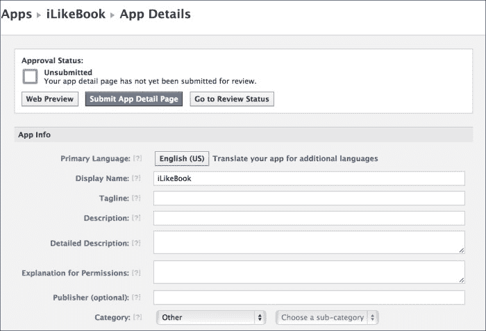

应用详情

当输入你的应用信息时，请考虑以下指南：

+   **描述**：这在应用中心是唯一的。

+   **详细描述**：这个内容应该比描述更详细。

+   **标语**：这不应该包含**显示名称**。

+   **隐私政策网址**、**服务条款网址**和**用户支持电子邮件/网址**：这些是需要定义的强制字段。

通过应用详情仪表板，您可以自定义您的应用页面详情的外观。

我们需要确保 **Facebook 登录** 功能已启用，以便在 Facebook 应用中心看到我们的社交应用。我们还将启用 **深度链接**，这将在本章的“邀请朋友”部分中稍后解释。为了编辑应用设置，我们可以点击左侧栏上的 **设置** 链接。

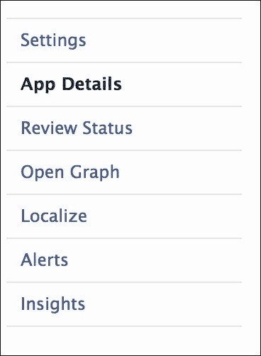

应用仪表板左侧栏

选择如图所示的 **原生 iOS 应用**：

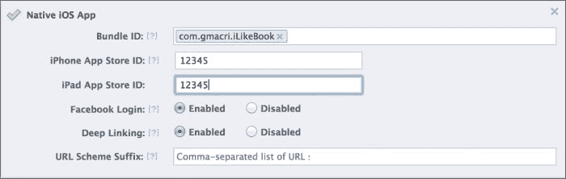

iOS 应用设置

当您启用 iOS 集成（**Facebook 登录**/**深度链接**）时，您还需要定义 iPhone 应用商店 ID 或 iPad 应用商店 ID。

现在我们已经准备好了所有设置，我们可以回到应用详情页面仪表板，查看网页预览。当我们觉得网页预览可以接受时，我们最终可以提交我们的详情页面以供审查。


提交应用详情页面

在我们能在应用中心看到我们的应用详情页面之前，我们需要等待我们的应用详情页面获得批准。

## 发送到移动设备

“发送到移动设备”功能是为了让用户在探索 Facebook 网页门户时能够在其设备上安装移动应用程序而引入的。

发送到移动设备是 Facebook 新推出的一个功能，旨在简化移动应用程序安装流程。当用户在浏览应用中心时，他们可以点击 **发送到移动设备** 按钮。一旦用户点击该按钮，他们将通过他们的移动设备登录 Facebook 移动，Facebook 将向他们的设备发送邀请。通过点击通知，用户将被重定向到应用商店或 Google Play。这是通过 **深度链接** 设置实现的。


发送到移动设备

## 邀请朋友

在本节中，我们将描述一个新的应用流程，邀请我们的 Facebook 朋友使用我们的新社交应用。在第三章“连接到 Facebook 用户账户”中，我们构建了 `FBFriendPickerViewController` 以便我们可以选择多个朋友。在本节中，我们将利用这一功能并构建一个原生和网页对话框，与我们的朋友分享信息。

为了发送应用邀请，我们的 Facebook 应用需要定义 Facebook 应用设置中的“应用在 Facebook 上”设置。访问 Facebook 应用仪表板并选择我们当前的应用。定位到“应用在 Facebook 上”部分，如图所示：


Facebook 应用部分

打开该部分并填写必要的字段，如图所示：

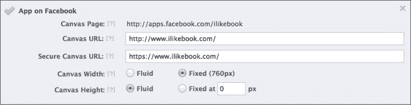

Facebook 应用

如果您没有 Canvas URL，请查看以下链接以创建一个：

[`developers.facebook.com/docs/appsonfacebook/tutorial/`](https://developers.facebook.com/docs/appsonfacebook/tutorial/)

Canvas URL 是从我们的 iOS 应用向我们的 Facebook 朋友发送邀请所必需的。

现在，我们可以专注于在我们的社交应用中编码邀请功能。

打开 Storyboard 并选择 Facebook 场景。

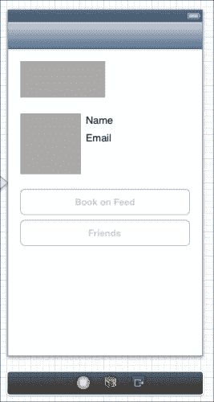

Facebook 场景

在好友按钮下方创建一个新按钮，如下面的截图所示：

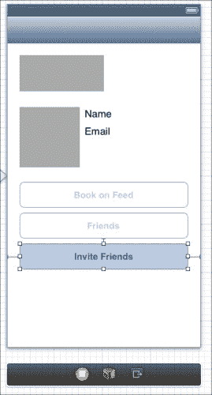

带有邀请好友按钮的 Facebook 场景

使用 **实用工具 | 显示属性检查器** 通过取消选中 **启用** 复选框将默认按钮状态更改为禁用。下面的截图显示了属性检查器控制面板：

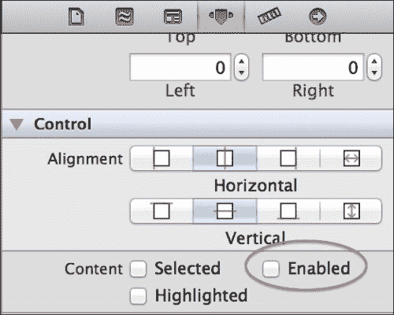

控制面板—未选中启用复选框

在属性部分下的按钮部分中，更改 **状态配置** 的背景颜色，如下面的截图所示：

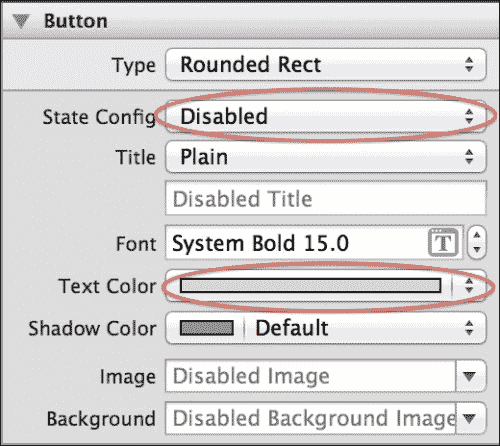

更改背景颜色

下面的截图显示了调整按钮设置的最终结果：

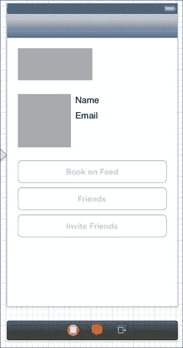

带有禁用邀请好友按钮的 Facebook 场景

打开辅助编辑器并验证 `LBFacebookViewController.m` 文件是否已打开在您的右侧。

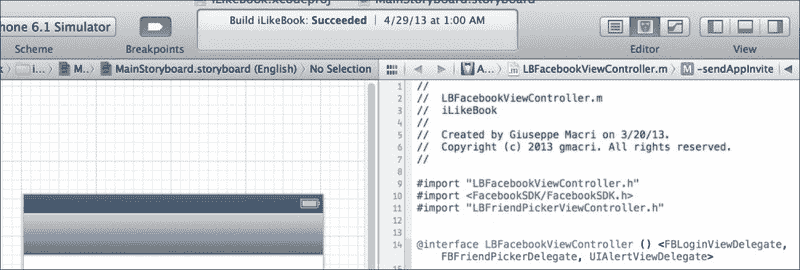

助理编辑—LBFacebookViewController.m

选择 **邀请好友** 按钮，并在 `LBFacebookViewController` 中创建一个新动作。这可以通过在键盘上按住 Control 键，并在 `.m` 文件中拖放蓝色箭头来完成。将新方法命名为 `onInviteFriendsClick`。

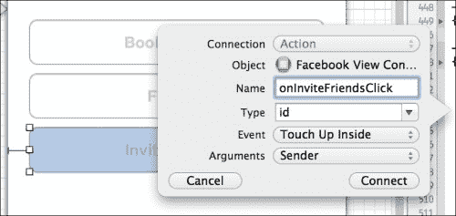

onInviteFriendsClick

下面的代码片段显示了 `onInviteFriends` 方法的代码：

```swift
- (IBAction)onInviteFriendsClick:(id)sender {
    [self sendAppInvite];
}
```

前面的方法调用了 `sendAppInvite`。`sendAppInvite` 方法将创建一个 Web 对话框组件，允许用户选择要将邀请发送给哪些好友。

```swift
- (void)sendAppInvite
{
    [FBWebDialogs presentRequestsDialogModallyWithSession:nil
                                                  message:@"iLikeBook"
                                                    title:@"Try iLikeBook. It's really fun!"
                                               parameters:nil
                                                  handler:^(FBWebDialogResult result, NSURL *resultURL, NSError *error) {
                                                      NSLog(@"Result URL: %@", resultURL);
                                                     if (!error) {
                                                         if (result == FBWebDialogResultDialogNotCompleted) {
                                                             NSLog(@"User canceled request.");
                                                         } else {                
                                                             NSDictionary *urlParams = [self parseURLParams:[resultURL query]];
                                                             if (![urlParams valueForKey:@"request"]) {
                                                                 NSLog(@"User canceled request.");
                                                             } else {
                                                                 NSString *requestID = [urlParams valueForKey:@"request"];
                                                                 NSLog(@"Request ID: %@", requestID);
                                                             }
                                                         }
                                                     } else {
                                                         NSLog(@"Error sending request.");
                                                     } 
     }];
}
```

前面的代码片段显示了 `sendAppInvite` 方法的实现。此方法将使用 `FBWebDialogs` 类实例化一个新的 Web 对话框组件。我们在第五章 *在墙上发布* 中使用 `FBWebDialogs` 在用户的 Timeline 上发布新的故事。

`presentRequestDialogModallyWithSession` 类方法将创建一个带有消息和标题信息的请求对话框。使用处理程序，我们可以检查用户是否完成了或取消了 Web 对话框。它还可以检查 Facebook 请求是否成功或失败。

对于处理程序来说，一个重要的变量是 `resultURL`。它提供了关于我们请求结果的信息。一旦我们从平台收到响应，我们可以使用 `parseURLParams` 辅助函数解析 `resultURL` 信息，以提取新的邀请请求 ID。

```swift
// Provided by Facebook SDK Samples
- (NSDictionary*)parseURLParams:(NSString *)query {
    NSArray *pairs = [query componentsSeparatedByString:@"&amp;"];
    NSMutableDictionary *params = [[NSMutableDictionary alloc] init];
    for (NSString *pair in pairs) {
        NSArray *kv = [pair componentsSeparatedByString:@"="];
        NSString *val =
        [[kv objectAtIndex:1]
         stringByReplacingPercentEscapesUsingEncoding:NSUTF8StringEncoding];

        [params setObject:val forKey:[kv objectAtIndex:0]];
    }
    return params;
}
```

当我们运行应用程序时，点击邀请好友按钮将创建新的对话框，如下面的截图所示：

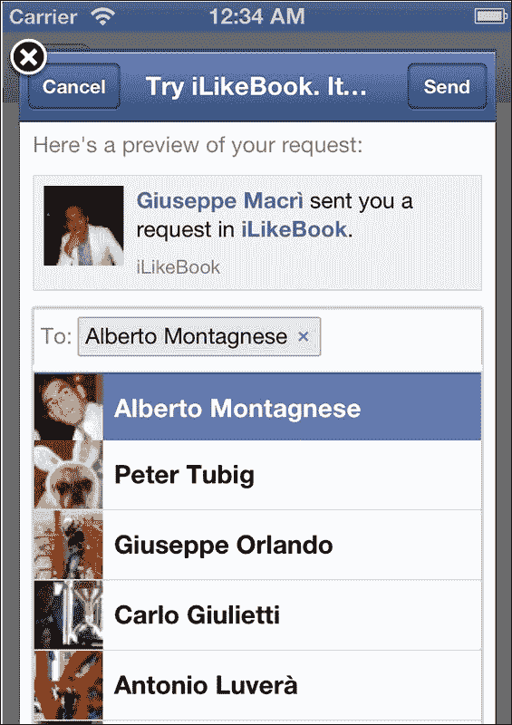

用于发送邀请的 FBWebDialogs

新对话框允许用户从我们的 Facebook 列表中选择好友，并使用搜索查询来过滤显示的好友列表。

一旦用户点击 **发送** 按钮，应用程序将向 Facebook 平台发送新的请求，将邀请转发给选定的好友。如果我们的 Facebook 应用程序设置了 Canvas URL 值，Facebook 平台才会向我们的好友显示邀请。

在我们发送邀请后，我们的朋友可以在 Facebook 网页或移动应用上打开邀请。我们对将用户重定向到 App Store 感兴趣，一旦他们在 iOS 设备上点击 Facebook 通知。

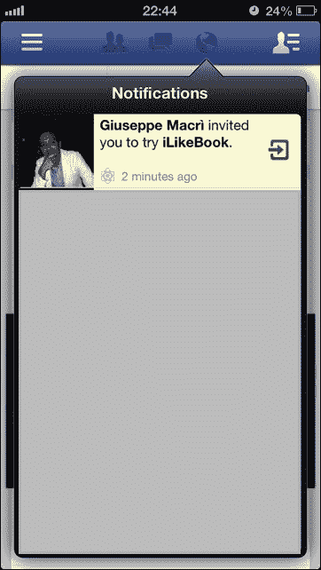

Facebook 通知

一旦用户点击 Facebook 通知，他们将被重定向到 App Store 以安装我们的新社交应用。

# 摘要

在本章中，我们学习了几种使用 Facebook 渠道分发我们的社交应用的方法。

分发我们的社交应用的主要渠道是 Facebook 应用中心。人们将能够根据类别或通过搜索功能发现我们的应用。

应用中心还提供了将链接发送到我们的移动设备以安装应用的功能。因此，如果我们正在使用 Facebook 桌面版浏览应用中心，我们可以通过发送包含应用链接的短信到我们的手机号码，直接安装应用。

让我们不要忘记我们在 Facebook 上最重要的资源，那就是我们的朋友。我们可以轻松地为他们创建邀请，以便分享我们的社交应用。

这些只是如何推广我们的社交应用的例子。我们可能使用自己的网站、Twitter 账户以及任何其他可以增加我们可见性的工具。
