# 第八章. 推广您的社交应用

创建一个好的应用在社交平台世界中取得成功是不够的。同样重要的是，使用不同的渠道推广我们的应用。

我们应该通过确定我们想要接触的用户类型，并制定推广计划来定义我们应用的目标。

# 了解您的用户

Facebook 平台提供了一个数据分析工具，以了解用户类型以及他们如何使用它。

为了访问**洞察力**工具，请访问**Facebook 应用仪表板**并选择我们的社交应用。

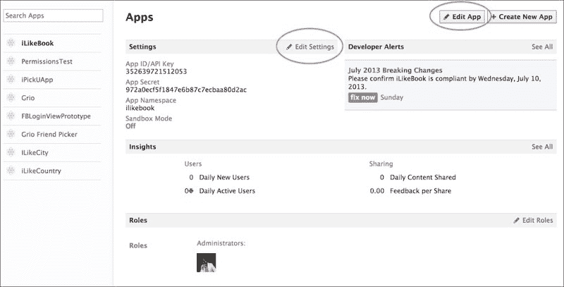

点击如图所示的前一个屏幕截图中的**编辑设置**或**编辑应用**。

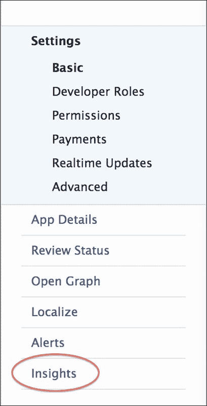

点击页面左侧栏上的**洞察力**。以下屏幕截图显示了**洞察力**工具的**概览**页面：

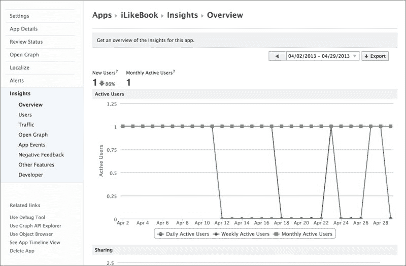

**概览**页面提供了有关我们活跃用户的信息，如下一屏幕截图所示。使用周期过滤器和**导出**按钮，我们可以将我们的数据导出为**Excel**或**逗号分隔值**（**CSV**）文件格式。

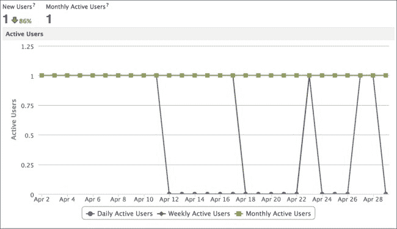

理解用户如何与我们的应用互动非常重要。基于**洞察力**，我们可以了解哪些功能在我们用户群体中更受欢迎。这提供了有用的反馈，因此我们可以专注于改进不太受欢迎的功能。以下屏幕截图显示了描述 Facebook 上活动的**分享**图表：

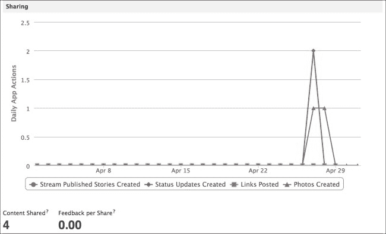

**洞察力**工具提供了有助于您了解应用如何吸引用户的信息。

我强烈建议您查看**洞察力**提供的所有功能，并在应用上线时充分利用它们。

# 增长您的受众

用户是我们应用最重要的资源。我们拥有的用户越多，越好。然而，尽可能多地增长我们的受众也很重要。

我们探索了一些以下技术来增长我们的受众：

+   通过应用发布状态更新

+   邀请 Facebook 朋友使用我们的应用

+   使用 Facebook 应用中心

我们可以使用其他技术来使我们的应用病毒式传播。我们应该考虑 Facebook 平台提供的所有可用推广渠道。

+   **画布页面**：这是我们应用中一个非常重要的浏览窗口。随着应用排名的提升，画布页面将被访问得更多。因此，我们应该仔细关注页面上列出的所有细节。

+   **向朋友推荐**：这是从 Facebook 网页直接与朋友分享您应用的直接方式。

+   **开放图**：这是一个在 Facebook 平台上产生引人入胜故事的协议，它赋予开发者自定义外观、感觉以及内容以吸引用户的能力。

# 移动广告

移动广告是 Facebook 平台为开发者和应用管理员提供的一项新功能，用于在**Facebook 新闻源**上推广他们的应用。使用**广告管理器**工具，我们可以轻松创建多平台广告。

### 注意

[`developers.facebook.com/docs/tutorials/mobile-app-ads/`](https://developers.facebook.com/docs/tutorials/mobile-app-ads/)

能够制作出能够触达目标用户的广告，为我们推广移动社交应用提供了强大的工具。

为了使用移动广告，我们需要设置我们的社交应用。在你的社交应用项目中打开`LBAppDelegate.m`文件。识别`applicationDIdBecomeActive`方法。每次应用启动或恢复时都会调用此方法。我们需要更新该方法代码以支持移动广告。以下代码片段将使我们的社交应用能够使用移动广告：

```swift
- (void)applicationDidBecomeActive:(UIApplication *)application
{
  // Restart any tasks that were paused (or not yet started) while the application was inactive. If the application was previously in the background, optionally refresh the user interface.
  [FBSession.activeSession handleDidBecomeActive];
  [FBAppEvents activateApp];
}
```

首先，我们调用`FBsession.activeSession handleDidBecomeActive`方法来解决 Facebook 登录流程的会话状态。

`FBAppEvents activateApp`方法查询 Graph API 以确定应用是否启用了`Install`归因，并发布 ID 以跟踪成功的安装。

在任务代码完成之后，我们可以继续创建将在用户**新闻源**上显示的真实移动广告。打开**Facebook 仪表板应用**，选择当前应用并**编辑应用**。确保**沙盒模式**已禁用，并且**iPhone 应用商店 ID**设置正确。我们可以在**Apple 应用商店**使用 URL 模板找到我们的**App Store ID**，[`itunes.apple.com/us/app/my-great-app/APP_STORE_ID`](https://itunes.apple.com/us/app/my-great-app/APP_STORE_ID)。

使用您的 App Store 信息自定义之前的 URL。

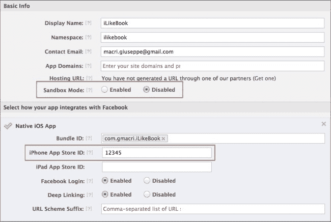

在左侧栏中选择**应用详情**。

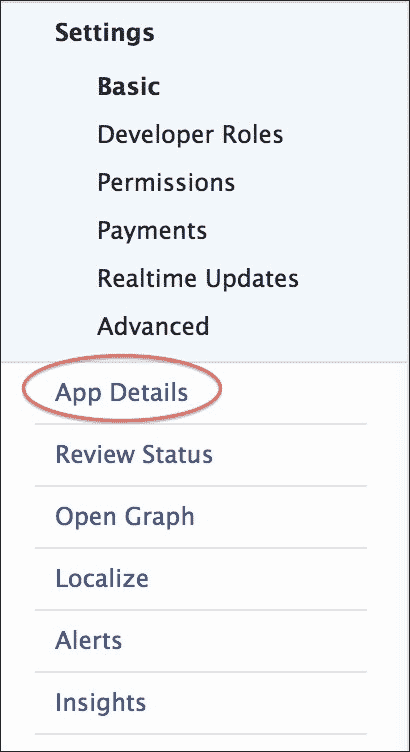

在**应用详情**页面，确保提供了所有必要的信息。我们已经在上一章中处理了此表单的填充。确保**显示名称**和**主要图标****75x75**已设置。我强烈建议尽可能多地填写信息，以便在移动广告中获得更多信息。

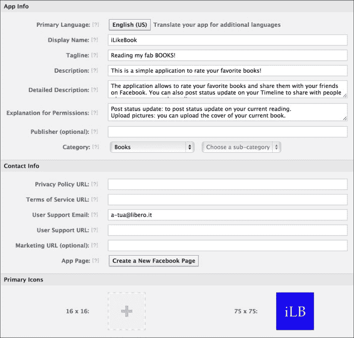

现在，我们可以开始使用 Facebook 的**广告创建**工具。

### 注意

[`www.facebook.com/ads/create`](https://www.facebook.com/ads/create)

以下截图显示了**广告创建**工具的着陆页：

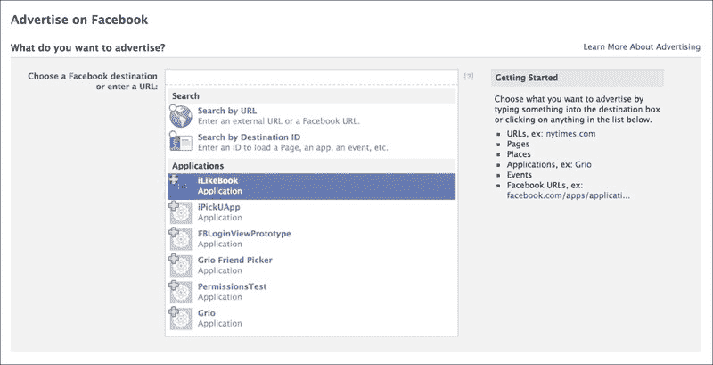

在此页面中，您可以宣传 Facebook 平台上存在的任何内容。在这种情况下，我们想要推广我们的应用。选择**iLikeBook**并开始创建移动广告。

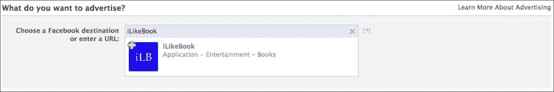

在以下截图**您想做什么？**中，让我们使用**应用详情**页面提供的信息创建一个新的移动广告：


在此部分，我们可以选择我们想要推进的活动的类型。我们有三个不同的选项：

+   **获取新用户**

+   **增加应用互动**

+   **查看高级选项**

对于本书的范围，我们将创建**获取新用户**活动。选择**获取新用户**单选按钮。

我们现在可以通过“您的广告”部分定制广告的外观和感觉，例如，更改标题、描述和图标。在该部分的右侧，我们可以预览广告。这类广告将出现在**Facebook 桌面应用**的右侧栏中。

**赞助故事**部分为开发者提供了创建新闻源广告的能力。**新闻源**活动是最有效的一种，因为人们可以看到他们的朋友在使用哪些应用程序。

我们活动的下一步是选择我们的受众。作为最佳实践，我建议尽可能广泛地分配受众作为测试案例，然后逐渐缩小范围以确定受众目标。以下截图显示了**受众**部分。

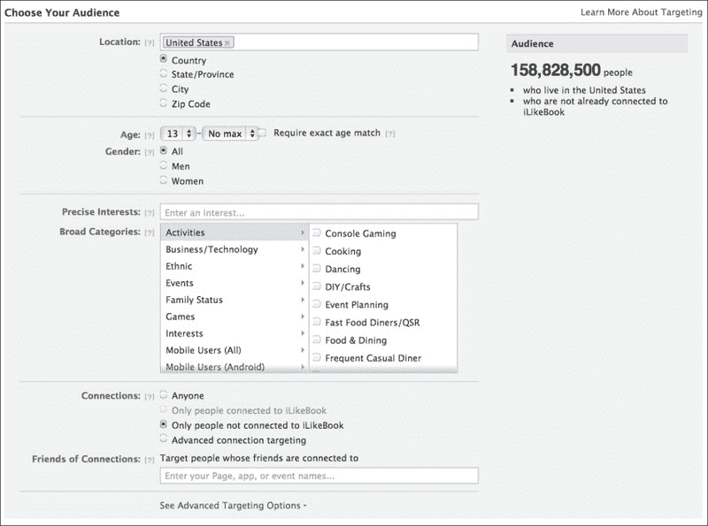

我们可以根据受众的地理位置、年龄和兴趣来定制我们的活动。

使用平台提供的默认选项，我们有近 1.6 亿人的受众。随着我们添加更多精确的兴趣，受众将减少。以下截图显示了定义精确兴趣条目后的新受众数量：

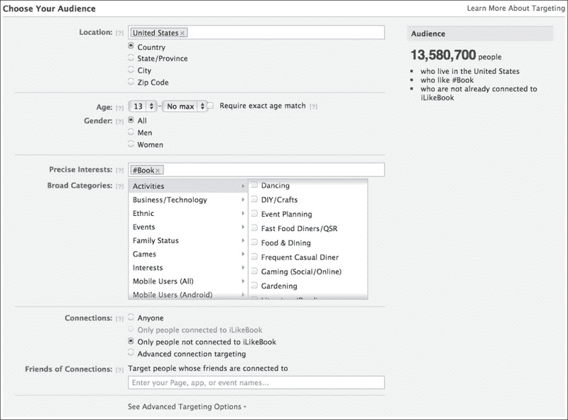

新的受众大约有 1400 万人。再次强调，出于测试目的，我强烈建议您使用更广泛的受众。如果您只是尝试增加您应用程序的用户数量而没有受众目标，请保留默认设置。

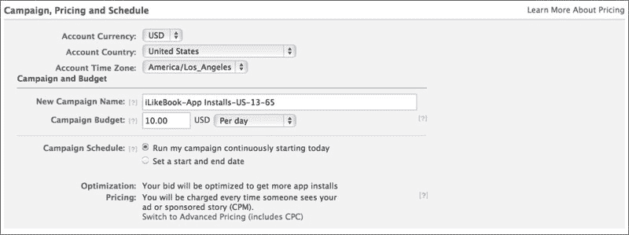

我们现在需要按照以下方式定义活动信息：

+   账户信息

+   活动名称、日程安排和预算

作为下一步，我们需要审查我们的广告并批准它。一旦移动广告获得批准，我们将在新闻源和 Facebook 右侧栏中看到我们的新广告。

移动广告为开发者提供了在整个 Facebook 平台上推广应用程序的能力，从桌面计算机到移动设备，使用不同的广告布局。

# 摘要

在本章中，我们学习了如何推广我们的社交应用程序。首先，我们必须使用 Facebook 平台提供的**洞察**工具考虑我们的目标受众。我们在上一章中探讨了几个技术。

移动广告是推广我们应用程序的好工具。我们可以设置广告以针对一组特定的人。作为良好实践，如果您要设置移动广告活动，请确保您从一个大目标开始。随着您对受众的了解加深，逐渐缩小目标。

移动广告计划为我们提供了不同价格和选项的活动。最终，通过最大的目标规模，我们可以针对整个 Facebook 社区。
