# 第一章. 开发工具

在本章中，我们将涵盖以下内容：

+   安装先决条件

+   使用 MonoDevelop 创建 iPhone 项目

+   界面构建器

+   创建 UI

+   使用 outlets 访问 UI

+   添加动作

+   编译

+   调试我们的应用程序

# 简介

专业人士最关心的一件重要事情是完成工作所需的工具。正如木匠需要凿子来刮木料，或者摄影师需要相机来捕捉光线一样，我们作为开发者需要某些工具，没有这些工具我们无法工作。

在本章中，我们将提供有关开发 iOS 应用程序所需的信息，iOS 是苹果公司移动设备的操作系统。我们将描述每个工具在开发周期中的作用，并逐步介绍每个工具的重要特性，这些特性对于开发我们的第一个应用程序至关重要。

开发 iOS 应用程序所需的工具如下：

+   **基于英特尔处理器的运行 Snow Leopard (10.6.*) 或 Lion (10.7.*) 操作系统的 Mac 计算机：** 我们需要的必要程序无法安装在其他计算机平台上。

+   **iOS SDK 版本 3.2 或更高：** 要能够下载 iOS SDK，开发者必须注册为苹果开发者。iOS SDK 包括两个基本组件。

    +   **Xcode：** 苹果公司使用 Objective-C 编程语言开发 iOS 和 Mac 原生应用程序的 IDE。

    +   **iOS 模拟器：** 在计算机上调试 iOS 应用程序的一个基本程序，无需设备。请注意，许多 iOS 功能在模拟器上无法工作；因此，如果应用程序使用这些功能，则需要设备。

        在苹果开发者门户（[`developer.apple.com`](http://developer.apple.com)）上注册和 SDK 下载都是免费的。如果我们想在设备上运行和调试我们的应用程序或在 App Store 上分发它们，我们需要注册 iOS 开发者计划，该计划需要订阅费。

+   **Mono for Mac：** Mono 是微软 .NET 框架的开源实现。它提供了一套跨平台工具、库和编译器，用于在所有主流计算机操作系统（Linux、Mac 和 Windows）上开发 .NET 应用程序。我们需要从 Mono 的网站上获取的最新 Mac 安装程序。

+   **MonoTouch：** MonoTouch 是基于 Mono 的 SDK，它为 .NET 开发者提供了使用 C# 作为编程语言开发 iOS 应用程序的能力。MonoTouch 网站上提供免费评估版本（[`ios.xamarin.com`](http://ios.xamarin.com)），具有商业版本的所有功能，可以在 iOS 模拟器上调试和运行应用程序，没有过期限制。要在设备上部署应用程序或在 Apple 的 App Store 上分发，需要购买商业许可证。

+   **MonoDevelop：** MonoDevelop 是一个用于 .NET 开发的开源 IDE。它为开发者提供了许多功能，例如代码补全、数据库浏览、调试器等。Mac 版本提供了 iOS 项目模板和 MonoTouch 集成。

本章还将介绍如何使用 MonoDevelop 创建我们的第一个 iPhone 项目，使用 Interface Builder 构建其 UI，以及如何在我们的代码中访问应用程序的用户界面，包括 **Outlets** 和 **Actions** 的概念。

最后但同样重要的是，我们将学习如何编译我们的应用程序，可用的编译选项，以及如何在模拟器上进行调试。

# 安装先决条件

有关如何下载和安装使用 MonoTouch 进行开发的必要工具的信息。

## 准备工作

我们需要在我们的计算机上下载所有必要的组件。首先，需要在 [`developer.apple.com`](http://developer.apple.com) 上注册为苹果开发者。注册是免费且简单的，并提供访问所有必要开发资源的权限。通过电子邮件确认注册后，我们可以登录并从地址 `https://developer.apple.com/devcenter/ios/index.action#downloads` 下载 iOS SDK。在撰写本文时，Xcode 的最新版本是 4.2，iOS SDK 的最新版本是 5.0。

有时，当苹果推出其组件的测试版时，它们将通过其门户提供。尽管所有注册用户都可以下载和使用这些组件，但我们的已安装的 MonoTouch 版本可能无法正确与 iOS SDK 或 Xcode 的测试版兼容。因此，在从苹果开发者门户下载和安装新测试版时必须考虑这一点。

## 如何操作...

为了准备我们的计算机进行 iOS 开发，我们需要按照以下顺序下载和安装必要的组件：

1.  **在 OS X Snow Leopard 上的 Xcode 和 iOS SDK：** 下载镜像文件后，将其挂载，然后在将弹出的窗口中双击 Xcode 和 iOS SDK 图标以开始安装。为了继续安装，必须阅读并接受将显示的两个许可协议。之后，您只需选择安装位置并点击 **继续**。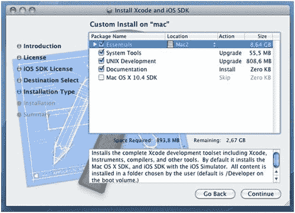

1.  **在 OS X Lion 上的 Xcode 和 iOS SDK：** 要安装 Xcode 和 SDK，需要登录 Mac App Store。下载的文件基本上是 Xcode 和 SDK 的安装程序。下载完成后，运行 Install Xcode 应用程序，并按照安装说明进行操作。

1.  **下载和安装 Mono for Mac：** Mono 的 Mac 版本可以通过 Mono 项目网站：[`www.mono-project.com`](http://www.mono-project.com) 下载。

1.  **下载和安装 MonoTouch：** 可以通过提供电子邮件地址从 [`ios.xamarin.com/DownloadTrial`](http://ios.xamarin.com/DownloadTrial) 下载最新的评估版本。

1.  **下载并安装 MonoDevelop 2.8+**：尽管使用 MonoTouch 创建 iOS 应用程序不需要 MonoDevelop，但安装它会使开发变得更加容易。可以从 [`monodevelop.com/Download`](http://monodevelop.com/Download) 下载。

## 如何工作...

现在我们已经准备好了所有东西，让我们看看每个组件需要什么。

如本章引言所述，iOS SDK 包含三个重要组件。第一个组件是 **Xcode**，它是 Apple 为 iOS 和 Mac 平台开发应用程序的 IDE。它针对 Objective-C 编程语言，这是在 iOS SDK 中编程的主要语言。由于 MonoTouch 是 C# 语言的 SDK，人们可能会 wonder 我们为什么需要 Xcode。除了提供各种调试 iOS 应用程序的工具外，Xcode 还为我们提供了三个重要的组件。第一个是一个设备信息窗口，称为 **组织者**，如图所示，这是在设备上部署我们的应用程序或通过 App Store 分发所必需的证书和配置文件。在组织者内部，我们可以查看我们应用程序的调试信息、崩溃日志，甚至从设备上获取截图！当然，这些只是 Xcode 提供的许多功能中的一部分，但它们超出了本书的讨论范围。

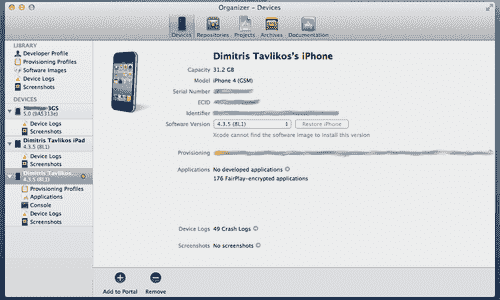

第二个组件是 **界面构建器**。这是一个用户界面设计器，以前是一个独立的应用程序。从 Xcode 4.0 开始，它被集成到 IDE 中。界面构建器提供了构建应用程序用户界面所需的所有必要功能。它也与 .NET 开发者所习惯的不同。

第三个组件是 **iOS 模拟器**。正如其名称所暗示的那样：一个设备模拟器，我们可以用它来运行我们的应用程序，而无需实际设备。iOS 模拟器的重要之处在于它可以选择模拟较旧的 iOS 版本（如果它们已安装在计算机上）；包括 iPhone 和 iPad 的界面和设备方向。但是，模拟器缺少一些依赖于硬件的设备功能，例如指南针或加速度计。使用这些功能的应用程序必须在实际设备上进行测试和调试。

Mono 是 .NET 框架的开源实现。它已经存在一段时间了，并为 .NET 开发者提供了使用 .NET 语言编程应用程序的能力，同时针对所有主流操作系统：Linux、Mac 和 Windows。MonoTouch 和 MonoDevelop 都高度依赖于 Mono，使其成为一项必要的资产。

MonoDevelop 是一个开源 IDE，用于使用 Mono（以及 Windows 上的 .NET 框架）开发应用程序。它提供代码补全、数据库浏览器、GTK# 设计器、调试器，以及在我们的情况下，开发 iOS 应用程序所需的各种组件，以便轻松有效地开发。它与 MonoTouch 完美集成，将两者都归类为完整的 iOS 开发环境。

MonoTouch 是一个 SDK，允许 .NET 开发者使用 C# 编程语言为 iOS 开发应用程序。有一个常见的误解，尤其是在新开发者中：由于 MonoTouch 提供了使用 C# 编程的能力，因此可以在 Windows 计算机上安装并使用它。这是完全错误的，因为 MonoTouch 是围绕 iOS SDK 的库构建的，这些库只能在 Mac 计算机上安装。另一个误解是，使用 MonoTouch 开发的 ".NET 兼容" 应用程序需要在设备上安装某种类型的虚拟机才能运行，并且由于这个虚拟机，它们将运行得更慢。这也是错误的，因为 MonoTouch 的先进编译器通过将我们的 C# ".NET 驱动的" 代码编译成原生机器代码来处理这个问题。此外，在设备上安装虚拟机违反了苹果的指导方针。

## 还有更多...

使用 MonoTouch 开发的应用程序进入 App Store 的机会与其他使用原生 Objective-C 编程语言开发的应用程序一样！这意味着，如果一个应用程序不符合苹果关于应用程序接受度的严格政策，它将失败，无论它是用 Objective-C 还是 C# 编写的。MonoTouch 团队在创建一个让开发者只需担心代码的设计和最佳实践，而无需担心其他事情的 SDK 方面做得非常出色。2010 年 4 月，苹果对其应用程序提交政策进行了修改，实际上禁止了所有未使用公司开发工具创建的应用程序提交到 App Store。MonoTouch 就是其中之一。除了已经投资于 MonoTouch 的开发者中出现的担忧之外，使用它创建的应用程序通常会被 App Store 接受。2010 年 9 月，苹果修改了其政策，放宽了这一规定，为 C# 开发者带来了安慰。

### 有用链接

以下是一份包含安装所需工具和信息的链接列表：

+   **苹果 iOS 开发者门户**：[`developer.apple.com/devcenter/ios/index.action`](http://developer.apple.com/devcenter/ios/%20index.action)

+   **Mono**：[`www.mono-project.com`](http://www.mono-project.com)

+   **MonoDevelop**：[`www.monodevelop.com`](http://www.monodevelop.com)

+   **MonoTouch**：[`ios.xamarin.com`](http://ios.xamarin.com)

+   **MonoTouch 安装指南**：[`ios.xamarin.com/Documentation/Installation`](http://ios.xamarin.com/Documentation/%20Installation)

+   **关于苹果开发者工具的信息**：[`developer.apple.com/technologies/tools/xcode.html`](http://developer.apple.com/%20technologies/tools/xcode.html)

### 更新

MonoDevelop 有一个检查可用更新的功能。每次程序启动时，它都会检查 MonoDevelop 本身、MonoTouch 和 Mono 框架的更新。它可以关闭，但并不推荐，因为它有助于保持与最新版本的同步。可以在**MonoDevelop | 检查更新**下找到。

## 参见

在本章中：

+   *编译*

+   *调试我们的应用程序*

第十四章,部署：

+   *在其他设备上调试*

+   *为 App Store 准备我们的应用程序*

# 使用 MonoDevelop 创建 iPhone 项目

在这个任务中，我们将讨论使用 MonoDevelop IDE 创建我们的第一个 iPhone 项目。

## 准备中...

现在我们已经安装了所有先决条件，我们将讨论如何使用 MonoDevelop 创建我们的第一个 iPhone 项目。

启动 MonoDevelop。它位于 `Applications` 文件夹中。MonoDevelop 的默认项目位置是文件夹 `/Users/{yourusername}/Projects`。如果硬盘上不存在，则在创建我们的第一个项目时创建。如果我们想更改文件夹，可以从菜单栏选择**MonoDevelop | 首选项**。

在左侧面板中选择**加载/保存**，在**默认解决方案位置**字段中输入项目首选位置，然后点击**确定**。

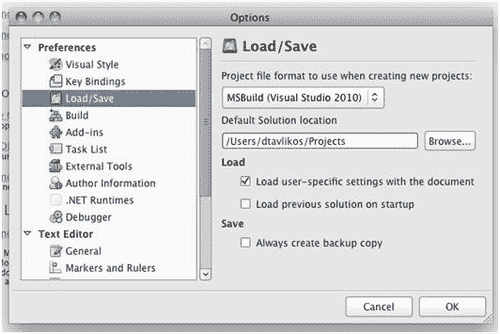

## 如何操作...

1.  启动 MonoDevelop 时，首先加载的是其**起始**页面。从菜单栏选择**文件 | 新建 | 解决方案...**。将显示一个窗口，提供给我们可用的项目选项。

1.  在这个窗口中，在左侧面板中选择**C# | MonoTouch | iPhone**。iPhone 项目模板将在中间面板中显示。

1.  选择**iPhone 单视图应用程序**。最后，为**解决方案名称**输入 `MyFirstiPhoneProject` 并点击**前进**。以下截图显示了**新解决方案**窗口：

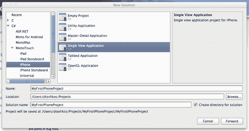

+   就这样！你已经创建了你的第一个 iPhone 项目！你可以构建并运行它。**iOS 模拟器**将启动，但屏幕上仍然只有一个空白浅灰色屏幕。

### 注意

如果由于某种原因左侧面板中没有显示 MonoTouch 部分，这意味着 MonoTouch 和/或 MonoDevelop 的安装出了问题。请参考前面的配方进行正确安装。

如果中间的模板与这个截图中的不同，那是因为你使用的 MonoTouch 和/或 MonoDevelop 版本与本书中使用的版本不同。

## 它是如何工作的...

让我们看看幕后发生了什么。

当 MonoDevelop 创建一个新的 iPhone 项目，或者更好的，iOS 项目时，它会创建一系列文件。解决方案的结构与创建 .NET/Mono 项目时相同，但有一些额外的文件。解决方案文件可以在 MonoDevelop 窗口的左侧的 **Solution** 面板上查看。如果 **Solution** 面板不可见，可以通过从菜单栏选择 **View | Pads | Solution** 来激活它。

这些文件是构成 iPhone 项目的必要文件：

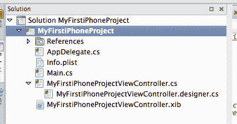

### MyFirstiPhoneProjectViewController.xib

这是包含应用程序视图的文件。`XIB` 文件基本上是具有特定结构的 XML 文件，可以从 Interface Builder 中读取。它们包含有关用户界面的各种信息，例如它包含的控件类型、它们的属性、出口等。

### 注意

如果双击 `MyFirstiPhoneProjectViewController.xib` 或任何具有 `.xib` 后缀的文件，MonoDevelop 将启动 Xcode，并在 Interface Builder 中打开 `XIB` 文件的内容。

当我们使用 Interface Builder 创建一个新的界面并保存时，它将以 XIB 格式保存。

### MyFirstiPhoneProjectViewController.cs

这是实现视图功能的文件。创建时，文件的内容如下：

```swift
namespace MyFirstiPhoneProject{
public partial class MyFirstiPhoneProjectViewController : UIViewController{
public MyFirstiPhoneProjectViewController (string nibName, NSBundle bundle) : base (nibName, bundle){}
public override void DidReceiveMemoryWarning (){
// Releases the view if it doesn't have a superview.
base.DidReceiveMemoryWarning ();
// Release any cached data, images, and so on that aren't in use.
}
public override void ViewDidLoad (){
base.ViewDidLoad ();
//any additional setup after loading the view, typically from a nib.
}
public override void ViewDidUnload (){
base.ViewDidUnload ();
// Release any retained subviews of the main view.
// e.g. myOutlet = null;
}
public override bool ShouldAutorotateToInterfaceOrientation (UIInterfaceOrientation toInterfaceOrientation){
// Return true for supported orientations
return (toInterfaceOrientation != UIInterfaceOrientation.PortraitUpsideDown);
}
}
}

```

此文件中的代码包含与将要加载的视图相对应的类，以及一些默认方法的重写。这些是我们创建视图控制器时将更频繁使用的方法。以下是每个方法的简要描述：

+   `ViewDidLoad:` 当控制器视图加载时，会调用此方法。这是我们用来初始化任何附加组件的方法。

+   `ViewDidUnload:` 当视图从内存中卸载时，会调用此方法。

+   `DidReceiveMemoryWarning:` 当应用程序收到内存警告时，会调用此方法。此方法负责卸载视图。

+   `ShouldAutorotateToInterfaceOrientation:` 当我们希望我们的应用程序支持多种方向时，我们会实现此方法。

### MyFirstiPhoneProjectViewController.designer.cs

这是包含我们的主窗口类信息的文件，使用 C# 代码编写。MonoDevelop 为项目中添加的每个 `XIB` 创建一个 `.designer.cs` 文件。每次我们通过 Interface Builder 保存对 `XIB` 的更改时，该文件都会自动生成。这是由 MonoDevelop 负责的，以确保我们在界面中做出的更改能够立即反映到代码中。我们不得直接修改此文件，因为当相应的 XIB 使用 Interface Builder 保存时，这些更改将会丢失。另外，如果通过 Interface Builder 没有保存任何内容，如果手动修改它，很可能会导致编译错误。

创建新项目时，文件的内容如下：

```swift
namespace MyFirstiPhoneProject{
[Register ("MyFirstiPhoneProjectViewController")]
partial class MyFirstiPhoneProjectViewController{}
}

```

就像任何其他 .NET 项目一样，会创建一个与解决方案名称相同的命名空间：

```swift
namespace MyFirstiPhoneProject

```

此文件包含我们`MyFirstiPhoneProjectViewController`类的其他部分声明。它被`RegisterAttribute`装饰。

`RegisterAttribute`用于将类暴露给底层的 Objective-C 运行时。字符串参数声明了我们的类将以什么名称暴露给运行时。它可以是我们想要的任何名称，但始终将其设置为我们的 C#类名称是一个好习惯。该属性在 MonoTouch 的内部使用得非常频繁，因为它将所有本地的`NSObject`类与其 C#对应类绑定在一起。

### 注意

`NSObject`是一个根类或基类。在.NET 世界中，它相当于`System.Object`。两者之间的唯一区别是，所有.NET 对象都继承自`System.Object`，但在 Objective-C 中，大多数（而不是所有）Objective-C 对象继承自`NSObject`。所有继承自`NSObject`的本机对象的 C#对应类也继承自其 MonoTouch `NSObject`对应类。

### AppDelegate.cs

此文件包含`AppDelegate`类。文件内容如下：

```swift
using System;
using System.Collections.Generic;
using System.Linq;
using MonoTouch.Foundation;
using MonoTouch.UIKit;
namespace MyFirstiPhoneProject{
// The UIApplicationDelegate for the application. This class is responsible for launching the
// User Interface of the application, as well as listening (and optionally responding) to application events from iOS.
[Register ("AppDelegate")]
public partial class AppDelegate : UIApplicationDelegate{
// class-level declarations
UIWindow window;
MyFirstiPhoneProjectViewController viewController;
// This method is invoked when the application has loaded and is ready to run. In this
// method, you should instantiate the window, load the UI into it, and then make the window visible.
// You have 17 seconds to return from this method, or iOS will terminate your application.
public override bool FinishedLaunching (UIApplication app, NSDictionary options){
window = new UIWindow (UIScreen.MainScreen.Bounds);
viewController = new MyFirstiPhoneProjectViewController ("MyFirstiPhoneProjectViewController", null);
window.RootViewController = viewController;
window.MakeKeyAndVisible ();
return true;
}
}
}

```

第一部分对.NET 开发者来说很熟悉，它包含适当的`using`指令，用于导入使用所需的命名空间。

```swift
using System;
using System.Collections.Generic;
using System.Linq;
using MonoTouch.Foundation;
using MonoTouch.UIKit;

```

前三个`using`指令使我们能够使用.NET/Mono 世界的特定和熟悉的命名空间与 MonoTouch 一起使用！

### 注意

虽然这三个命名空间（System, `System.Collections.Generic, System.Linq`）提供的功能几乎与它们知名的.NET/Mono 对应项相同，但它们被包含在专门为与 MonoTouch 一起使用而创建的程序集内，并且当然与它一起分发。使用.NET 或 Mono 编译的程序集不能直接用于 MonoTouch 项目。

`MonoTouch.Foundation`命名空间是对原生 Objective-C 基础框架的包装，其中包含提供基本功能的类。这些对象的名称与原生基础框架中找到的相同“NS”前缀相同。一些例子是`NSObject, NSString, NSValue`等等。除了`NS-前缀`对象外，`MonoTouch.Foundation`命名空间还包含用于绑定到原生对象的属性，例如我们之前看到的`RegisterAttribute`。`MonoTouch.UIKit`命名空间是对原生 Objective-C `UIKit`框架的包装。正如其名称所暗示的，该命名空间包含提供界面功能的类、委托和事件。除了两个类`DraggingEventArgs`和`ZoomingEventArgs`外，所有对象的名称都共享相同的“UI”前缀。此时应该很清楚，这两个命名空间对于所有 MonoTouch 应用都是必不可少的，并且它们的对象将被频繁使用。

该类继承自`UIApplicationDelegate`类，使其成为我们应用的`UIApplication` **Delegate**对象。

### 注意

在 Objective-C 世界中，委托对象的概念与 C# 中的委托有所不同。这将在第二章用户界面：视图中详细解释。

`AppDelegate` 类包含两个字段和一个方法：

```swift
UIWindow window;
MyFirstiPhoneProjectViewController viewController;
public override bool FinishedLaunching (UIApplication app, NSDictionary options) {

```

`UIWindow` 对象定义了我们应用程序的主窗口，而 `MyFirstiPhoneProjectViewController` 是一个变量，它将持有应用程序的视图控制器。

### 注意

iOS 应用程序通常只有一个窗口，类型为 `UIWindow`。`UIWindow` 的概念与 .NET `System.Windows.Form` 有所不同。`UIWindow` 是应用程序启动时首先显示的控制，所有后续视图都按层次添加在其下方。

如其名称所示，`FinishedLaunching` 方法在应用程序完成初始化过程时被调用。这是我们必须向用户展示用户界面的方法。此方法的实现必须轻量级，因为如果它不能在调用后及时返回，iOS 将终止应用程序。这是为了通过防止开发者在初始化时执行复杂和长时间运行的任务（例如连接到网络服务以接收数据）来为用户提供更快的用户界面加载时间。应用程序参数是应用程序的 `UIApplication` 对象，也可以通过静态属性 `UIApplication.SharedApplication` 访问。选项参数可能包含有关应用程序启动方式的信息，也可能不包含。目前我们不需要它。

如其名称所示，`FinishedLaunching` 方法在应用程序完成初始化过程时被调用。这是我们必须向用户展示用户界面的方法。此方法的实现必须轻量级，因为如果它不能在调用后及时返回，iOS 将终止应用程序。这是为了通过防止开发者在初始化时执行复杂和长时间运行的任务（例如连接到网络服务以接收数据）来为用户提供更快的用户界面加载时间。应用程序参数是应用程序的 `UIApplication` 对象，也可以通过静态属性 `UIApplication.SharedApplication` 访问。选项参数可能包含有关应用程序启动方式的信息，也可能不包含。目前我们不需要它。

此类型项目的 `FinishedLaunching` 方法的默认实现如下：

```swift
window = new UIWindow (UIScreen.MainScreen.Bounds);

```

`UIWindow` 对象使用屏幕大小进行初始化。

```swift
viewController = new MyFirstiPhoneProjectViewController ("MyFirstiPhoneProjectViewController", null);
window.RootViewController = viewController;

```

视图控制器被初始化并设置为窗口的根视图控制器。

```swift
window.MakeKeyAndVisible ();
return true;

```

窗口通过`window.MakeKeyAndVisible()`调用显示在屏幕上，并且该方法返回。此方法必须在`FinishedLaunching`方法内部调用，否则应用程序的用户界面将不会按预期向用户展示。最后但同样重要的是，`return true`行通过标记其执行完成来返回方法。

### Main.cs

在`Main.cs`文件中是程序运行时生命周期的开始：

```swift
namespace MyFirstiPhoneProject{
public class Application{
// This is the main entry point of the application.
static void Main (string[] args){
// if you want to use a different Application Delegate class from "AppDelegate",
// you can specify it here.
UIApplication.Main (args, null, "AppDelegate");
}
}
}

```

类似于在.NET `System.Windows.Forms`应用程序中的以下调用，`UIApplication.Main`方法启动消息循环，或运行循环，负责通过`AppDelegate`类将通知派发到应用程序，其中包含我们可以重写的处理程序。

```swift
// In a .NET application
Application.Run(new Form1());

```

事件处理程序，如`FinishedLaunching`、`ReceiveMemoryWarning`或`DidEnterBackground`，只是这些通知中的一些。除了通知派发机制之外，`UIApplication`对象包含所有存在的`UIWindow`对象的列表；通常是其中一个。iOS 应用程序必须有一个`UIApplication`对象，或者从它继承的类，并且该对象必须有一个相应的`UIApplicationDelegate`对象。这是我们之前看到的`AppDelegate`类实现。

### Info.plist

这个文件基本上是应用程序的设置文件。它具有一个简单的属性值结构，定义了 iOS 应用程序的各种设置，例如它支持的朝向、图标、支持的 iOS 版本、它可以安装的设备等等。如果我们在这个文件上双击 MonoDevelop，它将在嵌入的编辑器中打开，该编辑器专门设计用于`.plist`文件。这是新项目中我们的文件看起来像：

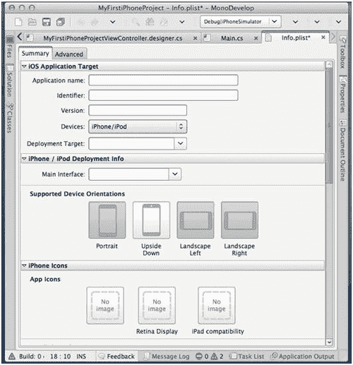

`Info.plist`是一个 XML 文件。虽然我们可以在文本编辑器中手动编辑该文件，例如，但不建议这样做。嵌入的编辑器是编辑的最佳方式。

## 更多内容...

MonoDevelop 为开发 iOS 应用程序提供了许多不同的项目模板。以下是一个列表，描述了每个项目模板的用途：

+   **空项目**: 它是一个没有任何视图的空项目。

+   **实用应用程序**: 实用应用程序是一种特殊的 iOS 应用程序，它提供一屏功能，在许多情况下还提供另一屏进行配置。

+   **主从应用**: 这种类型的项目创建了一个支持在多个屏幕间导航的模板。它包含两个视图控制器。

+   **单视图应用**: 这种模板类型是我们在这个菜谱中使用的。

+   **标签页应用**: 这是一个添加标签栏控制器以在类似标签的界面中管理两个视图控制器的模板。

+   **OpenGL 应用**: 这是一个用于创建由 OpenGL 驱动的应用程序或游戏的模板。

这些模板适用于 iPhone、iPad 和通用（iPhone 和 iPad）项目。它们也适用于 Interface Builder 的**Storyboarding**应用程序设计。

### 注意

除非另有说明，所有针对 iPhone 的项目模板也适用于 iPod Touch。

### MonoTouch 组件列表

MonoTouch 支持的组件可以在以下链接中找到：[`ios.xamarin.com/Documentation/Assemblies`](http://ios.xamarin.com/Documentation/Assemblies)。

## 相关内容

在本章中：

+   *创建 UI*

+   *通过出口访问 UI*

在这本书中：

第二章，用户界面：视图：

+   *添加和自定义视图*

# 界面构建器

苹果用户界面设计师简介。

## 如何做...

如果您已安装 iOS SDK，那么您已经在计算机上安装了带有 Interface Builder 的 Xcode。

1.  前往 MonoDevelop 并打开我们之前创建的项目`MyFirstiPhoneProject`。

1.  在左侧的**解决方案**面板上，双击**MyFirstiPhoneProjectViewController.xib**。MonoDevelop 会启动 Xcode，并在 Interface Builder 中加载文件！

1.  在工具栏的右侧，在 Xcode 窗口的顶部，选择适当的编辑和查看选项，如下所示：


+   以下截图展示了打开 XIB 文件时的 Interface Builder 外观：

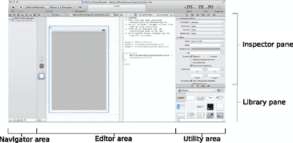

## 它是如何工作的...

现在我们已经加载了带有我们应用程序视图控制器的 Interface Builder，让我们熟悉一下它。

用户界面设计师直接连接到 Xcode 项目。当我们添加一个对象时，Xcode 会自动生成代码来反映我们所做的更改。MonoDevelop 会为我们处理这件事，因为当我们双击 XIB 文件时，它会自动创建一个临时 Xcode 项目，以便我们可以在用户界面中进行我们想要的更改。因此，我们除了设计我们应用程序的用户界面之外，没有更多的事情要做：

界面构建器分为三个区域。下面简要描述每个区域。

1.  **导航区域**：在这个区域，我们可以看到 Xcode 项目中的文件。

1.  **编辑区域**：这个区域是我们设计用户界面的地方。

1.  **实用区域**：这个区域包含**检查器**和**库**面板。**检查器**是我们配置每个对象的地方，而**库**面板是我们查找对象的地方。

编辑区域分为两个部分。左侧的是**设计师**，而右侧的是**辅助**编辑器。在辅助编辑器内部，我们可以看到与设计师中选定的项目对应的底层 Objective-C 源代码文件。尽管我们不需要编辑 Objective-C 源代码，但我们稍后需要辅助编辑器。

## 更多内容...

我们在 Interface Builder 中看到了`XIB`文件的样子。但是，关于这些文件还有更多内容。我们之前提到，`XIB`文件是 Interface Builder 可读取的带有适当信息的 XML 文件。问题是，当项目编译时，编译器也会编译`XIB`文件，将其转换为二进制等效文件：`NIB`文件。`XIB`和`NIB`文件包含完全相同的信息。它们之间的唯一区别是，`XIB`文件是可读的，而`NIB`文件则不是。例如，当我们编译创建的项目时，`MyFirstiPhoneProjectViewController.xib`文件将在输出文件夹中变为`MyFirstiPhoneProjectViewController.nib`。除了二进制转换外，编译器还会对`NIB`文件进行压缩。因此，`NIB`文件的大小将比`XIB`文件小得多。

关于`XIB`文件，还有更多内容。开发者如何管理项目中的`XIB`文件对于应用程序的性能和稳定性非常重要。最好有多个、较小的`XIB`文件，而不是一个或两个大的文件。这可以通过将用户界面分割成多个`XIB`文件来实现。这可能看起来有点困难，但正如我们将在本书后面看到的，这实际上非常简单。我们需要许多较小的`XIB`文件而不是少数几个大的文件，这是因为 iOS 管理内存的方式。当应用程序启动时，iOS 会将`NIB`文件作为一个整体加载到内存中，然后，其中的所有对象都会被实例化。因此，保留那些不一定总是会被使用的对象在`NIB`文件中是一种内存浪费。此外，请记住，你正在为移动设备开发，其可用资源与桌面计算机相比并不匹配，无论其能力如何。

### 更多信息

你可能已经注意到，在**检查器**面板的**属性**选项卡中，有一个名为**模拟度量**的部分。该部分下的选项帮助我们直接在设计器中看到我们的界面在设备的状态栏、工具栏或导航栏下的样子。尽管这些选项保存在`XIB`文件中，但它们与实际运行时的应用程序无关。例如，如果我们将**状态栏**选项设置为**无**，这并不意味着我们的应用程序将没有状态栏启动。

### 注意

**状态栏**是显示在设备屏幕顶部的一部分，向用户显示某些信息，如当前时间、电池状态、iPhone 上的运营商名称等。

## 相关内容

在本章：

+   *创建 UI*

+   *通过输出访问 UI*

+   *添加动作*

在本书中：

第二章, 用户界面：视图：

+   *添加和自定义视图*

第三章: 用户界面：视图控制器：

+   *视图控制器和视图*

# 创建 UI

在这个菜谱中，我们将学习如何在用户界面中添加和管理控件。

## 准备工作

让我们在界面中添加一些控件。首先，在 MonoDevelop 中创建一个新的 iPhone 单视图应用程序项目。将项目命名为`ButtonInput`。当它打开时，双击**解决方案**面板中的`ButtonInputViewController.xib`以使用 Interface Builder 打开它。

## 如何操作...

现在我们有一个新项目，Interface Builder 已打开`ButtonInputViewController.xib`文件，我们将向其中添加一些控件。

### 添加一个标签

1.  如果尚未选择，转到**库**面板并从下拉列表中选择**对象**。选择**标签**对象。

1.  将**标签**拖放到设计器中视图的灰色空间，位于上半部分。

1.  从左侧和右侧选择并调整**标签**的大小，使其吸附到当您接近视图边缘时出现的虚线上。

1.  再次，选择**标签**后，转到**检查器**面板，选择**属性**选项卡，然后在**布局**部分，点击中间的对齐按钮。恭喜你，你已经在应用程序的主视图中添加了一个**标签**！

### 添加一个按钮

我们将执行类似的步骤来在我们的界面中添加按钮。

1.  再次，在**库**面板中，在**对象**部分，选择**按钮**对象。它位于**标签**对象旁边。

1.  将其拖放到视图的下半部分。将其中心与之前添加的**标签**的中心对齐。会出现一条虚线，当两个控件的中心几乎对齐时，**按钮**会自动吸附到它上。

1.  将**按钮**调整到与**标签**相同的宽度。由于**标签**具有透明背景，您无法确切地看到它的宽度，因此当您调整大小并出现三条虚线时，您就会知道**按钮**的宽度相同。

1.  现在，让我们向**按钮**添加一些文本。选择它并转到**检查器**面板。在**属性**选项卡中，在**标题**字段中输入`请点击此处！`。

1.  添加按钮后，通过菜单栏中的**文件 | 保存**保存文档。主视图现在应该看起来像以下截图（在此处显示已调整大小）：

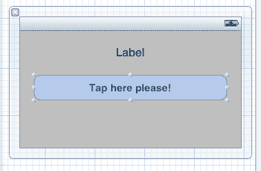

## 它是如何工作的...

如您所见，尽管 Interface Builder 的一些概念似乎很难，但它使用起来相当简单。它还提供了很多反馈。当我们拖动对象时，光标上会出现一个绿色的圆形十字，表示我们可以将对象放在那里。此外，当我们调整控件大小时，我们会在其旁边看到其尺寸。

您也可以通过修改**检查器**面板中**大小**选项卡中的值来调整控件的大小和位置。**大小**选项卡中的另一个有用功能是**自动调整大小**。**自动调整大小**为控件提供布局选项，当我们的应用程序需要支持不同的设备方向时，这可以非常有用。您可以选择一个控件，然后点击**自动调整大小**部分中左边的正方形外部或内部的线条。旁边的图像会动画显示，给您一个印象，当布局改变时控件将如何表现。

## 更多内容...

现在，让我们尝试在 iOS 模拟器上运行应用程序。回到 MonoDevelop，如果尚未选择，请选择**调试 | iPhoneSimulator**的项目配置。现在代码中不需要做任何事情；只需点击**运行**按钮。它是配置组合框右侧的第三个按钮，带有双齿轮图标。当编译完成后，iOS 模拟器将自动启动并运行我们刚刚创建的应用程序！您甚至可以用鼠标点击**按钮**来“点击”它，并看到它的响应。当然，我们的应用程序目前没有任何其他功能。

### 设置按钮标题

通过双击并输入首选标题，可以轻松地设置**按钮**或**标签**的标题。这样做，并观察 Interface Builder 如何显示要执行的操作。

## 参见

在本章中：

+   *编译*

+   *调试我们的应用程序*

在本书中：

第二章, 用户界面：视图：

+   *使用按钮接收用户输入*

+   *使用标签显示文本*

# 通过出口访问 UI

在本食谱中，我们将讨论**出口**的概念以及它们与 MonoTouch 的用法。

## 准备工作

在上一个任务中，我们学习了如何添加控件来形成我们应用程序的基本界面。在本任务中，我们将讨论如何在代码中访问和使用这些控件。启动 MonoDevelop，并打开我们之前创建的项目`ButtonInput`。通过在**解决方案**面板中双击它来在 Interface Builder 中打开项目的`ButtonInputViewController.xib`。

## 如何操作...

1.  打开**辅助编辑器**，*Ctrl-drag*从标签到 Objective-C 源文件，如图下所示：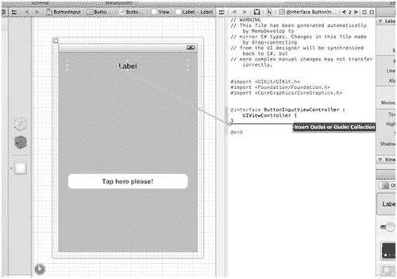

    +   当您释放鼠标时，会出现一个上下文窗口，类似于以下截图：

    

1.  在上下文窗口的**名称**字段中输入`labelStatus,`，然后点击**连接**。

1.  对按钮也做同样的操作，命名为`buttonTap`。通过在菜单栏中选择**文件 | 保存**或按键盘上的*Option* - *S*来保存 Interface Builder 文档。

1.  回到 MonoDevelop，在`ButtonInputViewController`类的`ViewDidLoad`方法中输入以下代码：

    ```swift
    // Create and hook a handler to our button's TouchUpInside event
    // through its outlet
    this.buttonTap.TouchUpInside += delegate( object sender, EventArgs e) {
    this.labelStatus.Text = "Button tapped!";
    };

    ```

1.  这段代码片段为按钮的 TouchUpInside 事件添加了一个处理程序。这个事件类似于 System.Windows.Forms 中按钮控制的 Clicked 事件。它还展示了匿名方法的使用，这仅仅显示了 MonoTouch 如何为.NET 开发者提供 C#功能。就是这样！我们的应用程序现在已经准备好了，带有功能性的控件。

1.  在模拟器上编译并运行它。当你点击按钮时，你会看到标签文本的变化。

## 它是如何工作的...

出口机制基本上是一种将 Interface Builder 对象与代码连接起来的方式。它们是必要的，因为这是我们访问使用 Interface Builder 创建的用户界面对象的唯一方式。这就是 Interface Builder 的工作方式，它不仅仅是 MonoTouch 的解决方案。一个对象的出口提供了一个变量，这样我们就能在项目中使用它。MonoTouch 使开发者的生活变得更加容易，因为当我们创建 Interface Builder 中的出口并将它们连接时，MonoDevelop 会在后台自动生成与这些出口相关的代码。这就是`ButtonInputViewController.designer.cs`添加的内容，为我们提供了访问我们创建的控件：

```swift
[Outlet]
MonoTouch.UIKit.UILabel labelStatus { get; set; }
[Outlet]
MonoTouch.UIKit.UIButton buttonTap { get; set; }

```

这些属性为我们提供了访问控制的功能。它们被装饰了`OutletAttribute`。你可以看到属性的名称与我们为出口输入的确切名称完全相同。这非常重要，因为我们只需要为出口提供一次名称，就不必担心在代码的不同部分重复相同的命名约定。注意，控制变量的类型与我们在用户界面中拖放的控制类型完全相同。这些信息存储在`XIB`文件中，MonoDevelop 会相应地读取这些信息。

## 还有更多...

要删除出口，你首先必须断开连接。例如，要删除`buttonTap`出口，在按钮上*Ctrl* - 点击。在出现的面板中，点击出口旁边的小**（x）**。这将断开出口的连接。

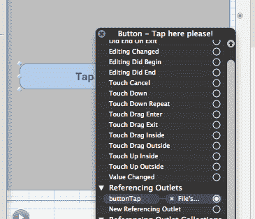

之后，从 Objective-C 源文件中删除以下代码：

```swift
@property (retain, nonatomic) IBOutlet UIButton *buttonTap;

```

当你保存文档时，出口将从 MonoDevelop 项目中移除。

### 通过代码添加出口

添加出口的另一种方式是在你的 C#类中创建一个属性，并用`OutletAttribute`装饰它：

```swift
[Outlet]
UIButton ButtonTap { get; set; }

```

当你在 Interface Builder 中打开`XIB`文件时，出口已经被添加到用户界面中。然而，你仍然需要将其连接到相应的控制。最简单的方法是在控制上*Ctrl* - 点击，然后从**新引用出口**拖动到设计区域左侧的**文件所有者**对象：

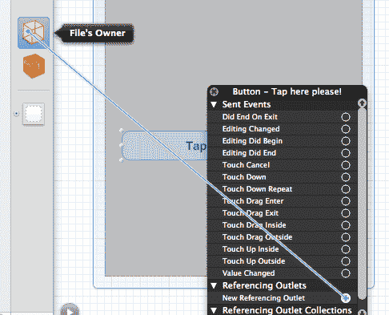

当你释放光标时，从出现的迷你上下文菜单中选择**ButtonTap**出口。

### 注意

注意，是 MonoDevelop 监控在 Interface Builder 中所做的更改，而不是反过来。当在 MonoDevelop 项目中做更改时，请确保始终从 MonoDevelop 内部打开 `XIB` 文件。

## 参见

在这一章中：

+   *界面构建器*

+   *创建 UI*

+   *添加动作*

在这本书中：

第二章，用户界面：视图：

+   *添加和自定义视图*

# 添加动作

在这个菜谱中，我们讨论了 **动作** 的概念及其与 MonoTouch 的使用。

## 准备工作

在这个任务中，我们将讨论如何使用用户界面控件中的动作。在 MonoDevelop 中创建一个新的 iPhone 单视图应用程序项目，并将其命名为 `ButtonInputAction`。在 Interface Builder 中打开 `ButtonInputActionViewController.xib`，并添加与上一个任务中 `ButtonInput` 项目相同的控件、出口和连接。现在不要在项目中添加任何代码。

## 如何做...

向界面对象添加动作类似于添加出口。

1.  在 Interface Builder 中，*Ctrl-drag* 从按钮到源代码文件。在将显示的上下文窗口中，将 **连接** 字段从 **出口** 更改为 **动作**。

1.  在 **名称** 字段中输入 `OnButtonTap`，并在 **事件** 字段中选择 **触摸抬起**，如果尚未选择。

1.  点击 **连接** 按钮，并保存文档。

1.  在 `ButtonInputActionViewController` 类中，添加以下方法：

    ```swift
    partial void OnButtonTap(NSObject sender){
    this.labelStatus.Text = "Button tapped!";
    }

    ```

1.  应用程序已准备就绪！在模拟器中编译并运行。

1.  点击按钮，你会看到标签中的文本发生变化，就像我们在上一个应用程序中创建的那样。

## 它是如何工作的...

Objective-C 中的动作相当于 C# 中的控制事件。它们负责传递各种对象的通告信号。在这个例子中，我们不是在按钮的 `TouchUpInside` 事件上连接一个处理程序，而是为它添加了一个动作。你可能已经注意到了，我们添加的作为动作处理程序的方法被声明为 `partial`。这是因为 MonoDevelop 已经为我们声明了一个部分方法声明。这是我们在 Interface Builder 中保存文档时产生的代码：

```swift
[Action ("OnButtonTap:")]
partial void OnButtonTap (MonoTouch.Foundation.NSObject sender);

```

方法的部分声明用 `ActionAttribute` 标记。这是来自 `MonoTouch.Foundation` 命名空间的其他属性之一，它允许我们将方法公开为 Objective-C 动作。你看到传递给属性的字符串参数与我们输入到 Interface Builder 中的动作名称完全相同，并在其后面附加了一个冒号（:）。

### 注意

Objective-C 中的冒号表示参数的存在。例如，`doSomething` 与 `doSomething:` 不同。它们的区别在于第一个不接受任何参数，而第二个接受一个参数。

动作名称末尾的冒号表示有一个参数；在这种情况下，参数是`MonoTouch.UIKit.NSObject` sender。这是我们在模拟器中点击按钮时应用程序的外观：

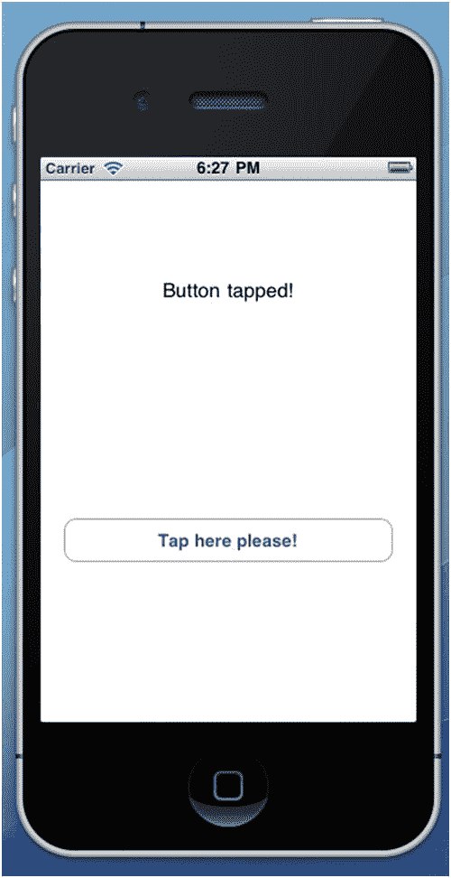

## 还有更多...

之前的示例只是为了展示如何在 MonoTouch 项目中实现动作。用动作替换事件基本上取决于开发者。

## 参考信息

在本章中：

+   *界面构建器*

+   *创建用户界面*

+   *通过出口访问用户界面*

# 编译

在本食谱中，我们将讨论如何使用 MonoDevelop 编译项目。

## 准备工作

MonoDevelop 提供了许多不同的编译选项。在本任务中，我们将讨论这些选项。我们将使用本章中较早创建的`ButtonInput`项目进行工作。

## 如何操作...

1.  在 MonoDevelop 中加载项目后，转到**项目 | ButtonInput 选项**。

1.  在出现的窗口中，从左侧面板的**构建**部分选择**iPhone 构建**。将项目配置设置为**调试**，平台设置为**iPhoneSimulator**。在**链接器行为**字段中，从下拉菜单中选择**链接所有程序集**。在**SDK 版本**字段中，如果尚未选择，请选择**默认**。

1.  现在，转到左侧面板上的**iPhone 应用程序**。

1.  在**摘要**选项卡中，在**应用程序名称**字段中输入`Button Input`，在**版本**字段中输入`1.0`。在**部署目标**下拉菜单中选择**3.0**版本。以下截图显示了**iPhone 应用程序**选项窗口：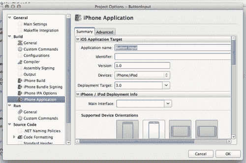

1.  点击**确定**按钮，然后在菜单栏中点击**构建 | 构建全部**来编译项目。

## 它是如何工作的...

我们为项目设置了一些选项。让我们看看这些选项为编译定制提供了什么。

### iPhone 构建选项

我们设置的第一个选项是关于链接器。**链接器**是由 MonoTouch 团队开发的一个工具，并在 SDK 中提供。每次编译 MonoTouch 项目时，编译器不仅编译项目，还会编译它需要的所有 MonoTouch 框架的程序集，这样最终的应用程序才能在设备（或模拟器）上运行。这意味着每个应用程序都附带其自己的 MonoTouch 框架编译版本。这样做意味着最终的应用程序包大小相当大。这就是链接器的作用所在。它所做的就是删除所有未使用的代码的程序集，这样编译器就只会编译应用程序需要和使用的代码。这导致应用程序包的大小大大减小：在移动应用程序中这是一个宝贵的资产。特别是，由于苹果通过蜂窝网络对每个文件有 20MB 的下载限制。链接器选项如下：

我们首先设置的选项是关于链接器的。**链接器**是由 MonoTouch 团队开发的一个工具，并在 SDK 中提供。每次编译 MonoTouch 项目时，编译器不仅编译项目，还会编译它需要的所有 MonoTouch 框架的程序集，以便最终应用程序能够在设备（或模拟器）上运行。这意味着每个应用程序都附带其自己的编译版本的 MonoTouch 框架。这样做意味着最终的应用程序包大小相当大。这就是链接器发挥作用的地方。它所做的就是精简所有未使用的代码，以便编译器只编译应用程序需要和使用的代码。这导致应用程序包的大小大大减小：在移动应用程序中这是一笔宝贵的财富。特别是，由于苹果通过蜂窝网络对每个文件有 20 MB 的下载限制。链接器选项如下：

+   **不链接**：当在模拟器上调试时使用此选项。链接器被关闭，所有程序集都按原样编译。这提供了更快的编译时间。

+   **仅链接 SDK 程序集**：在这里，链接器仅精简 MonoTouch 框架的程序集。项目程序集保持完整。此选项也有效地减小了最终的应用程序大小。

+   **链接所有程序集**：在这里，链接器在所有程序集上被激活。这会稍微减少一些大小。当在代码中使用**反射**或**序列化**时，需要小心使用此选项。代码中通过反射使用的类型和方法对链接器是透明的。如果代码中存在这种情况，请使用`PreserveAttribute`对这些类型或方法进行装饰。此属性基本上是通知链接器不要参与精简过程。

在 SDK 版本字段中，我们设置了编译应用程序将使用的**iOS SDK 版本**。将其设置为**默认**将自动选择系统上安装的最高 SDK 版本。

### iPhone 应用程序选项

在项目选项中“构建”部分的**iPhone 应用程序**窗口中，我们设置了三个选项。第一个选项是**应用程序名称**。这是将在模拟器、设备和 App Store 上显示的应用程序包的名称。正如我们所看到的，我们通常可以在名称中添加空格。第二个选项**版本**定义了应用程序的版本。这是当应用程序最终通过 App Store 分发时将显示的版本。第三个选项**部署目标**是应用程序可以安装的最小 iOS 版本。

## 还有更多...

还有另外两个选项窗口。这些是**iPhone 包签名**和**iPhone IPA**选项。它们将在第十四章的配方中详细讨论，第十四章。部署。

### 链接器使用

### 注意

当为模拟器编译时，不建议开启链接器。这是因为编译器不会在`iPhoneSimulator`平台上编译 MonoTouch 组件；因此它们是直接使用的。开启链接器只会导致编译完成所需的时间更长，对减少最终应用程序包的大小没有影响。

## 参见

在本书中：

第十四章, 部署：

+   *为应用商店准备我们的应用程序*

# 调试我们的应用程序

在本食谱中，我们将讨论在模拟器上调试 MonoTouch 应用程序的信息。

## 准备工作

MonoTouch 与 MonoDevelop 结合使用，为在模拟器或设备上调试应用程序提供调试器。在本任务中，我们将了解如何使用调试器调试 MonoTouch 应用程序。打开 MonoDevelop，并加载`ButtonInput`项目。确保通过在菜单栏上检查**视图 | 工具栏 | 调试器**来激活调试器工具栏。此外，将项目配置设置为**调试 | iPhoneSimulator**。

## 如何操作...

1.  MonoDevelop 支持断点。要激活一行上的断点，请点击行号左侧的空间来设置它。在`Main.cs`文件的以下行设置断点：

    ```swift
    this.labelStatus.Text = "Button tapped!";

    ```

1.  这就是 MonoDevelop 中的断点看起来像：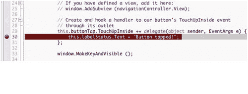

1.  通过点击从左侧开始的第二个带有双齿轮图标的按钮，或通过点击菜单栏上的**运行 | 调试**来编译和调试项目。MonoDevelop 将显示一个消息框，显示消息，**等待调试器连接**。当模拟器打开且应用程序加载时，请关注**应用程序输出**面板中提供的信息。点击应用程序按钮。执行将暂停，MonoDevelop 将以黄色突出显示断点。将鼠标移至断点行中的`labelStatus`变量上。然后 MonoDevelop 将显示一个窗口，其中包含所有已评估变量的成员：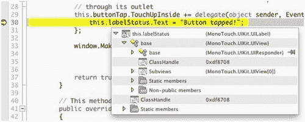

1.  要停止调试，请点击工具栏上的**停止**按钮，按钮上有一个红色的圆圈中白色的(X)标记。

## 它是如何工作的...

MonoTouch 与 MonoDevelop 结合使用，使用一个名为**Soft Debugger**的调试器。之所以称为这个名字，是因为它依赖于运行时和 MonoDevelop 的组合，以提供一个统一的调试平台。当调试过程开始时，MonoDevelop 开始监听来自应用程序的调试信息。在模拟器和设备上调试也是如此。当应用程序执行时，它开始将信息发送回 MonoDevelop，然后 MonoDevelop 在**应用程序输出**面板中显示这些信息，该面板会自动激活。调试时的典型应用程序输出是加载的组件信息、开始执行的所有线程，以及如果有，可用的断点。

## 更多内容...

`Console.WriteLine()` 方法也可以用于调试目的。调试器会处理这个问题，并将方法的输出重定向到 MonoDevelop 的 **应用程序输出** 窗格。

### 调试时的应用程序性能

当为了调试目的进行编译时，编译器会产生更大、更慢的代码。这是因为它生成了额外的代码，这些代码是提供适当调试信息所需的。这就是为什么在调试应用程序时，应用程序的执行速度比简单运行情况慢得多。在生成应用程序的发布副本之前，请记住使用 **Release | iPhone 项目配置** 编译它，以避免运行时执行缓慢。

### `FinishedLaunching` 方法中的断点

不在 `FinishedLaunching` 方法中编写复杂代码的另一个原因是，在大多数情况下，你将无法对其进行调试。如果你在 `FinishedLaunching` 中设置断点，应用程序执行将暂停，但当时间限制达到时，iOS 将终止应用程序。

## 参见

在本书中：

第十四章, 部署：

+   *创建配置文件*

+   *在其他设备上进行调试*
