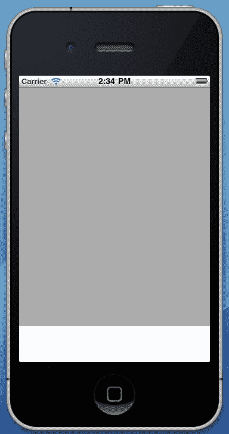
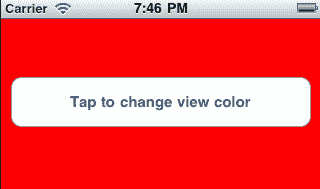
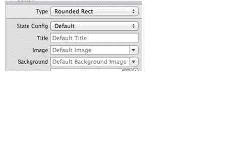
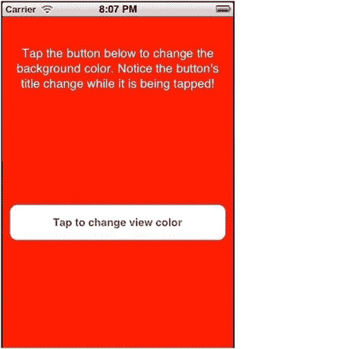
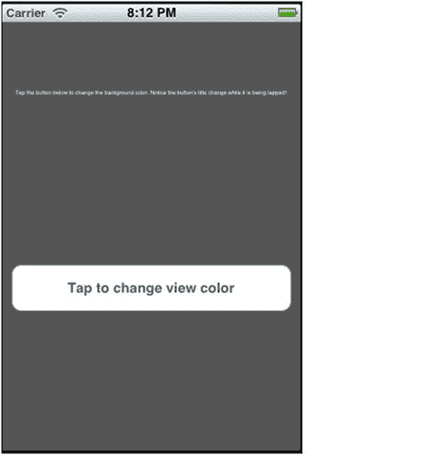
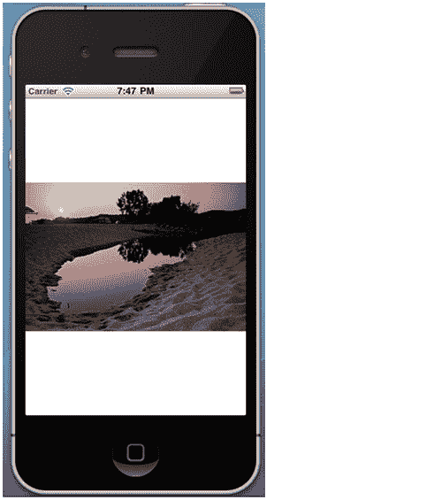
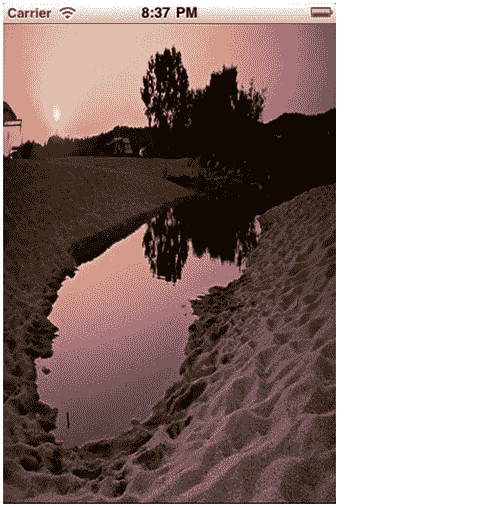

# 第二章：用户界面：视图

在本章中，我们将涵盖以下内容：

+   添加和自定义视图

+   使用按钮接收用户输入

+   使用标签显示文本

+   显示图像

+   显示和编辑文本

+   使用键盘

+   显示进度

+   显示比屏幕更大的内容

+   在分页的内容中导航

+   显示工具栏

+   创建自定义视图

# 简介

应用程序的用户界面对于为用户提供与设备（无论是计算机、移动电话还是平板电脑）进行简单通信的方式至关重要。在移动设备上，用户界面不仅至关重要，而且是与用户交互的唯一方式。开发者在为移动设备开发时必须应对各种限制和约束。处理能力不匹配桌面 CPU，屏幕较小，这使得每次选择要显示的信息类型的过程变得更加困难。

在本章中，我们将讨论 iOS 应用程序 UI 的关键组件。我们将了解如何使用和自定义这些组件以创建丰富的应用程序用户界面，并讨论它们与桌面等价物的相似之处和不同之处。以下是这些组件的列表：

+   `UIView:` 它是一个可定制的容器，是大多数 iOS 用户界面控件的基础对象

+   `UIButton:` 它是.NET 世界中的`Button`的等价物

+   `UILabel:` 它是.NET 世界中的`Label`的等价物

+   `UIImageView:` 它是一个允许我们使用图像显示和创建基本动画的视图

+   `UITextView:` 它是一个允许我们显示可编辑文本的视图

+   `UITextField:` 它类似于.NET 的`TextBox`控件

+   `UIProgressView:` 它显示已知长度的进度

+   `UIScrollView:` 它提供了显示可滚动内容的能力

+   `UIPageControl:` 它为内容提供导航功能，内容分为不同的页面或屏幕

+   `UIToolbar:` 它在屏幕底部提供一个接受可自定义按钮的工具栏

我们还将讨论如何以编程方式创建这些组件的实例并有效地使用它们。

# 添加和自定义视图

在这个任务中，我们将讨论如何使用**Interface Builder**添加和自定义`UIView`。

## 准备工作

使用 Interface Builder 添加视图是一个简单的任务。让我们首先在 MonoDevelop 中创建一个新的**iPhone 单视图应用程序**项目。将项目命名为`FirstViewApp`，并使用 Interface Builder 打开`FirstViewAppViewController.xib`文件。

## 如何操作...

1.  要向项目中添加视图，请从**库**垫拖动一个`UIView`对象到主视图上。确保它适合整个窗口区域。

1.  要使`UIView`可访问，为其创建一个出口，并将其命名为`subView`。

    ### 注意

    关于出口的概念及其使用方法将在第一章中详细讨论，通过出口访问 UI。

1.  选择我们刚刚添加的视图，并转到**检查器**面板。选择**属性**选项卡，并在**背景**下拉列表中选择**浅灰色**。

1.  现在，选择**大小**选项卡，并将视图的高度减少`60`点。

1.  保存文档。

1.  在模拟器上编译并运行应用程序。结果应该看起来像以下图像：



+   模拟器屏幕的灰色部分是我们刚刚添加的视图。

## 如何工作...

我们已经成功创建了一个包含一个视图的应用程序。当然，这个应用程序不提供任何功能。它只是为了展示如何添加视图并显示它。

视图是 iOS 应用程序界面的基本组件。每个视觉 UI 对象都继承自`UIView`类。这个概念与.NET 中的`Form`有所不同。视图管理内容绘制，接受其他视图作为子视图，提供自动调整大小功能，可以接受自身及其子视图的触摸事件，并且许多属性甚至可以动画化。甚至`UIWindow`也继承自`UIView`。iOS 开发者将最频繁地使用这个类或其继承者。

当使用 Interface Builder 添加的视图在运行时首次实例化时，它会通过**检查器**窗口的**大小**选项卡设置其`Frame`属性。`Frame`属性的类型是`RectangleF`，它定义了视图在其父视图的坐标系中的位置，在我们的例子中是主窗口，以及其大小以点为单位。

### 注意

在 Objective-C 中，`UIView`的`Frame`属性是`CGRect`类型。这个类型在 MonoTouch 中没有绑定，而是使用了更熟悉的`System.Drawing.RectangleF`。

父视图是一个视图的父视图，而子视图是其子视图。具有相同父视图的视图被称为兄弟视图。

iOS 的默认坐标系起源于左上角，并向底部和右侧延伸。坐标系的原点始终相同，并且不能通过编程方式更改。

iOS 的坐标系在以下图像中显示：


当设置`Frame`属性时，它会调整`Bounds`属性。`Bounds`属性定义了视图在其自身坐标系中的位置以及其大小以点为单位。它也是`RectangleF`类型。`Bounds`属性的默认位置是`(0,0)`，其大小始终与视图的`Frame`值相同。这两个属性的尺寸相互关联，因此当您更改`Frame`的大小，`Bounds`的大小也会相应地更改，反之亦然。您可以将`Bounds`属性更改为显示视图的不同部分。视图的`Frame`可以在位置和位置上超出屏幕。也就是说，具有值（x = -50, y = -50, width = 1500, height = 1500）的视图框架是完全可接受的。

## 还有更多...

另一点需要注意的是，`UIView` 类继承自 `UIResponder`。`UIResponder` 类负责响应用和处理事件。当一个视图被添加到另一个视图中时，它成为其响应链的一部分。`UIView` 类公开了 `UIResponder` 的属性和方法，我们现在感兴趣描述的是以下两个：

1.  `IsFirstResponder` **属性**：它返回一个布尔值，指示视图是否是第一个响应者。基本上，它表示视图是否有焦点。

1.  `ResignFirstResponder():` 它会导致视图失去焦点。

### 以编程方式添加视图

如果我们想以编程方式添加视图，我们将使用 `UIView.AddSubview(UIView)` 方法：

```swift
this.View.AddSubview(this.subView);

```

`AddSubview()` 方法将其参数（类型为 `UIView`）添加到调用者的子视图列表中，并将其 `Superview` 参数设置为调用者。除非使用 `AddSubview()` 方法将其添加到父视图中，否则视图将不会显示。此外，如果视图已经有一个父视图，并且使用其 `AddSubview()` 方法添加到另一个视图中，则其 `Superview` 将更改为新调用者的 `Superview`。这意味着视图每次只能有一个父视图。

### 注意

当使用 Interface Builder 添加视图作为子视图时，不需要使用 `AddSubview()` 方法来显示子视图。但是，当以编程方式添加视图时，必须调用 `AddSubview()` 方法。

以编程方式从父视图中移除视图，请调用其 `RemoveFromSuperview()` 方法。如果对没有父视图的视图调用此方法，则没有任何作用。当我们想要重用要删除的视图时，必须注意。我们必须保留对其的引用，否则在方法调用后它可能会被释放。

### 视图内容布局

`UIView` 的另一个重要属性是 `ContentMode`。`ContentMode` 接受枚举类型 `UIViewContentMode` 的值。此属性设置 `UIView` 如何显示其内容。此属性的默认值是 `UIViewContentMode.ScaleToFill`，它将内容缩放到与视图大小完全匹配，如果需要则进行扭曲。

## 参见

在本章中：

+   *创建自定义视图*

在本书中：

第一章，通过输出口访问 UI。

+   *创建 UI*

+   *通过输出口访问 UI*

第三章，*用户界面：视图控制器：*

+   *视图控制器* 和 *视图*

# 使用按钮接收用户输入

在本食谱中，我们将学习如何使用按钮接收和响应用户输入。

## 准备工作

我们在 第一章 中使用了按钮，讨论了如何使用 Interface Builder 向用户界面添加控件。在这个任务中，我们将更详细地描述 `UIButton` 类。在 MonoDevelop 中打开我们在上一个任务中创建的 `FirstViewApp` 项目。将主视图的高度增加到在 Interface Builder 中覆盖整个屏幕，并保存文档。

## 如何做到这一点...

我们将在界面中程序化地添加一个按钮，当它被轻触时，将改变视图的背景颜色。

1.  打开 `FirstViewAppViewController.cs` 文件，并在类中输入以下代码：

    ```swift
    UIButton buttonChangeColor;
    private void CreateButton (){
    RectangleF viewFrame = this.subView.Frame;
    RectangleF buttonFrame = new RectangleF (10f, viewFrame.Bottom - 200f, viewFrame.Width - 20f, 50f);
    this.buttonChangeColor = UIButton.FromType (UIButtonType.RoundedRect);
    this.buttonChangeColor.Frame = buttonFrame;
    this.buttonChangeColor.SetTitle ("Tap to change view color", UIControlState.Normal);
    this.buttonChangeColor.SetTitle ("Changing color...", UIControlState.Highlighted);
    this.buttonChangeColor.TouchUpInside += this.buttonChangeColor_TouchUpInside;
    this.subView.AddSubview (this.buttonChangeColor);
    }
    bool isRed;
    private void buttonChangeColor_TouchUpInside (object sender, EventArgs e){
    if (this.isRed) {
    this.subView.BackgroundColor = UIColor.LightGray;
    this.isRed = false;
    } else {
    this.subView.BackgroundColor = UIColor.Red;
    this.isRed = true;
    }
    }

    ```

1.  在 `ViewDidLoad()` 方法中，添加以下行：

    ```swift
    this.CreateButton ();

    ```

1.  在模拟器上编译并运行应用程序。当按钮被轻触时，结果应类似于以下截图：



## 它是如何工作的...

在这个任务中，我们向用户界面添加了一个按钮，该按钮会改变父视图的背景颜色。此外，我们没有使用任何 Interface Builder 就完成了这个任务。

让我们看看代码是如何工作的。

1.  我们创建一个将保存按钮对象的字段：

    ```swift
    // A button to change the view's background color
    UIButton buttonChangeColor;

    ```

1.  在 `CreateButton()` 方法中，我们创建按钮并设置一些属性。

    ```swift
    RectangleF viewFrame = this.subView.Frame;
    RectangleF buttonFrame = new RectangleF (10f, viewFrame.Bottom - 200f, viewFrame.Width - 20f, 50f);

    ```

1.  首先，我们将视图的 `Frame` 分配给一个名为 `viewFrame` 的新变量。然后，我们创建一个名为 `buttonFrame` 的新 `RectangleF` 对象，它将被分配给按钮的 `Frame` 属性。现在我们为按钮有了框架，我们可以初始化它，如下面的代码片段所示：

    ```swift
    //Create the button.
    this.buttonChangeColor = UIButton.FromType (UIButtonType.RoundedRect);
    this.buttonChangeColor.Frame = buttonFrame;

    ```

1.  按钮是通过静态方法 `UIButton.FromType(UIButtonType)` 初始化的。此方法接受一个 `UIButtonType` 类型的参数，并返回 iOS SDK 中包含的预定义按钮类型。这里使用的 `UIButtonType.RoundedRect` 按钮枚举值是 iOS 按钮的默认类型，具有圆角。在 `buttonChangeColor` 对象初始化后，我们将它的 `Frame` 设置为我们之前创建的 `RectangleF` 值。

1.  现在我们已经为按钮提供了初始化代码，我们将设置其标题（没错，不止一个）：

    ```swift
    // Set the button's titles
    this.buttonChangeColor.SetTitle ("Tap to change view color", UIControlState.Normal);
    this.buttonChangeColor.SetTitle ("Changing color...", UIControlState.Highlighted);

    ```

1.  我们调用了 `UIButton.SetTitle(string, UIControlState)` 方法两次。此方法负责为每个给定的按钮状态设置按钮的标题。字符串参数是实际要显示的标题。第二个参数是表示应用于控件的不同控件状态的 `UIControlState` 类型的枚举。这些控件状态是：

    +   `Normal:` 启用控件的默认空闲状态

    +   `Highlighted:` 控件在触摸事件发生时的状态

    +   `Disabled:` 控件被禁用且不接受任何事件

    +   `Selected:` 控件已被选中。在大多数情况下，此状态不适用。然而，当需要选择状态时，例如在 `UISegmentedControl` 对象中，它是有用的。

    +   `Application:` 用于应用程序用途的附加控件状态值

    +   `Reserved:` 用于内部框架使用

        因此，使用 `UIButton.SetTitle(string, UIControlState)` 方法，我们设置了按钮在其默认状态下显示的标题以及在被点击时显示的标题。

1.  之后，我们设置按钮的 `TouchUpInside` 事件处理程序，并将其添加为 `subView:` 的子视图

    ```swift
    this.buttonChangeColor.TouchUpInside += this.buttonChangeColor_TouchUpInside;
    this.subView.AddSubview (this.buttonChangeColor);

    ```

1.  在 `buttonChangeColor_TouchUpInside` 事件中，我们根据我们声明的布尔字段更改视图的背景颜色：

    ```swift
    if (this.isRed) {

    this.subView.BackgroundColor = UIColor.LightGray;
    this.isRed = false;
    } else {
    this.subView.BackgroundColor = UIColor.Red;
    this.isRed = true;
    }

    ```

这是通过将视图的 `BackgroundColor` 属性设置为所需的 `UIColor` 类实例来完成的，如之前突出显示的代码所示。`UIColor` 对象是一个具有许多不同静态方法和属性的类，允许我们创建不同的颜色对象。

当你在模拟器上编译并运行应用程序时，请注意当你点击按钮时视图的颜色变化，以及当鼠标光标（或设备上的手指）接触按钮时按钮标题的变化。

## 更多...

在这个任务中，我们使用了 `UIButton.FromType(UIButtonType)` 静态方法来初始化按钮。以下是 `UIButtonType` 枚举标志的简要描述：

+   `Custom:` 它是一个无边框的透明按钮。在创建具有图像背景的自定义按钮时使用此标志。按钮的标题不是透明的。

+   `RoundedRect:` 它是具有圆角按钮的默认类型。

+   `DetailDisclosure:` 它是一个圆形的蓝色按钮，用于显示与项目相关的附加信息。

+   `InfoLight:` 它是一个带有字母（i）的浅色按钮，代表信息显示。

+   `InfoDark:` 它与 `InfoLight` 相同，以深色显示。

+   `ContactAdd:` 它是一个带有白色加号（+）的圆形蓝色按钮。通常用于显示要添加到项目中的联系信息。

### 创建自定义按钮

要创建具有类型 `UIButtonType.Custom` 的自定义按钮，请使用 `UIButton` 类的 `SetBackgroundImage()` 和 `SetImage()` 方法。它们都接受一个 `UIImage` 和一个 `UIControlState` 参数，因此可以为不同的控件状态设置不同的图像。在设置按钮的图像时，无论是创建自定义按钮还是不是，务必相应地设置 `UIButton.ContentMode` 属性。

`SetImage` 和 `SetBackgroundImage` 方法提供的功能也可以在 Interface Builder 中 **Inspector** 面板的 **Attributes** 选项卡的 **Image** 和 **Background** 字段中完成。从下拉列表框中选择要设置所需图像的状态，并设置图像文件的路径，如下面的屏幕截图所示：



## 参见

在本章中：

+   *添加和自定义视图*

+   *显示图像*

+   *创建自定义视图*

在本书中：

第一章, *开发工具:*

+   *创建 UI*,

+   *通过 Outlets 访问 UI*

# 使用标签显示文本

在这个菜谱中，我们将学习如何使用标签向用户显示信息文本。

## 准备工作

在这个任务中，我们将更详细地描述`UILabel`类。再次强调，所有的工作都将在没有 Interface Builder 的帮助下完成。打开我们在上一个菜谱中修改的`FirstViewApp`项目。

## 如何做到这一点...

我们将程序化地创建一个标签，该标签将显示一些静态的指导文本。

1.  打开文件`FirstViewAppViewcontroller.cs`，并在类中输入以下代码：

    ```swift
    UILabel labelInfo;
    private void CreateLabel (){
    RectangleF viewFrame = this.subView.Frame;
    RectangleF labelFrame = new RectangleF (10f, viewFrame.Y + 20f, viewFrame.Width - 20f, 100f);
    this.labelInfo = new UILabel (labelFrame);
    this.labelInfo.Lines = 3;
    this.labelInfo.TextAlignment = UITextAlignment.Center;
    this.labelInfo.BackgroundColor = UIColor.Clear;
    this.labelInfo.TextColor = UIColor.White;
    this.labelInfo.ShadowColor = UIColor.DarkGray;
    this.labelInfo.ShadowOffset = new SizeF (1f, 1f);
    this.labelInfo.Text = "Tap the button below to change the background color." + " Notice the button's title change while it is being tapped!";
    //this.labelInfo.AdjustsFontSizeToFitWidth = true;
    this.subView.AddSubview (this.labelInfo);
    }

    ```

1.  然后在`FinishedLaunching()`方法中添加以下行：

    ```swift
    this.CreateLabel();

    ```

1.  在模拟器上编译并运行应用程序。输出应该看起来像以下截图：



## 它是如何工作的...

我们已经成功创建了一个标签，并在其中放入了一些信息文本。让我们逐步查看代码，看看实际上发生了什么。

1.  我们首先在`FirstViewAppViewController`类中创建一个`labelInfo`字段，用于存储我们的`UILabel`对象。

    ```swift
    // A label that displays some text
    UILabel labelInfo;

    ```

1.  然后我们创建了一个名为`CreateLabel()`的方法，该方法将实例化和定制标签。就像我们在上一个任务中创建的按钮一样，我们的标签需要一个框架。因此，我们再次创建一个，这取决于视图的`Frame`属性：

    ```swift
    //Create the appropriate rectangles for the label's frame
    RectangleF viewFrame = this.subView.Frame;
    RectangleF labelFrame = new RectangleF (10f, viewFrame.Y + 20f, viewFrame.Width - 20f, 100f);

    ```

1.  我们只需将其高度设置为高于按钮的高度，即`100`点。现在我们已经为标签有了`Frame`，我们初始化它：

    ```swift
    //Create the label
    this.labelInfo = new UILabel (labelFrame);
    this.labelInfo.Lines = 3;
    this.labelInfo.TextAlignment = UITextAlignment.Center;
    this.labelInfo.BackgroundColor = UIColor.Clear;

    ```

1.  构造函数被使用，这样框架属性将在初始化时立即设置。行属性决定了标签文本上的文本将被分成多少行。文本对齐属性接受枚举类型`UITextAlignment`的值，它包含常用的文本对齐标志：居中、左对齐和右对齐。为了使标签的框架完全不可见，以便只有我们的文本可见，我们将`BackgroundColor`属性设置为`UIColor.Clear`颜色。

1.  下一个部分非常有趣。除了能够设置`label`的字体颜色外，我们还可以为显示的文本设置阴影：

    ```swift
    // Set text color and shadow
    this.labelInfo.TextColor = UIColor.White;
    this.labelInfo.ShadowColor = UIColor.DarkGray;
    this.labelInfo.ShadowOffset = new SizeF (1f, 1f);

    ```

1.  `TextColor`属性接受`UIColor`值。要为标签的文本设置阴影，将`UIColor`设置到`ShadowColor`属性。然后，将`SizeF`结构设置到`ShadowOffset`属性。此属性决定了阴影的确切位置。`SizeF`的宽度参数定义了阴影的水平位置，而高度参数定义了垂直位置。负值是可以接受的。宽度参数的负值意味着阴影将定位在文本的左侧，而高度参数的负值意味着阴影将定位在文本上方。我们在前面的代码中设置的值意味着阴影将显示在文本右侧 1 点，下方 1 点。

1.  我们已经准备好了`label`如何渲染其文本。要分配`label`将显示的文本，设置其`Text`属性：

    ```swift
    // Set text to be displayed
    this.labelInfo.Text = "Tap the button below to change the background color." + " Notice the button's title change while it is being tapped!";

    ```

1.  如您所见，我们为 `label` 定义了一个相当长的字符串以供显示。最后，将 `label` 添加到要显示的视图中：

    ```swift
    this.mainView.AddSubview (this.labelInfo);

    ```

此代码给出了本任务 *如何做* 部分所示的结果。

## 还有更多...

在前面的代码中，还有一行注释掉的代码：

```swift
//this.labelInfo.AdjustsFontSizeToFitWidth = true;

```

`AdjustsFontSizeToFitWidth` 属性接受一个布尔值。如果设置为 `true`，则指示 `label` 自动更改字体大小，以便它能够适应 `label` 的宽度。如果 `label` 支持多行，则将此属性设置为 `true` 完全没有效果。所以，为了看看这个属性是如何工作的，取消注释它并将 `Lines` 属性设置为 `1`。结果将类似于以下内容：



如您所见，`label` 上的文本需要放大镜才能阅读，所以在这里它不能正常工作。然而，当屏幕上 `label` 的宽度有限且我们希望文本适应该空间时，`AdjustsFontSizeToFitWidth` 属性非常有用。为了防止这种情况，将 `MinimumFontSize` 属性设置为所需的值。正如其名称所暗示的，字体的大小不会小于此属性的值。

### `UILabel` 字体

在 `label` 中设置显示文本的字体很简单。使用 `UIFont.FromName(string, float)` 静态方法设置其 `Font` 属性。`string` 参数表示要设置的字体名称，可以包括字体家族和样式，而 `float` 参数确定其大小。例如，要将 `label` 的字体设置为 `Helvetica Bold`，请调用以下方法：

```swift
this.labelInfo.Font = UIFont.FromName("Helvetica-Bold", 17f);

```

如果找不到字体名称，`FromName` 静态方法将返回 `null`。对此必须小心，因为当 `UILabel.Font` 属性被设置为 `null` 时，将会抛出异常。可以通过调用 `UIFont.FontNamesForFamilyName(string)` 方法来确定字体家族的可用样式，该方法返回一个包含所有可用字体的 `string[]` 数组。如果将 `Helvetica` 字体家族传递给此方法，它将返回一个包含以下项的 `string[]` 数组：

+   Helvetica-BoldOblique

    Helvetica

    Helvetica-Bold

    Helvetica-Oblique

## 参见

在本章中：

+   *显示和编辑文本*

在本书中：

第一章, 使用连接访问 UI：

+   *创建 UI*

*第十一章，图形和动画：*

+   *显示闪烁的文本*

# 显示图片

在本食谱中，我们将学习如何使用 `UIImageView` 类在屏幕上显示图片。

## 准备工作

在这个任务中，我们将了解如何在项目中打包和显示图片。显示需要使用一个图片文件。这里使用的图片文件名为 `Toroni.jpg`。在 MonoDevelop 中创建一个新的 **iPhone 单视图应用程序** 项目，并将其命名为 `ImageViewerApp`。

## 如何做...

1.  在 Interface Builder 中打开 `ImageViewerAppViewController.xib` 文件。

1.  在其视图中添加一个`UIImageView`对象。将`UIImageView`对象与名为`imageDisplay`的出口连接。

1.  保存文档。

1.  返回到 MonoDevelop，在`ImageViewerAppViewController`类中，输入以下代码：

    ```swift
    public override ViewDidLoad(){
    base.ViewDidLoad();
    this.imageDisplay.ContentMode = UIViewContentMode.ScaleAspectFit;
    this.imageDisplay.Image = UIImage.FromFile("Toroni.jpg");
    }

    ```

1.  在**解决方案**面板中右键单击项目，然后选择**添加 | 添加文件**。选择要显示的图像文件，然后单击**打开**。

1.  右键单击您刚刚添加的图像文件，然后单击**构建操作 | 内容**。

1.  最后，在模拟器上编译并运行应用程序。您添加到项目中的图像应显示在屏幕上，如下面的图像所示：



## 如何工作...

`UIImageView`类基本上是一个用于显示图像的自定义视图。在项目中添加图像时，其**构建操作**必须在**解决方案**面板中设置为**内容**，否则图像将不会复制到应用程序包中。

当显示图像时，`ContentMode`属性非常重要。它设置`UIView`（在这种情况下为`UIImageView`）对象显示图像的方式。我们将其设置为`UIViewContentMode.ScaleAspectFit`，这样它将被调整大小以适应`UIImageView`的区域，同时保持宽高比不变。如果`ContentMode`字段保留为默认的`Scale To Fill`值，输出将类似于以下图像：



要设置`UIImageView`应显示的图像，我们使用`UIImage`对象设置其`Image`属性：

```swift
this.imageDisplay.Image = UIImage.FromFile("Toroni.jpg");

```

`ContentMode`属性接受一个名为`UIViewContentMode`的枚举类型。提供的值如下：

+   **填充以适应**：这是基本**UIView**对象的默认值。它将内容缩放到适合视图的大小，必要时更改宽高比。

+   **缩放以适应视图**：将内容缩放到适合视图的大小，同时保持其宽高比。视图内容剩余区域变为透明。

+   **填充以适应视图**：将内容缩放到填充视图的大小，同时保持其宽高比。内容的一些部分可能被省略。

+   **重绘**：当视图的边界发生变化时，其内容不会被重绘。此值会导致内容被重绘。在 CPU 周期方面，绘制内容是一项昂贵的操作，因此在使用此值之前请三思，特别是对于大量内容。

+   **中心**：将内容放置在视图的中心，保持其宽高比。

+   **顶部、底部、左侧、右侧、左上角、右上角、左下角**和**右下角**：根据相应的值在视图中对齐内容。

## 还有更多...

`UIImage`类是表示图像信息的对象。它支持的文件格式列在以下表中：

| 文件格式 | 文件扩展名 |
| --- | --- |
| 可移植网络图形 (PNG) | .png |
| 联合图像专家小组 (JPEG) | .jpg, .jpeg |
| 标记图像文件格式 (TIFF) | .tiff, .tif |
| 图像交换格式 | .gif |
| Windows 位图格式 | .bmp |
| Windows 图标格式 | .ico |
| Windows 光标 | .cur |
| XWindow 位图 | .xbm |

### 注意

`UIImageView` 类不支持动画 GIF 图像文件。当动画 GIF 设置为 `UIImageView` 的 `Image` 属性时，只会显示其第一帧。

### 使用不同屏幕尺寸的图像

为背景创建图像为开发者提供了制作丰富和优雅的用户界面的能力。创建视图背景的首选图像文件格式是 `PNG`。但是，自从 iPhone 4 发布以来，屏幕分辨率提高了。为了在应用程序中支持两种屏幕分辨率，iOS SDK 提供了一个简单的解决方案。只需将图像保存为高分辨率，并在扩展名之前添加一个 `@2x` 后缀到文件名，例如，名为 `Default.png` 的文件的高分辨率版本将被命名为 `Default@2x.png`。另外，使用这两个文件不需要额外的代码。

只需使用 `UIImage.FromBundle(string)` 静态方法，传递不带扩展名的文件名，iOS 会根据应用程序运行的设备加载适当的文件。

```swift
this.imageDisplay = UIImage.FromBundle("Default");

```

### 注意

上述内容仅适用于 PNG 图像文件。

## 参见

在本章：

+   *添加和自定义视图*

在本书中：

第七章，多媒体资源：

+   *加载图像*

# 显示和编辑文本

在这个菜谱中，我们将学习如何显示具有编辑功能的简单文本块。

## 准备工作

在这个任务中，我们将讨论 `UITextView` 的用法以及如何使用它显示可编辑文本。在 MonoDevelop 中创建一个新的 **iPhone 单视图应用程序** 项目，并将其命名为 `TextViewApp`。

## 如何操作...

1.  在 Interface Builder 中打开 `TextViewAppViewController.xib`。

1.  在其视图的顶部附近添加一个 UIButton，在其下方添加一个 UITextView。将这两个对象连接到它们的出口。

1.  保存文档。

1.  在 MonoDevelop 中，在 `TextViewAppViewController` 类中输入以下 `ViewDidLoad` 方法：

    ```swift
    public override void ViewDidLoad (){
    base.ViewDidLoad ();
    this.buttonFinished.Enabled = false;
    this.buttonFinished.TouchUpInside += delegate {
    this.myTextView.ResignFirstResponder();
    } ;
    this.myTextView.Delegate = new MyTextViewDelegate(this);
    }
    Add the following nested class:
    private class MyTextViewDelegate : UITextViewDelegate{
    public MyTextViewDelegate (TextViewAppViewController parentController){
    this.parentController = parentController;
    }
    private TextViewAppViewController parentController;
    public override void EditingStarted (UITextView textView){
    this.parentController.buttonFinished.Enabled = true;
    }
    public override void EditingEnded (UITextView textView){
    this.parentController.buttonFinished.Enabled = false;
    }
    public override void Changed (UITextView textView){
    Console.WriteLine ("Text changed!");
    }
    }//end void MyTextViewDelegate

    ```

1.  在模拟器上编译并运行应用程序。

1.  在文本视图中轻触某处，键盘就会出现。输入一些文本，然后轻触 **完成** 按钮以隐藏键盘。

## 它是如何工作的...

`UITextView` 类提供了一个显示可编辑文本块的对象。为了响应用户文本视图中的事件，我们实现了一个继承自 `UITextViewDelegate` 的类，该类将充当文本视图的代理：

```swift
private class MyTextViewDelegate : UITextViewDelegate{
public MyTextViewDelegate (TextViewAppViewController parentController){
this.parentController = parentController;
}
private TextViewAppViewController parentController;

```

我们声明了一个接受 `TextViewAppViewController` 对象的构造函数，这样我们就可以有一个控制器实例来访问我们的控件。

然后，我们重写了 `UITextViewDelegate` 类的三个方法：

```swift
public override void EditingStarted (UITextView textView){
this.parentController.buttonFinished.Enabled = true;
}
public override void EditingEnded (UITextView textView){
this.parentController.buttonFinished.Enabled = false;
}
public override void Changed (UITextView textView){
Console.WriteLine ("Text changed!");
}

```

这些方法是在触发相应事件时将被调用的处理程序。当点击文本时，`EditingStarted()` 方法被调用。我们在其中启用 **完成** 按钮。当我们向文本视图中输入一些文本时，`Changed()` 方法被调用，我们可以在 MonoDevelop 的 **应用程序输出** 面板中看到 `Console.WriteLine()` 方法的输出。最后，当我们点击 **完成** 按钮时，键盘隐藏，并调用允许我们禁用按钮的 `EditingEnded()` 方法。

在 `ViewDidLoad` 方法中，我们为按钮的 `TouchUpInside` 事件分配一个处理程序：

```swift
this.buttonFinished.TouchUpInside += delegate {
this.myTextView.ResignFirstResponder ();
};

```

我们在它里面调用文本视图的 `ResignFirstResponder()` 方法，这样当按钮被点击时，文本视图将失去焦点，导致键盘隐藏。然后，我们将我们创建的委托的新实例分配给文本视图的 `Delegate` 属性，传递 `TextViewAppViewController` 对象的实例：

```swift
this.myTextView.Delegate = new MyTextViewDelegate (this);

```

## 还有更多...

Objective-C 中的委托与 C# 中的委托有所不同。尽管在两个世界中它们最常用的用途都是提供对某种形式的事件通知机制的访问，但在 Objective-C 中，这种机制要复杂一些。C# 委托类似于 C 或 C++ 编程语言中的函数指针。它是一个包含对特定签名方法引用的对象。另一方面，Objective-C 委托是一种符合特定协议的对象。它基本上是一个封装了一个或多个方法（以及/或其它成员）作为事件处理器的对象。

### 注意

Objective-C 协议类似于 C# 中的接口。

代理对象的概念一开始可能看起来有些复杂，但并不难理解。关于事件通知机制，MonoTouch 通过为大多数对象提供事件来简化了 .NET 开发者的工作。

### 注意

`UITextView` 类适合显示不带格式的简单文本块。对于显示格式化文本，请使用 `UIWebView` 类。

## 相关内容

在本章中：

+   *使用键盘*

在本书中：

第五章, 显示数据：

*显示和格式化文本*

# 使用键盘

在这个配方中，我们将讨论虚拟键盘使用的一些重要方面。

## 准备工作

在前两个任务中，我们讨论了可用的文本输入类型。在这个任务中，我们将讨论我们可以做的一些事情，甚至必须做的事情，以有效地使用键盘。在 MonoDevelop 中创建一个新的 **iPhone 单视图应用程序** 项目，并将其命名为 `KeyboardApp`。

## 如何做...

按照以下步骤创建项目：

1.  在 Interface Builder 中打开 `KeyboardAppViewController.xib` 文件。

1.  在视图的下半部分添加一个 `UITextField` 对象，并将其连接到一个出口。

1.  保存文档。

1.  回到 MonoDevelop，在 `KeyboardAppViewController` 类中输入以下代码：

    ```swift
    private NSObject kbdWillShow, kbdDidHide;
    public override void ViewDidLoad(){
    base.ViewDidLoad();
    this.emailField.KeyboardType = UIKeyboardType.EmailAddress;
    this.emailField.ReturnKeyType = UIReturnKeyType.Done;
    this.kbdWillShow = NSNotificationCenter.DefaultCenter. AddObserver (UIKeyboard.WillShowNotification, delegate(NSNotification ntf) {
    RectangleF kbdBounds = UIKeyboard.FrameEndFromNotification (ntf);
    RectangleF textFrame = this.emailField.Frame;
    textFrame.Y -= kbdBounds.Height;
    this.emailField.Frame = textFrame;
    } );
    this.kbdDidHide = NSNotificationCenter.DefaultCenter.AddObserver (UIKeyboard.DidHideNotification, delegate(NSNotification ntf){
    RectangleF kbdBounds = UIKeyboard.FrameEndFromNotification (ntf);
    RectangleF textFrame = this.emailField.Frame;
    textFrame.Y += kbdBounds.Height;
    this.emailField.Frame = textFrame;
    } );
    this.emailField.ShouldReturn = delegate(UITextField textField) {
    return textField.ResignFirstResponder ();
    } ;
    }

    ```

1.  在模拟器上编译并运行应用程序。

1.  点击文本字段，并观察它向上移动以避免被键盘遮挡。

1.  点击键盘上的**完成**按钮，并观察当键盘隐藏时文本字段返回到其原始位置。

## 它是如何工作的...

iOS 中有各种类型的键盘。由于屏幕尺寸有限，不能一次性显示所有键，因此根据我们需要用户提供的文本输入设置适当的键盘类型是一种良好的做法。在这个项目中，我们将键盘设置为**电子邮件地址**类型。我们还通过将其设置为**完成**来定制了**返回**键的类型。

```swift
this.emailField.KeyboardType = UIKeyboardType.EmailAddress;
this.emailField.ReturnKeyType = UIReturnKeyType.Done;

```

当键盘显示时，开发者的责任是确保它不会遮挡必要的 UI 元素。在这种情况下，因为我们为用户提供了一些文本输入的能力，我们必须确保文本字段是可见的，以便用户可以看到正在输入的内容。为此，我们在默认的通知中心添加了两个观察者。

```swift
// Add observers for the keyboard
this.kbdWillShow = NSNotificationCenter.DefaultCenter.AddObserver (UIKeyboard.WillShowNotification, delegate(NSNotification ntf) {

```

`NSNotificationCenter`为各种通知提供了一个通知机制。

我们通过`NSNotificationCenter.DefaultCenter`静态属性访问运行时的默认通知中心。使用`AddObserver()`方法添加了一个观察者，它接受两个参数。第一个参数是一个`NSString`值，它通知通知中心要观察哪种类型的通知。`UIKeyboard`类包含预定义的静态属性，具有我们需要的键盘通知类型。`UIKeyboard.WillShowNotification`被传递，表示观察者将在键盘准备好出现时进行观察并通知。第二个参数是`Action<NSNotification>`类型，表示当通知发生时将被执行的处理程序。在`anonymous()`方法内部，我们调用`UIKeyboard.FrameEndNotification(NSNotification)`方法，该方法返回键盘的边界：

```swift
//Get the keyboard's bounds
RectangleF kbdBounds = UIKeyboard.FrameEndNotification (ntf);

```

然后，我们将文本字段的框架存储在一个变量中，并减少其`Y`位置值，以便文本字段向上移动：

```swift
// Get the text field's frame
RectangleF textFrame = this.emailField.Frame;
// Change the y position of the text field frame
textFrame.Y -= kbdBounds.Height;

```

当新的框架设置为`emailField`时，它将移动到新的位置：

```swift
this.emailField.Frame = textFrame;

```

第二个观察者是为了将文本字段移回其原始位置。它与第一个观察者几乎相同，除了两个区别。传递了`UIKeyboard.DidHideNotification`字符串，指示观察者在键盘关闭后触发处理程序，并将文本字段框架的`Y`值增加，使文本字段返回到其原始位置。

## 还有更多...

类中`NSObject`类型的两个字段包含有关我们添加的观察者的信息。为了移除我们在此处添加的两个观察者，请添加以下代码：

```swift
NSNotificationCenter.DefaultCenter.RemoveObserver (this.kbdWillShow);
NSNotificationCenter.DefaultCenter.RemoveObserver (this.kbdDidHide);

```

### 注意

在开发使用键盘并支持多种界面方向的应用程序时，必须小心。例如，如果键盘以纵向模式出现，而用户切换到横向模式，则键盘的边界和文本字段的框架都将不同，必须相应地进行调整。

## 参见

在本章中：

+   *显示和编辑文本*

在本书中：

第九章,与设备硬件交互：

+   *旋转设备*

+   *调整用户界面*

# 显示进度

在本食谱中，我们将讨论如何显示已知长度的进度。

## 准备中

在这个任务中，我们将讨论 `UIProgressView` 控件。此控件提供的功能类似于 .NET 中的 **ProgressBar**。在 MonoDevelop 中创建一个 **iPhone 单视图应用程序** 项目，并将其命名为 `ProgressApp`。

## 如何做...

使用 `UIProgressView` 类的步骤如下。请注意，在本食谱中，我们将以编程方式添加所有控件，而不使用 Interface Builder：

1.  在 `ProgressAppViewController` 类文件中添加以下 `using` 指令：

    ```swift
    using System.Drawing;
    using System.Threading;

    ```

1.  添加以下字段：

    ```swift
    UILabel labelStatus;
    UIButton buttonStartProgress;
    UIProgressView progressView;
    float incrementBy = 0f;

    ```

1.  在 `ViewDidLoad` 覆盖中输入以下代码：

    ```swift
    // Initialize the label
    this.labelStatus = new UILabel (new RectangleF (60f, 60f, 200f, 50f));
    this.labelStatus.AdjustsFontSizeToFitWidth = true;
    // Initialize the button
    this.buttonStartProgress = UIButton.FromType (UIButtonType.RoundedRect);
    this.buttonStartProgress.Frame = new RectangleF (60f, 400f, 200f, 40f);
    this.buttonStartProgress.SetTitle ("Tap to start progress!", UIControlState.Normal);
    this.buttonStartProgress.TouchUpInside += delegate {
    // Disable the button
    this.buttonStartProgress.Enabled = false;
    this.progressView.Progress = 0f;
    // Start a progress
    new Action (this.StartProgress).BeginInvoke (null, null);
    } ;
    // Initialize the progress view
    this.progressView = new UIProgressView (new RectangleF (60f, 200f, 200f, 50f));
    // Set the progress view's initial value
    this.progressView.Progress = 0f;
    // Set the progress increment value
    // for 10 items
    this.incrementBy = 1f / 10f;
    this.View.AddSubview(this.labelStatus);
    this.View.AddSubview(this.buttonStartProgress);
    this.View.AddSubview(this.progressView);

    ```

1.  在类中添加以下方法：

    ```swift
    private void StartProgress (){
    while (this.progressView.Progress < 1){
    Thread.Sleep (1000);
    this.BeginInvokeOnMainThread (delegate {
    // Advance the progress
    this.progressView.Progress += this.incrementBy;
    // Set the label text
    this.labelStatus.Text = String.Format ("Current value: {0}", Math.Round ((double)this.progressView.Progress, 2));
    if (this.progressView.Progress == 1){
    this.labelStatus.Text = "Progress completed!";
    this.buttonStartProgress.Enabled = true;
    }
    } );
    }
    }

    ```

1.  在模拟器上编译并运行应用程序。

1.  点击按钮并观察进度条填充。

## 它是如何工作的...

`UIProgressView` 的当前值由其 `Progress` 属性表示。其可接受值范围始终是从 `0` 到 `1`。因此，在初始化时，我们将它设置为 `0` 以确保条形不会填充任何内容：

```swift
this.progressView.Progress = 0f;

```

由于 `UIProgressView` 有一个特定的范围，我们需要根据我们需要处理的项的数量分配我们想要增加的值，在这种情况下是 `10:`。

```swift
this.incrementBy = 1f / 10f;

```

在按钮的 `TouchUpInside` 处理程序中，我们禁用按钮并通过异步调用一个方法来开始我们的进度：

```swift
this.buttonStartProgress.TouchUpInside += delegate {
// Disable the button
this.buttonStartProgress.Enabled = false;
this.progressView.Progress = 0;
// Start a progress
new Action (this.StartProgress).BeginInvoke (null, null);
};

```

在 `StartProgress()` 方法中，我们启动一个循环，该循环将处理需要完成的工作。由于工作在异步方法中执行，当我们想要更改控件时，必须在主 UI 线程上通过调用 `UIApplicationDelegate` 的 `BeginInvokeOnMainThread()` 方法来完成，该方法接受 `NSAction` 类型的参数。`NSAction` 可以接受匿名方法：

```swift
this.BeginInvokeOnMainThread (delegate {
// Advance the progress
this.progressView.Progress += this.incrementBy;
// Set the label text
this.labelStatus.Text = String.Format ("Current value: {0}", Math.Round ((double)this.progressView.Progress, 2));
if (this.progressView.Progress == 1){
this.labelStatus.Text = "Progress completed!";
this.buttonStartProgress.Enabled = true;
}
});

```

## 更多...

`UIProgressView` 支持除了默认样式之外的一种样式。将它的 `Style` 属性设置为 `UIProgressViewStyle.Bar`，这样条形就会像在接收新电子邮件时 Mail 应用程序中的条形一样显示。

## 参见

在本章中：

+   *使用按钮接收用户输入*

# 显示屏幕外的内容

在本食谱中，我们将学习如何显示超出屏幕边界的内 容。

## 准备中

在这个任务中，我们将讨论 `UIScrollView` 控件。创建一个 **iPhone 单视图应用程序** 项目，并将其命名为 `ScrollApp`。

## 如何做...

创建项目的步骤如下：

1.  在 Interface Builder 中打开 `ScrollAppViewController.xib` 文件。

1.  在其视图中添加一个 `UIScrollView` 对象，并将其连接到一个出口。然后保存文档。

1.  回到 MonoDevelop，在 `ScrollAppViewController` 类中添加以下代码：

    ```swift
    // Image view
    UIImageView imgView;
    public override void ViewDidLoad(){
    base.ViewDidLoad();
    this.imgView = new UIImageView (UIImage.FromFile ("Kastoria.jpg"));
    this.scrollContent.ContentSize = this.imgView.Image.Size;
    this.scrollContent.ContentOffset = new PointF (200f, 50f);
    this.scrollContent.PagingEnabled = true;
    this.scrollContent.MinimumZoomScale = 0.5f;
    this.scrollContent.MaximumZoomScale = 2f;
    this.scrollContent.ViewForZoomingInScrollView = delegate(UIScrollView scroll) {
    return this.imgView;
    } ;
    this.scrollContent.ZoomScale = 1f;
    this.scrollContent.IndicatorStyle = UIScrollViewIndicatorStyle.White;
    this.scrollContent.AddSubview (this.imgView);
    }

    ```

1.  最后，将图像添加到项目中，并将其 **Build Action** 设置为 **Content**。一个比模拟器屏幕更大的图像，大小为 **320x480** 像素，是首选的。

1.  在模拟器上编译并运行应用程序。在图像上点击并拖动以显示不同的部分。通过按下 *Alt* *+* 鼠标点击，可以模拟捏合缩放功能。

## 它是如何工作的...

`UIScrollView` 能够管理超出屏幕大小的内容。滚动视图将显示的内容大小必须在它的 `ContentSize` 属性中设置：

```swift
this.scrollContent.ContentSize = this.imgView.Image.Size;

```

`ContentOffset` 属性定义了内容在滚动视图边界内的位置：

```swift
this.scrollContent.ContentOffset = new PointF (200f, 50f);

```

这意味着图像的 (x=200, y=50) 点将在 `UIScrollView` 的原点 (x=0, y=0) 处显示。为了提供内容的缩放功能，我们首先设置 `MinimumZoomScale` 和 `MaximumZoomScale` 属性，这些属性设置了内容的缩放比例的最小值和最大值。值为 `2` 表示内容将是原来大小的两倍，而值为 `0.5` 表示内容将是原来大小的一半。

```swift
this.scrollContent.MinimumZoomScale = 0.5f;
this.scrollContent.MaximumZoomScale = 2f;

```

对于实际的缩放操作，我们需要设置 `ViewForZoomingInScrollView` 属性，它接受一个 `UIScrollViewGetZoomView` 类型的代理并返回一个 `UIView`。在这里，我们返回创建的图像视图，但也可以使用另一个更高分辨率的图像视图来提供在缩放时更好的图像质量。在分配代理后，设置初始缩放比例：

```swift
this.scrollContent.ViewForZoomingInScrollView = delegate(UIScrollView scroll) {
return this.imgView;
};this.scrollContent.ZoomScale = 1f;

```

最后，设置滚动视图的指示器样式：

```swift
this.scrollContent.IndicatorStyle = UIScrollViewIndicatorStyle.White;

```

指示器是当滚动或缩放时出现的两条线：一条位于滚动视图的垂直右侧，另一条位于水平底部，它们告知用户内容的位置。与滚动条类似。

## 还有更多...

为了给用户提供更令人愉悦的滚动和缩放效果，`UIScrollView` 暴露了 `Bounce` 属性。默认情况下，它被设置为 `true`，但我们可以选择将其设置为 `false` 来禁用它。当内容在水平或垂直方向上达到边界时，弹跳内容会立即给用户反馈，告知他们已经达到了边界。此外，可以单独设置 `AlwaysBounceHorizontal` 和 `AlwaysBounceVertical` 属性。设置其中一个或两个这些属性将使滚动视图在相应的方向上始终弹跳内容，即使内容的大小等于或小于滚动视图的边界。因此，实际上并不需要滚动。

### `UIScrollView` 事件

`UIScrollView` 类公开了一些非常有用的事件：

+   `Scrolled:` 当内容正在滚动时发生此事件

+   `DecelerationStarted:` 当用户开始滚动内容时发生此事件

+   `DecelerationEnded:` 当用户完成滚动并且内容停止移动时发生此事件

### 注意

如果已将处理程序分配给`Scrolled`事件，并且设置了`ContentOffset`属性，则将触发事件。

## 参见

在本章中：

+   *显示图像*

+   *显示和编辑文本*

+   *在分页的内容中导航*

# 在分页的内容中导航

在这个菜谱中，我们将学习如何使用`UIPageControl`类来实现页面导航。

## 准备工作

`UIPageControl`为 iOS 应用程序中的多个页面或屏幕提供了一个简单的视觉表示，以点表示。与当前页面相对应的点会被突出显示。它通常与`UIScrollView`结合使用。在 MonoDevelop 中创建一个新的**iPhone 单视图应用程序**项目，并将其命名为`PageNavApp`。在项目中添加三个图像文件，并将它们的**构建操作**设置为**内容**。

## 如何做到...

创建此项目的步骤如下：

1.  在 Interface Builder 中打开`PageNavAppViewController.xib`文件。

1.  在视图底部添加一个`UIPageControl`，在其上方添加`UIScrollView`。调整滚动视图的大小以占用视图剩余的所有空间，并保存文档。

1.  回到 MonoDevelop 中，在`PageNavAppViewController`类中输入以下代码：

    ```swift
    UIImageView page1;
    UIImageView page2;
    UIImageView page3;
    public override void ViewDidLoad(){
    base.ViewDidLoad();
    this.scrollView.DecelerationEnded += this.scrollView_DecelerationEnded;
    this.pageControl.ValueChanged += this.pageControl_ValueChanged;
    this.scrollView.Scrolled += delegate {
    Console.WriteLine ("Scrolled!");
    } ;
    this.scrollView.PagingEnabled = true;
    RectangleF pageFrame = this.scrollView.Frame;
    this.scrollView.ContentSize = new SizeF (pageFrame.Width * 3, pageFrame.Height);
    this.page1 = new UIImageView (pageFrame);
    this.page1.ContentMode = UIViewContentMode.ScaleAspectFit;
    this.page1.Image = UIImage.FromFile ("Parga01.jpg");
    pageFrame.X += this.scrollView.Frame.Width;
    this.page2 = new UIImageView (pageFrame);
    this.page2.ContentMode = UIViewContentMode.ScaleAspectFit;
    this.page2.Image = UIImage.FromFile ("Parga02.jpg");
    pageFrame.X += this.scrollView.Frame.Width;
    this.page3 = new UIImageView (pageFrame);
    this.page3.ContentMode = UIViewContentMode.ScaleAspectFit;
    this.page3.Image = UIImage.FromFile ("Parga03.jpg");
    this.scrollView.AddSubview (this.page1);
    this.scrollView.AddSubview (this.page2);
    this.scrollView.AddSubview (this.page3);
    }

    ```

1.  在类中添加以下方法：

    ```swift
    private void scrollView_DecelerationEnded (object sender, EventArgs e){
    float x1 = this.page1.Frame.X;
    float x2 = this.page2.Frame.X;
    float x = this.scrollView.ContentOffset.X;
    if (x == x1){
    this.pageControl.CurrentPage = 0;
    } else if (x == x2){
    this.pageControl.CurrentPage = 1;
    } else{
    this.pageControl.CurrentPage = 2;
    }
    }
    private void pageControl_ValueChanged (object sender, EventArgs e){
    PointF contentOffset = this.scrollView.ContentOffset;
    switch (this.pageControl.CurrentPage){
    case 0:
    contentOffset.X = this.page1.Frame.X;
    this.scrollView.SetContentOffset (contentOffset, true);
    break;
    case 1:
    contentOffset.X = this.page2.Frame.X;
    this.scrollView.SetContentOffset (contentOffset, true);
    break;
    case 2:
    contentOffset.X = this.page3.Frame.X;
    this.scrollView.SetContentOffset (contentOffset, true);
    break;
    default:
    // do nothing
    break;
    }
    }

    ```

1.  在模拟器上编译并运行应用程序。在滚动视图中滚动以更改页面。同样，在页面控制上轻触或滚动也可以更改页面。

## 它是如何工作的...

我们需要做的第一件事是将`UIScrollView.PagingEnabled`属性设置为`true`，如下所示：

```swift
this.scrollView.PagingEnabled = true;

```

此属性指示滚动视图以滚动视图边界的倍数进行滚动，从而提供分页功能。之后，准备将在不同页面中显示的图像视图。在这里，我们注意调整每个图像视图的框架，以便它们彼此相邻：

```swift
this.page1 = new UIImageView (pageFrame);
//…
pageFrame.X += this.scrollView.Frame.Width;
//…
pageFrame.X += this.scrollView.Frame.Width;

```

我们为两个事件附加了处理程序。第一个是`UIScrollView.DecelerationEnded`事件，当用户滚动滚动视图时，它将调整页面控制器的当前页面。当前页面由滚动视图的`ContentOffset`属性确定：

```swift
float x = this.scrollView.ContentOffset.X;
if (x == x1) {
this.pageControl.CurrentPage = 0;
// etc.

```

我们附加处理器的第二个事件是`UIPageControl.ValueChanged`事件。在这个处理程序中，我们确保当用户在页面控制上轻触或拖动时，内容会滚动。滚动是在将`ContentOffset`属性设置为所需图像视图的`Frame.X`属性时执行的，使用`UIScrollView.SetContentOffset(PointF, bool)`方法：

```swift
case 0:
contentOffset.X = this.page1.Frame.X;
this.scrollView.SetContentOffset (contentOffset, true);
break;
// etc.

```

`SetContentOffset()`方法的第二个参数指示滚动视图在滚动时进行动画。

## 更多...

在这个菜谱中，使用了不同的`UIImageView`对象。可以根据我们想要显示的内容类型使用任何类型的`UIView`对象。

### 正确使用 UIPageControl

用户期望在点击或拖动页面控件时滚动到其他页面。仅用于显示页面索引而不作为完全活动的控件是不好的做法。

## 参见

在本章中：

+   *显示图像*

+   *显示比屏幕更大的内容*

# 显示工具栏

在这个菜谱中，我们将学习如何在应用程序中添加和使用工具栏。

## 准备工作

`UIToolbar` 类提供了一个包含各种按钮的工具栏。它是位于视图底部的栏。在 MonoDevelop 中创建一个新的**iPhone 单视图应用程序**项目，并将其命名为 `ToolbarApp`。

## 如何做...

创建此项目的步骤如下：

1.  在 Interface Builder 中打开 `ToolbarAppViewController.xib` 文件，并在其视图底部添加一个 `UIToolbar` 对象。

1.  选择默认包含的按钮，并在 **Attributes Inspector** 面板中将它的 **Identifier** 设置为 **Save**。

1.  向工具栏添加一个 **Flexible Space Bar Button Item** 对象。

1.  在工具栏上添加另一个按钮，位于上一个对象的右侧，并将其 **Identifier** 设置为 **Reply**。

1.  在视图中添加一个 `UILabel` 对象，并将所有控件（除了灵活空间项）连接到 outlets。

1.  保存文档。

1.  回到 MonoDevelop，在 `ToolBarAppViewController` 类中输入以下代码：

    ```swift
    public override void ViewDidLoad (){
    base.ViewDidLoad ();
    this.barSave.Clicked += delegate {
    this.labelStatus.Text = "Button Save tapped!";
    } ;
    this.barReply.Clicked += delegate {
    this.labelStatus.Text = "Button Reply tapped!";
    } ;
    }

    ```

1.  在模拟器上编译并运行应用程序。点击工具栏的两个按钮，并查看状态字符串在标签上显示。

## 它是如何工作的...

工具栏包含类型为 `UIBarButtonItem` 的项。这些项是特殊类型的按钮和间隔。`UIBarButtonItem` 可以有自定义类型，或者任何在 Interface Builder 的 **Identifier** 属性中列出的预定义类型。当项是按钮并且它提供的行为包含在这些标识符中时，建议使用它们。这些标识符中的每一个基本上为按钮提供了一种特定的图标，根据其预期用途，用户对它们相当熟悉，因为它们被大多数 iOS 应用程序所使用。注意，我们添加到工具栏中的 **Flexible Space Bar Button Item** 也是一个 **UIBarButtonItem**，具有特定的标识符。它的目的是在需要时保持两个按钮之间的距离，例如，当设备在横屏方向旋转并且工具栏调整大小以适应新宽度时。

### 注意

仅旋转设备不会使 **UIToolbar** 调整大小。这种行为将在 第三章 中讨论，用户界面：视图控制器

这种类型的按钮在 Interface Builder 中显示，但在运行时并不显示。

在代码中，我们为按钮的 `Clicked` 事件添加了处理程序，其目的是相当熟悉的：

```swift
this.barSave.Clicked += delegate {
this.labelStatus.Text = "Button Save tapped!";
};

```

当用户点击按钮时，它会被触发。

## 更多内容...

`UIBarButtonItem` 类有一个 `Style` 属性，它决定了按钮的样式。它只能在按钮项的标识符设置为 `Custom` 时使用。

### 以编程方式设置 UIToolbar 的项

要将工具栏项设置为 `UIToolbar`，请使用其 `SetItems()` 方法的重载之一。在 `UIToolbar` 中设置两个工具栏项的示例如下：

```swift
UIBarButtonItem barSave = new UIBarButtonItem(UIBarButtonSystemItem.Save);
UIBarButtonItem barReply = new UIBarButtonItem(UIBarButtonSystemItem.Reply);
this.toolBar.SetItems(new UIBarButtonItem[] { barSave, barReply }, true);

```

## 相关内容

在本书中：

第三章，用户界面：视图控制器：

+   *在不同视图控制器之间导航*

# 创建自定义视图

在本食谱中，我们将学习如何覆盖 `UIView` 类及其派生类，以创建自定义视图。

## 准备工作

到目前为止，我们已经讨论了创建 iOS 应用程序时可以使用的许多视图。然而，将会有很多情况需要我们实现自己的自定义视图。在本任务中，我们将看到如何创建自定义视图并使用它。

### 注意

创建自定义视图在我们需要捕捉触摸或实现其他自定义行为，例如绘图时非常有用。

在 MonoDevelop 中创建一个新的**iPhone 单视图应用程序**项目，并将其命名为 `CustomViewApp`。

## 如何实现...

完成此项目的步骤如下：

1.  在项目中添加一个新的 C# 类文件，并将其命名为 `MyView`。

1.  使用以下代码实现：

    ```swift
    using System;
    using MonoTouch.UIKit;
    using MonoTouch.Foundation;
    using System.Drawing;
    namespace CustomViewApp{
    [Register("MyView")]
    public class MyView : UIView{
    private UILabel labelStatus;
    public MyView (IntPtr handle) : base(handle){
    this.Initialize ();
    }
    public MyView (RectangleF frame) : base(frame){
    this.Initialize ();
    }
    private void Initialize (){
    this.BackgroundColor = UIColor.LightGray;
    this.labelStatus = new UILabel (new RectangleF (0f, 400f, this.Frame.Width, 60f));
    this.labelStatus.TextAlignment = UITextAlignment.Center;
    this.labelStatus.BackgroundColor = UIColor.DarkGray;
    this.AddSubview (this.labelStatus);
    }
    public override void TouchesMoved (NSSet touches, UIEvent evt){
    base.TouchesMoved (touches, evt);
    UITouch touch = (UITouch)touches.AnyObject;
    PointF touchLocation = touch.LocationInView (this);
    this.labelStatus.Text = String.Format ("X: {0} - Y: {1}", touchLocation.X, touchLocation.Y);
    }
    }
    }

    ```

1.  在 Interface Builder 中打开 `CustomViewAppViewController.xib` 文件，并在主视图中添加一个 `UIView` 对象。

1.  将其连接到出口，并在**身份检查器**中设置其**类**字段为 `MyView`。

1.  保存文档。

1.  在模拟器上编译并运行应用程序。在视图中轻触并拖动，观察触摸坐标在屏幕底部的标签中显示。

## 它是如何工作的...

创建自定义视图时要注意的第一件事是从 `UIView` 类派生它们，并用 `Register` 属性装饰它们：

```swift
[Register("MyView")]
public class MyView : UIView

```

`Register` 属性基本上将我们的类暴露给 Objective-C 世界。请注意，我们传递给它的参数名称必须与我们在**身份检查器**中的**类**字段中输入的名称相同。创建以下构造函数以覆盖基类的 `UIView(IntPtr)` 非常重要。

```swift
public MyView (IntPtr handle) : base(handle) {}

```

当视图通过原生代码初始化时，始终调用此构造函数。如果我们不覆盖它，当运行时尝试在发出内存警告时重新创建它时，对象初始化时将发生异常。本例中使用的另一个构造函数仅作为指导，说明如果视图是程序初始化的，可能会使用什么：

```swift
public MyView (RectangleF frame) : base(frame) {}

```

这两个构造函数都调用了 `Initialize()` 方法，该方法执行我们需要的初始化，例如创建将使用的标签，设置背景颜色等。

然后，重写了 `TouchesMoved` 方法。这是当用户在视图中拖动手指时执行的方法。在方法内部，我们从方法的 `NSSet` 参数中检索 `UITouch` 对象：

```swift
UITouch touch = (UITouch)touches.AnyObject;

```

### 注意

`NSSet` 对象是一个无特定顺序的数据集合。它类似于数组。它的 `AnyObject` 参数从集合中返回一个对象。

`UITouch` 对象包含有关用户触摸的信息。我们从其中检索触摸的当前位置：

```swift
PointF touchLocation = touch.LocationInView (this);

```

它的 `LocationInView` 方法接受一个类型为 `UIView` 的参数，该参数声明了位置将在哪个视图的坐标系中计算。在这种情况下，我们感兴趣的是 `MyView` 的坐标。

## 还有更多...

如果我们想要初始化我们通过编程创建的自定义视图，我们会输入以下代码：

```swift
MyView myView = new MyView(new RectangleF(0f, 0f, 320f, 480f));

```

## 参见

在本章中：

+   *添加和自定义视图*

在本书中：

第三章，用户界面：视图控制器：

+   *视图控制器和视图*
