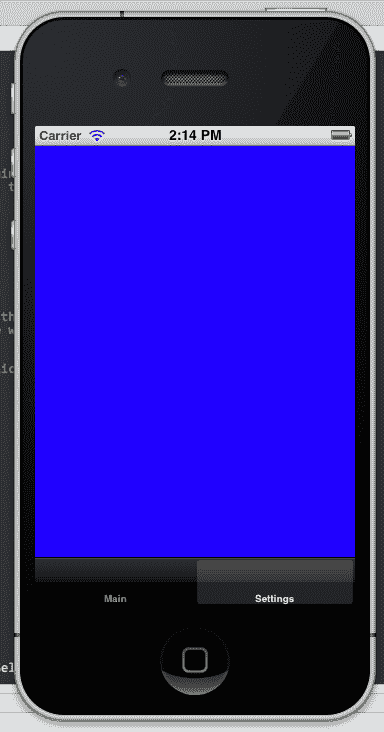
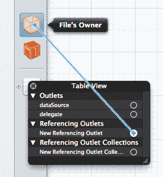
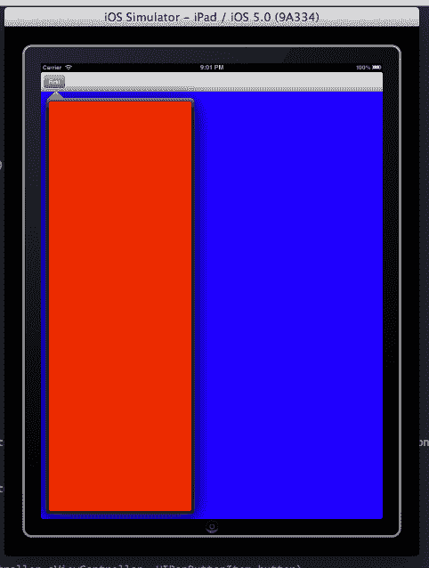
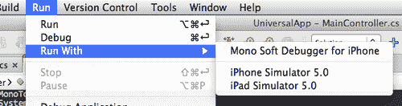

# 第三章。用户界面：视图控制器

在本章中，我们将涵盖：

+   使用视图控制器加载视图

+   在不同的视图控制器之间导航

+   在标签页中提供控制器

+   创建表格控制器

+   模态视图控制器

+   创建自定义视图控制器

+   高效使用视图控制器

+   组合不同的视图控制器

+   iPad 视图控制器

+   为不同设备创建用户界面

# 简介

到目前为止，我们已经讨论了视图及其使用方法。在大多数现实世界应用场景中，仅使用视图是不够的。Apple 提供了另一个基类，即 `UIViewController`，它负责管理视图。视图控制器可以响应设备通知，例如当设备旋转时，或者可以提供不同的方式来显示和关闭多个视图，甚至其他视图控制器。

我们还将了解如何使用最常用的视图控制器来创建管理多个视图的应用程序。

这些视图控制器是：

+   `UIViewController:` 这是所有视图控制器的基类

+   `UINavigationController:` 这是一个提供多种在不同视图控制器之间导航方式的视图控制器

+   `UITabBarController:` 这是一个以标签界面显示多个视图控制器的视图控制器

+   `UITableViewController:` 这是一个用于以列表形式显示数据的视图控制器

+   **针对 iPad 的视图控制器:** 这些是仅适用于 iPad 设备的视图控制器

此外，我们还将讨论组合不同的控制器，如何创建自定义控制器并使用它们，以及我们将创建一个可以在 iPhone 和 iPad 上部署的应用程序。

# 使用视图控制器加载视图

在本食谱中，我们将学习如何使用 `UIViewController` 类来管理视图。

## 准备工作

在 MonoDevelop 中创建一个新的 iPhone 空项目，并将其命名为 `ViewControllerApp`。

## 如何操作...

1.  向项目中添加一个新文件。

1.  右键点击 **Solution** 面板中的项目，并选择 **Add | New File**。

1.  在出现的对话框中，从 **MonoTouch** 部分选择 **iPhone View** 并带有 **Controller**，将其命名为 `MainViewController`，然后点击 **New** 按钮。MonoDevelop 将创建一个新的 `XIB` 文件，并自动打开 `MainViewController.cs` 源文件。此文件包含一个覆盖 `UIViewController` 的类，我们可以在其中实现与我们的视图控制器相关的任何代码。

1.  在 Interface Builder 中打开 `MainViewController.xib` 文件。

1.  在视图中添加一个 `UILabel`。

1.  在 `MainViewController` 类中创建并连接一个出口，并将其命名为 `myLabel`。

1.  在标签中输入文本 `View in controller!`。

1.  保存 `XIB` 文档。

1.  在 MonoDevelop 中返回，并在 `FinishedLaunching()` 方法中输入以下代码：

    ```swift
    MainViewController mainController = new MainViewController ();
    window.RootViewController = mainController;

    ```

1.  在模拟器上编译并运行应用程序。

## 它是如何工作的...

当我们在项目中添加一个新的**iPhone View with Controller**文件时，在这种情况下是`MainViewController`，MonoDevelop 基本上创建并添加了三个文件：

1.  `MainViewController.xib`：这是包含控制器的 XIB 文件。

1.  `MainViewController.cs`：这是实现我们控制器类的 C#源文件。

1.  `MainViewController.designer.cs`：这是自动生成的源文件，反映了我们在 Interface Builder 中对控制器所做的更改。

注意，我们不需要为视图添加一个出口，因为这是由 MonoDevelop 处理的。我们通过其类初始化控制器：

```swift
MainViewController mainController = new MainViewController ();

```

然后，我们通过控制器中的`View`显示其视图，将其设置为应用程序窗口的`RootViewController`：

```swift
window.RootViewController = mainController;

```

## 更多内容...

我们刚刚创建的项目仅展示了我们如何添加一个带有视图的控制器。注意，我们在`MainViewController`类内部创建了标签的出口，该类在`XIB`文件中充当文件的所有者对象。为了为`MainViewController`提供一些功能，在`MainViewController.cs`文件中的`MainViewController`类中添加以下方法：

```swift
public override void ViewDidLoad (){
base.ViewDidLoad();
this.myLabel.Text = "View loaded!";
}

```

此方法覆盖了`UIViewController.ViewDidLoad()`方法，该方法在控制器加载其视图时执行。

### 要覆盖的`UIViewController`方法

`UIViewController`类包含的方法是我们覆盖以使用其功能的方法。其中一些方法包括：

+   `ViewDidUnload()`：当视图被卸载时调用

+   `ViewWillAppear()`：当视图即将在屏幕上显示时调用

+   `ViewDidAppear()`：当视图已显示时调用

+   `ViewWillDisappear()`：当视图即将消失时调用，例如，当另一个控制器即将显示时`ViewDidDisappear()`：当视图消失时调用

## 参见

在本章中：

+   *在不同的视图控制器之间导航*

在本书中：

第一章,开发工具：

+   *使用 MonoDevelop 创建 iPhone 项目*

+   *通过出口访问 UI*

# 在不同的视图控制器之间导航

在本食谱中，我们将学习如何使用`UINavigationController`类在多个视图控制器之间导航。

## 准备工作

`UINavigationController`是一个提供具有多个视图控制器的分层导航功能的控制器。在 MonoDevelop 中创建一个新的 iPhone 空项目，并将其命名为`NavigationControllerApp`。

## 如何做到这一点...

1.  在项目中添加三个新的**iPhone View with Controller**文件，并分别命名为`RootViewController, ViewController1`和`ViewController2`。

1.  在`AppDelegate`类中添加以下字段：

    ```swift
    UINavigationController navController;

    ```

1.  在同一类中，在`FinishedLaunching`方法中，在`window.MakeKeyAndVisible()`行之上添加以下代码：

    ```swift
    RootViewController rootController = new RootViewController();
    this.navController = new UINavigationController(rootController);
    window.RootViewController = this.navController;

    ```

1.  在 Interface Builder 中打开`RootViewController.xib`文件，并添加两个按钮及其相应的出口。分别设置它们的标题为`第一个视图`和`第二个视图`。

1.  保存文档。

1.  打开`ViewController1.xib`和`ViewController2.xib`，并在每个视图中添加一个标题为`返回根视图`的按钮。不要忘记连接按钮与出口并保存文档。

1.  在`RootViewController`类中输入以下代码：

    ```swift
    public override void ViewDidLoad (){
    this.buttonFirstView.TouchUpInside += delegate {
    ViewController1 cont1 = new ViewController1 ();
    cont1.Title = "Controller #1";
    this.NavigationController.PushViewController (cont1, true);
    };
    this.buttonSecondView.TouchUpInside += delegate {
    ViewController2 cont2 = new ViewController2 ();
    cont2.Title = "Controller #2";
    this.NavigationController.PushViewController (cont2, true);
    };
    }

    ```

1.  在`ViewController1`和`ViewController2`类中输入以下内容：

    ```swift
    public override void ViewDidLoad (){
    this.buttonPop.TouchUpInside += delegate {
    this.NavigationController.PopToRootViewController (true);
    };
    }

    ```

1.  在模拟器上编译并运行应用程序。点击每个按钮以查看和导航到可用的视图。

## 它是如何工作的...

`UINavigationController`保留了一个控制器堆栈。`UIViewController`类有一个名为`NavigationController`的属性。在正常情况下，这个属性返回 null。但是，如果控制器被推入导航控制器的堆栈中，它将返回正在推入的导航控制器的实例。因此，这样在任何控制器层次结构中的任何一点，都可以提供对导航控制器的访问。要显示一个控制器，我们调用`UINavigationController.PushViewController(UIViewController, bool)`方法：

```swift
this.NavigationController.PushViewController (cont1, true);

```

注意，`RootViewController`是导航堆栈中最顶层或根控制器。导航控制器必须至少有一个将充当其根控制器的视图控制器。我们在创建`UINavigationController`类的实例时设置它：

```swift
this.navController = new UINavigationController(rootController);

```

要返回根控制器，我们在当前控制器中调用`PopToRootViewController(bool)`方法：

```swift
this.NavigationController.PopToRootViewController (true);

```

两个方法中的`bool`参数用于在控制器之间进行带有动画的转换。

## 还有更多...

在这个简单的示例中，我们通过按钮提供了返回根控制器的导航。注意顶部栏中有一个箭头形状的按钮。那个栏被称为**导航栏**，其类型为`UINavigationBar`。箭头形状的按钮被称为**返回**按钮，其类型为`UIBarButtonItem`。当返回按钮存在时，它总是导航到导航堆栈中的上一个控制器。

### 管理导航栏按钮

要更改、添加和隐藏导航栏的按钮，我们可以使用当前显示的视图控制器的`NavigationItem`属性的以下方法：

+   `SetLeftBarButtonItem:` 它在导航栏的左侧添加一个自定义按钮，替换默认的**返回**按钮

+   `SetRightBarButtonItem:` 它在导航栏的右侧添加一个自定义按钮

+   `SetHidesBackButton:` 它设置默认**返回**按钮的可见性

要移除或隐藏导航栏上的自定义左侧或右侧按钮，请调用适当的方法，传递`null`而不是`UIBarButtonItem`对象。

## 参见

在本章中：

+   *模态视图控制器*

+   *高效使用视图控制器*

+   *结合不同的视图控制器*

在本书中：

第十一章,图形和动画：

+   *使用动画推送视图控制器*

# 在标签中提供控制器

在这个示例中，我们将学习如何在标签界面中显示多个视图控制器。

## 准备工作

`UITabBarController` 提供了一种在相同层次结构级别上显示不同视图控制器的方法，这些控制器被划分为类似标签的界面。在 MonoDevelop 中创建一个新的 iPhone 空项目，并将其命名为 `TabControllerApp`。

## 如何做...

向项目中添加两个 **iPhone View with Controller** 文件。将它们命名为 `MainController` 和 `SettingsController`。

1.  在 Interface Builder 中打开两个控制器，并设置它们视图的不同背景颜色，然后保存文档。

1.  在 `AppDelegate` 类中添加以下字段：

    ```swift
    UITabBarController tabController;

    ```

1.  在 `FinishedLaunching()` 方法中输入以下代码，在 `window.MakeKeyAndVisible()` 行之上：

    ```swift
    MainController mainController = new MainController();
    SettingsController settingsController = new SettingsController();
    mainController.TabBarItem.Title = "Main";
    settingsController.TabBarItem.Title = "Settings";
    this.tabController = new UITabBarController();
    this.tabController.SetViewControllers(new UIViewController[] {
    mainController,
    settingsController
    } , false);
    window.RootViewController = this.tabController;
    this.tabController.ViewControllerSelected += delegate(object sender, UITabBarSelectionEventArgs e) {
    Console.WriteLine("Selected {0} controller.", e.ViewController.TabBarItem.Title);
    } ;

    ```

1.  在模拟器上编译并运行应用程序。

1.  点击屏幕底部的每个标签，并查看它们各自显示的视图。控制台输出显示在 MonoDevelop 的 **应用程序输出** 窗格中。以下截图显示了模拟器的屏幕，其中 **设置** 标签被选中：



## 它是如何工作的...

`UITabBarController` 显示它管理的每个控制器的一个标签页。该标签页的类型为 `UITabBarItem`，它可以接受文本和图像。`UITabBarController` 类包含有关其包含的控制器的信息。我们可以通过 `ViewControllerSelected` 事件确定用户选择了哪个控制器：

```swift
this.tabBarController.ViewControllerSelected += new EventHandler<UITabBarSelectionEventArgs> (delegate(object sender, UITabBarSelectionEventArgs e) {

```

`UITabBarSelectionEventArgs` 对象在其 `ViewController` 属性中持有所选控制器的实例。通过访问 `UIViewController.TabBarItem` 属性，我们可以确定哪个控制器被选中：

```swift
Console.WriteLine ("Controller {0} selected.", e.ViewController.TabBarItem.Title);

```

在这个示例中，我们输出其 `Title` 属性。

### 注意

就像 `UIViewController` 类的 `NavigationController` 属性，其中它返回它所属的 `UINavigationController` 实例一样，`TabBarItem` 属性只有在控制器是 `UITabBarController` 的部分时才会持有实例。在其他情况下，它将返回 `null`。

当我们初始化标签控制器时，我们通过 `SetViewControllers` 方法设置它将包含的控制器，传递一个视图控制器对象的数组：

```swift
this.tabController.SetViewControllers(new UIViewController[] {
mainController,
settingsController
});

```

## 还有更多...

控制器可以接受我们想要的任意数量的控制器，但如果添加六个或更多，则四个将带有标签显示，而第五个预定义的**更多**标签将代表所有剩余的控制器。这是为了保持界面易于用户访问，通过保持标签到适合人类手指的特定大小。当我们在一个标签栏控制器界面中添加超过六个控制器时，默认情况下，对象在**更多**标签的顶部提供一个**编辑**按钮，允许用户重新排列控制器的顺序。如果我们想排除某些控制器从这个功能中，我们必须从 `CustomizableViewControllers` 数组中移除它。

### 有用的 UITabBarController 属性

`UITabBarController` 类的一些其他有用属性如下：

+   `ViewControllers:` 返回一个包含所有由标签控制器持有的控制器的数组

+   `SelectedIndex:` 返回选中标签的零基索引

+   `SelectedViewController:` 返回当前选中的控制器

### 关于标签栏界面的重要说明

虽然我们可以在 `UITabBarController` 中添加任何类型的控制器，但我们不能在另一个控制器中添加 `UITabBarController`，例如 `UINavigationController`。然而，我们可以在 `UITabBarController` 中添加 `UINavigationController`。这是因为标签栏界面是为了实现不同的控制器作为不同的应用程序模式，而不是层次屏幕。

## 相关内容

在本章中：

+   *高效使用视图控制器*

+   *组合不同的视图控制器*

# 创建表格控制器

在本食谱中，我们将学习如何创建并将 `UITableViewController` 添加到项目中。

## 准备工作

使用 `UITableViewController` 来显示 `UITableView`。`UITableView` 提供了一个以列表形式显示数据的界面。在 MonoDevelop 中创建一个新的 iPhone 空项目，并将其命名为 `TableControllerApp`。

## 如何操作...

1.  将项目添加一个**iPhone 视图控制器**，并将其命名为 `TableController`。

1.  在 `AppDelegate` 类的 `FinishedLaunching` 方法中添加以下代码：

    ```swift
    TableController tableController = new TableController();
    window.RootViewController = tableController;

    ```

1.  将 `TableController` 类的继承从 `UIViewController` 改为 `UITableViewController:`

    ```swift
    public partial class TableController : UITableViewController

    ```

1.  在 Interface Builder 中打开 `TableController.xib`，选择并按退格键删除其视图。

1.  将 `UITableView` 拖放到其位置。

1.  右键单击 `UITableView` 以显示输出口面板。

1.  按照以下截图所示，从**新引用输出口**拖动到**文件所有者**对象：

1.  当你释放按钮时，从出现的**文件所有者**对象的小面板中选择视图。这连接了我们刚刚添加的 `UITableView` 到**文件所有者**对象的 `view` 输出口。

1.  保存文档。

## 它是如何工作的...

当我们在 Interface Builder 文档中添加一个 `UITableView` 时，其视图会显示一些预定义的数据。这些数据仅在设计时出现，而不是在运行时。

`UITableViewController` 包含一个 `UITableView` 类型的视图。这个视图负责显示数据，并且可以通过多种方式自定义。

## 还有更多...

除了 `View` 属性外，我们还可以通过 `TableView` 属性访问 `UITableViewController` 的视图。这两个属性返回相同的对象。

### `UITableViewController` 特定属性

`UITableViewController` 有一个额外的属性：`ClearsSelectionOnViewWillAppear`。当它设置为 `true` 时，控制器将在视图出现时自动清除所选行。

如何使用 `UITableView` 填充数据将在 第五章 中详细讨论，显示数据。

## 参见

在本章中：

+   *模态视图控制器*

在这本书中：

第五章，显示数据：

+   *在表格中显示数据*

# 模态视图控制器

在这个菜谱中，我们将讨论如何以模态方式显示视图控制器。

## 准备工作

**模态视图控制器** 是任何显示在其他视图或控制器之上的控制器。这个概念类似于将 **WinForm** 作为对话框显示，它控制界面并阻止访问应用程序的其他窗口，除非它被关闭。在 MonoDevelop 中创建一个新的 iPhone 空项目，并将其命名为 `ModalControllerApp`。

## 如何做到这一点...

1.  将两个带有控制器的视图添加到项目中，并分别命名为 `MainController` 和 `ModalController`。

1.  在 Interface Builder 中打开 `MainController.xib` 文件，并在其视图中添加一个标题为 `Present` 的按钮。

1.  创建并连接按钮的适当出口。保存文档并打开 `ModalController.xib` 文件。

1.  在其视图中添加一个标题为 `Dismiss` 的按钮，并为它创建适当的出口。将其视图的背景颜色设置为非白色。

1.  保存文档并在 `MainController` 类中输入以下代码：

    ```swift
    public override void ViewDidLoad (){
    this.buttonPresent.TouchUpInside += delegate {
    ModalController modal = new ModalController ();
    this.PresentModalViewController (modal, true);
    };
    }

    ```

1.  类似地，覆盖 `ModalController` 类中的 `ViewDidLoad()` 方法，并在其中输入以下代码：

    ```swift
    this.buttonDismiss.TouchUpInside += delegate {
    this.DismissModalViewControllerAnimated (true);
    };

    ```

1.  最后，在 `FinishedLaunching()` 方法中添加代码以显示主控制器：

    ```swift
    MainController mainController = new MainController ();
    window.RootViewController = mainController;

    ```

1.  在模拟器上编译并运行应用程序。

1.  点击 **Present** 按钮并观察模态控制器在主控制器之上显示。

1.  点击 **Dismiss** 按钮以隐藏它。

## 它是如何工作的...

每个控制器对象都有两个处理模态显示和关闭控制器的方法。在我们的示例中，我们调用 `PresentModalViewController (UIViewController, bool)` 方法来显示控制器：

```swift
this.buttonPresent.TouchUpInside += delegate {
ModalController modal = new ModalController ();
this.PresentModalViewController (modal, true);
};

```

其第一个参数表示我们想要以模态方式显示的控制器，第二个参数确定我们是否想要动画化显示。要关闭控制器，我们调用其 `DismissModalViewControllerAnimated(bool)` 方法：

```swift
this.DismissModalViewControllerAnimated (true);

```

它只接受一个参数，用于切换消失动画。

## 更多内容...

我们可以使用控制器的 `ModalTransitionStyle` 属性定义模态视图控制器呈现的动画类型。在呈现模态控制器之前输入以下代码行：

```swift
modal.ModalTransitionStyle = UIModalTransitionStyle.FlipHorizontal;

```

主控制器将翻转以显示模态控制器，给人一种它附着在其后面的印象。

### 访问模态控制器

每个以模态方式呈现另一个控制器的控制器都通过 `ModalController` 属性提供对其“子”控制器的访问。如果您需要访问此属性，请确保在调用 `DismissModalViewControllerAnimated()` 方法之前进行操作。

#### 有多少模态控制器？

理论上，我们可以呈现无限数量的模态控制器。当然，对此有两个限制：

1.  **内存不是无限的**：视图控制器会消耗内存，因此我们呈现的视图控制器越多，性能越差。

1.  **糟糕的用户体验**：以模态方式呈现许多控制器会让用户感到不适。

## 参见

在本章中：

+   *在不同视图控制器之间导航*

+   *在标签页中提供控制器*

在本书中：

第十一章，图形和动画：

+   *使用动画推送视图控制器*

# 创建自定义视图控制器

在本食谱中，我们将学习如何创建 `UIViewController` 的子类，并使用它来从 `XIB` 文件中派生视图控制器。

## 准备工作

在本任务中，我们将看到如何创建一个自定义视图控制器，它将充当基控制器，为其继承者提供共同的功能。我们将添加到我们的基控制器以与继承类共享的功能是，在 MonoDevelop 的 **应用程序输出** 面板上输出当前的触摸位置。在 MonoDevelop 中创建一个新的 iPhone 空项目，并将其命名为 `CustomControllerApp`。

## 如何实现...

1.  在项目中添加一个新的空 C# 类，并将其命名为 BaseController。

1.  在 BaseController.cs 文件中输入以下代码：

    ```swift
    using System;
    using System.Drawing;
    using MonoTouch.Foundation;
    using MonoTouch.UIKit;
    public class BaseController : UIViewController{
    //Constructors
    public BaseController (string nibName, NSBundle bundle) : base(nibName, bundle){}
    public override void TouchesMoved (NSSet touches, UIEvent evt){
    base.TouchesMoved (touches, evt);
    // Capture the position of touches
    UITouch touch = (UITouch)touches.AnyObject;
    PointF locationInView = touch.LocationInView (this.View);
    Console.WriteLine ("Touch position: {0}", locationInView);
    }
    }

    ```

1.  现在，将一个 **带有控制器的 iPhone 视图** 文件添加到项目中，并将其命名为 `DerivedController`。

1.  在其类定义中将继承自 `UIViewController` 的类更改为 `BaseController`：`public partial class DerivedController : BaseController`。

1.  最后，将派生控制器的视图添加到主窗口：

    ```swift
    DerivedController derivedController = new DerivedController();
    window. RootViewController = derivedController;

    ```

1.  在模拟器上编译并运行应用程序。

1.  在白色表面上点击并拖动鼠标指针，观察 MonoDevelop 的 **应用程序输出** 面板显示指针在模拟器屏幕上的当前位置。

## 它是如何工作的...

我们在这里所做的是创建一个可以用于多个 MonoTouch 项目的基控制器类。我们添加到这个控制器中的功能是响应用户触摸。任何继承它的控制器都将继承相同的功能。我们添加到创建`BaseController`类的代码相当简单。我们实现的构造函数仅仅是 MonoDevelop 在项目中添加新视图控制器时在类实现中创建的构造函数的副本。这里只有一处细微的修改：

```swift
public BaseController (string nibName, NSBundle bundle) : base(nibName, bundle){}

```

这是当通过派生对象的`DerivedController()`构造函数使用`new`关键字初始化`DerivedController`类时将被调用的基构造函数。

```swift
derivedController = new DerivedController();

```

## 还有更多...

派生控制器也可以添加到另一个`XIB`文件中，并通过出口直接在代码中使用。

### 从 XIB 继承视图控制器

如果我们想要创建一个从包含在`XIB`文件中的控制器派生的基控制器，过程是类似的。

## 参见

在本章中：

+   *使用控制器加载视图*

+   *高效使用视图控制器*

在本书中：

第二章,用户界面：视图：

+   *添加和自定义视图*

# 高效使用视图控制器

在这个食谱中，我们将学习关于高效使用视图控制器的基本指南。

## 准备工作

打开我们在本章前面“在标签中提供控制器”食谱中创建的项目`TabControllerApp`。

## 如何做到...

1.  在 Interface Builder 中打开`MainController.xib`文件，并添加一个`UIButton`和一个`UILabel`。通过出口将它们连接起来。

1.  在`MainController`类中输入以下代码：

    ```swift
    private Dictionary<int, string> cacheList;
    private Dictionary<int, string> cacheList;
    public override void DidReceiveMemoryWarning (){
    // Releases the view if it doesn't have a superview.
    base.DidReceiveMemoryWarning ();
    Console.WriteLine("Will clear cache in DidReceiveMemoryWarning...");
    // Release any cached data, images, and so on that aren't in use.
    this.cacheList.Clear();
    }
    public override void ViewDidLoad (){
    base.ViewDidLoad ();
    //any additional setup after loading the view, typically from a nib.
    this.cacheList = new Dictionary<int, string>() {
    { 0, "One" },
    { 1, "Two" },
    { 2, "Three" }
    } ;
    this.btnShowData.TouchUpInside += ButtonShowData_TouchUpInside;
    }
    public override void ViewDidUnload (){
    base.ViewDidUnload ();
    // Release any retained subviews of the main view.
    // e.g. myOutlet = null;
    this.lblOutput = null;
    this.btnShowData.TouchUpInside -= ButtonShowData_TouchUpInside;
    this.btnShowData = null;
    }
    private void ButtonShowData_TouchUpInside (object sender, EventArgs e){
    foreach (KeyValuePair<int, string> eachItem in this.cacheList){
    this.lblOutput.Text += string.Format("Key: {0} - Value: {1}", eachItem.Key, eachItem.Value);
    }//end foreach
    }
    }

    ```

1.  在模拟器上编译并运行应用程序。

1.  在**主**标签页上轻触按钮以显示我们列表的内容。

1.  切换到**设置**标签。

1.  在模拟器的菜单栏中点击**硬件 | 模拟内存警告**。

1.  在 MainDevelop 的**应用程序输出**中查看输出，并切换回**主**标签。

## 它是如何工作的...

此项目不提供任何有用的功能。其主要目的是展示如何正确使用视图控制器。

当 iOS 需要更多内存来执行各种操作时，它会发出内存警告。当发生内存警告时，所有由控制器处理且未使用的 UI 对象都会从内存中清除，以释放更多内存。

模拟器提供了一个方法，让开发者可以通过从菜单栏中选择我们之前选择的**硬件 | 模拟内存警告**操作来重新创建这样的场景。

由于我们处于**设置**标签，`MainController`的内容已被从内存中清除。在`DidReceiveMemoryWarning`方法中，我们清理任何非 UI 对象，否则这些对象将保留在内存中：

```swift
this.cacheList.Clear();

```

接下来，在`ViewDidUnload`方法中，我们只需要释放任何由出口保留的 UI 对象。请注意，这就是我们从这些对象可能持有的事件中取消连接处理程序的地方：

```swift
this.lblOutput = null;
this.btnShowData.TouchUpInside -= ButtonShowData_TouchUpInside;
this.btnShowData = null;

```

当我们再次选择 **主** 标签时，`ViewDidLoad` 方法将被再次调用，在控制器视图及其包含的所有视图和输出加载完毕之后。

## 更多内容...

当发生内存警告时，与 UI 无直接关系的对象实例将保留在内存中。在极少数情况下，如果没有足够的内存来完成特定任务，操作系统可能会终止我们的应用程序，如果它占用了大部分可用内存。为了防止这种情况，我们需要小心清理所有不需要的对象和资源，为 iOS 释放更多内存。

### 注意

不要在 `ViewDidUnload` 方法中访问控制器的视图：

```swift
public override ViewDidUnload()
{
base.ViewDidUnload();
this.View = null; // Never do this.
}

```

这是因为即使我们请求视图控制器的 `View` 属性的返回值，也会导致视图重新加载，这在大多数情况下意味着不会释放内存。

## 相关内容

在本章中：

+   *在标签页中提供控制器*

在本书中：

第一章,开发工具：

+   *界面构建器*

第四章,

+   *创建文件*

+   *创建 SQLite 数据库*

# 结合不同的视图控制器

在这个菜谱中，我们将学习如何在 `UITabBarController` 中显示 `UINavigationController`。

## 准备工作

在 MonoDevelop 中创建一个新的 iPhone 空项目，并将其命名为 `CombinedControllerApp`。

## 如何做到...

创建此项目的步骤如下：

1.  将三个 iPhone 视图控制器文件添加到项目中，并分别命名为 `MainController, SettingsController` 和 `AfterMainController`。

1.  在 Interface Builder 中 `MainController` 视图中添加一个 `UIButton`，并保存文档。

1.  在 `MainController` 类中输入以下代码：

    ```swift
    public override void ViewDidLoad (){
    base.ViewDidLoad ();
    this.Title = "Main";
    this.buttonPush.TouchUpInside += delegate {
    this.NavigationController.PushViewController(new AfterMainController(), true);
    };
    }

    ```

1.  在 `AppDelegate` 类中添加以下字段：

    ```swift
    UINavigationController navController;
    UITabBarController tabController;

    ```

1.  在 `AppDelegate` 类的 `FinishedLaunching` 方法中添加以下代码：

    ```swift
    MainController mainController = new MainController();
    SettingsController settingsController = new SettingsController();
    this.tabController = new UITabBarController();
    this.navController = new UINavigationController(mainController);
    this.tabController.SetViewControllers(new UIViewController[] {
    this.navController,
    settingsController
    } , false);
    navController.TabBarItem.Title = "Main";
    settingsController.TabBarItem.Title = "Settings";
    window.RootViewController = this.tabController;

    ```

1.  在模拟器上编译并运行应用程序。在 `MainController` 中轻触按钮，将 `AfterMainController` 推送到导航堆栈中，然后切换到 **主** 和 **设置** 标签。

## 工作原理...

完整的解决方案可以在 `CombinedControllerApp` 文件夹中找到。我们通过这个项目实现了提供三个不同屏幕的用户界面，这对用户来说不会造成困惑。

标签栏包含两个系统定义的项目，每个项目代表一个不同的视图控制器。我们在标签栏控制器中实现了第一个项目，使用导航控制器。这样，我们可以提供更多与特定部分的应用程序相关的屏幕（**主** 加 **AfterMain**），同时让应用程序的另一部分在任何时候都可以直接访问 **（设置）**。

## 更多内容...

本项目结合了三个不同的控制器（一个 `UITabBarController`、一个 `UINavigationController` 和一个 `UIViewController`）的方式是完全可接受的。我们甚至可以用另一个导航控制器替换第二个标签项，为应用程序的另一个部分提供更多的屏幕，或者甚至添加另一个标签项。

然而，正如本章中 *在标签中提供控制器* 的配方所述，如果我们在一个 `UINavigationController` 内添加一个 `UITabBarController`，这是不可接受的。如果我们想在导航控制器内提供类似标签的行为，我们应该使用它的 `UIToolbar` 来实现。

## 参见

在本章中：

+   *在不同视图控制器之间导航*

+   *在标签中提供控制器*

+   *为不同设备创建用户界面*

# iPad 视图控制器

在本配方中，我们将讨论仅适用于 iPad 的控制器。

## 准备工作

创建一个新的 iPad 空项目，并将其命名为 `iPadControllerApp`。

## 如何实现...

1.  将两个带有控制器的 iPad 视图添加到项目中，并分别命名为 `FirstController` 和 `SecondController`。为它们的背景视图设置不同的颜色。在 `SecondController` 中，在其视图顶部添加一个 `UIToolbar`，并将其连接到一个出口。

1.  在 `AppDelegate` 类中添加以下字段：

    ```swift
    UISplitViewController splitController;
    FirstController firstController;
    SecondController secondController;

    ```

    ### 注意

    `UISplitViewController` 类仅适用于 iPad。

1.  在 `FinishedLaunching` 方法中添加以下代码：

    ```swift
    this.firstController = new FirstController();
    this.secondController = new SecondController();
    this.splitController = new UISplitViewController();
    this.splitController.ViewControllers = new UIViewController[] {
    this.firstController,
    this.secondController
    } ;
    this.splitController.Delegate = new SplitControllerDelegate(this.secondController);
    window.RootViewController = this.splitController;

    ```

1.  在 `AppDelegate` 中添加以下嵌套类：

    ```swift
    private class SplitControllerDelegate : UISplitViewControllerDelegate{
    public SplitControllerDelegate (SecondController controller){
    this.parentController = controller;
    }//end ctor
    private SecondController parentController;
    public override void WillHideViewController ( UISplitViewController svc, UIViewController aViewController, UIBarButtonItem barButtonItem, UIPopoverController pc){
    barButtonItem.Title = "First";
    this.parentController.SecToolbar.SetItems (new UIBarButtonItem[] { barButtonItem }, true);
    }
    public override void WillShowViewController ( UISplitViewController svc, UIViewController aViewController, UIBarButtonItem button){
    this.parentController.SecToolbar.SetItems (new UIBarButtonItem[0], true);
    }
    }

    ```

1.  在 `SecondController` 类中添加一个属性，它返回我们在 *步骤 1* 中创建的工具栏出口：

    ```swift
    public UIToolbar SecToolbar{
    get { return this.secToolbar; }
    }

    ```

1.  最后，在模拟器中编译并运行应用程序。点击工具栏中的按钮，使 `FirstController` 出现。结果应该类似于以下截图：



## 它是如何工作的...

完整解决方案可以在 `iPadControllerApp` 文件夹中找到。有两个特定于 iPad 的控制器：`UISplitViewController` 和 `UIPopoverController`。它们都被使用在这里，尽管 `UIPopoverController` 没有直接使用。

`UISplitViewController` 有助于充分利用 iPad 的更大屏幕。它提供了一种在相同屏幕区域内同时显示两个不同视图的方法。它是通过在纵向全屏显示一个控制器，而在弹出视图中显示另一个较小的控制器来实现的。**弹出视图**基本上是一个视图，它显示在其他控制器（及其视图）的顶部，就像一个模态视图控制器一样。

为了让用户能够访问我们项目中的两个控制器，我们实现了一个继承自 `UISplitViewControllerDelegate` 的类，并在 `FinishedLaunching()` 方法中将它分配给我们的分割控制器。我们创建的 `Delegate` 对象覆盖了两个方法。在第一个方法中，我们将一个按钮分配给工具栏：

```swift
public override void WillHideViewController (UISplitViewController svc, UIViewController aViewController, UIBarButtonItem barButtonItem, UIPopoverController pc){
barButtonItem.Title = "First";
this.parentController.SecToolbar.SetItems (new UIBarButtonItem[] { barButtonItem }, true);
}

```

当`UISplitViewController`从横屏变为竖屏，并且其较小的控制器即将被隐藏时，`WillHideViewController()`方法会被执行。因此，为了显示它，我们在全屏控制器的工具栏上提供了一个按钮。当我们点击该按钮时，另一个控制器将以弹出窗口的形式出现。当方向从竖屏变为横屏时，较小的控制器出现在较大的控制器旁边，无需弹出窗口。因此，我们不再需要在工具栏上按钮，因此我们重写`WillShowViewController`以从工具栏中移除按钮。我们通过分配一个空的`UIBarButtonItem[]`数组来完成此操作：

```swift
public override void WillShowViewController (UISplitViewController svc, UIViewController aViewController, UIBarButtonItem button){
this.parentController.SecToolbar.SetItems (new UIBarButtonItem[0], true);
}

```

## 更多内容...

当设备旋转时，界面不会自动响应。为了指示视图控制器旋转其视图，我们在分割视图控制器的两个控制器中重写`ShouldAutorotateToInterfaceOrientation(UIInterfaceOrientation)`方法：

```swift
public bool ShouldAutorotateToInterfaceOrientation(UIInterfaceOrientation toInterfaceOrientation){
return true;
}

```

### iPad 特定控制器使用

尽管所有其他控制器都可用于 iPhone 和 iPad，但这两个控制器不能在 iPhone 上使用。在这种情况下将发生异常。

## 参考内容

在本章中：

+   *为不同设备创建用户界面*

在本书中：

第九章, 与设备硬件交互：

+   *旋转设备*

# 为不同设备创建用户界面

在这个菜谱中，我们将学习如何创建一个同时支持 iPhone 和 iPad 的应用程序。

## 准备工作

在 MonoDevelop 中创建一个新的通用空项目，并将其命名为`UniversalApp`。

## 如何操作...

1.  向项目中添加一个新的**iPhone 视图控制器**，并将其命名为`MainController`。

1.  在 Interface Builder 中打开它，并在视图中为其添加一个标签和一个出口。

1.  在标签中输入文本`在 iPhone 上运行！`

1.  将视图的背景颜色改为白色以外的颜色。同样对标签进行操作，并保存文档。

1.  在`MainViewController`类中添加以下代码：

    ```swift
    public override void ViewDidLoad (){
    base.ViewDidLoad ();
    if (UIDevice.CurrentDevice.UserInterfaceIdiom == UIUserInterfaceIdiom.Pad){
    this.View.Frame = new RectangleF (0f, 0f, 768f, 1024f);
    this.labelMessage.Text = "Running on an iPad!";
    }
    }

    ```

1.  在`AppDelegate`类的`FinishedLaunching()`中添加以下代码：

    ```swift
    MainController mainController = new MainController();
    window.RootViewController = mainController;

    ```

1.  在模拟器上编译并运行应用程序。

1.  读取标签的消息，表明它正在 iPhone 上运行。在 MonoDevelop 中终止执行，并在菜单栏上点击**运行 | 运行方式 | iPad 模拟器 x.x**（其中**x.x**是系统上安装的相应 iOS 版本，这里**5.0**）。

1.  读取表明应用程序正在 iPad 上运行的消息！

## 它是如何工作的...

当我们在 MonoDevelop 中创建通用项目时，基本区别在于应用程序设置文件`(Info.plist)`，其中声明应用程序支持 iPhone 和 iPad。

事实上，我们添加了一个 **带有控制器的 iPhone 视图** 并不会阻止我们为两种设备使用相同的控制器。记住，所有控制器都适用于所有设备，除了之前菜谱中讨论的那些。

在 `ViewDidLoad` 方法内部，我们通过检查 `UIDevice.CurrentDevice` 静态属性的 `UserInterfaceIdiom` 属性来确定应用程序正在运行在哪种设备上，并为视图提供一个大小与 iPad 屏幕尺寸 {768, 1024} 相匹配的框架。

```swift
if (UIDevice.CurrentDevice.UserInterfaceIdiom == UIUserInterfaceIdiom.Pad)

```

## 更多内容...

这将确保根据应用程序运行在哪种设备上，对项目中包含的视图进行尺寸调整。但是，这并不能保证所有控件都将被正确地调整大小和定位。为了避免用户界面杂乱，我们必须确保调整我们控件和视图的 `Autosizing` 属性，以便它们可以在不同的屏幕上正确地调整大小和定位。

## 参见

本章内容：

+   *高效使用视图控制器*

+   *iPad 视图控制器*

在本书中：

第一章，开发工具：

+   *使用 MonoDevelop 创建 iPhone 项目*

+   *界面构建器*
