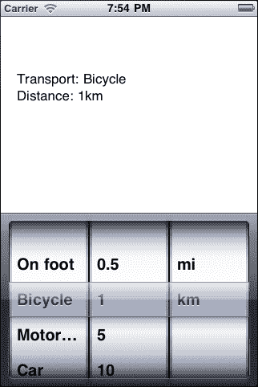
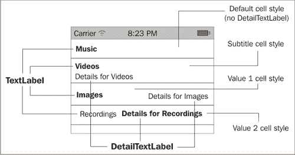
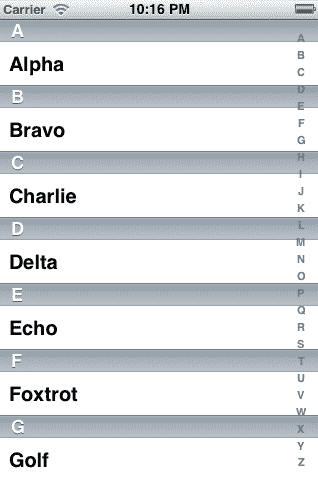
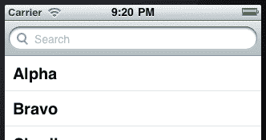
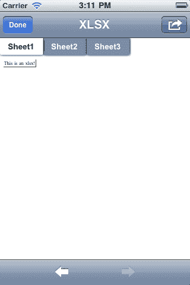

# 第五章 显示数据

在本章中，我们将涵盖以下主题：

+   提供列表

+   在表格中显示数据

+   自定义行

+   编辑表格：删除行

+   编辑表格：插入行

+   表索引

+   搜索数据

+   创建一个简单的网页浏览器

+   显示本地内容

+   显示格式化文本

+   显示文档

# 简介

在上一章中，我们讨论了 iOS 应用程序中数据管理的一些可用选项。在本章中，我们将讨论向用户显示数据的各种方法。

具体来说，我们将看到如何使用以下控件：

+   `UIPickerView:` 这是一个提供类似列表框功能的控件。

+   `UITableView:` 这是一个非常可定制的视图，用于显示数据。iOS 应用程序中最常用的控件之一。

+   `UISearchBar` **和** `UISearchDisplayController:` 这些是一组控件，提供了一种易于使用的界面来搜索数据。

+   `UIWebView:` 这将网页浏览器功能带给应用程序。

+   `QLPreviewController:` 这可以显示各种文档格式。

此外，我们将学习如何在表格中提供索引，以便用户可以轻松访问大量数据。我们还将讨论一些显示格式化文本的可用方法，甚至包括**便携式文档格式（PDF）**和其他文档。

从本章开始，所有代码示例都将使用默认视图控制器`MainController`，除非另有说明。

# 提供列表

在本食谱中，我们将学习如何使用`UIPickerView`类。

## 准备工作

`UIPickerView`类为我们提供了一个与列表框功能相似的控件，专门设计用于人类手指触摸屏幕。它与普通列表框的主要区别在于，每一列可以有自己的行数。要开始，创建一个新的 iPhone 项目，并将其命名为`PickerViewApp`。

## 如何做到这一点...

1.  在 Interface Builder 中打开`MainController.xib`文件。

1.  在主视图中添加一个`UILabel`和一个`UIPickerView`。

1.  保存文档。

1.  在 MonoDevelop 中，创建一个继承自`UIPickerViewModel:`的`MainController`类中的嵌套类：

    ```swift
    private class PickerModelDelegate : UIPickerViewModel

    ```

1.  在嵌套类中添加以下构造函数和字段：

    ```swift
    public PickerModelDelegate (MainController controller) {
    this.parentController = controller;
    this.transportList = new List<string>() { "On foot", "Bicycle", "Motorcycle", "Car", "Bus" };
    this.distanceList = new List<string>() { "0.5", "1", "5", "10", "100" };
    this.unitList = new List<string>() { "mi", "km" };
    this.transportSelected = this.transportList[0];
    this.distanceSelected = this.distanceList[0];
    this.unitSelected = this.unitList[0];
    }
    private MainController parentController;
    private List<string> transportList;
    private List<string> distanceList;
    private List<string> unitList;
    string transportSelected;
    string distanceSelected;
    string unitSelected;

    ```

1.  您现在需要覆盖`UIPickerViewModel`类中的四个方法：

    +   `int GetComponentCount (UIPickerView picker)`

    +   `int GetRowsInComponent (UIPickerView picker, int component)`

    +   `string GetTitle (UIPickerView picker, int row, int component)`

    +   `void Selected (UIPickerView picker, int row, int component)`

1.  最后，在控制器中的`ViewDidLoad`方法内将创建的模型对象设置为 picker 视图的`Model`属性：

    ```swift
    this.picker.Model = new PickerModelDelegate (this);

    ```

完整的代码可以在`PickerViewApp`项目中找到。

## 它是如何工作的...

`UIPickerViewModel` 类在 `Objective-C` 中不存在。MonoTouch 提供了这个类，作为原生协议 `UIPickerViewDataSource` 和 `UIPickerViewDelegate` 的包装器，并包含这两个类的所有方法，以便我们重写。这非常有帮助，因为我们只需要实现和分配一个类，而不是两个类来为我们的选择视图。这两个协议同时作为类在 MonoTouch 中可用。

在构造函数中，我们初始化将包含要显示在选择器中的数据的列表。我们需要重写的四个类负责显示数据：

1.  `int GetComponentCount (UIPickerView picker):` 这个方法返回我们想要选择视图显示的列数。

1.  `int GetRowsInComponent (UIPickerView picker, int component):` 这个方法返回每个组件将显示的行数。

1.  `string GetTitle (UIPickerView picker, int row, int component):` 这个方法返回每一行的文本。

1.  `void Selected (UIPickerView picker, int row, int component):` 这个方法返回当用户从选择视图的任何组件/行组合中选择项目时要采取的操作。

我们使用在构造函数中分配的列表来显示数据。例如，`GetTitle` 方法实现如下：

```swift
switch (component){
case 0:
return this.transportList[row];
case 1:
return this.distanceList[row];
default:
return this.unitList[row];
}

```

当我们运行应用程序并从选择器中选择任何内容时，结果将类似于以下截图：



## 更多内容...

我们可以通过调用方法 `Select (int, int, bool)` 来程序化选择选择视图的初始选择。前两个参数分别表示行和组件索引，而 `bool` 参数切换选择动画。使用此方法时需要注意的唯一一点是，我们必须在分配选择器的 `Model` 属性之后调用它。否则将发生异常。

### 更多关于 UIPickerView 定制的信息

除了提供的选项外，我们还可以设置每个组件的宽度。为此，我们重写 `GetComponentWidth (UIPickerView, int)` 方法，它返回一个表示每个组件宽度的浮点数。

我们还可以通过重写 `GetView(UIPickerView, int, int, UIView)` 方法来设置自定义视图作为选择视图中的项目，而不是纯文本。这可以通过返回我们想要在 `UIPickerView` 控制中的每个位置显示的视图来实现。

### 日期和时间选择

有一个名为 `UIDatePicker` 的控件，它与 `UIPickerView` 类似，专门用于显示和选择日期和时间值。请注意，尽管它的用户界面与选择视图相同，但它并不继承 `UIPickerView` 类。它只是使用它的一个实例作为子视图。

## 相关内容

在本章中：

+   *在表格中显示数据*

# 在表格中显示数据

在本食谱中，我们将学习如何使用 `UITableView` 类来显示数据。

## 准备工作

`UITableView` 类以及 `UITableViewCell` 对象提供了一种在屏幕上以多行但单列的形式显示数据的接口。要开始，请在 MonoDevelop 中创建一个新的项目，并将其命名为 `TableViewApp.`

## 如何做到这一点...

1.  将带有控制器的视图添加到项目中，并将其命名为 `TableController`。

1.  将 `TableController` 类的继承从 `UIViewController` 更改为 `UITableViewController:`

    ```swift
    public partial class TableController : UITableViewController

    ```

1.  在 Interface 中打开 `TableController.xib` 文件。

1.  删除文档的 `UIView`，并在其位置添加一个 `UITableView`。

1.  将 `TableController` 的输出端口 `view` 连接到添加的表格视图。

1.  保存文档。

1.  在 MonoDevelop 中，在 `TableController` 类内部创建以下嵌套类：

    ```swift
    private class TableSource : UITableViewSource{
    public TableSource (){
    this.cellID = "cellIdentifier";
    this.tableData = new Dictionary<int, string> () {
    {0, "Music"},
    {1, "Videos"},
    {2, "Images"}
    };
    }
    private string cellID;
    private Dictionary<int, string> tableData;
    public override int RowsInSection (UITableView tableview, int section){
    return this.tableData.Count;
    }
    public override UITableViewCell GetCell (UITableView tableView, NSIndexPath indexPath){
    int rowIndex = indexPath.Row;
    UITableViewCell cell = tableView.DequeueReusableCell (this.cellID);
    if (null == cell){
    cell = new UITableViewCell (UITableViewCellStyle.Default, this.cellID);
    }
    cell.TextLabel.Text = this.tableData[rowIndex];
    return cell;
    }
    }

    ```

1.  重写控制器的 `ViewDidLoad` 方法，并添加以下代码行：

    ```swift
    this.TableView.Source = new TableSource ();

    ```

完整的代码可以在 `TableViewApp` 项目中找到。

## 它是如何工作的...

我们创建的嵌套类充当 `UITableView` 的数据源。它继承自 MonoTouch 的 `UITableViewSource` 类：

```swift
private class TableSource : UITableViewSource

```

### 注意

与之前讨论的示例中的 `UIPickerView` 类似，`UITableViewSource` 类在 `Objective-C` 中不存在。它仅仅是 MonoTouch 提供的围绕 `UITableViewDelegate` 和 `UITableViewSource` 协议的包装对象。

在其构造函数中，我们初始化两个变量。一个字符串将作为单元格的标识符，以及一个用于数据源的通用 `Dictionary`。

```swift
this.cellID = "cellIdentifier";
this.tableData = new Dictionary<int, string> () {
{0, "Music"},
{1, "Videos"},
{2, "Images"}
};

```

要使 `TableSource` 类工作，我们需要重写两个方法。第一个方法名为 `RowsInSection`，它返回表格应显示的行数。在这里，我们返回数据源对象中的项目数量：

```swift
return this.tableData.Count;

```

第二个方法 `GetCell` 返回将在表格中显示的 `UITableViewCell` 对象。

### 注意

`UITableViewCell` 类代表一行，并在 `UITableView` 中管理其内容。

为了更高效，表格视图在需要时创建其单元格对象。因此，我们需要通过其 `DequeueReusableCell` 方法从表格中获取之前使用的 `UITableViewCell`：

```swift
UITableViewCell cell = tableView.DequeueReusableCell (this.cellID);

```

如果不存在特定单元格标识符的单元格，该方法将返回 `null`。因此，我们创建将要使用的单元格：

```swift
cell = new UITableViewCell (UITableViewCellStyle.Default, this.cellID);

```

然后，我们分配特定单元格将显示的文本并返回它：

```swift
cell.TextLabel.Text = this.tableData[rowIndex];
return cell;

```

默认情况下，`UITableViewCell` 类包含两个标签，可以用来显示文本。主标签可以通过 `TextLabel` 属性访问，次要标签可以通过 `DetailTextLabel` 属性访问。请注意，当使用具有 `Default` 风格的单元格时，`DetailTextLabel` 属性不能使用，并将返回 `null`。

## 还有更多...

为了在用户选择特定行时提供功能，我们需要覆盖作为`UITableViewSource`的类的`RowSelected`属性。默认情况下，当用户点击一行时，单元格会以蓝色突出显示以表示选中。要取消选中行，我们使用`UITableView.DeselectRow(NSIndexPath, bool)`方法：

```swift
public override void RowSelected (UITableView tableView, NSIndexPath indexPath){
tableView.DeselectRow (indexPath, true);
}

```

### `UITableView`样式

`UITableView`可以以两种不同的样式创建。默认样式是`Plain`。另一种可以使用的样式是`Grouped`样式。这种样式在许多 iOS 原生应用中都被使用，例如`Settings`应用。

此外，`UITableView`支持显示分为不同部分的数据。如果我们想使用不同的部分，我们必须在`RowsInSection`覆盖中明确返回每个部分将有的行数。

## 参见

在本章中：

+   *提供列表*

+   *自定义行*

在本书中：

第三章，用户界面：视图控制器：

+   *创建*一个*表格控制器*

# *自定义行*

在这个菜谱中，我们将介绍一些可用于自定义表格单元格内容显示的不同选项。

## 准备工作

以与上一个菜谱中创建项目相同的方式在 MonoDevelop 中创建一个新的项目。将其命名为`CustomRowsApp.`

## 如何做...

1.  将上一个任务中的项目中的`TableSource`类复制并粘贴到`TableController`类内部。

1.  在`GetCell`覆盖中执行以下更改：

    ```swift
    int rowIndex = indexPath.Row;
    string cellID = this.tableData[rowIndex];
    UITableViewCell cell = tableView.DequeueReusableCell (cellID);
    if (null == cell){
    cell = new UITableViewCell (this.cellStyles[rowIndex], cellID);
    }
    cell.TextLabel.Text = this.tableData[rowIndex];
    if (rowIndex > 0){
    cell.DetailTextLabel.Text = String.Format ("Details for {0}", cellID);
    }
    return cell;

    ```

1.  删除`cellID`字段并添加一个新的：

    ```swift
    private Dictionary<int, UITableViewCellStyle> cellStyles;

    ```

1.  在构造函数中初始化，如下所示：

    ```swift
    this.cellStyles = new Dictionary<int, UITableViewCellStyle>() {
    {0, UITableViewCellStyle.Default},
    {1, UITableViewCellStyle.Subtitle},
    {2, UITableViewCellStyle.Value1},
    {3, UITableViewCellStyle.Value2}
    };

    ```

1.  在数据源对象中添加另一个`KeyValuePair`：

    ```swift
    {3, "Recordings"}

    ```

1.  在模拟器上编译并运行应用程序。输出应该类似于以下内容，如以下截图所示：



## 它是如何工作的...

一个表格单元格可以有四种不同的单元格样式，这些样式由`UITableViewCellStyle`枚举表示。其值如下：

1.  `默认:` 这是默认单元格样式。只能使用`TextLabel`属性来显示文本。

1.  `副标题:` 这是一种提供`DetailTextLabel`作为`TextLabel`副标题的样式。

1.  `Value1:` 这是显示`TextLabel`和`DetailTextLabel`文本大小相同、颜色不同且对齐到单元格两侧的样式。

1.  `Value2:` 这是显示`TextLabel`文本比`DetailTextLabel`文本小的样式。这种样式在原生的`Contacts`应用中的联系人详情屏幕中使用。

为了方便使用所有可用的样式，我们已经在`Dictionary:`中添加了`UITableViewCellStyle`枚举的所有值：

```swift
private Dictionary<int, UITableViewCellStyle> cellStyles;

```

现在我们使用了不同的单元格样式，因此需要为每个字符串提供一个单元格标识符。为了避免在类中声明另一个列表或更多字段，我们出于这个原因使用数据源：

```swift
int rowIndex = indexPath.Row;
string cellID = this.tableData[rowIndex];
UITableViewCell cell = tableView.DequeueReusableCell (cellID);

```

要为每个单元格创建具有特定样式的单元格，我们根据当前行从 `cellStyles` 字段中提取 `UITableViewCellStyle` 值：

```swift
cell = new UITableViewCell (this.cellStyles[rowIndex], cellID);

```

要为每个单元格设置 `DetailTextLabel` 文本，我们只需确保我们不是在具有 `Default` 样式的单元格上设置它，如本例中的第一个：

```swift
if (rowIndex > 0){
cell.DetailTextLabel.Text = String.Format ("Details for {0}", cellID);
}

```

## 还有更多...

可以在 `UITableViewCell` 中进行进一步的自定义。单元格包含的所有视图，包括 `TextLabel` 和 `DetailTextLabel`，都是单元格视图的子视图，该视图通过其 `ContentView` 属性公开。我们可以创建自定义视图并将其作为子视图添加到其中。

### `UITableViewCell` 类的其他有用属性

除了在默认标签中添加文本外，`UITableViewCell` 还包含一些其他属性，我们可以设置它们的值，以在单元格中添加更多默认项：

+   `ImageView:` 这个属性接受一个 `UIImageView`。我们可以用它来在单元格的左侧显示一个图像。

+   `AccessoryView:` 这个属性接受任何 `UIView` 实例。它的默认位置是单元格的右侧，在单元格的 `Accessory` 位置，位于单元格的右侧。

+   `Accessory:` 这个属性接受 `UITableViewCellAccessory` 类型的值。它为单元格的附件提供预定义视图，例如 `DetailDisclosureButton` 或 `Checkmark`。

## 参见

在本章中：

+   *在表格中显示数据*

+   *在表格中编辑数据*

# 编辑表格：删除行

在这个菜谱中，我们将讨论如何从 `UITableView` 中删除行，并提供适当的用户反馈。

## 准备工作

在 MonoDevelop 中创建一个新的项目，并将其命名为 `EditingTableDataApp`。

## 如何操作...

1.  将视图控制器添加到项目中，并将其转换为本章中 *在表格中显示数据* 部分所述的 `UITableViewController`，并将其命名为 `TableController`。

1.  在 `AppDelegate` 类中添加一个 `UINavigationController`。初始化它，将 `TableController` 设置为其根控制器：

    ```swift
    TableController tableController;
    UINavigationController navController;
    //…
    this.tableController = new TableController();
    this.navController = new UINavigationController(this.tableController);
    window.RootViewController = this.navController;

    ```

1.  在 MonoDevelop 中，在 `TableController` 类中添加三个字段：`List<string> tableData`、`UIBarButtonItem buttonEdit` 和 `UIBarButtonItem buttonDone`。重写类的 `ViewDidLoad` 方法，如下所示：

    ```swift
    public override void ViewDidLoad (){
    base.ViewDidLoad ();
    this.buttonEdit = new UIBarButtonItem ("Edit", UIBarButtonItemStyle.Bordered, this.ButtonEdit_Clicked);
    this.buttonDone = new UIBarButtonItem (UIBarButtonSystemItem.Done, this.ButtonDone_Clicked);
    this.NavigationItem.SetRightBarButtonItem (this.buttonEdit, false);
    this.tableData = new List<string>() {"Music", "Videos", "Images" };
    this.TableView.Source = new TableSource(this.tableData);
    }

    ```

1.  为表格创建适当的表格视图源，它在构造函数中接受 `tableData` 泛型 `List` 作为参数。创建处理方法 `ButtonEdit_Clicked`，并在其中输入以下代码：

    ```swift
    this.TableView.SetEditing (true, true);
    this.NavigationItem.SetRightBarButtonItem (this.buttonDone, true);

    ```

1.  创建处理方法 `ButtonDone_Clicked`，并在其中输入以下代码：

    ```swift
    this.TableView.SetEditing (false, true);
    this.NavigationItem.SetRightBarButtonItem (this.buttonEdit, true);

    ```

1.  最后，重写表格源代码中的 `CommitEditingStyle` 方法：

    ```swift
    public override void CommitEditingStyle (UITableView tableView, UITableViewCellEditingStyle editingStyle, NSIndexPath indexPath){
    int rowIndex = indexPath.Row;
    if (editingStyle == UITableViewCellEditingStyle.Delete) {
    this.tableData.RemoveAt (rowIndex);
    tableView.DeleteRows (new NSIndexPath[] { indexPath }, UITableViewRowAnimation.Left);
    }
    }

    ```

### 它是如何工作的...

在这里我们首先使用导航栏添加按钮来处理表格的编辑模式。当视图加载时，我们使用 `SetRightBarButtonItem` 方法设置编辑按钮：

```swift
this.NavigationItem.SetRightBarButtonItem (this.buttonEdit, false);

```

在 `ButtonEdit_Clicked` 方法内部，我们将表格设置为编辑模式。然后，我们更改导航栏中的按钮，以便用户可以退出编辑模式：

```swift
this.TableView.SetEditing (true, true);
this.NavigationItem.SetRightBarButtonItem (this.buttonDone, true);

```

`SetEditing` 方法用于启用或禁用表格的编辑模式。当表格处于编辑模式时，每个单元格左侧会出现一个带有减号 (-) 符号的圆形红色图标。当用户点击该图标时，单元格中会出现一个确认的红色 **删除** 按钮。要实际删除用户通过点击 **删除** 按钮确认删除的行，我们必须在表格源中实现 `CommitEditingStyle` 方法：

```swift
if (editingStyle == UITableViewCellEditingStyle.Delete){
this.tableData.RemoveAt (rowIndex);
tableView.DeleteRows (new NSIndexPath[] { indexPath }, UITableViewRowAnimation.Left);
}

```

我们需要做的第一件事是检查该方法是否是由于用户点击 `删除` 按钮而调用的。这是通过检查 `editingStyle` 参数来完成的，如代码中所突出显示的。然后，我们使用 `DeleteRows` 方法从数据源和表格中删除行的数据。

### 更多内容...

表视图为用户提供了另一种更直接的方式来删除行。这可以通过在想要删除的单元格上滑动手指来实现。在这种情况下，只会显示 **删除** 按钮。我们仍然需要在表格源中实现 `CommitEditingStyle` 方法，以实际从表格中删除行。

在这个菜谱中使用导航控制器并不意味着它是实现删除行功能的唯一方法。然而，它是一种在现实世界的应用场景中将被广泛使用的视图控制器组合。

#### 行删除动画

在 `DeleteRows` 方法中使用的 `UITableViewRowAnimation` 枚举表示将要被删除的行的动画类型。它包含各种值（Left，`Right`，Middle，Fade，Top，Bottom 和 `None`），用于动画行。请注意，为了实现最佳效果，应根据行在数据源中的位置使用动画类型。例如，如果将要删除的行是表格中的最后一行，最好使用 `UITableViewRowAnimation.Bottom`，这样应该删除的行会向下移动。如果将要删除的行是数据源中的第一行，最好使用 `UITableViewRowAnimation.Top`，这样应该删除的行会向上移动。其余选项更适合中间行，即在第一行和最后一行之间。

### 相关内容

在本章中：

+   *在表格中显示数据*

+   *编辑表格：插入行*

在本书中：

第三章，用户界面：视图控制器：

+   *在不同视图控制器之间导航*

# 编辑表格：插入行

在这个菜谱中，我们将学习如何为用户在 `UITableView` 中提供插入行的能力。

## 准备工作

对于这个任务，我们将使用上一个任务中的项目 `EditingTableDataApp`。在 MonoDevelop 中打开它。

## 如何操作...

1.  在 `TableController` 类中添加另一个 `UIBarButtonItem` 字段，并在 `ViewDidLoad` 方法中初始化它：

    ```swift
    this.buttonAdd = new UIBarButtonItem (UIBarButtonSystemItem.Add, this.ButtonAdd_Clicked);

    ```

1.  添加处理方法 `ButtonAdd_Clicked:`

    ```swift
    private void ButtonAdd_Clicked (object sender, EventArgs e){
    this.tableData.Add ("Recordings");
    this.TableView.ReloadData ();
    }

    ```

1.  在 `ButtonEdit_Clicked` 方法中添加以下行：

    ```swift
    this.NavigationItem.SetLeftBarButtonItem (this.buttonAdd, true);

    ```

1.  还需要在`ButtonDone_Clicked`方法中添加以下行：

    ```swift
    this.NavigationItem.SetLeftBarButtonItem (null, true);

    ```

1.  在模拟器上编译并运行应用程序。

1.  点击**编辑**按钮，你会看到添加按钮出现在导航栏的左侧。点击它，你会看到新行被添加到表格中。

## 它是如何工作的...

这里使用了一个系统默认的**添加**按钮。当用户点击按钮时，表格中会添加一行。按钮作为导航栏中的左侧按钮添加到编辑按钮的`Clicked`处理程序中。要移除它，我们调用相同的函数，将`UIBarButtonItem`参数传递为`null`值，在`ButtonDone_Clicked`方法中：

```swift
this.NavigationItem.SetLeftBarButtonItem (this.buttonAdd, true);
this.NavigationItem.SetLeftBarButtonItem (null, true);

```

这样，当用户禁用编辑模式时，`添加`按钮将消失。接下来，我们只需将数据添加到数据源中，并强制表格重新加载，具体操作如下：

```swift
this.tableData.Add ("Recordings");
this.TableView.ReloadData ();

```

## 还有更多...

这是在表格中插入行最简单的方法。但这并不是最有效的方法。调用`UITableView.ReloadData`方法会导致`UITableView`重新加载所有内容，如果表格包含大量行，这将降低性能。为了避免这种情况，您可以将此示例中的`ReloadData`调用替换为以下行：

```swift
this.TableView.InsertRows (new NSIndexPath[] { NSIndexPath.FromRowSection(this.tableData.Count - 1, 0) }, UITableViewRowAnimation.Right);

```

`InsertRows`方法只会重新加载表格内容中所需的部分，在本例中是数据源中的最后一个项目。注意，使用此方法，我们还可以指定单元格将被插入表格的哪个部分。

### 行重新排序

`UITableView`类的另一个有用功能是行重新排序。为了演示这一点，在表源中添加以下方法重写：

```swift
public override bool CanMoveRow (UITableView tableView, NSIndexPath indexPath){
return true;
}
public override void MoveRow (UITableView tableView, NSIndexPath sourceIndexPath, NSIndexPath destinationIndexPath){
string itemToMove = this.tableData[sourceIndexPath.Row];
this.tableData.Remove (itemToMove);
this.tableData.Insert (destinationIndexPath.Row, itemToMove);
}

```

在`CanMoveRow`方法中返回`true`可以启用所有单元格的重新排序。这通过在每个单元格右侧显示的抓手外观图标来表示。当用户触摸并拖动图标时，单元格可以被移动到另一个位置。实际的重新排序发生在`MoveRow`方法中。需要做的只是使用`sourceIndexPath`和`destinationIndexPath`参数，在数据源中移除并重新插入项目到期望的索引。

## 参见

在本章中：

+   *在表格中显示数据*

+   *编辑表格：删除行*

# 表索引

在本教程中，我们将学习如何在表格中提供一个索引，使用户能够更快地浏览`UITableView`中的行。

## 准备工作

在 MonoDevelop 中创建一个新的项目，并将其命名为`TableIndexApp`。添加一个`UITableViewController`，如本章前面的任务所示，并实现`TableSource`类。

## 如何操作...

在表源类中，重写并实现以下方法：

```swift
public override int NumberOfSections (UITableView tableView){
return this.tableData.Count;
}
public override string TitleForHeader (UITableView tableView, int section){
return Convert.ToString (this.tableData[section][0]);
}
public override string[] SectionIndexTitles (UITableView tableView){
return this.tableData.Select (s => Convert.ToString (s[0])).Distinct ().ToArray ();
}

```

## 它是如何工作的...

在此任务中创建的表源包含许多不同的部分。为了简单起见，每个部分包含一行。`NumberOfSections`方法返回表格将显示的总部分数。

要为每个部分设置标题，我们必须重写`TitleForHeader`方法：

```swift
public override string TitleForHeader (UITableView tableView, int section){
return Convert.ToString (this.tableData[section][0]);
}

```

此实现返回数据源中每个字符串的第一个字母。为了提供索引，我们重写了`SectionIndexTitles`方法：

```swift
public override string[] SectionIndexTitles (UITableView tableView){
return this.tableData.Select (s => Convert.ToString (s[0])).Distinct ().ToArray ();
}

```

这里，它返回数据源中每个项目的第一个字母。此项目的结果将类似于以下：



当用户触摸索引上的任何位置时，表格视图将自动滚动到该特定部分。

## 更多内容...

应在具有`Plain`样式的表格上应用索引。在设置了`Grouped`样式的表格上应用索引是不推荐的，因为索引将不易区分。

一个具有表格索引的本地 iOS 应用程序的好例子可以在本地的`Contacts`应用程序中找到。

## 参见

在本章中：

+   *在表格中显示数据*

+   *搜索数据*

# 搜索数据

在本教程中，我们将学习如何为表格中的内容提供搜索功能。

## 准备工作

在 MonoDevelop 中创建一个新的项目，并将其命名为`SearchTableApp`。添加一个`UITableViewController`，并将其命名为`TableController`。

## 如何实现...

1.  在 Interface Builder 中打开`TableController.xib`文件。

1.  在`UITableView`中添加**搜索栏**和**搜索显示控制器**。请注意，在此操作之后，将自动创建并连接一些输出。我们需要大多数它们，所以我们保留它们原样并保存文档。

1.  回到 MonoDevelop，实现一个将作为搜索显示控制器委托对象的类：

    ```swift
    private class SearchDelegate : UISearchDisplayDelegate{
    public SearchDelegate (TableController controller){
    this.parentController = controller;
    }
    private TableController parentController;
    public override bool ShouldReloadForSearchString ( UISearchDisplayController controller, string forSearchString){
    this.parentController.filterDataList = this.parentController.tableData
    .Where (s => s.ToLower ().Contains (forSearchString.ToLower ()))
    .ToList ();
    this.parentController.filterDataList.Sort (delegate (string firstStr, string secondStr) {
    return firstStr.CompareTo (secondStr);
    });
    return true;
    }
    }

    ```

1.  重写`ViewDidLoad`方法，并在其中分配源和委托对象：

    ```swift
    this.TableView.Source = new TableSource (this);
    this.SearchDisplayController.SearchResultsSource = new TableSource(this);
    this.SearchDisplayController.Delegate = new SearchDelegate(this);

    ```

1.  你可以在`SearchTableApp`项目中找到完整的代码。结果将是表格上方的常见 iOS 搜索栏，类似于以下截图：



## 工作原理...

`UISearchDisplayController`类提供了一个方便的搜索数据的方法。它包含一个`UISearchBar`，用于接受用户的输入，以及一个`UITableView`，用于显示结果。在我们在视图控制器中添加搜索控制器后，我们可以通过该控制器的`SearchDisplayController`属性访问它。为了触发结果表格，我们必须实现`UISearchDisplayDelegate`并重写其`ShouldReloadForSearchString`，它返回一个布尔值：

```swift
private class SearchDelegate : UISearchDisplayDelegate

```

在`ShouldReloadForSearchString`方法重写中，我们根据其`forSearchString`参数搜索数据源，将过滤后的结果保存在一个新的数据源中：

```swift
this.parentController.filterDataList = this.parentController.tableData
.Where (s => s.ToLower ().Contains (forSearchString.ToLower ()))
.ToList ();

```

然后，我们按字母顺序对结果进行排序并返回`true`，这样搜索控制器的表格就会重新加载数据：

```swift
this.parentController.filterDataList.Sort (delegate( string firstStr, string secondStr) {
return firstStr.CompareTo (secondStr);
});
return true;

```

搜索控制器的表格视图也需要一个源对象。在这个例子中，我们将其设置为为我们表格创建的相同对象：

```swift
this.TableView.Source = new TableSource (this);
this.SearchDisplayController.SearchResultsSource = new TableSource(this);

```

由于我们使用的是相同对象的实例，我们需要对其进行一些修改以根据调用它的表格显示数据。例如，`RowsInSection`方法看起来如下：

```swift
public override int RowsInSection (UITableView tableview, int section){
if (tableview.Equals (this.parentController.TableView)){
return this.parentController.tableData.Count;
} else{
return this.parentController.filterDataList.Count;
}
}

```

这样，我们就根据表格调用该方法返回行数。同样，我们还需要在`GetCell`方法内部设置每个单元格的文本标签：

```swift
if (tableView.Equals (this.parentController.TableView)){
cell.TextLabel.Text = this.parentController.tableData[rowIndex];
} else{
cell.TextLabel.Text = this.parentController.filterDataList[rowIndex];
}

```

## 还有更多...

当用户点击搜索栏时，键盘出现，设置搜索控制器为活动状态。要使其不活动，我们可以挂钩到搜索栏的`SearchButtonClicked`事件。当用户点击键盘上的**搜索**按钮时，此事件将被触发：

```swift
this.SearchDisplayController.SearchBar.SearchButtonClicked += delegate {
this.SearchDisplayController.SetActive(false, true);
};

```

`SetActive`方法是我们用来启用或禁用搜索控制器的。

### 为其他控制器提供搜索功能。

虽然这个例子在`UITableViewController`中使用了一个`UISearchDisplayController`，但这并不意味着它是唯一的使用方式。我们可以使用任何我们想要的`UIViewController`类型的搜索控制器。在这种情况下，我们唯一需要做的额外事情是将搜索控制器的`SearchContentsController`属性设置为它所属的视图控制器。当我们在`UITableViewController`中添加`UISearchDisplayController`时，Interface Builder 会自动处理这一点，但不是在其他控制器中。

## 参见

在本章中：

+   *在表格中显示数据*

+   *表格索引*

# 创建简单的网页浏览器

在这个菜谱中，我们将讨论使用`UIWebView`类显示在线内容。

## 准备工作

在 MonoDevelop 中创建一个新的项目，并将其命名为`WebBrowserApp`。

## 如何实现...

1.  在 Interface Builder 中打开`MainController.xib`文件，并在主视图中添加一个`UIWebView`对象。

1.  创建并连接一个名为`webView`的出口。

1.  保存文档。

1.  在`MainController`类中重写`ViewDidAppear`方法：

    ```swift
    public override void ViewDidAppear (bool animated){
    NSUrl url = new NSUrl ("http://software.tavlikos.com");
    NSUrlRequest urlRequest = new NSUrlRequest (url);
    this.webView.LoadRequest (urlRequest);
    }

    ```

1.  在模拟器上编译并运行应用程序。观察屏幕上网站加载的情况！

## 它是如何工作的...

`UIWebView`类是 iOS SDK 的网页浏览器控件。要加载网页内容，我们只需调用其`LoadRequest`方法，该方法接受一个类型为`NSUrlRequest`的参数。`NSUrlRequest`对象包含我们想要它加载的 URL：

```swift
NSUrl url = new NSUrl ("http://software.tavlikos.com");

```

## 还有更多...

`UIWebView`类包含一些非常有用的事件：

+   `LoadStarted:` 当控件开始加载内容时触发

+   `LoadFinished:` 当内容成功加载完成时触发

+   `LoadError:` 当内容加载失败时触发

### 内容缩放

`UIWebView`类的另一个重要功能是内容的自动缩放。可以通过将其`ScalePageToFit`属性设置为`true`来激活它。

## 参见

在本章中：

+   *显示本地内容*

+   *显示格式化文本*

+   *显示文档*

# 显示本地内容

在这个菜谱中，我们将讨论显示本地 HTML 文件。

## 准备工作

在 MonoDevelop 中创建一个新的项目，并将其命名为`LocalContentApp`。

## 如何实现...

1.  在`MainController`的主视图中添加一个`UIWebView`，并保存文档。

1.  在项目中添加一个新的文件夹，并将其命名为`html_content`。

1.  通过 MonoDevelop 将您的内容添加到该文件夹中。别忘了将每个文件的 **构建操作** 设置为 **内容**。

1.  在 `MainController` 类中重写 `ViewDidAppear` 方法，并输入以下代码：

    ```swift
    NSUrl fileUrl = NSUrl.FromFilename ( "./html_content/T-Shirts.html");
    NSUrlRequest urlRequest = new NSUrlRequest (fileUrl);
    this.webView.ScalesPageToFit = false;
    this.webView.LoadRequest (urlRequest);

    ```

1.  在模拟器上编译并运行应用程序。

1.  查看屏幕上显示的 HTML 内容。

1.  放大以查看更大的内容，就像您在线内容中做的那样。

## 工作原理...

显示本地内容的过程与显示在线内容相同。`NSUrl` 类有一个静态方法，根据文件路径创建一个实例：

```swift
NSUrl fileUrl = NSUrl.FromFilename ("./html_content/T-Shirts.html");

```

## 还有更多...

`UIWebView` 是一个非常强大的控件。它可以用来显示 iOS 上 Safari 浏览器可以显示的一切。这包括 HTML、纯文本、图片和 PDF 文档。

### 在内容中导航

您还可以使用其 `GoBack()` 和 `GoForward()` 方法在 `UIWebView` 的历史记录中导航。

### UIWebView 支持的文件

`UIWebView` 控件也可以用来显示其他类型的文件。这些文件类型包括：

+   **Excel (.xls)**

+   **Keynote (.key.zip)**

+   **数字文件 (.numbers.zip)**

+   **Pages (.pages.zip)**

+   **PDF (.pdf)**

+   **PowerPoint (.ppt)**

+   **Word (.doc)**

+   **富文本格式** (.rtf)

+   **富文本格式目录 (.rtfd.zip)**

+   **Keynote '09 (.key)**

+   **Numbers '09 (.numbers)**

+   **Pages '09 (.pages)**

## 参见

在本章中：

+   *创建一个简单的网页浏览器*

+   *显示文档*

# 显示格式化文本

在本章中，我们将学习如何使用 `UIWebView` 类来显示格式化文本。

## 准备工作

在这个任务中，我们将处理之前讨论过的 `LocalContentApp` 项目。在 MonoDevelop 中打开它。

## 如何操作...

1.  在 `ViewDidAppear` 方法中注释掉之前的代码，并添加以下代码：

    ```swift
    string htmlString = "<html><head></head><body> <span style=\"font-weight: bold;\">This</span> " + "<span style=\"text-decoration: underline;\">is</span> <span style=\"font-style: italic;\">some formatted</span> " +" <span style=\"font-weight: bold; text-decoration: underline;\">text!</span><br></body></html>";
    this.webView.LoadHtmlString (htmlString, null);

    ```

1.  在模拟器上编译并运行应用程序。

1.  观察 HTML 字符串的显示。

## 工作原理...

如同在 第二章 中讨论的，*用户界面：视图*，`UITextView` 可以用来显示大块文本并进行编辑，但它不能显示格式化文本。`UIWebView` 可以通过将我们的 HTML 格式化文本作为参数传递给 `LoadHtmlString` 方法来实现这一点：

```swift
this.webView.LoadHtmlString (htmlString, null);

```

第二个参数的类型是 `NSUrl`。由于我们在代码中创建了 HTML 字符串，并且没有对其他文件的引用，所以我们不需要它，因此我们只需传递 `null`。

## 还有更多...

如果我们想在 HTML 字符串内部引用外部文件，我们应该将 `LoadHtmlString` 的 `NSUrl` 参数设置为包含文件的路径，从而设置 HTML 的基本目录。例如，考虑以下 HTML 字符串，它引用了应用程序包中 `html_content` 文件夹内的文件：

```swift
string htmlString = "";

```

如果我们要将其传递给 `LoadHtmlString` 来显示图片，我们还应该设置 `baseUrl` 参数：

```swift
this.webView.LoadHtmlString (htmlString, new NSUrl ( "./html_content", true));

```

`NSUrl` 构造函数的 `bool` 参数表示第一个参数的 URL 字符串是目录的路径，应该像目录一样处理。

### 备注

虽然 `UIWebView` 可以显示各种内容，但不能用于编辑。

### 允许特定的链接

`UIWebView` 还提供了对用户点击的链接如何处理的控制。为此，我们可以将其 `ShouldStartLoad` 属性分配一个处理程序。它接受 `UIWebLoaderControl` 类型的代理。

## 参见

在本章中：

+   *创建一个简单的网页浏览器*

+   *显示本地内容*

在本书中：

第二章, 用户界面：视图：

+   *显示和编辑文本*

# 显示文档

在本配方中，我们将讨论如何使用 `QLPreviewController` 类轻松显示不同格式的各种文档。

## 准备工作

在 MonoDevelop 中创建一个新的项目，并将其命名为 `DocumentPreviewApp`。添加一个带有控制器的视图，并将其命名为 `MainController`。

## 如何做到这一点...

1.  在 Interface Builder 中打开 `MainController.xib` 文件并添加一个 `UIButton`。

1.  保存文档。

1.  在项目中添加一个名为 `docs` 的文件夹，并将一些文档文件放入其中。项目 `DocumentPreviewApp` 包含三种不同的文档：一个 `PDF`、一个 `DOCX` 和一个 `XLSX`。

1.  在 `MainController.cs` 文件中输入以下 `using` 指令：

    ```swift
    using MonoTouch.QuickLook;

    ```

1.  在 `MainController` 类内部创建以下嵌套类：

    ```swift
    private class PreviewDataSource : QLPreviewControllerDataSource{
    public PreviewDataSource (List<PreviewItem> items){
    this.previewItems = items;
    }
    private List<PreviewItem> previewItems;
    public override int PreviewItemCount ( QLPreviewController controller){
    return this.previewItems.Count;
    }
    public override QLPreviewItem GetPreviewItem ( QLPreviewController controller, int index){
    return this.previewItems[index];
    }
    }

    ```

1.  在 `MainController` 的 `ViewDidLoad` 重写中输入以下代码：

    ```swift
    this.previewItems = new List<PreviewItem>() {
    new PreviewItem("PDF", NSUrl.FromFilename("docs/pdfdoc.pdf")),
    new PreviewItem("DOCX", NSUrl.FromFilename("docs/text.docx")),
    new PreviewItem("XLSX", NSUrl.FromFilename("docs/spreadsheet.xlsx"))
    };
    this.previewController = new QLPreviewController();
    this.previewController.DataSource = new PreviewDataSource(this.previewItems);
    this.buttonPreviewDocs.TouchUpInside += delegate {
    this.PresentModalViewController(this.previewController, true);
    };

    ```

## 它是如何工作的...

`QLPreviewController` 类提供了一种非常方便的方式，可以一次性显示多种文档格式。它是一个可以通过将其推入导航控制器堆栈或以模态方式显示的控制器。

为了定义我们想要显示的文档，我们必须创建一个 `QLPreviewControllerDataSource` 类并将其分配给其 `DataSource` 属性：

```swift
private class PreviewDataSource : QLPreviewControllerDataSource

```

`QLPreviewControllerDataSource` 包含两个我们需要重写的方法：`PreviewItemCount`，它返回控制器需要显示的项目数量，以及 `GetPreviewItem`，它返回实际的项目。此项目是 `QLPreviewItem` 类型，我们必须实现一个继承它的方法：

```swift
private class PreviewItem : QLPreviewItem

```

在此类中，我们必须重写两个属性，这两个属性都代表要预览的项目信息。这些是 `ItemTitle` 和 `ItemUrl`。

当控制器调用 `PreviewItemCount` 方法并且返回一个大于 `1` 的数字时，它会添加一个带有两个箭头按钮的 `UIToolbar`，允许用户在文档之间导航。当调用 `GetPreviewItem` 方法时，它会将当前标题设置为 `ItemTitle` 属性，并根据 `ItemUrl` 属性加载文档。如果在此应用程序中点击按钮，结果将类似于以下内容：



此截图显示了导航到最后一个文档（`XLSX` 类型的文件）后的 `QLPreviewController`。

## 更多...

控制器在其导航栏上包含一个系统默认的**完成**按钮。如果按下该按钮，控制器将自动关闭。我们可以通过其`WillDismiss`和/或`DidDismiss`事件来提供额外的行为。

## 参见

在本章中：

+   *显示本地内容*

+   *显示格式化文本*
