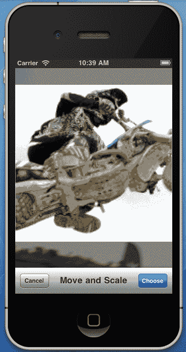

# 第七章. 多媒体资源

在本章中，我们将介绍以下内容：

+   选择图像和视频

+   使用相机捕获媒体

+   播放视频

+   播放音乐和声音

+   使用麦克风录制

+   直接管理多个相册项目

# 简介

今天智能手机和平板电脑最重要的功能之一是它们捕捉和管理多媒体资源的能力。无论是照片、视频还是音频，针对这些设备且能够有效处理多媒体的应用程序非常重要。

在本章中，我们将学习如何管理设备上存储的媒体。我们还将了解如何使用设备的多媒体捕获设备（相机和麦克风）来捕捉内容并创建一个将为用户提供丰富体验的应用程序。

更具体地说，我们将讨论以下内容：

+   `UIImagePickerController:` 这是一个控制器，不仅通过用户界面提供对设备上已保存的照片和视频的访问，还提供了一个用于捕获的相机界面

+   `MPMoviePlayerController:` 这是一个允许我们播放和流式传输视频文件的控制器

+   `MPMediaPickerController:` 这是访问已保存内容的默认用户界面，由原生 iPod 应用程序管理

+   `MPMusicPlayerController:` 这是一个负责播放 iPod 内容的对象

+   `AVAudioPlayer:` 这是一个允许我们播放声音文件的类

+   `AVAudioRecorder:` 这是一个允许我们使用麦克风录制音频的类

+   `ALAssetsLibrary:` 这是一个提供对设备可用资源和其元数据的访问的类

# 选择图像和视频

在这个菜谱中，我们将学习如何为用户提供从设备相册导入图像和视频的能力。

## 准备工作

在 MonoDevelop 中创建一个新的项目，并将其命名为`ImagePickerApp`。

## 如何操作...

1.  在`MainController`的主视图中添加一个`UIImageView`和一个`UIButton`。

1.  覆盖`MainController`类的`ViewDidLoad`方法，并在其中输入以下代码：

    ```swift
    this.imagePicker = new UIImagePickerController();
    this.imagePicker.FinishedPickingMedia += this.ImagePicker_FinishedPickingMedia;
    this.imagePicker.Canceled += this.ImagePicker_Cancelled;
    this.imagePicker.SourceType = UIImagePickerControllerSourceType.PhotoLibrary;
    this.buttonChoose.TouchUpInside += delegate {
    this.PresentModalViewController(this.imagePicker, true);
    } ;

    ```

1.  实现处理`FinishedPickingMedia`和`Canceled`事件的处理器方法：

    ```swift
    private void ImagePicker_FinishedPickingMedia (object sender, UIImagePickerMediaPickedEventArgs e){
    UIImage pickedImage = e.Info[UIImagePickerController.OriginalImage] as UIImage;
    this.imageView.Image = pickedImage;
    this.imagePicker.DismissModalViewControllerAnimated(true);
    }
    private void ImagePicker_Cancelled (object sender, EventArgs e){
    this.imagePicker.DismissModalViewControllerAnimated(true);
    }

    ```

1.  在模拟器上编译并运行应用程序。

1.  点击按钮以显示图像选择器，并通过点击缩略图选择图像。图像将在图像视图中显示。`UIImagePickerController`在以下屏幕截图中显示：


## 它是如何工作的...

`UIImagePickerController` 是 iOS 提供的一个特殊视图控制器，用于选择保存在设备相册中的图像和视频，或从相机中获取。

### 注意

默认情况下，iOS 模拟器中没有存储在相册中的图像。要将图像添加到模拟器中，取消注释已下载项目源代码中的`AddImagesToAlbum`方法，并调用一次，将包含图像的计算机上的物理路径作为参数传递。

在初始化图片选择器对象后，我们需要订阅其`FinishedPickingMedia`事件，该事件为我们提供了用户所选的媒体。在分配给它的处理程序中，我们获取所选的图片：

```swift
UIImage pickedImage = e.Info[UIImagePickerController.OriginalImage] as UIImage;

```

`Info`属性返回一个包含有关所选媒体各种信息的`NSDictionary`对象。我们通过传递常量`UIImagePickerController.OriginalImage`作为键来检索图像。因为字典的值是`NSObject`类型，所以我们把返回值转换为`UIImage`。在我们将图像分配给要显示的`UIImageView`之后，我们关闭控制器：

```swift
this.imagePicker.DismissModalViewControllerAnimated(true);

```

当用户点击控制器的**取消**按钮时，会触发`Canceled`事件。我们必须订阅它以关闭控制器，因为它在用户点击**取消**按钮时不会自动关闭。

## 还有更多...

我们可以通过图片选择器的`SourceType`属性定义图片选择器将从中读取的图片/视频的来源。在此示例中，我们使用`UIImagePickerController.PhotoLibrary`，因为模拟器不支持相机硬件。

### 选择视频

`UIImagePickerController`默认只显示图片。要支持视频，其`MediaType`属性必须被设置。它接受一个`string[]`，包含指定的媒体名称：

```swift
this.imagePicker.MediaTypes = new string[] { "public.image", "public.movie" };

```

要确定用户选择的媒体类型，我们在`FinishedPickingMedia`处理程序中的字典中检查`MediaType`键。如果是视频，我们使用`MediaUrl`键获取其 URL：

```swift
if (e.Info[UIImagePickerController.MediaType].ToString() == "public.movie"){
NSUrl mediaUrl = e.Info[UIImagePickerController.MediaURL] as NSUrl;
// Do something useful with the media url.
}

```

## 参见

在本章中：

+   *使用相机捕捉媒体*

+   *直接管理相册项目*

# 使用相机捕捉媒体

在本食谱中，我们将学习如何使用设备相机来捕捉媒体。

## 准备工作

打开之前任务中讨论的`ImagePickerApp`项目。

### 注意

在 iOS 模拟器上不可用相机功能。此示例只能在设备上运行。有关更多信息，请参阅第十四章*部署*。

## 如何做...

1.  在`ViewDidLoad`方法内部，替换以下行：

    ```swift
    this.imagePicker.SourceType = UIImagePickerControllerSourceType.PhotoLibrary;

    ```

1.  使用以下代码块：

    ```swift
    if (UIImagePickerController.IsSourceTypeAvailable( UIImagePickerControllerSourceType.Camera)){
    this.imagePicker.SourceType = UIImagePickerControllerSourceType.Camera;
    } else{
    this.imagePicker.SourceType = UIImagePickerControllerSourceType.PhotoLibrary;
    }

    ```

1.  在`FinishedPickingMedia`处理程序中，在关闭图片选择器之前添加以下代码：

    ```swift
    pickedImage.SaveToPhotosAlbum(delegate( UIImage image, NSError error) {
    if (null != error){
    Console.WriteLine("Image not saved! Message: {0}", error.LocalizedDescription);
    }
    } );

    ```

1.  在设备上编译并运行应用程序。

1.  点击按钮打开相机并拍照。照片将被保存到设备相册中。

## 它是如何工作的...

在展示相机取景器之前，我们必须确保应用程序运行的实际设备确实具有适当的硬件。我们通过调用`UIImagePickerController`类的静态`IsSourceTypeAvailable`方法来完成此操作：

```swift
if (UIImagePickerController.IsSourceTypeAvailable( UIImagePickerControllerSourceType.Camera))

```

如果它返回`true`，我们将源类型设置为`Camera:`

```swift
this.imagePicker.SourceType = UIImagePickerControllerSourceType.Camera;

```

这将导致图片选择器控制器启动相机设备而不是加载设备相册。

当用户拍照（或录像）时，它不会自动保存在设备上。要保存它，我们使用`UIImage`类的`SaveToPhotosAlbum`方法。此方法接受一个类型为`UIImage.SaveStatus`的委托，如果发生错误，它会报告错误：

```swift
if (null != error){
Console.WriteLine("Image not saved! Message: {0}", error.LocalizedDescription);
}

```

## 更多...

摄像头视图也可以自定义。要禁用默认的摄像头控件，将`ShowsCameraControls`属性设置为`false`。然后，将您想要的控件的自定义视图传递给`CameraOverlayView`属性。要触发摄像头的快门，请调用`TakePicture`方法。

### 图像编辑

摄像头支持简单的编辑功能，在捕获图像后。此编辑功能允许用户选择图像的特定部分，甚至可以放大到特定区域。要显示编辑控件，将`AllowsEditing`属性设置为`true`。编辑后的图像可以从`FinishedPickingMedia`处理程序中的字典中检索，传递`UIImagePickerController.EditedImage`键。编辑界面如下截图所示：



## 参见

在这一章：

+   *选择图像和视频*

# 播放视频

在这个菜谱中，我们将学习如何显示视频播放器界面并播放视频文件。

## 准备工作

在 MonoDevelop 中创建一个新的项目，并将其命名为`PlayVideoApp`。

## 如何做...

1.  在`MainController`的主视图中添加一个按钮。

1.  将视频文件添加到项目中，并将其**构建操作**设置为**内容**。

1.  在`MainController.cs`文件中输入以下`using`指令：

    ```swift
    using MonoTouch.MediaPlayer;

    ```

1.  覆盖`MainController`类的`ViewDidLoad`方法，并输入以下代码：

    ```swift
    this.moviePlayer = new MPMoviePlayerController( new NSUrl("videos/video.mov"));
    this.moviePlayer.View.Frame = this.View.Bounds;
    this.View.AddSubview(this.moviePlayer.View);

    this.playbackStateChanged = NSNotificationCenter.DefaultCenter.AddObserver( MPMoviePlayerController.PlaybackStateDidChangeNotification, this.MoviePlayer_PlaybackStateChanged);this.finishedPlaying = NSNotificationCenter.DefaultCenter.AddObserver( MPMoviePlayerController.PlaybackDidFinishNotification, this.MoviePlayer_FinishedPlayback);
    this.buttonPlay.TouchUpInside += delegate {
    this.moviePlayer.Play();
    } ;

    ```

1.  在`MainController`类中输入以下方法：

    ```swift
    private void MoviePlayer_PlaybackStateChanged(NSNotification ntf){
    Console.WriteLine("Movie player load state changed: {0}", this.moviePlayer.PlaybackState);
    }
    private void MoviePlayer_FinishedPlayback(NSNotification ntf){
    Console.WriteLine("Movie player finished playing.");
    }

    ```

1.  在模拟器上编译并运行应用程序。

1.  点击按钮，视频将加载并开始播放。在 MonoDevelop 的**应用程序输出**中查看显示的消息。

### 工作原理...

`MPMoviePlayerController`播放存储在本地的视频文件或从网络流式传输的视频文件。我们使用接受`NSUrl`参数的构造函数来初始化它：

```swift
this.moviePlayer = new MPMoviePlayerController( new NSUrl("videos/video.mov"));

```

`NSUrl`对象映射到我们添加到项目中的本地文件。

创建实例后，我们为其视图定义一个框架并将其添加到我们的视图中：

```swift
this.moviePlayer.View.Frame = this.View.Bounds;
this.View.AddSubview(this.moviePlayer.View);

```

突出的代码向默认的通知中心添加观察者，这样当播放状态改变或完成时，我们会收到通知。然后，我们调用它的`Play`方法，`MPMoviePlayerController`的视图就会显示，视频开始播放。

在`MoviePlayer_PlaybackStateChanged`方法内部，我们输出`PlaybackState`属性：

```swift
Console.WriteLine("Movie player load state changed: {0}", this.moviePlayer.PlaybackState);

```

此属性告诉我们播放状态，例如`Paused`、`Playing`、`SeekingForward`、`SeekingBackward`等。

### 更多...

除了这个例子中使用的之外，我们还可以为`MPMoviePlayerController`添加更多通知的观察者，其中一些是：

+   `DidEnterFullscreenNotification:` 此通知表示用户点击了全屏控制，控制器已进入 `fullscreen` 模式。

+   `DidExitFullscreenNotification:` 此通知表示控制器已离开 `fullscreen` 模式。

+   `DurationAvailableNotification:` 此通知表示控制器已收到视频持续时间的信息。

+   `LoadStateDidChangeNotification:` 此通知对于网络播放很有用，当控制器在缓冲区中完成预加载媒体时被触发。

+   `NaturalSizeAvailableNotification:` 当电影帧的尺寸可用时，此通知被触发。大小可以通过播放器的 `NaturalSize` 属性检索。

+   `NowPlayingMovieDidChangeNotification:` 当播放器的视频内容发生变化时，此通知被触发。当前内容可以通过其 `ContentUrl` 属性获取。

#### 无线流媒体

从 iOS 版本 4.3 开始，`MPMoviePlayerController` 可以用来将视频流式传输到 Apple 的 AirPlay 兼容设备。要启用它，将其 `AllowsAirPlay` 属性设置为 `true`。当 `MPMoviePlayerController` 显示时，它将提供一个界面，允许用户选择它检测到的设备。

### 相关内容

在本章中：

+   *播放音乐和声音*

# 播放音乐和声音

在本教程中，我们将学习如何播放存储在设备上的简单音频文件和歌曲。

## 准备工作

在 MonoDevelop 中创建一个新的项目，并将其命名为 `PlayMusicApp`。

### 注意

此示例在模拟器上无法工作。您还需要在设备上至少存储一首歌曲。

## 如何操作...

1.  在 `MainController` 的视图中添加三个按钮。

1.  在 `MainController.cs` 文件中添加以下 `using` 指令：

    ```swift
    using MonoTouch.MediaPlayer;

    ```

1.  在类中添加两个字段：

    ```swift
    private MPMusicPlayerController musicPlayerController;
    private MPMediaPickerController mediaPicker;

    ```

1.  重写 `MainController` 类的 `ViewDidLoad` 方法，并输入以下代码：

    ```swift
    this.mediaPicker = new MPMediaPickerController(MPMediaType.Music);
    this.mediaPicker.ItemsPicked += MediaPicker_ItemsPicked;
    this.mediaPicker.DidCancel += MediaPicker_DidCancel;
    this.musicPlayerController = MPMusicPlayerController.ApplicationMusicPlayer;
    this.buttonSelectSongs.TouchUpInside += delegate {
    this.PresentModalViewController(this.mediaPicker, true);
    } ;
    this.buttonPlay.TouchUpInside += delegate {
    this.musicPlayerController.Play();
    } ;
    this.buttonStop.TouchUpInside += delegate {
    this.musicPlayerController.Stop();
    } ;

    ```

1.  添加以下方法：

    ```swift
    private void MediaPicker_ItemsPicked ( object sender, ItemsPickedEventArgs e){
    this.musicPlayerController.SetQueue(e.MediaItemCollection);
    this.DismissModalViewControllerAnimated(true);
    }
    private void MediaPicker_DidCancel (object sender, EventArgs e){
    this.mediaPicker.DismissModalViewControllerAnimated(true);
    }

    ```

1.  在设备上编译并运行应用程序。

1.  点击 **选择歌曲** 按钮，并选择一首或多首歌曲。

### 它是如何工作的...

`MPMediaPickerController` 提供与原生 iPod 应用程序相同的用户界面。`MPMusicPlayerController` 负责播放设备上存储的歌曲。

我们首先初始化媒体选择器，通过其构造函数传递我们想要它查找的媒体类型：

```swift
this.mediaPicker = new MPMediaPickerController(MPMediaType.Music);

```

之后，我们订阅其 `ItemsPicked` 和 `DidCancel` 事件，以便我们可以捕获用户的反馈：

```swift
this.mediaPicker.ItemsPicked += MediaPicker_ItemsPicked;
this.mediaPicker.DidCancel += MediaPicker_DidCancel;

```

突出的代码显示了如何初始化音乐播放器对象。这里演示的选项 `MPMusicPlayerController.ApplicationMusicPlayer` 创建了一个仅针对应用程序的实例。另一个可用的选项 `MPMusicPlayerController.iPodMusicPlayer` 创建了一个实例，允许在应用程序处于后台时播放媒体，类似于 iPod 应用程序。

在 `MediaPicker_ItemsPicked` 处理程序中，我们通过其 `SetQueue` 方法将用户选择的歌曲设置到音乐播放器中：

```swift
this.musicPlayerController.SetQueue(e.MediaItemCollection);

```

之后，我们取消显示模态媒体选择器控制器。播放和停止歌曲分别通过 `MPMusicPlayerController` 的 `Play()` 和 `Stop()` 方法实现。

### 还有更多...

`MPMusicPlayerController` 包含有关当前播放项的信息。此信息可以通过其 `NowPlayingItem` 属性访问。它是 `MPMediaItem` 类型，包含有关当前播放媒体的各种类型信息。以下示例获取正在播放的歌曲的标题：

```swift
Console.WriteLine(this.musicPlayerController .NowPlayingItem.ValueForProperty(MPMediaItem.TitleProperty));

```

#### 播放声音文件

`MPMusicPlayerController` 是一个专门设计用来管理和播放存储在设备 iPod 库中的项目和播放列表的对象。

对于播放简单的声音文件，MonoTouch 为 iOS 的 `AVAudioPlayer` 类提供了一个包装器。以下是其最简单用法的示例：

```swift
using MonoTouch.AVFoundation;
//...
AVAudioPlayer audioPlayer = AVAudioPlayer.FromUrl( new NSUrl("path/to/sound file"));
audioPlayer.Play();

```

### 参见

在本章中：

+   *播放视频*

# 使用麦克风录制

在本食谱中，我们将学习如何使用设备的麦克风来录制声音。

## 准备工作

在 MonoDevelop 中创建一个新的项目，并将其命名为 `RecordSoundApp`。

### 注意

此示例在模拟器上无法工作。

## 如何操作...

1.  在 `MainController` 的视图中添加两个按钮。

1.  在 `MainController.cs` 文件中输入以下 `using` 指令：

    ```swift
    using System.IO;
    using MonoTouch.AVFoundation;
    using MonoTouch.AudioToolbox;

    ```

1.  覆盖 `ViewDidLoad` 方法，并在其中添加以下代码：

    ```swift
    string soundFile = Path.Combine(Environment.GetFolderPath( Environment.SpecialFolder.Personal), "sound.wav");
    NSUrl soundFileUrl = new NSUrl(soundFile);
    NSDictionary recordingSettings = NSDictionary.FromObjectAndKey( AVAudioSettings.AVFormatIDKey, NSNumber.FromInt32((int) AudioFileType.WAVE));
    NSError error = null;
    this.audioRecorder = AVAudioRecorder.ToUrl( soundFileUrl, recordingSettings, out error);
    this.buttonStart.TouchUpInside += delegate {
    this.audioRecorder.Record();
    } ;
    this.buttonStop.TouchUpInside += delegate {
    this.audioRecorder.Stop();
    AVAudioPlayer player = AVAudioPlayer.FromUrl(soundFileUrl);
    player.Play();
    } ;

    ```

1.  在设备上编译并运行应用程序。

1.  点击 **开始录制** 按钮开始录制音频，例如，可以说些话来录制你的声音。

1.  点击 **停止录制** 按钮停止录制并播放回放。

## 工作原理...

`AVAudioRecorder` 类提供了录制功能。它是通过将捕获的音频直接流式传输到文件系统来实现的。要初始化 `AVAudioRecorder` 的实例，我们使用它的静态 `ToUrl` 方法：

```swift
this.audioRecorder = AVAudioRecorder.ToUrl( soundFileUrl, recordingSettings, out error);

```

如果与 `NSUrl` 变量对应的文件已经存在，它将被覆盖。

`recordingSettings` 变量是 `NSDictionary` 类型，包含输出声音文件的设置。在初始化 `AVAudioRecorder` 时，我们必须提供至少一些最小设置。在这里，我们将声音格式设置为纯 wav：

```swift
NSDictionary recordingSettings = NSDictionary.FromObjectAndKey( AVAudioSettings.AVFormatIDKey, NSNumber .FromInt32((int)AudioFileType.WAVE));

```

要指示记录器开始录制，我们只需调用它的 `Record()` 方法：

```swift
this.audioRecorder.Record();

```

当用户点击 **停止录制** 按钮时，录制停止，保存的声音开始通过 `AVAudioPlayer:` 播放。

```swift
this.audioRecorder.Stop();
AVAudioPlayer player = AVAudioPlayer.FromUrl(soundFileUrl);
player.Play();

```

## 还有更多...

`AVAudioRecorder` 类还提供了声音计测选项。要启用声音计测，将它的 `MeteringEnabled` 属性设置为 `true`。然后我们可以在特定通道上输出峰值功率（以分贝为单位）。为了对我们录制的第一个通道执行此操作，请在 `Record()` 方法调用之后立即添加以下代码：

```swift
ThreadPool.QueueUserWorkItem(delegate {
while (this.audioRecorder.Recording){
this.audioRecorder.UpdateMeters();
Console.WriteLine(this.audioRecorder.PeakPower(0));
}
} );

```

`PeakPower` 方法接受通道的零基索引并返回该通道的峰值（以分贝为单位）。在调用 `PeakPower` 方法之前，请立即调用 `UpdateMeters()` 方法以获取最新的读数。

注意，在录制器上启用测光会使用 CPU 资源。如果您不打算使用测光值，请勿启用它。

### 预定义时间录制

要录制预定义时间的音频，而无需用户停止录制，请调用 `RecordFor(double)` 方法。其参数指定了录制的时间（以秒为单位）。

## 相关内容

在本章中：

+   *播放音乐和声音*

# 直接管理多个相册项目

在本食谱中，我们将讨论以编程方式访问设备的照片相册。

## 准备工作

在 MonoDevelop 中创建一个新的项目，并将其命名为 `ManageAlbumApp`。

### 注意

此示例适用于模拟器。照片相册中必须至少存在一个图像。

## 如何操作...

1.  在 `MainController` 的主视图中添加一个按钮。

1.  在 `MainController.cs` 文件中输入以下 `using` 指令：

    ```swift
    using MonoTouch.AssetsLibrary;

    ```

1.  重写 `ViewDidLoad` 方法，并在其中输入以下代码：

    ```swift
    this.buttonEnumerate.TouchUpInside += delegate {
    this.assetsLibrary = new ALAssetsLibrary();
    this.assetsLibrary.Enumerate(ALAssetsGroupType.All, this.GroupsEnumeration, this.GroupsEnumerationFailure);
    } ;

    ```

1.  在类中添加以下方法：

    ```swift
    private void GroupsEnumeration(ALAssetsGroup assetGroup, ref bool stop){
    if (null != assetGroup){
    stop = false;
    assetGroup.SetAssetsFilter(ALAssetsFilter.AllPhotos);
    assetGroup.Enumerate(this.AssetEnumeration);
    }
    }
    private void AssetEnumeration(ALAsset asset, int index, ref bool stop){
    if (null != asset){
    stop = false;
    Console.WriteLine("Asset url: {0}", asset.DefaultRepresentation.Url.AbsoluteString);
    }
    }
    private void GroupsEnumerationFailure(NSError error){
    if (null != error){
    Console.WriteLine("Error enumerating asset groups! Message: {0}", error.LocalizedDescription);
    }
    }

    ```

1.  编译并运行应用程序。

1.  点击 **枚举资产** 按钮，并观察保存照片的 URL 在 **应用程序输出** 面板中显示。

## 它是如何工作的...

`ALAssetsLibrary` 类提供了对设备相册项的访问。这些项由 `ALAsset` 类表示，并按组划分，由 `ALAssetGroup` 类表示。

我们需要做的第一件事是枚举资产组。为此，调用 `Enumerate` 方法：

```swift
this.assetsLibrary.Enumerate(ALAssetsGroupType.All, this.GroupsEnumeration, this.GroupsEnumerationFailure);

```

第一个参数是 `ALAssetGroupTypes` 类型，它指示资产库要枚举哪些资产组。传递 `ALAssetGroupTypes.All` 表示我们想要枚举所有资产组。其他两个参数是委托类型。`GroupsEnumeration` 方法是我们读取组数据的地方，而 `GroupsEnumerationFailure` 将在发生错误时触发。当第一次调用 `Enumerate` 方法时，会要求用户授权应用程序访问设备的资产。如果用户拒绝访问，将触发失败方法。下次调用 `Enumerate` 方法时，访问消息会再次出现。

`GroupsEnumeration` 方法的签名如下：

```swift
private void GroupsEnumeration(ALAssetsGroup assetGroup, ref bool stop)

```

`assetGroup` 参数包含组的信息。

注意 `stop` 参数，它被声明为 `ref`。当枚举发生时，方法会被触发一次以返回第一个组，并且第二次不会调用，无论还有多少组存在。为了强制它继续被调用以枚举所有组，我们必须将 `stop` 变量设置为 `false`。当所有组都被枚举后，方法会最后一次被调用，此时 `assetGroup` 变量被设置为 `null`。因此，我们需要检查这一点。将这些放入代码中：

```swift
if (null != assetGroup){
// Continue enumerating
stop = false;
// Determine what assets to enumerate
assetGroup.SetAssetsFilter(ALAssetsFilter.AllPhotos);
// Enumerate assets
assetGroup.Enumerate(this.AssetEnumeration);
}

```

在 `ALAssetGroup` 类的实例上调用 `SetAssetsFilter` 方法，我们指示它过滤我们希望它查找的资产类型。之后，过程与组枚举类似。`ALAssetGroup` 类还包含一个 `Enumerate` 方法。它接受一个代表类型（在这里由 `AssetsEnumeration` 方法表示）的参数。其实现与 `GroupsEnumeration` 方法类似：

```swift
if (null != asset){
// Continue enumerating assets
stop = false;
// Output the asset url
Console.WriteLine("Asset url: {0}", asset.DefaultRepresentation.Url.AbsoluteString);

```

`ALAsset` 类包含各种信息和属性。大部分信息存储在其 `DefaultRepresentation` 属性中，该属性的类型为 `ALAssetRepresentation`。

## 更多内容...

如果我们感兴趣的资产是一张图片，我们可以通过 `DefaultRepresentation` 属性获取实际图片：

```swift
CGImage image = asset.DefaultRepresentation.GetImage();

```

### 读取 EXIF 数据

我们可以通过 `ALAssetRepresentation` 的 `Metadata` 属性读取照片的 **交换图像文件格式** (EXIF) 元数据，`Metadata` 属性的类型为 `NSDictionary`，如下所示：

```swift
NSDictionary metaData = asset.DefaultRepresentation.Metadata;
if (null != metaData){
NSDictionary exifData = (NSDictionary)metaData[ new NSString("{Exif}")];
}

```

### 获取单个资产

如果我们知道资产的 URL，我们也可以通过 `ALAssetLibrary` 的 `AssetForUrl` 方法检索单个资产。

## 参见

在本章中：

+   *选择图片和视频*
