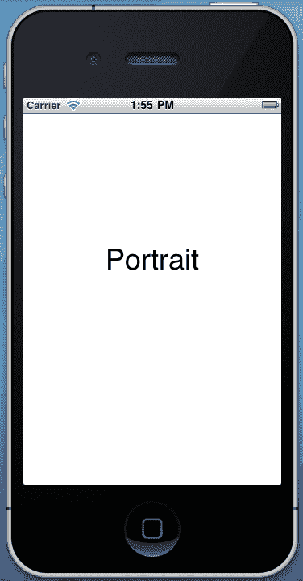
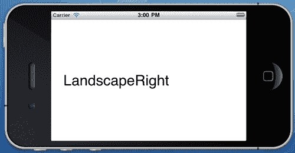
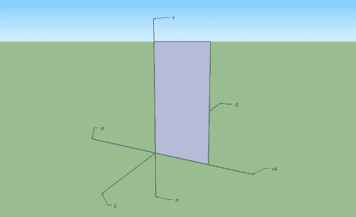

# 第九章.与设备硬件交互

在本章中，我们将涵盖：

+   检测设备方向

+   调整 UI 方向

+   接近传感器

+   获取电池信息

+   处理运动事件

+   处理触摸事件

+   识别手势

+   自定义手势

+   使用加速度计

+   使用陀螺仪

# 简介

今天的移动设备配备了非常先进的硬件。无论是加速度计来检测运动和方向，接近传感器，GPS 模块，以及许多其他组件，多触控屏幕相当复杂。

在本章中，我们将重点关注如何在我们的应用程序中使用这些硬件，为用户提供一个扩展到 3D 世界的体验。具体来说，我们将讨论如何根据设备的位置调整用户界面方向，如何使用接近传感器，以及读取电池信息。在一系列四个任务中，我们将学习如何捕获屏幕上的用户触摸并识别手势。

最后但同样重要的是，我们将创建高级应用程序，从加速度计和陀螺仪传感器读取原始数据以检测设备运动和旋转，并提供详细且简单的指南。

# 检测设备方向

在这个菜谱中，我们将学习如何制作一个能够感知设备方向变化的应用程序。

## 准备工作

在 MonoDevelop 中创建一个新的项目，并将其命名为`DeviceOrientationApp`。

## 如何做到这一点...

1.  在`MainController`的视图中添加一个标签。在`MainController`类中输入以下代码：

    ```swift
    private NSObject orientationObserver;
    public override void ViewDidLoad (){
    base.ViewDidLoad ();
    UIDevice.CurrentDevice. BeginGeneratingDeviceOrientationNotifications();
    this.orientationObserver = NSNotificationCenter.DefaultCenter. AddObserver(UIDevice.OrientationDidChangeNotification, delegate {
    this.lblOrientation.Text = UIDevice.CurrentDevice.Orientation.ToString();
    } );
    }
    public override void ViewDidUnload (){
    base.ViewDidUnload ();
    NSNotificationCenter.DefaultCenter. RemoveObserver(this.orientationObserver);
    UIDevice.CurrentDevice. EndGeneratingDeviceOrientationNotifications();
    }

    ```

1.  在模拟器上编译并运行应用程序。

1.  通过在 Mac 上按住**Command**键并按左或右箭头键来旋转模拟器。



## 它是如何工作的...

虽然模拟器缺少加速度计硬件，但它支持方向变化的通知。

可以通过`UIDevice.CurrentDevice`单例对象访问设备方向通知机制。为了接收通知，我们首先需要指示运行时发出它们。我们使用以下方法来完成此操作：

```swift
UIDevice.CurrentDevice. BeginGeneratingDeviceOrientationNotifications();

```

此方法打开加速度计并开始生成方向通知。然后我们需要开始观察通知，以便响应变化：

```swift
this.orientationObserver = NSNotificationCenter.DefaultCenter. AddObserver(UIDevice.OrientationDidChangeNotification, delegate {
this.lblOrientation.Text = UIDevice.CurrentDevice.Orientation.ToString();
} );

```

每当设备方向改变时，观察者触发匿名方法。在其中，我们将从`Orientation`属性获取的方向输出到标签。

`ViewDidUnload`方法是在视图控制器卸载其视图时被调用的方法。在其中，我们确保移除方向观察者，并指示运行时停止生成方向通知：

```swift
NSNotificationCenter.DefaultCenter. RemoveObserver(this.orientationObserver);
UIDevice.CurrentDevice.EndGeneratingDeviceOrientationNotifications();

```

## 还有更多...

`Orientation`属性返回类型为`UIDeviceOrientation`的枚举。其值如下：

+   `Unknown:` 此值指定设备方向未知

+   `Portrait:` 此值指定设备处于正常的纵向方向，**主页**按钮在底部

+   `PortraitUpsideDown:` 这个值指定设备处于颠倒的纵向方向，**主页**按钮在顶部

+   `LandscapeLeft:` 这个值指定设备处于横向方向，**主页**按钮在左侧

+   `LandscapeRight:` 这个值指定设备处于横向方向，**主页**按钮在右侧

+   `FaceUp:` 这个值指定设备与地面平行，屏幕向上

+   `FaceDown:` 这个值指定设备与地面平行，屏幕向下

`FaceUp`和`FaceDown`是模拟器上无法复制的两个值。

### 设备方向和用户界面方向

在这个例子中可以明显看出，设备方向和用户界面方向之间存在差异。如果设备旋转，标签会更新为新方向值，但用户界面不会对变化做出响应。在下一个菜谱中，我们将讨论如何旋转用户界面。

## 参见

在本章中：

+   *调整 UI 方向*

+   *使用加速度计*

# 调整 UI 方向

在这个菜谱中，我们将学习如何根据屏幕方向旋转**用户界面 (UI)**。

## 准备工作

在 MonoDevelop 中创建一个新的项目，并将其命名为`UIOrientationApp`。

## 如何操作...

1.  在`MainController`视图上添加一个标签。在`MainController`类中输入以下代码：

    ```swift
    public override bool ShouldAutorotateToInterfaceOrientation ( UIInterfaceOrientation toInterfaceOrientation){
    return true;
    }
    public override void DidRotate ( UIInterfaceOrientation fromInterfaceOrientation){
    base.DidRotate (fromInterfaceOrientation);
    this.lblOutput.Text = this.InterfaceOrientation.ToString();
    }

    ```

1.  在模拟器上编译并运行应用程序。

1.  使用*Command* + 方向键旋转模拟器。以下图像显示了**LandscapeRight**方向：



## 它是如何工作的...

要使我们的 UI 适应设备方向，我们只需要重写视图控制器的`ShouldAutorotateToInterfaceOrientation`方法：

```swift
public override bool ShouldAutorotateToInterfaceOrientation ( UIInterfaceOrientation toInterfaceOrientation)

```

当视图控制器加载时，它会检查每个可用方向的方法结果。第一次接收到`true`时，它会自动将界面旋转到该方向。加载后，每次设备旋转时，都会重复相同的流程。

方法参数是类型为`UIInterfaceOrientation`的枚举，每次方法被调用时，它包含界面检查的方向值。

在界面方向完成旋转后，会调用`DidRotate`方法。我们使用`UIViewController.InterfaceOrientation`属性，它包含视图控制器当前方向的信息，来更新标签：

```swift
this.lblOutput.Text = this.InterfaceOrientation.ToString();

```

## 更多内容...

从`ShouldAutorotateToInterfaceOrientation`方法返回`true`意味着界面将在所有设备方向上旋转。在大多数情况下，这并不是必要的，甚至应该根据我们的应用程序设计避免。要使我们的界面仅旋转到横向方向，方法应实现如下：

```swift
public override bool ShouldAutorotateToInterfaceOrientation ( UIInterfaceOrientation toInterfaceOrientation){
return toInterfaceOrientation == UIInterfaceOrientation.LandscapeLeft || toInterfaceOrientation == UIInterfaceOrientation.LandscapeRight;
}

```

注意，此实现将强制 UI 以横屏模式加载。

### 模拟器中的用户界面方向

如果你只实现`ShouldAutorotateToInterfaceOrientation`方法以支持横屏方向，那么加载模拟器“设备”的控制器也将以横屏方向旋转。然而，这只是为了方便，因为如果你检查`UIDevice.CurrentDevice.Orientation`属性，其值将是`UIDeviceOrientation.Portrait`。

## 参见

在本章中：

+   *检测设备方向*

+   *使用加速度计*

# 接近传感器

在这个菜谱中，我们将讨论使用接近传感器来禁用设备屏幕。

## 准备工作

在 MonoDevelop 中创建一个新的项目，并将其命名为`ProximitySensorApp`。

### 注意

模拟器不支持接近传感器。

## 如何做到这一点...

对于这个任务，除了`MainController`本身之外，不需要任何控件。

1.  声明一个`NSObject`字段，它将包含通知观察者：

    ```swift
    private NSObject proximityObserver;

    ```

1.  在`ViewDidLoad`重写方法中输入以下代码：

    ```swift
    UIDevice.CurrentDevice.ProximityMonitoringEnabled = true;
    if (UIDevice.CurrentDevice.ProximityMonitoringEnabled){
    this.proximityObserver = NSNotificationCenter.DefaultCenter. AddObserver(UIDevice.ProximityStateDidChangeNotification, delegate(NSNotification ntf) {
    Console.WriteLine("Proximity state: {0}", UIDevice.CurrentDevice.ProximityState);
    } );
    }

    ```

1.  最后，在`ViewDidUnload`重写方法中输入以下代码：

    ```swift
    if (UIDevice.CurrentDevice.ProximityMonitoringEnabled){
    NSNotificationCenter.DefaultCenter. RemoveObserver(this.proximityObserver);
    UIDevice.CurrentDevice.ProximityMonitoringEnabled = false;
    }

    ```

1.  在设备上编译并运行应用程序。

1.  将手指放在接近传感器上，或者就像在通话时那样，将其靠近你的耳朵。观察 MonoDevelop 中的**应用程序输出**面板显示传感器的状态。

## 它是如何工作的...

尽管接近传感器的功能相当简单，但它提供了一个非常重要的特性。iOS 设备正面只有一个按钮，那就是**主**按钮。几乎每一次用户与设备的交互都是基于触摸屏的。这在 iPhone 上造成了一个问题：除了它的多种功能外，它也是一个电话。这意味着它很可能会在用户的面部侧面花费一些时间来进行通话。

为了避免意外触碰到虚拟按钮，当手机应用程序运行时，接近传感器会被激活，以在设备靠近用户的耳朵或传感器上方的任何物体时禁用屏幕。

要启用接近传感器，将`UIDevice.CurrentDevice.ProximityMonitoringEnabled`属性的值设置为`true`：

```swift
UIDevice.CurrentDevice.ProximityMonitoringEnabled = true;

```

如果设备不支持接近传感器，即使将其设置为`true`，此属性也将返回`false`。因此，在将其设置为`true`之后，我们可以检查它以查看设备是否支持传感器：

```swift
if (UIDevice.CurrentDevice.ProximityMonitoringEnabled)

```

在检查后，我们可以使用`UIDevice.ProximityStateDidChangeNotification`键添加一个观察者来通知传感器的状态：

```swift
this.proximityObserver = NSNotificationCenter.DefaultCenter. AddObserver(UIDevice.ProximityStateDidChangeNotification, delegate(NSNotification ntf) {
Console.WriteLine("Proximity state: {0}", UIDevice.CurrentDevice.ProximityState);
} );

```

`ProximityState`属性返回`true`表示传感器已经关闭了屏幕，如果它重新打开屏幕则返回`false`。

## 还有更多...

接近传感器的使用不仅限于电话功能。例如，如果你正在开发一个在设备放在用户的口袋或钱包中时可以执行一些工作的应用程序，启用接近传感器可以确保不会意外触碰到控制按钮。甚至可以通过仅关闭屏幕来节省电池电量。

### 传感器支持

并非所有设备都支持接近传感器。如果你针对各种 iOS 设备，请考虑传感器可能不会在所有设备上可用。

## 相关内容

在本章中：

+   *检索电池信息*

# 检索电池信息

在这个菜谱中，我们将学习如何读取设备的充电状态及其电池使用情况。

## 准备工作

在 MonoDevelop 中创建一个新的项目，并将其命名为 `BatteryInfoApp`。

## 如何做到...

1.  在 `MainController` 的视图中添加一个标签。在 `MainController` 类中输入以下代码：

    ```swift
    private NSObject batteryStateChangeObserver;
    public override void ViewDidLoad (){
    base.ViewDidLoad ();
    UIDevice.CurrentDevice.BatteryMonitoringEnabled = true;
    this.batteryStateChangeObserver = NSNotificationCenter. DefaultCenter.AddObserver(UIDevice. BatteryStateDidChangeNotification, delegate (NSNotification ntf) {
    this.lblOutput.Text = string.Format("Battery state: {0}", UIDevice.CurrentDevice.BatteryState);
    } );
    }

    ```

1.  在设备上编译并运行应用程序。

1.  应用程序加载后，断开并/或连接设备的 USB 线缆。观察标签上的电池状态。

## 它是如何工作的...

我们可以通过 `UIDevice` 类检索电池信息。我们必须做的第一件事是启用电池监控：

```swift
UIDevice.CurrentDevice.BatteryMonitoringEnabled = true;

```

在不支持电池监控的模拟器上，即使我们将其设置为 true，此属性也将返回 false。

我们可以通过 `UIDevice.BatteryStateDidChangeNotification` 键添加一个观察者来监听电池状态变化通知，如之前高亮显示的代码所示。可以通过 `BatteryState` 属性检索电池状态：

```swift
this.lblOutput.Text = string.Format("Battery state: {0}", UIDevice.CurrentDevice.BatteryState);

```

`BatteryState` 属性的可能值包括：

+   `Unknown:` 此值指定无法确定电池状态，或者电池监控被禁用

+   `Unplugged:` 此值指定设备正在使用电池供电

+   `Charging:` 此值指定设备电池正在充电，并且 USB 线缆已连接

+   `Full:` 此值指定设备电池已满电，并且 USB 线缆已连接

## 更多内容...

除了电池状态外，我们还可以获取其电量信息。为此，我们需要为 `UIDevice.BatteryLevelDidChangeNotification` 键添加一个观察者：

```swift
private NSObject batterLevelChangeObserver;
//...
this.batterLevelChangeObserver = NSNotificationCenter.DefaultCenter .AddObserver(UIDevice.BatteryLevelDidChangeNotification, delegate(NSNotification ntf) {
this.lblOutput.Text = string.Format("Battery level: {0}", UIDevice.CurrentDevice.BatteryLevel);
} );

```

`BatteryLevel` 属性返回一个范围从 `0.0`（电池耗尽）到 `1.0`（电池满电 100%）的浮点值。如果电池监控被禁用，它将返回 `-1.0` 的值。

### 禁用电池监控

在不需要时始终禁用电池监控。实际的监控机制本身会消耗电池电量。

## 相关内容

在本章中：

+   *接近传感器*

# 处理运动事件

在这个菜谱中，我们将学习如何拦截和响应摇动手势。

## 准备工作

在 MonoDevelop 中创建一个新的项目，并将其命名为 `MotionEventsApp`。

## 如何做到...

1.  在 `MainController` 的视图中添加一个标签。在 `MainController` 类中输入以下代码：

    ```swift
    public override bool CanBecomeFirstResponder{
    get { return true; }
    }
    public override void ViewDidAppear (bool animated){
    base.ViewDidAppear (animated);
    this.BecomeFirstResponder();
    }
    public override void MotionBegan (UIEventSubtype motion, UIEvent evt){
    base.MotionBegan (motion, evt);
    this.lblOutput.Text = "Motion started!";
    }
    public override void MotionEnded (UIEventSubtype motion, UIEvent evt){
    base.MotionEnded (motion, evt);
    this.lblOutput.Text = "Motion ended!";
    }
    public override void MotionCancelled (UIEventSubtype motion, UIEvent evt){
    base.MotionCancelled (motion, evt);
    this.lblOutput.Text = "Motion cancelled!";
    }

    ```

1.  在设备上编译并运行应用程序。

1.  摇动设备并观察标签上的输出。你还可以在模拟器上测试这个应用程序。

1.  加载完成后，点击菜单栏上的 **硬件 | 摇动手势**。

## 它是如何工作的...

通过重写`UIViewController`类的运动方法，我们可以拦截并响应用户系统发送的运动事件。尽管如此，仅仅重写这些方法是不够的。为了使控制器接收运动事件，它需要成为第一个响应者。为了确保这一点，我们首先重写`CanBecomeFirstResponder`属性并从中返回`true`：

```swift
public override bool CanBecomeFirstResponder{
get { return true; }
}

```

然后，我们通过在`ViewDidAppear`重写方法中调用`BecomeFirstResponder`方法来确保当其视图出现时，我们的控制器成为第一个响应者：

```swift
public override void ViewDidAppear (bool animated){
base.ViewDidAppear (animated);
this.BecomeFirstResponder();
}

```

`ViewDidAppear`方法在视图出现在屏幕上之后被调用。

系统确定一个运动是否是摇动手势，并调用适当的方法。我们可以使用以下三个方法来重写并捕获摇动手势：

+   `MotionBegan:` 此方法指定摇动动作开始

+   `MotionEnded:` 此方法指定摇动动作结束

+   `MotionCancelled:` 此方法指定摇动动作取消

当设备开始移动时，会调用`MotionBegan`方法。如果运动持续大约一秒或更短，则调用`MotionEnded`方法。如果持续时间更长，系统将其分类为非摇动手势，并调用`MotionCancelled`方法。当我们在应用程序中实现摇动手势时，建议重写所有三个方法并相应地做出反应。

## 更多...

只有从继承自`UIResponder`类的对象才会发送运动事件。这包括`UIView`和`UIViewController`类。

### 更多信息：运动事件

运动事件机制相当简单。它仅检测几乎瞬间的设备摇动，而不提供有关其方向或速率的任何信息。为了根据不同的特性处理运动事件，可以将加速度计与组合使用。

## 相关内容

在本章中：

+   *使用加速度计*

# 处理触摸事件

在本食谱中，我们将学习如何拦截和响应用户触摸。

## 准备工作

在 MonoDevelop 中创建一个新的项目，并将其命名为`TouchEventsApp`。

## 如何实现...

1.  在`MainController`的视图中添加一个标签，并在`MainController`类中输入以下代码：

    ```swift
    public override void TouchesMoved (NSSet touches, UIEvent evt){
    base.TouchesMoved (touches, evt);
    UITouch touch = touches.AnyObject as UITouch;
    UIColor currentColor = this.View.BackgroundColor;
    float red, green, blue, alpha;
    currentColor.GetRGBA(out red, out green, out blue, out alpha);
    PointF previousLocation = touch.PreviousLocationInView(this.View);
    PointF touchLocation = touch.LocationInView(this.View);
    if (previousLocation.X != touchLocation.X){
    this.lblOutput.Text = "Changing background color...";
    float colorValue = touchLocation.X / this.View.Bounds.Width;
    this.View.BackgroundColor = UIColor.FromRGB(colorValue, colorValue, colorValue);
    }
    }

    ```

1.  在模拟器上编译并运行应用程序。

1.  在模拟器屏幕上使用光标进行侧向点击和拖动，并观察视图的背景颜色逐渐从白色变为黑色。请注意，在模拟器屏幕上使用光标点击相当于用手指触摸设备的屏幕。

## 它是如何工作的...

为了响应用户的触摸，作为触摸接收器的对象必须将其 `UserInteractionEnabled` 属性设置为 `true`。几乎每个对象默认都启用了用户交互，除非其主要用途不是直接用于用户交互，例如，`UILabel` 和 `UIImageView`。我们需要明确地将 `UserInteractionEnabled` 设置到这些对象上。除此之外，可以处理触摸事件的对象必须继承自 `UIResponder` 类。请注意，尽管 `UIViewController` 类继承自 `UIResponder`，因此可以捕获触摸事件，但它没有 `UserInteractionEnabled` 属性，而是其主要的 `UIView` 属性控制着触摸事件的传递。这意味着，如果你重写了 `UIViewController` 的触摸方法，但它的视图的 `UserInteractionEnabled` 属性设置为 `false`，则这些方法将不会响应用户的触摸。

负责处理触摸事件的以下方法：

+   `TouchesBegan:` 当用户触摸屏幕时，会调用此方法。

+   `TouchesMoved:` 当用户在屏幕上拖动手指时，会调用此方法。

+   `TouchesEnded:` 当用户从屏幕上抬起手指时，会调用此方法。

+   `TouchesCancelled:` 当触摸事件被系统事件取消时，会调用此方法，例如，当显示通知警报时。

整个项目可以在下载的源代码中找到。`TouchesMoved` 方法的实现在此处解释。

每个触摸方法都有两个参数。第一个参数是 `NSSet` 类型，包含 `UITouch` 对象。`NSSet` 类表示对象的集合，而 `UITouch` 类保存每个用户触摸的信息。第二个参数是 `UIEvent` 类型，包含实际事件的详细信息。

我们可以通过 `NSSet.AnyObject` 返回值检索与实际触摸相关的 `UITouch` 对象：

```swift
UITouch touch = touches.AnyObject as UITouch;

```

它返回一个 `NSObject` 类型的对象，我们将它转换为 `UITouch`。我们可以通过以下方法获取触摸的先前和当前位置：

```swift
PointF previousLocation = touch.PreviousLocationInView(this.View);
PointF touchLocation = touch.LocationInView(this.View);

```

它们都返回一个包含触摸接收器坐标系中触摸位置的 `PointF` 结构体。在接收到触摸位置后，我们相应地调整背景颜色。

## 更多...

此示例基于单个用户的触摸。为了使视图能够响应用户的多个触摸，我们必须将其 `MultipleTouchEnabled` 属性设置为 `true`。然后我们可以获取数组中的所有 `UITouch` 对象：

```swift
UITouch[] allTouches = touches.ToArray<UITouch>();

```

### 获取点击次数

我们可以通过 `ToucheEnded` 方法中的 `UITouch.TapCount` 属性确定连续用户点击的次数。

## 参见

在本章中：

+   *触摸事件*

+   *识别手势*

+   *自定义手势*

# 识别手势

在本食谱中，我们将讨论如何识别触摸手势并相应地做出反应。

## 准备工作

在 MonoDevelop 中创建一个新的项目，并将其命名为 `GestureApp`。

## 如何做到这一点...

1.  在`MainController`的视图中添加一个标签。在`MainController`类的源文件中输入以下`using`指令：

    ```swift
    using MonoTouch.ObjCRuntime;

    ```

1.  在`MainController`类中输入以下代码：

    ```swift
    public override void ViewDidLoad (){
    base.ViewDidLoad ();
    UIPinchGestureRecognizer pinchGesture = new UIPinchGestureRecognizer(this, new Selector("PinchHandler:"));
    this.View.AddGestureRecognizer(pinchGesture);
    }
    [Export("PinchHandler:")]
    private void PinchHandler(UIGestureRecognizer gesture){
    UIPinchGestureRecognizer pinch = gesture as UIPinchGestureRecognizer;
    switch (pinch.State)
    {
    case UIGestureRecognizerState.Began:
    this.lblOutput.Text = "Pinch began!";
    break;
    case UIGestureRecognizerState.Changed:
    this.lblOutput.Text = "Pinch changed!";
    break;
    case UIGestureRecognizerState.Ended:
    this.lblOutput.Text = "Pinch ended!";
    break;
    }
    }

    ```

1.  在模拟器上编译并运行应用程序。

1.  按住**Option**键，并用鼠标点击拖动以在模拟器屏幕上执行捏合动作的等效操作。

## 它是如何工作的...

随着 iOS 3.2 版本的发布，iPad 一同推出，苹果引入了`UIGestureRecognizer`类及其派生类。手势识别器利用 iOS 设备上的多点触控屏幕。**手势**基本上是触摸组合，可以执行特定操作。

例如，在原生**照片**应用程序的全屏图像上捏合将缩小视图。捏合动作是用户执行的手势，而手势识别器负责识别并将手势事件传递给接收者。

在这个例子中，我们创建了一个`UIPinchGestureRecognizer`，它将识别屏幕上的捏合手势。其实例使用以下代码创建：

```swift
UIPinchGestureRecognizer pinchGesture = new UIPinchGestureRecognizer(this, new Selector("PinchHandler:"));

```

初始化实例的构造函数接受两个参数。第一个参数是`NSObject`类型，它是将接收手势的目标对象。在这种情况下，它是`MainController`实例，我们使用`this`关键字传递。第二个参数是`MonoTouch.ObjCRuntime`命名空间中的类型，它表示当识别器接收到手势时将被调用的方法。简单来说，Objective-C 中的`Selector`基本上是一个方法签名。传递给其构造函数的字符串代表将被调用的 Objective-C 方法。

由于我们使用 C#，我们可以轻松地将一个方法暴露为 Objective-C 的`Selector`。我们只需创建我们想要的方法，并用`ExportAttribute`装饰它，确保传递给它的字符串与传递给`Selector`构造函数的字符串相同：

```swift
[Export("PinchHandler:")]
private void PinchHandler(UIGestureRecognizer gesture)

```

在方法内部，我们读取手势识别器对象的`State`属性，并相应地做出反应。

## 更多内容...

每个手势识别器的状态由类型为`UIGestureRecognizerState`的枚举表示。其值包括：

+   `Possible:` 此值指定手势尚未被识别，并且是默认值

+   `Began:` 此值指定手势已开始

+   `Changed:` 此值指定手势已更改

+   `Ended:` 此值指定手势已结束

+   `Cancelled:` 此值指定手势已被取消

+   `Failed:` 此值指定手势无法被识别

+   `Recognized:` 此值指定手势已被识别

### 手势识别器的优势

手势识别器的优点是它们可以节省开发者创建自己的手势识别机制的时间，通过触摸事件。此外，它们基于用户在 iOS 设备上习惯使用的手势。

## 相关内容

在本章中：

+   *触摸事件*

+   *自定义手势*

# 自定义手势

在这个食谱中，我们将学习如何创建一个自定义手势识别器来创建我们自己的手势。

## 准备工作

在 MonoDevelop 中创建一个新的项目，并将其命名为 `CustomGestureApp`。

## 如何操作...

1.  在 `MainController` 视图中添加一个标签。在 `MainController` 类中创建以下嵌套类：

    ```swift
    private class DragLowerLeftGesture : UIGestureRecognizer{
    public DragLowerLeftGesture(NSObject target, Selector action) : base(target, action){}
    private PointF startLocation;
    private RectangleF lowerLeftCornerRect;
    public override UIGestureRecognizerState State{
    get{
    return base.State;
    } set{
    base.State = value;
    }
    }
    public override void TouchesBegan (NSSet touches, UIEvent evt){
    base.TouchesBegan (touches, evt);
    UITouch touch = touches.AnyObject as UITouch;
    this.startLocation = touch.LocationInView(this.View);
    RectangleF viewBounds = this.View.Bounds;
    this.lowerLeftCornerRect = new RectangleF(0f, viewBounds.Height - 50f, 50f, 50f);
    if (this.lowerLeftCornerRect.Contains(this.startLocation)){
    this.State = UIGestureRecognizerState.Failed;
    } else{
    this.State = UIGestureRecognizerState.Began;
    }
    }
    public override void TouchesMoved (NSSet touches, UIEvent evt){
    base.TouchesMoved (touches, evt);
    this.State = UIGestureRecognizerState.Changed;
    }
    public override void TouchesEnded (NSSet touches, UIEvent evt){
    base.TouchesEnded (touches, evt);
    UITouch touch = touches.AnyObject as UITouch;
    PointF touchLocation = touch.LocationInView(this.View);
    if (this.lowerLeftCornerRect.Contains(touchLocation)){
    this.State = UIGestureRecognizerState.Ended;
    } else{
    this.State = UIGestureRecognizerState.Failed;
    }
    }
    }

    ```

1.  使用前面食谱中展示的自定义手势识别器。

## 工作原理...

要创建一个手势识别器，声明一个继承自 `UIGestureRecognizer` 类的类。在这个例子中，我们创建一个手势，通过在屏幕上拖动手指指向左下角的一个 `50x50` 点矩形来识别这个手势。

```swift
private class DragLowerLeftGesture : UIGestureRecognizer

```

`UIGestureRecognizer` 类包含我们在视图中拦截触摸事件时使用的相同触摸方法。我们还可以通过其 `View` 属性访问它所添加的视图。在 `TouchesBegan` 方法中，我们确定初始触摸位置。如果它在视图的左下部分之外，我们将 `State` 属性设置为 `Began`。如果它在左下部分内部，我们将 `State` 属性设置为 `Failed`，这样就不会调用选择器。

在 `TouchesEnded` 方法中，如果触摸的位置在视图的左下部分内部，我们考虑手势为 `Ended`。如果没有，则手势识别被认为是 `Failed`。

`TouchesMoved` 方法是设置 `Changed` 状态的地方。对于这个简单的手势识别器，我们不需要在其中添加其他逻辑。

## 更多内容...

这是一个简单的手势识别器，它依赖于单个触摸。通过触摸方法提供的信息，我们可以创建更复杂的支持多个触摸的手势。

### 自定义手势识别器的另一种用法

有些视图继承自 `UIView` 类，根据苹果开发者文档，这些视图不应该被子类化。`MKMapView` 就是这些视图之一，用于显示地图。如果我们想拦截这些视图的触摸事件，这会带来一个问题。虽然我们可以在其上方使用另一个视图并拦截其触摸事件，但这有点复杂。一个更简单的方法是创建一个简单的自定义手势识别器并将其添加到我们无法子类化的视图中。这样，我们就可以在不子类化的情况下拦截其触摸事件。

## 相关内容

在本章中：

+   *识别手势*

+   *触摸事件*

# 使用加速度计

在这个食谱中，我们将学习如何接收加速度计事件来创建一个能够感知设备运动的应用程序。

## 准备工作

在 MonoDevelop 中创建一个新的项目，并将其命名为 `AccelerometerApp`。

### 注意

模拟器不支持加速度计硬件。本例中的项目将在设备上正确运行。

## 如何做...

1.  在`MainController`的视图中添加两个按钮和一个标签。

1.  覆盖`ViewDidLoad`方法，并使用以下代码实现它：

    ```swift
    this.buttonStop.Enabled = false;
    UIAccelerometer.SharedAccelerometer.UpdateInterval = 1 / 10;
    this.buttonStart.TouchUpInside += delegate {
    this.buttonStart.Enabled = false;
    UIAccelerometer.SharedAccelerometer.Acceleration += this.Acceleration_Received;
    this.buttonStop.Enabled = true;
    } ;
    this.buttonStop.TouchUpInside += delegate {
    this.buttonStop.Enabled = false;
    UIAccelerometer.SharedAccelerometer.Acceleration -= this.Acceleration_Received;
    this.buttonStart.Enabled = true;
    } ;

    ```

1.  在类中添加以下方法：

    ```swift
    private void Acceleration_Received (object sender, UIAccelerometerEventArgs e){
    this.lblOutput.Text = string.Format("X: {0}\nY: {1}\nZ: {2}", e.Acceleration.X, e.Acceleration.Y, e.Acceleration.Z);
    }

    ```

1.  在设备上编译并运行应用程序。

1.  点击**开始加速度计**按钮，在移动或摇晃设备时，观察标签上显示的值。

## 如何工作...

`UIAccelerometer`类通过其`SharedAccelerometer`静态属性提供对加速度计硬件的访问。要激活它，我们只需要将其`Acceleration`事件分配给一个处理程序：

```swift
UIAccelerometer.SharedAccelerometer.Acceleration += this.Acceleration_Received;

```

在处理程序内部，我们通过`UIAccelerometerEventArgs.Acceleration`属性接收加速度计的值。该属性返回一个`UIAcceleration`类型的对象，它包含三个属性：`X`、`Y`和`Z`，分别表示加速度计在三个轴上的量。

这些属性表示在`X`、`Y`和`Z`轴上的运动。考虑以下图示：



这些值中的每一个都测量设备在每个轴上移动的重力量。例如，如果`X`的值为`1`，则设备在`X 轴`上向右移动，加速度为`1g`。如果`X`的值为`-1`，则设备在`X 轴`上向左移动，加速度为`1g`。当设备放在桌子上，背面朝向地面且不移动时，加速度的正常值应接近或等于以下值：

+   `X: 0`

+   `Y: 0`

+   `Z: -1`

尽管设备没有移动，`Z`的值将是`-1`，因为设备测量地球的重力。

我们可以通过设置其`UpdateInterval`属性来设置加速度计发布加速度事件的时间间隔：

```swift
UIAccelerometer.SharedAccelerometer.UpdateInterval = 1 / 10;

```

它接受一个`double`，表示加速度计在秒内发布加速度事件的时间间隔。设置更新间隔时必须小心，因为加速度计在特定时间段内需要发布的事件越多，它消耗的电量就越多。

要停止使用加速度计，我们只需要将其处理程序从`Acceleration`事件中取消绑定：

```swift
UIAccelerometer.SharedAccelerometer.Acceleration -= this.Acceleration_Received;

```

## 更多内容...

`UIAcceleration`类还包含另一个有用的属性，名为`Time`。它是一个表示加速度事件发生相对时间的`double`值。它是相对于 CPU 时间的，不建议使用此值来计算事件的精确时间戳。

### 使用加速度计的注意事项

尽管 iPhone 的加速度计是一个非常精确和敏感的传感器，但它不应该用于精确测量。此外，即使是同一型号的设备，不同 iOS 设备产生的结果也可能会有所不同。

## 相关内容

在本章中：

+   *使用陀螺仪*

# 使用陀螺仪

在本食谱中，我们将学习如何使用内置的陀螺仪。

## 准备工作

在 MonoDevelop 中创建一个新的项目，并将其命名为`GyroscopeApp`。

### 注意

模拟器不支持陀螺仪硬件。此外，只有较新的设备才包含陀螺仪。如果在这个没有陀螺仪的设备或模拟器上运行此应用程序，不会发生错误，但不会显示任何数据。

## 如何操作...

1.  在`MainController`的视图中添加两个按钮和一个标签。在`MainController.cs`文件中添加命名空间`MonoTouch.CoreMotion`。在类中输入以下私有字段：

    ```swift
    private CMMotionManager motionManager;

    ```

1.  重写`ViewDidLoad`方法，并使用以下代码实现它：

    ```swift
    this.motionManager = new CMMotionManager();
    this.motionManager.GyroUpdateInterval = 1 / 10;
    this.buttonStart.TouchUpInside += delegate {
    this.motionManager.StartGyroUpdates(NSOperationQueue.MainQueue, this.GyroData_Received);
    } ;
    this.buttonStop.TouchUpInside += delegate {
    this.motionManager.StopGyroUpdates();
    } ;

    ```

1.  添加以下方法：

    ```swift
    private void GyroData_Received(CMGyroData gyroData, NSError error){
    Console.WriteLine("rotation rate x: {0}, y: {1}, z: {2}", gyroData.RotationRate.x, gyroData.RotationRate.y, gyroData.RotationRate.z);
    }

    ```

1.  在设备上编译并运行应用程序。

1.  点击**开始陀螺仪**按钮，并在所有轴上旋转设备。观察**应用程序输出**中显示的值。

## 它是如何工作的...

陀螺仪是一种测量方向的机制。较新的 iOS 设备支持陀螺仪硬件，以及加速度计，以提供更精确的设备运动测量。

`MonoTouch.CoreMotion`命名空间封装了原生**CoreMotion 框架**中包含的对象。在代码中使用陀螺仪硬件的过程与加速度计类似。第一个区别是`UIApplication`类中没有陀螺仪的单例对象。因此，我们需要创建`CMMotionManager`类的实例：

```swift
private CMMotionManager motionManager;
//...
this.motionManager = new CMMotionManager();

```

就像使用加速度计一样，我们可以设置接收陀螺仪事件的间隔，单位为秒：

```swift
this.motionManager.GyroUpdateInterval = 1 / 10;

```

要开始接收陀螺仪事件，我们调用对象的`StartGyroUpdates`方法：

```swift
this.motionManager.StartGyroUpdates(NSOperationQueue.MainQueue, this.GyroData_Received);

```

此方法被重载；第一个重载是无参数的，当调用时，将陀螺仪测量的值设置为`GyroData`属性。使用此重载非常简单且容易，但没有触发任何事件，我们必须提供一个机制从属性中读取测量值。

第二个重载，在此示例中使用，接受两个参数。第一个参数是`NSOperationQueue`，更新将在其上发生，第二个参数是当发生更新时将被执行的处理器。

`NSOperationQueue`类表示 iOS 管理`NSOperation`对象执行的一种机制。我们通过静态属性`NSOperationQueue.MainQueue`访问运行时的主操作队列。基本上，这种方式，我们指示运行时以更有效的方式管理处理器的传递。

第二个参数是`CMGyroHandler`类型的委托。其签名，由我们创建的方法表示，如下所示：

```swift
private void GyroData_Received(CMGyroData gyroData, NSError error)

```

`CMGyroData`对象包含通过其`RotationRate`属性从陀螺仪接收的实际测量值：

```swift
Console.WriteLine("rotation rate x: {0}, y: {1}, z: {2}", gyroData.RotationRate.x, gyroData.RotationRate.y, gyroData.RotationRate.z);

```

旋转速率反映在`X, Y`和`Z`轴上，分别由相应的`X, Y`和`Z`属性表示。每个值是该轴上发生的每秒旋转角度的数量，以弧度为单位。

虽然一开始可能看起来有点复杂，但实际上很简单。例如，`Z 轴`上的`0.5`值表示设备以`0.5`弧度/秒的速率向左旋转。`Z 轴`上的`-0.5`值表示设备以`0.5`弧度/秒的速率向右旋转。确定旋转方向的模式基于*右手定则*。

## 更多内容...

如果您希望您的应用程序仅适用于支持陀螺仪的设备，那么请在项目的`Info.plist`文件中添加键`UIRequiredDeviceCapabilities`，其值为`gyroscope`。如果您的应用程序的功能完全基于陀螺仪，添加此键必须被视为必要，以避免应用程序被使用较旧设备的用户下载，最终导致应用程序无法使用。

### 确定陀螺仪可用性

要确定应用程序运行在的设备是否支持陀螺仪硬件，请检查`CMMotionManager`实例的`GyroAvailable`属性的值。

### 将弧度转换为度

弧度是角度的测量单位。要将角度测量值从弧度转换为度，请考虑以下方法：

```swift
public static double RadiansToDegrees (double radians){
return (radians * 180 / Math.PI);
}

```

## 参见

在本章中：

+   *使用加速度计*
