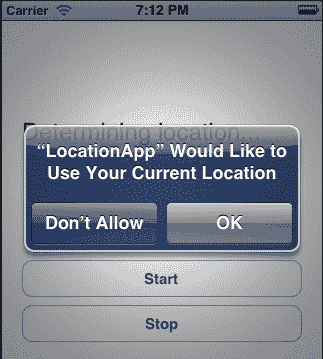
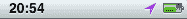
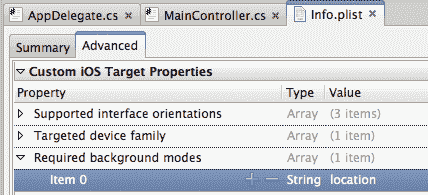
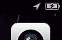
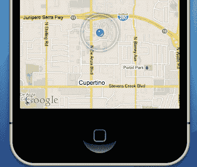
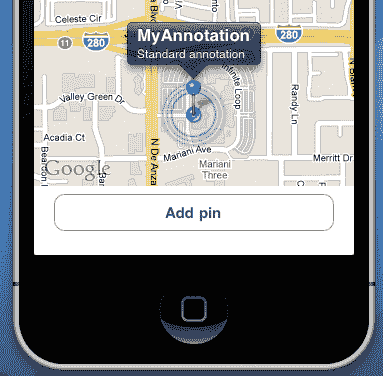
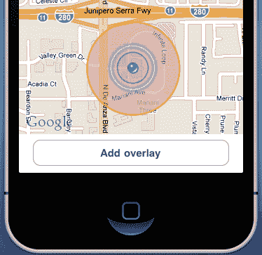

# 第十章。位置服务和地图

在这一章中，我们将涵盖：

+   确定位置

+   确定航向

+   使用区域监控

+   使用显著变化位置服务

+   背景中的位置服务

+   显示地图

+   地理编码

+   添加地图标注

+   添加地图叠加

# 简介

今天的手持设备和智能手机都配备了高精度的全球定位系统（GPS）硬件。GPS 硬件从一组卫星接收位置信息。除了卫星之外，iOS 设备还利用蜂窝和 Wi-fi 网络向用户提供位置信息。

在这一章中，我们将讨论如何使用适当的框架来利用设备的位置服务。此外，我们还将学习如何显示地图并对其进行标注。具体来说，我们将关注以下主题：

+   **位置服务**：它们提供设备上提供位置信息的可用服务。这些服务包括：

    +   **标准位置服务**：这是完全依赖于设备 GPS 模块的位置服务，提供最高精度的位置数据

    +   **区域监控服务**：这是监控边界穿越的位置服务

    +   **显著变化位置服务**：这是监控位置显著变化的服务

+   `CLLocationManager:` 这是一个允许我们使用位置服务的类

+   `Compass:` 这是一个显示我们如何使用内置指南针的类

+   `MKMapView:` 这是一个用于显示地图的视图

+   `MKAnnotation:` 这是一个允许我们在地图上添加标注的类

+   `MKOverlay:` 这是一个允许我们在地图上添加叠加的类

# 确定位置

在这个菜谱中，我们将讨论如何从内置的 GPS 硬件接收位置信息。

## 准备工作

在 MonoDevelop 中创建一个新的项目，并将其命名为`LocationApp`。在`MainController`的视图中添加两个按钮和一个标签。

## 如何做到...

要从内置的 GPS 硬件中检索位置数据，我们需要使用`CoreLocaction`框架。它通过`MonoTouch.CoreLocation`命名空间暴露：

```swift
using MonoTouch.CoreLocation;

```

1.  在`MainController`类中添加以下代码：

    ```swift
    private CLLocationManager locationManager;
    public override void ViewDidLoad (){
    base.ViewDidLoad ();
    this.locationManager = new CLLocationManager();
    this.locationManager.UpdatedLocation += this.LocationManager_UpdatedLocation;
    this.locationManager.Failed += this.LocationManager_Failed;
    this.buttonStart.TouchUpInside += delegate {
    this.lblOutput.Text = "Determining location...";
    this.locationManager.StartUpdatingLocation();
    } ;
    this.buttonStop.TouchUpInside += delegate {
    this.locationManager.StopUpdatingLocation();
    this.lblOutput.Text = "Location update stopped.";
    } ;
    }
    private void LocationManager_Failed (object sender, NSErrorEventArgs e){
    this.lblOutput.Text = string.Format("Location update failed! Error message: {0}", e.Error.LocalizedDescription);
    }
    private void LocationManager_UpdatedLocation (object sender, CLLocationUpdatedEventArgs e){
    double latitude = Math.Round(e.NewLocation.Coordinate. Latitude, 4);
    double longitude = Math.Round(e.NewLocation.Coordinate. Longitude, 4);
    double accuracy = Math.Round(e.NewLocation. HorizontalAccuracy, 0);
    this.lblOutput.Text = string.Format("Latitude: {0}\nLongitude: {1},\nAccuracy: {2}m", latitude, longitude, accuracy);
    }

    ```

1.  在设备上编译并运行应用程序。

1.  点击开始按钮，在屏幕上查看您的位置坐标。

### 注意

使用`CoreLocation`框架确定当前位置的项目可以在模拟器上运行。然而，坐标将是固定的，值为加利福尼亚州苹果公司的总部或运行模拟器的 Mac 电脑所在国家的中心坐标。

## 它是如何工作的...

GPS 模块提供的位置数据可以通过`CLLocationManager`类访问。初始化类的实例后，我们需要订阅其`UpdatedLocation`事件：

```swift
this.locationManager = new CLLocationManager();
this.locationManager.UpdatedLocation += this.LocationManager_UpdatedLocation;

```

当这些事件发布时，位置数据将变得可用。订阅`Failed`事件也是一个好的实践：

```swift
this.locationManager.Failed += this.LocationManager_Failed;

```

当位置管理器首次请求位置更新时，用户会通过系统特定的警报得到通知，类似于以下截图：



此警报基本上是请求用户允许应用程序检索位置数据。如果用户拒绝此请求，将触发带有适当信息的`Failed`事件。未来的位置请求将不会触发权限警报，用户必须通过设备设置启用应用程序的位置服务，因此我们需要相应地处理这种情况。

在订阅了适当的事件之后，我们通过`StartUpdatingLocation`方法请求发送位置更新：

```swift
this.locationManager.StartUpdatingLocation();

```

要停止接收位置更新，我们调用`StopUpdatingLocation`方法：

```swift
this.locationManager.StopUpdatingLocation();

```

## 还有更多...

`UpdatedLocation`事件接受类型为`EventHandler<CLLocationUpdatedEventArgs>`的委托。`CLLocationUpdatedEventArgs`参数包含两个类型为`CLLocationCoordinate2D`的属性。`NewLocation`属性包含最新的位置信息，而`OldLocation`属性包含之前的位置信息。在第一次位置更新时，`OldLocation`属性将返回`null`。

坐标以`double`类型的值返回，并代表位置的坐标（以度为单位）：

```swift
double latitude = Math.Round(e.NewLocation.Coordinate.Latitude, 4);
double longitude = Math.Round(e.NewLocation.Coordinate.Longitude, 4);
double accuracy = Math.Round(e.NewLocation.HorizontalAccuracy, 0);

```

负的`latitude`值表示南坐标，而正的值表示北坐标。负的`longitude`值表示西坐标，而正的`longitude`值表示东坐标。

`HorizontalAccuracy`属性返回 GPS 定位的精度（以米为单位）。例如，`17m`的值表示位置是在直径为 17 米的圆内确定的。较低的值表示更好的精度。

### GPS 精度

`UpdateLocation`事件可能会在没有新的 GPS 读取的情况下被触发。这就是为什么我们提供了之前的位置，以便我们可以比较两个值以确定是否发生了位置变化。此外，位置数据总是存在一定的误差范围，这与 GPS 硬件无关，并且存在一些变量因素来定义它，例如周围的建筑物、各种障碍物等等。您会注意到，当设备在户外时，`HorizontalAccuracy`将返回较低的值，而当我们在室内使用 GPS 或在高楼林立的街道上时，将返回较高的值。

### 位置服务可用性

并非所有设备都配备了位置服务硬件。此外，即使设备配备了适当的硬件，用户也可能已禁用位置服务。

要确定设备上是否启用了位置服务，我们在初始化位置管理器对象之前读取`CLLocationManager.LocationServicesEnabled`静态属性的返回值：

```swift
if (CLLocationManager.LocationServicesEnabled) {
// Initialize the location manager
//...
}

```

### 位置服务使用指示器

当使用任何类型的定位服务时，定位服务图标将出现在状态栏的右侧，紧邻电池指示器：



此指示器仅在设备上显示，而不在模拟器上显示。

## 参见

在本章中：

+   *确定航向*

+   *后台位置服务*

# 确定航向

在本配方中，我们将学习如何使用内置指南针来确定航向。

## 准备工作

在 MonoDevelop 中创建一个新的项目，并将其命名为`HeadingApp`。就像在之前的任务中一样，在`MainController`的视图中添加两个按钮和一个标签。

### 注意

本任务中的项目无法在模拟器上测试。需要一个带有指南针硬件（磁力计）的设备。

## 如何操作...

1.  航向信息再次通过`CLLocationManager`类检索。在`MainController`类中创建并初始化一个实例。

1.  在`ViewDidLoad`方法中添加以下代码：

    ```swift
    this.locationManager = new CLLocationManager();
    this.locationManager.UpdatedHeading += this.LocationManager_UpdatedHeading;
    this.buttonStart.TouchUpInside += delegate {
    this.lblOutput.Text = "Starting updating heading...";
    this.locationManager.StartUpdatingHeading();
    } ;
    this.buttonStop.TouchUpInside += delegate {
    this.locationManager.StopUpdatingHeading();
    this.lblOutput.Text = "Stopped updating heading.";
    } ;

    ```

1.  添加以下方法：

    ```swift
    private void LocationManager_UpdatedHeading (object sender, CLHeadingUpdatedEventArgs e){
    this.lblOutput.Text = string.Format("Magnetic heading: {0}", Math.Round(e.NewHeading.MagneticHeading, 1));
    }

    ```

1.  在设备上编译并运行应用程序。

1.  点击开始按钮并旋转设备以查看不同的航向值。

## 它是如何工作的...

要检索航向信息，我们首先需要订阅定位管理器的`UpdatedHeading`事件：

```swift
this.locationManager.UpdatedHeading += this.LocationManager_UpdatedHeading;

```

要启动航向信息的传输，我们调用`StartUpdatingHeading`方法：

```swift
this.locationManager.StartUpdatingHeading();

```

在`UpdatedHeading`事件处理程序内部，我们通过事件参数的`NewHeading`属性，通过`CLHeading`对象的`MagneticHeading`属性检索航向信息：

```swift
this.lblOutput.Text = string.Format("Magnetic heading: {0}", Math.Round(e.NewHeading.MagneticHeading, 1));

```

要停止检索航向更新，我们调用`StopUpdatingHeading`方法：

```swift
this.locationManager.StopUpdatingHeading();

```

## 更多内容...

航向以度为单位测量。地平线四个方向的值，如简单指南针上所示，如下：

+   `0` **或** `360` **度：** 北；磁力计将返回最多`359.99`度的值，当设备朝北时，将回到`0`。

+   `90` **度：** 东

+   `180` **度：** 南

+   `270` **度：** 西

### 磁航向与真航向

**磁航向**是基于普通指南针显示的北方。**真航向**是基于地球北极实际位置的北方方向。两者之间略有差异，随时间变化，通常约为`2`度。

`CLHeading`类通过`MagneticHeading`和`TrueHeading`属性提供两种读数。这对开发者来说非常有帮助，因为计算两者之间的差异可能需要昂贵的设备，或者基于年份和其他因素进行非常复杂的计算。

### 罗盘可用性

磁力计，一个可以确定航向（以度为单位）并为设备提供指南针功能的模块，并非所有设备都可用。要检查设备是否可以提供航向信息，请从`CLLocationManager.HeadingAvailable`静态属性中检索值：

```swift
if (CLLocationManager.HeadingAvailable) {
// Start updating heading
//...
}

```

## 参见

在本章中：

+   *确定位置*

+   *后台位置服务*

# 使用区域监控

在这个菜谱中，我们将讨论如何使用 GPS 来响应特定区域的位置变化。

## 准备工作

在 MonoDevelop 中创建一个新的项目，并将其命名为 `RegionApp`。在 `MainController` 的视图中添加两个按钮和一个标签。

## 如何操作...

1.  在 `MainController` 类中创建两个字段：

    ```swift
    private CLLocationManager locationManager;
    private CLRegion region;

    ```

1.  在 `ViewDidLoad` 方法中，对其进行初始化，并订阅 `UpdatedLocation`、`RegionEntered` 和 `RegionLeft` 事件：

    ```swift
    this.locationManager.RegionEntered += this.LocationManager_RegionEntered;
    this.locationManager.RegionLeft += this.LocationManager_RegionLeft;
    this.locationManager.UpdatedLocation += this.LocationManager_UpdatedLocation;

    ```

1.  在类中输入以下事件处理程序：

    ```swift
    private void LocationManager_UpdatedLocation (object sender, CLLocationUpdatedEventArgs e){
    if (e.NewLocation.HorizontalAccuracy < 100){
    this.region = new CLRegion(e.NewLocation.Coordinate, 100, "Home");
    this.locationManager.StartMonitoring(this.region, 65);
    this.locationManager.StopUpdatingLocation();
    }
    }
    private void LocationManager_RegionLeft (object sender, CLRegionEventArgs e){
    this.lblOutput.Text = string.Format("{0} region left.", e.Region.Identifier);
    }
    private void LocationManager_RegionEntered (object sender, CLRegionEventArgs e){
    this.lblOutput.Text = string.Format("{0} region entered.", e.Region.Identifier);
    }

    ```

1.  在开始按钮的 `TouchUpInside` 处理程序中，调用 `StartUpdatingLocation` 方法：

    ```swift
    this.locationManager.StartUpdatingLocation();

    ```

1.  在停止按钮的 `TouchUpInside` 处理程序中，调用 `StopMonitoring` 方法：

    ```swift
    this.locationManager.StopMonitoring(this.region);

    ```

此应用程序需要在支持区域监控的设备上进行测试。

## 它是如何工作的...

区域监控是一个监控边界穿越的功能。当特定区域的边界被穿越时，`CLLocationManager` 对象会触发适当的事件：

```swift
this.locationManager.RegionEntered += this.LocationManager_RegionEntered;
this.locationManager.RegionLeft += this.LocationManager_RegionLeft;
this.locationManager.UpdatedLocation += this.LocationManager_UpdatedLocation;

```

在这个例子中，我们根据当前位置定义区域；因此，我们也订阅了 `UpdatedLocation` 事件。

当应用程序开始接收位置更新时，它首先检查位置精度：

```swift
if (e.NewLocation.HorizontalAccuracy < 100)

```

如果达到了所需的精度（<100m，可自行修改），我们初始化 `CLRegion` 对象：

```swift
this.region = new CLRegion(e.NewLocation.Coordinate, 100, "Home");

```

`CLRegion` 类用于定义区域。在这里，我们根据我们的当前位置在第一个参数中创建要监控的区域。第二个参数声明了坐标周围的半径（以米为单位），定义了区域边界。第三个参数是区域的字符串标识符。

要开始监控区域，我们调用 `StartMonitoring` 方法：

```swift
this.locationManager.StartMonitoring(this.region, 65);

```

第一个参数是要监控的区域，第二个参数定义了边界穿越所需的精度（以米为单位）。此值作为精度偏移量，防止系统在用户接近区域边界时触发连续的 `进入` 和 `离开` 事件。

当区域监控开始时，当设备进入或离开区域时，将根据所需的精度值触发适当的事件。

## 还有更多...

区域监控是一个非常实用的功能。例如，一个应用程序可以根据用户接近的不同区域提供特定的信息。此外，它可以在应用程序在后台时通知边界穿越。

### 区域监控可用性

要检查设备是否支持区域监控，检索 `RegionMonitoringAvailable` 静态属性的值：

```swift
if (CLLocationManager.RegionMonitoringAvailable) {
// Start monitoring a region
//...
}

```

## 参见

在本章中：

+   *使用显著变化的位置服务*

+   *后台位置服务*

# 使用显著变化的位置服务

在这个菜谱中，我们将学习如何使用显著变化的位置监控功能。

## 准备工作

在 MonoDevelop 中创建一个新的项目，并将其命名为 `SLCApp`。在 `MainController` 的视图中添加一个标签和两个按钮。

## 如何做...

1.  在`ViewDidLoad`方法中添加以下代码：

    ```swift
    this.locationManager = new CLLocationManager();
    this.locationManager.UpdatedLocation += this.LocationManager_UpdatedLocation;
    this.buttonStart.TouchUpInside += delegate {
    this.lblOutput.Text = "Starting monitoring significant location changes...";
    this.locationManager. StartMonitoringSignificantLocationChanges();
    } ;
    this.buttonStop.TouchUpInside += delegate {
    this.locationManager.StopMonitoringSignificantLocationChanges();
    this.lblOutput.Text = "Stopped monitoring significant location changes.";
    } ;

    ```

1.  添加以下方法：

    ```swift
    private void LocationManager_UpdatedLocation (object sender, CLLocationUpdatedEventArgs e){
    double latitude = Math.Round(e.NewLocation.Coordinate. Latitude, 4);
    double longitude = Math.Round(e.NewLocation.Coordinate. Longitude, 4);
    double accuracy = Math.Round(e.NewLocation. HorizontalAccuracy, 0);
    this.lblOutput.Text = string.Format("Latitude: {0}\nLongitude: {1}\nAccuracy: {2}", latitude, longitude, accuracy);
    }

    ```

1.  在设备上编译并运行应用程序。

1.  点击**开始**按钮以开始监控显著位置变化。

## 它是如何工作的...

显著变化位置服务监控显著的位置变化，并在这些变化发生时提供位置信息。在功耗方面，它是要求较低的位置服务。它使用设备的蜂窝无线电收发器来确定用户的位置。只有配备了蜂窝无线电收发器的设备才能使用此服务。

使用显著变化位置服务的代码与标准位置服务的代码类似。唯一的不同之处在于启动和停止服务的方法。要启动服务，我们调用`StartMonitoringSignificantLocationChanges`方法：

```swift
this.locationManager.StartMonitoringSignificantLocationChanges();

```

位置更新通过`UpdatedLocation`事件处理程序发布，这与我们用于标准位置服务的事件相同：

```swift
this.locationManager.UpdatedLocation += this.LocationManager_UpdatedLocation;
//...
private void LocationManager_UpdatedLocation (object sender, CLLocationUpdatedEventArgs e){
//...
}

```

## 更多内容...

显著变化位置服务可以在后台报告位置变化，唤醒应用程序。

### 显著变化位置服务可用性

要确定设备是否能够使用显著变化位置服务，检索`SignificantLocationChangeMonitoringAvailable`静态属性的值：

```swift
if (CLLocationManager.SignificantLocationChangeMonitoringAvailable) {
// Start monitoring for significant location changes.
//...
}

```

## 参见

在本章中：

+   *使用区域监控*

+   *后台位置服务*

# 后台位置服务

在这个菜谱中，我们将讨论如何在应用处于后台时使用位置服务。

## 准备工作

在 MonoDevelop 中创建一个新的项目，并将其命名为`BackgroundLocationApp`。就像在之前的任务中一样，在`MainController`的视图中添加一个标签和两个按钮。

## 如何做...

1.  在**解决方案**面板中，双击**Info.plist**文件以打开它。

1.  在**高级**选项卡下，通过单击加号（+）或通过右键单击并从上下文菜单中选择**新建键**来添加一个新键。

1.  从下拉列表中选择**必需的后台模式**，或者在字段中直接输入`UIBackgroundModes`。

1.  展开键，在其下方的空白项上右键单击。在上下文菜单中单击**新建键**。在其**值**字段中输入单词`location`。

1.  保存文档。完成后，你应该会有以下截图所示的内容：

1.  在`MainController`类中，输入与本章中*确定位置*菜谱中使用的相同代码。

1.  在`LocationManager_UpdatedLocation`方法的底部添加以下行：

    ```swift
    Console.WriteLine("{0}:\n\t{1} ", DateTime.Now, this.lblOutput.Text);

    ```

1.  在设备上编译并运行应用程序。

1.  点击**开始**按钮以开始接收位置更新。按设备上的**主页**按钮使应用程序进入后台。观察 MonoDevelop 的**应用程序输出**面板显示位置更新。

## 它是如何工作的...

要在应用程序处于后台时接收位置更新，我们需要在 **Info.plist** 文件中将位置值设置为 `UIBackgroundModes` 键。这基本上确保了应用程序在后台时具有接收位置更新的适当权限，并且它不会挂起。

为了确保应用程序正在接收位置更新，请检查状态栏。位置服务图标应该显示：



## 更多内容...

为位置服务设置 `UIBackgroundModes` 键仅适用于标准位置服务。默认情况下，区域监控和重大变化位置服务都支持在应用程序处于后台时传输位置更新。当其中一个位置服务开始更新位置数据时，应用程序甚至可以被终止。当接收到位置更新时，应用程序将被启动或从挂起状态唤醒，并给予有限的时间来执行代码。

要确定应用程序是否由这两个位置服务之一启动，请检查 `AppDelegate` 类中 `FinishedLaunching` 方法的选项参数：

```swift
if (null != options){
if (options.ContainsKey (UIApplication.LaunchOptionsLocationKey)){
Console.WriteLine ("Woken from location service!");
CLLocationManager locationManager = new CLLocationManager();
locationManager.UpdatedLocation += this.LocationUpdatedHandler;
locationManager.StartMonitoringSignificantLocationChanges();
}
}

```

选项参数的类型为 `NSDictionary`。如果这个字典包含 `LaunchOptionsLocationKey`，则应用程序是由于位置服务而被启动或从挂起状态唤醒的。在这种情况下，我们需要在 `CLLocationManager` 实例上再次调用 `StartMonitoringSignificantLocationChanges` 方法来检索位置数据。

同样适用于区域监控位置服务。请注意，如果我们使用这两个位置服务之一，但我们的应用程序不支持位置事件的后台传输，那么我们必须确保在不再需要时停止监控位置更新。如果我们不这样做，那么位置服务将继续运行，导致电池消耗显著增加。

### 限制到支持的硬件

如果我们的应用程序的功能完全依赖于位置服务，并且不能在不支持它们的设备上正确运行，我们必须在 **Info.plist** 文件中添加键 `UIRequiredDeviceCapabilities`，其值为 `location-services`。

此外，当应用程序需要使用使用 GPS 硬件的标准位置服务时，我们需要将值 `gps` 添加到这个键中。这样，我们确保应用程序不会通过应用商店提供给未配备适当硬件的设备。

## 参见

在本章中：

+   *确定位置*

在本书中：

第一章，开发工具：

+   *在 MonoDevelop 中创建 iPhone 项目*

# 显示地图

在本食谱中，我们将学习如何在屏幕上显示地图。

## 准备工作

在 MonoDevelop 中创建一个新的项目，并将其命名为 `MapDisplayApp`。

## 如何操作...

1.  在 `MainController` 的视图中添加一个 `MKMapView`。输入以下 `using` 指令：

    ```swift
    using MonoTouch.MapKit;
    using MonoTouch.CoreLocation;

    ```

1.  在 `MainController` 类中添加以下代码：

    ```swift
    public override void ViewDidLoad (){
    base.ViewDidLoad ();
    this.mapView.ShowsUserLocation = true;
    this.mapView.RegionChanged += this.MapView_RegionChanged;
    }
    private void MapView_RegionChanged (object sender, MKMapViewChangeEventArgs e){
    if (this.mapView.UserLocation.Location != null){
    CLLocationCoordinate2D mapCoordinate = this.mapView.UserLocation.Location.Coordinate;
    Console.WriteLine("Current coordinates: LAT: {0}, LON: {1}", mapCoordinate.Latitude, mapCoordinate.Longitude);
    }
    }

    ```

1.  在模拟器或设备上编译并运行应用程序。如果应用程序在模拟器上运行，默认位置将是苹果公司的总部位于 **库比蒂诺**：

1.  放大或平移地图以在 **应用程序输出** 中输出当前位置。

## 它是如何工作的...

`MonoTouch.MapKit` 命名空间封装了 `MapKit` 框架中包含的所有对象。`MapKit` 框架使用谷歌地图来显示地图。

`MKMapView` 是默认的 iOS 视图，用于显示地图。它专门为此目的而设计，不应被子类化。

要在地图上显示用户的位置，我们将它的 `ShowsUserLocation` 属性设置为 `true`：

```swift
this.mapView.ShowsUserLocation = true;

```

这将激活标准位置服务以开始接收位置更新并将它们内部传递给 `MKMapView` 对象。

为了确定用户何时放大或平移地图，我们订阅 `RegionChanged` 事件：

```swift
this.mapView.RegionChanged += this.MapView_RegionChanged;

```

在事件处理程序内部，我们通过 `UserLocation` 属性检索当前位置：

```swift
if (this.mapView.UserLocation.Location != null){
CLLocationCoordinate2D mapCoordinate = this.mapView.UserLocation.Location.Coordinate;
Console.WriteLine("Current coordinates: LAT: {0}, LON: {1}", mapCoordinate.Latitude, mapCoordinate.Longitude);
}

```

如果将 `ShowsUserLocation` 属性设置为 `false`，则位置服务将不会激活，并且 `UserLocation.Location` 属性将返回 `null`。当应用程序首次运行时，它也会返回 `null`，因为它会请求用户使用位置服务的权限。然而，只要设备或模拟器有活跃的互联网连接，就会显示地图。

## 还有更多...

我们可以使用 `SetCenterCoordinate` 方法设置要显示的地图的中心坐标：

```swift
CLLocationCoordinate2D mapCoordinates = new CLLocationCoordinate2D(0, 0);
this.mapView.SetCenterCoordinate(mapCoordinates, true);

```

第一个参数是我们希望地图中心对齐的地图坐标，表示为 `CLLocationCoordinate2D` 类型的对象。第二个参数声明我们是否希望地图中心对齐是动画的。

除了对齐地图外，我们还可以设置其缩放级别。我们通过 `SetRegion` 方法来完成：

```swift
this.mapView.SetRegion(MKCoordinateRegion.FromDistance( mapCoordinates, 1000, 1000), true);

```

第一个参数是 `MKCoordinateRegion` 类型。在这里，使用其 `FromDistance` 静态方法创建一个实例。其第一个参数是区域中心的坐标，接下来的两个参数代表要显示的地图的水平范围和垂直范围，单位为米。这基本上意味着由这个 `MKCoordinateRegion` 实例表示的区域将以 `mapCoordinates` 为中心，地图的水平部分和垂直部分将分别代表地图上的 `1000` 米。

注意，`MKMapView`会将实际区域设置为`MKCoordinateRegion`值的近似。这是因为`MKMapView`的尺寸不能总是与提供的水平和垂直跨度值匹配。例如，这里我们设置了一个`1000x1000`米的正方形区域，但我们的`MKMapView`布局并不是一个绝对的正方形，因为它基本上占据了整个屏幕。我们可以通过其`Region`属性检索`MKMapView`显示的实际地图区域。

### 使用 MapKit 时需要注意的事项

`MapKit`框架使用 Google Maps 和 Google Earth API 来显示地图。使用此框架将开发者绑定到 Google 的服务条款，可在[`code.google.com/apis/maps/iphone/terms.html`](http://code.google.com/apis/maps/iphone/terms.html)查看。

一个可能直接影响你的应用程序是否会在应用商店被拒绝的重要术语是在地图上使用 Google 标志。应确保在显示地图时标志始终可见。

## 参见

在本章中：

+   *地理编码*

+   *添加地图标注*

+   *添加地图覆盖*

# 地理编码

在本配方中，我们将学习如何根据位置坐标提供地址、城市或国家信息。

## 准备工作

在 MonoDevelop 中创建一个新的项目，并将其命名为`GeocodingApp`。

## 如何操作...

1.  在`MainController`视图的上半部分添加一个`MKMapView`，在下半部分添加一个标签和一个按钮。添加`MonoTouch.MapKit`和`MonoTouch.CoreLocation`命名空间。

1.  在`MainController`类中输入以下`ViewDidLoad`重写方法：

    ```swift
    private MKReverseGeocoder reverseGeocoder;
    public override void ViewDidLoad (){
    base.ViewDidLoad ();
    this.mapView.ShowsUserLocation = true;
    this.buttonGeocode.TouchUpInside += delegate {
    this.lblOutput.Text = "Reverse geocoding location...";
    this.buttonGeocode.Enabled = false;
    CLLocationCoordinate2D currentLocation = this.mapView.UserLocation.Location.Coordinate;
    this.mapView.SetRegion(MKCoordinateRegion.FromDistance( currentLocation, 1000, 1000), true);
    this.reverseGeocoder = new MKReverseGeocoder(currentLocation);
    this.reverseGeocoder.Delegate = new ReverseGeocoderDelegate(this);
    this.reverseGeocoder.Start();
    } ;
    }

    ```

1.  创建以下嵌套类：

    ```swift
    private class ReverseGeocoderDelegate : MKReverseGeocoderDelegate{
    public ReverseGeocoderDelegate(MainController parentController){
    this.parentController = parentController;
    }
    private MainController parentController;
    public override void FoundWithPlacemark (MKReverseGeocoder geocoder, MKPlacemark placemark){
     this.parentController.lblOutput.Text = string.Format( "Locality: {0}\nAdministrative area: {1}\nCountry: {2}", placemark.Locality, placemark.AdministrativeArea, placemark.Country); 
    geocoder.Dispose();
    this.parentController.buttonGeocode.Enabled = true;
    }
    public override void FailedWithError (MKReverseGeocoder geocoder, NSError error){
    this.parentController.lblOutput.Text = string.Format( "Reverse geocoding failed with error: {0}", error.LocalizedDescription);
    this.parentController.buttonGeocode.Enabled = true;
    }
    }

    ```

1.  在模拟器或设备上编译并运行应用程序。如果在设备上运行，当你点击按钮时，将在标签上显示你当前所在的国家和地区的位置信息。

## 它是如何工作的...

**地理编码**是将地址信息与地理坐标匹配的过程。**反向地理编码**是将地理坐标与地址信息匹配的过程。iOS 上仅提供后者。然而，在线上还有可用的正向地理编码服务。

要进行反向地理编码，我们使用`MKReverseGeocoder`类：

```swift
private MKReverseGeocoder reverseGeocoder;

```

此类需要一个提供信息的代理对象。我们将为`MKReverseGeocoder`的代理对象创建的类必须继承自`MKReverseGeocoderDelegate`类：

```swift
private class ReverseGeocoderDelegate : MKReverseGeocoderDelegate

```

在代理对象内部，我们需要重写两个方法。第一个是`FoundWithPlacemark:`

```swift
public override void FoundWithPlacemark (MKReverseGeocoder geocoder, MKPlacemark placemark)

```

这是当反向地理编码器检索地理编码信息时将被触发的方法。信息包含在`placemark`参数中，该参数是`MKPlacemark`类型。如前所述的高亮代码所示，信息可以通过`MKPlacemark`类的各种属性获取。

我们需要重写的第二个方法是`FailedWithError:`

```swift
public override void FailedWithError (MKReverseGeocoder geocoder, NSError error)

```

当由于某种原因反向地理编码失败时，此方法会被触发。信息包含在 `error` 参数中。

要初始化 `MKReverseGeocoder` 类的实例，我们将我们想要地理编码信息的坐标与类型为 `CLLocationCoordinate2D` 的对象传递给其构造函数：

```swift
this.reverseGeocoder = new MKReverseGeocoder(currentLocation);

```

在分配其代理对象后，我们调用 `Start` 方法来反向地理编码坐标：

```swift
this.reverseGeocoder.Delegate = new ReverseGeocoderDelegate(this);
this.reverseGeocoder.Start();

```

## 更多...

可以通过 `MKPlacemark` 类的 `AddressDictionary` 属性检索位置地址的详细信息，该属性是 `NSDictionary` 类型。

### 使用 `MKReverseGeocoder` 类时需要注意的事项

`MKReverseGeocoder` 类是 `MapKit` 框架的一部分。使用此类将开发者绑定到 Google 的服务条款：[`code.google.com/apis/maps/iphone/terms.html`](http://code.google.com/apis/maps/iphone/terms.html)。

使用反向地理编码服务的一个重要条款是，它应该始终与 Google 地图结合使用。此外，为了避免滥用服务，Apple 建议每分钟不要进行超过一次反向地理编码调用。

## 参见

在本章中：

+   *显示地图*

+   *添加地图注释*

+   *添加地图覆盖*

# 添加地图注释

在本食谱中，我们将讨论如何注释地图以显示各种信息。

## 准备工作

在 MonoDevelop 中创建一个新的项目，并将其命名为 `MapAnnotateApp`。

## 如何操作...

1.  在 `MainController` 的视图中添加一个 `MKMapView`。在底部留出一些空间，并添加一个按钮。

1.  添加命名空间 `MonoTouch.MapKit` 和 `Monotouch.CoreLocation`，并在 `ViewDidLoad` 覆盖方法中输入以下代码：

    ```swift
    this.mapView.ShowsUserLocation = true;
    this.mapView.Delegate = new MapViewDelegate();
    this.buttonAddPin.TouchUpInside += delegate {
    CLLocationCoordinate2D mapCoordinate = this.mapView.UserLocation.Location.Coordinate;
    this.mapView.SetRegion(MKCoordinateRegion.FromDistance( mapCoordinate, 1000, 1000), true);
    MKPointAnnotation myAnnotation = new MKPointAnnotation();
    myAnnotation.Coordinate = mapCoordinate;
    myAnnotation.Title = "MyAnnotation";
    myAnnotation.Subtitle = "Standard annotation";
    this.mapView.AddAnnotation(myAnnotation);
    } ;

    ```

1.  创建以下嵌套类：

    ```swift
    private class MapViewDelegate : MKMapViewDelegate{
    public override MKAnnotationView GetViewForAnnotation (MKMapView mapView, NSObject annotation){
    if (annotation is MKUserLocation){
    return null;
    } else{
    string reuseIdentifier = "MyAnnotation";
    MKPinAnnotationView pinView = mapView.DequeueReusableAnnotation(reuseIdentifier) as MKPinAnnotationView;
    if (null == pinView){
    pinView = new MKPinAnnotationView(annotation, reuseIdentifier);
    pinView.PinColor = MKPinAnnotationColor.Purple;
    pinView.AnimatesDrop = true;
    pinView.CanShowCallout = true;
    }
    return pinView;
    }
    }
    }

    ```

1.  在模拟器或设备上编译并运行应用程序。如果在模拟器上运行，当你点击按钮时，结果应该类似于以下截图：



+   点击“添加引脚”会显示带有注释标题和副标题的呼叫气泡。

## 它是如何工作的...

注释地图对于提供与地图数据相关的各种信息非常有用。我们可以使用 `MKPointAnnotation` 类来创建一个简单的注释：

```swift
MKPointAnnotation myAnnotation = new MKPointAnnotation();
myAnnotation.Coordinate = mapCoordinate;
myAnnotation.Title = "MyAnnotation";
myAnnotation.Subtitle = "Standard annotation";
this.mapView.AddAnnotation(myAnnotation);

```

我们为注释将出现的地图坐标分配，以及可选的标题和副标题。然后我们使用 `AddAnnotation` 方法将注释添加到地图视图中。

仅向地图视图添加注释对象是不够的。注释需要一个显示其信息的视图。这是通过为地图视图创建一个代理对象并覆盖其 `GetViewForAnnotation` 方法来实现的：

```swift
public override MKAnnotationView GetViewForAnnotation (MKMapView mapView, NSObject annotation)

```

由于地图已经显示了用户位置，已经存在一个注释，并且它是 `MKUserLocation` 类型。在 `GetViewForAnnotation` 中，我们必须确保通过检查注释参数的类型来为我们自己的注释提供一个视图：

```swift
if (annotation is MKUserLocation)

```

在这个例子中，我们只返回 `null`。如果注释参数是 `MKPointAnnotation` 类型，那么我们首先尝试检索它的视图，类似于 `UITableView` 创建它包含的单元格：

```swift
MKPinAnnotationView pinView = mapView.DequeueReusableAnnotation( reuseIdentifier) as MKPinAnnotationView;

```

如果 `DequeueReusableAnnotation` 方法的返回结果是 `null`，那么我们为我们的注释视图初始化一个新的实例：

```swift
pinView = new MKPinAnnotationView(annotation, reuseIdentifier);
pinView.PinColor = MKPinAnnotationColor.Purple;
pinView.AnimatesDrop = true;
pinView.CanShowCallout = true;

```

我们为注释创建的视图是 `MKPinAnnotationView` 类型。这是由地图上的针表示的标准视图。我们设置的属性相当直接，定义了其外观和行为。`PinColor` 属性定义了针的颜色，`AnimatesDrop` 属性定义了针是否以动画形式显示在地图上，而 `CanShowCallout` 属性定义了注释视图是否在呼出气泡中显示其底层注释的信息。

在我们创建了注释视图之后，我们只需从方法中返回它：

```swift
return pinView;

```

## 更多内容...

我们还可以创建自定义注释和注释视图。对于注释，我们必须重写 `MKAnnotation` 类，而对于注释视图，我们可以重写 `MKAnnotationView` 类。

### 注释性能

理论上，我们可以向地图视图添加任意数量的注释。虽然 `MKMapView` 可以高效地管理大量注释，但强烈建议考虑性能下降。一种克服这个问题的方法是根据当前地图区域显示注释，这基本上管理了地图的缩放级别。另一种方法是确保我们为不需要不同注释视图的注释使用相同的注释视图实例。

## 相关内容

在本章中：

+   *显示地图*

+   *添加地图覆盖*

在本书中：

第五章, 显示数据：

+   *在表中显示数据*

# 添加地图覆盖

在这个菜谱中，我们将讨论使用覆盖层在地图上绘制。

## 准备工作

在 MonoDevelop 中创建一个新的项目，并将其命名为 `MapOverlayApp`。

## 如何做...

1.  在 `MainController` 的视图中添加一个 `MKMapView`。在底部留出一些空间，并添加一个按钮。

1.  添加命名空间 `MonoTouch.MapKit` 和 `Monotouch.CoreLocation`，并在 `ViewDidLoad` 重写中输入以下代码：

    ```swift
    this.mapView.ShowsUserLocation = true;
    this.mapView.Delegate = new MapViewDelegate();
    this.buttonAddOverlay.TouchUpInside += delegate {
    CLLocationCoordinate2D mapCoordinate = this.mapView.UserLocation.Location.Coordinate;
    this.mapView.SetRegion(MKCoordinateRegion.FromDistance( mapCoordinate, 1000, 1000), true);
    MKCircle circleOverlay = MKCircle.Circle(mapCoordinate, 250);
    this.mapView.AddOverlay(circleOverlay);
    } ;

    ```

1.  添加以下嵌套类：

    ```swift
    private class MapViewDelegate : MKMapViewDelegate{
    public override MKOverlayView GetViewForOverlay (MKMapView mapView, NSObject overlay){
    MKCircle circleOverlay = overlay as MKCircle;
    if (null != circleOverlay){
    MKCircleView circleView = new MKCircleView(circleOverlay);
    circleView.FillColor = UIColor.FromRGBA( 1.0f, 0.5f, 0.5f, 0.5f);
    circleView.StrokeColor = UIColor.Red;
    circleView.LineWidth = 2f;
    return circleView;
    } else{
    return null;
    }
    }
    }

    ```

1.  在模拟器或设备上编译并运行应用程序。如果在模拟器上运行，在点击按钮后，结果应该类似于以下内容：



## 工作原理...

虽然 `MKAnnotation` 代表地图上的一个点，但 `MKOverlay` 对象可以代表地图上的一个区域。在这个例子中，我们使用继承自 `MKOverlay` 的 `MKCircle` 类来在地图上的区域上显示一个圆。

初始化 `MKCircle` 实例使用其 `Circle` 静态方法：

```swift
MKCircle circleOverlay = MKCircle.Circle(mapCoordinate, 250);

```

第一个参数表示圆心的坐标，而第二个参数表示圆的半径，单位为米。初始化后，我们使用`AddOverlay`方法将叠加添加到地图视图中：

```swift
this.mapView.AddOverlay(circleOverlay);

```

就像注释一样，叠加需要视图来显示其信息。为了为我们的叠加提供视图，我们在地图视图的代理对象实现中重写了`GetViewForOverlay`方法：

```swift
public override MKOverlayView GetViewForOverlay (MKMapView mapView, NSObject overlay)

```

在此方法内部，我们首先检查叠加参数是否是我们想要的类型；在这种情况下，是一个`MKCircle`: 

```swift
MKCircle circleOverlay = overlay as MKCircle;
if (null != circleOverlay)

```

然后，我们创建`MKCircleView`类的实例并返回它：

```swift
MKCircleView circleView = new MKCircleView(circleOverlay);
circleView.FillColor = UIColor.FromRGBA(1.0f, 0.5f, 0.5f, 0.5f);
circleView.StrokeColor = UIColor.Red;
circleView.LineWidth = 2f;
return circleView;

```

我们设置适当的属性来定义叠加的外观。在这种情况下，我们设置了`FillColor`、`StrokeColor`和`LineWidth`属性。

## 更多内容...

地图视图有效地处理叠加。地图视图为我们处理的一个重要事项是，当我们缩放地图时，叠加会自动缩放到匹配每个缩放级别。这样，我们就不需要在代码中手动缩放叠加。

### 创建自定义叠加

我们可以创建自己的自定义叠加。为此，我们需要为叠加重写`MKOverlay`类，为叠加视图重写`MKOverlayView`类。

### 标准叠加对象

除了`MKCircle`之外，其他标准叠加对象还包括`MKPolygon`用于创建多边形形状和`MKPolyline`用于创建折线，如在轨迹记录应用程序中。

## 参考内容

在本章中：

+   *显示地图*

+   *添加地图注释*
