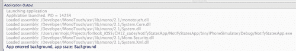

# 第十二章。多任务

在本章中，我们将涵盖：

+   检测应用程序状态

+   接收应用程序状态的通知

+   在后台运行代码

+   在后台播放音频

+   网络连接维护

# 简介

当 2007 年推出 iOS 平台时，为用户带来了许多令人兴奋的新功能，它彻底改变了移动设备的概念。

尽管当时它取得了巨大的成功，但它缺少了一些被认为是“基本”的功能。其中之一就是多任务处理；即同时运行多个进程的支持。实际上，该平台在内部支持多任务处理系统进程，但这对开发者来说并不可用。从 iOS 4 开始，苹果提供了对多任务处理的支持，尽管它与大多数开发者习惯的方式仍然有很大不同。

在本章中，我们将讨论如何利用平台的多任务功能。我们将了解在什么情况下可以使用这些功能，以及我们可以通过多任务为应用程序用户提供哪些功能。具体来说，我们将学习应用程序的状态及其运行时生命周期。通过一系列详细的示例项目，我们能够在应用程序后台执行代码，支持音频播放和 VoIP 连接维护。

# 检测应用程序状态

在本配方中，我们将讨论如何检测应用程序从活动状态到非活动状态以及相反状态的变化，并相应地做出反应。

## 准备就绪

在 MonoDevelop 中创建一个新的项目，并将其命名为 `AppStateApp`。在这个例子中不需要视图控制器。

## 如何操作...

1.  在`AppDelegate`类中添加以下方法重写：

    ```swift
    public override void OnActivated (UIApplication application){
    Console.WriteLine("Activated, application state: {0}", application.ApplicationState);
    }
    public override void OnResignActivation (UIApplication application){
    Console.WriteLine("Resign activation, application state: {0}", application.ApplicationState);
    }
    public override void DidEnterBackground (UIApplication application){
    Console.WriteLine("Entered background, application state: {0}", application.ApplicationState);
    }
    public override void WillEnterForeground (UIApplication application){
    Console.WriteLine("Will enter foreground, application state: {0}", application.ApplicationState);
    }

    ```

1.  在模拟器或设备上编译并运行应用程序。

1.  按下**主页**按钮以挂起应用程序，并观察 MonoDevelop 中的**应用程序输出**面板。

## 它是如何工作的...

`UIApplicationDelegate`类包含由运行时发出的特定通知触发的方法。这些方法是：

+   `OnActivated:` 当应用程序变为活动状态时，会调用此方法，例如，当解锁屏幕或应用程序启动时。

+   `OnResignActivation:` 当应用程序即将变为非活动状态时，会调用此方法，例如，当屏幕锁定或显示多任务栏时。

+   `DidEnterBackground:` 当应用程序进入后台时，会调用此方法，例如，当按下**主页**按钮。应用程序被挂起。

+   `WillEnterForeground:` 当应用程序即将返回前台时，会调用此方法。

注意，当应用程序移动到后台时，会调用`OnResignActivation`和`DidEnterBackground`方法。同样，当应用程序移动到前台时，会调用`WillEnterForeground`和`OnActivated`方法。

所有这些方法都包含一个参数，该参数包含应用程序的 `UIApplication` 实例。`UIApplication` 类包含一个属性 `ApplicationState`，它返回 `UIApplicationState` 属性中的应用程序状态值。这些值是：

+   `Active:` 此值表示应用程序处于活动状态

+   `Inactive:` 此值表示应用程序处于非活动状态，例如，当显示通知警报时

+   `Background:` 此值表示应用程序处于后台

## 还有更多...

多任务处理是 iOS 4+ 的一个功能，并且并非所有设备都支持多任务处理，即使它们运行在 iOS 4+ 上。对于 4 版本之前的版本，当按下 **主页** 按钮时，会调用 `WillTerminate` 方法：

```swift
public override void WillTerminate (UIApplication application){
Console.WriteLine("App will terminate!");
}

```

然而，在某些情况下，iOS 会终止您的应用程序；例如，当发出内存警告而您的应用程序没有释放资源时。在这些情况下，也会调用 `WillTerminate` 方法。

### 多任务处理支持

要检查设备是否支持多任务处理，请检查 `UIDevice.CurrentDevice.IsMultitaskingSupported` 属性。

### 正确使用

这些方法非常有用，因为它们允许我们在应用程序状态改变时保存向用户展示的当前数据。当应用程序过渡到非活动或后台状态时，每个方法都有一定的时间限制来执行，因此我们应该确保它们不执行长时间运行的操作，否则 iOS 会终止应用程序。

# 接收应用程序状态的通知

在本菜谱中，我们将讨论在 `UIApplicationDelegate` 实现范围之外接收应用程序状态变化的通知。

## 准备工作

在 MonoDevelop 中创建一个新的项目，并将其命名为 `NotifyStatesApp`。向项目中添加一个带有控制器的视图，并将其命名为 `MainController`。

## 如何操作...

1.  在 `MainController` 类中输入以下字段：

    ```swift
    private NSObject didEnterBgdObserver;
    private NSObject willEnterFgdObserver;

    ```

1.  创建以下方法：

    ```swift
    private void AddAppStateObservers(){
    this.didEnterBgdObserver = NSNotificationCenter.DefaultCenter. AddObserver(UIApplication.DidEnterBackgroundNotification, delegate(NSNotification obj) {
    Console.WriteLine("App entered background, app state: {0}", UIApplication.SharedApplication.ApplicationState);
    } );
    this.willEnterFgdObserver = NSNotificationCenter.DefaultCenter. AddObserver(UIApplication.WillEnterForegroundNotification, delegate(NSNotification obj) {
    Console.WriteLine("App will enter foreground, app state: {0}", UIApplication.SharedApplication.ApplicationState);
    } );
    }
    private void RemoveAppStateObservers(){
    NSNotificationCenter.DefaultCenter.RemoveObservers(new NSObject[] { this.didEnterBgdObserver, this.willEnterFgdObserver });
    }

    ```

1.  在 `ViewDidLoad` 覆盖中，调用 `AddAppStateObservers` 方法：

    ```swift
    this.AddAppStateObservers();

    ```

1.  在模拟器上编译并运行应用程序。

1.  按下 **主页** 按钮，并观察 **应用程序输出** 面板中的输出。它应该类似于以下截图：



## 它是如何工作的...

除了调用 `UIApplicationDelegate` 对象的应用程序状态方法外，iOS 还会发出我们可以接收的通知。这非常有用，因为在大多数情况下，我们需要在 `AppDelegate` 类的范围之外接收应用程序状态变化的通知。

要实现这一点，我们使用 `NSNotificationCenter:`

```swift
this.didEnterBgdObserver = NSNotificationCenter.DefaultCenter. AddObserver(UIApplication.DidEnterBackgroundNotification, delegate(NSNotification obj) {
Console.WriteLine("App entered background, app state: {0}", UIApplication.SharedApplication.ApplicationState);
} );

```

我们感兴趣的通知密钥通过 `UIApplication` 静态属性公开。此示例仅添加了背景和前台之间的转换通知观察者。

结果类似于前一个菜谱的示例，但仅在 `MainController` 加载后。

## 还有更多...

要为应用程序激活或停用激活时添加通知观察者，我们分别使用 `UIApplication.DidBecomeActiveNotification` 和 `UIApplication.WillResignActiveNotification` 键。

### 移除通知观察者

当不再需要通知观察者时，在 `ViewDidUnload` 覆盖方法中调用 `RemoveAppStateObservers` 方法：

```swift
this.RemoveAppStateObservers();

```

## 参见

在本章中：

+   *检测应用程序状态*

# 在后台运行代码

在本食谱中，我们将学习如何在后台执行代码，充分利用 iOS 的多任务功能。

## 准备工作

在 MonoDevelop 中创建一个新的项目，并将其命名为 `BackgroundCodeApp`。在这个例子中不需要视图控制器。

## 如何做到这一点...

1.  在 `AppDelegate` 类中输入以下代码：

    ```swift
    private int taskID;
    public override void DidEnterBackground (UIApplication application){
    if (UIDevice.CurrentDevice.IsMultitaskingSupported && this.taskID == 0){
    this.taskID = application.BeginBackgroundTask(delegate {
    application.EndBackgroundTask(taskID);
    this.taskID = 0;
    } );
    ThreadPool.QueueUserWorkItem(delegate {
    for (int i = 0; i < 60; i++){
    Console.WriteLine("Task: {0} - Current Time: {1}", this.taskID, DateTime.Now);
    Thread.Sleep(1000);
    }
    application.EndBackgroundTask(this.taskID);
    this.taskID = 0;
    } );
    }
    }
    public override void WillEnterForeground (UIApplication application){
    if (this.taskID != 0){
    Console.WriteLine("Background task is running!");
    } else{
    Console.WriteLine("Background task completed!");
    }
    }

    ```

1.  在模拟器上编译和运行应用程序。

1.  按下**主页**按钮使应用程序进入后台，并观察**应用程序输出**。

1.  在后台任务完成之前（一分钟），可以通过在多任务栏中点击其图标或在其**主页**屏幕上的图标来将应用程序带到前台。

## 它是如何工作的...

在前面的任务中，我们学习了如何得知应用程序从前台到后台以及相反的转换。

iOS 上的多任务处理并不完全像我们在其他平台上所习惯的那样。iOS 平台确保前台应用程序将拥有所有可用的资源（以及用户的）。为了实现这一点，当应用程序进入后台时，它会被操作系统挂起。当它被挂起时，它不会执行任何代码。

如果我们想要防止用户按下**主页**按钮时应用程序被挂起，我们可以请求后台时间。我们请求的时间限制为 600 秒（10 分钟），这对于我们可能在后台执行的大多数任务来说已经足够了（例如，保存 UI 状态，完成文件下载/上传，关闭任何打开的连接，等等）。

要请求后台时间，我们调用我们的 `UIApplication` 实例的 `BeginBackgroundTask` 方法：

```swift
this.taskID = application.BeginBackgroundTask(delegate {
application.EndBackgroundTask(taskID);
this.taskID = 0;
} );

```

该方法接受一个类型为 `NSAction` 的参数，并返回一个整数，该整数对应于任务 ID。`NSAction` 参数表示在后台时间结束前将要执行的代码块。在这个代码块内部，我们必须调用 `EndBackgroundTask` 方法，传递已启动的任务 ID，这将通知运行时我们不再需要后台时间。每次调用 `BeginBackgroundTask` 都应该跟随一个调用 `EndBackgroundTask`。如果我们不调用此方法并且后台时间结束，应用程序将被终止。

在调用`BeginBackgroundTask`方法后，我们可以执行我们想要的代码。为了允许`DidEnterBackground`方法完成并避免阻塞主线程，我们只需将我们的代码封装到异步调用中，或者在一个单独的线程中。在这个例子中，我们使用`ThreadPool`中的线程。由于这个特定任务将在我们设定的超时时间之前完成，我们调用`EndBackgroundTask`方法来让系统知道工作已完成。我们传递给`BeginBackgroundTask`方法的代码块将不会执行，因为我们已经结束了任务。

然而，也有可能用户在后台任务仍在运行时将应用程序带到前台。为了覆盖这种情况，我们需要重写`WillEnterForeground`方法并适当地处理它。我们可以停止后台任务（通过调用`EndBackgroundTask`），或者向用户提供某种反馈，表明任务仍在运行。在这种情况下对我们的代码进行异步调用是最佳实践。如果我们的后台任务代码是同步的，当用户将应用程序带到前台且任务仍在运行时，应用程序将冻结，直到任务完成。

## 更多...

要知道执行后台任务剩余多少时间，我们可以检查`BackgroundTimeRemaining`属性的值：

```swift
Console.WriteLine("Remaining time: {0}", application.BackgroundTimeRemaining);

```

### 后台代码的重要注意事项

+   **不要在应用程序后台更新 UI：**这样做可能会导致您的应用程序被终止或崩溃。在应用程序后台发生的任何 UI 元素更新都将排队，在它返回前台时执行。这肯定会使得应用程序无响应。

+   **不要通知用户将您的应用程序带到前台，只是给任务更多时间：**这样做肯定会使得您的应用程序在应用商店的审批过程中被拒绝。如果一个后台任务正在进行，而用户将应用程序带到前台，再次将应用程序移回后台基本上会重置后台时间。

+   在后台执行轻量级操作以避免运行时杀死您的应用程序。

+   避免使用外部资源（例如，通过资源库检索的资源）。

## 参见

在本章中：

+   *检测应用程序状态*

# 在后台播放音频

在这个菜谱中，我们将学习如何防止应用程序挂起，以便允许音频播放。

## 准备工作

在 MonoDevelop 中创建一个新的项目，并将其命名为`BackgroundAudioApp`。在`MainController`的视图中添加一个按钮。

## 如何做到...

1.  打开`Info.plist`文件，并添加键`UIBackgroundModes`。

1.  在其下添加音频项。添加`MonoTouch.AVFoundation`命名空间。

1.  在`MainController`类中输入以下代码：

    ```swift
    private AVAudioPlayer audioPlayer;
    public override void ViewDidLoad (){
    base.ViewDidLoad ();
    NSError error = null;
    AVAudioSession.SharedInstance ().SetCategory (AVAudioSession.CategoryPlayback, out error);
    if (error != null){
    Console.WriteLine("Error setting audio session category: {0}", error.LocalizedDescription);
    }
    this.audioPlayer = AVAudioPlayer.FromUrl(NSUrl.FromFilename ("audio/sound.m4a"));
    this.buttonStart.TouchUpInside += delegate {
    this.audioPlayer.Play();
    } ;
    }

    ```

1.  将声音文件添加到项目中，并将其**构建操作**设置为**内容**。本例使用一个名为`sound.m4a`的 20 秒长声音文件。

1.  在设备上编译并运行应用程序。

1.  点击**开始播放**按钮，然后按**主页**按钮使应用程序进入后台。注意，声音仍在播放。

## 它是如何工作的...

为了确保我们的应用程序在后台播放音频时能够工作，我们必须在`Info.plist`文件中的`UIBackgroundModes`键中设置音频项。

在这个例子中，我们使用`AVAudioPlayer`类来播放声音文件。然而，仅仅创建类的实例并调用其`Play`方法是不够的。我们必须为音频会话类别设置一个特定的类型：

```swift
NSError error = null;
AVAudioSession.SharedInstance ().SetCategory (AVAudioSession.CategoryPlayback, out error);

```

静态方法`AVAudioSession.SharedInstance`返回当前的音频会话对象。音频会话类别设置为`AVAudioSession.CategoryPlayback`，这允许`AVAudioPlayer`在应用程序处于后台时播放声音。这个要求是针对`MonoTouch.AVFoundation`命名空间中的对象。

## 还有更多...

可用的音频会话类别如下：

+   `CategoryAmbient:` 在这个类别中，当设备屏幕锁定或设备静音开关开启时，声音会被静音。来自外部资源（如 iPod 应用程序）的声音会与这个类别混合。

+   `CategorySoloAmbient:` 这是默认类别。使用此类别，来自外部资源的声音会被静音。当设备屏幕锁定或设备静音开关开启时，声音会被静音。

+   `CategoryPlayback:` 在这个类别中，当屏幕锁定或静音开关开启时，声音不会被静音。来自外部资源的声音会被静音，但如果将`MonoTouch.AudioToolbox.AudioSession.OverrideCategoryMixWithOthers`属性设置为`true`，则可以进行混合。

+   `CategoryRecord:` 这个类别用于录音。所有音频播放都会被静音。即使屏幕锁定，录音也会继续。

+   `CategoryPlayAndRecord:` 这个类别适用于需要录音和播放音频的应用程序。来自外部资源的声音会被静音，但如果将`MonoTouch.AudioToolbox.AudioSession.OverrideCategoryMixWithOthers`属性设置为`true`，则可以进行混合。当屏幕锁定或静音开关开启时，声音会继续播放。

+   `CategoryAudioProcessing:` 这个类别专门用于处理音频。声音播放和录音被禁用。

### 音频的背景状态

即使应用程序通过`Info.plist`文件配置为支持后台音频播放，当播放完成后，应用程序将被挂起。

## 参见

在本章中：

+   *网络连接维护*

在本书中：

第十章, 位置服务和地图：

+   *后台位置服务*

# 网络连接维护

在本食谱中，我们将学习如何定期唤醒应用程序以执行网络连接检查。

## 准备工作

在 MonoDevelop 中创建一个新的项目，并将其命名为`NetCheckApp`。在这个示例中不需要视图控制器。

## 如何操作...

1.  在`AppDelegate`类中添加以下`DidEnterBackground`重写方法：

    ```swift
    public override void DidEnterBackground (UIApplication application){
    application.SetKeepAliveTimeout(610, delegate {
    Console.WriteLine("App woken up for network connection maintenance!");
    } );
    }

    ```

1.  在`Info.plist`文件中添加`UIBackgroundModes`键，并包含项目`voip`。

## 它是如何工作的...

苹果提供了这项多任务功能，允许使用**互联网协议语音**（VoIP）通信的应用程序与适当的服务器进行周期性的网络连接检查。为了允许应用程序为此功能唤醒，请调用`UIApplication`类的`SetKeepAliveTimeout`方法：

```swift
application.SetKeepAliveTimeout(610, delegate {
Console.WriteLine("App woken up for network connection maintenance!");
} );

```

第一个参数是应用程序将被唤醒的时间间隔（以秒为单位）。允许的最小间隔是 600 秒（10 分钟）。设置低于最小值的间隔将导致方法失败，并且应用程序将被挂起。第二个参数是在间隔即将结束时将要执行的处理程序。此处理程序只有 30 秒的时间执行。如果它需要超过 30 秒，则应用程序将被终止。

## 更多内容...

在保持活动处理程序中可用于网络连接的对象是`NSInputStream, NSOutputStream`和`NSUrlRequest`。

### 合并 UIBackgroundModes 键的项目

应用程序可以使用`UIBackgroundModes`键的任何组合或所有可用项。然而，避免添加与预期功能不同的后台模式。在这种情况下，您的应用程序可能会被应用商店拒绝。

## 相关内容

在本章中：

+   *后台播放音频*

在本书中：

第十章, 位置服务和地图：

+   *后台位置服务*
