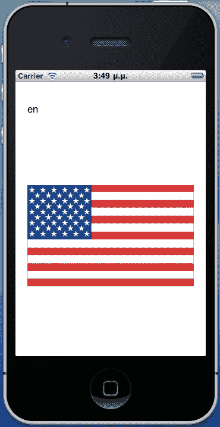
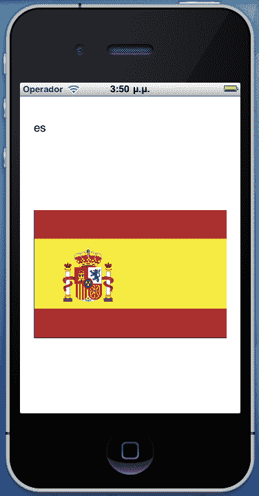
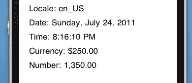
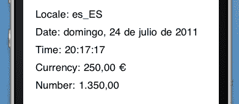

# 第十三章。本地化

在本章中，我们将介绍：

+   为不同语言创建应用程序

+   可本地化资源

+   区域格式化

# 简介

随着 iOS 平台和以应用程序商店形式出现的全球软件市场的发布，苹果公司使开发者更容易在全球范围内分发应用程序。

但是，全球用户甚至不会费心下载和使用以他们不理解的语言发布的应用程序。为了扩大其应用程序的用户基础，开发者必须对其进行本地化。本地化是将文本翻译成多种语言，提供针对多个区域的具体资源，从而创建面向不同文化受众的应用程序的过程。

在本章中，我们将讨论提供翻译文本的最佳实践，这些文本将根据每个用户的区域设置偏好显示。我们还将了解如何根据这些偏好提供资源（图像、视频）。最后，我们将使用常见的.NET 实践来格式化日期、货币和数字。

# 为不同语言创建应用程序

在本食谱中，我们将创建一个支持两种不同语言的应用程序。

## 准备工作

在 MonoDevelop 中创建一个新的项目，并将其命名为`MultipleLanguageApp`。

## 如何操作...

1.  在`MainController`的视图中添加两个标签。

1.  向项目添加两个文件夹。分别命名为`en.lproj`和`es.lproj`。

1.  使用文本编辑器应用程序创建两个文本文件。在第一个文件中输入以下文本：

    ```swift
    // Localized output on MainController
    "Have a nice day!" = "Have a nice day!";

    ```

1.  将其保存为 en.lproj 文件夹中的 Localizable.strings。

1.  在第二个文件中输入以下文本：

    ```swift
    // Localized output on MainController
    "Have a nice day!" = "Tenga un buen día!";

    ```

1.  这次将文件以相同的名称，Localizable.strings，保存在`es.lproj`文件夹中。将两个文件的**构建操作**设置为**内容**。

    ### 注意

    `Localizable.strings`文件必须以`UTF8`或`UTF16`编码保存。

1.  在`MainController`类中输入以下代码：

    ```swift
    public override void ViewWillAppear (bool animated){
    base.ViewWillAppear (animated);
    this.lblLocale.Text = string.Format("Locale: {0} - Language: {1}", NSLocale.CurrentLocale.LocaleIdentifier, NSLocale.PreferredLanguages[0]);
    string resourcePath = NSBundle.MainBundle.PathForResource( NSLocale.PreferredLanguages[0], "lproj");
    NSBundle localeBundle = NSBundle.FromPath(resourcePath);
    this.lblLocalizedOutput.Text = localeBundle.LocalizedString("Have a nice day!", "Localized output on MainController");
    }

    ```

1.  通过模拟器的**设置**应用程序，将语言设置为**英语**（如果尚未设置），然后运行应用程序。消息将以英语显示。尝试将模拟器的语言设置为**西班牙语**，然后再次运行应用程序。消息将以西班牙语显示。

## 它是如何工作的...

为了使开发者更容易在应用程序中提供对多种语言的支持，iOS 从相应的语言文件夹中读取不同语言文本。在本应用程序中，我们支持英语和西班牙语。它们相应的文件夹分别是`en.lproj`和`es.lproj`。当我们调用`LocalizedString`方法时，它会查找并解析`Localizable.strings`文件以返回适当的文本。

字符串文件的 内容由一组带引号的键/值对定义，采用 C 语言风格语法，每个集合以分号结尾：

```swift
// Localized output on MainController
"Have a nice day!" = "Have a nice day!";

```

如您所见，我们还可以提供注释以协助翻译文本的人的工作，即使我们自己翻译。

`NSLocale.PreferredLanguages`静态属性返回一个包含用户首选语言标识符的字符串数组。这个数组中的第一个项目是当前选定的语言。如果选定的语言是**英语**，它将返回`en`；如果是**西班牙语**，它将返回`es`，依此类推。

`NSBundle.PathForResource`方法返回我们传递给它的参数的应用程序包路径。我们使用这个路径来获取适当的`NSBundle`实例，根据选定的语言：

```swift
string resourcePath = NSBundle.MainBundle.PathForResource( NSLocale.PreferredLanguages[0], "lproj");
NSBundle localeBundle = NSBundle.FromPath(resourcePath);

```

然后我们调用`LocalizedString`方法来显示适当的文本：

```swift
this.lblLocalizedOutput.Text = localeBundle.LocalizedString("Have a nice day!", "Localized output on MainController");

```

第一个参数的目的是双重的。它不仅是查找以返回翻译文本的关键，而且在指定的本地化路径未找到时，它还将显示为文本。第二个参数是注释，或者我们想要提供给翻译者的任何指令。它不会显示并且基本上不会被使用。我们可以传递`null`给这个参数，并且不会发生错误。然而，始终包含注释或指令是明智的，因为它将有助于在翻译多个字符串时避免混淆。

## 还有更多...

建议始终提供可以作为在**英语**中显示的回退文本的键，以防用户选定的语言不包括在我们的应用程序中。

然而，`LocalizedString`方法有多个重载。第二个重载接受三个参数。考虑以下示例：

```swift
this.lblLocalizedOutput.Text = localeBundle.LocalizedString("Have a nice day!", "Have a nice day!", "Localizable");

```

第一个参数是查找的关键。第二个参数是回退值，以防指定的本地化路径未找到。第三个参数是包含字符串的文件的名称，不包括`.strings`扩展名。这个重载更有帮助，我们可以为我们的字符串使用不同的键，这有助于我们识别特定字符串在代码中的使用位置。例如，在这种情况下，我们可以在字符串文件中将键设置为`MainController.lblLocalizedOutput:`

```swift
// Localized output on MainController
"MainController.lblLocalizedOutput" = "Have a nice day!";

```

在我们的代码中使用它如下：

```swift
this.lblLocalizedOutput.Text = localeBundle.LocalizedString( "MainController.lblLocalizedOutput", "Have a nice day!", "Localizable");

```

这个重载还帮助我们将字符串分成多个`.strings`文件，通过将相应的文件名作为参数#3 传递。

最后一个重载包含四个参数。前三个与第二个重载相同。第四个参数只是我们想要特定字符串拥有的注释。

### 实际应用场景中的本地化

在这个示例中，我们使用`PathForResource`方法获取当前区域设置包的实例。这是因为从`LocalizedString`方法返回的值被缓存了。在实际应用场景中，如果应用程序以特定语言下载，并且用户最有可能永远不会更改设备语言来使用它，只需调用`NSBundle.MainBundle.LocalizedString`就足够了。

# 可本地化资源

可本地化资源是内容，例如图像、声音文件等，它针对特定区域。在本食谱中，我们将学习如何根据用户的本地化首选项加载和显示资源。

## 准备工作

在 MonoDevelop 中创建一个新的项目，并将其命名为`LocalizableResourcesApp`。在`MainController`的视图中添加一个标签和一个`UIImageView`。

## 如何操作...

1.  在项目中添加两个用于**英语**和**西班牙语**区域的文件夹。在每个文件夹中添加一个具有相同文件名的图像。将它们的**构建操作**设置为**内容**。

1.  在`MainController`类中输入以下代码：

    ```swift
    public override void ViewWillAppear (bool animated){
    base.ViewWillAppear (animated);
    this.lblLanguage.Text = NSLocale.PreferredLanguages[0];
    this.imageView.Image = UIImage.FromFile(NSBundle. MainBundle.PathForResource("flag", "jpg"));
    }

    ```

1.  在模拟器上编译并运行应用程序，在**设置**应用程序中选择**英语**语言。结果应该类似于以下截图：

1.  现在，将模拟器的语言设置为**西班牙语**，并再次运行应用程序。应该显示西班牙国旗：



## 它是如何工作的...

`PathForResource`方法会自动搜索适当的语言文件夹，并通过其参数加载指定的资源。在这个例子中，我们将方法的结果传递给`UIImage.FromFile`方法来加载图像，并将其分配给图像视图的`Image`属性。

## 还有更多...

除了图像外，我们还可以使用`PathForResource`方法来加载视频、PDF 文件以及任何其他需要本地化的资源。

### 更多关于可本地化资源的信息

我们需要确保特定语言的文件夹中的资源存在。如果不存在，将会抛出异常。避免这种情况的一种方法是，在项目中添加一个通用的图像文件，并在每个语言文件夹中添加一个`Localizable.strings`文件，其中包含资源的路径：

```swift
// US flag image
"flag_path"="en.lproj/flag.jpg";

```

为了加载适当的国旗，我们使用`LocalizedString`方法加载图像：

```swift
this.Image = UIImage.FromFile(NSBundle.MainBundle.LocalizedString( "flag_path", "path/to/universal/image.jpg", "Localizable");

```

这样，如果找不到相应的语言文件夹，将加载图像`image.jpg`。

## 相关内容

在本章中：

+   *为不同语言创建应用程序*

# 区域格式化

区域格式化是指根据世界各地的不同区域显示各种信息，如货币、日期和时间等。在本食谱中，我们将讨论如何根据用户的区域格式设置显示格式化的数字和日期。

## 准备工作

在 MonoDevelop 中创建一个新的项目，并将其命名为`RegionalFormattingApp`。

## 如何操作...

1.  在`MainController`的视图中添加五个标签。在`MainController`类中输入以下代码：

    ```swift
    public override void ViewDidAppear (bool animated){
    base.ViewDidAppear (animated);
    this.lblLocale.Text = string.Format("Locale: {0}", NSLocale.CurrentLocale.LocaleIdentifier);
    this.lblDate.Text = string.Format("Date: {0}", DateTime.Now.ToLongDateString());
    this.lblTime.Text = string.Format("Time: {0}", DateTime.Now.ToLongTimeString());
    this.lblCurrency.Text = string.Format("Currency: {0:c}", 250);
    this.lblNumber.Text = string.Format("Number: {0:n}", 1350);
    }

    ```

1.  在模拟器上编译并运行应用程序，将区域格式设置为**美国和西班牙 | 西班牙**，在**设置 | 通用 | 国际 | 区域格式**下。具有两种不同区域格式的输出将类似于以下截图：



## 它是如何工作的...

要格式化日期、货币和数字，我们使用标准的 .NET 代码。对于日期和时间，`DateTime.ToLongDateString` 和 `DateTime.ToLongTimeString` 方法分别根据区域设置返回值。

对于货币和数字，我们使用 C# 数值字符串：

```swift
this.lblCurrency.Text = string.Format("Currency: {0:c}", 250);
this.lblNumber.Text = string.Format("Number: {0:n}", 1350);

```

## 还有更多...

`System.Globalization` 命名空间在 MonoTouch 中受支持。要显示当前区域设置，请考虑以下代码行：

```swift
Console.WriteLine(CultureInfo.CurrentCulture.Name);

```

注意，此代码与 `NSLocale.CurrentLocale.LocaleIdentifier` 之间有一个区别。前者使用破折号 (-)，而后者在区域名称中使用下划线 (_)。
