# 第十四章 部署

在本章中，我们将涵盖：

+   创建配置文件

+   创建一个临时的分发包

+   为 App Store 准备应用

+   提交到 App Store

# 简介

将应用程序部署到设备或 App Store 的过程被认为相当复杂。当然，这也是为了开发者的利益，因为需要各种证书和配置文件才能将应用程序包从开发 Mac 传输到设备。

在本章中，我们将详细介绍在开发计算机上准备和安装适当证书的所有必要步骤。我们还将学习如何创建配置文件，这将允许我们将应用程序部署到设备上，无论是我们的设备还是发送给测试人员安装到他们的设备上。

最后，我们将了解如何为 App Store 提交准备应用程序以及最终发布到 App Store 的流程。

# 创建配置文件

在本食谱中，我们将逐步指导您创建和安装必要的证书和配置文件，这些证书和配置文件对于将应用程序部署到设备上是必需的。

## 如何操作...

以下步骤将指导您创建应用程序的开发者证书和适当的配置文件。

我们将从开发者证书开始。

1.  登录到 iOS 开发者网站：[`developer.apple.com/ios`](http://developer.apple.com/ios)。

1.  前往 iOS 配置文件门户。

1.  从左侧菜单中选择 **Certificates**。

1.  如果这是您第一次在 Mac 上使用开发者证书，请下载并安装 **WWDR 中间证书**。您可以在 **Development** 选项卡下找到链接。

1.  在 **How To** 选项卡下，您将找到创建证书签名请求的说明，这是颁发您的开发者证书和下载安装它的必要条件。

1.  如果开发者证书已正确安装，您将在 MonoDevelop 项目的选项中选中它，在 **Identity** 下拉列表中的 **iPhone Bundle Signing** 节点下：

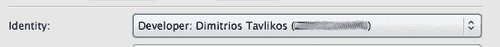

+   您可以在 **iOS Provisioning Portal** 的 **Certificates** 选项下的 **Development** 选项卡中查看您的开发者证书。

现在我们已经颁发并安装了我们的开发者证书，我们需要注册我们将用于调试的设备。

1.  点击左侧菜单中的 **Devices** 选项。

1.  在 **Manage** 选项卡下，点击 **Add Devices** 按钮。

1.  在 **Device Name** 字段中，输入一个可以识别特定设备的名称（例如，`我的 iPhone`）。

1.  在**设备 ID**字段中，输入设备的**唯一设备标识符**（UDID）。您可以通过将设备连接到您的 Mac 并打开**iTunes**来找到设备的 UDID。在设备的**摘要**选项卡下，点击序列号将切换到 UDID。按*Command* + *C*将 UDID 复制到剪贴板。

1.  点击加号（+）按钮，然后**提交**。为要添加的所有设备重复所有步骤。

接下来，我们需要一个**App ID**。

1.  点击左侧菜单上的**App IDs**选项。

1.  在**管理**选项卡下，为您的应用程序输入描述/名称。不要使用特殊字符和空格。

1.  将**Bundle Seed ID (App ID Prefix)**选项保留为**生成新**。

1.  输入**包标识符**。包标识符的最佳实践是遵循字段上方给出的示例和建议。**包标识符**很重要，因为在部署过程的至少一个步骤中您将需要它。

1.  点击**提交**按钮以创建 App ID。

接下来，是配置文件的时间。

1.  点击左侧菜单上的**配置**选项。

1.  在**开发**选项卡下，点击**新建配置文件**按钮。

1.  输入配置文件名称。您可以在此字段中输入任何字符。

1.  在**证书**选项中，选择配置文件的开发者证书。如果您已成功创建您的开发者证书，您的姓名（或 iOS 开发者账户所属者的姓名）将显示在旁边的复选框旁边。勾选复选框。

1.  在**App ID**选项中，选择您正在创建的配置文件的**App ID**。

1.  在**设备**选项中，勾选将包含在配置文件中的设备（们）。您的应用程序只能安装在此处选择的设备上。

1.  点击**提交**按钮以完成配置文件的创建。

1.  如果列表中配置文件的状态为**挂起**，只需刷新页面。

1.  点击您配置文件所在行的**下载**按钮以下载它。将下载一个扩展名为 .mobileprovision 的文件。

1.  将您的设备连接到您的 Mac。如果已打开，请关闭**iTunes**。

1.  双击您在*步骤 9*中下载的`.mobileprovision`文件。Xcode 将打开并在您的设备上安装配置文件。您可以通过在 Xcode 的**组织者**窗口中查看配置文件状态来检查此操作。要显示**组织者**窗口，按*Shift + Command + 2*，或从菜单中选择**窗口 | 组织者**。您可以通过在左侧选择**配置**选项来查看每个设备的配置文件：

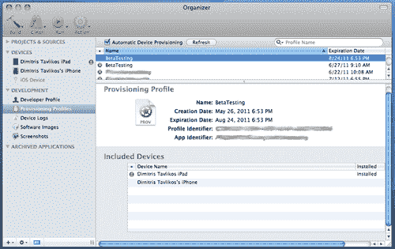

带有红色**X**标记的配置文件表示它们已过期。

## 它是如何工作的...

本食谱中描述的过程将允许您在连接到您的 Mac 的设备上部署和调试您的应用程序。它不会允许您将应用程序分发给测试人员或 App Store。

开发者证书是允许编译将部署到设备上的应用的证书。它仅用于开发，并且一个开发者证书对应一个 iOS 开发者计划注册。在创建并安装到开发机器上之后，您无法再发行新的证书。然而，现有的开发者证书可以被转移到其他 Mac 上。

每个配置文件包含有关它可以安装到哪些设备的信息。注册到 iOS 开发者计划的 Apple 开发者可以添加最多 100 个设备并将它们包含在配置文件中。

App ID 是您应用的标识符。为您的每个应用创建一个 App ID。

配置文件是允许您的应用在设备上部署的电子签名。每个配置文件对应一个应用，并包含所有允许应用在包含在内的设备上执行以及 App ID 信息的适当权限。它也是区分开发或分发应用的关键。配置文件会附带一个过期时间。在撰写本文时，大约是一年。

## 还有更多...

要在设备上编译和调试应用，请在 MonoDevelop 的**项目选项**下的**iPhone 包签名**节点中选择开发者证书和配置文件：

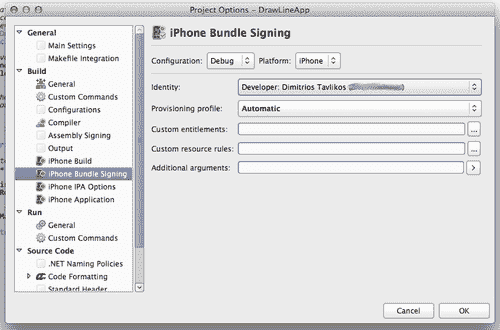

这必须为每个构建配置（调试、发布等）执行。

在**iPhone 应用**节点下，为您的应用设置**显示名称、包标识符**和**包版本**字段。如果您留空，MonoDevelop 将设置它们的默认值。具体来说，**包标识符**将被设置为包含在 App ID 中的那个。然而，如果您将**包标识符**设置为与 App ID 中声明的内容不同的内容，编译时将发生错误。

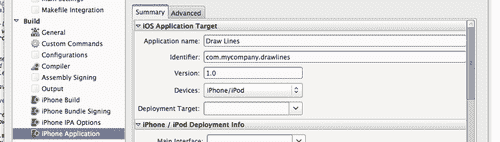

### 配置文件过期

当配置文件过期时，应用将无法在设备上工作。您可以续订现有的配置文件或创建一个新的配置文件并将其重新安装到设备上。

## 参见

在本章中：

+   创建临时分发包

在本书中：

第一章,

+   *编译*

# 创建临时分发包

在这个菜谱中，我们将学习如何创建我们的应用包，这样我们就可以将其发送给测试人员，让他们在自己的设备上进行测试。

## 准备工作

要创建一个临时的分发包，请确保您已经在 iOS 配置文件门户为您的应用创建了一个 App ID。

## 如何操作...

创建临时配置文件的过程与创建开发分发配置文件的过程类似。以下步骤将指导您完成这个过程。

1.  **分发证书：**为了将应用程序分发到未连接到您的 Mac 的各种设备，以及提交到应用商店，您需要一个分发证书进行安装。遵循之前任务中描述的创建开发者证书的相同步骤。不过，这次您需要在**iOS 配置文件门户**的**证书**菜单选项下的**分发**选项卡下进行操作。

1.  **临时分发配置文件：**

    +   在**iOS 配置文件门户**中，转到**配置 | 分发**。

    +   在**分发方法**字段中，选择**临时**。

    +   为配置文件输入一个**配置文件名称**。为了将来参考，最好在名称中添加单词`AdHoc`，例如，`MyAppAdHoc`。

    +   **分发证书**将自动选中。

    +   选择**App ID**。

    +   选择配置文件中的设备。

    +   点击**提交**以创建配置文件。

    +   从显示的列表中下载配置文件。再次点击，你将得到一个 .mobileprovision 文件。双击它以允许 Xcode 安装它。此时不需要连接设备。不要删除文件；我们稍后会用到它。

1.  **创建临时构建：**

    +   在 MonoDevelop 中加载你的项目后，转到**项目 | 解决方案选项**。

    +   在**构建 | 配置**下，通过点击**添加**创建一个新的配置。

    +   为配置输入一个名称。这里使用的名称是 `MyAppDistribution`。

    +   在**平台**选项中选择**iPhone**。以下截图显示了**新配置**对话框应该如何显示：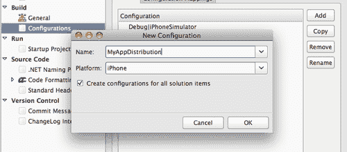

    +   确保已勾选“为所有解决方案项创建配置”选项。

    +   点击**确定**按钮。

    +   将一个新的**属性列表**文件添加到项目中，并将其命名为`Entitlements`。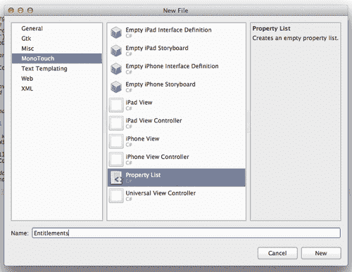

    +   MonoDevelop 将自动使用**属性列表编辑器**加载 `Entitlements.plist` 文件。添加键 `get-task-allow`，并将其**类型**设置为**布尔值**。将其值设置为**否**。

    +   在项目选项的**iPhone Bundle Signing**节点下，选择之前创建的配置（MyAppDistribution）。将**自定义权限**字段设置为之前步骤中创建的 `Entitlements.plist` 文件。它可以通过点击字段旁边的**浏览 ()**按钮轻松找到。

    +   在同一窗口中设置分发配置文件和适用于临时分发的适当配置文件。

    +   将项目的当前配置设置为之前创建的分发配置（MyAppDistribution）。

    +   构建项目。

        应用程序现在已准备好进行临时分发！

1.  **分发给测试人员：**

    +   打开**Finder**，导航到项目中的 `bin` 文件夹。

    +   打开`iPhone/MyAppDistribution`文件夹。通过右键单击并选择**Compress "MyApp"**（或应用的实际名称）使用 OS X 的默认压缩工具压缩应用程序包。应用程序包是一个显示以下图标的文件夹：

    +   将压缩的应用程序包以及`.mobileprovision`文件发送给您的测试员。

    +   为了安装应用，您的测试员需要从压缩归档中提取应用程序包。

    +   提取后，将文件拖放到**iTunes**的**Apps**部分，并附带`.mobileprovision`文件，即可将其导入到**iTunes Library**。请注意，应用将在**iTunes**中显示默认图标。如果你没有为应用设置任何图标，这对于临时分发来说是正常的。

    +   在**iTunes**中同步设备。

    +   如果测试员在 Windows 机器上使用**iTunes**，请指示他们不要使用默认的解压缩工具，而应使用第三方应用程序。

## 它是如何工作的...

为了分发应用，我们需要一个分发证书。就像开发者证书一样，分发证书一旦创建，就可以在需要时转移到另一台 Mac 上。

临时分发配置文件的创建过程与创建开发配置文件的过程相同。唯一的区别是我们有选择分发类型的选项，可以是*App Store*或*Ad Hoc*。

我们创建的配置不是必需的，但它有助于我们更好地组织构建过程。它还使我们免于为每个构建设置不同的配置文件和设置。

`Entitlements.plist`文件以及`get-task-allow`键用于防止应用在启动时尝试寻找调试器进行连接。

## 还有更多...

MonoDevelop 提供了一个直接创建和压缩应用程序包的选项。在菜单中选择**项目 | 压缩应用程序包...**，然后选择输出位置和文件名，它将编译并压缩应用程序包。

### 使用 iTunes 同步临时应用程序包

不同用户在他们的 iTunes 应用中设置了不同的设置。如果用户同步设备但无法在设备上找到应用，请确保在**iTunes**中选中设备的**Apps**标签页下的应用以进行同步。

## 相关内容

在本章中：

+   *创建配置文件*

# 准备应用提交到 App Store

在这个菜谱中，我们将讨论为准备应用提交到 App Store 所需的重要步骤。

## 准备工作

按照前一个菜谱中的步骤为您的应用创建 App Store 分发配置文件。

## 如何操作...

准备应用提交到 App Store 的一个非常重要的步骤是确定应包含在您应用中的图像。

+   **应用图标**：这是将在用户设备上代表你的应用程序的图标。对于 iPhone 和 iPod Touch，为低分辨率屏幕准备 `57x57` 像素的图标，并为高分辨率屏幕（例如，iPhone 4 及更新版本）准备 `114x114` 像素的图标。对于 iPad，图标大小应为 `72x72` 像素。

    将图标文件保存为 PNG 格式。你可以随意命名它们，但保持一致的命名方案是一个好习惯，例如，`Icon-57.png, Icon-114.png` 等等。

    将图像文件添加到项目中。打开项目选项对话框，转到 **iPhone Application** 节点下的 **Summary** 选项卡中的 **iPhone Icons** 部分，如图所示。

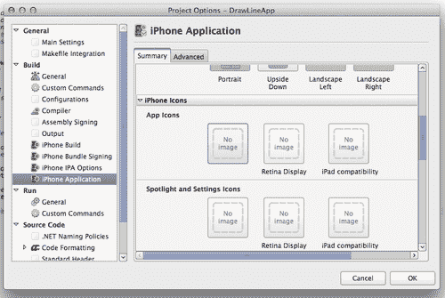

+   点击适当的按钮以找到图标文件并分配它。请注意，将打开的图像选择对话框仅查找项目中包含的文件。因此，请确保首先将你的图像添加到项目中。无需将它们的 **Build Action** 设置为 **Content**。点击 **OK** 按钮以保存对项目的更改。

+   **启动图像**：启动图像是应用程序启动时首先显示的内容。为 iPhone 和 iPod Touch 应用程序准备至少两个维度的启动图像：`320x480` 像素用于低版本，`640x960` 像素用于高版本。分别将文件命名为 `Default.png` 和 `Default@2x.png`，并将它们添加到项目中。将它们的 **Build Action** 设置为 **Content**。

    如果你的应用程序是通用型且因此可以被 iPad 用户下载，或者它是一个仅限 iPad 的应用程序，那么你应该为应用程序支持的每个方向提供启动图像。对于纵向版本，大小应为 768x1004 像素，对于横向版本，大小应为 1024x748 像素。对于支持纵向和横向右方向的应用程序，文件名分别应为 Default-Portrait.png 和 Default-LandscapeRight.png。

+   **最终设置**：最后但同样重要的是，在 **project** 选项中的 **iPhone Application** 节点的 **Summary** 选项卡中填写适当的应用程序信息，如本章开头所述的 *Creating Profiles* 菜单中所述。构建项目并压缩应用程序包。你的应用程序已准备好提交！

## 它是如何工作的...

应用程序图标非常重要。这是用户将在设备屏幕上看到并点击以启动您的应用程序的内容。尽管所有应用程序图标都显示为具有圆角和光泽效果的按钮，但您不应在图标中包含这些图形特征。这些图形特征在提交到应用商店时自动渲染。图标应该是完美的正方形。此外，始终为图标提供背景。不要使用透明度，因为图标上的任何透明度都将显示为黑色，可能会破坏您预期的图标外观。

当应用程序启动时，首先显示的是启动图像。如果启动时屏幕变黑，这意味着没有启动图像。根据苹果的*iOS 人机界面指南*([`developer.apple.com/library/ios/#documentation/UserExperience/Conceptual/MobileHIG/Introduction/Introduction.html`](http://developer.apple.com/library/ios/#documentation/UserExperience/Conceptual/MobileHIG/Introduction/Introduction.html))，这个图像应该是应用程序完成启动过程并准备好接受输入时的第一个屏幕。它应该只包含第一个屏幕的静态内容，而不是可能改变的内容，例如本地化文本。例如，以下截图展示了 g-force 测量应用 GBox 的启动图像。

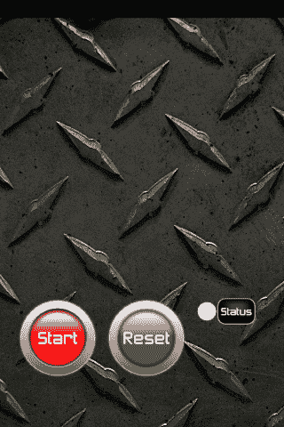

以下截图显示了应用程序完全加载后的样子。

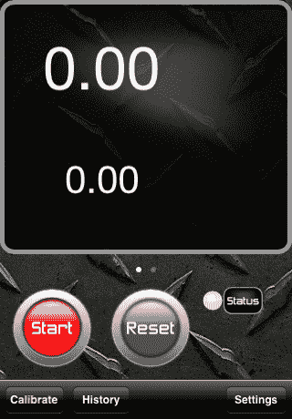

## 更多内容...

启动图像的存在是为了在应用程序加载时给用户一种响应感，避免空白屏幕。尽管*iOS 人机界面指南*正如其名所示，是一份指南，但遵循它们是一个好的实践。苹果建议避免在启动画面、"关于"信息和品牌中使用启动图像。

### 图标上的灯光效果

如果我们想要为图标提供自己的灯光效果，或者甚至不允许显示默认的 iOS 效果，我们可以在`Info.plist`文件中添加`UIPrerenderedIcon`键，并将其**类型**设置为**布尔值**并启用它。此设置防止在设备主屏幕上显示应用程序图标时创建光泽效果。

## 参见

在本章中：

+   *创建配置文件*

# 提交到 App Store

在这个菜谱中，我们将介绍提交应用程序到 App Store 所需的步骤。

## 准备工作

对于这个任务，您需要准备好您的压缩分发应用程序包。

## 如何操作...

按照以下步骤提交您的应用程序到 App Store。

1.  **截图**：准备显示您应用程序各个方面的截图。对于 iPhone/iPod Touch 应用程序，肖像模式的尺寸应为`320x480`，横屏模式的尺寸应为`480x320`。对于 iPad 应用程序，截图的尺寸应为肖像模式的`768x1024`和横屏模式的`1024x768`。如果应用程序没有隐藏状态栏，最好将其包含在截图内。对于每个应用程序，我们可以在 App Store 上最多拥有五张截图。

1.  **App Store 图标**：准备代表应用在 App Store 上的图标。其尺寸必须是`512x512`像素，并且必须与应用图标相同。

1.  **描述和关键词**：准备描述您的应用程序的文本。尽量包括最重要的功能。记住，描述是用户在下载应用程序之前会阅读的内容，所以越吸引人越好。

    准备有助于您的应用程序在搜索结果中排名靠前的关键词。

    应用描述和关键词都是必需的。

1.  **登录到 iTunes Connect**：iTunes Connect 是管理提交应用程序（以及其他 App Store 相关内容）的开发者门户。使用您的 Apple 开发者 ID 登录到 iTunes Connect([`itunesconnect.apple.com`](http://itunesconnect.apple.com) )。点击链接**管理您的应用程序**。然后，点击左上角的**添加新应用**按钮。按照步骤在门户上完成应用程序准备。完成后，请确保应用程序状态为**等待上传**。

1.  **上传**：在门户上创建新应用程序后，您可以使用**应用程序加载器**上传压缩的应用程序包。它默认安装在 Xcode 中，可以在路径`/Developer/Application/Utilities`下找到，或者通过**Spotlight**搜索。

    当您启动**应用程序加载器**时，它将要求您使用您的**Apple 开发者 ID**登录。登录后，您将看到一个以下窗口：

    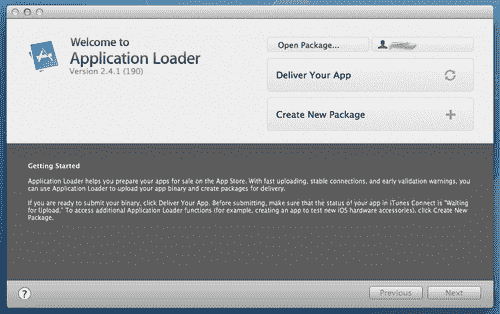

1.  点击**提交您的应用程序**按钮，它将连接到**iTunes Connect**，找到您处于**等待上传**状态的应用程序，并将它们加载到列表框中：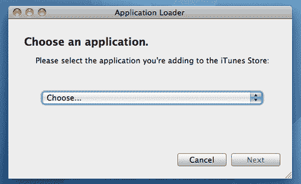

    +   然后，您将看到您应用程序的摘要视图：

    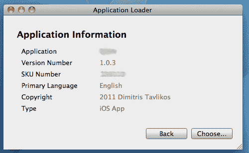

1.  点击**选择...**按钮，将弹出一个对话框，允许您选择压缩的应用程序包。选择后，继续上传。一切就绪！如果所有步骤都正确完成，应用程序将被上传，并将在 App Store 上等待审核发布。

## 它是如何工作的...

应用截图和 App Store 图标非常重要。它们可以是`JPG`、`TIF`或`PNG`格式，使用 RGB 颜色，分辨率至少为 72 DPI。

但图片只有在用户已经在 App Store 中查看你的应用时才重要。关键词和描述是允许你的应用在搜索结果中排名更高的参数，并让用户决定应用是否值得下载。特别是关于关键词，要明智地选择。不要包含尽可能多的关键词；反映应用关键方面的关键词越少越好。

iTunes Connect 是管理应用、审查财务数据、应用下载的开发者门户，包括开发者需要签署的合同和协议。请确保你阅读并接受这些合同，否则你将无法继续应用准备流程。在这个过程中，你需要提供之前描述的应用必要信息，如果它是付费应用，还需要提供价格范围、它将在哪些国家可用，以及如果不想自动发布，还需要提供发布日期。

当一切设置正确且应用状态为**等待上传**时，你可以运行**应用加载器**来上传它。iOS 和 iOS SDK 版本每次更新时，各种组件或流程都会发生变化。请确保你的 iOS SDK 版本是最新的。

## 还有更多...

在应用准备过程中某个阶段，你将需要输入一个**库存单位**（SKU）编号。这个编号是每个产品或服务的唯一标识符。它可以是你想要的任何数字，但请保持一个特定的模式来跟踪标识符，例如，当你开发额外的应用时。

## 参见

在本章中：

+   *为 App Store 准备应用*
