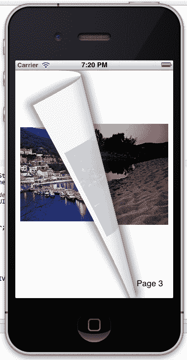
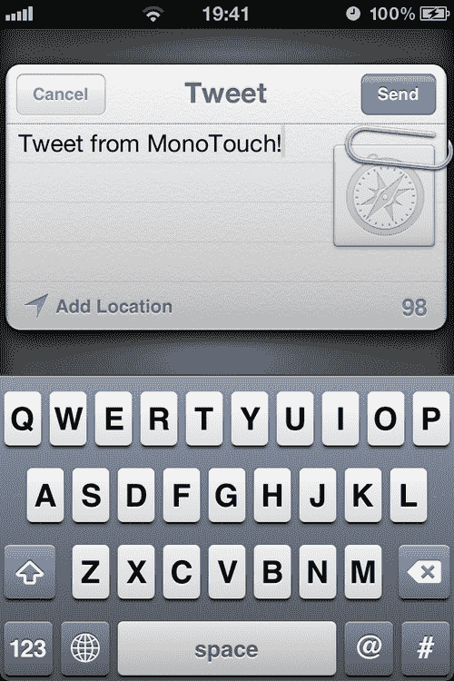
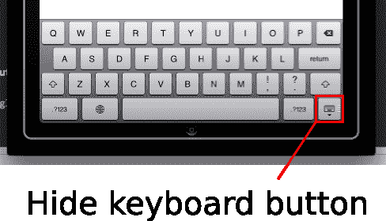
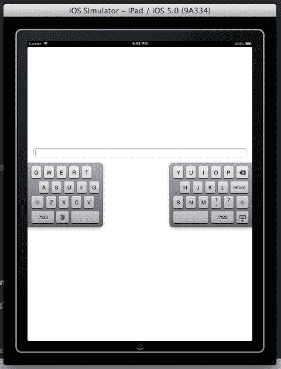

# 第十五章：iOS 5 特性

在本章中，我们将涵盖：

+   重新生成翻页效果

+   视图样式

+   Twitter 集成

+   与分割键盘一起工作

# 简介

iOS 的第五个主要版本带来了 200 多项新特性。在本章中，我们将只关注其中的一些，这些特性大多与增强用户体验有关。

具体来说，我们将创建一个项目，显示内容分为页面，用户可以使用新引入的 UIPageViewController 类像在普通书籍中一样导航这些页面。

我们将讨论 UIAppearance 类，它允许我们以更灵活和简单的方式对我们的应用程序中的控件进行样式设计。在今天的设备中，社交分享也不可或缺，因此我们将创建一个项目，允许用户使用 Twitter，使用 TWTweetComposeViewController。

在本章的最后一个小节中，我们将使用 iPad 的新分割键盘功能，学习如何根据屏幕上虚拟键盘的位置调整内容。

# 重新生成翻页效果

在这个菜谱中，我们将创建一个应用，使用`UIPageViewController`类来显示类似书籍的内容。

## 准备工作

在 MonoDevelop 中创建一个新的 iPhone 项目，并将其命名为`BookApp`。除了`MainController`外，再添加另一个控制器，并将其命名为`Page`。根据您的喜好配置`Page`控制器的外观。在这个菜谱的源代码中，它包含一个`UIImageView`和一个`UILabel`。

## 如何操作...

1.  在`MainController`类中输入以下代码：

    ```swift
    private UIPageViewController pageViewController;
    private int pageCount = 3;
    public override void ViewDidLoad (){
    base.ViewDidLoad ();
    Page firstPage = new Page(0);
    this.pageViewController = new UIPageViewController( UIPageViewControllerTransitionStyle.PageCurl, UIPageViewControllerNavigationOrientation.Horizontal, UIPageViewControllerSpineLocation.Min);
    this.pageViewController.SetViewControllers(new UIViewController[] { firstPage }, UIPageViewControllerNavigationDirection.Forward, false, s => { });
    this.pageViewController.GetNextViewController = this.GetNextViewController;
    this.pageViewController.GetPreviousViewController = this.GetPreviousViewController;
    this.pageViewController.View.Frame = this.View.Bounds;
    this.View.AddSubview(this.pageViewController.View);
    }
    private UIViewController GetNextViewController( UIPageViewController pageController, UIViewController referenceViewController){
    Page currentPageController = referenceViewController as Page;
    if (currentPageController.PageIndex >= (this.pageCount - 1)){
    return null;
    } else{
    int nextPageIndex = currentPageController.PageIndex + 1;
    return new Page(nextPageIndex);
    }
    }
    private UIViewController GetPreviousViewController( UIPageViewController pageController, UIViewController referenceViewController){
    Page currentPageController = referenceViewController as Page;
    if (currentPageController.PageIndex <= 0){
    return null;
    } else{
    int previousPageIndex = currentPageController.PageIndex - 1;
    return new Page(previousPageIndex);
    }
    }

    ```

1.  在`Page`类中添加一个属性，并修改其构造函数，如下面的代码所示：

    ```swift
    public Page (int pageIndex) : base ("Page", null){
    this.PageIndex = pageIndex;
    }
    public int PageIndex{
    get;
    private set;
    }

    ```

1.  最后，在`ViewDidLoad`方法中配置将在`Page`中显示的内容：

    ```swift
    this.imageView.Image = UIImage.FromFile(string.Format( "images/{0}.jpg", this.PageIndex + 1));
    this.lblPageNum.Text = string.Format("Page {0}", this.PageIndex + 1);

    ```

1.  在模拟器上编译并运行应用程序。

1.  在模拟器的屏幕区域上点击并拖动以更改页面。结果应类似于以下截图：



## 它是如何工作的...

随着 iOS 5 的推出，`UIPageViewController`类成为许多开发者的期望组件。它允许我们通过类似真实书籍的效果导航内容，就像在苹果的 iBooks 应用中一样。

我们使用以下行进行初始化：

```swift
this.pageViewController = new UIPageViewController( UIPageViewControllerTransitionStyle.PageCurl, UIPageViewControllerNavigationOrientation.Horizontal, UIPageViewControllerSpineLocation.Min);

```

构造函数的第一个参数确定效果的类型。目前唯一可用的值是`PageCurl`。第二个参数确定效果的方向。`Horizontal`是类似于书籍的效果的值，而`Vertical`是类似于笔记本的效果的值，其中页面在顶部绑定。第三个参数确定书籍绑定的位置。`Min`表示绑定在屏幕的一侧；在这种情况下，在左侧。

初始化页面控制器后，我们需要通过调用其`SetViewControllers`方法来设置其第一个页面：

```swift
this.pageViewController.SetViewControllers(new UIViewController[] { firstPage }, UIPageViewControllerNavigationDirection.Forward, false, s => { });

```

其第一个参数是一个`UIViewController`对象的数组。我们可以为这个参数设置一个或两个控制器，具体取决于设备方向。例如，如果应用程序支持横屏方向，我们可能希望同时显示两个页面。第二个参数基本上决定了包含页面的导航方向。`Forward`表示如果我们从右向左在屏幕上滑动，将加载下一页，而`Reverse`表示对于相同的滑动，将加载上一页。最后一个参数是`UICompletionHandler`类型，代表在控制器被添加后要执行的处理器。在这个例子中，我们不需要它，所以我们只传递一个空的 lambda。

接下来，我们需要为我们的“书籍”其余页面提供数据源。MonoTouch 再次为我们简化了事情，提供了两个非常有用的属性供我们使用：`GetNextViewController`和`GetPreviousViewController`。这两个属性仅仅代表了如果我们要为页面控制器创建一个`Delegate`对象时需要重写的回调方法。除了它们的名称外，这两个方法的签名是相同的：

```swift
UIViewController GetNextViewController(UIPageViewController pageController, UIViewController referenceViewController);
UIViewController GetPreviousViewController(UIPageViewController pageController, UIViewController referenceViewController);

```

第一个参数给出了页面控制器，而第二个参数给出了在调用此方法时屏幕上当前显示的控制器。

在这些方法的实现中，我们只需返回应该加载的下一个控制器，或者当前控制器之前的一个。如果我们不希望激活效果，我们只需返回`null`。

最后但同样重要的是，我们设置了页面控制器的视图大小，并将其添加到父视图中，以便它将被显示：

```swift
this.pageViewController.View.Frame = this.View.Bounds;
this.View.AddSubview(this.pageViewController.View);

```

## 还有更多...

如果我们希望我们的应用程序支持横屏方向，我们首先必须在`MainController`类中实现`ShouldAutoRotateToInterfaceOrientation`方法，并从它返回我们希望支持的横屏方向。其次，我们必须为`UIPageViewController`类的`SetViewControllers`方法提供两个视图控制器。

### 双面页面

如您在菜谱的截图中所注意到的，当我们翻页时，其内容在页面的背面以相反的方式显示，就像我们通过真实书籍的一页看过去一样。我们有选项通过将`UIPageViewController.DoubleSided`属性设置为`true`来创建双面页面。

# 视图样式

在这个菜谱中，我们将发现如何轻松地在我们应用程序中设置按钮样式。

## 准备工作

在 MonoDevelop 中创建一个新的项目，并将其命名为`StyleButtonsApp`。添加`MainController`和另一个名为`ModalController`的控制器。

## 如何做到这一点...

1.  在每个控制器上添加一个按钮。在`MainController`类中，实现`ViewDidLoad`方法，代码如下：

    ```swift
    public override void ViewDidLoad (){
    base.ViewDidLoad ();
     UIButton.Appearance.BackgroundColor = UIColor.Gray;
    UIButton.Appearance.SetTitleColor(UIColor.White, UIControlState.Normal); 

    this.buttonPresent.TouchUpInside += delegate(object sender, EventArgs e) {
    this.PresentModalViewController(new ModalController(), true);
    } ;
    }

    ```

1.  实现`ModalController`类的`ViewDidLoad`方法，以便在按钮被点击时关闭它：

    ```swift
    this.buttonDismiss.TouchUpInside += delegate(object sender, EventArgs e) {
    this.DismissModalViewControllerAnimated(true);
    } ;

    ```

1.  在模拟器上编译并运行应用程序。

1.  点击**显示**按钮以显示模态控制器。注意，`MainController`和`ModalController`的按钮具有相同的背景颜色和文字颜色。

## 它是如何工作的...

为了使我们的应用程序中的所有按钮看起来相同，我们使用`UIButton`类的`Appearance`静态属性。此属性返回继承自`UIAppearance`类的对象，这是将 Objective-C 的`UIAppearance`协议反映到 MonoTouch 中的类。

这样，我们为所有支持它的视图都有一个`Appearance`静态属性，根据我们想要样式的视图进行强类型化。对于`UIButton`，`Appearance`属性返回一个`UIButtonAppearance`对象。在设置好这个对象中的值后，应用程序中所有`UIButton`实例将共享相同的样式。

因此，在这个例子中，如高亮代码所示，我们设置了我们希望所有按钮都具有的背景颜色和文字颜色，运行时将为我们处理其余部分。

## 还有更多...

在我们的应用程序中全局样式化控件是一个非常不错的功能，但有人可能会同意它有点限制。如果我们只想样式化特定的`UIButtons`而不是所有按钮怎么办？考虑以下代码：

```swift
UIButton.UIButtonAppearance buttonStyle = UIButton.AppearanceWhenContainedIn(typeof(ModalController));
buttonStyle.BackgroundColor = UIColor.Red;

```

`AppearanceWhenContainedIn`方法返回相应的`UIAppearance`对象，在这种情况下是`UIButtonAppearance`，并接受一个类型为`System.Type`的可变数量的参数（params `Type[] containers）`）。此代码将仅样式化包含在`ModalController`对象中的`UIButton`实例。

尽管该方法参数的数量是可变的，但我们传递的`Type`对象序列决定了其行为。例如，以下调用将只在我们将`ModalController`包含在`MainController`中时，将我们设置的样式应用到`ModalController`中包含的`UIButton`实例。

```swift
UIButton.AppearanceWhenContainedIn(typeof(MainController), typeof(ModalController));

```

### 特定属性

继承自`UIView`的每个类都继承自`UIAppearance`类。然而，并非每个类的所有属性都支持它。例如，通过`UIButtonAppearance`对象，我们可以设置应用程序中每个`UIButton`的背景颜色，但不能设置标题。

# Twitter 集成

在这个菜谱中，我们将创建一个实现 Twitter 分享的应用程序，允许用户发送推文。

## 准备工作

在 MonoDevelop 中创建一个新的项目，并将其命名为`TweetApp`。将`MainController`添加到项目中。

## 如何操作...

1.  在`MainController`的视图中添加一个按钮，并在类中输入`MonoTouch.Twitter`命名空间。接下来，输入以下代码：

    ```swift
    private TWTweetComposeViewController tweetController;
    public override void ViewDidLoad (){
    base.ViewDidLoad ();
    this.buttonTweet.TouchUpInside += delegate(object sender, EventArgs e) {
    if (TWTweetComposeViewController.CanSendTweet){
    this.tweetController = new TWTweetComposeViewController();
    this.tweetController.SetInitialText("Tweet from MonoTouch!");
    this.tweetController.AddUrl(NSUrl.FromString( "http://software.tavlikos.com"));
    this.tweetController.SetCompletionHandler(delegate( TWTweetComposeViewControllerResult tweetResult) {
    if (tweetResult == TWTweetComposeViewControllerResult.Cancelled){
    Console.WriteLine("Tweet cancelled!");
    } else{
    Console.WriteLine("Tweet sent!");
    }
    this.DismissModalViewControllerAnimated(true);
    } );
    this.PresentModalViewController(this.tweetController, true);
    } else{
    Console.WriteLine("Cannot use Twitter on this device!");
    }
    } ;
    }

    ```

1.  在模拟器上编译并运行应用程序。如果模拟器上尚未设置 Twitter 账户，可以通过`Settings`应用程序轻松配置。

1.  点击按钮以显示 Twitter 控制器。结果应该类似于以下截图：



## 它是如何工作的...

iOS 提供了 `TWTweetComposeViewController` 类，它提供了共享功能。此控制器与用于从设备相册共享照片的原生界面相同。就像类似的本地控制器一样，我们只能在它呈现之前设置其内容。我们无法在它向用户显示后对其进行修改，用户负责是否发送或丢弃它。

我们可以通过读取 `CanSendTweet` 静态属性来确定用户是否在设备上配置了 Twitter 账户：

```swift
if (TWTweetComposeViewController.CanSendTweet)

```

如果我们在设备上未设置账户的情况下呈现控制器，将显示一个原生警报，用户可以选择在继续之前配置账户。

然后，我们初始化控制器，并使用 `SetInitialText` 方法设置要填充的文本，如果需要的话：

```swift
this.tweetController = new TWTweetComposeViewController();
this.tweetController.SetInitialText("Tweet from MonoTouch!");

```

我们还可以通过 `AddUrl` 和 `AddImage` 方法分别添加推文中的 URL 或图片。

为了获取用户是否发送或取消推文的反馈，我们调用 `SetCompletionHandler` 方法，传递要调用的回调：

```swift
this.tweetController.SetCompletionHandler(delegate(TWTweetComposeView ControllerResult tweetResult) {

```

此回调接受枚举类型 `TWTweetComposeViewControllerResult` 的一个参数，它可以包含两个值中的任意一个 `Done` 或 `Cancelled`。

最后但同样重要的是，我们应该在回调中关闭控制器。

### 注意

手动关闭 `TWTweetComposeViewController` 不是必需的。然而，如果没有手动关闭它，已经注意到尽管在用户点击 **Send** 时控制器被关闭，但需要两次点击 **Cancel** 按钮才能关闭它。

## 还有更多...

除了发送推文外，`MonoTouch.Twitter` 命名空间还封装了 `TWRequest` 类，允许我们通过 Twitter API URL 读取 Twitter 信息，例如用户的推文时间线。通过这种方式接收到的数据是以 JSON 对象的形式，正确读取它们是我们的责任。

### 支持横幅方向

`TWTweetComposeViewController` 支持横幅方向。要启用它，我们只需覆盖呈现它的控制器中的 `ShouldAutoRotateToInterfaceOrientation` 方法。

# 与分割键盘一起工作

在这个菜谱中，我们将创建一个能够感知虚拟键盘位置变化的应用程序，以便相应地调整我们的内容。

## 准备工作

在 MonoDevelop 中创建一个新的 iPad 项目，并将其命名为 `SplitKeyboardApp`。将 `MainController` 添加到项目中。

## 如何做到这一点...

1.  添加一个 `UITextField`，并将其放置在 `MainController` 的中心位置。调整文本框的大小，使其宽度扩展到屏幕的另一侧。在 `MainController` 类中添加以下代码：

    ```swift
    private NSObject kbdFrameChangedObserver;
    public override void ViewDidLoad (){
    base.ViewDidLoad ();
    this.kbdFrameChangedObserver = NSNotificationCenter. DefaultCenter.AddObserver(new NSString(" UIKeyboardDidChangeFrameNotification"), this.KeyboardFrameChanged);
    }
    private void KeyboardFrameChanged(NSNotification ntf){
    Console.WriteLine("Keyboard frame changed!");
    if (ntf.UserInfo != null){
    NSObject frameEndObj = null;
    if (ntf.UserInfo.TryGetValue(UIKeyboard.FrameEndUserInfoKey, out frameEndObj)){
    RectangleF keyboardFrame = (frameEndObj as NSValue).RectangleFValue;
    RectangleF textFieldFrame = this.txtInput.Frame;
    if (textFieldFrame.IntersectsWith(keyboardFrame)){
    textFieldFrame.Y = keyboardFrame.Y - (textFieldFrame.Height + 40f);
    UIView.BeginAnimations("");
    this.txtInput.Frame = textFieldFrame;
    UIView.CommitAnimations();
    }
    }
    }
    }

    ```

1.  在模拟器上编译并运行应用程序。

1.  点击文本框以显示键盘。如果之前未在 iPad 模拟器中使用过键盘，它将默认处于正常状态，即在底部并合并。

1.  点击并拖动屏幕右下角的**隐藏键盘**键来移动键盘，使其分裂，并让它停留在文本字段上方。



+   观察文本字段在键盘上方动画。结果应该类似于以下截图：



## 它是如何工作的...

要检测分裂键盘的位置，我们首先需要为`UIKeyboardDidChangeFrameNotification`键添加一个观察者：

```swift
this.kbdFrameChangedObserver = NSNotificationCenter. DefaultCenter.AddObserver(new NSString( "UIKeyboardDidChangeFrameNotification"), this.KeyboardFrameChanged);

```

在`KeyboardFrameChanged`回调内部，我们从`UserInfo`字典中获取`FrameEndUserInfoKey`键的值。这个值，作为一个`NSObject`返回，实际上是一个包含键盘框架的`NSValue`对象。我们从它中读取`RectangleFValue`属性，以获取包含键盘框架值的`RectangleF`对象：

```swift
if (ntf.UserInfo.TryGetValue(UIKeyboard.FrameEndUserInfoKey, out frameEndObj)){
RectangleF keyboardFrame = (frameEndObj as NSValue).RectangleFValue;
}

```

其余的代码将文本字段移动到键盘上方。请随意更改它！

## 还有更多...

`NSNotification`类的`UserInfo`属性返回一个`NSDictionary`对象，其中包含有关键盘的各种信息。为了枚举它包含的键，简单的`foreach`即可：

```swift
foreach (NSString eachItem in ntf.UserInfo.Keys){
Console.WriteLine("Key: {0}", eachItem);
}

```

### 移动键盘有问题？

隐藏键盘键在我们长按它时会出现一个小的“上下文菜单”。这个菜单提供了停靠和合并（或相反操作）键盘的选项。为了将键盘移动到我们想要的位置，我们必须在点击键的瞬间就开始拖动。
