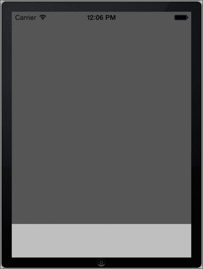
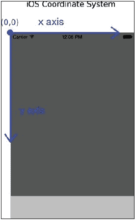
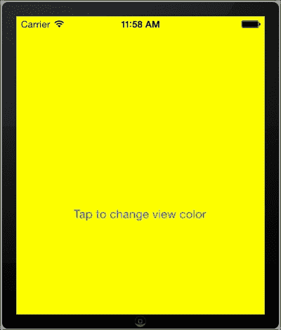
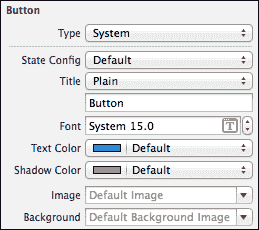
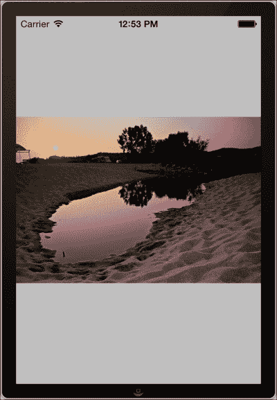
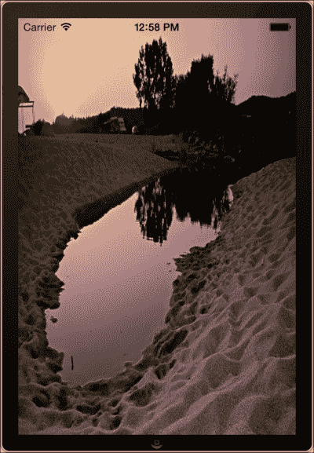
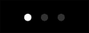
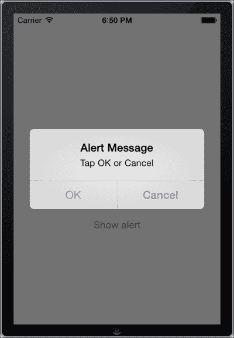
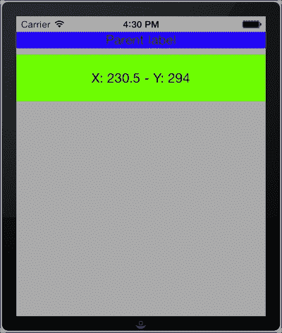

# 第二章：用户界面 – 视图

在本章中，我们将涵盖以下主题：

+   添加和自定义视图

+   使用按钮接收用户输入

+   显示图像

+   显示和编辑文本

+   使用键盘

+   显示进度

+   显示比屏幕更大的内容

+   在分页内容中导航

+   显示警报

+   创建自定义视图

+   视图样式

# 简介

应用程序的**用户界面**（**UI**）对于提供用户与设备（无论是计算机、移动电话还是平板电脑）的便捷通信方式至关重要。在移动设备上，用户界面不仅至关重要，而且是与用户交互的唯一方式。开发者在为移动设备开发应用程序时必须应对各种限制和约束。移动设备的处理能力不匹配桌面 CPU，屏幕也较小，这使得每次选择要显示的信息类型变得更加困难。

在本章中，我们将讨论 iOS 应用程序 UI 的关键组件。我们将了解如何使用和自定义这些组件来创建丰富的应用程序用户界面，并讨论它们与桌面等价物的相似之处和不同之处。以下是一个组件列表：

+   **UIView**：这是一个可定制的容器，是大多数 iOS 用户界面控件的基础对象

+   **UIButton**：这是.NET 世界中的按钮等价物

+   **UILabel**：这是.NET 世界中的标签等价物

+   **UIImageView**：这是一个允许我们显示和创建基本图像动画的视图

+   **UITextView**：这是一个允许我们显示可编辑文本的视图

+   **UITextField**：这与.NET 的 TextBox 控件类似

+   **UIProgressView**：这显示已知的长度进度

+   **UIScrollView**：这提供了显示可滚动内容的能力

+   **UIPageControl**：这为分为不同页面或屏幕的内容提供导航功能

+   **UIAlertView**：这是 iOS 中用于向用户显示消息框的默认控件

我们还将讨论如何以编程方式创建这些组件的实例，以及如何高效地样式化和使用它们。

# 添加和自定义视图

在这个菜谱中，我们将讨论如何使用 Xcode 的 Interface Builder 添加和自定义`UIView`。

## 准备工作

使用 Interface Builder 添加视图是一个简单的任务。让我们首先在 Xamarin Studio 中创建一个新的`iPhone Single View Application`项目。将项目命名为`FirstViewApp`，并使用 Interface Builder 打开`FirstViewAppViewController.xib`文件。

## 如何做到这一点...

执行以下步骤：

1.  要将视图添加到项目中，从**库**垫拖动一个`UIView`对象到主视图。确保它适合整个窗口区域。为了使`UIView`可访问，为其创建一个出口并将其命名为`subView`。

    ### 注意

    关于出口的概念及其使用方法将在第一章*开发工具*中详细讨论。

1.  选择我们刚刚添加的视图并转到**检查器**面板。选择**属性**选项卡，并在**背景**下拉列表中选择**深灰色**。现在，选择**大小**选项卡并将视图的高度减少 60 点。保存文档。

1.  在模拟器上编译并运行应用程序。结果应该看起来像以下截图所示：

    模拟器屏幕上的深灰色部分是我们刚刚添加的视图。

## 它是如何工作的...

我们已经成功创建了一个包含一个视图的应用程序。当然，这个应用程序不提供任何功能。它只是用来展示如何添加视图并显示它。

视图是 iOS 应用程序界面的基本组件。每个视觉用户界面对象都继承自`UIView`类。这个概念与.NET 中的表单有些不同。视图管理内容绘制，接受其他视图作为子视图，提供自动调整大小功能，可以接受自身及其子视图的触摸事件，并且许多属性甚至可以动画化。甚至`UIWindow`也继承自`UIView`。iOS 开发者将最频繁地使用这个类或其继承者。

当使用 Interface Builder 添加的视图在运行时首次实例化时，它使用通过**检查器**面板的**大小**选项卡设置的值来设置其`Frame`属性。`Frame`属性是`RectangleF`类型，它定义了视图在其父视图坐标系中的位置（在我们的例子中，是主窗口）以及其大小（以点为单位）。

### 注意

在 Objective-C 中，UIView 的`frame`属性是`CGRect`类型。此类型在 Xamarin.iOS 中未绑定，因此使用了更熟悉的`System.Drawing.RectangleF`。

父视图是一个视图的父视图，而子视图是其子视图。具有相同父视图的视图被称为兄弟视图。

iOS 中的默认坐标系起源于左上角并向底部和右侧延伸。坐标原点始终相同，且不能通过编程方式更改。

iOS 的坐标系在以下图中显示：



当设置`Frame`属性时，它会调整`Bounds`属性。`Bounds`属性定义了视图在其自身坐标系中的位置以及其大小（以点为单位）。它也是`RectangleF`类型。`Bounds`属性的默认位置是(0,0)，其大小始终与视图的`Frame`值相同。这两个属性的尺寸是相互关联的，因此当你更改`Frame`的大小，`Bounds`的大小也会相应地改变，反之亦然。你可以更改`Bounds`属性以显示视图的不同部分。

一个视图的框架可以在位置和位置上超出屏幕。也就是说，具有值 *(x = -50, y = -50, width = 1500, height = 1500)* 的视图框架是完全可接受的，尽管它将不会在 iPhone 的屏幕上完全可见。

## 更多内容...

另一点需要注意的是，`UIView` 类继承自 `UIResponder` 类。`UIResponder` 类负责响应用和处理事件。当视图被添加到父视图中时，它成为其响应链的一部分。`UIView` 类公开了 `UIResponder` 的属性和方法，我们现在感兴趣描述的是以下两个：

+   **IsFirstResponder 属性**：这个属性返回一个布尔值，表示视图是否是第一个响应者。基本上，它表示视图是否具有焦点。

+   **ResignFirstResponder()**：这将使视图失去焦点。

### 以编程方式添加视图

如果我们想以编程方式将视图添加到主视图中，我们将使用以下 `UIView.AddSubview(UIView)` 方法：

```swift
this.View.AddSubview(this.subView);
```

`AddSubview` 方法将其参数（`UIView` 类型）添加到调用者的子视图列表中，并将其 `Superview` 参数设置为调用者。除非使用 `AddSubview` 方法将其添加到父视图中，否则视图将不会显示。此外，如果视图已经有一个父视图，并且使用其 `AddSubview` 方法添加到另一个视图中，其 `Superview` 将更改为新的调用者。这意味着视图一次只能有一个父视图。

### 注意

当使用 Interface Builder 将视图作为子视图添加时，不需要使用 `AddSubview` 方法来显示子视图。然而，当以编程方式添加视图时，必须调用 `AddSubview` 方法。

对于以编程方式从父视图中删除视图，请调用其 `RemoveFromSuperview` 方法。如果对没有父视图的视图调用此方法，则不会执行任何操作。当我们想要重用要删除的视图时，必须注意。我们必须保留对其的引用，否则它可能会被释放。

### 视图内容布局

`UIView` 的另一个重要属性是 `ContentMode`。`ContentMode` 接受 `UIViewContentMode` 枚举类型的值。此属性设置 `UIView` 将如何显示其内容，通常是图像。此属性的默认值是 `UIViewContentMode.ScaleToFill`。这会将内容缩放到适合视图的确切大小，如果需要则拉伸。`UIViewContentMode` 的可用值将在本章后面的 *显示图像* 菜谱中详细解释。

## 参见

+   *创建自定义视图* 菜谱

+   第一章中的 *创建 UI* 菜谱，*开发工具*

+   第一章中的 *使用连接访问 UI* 菜谱，*开发工具*

# 使用按钮接收用户输入

在这个菜谱中，我们将学习如何使用按钮来接收和响应用户输入。

## 准备工作

我们在第一章，*开发工具*中使用了按钮，讨论了如何使用 Interface Builder 将控件添加到用户界面。在本食谱中，我们将更详细地描述`UIButton`类。在 Xamarin Studio 中打开我们在上一个食谱中创建的`FirstViewApp`项目。增加我们添加的视图的高度，使其在 Interface Builder 中覆盖整个设备屏幕，并保存文档。

## 如何操作...

执行以下步骤：

1.  我们将在我们的界面中以编程方式添加一个按钮。此按钮在被点击时会改变我们视图的背景颜色。打开`FirstViewAppViewController.cs`文件，并在类中输入以下代码：

    ```swift
    UIButton buttonChangeColor;
    private void CreateButton ()
    {
      RectangleF viewFrame = this.subView.Frame;
      RectangleF buttonFrame = new RectangleF (10f, viewFrame.Bottom - 200f, viewFrame.Width - 20f, 50f);
      this.buttonChangeColor = UIButton.FromType (UIButtonType.System);
      this.buttonChangeColor.Frame = buttonFrame;
      this.buttonChangeColor.SetTitle ("Tap to change view color", UIControlState.Normal);
      this.buttonChangeColor.SetTitle ("Changing color...", UIControlState.Highlighted);
      this.buttonChangeColor.TouchUpInside += this.ButtonChangeColor_TouchUpInside;
      this.subView.AddSubview (this.buttonChangeColor);
    }
    bool isYellow;
    private void ButtonChangeColor_TouchUpInside (object sender, EventArgs e)
    {
      if (this.isYellow) {
        this.subView.BackgroundColor = UIColor.LightGray;
        this.isYellow = false;
      }  else {
        this.subView.BackgroundColor = UIColor.Yellow;
        this.isYellow = true;
      }
    }
    ```

1.  在`ViewDidLoad`方法中，添加以下行：

    ```swift
    this.CreateButton ();
    ```

1.  在模拟器上编译并运行应用。当按钮被点击时，结果应类似于以下截图：

## 它是如何工作的...

在本食谱中，我们向用户界面添加了一个按钮。此按钮会改变其父视图的背景颜色。此外，我们没有使用 Interface Builder 就完成了这个任务。

现在我们来看看代码是如何工作的。我们创建以下字段来保存按钮对象：

```swift
// A button to change the view's background color
UIButton buttonChangeColor;
```

在`CreateButton`方法中，我们创建按钮并设置一些属性。该方法如下所示：

```swift
// Create the appropriate rectangles for the button's frame
RectangleF viewFrame = this.subView.Frame;
RectangleF buttonFrame = new RectangleF (10f, viewFrame.Bottom - 200f, viewFrame.Width - 20f, 50f);
```

首先，我们将视图的框架分配给一个名为`viewFrame`的新变量。然后，我们创建一个名为`buttonFrame`的新`RectangleF`对象。此对象将被分配给按钮的`Frame`属性。现在我们为我们的按钮有了框架，我们可以按照以下代码片段初始化它：

```swift
// Create the button.
this.buttonChangeColor = UIButton.FromType (UIButtonType.System);
this.buttonChangeColor.Frame = buttonFrame;
```

按钮是通过`UIButton.FromType(UIButtonType)`静态方法初始化的。此方法接受一个`UIButtonType`类型的参数，并返回 iOS SDK 中包含的预定义按钮类型。这里使用的`UIButtonType.System`按钮枚举值是默认类型，没有边框或背景。在`buttonChangeColor`对象初始化后，我们将其框架设置为之前创建的`RectangleF`值。

现在我们已经为按钮提供了初始化代码，我们将设置其标题（没错，不止一个），如下所示：

```swift
// Set the button's titles
this.buttonChangeColor.SetTitle ("Tap to change view color", UIControlState.Normal);
this.buttonChangeColor.SetTitle ("Changing color...", UIControlState.Highlighted);
```

我们调用了两次`UIButton.SetTitle(string, UIControlState)`方法。此方法负责为每个给定的按钮状态设置按钮的标题。字符串参数是实际显示的标题。第二个参数是`UIControlState`类型的枚举。此参数表示应用于控件的不同控件状态。这些控件状态如下：

+   **正常**：这是启用控件默认的空闲状态。

+   **高亮**：这是控件在触摸抬起事件发生时的状态。

+   **禁用**：这是控件被禁用且不接受任何事件的状态。

+   **选中**：这是控件被选中的状态。在大多数情况下，此状态不适用。然而，当需要选择状态时，它很有用，例如在`UISegmentedControl`对象中。

+   **应用**：这是为应用程序使用提供的附加控件状态值。

+   **保留**：这是供内部框架使用的。

因此，使用`UIButton.SetTitle(string, UIControlState)`方法，我们设置了按钮在其默认状态下将显示的标题，以及按钮在被点击时将显示的标题。

然后，我们使用以下代码设置按钮的`TouchUpInside`事件处理程序，并将其作为子视图添加到`subView`中：

```swift
this.buttonChangeColor.TouchUpInside += this.ButtonChangeColor_TouchUpInside;
// Display the button
this.subView.AddSubview (this.buttonChangeColor);
```

在`buttonChangeColor_TouchUpInside`事件内部，我们根据我们声明的布尔字段更改视图的背景颜色，如下面的代码所示：

```swift
if (this.isYellow) {
  this.subView.BackgroundColor = UIColor.DarkGray;
  this.isYellow = false;
} else {
  this.subView.BackgroundColor = UIColor.Yellow;
  this.isYellow = true;
}
```

这通过将视图的`BackgroundColor`属性设置为所需的`UIColor`类实例来完成，如前面突出显示的代码所示。`UIColor`对象是一个具有许多不同静态方法和属性的类，允许我们创建不同颜色的对象。

当你在模拟器上编译并运行应用程序时，请注意当你点击按钮时视图的颜色变化。同时请注意，当鼠标光标（或设备上的手指）"触摸"按钮时，按钮的标题如何变化。

## 还有更多...

在这个示例中，我们使用了`UIButton.FromType(UIButtonType)`静态方法来初始化按钮。以下是`UIButtonType`枚举标志的简要描述：

+   **系统**：这是按钮的默认类型。

+   **自定义**：这是一个无边框的透明按钮。在创建具有图像背景的自定义按钮时使用此标志。按钮的标题不是透明的。

+   **圆角矩形**：这是具有圆角的默认按钮类型。截至 iOS 7，此类型的`UIButton`已被弃用。请使用`UIButtonType.System`代替。

+   **详细披露**：这是一个揭示与项目相关额外信息的圆形蓝色按钮。

+   **信息浅色**：这是一个带有代表信息显示的字母（**i**）的浅色按钮。

+   **信息深色**：这与 InfoLight 相同；它以深色显示。

+   **联系人添加**：这是一个带有白色加号（**+**）的圆形蓝色按钮。通常，此按钮用于显示要添加到项目中的联系人信息。

### 改变按钮的外观

对于使用`UIButtonType.Custom`类型创建自定义按钮，请使用`UIButton`类的`SetBackgroundImage`和`SetImage`方法。它们都接受一个`UIImage`和一个`UIControlState`参数，以便可以设置不同控件状态的不同图像。在设置按钮的图像时，务必相应地设置`UIButton.ContentMode`属性，无论是否创建自定义按钮。

`SetImage`和`SetBackgroundImage`方法提供的功能也可以在 Interface Builder 中**检查器垫**的**属性**选项卡中的相应**图像**和**背景**字段中完成。从下拉列表框中选择要设置所需图像的状态，并设置图像文件的路径，如下面的截图所示：



## 参见

+   **添加和自定义视图**配方

+   **显示图像**配方

+   **创建自定义视图**配方

+   **样式化视图**配方

+   **第一章**中**开发工具**的**创建 UI**配方

# 显示图像

在这个配方中，我们将学习如何使用`UIImageView`类在屏幕上显示图像。

## 准备工作

在这个配方中，我们将了解如何在项目中捆绑和显示图像。需要显示一个图像文件。这里使用的图像文件命名为`Toroni.jpg`。在 Xamarin Studio 中创建一个新的 iPhone**单视图应用程序**项目，并将其命名为`ImageViewerApp`。

## 如何操作...

以下是这个配方的步骤：

1.  在 Interface Builder 中打开`ImageViewerAppViewController.xib`文件。

1.  在其视图中添加一个`UIImageView`对象。将`UIImageView`对象与名为`imageDisplay`的输出连接起来。

1.  保存文档。

1.  在 Xamarin Studio 中，进入`ImageViewerAppViewController`类，输入以下代码：

    ```swift
    public override ViewDidLoad()
    {
      base.ViewDidLoad();
      this.imageDisplay.ContentMode = UIViewContentMode.ScaleAspectFit;
      this.imageDisplay.Image = UIImage.FromFile("Toroni.jpg");
    }
    ```

1.  右键点击**解决方案垫**中的项目，导航到**添加** | **添加文件…**。选择要显示的图像文件，然后点击**打开**。

1.  右键点击你刚刚添加的图片文件，导航到**构建操作** | **捆绑资源**。

1.  最后，在模拟器上编译并运行应用程序。你添加到项目中的图片应该显示在屏幕上，如下面的截图所示：

## 工作原理...

`UIImageView`类基本上是一个为显示图像而定制的视图。当你在一个项目中添加图片时，其**构建操作**必须在**解决方案垫**中设置为**捆绑资源**；否则，图片将不会被复制到应用程序捆绑包中。幸运的是，Xamarin Studio 足够智能，可以自动处理图像的此设置。

当显示图像时，`ContentMode`属性非常重要。它设置了`UIView`（在本例中为`UIImageView`）对象将如何显示图像。我们将其设置为`UIViewContentMode.ScaleAspectFit`，以便它将调整大小以适应`UIImageView`的区域，同时保持宽高比不变。如果`ContentMode`属性保留为默认的`ScaleToFill`值，输出将类似于以下截图所示：



要设置`UIImageView`应显示的图片，我们使用`UIImage`对象设置其`Image`属性，如下面的代码所示：

```swift
this.imageDisplay.Image = UIImage.FromFile("Toroni.jpg");
```

`ContentMode` 属性接受一个名为 `UIViewContentMode` 的枚举类型。提供的值如下：

+   `ScaleToFill`: 这是基本 `UIView` 对象的默认值。它将内容缩放以适应视图的大小，必要时更改宽高比。

+   `ScaleAspectFit`: 这将内容缩放以适应视图的大小，同时保持其宽高比。视图内容的剩余区域变为透明。

+   `ScaleAspectFill`: 这会将内容缩放以填充视图的大小，同时保持其宽高比。部分内容可能会被裁剪掉。

+   `Redraw`: 当视图的边界发生变化时，其内容不会被重新绘制。此值会导致内容被重新绘制。在 CPU 周期内，绘制内容是一项昂贵的操作，因此在使用此值与大量内容一起使用之前请三思。

+   `Center`: 这将内容放置在视图的中心，同时保持其宽高比。

+   `Top`, `Bottom`, `Left`, `Right`, `TopLeft`, `TopRight`, `BottomLeft`, 和 `BottomRight`: 这些将内容在视图中对齐到相应的值。

## 更多内容...

`UIImage` 类是表示图像信息的对象。它支持的文件格式如下表所示：

| 文件格式 | 文件扩展名 |
| --- | --- |
| 可移植网络图形 (PNG) | `.png` |
| 联合图像专家小组 (JPEG) | `.jpg`, `.jpeg` |
| 标记图像文件格式 (TIFF) | `.tiff`, `.tif` |
| 图形交换格式 | `.gif` |
| Windows 位图格式 | `.bmp` |
| Windows 图标格式 | `.ico` |
| Windows 光标 | `.cur` |
| XWindow 位图 | `.xbm` |

### 注意

`UIImageView` 类不支持动画 GIF 图像文件。当动画 GIF 被设置为 `UIImageView` 的 `Image` 属性时，只有其第一帧将以静态图像的形式显示。

### 使用不同屏幕尺寸的图像

为背景创建图像为开发者提供了为他们的应用程序创建丰富和优雅的用户界面的能力。为视图创建背景的首选图像文件格式是 PNG。然而，自从 iPhone 4 发布以来，屏幕分辨率已经提高。为了在应用程序中支持两种屏幕分辨率，iOS SDK 提供了一个简单的解决方案。只需将图像保存为高分辨率，并在扩展名之前添加一个 `@2x` 后缀。例如，名为 `Default.png` 的文件的高分辨率版本名称将是 `Default@2x.png`。此外，无需额外的代码即可使用这两个文件。只需使用 `UIImage.FromBundle(string)` 静态方法，传递不带扩展名的文件名。以下行代码将根据屏幕分辨率加载适当的文件：

```swift
this.imageDisplay = UIImage.FromBundle("Default");
```

iOS 会根据应用程序运行的设备加载适当的文件。

### 注意

前面的情况仅适用于 PNG 图像文件。

## 参见

+   *添加和自定义视图* 烹饪法

+   在 第七章 的 *选择图像和视频* 烹饪法中，*多媒体资源*

# 显示和编辑文本

在这个菜谱中，我们将学习如何使用编辑功能显示简单的文本块。

## 准备工作

在这个菜谱中，我们将讨论`UITextView`的使用以及如何使用它显示可编辑文本。在 Xamarin Studio 中创建一个新的 iPhone**单视图应用程序**项目，并将其命名为`TextViewApp`。

## 如何做到这一点...

执行以下步骤：

1.  在 Interface Builder 中打开`TextViewAppViewController.xib`。

1.  在视图的顶部附近添加一个`UIButton`，在其下方添加一个`UITextView`。将两个对象连接到它们的出口。

1.  保存文档。

1.  回到 Xamarin Studio，在`TextViewAppViewController`类中输入以下`ViewDidLoad`方法：

    ```swift
    public override void ViewDidLoad ()
    {
      base.ViewDidLoad ();
      this.buttonFinished.Enabled = false;
      this.buttonFinished.TouchUpInside += (sender, e) => {

        this.myTextView.ResignFirstResponder();

      } ;
      this.myTextView.Delegate = new MyTextViewDelegate(this);
    }
    ```

1.  添加以下嵌套类：

    ```swift
    private class MyTextViewDelegate : UITextViewDelegate
    {

      public MyTextViewDelegate (TextViewAppViewController parentController)
      {
        this.parentController = parentController;
      }
      private TextViewAppViewController parentController;

      public override void EditingStarted (UITextView textView)
      {
        this.parentController.buttonFinished.Enabled = true;
      }

      public override void EditingEnded (UITextView textView)
      {
        this.parentController.buttonFinished.Enabled = false;
      }

      public override void Changed (UITextView textView)
      {
        Console.WriteLine ("Text changed!");
      }

    }
    ```

1.  在模拟器上编译并运行应用程序。在文本视图中点击某个位置，键盘将出现。输入一些文本，然后点击**完成**按钮以隐藏键盘。

## 它是如何工作的...

`UITextView`类提供了一个显示可编辑文本块的对象。为了响应文本视图的事件，我们实现了一个从`UITextViewDelegate`继承的类（如下面的代码所示），它将作为文本视图的代理：

```swift
private class MyTextViewDelegate : UITextViewDelegate
{
  public MyTextViewDelegate (TextViewAppViewController parentController)
  {this.parentController = parentController;}
  private TextViewAppViewController parentController;
```

我们声明了一个接受`TextViewAppViewController`对象的构造函数，这样我们就可以访问我们的控件并获取我们控制器的实例。

然后，我们重写了`UITextViewDelegate`类的三个方法，如下面的代码所示：

```swift
public override void EditingStarted (UITextView textView)
{
  this.parentController.buttonFinished.Enabled = true;
}

public override void EditingEnded (UITextView textView)
{
  this.parentController.buttonFinished.Enabled = false;
}

public override void Changed (UITextViewtextViewUITextView textView)
{
  Console.WriteLine ("Text changed!");
}
```

这些方法是在相应事件被触发时会被调用的处理程序。当点击文本视图时，会调用`EditingStarted`方法。我们在其中启用**完成**按钮。当我们向文本视图中输入一些文本时，会调用`Changed`方法，我们可以在 Xamarin Studio 的**应用程序输出**面板中看到`Console.WriteLine`方法的输出。最后，当我们点击**完成**按钮时，键盘隐藏，并调用`EditingEnded`方法。此方法允许我们禁用按钮。

在`ViewDidLoad`方法中，我们为按钮的`TouchUpInside`事件分配了一个处理程序，如下面的代码所示：

```swift
this.buttonFinished.TouchUpInside += (sender, e) => {
  this.myTextView.ResignFirstResponder ();
};
```

我们在文本视图的`ResignFirstResponder()`方法中调用它，这样当按钮被点击时，文本视图将失去焦点，导致键盘隐藏。然后，我们将我们创建的代理的新实例分配给文本视图的`Delegate`属性，传递`TextViewAppViewController`对象的实例，如下面的代码所示：

```swift
this.myTextView.Delegate = new MyTextViewDelegate (this);
```

## 更多内容...

Objective-C 中的委托与 C#中的委托有所不同。尽管在两个世界中，它们最常用的用途都是提供对某种形式的事件通知机制的访问，但在 Objective-C 中，这种机制要复杂一些。C#委托类似于 C 或 C++编程语言中的函数指针。它是一个包含对特定签名的特定方法引用的对象。另一方面，Objective-C 委托是一种符合特定`协议`的特定类型的对象。它基本上是一个封装了一个或多个方法（以及/或其它成员）的对象，这些方法充当事件处理器。

### 注意

Objective-C 协议类似于 C#中的接口。

委托对象的概念一开始可能看起来有些复杂，但实际上并不难理解。关于事件通知机制，Xamarin.iOS 通过为大多数对象提供事件（包括这里描述的`UITextView`）来简化.NET 开发者的工作。

## 参见

+   *使用键盘*菜谱

# 使用键盘

在这个菜谱中，我们将讨论设备虚拟键盘使用的一些重要方面。

## 准备工作

在上一个菜谱中，我们讨论了如何编辑文本。在这个菜谱中，我们将讨论一些我们可以做，甚至必须做的事情来有效地使用键盘。在 Xamarin Studio 中创建一个新的 iPhone**单视图应用程序**项目，并将其命名为`KeyboardApp`。

## 如何做...

执行以下步骤：

1.  在 Interface Builder 中打开`KeyboardAppViewController.xib`文件。

1.  在视图的下半部分添加一个`UITextField`对象，并将其连接到一个出口。

1.  保存文档。

1.  在 Xamarin Studio 中，在`KeyboardAppViewController`类中输入以下代码：

    ```swift
    private NSObject kbdWillShow, kbdDidHide;
    public override void ViewDidLoad()
    {

      base.ViewDidLoad();

      this.emailField.KeyboardType = UIKeyboardType.EmailAddress;
      this.emailField.ReturnKeyType = UIReturnKeyType.Done;

      this.kbdWillShow = UIKeyboard.Notifications.ObserveWillShow((s, e) => {RectangleF kbdBounds = e.FrameEnd;
        RectangleF textFrame = this.emailField.Frame;
          textFrame.Y -= kbdBounds.Height;
      this.emailField.Frame = textFrame;
      } );
      this.kbdDidHide = UIKeyboard.Notifications.ObserveDidHide((s, e) => {
        RectangleF kbdBounds = e.FrameEnd;
        RectangleF textFrame = this.emailField.Frame;
        textFrame.Y += kbdBounds.Height;
        this.emailField.Frame = textFrame;
      } );

      this.emailField.ShouldReturn = delegate(UITextField textField) {
        return textField.ResignFirstResponder ();
      } ;

    }
    ```

1.  在模拟器上编译并运行应用程序。点击文本框，观察它向上移动以避免被键盘隐藏。点击键盘上的**完成**按钮，观察文本框在键盘隐藏时返回到其原始位置。

## 它是如何工作的...

iOS 中有各种类型的键盘。由于屏幕尺寸有限，无法一次性显示所有按键，因此根据我们需要用户提供的文本输入设置适当的键盘类型是一种良好的做法。在这个项目中，我们将键盘设置为**电子邮件地址**类型。我们还在以下代码中自定义了**返回键**的类型，将其设置为**完成**：

```swift
this.emailField.KeyboardType = UIKeyboardType.EmailAddress;
this.emailField.ReturnKeyType = UIReturnKeyType.Done;
```

当键盘显示时，确保它不会遮挡必要的 UI 元素是开发者的责任。在这种情况下，由于我们提供了用户输入文本的能力，我们必须确保文本框是可见的，这样用户才能看到正在输入的内容。为此，我们使用以下代码在默认的通知中心添加了两个观察者：

```swift
// Add observers for the keyboard
this.kbdWillShow = UIKeyboard.Notifications.ObserveWillShow((s, e) => {
```

通知中心是 iOS 提供系统级通知的机制。通常，可以通过`NSNotificationCenter.DefaultCenter`静态属性访问它。然而，Xamarin.iOS 提供了一些 API，这些 API 简化了我们的操作。在这个菜谱的示例项目中，你可以找到这两个 API 的使用示例。在这个菜谱中，我们使用的是 Xamarin 的 API。

通过调用`UIKeyboard.Notifications.ObserveWillShow`并将其传递一个处理程序，我们订阅了通知中心，以便在键盘即将显示时得到通知。此处理程序是`EventHandler<UIKeyboardEventArgs>`类型，`UIKeyboardEventArgs`参数为我们提供了，包括键盘显示后的框架（如下面的代码所示）：

```swift
// Get the keyboard's bounds
RectangleF kbdBounds = e.FrameEnd;
```

然后，我们使用以下代码将文本字段的框架存储在一个变量中：

```swift
// Get the text field's frame
RectangleF textFrame = this.emailField.Frame;
```

我们使用以下代码值来减少框架的`Y`位置，以便文本字段向上移动：

```swift
// Change the y position of the text field frame
textFrame.Y -= kbdBounds.Height;
```

当新框架设置为`emailField`（如下面的代码所示）时，它将移动到新位置：

```swift
this.emailField.Frame = textFrame;
```

第二个处理程序是在键盘关闭后需要将文本字段移回原始位置的。它与第一个处理程序几乎相同，除了两个不同之处。使用`UIKeyboard.Notifications.ObserveDidHide`方法。此方法将在键盘隐藏后触发我们的处理程序。在这个处理程序中，我们只是确保我们将文本字段的定位调整回原来的位置。

在`ViewDidLoad`方法的最后几行代码中设置了`UITextField`类的`ShouldReturn`属性。此属性接受一个`UITextFieldCondition`类型的委托，如下面的代码所示：

```swift
this.emailField.ShouldReturn = delegate(UITextField textField) {
  return textField.ResignFirstResponder ();
} ;
```

当用户在虚拟键盘上点击回车键时，我们添加的处理程序会被调用。在这里，我们调用`UITextField`的`ResignFirstResponder`方法，这将隐藏我们的键盘。

## 更多内容...

类中`NSObject`类型的两个字段，它们被分配给了我们使用的`UIKeyboard.Notifications`方法的返回值，包含有关我们添加的观察者的信息。为了移除我们在这里添加的两个观察者，请添加以下代码：

```swift
NSNotificationCenter.DefaultCenter.RemoveObserver (this.kbdWillShow);
NSNotificationCenter.DefaultCenter.RemoveObserver (this.kbdDidHide);
```

### 注意

在开发使用键盘并支持多个界面方向的应用程序时，必须小心。例如，如果键盘以纵向模式出现，而用户切换到横向模式，则键盘的边界和文本字段的框架都将不同，必须相应地进行调整。

## 参见

+   *显示和编辑文本* 菜谱

+   在第九章的*调整 UI 方向*菜谱中，*与设备硬件交互*

# 显示进度

在这个菜谱中，我们将讨论如何显示已知长度的进度。

## 准备工作

在这个菜谱中，我们将讨论`UIProgressView`控件。此控件提供与.NET 中 ProgressBar 控件类似的功能。在 Xamarin Studio 中创建一个新的 iPhone**单视图应用程序**项目，并将其命名为`ProgressApp`。

## 如何实现...

以下是如何使用`UIProgressView`类的步骤。请注意，在这个菜谱中，我们将使用编程方式添加所有控件，而不使用 Interface Builder。

1.  在`ProgressAppViewController`类文件中添加以下`using`指令：

    ```swift
    using System.Drawing;
    using System.Threading;
    using System.Threading.Tasks;
    ```

1.  在类中添加以下字段：

    ```swift
    UILabel labelStatus;
    UIButton buttonStartProgress;
    UIProgressView progressView;
    float incrementBy = 0f;
    ```

1.  在`ViewDidLoad`重写中输入以下代码：

    ```swift
    // Initialize the label
    this.labelStatus = new UILabel (new RectangleF (60f, 60f, 200f, 50f));
    this.labelStatus.AdjustsFontSizeToFitWidth = true;
    // Initialize the button
    this.buttonStartProgress = UIButton.FromType (UIButtonType.System);
    this.buttonStartProgress.Frame = new RectangleF (60f, 400f, 200f, 40f);

    this.buttonStartProgress.SetTitle ("Tap to start progress!", UIControlState.Normal);
    this.buttonStartProgress.TouchUpInside += delegate {
      // Disable the button
      this.buttonStartProgress.Enabled = false;
      this.progressView.Progress = 0f;
      // Start a progress
      Task.Factory.StartNew(this.StartProgress);
    } ;

    // Initialize the progress view
    this.progressView = new UIProgressView (new RectangleF (60f, 200f, 200f, 50f));

    // Set the progress view's initial value
    this.progressView.Progress = 0f;

    // Set the progress increment value
    // for 10 items
    this.incrementBy = 1f / 10f;

    this.View.AddSubview(this.labelStatus);
    this.View.AddSubview(this.buttonStartProgress);
    this.View.AddSubview(this.progressView);
    ```

1.  在类中添加以下方法：

    ```swift
    private void StartProgress ()
    {
      float currentProgress = 0f;
      while (currentProgress < 1f)
      {
        Thread.Sleep(1000);
        this.InvokeOnMainThread(delegate {
          // Advance the progress
          this.progressView.Progress += this.incrementBy;
          currentProgress = this.progressView.Progress;
          // Set the label text
          this.labelStatus.Text = string.Format("Current value: { 0}", Math.Round((double)this.progressView.Progress, 2));
          if (currentProgress >= 1f)
          {
            this.labelStatus.Text = "Progress completed!";
            this.buttonStartProgress.Enabled = true;
          }//end if
        } );
      }//end while
    }
    ```

1.  在模拟器上编译并运行应用程序。点击按钮并观察进度条填充。

## 它是如何工作的...

`UIProgressView`的当前值由其`Progress`属性表示。其可接受值范围始终从`0`到`1`。因此，当我们初始化它时，我们将其设置为`0`以确保条形不会填充任何内容。这可以通过以下代码完成：

```swift
this.progressView.Progress = 0f;
```

由于`UIProgressView`有一个特定的范围，我们需要根据我们需要处理的项数（在这种情况下，10）来分配我们希望它增加的值，使用以下代码：

```swift
this.incrementBy = 1f / 10f;
```

在按钮的`TouchUpInside`处理程序中，我们禁用按钮并从`System.Threading.Tasks`中的`Task`开始我们的进度，如下所示：

```swift
this.buttonStartProgress.TouchUpInside += delegate {
  // Disable the button
  this.buttonStartProgress.Enabled = false;
  this.progressView.Progress = 0;
  // Start a progress
  Task.Factory.StartNew(this.StartProgress);
};
```

在`StartProgress()`方法中，我们启动一个循环来处理需要完成的工作。由于工作在单独的线程上执行，当我们想要更改控件时，必须在主 UI 线程上通过调用`InvokeOnMainThread`方法来完成，该方法接受一个`NSAction`类型的参数。`NSAction`类型参数还可以接受匿名方法，如以下代码所示：

```swift
this.InvokeOnMainThread(delegate {
  // Advance the progress
  this.progressView.Progress += this.incrementBy;
  currentProgress = this.progressView.Progress;
  // Set the label text
  this.labelStatus.Text = string.Format("Current value: { 0}", Math.Round((double)this.progressView.Progress, 2));
  if (currentProgress >= 1f)
  {
    this.labelStatus.Text = "Progress completed!";
    this.buttonStartProgress.Enabled = true;
  }//end if
});
```

## 更多内容...

进度视图支持两种样式。`UIProgressViewStyle.Default`（在这个菜谱中使用的那种）和`UIProgressViewStyle.Bar`。这两种样式之间没有任何功能差异，除了外观。要更改进度视图的样式，将其`Style`属性设置为之前提到的值之一。

### UIProgressView 的高度

设置进度视图的高度没有效果，因为对于控件来说它是恒定的。要创建可变高度的进度条，必须对`UIProgressView`类进行子类化。

## 相关内容

+   *使用按钮接收用户输入*的菜谱

# 显示比屏幕更大的内容

在这个菜谱中，我们将学习如何显示超出屏幕边界的内联内容。

## 准备工作

在这个菜谱中，我们将讨论`UIScrollView`控件。创建一个新的 iPhone**单视图应用程序**项目，并将其命名为`ScrollApp`。

## 如何实现...

创建项目的以下步骤：

1.  在 Interface Builder 中打开`ScrollAppViewController.xib`文件。

1.  在其视图中添加一个`UIScrollView`对象并将其连接到一个出口。保存文档。

1.  返回到 Xamarin Studio，在`ScrollAppViewController`类中添加以下代码：

    ```swift
    // Image view
    UIImageView imgView;
    public override void ViewDidLoad()
    {
      base.ViewDidLoad();

      this.imgView = new UIImageView (UIImage.FromFile ("Kastoria.jpg"));
      this.scrollView.ContentSize = this.imgView.Image.Size;
      this.scrollView.ContentOffset = new PointF (200f, 50f);
      this.scrollView.PagingEnabled = true;
      this.scrollView.MinimumZoomScale = 0.25f;
      this.scrollView.MaximumZoomScale = 2f;
      this.scrollView.ViewForZoomingInScrollView = delegate(UIScrollView scroll) {
        return this.imgView;
      } ;
      this.scrollView.ZoomScale = 1f;

      this.scrollView.IndicatorStyle = UIScrollViewIndicatorStyle.White;
      this.scrollView.AddSubview (this.imgView);

    }
    ```

1.  最后，将图像添加到项目中，并将其**构建操作**设置为**BundleResource**。iPhone 5S 屏幕大小为 640 x 1136 像素的图像更大为佳。

1.  在模拟器上编译并运行应用程序。点击并拖动图像以显示不同的部分。通过按下*Alt* + 左键单击，可以模拟捏合缩放功能。

## 它是如何工作的...

`UIScrollView`能够管理超出屏幕大小的内容。滚动视图将显示的内容大小必须在它的`ContentSize`属性中设置，如下面的代码所示：

```swift
this.scrollView.ContentSize = this.imgView.Image.Size;
```

下面的代码中显示的`ContentOffset`属性定义了内容在滚动视图边界内的位置：

```swift
this.scrollView.ContentOffset = new PointF (200f, 50f);
```

这意味着图像的（x=200，y=50）点将在`UIScrollView`的原点（x=0，y=0）处显示。为了提供内容的缩放功能，我们首先设置`MinimumZoomScale`和`MaximumZoomScale`属性，如下面的代码所示：

```swift
this.scrollView.MinimumZoomScale = 0.25f;
this.scrollView.MaximumZoomScale = 2f;
```

之前的代码设置了内容的最小和最大缩放比例。值为`2`表示内容将以两倍大小显示，而值为`0.5`表示内容将以一半大小显示。

对于实际的缩放操作，我们需要设置`ViewForZoomingInScrollView`属性，如下面的代码所示：

```swift
this.scrollView.ViewForZoomingInScrollView = delegate(UIScrollView scroll) {
  return this.imgView;
};
```

`ViewForZoomingInScrollView`属性接受一个`UIScrollViewGetZoomView`类型的`delegate`变量，并返回`UIView`。在这里，返回的是我们创建的图像视图，但也可以使用更高分辨率的另一个图像视图来提供在缩放时更好的图像质量。在将`delegate`变量分配后，使用以下代码设置初始缩放比例：

```swift
this.scrollView.ZoomScale = 1f;
```

最后，设置滚动视图的指示器样式，如下面的代码所示：

```swift
this.scrollView.IndicatorStyle = UIScrollViewIndicatorStyle.White;
```

指示器是在滚动或缩放时出现的两条线：滚动视图右侧的一条垂直线和底部的一条水平线。这些线告知用户内容的位置。

## 还有更多...

为了为用户提供更令人愉悦的滚动和缩放效果，`UIScrollView`公开了`Bounce`属性。默认情况下，它设置为`true`，但我们可以选择将其设置为`false`来禁用它。内容在水平和垂直方向上达到边界时，弹跳会给用户立即反馈。此外，可以单独设置`AlwaysBounceHorizontal`和`AlwaysBounceVertical`属性。设置其中一个或两个这些属性将使滚动视图在相应的方向上始终弹跳内容，即使内容大小等于或小于滚动视图的边界。因此，实际上不需要滚动。

### `UIScrollView`事件

`UIScrollView`类公开了一些以下非常有用的事件：

+   `Scrolled`：当内容正在滚动时发生

+   `DecelerationStarted`：当用户开始滚动内容时发生

+   `DecelerationEnded`：当用户完成滚动，内容停止移动时发生

### 注意

如果已将处理程序分配给 `Scrolled` 事件，则每当设置 `ContentOffset` 属性时，它都会被触发。

## 参见

+   *显示图像* 菜谱

+   *显示和编辑文本* 菜谱

+   *在分页的内容之间导航* 菜谱

# 在分页的内容之间导航

在这个菜谱中，我们将学习如何使用 `UIPageControl` 类来提供页面导航。

## 准备工作

`UIPageControl` 提供了 iOS 应用程序中多个页面或屏幕的简单视觉表示，这由点表示。以下截图显示了页面控制器的示例，表明内容被分为三个页面：



对应当前页面的点被突出显示。它通常与 `UIScrollView` 结合使用。在 Xamarin Studio 中创建一个新的 iPhone **Single View Application** 项目，并将其命名为 `PageNavApp`。在项目中添加三个图像文件，并将它们的 **Build Action** 设置为 **BundleResource**。

## 如何操作...

以下创建此项目的步骤：

1.  在 Interface Builder 中打开 `PageNavAppViewController.xib` 文件。

1.  将 `UIPageControl` 添加到视图的底部，并将 `UIScrollView` 添加到其上方。调整滚动视图的大小，使其占据视图剩余的所有空间，并保存文档。

1.  回到 Xamarin Studio，在 `PageNavAppViewController` 类中输入以下代码：

    ```swift
    UIImageView page1;
    UIImageView page2;
    UIImageView page3;
    public override void ViewDidLoad()
    {
      base.ViewDidLoad();
      this.scrollView.DecelerationEnded += this.ScrollView_DecelerationEnded;
      this.pageControl.ValueChanged += this.PageControl_ValueChanged;
      this.scrollView.Scrolled += delegate {
        Console.WriteLine ("Scrolled!");
      } ;

      this.scrollView.PagingEnabled = true;

      RectangleF pageFrame = this.scrollView.Frame;
      this.scrollView.ContentSize = new SizeF (pageFrame.Width * 3, pageFrame.Height);

      this.page1 = new UIImageView (pageFrame);
     this.page1.ContentMode = UIViewContentMode.ScaleAspectFit;
      this.page1.Image = UIImage.FromFile ("Parga01.jpg");

      pageFrame.X += this.scrollView.Frame.Width;
      this.page2 = new UIImageView (pageFrame);
      this.page2.ContentMode = UIViewContentMode.ScaleAspectFit;
      this.page2.Image = UIImage.FromFile ("Parga02.jpg");

      pageFrame.X += this.scrollView.Frame.Width;
      this.page3 = new UIImageView (pageFrame);
      this.page3.ContentMode = UIViewContentMode.ScaleAspectFit;
      this.page3.Image = UIImage.FromFile ("Parga03.jpg");

      this.scrollView.AddSubview (this.page1);
      this.scrollView.AddSubview (this.page2);
      this.scrollView.AddSubview (this.page3);

    }
    ```

1.  在类中添加以下方法：

    ```swift
    private void scrollView_DecelerationEnded (object sender, EventArgs e)
    {
      float x1 = this.page1.Frame.X;
      float x2 = this.page2.Frame.X;

      float x = this.scrollView.ContentOffset.X;

      if (x == x1)
      {
        this.pageControl.CurrentPage = 0;
      }  else if (x == x2)
      {
        this.pageControl.CurrentPage = 1;
      }  else
      {
        this.pageControl.CurrentPage = 2;

      }

    }

    private void pageControl_ValueChanged (object sender, EventArgs e)
    {

      PointF contentOffset = this.scrollView.ContentOffset;

      switch (this.pageControl.CurrentPage)
      {

        case 0:
        contentOffset.X = this.page1.Frame.X;
        this.scrollView.SetContentOffset (contentOffset, true);
        break;

        case 1:
        contentOffset.X = this.page2.Frame.X;
        this.scrollView.SetContentOffset (contentOffset, true);
        break;

        case 2:
        contentOffset.X = this.page3.Frame.X;
        this.scrollView.SetContentOffset (contentOffset, true);
        break;

        default:
        // do nothing
        break;
      }

    }
    ```

1.  在模拟器上编译并运行应用程序。在滚动视图中水平滚动以更改页面。同样，在页面控制器上点击或滚动以更改页面。

## 它是如何工作的...

我们需要做的第一件事是将 `UIScrollView.PagingEnabled` 属性设置为 true，如下面的代码所示：

```swift
this.scrollView.PagingEnabled = true;
```

此属性指示滚动视图在滚动视图边界的倍数处停止滚动，从而提供分页功能。之后，准备将在不同页面上显示的图像视图。在这里，我们注意调整每个图像视图的框架，以便它们彼此相邻，如下面的代码所示：

```swift
this.page1 = new UIImageView (pageFrame);

// Frame for 2nd page
pageFrame.X += this.scrollView.Frame.Width;

// Frame for 3rd page
pageFrame.X += this.scrollView.Frame.Width;
```

我们为两个事件附加了处理程序。第一个是 `UIScrollView.DecelerationEnded` 事件，当用户滚动滚动视图时，它将调整页面控制器的当前页面。当前页面由滚动视图的 `ContentOffset` 属性确定，如下面的代码所示：

```swift
float x = this.scrollView.ContentOffset.X;
if (x == x1) {
  // First page
  this.pageControl.CurrentPage = 0;
// etc.
```

我们附加处理器的第二个事件是 `UIPageControl.ValueChanged` 事件。在这个处理程序中，我们确保当用户在页面控件上点击或拖动时内容会滚动。滚动操作是通过使用 `UIScrollView.SetContentOffset(PointF, bool)` 方法将 `ContentOffset` 属性设置为所需图像视图的 `Frame.X` 属性来执行的，如下面的代码所示：

```swift
case 0:
  // Scroll to first page
  contentOffset.X = this.page1.Frame.X;
    this.scrollView.SetContentOffset (contentOffset, true);
  break;
// etc.
```

`SetContentOffset` 方法的第二个参数指示滚动视图在滚动时进行动画。

## 更多...

在这个示例中，使用了不同的 `UIImageView` 对象。可以根据我们想要显示的内容类型使用任何类型的 `UIView` 对象。

### 正确使用 UIPageControl

用户期望在点击或拖动页面控件时滚动到其他页面。仅用于显示页面索引并不是一个好的做法。

## 参见

+   *显示图像* 示例

+   *显示比屏幕大的内容* 示例

# 显示警告

`UIAlertView` 类为我们提供了向用户显示警告消息的能力。在这个示例中，我们将讨论如何使用这个类并响应用户输入。

## 准备工作

对于这个示例，在 Xamarin Studio 中创建一个名为 `AlertViewApp` 的 iPhone **单视图应用程序** 项目。在 Xcode 中打开 `AlertViewAppViewController.xib` 文件，并在其视图中添加一个按钮。别忘了将其连接到一个出口。

## 如何操作…

执行以下步骤以在应用程序中实现 `UIAlertView`：

1.  在 Xamarin Studio 中，打开 `AlertViewAppViewController.cs` 文件并添加以下方法：

    ```swift
    private void ShowAlert(string title, string message)
    {
      // Create the alert
      UIAlertView alertView = new UIAlertView();
      alertView.Title = title;
      alertView.Message = message;
      // Add buttons
      alertView.AddButton("OK");
      alertView.AddButton("Cancel");
      // Add event handler
      alertView.Dismissed += (sender, e) => {
        if (e.ButtonIndex == 0)
        {
          this.btnShowAlert.SetTitle("OK!", UIControlState.Normal);
        }  else
        {  
          this.btnShowAlert.SetTitle("Cancelled!", UIControlState.Normal);
        }//end if else
      };
      // Display it
      alertView.Show();
    }//end void ShowAlert
    ```

1.  在 `ViewDidLoad` 方法中，添加以下行代码：

    ```swift
    this.btnShowAlert.TouchUpInside += (sender, e) => this.ShowAlert("Alert Message", "Tap OK or Cancel");
    ```

1.  在模拟器中编译并运行应用程序。

1.  在视图中点击按钮。应该会显示警告，如下面的截图所示：

1.  点击**确定**或**取消**。**显示警告**按钮的标题将根据点击的警告按钮而改变。

## 它是如何工作的...

`UIAlertView` 是一个模态控件。这意味着一旦它被显示，用户必须采取某种行动才能使其消失。在创建实例后，我们通过 `Title` 和 `Message` 属性分别设置要显示的标题和消息，如下面的代码所示：

```swift
alertView.Title = title;
alertView.Message = message;
```

我们通过 `AddButton` 方法添加我们想要显示的按钮，该方法接受一个用于按钮标题的 `string` 参数，如下面的代码所示：

```swift
// Add buttons
alertView.AddButton("OK");
alertView.AddButton("Cancel");
```

我们实际上可以添加尽可能多的按钮；然而，最好避免添加超过三个或四个按钮。如果需要更多选项，最好向用户显示一个包含这些选项的新视图，而不是使用警告视图。

添加按钮后，我们需要一个事件处理器（如下面的代码所示），它会通知我们用户在警告视图上的操作：

```swift
// Add event handler
alertView.Dismissed += (sender, e) => {
  if (e.ButtonIndex == 0)
  {
    this.btnShowAlert.SetTitle("OK!", UIControlState.Normal);
  }  else
  {  
    this.btnShowAlert.SetTitle("Cancelled!", UIControlState.Normal);
  }
};
```

对于此功能，我们使用 `Dismissed` 事件，该事件在警报视图被隐藏时触发。这发生在任何按钮被点击时。在事件处理程序中，我们可以通过 `UIButtonEventArgs` 传递的 `ButtonIndex` 属性确定哪个按钮被点击。哪个索引对应哪个按钮是很清晰的。我们添加的第一个按钮将具有索引 `0`，第二个按钮将具有索引 `1`，依此类推。

最后，为了显示警报视图，我们使用以下代码调用其 `Show` 方法：

```swift
// Display it
alertView.Show();
```

## 更多内容...

`UIAlertView` 也支持文本输入。我们可以在显示之前通过设置其 `AlertViewStyle` 属性来实现。`AlertViewStyle` 属性接受以下值：

+   `UIAlertViewStyle.Default`: 此警报视图将不包含文本输入

+   `UIAlertViewStyle.SecureTextInput`: 此警报视图将包含一个用于密码输入的文本字段，它会隐藏输入的文本

+   `UIAlertViewStyle.PlainTextInput`: 在此，仅包含一个简单的文本字段

+   `UIAlertViewStyle.LoginAndPasswordInput`: 使用此属性，将显示两个文本字段，一个普通和一个安全，用于输入登录凭据

要访问任何提到的文本字段，我们调用 `GetTextField` 方法，传递适当的索引，如下面的代码所示：

```swift
// Get the text that was entered in the second text field
string password = alertView.GetTextField(1).Text;
```

当然，我们也可以修改文本字段本身。例如，如果我们想禁用隐藏密码文本字段的字符，我们可以添加以下代码行：

```swift
alertView.GetTextField(1).SecureTextEntry = false;
```

## 参见

+   *使用按钮接收用户输入* 菜单

+   *显示和编辑文本* 菜单

# 创建自定义视图

在本菜谱中，我们将学习如何覆盖 `UIView` 类及其派生类以创建自定义视图。

## 准备工作

到目前为止，我们已经讨论了许多可用于创建 iOS 应用程序的视图。然而，在许多情况下，我们将需要实现自己的自定义视图。在本菜谱中，我们将了解如何创建自定义视图并使用它。

### 注意

创建自定义视图非常有用，当我们想要捕获触摸或实现其他自定义行为，如绘图时。

在 Xamarin Studio 中创建一个新的 iPhone **Single View Application** 项目，并将其命名为 `CustomViewApp`。

## 如何操作...

完成此菜谱的以下步骤：

1.  在项目中添加一个新的 C# 类文件，并将其命名为 `MyView`。

1.  使用以下代码实现：

    ```swift
    using System;
    using MonoTouch.UIKit;
    using MonoTouch.Foundation;
    using System.Drawing;

    namespace CustomViewApp
    {
      [Register("MyView")]
      public class MyView : UIView
      {

        private UILabel labelStatus;

        public MyView (IntPtr handle) : base(handle)
        {
          this.Initialize ();
        }

        public MyView (RectangleF frame) : base(frame)
        {
          this.Initialize ();
        }

        private void Initialize ()
        {

          this.BackgroundColor = UIColor.LightGray;

          this.labelStatus = new UILabel (new RectangleF (0f, 400f, this.Frame.Width, 60f));
          this.labelStatus.TextAlignment = UITextAlignment.Center;
          this.labelStatus.BackgroundColor = UIColor.DarkGray;
          this.AddSubview (this.labelStatus);

        }

        public override void TouchesMoved (NSSet touches, UIEventevtUIEvent evt)
        {
          base.TouchesMoved (touches, evt);

          UITouch touch = (UITouch)touches.AnyObject;

          PointF touchLocation = touch.LocationInView (this);

          this.labelStatus.Text = String.Format ("X: {0} - Y: {1}", touchLocation.X, touchLocation.Y);

        }
      }
    }
    ```

1.  在 Interface Builder 中打开 `CustomViewAppViewController.xib` 文件，并在主视图中添加一个 `UIView` 对象。

1.  在 **Identity Inspector** 中的 **Class** 字段设置为 `MyView`。

1.  保存文档。

1.  在模拟器上编译并运行应用程序。点击并拖动视图，观察触摸坐标在屏幕底部的标签中显示。

## 工作原理...

创建自定义视图时要注意的第一件事是从 `UIView` 类派生它们，并使用 `RegisterAttribute` 装饰它们，如下面的代码所示：

```swift
[Register("MyView")]
public class MyView : UIView
```

`RegisterAttribute` 基本上使我们的类暴露给 Objective-C 世界。请注意，我们传递给它的参数名称必须与我们在 **Identity Inspector** 的 **Class** 字段中输入的名称相同。创建以下构造函数很重要：

```swift
public MyView (IntPtr handle) : base(handle) {}
```

此构造函数覆盖了基类的 `UIView(IntPtr)`。当通过原生代码初始化视图时，始终调用此构造函数。如果我们不覆盖它，初始化对象时将发生异常。此示例中使用的另一个构造函数仅作为指导，说明如果视图是通过编程初始化的，可能会使用什么：

```swift
public MyView (RectangleF frame) : base(frame) {}
```

这两个构造函数都调用了 `Initialize()` 方法，该方法执行所需的初始化，例如创建将要使用的标签并设置背景颜色。

然后，重写了 `TouchesMoved` 方法。这是当用户在视图中拖动手指时执行的方法。在方法内部，我们使用以下代码从方法参数的 NSSet 中检索 `UITouch` 对象：

```swift
UITouch touch = (UITouch)touches.AnyObject;
```

### 注意

`NSSet` 对象是一组没有特定顺序的数据集合。它类似于数组。它的 `AnyObject` 参数从集合中返回一个对象。

`UITouch` 对象包含有关用户触摸的信息。我们使用以下代码从 `UITouch` 对象中检索触摸的当前位置：

```swift
PointF touchLocation = touch.LocationInView (this);
```

`UITouch` 对象的 `LocationInView` 方法接受一个 `UIView` 类型的参数，它声明了位置将在哪个视图的坐标系中计算。在这种情况下，我们感兴趣的是 `MyView` 的坐标。

## 还有更多...

如果我们想通过编程初始化我们创建的自定义视图，我们将输入以下代码：

```swift
MyView myView = new MyView(new RectangleF(0f, 0f, 320f, 480f));
```

## 参见

+   *添加和自定义视图* 菜谱

+   在 第三章 的 *加载视图与视图控制器* 菜谱中，*用户界面 – 视图控制器*

# 视图样式化

iOS 通过 **UIAppearance** 协议提供了一套 API，允许我们一次性调整视图的外观，而无需显式修改每个视图实例的样式属性。如果我们想使特定视图在整个应用程序中具有相同的外观，这尤其有用。

除了全局设置视图的样式属性外，我们还可以定义在某些情况下此视图的外观不同。继续阅读以了解如何实现这一点。

## 准备工作

我们将在前一个菜谱中创建的现有 `CustomViewApp` 项目上进行工作。在 Xamarin Studio 中打开该项目。

### 注意

可下载的代码包含一个用于此菜谱的单独项目。它被命名为 `CustomViewApp2`。

## 如何操作…

执行以下步骤以完成此菜谱：

1.  在 Xcode 中打开 `CustomViewAppViewController.xib` 文件。

1.  调整我们之前创建的 `MyView` 对象的大小，以便在顶部留出一些空间。

1.  在 `MyView` 对象上方添加一个 `UILabel`。确保标签是在主视图中添加的，而不是在 `MyView` 中。

1.  将两个对象连接到它们各自的出口。

1.  在 Xamarin Studio 中，将以下代码添加到 `CustomViewAppViewController` 的 `ViewDidLoad` 方法中：

    ```swift
    UILabel.Appearance.BackgroundColor = UIColor.Blue;
    var labelStyle = UILabel.AppearanceWhenContainedIn(typeof(MyView));
    labelStyle.BackgroundColor = UIColor.Green;
    ```

1.  在模拟器上编译并运行应用程序。输出应类似于以下截图所示：

## 它是如何工作的…

`UIAppearance` 类基本上是每个控件特定属性的代理。在 Xamarin.iOS 中，我们可以通过每个控件的静态 `Appearance` 属性来访问每个控件的代理。我们对这个对象属性所做的更改将反映在整个应用程序的对象实例上。在这种情况下，我们使用以下代码将所有 `UILabel` 实例的 `BackgroundColor` 属性设置为蓝色：

```swift
UILabel.Appearance.BackgroundColor = UIColor.Blue;
```

然而，我们可以为 `UILabel` 的特定实例提供不同的行为。例如，我们希望包含在 `MyView` 对象中的标签具有绿色背景。我们通过调用静态 `AppearanceWhenContainedIn` 方法来实现这一点，如下面的代码所示：

```swift
var labelStyle = UILabel.AppearanceWhenContainedIn(typeof(MyView));
```

我们传递我们想要设置特定样式的对象类型。在这种情况下，传递 `typeof(MyView)` 指示外观代理确保我们引用的是仅包含在 `MyView` 对象中的对象。然后我们将我们想要的值设置为我们从这个方法返回的对象，如下面的代码所示：

```swift
labelStyle.BackgroundColor = UIColor.Green;
```

## 更多内容…

通过 `AppearanceWhenContainedIn` 方法，我们可以针对更具体的样式集。例如，考虑以下代码行：

```swift
var labelStyle = UILabel.AppearanceWhenContainedIn(typeof(AnotherView), typeof(MyView));
```

这将返回一个样式对象，该对象充当 `UILabel` 所有实例的代理，这些实例是 `MyView` 的一部分，仅当 `MyView` 包含在 `AnotherView` 对象中时。

### UIAppearance 的局限性

`UIAppearance` 协议有一些局限性，如下所示：

+   只能设置特定的属性。例如，我们无法全局设置视图的 `Frame`。对于每个控件可以更改的属性集，都可以通过其外观代理访问。如果控件属性不在外观代理中，我们无法为该特定控件的所有实例修改它。

+   对于修改自定义视图（在这种情况下，`MyView`）的外观，使用以下代码行将产生一个不希望的结果：

    ```swift
    MyView.Appearance.BackgroundColor = UIColor.Yellow;
    ```

即，所有 `UIView` 实例都将具有黄色背景。这是因为 C# 无法覆盖派生类中的静态方法。为了克服这个问题，我们使用派生类上的 `GetAppearance<T>` 静态方法，如下面的代码所示：

```swift
MyView.GetAppearance<MyView>().BackgroundColor = UIColor.Yellow;
// We can also call GetAppearance on the base class:
//UIView.GetAppearance<MyView>().BackgroundColor = UIColor.Yellow;
```

## 参见

+   *创建自定义视图菜谱*

+   第三章中的 *创建自定义视图控制器* 菜谱，*用户界面 – 视图控制器*
